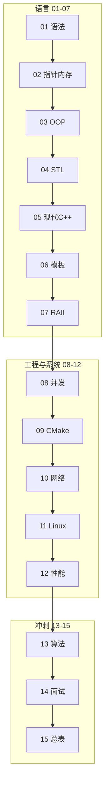

# C++ 学习路线图与说明

> **文件编码**：本文件夹内所有 `.md` 均为 **UTF-8**。C++ 源文件（`.cpp`/`.h`）建议 UTF-8；MSVC 项目可在「高级保存选项」中确认编码。

---

## 1. 这套资料适合谁

- 想系统学习 **C++** 的大学生、竞赛选手或转行开发者
- 目标方向：**系统软件、高性能服务、游戏引擎、嵌入式、基础架构、算法面试**
- 已学 [Java](../Java/00-学习路线图与说明.md) / [Python](../Python/00-学习路线图与说明.md) 之一，想补「内存、性能、底层」的同学

**不适合**：

- 只想快速做 Web CRUD 业务后端（请优先 Java / Python 路线）
- 已精通 Modern C++ 并多年大型 C++ 项目经验（可直接看 13～15 查漏）

### 与 Java / Python 路线的关系

| 维度 | Java / Python 路线 | **C++ 路线（本文件夹）** |
|------|-------------------|-------------------------|
| 主战场 | Web 接口、业务系统 | 语言功底、系统性能、底层 |
| 内存 | GC / 解释器管理 | **手动 + RAII + 智能指针** |
| 并发 | 线程池 / asyncio | **std::thread、mutex、原子** |
| 工程 | Maven / pip / Spring / FastAPI | **CMake、头文件、编译链接** |
| 数据库 | 主线含 MySQL/Redis | 网络/系统章提及，**非主线** |
| 就业 | 互联网业务后端为主 | 游戏、音视频、量化、OS、嵌入式、基建 |

三条路线**互补**：业务 Web 选 Java 或 Python；要懂「程序在机器上怎么跑」、刷算法手撕、面游戏/系统岗，**加 C++ 或以其为主**。

---

## 2. 技术栈主线（本资料默认路线）

```text
C++ 基础语法与类型
  → 指针、引用、内存模型
  → 面向对象（类、继承、多态）
  → STL 容器与算法
  → 现代 C++（智能指针、移动语义、lambda）
  → 模板与泛型
  → 异常、RAII、资源管理
  → 多线程与并发
  → CMake 与工程化
  → 网络编程与简易 HTTP 服务
  → Linux 与系统编程入门
  → 性能分析与调试
  → 项目实战 + 算法 + 面试
```

与 [计算机网络 01～04](../../前端学习/计算机网络/01-网络分层与通信基础.md) 的关系：10 章 socket/HTTP 会用到 TCP/IP 概念；计网系列偏原理与面试，C++ 10 章偏**代码实现**。

---

## 3. 学习顺序（按编号）

```text
00 学习路线图（你现在在这里）
 ↓
01 C++ 基础语法与数据类型
 ↓
02 指针、引用与内存管理
 ↓
03 面向对象与类设计
 ↓
04 STL 标准库容器与算法
 ↓
05 现代 C++ 新特性
 ↓
06 模板与泛型编程
 ↓
07 异常处理与 RAII
 ↓
08 多线程与并发编程
 ↓
09 CMake 与项目工程化
 ↓
10 网络编程与简易 HTTP 服务
 ↓
11 Linux 与系统编程入门
 ↓
12 性能分析与调试
 ↓
13 算法与数据结构（C++ 实现）
 ↓
14 高频面试专题与场景题
 ↓
15 补充知识点总表（复习索引）
```

### 阶段目标

| 阶段 | 文档 | 目标 |
|------|------|------|
| 语言 | 01~03 | 能写 C++，懂类型、指针、OOP |
| 标准库 | 04~05 | 会用 vector/map，懂智能指针与移动 |
| 进阶语言 | 06~07 | 模板、异常、RAII |
| 并发与工程 | 08~09 | 线程安全、CMake 多文件项目 |
| 系统 | 10~12 | socket、Linux 基础、perf/调试 |
| 冲刺 | 13~15 | 刷题、面试、知识地图 |

---

## 3.1 各章衔接索引

| 编号 | 上一章产出 | 本章解决什么 |
|------|------------|--------------|
| 01 | 00 路线图 | 第一个 C++ 程序，基本类型与流程控制 |
| 02 | 01 能写基础代码 | 指针/引用、栈堆、内存泄漏入门 |
| 03 | 02 懂内存 | 类、构造/析构、继承、多态 |
| 04 | 03 OOP | vector、map、算法库，日常开发主力 |
| 05 | 04 STL | unique_ptr、move、auto、lambda |
| 06 | 05 现代语法 | 函数模板、类模板、SFINAE 入门 |
| 07 | 06 模板 | try/catch、RAII、资源安全 |
| 08 | 07 RAII | thread、mutex、atomic、死锁 |
| 09 | 08 并发 demo | CMake 组织多文件、链接第三方库 |
| 10 | 09 工程能编译 | TCP socket、简易 HTTP 响应 |
| 11 | 10 网络 | 文件 IO、进程、信号入门 |
| 12 | 11 系统 | gprof、Valgrind、编译优化入门 |
| 13 | 12 能调性能 | LeetCode 风格题 + STL 手撕 |
| 14 | 13 算法 | 内存/虚函数/STL/并发面试题 |
| 15 | 01～14 过完 | 复习索引 |

---

## 3.2 demo 项目演进（09～12 共用）

```text
09 章  hello-cmake（多文件 + 静态库）
  ↓
10 章  mini-http（单线程 TCP echo → 返回 HTTP 200）
  ↓
11 章  + 日志写文件、简单配置读取
  ↓
12 章  压测、修复内存泄漏、优化热点
  ↓
13～14  算法/面试与项目结合讲解
```

各章「手把手」入口：01-3.1、09-2.1、10-3.1、12-2.1。

---

## 3.3 资料加强进度

| 编号 | 文件名 | 加强状态 | 重点增补 |
|------|--------|----------|----------|
| 00 | 学习路线图与说明 | ✅ 已加强 | FAQ、Java 对照、环境验证 |
| 01 | 基础语法与数据类型 | ✅ 已加强 | 多文件编译、enum class、游戏/交易案例 |
| 02 | 指针引用与内存管理 | ✅ 已加强 | const 规则表、22 行报错、GDB/VS 调试 |
| 03 | 面向对象与类设计 | ✅ 已加强 | 切片、Rule of Three 预告、完整 OOP 练习 |
| 04 | STL 容器与算法 | ✅ 已加强 | 迭代器五分类、复杂度表、20 行报错 |
| 05 | 现代 C++ 新特性 | ✅ 已加强 | Rule of Zero/Five/Six、18 行报错 |
| 06 | 模板与泛型编程 | ✅ 已加强 | SFINAE、Concepts 预览 |
| 07 | 异常与 RAII | ✅ 已加强 | 异常安全四级、21 行报错 |
| 08 | 多线程与并发 | ✅ 已加强 | 线程池完整代码、Java 03 对照 |
| 09 | CMake 与工程化 | ✅ 已加强 | FetchContent、mini-http CMake |
| 10 | 网络编程与 HTTP | ✅ 已加强 | mini-http 全源码、HTTP 解析 |
| 11 | Linux 与系统编程 | ✅ 已加强 | WSL2、信号优雅退出 |
| 12 | 性能分析与调试 | ✅ 已加强 | wrk、ASan/TSan、火焰图 |
| 13 | 算法与数据结构 | ✅ 已加强 | LRU/堆/并查集模板 |
| 14 | 面试专题 | ✅ 已加强 | Q1～Q47、STAR 场景 |
| 15 | 补充知识点总表 | ✅ 已加强 | 加强进度列、一周复习 |

**可编译示例**：[examples/](examples/README.md)（hello-cmake、mini-http、algorithm-templates）

---

## 4. 必备环境与工具

### 4.1 编译器与标准

- 推荐 **C++17**（本资料默认）；部分示例用到 C++20
- Windows 三选一（任选其一即可）：

| 方案 | 说明 |
|------|------|
| **Visual Studio 2022** | 装「使用 C++ 的桌面开发」，MSVC，新手友好 |
| **MSYS2 + g++** | `pacman -S mingw-w64-ucrt-x86_64-gcc cmake` |
| **WSL2 + g++** | 与 Linux 环境一致，11 章更顺 |

验证（g++）：

```powershell
g++ --version
# 预期：g++ (Rev...) 13.x 或更高

g++ -std=c++17 -o hello hello.cpp
./hello
# 或 Windows: .\hello.exe
```

验证（MSVC，Developer Command Prompt）：

```powershell
cl /EHsc /std:c++17 hello.cpp
hello.exe
```

### 4.2 IDE / 编辑器

- **Visual Studio** / **VS Code + C/C++ 扩展** / **CLion**（Community 可试用）
- 必会：编译运行、断点调试、看调用栈、看变量内存地址

### 4.3 构建工具

- **CMake** 3.16+（09 章主线）
- 09 章前可用单文件 `g++ main.cpp -o app` 编译

### 4.4 调试与分析（12 章）

| 工具 | 平台 | 用途 |
|------|------|------|
| GDB / VS 调试器 | 全平台 | 断点、单步 |
| Valgrind | Linux/WSL | 内存泄漏 |
| perf / VTune | Linux / VS | 热点分析 |

### 4.5 Git

与 [Git 系列](../../前端学习/Git/00-学习路线图与说明.md) 相同：项目从 09 章起 `git init`，CMake 项目纳入版本管理。

---

## 5. 推荐学习四步法

1. **通读**：本章解决什么问题？和上一章什么关系？
2. **敲代码**：每个示例完整编译运行，不要只读
3. **做练习**：至少完成基础档，挑战档选做
4. **复述**：合上书，讲指针/虚函数/STL 区别

---

## 5.1 分级练习总表

| 章节 | 基础 | 进阶 | 挑战 | 答案位置 |
|------|------|------|------|----------|
| 01 | 计算器 | 成绩判断 | 简单菜单 | 01 篇 §参考答案 |
| 02 | 数组指针遍历 | 动态数组 | 字符串拷贝 | 02 篇 §参考答案 |
| 03 | Rectangle 类 | 继承 Shape | 多态计算器 | 03 篇 §参考答案 |
| 04 | vector 统计 | map 词频 | 排序去重 | 04 篇 §参考答案 |
| 08 | 线程打印 | 线程安全队列 | 生产者消费者 | 08 篇 §参考答案 |
| 09 | 多文件 CMake | 链接静态库 | FetchContent | 09 篇 §参考答案 |
| 10 | TCP echo | HTTP 200 | 多客户端 select | 10 篇 §参考答案 |
| 13 | 数组 Easy | 链表 Medium | 二叉树 | 13 篇题单 |

---

## 6. 学习时间参考（每天 2～3 小时）

| 文档 | 建议天数 | 说明 |
|------|----------|------|
| 01 | 5~7 天 | 语法比 Python 啰嗦，多敲 |
| 02 | 7~10 天 | **难点**，慢下来 |
| 03 | 5~7 天 | 对照 Java OOP |
| 04 | 5~7 天 | STL 每日写 |
| 05~07 | 各 4~6 天 | 现代 C++ + 模板 |
| 08 | 5~7 天 | 死锁、竞态多实验 |
| 09~10 | 各 5~7 天 | 工程 + 网络 |
| 11~12 | 各 4~6 天 | 建议 WSL/Linux |
| 13~14 | 持续 | 面试前反复 |

**全程约 4~6 个月**（含 mini-http 项目）。02、08 是两大坎。

---

## 7. 练手项目建议

### 方案 A：mini-http（推荐，10～12 章）

- TCP 监听、解析 GET、返回 JSON/HTML
- 多线程或 thread pool 版（08 章延伸）
- CMake 构建 + README

### 方案 B：命令行 TODO 管理器

- vector 存任务、文件持久化
- 练 STL + 文件 IO + 类设计

### 方案 C：LeetCode 题集 + 模板库

- 13 章：手写链表、树、堆、并查集模板
- 面试直接复用

---

## 8. 学完后你应该能做哪些事

- [ ] 独立用 CMake 构建多文件 C++17 项目
- [ ] 解释栈/堆、指针与引用、虚函数表（概念级）
- [ ] 熟练使用 vector、map、string 与常用算法
- [ ] 用 unique_ptr/shared_ptr 管理资源，避免明显泄漏
- [ ] 写线程安全队列或简单线程池
- [ ] 实现简易 TCP/HTTP 服务端
- [ ] 用 STL 手撕中等难度算法题
- [ ] 回答 C++ 内存、虚函数、移动语义、mutex 面试题

---

## 9. 常见问题 FAQ

### Q1：C++ 和 Java/Python 必须都学吗？

不必须。**Web 业务后端**选 Java 或 Python；**系统/游戏/算法/性能**加 C++。时间有限可「Python/Java + C++ 基础（01～05）」。

### Q2：学 C++11 还是 C++17/20？

本路线以 **C++17** 为主，05 章介绍 11/14/17/20 关键特性。面试以 11 之后语义为准。

### Q3：Windows 还是 Linux？

01～09 Windows 足够。10～12 **建议 WSL2 或 Linux 虚拟机**，与生产环境一致。

### Q4：指针章太痛苦怎么办？

正常。02 章可拆成两周：先指针算术 + 堆分配，再引用 + const。配合调试器看地址。

### Q5：和「后端学习」其他路线怎么配合？

- 计网 01～04：理解 socket/HTTP
- Java 03 / Python 03：并发概念互参
- 不做 Spring/FastAPI 式联调；mini-http 可与浏览器/ curl 测

### Q6：01～03 章大概要多久？能跳过吗？

**不建议跳过**。01 约 5～7 天、02 约 7～10 天、03 约 5～7 天。02 是整条路线最大瓶颈；若赶时间，01 可压缩到 3 天（只练编译 + 类型 + 循环），但 02 至少留 **10 小时有效编码**。

### Q7：学完 01～03 能找 C++ 工作吗？

能写语法和 OOP，但离工程岗还差 STL（04）、现代 C++（05）、并发（08）、CMake（09）。01～03 对应「语言入门 + 内存模型 + 类设计」——面试必问，不等于能独立交付项目。

### Q8：MSYS2 和 Visual Studio 选哪个？

| 场景 | 推荐 |
|------|------|
| 纯 Windows、喜欢图形界面调试 | **Visual Studio 2022** |
| 想与 Linux 命令一致、11 章 WSL 过渡 | **MSYS2 g++** 或 **WSL2** |
| 学校 OJ / LeetCode 本地 g++ | MSYS2 或 WSL |

两条工具链**都练**：01 章 hello 用 g++ 跑通一遍，再用 VS 建空项目跑一遍，避免只会一种环境。

---

## 9.1 深入：01～03 章在真实项目里对应什么

### 游戏引擎（Unreal / 自研）

| 章节 | 落地场景 |
|------|----------|
| 01 类型与循环 | 帧循环、组件 tick、配置表解析 |
| 02 指针/内存 | `AActor*`、资源句柄、GPU 上传缓冲区的堆分配 |
| 03 OOP/多态 | `UObject` 继承树、虚函数调度渲染/物理子系统 |

引擎岗面试常问：栈上局部变量生命周期、为什么基类析构要 `virtual`、浅拷贝导致双重释放——全部来自 02～03。

### 交易系统 / 量化

| 章节 | 落地场景 |
|------|----------|
| 01 `long long`、溢出 | 订单 ID、纳秒时间戳、成交量累加 |
| 02 连续内存 | Order Book 价格档位数组、环形缓冲区 |
| 03 封装 | `Order` / `Trade` 领域类，策略接口多态 |

低延迟路径会避免多余堆分配（02 章栈 vs 堆直觉），05 章 `move` 后会更清晰。

### 与 Java / Python 路线并行时怎么排课

```text
Week 1-2   C++ 01 + 对照 Java 01 变量/流程控制
Week 3-4   C++ 02（慢）+ Java 02 集合（穿插换脑）
Week 5     C++ 03 + 重读 Java 01 OOP 继承多态小节
Week 6+    C++ 04 STL，Java 03 并发概念互参
```

---

## 9.2 深入：Java vs C++ 学习心智对照

| 你在 Java 里习惯的 | 到 C++ 要改的习惯 |
|-------------------|------------------|
| `new` 后不用管释放 | 配对 `delete` 或 05 章 `unique_ptr` |
| 对象参数「自动引用」 | 大对象用 `const T&`，要改调用方用 `T&` |
| `ArrayList` 随处可用 | 04 章前先用数组 + 02 章动态分配练手 |
| 异常成本低 | 07 章前少依赖异常做流程控制 |
| `interface` 关键字 | 纯虚类 `class IService { virtual void f() = 0; };` |
| 单文件 `main` 在类里 | 全局 `int main()`，类不必包裹入口 |

详见 [Java 01](../Java/01-Java基础语法与面向对象.md) 与 [Python 01](../Python/01-Python基础语法与面向对象.md) 的 OOP 章节，03 章会逐条对照。

---

## 9.3 手把手：验证 01～03 学习环境（完整输出）

在空目录创建 `env_check.cpp`：

```cpp
#include <iostream>

int main() {
    std::cout << "C++17 OK\n";
    std::cout << "sizeof(void*)=" << sizeof(void*) << '\n';
    return 0;
}
```

**g++（MSYS2 / WSL）**：

```powershell
g++ --version
# 预期首行含 g++ (GCC) 13.x 或 12.x

g++ -std=c++17 -Wall -Wextra -o env_check env_check.cpp
./env_check
# 预期输出：
# C++17 OK
# sizeof(void*)=8
```

**MSVC（Developer Command Prompt）**：

```powershell
cl /EHsc /std:c++17 /W4 /utf-8 env_check.cpp
env_check.exe
# 预期输出：
# C++17 OK
# sizeof(void*)=8
```

若 `sizeof(void*)=4`，说明用了 32 位工具链——建议换 64 位 MinGW 或 x64 Native Tools Command Prompt。

---

## 9.4 01～03 章通关检查清单

完成下列项再进入 04 章：

- [ ] 01：独立编译多文件 `g++ main.cpp util.cpp -o app`
- [ ] 01：解释 `int` 溢出与 `2.0` 避免整数除法
- [ ] 02：不看资料写出 `new[]` / `delete[]` 配对示例
- [ ] 02：调试器里读出栈变量与 `new` 返回地址
- [ ] 02：口述悬空指针、泄漏、双重释放各一种成因
- [ ] 03：实现 `Shape` + 两种派生类 + `vector<unique_ptr<Shape>>`
- [ ] 03：解释 object slicing 与 virtual 析构

---

## 10. 文档索引速查

| 编号 | 文件名 | 一句话 |
|------|--------|--------|
| 00 | 学习路线图与说明 | 顺序、环境、定位 |
| 01 | 基础语法与数据类型 | 入门 |
| 02 | 指针引用与内存管理 | 核心难点 |
| 03 | 面向对象与类设计 | OOP |
| 04 | STL 容器与算法 | 日常开发 |
| 05 | 现代 C++ 新特性 | 智能指针/move |
| 06 | 模板与泛型编程 | 泛型 |
| 07 | 异常与 RAII | 资源安全 |
| 08 | 多线程与并发 | 并行 |
| 09 | CMake 与工程化 | 构建 |
| 10 | 网络编程与 HTTP | socket |
| 11 | Linux 与系统编程 | 系统调用 |
| 12 | 性能分析与调试 | 优化 |
| 13 | 算法与数据结构 | 刷题 |
| 14 | 面试专题 | 巩固 |
| 15 | 补充知识点总表 | 索引 |

---

## 11. 学习路径总览



---

## 12. 我的笔记区

```text
学习开始日期：
当前进度（编号）：
薄弱点（如指针/模板/虚函数）：
练手项目选题：
下周计划：
```

---

祝你学习顺利。**C++ 的核心 = 类型系统 + 内存语义 + STL + 现代特性 + 能编译运行的工程习惯。**
