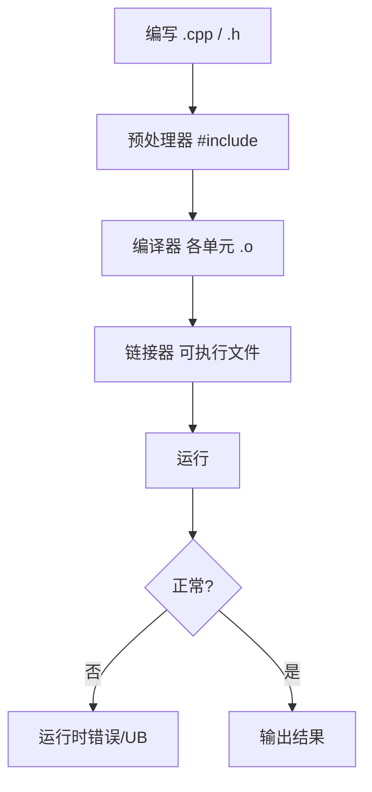

# C++ 基础语法与数据类型

## 本章与上一章的关系

00 路线图告诉你「学什么、按什么顺序、用什么工具」——这一章是正式出发的第一步。

C++ 是一门**编译型、静态类型、多范式**语言：既要写业务逻辑，又要自己管好类型和内存（02 章深入）。本章目标：能在本机编译运行第一个程序，掌握基本类型、流程控制、函数与数组，为指针和 OOP 打地基。

---

## 1. 这份文档学什么

学完这一份，你应该能做到：

- 看懂并写出基础 C++ 代码（C++17）
- 理解 `#include`、`main`、命名空间、基本类型
- 使用 `if/for/while`、函数、数组
- 用 g++ 或 MSVC 编译运行单文件程序

---

## 2. C++ 是什么

C++ 由 C 语言发展而来，特点：

- **性能高**：编译为机器码，无 GC 开销
- **控制力强**：能直接操作内存（02 章）
- **应用广**：游戏引擎（Unreal）、浏览器（Chrome）、数据库、交易系统、嵌入式

与 [Java](../Java/01-Java基础语法与面向对象.md) / [Python](../Python/01-Python基础语法与面向对象.md) 对照：

| 概念 | Java | Python | C++ |
|------|------|--------|-----|
| 类型 | 静态，必须声明 | 动态 | **静态，必须声明** |
| 内存 | GC | 解释器 | **手动 + RAII（05 章）** |
| 入口 | `main` in class | `if __name__` | **`int main()`** |
| 编译 | `.java` → `.class` | 解释执行 | **`.cpp` → 可执行文件** |

---

## 3. 第一个 C++ 程序

```cpp
#include <iostream>

int main() {
    std::cout << "Hello C++" << std::endl;
    return 0;
}
```

- `#include <iostream>` 引入输入输出库
- `std::cout` 输出到控制台
- `<<` 流插入运算符
- `return 0` 表示程序正常退出

---

## 3.1 手把手：编译并运行

### 方案 A：g++（MSYS2 / MinGW / WSL）

```powershell
# 在含 main.cpp 的目录
g++ -std=c++17 -Wall -Wextra -o hello main.cpp
.\hello.exe
# 预期输出：
# Hello C++
```

### 方案 B：Visual Studio

1. **文件 → 新建 → 项目 → 空项目**
2. 添加 `main.cpp`，粘贴代码
3. 项目属性 → C/C++ → **语言标准：ISO C++17**
4. **Ctrl+F5** 运行

### 方案 C：VS Code

安装 C/C++ 扩展，配置 `tasks.json` 调用 g++，F5 调试。

### 故意制造编译错误

```cpp
std::cout << "Hello C++"   // 漏分号
```

```text
# g++ 预期报错：
error: expected ';' before '}' token
```

---

## 4. 基本数据类型

```cpp
#include <iostream>
#include <string>

int main() {
    int age = 18;
    long long big = 1'000'000'000LL;  // C++14 数字分隔符
    double price = 99.9;
    char grade = 'A';
    bool ok = true;
    std::string name = "Tom";

    std::cout << sizeof(int) << " " << sizeof(double) << std::endl;
    // 典型 64 位 Windows：4 8
    return 0;
}
```

| 类型 | 说明 | 示例 |
|------|------|------|
| `int` | 整数 | `42` |
| `long long` | 64 位整数 | `1LL` |
| `double` | 双精度浮点 | `3.14` |
| `char` | 单字符 | `'A'` |
| `bool` | 布尔 | `true` / `false` |
| `std::string` | 字符串 | `"hello"` |

### 4.1 深入：整数溢出

```cpp
int x = 2147483647;
x = x + 1;  // 溢出，未定义行为（UB）
```

金融、计数场景用 `long long` 或更大类型，并做范围检查。

### 4.2 const 与 auto（C++11）

```cpp
const int MAX = 100;
auto count = 42;        // 推断为 int
auto pi = 3.14;         // double
// auto 不能用于函数参数（05 章详讲）
```

---

## 5. 变量与命名空间

```cpp
#include <iostream>

int value = 10;  // 全局变量（尽量少用）

int main() {
    int value = 20;  // 局部变量，遮蔽全局
    std::cout << value << std::endl;  // 20

    int x{42};       // 列表初始化（C++11），推荐
    int y = 42;      // 拷贝初始化
    return 0;
}
```

```cpp
namespace app {
    void greet() {
        std::cout << "Hello from app" << std::endl;
    }
}

int main() {
    app::greet();
    using namespace app;  // 小范围可用，头文件里避免 using namespace std
    greet();
    return 0;
}
```

---

## 6. 运算符

```cpp
int a = 10, b = 3;
std::cout << a + b << " " << a / b << " " << a % b << std::endl;
// 13 3 1   注意：整数除法截断

a += 1;
++a;
bool eq = (a == b);
```

逻辑：`&&` `||` `!`  
比较：`==` `!=` `<` `>`  
位运算（11 章系统编程会用到）：`&` `|` `^` `<<` `>>`

---

## 7. 流程控制

### 7.1 if / else

```cpp
int score = 85;
if (score >= 90) {
    std::cout << "优秀\n";
} else if (score >= 60) {
    std::cout << "及格\n";
} else {
    std::cout << "不及格\n";
}
```

C++17 `if` 初始化语句：

```cpp
if (int s = getScore(); s >= 60) {
    std::cout << "pass " << s << std::endl;
}
```

### 7.2 switch

```cpp
char op = '+';
switch (op) {
    case '+': std::cout << "加\n"; break;
    case '-': std::cout << "减\n"; break;
    default:  std::cout << "未知\n";
}
```

### 7.3 for / while

```cpp
for (int i = 0; i < 5; ++i) {
    std::cout << i << " ";
}
// 0 1 2 3 4

// 范围 for（C++11，04 章 STL 常用）
int arr[] = {1, 2, 3};
for (int n : arr) {
    std::cout << n << " ";
}
```

```cpp
int n = 0;
while (n < 3) {
    std::cout << n++;
}
```

### 7.4 break / continue

与 Java 相同：跳出循环 / 跳过本次迭代。

---

## 8. 函数

```cpp
#include <iostream>

int add(int a, int b) {
    return a + b;
}

double average(int a, int b) {
    return (a + b) / 2.0;  // 2.0 避免整数除法
}

// 默认参数（从右向左填）
void logMsg(const std::string& msg, int level = 0) {
    std::cout << "[" << level << "] " << msg << std::endl;
}

// 函数声明与定义分离（多文件项目 09 章）
int multiply(int, int);

int main() {
    std::cout << add(1, 2) << std::endl;
    logMsg("started");
    logMsg("warn", 1);
    return 0;
}

int multiply(int a, int b) {
    return a * b;
}
```

### 8.1 值传递 vs 引用（预告）

```cpp
void byValue(int x) { x = 100; }
void byRef(int& x) { x = 100; }

int main() {
    int n = 1;
    byValue(n);  // n 仍为 1
    byRef(n);    // n 变为 100
    return 0;
}
```

引用细节在 **02 章**系统讲。

### 8.2 inline 与头文件

小函数可 `inline` 放头文件，避免链接错误（06/09 章）。

---

## 9. 数组与 C 风格字符串

```cpp
#include <iostream>
#include <string>

int main() {
    int nums[5] = {1, 2, 3, 4, 5};
    std::cout << nums[0] << " size=" << sizeof(nums)/sizeof(nums[0]) << std::endl;

    // C 风格字符串：以 '\0' 结尾
    char buf[] = "hello";
    std::cout << buf << std::endl;

    // 推荐：std::string
    std::string s = "hello";
    s += " world";
    std::cout << s.size() << " " << s << std::endl;
    return 0;
}
```

**日常优先 `std::string` 和 `std::vector`（04 章）**，少手写 C 数组。

---

## 10. 输入输出

```cpp
#include <iostream>
#include <string>

int main() {
    int age;
    std::string name;
    std::cout << "请输入姓名和年龄：";
    std::cin >> name >> age;
    std::cout << "你好，" << name << "，" << age << " 岁\n";
    return 0;
}
```

格式化（C++20 起推荐 `<format>`，C++17 可用 iomanip）：

```cpp
#include <iomanip>
double pi = 3.1415926;
std::cout << std::fixed << std::setprecision(2) << pi << std::endl;  // 3.14
```

---

## 11. 头文件与多文件预告

```cpp
// math_utils.h
#pragma once
int add(int a, int b);

// math_utils.cpp
#include "math_utils.h"
int add(int a, int b) { return a + b; }

// main.cpp
#include "math_utils.h"
#include <iostream>
int main() {
    std::cout << add(1, 2) << std::endl;
    return 0;
}
```

编译：

```powershell
g++ -std=c++17 -o app main.cpp math_utils.cpp
```

09 章用 CMake 管理。

---

## 12. 程序结构概览



---

## 13. 常见报错与排查

| 报错 | 原因 | 解决 |
|------|------|------|
| `'g++' 不是内部或外部命令` | 未装 MinGW/MSYS2 或未加 PATH | 安装并配置环境变量 |
| `iostream: No such file` | 编译器/标准库未装好 | 重装工具链 |
| `expected ';'` | 漏分号 | 看报错行号 |
| `was not declared in this scope` | 未声明变量/未 include | 检查拼写与头文件 |
| `'cout' is not a member of 'std'` | 漏 `#include <iostream>` 或漏 `std::` | 补头文件或 using |
| `undefined reference to main` | 无 main 或链接错文件 | 确保有 `int main()` |
| `multiple definition of` | 头文件里定义函数未 inline | 声明放 .h，定义放 .cpp |
| 中文乱码 | 源文件/控制台编码不一致 | 源文件 UTF-8；MSVC `/utf-8` |
| `warning: unused variable` | 变量未使用 | 删掉或 `(void)x` |
| 整数除法结果为 0 | `1/2` 整数除法 | 改用 `1.0/2` 或 cast |

MSVC 中文支持：

```powershell
cl /EHsc /std:c++17 /utf-8 main.cpp
```

---

## 14. 练习建议

### 基础

1. 读入两个整数，输出和、差、积、商
2. 判断闰年
3. 打印九九乘法表

### 进阶

4. 函数 `grade(int score)` 返回 A/B/C/D
5. 猜数字游戏（随机数 + 循环）
6. 把函数拆到 `utils.h` / `utils.cpp` 编译链接

### 挑战

7. 简单计算器：循环读 op 和两数，直到 q 退出
8. 统计一行英文句子中元音字母个数

---

## 15. 分级练习参考答案

### 基础：闰年

```cpp
bool isLeap(int year) {
    if (year % 400 == 0) return true;
    if (year % 100 == 0) return false;
    return year % 4 == 0;
}
```

### 进阶：成绩等级

```cpp
#include <string>

std::string grade(int score) {
    if (score < 0 || score > 100) return "无效";
    if (score >= 90) return "A";
    if (score >= 80) return "B";
    if (score >= 60) return "C";
    return "D";
}
```

### 挑战：简单计算器

```cpp
#include <iostream>
#include <string>

int main() {
    std::string op;
    while (std::cin >> op && op != "q") {
        double a, b;
        std::cin >> a >> b;
        if (op == "+") std::cout << a + b << "\n";
        else if (op == "-") std::cout << a - b << "\n";
        else if (op == "*") std::cout << a * b << "\n";
        else if (op == "/" && b != 0) std::cout << a / b << "\n";
        else std::cout << "错误\n";
    }
    return 0;
}
```

---

## 16. 学完标准

- [ ] 能独立编译运行单文件 C++17 程序
- [ ] 熟练使用基本类型、`std::string`、流程控制
- [ ] 能写带参数和返回值的函数
- [ ] 理解 `#include`、命名空间、`const`、`auto` 初识
- [ ] 知道数组与 `std::string` 的区别（vector 04 章）
- [ ] 看到常见编译错误能根据行号排查

---

## 17. 深入：交易系统中的类型选择

撮合与风控代码对**整数溢出**极其敏感。Java 用 `long`，Python 整数任意精度；C++ 必须自己选对类型：

```cpp
#include <cstdint>
#include <iostream>

int main() {
    // 订单 ID、合约代码内部编号 — 固定宽度，跨平台一致
    std::int64_t order_id = 9'007'199'254'740'992LL;
    std::int32_t price_ticks = 105000;  // 价格 * 10000 存整型，避免浮点误差

    // 纳秒时间戳
    std::int64_t ts_ns = 1'704'067'200'000'000'000LL;

    std::cout << "order=" << order_id << " price_ticks=" << price_ticks << '\n';
    return 0;
}
```

| 场景 | 推荐类型 | Java 对照 |
|------|----------|-----------|
| 计数、索引 | `std::size_t` | 无直接对应，注意负数 |
| 金额（分） | `std::int64_t` | `long` |
| 布尔标志 | `bool` | `boolean` |
| 文本 | `std::string` | `String` |

编译运行：

```powershell
g++ -std=c++17 -o types_demo types_demo.cpp && ./types_demo.exe
# 预期：
# order=9007199254740992 price_ticks=105000
```

---

## 18. 深入：游戏循环与固定宽度类型

游戏主循环每帧执行「输入 → 更新 → 渲染」。帧计数、实体 ID 常用 `<cstdint>`：

```cpp
#include <cstdint>
#include <iostream>

int main() {
    constexpr std::uint32_t kMaxEntities = 65535;
    std::uint32_t frame = 0;
    const double dt = 1.0 / 60.0;  // 秒，物理用 double

    while (frame < 3) {  // 演示只跑 3 帧
        // update(dt); render();
        std::cout << "frame=" << frame << " dt=" << dt << '\n';
        ++frame;
    }
    std::cout << "max entities cap=" << kMaxEntities << '\n';
    return 0;
}
```

```text
# 预期输出：
frame=0 dt=0.0166667
frame=1 dt=0.0166667
frame=2 dt=0.0166667
max entities cap=65535
```

与 [Python 01](../Python/01-Python基础语法与面向对象.md) 不同：C++ 循环里注意 `++i` 与迭代器习惯（04 章 STL 会大量出现）。

---

## 19. enum class 与结构化绑定（C++17 初识）

```cpp
#include <iostream>

enum class OrderSide { Buy, Sell };  // 强类型枚举，不隐式转 int

struct Tick {
    double price;
    int volume;
};

int main() {
    OrderSide side = OrderSide::Buy;
    Tick t{100.5, 200};
    auto [price, vol] = t;  // 结构化绑定
    std::cout << static_cast<int>(side) << ' ' << price << ' ' << vol << '\n';
    return 0;
}
```

Java 用 `enum OrderSide { BUY, SELL }`；C++17 `enum class` 作用域更清晰，避免命名污染。

---

## 20. 手把手：多文件计算器（完整流程）

### 目录结构

```text
calc-demo/
├── calc.h
├── calc.cpp
└── main.cpp
```

**calc.h**

```cpp
#pragma once
double add(double a, double b);
double sub(double a, double b);
```

**calc.cpp**

```cpp
#include "calc.h"
double add(double a, double b) { return a + b; }
double sub(double a, double b) { return a - b; }
```

**main.cpp**

```cpp
#include "calc.h"
#include <iostream>

int main() {
    std::cout << add(1.5, 2.5) << '\n';
    std::cout << sub(5, 3) << '\n';
    return 0;
}
```

```powershell
g++ -std=c++17 -Wall -Wextra -o calc main.cpp calc.cpp
./calc.exe
# 预期：
# 4
# 2
```

MSVC：

```powershell
cl /EHsc /std:c++17 /W4 /utf-8 main.cpp calc.cpp
calc.exe
```

若报错 `undefined reference to add`：说明只编译了 `main.cpp`，未链接 `calc.cpp`。

---

## 21. Java vs C++ 语法对照扩展表

| 特性 | Java | C++ |
|------|------|-----|
| 字符串 | `String s = "a";` | `std::string s = "a";` |
| 数组 | `int[] a = {1,2};` | `int a[] = {1, 2};` 或 04 章 `vector` |
| 比较字符串 | `s.equals("x")` | `s == "x"` 或 `s.compare("x")` |
| 打印 | `System.out.println` | `std::cout << ... << '\n';` |
| 随机数 | `Random` | `<random>`（本章可先 `rand()` 练手） |
| 主入口 | `public static void main` | `int main()` |
| 布尔 | `true/false` | `true/false` |
| null | `null` | 指针 `nullptr`（02 章） |

---

## 22. FAQ

**Q：C 和 C++ 要先学 C 吗？**  
不必。本路线直接 Modern C++，C 风格数组/指针在 02 章按需学。

**Q：`using namespace std;` 能用吗？**  
小练习可以；项目头文件里**不要**，避免命名污染。

**Q：和 C# 一样吗？**  
语法有些相似，但 C++ 无 GC，内存和模板是重点。

**Q：`std::endl` 和 `'\n'` 区别？**  
`endl` 会刷新缓冲区，调试日志可用；大量输出用 `'\n'` 更快。

**Q：为什么推荐 `int x{42}` 列表初始化？**  
能避免窄化转换（如 `int x = 3.14` 静默截断）；与 03 章类构造一致。

**Q：源文件必须是 `.cpp` 吗？**  
常见是 `.cpp` / `.cc` / `.cxx`；头文件 `.h` 或 `.hpp`。09 章 CMake 会统一约定。

**Q：和 Java 的 `final` 对应什么？**  
变量用 `const`；类不可继承用 `final class`（03 章）。

---

## 23. 分级练习补充参考答案

### 进阶：猜数字（完整可编译）

```cpp
#include <iostream>
#include <cstdlib>
#include <ctime>

int main() {
    std::srand(static_cast<unsigned>(std::time(nullptr)));
    const int secret = std::rand() % 100 + 1;
    int guess = 0, attempts = 0;

    std::cout << "猜 1～100 的数（0 退出）\n";
    while (true) {
        std::cout << "输入: ";
        if (!(std::cin >> guess)) break;
        if (guess == 0) break;
        ++attempts;
        if (guess < secret) std::cout << "太小\n";
        else if (guess > secret) std::cout << "太大\n";
        else {
            std::cout << "正确！用了 " << attempts << " 次\n";
            break;
        }
    }
    return 0;
}
```

### 挑战：统计元音字母

```cpp
#include <cctype>
#include <iostream>
#include <string>

bool isVowel(char c) {
    c = static_cast<char>(std::tolower(static_cast<unsigned char>(c)));
    return c == 'a' || c == 'e' || c == 'i' || c == 'o' || c == 'u';
}

int main() {
    std::string line;
    std::getline(std::cin, line);
    int count = 0;
    for (char c : line) {
        if (isVowel(c)) ++count;
    }
    std::cout << count << '\n';
    return 0;
}
```

输入 `Hello World` 预期输出 `3`。

---

## 下一章预告

01 章变量在栈上、函数传值拷贝——**内存到底长什么样？指针和引用是什么？** 02 章是 C++ 第一座大山：栈与堆、`new`/`delete`、内存泄漏与调试器看地址。啃下来，后面 OOP 和 STL 会顺很多。

---

*下一章：02 指针、引用与内存管理*
