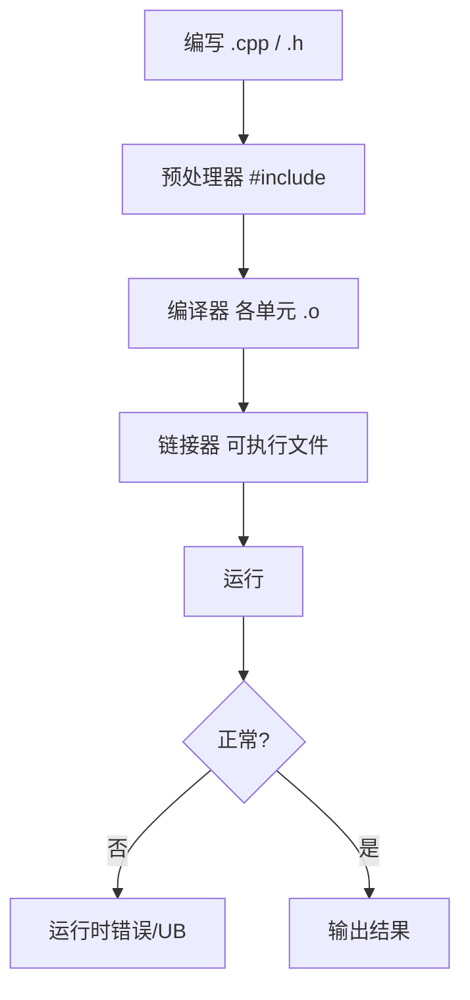

# C++ 基础语法与数据类型

---

## 0. 读前导读（零基础也能跟上）

### 0.1 用一句话弄懂本章

**C++ 基础语法** = 让编译器认识你的程序：类型、变量、循环、函数、数组——暂时还不碰「门牌号（指针）」，但会为 02 章内存打底。

### 0.2 你需要提前知道什么

- [00 章](00-学习路线图与说明.md) 环境已验证（`g++` 或 MSVC 能跑 Hello World）
- 会复制粘贴、会在终端 `cd` 到文件目录
- 若学过 [Java 01](../Java/01-Java基础语法与面向对象.md)：对照表在 §2、§21
- **真不会装编译器**：先完成 00 章 §9.3，再回本章

### 0.3 本章知识地图（☐→☑）

- [ ] 独立编译单文件与双文件程序（§3.1、§20）
- [ ] 说出 `int`/`double`/`bool`/`char` 用途与溢出直觉
- [ ] 写 `if/for/while`、函数、数组
- [ ] 使用 `enum class`、结构化绑定初识（§19）
- [ ] §24 闭卷自测 ≥8/10

### 0.4 建议学习时长

- 零基础：**5～7 天**（每天 2～3 小时，必须敲代码）
- 有 Java/Python 基础：**3～5 天**

### 0.5 学完你能做什么

闭卷写出「多文件计算器」编译命令；解释 `2/3` 与 `2.0/3` 的差别；为 02 章「门牌号」准备好类型与函数基础。

### 0.6 与数据结构系列的衔接

本章 C 风格数组是 [数据结构 02 数组](../数据结构/02-线性结构/01-数组.md) 的裸内存版；04 章 `vector` 会替代手写数组。先学本章类型与循环，再刷数据结构更顺。

---

## 本章与上一章的关系

00 路线图告诉你「学什么、按什么顺序、用什么工具」——这一章是正式出发的第一步。

C++ 是一门**编译型、静态类型、多范式**语言：既要写业务逻辑，又要自己管好类型和内存（02 章深入）。本章目标：能在本机编译运行第一个程序，掌握基本类型、流程控制、函数与数组，为指针和 OOP 打地基。

---

## 1. 这份文档学什么

学完这一份，你应该能做到：

- 看懂并写出基础 C++ 代码（C++17）
- 理解 `#include`、`main`、命名空间、基本类型
- 使用 `if/for/while`、函数、数组
- 用 g++ 或 MSVC 编译运行单文件程序

---

## 2. C++ 是什么

C++ 由 C 语言发展而来，特点：

- **性能高**：编译为机器码，无 GC 开销
- **控制力强**：能直接操作内存（02 章）
- **应用广**：游戏引擎（Unreal）、浏览器（Chrome）、数据库、交易系统、嵌入式

与 [Java](../Java/01-Java基础语法与面向对象.md) / [Python](../Python/01-Python基础语法与面向对象.md) 对照：

| 概念 | Java | Python | C++ |
|------|------|--------|-----|
| 类型 | 静态，必须声明 | 动态 | **静态，必须声明** |
| 内存 | GC | 解释器 | **手动 + RAII（05 章）** |
| 入口 | `main` in class | `if __name__` | **`int main()`** |
| 编译 | `.java` → `.class` | 解释执行 | **`.cpp` → 可执行文件** |

---

## 3. 第一个 C++ 程序

```cpp
#include <iostream>

int main() {
    std::cout << "Hello C++" << std::endl;
    return 0;
}
```

- `#include <iostream>` 引入输入输出库
- `std::cout` 输出到控制台
- `<<` 流插入运算符
- `return 0` 表示程序正常退出

---

## 3.1 手把手：编译并运行

### 方案 A：g++（MSYS2 / MinGW / WSL）

```powershell
# 在含 main.cpp 的目录
g++ -std=c++17 -Wall -Wextra -o hello main.cpp
.\hello.exe
# 预期输出：
# Hello C++
```

### 方案 B：Visual Studio

1. **文件 → 新建 → 项目 → 空项目**
2. 添加 `main.cpp`，粘贴代码
3. 项目属性 → C/C++ → **语言标准：ISO C++17**
4. **Ctrl+F5** 运行

### 方案 C：VS Code

安装 C/C++ 扩展，配置 `tasks.json` 调用 g++，F5 调试。

### 故意制造编译错误

```cpp
std::cout << "Hello C++"   // 漏分号
```

```text
# g++ 预期报错：
error: expected ';' before '}' token
```

---

## 4. 基本数据类型

```cpp
#include <iostream>
#include <string>

int main() {
    int age = 18;
    long long big = 1'000'000'000LL;  // C++14 数字分隔符
    double price = 99.9;
    char grade = 'A';
    bool ok = true;
    std::string name = "Tom";

    std::cout << sizeof(int) << " " << sizeof(double) << std::endl;
    // 典型 64 位 Windows：4 8
    return 0;
}
```

| 类型 | 说明 | 示例 |
|------|------|------|
| `int` | 整数 | `42` |
| `long long` | 64 位整数 | `1LL` |
| `double` | 双精度浮点 | `3.14` |
| `char` | 单字符 | `'A'` |
| `bool` | 布尔 | `true` / `false` |
| `std::string` | 字符串 | `"hello"` |

### 4.1 深入：整数溢出

```cpp
int x = 2147483647;
x = x + 1;  // 溢出，未定义行为（UB）
```

金融、计数场景用 `long long` 或更大类型，并做范围检查。

### 4.2 const 与 auto（C++11）

```cpp
const int MAX = 100;
auto count = 42;        // 推断为 int
auto pi = 3.14;         // double
// auto 不能用于函数参数（05 章详讲）
```

---

## 5. 变量与命名空间

```cpp
#include <iostream>

int value = 10;  // 全局变量（尽量少用）

int main() {
    int value = 20;  // 局部变量，遮蔽全局
    std::cout << value << std::endl;  // 20

    int x{42};       // 列表初始化（C++11），推荐
    int y = 42;      // 拷贝初始化
    return 0;
}
```

```cpp
namespace app {
    void greet() {
        std::cout << "Hello from app" << std::endl;
    }
}

int main() {
    app::greet();
    using namespace app;  // 小范围可用，头文件里避免 using namespace std
    greet();
    return 0;
}
```

---

## 6. 运算符

```cpp
int a = 10, b = 3;
std::cout << a + b << " " << a / b << " " << a % b << std::endl;
// 13 3 1   注意：整数除法截断

a += 1;
++a;
bool eq = (a == b);
```

逻辑：`&&` `||` `!`  
比较：`==` `!=` `<` `>`  
位运算（11 章系统编程会用到）：`&` `|` `^` `<<` `>>`

---

## 7. 流程控制

### 7.1 if / else

```cpp
int score = 85;
if (score >= 90) {
    std::cout << "优秀\n";
} else if (score >= 60) {
    std::cout << "及格\n";
} else {
    std::cout << "不及格\n";
}
```

C++17 `if` 初始化语句：

```cpp
if (int s = getScore(); s >= 60) {
    std::cout << "pass " << s << std::endl;
}
```

### 7.2 switch

```cpp
char op = '+';
switch (op) {
    case '+': std::cout << "加\n"; break;
    case '-': std::cout << "减\n"; break;
    default:  std::cout << "未知\n";
}
```

### 7.3 for / while

```cpp
for (int i = 0; i < 5; ++i) {
    std::cout << i << " ";
}
// 0 1 2 3 4

// 范围 for（C++11，04 章 STL 常用）
int arr[] = {1, 2, 3};
for (int n : arr) {
    std::cout << n << " ";
}
```

```cpp
int n = 0;
while (n < 3) {
    std::cout << n++;
}
```

### 7.4 break / continue

与 Java 相同：跳出循环 / 跳过本次迭代。

---

## 8. 函数

```cpp
#include <iostream>

int add(int a, int b) {
    return a + b;
}

double average(int a, int b) {
    return (a + b) / 2.0;  // 2.0 避免整数除法
}

// 默认参数（从右向左填）
void logMsg(const std::string& msg, int level = 0) {
    std::cout << "[" << level << "] " << msg << std::endl;
}

// 函数声明与定义分离（多文件项目 09 章）
int multiply(int, int);

int main() {
    std::cout << add(1, 2) << std::endl;
    logMsg("started");
    logMsg("warn", 1);
    return 0;
}

int multiply(int a, int b) {
    return a * b;
}
```

### 8.1 值传递 vs 引用（预告）

```cpp
void byValue(int x) { x = 100; }
void byRef(int& x) { x = 100; }

int main() {
    int n = 1;
    byValue(n);  // n 仍为 1
    byRef(n);    // n 变为 100
    return 0;
}
```

引用细节在 **02 章**系统讲。

### 8.2 inline 与头文件

小函数可 `inline` 放头文件，避免链接错误（06/09 章）。

---

## 9. 数组与 C 风格字符串

```cpp
#include <iostream>
#include <string>

int main() {
    int nums[5] = {1, 2, 3, 4, 5};
    std::cout << nums[0] << " size=" << sizeof(nums)/sizeof(nums[0]) << std::endl;

    // C 风格字符串：以 '\0' 结尾
    char buf[] = "hello";
    std::cout << buf << std::endl;

    // 推荐：std::string
    std::string s = "hello";
    s += " world";
    std::cout << s.size() << " " << s << std::endl;
    return 0;
}
```

**日常优先 `std::string` 和 `std::vector`（04 章）**，少手写 C 数组。

---

## 10. 输入输出

```cpp
#include <iostream>
#include <string>

int main() {
    int age;
    std::string name;
    std::cout << "请输入姓名和年龄：";
    std::cin >> name >> age;
    std::cout << "你好，" << name << "，" << age << " 岁\n";
    return 0;
}
```

格式化（C++20 起推荐 `<format>`，C++17 可用 iomanip）：

```cpp
#include <iomanip>
double pi = 3.1415926;
std::cout << std::fixed << std::setprecision(2) << pi << std::endl;  // 3.14
```

---

## 11. 头文件与多文件预告

```cpp
// math_utils.h
#pragma once
int add(int a, int b);

// math_utils.cpp
#include "math_utils.h"
int add(int a, int b) { return a + b; }

// main.cpp
#include "math_utils.h"
#include <iostream>
int main() {
    std::cout << add(1, 2) << std::endl;
    return 0;
}
```

编译：

```powershell
g++ -std=c++17 -o app main.cpp math_utils.cpp
```

09 章用 CMake 管理。

---

## 12. 程序结构概览



---

## 13. 常见报错与排查

| 报错 | 原因 | 解决 |
|------|------|------|
| `'g++' 不是内部或外部命令` | 未装 MinGW/MSYS2 或未加 PATH | 安装并配置环境变量 |
| `iostream: No such file` | 编译器/标准库未装好 | 重装工具链 |
| `expected ';'` | 漏分号 | 看报错行号 |
| `was not declared in this scope` | 未声明变量/未 include | 检查拼写与头文件 |
| `'cout' is not a member of 'std'` | 漏 `#include <iostream>` 或漏 `std::` | 补头文件或 using |
| `undefined reference to main` | 无 main 或链接错文件 | 确保有 `int main()` |
| `multiple definition of` | 头文件里定义函数未 inline | 声明放 .h，定义放 .cpp |
| 中文乱码 | 源文件/控制台编码不一致 | 源文件 UTF-8；MSVC `/utf-8` |
| `warning: unused variable` | 变量未使用 | 删掉或 `(void)x` |
| 整数除法结果为 0 | `1/2` 整数除法 | 改用 `1.0/2` 或 cast |

MSVC 中文支持：

```powershell
cl /EHsc /std:c++17 /utf-8 main.cpp
```

---

## 14. 练习建议

### 基础

1. 读入两个整数，输出和、差、积、商
2. 判断闰年
3. 打印九九乘法表

### 进阶

4. 函数 `grade(int score)` 返回 A/B/C/D
5. 猜数字游戏（随机数 + 循环）
6. 把函数拆到 `utils.h` / `utils.cpp` 编译链接

### 挑战

7. 简单计算器：循环读 op 和两数，直到 q 退出
8. 统计一行英文句子中元音字母个数

---

## 15. 分级练习参考答案

### 基础：闰年

```cpp
bool isLeap(int year) {
    if (year % 400 == 0) return true;
    if (year % 100 == 0) return false;
    return year % 4 == 0;
}
```

### 进阶：成绩等级

```cpp
#include <string>

std::string grade(int score) {
    if (score < 0 || score > 100) return "无效";
    if (score >= 90) return "A";
    if (score >= 80) return "B";
    if (score >= 60) return "C";
    return "D";
}
```

### 挑战：简单计算器

```cpp
#include <iostream>
#include <string>

int main() {
    std::string op;
    while (std::cin >> op && op != "q") {
        double a, b;
        std::cin >> a >> b;
        if (op == "+") std::cout << a + b << "\n";
        else if (op == "-") std::cout << a - b << "\n";
        else if (op == "*") std::cout << a * b << "\n";
        else if (op == "/" && b != 0) std::cout << a / b << "\n";
        else std::cout << "错误\n";
    }
    return 0;
}
```

---

## 16. 学完标准

- [ ] 能独立编译运行单文件 C++17 程序
- [ ] 熟练使用基本类型、`std::string`、流程控制
- [ ] 能写带参数和返回值的函数
- [ ] 理解 `#include`、命名空间、`const`、`auto` 初识
- [ ] 知道数组与 `std::string` 的区别（vector 04 章）
- [ ] 看到常见编译错误能根据行号排查

---

## 17. 深入：交易系统中的类型选择

撮合与风控代码对**整数溢出**极其敏感。Java 用 `long`，Python 整数任意精度；C++ 必须自己选对类型：

```cpp
#include <cstdint>
#include <iostream>

int main() {
    // 订单 ID、合约代码内部编号 — 固定宽度，跨平台一致
    std::int64_t order_id = 9'007'199'254'740'992LL;
    std::int32_t price_ticks = 105000;  // 价格 * 10000 存整型，避免浮点误差

    // 纳秒时间戳
    std::int64_t ts_ns = 1'704'067'200'000'000'000LL;

    std::cout << "order=" << order_id << " price_ticks=" << price_ticks << '\n';
    return 0;
}
```

| 场景 | 推荐类型 | Java 对照 |
|------|----------|-----------|
| 计数、索引 | `std::size_t` | 无直接对应，注意负数 |
| 金额（分） | `std::int64_t` | `long` |
| 布尔标志 | `bool` | `boolean` |
| 文本 | `std::string` | `String` |

编译运行：

```powershell
g++ -std=c++17 -o types_demo types_demo.cpp && ./types_demo.exe
# 预期：
# order=9007199254740992 price_ticks=105000
```

---

## 18. 深入：游戏循环与固定宽度类型

游戏主循环每帧执行「输入 → 更新 → 渲染」。帧计数、实体 ID 常用 `<cstdint>`：

```cpp
#include <cstdint>
#include <iostream>

int main() {
    constexpr std::uint32_t kMaxEntities = 65535;
    std::uint32_t frame = 0;
    const double dt = 1.0 / 60.0;  // 秒，物理用 double

    while (frame < 3) {  // 演示只跑 3 帧
        // update(dt); render();
        std::cout << "frame=" << frame << " dt=" << dt << '\n';
        ++frame;
    }
    std::cout << "max entities cap=" << kMaxEntities << '\n';
    return 0;
}
```

```text
# 预期输出：
frame=0 dt=0.0166667
frame=1 dt=0.0166667
frame=2 dt=0.0166667
max entities cap=65535
```

与 [Python 01](../Python/01-Python基础语法与面向对象.md) 不同：C++ 循环里注意 `++i` 与迭代器习惯（04 章 STL 会大量出现）。

---

## 19. enum class 与结构化绑定（C++17 初识）

```cpp
#include <iostream>

enum class OrderSide { Buy, Sell };  // 强类型枚举，不隐式转 int

struct Tick {
    double price;
    int volume;
};

int main() {
    OrderSide side = OrderSide::Buy;
    Tick t{100.5, 200};
    auto [price, vol] = t;  // 结构化绑定
    std::cout << static_cast<int>(side) << ' ' << price << ' ' << vol << '\n';
    return 0;
}
```

Java 用 `enum OrderSide { BUY, SELL }`；C++17 `enum class` 作用域更清晰，避免命名污染。

---

## 20. 手把手：多文件计算器（完整流程）

### 目录结构

```text
calc-demo/
├── calc.h
├── calc.cpp
└── main.cpp
```

**calc.h**

```cpp
#pragma once
double add(double a, double b);
double sub(double a, double b);
```

**calc.cpp**

```cpp
#include "calc.h"
double add(double a, double b) { return a + b; }
double sub(double a, double b) { return a - b; }
```

**main.cpp**

```cpp
#include "calc.h"
#include <iostream>

int main() {
    std::cout << add(1.5, 2.5) << '\n';
    std::cout << sub(5, 3) << '\n';
    return 0;
}
```

```powershell
g++ -std=c++17 -Wall -Wextra -o calc main.cpp calc.cpp
./calc.exe
# 预期：
# 4
# 2
```

MSVC：

```powershell
cl /EHsc /std:c++17 /W4 /utf-8 main.cpp calc.cpp
calc.exe
```

若报错 `undefined reference to add`：说明只编译了 `main.cpp`，未链接 `calc.cpp`。

---

## 21. Java vs C++ 语法对照扩展表

| 特性 | Java | C++ |
|------|------|-----|
| 字符串 | `String s = "a";` | `std::string s = "a";` |
| 数组 | `int[] a = {1,2};` | `int a[] = {1, 2};` 或 04 章 `vector` |
| 比较字符串 | `s.equals("x")` | `s == "x"` 或 `s.compare("x")` |
| 打印 | `System.out.println` | `std::cout << ... << '\n';` |
| 随机数 | `Random` | `<random>`（本章可先 `rand()` 练手） |
| 主入口 | `public static void main` | `int main()` |
| 布尔 | `true/false` | `true/false` |
| null | `null` | 指针 `nullptr`（02 章） |

---

## 22. FAQ

**Q：C 和 C++ 要先学 C 吗？**  
不必。本路线直接 Modern C++，C 风格数组/指针在 02 章按需学。

**Q：`using namespace std;` 能用吗？**  
小练习可以；项目头文件里**不要**，避免命名污染。

**Q：和 C# 一样吗？**  
语法有些相似，但 C++ 无 GC，内存和模板是重点。

**Q：`std::endl` 和 `'\n'` 区别？**  
`endl` 会刷新缓冲区，调试日志可用；大量输出用 `'\n'` 更快。

**Q：为什么推荐 `int x{42}` 列表初始化？**  
能避免窄化转换（如 `int x = 3.14` 静默截断）；与 03 章类构造一致。

**Q：源文件必须是 `.cpp` 吗？**  
常见是 `.cpp` / `.cc` / `.cxx`；头文件 `.h` 或 `.hpp`。09 章 CMake 会统一约定。

**Q：和 Java 的 `final` 对应什么？**  
变量用 `const`；类不可继承用 `final class`（03 章）。

---

## 23. 分级练习补充参考答案

### 进阶：猜数字（完整可编译）

```cpp
#include <iostream>
#include <cstdlib>
#include <ctime>

int main() {
    std::srand(static_cast<unsigned>(std::time(nullptr)));
    const int secret = std::rand() % 100 + 1;
    int guess = 0, attempts = 0;

    std::cout << "猜 1～100 的数（0 退出）\n";
    while (true) {
        std::cout << "输入: ";
        if (!(std::cin >> guess)) break;
        if (guess == 0) break;
        ++attempts;
        if (guess < secret) std::cout << "太小\n";
        else if (guess > secret) std::cout << "太大\n";
        else {
            std::cout << "正确！用了 " << attempts << " 次\n";
            break;
        }
    }
    return 0;
}
```

### 挑战：统计元音字母

```cpp
#include <cctype>
#include <iostream>
#include <string>

bool isVowel(char c) {
    c = static_cast<char>(std::tolower(static_cast<unsigned char>(c)));
    return c == 'a' || c == 'e' || c == 'i' || c == 'o' || c == 'u';
}

int main() {
    std::string line;
    std::getline(std::cin, line);
    int count = 0;
    for (char c : line) {
        if (isVowel(c)) ++count;
    }
    std::cout << count << '\n';
    return 0;
}
```

输入 `Hello World` 预期输出 `3`。

---

## 24. 闭卷自测

1. C++ 是编译型还是解释型？产物是什么？
2. `int a = 3.14;` 与 `int a{3.14};` 谁更安全？为什么？
3. `2/3` 和 `2.0/3` 结果分别是什么？
4. 函数传值时，形参改变会影响实参吗？
5. C 风格字符串以什么字符结尾？长度怎么算？
6. `enum class` 比传统 `enum` 强在哪？
7. 多文件编译时 `undefined reference to add` 说明什么？
8. `using namespace std;` 为什么项目里不推荐在头文件用？
9. 与 Java 比，C++ 的 `main` 入口有什么特点？
10. 本章数组与 04 章 `vector`、02 章指针是什么递进关系？

<details>
<summary>自测参考答案</summary>

1. **编译型**；`.cpp` 经编译链接得到**可执行文件**。
2. **`int a{3.14}`** 列表初始化会**编译错误**（窄化）；`int a = 3.14` 静默截断为 3。
3. `2/3` → **0**（整数除法）；`2.0/3` → **0.666…**（浮点）。
4. **不会**；传值是副本。
5. **`'\0'`**；`strlen` 数到 `\0` 前（不含 `\0`）。
6. **作用域限定**，不会隐式转 int 污染命名空间。
7. 只编译了声明所在单元，**未链接**含定义的 `.cpp`。
8. 头文件被多处 include 时会造成**命名污染**与歧义。
9. 全局 **`int main()`**，不在类里；返回 0 表示成功。
10. 本章数组在栈上、定长；02 用**门牌号**操作堆数组；04 **标准工具箱** `vector` 自动扩容。

</details>

---

## 25. 费曼检验

3 分钟向朋友解释：「C++ 程序从写完到运行经过哪几步？和 Python 有什么不同？」

**提纲**：写 `.cpp` → 编译器翻译机器码 → 链接成 exe；Python 是解释逐行执行。C++ **无 GC**，类型在编译期检查，所以 01 章要把类型和流程写对。

---

## 26. 手把手步骤：第一次多文件编译（复查）

| 步骤 | 你的动作 | 预期看到什么 | 若不对 |
|------|----------|--------------|--------|
| 1 | 创建 `calc.h` 声明 `int add(int,int);` | 无编译（头文件不单独编） | 检查拼写 |
| 2 | 创建 `calc.cpp` 实现 add | — | — |
| 3 | `main.cpp` `#include "calc.h"` 并调用 | — | 用 `"calc.h"` 不是 `<calc.h>` |
| 4 | `g++ -std=c++17 -o calc main.cpp calc.cpp` | 生成 `calc.exe` | 见 §13 报错表 |
| 5 | 运行 `./calc.exe` | 输出预期结果 | 检查链接是否含 calc.cpp |

---

## 27. FAQ 补充

**Q：01 章要学指针吗？**  
只预告 `nullptr`；系统学**门牌号**在 [02 章](02-指针引用与内存管理.md)。

**Q：和 [数据结构 01](../数据结构/01-复杂度与基础/README.md) 怎么配合？**
可并行：01 章练语法，数据结构 01 练大 O 直觉；04 章后刷 [数据结构 02](../数据结构/02-线性结构/01-数组.md)。

**Q：游戏开发 01 章重点看什么？**  
§17 固定宽度类型、`float` 精度；帧循环里避免 `2/3` 式整数除法（见 §17、§18）。

---

## 28. 术语三件套（本章首次出现）

**术语（编译 Compilation）**：把 `.cpp` 源文件翻译成机器码的过程；链接把多个 `.o` 合成可执行文件。

**生活类比**：把中文说明书**翻译成**当地语言；链接像把「引擎章+车身章」装订成一本完整手册。

**为什么重要**：C++ 错误常在编译期暴露；01 章要把编译命令练成肌肉记忆。

**本章用到的地方**：§3.1、§20。

---

**术语（Static typing 静态类型）**：每个变量声明时确定类型，编译器检查不匹配。

**生活类比**：药柜格子贴标签——只能放指定类型，放错编译器就拦下。

**为什么重要**：与 Python 对比；02 章指针类型更严格。

**本章用到的地方**：§4、§21 对照 Java。

---

## 29. 逐行读：多文件计算器 main（>10 行）

```cpp
#include "calc.h"
#include <iostream>

int main() {
    int a, b;
    std::cin >> a >> b;
    std::cout << add(a, b) << '\n';
    return 0;
}
```

| 行 | 含义 | 改错会怎样 |
|----|------|------------|
| `#include "calc.h"` | 引入同目录头文件 | 用 `<>` 可能找不到 |
| `std::cin >> a >> b` | 读两个整数 | 输入非数字 → 流 fail |
| `add(a, b)` | 调用另一编译单元函数 | 未链接 calc.cpp → undefined reference |
| `return 0` | 正常退出码 | — |

---

## 30. 与 Java / 数据结构并行笔记模板

```text
【Java 01 对照】变量/循环差异：
【数据结构 01】大 O 与 C++ 循环性能直觉：
【本章薄弱】编译命令 / 类型转换 / 多文件：
【下一章预习】门牌号=指针，02 章第一天只看 §2 栈堆：
```

---

## 31. 整型家族详解：short / long / long long

C++ 标准**不保证**各整型占用多少字节，只保证相对关系：`sizeof(char) ≤ sizeof(short) ≤ sizeof(int) ≤ sizeof(long) ≤ sizeof(long long)`。实际开发中应使用 `<cstdint>` 的固定宽度类型（§17 已提），但 Primer Plus 级学习必须理解「原生整型族」。

### 31.1 各类型典型宽度（64 位 Windows / g++）

| 类型 | 典型字节 | 典型范围（有符号） | 字面量后缀 |
|------|----------|-------------------|------------|
| `char` | 1 | −128～127 或 0～255（实现定义） | `'A'` |
| `short` | 2 | −32,768～32,767 | `100s`（C++23 前少用） |
| `int` | 4 | 约 ±21 亿 | `42` |
| `long` | 4 或 8 | 平台相关 | `42L` |
| `long long` | 8 | 约 ±9×10¹⁸ | `42LL` |

```cpp
#include <iostream>
#include <climits>

int main() {
    std::cout << "char:  " << sizeof(char) << " 字节\n";
    std::cout << "short: " << sizeof(short) << " 字节\n";
    std::cout << "int:   " << sizeof(int) << " 字节\n";
    std::cout << "long:  " << sizeof(long) << " 字节\n";
    std::cout << "long long: " << sizeof(long long) << " 字节\n";
    std::cout << "INT_MAX = " << INT_MAX << '\n';
    std::cout << "LLONG_MAX = " << LLONG_MAX << '\n';
    return 0;
}
```

### 31.2 何时用哪种整型

- **循环计数、数组下标**：`int` 通常够用；超大数组用 `std::size_t`（04 章）。
- **文件大小、内存偏移**：`long long` 或 `std::uint64_t`。
- **网络协议字段**：按协议宽度选 `std::uint16_t`、`std::uint32_t` 等，**不要**假设 `int` 是 32 位。
- **节省内存的数组**（如 0～255 像素）：`unsigned char` 或 `std::uint8_t`。

### 31.3 整数提升（Integer Promotion）

表达式里 `short`、`char` 常先提升为 `int` 再运算：

```cpp
short a = 1, b = 2;
auto sum = a + b;  // sum 类型是 int，不是 short
```

写模板或重载时若忽略提升，可能匹配到意外 overload。

---

## 32. char：signed / unsigned 与 wchar_t

### 32.1 char 的符号性

`char` 本身可能是 **signed** 或 **unsigned**，由编译器/平台决定。MSVC 默认 signed char；部分 ARM 工具链默认 unsigned char。

```cpp
char c1 = 200;           // 若 char 是 signed → 溢出/窄化警告
unsigned char c2 = 200;  // 明确 0～255
signed char c3 = -10;    // 明确 −128～127
```

| 类型 | 用途 |
|------|------|
| `char` | 字符、字节缓冲（注意符号性） |
| `signed char` | 明确有符号 8 位 |
| `unsigned char` | 字节流、图像像素 |
| `wchar_t` | 宽字符，大小 2 或 4 字节（平台相关） |
| `char8_t`（C++20） | UTF-8 代码单元 |
| `char16_t` / `char32_t` | UTF-16 / UTF-32 代码单元 |

### 32.2 wchar_t 初识

```cpp
#include <iostream>
#include <cwchar>

int main() {
    wchar_t wc = L'中';
    std::wcout << L"宽字符: " << wc << L", sizeof=" << sizeof(wchar_t) << L'\n';
    return 0;
}
```

Windows API 常用 `wchar_t` 与 `L"..."` 字符串；跨平台文本更推荐 C++20 `char8_t` + UTF-8 或 `std::string`（04 章）。01 章只需知道：**窄字符 `'A'` + `char`，宽字符 `L'中'` + `wchar_t`**。

### 32.3 有符号 vs 无符号混算陷阱

```cpp
unsigned int u = 1;
int s = -2;
if (s < u) {
    std::cout << "s 更小\n";  // 可能不会执行！
}
// s 提升为 unsigned，变成很大的正数
```

**规则**：比较/混合运算时，有符号与无符号混用前先显式转换，或统一用同符号类型。

---

## 33. 浮点类型：IEEE 754 直觉与精度陷阱

### 33.1 三种浮点

| 类型 | 典型大小 | 有效数字约 | 用途 |
|------|----------|------------|------|
| `float` | 4 字节 | 6～7 位十进制 | 图形、GPU、省内存 |
| `double` | 8 字节 | 15～16 位 | **默认推荐** |
| `long double` | 8～16 字节 | 平台相关 | 高精度科学计算 |

字面量：`3.14f`（float）、`3.14`（double）、`3.14L`（long double）。

### 33.2 IEEE 754 直觉（不必背公式）

浮点数 ≈ **符号 × 尾数 × 2^指数**。小数在二进制里很多**无法精确表示**（如 0.1），存在舍入误差。

```cpp
#include <iostream>
#include <iomanip>

int main() {
    double a = 0.1 + 0.2;
    std::cout << std::setprecision(17) << a << '\n';  // 0.30000000000000004
    std::cout << std::boolalpha << (a == 0.3) << '\n'; // false
    return 0;
}
```

**工程习惯**：

- 金额用**整数分**（`long long cents`），不用 `double`。
- 比较浮点用** epsilon**：`std::abs(a - b) < 1e-9`（`<cmath>`）。
- 打印调试时用 `std::setprecision(17)` 看全精度。

### 33.3 科学计数法

```cpp
double avogadro = 6.022e23;      // 6.022 × 10²³
double electron = 1.602176634e-19;
double inf_val = 1.0 / 0.0;      // 无穷大 inf（未定义行为边界，仅作了解）
double nan_val = 0.0 / 0.0;      // NaN
```

`inf` 和 `NaN` 比较特殊：`nan == nan` 为 false。游戏物理、信号处理里常见；金融系统应避免产生 NaN。

### 33.4 浮点转整型

```cpp
double pi = 3.99;
int n = static_cast<int>(pi);  // 3，截断小数部分，不四舍五入
```

`int n = pi;` 隐式转换同样截断；列表初始化 `{pi}` 给 int 会窄化报错。

---

## 34. 常量、constexpr 初识与 #define 对比

### 34.1 const 常量

```cpp
const int MAX_USERS = 1000;
const double PI = 3.141592653589793;
// MAX_USERS = 2000;  // 错误
```

`const` 变量有**类型**、有**作用域**，调试器能看到名字。

### 34.2 constexpr（C++11）：编译期常量

```cpp
constexpr int square(int x) { return x * x; }
constexpr int BUFFER_SIZE = square(16);  // 256，编译期算好

int arr[BUFFER_SIZE];  // OK：C++11 起允许 constexpr 作数组大小
```

`constexpr` 函数在参数为编译期常量时可在编译期求值；C++14 起函数体可含多条语句。

### 34.3 #define 宏常量（C 遗留，不推荐）

```cpp
#define MAX 100
#define SQUARE(x) ((x) * (x))
```

| 对比项 | `const` / `constexpr` | `#define` |
|--------|----------------------|-----------|
| 类型检查 | 有 | 无（纯文本替换） |
| 作用域 | 遵循 C++ 作用域 | 从 `#define` 到文件末或 `#undef` |
| 调试 | 符号表里可见 | 预处理阶段消失 |
| 典型坑 | 较少 | `SQUARE(a+1)` 展开成 `((a+1) * (a+1))` 若少括号更糟 |

**现代 C++**：用 `constexpr` 或 `inline constexpr`（C++17）替代宏常量；复杂逻辑用 `inline` 函数或模板，不用函数式宏。

```cpp
// C++17 头文件里常见写法
inline constexpr std::size_t kDefaultPort = 8080;
```

---

## 35. switch、三元运算符与范围 for 详解

### 35.1 switch 深入

```cpp
enum class Op { Add, Sub, Mul, Div };

double calc(Op op, double a, double b) {
    switch (op) {
        case Op::Add: return a + b;
        case Op::Sub: return a - b;
        case Op::Mul: return a * b;
        case Op::Div:
            if (b == 0) return 0;  // 实际应抛异常或 optional
            return a / b;
        default:
            return 0;
    }
}
```

要点：

- C++ 起 **`enum class` 必须写 `Op::Add`**，不会隐式转 int。
- 每个 `case` 末尾 **`break`**，否则**贯穿（fall-through）**到下一 case。
- C++17 起可 `switch (tag) { case int n = ...` 不适用；但 `case` 标签必须是编译期常量。
- **`[[fallthrough]];`**（C++17）显式标注故意贯穿。

```cpp
int n = 2;
switch (n) {
    case 1:
        std::cout << "1\n";
        [[fallthrough]];
    case 2:
        std::cout << "1 或 2\n";  // n=2 时打印这行
        break;
    default: break;
}
```

### 35.2 三元运算符 `? :`

```cpp
int score = 75;
const char* grade = (score >= 60) ? "及格" : "不及格";

// 嵌套可读性差，复杂逻辑请用 if-else
int max_ab = (a > b) ? a : b;
```

条件运算符**返回表达式**，可赋给 `auto`、传参。两个分支类型应兼容（或能隐式转换到同一类型）。

### 35.3 范围 for（Range-based for）详解

```cpp
#include <iostream>
#include <string>
#include <vector>

int main() {
    int arr[] = {10, 20, 30};
    for (int x : arr) {           // 拷贝每个元素
        std::cout << x << ' ';
    }
    std::cout << '\n';

    for (int& x : arr) {          // 引用：可修改原数组
        x *= 2;
    }

    for (const int& x : arr) {    // 只读，避免拷贝，大对象常用
        std::cout << x << ' ';
    }
    std::cout << '\n';

    std::string s = "hello";
    for (char c : s) {            // 遍历 string
        std::cout << c;
    }
    std::cout << '\n';

    // C++20 初始化语句 + 范围 for
    std::vector<int> v{1, 2, 3};
    for (auto it = v.rbegin(); it != v.rend(); ++it) { /* 反向用迭代器 */ }
    for (int n : v) { std::cout << n; }  // 范围 for 仅正向

    return 0;
}
```

| 写法 | 何时用 |
|------|--------|
| `for (T x : c)` | 小类型、只读、拷贝便宜 |
| `for (const T& x : c)` | 只读大对象 |
| `for (T& x : c)` | 需要修改容器元素 |
| 传统 `for (int i=0; ...)` | 需要下标、步长≠1、并行索引多个容器 |

C 风格数组 `int a[N]` 范围 for 可行；**堆数组若只有指针没有长度信息，不能范围 for**（02 章）。

---

## 36. 指针初探（为 02 章铺垫）

01 章**只建立直觉**，不深入动态内存与指针算术；系统学习见 [02 章](02-指针引用与内存管理.md)。

### 36.1 地址与指针声明

```cpp
#include <iostream>

int main() {
    int age = 18;
    int* ptr = &age;     // ptr 是指向 int 的指针，存 age 的地址

    std::cout << "age 的值: " << age << '\n';
    std::cout << "age 的地址: " << &age << '\n';
    std::cout << "ptr 存的地址: " << ptr << '\n';
    std::cout << "通过 ptr 读 age: " << *ptr << '\n';

    *ptr = 20;           // 通过指针修改 age
    std::cout << "修改后 age: " << age << '\n';

    return 0;
}
```

| 符号 | 读法 | 含义 |
|------|------|------|
| `int* p` | p 是指向 int 的指针 | 声明指针 |
| `&x` | x 的地址 | 取地址 |
| `*p` | p 指向的对象 | 解引用 |

### 36.2 空指针 nullptr

```cpp
int* p = nullptr;  // 不指向任何对象；C++11 起用 nullptr，不用 NULL
if (p == nullptr) {
    std::cout << "尚未绑定对象\n";
}
// *p = 1;  // 危险：解引用空指针是未定义行为
```

### 36.3 指针与数组名（浅尝）

```cpp
int data[] = {1, 2, 3};
int* p = data;       // 数组名 decay 为首元素指针
std::cout << data[0] << ' ' << *p << '\n';
```

**01 章止步于此**；`p+1`、动态分配、`new`/`delete` 全部在 02 章展开。

### 36.4 为何现在就要见指针

- 理解「函数参数传值 vs 传址」的预告（02 章 `&` 引用）。
- 读 API 文档时常见 `const char*`、`void*`。
- [数据结构 03 链表](../数据结构/02-线性结构/02-链表.md) 节点里必有 `next` 指针。

---

## 37. 类型转换与 static_cast 初识

```cpp
double d = 3.99;
int i = static_cast<int>(d);   // 显式截断，意图清晰

int big = 1000;
char ch = static_cast<char>(big);  // 可能丢失数据，需自知

// 避免 C 风格 (int)d —— 可 silently 做危险转换
```

C++ 还有 `dynamic_cast`、`const_cast`、`reinterpret_cast`（03/06 章）；01 章只需 **`static_cast`** 做数值转换。

---

## 38. 输入输出补充：格式化与布尔

```cpp
#include <iostream>
#include <iomanip>

int main() {
    std::cout << std::boolalpha << true << ' ' << false << '\n';  // true false
    std::cout << std::fixed << std::setprecision(2) << 3.14159 << '\n';  // 3.14
    std::cout << std::hex << 255 << std::dec << '\n';  // ff 然后恢复十进制

    int x;
    if (std::cin >> x) {
        std::cout << "读到: " << x << '\n';
    } else {
        std::cout << "输入失败\n";
        std::cin.clear();
    }
    return 0;
}
```

---

## 39. 综合小示例：简易成绩分级器

```cpp
#include <iostream>
#include <string>
#include <vector>

int main() {
    std::vector<int> scores{95, 67, 88, 54, 73};
    for (const int& s : scores) {
        const char* level = (s >= 90) ? "A" :
                            (s >= 80) ? "B" :
                            (s >= 60) ? "C" : "D";
        std::cout << s << " -> " << level << '\n';
    }
    return 0;
}
```

用到了：范围 for、三元运算符、`vector` 预告（04 章正式学）。

---

## 40. 常见类型相关 FAQ（Primer Plus 补充）

**Q：`unsigned` 一定比 `signed` 范围大吗？**  
同宽度下，unsigned 多表示负数那半边，最大正数通常更大（如 `unsigned int` 最大约 42 亿）。

**Q：为什么循环变量常用 `int` 而不是 `unsigned`？**  
`for (int i = n-1; i >= 0; --i)` 若 `i` 是 unsigned，`i >= 0` 永远真，死循环。

**Q：`1.0 / 2.0` 和 `1 / 2`？**  
前者 `0.5`（double）；后者 `0`（int 除法）。**至少一侧浮点**才得浮点商。

**Q：constexpr 和 const 函数区别？**  
`constexpr` 强调**可在编译期求值**；`const` 成员函数承诺不修改对象（03 章）。

---

## 41. 与 Java / Python 类型对照补充

| 场景 | Java | Python | C++（本章） |
|------|------|--------|-------------|
| 大整数 | `long` / `BigInteger` | 任意精度 int | `long long` / 第三方 |
| 字符 | `char` UTF-16 | `str` | `char` / `wchar_t` / UTF-8 string |
| 常量 | `final` | 无 const（约定大写） | `const` / `constexpr` |
| 真/假 | `boolean` | `bool` | `bool` |
| 空值 | `null` | `None` | 指针 `nullptr`（02 章） |

---

## 42. 术语三件套：窄化与整型提升

**术语（窄化 Narrowing）**：用列表初始化 `{}` 时，不能静默丢失精度（如 `double`→`int` 若为小数）。

**生活类比**：大瓶水分装进小杯——装不下就**拒绝**（编译错误），而不是洒一地。

**为什么重要**：避免 `int x = 3.9` 静默变 3 的隐患；金融计数尤其需要。

**本章用到的地方**：§4、§33、§37。

---

## 43. 手把手：观察 char 符号性与 float 误差

| 步骤 | 动作 | 预期 |
|------|------|------|
| 1 | 编译运行 §33.2 的 0.1+0.2 程序 | 输出不等于 0.3 |
| 2 | 改为 `std::abs(a - 0.3) < 1e-9` | 输出 true |
| 3 | 打印 `(int)'A'` | 65（ASCII） |
| 4 | 试 `signed char sc = -1;` 与 `unsigned char uc = 255;` | 理解两类型范围 |
| 5 | 运行 §36.1 指针 demo | 地址与值不同 |

---

## 44. 01 章扩展知识地图（§31～§36）

- [ ] 说出 five 整型相对大小关系与 `sizeof` 不一定相等的情况
- [ ] 解释 0.1+0.2≠0.3 与 epsilon 比较
- [ ] 用 `constexpr` 定义编译期常量数组长度
- [ ] 写 `enum class` 的 switch 并说明为何需要 `break`
- [ ] 区分 `for (int x:a)` 与 `for (const int& x:a)`
- [ ] 声明指针、`&`、`*`、`nullptr`，说明 02 章再深入

---

## 45. 分级练习（Primer Plus 扩展）与参考答案

### 45.1 基础题

**练习 1**：写程序打印 `sizeof(short)`、`sizeof(int)`、`sizeof(long)`、`sizeof(long long)`。

**练习 2**：下列类型各能存 400 吗？`signed char`、`unsigned char`、`short`  
说明理由。

**练习 3**：`constexpr int fact(int n)` 返回 n!（n≤5），编译期算 `fact(5)` 用作数组大小。

**练习 4**：用 switch 把 1～7 映射为「星期一」～「星期日」，default 输出「无效」。

**练习 5**：用范围 for 把数组 `{3,1,4,1,5}` 每个元素乘 2 并打印。

**练习 6**：写一行三元表达式返回两 `double` 中较大者（暂不考虑 NaN）。

**练习 7**：声明 `int x = 10; int* p = &x;`，通过 `*p` 改为 99 并验证。

**练习 8**：解释 `const int*` 与 `int const*` 是否相同（预告 02 章 const 指针）。

### 45.2 进阶题

**练习 9**：读入 `double` 金额（元），用 `static_cast<long long>(yuan * 100 + 0.5)` 转分（四舍五入），解释为何不用 `int(yuan * 100)`。

**练习 10**：下面代码输出什么？说明有符号/无符号规则。

```cpp
unsigned u = 5;
int s = -1;
std::cout << (s < u) << '\n';
```

**练习 11**：用 `#define SQ(x) x*x` 与内联函数 `constexpr int sq(int x){return x*x;}` 分别计算 `SQ(1+2)` 与 `sq(1+2)`，对比结果。

**练习 12**：写程序：范围 for 遍历 `std::string`，统计元音字母个数（`a,e,i,o,u`）。

### 45.3 挑战题

**练习 13**：不用 `if`，仅用三元运算符写 `int abs_val(int n)`（n 为 `int` 最小值时讨论溢出，可特判）。

**练习 14**：模拟 §33：打印 `float` 与 `double` 存储同一小数后的差值（setprecision(10)）。

<details>
<summary>§45 参考答案</summary>

**1**：典型 64 位输出 2、4、4、8（long 在 Linux 64 位常为 8）。

**2**：`signed char` 不行（最大 127）；`unsigned char` 可以（0～255）；`short` 可以。

**3**：

```cpp
constexpr int fact(int n) {
    return (n <= 1) ? 1 : n * fact(n - 1);
}
constexpr int N = fact(5);
int arr[N];
```

**4**：

```cpp
int d;
std::cin >> d;
switch (d) {
    case 1: std::cout << "星期一\n"; break;
    case 2: std::cout << "星期二\n"; break;
    // ... case 7
    default: std::cout << "无效\n";
}
```

**5**：

```cpp
int a[] = {3,1,4,1,5};
for (int& x : a) x *= 2;
for (int x : a) std::cout << x << ' ';
```

**6**：`(a > b) ? a : b`

**7**：见 §36.1；`*p = 99` 后 `x` 为 99。

**8**：相同，都是「指向 const int 的指针」；与 `int* const` 不同。

**9**：元×100 可能大于 int 范围；`+0.5` 再截断实现四舍五入；浮点误差仍可能存在，生产环境用专用货币库。

**10**：输出 `0`（false）。`s` 转为 unsigned，`s < u` 比较为 false。

**11**：`SQ(1+2)` 展开为 `1+2*1+2` = 5；`sq(1+2)` = 9。

**12**：范围 for `for (char c : s)`，`tolower` 后判断是否在 `"aeiou"`。

**13**：`return (n >= 0) ? n : -n;`；`INT_MIN` 取负仍溢出，需单独返回或改用 `long long`。

**14**：同类型相减接近 0；float 与 double 比较可看出 float 有效位更少。

</details>

---

## 下一章预告

01 章变量在栈上、函数传值拷贝——**内存到底长什么样？指针和引用是什么？** 02 章是 C++ 第一座大山：栈与堆、`new`/`delete`、内存泄漏与调试器看地址。啃下来，后面 OOP 和 STL 会顺很多。

---

*下一章：02 指针、引用与内存管理*
