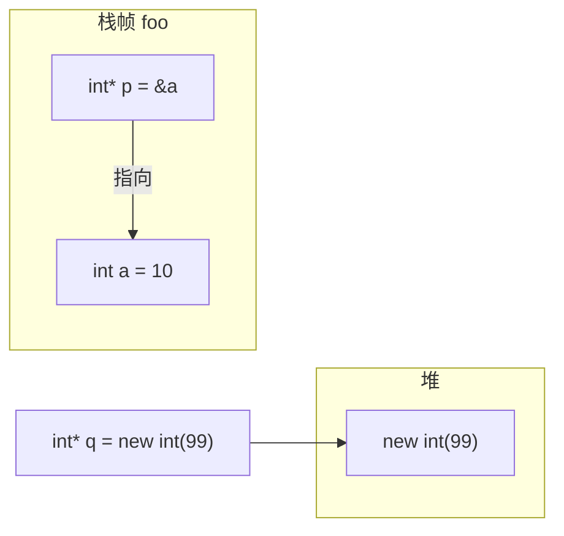

# 指针、引用与内存管理

> **文件编码**：UTF-8。源文件建议 UTF-8；MSVC 可在「高级保存选项」确认编码。

## 本章与上一章的关系

[01 章](01-C++基础语法与数据类型.md) 你已能写变量、循环、函数——但 C++ 与 [Python](../Python/01-Python基础语法与面向对象.md) / [Java](../Java/01-Java基础语法与面向对象.md) 最大的分水岭在**内存**：Python 有 GC，Java 有 JVM 堆管理，C++ 默认由程序员（配合 RAII）掌控栈/堆生命周期。

02 章是整条 C++ 路线的**第一座大山**：指针、引用、栈与堆、`new`/`delete`。搞懂这一章，03 章类的构造/析构、05 章智能指针、07 章 RAII、10 章网络缓冲区才有落脚点。系统编程（驱动、引擎、高性能服务）几乎每天都在和地址、内存布局打交道。

---

## 1. 这份文档学什么

学完本章，你应该能做到：

- 解释栈与堆的区别，画出典型函数的内存布局
- 正确使用指针与引用，区分 `*`、`&`、`->`
- 用 `new`/`delete` 分配堆内存，并知道何时必须 `delete[]`
- 识别悬空指针、内存泄漏、重复释放等经典 bug
- 在 Windows 上用 g++ 或 MSVC 编译运行本章示例

---

## 2. 内存模型：栈与堆

### 2.1 程序地址空间（概念）

```text
高地址
┌─────────────┐
│   栈 stack   │  ← 局部变量、函数参数，自动扩缩
├─────────────┤
│     ...     │
├─────────────┤
│   堆 heap    │  ← new/malloc 分配，手动或 RAII 释放
├─────────────┤
│  全局/静态   │
├─────────────┤
│   代码段     │
低地址
```

与 Java 对比：Java 对象几乎都在堆上，栈上只有引用变量；C++ 的 `int x` 可以直接在栈上，大对象或生命周期跨函数时才上堆。

### 2.2 栈上变量示例

```cpp
// stack_demo.cpp — 可用 g++ -std=c++17 -o stack_demo stack_demo.cpp 编译
#include <iostream>

void foo() {
    int a = 10;           // 栈上
    double arr[3] = {1, 2, 3};
    std::cout << "a 地址: " << &a << ", arr: " << arr << '\n';
}  // foo 结束，a、arr 自动销毁

int main() {
    foo();
    foo();  // 每次调用栈帧重新分配，地址可能相近
    return 0;
}
```

### 2.3 堆上分配示例

```cpp
// heap_demo.cpp
#include <iostream>

int main() {
    int* p = new int(42);        // 堆上单个 int
    int* arr = new int[5]{1, 2, 3, 4, 5};

    std::cout << *p << ", arr[2]=" << arr[2] << '\n';

    delete p;      // 必须配对
    delete[] arr;  // 数组用 delete[]
    return 0;
}
```

> **Windows 提示**：g++（MSYS2）与 MSVC 堆实现不同，但 `new`/`delete` 语义一致。MSVC 编译：`cl /EHsc /std:c++17 /W4 heap_demo.cpp`

---

## 3. 指针基础

### 3.1 什么是指针

指针是**存储另一个对象地址**的变量。

```cpp
#include <iostream>

int main() {
    int x = 100;
    int* px = &x;   // px 指向 x

    std::cout << "x=" << x << ", 地址=" << &x << '\n';
    std::cout << "px 存的地址=" << px << ", 解引用 *px=" << *px << '\n';

    *px = 200;      // 通过指针修改 x
    std::cout << "修改后 x=" << x << '\n';
    return 0;
}
```

| 运算符 | 含义 |
|--------|------|
| `&x` | 取 x 的地址 |
| `*px` | 解引用，访问 px 指向的对象 |
| `px->member` | 指针访问成员（等价 `(*px).member`） |

### 3.2 空指针与 nullptr

```cpp
#include <iostream>

int main() {
    int* p = nullptr;  // C++11 起推荐 nullptr，不要写 NULL
    if (p == nullptr) {
        std::cout << "p 未指向有效对象\n";
    }
    // *p = 1;  // 未定义行为，可能崩溃
    return 0;
}
```

Python 的 `None`、Java 的 `null` 类似「无对象」；C++ 用 `nullptr`，且**解引用空指针是 UB（未定义行为）**。

### 3.3 指针与数组

```cpp
#include <iostream>

int main() {
    int data[] = {10, 20, 30};
    int* p = data;  // 数组名 decay 为首元素指针

    for (int i = 0; i < 3; ++i) {
        std::cout << *(p + i) << ' ';  // 指针算术
    }
    std::cout << '\n';
    return 0;
}
```

数组名在多数表达式中会**退化为**指向首元素的指针；`sizeof(data)` 仍是整个数组大小，但 `sizeof(p)` 是指针大小（64 位系统通常 8 字节）。

---

## 4. 引用

### 4.1 引用 vs 指针

```cpp
#include <iostream>

void swap_ref(int& a, int& b) {
    int tmp = a;
    a = b;
    b = tmp;
}

void swap_ptr(int* a, int* b) {
    int tmp = *a;
    *a = *b;
    *b = tmp;
}

int main() {
    int x = 1, y = 2;
    swap_ref(x, y);
    std::cout << x << ' ' << y << '\n';  // 2 1

    x = 1; y = 2;
    swap_ptr(&x, &y);
    std::cout << x << ' ' << y << '\n';
    return 0;
}
```

| 特性 | 指针 | 引用 |
|------|------|------|
| 可否为空 | 可以 `nullptr` | 必须绑定有效对象 |
| 可否重新绑定 | 可以改指向 | 不能改绑 |
| 语法 | 需显式 `*`/`&` | 用起来像原变量 |
| 典型用途 | 可选参数、动态内存 | 函数参数避免拷贝 |

Java 没有指针/引用语法糖，对象参数传递的是「引用的拷贝」；C++ 引用更接近 Java 的对象引用，但底层是别名。

### 4.2 const 与指针、引用

```cpp
#include <iostream>

int main() {
    int x = 10;
    const int* p1 = &x;   // 指向常量的指针：不能通过 p1 改 x
    int* const p2 = &x;   // 常量指针：p2 不能改指向
    const int* const p3 = &x;

    // *p1 = 20;  // 错误
    x = 20;       // OK

    const int& ref = x;
    // ref = 30;  // 若 ref 绑定 const 对象则不可改

    std::cout << x << '\n';
    return 0;
}
```

**读法技巧**：从右往左读声明——`const int*` 是指向 const int 的指针。

### 4.3 const 指针规则总表（必背）

| 声明写法 | 口语名称 | 指针本身 | 所指对象 | 典型用途 |
|----------|----------|----------|----------|----------|
| `const int* p` | 指向常量的指针 | 可改指向 | 不可通过 `p` 修改 | 只读遍历数组 |
| `int* const p` | 常量指针 | 不可改指向 | 可修改 | 固定缓冲区的写入游标 |
| `const int* const p` | 指向常量的常量指针 | 不可改指向 | 不可通过 `p` 修改 | 只读且位置固定 |
| `int const* p` | 同 `const int*` | 可改指向 | 不可通过 `p` 修改 | 与上一行等价 |
| `const int& r` | 常引用 | — | 不可通过 `r` 修改 | 大对象只读参数 |
| `int& r` | 非常引用 | — | 可修改 | `swap`、输出参数 |

```cpp
#include <iostream>

void demo(const int* read_only, int* const fixed_target, int& out) {
    // read_only = other;     // OK：指针本身可改
    // *read_only = 1;        // 错误
    *fixed_target = 42;       // OK
    // fixed_target = other;  // 错误
    out = 100;
}

int main() {
    int a = 1, b = 2;
    demo(&a, &b, a);
    std::cout << a << ' ' << b << '\n';  // 100 42
    return 0;
}
```

Java 只有 `final` 引用（不能改指向），没有「通过指针改值但指针本身只读」这种细粒度控制；C++ 在系统 API 里极其常见（如 `const char*` 输入、`char* const` 写指针）。

---

## 5. 动态内存与常见陷阱

### 5.1 内存泄漏

```cpp
#include <iostream>

void leak() {
    int* p = new int(100);
    // 忘记 delete p;
}

int main() {
    for (int i = 0; i < 1000; ++i) {
        leak();
    }
    std::cout << "循环结束，堆内存可能已泄漏\n";
    return 0;
}
```

Linux/WSL 可用 Valgrind 检测；Windows 可用 Visual Studio 诊断工具或后续 12 章工具。05 章 `unique_ptr` 是根治手段。

### 5.2 悬空指针（Dangling Pointer）

```cpp
#include <iostream>

int* dangling() {
    int local = 42;
    return &local;  // 危险！返回栈上局部变量地址
}

int main() {
    int* p = dangling();
    // std::cout << *p;  // UB：local 已销毁
    (void)p;
    return 0;
}
```

### 5.3 重复释放

```cpp
#include <iostream>

int main() {
    int* p = new int(1);
    delete p;
    // delete p;  // 双重释放，未定义行为
    p = nullptr;  // 释放后置空是好习惯
    return 0;
}
```

---

## 6. 内存布局与调试



在 VS / VS Code 调试器中：

1. 对 `&a`、`p` 设监视，观察栈地址（通常高位连续）
2. 对 `new` 返回的 `q` 看堆地址
3. 单步出 `foo` 后，`a` 已无效，加深「栈生命周期」印象

---

## 7. 指针与函数

### 7.1 传址调用

```cpp
#include <iostream>
#include <vector>

void append(std::vector<int>& v, int value) {
    v.push_back(value);
}

void fill_array(int* arr, std::size_t n, int val) {
    for (std::size_t i = 0; i < n; ++i) {
        arr[i] = val;
    }
}

int main() {
    std::vector<int> nums{1, 2};
    append(nums, 3);

    int buf[4];
    fill_array(buf, 4, 7);
    for (int x : buf) std::cout << x << ' ';
    std::cout << '\n';
    return 0;
}
```

### 7.2 返回指针的合理场景

```cpp
#include <iostream>
#include <memory>
#include <string>

// 返回堆对象指针 — 调用方负责 delete（旧风格，05 章用智能指针替代）
std::string* make_greeting(const std::string& name) {
    return new std::string("Hello, " + name);
}

int main() {
    std::string* msg = make_greeting("C++");
    std::cout << *msg << '\n';
    delete msg;
    return 0;
}
```

---

## 8. 与 Java / Python 对照

| 概念 | C++ | Java | Python |
|------|-----|------|--------|
| 堆分配 | `new` / `delete` | `new`（GC 回收） | 对象自动 GC |
| 栈局部变量 | `int x` | 基本类型在栈 | 无显式栈概念 |
| 空值 | `nullptr` | `null` | `None` |
| 传参改调用方 | 引用 `T&` 或指针 | 对象引用 | 可变对象默认可改 |
| 内存错误 | 泄漏/越界/UB | 较少，OOM | 较少，OOM |

---

## 9. 系统编程视角：缓冲区与指针

网络、文件 IO 常遇到「原始字节缓冲区」：

```cpp
#include <cstring>
#include <iostream>

// 简化版：拷贝 C 风格字符串（含 '\0'）
char* duplicate_cstr(const char* src) {
    if (src == nullptr) return nullptr;
    std::size_t len = std::strlen(src);
    char* dst = new char[len + 1];
    std::memcpy(dst, src, len + 1);
    return dst;
}

int main() {
    char* s = duplicate_cstr("packet_header");
    std::cout << s << ", len=" << std::strlen(s) << '\n';
    delete[] s;
    return 0;
}
```

10 章 socket 读缓冲区、11 章系统调用都会建立在此之上。现代 C++ 更推荐 `std::vector<std::byte>` 或 `std::string`，但底层仍是指向连续内存的指针。

---

## 9.1 深入：游戏引擎中的 Entity 与组件指针

典型 ECS（Entity-Component-System）里，Entity 只是 ID，组件数据在堆上连续存放，System 用指针遍历：

```cpp
#include <iostream>
#include <vector>

struct Transform {
    float x, y;
};

struct Entity {
    std::uint32_t id;
    Transform* transform;  // 指向堆上或池内组件，非拥有
};

int main() {
    std::vector<Transform> pool;
    pool.push_back({0.f, 0.f});
    pool.push_back({10.f, 5.f});

    Entity e1{1, &pool[0]};
    Entity e2{2, &pool[1]};

    e1.transform->x = 1.f;  // 通过指针改组件
    std::cout << pool[0].x << ' ' << e2.transform->y << '\n';  // 1 5
    return 0;
}
```

**拥有 vs 非拥有**：`Entity` 不 `delete transform`——生命周期由 `pool`（或 05 章 `unique_ptr` 管理的块）负责。混淆二者是引擎里最常见的泄漏/悬空来源。

---

## 9.2 深入：交易系统 Order Book 与连续内存

买卖盘每一档价格对应 `(price, volume)`，热路径用**连续数组 + 指针算术**而非频繁 `new` 单元素：

```cpp
#include <iostream>

struct Level {
    double price;
    int volume;
};

class OrderBookSide {
public:
    explicit OrderBookSide(std::size_t cap) : levels_(new Level[cap]{}), cap_(cap) {}
    ~OrderBookSide() { delete[] levels_; }

    void set(std::size_t i, double p, int v) {
        if (i < cap_) levels_[i] = {p, v};
    }
    const Level* data() const { return levels_; }
    std::size_t size() const { return cap_; }

private:
    Level* levels_;
    std::size_t cap_;
};

int main() {
    OrderBookSide asks(3);
    asks.set(0, 100.5, 200);
    asks.set(1, 100.6, 150);
    const Level* p = asks.data();
    std::cout << p[0].price << ' ' << p[1].volume << '\n';  // 100.5 150
    return 0;
}
```

03 章会把 `OrderBookSide` 改写为 Rule of Three/Five 完整的类；05 章可用 `std::vector<Level>` 替代 raw 数组。

---

## 9.3 内存布局 ASCII 详解（单函数调用）

以下代码在 `main` 调用 `foo` 时的典型布局（地址仅为示意，ASLR 每次运行会变）：

```cpp
#include <iostream>

void foo(int param) {
    int stack_a = 10;
    int* heap_b = new int(99);
    std::cout << "param=" << param << " stack_a=" << stack_a
              << " heap *=" << *heap_b << '\n';
    delete heap_b;
}

int main() {
    foo(42);
    return 0;
}
```

```text
高地址 0x00007fff_xxxx
┌──────────────────────────────────────┐
│  main 栈帧                            │
│    返回地址、保存的寄存器等            │
├──────────────────────────────────────┤
│  foo 栈帧                             │
│    param      @ 0x7fff...100  (=42)  │  ← 栈：自动销毁
│    stack_a    @ 0x7fff...0fc  (=10)  │
│    heap_b     @ 0x7fff...0f8  (存堆地址)│
├──────────────────────────────────────┤
│  ... 未映射/ guard page ...           │
├──────────────────────────────────────┤
│  堆                                   │
│    *heap_b →  int 99  @ 0x55....a040 │  ← new 分配，delete 释放
├──────────────────────────────────────┤
│  .data / .bss（全局静态）              │
│  .text（机器码）                       │
低地址 0x00400000_xxxx
```

**要点**：`foo` 返回后 `stack_a` 所在栈帧失效；若 `delete` 前把 `heap_b` 返回给 `main` 且正确移交所有权，堆块仍可存活。

---

## 9.4 unique_ptr 独占所有权预览（05 章展开）

工程里应优先用智能指针表达「谁负责 delete」：

```cpp
#include <iostream>
#include <memory>
#include <string>

std::unique_ptr<std::string> make_label(const std::string& name) {
    return std::make_unique<std::string>("Order:" + name);
}

int main() {
    auto label = make_label("AAPL");
    std::cout << *label << '\n';
    // 离开作用域自动 delete，无需手写
    return 0;
}
```

| 机制 | raw `new`/`delete` | `std::unique_ptr` |
|------|---------------------|-------------------|
| 所有权 | 靠约定 | 编译期强制唯一 |
| 泄漏风险 | 忘记 delete、异常路径 | 析构自动释放 |
| 转移 | 手动 | `std::move` |
| Java 对照 | 无 | 无 GC，但类似「唯一持有者」语义 |

编译：`g++ -std=c++17 -o unique_preview unique_preview.cpp` → 输出 `Order:AAPL`。

---

## 9.5 调试器实战：Visual Studio 与 GDB

### Visual Studio

1. 打开 `pointer_lab.cpp`，**F9** 在 `delete heap_var` 行设断点
2. **F5** 调试运行
3. **调试 → 窗口 → 监视**，添加：
   - `stack_var`
   - `&stack_var`
   - `heap_var`
   - `*heap_var`
4. **F10** 单步，观察 `stack_var` 在栈窗口地址（通常 `0x000000` 高位段）
5. 执行 `delete` 后，**不要**再解引用 `heap_var`；若注释 delete 结束进程，查看**输出**窗口泄漏提示

### GDB（WSL / Linux）

```powershell
g++ -std=c++17 -g -O0 -o pointer_lab pointer_lab.cpp
gdb ./pointer_lab
```

```text
(gdb) break main
(gdb) run
(gdb) print stack_var
(gdb) print &stack_var
(gdb) print heap_var
(gdb) print *heap_var
(gdb) next
(gdb) quit
```

**`-g -O0`**：调试时关闭优化，避免变量被优化掉。12 章会讲 `-O2` 与 perf 的关系。

### 常见观察结论

| 观察 | 说明 |
|------|------|
| 栈地址多次调用相近 | 同一函数栈帧大小固定 |
| 堆地址与栈地址数值差距大 | 正常，分属不同区域 |
| 释放后堆块仍显示旧值 | **勿信**——可能已被复用，属 UB |

---

## 10. 手把手：编译与观察地址

### 第一步：创建目录

```powershell
mkdir cpp-ch02-demo
cd cpp-ch02-demo
```

### 第二步：写入 pointer_lab.cpp

```cpp
#include <iostream>

int main() {
    int stack_var = 1;
    int* heap_var = new int(2);

    std::cout << "stack_var  值=" << stack_var
              << " 地址=" << static_cast<void*>(&stack_var) << '\n';
    std::cout << "heap_var   值=" << *heap_var
              << " 地址=" << static_cast<void*>(heap_var) << '\n';

    delete heap_var;
    return 0;
}
```

### 第三步：g++ 编译

```powershell
g++ -std=c++17 -Wall -Wextra -g -o pointer_lab pointer_lab.cpp
.\pointer_lab.exe
```

### 第四步：MSVC（可选）

打开「Developer Command Prompt for VS」：

```powershell
cl /EHsc /std:c++17 /W4 /Zi pointer_lab.cpp
pointer_lab.exe
```

### 第五步：故意制造泄漏

注释掉 `delete heap_var`，在 VS 调试运行结束查看输出窗口泄漏报告；或 WSL 下 `valgrind --leak-check=full ./pointer_lab`。

### 第六步：预期输出示例

```text
# g++ ./pointer_lab.exe 典型输出（地址每次不同）：
stack_var  值=1 地址=0x7ffeeb3fa1c
heap_var   值=2 地址=0x1a2b3c4d050
```

MSVC Debug 下栈地址常形如 `0x000000` 开头，堆地址形如 `0x000001` 开头——**仅作规律参考**，以本机为准。

---

## 11. 常见报错与排查

| 报错信息（关键词） | 可能原因 | 解决方案 |
|-------------------|---------|---------|
| `error: invalid conversion from 'int' to 'int*'` | 把整数赋给指针 | 用 `&变量` 或 `(int*)` 强转（尽量避免 C 风格 cast） |
| `Segmentation fault` / 访问冲突 | 解引用空/悬空指针 | 检查 `nullptr`、勿返回局部变量地址 |
| `double free or corruption` | 重复 `delete` | 释放后置 `nullptr`；05 章用智能指针 |
| `free(): invalid pointer` | `delete`/`delete[]` 混用 | 数组必须 `delete[]` |
| `use of undeclared identifier 'nullptr'` | 标准过低 | 加 `-std=c++11` 或更高 |
| `warning: address of stack memory associated with local variable returned` | 返回栈地址 | 返回值或 `new`+RAII |
| `error: cannot bind non-const lvalue reference` | 用非 const 引用绑临时量 | 改 `const T&` 或左值变量 |
| `undefined reference to operator new/delete` | 链接阶段缺库 | 确保用 g++/cl 链接而非仅预处理 |
| MSVC `C4715: not all control paths return a value` | 函数缺 return | 补全所有分支返回值 |
| `array subscript is above array bounds`（-Warray-bounds） | 越界访问 | 检查下标 `< size` |
| `error: invalid types 'int[int]'` | 把数组当二维错写 | 用 `int*` 或 `vector` |
| `munmap_chunk(): invalid pointer` | 对非堆指针 `delete` | 只对 `new` 返回值 `delete` |
| `heap-buffer-overflow`（ASan/Valgrind） | 写越界 | 检查分配长度与下标 |
| `use-after-free` | 释放后仍解引用 | 释放后置空；缩短指针生命周期 |
| `warning: comparison between pointer and integer` | `if (p == 0)` 旧写法 | 用 `p == nullptr` |
| MSVC `C2100: illegal indirection` | 对非指针解引用 | 检查类型与 `*` 层数 |
| `cannot convert 'const int*' to 'int*'` | 把只读指针传给可写形参 | 形参改 `const int*` 或拷贝 |
| `bad_alloc` / `std::bad_alloc` | 堆耗尽 | 减少分配、检查泄漏循环 |
| `realloc`: invalid next size | 堆元数据被破坏 | 越界写、double free 排查 |
| `0xC0000005` 访问冲突（Windows） | 空指针/越界 | 调试器看崩溃行与调用栈 |
| `error: taking address of temporary` | `&func()` 取临时量地址 | 存到变量再取址 |
| `warning: deleting void* is undefined` | 对 `void*` 直接 delete | 转回正确类型再 delete |

---

## 12. 练习建议

### 基础

1. 写函数 `void print(int* arr, size_t n)` 打印整型数组
2. 写 `void swap(int& a, int& b)` 交换两整数
3. 用 `new`/`delete` 创建单个 `double`，读入并打印

### 进阶

4. 实现动态数组类雏形：`IntArray` 含构造、`at(i)`、`size()`、析构里 `delete[]`
5. 写 `char* strdup_manual(const char* s)` 并在 main 中验证
6. 用调试器对比 3 次调用同一函数时栈变量地址变化

### 挑战

7. 实现简易「字符串类」：`MyString` 含长度、堆上字符数组、拷贝构造（深拷贝）
8. 读入 N 个整数，动态分配数组，排序后输出，无泄漏

---

## 13. 分级练习参考答案

### 基础：数组打印与 swap

```cpp
#include <iostream>

void print(int* arr, std::size_t n) {
    for (std::size_t i = 0; i < n; ++i) {
        std::cout << arr[i] << (i + 1 == n ? '\n' : ' ');
    }
}

void swap_int(int& a, int& b) {
    int t = a;
    a = b;
    b = t;
}

int main() {
    int a[] = {3, 1, 4};
    print(a, 3);
    int x = 1, y = 2;
    swap_int(x, y);
    std::cout << x << ' ' << y << '\n';
    return 0;
}
```

### 进阶：IntArray 雏形

```cpp
#include <iostream>
#include <stdexcept>

class IntArray {
public:
    explicit IntArray(std::size_t n) : size_(n), data_(new int[n]{}) {}
    ~IntArray() { delete[] data_; }

    IntArray(const IntArray&) = delete;
    IntArray& operator=(const IntArray&) = delete;

    int& at(std::size_t i) {
        if (i >= size_) throw std::out_of_range("index");
        return data_[i];
    }
    std::size_t size() const { return size_; }

private:
    std::size_t size_;
    int* data_;
};

int main() {
    IntArray arr(3);
    arr.at(0) = 10;
    std::cout << arr.at(0) << '\n';
    return 0;
}
```

### 挑战：MyString 深拷贝

```cpp
#include <cstring>
#include <iostream>

class MyString {
public:
    MyString() : len_(0), data_(new char[1]{'\0'}) {}
    explicit MyString(const char* s)
        : len_(std::strlen(s)), data_(new char[len_ + 1]) {
        std::memcpy(data_, s, len_ + 1);
    }
    MyString(const MyString& other)
        : len_(other.len_), data_(new char[len_ + 1]) {
        std::memcpy(data_, other.data_, len_ + 1);
    }
    ~MyString() { delete[] data_; }

    const char* c_str() const { return data_; }

private:
    std::size_t len_;
    char* data_;
};

int main() {
    MyString a("hello");
    MyString b = a;
    std::cout << b.c_str() << '\n';
    return 0;
}
```

### 挑战：MyString 深拷贝

```cpp
#include <cstring>
#include <iostream>

class MyString {
public:
    MyString() : len_(0), data_(new char[1]{'\0'}) {}
    explicit MyString(const char* s)
        : len_(std::strlen(s)), data_(new char[len_ + 1]) {
        std::memcpy(data_, s, len_ + 1);
    }
    MyString(const MyString& other)
        : len_(other.len_), data_(new char[len_ + 1]) {
        std::memcpy(data_, other.data_, len_ + 1);
    }
    ~MyString() { delete[] data_; }

    const char* c_str() const { return data_; }

private:
    std::size_t len_;
    char* data_;
};

int main() {
    MyString a("hello");
    MyString b = a;
    std::cout << b.c_str() << '\n';
    return 0;
}
```

### 挑战：动态数组读入排序（完整）

```cpp
#include <algorithm>
#include <iostream>

int main() {
    std::size_t n;
    if (!(std::cin >> n) || n == 0) return 0;

    int* arr = new int[n];
    for (std::size_t i = 0; i < n; ++i) {
        std::cin >> arr[i];
    }
    std::sort(arr, arr + n);
    for (std::size_t i = 0; i < n; ++i) {
        std::cout << arr[i] << (i + 1 == n ? '\n' : ' ');
    }
    delete[] arr;
    return 0;
}
```

输入 `5` 换行 `3 1 4 1 5` → 输出 `1 1 3 4 5`。04 章会用 `std::vector` 替代 raw 数组。

---

## 14. FAQ

**Q：还该用 raw `new`/`delete` 吗？**  
学习本章必须掌握；工程代码 05 章起优先 `unique_ptr`/`vector`，仅在热路径或 C 接口衔接时用 raw 指针。

**Q：指针大小多少？**  
32 位程序 4 字节，64 位通常 8 字节，与 `sizeof(void*)` 一致。

**Q：和 Java 的引用有什么区别？**  
Java 引用不能算术运算；C++ 指针可 `+1` 遍历数组。Java 不能显式释放对象。

**Q：引用能 null 吗？**  
不能。可选语义用指针 `T*` 或 05 章 `std::optional<T&>`（C++17 有限支持）/ 指针。

**Q：`delete p` 后 `p` 还有值吗？**  
有，仍是旧地址（悬空）；应 `p = nullptr` 或让指针离开作用域。

**Q：栈可以 `new` 吗？**  
`new` 总在堆上；栈上只有自动变量。`alloca` 等非主线，勿与 `new` 混淆。

**Q：为什么数组必须 `delete[]`？**  
编译器在分配时记录元素个数，`delete[]` 才能对每个元素析构并释放整块。

**Q：智能指针能完全替代本章吗？**  
不能。读底层库、调试崩溃、与 C API 交互仍要懂 raw 指针语义。

---

## 15. 学完标准

- [ ] 能画出栈/堆示意图并解释局部变量生命周期
- [ ] 熟练使用 `&`、`*`、`->`，区分指针与引用
- [ ] 正确配对 `new`/`delete`、`new[]`/`delete[]`
- [ ] 能说出悬空指针、泄漏、双重释放的表现
- [ ] 能在 g++ 与 MSVC 下编译运行本章 demo
- [ ] 独立完成 `IntArray` 或 `MyString` 基础练习

---

## 下一章预告

指针与堆内存是类的底层基础。03 章 [面向对象与类设计](03-面向对象与类设计.md) 会把构造/析构、拷贝、继承、多态串起来——你会明白为什么「类在析构里 `delete[]`」与 02 章动态数组一脉相承，也会对照 [Java OOP](../Java/01-Java基础语法与面向对象.md) 理解虚函数表。

---

*下一章：03 面向对象与类设计*
