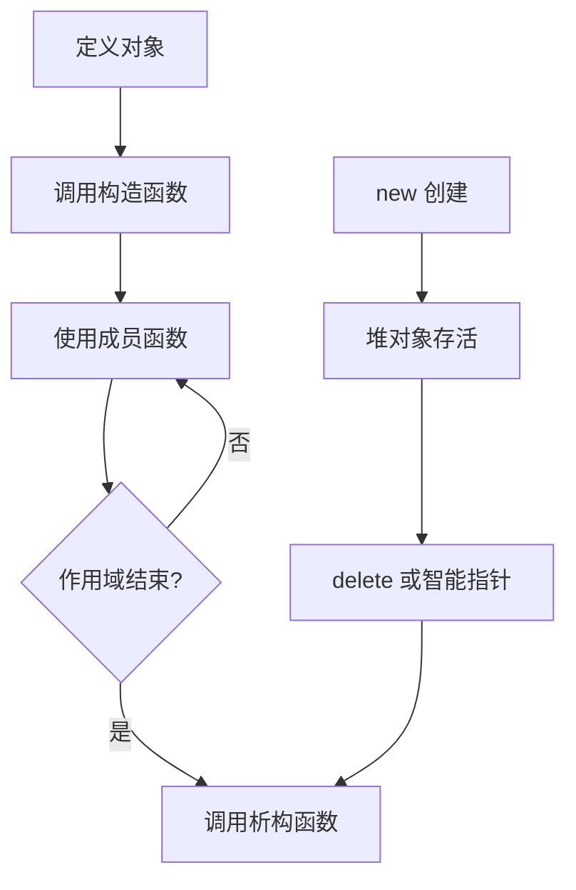

# 面向对象与类设计

> **文件编码**：UTF-8。源文件建议 UTF-8。

---

## 0. 读前导读（零基础也能跟上）

### 0.1 用一句话弄懂本章

**面向对象** = 把数据和行为装进「类」，用构造/析构管理资源，用继承+多态写可扩展代码——02 章的**门牌号**现在变成成员指针和 `this`。

### 0.2 你需要提前知道什么

- [02 章](02-指针引用与内存管理.md) 栈/堆、指针、引用、`new`/`delete`
- [01 章](01-C++基础语法与数据类型.md) 函数与作用域
- 建议对照 [Java 01 OOP](../Java/01-Java基础语法与面向对象.md) 继承多态小节
- **真不会指针**：回 02 章，03 依赖析构里 `delete[]`

### 0.3 本章知识地图（☐→☑）

- [ ] 写含构造/析构/拷贝的类
- [ ] 解释深拷贝 vs 浅拷贝、Rule of Three 动机
- [ ] 用 `virtual`/`override` 实现多态
- [ ] 解释 object slicing 与 virtual 析构
- [ ] 完成 `Shape` + `vector<unique_ptr<Shape>>` 练习
- [ ] §17 闭卷自测 ≥8/10

### 0.4 建议学习时长

**5～7 天**；有 Java OOP 基础可 4～5 天。

### 0.5 学完你能做什么

实现多态计算器；解释「为什么 `delete Base*` 需要 virtual 析构」；为 04 **标准工具箱** 存对象打 OOP 基础。

### 0.6 与数据结构 / Java 衔接

| 本章 | 对照 |
|------|------|
| 类封装节点 | [数据结构 03 链表](../数据结构/03-链表.md) 可封装为 `List` 类 |
| 接口 vs 纯虚类 | [Java 01](../Java/01-Java基础语法与面向对象.md) `interface` |
| 多态容器 | 04 章 `vector<unique_ptr<Base>>` |

---

## 本章与上一章的关系

[02 章](02-指针引用与内存管理.md) 你掌握了栈/堆、指针与引用——**类就是把数据与操作这些数据的方法绑在一起**，并在构造/析构里管理 02 章学到的堆内存。没有 02 章，拷贝构造、析构函数里的 `delete` 会完全看不懂。

本章对照 [Java 01 OOP](../Java/01-Java基础语法与面向对象.md) 与 [Python 01 OOP](../Python/01-Python基础语法与面向对象.md)，但 C++ 多了**值语义、显式析构、多重继承、虚函数**等系统向细节。游戏引擎、网络框架、STL 容器内部都是类设计；不是 Web CRUD，而是「如何封装资源与行为」。

---

## 1. 这份文档学什么

- 定义类：成员、访问控制、构造/析构
- 理解拷贝构造、拷贝赋值与 Rule of Three/Five
- 使用继承、虚函数实现多态
- 区分 `struct` 与 `class`、override/final
- 设计小型领域类（如形状、缓冲区包装）

---

## 2. 第一个类

```cpp
// rectangle.cpp
#include <iostream>
#include <string>

class Rectangle {
public:
    Rectangle(double w, double h) : width_(w), height_(h) {}

    double area() const { return width_ * height_; }
    void scale(double factor) {
        width_ *= factor;
        height_ *= factor;
    }

private:
    double width_;
    double height_;
};

int main() {
    Rectangle r(3.0, 4.0);
    std::cout << "面积: " << r.area() << '\n';
    r.scale(2.0);
    std::cout << "缩放后: " << r.area() << '\n';
    return 0;
}
```

| 访问修饰符 | 含义 |
|-----------|------|
| `public` | 类外可访问 |
| `private` | 仅类内/友元 |
| `protected` | 类内 + 派生类 |

Python 用 `_` 约定私有；Java 用 `private`/`protected`；C++ **默认 `class` 成员为 private**。

---

## 3. 构造与析构

### 3.1 初始化列表

```cpp
#include <iostream>
#include <string>

class ServerConfig {
public:
    ServerConfig(std::string host, int port)
        : host_(std::move(host)), port_(port) {
        std::cout << "构造 " << host_ << ':' << port_ << '\n';
    }
    ~ServerConfig() {
        std::cout << "析构 " << host_ << '\n';
    }

    const std::string& host() const { return host_; }
    int port() const { return port_; }

private:
    std::string host_;
    int port_;
};

int main() {
    ServerConfig cfg("127.0.0.1", 8080);
    return 0;
}  // 离开作用域自动析构
```

### 3.2 对象生命周期



栈对象 RAII 自动析构；`new` 的对象必须 `delete`（07/05 章强化）。

---

## 4. 拷贝与赋值

### 4.1 浅拷贝问题

```cpp
#include <cstring>
#include <iostream>

class Buffer {
public:
    explicit Buffer(std::size_t n) : size_(n), data_(new char[n]{}) {}
    ~Buffer() { delete[] data_; }

    // 拷贝构造 — 深拷贝
    Buffer(const Buffer& other)
        : size_(other.size_), data_(new char[size_]) {
        std::memcpy(data_, other.data_, size_);
    }

    Buffer& operator=(const Buffer& other) {
        if (this == &other) return *this;
        delete[] data_;
        size_ = other.size_;
        data_ = new char[size_];
        std::memcpy(data_, other.data_, size_);
        return *this;
    }

    std::size_t size() const { return size_; }

private:
    std::size_t size_;
    char* data_;
};

int main() {
    Buffer a(4);
    Buffer b = a;  // 深拷贝
    return 0;
}
```

**Rule of Three**：若自定义析构、拷贝构造、拷贝赋值之一，通常三个都要考虑（05 章移动语义扩展为 Rule of Five）。

---

## 5. const 成员与 static

```cpp
#include <iostream>

class Counter {
public:
    Counter() = default;
    void increment() { ++count_; }
    int get() const { return count_; }  // 不修改对象状态

    static int instances() { return instance_count_; }

private:
    int count_ = 0;
    inline static int instance_count_ = 0;  // C++17 inline static
};

int main() {
    const Counter c;
    // c.increment();  // 错误：const 对象只能调 const 成员
    std::cout << c.get() << '\n';
    return 0;
}
```

Java 的 `static` 类变量类似；Python 类属性 `@classmethod` 场景不同，见 [Python 01](../Python/01-Python基础语法与面向对象.md)。

---

## 6. 继承与多态

### 6.1 基类与派生

```cpp
#include <iostream>
#include <memory>
#include <vector>

class Shape {
public:
    virtual ~Shape() = default;
    virtual double area() const = 0;  // 纯虚函数
    virtual void describe() const {
        std::cout << "Shape\n";
    }
};

class Circle : public Shape {
public:
    explicit Circle(double r) : r_(r) {}
    double area() const override { return 3.14159 * r_ * r_; }
    void describe() const override {
        std::cout << "Circle r=" << r_ << '\n';
    }

private:
    double r_;
};

class Rect : public Shape {
public:
    Rect(double w, double h) : w_(w), h_(h) {}
    double area() const override { return w_ * h_; }
    void describe() const override {
        std::cout << "Rect " << w_ << 'x' << h_ << '\n';
    }

private:
    double w_, h_;
};

int main() {
    std::vector<std::unique_ptr<Shape>> shapes;
    shapes.push_back(std::make_unique<Circle>(2.0));
    shapes.push_back(std::make_unique<Rect>(3, 4));

    double total = 0;
    for (const auto& s : shapes) {
        s->describe();
        total += s->area();
    }
    std::cout << "总面积: " << total << '\n';
    return 0;
}
```

### 6.2 虚函数要点

- 基类析构函数应为 **virtual**，否则 `delete` 基类指针可能只析构基类部分
- `override` 显式标记重写（C++11）
- Java 实例方法默认可重写；C++ 需 `virtual` 才动态绑定

```cpp
class Base {
public:
    virtual void foo() { std::cout << "Base\n"; }
};
class Derived : public Base {
public:
    void foo() override { std::cout << "Derived\n"; }
};

void call(Base& b) { b.foo(); }

int main() {
    Derived d;
    call(d);  // 输出 Derived — 多态
}
```

---

## 7. struct 与 class

```cpp
struct Point {
    int x;
    int y;
};

class PointClass {
public:
    int x;
    int y;
};

int main() {
    Point p{1, 2};       // 聚合初始化
    PointClass q{3, 4};
    return 0;
}
```

唯一默认区别：`struct` 默认 public，`class` 默认 private。POD 风格数据结构常用 `struct`。

---

## 8. 组合 vs 继承

系统编程更推荐**组合**优先：

```cpp
#include <fstream>
#include <iostream>
#include <string>

class FileLogger {
public:
    explicit FileLogger(std::string path) : path_(std::move(path)) {}

    void log(const std::string& msg) {
        std::ofstream out(path_, std::ios::app);
        out << msg << '\n';
    }

private:
    std::string path_;
};

class Application {
public:
    Application(FileLogger logger) : logger_(std::move(logger)) {}

    void run() {
        logger_.log("app started");
    }

private:
    FileLogger logger_;  // has-a，而非 is-a
};

int main() {
    Application app(FileLogger("app.log"));
    app.run();
    return 0;
}
```

「继承表示 is-a」过深会导致耦合；引擎里 `Entity` 组合 `Transform`、`Mesh` 更常见。

---

## 8.1 深入：游戏引擎中的组合优于继承

Unreal 风格里，`Actor` 持有多个 `Component`，而非 `FlyingCar : public Car, public Plane` 式多重继承：

```cpp
#include <iostream>
#include <memory>
#include <string>
#include <vector>

class MeshComponent {
public:
    explicit MeshComponent(std::string path) : path_(std::move(path)) {}
    void draw() const { std::cout << "draw mesh " << path_ << '\n'; }
private:
    std::string path_;
};

class RigidBody {
public:
    void applyForce(float fx, float fy) {
        vx_ += fx; vy_ += fy;
    }
    void tick(float dt) { x_ += vx_ * dt; y_ += vy_ * dt; }
    void logPos() const { std::cout << "pos=(" << x_ << ',' << y_ << ")\n"; }
private:
    float x_ = 0, y_ = 0, vx_ = 0, vy_ = 0;
};

class GameActor {
public:
    GameActor(std::string name, MeshComponent mesh, RigidBody body)
        : name_(std::move(name)), mesh_(std::move(mesh)), body_(body) {}

    void tick(float dt) {
        body_.tick(dt);
        mesh_.draw();
        body_.logPos();
    }

private:
    std::string name_;
    MeshComponent mesh_;
    RigidBody body_;
};

int main() {
    GameActor player("Hero", MeshComponent("hero.fbx"), RigidBody{});
    player.tick(0.016f);
    return 0;
}
```

对比 [Java 01](../Java/01-Java基础语法与面向对象.md)：`extends` 用多了；C++ 大型项目更常见 **has-a + 接口类**。

---

## 8.2 深入：交易系统中的订单类层次

```cpp
#include <iostream>
#include <memory>
#include <string>
#include <vector>

class Order {
public:
    virtual ~Order() = default;
    virtual std::string type() const = 0;
    virtual double notional() const = 0;
};

class LimitOrder : public Order {
public:
    LimitOrder(std::string sym, double px, int qty)
        : sym_(std::move(sym)), px_(px), qty_(qty) {}
    std::string type() const override { return "LIMIT"; }
    double notional() const override { return px_ * qty_; }
private:
    std::string sym_;
    double px_;
    int qty_;
};

class MarketOrder : public Order {
public:
    MarketOrder(std::string sym, int qty, double est_px)
        : sym_(std::move(sym)), qty_(qty), est_(est_px) {}
    std::string type() const override { return "MARKET"; }
    double notional() const override { return est_ * qty_; }
private:
    std::string sym_;
    int qty_;
    double est_;
};

void printOrders(const std::vector<std::unique_ptr<Order>>& book) {
    for (const auto& o : book) {
        std::cout << o->type() << " notional=" << o->notional() << '\n';
    }
}

int main() {
    std::vector<std::unique_ptr<Order>> orders;
    orders.push_back(std::make_unique<LimitOrder>("AAPL", 150.0, 100));
    orders.push_back(std::make_unique<MarketOrder>("MSFT", 50, 300.0));
    printOrders(orders);
    return 0;
}
```

```text
# 预期输出：
LIMIT notional=15000
MARKET notional=15000
```

Java 用 `interface Order` + 实现类；C++ 用纯虚基类，**无 GC**，容器里常用 `unique_ptr<Order>` 表达所有权。

---

## 8.3 对象切片（Object Slicing）

按值传递/存储派生类会**切掉**派生部分，多态失效：

```cpp
#include <iostream>

struct Base {
    virtual void speak() const { std::cout << "Base\n"; }
    virtual ~Base() = default;
};

struct Derived : Base {
    void speak() const override { std::cout << "Derived\n"; }
    int extra = 42;
};

void byValue(Base b) { b.speak(); }  // 切片：只拷贝 Base 子对象

int main() {
    Derived d;
    byValue(d);  // 输出 Base，不是 Derived！

    Base& ref = d;
    ref.speak();  // Derived — 通过引用/指针才多态
    return 0;
}
```

| 传递方式 | 多态 | Java 对照 |
|----------|------|-----------|
| `Base b = derived;` | 否，切片 | 无切片，引用语义 |
| `Base& / Base*` | 是 | 向上转型 |

---

## 9. 运算符重载入门

```cpp
#include <iostream>

class Vec2 {
public:
    Vec2(double x, double y) : x_(x), y_(y) {}

    Vec2 operator+(const Vec2& o) const {
        return Vec2(x_ + o.x_, y_ + o.y_);
    }

    friend std::ostream& operator<<(std::ostream& os, const Vec2& v) {
        return os << '(' << v.x_ << ',' << v.y_ << ')';
    }

private:
    double x_, y_;
};

int main() {
    Vec2 a(1, 2), b(3, 4);
    std::cout << a + b << '\n';
    return 0;
}
```

---

## 10. 手把手：多态计算器

### 第一步

```powershell
mkdir cpp-ch03-demo && cd cpp-ch03-demo
```

### 第二步：写入 poly_calc.cpp（完整可编译）

```cpp
#include <iostream>
#include <memory>
#include <string>

class Expr {
public:
    virtual ~Expr() = default;
    virtual double eval() const = 0;
};

class Number : public Expr {
public:
    explicit Number(double v) : v_(v) {}
    double eval() const override { return v_; }
private:
    double v_;
};

class Add : public Expr {
public:
    Add(std::unique_ptr<Expr> l, std::unique_ptr<Expr> r)
        : left_(std::move(l)), right_(std::move(r)) {}
    double eval() const override {
        return left_->eval() + right_->eval();
    }
private:
    std::unique_ptr<Expr> left_, right_;
};

int main() {
    auto expr = std::make_unique<Add>(
        std::make_unique<Number>(1.5),
        std::make_unique<Number>(2.5));
    std::cout << expr->eval() << '\n';
    return 0;
}
```

### 第三步：编译

```powershell
g++ -std=c++17 -Wall -Wextra -o poly_calc poly_calc.cpp
.\poly_calc.exe
```

MSVC：`cl /EHsc /std:c++17 /W4 poly_calc.cpp`

### 第四步：预期输出

```text
# g++ ./poly_calc.exe
4

# 若链接失败 undefined reference to vtable：
# 检查是否漏实现某个 virtual 函数
```

### 第五步：扩展为减法节点（可选练习）

增加 `class Sub : public Expr`，`eval()` 返回左减右，构造 `(Add (Number 5) (Number 2))` 应输出 `7`。

---

## 11. Java vs C++ OOP 对照扩展

| 概念 | Java | C++ |
|------|------|-----|
| 继承 | `extends` | `class D : public B` |
| 接口 | `interface` | 纯虚类 |
| 重写 | `@Override` | `override` 关键字 |
| 不可继承 | `final class` | `final class` / `struct final` |
| 构造 | `super()` | 初始化列表 `: Base(args)` |
| 析构 | 无（GC） | `~Class()` 必考虑资源 |
| 多态容器 | `List<Shape>` | `vector<unique_ptr<Shape>>` |
| 访问 | `private/protected/public` | 相同 + `friend`（慎用） |
| 静态成员 | `static` | `static` + C++17 `inline static` |
| 值 vs 引用 | 对象引用 | 值语义默认拷贝 |

Python 见 [Python 01](../Python/01-Python基础语法与面向对象.md)：`__init__` / `@property` 对应构造与 getter，但无 RAII 析构。

---

## 12. 常见报错与排查

| 报错信息（关键词） | 可能原因 | 解决方案 |
|-------------------|---------|---------|
| `cannot declare variable ... to be of abstract type` | 实例化含纯虚函数的类 | 实现全部纯虚函数或改用指针 |
| `undefined reference to vtable` | 虚函数声明未定义/链接问题 | 确保虚析构等在 .cpp 有定义 |
| `error: use of deleted function` | 拷贝被 delete 的类 | 用移动/引用/智能指针 |
| `slice object`（运行时逻辑错） | 派生类对象按值赋给基类 | 用引用或指针保持多态 |
| `non-virtual destructor` 警告 | 基类析构非 virtual | 基类加 `virtual ~Base() = default` |
| `cannot override` | 签名不匹配 | 检查 const、参数、const 成员 |
| `inaccessible within this context` | 访问 private 成员 | 改 public 接口或 friend（慎用） |
| `redefinition of class` | 头文件无 include guard | 用 `#pragma once` 或 include guard |
| MSVC `C2259` abstract | 同 abstract type | 实现缺失的虚函数 |
| `explicit constructor` 相关 | 隐式转换失败 | 显式构造或去掉 explicit |

---

## 13. 练习建议

### 基础

1. 实现 `Rectangle`：宽、高、`area()`、`perimeter()`
2. 实现 `BankAccount`：存款、取款、查询余额（余额不足返回 false）
3. 用 `struct Point` 表示二维点，写 `distance(a, b)`

### 进阶

4. 抽象类 `Shape` + `Circle`/`Rectangle`，`vector<unique_ptr<Shape>>` 算总面积
5. 为 `Buffer`（02 章）补移动构造（预告 05 章）或禁用拷贝
6. `Logger` 接口 + `ConsoleLogger` / `FileLogger`

### 挑战

7. 简易表达式树：`eval()` 支持 `+ - *` 与括号（可只支持后缀）
8. 实现 `RingBuffer` 类：固定容量 char 环状队列，`push`/`pop`

---

## 14. 分级练习参考答案

### 基础：Rectangle

```cpp
#include <iostream>

class Rectangle {
public:
    Rectangle(double w, double h) : w_(w), h_(h) {}
    double area() const { return w_ * h_; }
    double perimeter() const { return 2 * (w_ + h_); }
private:
    double w_, h_;
};

int main() {
    Rectangle r(3, 4);
    std::cout << r.area() << ' ' << r.perimeter() << '\n';
    return 0;
}
```

### 基础：BankAccount

```cpp
#include <iostream>

class BankAccount {
public:
    explicit BankAccount(double balance = 0) : balance_(balance) {}

    void deposit(double amount) {
        if (amount > 0) balance_ += amount;
    }
    bool withdraw(double amount) {
        if (amount <= 0 || amount > balance_) return false;
        balance_ -= amount;
        return true;
    }
    double balance() const { return balance_; }

private:
    double balance_;
};

int main() {
    BankAccount acc(100);
    acc.deposit(50);
    std::cout << acc.withdraw(30) << ' ' << acc.balance() << '\n';  // 1 120
    std::cout << acc.withdraw(999) << '\n';  // 0
    return 0;
}
```

### 进阶：Shape 多态

```cpp
#include <iostream>
#include <memory>
#include <vector>

class Shape {
public:
    virtual ~Shape() = default;
    virtual double area() const = 0;
};

class Circle : public Shape {
public:
    explicit Circle(double r) : r_(r) {}
    double area() const override { return 3.14159 * r_ * r_; }
private:
    double r_;
};

class Rectangle : public Shape {
public:
    Rectangle(double w, double h) : w_(w), h_(h) {}
    double area() const override { return w_ * h_; }
private:
    double w_, h_;
};

int main() {
    std::vector<std::unique_ptr<Shape>> v;
    v.push_back(std::make_unique<Circle>(1));
    v.push_back(std::make_unique<Rectangle>(2, 3));
    double sum = 0;
    for (const auto& s : v) sum += s->area();
    std::cout << sum << '\n';
    return 0;
}
```

### 挑战：后缀表达式树（完整）

支持空格分隔后缀，如 `3 4 + 2 *` → `(3+4)*2 = 14`：

```cpp
#include <iostream>
#include <memory>
#include <sstream>
#include <stack>
#include <string>

class Expr {
public:
    virtual ~Expr() = default;
    virtual double eval() const = 0;
};

class Number : public Expr {
public:
    explicit Number(double v) : v_(v) {}
    double eval() const override { return v_; }
private:
    double v_;
};

class BinOp : public Expr {
public:
    BinOp(char op, std::unique_ptr<Expr> l, std::unique_ptr<Expr> r)
        : op_(op), left_(std::move(l)), right_(std::move(r)) {}
    double eval() const override {
        double a = left_->eval(), b = right_->eval();
        switch (op_) {
            case '+': return a + b;
            case '-': return a - b;
            case '*': return a * b;
            default: throw std::runtime_error("bad op");
        }
    }
private:
    char op_;
    std::unique_ptr<Expr> left_, right_;
};

std::unique_ptr<Expr> parseRpn(std::istream& in) {
    std::stack<std::unique_ptr<Expr>> st;
    std::string tok;
    while (in >> tok) {
        if (tok.size() == 1 && (tok[0] == '+' || tok[0] == '-' || tok[0] == '*')) {
            auto r = std::move(st.top()); st.pop();
            auto l = std::move(st.top()); st.pop();
            st.push(std::make_unique<BinOp>(tok[0], std::move(l), std::move(r)));
        } else {
            st.push(std::make_unique<Number>(std::stod(tok)));
        }
    }
    return std::move(st.top());
}

int main() {
    std::istringstream input("3 4 + 2 *");
    auto tree = parseRpn(input);
    std::cout << tree->eval() << '\n';  // 14
    return 0;
}
```

### 挑战：RingBuffer 骨架

```cpp
#include <cstddef>
#include <iostream>
#include <optional>

class RingBuffer {
public:
    explicit RingBuffer(std::size_t cap)
        : cap_(cap), buf_(new char[cap]) {}

    ~RingBuffer() { delete[] buf_; }

    bool push(char c) {
        if (size_ == cap_) return false;
        buf_[tail_] = c;
        tail_ = (tail_ + 1) % cap_;
        ++size_;
        return true;
    }

    std::optional<char> pop() {
        if (size_ == 0) return std::nullopt;
        char c = buf_[head_];
        head_ = (head_ + 1) % cap_;
        --size_;
        return c;
    }

private:
    std::size_t cap_, size_ = 0, head_ = 0, tail_ = 0;
    char* buf_;
};

int main() {
    RingBuffer rb(4);
    rb.push('A');
    rb.push('B');
    std::cout << *rb.pop() << *rb.pop() << '\n';
    return 0;
}
```

---

## 15. FAQ

**Q：还需要 Java 式 interface 吗？**  
C++ 用纯虚类 `class IWriter { virtual void write(...) = 0; };` 达到类似效果。

**Q：多重继承能用吗？**  
能，但复杂；系统代码常用组合 + 接口类。菱形继承用虚继承解决（进阶话题）。

**Q：class 和 typename template 参数？**  
06 章详讲。

**Q：构造函数能 virtual 吗？**  
不能。多态从构造完成后才可靠；工厂函数 `make_unique<Derived>()` 更常见。

**Q：为什么析构函数要 virtual？**  
`Base* p = new Derived; delete p;` 若析构非 virtual，只析构 Base 部分，Derived 资源泄漏。

**Q：`= default` 和 `= delete` 干什么用？**  
`= default` 让编译器生成特殊成员；`= delete` 禁止拷贝/移动（如单例、独占资源）。

**Q：和 Java 的 `@Override` 失败会怎样？**  
C++ `override` 在签名不匹配时**编译失败**；Java 注解不匹配也会编译错误，但 C++ 无 `@Override` 时可能静默隐藏基类函数。

---

## 16. 学完标准

- [ ] 能写含构造/析构/const 成员函数的类
- [ ] 理解深拷贝与 Rule of Three 动机
- [ ] 会用 `virtual`、`override`、纯虚函数实现多态
- [ ] 能解释「基类析构为何要是 virtual」
- [ ] 完成 Shape 多态或 RingBuffer 练习
- [ ] 对照 Java/Python OOP 说清 3 处差异

---

## 17. 闭卷自测

1. 构造函数与析构函数能否 `virtual`？各为什么？
2. 浅拷贝导致双重释放的典型场景？
3. `override` 解决什么问题？
4. 纯虚函数与抽象类在 C++ 里怎么写？对应 Java 什么？
5. object slicing 是什么？如何避免？
6. `const` 成员函数承诺什么？
7. 组合优于继承在本章哪个案例体现？
8. `= delete` 拷贝构造的典型用途？
9. `this` 指针类型是什么？
10. 为何多态容器推荐 `unique_ptr<Shape>` 而非 `vector<Shape>`？

<details>
<summary>自测参考答案</summary>

1. 构造**不能** virtual；析构**应该** virtual（多态删除）。构造时类型未完全多态。
2. 两对象共享同一 `char*` 成员，析构两次 `delete[]` 同一块。
3. 派生类标记重写，签名错则**编译期报错**。
4. `virtual void f() = 0;`；对应 Java **`interface` 方法**或抽象类。
5. 值拷贝派生到基类变量**切掉**派生部分；用**指针/引用**或 `unique_ptr`。
6. 不修改对象逻辑状态（mutable 例外）。
7. RingBuffer **组合** char 缓冲而非继承 string。
8. 独占资源类（文件句柄、mutex）禁止拷贝。
9. `T* const` 或 `ClassName* const`（指向当前对象的**门牌号**）。
10. 避免切片 + 表达独占所有权；多态通过**指针**调度虚表。

</details>

---

## 18. 费曼检验

3 分钟讲「多态在 C++ 里怎么工作」——用「同一遥控器、不同电器」类比，别提 vtable 术语除非对方懂。

**提纲**：基类指针指向不同派生对象；`virtual` 让「按按钮」时各电器做各自动作；析构也要 virtual，否则只关掉「电器基座」不关掉派生部分里的资源（**自动关门**失败）。

---

## 19. FAQ 补充

**Q：03 与 [数据结构 06 树](../数据结构/06-树与二叉树.md) 关系？**  
树节点常写成 `struct Node { int val; Node* left, *right; }`——OOP 可把遍历封装进 `Tree` 类；刷题时 struct 更轻。

**Q：和 Java 03 有关吗？**  
03 是 OOP；并发在 [Java 03](../Java/03-Java并发编程与JVM.md)，08 章对照。

---

## 20. 逐行读：多态 Shape 调用（核心）

```cpp
std::vector<std::unique_ptr<Shape>> shapes;
shapes.push_back(std::make_unique<Circle>(1.0));
for (const auto& s : shapes) {
    std::cout << s->area() << '\n';
}
```

| 行 | 含义 | 改错会怎样 |
|----|------|------------|
| `unique_ptr<Shape>` | 独占所有权的多态指针 | `vector<Shape>` → **切片** |
| `make_unique<Circle>` | 堆上构造，返回门牌号 | raw `new` 易泄漏 |
| `s->area()` | 虚函数动态绑定 | 无 `virtual` → 错误面积 |
| `const auto&` | 避免拷贝 unique_ptr | 拷贝 unique_ptr 编译失败 |

---

## 21. Rule of Three 与 05 章 Rule of Zero 预告

含 `char*`、`int*` 等资源的类通常需自定义：**析构、拷贝构造、拷贝赋值**。05 章用 `std::string`、`vector` 等 RAII 成员实现 **Rule of Zero**——编译器生成的特殊成员即安全。

---

## 22. 访问控制：public / protected / private 详解

类将**数据**与**操作**封装在一起；访问修饰符决定「谁能碰成员」。

| 修饰符 | 类内 | 派生类 | 类外 | 友元 |
|--------|------|--------|------|------|
| `public` | ✓ | ✓ | ✓ | ✓ |
| `protected` | ✓ | ✓ | ✗ | ✓ |
| `private` | ✓ | ✗ | ✗ | ✓ |

```cpp
#include <iostream>
#include <string>

class BankAccount {
public:
    explicit BankAccount(std::string owner) : owner_(std::move(owner)) {}

    void deposit(double amount) {
        if (amount > 0) balance_ += amount;
    }
    double balance() const { return balance_; }
    const std::string& owner() const { return owner_; }

protected:
    // 派生类（如 PremiumAccount）可访问，外部不可
    void log_internal(const std::string& msg) const {
        std::cout << "[内部] " << owner_ << ": " << msg << '\n';
    }

private:
    std::string owner_;
    double balance_ = 0.0;
};

class PremiumAccount : public BankAccount {
public:
    using BankAccount::BankAccount;
    void deposit_with_bonus(double amount) {
        deposit(amount);
        log_internal("赠送利息");  // OK：protected 对派生类可见
    }
};

int main() {
    BankAccount acc("Alice");
    acc.deposit(100);
    // acc.balance_ = 999;     // 错误：private
    // acc.log_internal("x");  // 错误：protected
    std::cout << acc.balance() << '\n';

    PremiumAccount prem("Bob");
    prem.deposit_with_bonus(50);
    return 0;
}
```

### 22.1 设计原则

- **数据成员默认 private**：通过 public 成员函数暴露行为（getter/setter 按需，避免无脑全暴露）。
- **protected 谨慎使用**：子类依赖基类实现细节，改基类易破坏子类；优先 **private + public 接口** 或 **组合**。
- **struct 默认 public**：适合 POD 数据聚合；有不变式（invariant）的类用 `class`。

### 22.2 与 Java 对照

Java 默认包访问；C++ **默认 private（class）/ public（struct）**。Java `protected` 对同包可见；C++ `protected` **仅类族**，与包无关。

---

## 23. this 指针与静态成员初始化

### 23.1 this 是什么

每个非静态成员函数隐式接收 **`this`**，类型为 `ClassName*`（const 成员函数为 `const ClassName*`）。

```cpp
#include <iostream>

class Point {
public:
    Point(int x, int y) : x_(x), y_(y) {}

    Point& offset(int dx, int dy) {
        x_ += dx;
        y_ += dy;
        return *this;  // 支持链式调用
    }

    void print() const {
        std::cout << "(" << this->x_ << ", " << this->y_ << ")\n";
    }

private:
    int x_, y_;
};

int main() {
    Point p(1, 2);
    p.offset(3, 4).print();  // 链式
    return 0;
}
```

| 场景 | 用法 |
|------|------|
| 区分同名参数 | `this->member = member;` |
| 链式调用 | 返回 `*this` |
| 传递自身 | `other.merge(this);` |
| 禁止拷贝 this | 不保存裸 `this` 到对象外（生命周期陷阱） |

**注意**：构造函数里 `this` 可用，但 virtual 调用在构造阶段尚未完成多态（勿在构造里调 virtual）。

### 23.2 静态成员

```cpp
#include <iostream>
#include <string>

class Employee {
public:
    Employee(std::string name) : name_(std::move(name)) {
        ++count_;
    }
    ~Employee() { --count_; }

    static int count() { return count_; }  // 无 this，只能访问 static

    const std::string& name() const { return name_; }

private:
    std::string name_;
    inline static int count_ = 0;  // C++17：类内初始化
};

// C++17 前需在 .cpp 定义：
// int Employee::count_ = 0;

int main() {
    Employee a("Ann"), b("Bob");
    std::cout << Employee::count() << '\n';  // 2
    return 0;
}
```

| 种类 | 存储 | 初始化 |
|------|------|--------|
| 非静态成员 | 每个对象一份 | 构造函数初始化列表 |
| 静态数据成员 | **全局存储期**，全类一份 | 类内 `inline static`（C++17）或类外定义 |
| 静态成员函数 | 无 this | 不能访问非静态成员 |

静态成员**先于 main 之前**零初始化，再在首次使用前完成静态初始化（复杂顺序见 08/18 章）。

---

## 24. 深拷贝 vs 浅拷贝：完整案例

### 24.1 浅拷贝灾难

编译器默认拷贝构造/赋值是**逐成员拷贝**。指针成员只拷贝**地址**，两对象共享堆块。

```cpp
#include <cstring>
#include <iostream>

class ShallowString {
public:
    explicit ShallowString(const char* s)
        : data_(new char[std::strlen(s) + 1]) {
        std::strcpy(data_, s);
    }
    ~ShallowString() { delete[] data_; std::cout << "析构\n"; }

    // 编译器生成的拷贝构造 = 浅拷贝 → 双重 delete

    const char* c_str() const { return data_; }

private:
    char* data_;
};

void demo_shallow() {
    ShallowString a("hello");
    ShallowString b = a;  // 浅拷贝：a.data_ == b.data_
}  // 析构 b 再析构 a → 同一块 delete[] 两次 → UB
```

### 24.2 深拷贝完整实现（Rule of Three）

```cpp
#include <cstring>
#include <iostream>
#include <utility>

class DeepString {
public:
    explicit DeepString(const char* s = "")
        : size_(std::strlen(s)), data_(new char[size_ + 1]) {
        std::strcpy(data_, s);
    }

    ~DeepString() { delete[] data_; }

    DeepString(const DeepString& other)
        : size_(other.size_), data_(new char[size_ + 1]) {
        std::strcpy(data_, other.data_);
        std::cout << "深拷贝构造\n";
    }

    DeepString& operator=(const DeepString& other) {
        if (this == &other) return *this;  // 自赋值
        delete[] data_;
        size_ = other.size_;
        data_ = new char[size_ + 1];
        std::strcpy(data_, other.data_);
        std::cout << "深拷贝赋值\n";
        return *this;
    }

    const char* c_str() const { return data_; }
    std::size_t size() const { return size_; }

private:
    std::size_t size_;
    char* data_;
};

int main() {
    DeepString a("hello");
    DeepString b = a;
    DeepString c("world");
    c = a;
    std::cout << b.c_str() << '\n';
    return 0;
}
```

### 24.3 对比表

| | 浅拷贝 | 深拷贝 |
|---|--------|--------|
| 指针成员 | 复制地址 | 新分配 + 复制内容 |
| 析构 | 多次释放同块 | 各释各的 |
| 性能 | 快 | 分配/复制开销 |
| 现代替代 | — | `std::string`、`vector`（Rule of Zero） |

### 24.4 自赋值与异常安全

拷贝赋值先 `delete[]` 再分配，若 `new` 抛异常则对象损坏。**拷贝并交换 idiom**（05 章）与移动语义可改进；03 章掌握「先判 `this==&other` + 先分配再释放」基础版即可。

---

## 25. 抽象类与接口设计

### 25.1 纯虚函数与抽象类

含**纯虚函数**（`= 0`）的类不能实例化，派生类必须实现才能构造。

```cpp
#include <iostream>
#include <memory>
#include <vector>

class IDrawable {
public:
    virtual void draw() const = 0;
    virtual ~IDrawable() = default;
};

class Circle : public IDrawable {
public:
    explicit Circle(double r) : r_(r) {}
    void draw() const override {
        std::cout << "圆 r=" << r_ << '\n';
    }
private:
    double r_;
};

class Rect : public IDrawable {
public:
    Rect(double w, double h) : w_(w), h_(h) {}
    void draw() const override {
        std::cout << "矩形 " << w_ << 'x' << h_ << '\n';
    }
private:
    double w_, h_;
};

void render_all(const std::vector<std::unique_ptr<IDrawable>>& items) {
    for (const auto& item : items) {
        item->draw();
    }
}

int main() {
    std::vector<std::unique_ptr<IDrawable>> scene;
    scene.push_back(std::make_unique<Circle>(1.0));
    scene.push_back(std::make_unique<Rect>(3, 4));
    render_all(scene);
    return 0;
}
```

### 25.2 接口设计原则

- **接口类**：只有纯虚函数 + virtual 析构，无数据成员（或极少）。
- **对应 Java**：`interface Drawable { void draw(); }`。
- **非接口基类**：可有默认实现、protected 成员、模板方法模式。

```cpp
class ILogger {
public:
    virtual void log(const std::string& msg) = 0;
    virtual ~ILogger() = default;
};

class ConsoleLogger : public ILogger {
public:
    void log(const std::string& msg) override {
        std::cout << msg << '\n';
    }
};
```

### 25.3 多接口（多重继承浅尝）

```cpp
class IReadable {
public:
    virtual std::string read() = 0;
    virtual ~IReadable() = default;
};
class IWritable {
public:
    virtual void write(const std::string&) = 0;
    virtual ~IWritable() = default;
};

class File : public IReadable, public IWritable {
public:
    std::string read() override { return "data"; }
    void write(const std::string& s) override { (void)s; }
};
```

菱形继承与虚继承是进阶话题；日常**组合 + 单接口继承**更稳。

---

## 26. 构造顺序与成员初始化再巩固

```cpp
class Base {
public:
    Base() { std::cout << "Base\n"; }
};
class Member {
public:
    Member() { std::cout << "Member\n"; }
};
class Derived : public Base {
public:
    Derived() : member_() { std::cout << "Derived\n"; }
private:
    Member member_;
};
// 输出顺序：Base → Member → Derived
```

初始化顺序：**基类 → 成员按声明顺序 → 构造函数体**。初始化列表顺序与声明顺序不一致时，仍按**声明顺序**构造（易错点）。

---

## 27. 友元与封装边界（初识）

```cpp
#include <iostream>

class Matrix;

class MatrixHelper {
public:
    static void print(const Matrix& m);
};

class Matrix {
    friend class MatrixHelper;
    friend std::ostream& operator<<(std::ostream& os, const Matrix& m);
public:
    Matrix(int rows, int cols) : rows_(rows), cols_(cols) {}
private:
    int rows_, cols_;
};

std::ostream& operator<<(std::ostream& os, const Matrix& m) {
    return os << m.rows_ << 'x' << m.cols_;
}
```

友元破坏封装，仅用于运算符、`Matrix`×`Vector` 等紧密协作；能 public 接口解决则不用友元。

---

## 28. 对象语义：值 vs 多态指针（复习 + 扩展）

```cpp
#include <iostream>
#include <memory>
#include <vector>

struct Base { virtual ~Base() = default; virtual void f() const { std::cout << "B\n"; } };
struct Derived : Base { void f() const override { std::cout << "D\n"; } };

int main() {
    Derived d;
    Base b = d;       // 切片：只拷贝 Base 部分
    b.f();            // B

    Base* p = new Derived;
    p->f();           // D
    delete p;

    std::vector<std::unique_ptr<Base>> v;
    v.push_back(std::make_unique<Derived>());
    v[0]->f();        // D
    return 0;
}
```

---

## 29. 03 章扩展 FAQ

**Q：抽象类能有构造函数吗？**  
能。派生类构造时仍先调抽象基类构造。

**Q：纯虚函数能有函数体吗？**  
能（少见），仍须派生类 override 才能实例化。

**Q：static 成员函数能 virtual 吗？**  
不能。virtual 需要对象 vtable；static 无 this。

**Q：private 继承与 protected 继承？**  
`class D : private Base` 对外不暴露 `Base` 接口；默认继承方式 `struct` public、`class` private。

---

## 30. 与 Java 接口 / 抽象类对照扩展

| Java | C++ |
|------|-----|
| `interface` | 纯虚类，无成员变量 |
| `abstract class` | 含纯虚 + 可含实现与数据 |
| 单继承类多接口 | 多重继承多个纯虚基类 |
| `@Override` | `override` 关键字 |
| 无 virtual 析构问题（GC） | 多态基类**必须** virtual 析构 |

---

## 31. 手把手：追踪深拷贝与析构次数

| 步骤 | 动作 | 预期 |
|------|------|------|
| 1 | 编译 §24.2 DeepString，加析构 `cout` | 见深拷贝构造/赋值日志 |
| 2 | `DeepString b = a;` 后设断点 | 两对象 `data_` 地址不同 |
| 3 | 运行 §24.1 浅拷贝版（临时） | 崩溃或 ASan 报 double-free |
| 4 | 改 `= default` 拷贝（注释深拷贝） | 再次 double-free，理解 Rule of Three |
| 5 | 用 `std::string` 重写 | 无自定义拷贝，编译器生成即安全 |

---

## 32. 03 章扩展知识地图（§22～§31）

- [ ] 画表说明 public/protected/private 三类访问
- [ ] 用 `this` 实现链式 `setX().setY()`
- [ ] 写出含 `inline static` 的计数器类
- [ ] 独立实现 DeepString 的 Rule of Three
- [ ] 定义 `I*` 接口 + 两实现 + `vector<unique_ptr<I>>` 多态调用
- [ ] 解释 object slicing 与 `unique_ptr` 如何避免

---

## 33. 闭卷自测（扩展）

1. protected 成员谁能访问？
2. `this` 在 static 成员函数里存在吗？
3. 浅拷贝导致 double-free 的触发链？
4. 纯虚函数与抽象类关系？
5. 接口类为何需要 virtual 析构？
6. 静态成员变量存在几份？
7. 派生类构造顺序？
8. `return *this` 类型是什么？
9. Java interface 与 C++ 纯虚类最大差异？
10. Rule of Three 哪三个函数？

<details>
<summary>§33 参考答案</summary>

1. 类内、派生类、友元；类外不可。
2. **不存在**，static 无 this。
3. 两对象同指针 → 析构两次 `delete[]` 同址。
4. 至少一个纯虚 → 类抽象，不能 `Abstract a;`。
5. `Base* p = new Derived; delete p;` 需 Derived 析构。
6. **全类一份**（静态存储期）。
7. 基类 → 成员声明序 → 派生构造体。
8. `ClassName&`（非 const 成员函数）。
9. Java 8+ 可有 default 方法；C++ 接口常无数据、多继承纯虚。
10. 析构、拷贝构造、拷贝赋值。

</details>

---

## 34. 费曼检验（扩展）

3 分钟讲「为什么 string 成员能 Rule of Zero，char* 不能」——用「谁负责释放堆」说清。

**提纲**：`std::string` 自己管理堆；编译器生成的拷贝会调 string 的拷贝（深拷贝）；raw `char*` 编译器只拷贝指针 → 必须手写三件套。

---

## 35. 分级练习（Primer Plus 扩展）与参考答案

### 35.1 基础题

**练习 1**：定义 `Person`：`name` private，`age` private，提供 public 构造与 `name()`/`set_age`。

**练习 2**：`Counter` 类：`increment()` 与 `static int total()` 统计存活对象数。

**练习 3**：`Line` 类：`set_start(x,y).set_end(x,y).length()` 链式调用。

**练习 4**：画 UML 文字：`Animal` 抽象，`Dog`/`Cat` 实现 `speak()` 纯虚。

**练习 5**：说明下列为何错：`Base* p = new Derived; delete p;` 若 `~Base()` 非 virtual。

### 35.2 进阶题

**练习 6**：实现 `IntArray`：构造 `IntArray(size_t n)`、`~`、`拷贝构造`、`拷贝赋值`；堆上 `int*`。

**练习 7**：`IComparable { virtual int compare(const IComparable&) = 0; }` + `IntValue` 实现。

**练习 8**：`protected` 案例：`Shape` 有 protected `color_`，`Circle` 可读，`main` 不可。

**练习 9**：对比编译器默认生成的拷贝对「仅含 `int`」与「含 `char*`」类的行为。

**练习 10**：写 `clone()` 纯虚，返回 `unique_ptr<Base>`（预告多态工厂）。

### 35.3 挑战题

**练习 11**：实现简易 `SharedBuffer`：引用计数（`shared_ptr` 原理预习），或仅用 Rule of Three 禁止拷贝 + 移动预告。

**练习 12**：多重接口 `IPrintable` + `ISerializable`，类 `Document` 同时实现。

**练习 13**：找出并修复：派生类构造函数未调基类带参构造导致编译失败的最小反例。

<details>
<summary>§35 参考答案</summary>

**1**：典型 getter/setter；`set_age` 内可校验 `age>=0`。

**2**：构造 `++total_`，析构 `--total_`；`inline static int total_=0`。

**3**：`Line& set_start(int x,int y){ x1_=x; y1_=y; return *this; }` 等。

**4**：`virtual void speak() const = 0;`；Dog/Cat override。

**5**：只调 `Base` 析构，Derived 部分泄漏；需 virtual `~Base()`。

**6**：与 §24 DeepString 同构，元素改 `int`；注意自赋值与 `delete[]`。

**7**：`IntValue` 存 `int v_`，`compare` 减比较。

**8**：`main` 访问 `circle.color_` 编译错误；Circle 成员函数内 OK。

**9**：`int`  bitwise 拷贝安全；`char*` 浅拷贝共享堆。

**10**：`virtual std::unique_ptr<Base> clone() const = 0;` Derived 返回 `make_unique<Derived>(*this)`。

**11**：挑战可简化为 `= delete` 拷贝 + 仅移动（05 章）；或直接用 `shared_ptr<vector<char>>` 成员 Rule of Zero。

**12**：`class Document : public IPrintable, public ISerializable { ... };`

**13**：`Derived(int x) : Base(x) { }`；缺 `: Base(x)` 且 Base 无默认构造则 error。

</details>

---

## 下一章预告

日常 C++ 开发大量依赖标准库容器而非手写数组。04 章 [STL 标准库容器与算法](04-STL标准库容器与算法.md) 讲 `vector`、`map`、`string` 与 `<algorithm>`——对照 [Java 02 集合](../Java/02-Java常用类集合与泛型.md)，你会看到同一套「动态数组 + 哈希表」思想在 C++ 里的实现。

---

*下一章：04 STL 标准库容器与算法*
