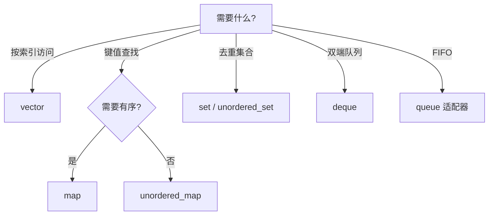

# STL 标准库容器与算法

> **文件编码**：UTF-8。

---

## 0. 读前导读（零基础也能跟上）

### 0.1 用一句话弄懂本章

**STL** = C++ 自带的**标准工具箱**：`vector`、`map`、`string` 和 `<algorithm>` 算法——少手写**门牌号**链表，多开箱即用。

### 0.2 你需要提前知道什么

- [02 章](02-指针引用与内存管理.md) 堆/栈直觉；[03 章](03-面向对象与类设计.md) 类与构造
- 对照 [Java 02 集合](../Java/02-Java常用类集合与泛型.md) 事半功倍
- **真不会 OOP**：03 章至少读完构造/析构

### 0.3 本章知识地图（☐→☑）

- [ ] 熟练 `vector`/`string`/`unordered_map` CRUD
- [ ] 用迭代器 + `sort`/`find`/`lower_bound`
- [ ] 解释迭代器失效、`reserve` 作用
- [ ] 按场景选 `map` vs `unordered_map`
- [ ] §19 闭卷自测 ≥8/10

### 0.4 建议学习时长

**5～7 天**；每天写一个小工具（词频、TopK）。

### 0.5 学完你能做什么

用 **标准工具箱** 完成词频统计；LeetCode 用 `vector`+`unordered_map` 刷 [数据结构 02～05](../数据结构/00-学习路线图与说明.md)；为 05 移动语义准备容器传参场景。

### 0.6 核心类比：标准工具箱

**术语（STL）**：Standard Template Library，容器+迭代器+算法三件套。

**生活类比**：**标准工具箱**——家里装修不必自己打锤子，`vector` 是伸缩收纳盒，`unordered_map` 是带标签抽屉，`<algorithm>` 是成套扳手。

**为什么重要**：工程代码 80% 日常操作 STL；面试手撕也依赖 `vector`/`priority_queue`。

**本章用到的地方**：§2 vector、§4 关联容器、§6 algorithm。

### 0.7 与数据结构系列对照

| STL | 数据结构章 |
|-----|------------|
| `vector` | [02 数组](../数据结构/02-数组与字符串.md) |
| `stack`/`queue` | [04 栈与队列](../数据结构/04-栈与队列.md) |
| `unordered_map` | [05 哈希表](../数据结构/05-哈希表.md) |
| `priority_queue` | [07 堆](../数据结构/07-堆与优先队列.md) |
| 手撕模板 | [C++ 13](13-算法与数据结构C++实现.md) |

---

## 本章与上一章的关系

[03 章](03-面向对象与类设计.md) 你学会了封装与多态；[02 章](02-指针引用与内存管理.md) 你理解了堆内存——**STL 容器在内部帮你管理内存**，对外提供 `vector`、`map` 等安全接口。这是 C++ 日常开发（算法题、服务、引擎工具链）用得最多的库。

对照 [Java 02 集合与泛型](../Java/02-Java常用类集合与泛型.md)：`ArrayList`≈`vector`，`HashMap`≈`unordered_map`。Python 的 `list`/`dict` 见 [Python 02 内置类型](../Python/02-Python内置类型模块与类型注解.md)。本章聚焦**系统向用法**：缓冲区、索引、迭代器、复杂度——不是 Web 表单 CRUD。

---

## 1. 这份文档学什么

- 熟练使用 `vector`、`string`、`map`/`unordered_map`、`set`
- 理解迭代器、范围 for、容量与复杂度
- 使用 `<algorithm>` 排序、查找、去重
- 选对容器：顺序 vs 关联、树 vs 哈希

---

## 2. vector：动态数组

```cpp
#include <iostream>
#include <vector>

int main() {
    std::vector<int> nums;
    nums.push_back(10);
    nums.push_back(20);
    nums.emplace_back(30);  // 原地构造，少一次拷贝

    std::cout << "size=" << nums.size()
              << " cap=" << nums.capacity() << '\n';

    for (int x : nums) {
        std::cout << x << ' ';
    }
    std::cout << '\n';

    nums[1] = 99;
    nums.at(0) = 1;  // 带边界检查

    return 0;
}
```

### 2.1 预留容量

```cpp
#include <vector>

void process_packets() {
    std::vector<std::byte> buf;
    buf.reserve(4096);  // 减少 realloc，类似网络 read 缓冲
    // ... fill buf ...
}
```

| 操作 | 均摊复杂度 |
|------|-----------|
| `push_back` | O(1) 均摊 |
| 随机访问 `[]` | O(1) |
| 中间插入 | O(n) |

---

## 3. string

```cpp
#include <iostream>
#include <string>
#include <string_view>  // C++17

int main() {
    std::string path = "/var/log/app.log";
    auto pos = path.find_last_of('/');
    std::string filename = path.substr(pos + 1);

    std::string_view view(path.data(), filename.size());  // 不拷贝，只读片段

    std::cout << filename << " view=" << view << '\n';
    return 0;
}
```

系统日志路径解析、协议字段切分都依赖 `string`/`string_view`；`string_view` 不拥有内存，**勿指向已销毁 string**。

---

## 4. 关联容器

### 4.1 map（有序，红黑树）

```cpp
#include <iostream>
#include <map>
#include <string>

int main() {
    std::map<std::string, int> freq;
    std::string words[] = {"cpu", "mem", "cpu", "io"};

    for (const auto& w : words) {
        ++freq[w];
    }

    for (const auto& [word, count] : freq) {  // C++17 结构化绑定
        std::cout << word << ": " << count << '\n';
    }
    return 0;
}
```

### 4.2 unordered_map（哈希，均摊 O(1)）

```cpp
#include <iostream>
#include <string>
#include <unordered_map>

int main() {
    std::unordered_map<int, std::string> id_to_name;
    id_to_name[1001] = "worker-1";
    id_to_name[1002] = "worker-2";

    if (auto it = id_to_name.find(1001); it != id_to_name.end()) {
        std::cout << it->second << '\n';
    }
    return 0;
}
```

Java `HashMap` 类似 `unordered_map`；需要有序遍历用 `map`。

---

## 5. 迭代器

```cpp
#include <algorithm>
#include <iostream>
#include <vector>

int main() {
    std::vector<int> v{5, 2, 8, 2, 1};

    auto it = std::find(v.begin(), v.end(), 8);
    if (it != v.end()) {
        std::cout << "找到 8，下标 " << (it - v.begin()) << '\n';
    }

    std::sort(v.begin(), v.end());
    v.erase(std::unique(v.begin(), v.end()), v.end());

    for (int x : v) std::cout << x << ' ';
    std::cout << '\n';
    return 0;
}
```

迭代器是泛型算法的「胶水」；失效规则：vector 扩容后迭代器可能全部失效。

### 5.1 迭代器分类（Iterator Category）

STL 把迭代器分成五类，**类别决定可用算法与复杂度**。算法通过 `iterator_traits<It>::iterator_category` 在编译期选择实现（例如 `sort` 要求随机访问）。

| 类别 | 能力 | 典型容器迭代器 | 支持操作 |
|------|------|---------------|---------|
| **Input** | 单遍只读 | `istream_iterator` | `++`、`*`（读）、`==` |
| **Forward** | 多遍只读 | `forward_list`、哈希表 | Input + 可多次读同一位置 |
| **Bidirectional** | 双向 | `list`、`set`、`map` | Forward + `--` |
| **Random Access** | 随机访问 | `vector`、`deque`、`string` | Bidirectional + `+n`、`-n`、`[]`、`<` |
| **Contiguous**（C++17） | 连续内存 | `vector`、`array`、`string` | Random Access + 元素连续 |

```cpp
#include <iterator>
#include <list>
#include <vector>

void demo_categories() {
    std::vector<int> v{1, 2, 3};
    auto vit = v.begin();
    vit += 2;                    // Random Access：可跳跃
    std::cout << *vit << '\n';   // 3

    std::list<int> lst{1, 2, 3};
    auto lit = lst.begin();
    ++lit; ++lit;                // Bidirectional：只能一步步走
    // lit += 2;                 // 编译错误：list 无随机访问
}
```

**深入解释：为何 `sort` 不能用于 `list`？**  
`std::sort` 内部用快速排序/堆排序，需要 `it + n` 与 O(1) 交换。`list` 迭代器是双向的，`sort` 对 `list` 会编译失败；应使用成员函数 `lst.sort()`（链表归并，O(n log n)）。

### 5.2 迭代器失效规则速查

| 容器 | 插入 | 删除 | 备注 |
|------|------|------|------|
| `vector` | 插入点后全部失效；**扩容则全部失效** | 删除点及之后失效 | `reserve` 可减少扩容 |
| `string` | 同 vector | 同 vector | 小字符串优化不影响失效语义 |
| `deque` | 头尾插入通常不失效中间；中间插入复杂 | 中间删除可能使全部失效 | 实现相关，保守处理 |
| `list`/`forward_list` | 不失效（除被删元素） | 仅被删元素 | 中间插删首选 |
| `map`/`set` | 不失效 | 仅被删元素 | 迭代器指向节点 |
| `unordered_*` | **rehash 则全部失效** | 仅被删元素 | 关注 `load_factor` |

```cpp
#include <iostream>
#include <vector>

void safe_erase(std::vector<int>& v, int value) {
    for (auto it = v.begin(); it != v.end(); ) {
        if (*it == value) {
            it = v.erase(it);  // erase 返回下一个有效迭代器
        } else {
            ++it;
        }
    }
}
```

---

## 6. algorithm 常用算法

```cpp
#include <algorithm>
#include <iostream>
#include <numeric>
#include <vector>

int main() {
    std::vector<int> v{1, 2, 3, 4, 5};

    int sum = std::accumulate(v.begin(), v.end(), 0);

    auto it = std::lower_bound(v.begin(), v.end(), 3);  // 二分，要求已排序

    std::reverse(v.begin(), v.end());

    std::cout << sum << " pos=" << (it - v.begin()) << '\n';
    return 0;
}
```

| 算法 | 用途 | 典型复杂度 |
|------|------|-----------|
| `sort` | 排序 | O(n log n) |
| `stable_sort` | 稳定排序 | O(n log n) |
| `find` / `find_if` | 线性查找 | O(n) |
| `binary_search` / `lower_bound` | 二分（需有序） | O(log n) |
| `unique` + `erase` | 去重（需先 sort） | O(n) |
| `accumulate` | 求和/折叠 | O(n) |
| `copy` / `move` | 拷贝/移动区间 | O(n) |
| `remove` + `erase` | 按条件删除 | O(n) |
| `partition` | 划分区间 | O(n) |
| `min_element` / `max_element` | 最值 | O(n) |

### 6.1 更多 algorithm 实战

```cpp
#include <algorithm>
#include <iostream>
#include <numeric>
#include <string>
#include <vector>

int main() {
    std::vector<int> v{5, 2, 8, 2, 1, 9};

    // 条件删除：删掉所有 2
    v.erase(std::remove(v.begin(), v.end(), 2), v.end());

    // 自定义谓词：删掉偶数
    v.erase(std::remove_if(v.begin(), v.end(),
                           [](int x) { return x % 2 == 0; }),
            v.end());

    // 部分排序：只要前 3 大
    std::partial_sort(v.begin(), v.begin() + 3, v.end(), std::greater<int>());

    // 相邻差分
    std::vector<int> diff(v.size());
    std::adjacent_difference(v.begin(), v.end(), diff.begin());

    for (int x : v) std::cout << x << ' ';
    std::cout << '\n';
    return 0;
}
```

### 6.2 set 与 multiset

```cpp
#include <iostream>
#include <set>

int main() {
    std::set<int> ids{3, 1, 4, 1};  // 自动去重有序：1 3 4
    ids.insert(2);

    if (auto it = ids.find(4); it != ids.end()) {
        std::cout << "found " << *it << '\n';
    }

    // 范围查询 [2, 4]
    for (auto it = ids.lower_bound(2); it != ids.upper_bound(4); ++it) {
        std::cout << *it << ' ';
    }
    std::cout << '\n';
    return 0;
}
```

**深入解释：`lower_bound` / `upper_bound` 在系统里的用法**  
有序 `vector` 或 `map` 上维护时间戳索引、版本号区间查询时，用二分边界比线性扫描 O(n) 更稳。日志检索「某时间段内 ERROR」可先 `lower_bound(start)` 再遍历到 `upper_bound(end)`。

---

## 7. 容器选型



| 场景 | 推荐 |
|------|------|
| 默认动态数组 | `vector` |
| 词频/缓存键值 | `unordered_map` |
| 有序范围查询 | `map` |
| 任务队列 | `deque` + 手动或 `queue` |

### 7.1 全容器复杂度对照表

| 容器 | 随机访问 | 头插 | 尾插 | 中间插 | 查找 | 遍历 | 内存 |
|------|---------|------|------|--------|------|------|------|
| `vector` | O(1) | O(n) | O(1)均摊 | O(n) | O(n) | O(n) | 连续 |
| `deque` | O(1) | O(1) | O(1) | O(n) | O(n) | O(n) | 分块 |
| `list` | 无 | O(1) | O(1) | O(1) | O(n) | O(n) | 节点分散 |
| `forward_list` | 无 | O(1) | — | O(1) | O(n) | O(n) | 更省指针 |
| `map`/`set` | 无 | — | O(log n) | O(log n) | O(log n) | O(n) | 红黑树 |
| `unordered_map`/`set` | 无 | — | O(1)均摊 | O(1)均摊 | O(1)均摊 | O(n) | 哈希桶 |
| `priority_queue` | 无 | — | O(log n) | — | 堆顶 O(1) | — | 堆数组 |

> **均摊**：`vector` 扩容、`unordered_*` rehash 偶尔 O(n)，长期均摊仍为 O(1)。

### 7.2 适配器：stack / queue

```cpp
#include <iostream>
#include <queue>
#include <stack>
#include <vector>

int main() {
    std::stack<int> stk;
    stk.push(1);
    stk.push(2);
    std::cout << stk.top() << '\n';  // 2
    stk.pop();

    std::queue<int> q;
    q.push(10);
    q.push(20);
    std::cout << q.front() << ' ' << q.back() << '\n';
    q.pop();
    return 0;
}
```

底层默认 `deque`，可指定 `std::stack<int, std::vector<int>>` 减少碎片。BFS 用 `queue`，DFS 用 `stack` 或递归。

---

## 8. pair 与 optional（C++17）

```cpp
#include <iostream>
#include <optional>
#include <string>
#include <utility>
#include <vector>

std::optional<int> parse_port(const std::string& s) {
    try {
        int p = std::stoi(s);
        if (p > 0 && p <= 65535) return p;
    } catch (...) {}
    return std::nullopt;
}

int main() {
    auto kv = std::make_pair(std::string("host"), 8080);
    if (auto port = parse_port("8080")) {
        std::cout << kv.first << ':' << *port << '\n';
    }
    return 0;
}
```

---

## 9. 系统编程示例：简易日志聚合

```cpp
#include <iostream>
#include <sstream>
#include <string>
#include <unordered_map>
#include <vector>

struct LogLine {
    std::string level;
    std::string msg;
};

int main() {
    std::vector<LogLine> lines{
        {"ERROR", "disk full"},
        {"INFO", "started"},
        {"ERROR", "timeout"},
    };

    std::unordered_map<std::string, int> level_count;
    for (const auto& ln : lines) {
        ++level_count[ln.level];
    }

    for (const auto& [lvl, cnt] : level_count) {
        std::cout << lvl << " => " << cnt << '\n';
    }
    return 0;
}
```

---

## 10. 手把手：词频统计文件

### 第一步

```powershell
mkdir cpp-ch04-demo && cd cpp-ch04-demo
echo "cpu mem cpu io mem" > metrics.txt
```

### 第二步：word_freq.cpp

```cpp
#include <fstream>
#include <iostream>
#include <sstream>
#include <string>
#include <unordered_map>
#include <vector>
#include <algorithm>

int main() {
    std::ifstream in("metrics.txt");
    if (!in) {
        std::cerr << "无法打开 metrics.txt\n";
        return 1;
    }

    std::unordered_map<std::string, int> freq;
    std::string word;
    while (in >> word) {
        ++freq[word];
    }

    std::vector<std::pair<std::string, int>> items(freq.begin(), freq.end());
    std::sort(items.begin(), items.end(),
              [](const auto& a, const auto& b) { return a.second > b.second; });

    for (const auto& [w, c] : items) {
        std::cout << w << ": " << c << '\n';
    }
    return 0;
}
```

### 第三步

```powershell
g++ -std=c++17 -Wall -Wextra -o word_freq word_freq.cpp
.\word_freq.exe
```

MSVC 需保证源文件与 `metrics.txt` 同目录；中文路径建议 UTF-8 且用宽字符 API（11 章延伸）。

---

## 11. 常见报错与排查

| 报错信息（关键词） | 可能原因 | 解决方案 |
|-------------------|---------|---------|
| `vector subscript out of range`（MSVC debug） | 下标越界 | 用 `at()` 或检查 `size()` |
| `iterator invalidated`（逻辑 bug） | 遍历时 erase/扩容 | 用 erase 返回值或倒序删 |
| `no matching function for sort` | 元素不可比较 | 提供 `operator<` 或比较 lambda |
| `undefined reference` 链接错误 | 仅声明模板 | 模板在头文件实现（06 章） |
| `expected unqualified-id before '['` | 标准低于 C++17 | 加 `-std=c++17` |
| `cannot convert map iterator` | map/unordered_map 混用 | 统一容器类型 |
| `stoi: no conversion` | 字符串非数字 | try/catch 或校验 |
| `basic_string::at: out of range` | string 越界 | 检查长度 |
| g++ `sign-compare` 警告 | size_t 与 int 比 | 统一无符号或 cast |
| 性能突然变差 | vector 频繁头插 | 改 push_back 或 deque |
| `no match for operator+=` on list iterator | 对双向迭代器随机跳跃 | 改用 `++` 或换 `vector` |
| `insert failed: rehash` 逻辑错误 | `unordered_map` rehash 后旧迭代器 | 重新 `find` 或避免长期持有 |
| `erase: first argument is const` | 对 const 容器 erase | 去掉 const 或拷贝后改 |
| `pair` 结构化绑定失败 | 标准 < C++17 | `-std=c++17` |
| `priority_queue` 比较器反了 | 大根/小根堆搞混 | 自定义 `greater<T>` 做小根堆 |
| `map::operator[]` 意外插入 | `[]` 会创建缺失键 | 只读用 `find` + `at`（C++17 map 有 `at`） |
| `substr` 越界或空 | `npos` 处理不当 | 检查 `find` 返回值 |
| `accumulate` 溢出 | `int` 累加过大 | 换 `long long` 或指定累加类型 |
| `binary_search` 总返回 false | 容器未排序 | 先 `sort` 或维护有序插入 |
| `deque` 中间迭代器失效 | 实现相关保守规则 | 插删后不用旧迭代器 |

---

## 12. 练习建议

### 基础

1. 读入 N 个整数存 `vector`，输出最大值与平均值
2. 用 `map` 统计字符串数组中每个词出现次数
3. 对 `vector<int>` 排序并去重

### 进阶

4. 模拟 LRU：固定容量 `unordered_map` + `list`（或手写双向链表）
5. 读文本文件，输出 Top 10 高频词
6. 用 `lower_bound` 维护有序 `vector` 插入（简化索引）

### 挑战

7. 合并两个有序 `vector` 为一个有序 vector（归并）
8. 实现简易 `TopK`：流式整数，维护大小 K 的小根堆（`priority_queue`）

---

## 13. 分级练习参考答案

### 基础：vector 统计

```cpp
#include <iostream>
#include <limits>
#include <numeric>
#include <vector>

int main() {
    std::vector<int> v{3, 1, 4, 1, 5};
    int mx = *std::max_element(v.begin(), v.end());
    double avg = static_cast<double>(
        std::accumulate(v.begin(), v.end(), 0)) / v.size();
    std::cout << mx << ' ' << avg << '\n';
    return 0;
}
```

### 进阶：排序去重

```cpp
#include <algorithm>
#include <iostream>
#include <vector>

int main() {
    std::vector<int> v{3, 1, 4, 1, 5, 9, 2};
    std::sort(v.begin(), v.end());
    v.erase(std::unique(v.begin(), v.end()), v.end());
    for (int x : v) std::cout << x << ' ';
    std::cout << '\n';
    return 0;
}
```

### 挑战：TopK（priority_queue）

```cpp
#include <iostream>
#include <queue>
#include <vector>

int main() {
    std::vector<int> stream{7, 2, 9, 1, 5, 3, 8};
    const int K = 3;
    std::priority_queue<int, std::vector<int>, std::greater<int>> min_heap;

    for (int x : stream) {
        min_heap.push(x);
        if (static_cast<int>(min_heap.size()) > K) min_heap.pop();
    }

    while (!min_heap.empty()) {
        std::cout << min_heap.top() << ' ';
        min_heap.pop();
    }
    std::cout << '\n';
    return 0;
}
```

### 基础：map 词频统计

```cpp
#include <iostream>
#include <map>
#include <string>

int main() {
    std::map<std::string, int> freq;
    std::string words[] = {"cpu", "mem", "cpu", "io", "mem", "cpu"};

    for (const auto& w : words) {
        ++freq[w];
    }

    for (const auto& [word, count] : freq) {
        std::cout << word << ": " << count << '\n';
    }
    return 0;
}
```

### 进阶：归并两个有序 vector

```cpp
#include <iostream>
#include <vector>

std::vector<int> merge_sorted(const std::vector<int>& a, const std::vector<int>& b) {
    std::vector<int> result;
    result.reserve(a.size() + b.size());
    std::size_t i = 0, j = 0;
    while (i < a.size() && j < b.size()) {
        if (a[i] <= b[j]) result.push_back(a[i++]);
        else result.push_back(b[j++]);
    }
    while (i < a.size()) result.push_back(a[i++]);
    while (j < b.size()) result.push_back(b[j++]);
    return result;
}

int main() {
    auto m = merge_sorted({1, 3, 5}, {2, 4, 6});
    for (int x : m) std::cout << x << ' ';
    std::cout << '\n';
    return 0;
}
```

### 进阶：lower_bound 有序插入

```cpp
#include <algorithm>
#include <iostream>
#include <vector>

void sorted_insert(std::vector<int>& v, int x) {
    auto it = std::lower_bound(v.begin(), v.end(), x);
    v.insert(it, x);
}

int main() {
    std::vector<int> v{1, 3, 5, 7};
    sorted_insert(v, 4);
    sorted_insert(v, 5);
    for (int n : v) std::cout << n << ' ';
    std::cout << '\n';  // 1 3 4 5 5 7
    return 0;
}
```

### 挑战：简易 LRU 骨架（list + unordered_map）

```cpp
#include <iostream>
#include <list>
#include <unordered_map>

class LRUCache {
public:
    explicit LRUCache(std::size_t cap) : cap_(cap) {}

    bool get(int key, int& out) {
        auto it = map_.find(key);
        if (it == map_.end()) return false;
        touch(it->second);
        out = it->second->second;
        return true;
    }

    void put(int key, int value) {
        auto it = map_.find(key);
        if (it != map_.end()) {
            it->second->second = value;
            touch(it->second);
            return;
        }
        if (list_.size() >= cap_) {
            map_.erase(list_.back().first);
            list_.pop_back();
        }
        list_.push_front({key, value});
        map_[key] = list_.begin();
    }

private:
    using Node = std::pair<int, int>;
    using ListIt = std::list<Node>::iterator;

    void touch(ListIt it) {
        list_.splice(list_.begin(), list_, it);
    }

    std::size_t cap_;
    std::list<Node> list_;
    std::unordered_map<int, ListIt> map_;
};

int main() {
    LRUCache cache(2);
    cache.put(1, 100);
    cache.put(2, 200);
    cache.put(3, 300);  // 淘汰 key=1
    int v = 0;
    std::cout << cache.get(2, v) << ' ' << v << '\n';
    std::cout << cache.get(1, v) << '\n';
    return 0;
}
```

---

## 14. 深入解释：三个高频面试场景

### 14.1 场景一：vector 扩容与迭代器

```cpp
#include <iostream>
#include <vector>

int main() {
    std::vector<int> v{1, 2, 3};
    auto it = v.begin() + 1;
    std::cout << "cap before=" << v.capacity() << '\n';
    for (int i = 0; i < 100; ++i) v.push_back(i);  // 可能触发 realloc
    // *it;  // 危险：it 可能已失效
    std::cout << "cap after=" << v.capacity() << '\n';
    return 0;
}
```

**结论**：需要长期持有迭代器时，先 `reserve` 预估容量；或在扩容后重新获取迭代器。

### 14.2 场景二：map vs unordered_map 选型

| 需求 | 选 `map` | 选 `unordered_map` |
|------|---------|-------------------|
| 按 key 排序输出 | ✓ | ✗ |
| 范围查询 `lower_bound` | ✓ | ✗ |
| 极致单点查找 | 较慢 O(log n) | ✓ O(1) 均摊 |
| 自定义比较器（非 `<`） | ✓ | 需自定义 hash |
| 内存紧凑、缓存友好 | 树节点分散 | 桶 + 链表，视负载因子 |

连接池「fd → Connection*」用 `unordered_map`；需要按端口有序巡检配置用 `map`。

### 14.3 场景三：`emplace` vs `push`

```cpp
#include <iostream>
#include <string>
#include <vector>

struct Record {
    std::string name;
    int value;
    Record(std::string n, int v) : name(std::move(n)), value(v) {
        std::cout << "构造 " << name << '\n';
    }
    Record(const Record& o) : name(o.name), value(o.value) {
        std::cout << "拷贝 " << name << '\n';
    }
};

int main() {
    std::vector<Record> v;
    v.reserve(4);
    v.push_back(Record{"a", 1});           // 临时对象 + 移动/拷贝进 vector
    v.emplace_back("b", 2);                // 直接在 vector 内存构造
    return 0;
}
```

`emplace_back` 少一次临时对象，对大结构体、带 `string` 的成员尤其划算。

---

## 15. 其他容器速览

### 15.1 deque 与 list

```cpp
#include <deque>
#include <iostream>
#include <list>

int main() {
    std::deque<int> dq;
    dq.push_front(1);  // 头插 O(1)，vector 头插 O(n)
    dq.push_back(2);

    std::list<int> lst{10, 20, 30};
    lst.insert(++lst.begin(), 15);  // 中间插 O(1)，但不支持随机访问

    for (int x : dq) std::cout << x << ' ';
    std::cout << '\n';
    return 0;
}
```

任务调度队列、滑动窗口常用 `deque`；只在中间频繁插删且不需 `[]` 时考虑 `list`。

### 15.2 priority_queue

```cpp
#include <iostream>
#include <queue>
#include <vector>

int main() {
    std::priority_queue<int> max_heap;  // 默认大根堆
    max_heap.push(3);
    max_heap.push(1);
    max_heap.push(4);
    while (!max_heap.empty()) {
        std::cout << max_heap.top() << ' ';
        max_heap.pop();
    }
    std::cout << '\n';
    return 0;
}
```

TopK、定时器、Dijkstra 邻接边筛选都依赖堆；与 13 章算法直接衔接。

---

## 16. FAQ

**Q：vector 和 array 选哪个？**  
编译期定长用 `std::array`；几乎总是 `vector`。

**Q：list 还有用吗？**  
中间频繁插删且不需随机访问时；多数场景 vector 更快（缓存友好）。

**Q：与 Java Stream API？**  
C++20 有 ranges；本资料 C++17 以 algorithm + lambda 为主。

---

## 17. 学完标准

- [ ] 熟练 `vector`/`string`/`unordered_map` 增删查改
- [ ] 会用迭代器与 `<algorithm>` 排序查找
- [ ] 能根据场景选 map vs unordered_map
- [ ] 理解迭代器失效与 `reserve` 意义
- [ ] 完成词频或 TopK 练习
- [ ] 能对照 Java/Python 集合说清异同

---

## 18. 闭卷自测

1. **标准工具箱（STL）** 三大组件是什么？
2. `vector` 头部插入复杂度？末尾 `push_back` 均摊？
3. `reserve(n)` 解决什么问题？
4. 什么操作可能导致 `vector` 迭代器失效？
5. `map` 与 `unordered_map` 底层与适用场景？
6. `std::sort` 平均复杂度？能用于 `list` 吗？
7. `lower_bound` 要求什么前提？
8. 迭代器 `begin()`/`end()` 半开区间含义？
9. 词频统计首选哪个容器？为什么？
10. 04 章与 [数据结构 05 哈希](../数据结构/05-哈希表.md) 分工？

<details>
<summary>自测参考答案</summary>

1. **容器、迭代器、算法**。
2. 头部 O(n)；末尾 **O(1) 均摊**。
3. **预分配容量**，减少 realloc 与迭代器失效次数。
4. **`push_back` 扩容**、插入/erase 中间元素等。
5. `map` **红黑树 O(log n) 有序**；`unordered_map` **哈希 O(1) 均摊无序**。
6. O(n log n)；**不能**直接 sort list（用 `list::sort`）。
7. 序列**已排序**。
8. `[begin, end)` 含 begin 不含 end。
9. **`unordered_map<string,int>`** O(1) 均摊计数。
10. 数据结构讲冲突/负载因子；STL 讲 **API 与迭代器失效**。

</details>

---

## 20. 费曼检验

3 分钟讲「为什么 C++ 程序员要背 STL 而不是手写数组」——用**标准工具箱**类比。

**提纲**：手写像每次现做工具；STL 经过优化与测试；`vector` 自动扩容；算法与容器解耦通过迭代器；刷题与工程都省时间。

---

## 21. FAQ 补充

**Q：04 学完能刷 LeetCode 吗？**  
能覆盖大部分；树/图见 [数据结构 06～08](../数据结构/06-树与二叉树.md) + [C++ 13](13-算法与数据结构C++实现.md)。

**Q：和 Java 02 怎么对照学？**  
`vector`↔`ArrayList`，`unordered_map`↔`HashMap`，但 C++ 要关心**迭代器失效**与**无 GC**。

---

## 22. 手把手：词频统计完整步骤

| 步骤 | 你的动作 | 预期看到什么 | 若不对 |
|------|----------|--------------|--------|
| 1 | 准备 `sample.txt` 若干英文单词 | 文件 UTF-8 | 中文分词超出本章 |
| 2 | `ifstream in("sample.txt");` | 流打开 | 路径错 → fail |
| 3 | `while (in >> word)` 读词 | 循环执行 | 标点粘连 → 先简化 |
| 4 | `++freq[word];` unordered_map | 计数递增 | 见 §11 报错表 |
| 5 | 遍历 map 输出 | 每词一行计数 | 要排序则 `vector<pair>`+sort |

与 [数据结构 05 哈希](../数据结构/05-哈希表.md) 两数之和/字母异位词同一容器思维。

---

## 23. STL 标准工具箱选型决策树

```text
要顺序存、随机访问？ → vector
要键值、要有序？     → map
要键值、要快、无序？ → unordered_map
要两端进出？         → deque / queue
要优先级？           → priority_queue（数据结构 07）
要唯一元素集合？     → unordered_set
```

---

## 24. list 与 forward_list 详解

### 24.1 双向链表 list

`std::list` 是**双向循环链表**容器：每个节点存元素 + 前驱/后继指针。任意位置插入/删除 **O(1)**（已知迭代器），但**不支持随机访问**——`list[i]` 不存在。

```cpp
#include <iostream>
#include <list>
#include <algorithm>

int main() {
    std::list<int> lst = {3, 1, 4, 1, 5};
    lst.sort();                          // 成员 sort，O(n log n)
    lst.unique();                        // 相邻重复去重（需先 sort）
    auto it = std::find(lst.begin(), lst.end(), 4);
    if (it != lst.end()) lst.erase(it);  // O(1) 删除
    lst.splice(lst.begin(), lst, --lst.end()); // 节点搬家，无拷贝
    for (int x : lst) std::cout << x << ' ';
    return 0;
}
```

**Primer Plus 要点**：

| 操作 | list | vector |
|------|------|--------|
| 随机访问 | ❌ O(n) 遍历 | ✅ O(1) |
| 中间 insert/erase | ✅ O(1) | ❌ O(n) |
| 内存布局 | 节点分散堆上 | 连续数组，缓存友好 |
| sort | `list::sort` | `std::sort` |

**何时用 list**：中间频繁插删且**不需要**下标访问；需要 splice 转移节点所有权。多数工程场景 **vector 更快**（CPU 缓存局部性）。

### 24.2 forward_list 单向链表

C++11 引入 `std::forward_list`：单向链表，比 `list` 省一个指针/节点，但无 `size()`（C++20 前），删除前驱需 `erase_after`。

```cpp
#include <forward_list>
#include <iostream>

int main() {
    std::forward_list<int> fl = {1, 2, 3, 4};
    auto before = fl.before_begin();
    fl.insert_after(before, 0);           // 头部插入
    for (int x : fl) std::cout << x << ' ';
    return 0;
}
```

**迭代器**：`forward_list` 只有 ForwardIterator；不能 `--it` 后退。

### 24.3 list 的 splice 与 merge

```cpp
std::list<int> a = {1, 3, 5}, b = {2, 4};
a.merge(b);           // 两有序 list 合并，b 变空
a.splice(a.end(), b); // 整表接到 a 末尾，O(1)
```

`splice` **不拷贝元素**，只改指针——大对象链表合并的首选。

---

## 25. stack 适配器

`std::stack` **不是容器**，是**容器适配器**——底层默认 `deque`，只暴露 `push`/`pop`/`top`。

```cpp
#include <stack>
#include <iostream>

int main() {
    std::stack<int> st;
    st.push(10);
    st.push(20);
    std::cout << st.top() << '\n';  // 20
    st.pop();                        // void，先 top 再 pop
    return 0;
}
```

```cpp
std::stack<int, std::vector<int>> st_vec;
std::stack<int, std::list<int>> st_list;
```

| 操作 | 复杂度 |
|------|--------|
| push / pop / top | O(1) |

对照 [数据结构 04 栈](../数据结构/04-栈与队列.md)：表达式求值、括号匹配、DFS 非递归均用 stack。

---

## 26. queue 与 deque 作为底层

### 26.1 queue：FIFO

```cpp
#include <queue>
#include <iostream>

int main() {
    std::queue<int> q;
    q.push(1);
    q.push(2);
    std::cout << q.front() << ' ' << q.back() << '\n';
    q.pop();
    return 0;
}
```

默认底层 `deque`；BFS 层序遍历、任务调度常用 queue。

### 26.2 deque 为何适合 queue

`deque` 分段连续存储：两端 push/pop **O(1)**，比 `vector` 头部插入 O(n) 更适合 FIFO。

---

## 27. priority_queue 原理与用法

底层默认 **最大堆**（`vector` + `push_heap`/`pop_heap`）。

```cpp
#include <queue>
#include <vector>
#include <iostream>

int main() {
    std::priority_queue<int> max_pq;
    max_pq.push(3);
    max_pq.push(1);
    max_pq.push(4);
    while (!max_pq.empty()) {
        std::cout << max_pq.top() << ' ';
        max_pq.pop();
    }
    std::cout << '\n';

    std::priority_queue<int, std::vector<int>, std::greater<int>> min_pq;
    min_pq.push(3);
    min_pq.push(1);
    std::cout << min_pq.top() << '\n';
    return 0;
}
```

**自定义比较器**：

```cpp
struct Task { int priority; std::string name; };
struct Cmp {
    bool operator()(const Task& a, const Task& b) const {
        return a.priority < b.priority;
    }
};
std::priority_queue<Task, std::vector<Task>, Cmp> tasks;
```

| 操作 | 复杂度 |
|------|--------|
| push | O(log n) |
| pop / top | O(log n) |

---

## 28. emplace_back 与 emplace 原理

### 28.1 push_back vs emplace_back

```cpp
#include <vector>
#include <string>
#include <iostream>

struct Widget {
    Widget(int x, std::string s) : x_(x), s_(std::move(s)) {
        std::cout << "构造 " << s_ << '\n';
    }
    Widget(const Widget& o) : x_(o.x_), s_(o.s_) {
        std::cout << "拷贝 " << s_ << '\n';
    }
    int x_;
    std::string s_;
};

int main() {
    std::vector<Widget> v;
    v.reserve(4);
    v.push_back(Widget(1, "a"));
    v.emplace_back(2, "b");
    return 0;
}
```

**原理**：`emplace_back` 在已分配未构造存储上**原地构造**，避免临时对象。

### 28.2 map 的 emplace / try_emplace

```cpp
std::unordered_map<std::string, int> m;
m.emplace("key", 42);
m.try_emplace("key2", 43);  // C++17：键已存在则不构造 value
```

---

## 29. 迭代器失效完整对照表

| 容器 | 操作 | 失效范围 |
|------|------|----------|
| **vector** | 扩容 push_back | **全部**迭代器、指针、引用 |
| **vector** | insert/erase 中间 | 操作点及之后 |
| **deque** | 中间 insert/erase | **全部** |
| **list** | insert/erase/splice | **仅**被删元素 |
| **map/set** | insert/erase | **仅**被删元素 |
| **unordered_*** | rehash | **全部** |
| **string** | 扩容 | **全部** |

**erase 循环惯用法**：

```cpp
for (auto it = v.begin(); it != v.end(); ) {
    if (*it % 2 == 0) it = v.erase(it);
    else ++it;
}
```

---

## 30. algorithm 复杂度速查表

| 算法 | 前提 | 复杂度 |
|------|------|--------|
| `sort` | 随机访问 | O(n log n) |
| `stable_sort` | 随机访问 | O(n log n) |
| `binary_search` | 已排序 | O(log n) |
| `lower_bound` | 已排序 | O(log n) |
| `find` | 任意 | O(n) |
| `remove` | 任意 | O(n)，不缩短容器 |
| `unique` | 相邻重复 | O(n) |
| `nth_element` | 随机访问 | O(n) 平均 |

**erase-remove**：

```cpp
v.erase(std::remove(v.begin(), v.end(), 0), v.end());
```

---

## 31. numeric 算法库

`#include <numeric>`

```cpp
#include <numeric>
#include <vector>

int main() {
    std::vector<int> v = {1, 2, 3, 4, 5};
    int sum = std::accumulate(v.begin(), v.end(), 0);
    std::partial_sum(v.begin(), v.end(), v.begin());
    std::iota(v.begin(), v.end(), 0);
    return 0;
}
```

| 函数 | 用途 |
|------|------|
| `accumulate` | 求和/归约 |
| `inner_product` | 点积 |
| `partial_sum` | 前缀和 |
| `iota` | 递增填充 |

---

## 32. utility：pair、swap、exchange

```cpp
#include <utility>
#include <string>

int main() {
    std::pair<int, std::string> p{1, "hello"};
    auto [id, msg] = p;
    std::string a = "old", b = "new";
    std::swap(a, b);
    std::string c = std::exchange(a, "reset");
    return 0;
}
```

---

## 33. set / multiset 与 unordered_set 深入

| 容器 | 底层 | 有序 | 重复 |
|------|------|------|------|
| `set` | 红黑树 | ✅ | ❌ |
| `multiset` | 红黑树 | ✅ | ✅ |
| `unordered_set` | 哈希 | ❌ | ❌ |

自定义 hash 需 `Hash` + `Eq` 两个 functor。

---

## 34. deque 与 list 选型实战

- 滑动窗口最大值 → `deque` 单调队列  
- LRU 中间删除 → `list` + `unordered_map`  
- 仅末尾追加 → `vector`

```cpp
std::deque<int> dq;
dq.push_front(0);
dq.push_back(1);
```

---

## 35. 自定义比较器与 sort

比较器须建立**严格弱序**，否则 UB。

```cpp
std::sort(v.begin(), v.end(), [](const Student& a, const Student& b) {
    if (a.score != b.score) return a.score > b.score;
    return a.name < b.name;
});
```

---

## 36. 范围 for 与迭代器陷阱

- 值捕获不修改容器；`for (auto& x : v)` 才修改  
- 循环中 `push_back` 可能扩容 → 勿同时范围 for  
- `vector<bool>` 元素非 `bool&`

---

## 37. 容器成员函数复杂度总表

| 容器 | push_back | insert | find |
|------|-----------|--------|------|
| vector | O(1)* | O(n) | O(n) |
| list | — | O(1) | O(n) |
| map | — | O(log n) | O(log n) |
| unordered_map | — | O(1)* | O(1)* |

*均摊或平均

---

## 38. Primer 综合案例：日志 TopK

```cpp
#include <fstream>
#include <unordered_map>
#include <queue>
#include <vector>
#include <string>

// 读 log → unordered_map 计数 → size-K priority_queue → 输出
```

串联 map 计数 + 堆 TopK，见 §15 priority_queue 与 §10 词频。

---

## 39. 扩展练习（22 题）

**基础 1～8**：括号栈、queue 热土豆、vector 去重排序、lower_bound 插入、list 中间删、set 唯一注册、map 电话簿、stack 逆 Polish。

**进阶 9～16**：WordCount Top10、deque 窗口最大值、emplace 构造次数、迭代器失效 demo、partial_sort TopK、`accumulate` 平方和、双指针交集、grep 关键字行号。

**挑战 17～22**：Dijkstra 小图、容器选型文档、`erase-remove_if` 偶数、CSV stable_sort、解释 list 不能 `std::sort`、合并 k 有序序列思路。

<details>
<summary>提示</summary>

练习 2：遇 `(` push，遇 `)` pop。练习 12：不 reserve 则 `&v[0]` 变。练习 22：用 `list::sort`。

</details>

---

## 40. 扩展 FAQ 与知识地图

**Q：`vector<bool>` 为何特殊？** 位压缩 proxy，不能取 `bool&`。

**Q：C++20 ranges？** 封装迭代器+算法；本路线 C++17 仍以 iterator + algorithm 为主。

### §24～§40 知识地图

- [ ] list vs vector 三项差异  
- [ ] emplace_back 少拷贝的原因  
- [ ] vector 三种迭代器失效操作  
- [ ] sort/find/lower_bound 复杂度  
- [ ] 完成练习 9 或 17  
- [ ] 手写 stack 括号匹配

---

## 41. 适配器三者关系图

```text
容器（vector / deque / list）
        ↑ 底层默认
   stack / queue / priority_queue（适配器，限制接口）
        ↑ 迭代器访问
   algorithm（操作迭代器区间，与具体容器解耦）
```

**Primer 记忆**：适配器「包装」容器；算法「不知道」是 vector 还是 deque，只要迭代器类别匹配。

---

## 42. 迭代器五分类与算法要求

| 分类 | 能力 | 典型容器 | 常用算法 |
|------|------|----------|----------|
| Input | 读，单遍 | istream | find |
| Forward | 读，多遍 | forward_list | replace |
| Bidirectional | ++/-- | list, map | reverse |
| Random Access | +n, [] | vector, deque | sort, nth_element |

`std::sort` 要求 **RandomAccessIterator**——这是 list 不能直接用 `std::sort` 的根本原因。

---

## 43. 扩展闭卷自测（§24～§43）

1. `forward_list` 如何删除第一个元素之后的节点？  
2. `priority_queue` 默认最大堆还是最小堆？如何改最小堆？  
3. `try_emplace` 与 `emplace` 在键已存在时的行为差异？  
4. `remove` 后为何必须 `erase`？  
5. `partial_sum` 输出序列含义？

<details>
<summary>参考答案</summary>

1. `erase_after(before_begin())` 或已知前驱的 `erase_after(it)`。  
2. 最大堆；第三模板参数 `std::greater<T>`。  
3. `try_emplace` 不构造 value；`emplace` 仍可能构造再丢弃。  
4. `remove` 只移动元素，不缩短 `size()`。  
5. 前缀和：第 i 项为原序列 [0..i] 之和。

</details>

---

## 44. 完整 TopK 代码（可编译骨架）

```cpp
#include <fstream>
#include <iostream>
#include <queue>
#include <string>
#include <unordered_map>
#include <utility>
#include <vector>

int main() {
    std::unordered_map<std::string, int> freq;
    std::ifstream in("access.log");
    std::string ip;
    while (in >> ip) ++freq[ip];

    const int K = 10;
    using P = std::pair<int, std::string>;
    auto cmp = [](const P& a, const P& b) { return a.first > b.first; };
    std::priority_queue<P, std::vector<P>, decltype(cmp)> pq(cmp);

    for (const auto& [k, c] : freq) {
        pq.push({c, k});
        if ((int)pq.size() > K) pq.pop();
    }
    while (!pq.empty()) {
        auto [c, k] = pq.top();
        pq.pop();
        std::cout << k << ' ' << c << '\n';
    }
    return 0;
}
```

---

## 45. §24～§45 最终核对清单

- [ ] 能不看资料写出 stack 括号匹配  
- [ ] 能解释 emplace 与 push 构造次数差异  
- [ ] 能背 vector 扩容导致迭代器失效  
- [ ] 能查表答 sort / lower_bound 复杂度  
- [ ] 完成 §39 中至少 5 道练习  
- [ ] 对照 05 章理解容器 + move 组合  

---05 章 [现代 C++ 新特性](05-现代C++新特性.md) 讲 `unique_ptr`、移动语义、`auto`、lambda——让容器传参和返回值更高效，也是 07 章 RAII 的前奏。

---

*下一章：05 现代 C++ 新特性*
