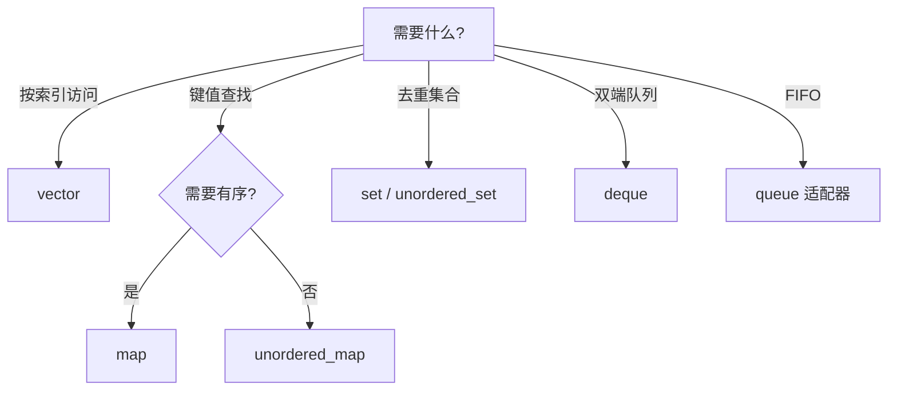

# STL 标准库容器与算法

> **文件编码**：UTF-8。

## 本章与上一章的关系

[03 章](03-面向对象与类设计.md) 你学会了封装与多态；[02 章](02-指针引用与内存管理.md) 你理解了堆内存——**STL 容器在内部帮你管理内存**，对外提供 `vector`、`map` 等安全接口。这是 C++ 日常开发（算法题、服务、引擎工具链）用得最多的库。

对照 [Java 02 集合与泛型](../Java/02-Java常用类集合与泛型.md)：`ArrayList`≈`vector`，`HashMap`≈`unordered_map`。Python 的 `list`/`dict` 见 [Python 02 内置类型](../Python/02-Python内置类型模块与类型注解.md)。本章聚焦**系统向用法**：缓冲区、索引、迭代器、复杂度——不是 Web 表单 CRUD。

---

## 1. 这份文档学什么

- 熟练使用 `vector`、`string`、`map`/`unordered_map`、`set`
- 理解迭代器、范围 for、容量与复杂度
- 使用 `<algorithm>` 排序、查找、去重
- 选对容器：顺序 vs 关联、树 vs 哈希

---

## 2. vector：动态数组

```cpp
#include <iostream>
#include <vector>

int main() {
    std::vector<int> nums;
    nums.push_back(10);
    nums.push_back(20);
    nums.emplace_back(30);  // 原地构造，少一次拷贝

    std::cout << "size=" << nums.size()
              << " cap=" << nums.capacity() << '\n';

    for (int x : nums) {
        std::cout << x << ' ';
    }
    std::cout << '\n';

    nums[1] = 99;
    nums.at(0) = 1;  // 带边界检查

    return 0;
}
```

### 2.1 预留容量

```cpp
#include <vector>

void process_packets() {
    std::vector<std::byte> buf;
    buf.reserve(4096);  // 减少 realloc，类似网络 read 缓冲
    // ... fill buf ...
}
```

| 操作 | 均摊复杂度 |
|------|-----------|
| `push_back` | O(1) 均摊 |
| 随机访问 `[]` | O(1) |
| 中间插入 | O(n) |

---

## 3. string

```cpp
#include <iostream>
#include <string>
#include <string_view>  // C++17

int main() {
    std::string path = "/var/log/app.log";
    auto pos = path.find_last_of('/');
    std::string filename = path.substr(pos + 1);

    std::string_view view(path.data(), filename.size());  // 不拷贝，只读片段

    std::cout << filename << " view=" << view << '\n';
    return 0;
}
```

系统日志路径解析、协议字段切分都依赖 `string`/`string_view`；`string_view` 不拥有内存，**勿指向已销毁 string**。

---

## 4. 关联容器

### 4.1 map（有序，红黑树）

```cpp
#include <iostream>
#include <map>
#include <string>

int main() {
    std::map<std::string, int> freq;
    std::string words[] = {"cpu", "mem", "cpu", "io"};

    for (const auto& w : words) {
        ++freq[w];
    }

    for (const auto& [word, count] : freq) {  // C++17 结构化绑定
        std::cout << word << ": " << count << '\n';
    }
    return 0;
}
```

### 4.2 unordered_map（哈希，均摊 O(1)）

```cpp
#include <iostream>
#include <string>
#include <unordered_map>

int main() {
    std::unordered_map<int, std::string> id_to_name;
    id_to_name[1001] = "worker-1";
    id_to_name[1002] = "worker-2";

    if (auto it = id_to_name.find(1001); it != id_to_name.end()) {
        std::cout << it->second << '\n';
    }
    return 0;
}
```

Java `HashMap` 类似 `unordered_map`；需要有序遍历用 `map`。

---

## 5. 迭代器

```cpp
#include <algorithm>
#include <iostream>
#include <vector>

int main() {
    std::vector<int> v{5, 2, 8, 2, 1};

    auto it = std::find(v.begin(), v.end(), 8);
    if (it != v.end()) {
        std::cout << "找到 8，下标 " << (it - v.begin()) << '\n';
    }

    std::sort(v.begin(), v.end());
    v.erase(std::unique(v.begin(), v.end()), v.end());

    for (int x : v) std::cout << x << ' ';
    std::cout << '\n';
    return 0;
}
```

迭代器是泛型算法的「胶水」；失效规则：vector 扩容后迭代器可能全部失效。

### 5.1 迭代器分类（Iterator Category）

STL 把迭代器分成五类，**类别决定可用算法与复杂度**。算法通过 `iterator_traits<It>::iterator_category` 在编译期选择实现（例如 `sort` 要求随机访问）。

| 类别 | 能力 | 典型容器迭代器 | 支持操作 |
|------|------|---------------|---------|
| **Input** | 单遍只读 | `istream_iterator` | `++`、`*`（读）、`==` |
| **Forward** | 多遍只读 | `forward_list`、哈希表 | Input + 可多次读同一位置 |
| **Bidirectional** | 双向 | `list`、`set`、`map` | Forward + `--` |
| **Random Access** | 随机访问 | `vector`、`deque`、`string` | Bidirectional + `+n`、`-n`、`[]`、`<` |
| **Contiguous**（C++17） | 连续内存 | `vector`、`array`、`string` | Random Access + 元素连续 |

```cpp
#include <iterator>
#include <list>
#include <vector>

void demo_categories() {
    std::vector<int> v{1, 2, 3};
    auto vit = v.begin();
    vit += 2;                    // Random Access：可跳跃
    std::cout << *vit << '\n';   // 3

    std::list<int> lst{1, 2, 3};
    auto lit = lst.begin();
    ++lit; ++lit;                // Bidirectional：只能一步步走
    // lit += 2;                 // 编译错误：list 无随机访问
}
```

**深入解释：为何 `sort` 不能用于 `list`？**  
`std::sort` 内部用快速排序/堆排序，需要 `it + n` 与 O(1) 交换。`list` 迭代器是双向的，`sort` 对 `list` 会编译失败；应使用成员函数 `lst.sort()`（链表归并，O(n log n)）。

### 5.2 迭代器失效规则速查

| 容器 | 插入 | 删除 | 备注 |
|------|------|------|------|
| `vector` | 插入点后全部失效；**扩容则全部失效** | 删除点及之后失效 | `reserve` 可减少扩容 |
| `string` | 同 vector | 同 vector | 小字符串优化不影响失效语义 |
| `deque` | 头尾插入通常不失效中间；中间插入复杂 | 中间删除可能使全部失效 | 实现相关，保守处理 |
| `list`/`forward_list` | 不失效（除被删元素） | 仅被删元素 | 中间插删首选 |
| `map`/`set` | 不失效 | 仅被删元素 | 迭代器指向节点 |
| `unordered_*` | **rehash 则全部失效** | 仅被删元素 | 关注 `load_factor` |

```cpp
#include <iostream>
#include <vector>

void safe_erase(std::vector<int>& v, int value) {
    for (auto it = v.begin(); it != v.end(); ) {
        if (*it == value) {
            it = v.erase(it);  // erase 返回下一个有效迭代器
        } else {
            ++it;
        }
    }
}
```

---

## 6. algorithm 常用算法

```cpp
#include <algorithm>
#include <iostream>
#include <numeric>
#include <vector>

int main() {
    std::vector<int> v{1, 2, 3, 4, 5};

    int sum = std::accumulate(v.begin(), v.end(), 0);

    auto it = std::lower_bound(v.begin(), v.end(), 3);  // 二分，要求已排序

    std::reverse(v.begin(), v.end());

    std::cout << sum << " pos=" << (it - v.begin()) << '\n';
    return 0;
}
```

| 算法 | 用途 | 典型复杂度 |
|------|------|-----------|
| `sort` | 排序 | O(n log n) |
| `stable_sort` | 稳定排序 | O(n log n) |
| `find` / `find_if` | 线性查找 | O(n) |
| `binary_search` / `lower_bound` | 二分（需有序） | O(log n) |
| `unique` + `erase` | 去重（需先 sort） | O(n) |
| `accumulate` | 求和/折叠 | O(n) |
| `copy` / `move` | 拷贝/移动区间 | O(n) |
| `remove` + `erase` | 按条件删除 | O(n) |
| `partition` | 划分区间 | O(n) |
| `min_element` / `max_element` | 最值 | O(n) |

### 6.1 更多 algorithm 实战

```cpp
#include <algorithm>
#include <iostream>
#include <numeric>
#include <string>
#include <vector>

int main() {
    std::vector<int> v{5, 2, 8, 2, 1, 9};

    // 条件删除：删掉所有 2
    v.erase(std::remove(v.begin(), v.end(), 2), v.end());

    // 自定义谓词：删掉偶数
    v.erase(std::remove_if(v.begin(), v.end(),
                           [](int x) { return x % 2 == 0; }),
            v.end());

    // 部分排序：只要前 3 大
    std::partial_sort(v.begin(), v.begin() + 3, v.end(), std::greater<int>());

    // 相邻差分
    std::vector<int> diff(v.size());
    std::adjacent_difference(v.begin(), v.end(), diff.begin());

    for (int x : v) std::cout << x << ' ';
    std::cout << '\n';
    return 0;
}
```

### 6.2 set 与 multiset

```cpp
#include <iostream>
#include <set>

int main() {
    std::set<int> ids{3, 1, 4, 1};  // 自动去重有序：1 3 4
    ids.insert(2);

    if (auto it = ids.find(4); it != ids.end()) {
        std::cout << "found " << *it << '\n';
    }

    // 范围查询 [2, 4]
    for (auto it = ids.lower_bound(2); it != ids.upper_bound(4); ++it) {
        std::cout << *it << ' ';
    }
    std::cout << '\n';
    return 0;
}
```

**深入解释：`lower_bound` / `upper_bound` 在系统里的用法**  
有序 `vector` 或 `map` 上维护时间戳索引、版本号区间查询时，用二分边界比线性扫描 O(n) 更稳。日志检索「某时间段内 ERROR」可先 `lower_bound(start)` 再遍历到 `upper_bound(end)`。

---

## 7. 容器选型



| 场景 | 推荐 |
|------|------|
| 默认动态数组 | `vector` |
| 词频/缓存键值 | `unordered_map` |
| 有序范围查询 | `map` |
| 任务队列 | `deque` + 手动或 `queue` |

### 7.1 全容器复杂度对照表

| 容器 | 随机访问 | 头插 | 尾插 | 中间插 | 查找 | 遍历 | 内存 |
|------|---------|------|------|--------|------|------|------|
| `vector` | O(1) | O(n) | O(1)均摊 | O(n) | O(n) | O(n) | 连续 |
| `deque` | O(1) | O(1) | O(1) | O(n) | O(n) | O(n) | 分块 |
| `list` | 无 | O(1) | O(1) | O(1) | O(n) | O(n) | 节点分散 |
| `forward_list` | 无 | O(1) | — | O(1) | O(n) | O(n) | 更省指针 |
| `map`/`set` | 无 | — | O(log n) | O(log n) | O(log n) | O(n) | 红黑树 |
| `unordered_map`/`set` | 无 | — | O(1)均摊 | O(1)均摊 | O(1)均摊 | O(n) | 哈希桶 |
| `priority_queue` | 无 | — | O(log n) | — | 堆顶 O(1) | — | 堆数组 |

> **均摊**：`vector` 扩容、`unordered_*` rehash 偶尔 O(n)，长期均摊仍为 O(1)。

### 7.2 适配器：stack / queue

```cpp
#include <iostream>
#include <queue>
#include <stack>
#include <vector>

int main() {
    std::stack<int> stk;
    stk.push(1);
    stk.push(2);
    std::cout << stk.top() << '\n';  // 2
    stk.pop();

    std::queue<int> q;
    q.push(10);
    q.push(20);
    std::cout << q.front() << ' ' << q.back() << '\n';
    q.pop();
    return 0;
}
```

底层默认 `deque`，可指定 `std::stack<int, std::vector<int>>` 减少碎片。BFS 用 `queue`，DFS 用 `stack` 或递归。

---

## 8. pair 与 optional（C++17）

```cpp
#include <iostream>
#include <optional>
#include <string>
#include <utility>
#include <vector>

std::optional<int> parse_port(const std::string& s) {
    try {
        int p = std::stoi(s);
        if (p > 0 && p <= 65535) return p;
    } catch (...) {}
    return std::nullopt;
}

int main() {
    auto kv = std::make_pair(std::string("host"), 8080);
    if (auto port = parse_port("8080")) {
        std::cout << kv.first << ':' << *port << '\n';
    }
    return 0;
}
```

---

## 9. 系统编程示例：简易日志聚合

```cpp
#include <iostream>
#include <sstream>
#include <string>
#include <unordered_map>
#include <vector>

struct LogLine {
    std::string level;
    std::string msg;
};

int main() {
    std::vector<LogLine> lines{
        {"ERROR", "disk full"},
        {"INFO", "started"},
        {"ERROR", "timeout"},
    };

    std::unordered_map<std::string, int> level_count;
    for (const auto& ln : lines) {
        ++level_count[ln.level];
    }

    for (const auto& [lvl, cnt] : level_count) {
        std::cout << lvl << " => " << cnt << '\n';
    }
    return 0;
}
```

---

## 10. 手把手：词频统计文件

### 第一步

```powershell
mkdir cpp-ch04-demo && cd cpp-ch04-demo
echo "cpu mem cpu io mem" > metrics.txt
```

### 第二步：word_freq.cpp

```cpp
#include <fstream>
#include <iostream>
#include <sstream>
#include <string>
#include <unordered_map>
#include <vector>
#include <algorithm>

int main() {
    std::ifstream in("metrics.txt");
    if (!in) {
        std::cerr << "无法打开 metrics.txt\n";
        return 1;
    }

    std::unordered_map<std::string, int> freq;
    std::string word;
    while (in >> word) {
        ++freq[word];
    }

    std::vector<std::pair<std::string, int>> items(freq.begin(), freq.end());
    std::sort(items.begin(), items.end(),
              [](const auto& a, const auto& b) { return a.second > b.second; });

    for (const auto& [w, c] : items) {
        std::cout << w << ": " << c << '\n';
    }
    return 0;
}
```

### 第三步

```powershell
g++ -std=c++17 -Wall -Wextra -o word_freq word_freq.cpp
.\word_freq.exe
```

MSVC 需保证源文件与 `metrics.txt` 同目录；中文路径建议 UTF-8 且用宽字符 API（11 章延伸）。

---

## 11. 常见报错与排查

| 报错信息（关键词） | 可能原因 | 解决方案 |
|-------------------|---------|---------|
| `vector subscript out of range`（MSVC debug） | 下标越界 | 用 `at()` 或检查 `size()` |
| `iterator invalidated`（逻辑 bug） | 遍历时 erase/扩容 | 用 erase 返回值或倒序删 |
| `no matching function for sort` | 元素不可比较 | 提供 `operator<` 或比较 lambda |
| `undefined reference` 链接错误 | 仅声明模板 | 模板在头文件实现（06 章） |
| `expected unqualified-id before '['` | 标准低于 C++17 | 加 `-std=c++17` |
| `cannot convert map iterator` | map/unordered_map 混用 | 统一容器类型 |
| `stoi: no conversion` | 字符串非数字 | try/catch 或校验 |
| `basic_string::at: out of range` | string 越界 | 检查长度 |
| g++ `sign-compare` 警告 | size_t 与 int 比 | 统一无符号或 cast |
| 性能突然变差 | vector 频繁头插 | 改 push_back 或 deque |
| `no match for operator+=` on list iterator | 对双向迭代器随机跳跃 | 改用 `++` 或换 `vector` |
| `insert failed: rehash` 逻辑错误 | `unordered_map` rehash 后旧迭代器 | 重新 `find` 或避免长期持有 |
| `erase: first argument is const` | 对 const 容器 erase | 去掉 const 或拷贝后改 |
| `pair` 结构化绑定失败 | 标准 < C++17 | `-std=c++17` |
| `priority_queue` 比较器反了 | 大根/小根堆搞混 | 自定义 `greater<T>` 做小根堆 |
| `map::operator[]` 意外插入 | `[]` 会创建缺失键 | 只读用 `find` + `at`（C++17 map 有 `at`） |
| `substr` 越界或空 | `npos` 处理不当 | 检查 `find` 返回值 |
| `accumulate` 溢出 | `int` 累加过大 | 换 `long long` 或指定累加类型 |
| `binary_search` 总返回 false | 容器未排序 | 先 `sort` 或维护有序插入 |
| `deque` 中间迭代器失效 | 实现相关保守规则 | 插删后不用旧迭代器 |

---

## 12. 练习建议

### 基础

1. 读入 N 个整数存 `vector`，输出最大值与平均值
2. 用 `map` 统计字符串数组中每个词出现次数
3. 对 `vector<int>` 排序并去重

### 进阶

4. 模拟 LRU：固定容量 `unordered_map` + `list`（或手写双向链表）
5. 读文本文件，输出 Top 10 高频词
6. 用 `lower_bound` 维护有序 `vector` 插入（简化索引）

### 挑战

7. 合并两个有序 `vector` 为一个有序 vector（归并）
8. 实现简易 `TopK`：流式整数，维护大小 K 的小根堆（`priority_queue`）

---

## 13. 分级练习参考答案

### 基础：vector 统计

```cpp
#include <iostream>
#include <limits>
#include <numeric>
#include <vector>

int main() {
    std::vector<int> v{3, 1, 4, 1, 5};
    int mx = *std::max_element(v.begin(), v.end());
    double avg = static_cast<double>(
        std::accumulate(v.begin(), v.end(), 0)) / v.size();
    std::cout << mx << ' ' << avg << '\n';
    return 0;
}
```

### 进阶：排序去重

```cpp
#include <algorithm>
#include <iostream>
#include <vector>

int main() {
    std::vector<int> v{3, 1, 4, 1, 5, 9, 2};
    std::sort(v.begin(), v.end());
    v.erase(std::unique(v.begin(), v.end()), v.end());
    for (int x : v) std::cout << x << ' ';
    std::cout << '\n';
    return 0;
}
```

### 挑战：TopK（priority_queue）

```cpp
#include <iostream>
#include <queue>
#include <vector>

int main() {
    std::vector<int> stream{7, 2, 9, 1, 5, 3, 8};
    const int K = 3;
    std::priority_queue<int, std::vector<int>, std::greater<int>> min_heap;

    for (int x : stream) {
        min_heap.push(x);
        if (static_cast<int>(min_heap.size()) > K) min_heap.pop();
    }

    while (!min_heap.empty()) {
        std::cout << min_heap.top() << ' ';
        min_heap.pop();
    }
    std::cout << '\n';
    return 0;
}
```

### 基础：map 词频统计

```cpp
#include <iostream>
#include <map>
#include <string>

int main() {
    std::map<std::string, int> freq;
    std::string words[] = {"cpu", "mem", "cpu", "io", "mem", "cpu"};

    for (const auto& w : words) {
        ++freq[w];
    }

    for (const auto& [word, count] : freq) {
        std::cout << word << ": " << count << '\n';
    }
    return 0;
}
```

### 进阶：归并两个有序 vector

```cpp
#include <iostream>
#include <vector>

std::vector<int> merge_sorted(const std::vector<int>& a, const std::vector<int>& b) {
    std::vector<int> result;
    result.reserve(a.size() + b.size());
    std::size_t i = 0, j = 0;
    while (i < a.size() && j < b.size()) {
        if (a[i] <= b[j]) result.push_back(a[i++]);
        else result.push_back(b[j++]);
    }
    while (i < a.size()) result.push_back(a[i++]);
    while (j < b.size()) result.push_back(b[j++]);
    return result;
}

int main() {
    auto m = merge_sorted({1, 3, 5}, {2, 4, 6});
    for (int x : m) std::cout << x << ' ';
    std::cout << '\n';
    return 0;
}
```

### 进阶：lower_bound 有序插入

```cpp
#include <algorithm>
#include <iostream>
#include <vector>

void sorted_insert(std::vector<int>& v, int x) {
    auto it = std::lower_bound(v.begin(), v.end(), x);
    v.insert(it, x);
}

int main() {
    std::vector<int> v{1, 3, 5, 7};
    sorted_insert(v, 4);
    sorted_insert(v, 5);
    for (int n : v) std::cout << n << ' ';
    std::cout << '\n';  // 1 3 4 5 5 7
    return 0;
}
```

### 挑战：简易 LRU 骨架（list + unordered_map）

```cpp
#include <iostream>
#include <list>
#include <unordered_map>

class LRUCache {
public:
    explicit LRUCache(std::size_t cap) : cap_(cap) {}

    bool get(int key, int& out) {
        auto it = map_.find(key);
        if (it == map_.end()) return false;
        touch(it->second);
        out = it->second->second;
        return true;
    }

    void put(int key, int value) {
        auto it = map_.find(key);
        if (it != map_.end()) {
            it->second->second = value;
            touch(it->second);
            return;
        }
        if (list_.size() >= cap_) {
            map_.erase(list_.back().first);
            list_.pop_back();
        }
        list_.push_front({key, value});
        map_[key] = list_.begin();
    }

private:
    using Node = std::pair<int, int>;
    using ListIt = std::list<Node>::iterator;

    void touch(ListIt it) {
        list_.splice(list_.begin(), list_, it);
    }

    std::size_t cap_;
    std::list<Node> list_;
    std::unordered_map<int, ListIt> map_;
};

int main() {
    LRUCache cache(2);
    cache.put(1, 100);
    cache.put(2, 200);
    cache.put(3, 300);  // 淘汰 key=1
    int v = 0;
    std::cout << cache.get(2, v) << ' ' << v << '\n';
    std::cout << cache.get(1, v) << '\n';
    return 0;
}
```

---

## 14. 深入解释：三个高频面试场景

### 14.1 场景一：vector 扩容与迭代器

```cpp
#include <iostream>
#include <vector>

int main() {
    std::vector<int> v{1, 2, 3};
    auto it = v.begin() + 1;
    std::cout << "cap before=" << v.capacity() << '\n';
    for (int i = 0; i < 100; ++i) v.push_back(i);  // 可能触发 realloc
    // *it;  // 危险：it 可能已失效
    std::cout << "cap after=" << v.capacity() << '\n';
    return 0;
}
```

**结论**：需要长期持有迭代器时，先 `reserve` 预估容量；或在扩容后重新获取迭代器。

### 14.2 场景二：map vs unordered_map 选型

| 需求 | 选 `map` | 选 `unordered_map` |
|------|---------|-------------------|
| 按 key 排序输出 | ✓ | ✗ |
| 范围查询 `lower_bound` | ✓ | ✗ |
| 极致单点查找 | 较慢 O(log n) | ✓ O(1) 均摊 |
| 自定义比较器（非 `<`） | ✓ | 需自定义 hash |
| 内存紧凑、缓存友好 | 树节点分散 | 桶 + 链表，视负载因子 |

连接池「fd → Connection*」用 `unordered_map`；需要按端口有序巡检配置用 `map`。

### 14.3 场景三：`emplace` vs `push`

```cpp
#include <iostream>
#include <string>
#include <vector>

struct Record {
    std::string name;
    int value;
    Record(std::string n, int v) : name(std::move(n)), value(v) {
        std::cout << "构造 " << name << '\n';
    }
    Record(const Record& o) : name(o.name), value(o.value) {
        std::cout << "拷贝 " << name << '\n';
    }
};

int main() {
    std::vector<Record> v;
    v.reserve(4);
    v.push_back(Record{"a", 1});           // 临时对象 + 移动/拷贝进 vector
    v.emplace_back("b", 2);                // 直接在 vector 内存构造
    return 0;
}
```

`emplace_back` 少一次临时对象，对大结构体、带 `string` 的成员尤其划算。

---

## 15. 其他容器速览

### 15.1 deque 与 list

```cpp
#include <deque>
#include <iostream>
#include <list>

int main() {
    std::deque<int> dq;
    dq.push_front(1);  // 头插 O(1)，vector 头插 O(n)
    dq.push_back(2);

    std::list<int> lst{10, 20, 30};
    lst.insert(++lst.begin(), 15);  // 中间插 O(1)，但不支持随机访问

    for (int x : dq) std::cout << x << ' ';
    std::cout << '\n';
    return 0;
}
```

任务调度队列、滑动窗口常用 `deque`；只在中间频繁插删且不需 `[]` 时考虑 `list`。

### 15.2 priority_queue

```cpp
#include <iostream>
#include <queue>
#include <vector>

int main() {
    std::priority_queue<int> max_heap;  // 默认大根堆
    max_heap.push(3);
    max_heap.push(1);
    max_heap.push(4);
    while (!max_heap.empty()) {
        std::cout << max_heap.top() << ' ';
        max_heap.pop();
    }
    std::cout << '\n';
    return 0;
}
```

TopK、定时器、Dijkstra 邻接边筛选都依赖堆；与 13 章算法直接衔接。

---

## 16. FAQ

**Q：vector 和 array 选哪个？**  
编译期定长用 `std::array`；几乎总是 `vector`。

**Q：list 还有用吗？**  
中间频繁插删且不需随机访问时；多数场景 vector 更快（缓存友好）。

**Q：与 Java Stream API？**  
C++20 有 ranges；本资料 C++17 以 algorithm + lambda 为主。

---

## 17. 学完标准

- [ ] 熟练 `vector`/`string`/`unordered_map` 增删查改
- [ ] 会用迭代器与 `<algorithm>` 排序查找
- [ ] 能根据场景选 map vs unordered_map
- [ ] 理解迭代器失效与 `reserve` 意义
- [ ] 完成词频或 TopK 练习
- [ ] 能对照 Java/Python 集合说清异同

---

## 18. 下一章预告

STL 容器内部仍大量使用拷贝。05 章 [现代 C++ 新特性](05-现代C++新特性.md) 讲 `unique_ptr`、移动语义、`auto`、lambda——让容器传参和返回值更高效，也是 07 章 RAII 的前奏。

---

*下一章：05 现代 C++ 新特性*
