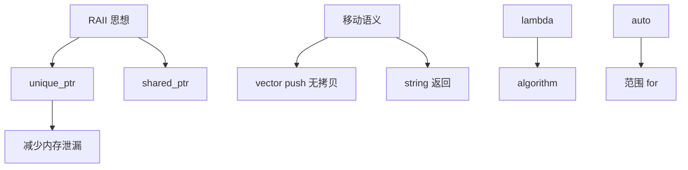
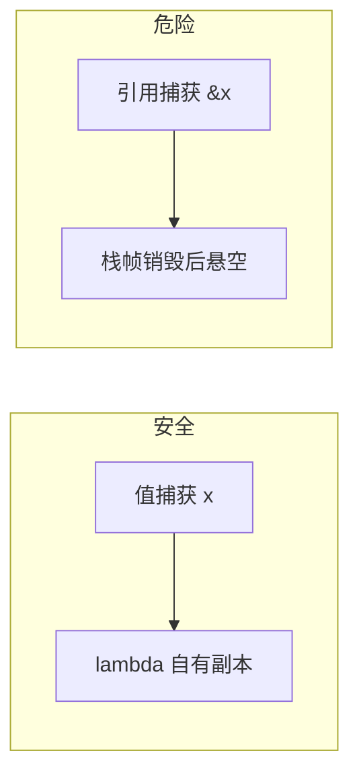

# 现代 C++ 新特性

> **文件编码**：UTF-8。

---

## 0. 读前导读（零基础也能跟上）

### 0.1 用一句话弄懂本章

**现代 C++** = 默认 `unique_ptr`、用 `move` 转移资源、用 `lambda` 写回调——把 02 的手动退租升级成「带合同的**门牌号**」。

### 0.2 你需要提前知道什么

- [02 章](02-指针引用与内存管理.md) 指针；[03 章](03-面向对象与类设计.md) 构造/析构/拷贝
- [04 章](04-STL标准库容器与算法.md) 容器传参
- 07 章 **自动关门（RAII）** 在本章智能指针上先体验

### 0.3 本章知识地图（☐→☑）

- [ ] 默认 `make_unique`/`make_shared`
- [ ] 解释 move vs copy
- [ ] 写移动构造/移动赋值
- [ ] 熟练 lambda、auto、结构化绑定
- [ ] §18 闭卷自测 ≥8/10

### 0.4 建议学习时长

**4～6 天**；move 语义需反复实验（§10 手把手）。

### 0.5 学完你能做什么

用 `unique_ptr` 管理文件/内存；返回值优化大对象；为 07 RAII 与 08 线程安全队列打基础。

### 0.6 与 Java / 数据结构

| 本章 | 对照 |
|------|------|
| 无 GC | [Java 01](../Java/01-Java基础语法与面向对象.md) 对象在堆 |
| `move` 转移 | Java 只有引用拷贝；大对象 C++ 可「偷」资源 |
| 容器返回值 | [数据结构 02](../数据结构/02-线性结构/01-数组.md) vector 作题容器 |

---

## 本章与上一章的关系

[04 章](04-STL标准库容器与算法.md) 的 `vector`、`string` 在拷贝大对象时开销明显；[02 章](02-指针引用与内存管理.md) 的 raw `new`/`delete` 容易泄漏。**现代 C++（C++11/14/17）** 用智能指针、移动语义、lambda 等，在保持性能的同时提高安全性。

本章是工程 C++ 的分水岭：写完本章，你应默认 `unique_ptr` 而非 naked `new`。对照 [Java](../Java/01-Java基础语法与面向对象.md)（无手动内存）与 [Python](../Python/01-Python基础语法与面向对象.md)（GC），C++ 通过 **RAII + 移动** 达到「零成本抽象」。系统软件、游戏、高频交易都建立在 move + 智能指针之上。

---

## 1. 这份文档学什么

- `unique_ptr` / `shared_ptr` / `weak_ptr` 使用场景
- 右值引用与 `std::move` 语义
- `auto`、`decltype`、范围 for、lambda
- `enum class`、结构化绑定、`std::optional`
- 默认/删除函数、`= default`

---

## 2. 智能指针

### 2.1 unique_ptr — 独占所有权

```cpp
#include <iostream>
#include <memory>
#include <vector>

class Packet {
public:
    explicit Packet(int id) : id_(id) {
        std::cout << "Packet " << id_ << " 构造\n";
    }
    ~Packet() { std::cout << "Packet " << id_ << " 析构\n"; }
    int id() const { return id_; }

private:
    int id_;
};

int main() {
    auto p = std::make_unique<Packet>(1);  // 推荐 make_unique
    std::vector<std::unique_ptr<Packet>> queue;
    queue.push_back(std::make_unique<Packet>(2));
    // queue.push_back(p);  // 错误：不可拷贝
    queue.push_back(std::move(p));  // 转移所有权
    if (!p) std::cout << "p 已空\n";
    return 0;
}  // 自动释放
```

### 2.2 shared_ptr — 共享所有权

```cpp
#include <iostream>
#include <memory>
#include <string>

int main() {
    auto cfg = std::make_shared<std::string>("config.toml");
    std::weak_ptr<std::string> weak = cfg;

    {
        auto copy = cfg;
        std::cout << "use_count=" << cfg.use_count() << '\n';
    }

    cfg.reset();
    if (weak.expired()) {
        std::cout << "对象已销毁\n";
    }
    return 0;
}
```

| 指针 | 场景 |
|------|------|
| `unique_ptr` | 默认选择，工厂返回、容器元素 |
| `shared_ptr` | 多处共享同一资源（谨慎，有原子开销） |
| `weak_ptr` | 打破 `shared_ptr` 循环引用 |

---

## 3. 移动语义

### 3.1 左值与右值

```cpp
#include <iostream>
#include <string>
#include <utility>
#include <vector>

int main() {
    std::string a = "hello";
    std::string b = std::move(a);  // 移动：a 资源转给 b

    std::cout << "b=" << b << " a=" << a << '\n';  // a 可能为空

    std::vector<std::string> v;
    v.push_back(std::move(b));  // 避免拷贝大字符串
    return 0;
}
```

### 3.2 移动构造示例

```cpp
#include <iostream>
#include <utility>

class Buffer {
public:
    explicit Buffer(std::size_t n) : size_(n), data_(new char[n]) {}
    ~Buffer() { delete[] data_; }

    Buffer(Buffer&& other) noexcept
        : size_(other.size_), data_(other.data_) {
        other.data_ = nullptr;
        other.size_ = 0;
    }

    Buffer& operator=(Buffer&& other) noexcept {
        if (this == &other) return *this;
        delete[] data_;
        size_ = other.size_;
        data_ = other.data_;
        other.data_ = nullptr;
        other.size_ = 0;
        return *this;
    }

    Buffer(const Buffer&) = delete;
    Buffer& operator=(const Buffer&) = delete;

    std::size_t size() const { return size_; }

private:
    std::size_t size_;
    char* data_;
};

int main() {
    Buffer a(1024);
    Buffer b = std::move(a);
    std::cout << b.size() << '\n';
    return 0;
}
```

**Rule of Five**：析构、拷贝构造/赋值、移动构造/赋值。

### 3.3 Rule of Zero / Three / Five / Six 详解

C++ 资源管理演进可概括为四条「规则」：

| 规则 | 含义 | 何时适用 |
|------|------|---------|
| **Rule of Zero** | 不显式定义析构/拷贝/移动 | 成员全是 RAII 类型（`string`、`vector`、`unique_ptr`） |
| **Rule of Three** | 析构 + 拷贝构造 + 拷贝赋值 | C++98 管理 raw 资源时 |
| **Rule of Five** | Three + 移动构造 + 移动赋值 | C++11 起管理 raw 资源 |
| **Rule of Six**（口语） | Five + 默认构造 | 面试偶尔提及 |

```cpp
#include <iostream>
#include <string>
#include <vector>

// Rule of Zero：编译器生成的特殊成员就够
class LogBatch {
public:
    void add(std::string line) { lines_.push_back(std::move(line)); }
    std::size_t size() const { return lines_.size(); }

private:
    std::vector<std::string> lines_;  // vector 自己管内存
};
```

**Rule of Five 完整示例**（管理 `char*`）：

```cpp
#include <cstring>
#include <iostream>
#include <utility>

class Buffer {
public:
    explicit Buffer(std::size_t n) : size_(n), data_(new char[n]{}) {}

    ~Buffer() { delete[] data_; }

    Buffer(const Buffer& o) : size_(o.size_), data_(new char[size_]) {
        std::memcpy(data_, o.data_, size_);
    }

    Buffer& operator=(const Buffer& o) {
        if (this == &o) return *this;
        Buffer tmp(o);   // copy-and-swap 技巧
        swap(tmp);
        return *this;
    }

    Buffer(Buffer&& o) noexcept : size_(o.size_), data_(o.data_) {
        o.data_ = nullptr;
        o.size_ = 0;
    }

    Buffer& operator=(Buffer&& o) noexcept {
        if (this == &o) return *this;
        delete[] data_;
        size_ = o.size_;
        data_ = o.data_;
        o.data_ = nullptr;
        o.size_ = 0;
        return *this;
    }

    void swap(Buffer& o) noexcept {
        std::swap(size_, o.size_);
        std::swap(data_, o.data_);
    }

    std::size_t size() const { return size_; }

private:
    std::size_t size_;
    char* data_;
};

int main() {
    Buffer a(64);
    Buffer b = std::move(a);
    std::cout << b.size() << '\n';
    return 0;
}
```

**深入解释：何时 Rule of Zero 失效？**  
只要类里有 raw 指针、`FILE*`、`malloc` 内存、socket fd 等**非 RAII 资源**，就不能 Zero，必须 Five 或把资源包进 `unique_ptr`/自定义 RAII 小类。工程上更推荐后者——把资源下沉到专用 RAII 包装，外层业务类就能 Zero。

### 3.4 完美转发预告（与 06 章衔接）

```cpp
#include <iostream>
#include <utility>

template<typename T>
void wrapper(T&& arg) {
    process(std::forward<T>(arg));  // 保持值类别
}

void process(int&)  { std::cout << "lvalue\n"; }
void process(int&&) { std::cout << "rvalue\n"; }

int main() {
    int x = 1;
    wrapper(x);   // lvalue
    wrapper(2);   // rvalue
    return 0;
}
```

`std::forward` 依赖引用折叠规则，06 章模板会展开。

---

## 4. auto 与 decltype

```cpp
#include <iostream>
#include <map>
#include <string>
#include <vector>

int main() {
    auto x = 42;                    // int
    auto s = std::string("log");    // string
    std::vector<int> v{1, 2, 3};

    for (auto it = v.begin(); it != v.end(); ++it) {
        std::cout << *it << ' ';
    }
    std::cout << '\n';

    std::map<std::string, int> m{{"a", 1}};
    for (const auto& [k, val] : m) {  // C++17
        std::cout << k << '=' << val << '\n';
    }
    return 0;
}
```

> **MSVC 提示**：复杂 auto 推断错误时，hover 查看类型或使用 `decltype(expr)`。

---

## 5. Lambda 表达式

```cpp
#include <algorithm>
#include <iostream>
#include <vector>

int main() {
    std::vector<int> v{5, 1, 4, 2};
    int threshold = 3;

    std::sort(v.begin(), v.end(), [](int a, int b) {
        return a < b;
    });

    v.erase(
        std::remove_if(v.begin(), v.end(),
                       [threshold](int x) { return x < threshold; }),
        v.end());

    for (int x : v) std::cout << x << ' ';
    std::cout << '\n';
    return 0;
}
```

捕获列表：`[]` 无捕获；`[=]` 值捕获；`[&]` 引用捕获；`[threshold]` C++14 泛型 lambda 可 `auto`。

与 [Java 03](../Java/03-Java并发编程与JVM.md) Stream lambda、[Python](../Python/01-Python基础语法与面向对象.md) `lambda` 概念相通。

---

## 6. enum class

```cpp
#include <iostream>

enum class LogLevel { Debug, Info, Warn, Error };

void log(LogLevel lvl, const char* msg) {
    switch (lvl) {
        case LogLevel::Info:
            std::cout << "[INFO] " << msg << '\n';
            break;
        default:
            break;
    }
}

int main() {
    log(LogLevel::Info, "service up");
    return 0;
}
```

强类型枚举，不隐式转 int，避免旧 `enum` 命名污染。

---

## 7. 现代特性关系图



---

## 8. 默认与删除函数

```cpp
class NonCopyable {
public:
    NonCopyable() = default;
    NonCopyable(const NonCopyable&) = delete;
    NonCopyable& operator=(const NonCopyable&) = delete;
    NonCopyable(NonCopyable&&) = default;
    NonCopyable& operator=(NonCopyable&&) = default;
};
```

单例、IO 句柄包装类常删除拷贝、允许移动。

---

## 9. 系统编程：工厂返回 unique_ptr

```cpp
#include <fstream>
#include <iostream>
#include <memory>
#include <string>

class FileReader {
public:
    static std::unique_ptr<FileReader> open(const std::string& path) {
        auto f = std::make_unique<FileReader>();
        f->in_.open(path);
        if (!f->in_) return nullptr;
        return f;
    }

    std::string read_line() {
        std::string line;
        std::getline(in_, line);
        return line;
    }

private:
    FileReader() = default;
    std::ifstream in_;
};

int main() {
    if (auto r = FileReader::open("config.txt")) {
        std::cout << r->read_line() << '\n';
    }
    return 0;
}
```

---

## 10. 手把手：move 观察

### 第一步：move_demo.cpp

```cpp
#include <iostream>
#include <string>
#include <utility>

int main() {
    std::string big(1000000, 'x');
    std::cout << "拷贝前 capacity=" << big.capacity() << '\n';

    std::string moved = std::move(big);
    std::cout << "move 后 big.size=" << big.size()
              << " moved.size=" << moved.size() << '\n';
    return 0;
}
```

### 第二步

```powershell
g++ -std=c++17 -O0 -Wall -g -o move_demo move_demo.cpp
.\move_demo.exe
```

观察 move 后 `big` 仍合法但处于「有效未指定状态」，不要依赖其内容。

---

## 11. 常见报错与排查

| 报错信息（关键词） | 可能原因 | 解决方案 |
|-------------------|---------|---------|
| `use of deleted function` | 拷贝 unique_ptr | 用 move 或传引用 |
| `incomplete type` with unique_ptr | 析构需完整类型 | 在 .cpp 定义析构 |
| `call to implicitly-deleted copy constructor` | 成员不可拷贝 | 实现移动或 shared_ptr |
| `cannot bind rvalue reference` | move 到 const& | 参数改为 T&& |
| `std::move was not declared` | 缺 `<utility>` | `#include <utility>` |
| `make_unique is not a member` | 标准过低 | C++14 起可用 |
| `lambda capture not found` | 捕获遗漏 | 加入 `[&]` 或显式捕获 |
| `shared_ptr loop` 内存泄漏 | 循环引用 | 一侧改 weak_ptr |
| MSVC `C2280` attempting reference binding | 绑定到临时 | 用 const T& 或值 |
| `-Wreturn-std-move` | 多余 std::move 返回局部 | 直接 return 局部对象 |
| `std::bad_weak_ptr` | `weak_ptr::lock` 对象已毁 | 检查 `expired()` |
| 移动后 double free | 手动 delete 又移动 | 只由 unique_ptr 管理 |
| `explicit` 转换失败 | 单参构造未 implicit | 显式构造或加转换 |
| `noexcept` 移动未标记 | vector 扩容仍拷贝 | 移动构造加 `noexcept` |
| `auto` 推断为 `int` 而非 `int&` | 范围 for 值拷贝 | 大对象用 `const auto&` |
| `enum class` switch 漏 `default` | 新增枚举值未处理 | 编译器 `-Wswitch` 或 static_assert |
| `= default` 与 `= delete` 冲突 | 同时声明 | 只 default 或 delete 其一 |
| `std::function` 空调用 | ScopeGuard 未检查 | 判空或 `optional<function>` |

---

## 12. 练习建议

### 基础

1. 用 `make_unique` 创建 `int` 并打印
2. 写 lambda 对 `vector<int>` 求平方
3. 用 `enum class` 表示进程状态并 switch

### 进阶

4. 实现 `Buffer` 的移动构造/赋值（05 章示例扩展）
5. `vector<unique_ptr<Shape>>` 工厂函数 `create_shape(string type)`
6. 用 `optional<string>` 解析可能失败的配置文件键

### 挑战

7. 简易 `ScopeGuard`：析构时执行 lambda（RAII 预告 07 章）
8. 实现移动-only 的 `UniqueFile` 包装 `FILE*`

---

## 13. 分级练习参考答案

### 基础：lambda 平方

```cpp
#include <iostream>
#include <vector>

int main() {
    std::vector<int> v{1, 2, 3};
    auto square = [](int x) { return x * x; };
    for (int x : v) std::cout << square(x) << ' ';
    std::cout << '\n';
    return 0;
}
```

### 进阶：ScopeGuard

```cpp
#include <iostream>
#include <utility>

class ScopeGuard {
public:
    explicit ScopeGuard(std::function<void()> fn) : fn_(std::move(fn)) {}
    ~ScopeGuard() { if (fn_) fn_(); }
    ScopeGuard(const ScopeGuard&) = delete;
    ScopeGuard& operator=(const ScopeGuard&) = delete;

private:
    std::function<void()> fn_;
};

int main() {
    ScopeGuard g([] { std::cout << "cleanup\n"; });
    std::cout << "work\n";
    return 0;
}
```

需 `#include <functional>`。

### 基础：make_unique 与 enum class

```cpp
#include <iostream>
#include <memory>

enum class ProcState { Starting, Running, Stopping, Stopped };

const char* to_string(ProcState s) {
    switch (s) {
        case ProcState::Starting: return "Starting";
        case ProcState::Running:  return "Running";
        case ProcState::Stopping: return "Stopping";
        case ProcState::Stopped:  return "Stopped";
    }
    return "Unknown";
}

int main() {
    auto id = std::make_unique<int>(42);
    std::cout << *id << '\n';

    ProcState st = ProcState::Running;
    std::cout << to_string(st) << '\n';
    return 0;
}
```

### 进阶：vector<unique_ptr<Shape>> 工厂

```cpp
#include <iostream>
#include <memory>
#include <string>
#include <vector>

struct Shape {
    virtual ~Shape() = default;
    virtual void draw() const = 0;
};

struct Circle : Shape {
    void draw() const override { std::cout << "Circle\n"; }
};

struct Square : Shape {
    void draw() const override { std::cout << "Square\n"; }
};

std::unique_ptr<Shape> create_shape(const std::string& type) {
    if (type == "circle") return std::make_unique<Circle>();
    if (type == "square") return std::make_unique<Square>();
    return nullptr;
}

int main() {
    std::vector<std::unique_ptr<Shape>> shapes;
    shapes.push_back(create_shape("circle"));
    shapes.push_back(create_shape("square"));
    for (const auto& s : shapes) {
        if (s) s->draw();
    }
    return 0;
}
```

### 进阶：optional 解析配置

```cpp
#include <iostream>
#include <optional>
#include <string>

std::optional<int> parse_port(const std::string& key, const std::string& val) {
    if (key != "port") return std::nullopt;
    try {
        int p = std::stoi(val);
        if (p > 0 && p <= 65535) return p;
    } catch (...) {}
    return std::nullopt;
}

int main() {
    if (auto p = parse_port("port", "8080")) {
        std::cout << "listen on " << *p << '\n';
    }
    if (!parse_port("port", "99999")) {
        std::cout << "invalid port\n";
    }
    return 0;
}
```

### 挑战：UniqueFile 骨架

```cpp
#include <cstdio>
#include <iostream>
#include <memory>

class UniqueFile {
public:
    static UniqueFile open(const char* path, const char* mode) {
        UniqueFile f;
        f.fp_ = std::fopen(path, mode);
        return f;
    }

    UniqueFile(UniqueFile&& o) noexcept : fp_(o.fp_) { o.fp_ = nullptr; }
    ~UniqueFile() { if (fp_) std::fclose(fp_); }

    UniqueFile(const UniqueFile&) = delete;
    UniqueFile& operator=(const UniqueFile&) = delete;

    bool valid() const { return fp_ != nullptr; }

private:
    UniqueFile() = default;
    std::FILE* fp_ = nullptr;
};

int main() {
    auto f = UniqueFile::open("test.txt", "w");
    if (f.valid()) std::cout << "opened\n";
    return 0;
}
```

---

## 14. 深入解释：三个工程案例

### 14.1 案例：shared_ptr 循环引用

```cpp
#include <iostream>
#include <memory>

struct Node {
    std::shared_ptr<Node> next;
    std::weak_ptr<Node> prev;  // 必须 weak，否则 next↔prev 循环
    ~Node() { std::cout << "~Node\n"; }
};

int main() {
    auto a = std::make_shared<Node>();
    auto b = std::make_shared<Node>();
    a->next = b;
    b->prev = a;
    return 0;  // 正常析构
}
```

若 `prev` 也是 `shared_ptr`，引用计数永不为 0，造成泄漏。

### 14.2 案例：移动语义在返回值优化（RVO/NRVO）

```cpp
#include <iostream>
#include <string>

std::string make_name() {
    std::string s = "worker-";
    s += "42";
    return s;  // 通常 RVO，不必 std::move
}

int main() {
    std::string n = make_name();
    std::cout << n << '\n';
    return 0;
}
```

对局部变量 `return std::move(s)` 反而可能**阻止** RVO（`-Wreturn-std-move`）。

### 14.3 案例：lambda 捕获生命周期陷阱

```cpp
#include <functional>
#include <iostream>

std::function<void()> make_bad() {
    int x = 42;
    return [&x]() { std::cout << x << '\n'; };  // 危险：x 已销毁
}

int main() {
    auto fn = make_bad();
    // fn();  // 未定义行为
    return 0;
}
```

按值捕获 `[x]` 或 C++14 初始化捕获 `[v = x]` 才安全。



---

## 15. FAQ

**Q：什么时候 shared_ptr？**  
明确多处共享且生命周期纠缠时；默认 unique_ptr。

**Q：move 后还能用原对象吗？**  
可调用析构/赋新值；勿读 moved-from 对象内容。

**Q：C++20 还要学吗？**  
本路线 C++17 为主；`concept`、`ranges` 可在 15 章索引延伸。

---

## 16. 学完标准

- [ ] 默认用 `make_unique`/`make_shared`
- [ ] 理解移动 vs 拷贝，会写移动构造
- [ ] 熟练 lambda、auto、结构化绑定
- [ ] 会用 `enum class`、`optional`
- [ ] 完成 ScopeGuard 或 UniqueFile 练习
- [ ] 能解释 weak_ptr 打破循环引用

---

## 17. 闭卷自测

1. `unique_ptr` 与 `shared_ptr` 所有权模型区别？
2. 为什么推荐 `make_unique` 而非 `new` + `unique_ptr`？
3. 移动语义解决什么问题？moved-from 对象能做什么？
4. `std::move` 实际做什么？
5. Rule of Zero 含义？
6. lambda `[&]` 捕获为何危险？（§14 案例）
7. `auto` 与 `decltype` 典型用途？
8. `enum class` 比 `enum` 强在哪？
9. `weak_ptr` 打破什么循环？
10. 05 与 07 **自动关门** 关系一句话？

<details>
<summary>自测参考答案</summary>

1. **独占** vs **共享**引用计数。
2. **异常安全**（单表达式分配）；写法简洁。
3. 避免深拷贝；moved-from **可析构/赋新值**，勿读内容。
4. **转为右值引用**，启用移动而非拷贝。
5. 用默认特殊成员 + RAII 成员，**不必手写**三五法则。
6. 引用捕获栈变量，函数返回后 **lambda 悬空**。
7. `auto` 简类型；`decltype` 精确推导表达式类型。
8. **强类型作用域**，不污染外层。
9. **`shared_ptr` 循环引用**。
10. 智能指针析构 = **自动关门**；07 系统化异常路径下的 RAII。

</details>

---

## 19. 费曼检验

3 分钟讲「move 是什么」——用「搬家时把家具登记转到新家、旧家不再占」类比。

**提纲**：拷贝是复印；move 是**转移所有权**；`vector` 扩容、函数返回大对象常用 move；配合 unique_ptr 离开作用域自动释放（自动关门预告）。

---

## 20. FAQ 补充

**Q：05 与 [Java 03](../Java/03-Java并发编程与JVM.md) 有关吗？**  
05 偏内存；08 并发才与 Java 03 深度对照。但理解「无 GC」后读 Java GC 更清醒。

---

## 21. 术语三件套：智能指针

**术语（unique_ptr）**：独占堆对象所有权的**门牌号**包装。

**生活类比**：房产证只有一人名；离开作用域**自动关门**（析构 delete）。

**为什么重要**：默认替代 raw `new`/`delete`；07 RAII 核心实例。

**本章用到的地方**：§2 智能指针。

---

## 22. 与 07 自动关门、08 并发的衔接

| 05 本章 | 后续 |
|---------|------|
| `unique_ptr<FILE>` | 07 ScopeGuard / 文件 RAII |
| `lock_guard` 初识 | 07 异常路径放锁；08 mutex |
| `move` 进 vector | 04 容器高效扩容 |

---

## §23. 右值引用详解

### §23.1 左值与右值

**左值（lvalue）**：有名字、可取地址的表达式，如变量 `x`、`*p`。  
**右值（rvalue）**：临时对象、字面量、即将销毁的值，如 `42`、`std::move(x)` 的结果、`func()` 返回的临时对象。

```cpp
int x = 10;
int& lr = x;           // OK：左值引用绑定左值
// int& rr = 42;        // 错误：不能绑定右值
const int& cr = 42;    // OK：const 左值引用可延长临时生命周期
```

### §23.2 右值引用 T&&

C++11 引入**右值引用**，绑定右值，为**移动语义**铺路：

```cpp
#include <iostream>
#include <utility>

void process(std::string&& s) {
    std::cout << "右值: " << s << '\n';
}

int main() {
    std::string tmp = "hello";
    process(std::move(tmp));  // 将左值转为右值引用
    process("world");         // 字面量本身是右值
    return 0;
}
```

**Primer Plus 记忆**：`&&` 读作「右值引用」；`std::move` **不移动任何东西**，只是 `static_cast<T&&>` 告诉编译器「可以偷资源」。

### §23.3 引用折叠（初识）

模板中的 `T&&` 可能是左值引用（万能引用），见 §25 完美转发。

| 原始 | 折叠结果 |
|------|----------|
| `T& &` | `T&` |
| `T& &&` | `T&` |
| `T&& &` | `T&` |
| `T&& &&` | `T&&` |

---

## §24. 移动构造函数与移动赋值

### §24.1 移动构造

```cpp
#include <iostream>
#include <cstring>
#include <utility>

class Buffer {
public:
    explicit Buffer(std::size_t n) : size_(n), data_(new char[n]) {}
    ~Buffer() { delete[] data_; }

    Buffer(const Buffer& o) : size_(o.size_), data_(new char[o.size_]) {
        std::memcpy(data_, o.data_, size_);
        std::cout << "拷贝构造\n";
    }

    Buffer(Buffer&& o) noexcept
        : size_(o.size_), data_(o.data_) {
        o.size_ = 0;
        o.data_ = nullptr;
        std::cout << "移动构造\n";
    }

    Buffer& operator=(Buffer&& o) noexcept {
        if (this != &o) {
            delete[] data_;
            size_ = o.size_;
            data_ = o.data_;
            o.size_ = 0;
            o.data_ = nullptr;
            std::cout << "移动赋值\n";
        }
        return *this;
    }

private:
    std::size_t size_;
    char* data_;
};

Buffer make_buffer() {
    return Buffer(1024);  // NRVO / 移动返回
}

int main() {
    Buffer a(100);
    Buffer b = std::move(a);  // 移动构造
    Buffer c = make_buffer();
    return 0;
}
```

### §24.2 移动后对象（moved-from）

moved-from 对象处于**有效但未指定**状态：可安全析构、可赋新值；**不要**读取其内容（除非重新赋值后）。

### §24.3 vector 扩容与移动

若元素类型的移动构造为 `noexcept`，`vector` 扩容用**移动**；否则退回复制以保证强异常安全（见 07 章）。

---

## §25. 完美转发与万能引用

```cpp
#include <iostream>
#include <utility>

void sink(int& x)  { std::cout << "lvalue\n"; }
void sink(int&& x) { std::cout << "rvalue\n"; }

template<typename T>
void forwarder(T&& arg) {
    sink(std::forward<T>(arg));  // 保持 arg 原本的值类别
}

int main() {
    int n = 1;
    forwarder(n);       // lvalue → sink(int&)
    forwarder(2);       // rvalue → sink(int&&)
    forwarder(std::move(n));
    return 0;
}
```

**万能引用**：`T&&` 在**模板推导**且 `T` 为推导类型时为万能引用；非模板 `void f(int&&)` 只是右值引用。

**std::forward**：有条件地将 `T&&` 转回右值或保持左值——工厂函数、`make_unique` 内部核心。

---

## §26. Rule of Zero 与 Rule of Five

### Rule of Five

若自定义以下任一项，通常需考虑全部五项：

1. 析构函数  
2. 拷贝构造  
3. 拷贝赋值  
4. 移动构造  
5. 移动赋值  

### Rule of Zero

**优先**用 RAII 成员（`string`、`vector`、`unique_ptr`）管理资源，**不手写**上述五项，让编译器 `= default` 生成——异常安全且简洁。

```cpp
class Employee {
    std::string name_;
    std::vector<int> scores_;
    // 编译器生成的特殊成员即正确
};
```

**何时打破 Rule of Zero**：裸指针、文件描述符、`FILE*` 等需自定义析构时，回到 Rule of Five 或只 `= delete` 拷贝。

---

## §27. make_unique 与 make_shared 深入

```cpp
#include <memory>
#include <iostream>

struct Foo {
    Foo(int x, int y) { std::cout << x + y << '\n'; }
};

int main() {
    auto p1 = std::make_unique<Foo>(1, 2);
    auto p2 = std::make_shared<Foo>(3, 4);

    // 不推荐：new 与 unique_ptr 分离，中间抛异常可能泄漏
    // std::unique_ptr<Foo> bad(new Foo(1, 2));

    std::shared_ptr<Foo> arr[3];  // 注意：shared_ptr 控制块单独分配
    return 0;
}
```

| API | 优点 |
|-----|------|
| `make_unique` | 异常安全、简洁；C++14 起标准 |
| `make_shared` | 一次分配（对象+控制块）；减少碎片 |

**weak_ptr**：打破 `shared_ptr` 循环引用；观察资源是否仍存活。

```cpp
struct Node {
    std::shared_ptr<Node> next;
    std::weak_ptr<Node> prev;  // 打破 cycle
};
```

---

## §28. scoped_lock 与锁策略

C++17 `std::scoped_lock` 可同时锁多个 mutex，**避免死锁**：

```cpp
#include <mutex>
#include <thread>

std::mutex m1, m2;

void transfer() {
    std::scoped_lock lock(m1, m2);  // 内部 std::lock 固定顺序
    // 临界区
}

// C++11 等价
void transfer11() {
    std::lock(m1, m2);
    std::lock_guard<std::mutex> g1(m1, std::adopt_lock);
    std::lock_guard<std::mutex> g2(m2, std::adopt_lock);
}
```

| 类型 | 用途 |
|------|------|
| `lock_guard` | 简单 RAII 锁 |
| `unique_lock` | 可 defer、try、配合 condition_variable |
| `scoped_lock` | 多 mutex 同时加锁 |

与 07 章 RAII、08 章并发衔接。

---

## §29. std::optional 完全指南

```cpp
#include <optional>
#include <string>
#include <iostream>

std::optional<int> parse_int(const std::string& s) {
    try {
        return std::stoi(s);
    } catch (...) {
        return std::nullopt;
    }
}

int main() {
    if (auto v = parse_int("42"))
        std::cout << *v << '\n';
    else
        std::cout << "无效\n";

    std::optional<std::string> name;
    name = "Alice";
    std::cout << name.value_or("anonymous") << '\n';
    return 0;
}
```

**替代指针返回「无值」**：类型安全，无 nullptr 解引用。C++23 `optional` 单调算子继续扩展；本路线 C++17 够用。

---

## §30. std::variant 与 std::visit

```cpp
#include <variant>
#include <iostream>
#include <string>

int main() {
    std::variant<int, double, std::string> v;
    v = 42;
    v = 3.14;
    v = "hello";

    std::visit([](const auto& x) {
        std::cout << x << '\n';
    }, v);

    if (std::holds_alternative<std::string>(v))
        std::cout << std::get<std::string>(v) << '\n';

    return 0;
}
```

**类型安全 union**：替代 C 风格 union + 枚举 tag；编译期已知类型集合。错误 `get<T>` 抛 `bad_variant_access`。

---

## §31. std::any 与类型擦除

```cpp
#include <any>
#include <iostream>
#include <string>

int main() {
    std::any a = 42;
    a = std::string("hi");
    std::cout << std::any_cast<std::string>(a) << '\n';

    if (a.type() == typeid(int))
        std::cout << std::any_cast<int>(a);
    return 0;
}
```

| 类型 | 特点 |
|------|------|
| `variant` | 固定类型列表，无堆分配（通常） |
| `any` | 任意类型，运行时类型信息，可能堆分配 |

工程上 `variant` 更常见；`any` 类似动态语言「任意对象」但仍有 RTTI 成本。

---

## §32. 右值引用与 STL 容器交互

```cpp
#include <vector>
#include <string>
#include <utility>

int main() {
    std::vector<std::string> v;
    std::string s = "long string........";
    v.push_back(s);                    // 拷贝
    v.push_back(std::move(s));         // 移动，s 可能被掏空
    v.emplace_back(100, 'x');          // 原地构造

    std::vector<std::string> v2 = std::move(v);  // 移动整个 vector
    return 0;
}
```

**返回值优化（RVO/NRVO）**：编译器常省略拷贝/移动，但仍需正确实现移动成员。

---

## §33. 移动语义面试精讲

1. **为什么需要移动？** 避免深拷贝临时对象与大缓冲区转移。  
2. **`std::move` 做了什么？** 类型转换为右值引用，启用移动 overload。  
3. **移动后对象能做什么？** 析构、赋值；勿读未指定状态。  
4. **Rule of Zero 是什么？** RAII 成员托管资源，不手写五特殊成员。  
5. **完美转发解决什么？** 模板包装函数保持参数值类别。  
6. **`vector` 何时用移动扩容？** 元素移动构造 `noexcept` 时。

---

## §34. 扩展练习

1. 为含 `string` 成员的类型实现移动构造/赋值并打印日志。  
2. 对比拷贝 vs 移动返回 `vector<int>` 百万元素（测时或 `-O2` 观察汇编倾向）。  
3. 写 `wrapper(T&&)` 用 `forward` 转发到 `process(T&&)`。  
4. 用 `make_unique` 实现简单工厂 `create_shape("circle")`。  
5. 演示 `shared_ptr` 循环引用与 `weak_ptr` 修复。  
6. 用 `optional` 重写「查找返回指针」API。  
7. 用 `variant` 表示 `int | string | double` 并 visit 打印。  
8. 用 `scoped_lock` 锁两个 mutex 写转账函数。  
9. 解释为何 `unique_ptr` 不可拷贝只可移动。  
10. 实现 `ScopeGuard` 在 scope 退出时调用 lambda（预告 07 章）。

---

## §35. §23～§35 知识地图

- [ ] 区分左值、右值、右值引用
- [ ] 手写移动构造/赋值（含 noexcept）
- [ ] 解释 `std::forward` 与万能引用
- [ ] 默认 Rule of Zero，说出 Rule of Five 五项
- [ ] 使用 `make_unique`/`make_shared` 替代裸 new
- [ ] 会用 `optional`/`variant`/`any` 选型
- [ ] 完成 §34 至少 3 题
- [ ] 对照 04 章 emplace 与 move 关系

---

## §36. 右值引用生命周期延长

```cpp
const std::string& cr = std::string("temp");  // 临时绑定到 const&
// std::string&& rr = std::string("temp");   // 错误：非 const 右值引用不能绑临时
std::string&& rr2 = std::move(some_string); // OK：延长 named 对象作右值
```

**Primer 规则**：const 左值引用可绑定右值并**延长**临时对象生命周期至引用结束；右值引用绑定后临时仍在其作用域销毁（除非 moved-from 具名对象）。

---

## §37. 移动与拷贝 overload 决议

```cpp
void foo(const Widget&);  // 左值
void foo(Widget&&);       // 右值

Widget w;
foo(w);              // const&
foo(std::move(w));   // &&
foo(Widget{});       // &&
```

编译器按值类别选 overload；无 `&&` 版时右值仍走 `const&`（可能拷贝临时）。

---

## §38. initializer_list 与 vector（Primer 补充）

```cpp
std::vector<int> v = {1, 2, 3};  // initializer_list
// vector(initializer_list) 与 vector(size, value) 重载勿混淆
```

`auto x = {1, 2, 3};` 推导 `std::initializer_list<int>` 而非 `vector`——显式类型或构造。

---

## §39. 扩展闭卷自测（§23～§39）

1. 左值引用能绑右值吗？const 左值引用呢？  
2. 移动构造为何常标 `noexcept`？  
3. `forward<T>(x)` 与 `move(x)` 使用场景差异？  
4. `variant` 与 `union` + enum tag 各一条优劣？  
5. `scoped_lock` 解决什么问题？

<details>
<summary>参考答案</summary>

1. 非 const 左值引用不能；const 左值引用可以（延长临时）。  
2. 让 `vector` 等容器扩容用移动而非拷贝。  
3. `forward` 用于万能引用转发；`move` 显式转右值。  
4. variant 类型安全、visit；union 无类型安全。  
5. 同时锁多个 mutex 避免死锁顺序问题。

</details>

---

## §40. 智能指针选型决策表

| 场景 | 推荐 | 理由 |
|------|------|------|
| 独占堆对象 | `unique_ptr` | 零开销，不可拷贝 |
| 共享所有权 | `shared_ptr` | 引用计数 |
| 观察不拥有 | `weak_ptr` | 打破 cycle |
| 数组 | `unique_ptr<T[]>` | C++14 起 |
| 工厂返回 | `make_unique` / `make_shared` | 异常安全 |

**默认**：能用 `unique_ptr` 就不用 `shared_ptr`——共享有控制块与原子计数开销。

---

## §41. 移动语义与异常安全（衔接 07 章）

若移动构造可能抛异常，STL 容器扩容时选**拷贝**以保证强保证。移动成员应：仅交换指针/句柄并标 `noexcept`，或 Rule of Zero 用 RAII 子对象。

---

## §42. 右值引用五句话复习

1. 左值有身份可取址；右值是临时或即将销毁的值。  
2. `T&&` 绑定右值；`std::move` 是 cast，不移动。  
3. 移动构造「偷」资源，moved-from 可析构/赋值。  
4. 万能引用 + `forward` = 完美转发。  
5. `noexcept` 移动让 vector 扩容更快。

---

## §43. 与 04/06/07/08 章节衔接总表

| 本章主题 | 04 STL | 06 模板 | 07 RAII | 08 并发 |
|----------|--------|---------|---------|---------|
| move | vector 扩容 | 完美转发 | noexcept | — |
| unique_ptr | 容器少裸指针 | 模板 deleter | 异常安全 | — |
| scoped_lock | — | — | 析构解锁 | mutex |
| optional | map 查找 | — | 错误码替代 | — |
| variant/any | — | 类型擦除对比 | — | — |

学完 05 后建议：**04 容器 + 05 move** 做词频优化，**07 ScopeGuard** 做文件 RAII，**08 lock_guard** 做线程安全计数。

---

## §44. 05 章扩展练习补充（11～15）

11. 用 `variant` 实现简易 JSON 值类型（number/string/bool）。  
12. 用 `optional` 实现 `parse_config(key)` 无键返回 nullopt。  
13. 写 `Resource` 仅 movable 不可 copy（`= delete` 拷贝）。  
14. 对比 `shared_ptr` 与 `unique_ptr` sizeof 与性能（文字分析）。  
15. 用 `scoped_lock` 实现哲学家就餐（固定叉子顺序）。

**完成 §44 中任意 2 题** 即可视为本章 Primer Plus 练习达标。

> 复习路径：§23 右值 → §24 移动 → §25 转发 → §26 Rule of Zero → §27 智能指针 → §28～§31 标准库类型。

---06 章 [模板与泛型编程](06-模板与泛型编程.md) 讲函数模板、类模板、SFINAE 入门——对照 [Java 02 泛型](../Java/02-Java常用类集合与泛型.md)，理解 C++ 模板在编译期展开、零运行时开销的特点。

---

*下一章：06 模板与泛型编程*
