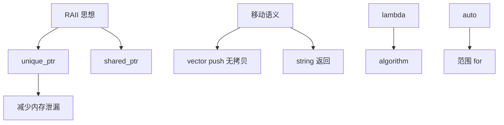
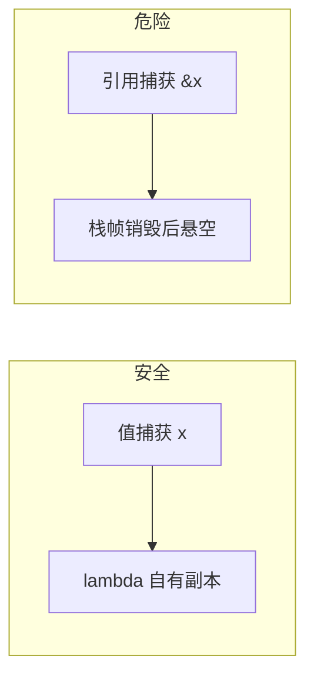

# 现代 C++ 新特性

> **文件编码**：UTF-8。

## 本章与上一章的关系

[04 章](04-STL标准库容器与算法.md) 的 `vector`、`string` 在拷贝大对象时开销明显；[02 章](02-指针引用与内存管理.md) 的 raw `new`/`delete` 容易泄漏。**现代 C++（C++11/14/17）** 用智能指针、移动语义、lambda 等，在保持性能的同时提高安全性。

本章是工程 C++ 的分水岭：写完本章，你应默认 `unique_ptr` 而非 naked `new`。对照 [Java](../Java/01-Java基础语法与面向对象.md)（无手动内存）与 [Python](../Python/01-Python基础语法与面向对象.md)（GC），C++ 通过 **RAII + 移动** 达到「零成本抽象」。系统软件、游戏、高频交易都建立在 move + 智能指针之上。

---

## 1. 这份文档学什么

- `unique_ptr` / `shared_ptr` / `weak_ptr` 使用场景
- 右值引用与 `std::move` 语义
- `auto`、`decltype`、范围 for、lambda
- `enum class`、结构化绑定、`std::optional`
- 默认/删除函数、`= default`

---

## 2. 智能指针

### 2.1 unique_ptr — 独占所有权

```cpp
#include <iostream>
#include <memory>
#include <vector>

class Packet {
public:
    explicit Packet(int id) : id_(id) {
        std::cout << "Packet " << id_ << " 构造\n";
    }
    ~Packet() { std::cout << "Packet " << id_ << " 析构\n"; }
    int id() const { return id_; }

private:
    int id_;
};

int main() {
    auto p = std::make_unique<Packet>(1);  // 推荐 make_unique
    std::vector<std::unique_ptr<Packet>> queue;
    queue.push_back(std::make_unique<Packet>(2));
    // queue.push_back(p);  // 错误：不可拷贝
    queue.push_back(std::move(p));  // 转移所有权
    if (!p) std::cout << "p 已空\n";
    return 0;
}  // 自动释放
```

### 2.2 shared_ptr — 共享所有权

```cpp
#include <iostream>
#include <memory>
#include <string>

int main() {
    auto cfg = std::make_shared<std::string>("config.toml");
    std::weak_ptr<std::string> weak = cfg;

    {
        auto copy = cfg;
        std::cout << "use_count=" << cfg.use_count() << '\n';
    }

    cfg.reset();
    if (weak.expired()) {
        std::cout << "对象已销毁\n";
    }
    return 0;
}
```

| 指针 | 场景 |
|------|------|
| `unique_ptr` | 默认选择，工厂返回、容器元素 |
| `shared_ptr` | 多处共享同一资源（谨慎，有原子开销） |
| `weak_ptr` | 打破 `shared_ptr` 循环引用 |

---

## 3. 移动语义

### 3.1 左值与右值

```cpp
#include <iostream>
#include <string>
#include <utility>
#include <vector>

int main() {
    std::string a = "hello";
    std::string b = std::move(a);  // 移动：a 资源转给 b

    std::cout << "b=" << b << " a=" << a << '\n';  // a 可能为空

    std::vector<std::string> v;
    v.push_back(std::move(b));  // 避免拷贝大字符串
    return 0;
}
```

### 3.2 移动构造示例

```cpp
#include <iostream>
#include <utility>

class Buffer {
public:
    explicit Buffer(std::size_t n) : size_(n), data_(new char[n]) {}
    ~Buffer() { delete[] data_; }

    Buffer(Buffer&& other) noexcept
        : size_(other.size_), data_(other.data_) {
        other.data_ = nullptr;
        other.size_ = 0;
    }

    Buffer& operator=(Buffer&& other) noexcept {
        if (this == &other) return *this;
        delete[] data_;
        size_ = other.size_;
        data_ = other.data_;
        other.data_ = nullptr;
        other.size_ = 0;
        return *this;
    }

    Buffer(const Buffer&) = delete;
    Buffer& operator=(const Buffer&) = delete;

    std::size_t size() const { return size_; }

private:
    std::size_t size_;
    char* data_;
};

int main() {
    Buffer a(1024);
    Buffer b = std::move(a);
    std::cout << b.size() << '\n';
    return 0;
}
```

**Rule of Five**：析构、拷贝构造/赋值、移动构造/赋值。

### 3.3 Rule of Zero / Three / Five / Six 详解

C++ 资源管理演进可概括为四条「规则」：

| 规则 | 含义 | 何时适用 |
|------|------|---------|
| **Rule of Zero** | 不显式定义析构/拷贝/移动 | 成员全是 RAII 类型（`string`、`vector`、`unique_ptr`） |
| **Rule of Three** | 析构 + 拷贝构造 + 拷贝赋值 | C++98 管理 raw 资源时 |
| **Rule of Five** | Three + 移动构造 + 移动赋值 | C++11 起管理 raw 资源 |
| **Rule of Six**（口语） | Five + 默认构造 | 面试偶尔提及 |

```cpp
#include <iostream>
#include <string>
#include <vector>

// Rule of Zero：编译器生成的特殊成员就够
class LogBatch {
public:
    void add(std::string line) { lines_.push_back(std::move(line)); }
    std::size_t size() const { return lines_.size(); }

private:
    std::vector<std::string> lines_;  // vector 自己管内存
};
```

**Rule of Five 完整示例**（管理 `char*`）：

```cpp
#include <cstring>
#include <iostream>
#include <utility>

class Buffer {
public:
    explicit Buffer(std::size_t n) : size_(n), data_(new char[n]{}) {}

    ~Buffer() { delete[] data_; }

    Buffer(const Buffer& o) : size_(o.size_), data_(new char[size_]) {
        std::memcpy(data_, o.data_, size_);
    }

    Buffer& operator=(const Buffer& o) {
        if (this == &o) return *this;
        Buffer tmp(o);   // copy-and-swap 技巧
        swap(tmp);
        return *this;
    }

    Buffer(Buffer&& o) noexcept : size_(o.size_), data_(o.data_) {
        o.data_ = nullptr;
        o.size_ = 0;
    }

    Buffer& operator=(Buffer&& o) noexcept {
        if (this == &o) return *this;
        delete[] data_;
        size_ = o.size_;
        data_ = o.data_;
        o.data_ = nullptr;
        o.size_ = 0;
        return *this;
    }

    void swap(Buffer& o) noexcept {
        std::swap(size_, o.size_);
        std::swap(data_, o.data_);
    }

    std::size_t size() const { return size_; }

private:
    std::size_t size_;
    char* data_;
};

int main() {
    Buffer a(64);
    Buffer b = std::move(a);
    std::cout << b.size() << '\n';
    return 0;
}
```

**深入解释：何时 Rule of Zero 失效？**  
只要类里有 raw 指针、`FILE*`、`malloc` 内存、socket fd 等**非 RAII 资源**，就不能 Zero，必须 Five 或把资源包进 `unique_ptr`/自定义 RAII 小类。工程上更推荐后者——把资源下沉到专用 RAII 包装，外层业务类就能 Zero。

### 3.4 完美转发预告（与 06 章衔接）

```cpp
#include <iostream>
#include <utility>

template<typename T>
void wrapper(T&& arg) {
    process(std::forward<T>(arg));  // 保持值类别
}

void process(int&)  { std::cout << "lvalue\n"; }
void process(int&&) { std::cout << "rvalue\n"; }

int main() {
    int x = 1;
    wrapper(x);   // lvalue
    wrapper(2);   // rvalue
    return 0;
}
```

`std::forward` 依赖引用折叠规则，06 章模板会展开。

---

## 4. auto 与 decltype

```cpp
#include <iostream>
#include <map>
#include <string>
#include <vector>

int main() {
    auto x = 42;                    // int
    auto s = std::string("log");    // string
    std::vector<int> v{1, 2, 3};

    for (auto it = v.begin(); it != v.end(); ++it) {
        std::cout << *it << ' ';
    }
    std::cout << '\n';

    std::map<std::string, int> m{{"a", 1}};
    for (const auto& [k, val] : m) {  // C++17
        std::cout << k << '=' << val << '\n';
    }
    return 0;
}
```

> **MSVC 提示**：复杂 auto 推断错误时，hover 查看类型或使用 `decltype(expr)`。

---

## 5. Lambda 表达式

```cpp
#include <algorithm>
#include <iostream>
#include <vector>

int main() {
    std::vector<int> v{5, 1, 4, 2};
    int threshold = 3;

    std::sort(v.begin(), v.end(), [](int a, int b) {
        return a < b;
    });

    v.erase(
        std::remove_if(v.begin(), v.end(),
                       [threshold](int x) { return x < threshold; }),
        v.end());

    for (int x : v) std::cout << x << ' ';
    std::cout << '\n';
    return 0;
}
```

捕获列表：`[]` 无捕获；`[=]` 值捕获；`[&]` 引用捕获；`[threshold]` C++14 泛型 lambda 可 `auto`。

与 [Java 03](../Java/03-Java并发编程与JVM.md) Stream lambda、[Python](../Python/01-Python基础语法与面向对象.md) `lambda` 概念相通。

---

## 6. enum class

```cpp
#include <iostream>

enum class LogLevel { Debug, Info, Warn, Error };

void log(LogLevel lvl, const char* msg) {
    switch (lvl) {
        case LogLevel::Info:
            std::cout << "[INFO] " << msg << '\n';
            break;
        default:
            break;
    }
}

int main() {
    log(LogLevel::Info, "service up");
    return 0;
}
```

强类型枚举，不隐式转 int，避免旧 `enum` 命名污染。

---

## 7. 现代特性关系图



---

## 8. 默认与删除函数

```cpp
class NonCopyable {
public:
    NonCopyable() = default;
    NonCopyable(const NonCopyable&) = delete;
    NonCopyable& operator=(const NonCopyable&) = delete;
    NonCopyable(NonCopyable&&) = default;
    NonCopyable& operator=(NonCopyable&&) = default;
};
```

单例、IO 句柄包装类常删除拷贝、允许移动。

---

## 9. 系统编程：工厂返回 unique_ptr

```cpp
#include <fstream>
#include <iostream>
#include <memory>
#include <string>

class FileReader {
public:
    static std::unique_ptr<FileReader> open(const std::string& path) {
        auto f = std::make_unique<FileReader>();
        f->in_.open(path);
        if (!f->in_) return nullptr;
        return f;
    }

    std::string read_line() {
        std::string line;
        std::getline(in_, line);
        return line;
    }

private:
    FileReader() = default;
    std::ifstream in_;
};

int main() {
    if (auto r = FileReader::open("config.txt")) {
        std::cout << r->read_line() << '\n';
    }
    return 0;
}
```

---

## 10. 手把手：move 观察

### 第一步：move_demo.cpp

```cpp
#include <iostream>
#include <string>
#include <utility>

int main() {
    std::string big(1000000, 'x');
    std::cout << "拷贝前 capacity=" << big.capacity() << '\n';

    std::string moved = std::move(big);
    std::cout << "move 后 big.size=" << big.size()
              << " moved.size=" << moved.size() << '\n';
    return 0;
}
```

### 第二步

```powershell
g++ -std=c++17 -O0 -Wall -g -o move_demo move_demo.cpp
.\move_demo.exe
```

观察 move 后 `big` 仍合法但处于「有效未指定状态」，不要依赖其内容。

---

## 11. 常见报错与排查

| 报错信息（关键词） | 可能原因 | 解决方案 |
|-------------------|---------|---------|
| `use of deleted function` | 拷贝 unique_ptr | 用 move 或传引用 |
| `incomplete type` with unique_ptr | 析构需完整类型 | 在 .cpp 定义析构 |
| `call to implicitly-deleted copy constructor` | 成员不可拷贝 | 实现移动或 shared_ptr |
| `cannot bind rvalue reference` | move 到 const& | 参数改为 T&& |
| `std::move was not declared` | 缺 `<utility>` | `#include <utility>` |
| `make_unique is not a member` | 标准过低 | C++14 起可用 |
| `lambda capture not found` | 捕获遗漏 | 加入 `[&]` 或显式捕获 |
| `shared_ptr loop` 内存泄漏 | 循环引用 | 一侧改 weak_ptr |
| MSVC `C2280` attempting reference binding | 绑定到临时 | 用 const T& 或值 |
| `-Wreturn-std-move` | 多余 std::move 返回局部 | 直接 return 局部对象 |
| `std::bad_weak_ptr` | `weak_ptr::lock` 对象已毁 | 检查 `expired()` |
| 移动后 double free | 手动 delete 又移动 | 只由 unique_ptr 管理 |
| `explicit` 转换失败 | 单参构造未 implicit | 显式构造或加转换 |
| `noexcept` 移动未标记 | vector 扩容仍拷贝 | 移动构造加 `noexcept` |
| `auto` 推断为 `int` 而非 `int&` | 范围 for 值拷贝 | 大对象用 `const auto&` |
| `enum class` switch 漏 `default` | 新增枚举值未处理 | 编译器 `-Wswitch` 或 static_assert |
| `= default` 与 `= delete` 冲突 | 同时声明 | 只 default 或 delete 其一 |
| `std::function` 空调用 | ScopeGuard 未检查 | 判空或 `optional<function>` |

---

## 12. 练习建议

### 基础

1. 用 `make_unique` 创建 `int` 并打印
2. 写 lambda 对 `vector<int>` 求平方
3. 用 `enum class` 表示进程状态并 switch

### 进阶

4. 实现 `Buffer` 的移动构造/赋值（05 章示例扩展）
5. `vector<unique_ptr<Shape>>` 工厂函数 `create_shape(string type)`
6. 用 `optional<string>` 解析可能失败的配置文件键

### 挑战

7. 简易 `ScopeGuard`：析构时执行 lambda（RAII 预告 07 章）
8. 实现移动-only 的 `UniqueFile` 包装 `FILE*`

---

## 13. 分级练习参考答案

### 基础：lambda 平方

```cpp
#include <iostream>
#include <vector>

int main() {
    std::vector<int> v{1, 2, 3};
    auto square = [](int x) { return x * x; };
    for (int x : v) std::cout << square(x) << ' ';
    std::cout << '\n';
    return 0;
}
```

### 进阶：ScopeGuard

```cpp
#include <iostream>
#include <utility>

class ScopeGuard {
public:
    explicit ScopeGuard(std::function<void()> fn) : fn_(std::move(fn)) {}
    ~ScopeGuard() { if (fn_) fn_(); }
    ScopeGuard(const ScopeGuard&) = delete;
    ScopeGuard& operator=(const ScopeGuard&) = delete;

private:
    std::function<void()> fn_;
};

int main() {
    ScopeGuard g([] { std::cout << "cleanup\n"; });
    std::cout << "work\n";
    return 0;
}
```

需 `#include <functional>`。

### 基础：make_unique 与 enum class

```cpp
#include <iostream>
#include <memory>

enum class ProcState { Starting, Running, Stopping, Stopped };

const char* to_string(ProcState s) {
    switch (s) {
        case ProcState::Starting: return "Starting";
        case ProcState::Running:  return "Running";
        case ProcState::Stopping: return "Stopping";
        case ProcState::Stopped:  return "Stopped";
    }
    return "Unknown";
}

int main() {
    auto id = std::make_unique<int>(42);
    std::cout << *id << '\n';

    ProcState st = ProcState::Running;
    std::cout << to_string(st) << '\n';
    return 0;
}
```

### 进阶：vector<unique_ptr<Shape>> 工厂

```cpp
#include <iostream>
#include <memory>
#include <string>
#include <vector>

struct Shape {
    virtual ~Shape() = default;
    virtual void draw() const = 0;
};

struct Circle : Shape {
    void draw() const override { std::cout << "Circle\n"; }
};

struct Square : Shape {
    void draw() const override { std::cout << "Square\n"; }
};

std::unique_ptr<Shape> create_shape(const std::string& type) {
    if (type == "circle") return std::make_unique<Circle>();
    if (type == "square") return std::make_unique<Square>();
    return nullptr;
}

int main() {
    std::vector<std::unique_ptr<Shape>> shapes;
    shapes.push_back(create_shape("circle"));
    shapes.push_back(create_shape("square"));
    for (const auto& s : shapes) {
        if (s) s->draw();
    }
    return 0;
}
```

### 进阶：optional 解析配置

```cpp
#include <iostream>
#include <optional>
#include <string>

std::optional<int> parse_port(const std::string& key, const std::string& val) {
    if (key != "port") return std::nullopt;
    try {
        int p = std::stoi(val);
        if (p > 0 && p <= 65535) return p;
    } catch (...) {}
    return std::nullopt;
}

int main() {
    if (auto p = parse_port("port", "8080")) {
        std::cout << "listen on " << *p << '\n';
    }
    if (!parse_port("port", "99999")) {
        std::cout << "invalid port\n";
    }
    return 0;
}
```

### 挑战：UniqueFile 骨架

```cpp
#include <cstdio>
#include <iostream>
#include <memory>

class UniqueFile {
public:
    static UniqueFile open(const char* path, const char* mode) {
        UniqueFile f;
        f.fp_ = std::fopen(path, mode);
        return f;
    }

    UniqueFile(UniqueFile&& o) noexcept : fp_(o.fp_) { o.fp_ = nullptr; }
    ~UniqueFile() { if (fp_) std::fclose(fp_); }

    UniqueFile(const UniqueFile&) = delete;
    UniqueFile& operator=(const UniqueFile&) = delete;

    bool valid() const { return fp_ != nullptr; }

private:
    UniqueFile() = default;
    std::FILE* fp_ = nullptr;
};

int main() {
    auto f = UniqueFile::open("test.txt", "w");
    if (f.valid()) std::cout << "opened\n";
    return 0;
}
```

---

## 14. 深入解释：三个工程案例

### 14.1 案例：shared_ptr 循环引用

```cpp
#include <iostream>
#include <memory>

struct Node {
    std::shared_ptr<Node> next;
    std::weak_ptr<Node> prev;  // 必须 weak，否则 next↔prev 循环
    ~Node() { std::cout << "~Node\n"; }
};

int main() {
    auto a = std::make_shared<Node>();
    auto b = std::make_shared<Node>();
    a->next = b;
    b->prev = a;
    return 0;  // 正常析构
}
```

若 `prev` 也是 `shared_ptr`，引用计数永不为 0，造成泄漏。

### 14.2 案例：移动语义在返回值优化（RVO/NRVO）

```cpp
#include <iostream>
#include <string>

std::string make_name() {
    std::string s = "worker-";
    s += "42";
    return s;  // 通常 RVO，不必 std::move
}

int main() {
    std::string n = make_name();
    std::cout << n << '\n';
    return 0;
}
```

对局部变量 `return std::move(s)` 反而可能**阻止** RVO（`-Wreturn-std-move`）。

### 14.3 案例：lambda 捕获生命周期陷阱

```cpp
#include <functional>
#include <iostream>

std::function<void()> make_bad() {
    int x = 42;
    return [&x]() { std::cout << x << '\n'; };  // 危险：x 已销毁
}

int main() {
    auto fn = make_bad();
    // fn();  // 未定义行为
    return 0;
}
```

按值捕获 `[x]` 或 C++14 初始化捕获 `[v = x]` 才安全。



---

## 15. FAQ

**Q：什么时候 shared_ptr？**  
明确多处共享且生命周期纠缠时；默认 unique_ptr。

**Q：move 后还能用原对象吗？**  
可调用析构/赋新值；勿读 moved-from 对象内容。

**Q：C++20 还要学吗？**  
本路线 C++17 为主；`concept`、`ranges` 可在 15 章索引延伸。

---

## 16. 学完标准

- [ ] 默认用 `make_unique`/`make_shared`
- [ ] 理解移动 vs 拷贝，会写移动构造
- [ ] 熟练 lambda、auto、结构化绑定
- [ ] 会用 `enum class`、`optional`
- [ ] 完成 ScopeGuard 或 UniqueFile 练习
- [ ] 能解释 weak_ptr 打破循环引用

---

## 下一章预告

移动语义与智能指针常配合**模板**使用。06 章 [模板与泛型编程](06-模板与泛型编程.md) 讲函数模板、类模板、SFINAE 入门——对照 [Java 02 泛型](../Java/02-Java常用类集合与泛型.md)，理解 C++ 模板在编译期展开、零运行时开销的特点。

---

*下一章：06 模板与泛型编程*
