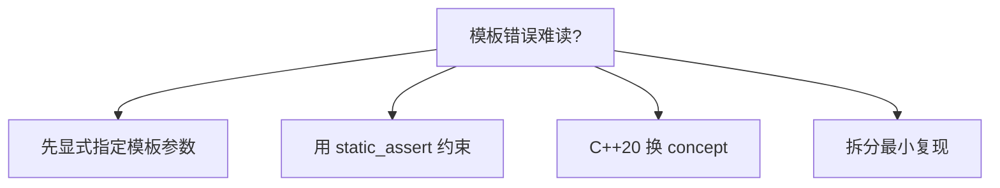

# 模板与泛型编程

> **文件编码**：UTF-8。

---

## 0. 读前导读（零基础也能跟上）

### 0.1 用一句话弄懂本章

**模板** = 写一份「类型占位符」代码，编译器按 `int`、`string` 等**生成多份专用实现**——**标准工具箱**里的 `vector<T>` 就是这样来的。

### 0.2 你需要提前知道什么

- [04 章](04-STL标准库容器与算法.md) 会用 `vector<int>`（已用模板，本章讲原理）
- [05 章](05-现代C++新特性.md) 移动、auto
- 对照 [Java 02 泛型](../Java/02-Java常用类集合与泛型.md)（擦除 vs 实例化）

### 0.3 本章知识地图（☐→☑）

- [ ] 写函数模板与类模板
- [ ] 理解模板实例化在编译期发生
- [ ] 会用 `enable_if`/SFINAE 入门
- [ ] 知道 Concepts（C++20）方向
- [ ] §20 闭卷自测 ≥8/10

### 0.4 建议学习时长

**4～6 天**；模板错误信息长，耐心读编译器报错。

### 0.5 学完你能做什么

写 `Min(a,b)` 泛型函数、简单 `Stack<T>`；读懂 STL 源码签名；为 07 异常安全模板代码打底。

### 0.6 与数据结构 / C++13

| 本章 | 对照 |
|------|------|
| 泛型栈/队列 | [数据结构 04](../数据结构/04-栈与队列.md) |
| 泛型排序 | [数据结构 09](../数据结构/09-排序与查找算法.md) |
| 竞赛模板 | [C++ 13](13-算法与数据结构C++实现.md) |

---

## 本章与上一章的关系

[05 章](05-现代C++新特性.md) 的 `vector<T>`、`unique_ptr<T>`、`make_pair` 全是**模板**。没有模板，STL 无法一份代码服务所有类型。本章讲如何自己写模板，让算法与数据结构像 STL 一样泛型化。

对照 [Java 02 泛型](../Java/02-Java常用类集合与泛型.md)：Java 泛型擦除在运行时消失；C++ 模板在**编译期实例化**，生成针对 `int`、`string` 的专用代码，零运行时多态开销。系统库（如 `std::sort`、Eigen、fmt）都建立在模板上。Python 用 duck typing 达到类似效果，见 [Python 02](../Python/02-Python内置类型模块与类型注解.md) 的 `typing`。

---

## 1. 这份文档学什么

- 函数模板与类模板定义、实例化
- 模板参数：类型参数、非类型参数
- 特化与偏特化入门
- SFINAE、`enable_if` 基本用法（C++17）
- 模板在头文件中的组织方式

---

## 2. 函数模板

```cpp
#include <iostream>
#include <string>

template<typename T>
T max_value(T a, T b) {
    return (a < b) ? b : a;
}

template<typename T>
void swap_ref(T& a, T& b) {
    T tmp = a;
    a = b;
    b = tmp;
}

int main() {
    std::cout << max_value(3, 7) << '\n';
    std::cout << max_value(3.14, 2.71) << '\n';
    std::cout << max_value(std::string("ab"), std::string("cd")) << '\n';

    int x = 1, y = 2;
    swap_ref(x, y);
    std::cout << x << ' ' << y << '\n';
    return 0;
}
```

编译器根据实参**自动推导** `T`，或显式 `max_value<int>(3, 7)`。

---

## 3. 类模板

```cpp
#include <iostream>
#include <stdexcept>

template<typename T>
class Stack {
public:
    void push(const T& value) {
        if (size_ >= capacity_) throw std::overflow_error("stack full");
        data_[size_++] = value;
    }

    T pop() {
        if (size_ == 0) throw std::underflow_error("stack empty");
        return data_[--size_];
    }

    bool empty() const { return size_ == 0; }

private:
    static constexpr std::size_t capacity_ = 128;
    T data_[capacity_];
    std::size_t size_ = 0;
};

int main() {
    Stack<int> s;
    s.push(10);
    s.push(20);
    std::cout << s.pop() << '\n';
    return 0;
}
```

---

## 4. 非类型模板参数

```cpp
#include <array>
#include <iostream>

template<typename T, std::size_t N>
class FixedBuffer {
public:
    T& operator[](std::size_t i) { return data_[i]; }
    const T& operator[](std::size_t i) const { return data_[i]; }
    constexpr std::size_t size() const { return N; }

private:
    T data_[N];
};

int main() {
    FixedBuffer<std::byte, 4096> buf{};  // 栈上 4KB 缓冲
    std::array<int, 5> arr{1, 2, 3, 4, 5};
    std::cout << arr.size() << ' ' << buf.size() << '\n';
    return 0;
}
```

网络包固定头、环形缓冲常用固定大小模板，避免堆分配。

---

## 5. 模板特化

### 5.1 全特化

```cpp
#include <iostream>
#include <string>

template<typename T>
struct TypeName {
    static const char* name() { return "unknown"; }
};

template<>
struct TypeName<int> {
    static const char* name() { return "int"; }
};

template<>
struct TypeName<std::string> {
    static const char* name() { return "std::string"; }
};

int main() {
    std::cout << TypeName<int>::name() << '\n';
    std::cout << TypeName<double>::name() << '\n';
    return 0;
}
```

### 5.2 偏特化（类模板）

```cpp
template<typename T, typename U>
struct Pair { /* 通用 */ };

template<typename T>
struct Pair<T, int> { /* 第二个参数为 int 的偏特化 */ };
```

函数模板不支持偏特化，用重载替代。

---

## 6. SFINAE 与 enable_if（入门）

```cpp
#include <iostream>
#include <type_traits>
#include <vector>

template<typename T>
typename std::enable_if<std::is_integral<T>::value, T>::type
safe_div(T a, T b) {
    return b == 0 ? 0 : a / b;
}

template<typename T>
typename std::enable_if<std::is_floating_point<T>::value, T>::type
safe_div(T a, T b) {
    return b == 0.0 ? 0 : a / b;
}

int main() {
    std::cout << safe_div(10, 3) << '\n';
    std::cout << safe_div(10.0, 3.0) << '\n';
    return 0;
}
```

C++20 `concept` 可替代冗长 SFINAE；面试仍常问 `enable_if` 原理。

### 6.1 SFINAE 深入：替换失败不是错误

**SFINAE**（Substitution Failure Is Not An Error）：模板参数替换失败时，该重载从候选集**静默剔除**，而非编译错误。只有**所有**候选都失败才报错。

```cpp
#include <iostream>
#include <type_traits>
#include <vector>

// 有 .size() 的类型走此分支
template<typename T>
auto print_size(const T& obj) -> decltype(obj.size(), void()) {
    std::cout << "size=" << obj.size() << '\n';
}

// 没有 .size() 的走此分支
template<typename T>
auto print_size(const T& obj) -> decltype(void(obj), void()) {
    std::cout << "no size()\n";
}

int main() {
    std::vector<int> v{1, 2, 3};
    print_size(v);
    print_size(42);
    return 0;
}
```

C++17 起可用 `std::void_t` 简化检测：

```cpp
template<typename T, typename = void>
struct has_size : std::false_type {};

template<typename T>
struct has_size<T, std::void_t<decltype(std::declval<T>().size())>> : std::true_type {};
```

### 6.2 C++20 Concepts 预览（对照 SFINAE）

```cpp
// C++20 — 编译需 -std=c++20
#include <concepts>
#include <iostream>

template<std::integral T>
T add_integral(T a, T b) {
    return a + b;
}

template<typename T>
concept HasSize = requires(T t) {
    { t.size() } -> std::convertible_to<std::size_t>;
};

template<HasSize C>
void dump_size(const C& c) {
    std::cout << c.size() << '\n';
}

int main() {
    std::cout << add_integral(1, 2) << '\n';
    dump_size(std::vector<int>{1, 2, 3});
    return 0;
}
```

| 方式 | 可读性 | 错误信息 | 标准 |
|------|--------|---------|------|
| SFINAE + `enable_if` | 差 | 冗长「no matching function」 | C++11 |
| `void_t` 检测 | 中 | 仍偏模板元 | C++17 |
| **Concepts** | 好 | 直接指出约束不满足 | C++20 |

**深入解释：面试怎么说 SFINAE？**  
「编译器在实例化函数模板时，若替换模板参数导致表达式非法，该重载不参与重载决议，不算硬错误。`enable_if` 把不满足条件的重载的返回类型变成无效类型，从而触发 SFINAE 剔除。」

### 6.3 `if constexpr`（C++17）与编译期分支

```cpp
#include <iostream>
#include <type_traits>

template<typename T>
auto process(T value) {
    if constexpr (std::is_integral_v<T>) {
        return value * 2;
    } else {
        return value + value;
    }
}

int main() {
    std::cout << process(21) << ' ' << process(3.5) << '\n';
    return 0;
}
```

未选中分支**不参与实例化**，可对指针类型安全解引用。

---

## 7. 可变参数模板（了解）

```cpp
#include <iostream>

template<typename... Args>
void log(Args... args) {
    ((std::cout << args << ' '), ...);  // C++17 折叠表达式
    std::cout << '\n';
}

int main() {
    log("cpu=", 95, "% mem=", 4096);
    return 0;
}
```

---

## 8. 模板实例化流程


**关键**：模板定义通常放头文件（或 `.hpp`），否则链接期找不到实例。

---

## 9. 与 Java / Python 泛型对照

| 维度 | C++ 模板 | Java 泛型 | Python typing |
|------|---------|-----------|---------------|
| 实现 | 编译期展开 | 擦除 + 装箱 | 运行时 duck type |
| 性能 | 可内联、零开销 | 部分擦除开销 | 动态 |
| 约束 | SFINAE/concept | bounds | Protocol |
| 代码膨胀 | 每类型一份 | 单份字节码 | N/A |

---

## 10. 实用：generic min + print

```cpp
#include <iostream>
#include <string>

template<typename T>
const T& min_ref(const T& a, const T& b) {
    return (b < a) ? b : a;
}

template<typename Container>
void print_container(const Container& c) {
    for (const auto& elem : c) {
        std::cout << elem << ' ';
    }
    std::cout << '\n';
}

int main() {
    std::cout << min_ref(3, 5) << '\n';
    int arr[] = {1, 2, 3};
    print_container(arr);  // 需 C++17 或传 begin/end 重载
    return 0;
}
```

---

## 11. 手把手：头文件模板项目

### 第一步：目录

```powershell
mkdir cpp-ch06-demo && cd cpp-ch06-demo
```

### 第二步：ring_buffer.h

```cpp
#pragma once
#include <cstddef>
#include <stdexcept>

template<typename T, std::size_t Cap>
class RingBuffer {
public:
    bool push(const T& v) {
        if (size_ == Cap) return false;
        buf_[tail_] = v;
        tail_ = (tail_ + 1) % Cap;
        ++size_;
        return true;
    }

    T pop() {
        if (size_ == 0) throw std::underflow_error("empty");
        T v = buf_[head_];
        head_ = (head_ + 1) % Cap;
        --size_;
        return v;
    }

    std::size_t size() const { return size_; }

private:
    T buf_[Cap]{};
    std::size_t head_ = 0, tail_ = 0, size_ = 0;
};
```

### 第三步：main.cpp

```cpp
#include "ring_buffer.h"
#include <iostream>

int main() {
    RingBuffer<int, 8> rb;
    rb.push(1);
    rb.push(2);
    std::cout << rb.pop() << ' ' << rb.pop() << '\n';
    return 0;
}
```

### 第四步

```powershell
g++ -std=c++17 -Wall -Wextra -o ring main.cpp
.\ring.exe
```

MSVC：`cl /EHsc /std:c++17 /W4 main.cpp`

---

## 12. 常见报错与排查

| 报错信息（关键词） | 可能原因 | 解决方案 |
|-------------------|---------|---------|
| `no matching function for call` | 模板无法推导 | 显式指定模板参数 |
| `undefined reference to ...` | 模板定义在 .cpp | 移到头文件或显式实例化 |
| `ambiguous overload` | 多个模板同样匹配 | 更具体重载或 SFINAE |
| `error: 'T' was not declared` | 缺 typename | 依赖名加 `typename` |
| `template argument deduction/substitution failed` | SFINAE 排除 | 检查 enable_if 条件 |
| `excessive recursion in template instantiation` | 递归模板过深 | 改迭代或特化终止 |
| `cannot convert ... loss of precision` | 窄化 | 显式 cast 或改类型 |
| MSVC `C2976` too few template args | 参数个数不对 | 补全 `<T, N>` |
| `redefinition of default template parameter` | 默认参数重复 | 只在声明或定义一处默认 |
| `invalid operands to binary expression` | 类型无 operator< | 特化或 requires/concept |
| `static assertion failed` concept | C++20 约束不满足 | 检查 concept 要求 |
| `dependent name` 需 typename | 嵌套模板类型 | `typename T::iterator` |
| 两阶段查找困惑 | 基类依赖名未加 `this->` | `this->member` 或 using 声明 |
| 模板友元声明错误 | 友元模板语法 | `friend class Foo<T>` |
| 显式实例化重复 | 多 .cpp 实例化同一模板 | 只在一处 `extern template` |

---

## 13. 练习建议

### 基础

1. 写 `template<typename T> T abs_val(T x)`
2. 写类模板 `Pair<T,U>` 存两个值
3. 为 `Stack<int>` 与 `Stack<double>` 分别 push/pop

### 进阶

4. 模板函数 `reverse_array(T* arr, size_t n)`
5. `TypeName<T>` 特化 `double`、`const char*`
6. 用 `enable_if` 限制模板只接受算术类型

### 挑战

7. 简易 `SmallVector<T, N>`：栈上 N 个，超出转 `vector`
8. 模板元编程：编译期 `Factorial<5>::value`

---

## 14. 分级练习参考答案

### 基础：abs_val

```cpp
#include <iostream>

template<typename T>
T abs_val(T x) {
    return x < T{} ? -x : x;
}

int main() {
    std::cout << abs_val(-3) << ' ' << abs_val(-2.5) << '\n';
    return 0;
}
```

### 进阶：reverse_array

```cpp
#include <algorithm>
#include <iostream>

template<typename T>
void reverse_array(T* arr, std::size_t n) {
    if (n <= 1) return;
    for (std::size_t i = 0; i < n / 2; ++i) {
        std::swap(arr[i], arr[n - 1 - i]);
    }
}

int main() {
    int a[] = {1, 2, 3, 4};
    reverse_array(a, 4);
    for (int x : a) std::cout << x << ' ';
    std::cout << '\n';
    return 0;
}
```

### 基础：Pair 类模板

```cpp
#include <iostream>
#include <string>

template<typename T, typename U>
class Pair {
public:
    Pair(T first, U second) : first_(std::move(first)), second_(std::move(second)) {}
    const T& first() const { return first_; }
    const U& second() const { return second_; }

private:
    T first_;
    U second_;
};

int main() {
    Pair<std::string, int> p{"host", 8080};
    std::cout << p.first() << ':' << p.second() << '\n';
    return 0;
}
```

### 进阶：enable_if 限制算术类型

```cpp
#include <iostream>
#include <type_traits>

template<typename T>
typename std::enable_if<std::is_arithmetic<T>::value, T>::type
square(T x) {
    return x * x;
}

int main() {
    std::cout << square(5) << ' ' << square(2.5) << '\n';
    // square("ab");  // 编译失败：非算术类型
    return 0;
}
```

### 进阶：SmallVector 简化骨架

```cpp
#include <iostream>
#include <vector>

template<typename T, std::size_t N>
class SmallVector {
public:
    void push_back(const T& v) {
        if (size_ < N) {
            stack_[size_++] = v;
        } else {
            heap_.push_back(v);
        }
    }

    std::size_t size() const { return size_ < N ? size_ : N + heap_.size(); }

    T& operator[](std::size_t i) {
        if (i < N && i < size_) return stack_[i];
        return heap_[i - N];
    }

private:
    T stack_[N]{};
    std::size_t size_ = 0;
    std::vector<T> heap_;
};

int main() {
    SmallVector<int, 4> sv;
    for (int i = 0; i < 6; ++i) sv.push_back(i);
    for (std::size_t i = 0; i < sv.size(); ++i) std::cout << sv[i] << ' ';
    std::cout << '\n';
    return 0;
}
```

### 挑战：Factorial 编译期

```cpp
#include <iostream>

template<int N>
struct Factorial {
    static constexpr int value = N * Factorial<N - 1>::value;
};

template<>
struct Factorial<0> {
    static constexpr int value = 1;
};

int main() {
    std::cout << Factorial<5>::value << '\n';
    return 0;
}
```

---

## 15. 深入解释：模板三大难点

### 15.1 难点一：两阶段名称查找

```cpp
#include <iostream>

template<typename T>
struct Base {
    void foo() { std::cout << "Base\n"; }
};

template<typename T>
struct Derived : Base<T> {
    void bar() {
        // this->foo();  // 依赖名须 this-> 或 using Base<T>::foo;
        Base<T>::foo();
    }
};

int main() {
    Derived<int> d;
    d.bar();
    return 0;
}
```

非依赖名在模板定义时查；依赖名在**实例化时**查。

### 15.2 难点二：模板代码膨胀

同一 `sort<int>` 与 `sort<double>` 各生成一份机器码。缓解：显式实例化、`extern template`、类型擦除（`std::function`）、或拆分热路径。

### 15.3 难点三：typename 依赖类型

```cpp
template<typename T>
void f(T& container) {
    typename T::value_type x = *container.begin();
    (void)x;
}
```

嵌套在模板里的类型名（如 `T::value_type`）必须用 `typename` 告诉编译器这是类型而非静态成员。



---

## 16. 模板参数推导规则（C++17 补充）

```cpp
#include <iostream>
#include <utility>

template<typename T>
void foo(T&& param) {  // 转发引用，06 章进阶；05 章 std::move 相关
    std::cout << std::is_same_v<T, int> << '\n';
}

template<typename T, typename U>
auto add(T a, U b) -> decltype(a + b) {
    return a + b;
}

int main() {
    int x = 1;
    foo(x);           // T = int&
    foo(42);          // T = int

    std::cout << add(1, 2.5) << '\n';
    return 0;
}
```

需 `#include <type_traits>`。显式实例化可减少编译时间：

```cpp
// 在某 .cpp 中（仅当定义在该 .cpp 可见时）
template class Stack<int>;
template void swap_ref<int>(int&, int&);
```

大型系统项目常对头文件模板拆分「声明 + 显式实例化 `.cpp`」，09 章 CMake 多目标时会再遇。

---

## 17. FAQ

**Q：模板会让程序变大吗？**  
会（代码膨胀）；通常用体积换速度。链接时 `--gc-sections` 可剔除未用实例。

**Q：typename 和 class 有区别吗？**  
模板类型参数两者等价；依赖类型名必须用 `typename`。

**Q：和宏？**  
模板类型安全；宏已少用于泛型。

---

## 18. 学完标准

- [ ] 能写函数模板与类模板
- [ ] 理解编译期实例化与头文件放置
- [ ] 会全特化与一个偏特化例子
- [ ] 读懂简单 `enable_if` 代码
- [ ] 完成 RingBuffer 或 reverse_array 练习
- [ ] 对照 Java 泛型说明 2 点差异

---

## 19. 闭卷自测

1. 函数模板与类模板各解决什么？
2. 模板实例化发生在何时？
3. 模板定义为什么常放头文件？
4. 全特化与偏特化区别？
5. SFINAE 一句话？
6. C++ 模板与 Java 泛型擦除的核心区别？
7. `typename T` 与 `class T` 在模板参数中等价吗？
8. 非类型模板参数例子？
9. 模板代码膨胀是什么？利弊？
10. 06 与 04 **标准工具箱** 关系？

<details>
<summary>自测参考答案</summary>

1. 函数：**多类型同一算法**；类：**多类型同一数据结构**（如 `Stack<T>`）。
2. **编译期**，每种 `T` 生成一份代码。
3. 实例化需见**完整定义**；分离编译需显式实例化（进阶）。
4. 全特化**所有参数固定**；偏特化**部分参数模式**（类模板）。
5. 替换失败**不是错误**，从 overload 集移除。
6. C++ **运行时保留类型**；Java **擦除**为 Object/边界。
7. **等价**（类型参数）。
8. `template<int N>`, `template<typename T, size_t S>` 等。
9. 二进制变大；换**零运行时多态开销**。
10. STL 容器/算法全是模板；06 教**自己写**泛型。

</details>

---

## 21. 费曼检验

3 分钟讲「模板和 Java 泛型有什么不同」——用「复印机按类型印不同图纸」类比编译期实例化。

**提纲**：一份模板源码；编译器为 `int`、`double` 各印一份；Java 是一份字节码+擦除；C++ 快但体积大。

---

## 22. FAQ 补充

**Q：06 与 [C++ 13 算法模板](13-算法与数据结构C++实现.md) 关系？**  
13 章提供并查集/LRU 等**现成模板**；06 章让你能读懂并改写它们。

---

## 23. 与 [数据结构 09 排序](../数据结构/09-排序与查找算法.md) 的模板版

```cpp
template<typename RandomIt>
void my_sort(RandomIt first, RandomIt last) {
    std::sort(first, last);  // 复用标准工具箱算法
}
```

手写快排/归并在数据结构 09 理解原理；工程与竞赛用 `std::sort` + 自定义比较器/lambda。

---

## 24. FAQ：模板与 Java 02 泛型对照表

| 场景 | C++ 模板 | Java 泛型 |
|------|----------|-----------|
| `vector<int>` | 实例化为真实 int 容器 | 擦除，运行时 Integer 装箱 |
| 类型约束 | C++20 concepts / SFINAE | `extends Comparable` |
| 性能 | 零开销 | 可能装箱 |

---

## §25. 类模板深入：成员外置与静态成员

### §25.1 类模板成员函数类外定义

```cpp
#include <iostream>
#include <stdexcept>

template<typename T>
class Stack {
public:
    void push(const T& v);
    T pop();
    bool empty() const { return data_.empty(); }
private:
    std::vector<T> data_;
};

template<typename T>
void Stack<T>::push(const T& v) {
    data_.push_back(v);
}

template<typename T>
T Stack<T>::pop() {
    if (data_.empty()) throw std::runtime_error("empty stack");
    T top = std::move(data_.back());
    data_.pop_back();
    return top;
}
```

**每个成员函数都是函数模板**：类外定义需写 `template<typename T>` + `Stack<T>::`。

### §25.2 类模板静态成员

```cpp
template<typename T>
class Counter {
public:
    static int count;
    Counter() { ++count; }
};
template<typename T> int Counter<T>::count = 0;
```

每种 `T` 实例化一份独立静态变量。

---

## §26. 模板特化再巩固

### §26.1 全特化

```cpp
template<> struct traits<const char*> {
    static void print(const char* s) { std::cout << "C string: " << s << '\n'; }
};
```

### §26.2 偏特化（仅类模板）

```cpp
template<typename T, typename U> struct Pair { /* 通用 */ };
template<typename T> struct Pair<T, int> { /* T 任意，第二参数 int */ };
template<typename T> struct Pair<T, T> { /* 两参数相同 */ };
```

函数模板**不能**偏特化，用 overload 或 SFINAE 代替。

### §26.3 特化 vector<bool> 的启示

标准对 `vector<bool>` 特化为位压缩——说明特化可改变实现策略。

---

## §27. 变参模板初识

```cpp
#include <iostream>

template<typename... Args>
void log(Args... args) {
    (std::cout << ... << args) << '\n';  // C++17 折叠表达式
}

template<typename T>
T sum(T v) { return v; }

template<typename T, typename... Rest>
T sum(T first, Rest... rest) {
    return first + sum(rest...);
}

int main() {
    log(1, ' ', 3.14, " ok");
    std::cout << sum(1, 2, 3, 4) << '\n';
    return 0;
}
```

**sizeof...(Args)** 编译期参数个数；递归展开或 C++17 折叠表达式。

**tuple**、`make_shared` 多参数、`printf` 类型安全替代均依赖变参模板。

---

## §28. typename 关键字完全理解

### §28.1 模板类型参数

`template<typename T>` 与 `template<class T>` **完全等价**。

### §28.2 依赖类型名必须 typename

```cpp
template<typename T>
void foo(T& obj) {
    typename T::iterator it = obj.begin();  // T::iterator 是依赖名
}
```

编译器默认 `T::iterator` 可能是静态成员；`typename` 告诉编译器这是**类型**。

### §28.3 C++20 简化

部分场景 `typename` 可省略（如 simplified template template parameters），Primer 阶段**见到依赖类型就加 typename** 最安全。

---

## §29. 模板元编程直觉：编译期计算

```cpp
#include <iostream>

template<int N>
struct Factorial {
    static const int value = N * Factorial<N - 1>::value;
};
template<> struct Factorial<0> {
    static const int value = 1;
};

template<int N>
constexpr int factorial() {
    if constexpr (N <= 1) return 1;
    else return N * factorial<N - 1>();
}

int main() {
    std::cout << Factorial<5>::value << '\n';  // 120，编译期
    std::cout << factorial<5>() << '\n';
    return 0;
}
```

**直觉**：用模板在**编译期**生成代码/常量，运行时零开销。现代 C++ 更推荐 `constexpr` 函数；元编程用于类型计算、`enable_if`、库作者工具。

---

## §30. CRTP 简介

**Curiously Recurring Template Pattern**：派生类把自己作为基类模板参数。

```cpp
#include <iostream>

template<typename Derived>
struct Base {
    void interface() {
        static_cast<Derived*>(this)->implementation();
    }
};

struct Impl : Base<Impl> {
    void implementation() { std::cout << "CRTP\n"; }
};

int main() {
    Impl i;
    i.interface();
    return 0;
}
```

**用途**：静态多态（无虚函数开销）、Mixin 组合。`std::enable_shared_from_this` 内部亦用 CRTP 思想。

**与虚函数对比**：CRTP 编译期绑定，无虚表；类型在编译期固定。

---

## §31. 模板与友元

```cpp
template<typename T>
class Matrix {
    template<typename U>
    friend Matrix<U> operator*(const Matrix<U>& a, const Matrix<U>& b);
public:
    explicit Matrix(int n) : n_(n) {}
private:
    int n_;
};
```

友元模板需 `template<typename U> friend ...`；否则只 friendship 某一实例。

---

## §32. variable templates（C++14）

```cpp
template<typename T>
constexpr T pi = T(3.1415926535897932385L);

// 使用：pi<double>
```

与 `traits<T>::value` 相比，variable template 语法更简洁。

---

## §33. if constexpr 与 SFINAE 演进

```cpp
template<typename T>
auto get_value(T& t) {
    if constexpr (std::is_pointer_v<T>)
        return *t;
    else
        return t;
}
```

**编译期分支**：不满足的分支**不参与实例化**，替代部分 `enable_if` 技巧。C++17 起推荐优先 `if constexpr` + concepts（C++20）。

---

## §34. 扩展练习

1. 实现模板类 `Array<T, N>` 固定大小数组，含 `size()`、`operator[]`。  
2. 为 `const char*` 全特化 `print` 函数模板。  
3. 写变参模板 `max(a, b, c...)` 返回最大值。  
4. 用 `Factorial<N>` 计算 10! 并 static_assert 结果。  
5. 实现 CRTP `Comparable<D>` 提供 `operator!=` 基于 `operator==`。  
6. 解释为何函数模板不能偏特化。  
7. 头文件分离：声明在 `.h`，显式实例化 `Stack<int>` 在 `.cpp`。  
8. 用 `typename` 修复「missing typename」编译错误（自造依赖类型）。  
9. 对比 Java 擦除与 C++ `vector<int>` 内存布局。  
10. 阅读 `std::is_same_v` 源码思路（type_traits）。

---

## §35. 模板特化决策树

```text
需要为特定类型不同实现？
  ├─ 函数 → overload 或 if constexpr / enable_if
  └─ 类   → 全特化 template<> 或 偏特化 template<typename T>
需要编译期常量？
  ├─ constexpr 函数（优先）
  └─ 模板递归 / variable template
需要静态多态？
  └─ CRTP 或 concept + 模板
```

---

## §36. 扩展 FAQ

**Q：模板放在 .cpp 会怎样？**  
链接错误 undefined reference，除非显式实例化。

**Q：模板能 virtual 吗？**  
模板成员函数可以 virtual；「虚拟模板」不存在。

**Q：代码膨胀如何缓解？**  
提取非模板基类、显式实例化常用类型、链接时 GC。

---

## §37. §25～§37 知识地图

- [ ] 类外定义 `Stack<T>::push`
- [ ] 写出一个偏特化例子
- [ ] 变参模板 `sum` 或 `log`
- [ ] 解释 `typename T::xxx` 为何需要 typename
- [ ] 说出 CRTP 与虚函数各一条优缺点
- [ ] 完成 §34 至少 3 题
- [ ] 对照 04 章 STL 全是模板的含义

---

## §38. 模板参数推导补充（CTAD C++17）

```cpp
std::pair p(1, 2.0);           // pair<int, double>
std::vector v = {1, 2, 3};    // vector<int>
```

类模板参数推导减少显式写 `vector<int>`；与函数模板推导规则不同，见标准 deduction guides。

---

## §39. 概念 constraints 前瞻（C++20 一句话）

```cpp
// template<std::integral T>
// T gcd(T a, T b);
```

C++20 **concepts** 替代部分 SFINAE，约束模板参数更可读；本路线知道「替代 enable_if」即可，详见 30 章。

---

## §40. 模板编译错误阅读指南

常见错误：

| 报错关键词 | 含义 |
|------------|------|
| `no matching function` | 参数类型不满足模板 |
| `undefined reference` | 模板定义未可见 / 未显式实例化 |
| `dependent name` | 缺 `typename` |
| `ambiguous partial specializations` | 偏特化重叠 |

**技巧**：从**实例化栈最底层**你的调用看起，向上找第一个你的代码帧。

---

## §41. 扩展闭卷自测

1. 类模板成员为何类外要写 `template<typename T> Stack<T>::`？  
2. `sizeof...(Args)` 返回什么？  
3. CRTP 基类为何需要 `Derived` 作模板参数？  
4. 函数模板能否 `template<> void f<int>(int)` 偏特化？  
5. `if constexpr` 与 `if` 在模板中的本质区别？

<details>
<summary>参考答案</summary>

1. 每个实例是独立成员函数模板。  
2. 变参包参数个数（编译期常量）。  
3. 基类接口调用 `static_cast<Derived*>(this)->...`。  
4. 不能；用 overload。  
5. false 分支不参与实例化，可含无效代码。

</details>

---

## §42. 模板与 STL 源码阅读清单

| 头文件 | 建议阅读 | 学到什么 |
|--------|----------|----------|
| `<vector>` | `push_back` / `emplace_back` | allocator、移动 |
| `<algorithm>` | `sort` 实现注释 | 复杂度、迭代器 |
| `<memory>` | `unique_ptr` deleter | 类型擦除 deleter |
| `<type_traits>` | `is_same_v` 等 | 编译期分支 |

不必通读，**按需跳转**——Primer Plus 是会用 + 知道去哪查。

---

## §43. 手写 mini vector（框架练习）

```cpp
template<typename T>
class MiniVector {
    T* data_ = nullptr;
    std::size_t size_ = 0, cap_ = 0;
public:
    ~MiniVector() { delete[] data_; }
    void push_back(const T& v) {
        if (size_ == cap_) reserve(cap_ ? cap_ * 2 : 1);
        data_[size_++] = v;
    }
    void reserve(std::size_t n) {
        if (n <= cap_) return;
        T* p = new T[n];
        for (std::size_t i = 0; i < size_; ++i) p[i] = std::move(data_[i]);
        delete[] data_;
        data_ = p;
        cap_ = n;
    }
};
```

与 [28 章手写 STL](28-手写STL容器面试专题.md)、04 章 vector 原理衔接。

---

## §44. 扩展知识地图（§25～§44）

- [ ] 解释 CTAD `pair p(1,2.0)` 推导结果  
- [ ] 读过一条典型模板编译错误并定位  
- [ ] 完成 MiniVector 的 `reserve` + `push_back`  
- [ ] 说出 concepts 与 SFINAE 关系（一句话）  
- [ ] 对照 Java 擦除写 3 行笔记  

---

## §45. 模板实例化「爆炸」直觉示例

```cpp
template<typename T> void foo(T) { /* ... */ }

void bar() {
    foo(1);           // 生成 foo<int>
    foo(1.0);         // 生成 foo<double>
    foo("hello");     // 生成 foo<const char*>
}
```

三次调用 → 三份 `foo` 机器码。工程上用**类型擦除**（`std::function`）、**void*** 或**显式实例化常用类型**控制体积。

---

## §46. 与 04/07 的异常安全模板代码

```cpp
template<typename T, typename... Args>
std::unique_ptr<T> make(Args&&... args) {
    return std::unique_ptr<T>(new T(std::forward<Args>(args)...));
}
```

C++14 起直接用 `std::make_unique`；理解 `forward` 在工厂中的角色是 05+06 交汇。

---

## §47. 06 章扩展练习补充（11～15）

11. 实现 `Max<T>` 类模板，含 `get()` 与 `set(T)`。  
12. 为 `vector<T*>` 写全特化 `safe_delete` 函数模板。  
13. 用 CRTP 实现 `Cloneable<Derived>` 的 `clone()` 返回 `unique_ptr`。  
14. 用 `if constexpr` 实现 `print(T)` 对指针与非指针分支。  
15. 阅读 `<vector>` 中 `allocator_traits` 一行注释并写笔记。

**完成 §47 中任意 2 题** 即可视为本章 Primer Plus 练习达标。

---07 章 [异常处理与 RAII](07-异常处理与RAII.md) 讲 `try/catch`、 noexcept、资源在析构中释放——对照 [Python 01 异常](../Python/01-Python基础语法与面向对象.md)，理解 C++ 异常与构造/析构的交互。

---

*下一章：07 异常处理与 RAII*
