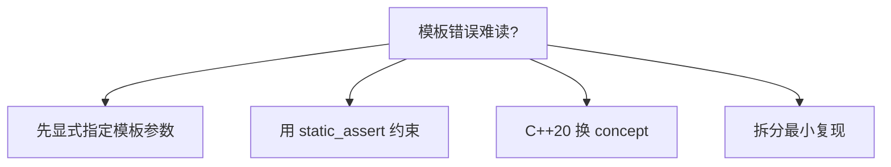

# 模板与泛型编程

> **文件编码**：UTF-8。

## 本章与上一章的关系

[05 章](05-现代C++新特性.md) 的 `vector<T>`、`unique_ptr<T>`、`make_pair` 全是**模板**。没有模板，STL 无法一份代码服务所有类型。本章讲如何自己写模板，让算法与数据结构像 STL 一样泛型化。

对照 [Java 02 泛型](../Java/02-Java常用类集合与泛型.md)：Java 泛型擦除在运行时消失；C++ 模板在**编译期实例化**，生成针对 `int`、`string` 的专用代码，零运行时多态开销。系统库（如 `std::sort`、Eigen、fmt）都建立在模板上。Python 用 duck typing 达到类似效果，见 [Python 02](../Python/02-Python内置类型模块与类型注解.md) 的 `typing`。

---

## 1. 这份文档学什么

- 函数模板与类模板定义、实例化
- 模板参数：类型参数、非类型参数
- 特化与偏特化入门
- SFINAE、`enable_if` 基本用法（C++17）
- 模板在头文件中的组织方式

---

## 2. 函数模板

```cpp
#include <iostream>
#include <string>

template<typename T>
T max_value(T a, T b) {
    return (a < b) ? b : a;
}

template<typename T>
void swap_ref(T& a, T& b) {
    T tmp = a;
    a = b;
    b = tmp;
}

int main() {
    std::cout << max_value(3, 7) << '\n';
    std::cout << max_value(3.14, 2.71) << '\n';
    std::cout << max_value(std::string("ab"), std::string("cd")) << '\n';

    int x = 1, y = 2;
    swap_ref(x, y);
    std::cout << x << ' ' << y << '\n';
    return 0;
}
```

编译器根据实参**自动推导** `T`，或显式 `max_value<int>(3, 7)`。

---

## 3. 类模板

```cpp
#include <iostream>
#include <stdexcept>

template<typename T>
class Stack {
public:
    void push(const T& value) {
        if (size_ >= capacity_) throw std::overflow_error("stack full");
        data_[size_++] = value;
    }

    T pop() {
        if (size_ == 0) throw std::underflow_error("stack empty");
        return data_[--size_];
    }

    bool empty() const { return size_ == 0; }

private:
    static constexpr std::size_t capacity_ = 128;
    T data_[capacity_];
    std::size_t size_ = 0;
};

int main() {
    Stack<int> s;
    s.push(10);
    s.push(20);
    std::cout << s.pop() << '\n';
    return 0;
}
```

---

## 4. 非类型模板参数

```cpp
#include <array>
#include <iostream>

template<typename T, std::size_t N>
class FixedBuffer {
public:
    T& operator[](std::size_t i) { return data_[i]; }
    const T& operator[](std::size_t i) const { return data_[i]; }
    constexpr std::size_t size() const { return N; }

private:
    T data_[N];
};

int main() {
    FixedBuffer<std::byte, 4096> buf{};  // 栈上 4KB 缓冲
    std::array<int, 5> arr{1, 2, 3, 4, 5};
    std::cout << arr.size() << ' ' << buf.size() << '\n';
    return 0;
}
```

网络包固定头、环形缓冲常用固定大小模板，避免堆分配。

---

## 5. 模板特化

### 5.1 全特化

```cpp
#include <iostream>
#include <string>

template<typename T>
struct TypeName {
    static const char* name() { return "unknown"; }
};

template<>
struct TypeName<int> {
    static const char* name() { return "int"; }
};

template<>
struct TypeName<std::string> {
    static const char* name() { return "std::string"; }
};

int main() {
    std::cout << TypeName<int>::name() << '\n';
    std::cout << TypeName<double>::name() << '\n';
    return 0;
}
```

### 5.2 偏特化（类模板）

```cpp
template<typename T, typename U>
struct Pair { /* 通用 */ };

template<typename T>
struct Pair<T, int> { /* 第二个参数为 int 的偏特化 */ };
```

函数模板不支持偏特化，用重载替代。

---

## 6. SFINAE 与 enable_if（入门）

```cpp
#include <iostream>
#include <type_traits>
#include <vector>

template<typename T>
typename std::enable_if<std::is_integral<T>::value, T>::type
safe_div(T a, T b) {
    return b == 0 ? 0 : a / b;
}

template<typename T>
typename std::enable_if<std::is_floating_point<T>::value, T>::type
safe_div(T a, T b) {
    return b == 0.0 ? 0 : a / b;
}

int main() {
    std::cout << safe_div(10, 3) << '\n';
    std::cout << safe_div(10.0, 3.0) << '\n';
    return 0;
}
```

C++20 `concept` 可替代冗长 SFINAE；面试仍常问 `enable_if` 原理。

### 6.1 SFINAE 深入：替换失败不是错误

**SFINAE**（Substitution Failure Is Not An Error）：模板参数替换失败时，该重载从候选集**静默剔除**，而非编译错误。只有**所有**候选都失败才报错。

```cpp
#include <iostream>
#include <type_traits>
#include <vector>

// 有 .size() 的类型走此分支
template<typename T>
auto print_size(const T& obj) -> decltype(obj.size(), void()) {
    std::cout << "size=" << obj.size() << '\n';
}

// 没有 .size() 的走此分支
template<typename T>
auto print_size(const T& obj) -> decltype(void(obj), void()) {
    std::cout << "no size()\n";
}

int main() {
    std::vector<int> v{1, 2, 3};
    print_size(v);
    print_size(42);
    return 0;
}
```

C++17 起可用 `std::void_t` 简化检测：

```cpp
template<typename T, typename = void>
struct has_size : std::false_type {};

template<typename T>
struct has_size<T, std::void_t<decltype(std::declval<T>().size())>> : std::true_type {};
```

### 6.2 C++20 Concepts 预览（对照 SFINAE）

```cpp
// C++20 — 编译需 -std=c++20
#include <concepts>
#include <iostream>

template<std::integral T>
T add_integral(T a, T b) {
    return a + b;
}

template<typename T>
concept HasSize = requires(T t) {
    { t.size() } -> std::convertible_to<std::size_t>;
};

template<HasSize C>
void dump_size(const C& c) {
    std::cout << c.size() << '\n';
}

int main() {
    std::cout << add_integral(1, 2) << '\n';
    dump_size(std::vector<int>{1, 2, 3});
    return 0;
}
```

| 方式 | 可读性 | 错误信息 | 标准 |
|------|--------|---------|------|
| SFINAE + `enable_if` | 差 | 冗长「no matching function」 | C++11 |
| `void_t` 检测 | 中 | 仍偏模板元 | C++17 |
| **Concepts** | 好 | 直接指出约束不满足 | C++20 |

**深入解释：面试怎么说 SFINAE？**  
「编译器在实例化函数模板时，若替换模板参数导致表达式非法，该重载不参与重载决议，不算硬错误。`enable_if` 把不满足条件的重载的返回类型变成无效类型，从而触发 SFINAE 剔除。」

### 6.3 `if constexpr`（C++17）与编译期分支

```cpp
#include <iostream>
#include <type_traits>

template<typename T>
auto process(T value) {
    if constexpr (std::is_integral_v<T>) {
        return value * 2;
    } else {
        return value + value;
    }
}

int main() {
    std::cout << process(21) << ' ' << process(3.5) << '\n';
    return 0;
}
```

未选中分支**不参与实例化**，可对指针类型安全解引用。

---

## 7. 可变参数模板（了解）

```cpp
#include <iostream>

template<typename... Args>
void log(Args... args) {
    ((std::cout << args << ' '), ...);  // C++17 折叠表达式
    std::cout << '\n';
}

int main() {
    log("cpu=", 95, "% mem=", 4096);
    return 0;
}
```

---

## 8. 模板实例化流程


**关键**：模板定义通常放头文件（或 `.hpp`），否则链接期找不到实例。

---

## 9. 与 Java / Python 泛型对照

| 维度 | C++ 模板 | Java 泛型 | Python typing |
|------|---------|-----------|---------------|
| 实现 | 编译期展开 | 擦除 + 装箱 | 运行时 duck type |
| 性能 | 可内联、零开销 | 部分擦除开销 | 动态 |
| 约束 | SFINAE/concept | bounds | Protocol |
| 代码膨胀 | 每类型一份 | 单份字节码 | N/A |

---

## 10. 实用：generic min + print

```cpp
#include <iostream>
#include <string>

template<typename T>
const T& min_ref(const T& a, const T& b) {
    return (b < a) ? b : a;
}

template<typename Container>
void print_container(const Container& c) {
    for (const auto& elem : c) {
        std::cout << elem << ' ';
    }
    std::cout << '\n';
}

int main() {
    std::cout << min_ref(3, 5) << '\n';
    int arr[] = {1, 2, 3};
    print_container(arr);  // 需 C++17 或传 begin/end 重载
    return 0;
}
```

---

## 11. 手把手：头文件模板项目

### 第一步：目录

```powershell
mkdir cpp-ch06-demo && cd cpp-ch06-demo
```

### 第二步：ring_buffer.h

```cpp
#pragma once
#include <cstddef>
#include <stdexcept>

template<typename T, std::size_t Cap>
class RingBuffer {
public:
    bool push(const T& v) {
        if (size_ == Cap) return false;
        buf_[tail_] = v;
        tail_ = (tail_ + 1) % Cap;
        ++size_;
        return true;
    }

    T pop() {
        if (size_ == 0) throw std::underflow_error("empty");
        T v = buf_[head_];
        head_ = (head_ + 1) % Cap;
        --size_;
        return v;
    }

    std::size_t size() const { return size_; }

private:
    T buf_[Cap]{};
    std::size_t head_ = 0, tail_ = 0, size_ = 0;
};
```

### 第三步：main.cpp

```cpp
#include "ring_buffer.h"
#include <iostream>

int main() {
    RingBuffer<int, 8> rb;
    rb.push(1);
    rb.push(2);
    std::cout << rb.pop() << ' ' << rb.pop() << '\n';
    return 0;
}
```

### 第四步

```powershell
g++ -std=c++17 -Wall -Wextra -o ring main.cpp
.\ring.exe
```

MSVC：`cl /EHsc /std:c++17 /W4 main.cpp`

---

## 12. 常见报错与排查

| 报错信息（关键词） | 可能原因 | 解决方案 |
|-------------------|---------|---------|
| `no matching function for call` | 模板无法推导 | 显式指定模板参数 |
| `undefined reference to ...` | 模板定义在 .cpp | 移到头文件或显式实例化 |
| `ambiguous overload` | 多个模板同样匹配 | 更具体重载或 SFINAE |
| `error: 'T' was not declared` | 缺 typename | 依赖名加 `typename` |
| `template argument deduction/substitution failed` | SFINAE 排除 | 检查 enable_if 条件 |
| `excessive recursion in template instantiation` | 递归模板过深 | 改迭代或特化终止 |
| `cannot convert ... loss of precision` | 窄化 | 显式 cast 或改类型 |
| MSVC `C2976` too few template args | 参数个数不对 | 补全 `<T, N>` |
| `redefinition of default template parameter` | 默认参数重复 | 只在声明或定义一处默认 |
| `invalid operands to binary expression` | 类型无 operator< | 特化或 requires/concept |
| `static assertion failed` concept | C++20 约束不满足 | 检查 concept 要求 |
| `dependent name` 需 typename | 嵌套模板类型 | `typename T::iterator` |
| 两阶段查找困惑 | 基类依赖名未加 `this->` | `this->member` 或 using 声明 |
| 模板友元声明错误 | 友元模板语法 | `friend class Foo<T>` |
| 显式实例化重复 | 多 .cpp 实例化同一模板 | 只在一处 `extern template` |

---

## 13. 练习建议

### 基础

1. 写 `template<typename T> T abs_val(T x)`
2. 写类模板 `Pair<T,U>` 存两个值
3. 为 `Stack<int>` 与 `Stack<double>` 分别 push/pop

### 进阶

4. 模板函数 `reverse_array(T* arr, size_t n)`
5. `TypeName<T>` 特化 `double`、`const char*`
6. 用 `enable_if` 限制模板只接受算术类型

### 挑战

7. 简易 `SmallVector<T, N>`：栈上 N 个，超出转 `vector`
8. 模板元编程：编译期 `Factorial<5>::value`

---

## 14. 分级练习参考答案

### 基础：abs_val

```cpp
#include <iostream>

template<typename T>
T abs_val(T x) {
    return x < T{} ? -x : x;
}

int main() {
    std::cout << abs_val(-3) << ' ' << abs_val(-2.5) << '\n';
    return 0;
}
```

### 进阶：reverse_array

```cpp
#include <algorithm>
#include <iostream>

template<typename T>
void reverse_array(T* arr, std::size_t n) {
    if (n <= 1) return;
    for (std::size_t i = 0; i < n / 2; ++i) {
        std::swap(arr[i], arr[n - 1 - i]);
    }
}

int main() {
    int a[] = {1, 2, 3, 4};
    reverse_array(a, 4);
    for (int x : a) std::cout << x << ' ';
    std::cout << '\n';
    return 0;
}
```

### 基础：Pair 类模板

```cpp
#include <iostream>
#include <string>

template<typename T, typename U>
class Pair {
public:
    Pair(T first, U second) : first_(std::move(first)), second_(std::move(second)) {}
    const T& first() const { return first_; }
    const U& second() const { return second_; }

private:
    T first_;
    U second_;
};

int main() {
    Pair<std::string, int> p{"host", 8080};
    std::cout << p.first() << ':' << p.second() << '\n';
    return 0;
}
```

### 进阶：enable_if 限制算术类型

```cpp
#include <iostream>
#include <type_traits>

template<typename T>
typename std::enable_if<std::is_arithmetic<T>::value, T>::type
square(T x) {
    return x * x;
}

int main() {
    std::cout << square(5) << ' ' << square(2.5) << '\n';
    // square("ab");  // 编译失败：非算术类型
    return 0;
}
```

### 进阶：SmallVector 简化骨架

```cpp
#include <iostream>
#include <vector>

template<typename T, std::size_t N>
class SmallVector {
public:
    void push_back(const T& v) {
        if (size_ < N) {
            stack_[size_++] = v;
        } else {
            heap_.push_back(v);
        }
    }

    std::size_t size() const { return size_ < N ? size_ : N + heap_.size(); }

    T& operator[](std::size_t i) {
        if (i < N && i < size_) return stack_[i];
        return heap_[i - N];
    }

private:
    T stack_[N]{};
    std::size_t size_ = 0;
    std::vector<T> heap_;
};

int main() {
    SmallVector<int, 4> sv;
    for (int i = 0; i < 6; ++i) sv.push_back(i);
    for (std::size_t i = 0; i < sv.size(); ++i) std::cout << sv[i] << ' ';
    std::cout << '\n';
    return 0;
}
```

### 挑战：Factorial 编译期

```cpp
#include <iostream>

template<int N>
struct Factorial {
    static constexpr int value = N * Factorial<N - 1>::value;
};

template<>
struct Factorial<0> {
    static constexpr int value = 1;
};

int main() {
    std::cout << Factorial<5>::value << '\n';
    return 0;
}
```

---

## 15. 深入解释：模板三大难点

### 15.1 难点一：两阶段名称查找

```cpp
#include <iostream>

template<typename T>
struct Base {
    void foo() { std::cout << "Base\n"; }
};

template<typename T>
struct Derived : Base<T> {
    void bar() {
        // this->foo();  // 依赖名须 this-> 或 using Base<T>::foo;
        Base<T>::foo();
    }
};

int main() {
    Derived<int> d;
    d.bar();
    return 0;
}
```

非依赖名在模板定义时查；依赖名在**实例化时**查。

### 15.2 难点二：模板代码膨胀

同一 `sort<int>` 与 `sort<double>` 各生成一份机器码。缓解：显式实例化、`extern template`、类型擦除（`std::function`）、或拆分热路径。

### 15.3 难点三：typename 依赖类型

```cpp
template<typename T>
void f(T& container) {
    typename T::value_type x = *container.begin();
    (void)x;
}
```

嵌套在模板里的类型名（如 `T::value_type`）必须用 `typename` 告诉编译器这是类型而非静态成员。



---

## 16. 模板参数推导规则（C++17 补充）

```cpp
#include <iostream>
#include <utility>

template<typename T>
void foo(T&& param) {  // 转发引用，06 章进阶；05 章 std::move 相关
    std::cout << std::is_same_v<T, int> << '\n';
}

template<typename T, typename U>
auto add(T a, U b) -> decltype(a + b) {
    return a + b;
}

int main() {
    int x = 1;
    foo(x);           // T = int&
    foo(42);          // T = int

    std::cout << add(1, 2.5) << '\n';
    return 0;
}
```

需 `#include <type_traits>`。显式实例化可减少编译时间：

```cpp
// 在某 .cpp 中（仅当定义在该 .cpp 可见时）
template class Stack<int>;
template void swap_ref<int>(int&, int&);
```

大型系统项目常对头文件模板拆分「声明 + 显式实例化 `.cpp`」，09 章 CMake 多目标时会再遇。

---

## 17. FAQ

**Q：模板会让程序变大吗？**  
会（代码膨胀）；通常用体积换速度。链接时 `--gc-sections` 可剔除未用实例。

**Q：typename 和 class 有区别吗？**  
模板类型参数两者等价；依赖类型名必须用 `typename`。

**Q：和宏？**  
模板类型安全；宏已少用于泛型。

---

## 18. 学完标准

- [ ] 能写函数模板与类模板
- [ ] 理解编译期实例化与头文件放置
- [ ] 会全特化与一个偏特化例子
- [ ] 读懂简单 `enable_if` 代码
- [ ] 完成 RingBuffer 或 reverse_array 练习
- [ ] 对照 Java 泛型说明 2 点差异

---

## 19. 下一章预告

模板与 RAII 结合才能写出异常安全的泛型代码。07 章 [异常处理与 RAII](07-异常处理与RAII.md) 讲 `try/catch`、 noexcept、资源在析构中释放——对照 [Python 01 异常](../Python/01-Python基础语法与面向对象.md)，理解 C++ 异常与构造/析构的交互。

---

*下一章：07 异常处理与 RAII*
