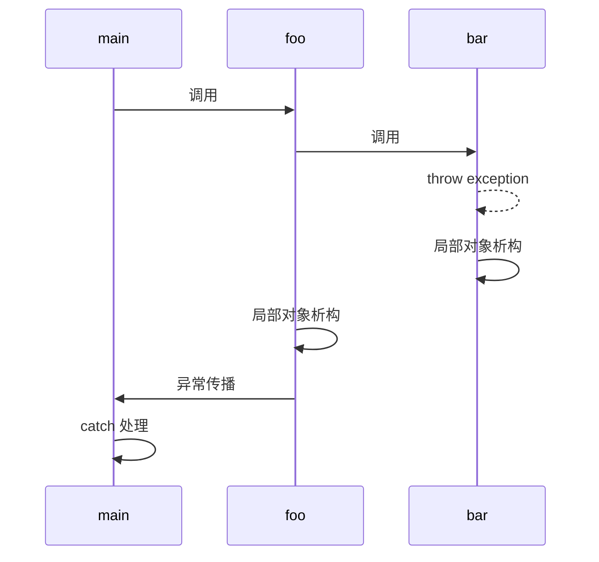
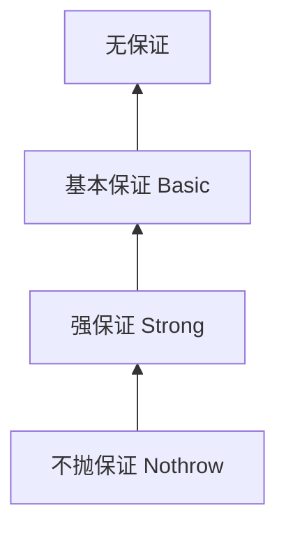
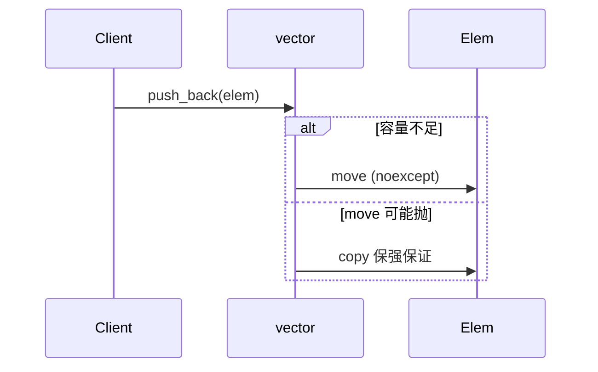

# 异常处理与 RAII

> **文件编码**：UTF-8。

---

## 0. 读前导读（零基础也能跟上）

### 0.1 用一句话弄懂本章

**异常 + RAII** = 出错时栈展开仍能保证资源释放——像离开房间时**自动关门**，不管正常走还是跑出去（抛异常）。

### 0.2 你需要提前知道什么

- [05 章](05-现代C++新特性.md) `unique_ptr`、`lock_guard` 初识
- [02 章](02-指针引用与内存管理.md) 堆释放；[03 章](03-面向对象与类设计.md) 析构
- Python `with` / Java try-with-resources 心智对照

### 0.3 本章知识地图（☐→☑）

- [ ] try/catch/throw 与自定义异常
- [ ] 写 File/Mutex 的 RAII 包装
- [ ] 理解栈 unwinding 与析构顺序
- [ ] 说出基本/强/不抛保证
- [ ] §18 闭卷自测 ≥8/10

### 0.4 建议学习时长

**4～6 天**；RAII 需结合代码观察析构顺序（§10）。

### 0.5 学完你能做什么

用 **自动关门** 模式写 ScopeGuard；解释 `vector::push_back` 异常安全；进入 08 章 `lock_guard` 并发。

### 0.6 核心类比：自动关门

**术语（RAII）**：Resource Acquisition Is Initialization，构造获取资源，析构释放。

**生活类比**：**自动关门**——进房间（构造）拉门，离开（析构）无论正常出门还是紧急跑出（异常）都关门。

**为什么重要**：文件、锁、内存、网络句柄；07 是 C++ 区别于 C 的关键习惯。

**本章用到的地方**：§4 RAII、§5 智能指针、§7 异常安全。

### 0.7 与 Java / Python

| 本章 | 对照 |
|------|------|
| RAII | Java **try-with-resources**；Python **`with`** |
| 无 checked exception | [Java 01](../Java/01-Java基础语法与面向对象.md) checked/unchecked |
| 析构 noexcept | 与 [Java 03](../Java/03-Java并发编程与JVM.md) 锁释放对比 |

---

## 本章与上一章的关系

[06 章](06-模板与泛型编程.md) 模板代码在构造失败、资源不足时如何安全退出？[05 章](05-现代C++新特性.md) 智能指针依赖**析构自动释放**；[02 章](02-指针引用与内存管理.md) 裸指针在异常路径上极易泄漏。**RAII（Resource Acquisition Is Initialization）** 是 C++ 资源管理核心：获取资源在构造，释放在析构——无论正常 return 还是抛异常。

本章讲 `try/catch/throw`、异常安全级别、RAII 惯用法。对照 [Python 01 异常](../Python/01-Python基础语法与面向对象.md) 与 [Java](../Java/01-Java基础语法与面向对象.md) checked/unchecked；C++ **无 checked exception**，但析构函数默认 `noexcept` 约束更严。系统编程中文件句柄、锁、GPU 资源都靠 RAII 保证不泄漏。

---

## 1. 这份文档学什么

- 使用 `try`、`catch`、`throw` 处理错误
- 理解异常传播与栈 unwinding
- 掌握 RAII：锁、文件、内存包装
- 异常安全：基本/强/不抛异常保证
- `noexcept` 与何时不应在析构抛异常

---

## 2. 基本异常语法

```cpp
#include <iostream>
#include <stdexcept>
#include <string>

double divide(double a, double b) {
    if (b == 0.0) {
        throw std::invalid_argument("除数不能为 0");
    }
    return a / b;
}

int main() {
    try {
        std::cout << divide(10, 2) << '\n';
        std::cout << divide(10, 0) << '\n';
    } catch (const std::invalid_argument& e) {
        std::cerr << "捕获: " << e.what() << '\n';
    } catch (const std::exception& e) {
        std::cerr << "其他标准异常: " << e.what() << '\n';
    } catch (...) {
        std::cerr << "未知异常\n";
    }
    std::cout << "程序继续\n";
    return 0;
}
```

**按 const 引用捕获**，避免切片；先捕派生类再捕基类。

---

## 3. 自定义异常

```cpp
#include <exception>
#include <string>

class ParseError : public std::runtime_error {
public:
    explicit ParseError(const std::string& msg, int line)
        : std::runtime_error(msg), line_(line) {}

    int line() const { return line_; }

private:
    int line_;
};

void parse_config(int line, const std::string& token) {
    if (token.empty()) {
        throw ParseError("空 token", line);
    }
}

int main() {
    try {
        parse_config(42, "");
    } catch (const ParseError& e) {
        return e.line();
    }
    return 0;
}
```

---

## 4. RAII 核心

### 4.1 文件 RAII

```cpp
#include <fstream>
#include <iostream>
#include <stdexcept>
#include <string>

class FileWriter {
public:
    explicit FileWriter(const std::string& path)
        : out_(path, std::ios::app) {
        if (!out_) {
            throw std::runtime_error("无法打开: " + path);
        }
    }

    void write_line(const std::string& line) {
        out_ << line << '\n';
        if (!out_) throw std::runtime_error("写入失败");
    }

    ~FileWriter() {
        if (out_.is_open()) out_.close();
    }

    FileWriter(const FileWriter&) = delete;
    FileWriter& operator=(const FileWriter&) = delete;

private:
    std::ofstream out_;
};

void process() {
    FileWriter w("audit.log");
    w.write_line("step1");
    // 若此处抛异常，析构仍关闭文件
}

int main() {
    try {
        process();
    } catch (const std::exception& e) {
        std::cerr << e.what() << '\n';
    }
    return 0;
}
```

### 4.2 锁 RAII（预告 08 章）

```cpp
#include <iostream>
#include <mutex>

std::mutex g_mtx;

void critical_section() {
    std::lock_guard<std::mutex> lock(g_mtx);
    // 离开作用域自动 unlock，即使抛异常
    std::cout << "locked work\n";
}

int main() {
    critical_section();
    return 0;
}
```

---

## 5. 异常与内存：为何需要智能指针

```cpp
#include <memory>
#include <stdexcept>

void bad_old_style() {
    int* p = new int(42);
    if (some_condition()) {
        delete p;
        throw std::runtime_error("fail");
    }
    delete p;  // 若中间 throw 且未 delete → 泄漏
}

void good_raii() {
    auto p = std::make_unique<int>(42);
    if (some_condition()) {
        throw std::runtime_error("fail");
    }
}  // unique_ptr 析构自动 delete

bool some_condition() { return true; }
```

---

## 6. 栈 unwinding



每个栈帧上的 RAII 对象按构造逆序析构，因此锁、文件、智能指针在异常路径仍安全。

---

## 7. 异常安全保证

C++ 异常安全分四级（面试常考）。理解关键是：**操作失败抛异常后，对象与系统处于什么状态？**

| 级别 | 英文 | 失败时状态 | 典型 API |
|------|------|-----------|---------|
| **无保证** | — | 可能损坏、泄漏 | 手写 raw `new` 中途 throw |
| **基本保证** | Basic | 不泄漏；对象仍有效但值可能变 | 多步非原子赋值 |
| **强保证** | Strong | 失败则**状态完全不变** | `vector::push_back`、`swap` |
| **不抛保证** | Nothrow | 绝不抛异常 | 析构、`swap`（若标记 noexcept）、`move` |



### 7.1 基本保证示例

```cpp
#include <iostream>
#include <stdexcept>
#include <string>
#include <vector>

class TaskQueue {
public:
    void append(const std::string& name) {
        names_.push_back(name);  // vector 单独 push：强保证
    }

    // 反例：非原子复合操作只有基本保证
    void append_with_limit(const std::string& name, std::size_t max) {
        if (names_.size() >= max) {
            throw std::overflow_error("full");
        }
        names_.push_back(name);  // 若 push 失败，size 未变（强）；检查在前，逻辑一致
    }

private:
    std::vector<std::string> names_;
};
```

### 7.2 强保证：copy-and-swap 惯用法

```cpp
#include <cstring>
#include <iostream>
#include <utility>

class MyString {
public:
    MyString() : len_(0), data_(new char[1]{'\0'}) {}
    explicit MyString(const char* s) : len_(std::strlen(s)), data_(new char[len_ + 1]) {
        std::memcpy(data_, s, len_ + 1);
    }
    MyString(const MyString& o) : len_(o.len_), data_(new char[len_ + 1]) {
        std::memcpy(data_, o.data_, len_ + 1);
    }
    void swap(MyString& o) noexcept {
        std::swap(len_, o.len_);
        std::swap(data_, o.data_);
    }
    MyString& operator=(MyString tmp) {  // 按值传参 + swap
        swap(tmp);
        return *this;  // tmp 析构旧资源
    }
    ~MyString() { delete[] data_; }
    const char* c_str() const { return data_; }

private:
    std::size_t len_;
    char* data_;
};
```

赋值步骤：构造副本（失败则 `*this` 不变）→ `swap`（noexcept）→ 临时对象析构旧数据。**强保证核心**。

### 7.3 不抛保证与 vector 扩容

```cpp
#include <iostream>
#include <utility>
#include <vector>

class Blob {
public:
    Blob() = default;
    Blob(const Blob&) { /* 可能抛 */ }
    Blob(Blob&&) noexcept { /* 必须不抛 */ }
};

int main() {
    std::vector<Blob> v;
    v.reserve(100);
    // 若 Blob 移动构造是 noexcept，扩容用 move；否则退回复制
    return 0;
}
```

**深入解释：为何析构必须不抛？**  
栈 unwinding 过程中若析构再抛异常，C++ 调用 `std::terminate()`，进程直接终止。因此析构内应捕获并吞掉次要异常，或全程 `noexcept`。

### 7.4 异常安全决策表

| 操作 | 推荐级别 | 实现手段 |
|------|---------|---------|
| 赋值运算符 | 强 | copy-and-swap |
| `push_back` 容器 | 强 | 标准容器已保证 |
| 析构函数 | 不抛 | `noexcept`、不 throw |
| 交换 `swap` | 不抛 | 只改指针 |
| 日志辅助 | 基本即可 | 失败可吞 |
| 网络发送（热路径） | 错误码 / 不抛 | 避免异常开销 |

```cpp
#include <iostream>
#include <vector>

class Widget {
public:
    void append(int x) {
        data_.push_back(x);  // vector 强保证：失败时 size 不变
    }

private:
    std::vector<int> data_;
};
```

---

## 8. noexcept

```cpp
#include <iostream>
#include <utility>
#include <vector>

void may_throw() {
    throw 1;
}

void never_throw() noexcept {
    std::cout << "noexcept\n";
}

int main() {
    std::vector<int> v{1, 2, 3};
    // 移动构造若 noexcept，vector 扩容才用 move
    never_throw();
    return 0;
}
```

**析构函数不要抛异常**：unwinding 中若再抛，调用 `std::terminate`。

---

## 9. 系统编程：ScopeGuard 与错误码并存

底层 API（POSIX、Win32）常返回错误码；可包装为 RAII + 异常可选层：

```cpp
#include <cstdio>
#include <iostream>
#include <stdexcept>
#include <string>

class CFile {
public:
    static CFile open(const char* path, const char* mode) {
        std::FILE* fp = std::fopen(path, mode);
        if (!fp) throw std::runtime_error(std::string("open failed: ") + path);
        return CFile(fp);
    }

    ~CFile() { if (fp_) std::fclose(fp_); }

    CFile(const CFile&) = delete;
    CFile& operator=(const CFile&) = delete;

    CFile(CFile&& o) noexcept : fp_(o.fp_) { o.fp_ = nullptr; }

private:
    explicit CFile(std::FILE* fp) : fp_(fp) {}
    std::FILE* fp_;
};

int main() {
    try {
        auto f = CFile::open("data.bin", "rb");
    } catch (const std::exception& e) {
        std::cerr << e.what() << '\n';
    }
    return 0;
}
```

高性能路径可用 `std::expected`（C++23）或 `optional`+错误码；本路线先掌握异常 + RAII。

---

## 10. 手把手：观察异常析构顺序

### exception_order.cpp

```cpp
#include <iostream>
#include <stdexcept>

struct Tracer {
    std::string name;
    explicit Tracer(std::string n) : name(std::move(n)) {
        std::cout << "+ " << name << '\n';
    }
    ~Tracer() { std::cout << "- " << name << '\n'; }
};

void inner() {
    Tracer t("inner");
    throw std::runtime_error("boom");
}

void outer() {
    Tracer t("outer");
    inner();
}

int main() {
    try {
        outer();
    } catch (const std::exception& e) {
        std::cout << "catch: " << e.what() << '\n';
    }
    return 0;
}
```

```powershell
g++ -std=c++17 -g -o ex_order exception_order.cpp
.\ex_order.exe
```

预期：`- inner` 先于 `- outer`，再 `catch`。

---

## 11. 常见报错与排查

| 报错信息（关键词） | 可能原因 | 解决方案 |
|-------------------|---------|---------|
| `terminate called after throwing` | 异常未捕获 | 加 catch 或 noexcept 边界 |
| `terminate called without active exception` | 析构抛异常 | 析构内 swallow 或 noexcept |
| `what(): basic_string::_M_create` | 异常信息构造失败 | 简化 throw 对象 |
| 内存泄漏仅异常路径 | 非 RAII | 改 unique_ptr/容器 |
| `exception handling disabled` | 编译 `-fno-exceptions` | 去掉该 flag 或不用异常 |
| MSVC `C4530` C++ exception handler used | 未开 /EHsc | 加 `/EHsc` |
| `catching polymorphic type by value` | 值捕获基类 | 改 `const&` |
| `throwing in noexcept function` | 违反 noexcept | 移除 throw 或去掉 noexcept |
| `-Wexceptions` unreachable | catch 顺序错误 | 派生类 catch 在前 |
| 双重释放 after exception | 手动 delete 又 RAII | 统一 RAII |
| `std::current_exception` 重抛失败 | `exception_ptr` 已失效 | 立即 `rethrow_exception` |
| `noexcept(false)` 仍被 terminate | 析构抛异常 | 析构内 catch(...) |
| 构造函数抛异常泄漏 | 成员构造顺序部分成功 | 成员用 RAII；委托构造 |
| `throw;` 无活跃异常 | 不在 catch 内 | 改为 `throw e;` |
| `what()` 返回 dangling | 临时 string 捕获 | 存 `std::string` 成员 |
| RAII 析构顺序错 | 成员声明顺序 | 先声明的后析构 |
| `lock_guard` 与 `unique_lock` 混用 | 重复 unlock | 只一种锁 RAII |
| 异常规格动态异常说明（旧） | C++17 已移除 | 用 `noexcept` |
| `-fno-exceptions` 链接失败 | 库要异常 RTTI | 统一编译选项 |
| `bad_alloc` 未捕获 | `new` 失败默认抛 | catch `std::bad_alloc` |

---

## 12. 练习建议

### 基础

1. 写 `sqrt_positive(double x)`，负数 throw `domain_error`
2. 用 `lock_guard` 保护 `counter++`（08 章预习）
3. 自定义 `ConfigError` 继承 `runtime_error`

### 进阶

4. `DatabaseConnection` RAII：构造连接，析构断开（可模拟）
5. 实现 `ScopeGuard` 在析构执行 lambda
6. `vector` push 失败时验证强保证（观察 size）

### 挑战

7. copy-and-swap 实现异常安全的 `String` 赋值
8. 解析 `"key=value"` 行，格式错 throw，用 RAII 日志文件

---

## 13. 分级练习参考答案

### 基础：sqrt_positive

```cpp
#include <cmath>
#include <iostream>
#include <stdexcept>

double sqrt_positive(double x) {
    if (x < 0) throw std::domain_error("negative");
    return std::sqrt(x);
}

int main() {
    try {
        std::cout << sqrt_positive(9) << '\n';
        std::cout << sqrt_positive(-1) << '\n';
    } catch (const std::domain_error& e) {
        std::cerr << e.what() << '\n';
    }
    return 0;
}
```

### 进阶：ScopeGuard

```cpp
#include <functional>
#include <iostream>
#include <utility>

class ScopeGuard {
public:
    explicit ScopeGuard(std::function<void()> fn) : fn_(std::move(fn)) {}
    ~ScopeGuard() { if (active_ && fn_) fn_(); }

    ScopeGuard(const ScopeGuard&) = delete;
    ScopeGuard& operator=(const ScopeGuard&) = delete;

    void dismiss() { active_ = false; }

private:
    std::function<void()> fn_;
    bool active_ = true;
};

int main() {
    ScopeGuard g([] { std::cout << "cleanup\n"; });
    std::cout << "work\n";
    return 0;
}
```

### 基础：ConfigError 自定义异常

```cpp
#include <iostream>
#include <stdexcept>
#include <string>

class ConfigError : public std::runtime_error {
public:
    ConfigError(const std::string& key, const std::string& reason)
        : std::runtime_error("config key '" + key + "': " + reason), key_(key) {}
    const std::string& key() const { return key_; }

private:
    std::string key_;
};

void load(const std::string& key, const std::string& val) {
    if (val.empty()) throw ConfigError(key, "empty value");
}

int main() {
    try {
        load("db.host", "");
    } catch (const ConfigError& e) {
        std::cerr << e.what() << " key=" << e.key() << '\n';
    }
    return 0;
}
```

### 进阶：DatabaseConnection RAII 模拟

```cpp
#include <iostream>
#include <stdexcept>
#include <string>

class DatabaseConnection {
public:
    explicit DatabaseConnection(std::string dsn) : dsn_(std::move(dsn)) {
        std::cout << "connect " << dsn_ << '\n';
        if (dsn_.empty()) throw std::runtime_error("invalid dsn");
    }
    ~DatabaseConnection() {
        std::cout << "disconnect " << dsn_ << '\n';
    }
    DatabaseConnection(const DatabaseConnection&) = delete;
    DatabaseConnection& operator=(const DatabaseConnection&) = delete;

    void query(const std::string& sql) {
        std::cout << "exec: " << sql << '\n';
    }

private:
    std::string dsn_;
};

void business() {
    DatabaseConnection db("mysql://localhost/app");
    db.query("SELECT 1");
    throw std::runtime_error("logic error");  // 仍 disconnect
}

int main() {
    try { business(); }
    catch (const std::exception& e) { std::cerr << e.what() << '\n'; }
    return 0;
}
```

### 进阶：解析 key=value 带 RAII 日志

```cpp
#include <fstream>
#include <iostream>
#include <sstream>
#include <stdexcept>
#include <string>

class AuditLog {
public:
    explicit AuditLog(const std::string& path) : out_(path, std::ios::app) {
        if (!out_) throw std::runtime_error("cannot open log");
    }
    void write(const std::string& line) { out_ << line << '\n'; }
    ~AuditLog() { if (out_.is_open()) out_.close(); }

private:
    std::ofstream out_;
};

std::pair<std::string, std::string> parse_line(const std::string& line) {
    auto pos = line.find('=');
    if (pos == std::string::npos) throw std::runtime_error("bad format: " + line);
    return {line.substr(0, pos), line.substr(pos + 1)};
}

int main() {
    try {
        AuditLog log("audit.log");
        std::istringstream in("host=localhost\nbadline\nport=8080");
        std::string line;
        while (std::getline(in, line)) {
            auto [k, v] = parse_line(line);
            log.write(k + " -> " + v);
        }
    } catch (const std::exception& e) {
        std::cerr << e.what() << '\n';
    }
    return 0;
}
```

### 挑战：copy-and-swap String 简化

```cpp
#include <cstring>
#include <iostream>
#include <utility>

class MyString {
public:
    MyString() : len_(0), data_(new char[1]{'\0'}) {}
    explicit MyString(const char* s) : len_(std::strlen(s)), data_(new char[len_ + 1]) {
        std::memcpy(data_, s, len_ + 1);
    }
    MyString(const MyString& o) : len_(o.len_), data_(new char[len_ + 1]) {
        std::memcpy(data_, o.data_, len_ + 1);
    }
    void swap(MyString& o) noexcept {
        std::swap(len_, o.len_);
        std::swap(data_, o.data_);
    }
    MyString& operator=(MyString tmp) {
        swap(tmp);
        return *this;
    }
    ~MyString() { delete[] data_; }
    const char* c_str() const { return data_; }

private:
    std::size_t len_;
    char* data_;
};

int main() {
    MyString a("hi"), b("bye");
    a = b;
    std::cout << a.c_str() << '\n';
    return 0;
}
```

---

## 14. 深入解释：异常安全实战案例

### 14.1 案例：构造函数抛异常时的成员析构

```cpp
#include <iostream>
#include <memory>
#include <stdexcept>
#include <string>

class PartA {
public:
    PartA() { std::cout << "PartA ok\n"; }
    ~PartA() { std::cout << "~PartA\n"; }
};

class PartB {
public:
    PartB() {
        std::cout << "PartB fail\n";
        throw std::runtime_error("init failed");
    }
    ~PartB() { std::cout << "~PartB\n"; }
};

class Gadget {
public:
    Gadget() : a_(std::make_unique<PartA>()), b_(std::make_unique<PartB>()) {}
private:
    std::unique_ptr<PartA> a_;
    std::unique_ptr<PartB> b_;
};

int main() {
    try { Gadget g; }
    catch (const std::exception& e) { std::cerr << e.what() << '\n'; }
    return 0;
}
```

已构造的 `PartA` 会析构；`unique_ptr` 成员保证部分构造失败不泄漏。

### 14.2 案例：异常 vs 错误码选型

| 场景 | 异常 | 错误码 |
|------|------|--------|
| 构造函数失败 | ✓ 无法返回错误码 | — |
| 解析配置文件 | ✓ 层次清晰 | `optional`/`expected` 亦可 |
| 游戏每帧更新 | ✗ 热路径 | ✓ 返回 bool |
| 网络 EAGAIN | ✗ | ✓ `errno` / `GetLastError` |
| 容器越界 | `at()` 抛 | `operator[]` 未定义 |

### 14.3 案例：noexcept 与 std::vector

```cpp
#include <iostream>
#include <vector>

struct MoveOnly {
    MoveOnly() = default;
    MoveOnly(MoveOnly&&) noexcept { std::cout << "move\n"; }
    MoveOnly(const MoveOnly&) { std::cout << "copy\n"; }
};

int main() {
    std::vector<MoveOnly> v;
    v.reserve(2);
    v.emplace_back();
    v.emplace_back();
    v.emplace_back();  // 扩容：noexcept move → 只 move；否则 copy
    return 0;
}
```

移动构造标记 `noexcept` 是性能与异常安全双关。



---

## 15. FAQ

**Q：异常慢吗？**  
正常路径零开销（table-based zero-cost）；仅 throw 时慢。热路径可用错误码。

**Q：应用该用异常还是错误码？**  
构造失败、无法继续的业务错误用异常；实时循环内用错误码或 `optional`。

**Q：Python `with` 对应什么？**  
RAII 析构；C++ 无 `with` 关键字，靠作用域结束。

---

## 16. 学完标准

- [ ] 会 try/catch/throw 与自定义异常
- [ ] 能写 File/锁/智能指针 RAII 包装
- [ ] 理解栈 unwinding 与析构顺序
- [ ] 知道基本/强/不抛保证含义
- [ ] 析构不抛异常
- [ ] 完成 ScopeGuard 或 MyString 赋值练习

---

## 17. 闭卷自测

1. **自动关门（RAII）** 哪两件事情在构造/析构发生？
2. 抛异常时栈上局部对象怎么释放？
3. 基本/强/不抛保证各一句话？
4. 为什么析构函数不应抛异常？
5. `lock_guard` 与 RAII 关系？
6. ScopeGuard 解决什么场景？
7. 异常 vs 错误码：热路径选哪个？
8. `noexcept` 对 move 容器有何影响？（§14）
9. Python `with` / Java try-with-resources 与 RAII 对照？
10. 07 与 05 `unique_ptr` 关系？

<details>
<summary>自测参考答案</summary>

1. **构造获取资源、析构释放**（自动关门）。
2. **栈 unwinding**，按构造逆序调用析构。
3. 基本：不泄漏；强：失败回滚到调用前；不抛：绝不 throw。
4. unwinding 中再抛 → **`std::terminate`**。
5. 构造加锁、析构解锁——**自动关门**式锁管理。
6. 函数内多步清理，任意步骤失败仍执行回调。
7. 热路径**错误码**；构造失败/无法继续用**异常**。
8. `vector` 扩容 prefer **noexcept move**，否则拷贝保强保证。
9. 都是**作用域结束释放**；C++ 靠析构无关键字。
10. `unique_ptr` 是堆内存 RAII；07 讲**原则**与异常路径。

</details>

---

## 18. 费曼检验

3 分钟讲 RAII——只用**自动关门**，禁止说「析构函数」以外的术语也可以。

**提纲**：进门拉门=拿到资源；出门必关门=释放；着火跑出来（异常）也关门；智能指针是雇了管家自动关门。

---

## 19. FAQ 补充

**Q：07 与 [Java 03](../Java/03-Java并发编程与JVM.md) 锁释放？**  
`lock_guard` RAII 类似 synchronized 块结束释放；C++ 忘记 unlock 更致命，data race 是 UB。

---

## 20. 术语三件套：异常安全级别

**术语（Basic guarantee 基本保证）**：异常后无泄漏，对象仍可用但状态可能变。

**生活类比**：着火跑出来**自动关门**（不泄漏），但房间可能乱。

**为什么重要**：STL 容器操作至少基本保证；强保证像「失败则一切如未发生」。

**本章用到的地方**：§7 异常安全保证。

---

## 21. 手把手：观察 unwinding 析构顺序

| 步骤 | 你的动作 | 预期看到什么 | 若不对 |
|------|----------|--------------|--------|
| 1 | 编译 §10 示例（含多个 RAII 对象） | 成功 | — |
| 2 | 在 `throw` 前设断点 | 停住 | — |
| 3 | 单步进入 throw | 进入 catch 前打印析构 | 顺序与构造**相反** |
| 4 | 注释掉某 RAII 析构 | 泄漏或重复 | 对比 Valgrind |

---

## 22. Python `with` / Java try-with-resources 对照

| 语言 | 写法 | C++ 等价 |
|------|------|----------|
| Python | `with open(...) as f:` | `ifstream f(...);` 作用域结束析构 |
| Java | `try (var in = ...) { }` | `unique_ptr` / 自定义 RAII 类 |
| C++ | 无关键字 | **自动关门**靠析构 |

---

## §23. 异常规格与 throw 列表演进

### §23.1 C++98 异常规格（已废弃）

```cpp
void old_style() throw(int);        // C++98，C++11 弃用
void no_throw() throw();            // 等价于 noexcept(true)
```

**不要在新代码中使用** `throw(type-list)`。

### §23.2 noexcept 规格

```cpp
void may_throw();
void will_not_throw() noexcept;
void like_move(T& t) noexcept(noexcept(t.swap(other)));
```

| 写法 | 含义 |
|------|------|
| `noexcept` | 承诺不抛异常 |
| `noexcept(expr)` | expr 为 true 则 noexcept |
| `noexcept(false)` | 可能抛异常 |

违反 `noexcept` → 调用 `std::terminate`。

---

## §24. 栈展开（stack unwinding）机制

抛异常时，编译器沿调用栈**逆序**销毁自动（栈）对象，直到匹配 `catch` 或 `std::terminate`。

```cpp
#include <iostream>

struct Guard {
    std::string name;
    Guard(std::string n) : name(std::move(n)) {
        std::cout << "构造 " << name << '\n';
    }
    ~Guard() { std::cout << "析构 " << name << '\n'; }
};

void inner() {
    Guard g("inner");
    throw 42;
}

void outer() {
    Guard g("outer");
    try {
        inner();
    } catch (int e) {
        std::cout << "捕获 " << e << '\n';
    }
}

int main() {
    outer();
    // 构造 outer → 构造 inner → 析构 inner → 捕获 → 析构 outer
    return 0;
}
```

**关键**：RAII 对象析构在 unwinding 路径上**自动**执行——资源不泄漏。堆内存需 `unique_ptr` 等 RAII 包装。

---

## §25. 智能指针与异常安全

```cpp
void risky() {
    // 危险：若 process 抛异常，p 泄漏
    // Widget* p = new Widget;
    // process(p);
    // delete p;

    auto p = std::make_unique<Widget>();
    process(*p);
}  // 无论 process 是否抛异常，unique_ptr 析构释放
```

**三行 delete 问题**：中间语句抛异常 → 跳过 delete。智能指针 + RAII 是 05/07 章交汇点。

**shared_ptr 注意**：不要在构造函数中将 `this` 交给 `shared_ptr` 再抛异常——用 `enable_shared_from_this` 或工厂返回 `shared_ptr`。

---

## §26. noexcept 与移动语义交互

```cpp
#include <vector>
#include <iostream>

struct NoThrowMove {
    NoThrowMove() = default;
    NoThrowMove(NoThrowMove&&) noexcept { std::cout << "move\n"; }
};

struct ThrowMove {
    ThrowMove(ThrowMove&&) { std::cout << "move may throw\n"; }
};

int main() {
    std::vector<NoThrowMove> v1(1000);
    v1.reserve(2000);  // 移动元素

    std::vector<ThrowMove> v2(1000);
    v2.reserve(2000);  // 可能拷贝（若拷贝不可用则 ill-formed）
    return 0;
}
```

STL 容器在 reallocation 时：若移动构造 **noexcept**，用移动；否则用拷贝保证**强异常安全**。

**实践**：移动操作标 `noexcept` 当且仅当内部操作不抛（如指针交换）。

---

## §27. 资源管理 idiom（RAII 扩展）

### §27.1 获取资源即初始化

| 资源 | RAII 类型 |
|------|-----------|
| 堆内存 | `unique_ptr` / `shared_ptr` |
| 文件 | `fstream` / 自定义 `File` |
| 锁 | `lock_guard` / `scoped_lock` |
| 动态数组 | `vector` / `unique_ptr<T[]>` |
| C 资源 | 自定义 deleter |

### §27.2 ScopeGuard

```cpp
#include <functional>
#include <iostream>

class ScopeGuard {
public:
    explicit ScopeGuard(std::function<void()> f) : f_(std::move(f)) {}
    ~ScopeGuard() { if (f_) f_(); }
    ScopeGuard(const ScopeGuard&) = delete;
    ScopeGuard& operator=(const ScopeGuard&) = delete;
private:
    std::function<void()> f_;
};

void demo() {
    ScopeGuard g([] { std::cout << "清理\n"; });
    // ... 可能 throw ...
}
```

函数内多步操作、任意步骤失败都执行清理回调。

### §27.3 拷贝交换惯用法（强保证赋值）

```cpp
MyString& MyString::operator=(MyString other) noexcept {
    swap(other);
    return *this;
}  // other 析构释放旧资源
```

---

## §28. 自定义异常类层次

```cpp
#include <stdexcept>
#include <string>

class AppError : public std::runtime_error {
public:
    explicit AppError(const std::string& msg) : std::runtime_error(msg) {}
};

class NetworkError : public AppError {
public:
    explicit NetworkError(const std::string& msg) : AppError("Network: " + msg) {}
    int code() const { return code_; }
private:
    int code_ = 0;
};

void fetch() {
    throw NetworkError("timeout");
}

int main() {
    try {
        fetch();
    } catch (const NetworkError& e) {
        std::cerr << e.what() << '\n';
    } catch (const AppError& e) {
        std::cerr << "App: " << e.what() << '\n';
    } catch (const std::exception& e) {
        std::cerr << e.what() << '\n';
    }
    return 0;
}
```

**按 const 引用捕获**，多态切片避免 `catch (AppError e)` 值捕获。业务分层：`LogicError`、`IOError` 等。

---

## §29. exception_ptr 与 rethrow

```cpp
#include <exception>
#include <iostream>
#include <thread>

std::exception_ptr ep;

void worker() {
    try {
        throw std::runtime_error("后台错误");
    } catch (...) {
        ep = std::current_exception();
    }
}

int main() {
    std::thread t(worker);
    t.join();
    if (ep) {
        try {
            std::rethrow_exception(ep);
        } catch (const std::exception& e) {
            std::cout << e.what() << '\n';
        }
    }
    return 0;
}
```

跨线程传递异常类型信息；`std::async`  Future 内部亦用类似机制。

---

## §30. std::nested_exception

```cpp
#include <exception>
#include <iostream>

void inner() { throw std::runtime_error("inner"); }

void outer() {
    try { inner(); }
    catch (...) {
        std::throw_with_nested(std::runtime_error("outer failed"));
    }
}

int main() {
    try { outer(); }
    catch (const std::exception& e) {
        std::cout << e.what() << '\n';
        try { std::rethrow_if_nested(e); }
        catch (const std::exception& inner) {
            std::cout << "嵌套: " << inner.what() << '\n';
        }
    }
    return 0;
}
```

保留异常链，便于日志诊断。

---

## §31. 强异常安全实现模式

| 保证 | 含义 | 例子 |
|------|------|------|
| 基本 | 不泄漏，对象仍可用 | 多数 STL 操作 |
| 强 | 失败则状态不变 | 拷贝交换赋值 |
| 不抛 | 绝不 throw | `swap`、析构、`noexcept` 移动 |

**vector::push_back 强保证**：若拷贝/移动可能抛且已部分构造，需回滚；实现依赖 allocator traits。

---

## §32. 扩展练习

1. 写三个 `Guard` 嵌套函数，观察 unwinding 析构顺序。  
2. 故意让析构函数抛异常，观察 `terminate`（实验后改回）。  
3. 为 `File` 类实现 RAII 包装 `fopen`/`fclose`。  
4. 实现带 `what()` 的异常层次 `ParseError` / `SyntaxError`。  
5. 用 `noexcept` 标记移动构造，测试 `vector` 扩容路径。  
6. 用 ScopeGuard 保证函数退出时打印「done」。  
7. 对比错误码 vs 异常：何时用 `optional` 返回失败。  
8. 线程中捕获异常存入 `exception_ptr` 主线程 rethrow。  
9. 解释 double exception 为何 terminate。  
10. 实现 `MyVector::push_back` 的强保证思路（文字即可）。

---

## §33. 扩展 FAQ 与 §23～§33 知识地图

**Q：构造函数能 try-catch 吗？**  
能；构造失败应 throw，对象视为未构造。

**Q：异常 vs assert？**  
assert 调试期不变式；异常是运行时可恢复错误。

**Q：C++ 异常比 Java 慢？**  
零开销模型下正常路径无成本；仅 throw 路径贵。热循环用错误码。

### 知识地图

- [ ] 画出 unwinding 析构顺序
- [ ] 说出基本/强/不抛保证
- [ ] 移动构造加 noexcept 的原因
- [ ] 写自定义 exception 类
- [ ] 完成 §32 至少 3 题
- [ ] 对照 08 章 lock_guard RAII

---

## 下一章预告

RAII 锁是并发的基础。08 章 [多线程与并发编程](08-多线程与并发编程.md) 讲 `std::thread`、`mutex`、`atomic`、死锁——**强烈建议对照** [Java 03 并发与 JVM](../Java/03-Java并发编程与JVM.md) 与 [Python 03 asyncio](../Python/03-Python并发编程与asyncio.md)（模型不同：C++ 无 GIL，数据竞争更裸）。

---

*下一章：08 多线程与并发编程*
