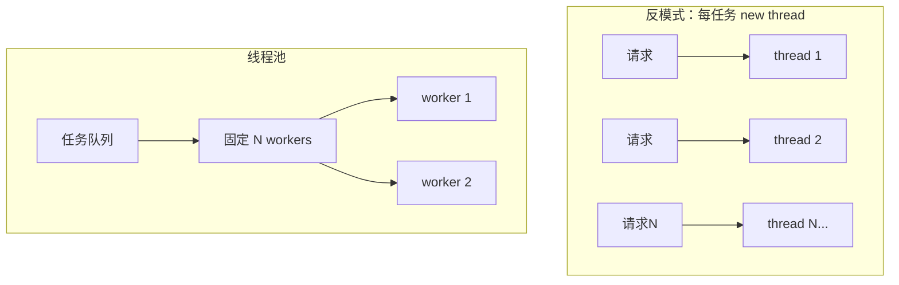

# 多线程与并发编程

> **文件编码**：UTF-8。

## 本章与上一章的关系

[07 章](07-异常处理与RAII.md) 的 `lock_guard` 已是线程同步入口；[04 章](04-STL标准库容器与算法.md) 的容器默认**非线程安全**。现代 CPU 多核，系统软件（HTTP 服务、游戏引擎、日志采集、量化）离不开并发。

本章与 [Java 03 并发编程与 JVM](../Java/03-Java并发编程与JVM.md) **高度平行**：线程创建、synchronized/monitor ≈ mutex、volatile ≈ atomic、线程池 ≈ 08 章延伸。与 [Python 03 asyncio](../Python/03-Python并发编程与asyncio.md) 不同：C++ 默认**抢占式线程 + 共享内存**，无 GIL，写错即 data race（未定义行为）。08 章是 C++ 第二座大山，务必动手实验竞态与死锁。

---

## 1. 这份文档学什么

- 创建与管理 `std::thread`
- `mutex`、`lock_guard`、`unique_lock`
- `atomic` 与内存序入门
- 条件变量、生产者-消费者
- 识别死锁、竞态与 false sharing 概念

---

## 2. 创建线程

```cpp
#include <chrono>
#include <iostream>
#include <thread>

void worker(int id) {
    std::cout << "worker " << id << " id="
              << std::this_thread::get_id() << '\n';
}

int main() {
    std::thread t1(worker, 1);
    std::thread t2([] { std::cout << "lambda thread\n"; });

    t1.join();
    t2.join();
    std::cout << "main done\n";
    return 0;
}
```

**必须** `join()` 或 `detach()`；析构仍 joinable 的 thread 会 `std::terminate`。

Java：`new Thread(...).start()` + `join()`；C++ 线程更轻，但无内置线程池（需自己或库）。

---

## 3. 互斥量 mutex

### 3.1 竞态示例

```cpp
#include <iostream>
#include <thread>

int counter = 0;

void increment() {
    for (int i = 0; i < 100000; ++i) {
        ++counter;  // 数据竞争！未定义行为
    }
}

int main() {
    std::thread a(increment), b(increment);
    a.join();
    b.join();
    std::cout << counter << '\n';  // 往往小于 200000
    return 0;
}
```

### 3.2 lock_guard 修复

```cpp
#include <iostream>
#include <mutex>
#include <thread>

int counter = 0;
std::mutex mtx;

void safe_increment() {
    for (int i = 0; i < 100000; ++i) {
        std::lock_guard<std::mutex> lock(mtx);
        ++counter;
    }
}

int main() {
    std::thread a(safe_increment), b(safe_increment);
    a.join();
    b.join();
    std::cout << counter << '\n';  // 200000
    return 0;
}
```

对照 Java `synchronized void add()`；RAII 锁在异常时仍释放（07 章）。

---

## 4. atomic 原子操作

```cpp
#include <atomic>
#include <iostream>
#include <thread>

std::atomic<int> counter{0};

void atomic_increment() {
    for (int i = 0; i < 100000; ++i) {
        counter.fetch_add(1, std::memory_order_relaxed);
    }
}

int main() {
    std::thread a(atomic_increment), b(atomic_increment);
    a.join();
    b.join();
    std::cout << counter.load() << '\n';
    return 0;
}
```

简单计数可用 `atomic`；复合逻辑（检查再改）仍要 mutex 或 careful atomic CAS。

Java `volatile` 不保证复合操作原子；C++ `atomic` 才保证。

---

## 5. 条件变量与生产者-消费者

```cpp
#include <condition_variable>
#include <iostream>
#include <mutex>
#include <queue>
#include <thread>

std::mutex mtx;
std::condition_variable cv;
std::queue<int> q;
bool done = false;

void producer() {
    for (int i = 0; i < 5; ++i) {
        {
            std::lock_guard<std::mutex> lock(mtx);
            q.push(i);
            std::cout << "生产 " << i << '\n';
        }
        cv.notify_one();
        std::this_thread::sleep_for(std::chrono::milliseconds(50));
    }
    {
        std::lock_guard<std::mutex> lock(mtx);
        done = true;
    }
    cv.notify_all();
}

void consumer() {
    while (true) {
        std::unique_lock<std::mutex> lock(mtx);
        cv.wait(lock, [] { return !q.empty() || done; });
        while (!q.empty()) {
            int v = q.front();
            q.pop();
            lock.unlock();
            std::cout << "消费 " << v << '\n';
            lock.lock();
        }
        if (done) break;
    }
}

int main() {
    std::thread p(producer), c(consumer);
    p.join();
    c.join();
    return 0;
}
```

`unique_lock` 可配合 `condition_variable::wait` 临时解锁。

---

## 6. 死锁

```cpp
#include <iostream>
#include <mutex>
#include <thread>

std::mutex m1, m2;

void task_a() {
    std::lock_guard<std::mutex> l1(m1);
    std::this_thread::sleep_for(std::chrono::milliseconds(10));
    std::lock_guard<std::mutex> l2(m2);  // 可能死锁
}

void task_b() {
    std::lock_guard<std::mutex> l2(m2);
    std::this_thread::sleep_for(std::chrono::milliseconds(10));
    std::lock_guard<std::mutex> l1(m1);
}

// 修复：std::lock(m1, m2) 或固定加锁顺序
void task_a_fixed() {
    std::lock(m1, m2);
    std::lock_guard<std::mutex> l1(m1, std::adopt_lock);
    std::lock_guard<std::mutex> l2(m2, std::adopt_lock);
}
```


---

## 7. 线程安全队列（简化）

```cpp
#include <condition_variable>
#include <mutex>
#include <optional>
#include <queue>

template<typename T>
class ThreadSafeQueue {
public:
    void push(T value) {
        {
            std::lock_guard<std::mutex> lock(mtx_);
            q_.push(std::move(value));
        }
        cv_.notify_one();
    }

    std::optional<T> pop_wait() {
        std::unique_lock<std::mutex> lock(mtx_);
        cv_.wait(lock, [this] { return !q_.empty() || closed_; });
        if (q_.empty()) return std::nullopt;
        T v = std::move(q_.front());
        q_.pop();
        return v;
    }

    void close() {
        {
            std::lock_guard<std::mutex> lock(mtx_);
            closed_ = true;
        }
        cv_.notify_all();
    }

private:
    mutable std::mutex mtx_;
    std::condition_variable cv_;
    std::queue<T> q_;
    bool closed_ = false;
};
```

10 章 mini-http 多线程版可基于此队列分发连接。

---

## 8. 与 Java / Python 并发对照

| 概念 | C++ | Java | Python |
|------|-----|------|--------|
| 线程 | `std::thread` | `Thread` / 线程池 | `threading` |
| 互斥 | `mutex` | `synchronized` / `Lock` | `Lock` |
| 原子 | `atomic` | `AtomicInteger` | 无（靠 GIL/ C 扩展） |
| 异步 IO | 第三方/asio | NIO / Netty | **asyncio** |
| 内存模型 | 明确 memory_order | JMM | GIL 简化 |

---

## 9. async 与 future（任务结果）

```cpp
#include <future>
#include <iostream>

int compute() {
    return 42;
}

int main() {
    std::future<int> fut = std::async(std::launch::async, compute);
    std::cout << fut.get() << '\n';
    return 0;
}
```

`std::async` 可能用线程池实现（实现定义）；复杂系统用专用线程池库。

---

## 10. 手把手：竞态实验

### race_demo.cpp

```cpp
#include <iostream>
#include <thread>
#include <vector>

int main() {
    int x = 0;
    const int N = 8;
    const int R = 500000;
    std::vector<std::thread> threads;

    for (int i = 0; i < N; ++i) {
        threads.emplace_back([&x, R] {
            for (int j = 0; j < R; ++j) ++x;
        });
    }
    for (auto& t : threads) t.join();
    std::cout << "x=" << x << " 期望=" << N * R << '\n';
    return 0;
}
```

```powershell
g++ -std=c++17 -O2 -pthread -o race race_demo.cpp
.\race.exe
```

多次运行观察 `x` 小于期望值；加 mutex 或 atomic 后稳定。

**Windows MSVC**：`cl /EHsc /std:c++17 race_demo.cpp` 默认支持 std::thread；MinGW 需 `-pthread`。

---

## 11. 常见报错与排查

| 报错信息（关键词） | 可能原因 | 解决方案 |
|-------------------|---------|---------|
| `terminate called` (thread) | 未 join/detach | 析构前 join |
| `resource deadlock would occur` | 同线程重入 mutex | 改 recursive_mutex 或 redesign |
| `deadlock detected`（运行时挂起） | 加锁顺序不一致 | std::lock 或固定顺序 |
| 数据每次不同 | data race | TSan 或加锁/atomic |
| `pthread_create failed` | 线程过多 | 线程池、减少并发 |
| `future already retrieved` | 多次 get | 只 get 一次 |
| `condition_variable`: spurious wakeup | 正常 | wait 用谓词 |
| MSVC `C4819` 编码 | 源文件编码 | 保存 UTF-8 with BOM 或 /utf-8 |
| `-pthread` missing (MinGW) | 链接选项 | g++ 加 `-pthread` |
| TSan report | 竞态 | 修复同步 |
| `std::terminate` in packaged_task | 任务抛异常未 get | future.get() 会 rethrow |
| `broken promise` | future 未关联或 pool 已析构 | 先 get 再 shutdown |
| 线程池任务死锁 | 任务内 submit 并 wait 同池 | 增 worker 或换线程池 |
| `notify` 丢失（理论） | 未持锁 notify | 先改状态再 notify |
| `EBUSY` pthread_mutex | 重复 lock 非 recursive | 用 recursive_mutex 或 redesign |
| 假唤醒未处理 | wait 无谓词 | `wait(lock, pred)` 必须 |
| 8 线程 false sharing | 多 atomic 同缓存行 | 对齐到 64 字节 cache line |
| GCC `-pthread` vs `-lpthread` | 链接顺序 | 统一 `-pthread` |
| `joinable()` 仍为 true | 未 join | RAII `thread_guard` 封装 |

### 11.1 调试工具速查

| 工具 | 平台 | 用途 |
|------|------|------|
| Thread Sanitizer | GCC/Clang `-fsanitize=thread` | 检测 data race |
| Helgrind | Valgrind | 无 TSan 时的竞态检测 |
| gdb `info threads` | Linux | 看所有线程栈 |
| Visual Studio 并行窗口 | Windows | 断点多线程 |

```bash
# WSL 示例
g++ -std=c++17 -pthread -fsanitize=thread -g race_demo.cpp -o race_tsan
./race_tsan   # 会报告 counter 竞态
```

---

## 12. 练习建议

### 基础

1. 两线程分别打印 A/B 各 10 次（观察交错）
2. 用 `mutex` 保护共享 `vector` push
3. `atomic<bool>` 实现停止标志，优雅退出 worker

### 进阶

4. 实现 `ThreadSafeQueue<int>` 并完成生产者-消费者
5. 线程池雏形：固定 N 线程从队列取任务
6. 对比 `atomic` vs `mutex` 计数性能（`-O2`）

### 挑战

7. 读者-写者锁：多读单写（`shared_mutex` C++17）
8. 无锁栈入门（`atomic` CAS，仅学习）

### 对照 Java 03

9. 阅读 Java 03 §8 线程池参数，用表格写出 C++ ThreadPool 如何对应「核心线程数 / 队列 / 拒绝策略」。
10. 实现 `RejectedExecution`：队列满时 `submit` 抛 `std::runtime_error`（加 `max_queue` 参数）。
11. 用 §15 BoundedBuffer 实现「日志异步写盘」：主线程 push 日志行，单 consumer 写文件。

### 综合项目

12. 在 hello-cmake 中加 `thread_pool` 静态库，main 提交 100 个累加任务，验证结果 = 5050×100（每任务算 1..100 的和）。

---

## 13. 分级练习参考答案

### 基础：mutex 保护 vector

```cpp
#include <iostream>
#include <mutex>
#include <thread>
#include <vector>

int main() {
    std::vector<int> v;
    std::mutex mtx;

    auto add = [&] {
        for (int i = 0; i < 1000; ++i) {
            std::lock_guard<std::mutex> lock(mtx);
            v.push_back(i);
        }
    };

    std::thread t1(add), t2(add);
    t1.join();
    t2.join();
    std::cout << v.size() << '\n';
    return 0;
}
```

### 进阶：shared_mutex 读多写少

```cpp
#include <iostream>
#include <shared_mutex>
#include <string>
#include <thread>

std::string config = "timeout=30";
std::shared_mutex rw;

void reader(int id) {
    std::shared_lock lock(rw);
    std::cout << "R" << id << ": " << config << '\n';
}

void writer() {
    std::unique_lock lock(rw);
    config = "timeout=60";
}

int main() {
    std::thread w(writer);
    std::thread r1(reader, 1), r2(reader, 2);
    w.join();
    r1.join();
    r2.join();
    return 0;
}
```

### 挑战：线程池骨架

```cpp
#include <condition_variable>
#include <functional>
#include <iostream>
#include <mutex>
#include <queue>
#include <thread>
#include <vector>

class ThreadPool {
public:
    explicit ThreadPool(std::size_t n) {
        for (std::size_t i = 0; i < n; ++i) {
            workers_.emplace_back([this] {
                while (true) {
                    std::function<void()> task;
                    {
                        std::unique_lock lock(mtx_);
                        cv_.wait(lock, [this] { return stop_ || !tasks_.empty(); });
                        if (stop_ && tasks_.empty()) return;
                        task = std::move(tasks_.front());
                        tasks_.pop();
                    }
                    task();
                }
            });
        }
    }

    void submit(std::function<void()> fn) {
        {
            std::lock_guard lock(mtx_);
            tasks_.push(std::move(fn));
        }
        cv_.notify_one();
    }

    ~ThreadPool() {
        {
            std::lock_guard lock(mtx_);
            stop_ = true;
        }
        cv_.notify_all();
        for (auto& w : workers_) w.join();
    }

private:
    std::vector<std::thread> workers_;
    std::queue<std::function<void()>> tasks_;
    std::mutex mtx_;
    std::condition_variable cv_;
    bool stop_ = false;
};

int main() {
    ThreadPool pool(2);
    pool.submit([] { std::cout << "task1\n"; });
    pool.submit([] { std::cout << "task2\n"; });
    std::this_thread::sleep_for(std::chrono::milliseconds(100));
    return 0;
}
```

---

## 14. 与 Java 03 深度平行对照

本章与 [Java 03 并发编程与 JVM](../Java/03-Java并发编程与JVM.md) 建议**对照阅读**。下表把 Java 面试高频点映射到 C++ 等价物：

| Java 03 章节 | Java 概念 | C++ 本章对应 | 关键差异 |
|--------------|-----------|--------------|----------|
| §2 进程与线程 | 线程是进程内执行单元 | `std::thread` | C++ 无内置 GC，线程栈默认 ~MB 级 |
| §5 synchronized | 监视器锁 | `std::mutex` + `lock_guard` | C++ 需显式 RAII；可死锁 |
| §6 volatile | 可见性，非复合原子 | `std::atomic` + memory_order | C++ 内存模型更细，别用 volatile 当锁 |
| §7 Lock | ReentrantLock | `std::mutex` / `shared_mutex` | C++ 无内置可重入语义（用 `recursive_mutex`） |
| §8 线程池 | ThreadPoolExecutor | §16 完整 ThreadPool | C++ 标准库无线程池，需自写或第三方 |
| §9 CountDownLatch | 等待 N 任务完成 | `std::latch` (C++20) / 条件变量 | C++20 才有 `latch`/`barrier` |
| §9 ThreadLocal | 线程本地存储 | `thread_local` 关键字 | 线程池场景同样要清理（析构） |
| JMM | happens-before | `memory_order_acquire/release` | 调试靠 TSan，不靠直觉 |

### 14.1 为什么用线程池而不是无限 `std::thread`

与 Java 03 §8.1 相同逻辑：每创建一个 `std::thread`，OS 分配栈（Linux 默认常 8MB，可 ulimit 调整）、内核调度实体、TLS。HTTP 服务若「每连接 `std::thread`」，1 万连接可能压垮内存与调度器。

**正确方向**：

- 固定 worker 数（≈ CPU 核数或 2×核数）
- 任务进队列，worker 复用
- 队列满时拒绝或阻塞（策略与 Java `RejectedExecutionHandler` 类似）



### 14.2 `thread_local` 与线程池陷阱（对照 Java ThreadLocal）

```cpp
#include <iostream>
#include <thread>
#include <vector>

thread_local int tls_id = 0;

void worker(int id) {
    tls_id = id;  // 每个 OS 线程一份副本
    std::cout << "tls_id=" << tls_id << " thread="
              << std::this_thread::get_id() << '\n';
}

int main() {
    std::vector<std::thread> threads;
    for (int i = 0; i < 3; ++i)
        threads.emplace_back(worker, i);
    for (auto& t : threads) t.join();
    return 0;
}
```

**陷阱**：线程池 worker 长期存活，`thread_local` 对象若在某次任务里 `new` 且不清理，下次任务仍看到脏数据——与 Java 线程池里 `ThreadLocal.remove()` 同理。C++ 优先 RAII 对象作 `thread_local`，或任务结束显式重置。

### 14.3 C++20 latch 对照 CountDownLatch

```cpp
#include <barrier>
#include <iostream>
#include <latch>
#include <thread>

int main() {
    std::latch start{3};  // 等 3 个线程就绪

    auto task = [&] {
        std::cout << "ready\n";
        start.count_down();
        start.wait();  // 可选：全员就绪后再跑（此处 count_down 后 latch 为 0）
    };

    std::thread t1(task), t2(task), t3(task);
    t1.join(); t2.join(); t3.join();
    return 0;
}
```

无 C++20 时，用 `condition_variable` + 计数器实现同等语义（见 §5 生产者-消费者）。

---

## 15. 完整示例：有界缓冲区生产者-消费者

§5 是无界队列 + 单生产者单消费者。下面为 **有界缓冲区**（容量 `CAP`）：队列满时生产者阻塞，空时消费者阻塞——与 Java `BlockingQueue` 行为一致。

```cpp
// bounded_buffer_demo.cpp — g++ -std=c++17 -pthread -O2
#include <chrono>
#include <condition_variable>
#include <cstddef>
#include <iostream>
#include <mutex>
#include <queue>
#include <thread>
#include <vector>

template<typename T>
class BoundedBuffer {
public:
    explicit BoundedBuffer(std::size_t cap) : cap_(cap) {}

    void push(T value) {
        std::unique_lock lock(mtx_);
        cv_not_full_.wait(lock, [this] { return q_.size() < cap_ || closed_; });
        if (closed_) return;
        q_.push(std::move(value));
        cv_not_empty_.notify_one();
    }

    bool pop(T& out) {
        std::unique_lock lock(mtx_);
        cv_not_empty_.wait(lock, [this] { return !q_.empty() || closed_; });
        if (q_.empty()) return false;
        out = std::move(q_.front());
        q_.pop();
        cv_not_full_.notify_one();
        return true;
    }

    void close() {
        std::lock_guard lock(mtx_);
        closed_ = true;
        cv_not_empty_.notify_all();
        cv_not_full_.notify_all();
    }

private:
    std::size_t cap_;
    std::queue<T> q_;
    std::mutex mtx_;
    std::condition_variable cv_not_empty_;
    std::condition_variable cv_not_full_;
    bool closed_ = false;
};

int main() {
    constexpr std::size_t CAP = 4;
    BoundedBuffer<int> buf(CAP);

    std::thread producer([&] {
        for (int i = 0; i < 20; ++i) {
            buf.push(i);
            std::cout << "[P] push " << i << '\n';
            std::this_thread::sleep_for(std::chrono::milliseconds(30));
        }
        buf.close();
    });

    std::vector<std::thread> consumers;
    for (int c = 0; c < 2; ++c) {
        consumers.emplace_back([&, c] {
            int v;
            while (buf.pop(v)) {
                std::cout << "[C" << c << "] pop " << v << '\n';
                std::this_thread::sleep_for(std::chrono::milliseconds(50));
            }
        });
    }

    producer.join();
    for (auto& t : consumers) t.join();
    std::cout << "done\n";
    return 0;
}
```

**观察点**：容量为 4 时，生产者连 push 5 个而不消费，第 5 次会在 `cv_not_full_.wait` 阻塞，直到消费者 pop。

**与 §7 ThreadSafeQueue 区别**：§7 无界；本节双条件变量（not_empty / not_full）实现背压（backpressure），更接近真实消息队列。

---

## 16. 完整示例：生产级线程池（含 future）

§13 挑战已有基础线程池。下面补充 **模板 submit 返回 `std::future`**、**优雅 shutdown**、**队列长度查询**，可直接用于 10 章 mini-http 多线程版。

```cpp
// thread_pool.hpp — 头文件-only 或单独编译
#pragma once

#include <condition_variable>
#include <functional>
#include <future>
#include <mutex>
#include <queue>
#include <stdexcept>
#include <thread>
#include <vector>

class ThreadPool {
public:
    explicit ThreadPool(std::size_t worker_count) : stop_(false) {
        if (worker_count == 0) throw std::invalid_argument("worker_count");
        workers_.reserve(worker_count);
        for (std::size_t i = 0; i < worker_count; ++i) {
            workers_.emplace_back([this] { worker_loop(); });
        }
    }

    ThreadPool(const ThreadPool&) = delete;
    ThreadPool& operator=(const ThreadPool&) = delete;

    template<typename F, typename... Args>
    auto submit(F&& f, Args&&... args)
        -> std::future<std::invoke_result_t<F, Args...>> {
        using Ret = std::invoke_result_t<F, Args...>;
        auto task = std::make_shared<std::packaged_task<Ret()>>(
            std::bind(std::forward<F>(f), std::forward<Args>(args)...));
        std::future<Ret> fut = task->get_future();
        {
            std::lock_guard lock(mtx_);
            if (stop_) throw std::runtime_error("pool stopped");
            tasks_.emplace([task]() { (*task)(); });
        }
        cv_.notify_one();
        return fut;
    }

    std::size_t pending_tasks() const {
        std::lock_guard lock(mtx_);
        return tasks_.size();
    }

    void shutdown() {
        {
            std::lock_guard lock(mtx_);
            stop_ = true;
        }
        cv_.notify_all();
        for (auto& w : workers_) {
            if (w.joinable()) w.join();
        }
        workers_.clear();
    }

    ~ThreadPool() {
        if (!stop_) shutdown();
    }

private:
    void worker_loop() {
        while (true) {
            std::function<void()> job;
            {
                std::unique_lock lock(mtx_);
                cv_.wait(lock, [this] { return stop_ || !tasks_.empty(); });
                if (stop_ && tasks_.empty()) return;
                job = std::move(tasks_.front());
                tasks_.pop();
            }
            job();
        }
    }

    mutable std::mutex mtx_;
    std::condition_variable cv_;
    std::vector<std::thread> workers_;
    std::queue<std::function<void()>> tasks_;
    bool stop_;
};

// thread_pool_demo.cpp
#include <iostream>

int main() {
    ThreadPool pool(4);

    auto f1 = pool.submit([] { return 40 + 2; });
    auto f2 = pool.submit([] {
        std::this_thread::sleep_for(std::chrono::milliseconds(100));
        return std::string("ok");
    });

    std::cout << "f1=" << f1.get() << '\n';
    std::cout << "f2=" << f2.get() << '\n';
    std::cout << "pending=" << pool.pending_tasks() << '\n';

    pool.shutdown();
    return 0;
}
```

**CMake 提示**（详见 09 章）：`find_package(Threads REQUIRED)` + `target_link_libraries(demo PRIVATE Threads::Threads)`。

**对接 mini-http**：`pool.submit([client_fd]{ handle_client(client_fd); close(client_fd); });` — accept 线程只负责分发，worker 处理 HTTP。

---

## 17. 内存序入门（对照 Java happens-before）

简单计数用 `memory_order_relaxed`（§4）。若线程 A 写配置指针、线程 B 读配置，需 **release/acquire** 配对：

```cpp
#include <atomic>
#include <thread>

struct Config { int port = 8080; };
Config* cfg_ptr = nullptr;
std::atomic<bool> ready{false};

void writer() {
    static Config cfg{9090};
    cfg_ptr = &cfg;
    ready.store(true, std::memory_order_release);
}

void reader() {
    while (!ready.load(std::memory_order_acquire)) { /* spin */ }
    // 此处保证看到 cfg_ptr 指向的完整 Config
    (void)cfg_ptr->port;
}
```

面试只需说清：**relaxed 只管原子性不管顺序；acquire/release 建立 happens-before**。深入读 [Java 03 JMM](../Java/03-Java并发编程与JVM.md) 再回来看 C++ 标准 §31 内存模型。

---

## 18. FAQ

**Q：每个 STL 容器要加锁吗？**  
多线程读写的共享容器要外部同步，或每线程一份再合并。

**Q：比 Java 线程难在哪？**  
无 GC、data race 即 UB；需 TSan/ careful 设计。

**Q：何时用 asyncio 式模型？**  
高并发 IO 可用 Boost.Asio / io_uring（10 章后）；CPU 密集仍用线程池。

---

## 19. 学完标准

- [ ] 能创建 thread 并 join
- [ ] 会用 mutex、lock_guard、condition_variable
- [ ] 理解 data race 与死锁成因
- [ ] 会用 atomic 做简单计数
- [ ] 完成生产者-消费者或线程池雏形
- [ ] 对照 Java 03 说清 mutex/synchronized 异同
- [ ] 能独立写出 §15 有界缓冲区或 §16 带 future 的线程池
- [ ] 知道 `thread_local` 在线程池中的清理问题

---

## 下一章预告

并发 demo 需要多文件与统一构建。09 章 CMake 与项目工程化将把 08 章线程池、10 章 mini-http 组织成可维护项目——从单文件 `g++` 过渡到工业级构建。

---

*下一章：09 CMake 与项目工程化*
