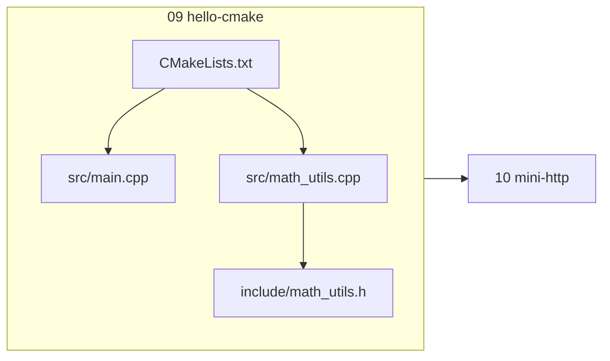
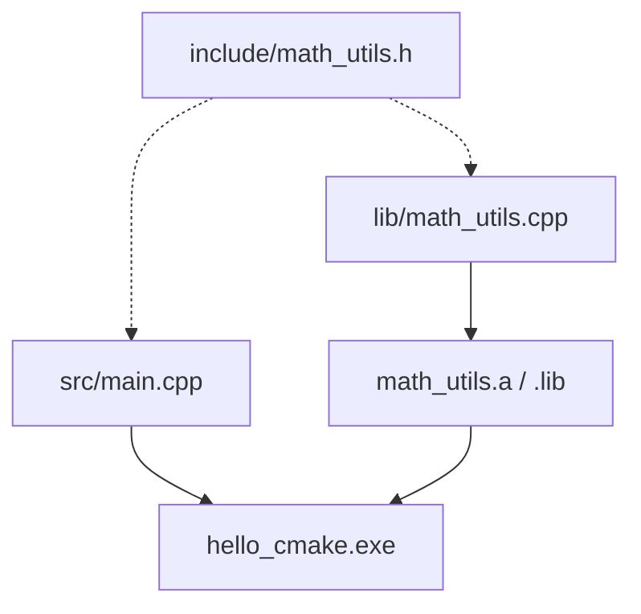
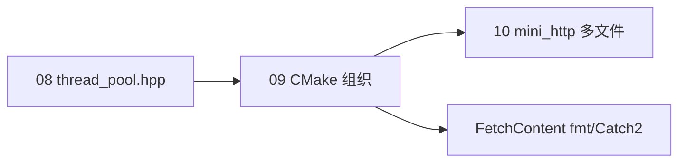

# CMake 与项目工程化

> **文件编码**：UTF-8。CMakeLists.txt 建议 UTF-8；Windows 下路径尽量不含中文空格。

---

## 本章与上一章的关系

[08 多线程与并发](08-多线程与并发编程.md) 里你写了 `std::thread`、mutex、生产者消费者——代码一旦拆成多个 `.cpp/.h`，单条 `g++ main.cpp worker.cpp -pthread` 还能凑合，但加第三方库、改编译选项、跨平台就会乱。

**09 章解决「怎么组织工程」**：用 **CMake** 管理多文件、静态库、头文件路径、C++17 标准，为 [10 章 mini-http](10-网络编程与简易HTTP服务.md) 打底。09 建 `hello-cmake`，10 在其上演进为 `mini-http`。

| 上一章（08） | 本章（09） | 下一章（10） |
|--------------|------------|--------------|
| 多文件并发 demo | CMake 多目标构建 | socket + HTTP 响应 |
| 手动 g++ 链接 | 静态库 math_utils | 链接 ws2_32 / pthread |
| 本地单目录 | 目录结构 + git | 可 curl 访问的服务 |



---

## 1. 为什么需要 CMake

| 痛点 | 单命令 g++ | CMake |
|------|-----------|-------|
| 文件变多 | 命令行越来越长 | `add_executable` 自动管理 |
| 换编译器 | 改整条命令 | 生成器适配 MSVC/GCC/Clang |
| 加库 | 记 `-l` 顺序 | `target_link_libraries` |
| 团队统一 | 每人脚本不同 | 一份 CMakeLists.txt |
| IDE 集成 | 手动配置 | VS/CLion/VS Code 原生支持 |

**深入解释**：CMake 是**构建系统生成器**，本身不编译——它生成 Makefile、Ninja 或 VS 工程，再由底层工具编译。学 CMake = 学「描述项目结构的语言」。

---

## 2. CMake 最小示例

### 2.1 单文件项目

目录：

```text
hello/
├── CMakeLists.txt
└── main.cpp
```

`main.cpp`：

```cpp
#include <iostream>

int main() {
    std::cout << "Hello CMake\n";
    return 0;
}
```

`CMakeLists.txt`：

```cmake
cmake_minimum_required(VERSION 3.16)
project(hello LANGUAGES CXX)

set(CMAKE_CXX_STANDARD 17)
set(CMAKE_CXX_STANDARD_REQUIRED ON)

add_executable(hello main.cpp)
```

### 2.2 构建命令（Windows PowerShell）

```powershell
cd f:\study\hello-cmake\hello
cmake -S . -B build
cmake --build build --config Release
.\build\Release\hello.exe
# 预期输出：Hello CMake
```

### 2.3 构建命令（WSL / Linux）

```bash
cd ~/hello-cmake/hello
cmake -S . -B build
cmake --build build
./build/hello
# 预期输出：Hello CMake
```

---

## 2.1 手把手：hello-cmake 多文件 + 静态库

> 与 [00 路线图 §3.2](00-学习路线图与说明.md) demo 演进一致；10 章在此结构上替换为 socket 代码。

### 步骤 1：创建目录

```powershell
cd f:\study
mkdir hello-cmake\src, hello-cmake\include, hello-cmake\lib -Force
```

### 步骤 2：头文件 `include/math_utils.h`

```cpp
#pragma once

int add(int a, int b);
int factorial(int n);
```

### 步骤 3：实现 `lib/math_utils.cpp`

```cpp
#include "math_utils.h"

int add(int a, int b) {
    return a + b;
}

int factorial(int n) {
    if (n <= 1) return 1;
    return n * factorial(n - 1);
}
```

### 步骤 4：主程序 `src/main.cpp`

```cpp
#include <iostream>
#include "math_utils.h"

int main() {
    std::cout << "add(3,5)=" << add(3, 5) << "\n";
    std::cout << "factorial(5)=" << factorial(5) << "\n";
    return 0;
}
```

### 步骤 5：根目录 `CMakeLists.txt`

```cmake
cmake_minimum_required(VERSION 3.16)
project(hello_cmake LANGUAGES CXX)

set(CMAKE_CXX_STANDARD 17)
set(CMAKE_CXX_STANDARD_REQUIRED ON)

# 静态库
add_library(math_utils STATIC lib/math_utils.cpp)
target_include_directories(math_utils PUBLIC ${CMAKE_SOURCE_DIR}/include)

# 可执行文件
add_executable(hello_cmake src/main.cpp)
target_link_libraries(hello_cmake PRIVATE math_utils)
```

### 步骤 6：编译运行

```powershell
cd f:\study\hello-cmake
cmake -S . -B build
cmake --build build --config Release
.\build\Release\hello_cmake.exe
```

**预期输出**：

```text
add(3,5)=8
factorial(5)=120
```

### 步骤 7：纳入 Git（可选）

```powershell
git init
# .gitignore 内容见 §6
git add .
git commit -m "feat: hello-cmake multi-file project"
```



---

## 3. 常用 CMake 指令速查

| 指令 | 作用 |
|------|------|
| `cmake_minimum_required` | 最低 CMake 版本 |
| `project(name LANGUAGES CXX)` | 项目名与语言 |
| `set(CMAKE_CXX_STANDARD 17)` | 默认 C++17 |
| `add_executable` | 生成可执行文件 |
| `add_library(STATIC\|SHARED)` | 静态/动态库 |
| `target_include_directories` | 头文件搜索路径 |
| `target_link_libraries` | 链接库 |
| `target_compile_options` | 编译选项（如 `-Wall`） |

### 3.1 PUBLIC / PRIVATE / INTERFACE

- **PRIVATE**：仅当前目标使用
- **INTERFACE**：仅传递给依赖方
- **PUBLIC**：自己用 + 传递给链接者

示例：`math_utils` 的头文件路径设 **PUBLIC**，链接 `hello_cmake` 时自动带上 `include/`。

### 3.2 子目录组织

大型项目：

```cmake
add_subdirectory(src)
add_subdirectory(tests)
```

---

## 4. 编译选项与调试

### 4.1 Debug / Release

```cmake
if(MSVC)
    target_compile_options(hello_cmake PRIVATE /W4)
else()
    target_compile_options(hello_cmake PRIVATE -Wall -Wextra -pedantic)
endif()
```

```powershell
cmake -S . -B build -DCMAKE_BUILD_TYPE=Debug
cmake --build build
```

Linux 单配置生成器常用 `-DCMAKE_BUILD_TYPE=Release`。

### 4.2 为 10 章预留：链接 Winsock

Windows 网络编程需在 CMake 中加：

```cmake
if(WIN32)
    target_link_libraries(mini_http PRIVATE ws2_32)
endif()
```

Linux/WSL：

```cmake
find_package(Threads REQUIRED)
target_link_libraries(mini_http PRIVATE Threads::Threads)
```

---

## 5. FetchContent 拉取第三方库（进阶）

无需系统安装，CMake 下载源码并编译。下面给出 **完整可编译工程**（fmt 格式化日志 + hello_cmake 链接）。

### 5.1 目录结构

```text
hello-fetch/
├── CMakeLists.txt
├── src/
│   └── main.cpp
└── .gitignore
```

### 5.2 完整 `CMakeLists.txt`

```cmake
cmake_minimum_required(VERSION 3.16)
project(hello_fetch LANGUAGES CXX)

set(CMAKE_CXX_STANDARD 17)
set(CMAKE_CXX_STANDARD_REQUIRED ON)

# ---------- FetchContent：下载 fmt ----------
include(FetchContent)

FetchContent_Declare(
    fmt
    GIT_REPOSITORY https://github.com/fmtlib/fmt.git
    GIT_TAG        10.2.1
    GIT_SHALLOW    TRUE
)

# 若网络慢，可改用本地路径：
# set(FETCHCONTENT_SOURCE_DIR_FMT "f:/deps/fmt")

FetchContent_MakeAvailable(fmt)

# ---------- 可执行文件 ----------
add_executable(hello_fetch src/main.cpp)

target_link_libraries(hello_fetch PRIVATE fmt::fmt)

if(MSVC)
    target_compile_options(hello_fetch PRIVATE /W4 /utf-8)
else()
    target_compile_options(hello_fetch PRIVATE -Wall -Wextra -pedantic)
endif()
```

### 5.3 完整 `src/main.cpp`

```cpp
#include <fmt/core.h>

int main() {
    fmt::print("hello_fetch: {} + {} = {}\n", 3, 5, 8);
    fmt::print(stderr, "log level={}\n", "info");
    return 0;
}
```

### 5.4 构建与验证

```powershell
cd f:\study\hello-fetch
cmake -S . -B build
cmake --build build --config Release
.\build\Release\hello_fetch.exe
# 预期：
# hello_fetch: 3 + 5 = 8
# log level=info
```

```bash
# WSL / Linux
cmake -S . -B build -DCMAKE_BUILD_TYPE=Release
cmake --build build
./build/hello_fetch
```

### 5.5 FetchContent + Catch2 单元测试（完整片段）

在 `hello-cmake` 工程末尾追加：

```cmake
option(BUILD_TESTING "Build unit tests" ON)
if(BUILD_TESTING)
    FetchContent_Declare(
        Catch2
        GIT_REPOSITORY https://github.com/catchorg/Catch2.git
        GIT_TAG        v3.5.2
        GIT_SHALLOW    TRUE
    )
    FetchContent_MakeAvailable(Catch2)

    add_executable(test_math tests/test_math.cpp)
    target_link_libraries(test_math PRIVATE math_utils Catch2::Catch2WithMain)
    target_include_directories(test_math PRIVATE ${CMAKE_SOURCE_DIR}/include)

    include(CTest)
    include(Catch)
    catch_discover_tests(test_math)
endif()
```

`tests/test_math.cpp` 见 §10 参考答案；`ctest --test-dir build` 运行全部用例。

### 5.6 FetchContent 常见问题

| 现象 | 原因 | 解决 |
|------|------|------|
| `git clone failed` | 网络 / GFW | 手动 clone 到本地，设 `FETCHCONTENT_SOURCE_DIR_<NAME>` |
| 重复下载 | 删了 build 未删 `_deps | 保留 `build/_deps` 或设 `FETCHCONTENT_BASE_DIR` |
| 版本冲突 | 两目标拉不同 TAG | 统一父 CMake 只 Declare 一次 |
| fmt 编译慢 | 首次全量编译 | 正常；Release + Ninja 加速 |

**适用**：fmt、spdlog、Catch2、GoogleTest。生产项目也可改用 vcpkg / Conan。

---

## 5.7 完整 CMakeLists：mini-http 多文件工程

面向 [10 章](10-网络编程与简易HTTP服务.md) 的 **可直接复制** 构建脚本：

```cmake
cmake_minimum_required(VERSION 3.16)
project(mini_http LANGUAGES CXX)

set(CMAKE_CXX_STANDARD 17)
set(CMAKE_CXX_STANDARD_REQUIRED ON)

# ---------- 源文件与头文件 ----------
set(MINI_HTTP_SOURCES
    src/main.cpp
    src/http_server.cpp
    src/http_response.cpp
    src/http_request.cpp
)

add_executable(mini_http ${MINI_HTTP_SOURCES})

target_include_directories(mini_http PRIVATE ${CMAKE_SOURCE_DIR}/include)

# ---------- 平台网络库 ----------
if(WIN32)
    target_link_libraries(mini_http PRIVATE ws2_32)
else()
    find_package(Threads REQUIRED)
    target_link_libraries(mini_http PRIVATE Threads::Threads)
endif()

# ---------- 编译警告 ----------
if(MSVC)
    target_compile_options(mini_http PRIVATE /W4 /utf-8)
else()
    target_compile_options(mini_http PRIVATE -Wall -Wextra)
endif()

# ---------- 可选：FetchContent 引入 fmt 打日志 ----------
option(MINI_HTTP_USE_FMT "Use fmt for logging" OFF)
if(MINI_HTTP_USE_FMT)
    include(FetchContent)
    FetchContent_Declare(fmt GIT_REPOSITORY https://github.com/fmtlib/fmt.git GIT_TAG 10.2.1)
    FetchContent_MakeAvailable(fmt)
    target_link_libraries(mini_http PRIVATE fmt::fmt)
    target_compile_definitions(mini_http PRIVATE MINI_HTTP_USE_FMT=1)
endif()

# ---------- 安装（可选） ----------
install(TARGETS mini_http RUNTIME DESTINATION bin)
install(DIRECTORY config/ DESTINATION share/mini_http/config)
install(DIRECTORY static/ DESTINATION share/mini_http/static)
```

构建：

```powershell
cmake -S . -B build -DMINI_HTTP_USE_FMT=ON
cmake --build build --config Release
```

---

## 5.8 完整 CMakeLists：08 章线程池 demo

```cmake
cmake_minimum_required(VERSION 3.16)
project(thread_pool_demo LANGUAGES CXX)

set(CMAKE_CXX_STANDARD 17)
set(CMAKE_CXX_STANDARD_REQUIRED ON)

add_library(thread_pool INTERFACE include/thread_pool.hpp)
target_include_directories(thread_pool INTERFACE ${CMAKE_SOURCE_DIR}/include)

add_executable(pool_demo src/pool_demo.cpp)
target_link_libraries(pool_demo PRIVATE thread_pool)

find_package(Threads REQUIRED)
target_link_libraries(pool_demo PRIVATE Threads::Threads)
```

`include/thread_pool.hpp` 使用 [08 章 §16](08-多线程与并发编程.md) 完整 ThreadPool 代码。

---

## 6. 推荐项目结构（面向 mini-http）

```text
mini-http/
├── CMakeLists.txt
├── include/
│   └── http_response.h
├── src/
│   ├── main.cpp
│   └── http_response.cpp
├── .gitignore
└── README.md
```

`.gitignore` 示例：

```gitignore
build/
.vs/
*.user
CMakeCache.txt
CMakeFiles/
```

---

## 7. 与 Java Maven / Python pip 对照

| 概念 | Java | Python | **C++ CMake** |
|------|------|--------|---------------|
| 依赖描述 | pom.xml | requirements.txt | FetchContent / vcpkg |
| 构建产物 | jar | wheel | exe / .a / .so |
| 多模块 | module | package | add_subdirectory |
| 运行 | java -jar | python -m | ./build/app |

---

## 8. 常见报错与排查

| 现象 | 原因 | 解决 |
|------|------|------|
| `cmake: command not found` | 未安装或未加 PATH | 安装 CMake 3.16+，重启终端 |
| `No CMAKE_CXX_COMPILER could be found` | 无 g++/cl | 装 VS C++ 工作负载或 MSYS2 g++ |
| `fatal error: math_utils.h: No such file` | 未设 include 路径 | `target_include_directories` PUBLIC |
| `undefined reference to add` | 未链接静态库 | `target_link_libraries` 加上 math_utils |
| `multiple definition of main` | 两个 cpp 都有 main | 只保留一个 main |
| MSVC 中文路径乱码 | 源文件非 UTF-8 | 保存为 UTF-8，或路径纯英文 |
| `generator: build tool cannot be found` | 未选生成器 | `-G "MinGW Makefiles"` 或 Ninja |
| `CMake Error: The source ... does not match` | build 缓存旧路径 | 删除 `build/` 重新 cmake |
| Ninja 找不到 | 未安装 ninja | `pacman -S ninja` 或改用默认生成器 |
| FetchContent 超时 | 网络/GFW | 镜像或手动 clone 到本地路径 |
| `fmt::fmt` target not found | 未 MakeAvailable | 顺序：Declare → MakeAvailable → link |
| `Catch2WithMain` 找不到 | Catch2 v2/v3 混用 | 统一 v3.5+ 与 `Catch2::Catch2WithMain` |
| `install` 权限错误 | 未 sudo 写系统目录 | `cmake --install build --prefix ./dist` |
| 中文路径 CMake 失败 | MSVC/Ninja 编码 | 项目放纯英文路径 |
| `Threads::Threads` not found | 未 find_package | Linux 先 `find_package(Threads REQUIRED)` |
| 静态库符号重复 | 同一 .cpp 链两次 | 只 `add_library` 一次 |
| `INTERFACE` 库无 .cpp | header-only | 用 `add_library(x INTERFACE)` + include |
| `-DMINI_HTTP_USE_FMT` 无效 | 缓存旧值 | 删 build 或 `cmake -U MINI_HTTP_USE_FMT` |
| vcpkg 与 FetchContent 冲突 | 重复拉同一库 | 团队统一一种依赖管理方式 |

---

## 9. 练习建议

### 基础

1. 把 `hello-cmake` 再拆一个 `src/printer.cpp`，打印版本号。
2. 用 `CMAKE_BUILD_TYPE=Debug` 编译，在 VS Code 里断点调试 `factorial`。

### 进阶

3. 增加 `tests/test_math.cpp`，用 Catch2 FetchContent 写 `add` 的单元测试。
4. 写 `option(ENABLE_LOG "..." ON)`，控制是否编译日志模块。

### 挑战

5. 用 `add_custom_target` 在构建后自动运行 `hello_cmake.exe`。
6. 为 10 章预建 `mini-http` 空壳 CMake 工程（仅 main 打印 "ready"）。

### FetchContent 专项

7. 新建 `hello-fetch`，按 §5 完整跑通 fmt。
8. 给 hello-cmake 加 `BUILD_TESTING` + Catch2，`ctest` 跑 `add` 测试。
9. 用 `cmake -DMINI_HTTP_USE_FMT=ON` 编译 mini-http，日志改用 `fmt::print`。

### 工程化

10. 写 `cmake --install` 到 `./dist`，确认 `dist/bin/mini_http` 可运行。
11. 用 `add_custom_command` 在编译后复制 `config/` 到 `build/` 旁。

---

## 10. 参考答案

### 基础 1：printer 模块

`include/printer.h`：

```cpp
#pragma once
void print_banner();
```

`src/printer.cpp`：

```cpp
#include <iostream>
#include "printer.h"

void print_banner() {
    std::cout << "hello-cmake v1.0\n";
}
```

`CMakeLists.txt` 增加：

```cmake
add_library(printer STATIC src/printer.cpp)
target_include_directories(printer PUBLIC ${CMAKE_SOURCE_DIR}/include)
target_link_libraries(hello_cmake PRIVATE printer)
```

`main.cpp` 开头调用 `print_banner();`。

### 基础 2：Debug 断点

```powershell
cmake -S . -B build -DCMAKE_BUILD_TYPE=Debug
cmake --build build
# VS Code launch.json 指向 build/hello_cmake.exe
```

### 进阶 3：Catch2 测试骨架

```cmake
FetchContent_Declare(Catch2 GIT_REPOSITORY https://github.com/catchorg/Catch2.git GIT_TAG v3.5.2)
FetchContent_MakeAvailable(Catch2)
add_executable(test_math tests/test_math.cpp)
target_link_libraries(test_math PRIVATE math_utils Catch2::Catch2WithMain)
```

`tests/test_math.cpp`：

```cpp
#include <catch2/catch_test_macros.hpp>
#include "math_utils.h"

TEST_CASE("add works") {
    REQUIRE(add(2, 3) == 5);
}
```

### 挑战 6：mini-http 空壳

```cmake
add_executable(mini_http src/main.cpp)
if(WIN32)
    target_link_libraries(mini_http PRIVATE ws2_32)
endif()
```

```cpp
// src/main.cpp
#include <iostream>
int main() {
    std::cout << "mini-http ready\n";
    return 0;
}
```

---

## 11. 学完标准

- [ ] 能独立写出多文件 + 静态库的 `CMakeLists.txt`
- [ ] 会用 `cmake -S . -B build` 与 `cmake --build build`
- [ ] 理解 PUBLIC include 与 `target_link_libraries` 顺序无关（CMake 处理）
- [ ] 知道 Windows 链 `ws2_32`、Linux 链 `Threads::Threads`
- [ ] 已为 10 章准备好可编译的空工程或 hello-cmake 副本
- [ ] 能独立完成 §5 hello-fetch 与 Catch2 FetchContent 测试
- [ ] 会复制 §5.7 mini-http 完整 CMakeLists 并成功构建

---

## 12. 与 08 / 10 章衔接清单

| 章节 | CMake 产物 | 关键 target_link |
|------|-----------|------------------|
| 08 线程池 | `thread_pool` INTERFACE + `pool_demo` | `Threads::Threads` |
| 09 hello-cmake | `math_utils` STATIC | 无 |
| 10 mini-http | `mini_http` exe | `ws2_32` / `Threads::Threads` |



---

## 下一章预告

工程能稳定编译后，下一章（[10 网络编程与简易 HTTP 服务](10-网络编程与简易HTTP服务.md)）在 TCP socket 上拼出 HTTP 200 响应。建议先浏览 [计算机网络 02 TCP](../../前端学习/计算机网络/02-TCP与UDP.md) 与 [04 HTTP](../../前端学习/计算机网络/04-HTTP协议深入.md)（路径以仓库为准）。

---

*下一章：10 网络编程与简易 HTTP 服务*
