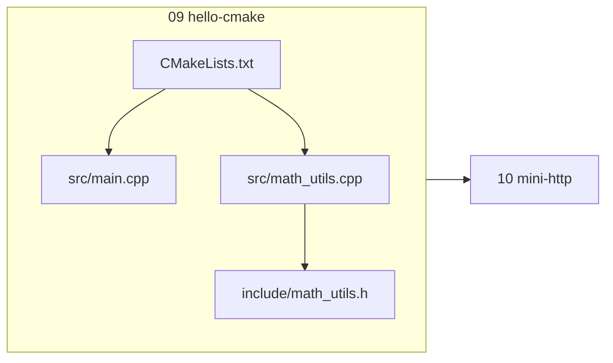
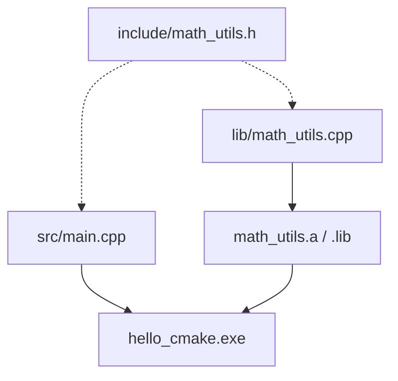
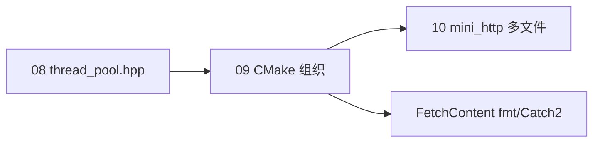
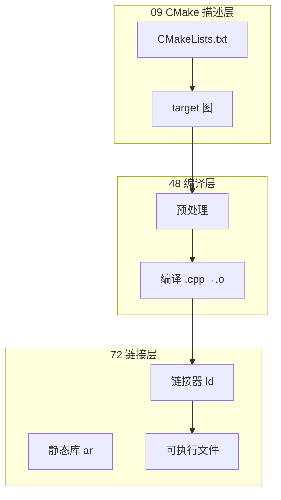
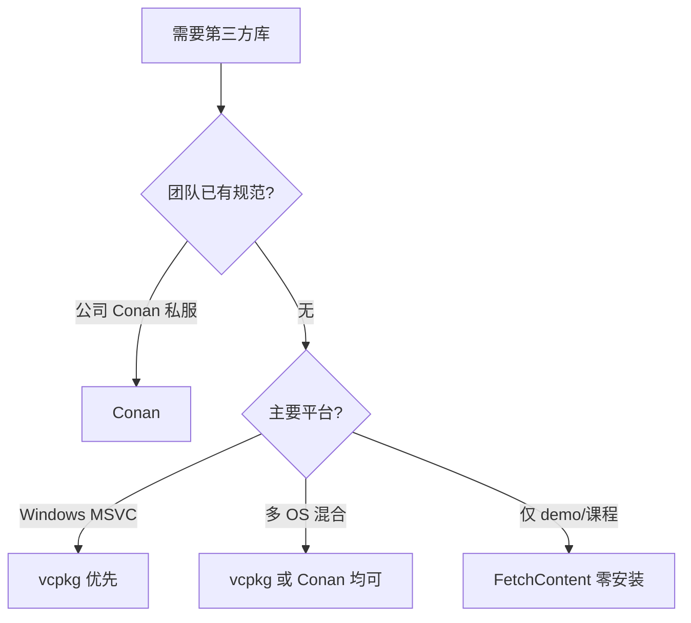
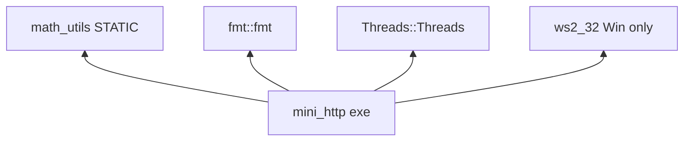

# CMake 与项目工程化

> **文件编码**：UTF-8。CMakeLists.txt 建议 UTF-8；Windows 下路径尽量不含中文空格。

---

## 本章与上一章的关系

[08 多线程与并发](08-多线程与并发编程.md) 里你写了 `std::thread`、mutex、生产者消费者——代码一旦拆成多个 `.cpp/.h`，单条 `g++ main.cpp worker.cpp -pthread` 还能凑合，但加第三方库、改编译选项、跨平台就会乱。

**09 章解决「怎么组织工程」**：用 **CMake** 管理多文件、静态库、头文件路径、C++17 标准，为 [10 章 mini-http](10-网络编程与简易HTTP服务.md) 打底。09 建 `hello-cmake`，10 在其上演进为 `mini-http`。

| 上一章（08） | 本章（09） | 下一章（10） |
|--------------|------------|--------------|
| 多文件并发 demo | CMake 多目标构建 | socket + HTTP 响应 |
| 手动 g++ 链接 | 静态库 math_utils | 链接 ws2_32 / pthread |
| 本地单目录 | 目录结构 + git | 可 curl 访问的服务 |



---

## 0. 读前导读（零基础也能跟上）

### 0.1 用一句话弄懂本章

**CMake** 是一份「项目说明书」：你写 `CMakeLists.txt` 描述有哪些 `.cpp`、要链哪些库，CMake 再生成 Makefile 或 VS 工程，让编译器真正去编译——从此告别手写超长 `g++` 命令。

### 0.2 你需要提前知道什么

| 状态 | 动作 |
|------|------|
| 只会 `g++ main.cpp` 单文件 | 先读 [01 章](01-C++基础语法与数据类型.md) 多文件 `#include` |
| 08 章线程 demo 已跑通 | 直接跟 §2.1 hello-cmake |
| 没装 CMake | 安装 3.16+，终端执行 `cmake --version` |
| 想直接写 HTTP 服务 | 本章是 [10 章](10-网络编程与简易HTTP服务.md) 前置，勿跳 |

### 0.3 本章知识地图（学完后应能勾选全部 ☐→☑）

- ☐ 解释 CMake 与 g++ 的分工（生成器 vs 编译器）
- ☐ 独立写出 `add_executable` + `add_library(STATIC)` 工程
- ☐ 会用 `target_include_directories` PUBLIC 传递头文件路径
- ☐ 会用 `cmake -S . -B build` 与 `cmake --build build`
- ☐ 知道 Windows 链 `ws2_32`、Linux 链 `Threads::Threads`
- ☐ 会用 FetchContent 拉 fmt / Catch2（§5）
- ☐ 能查 §8 报错表解决「找不到头文件 / undefined reference」
- ☐ 为 10 章 mini-http 准备好可编译空壳

### 0.4 建议学习时长与节奏

| 阶段 | 时长 | 内容 |
|------|------|------|
| §0～§2 概念 + 最小示例 | 45 min | 理解生成器模型 |
| §2.1 hello-cmake 手把手 | 60 min | 必须动手编译成功 |
| §3～§5 指令 + FetchContent | 50 min | 对照 examples/ |
| §8 报错表 + 闭卷自测 | 30 min | 自测 ≥7/10 再进 10 章 |

### 0.5 学完本章你能做什么（可验证的具体动作）

1. 在 `f:\study\hello-cmake`（或 WSL `~/projects/hello-cmake`）跑通 §2.1，终端看到 `factorial(5)=120`
2. 故意删掉 `target_link_libraries`，复现 `undefined reference to add` 并用报错表修复
3. 复制 [examples/hello-cmake](examples/hello-cmake/CMakeLists.txt) 并成功 `cmake --build build`
4. 向同学解释：为什么 `include/math_utils.h` 要设 PUBLIC include 路径

**术语（CMake）**：跨平台构建系统**生成器**；读 `CMakeLists.txt` 产出 Makefile / Ninja / VS 工程。
**生活类比**：CMake 像餐厅**菜单模板**——同一套菜名（源文件列表），换厨房（GCC/MSVC）自动出对应工单。
**为什么重要**：C++ 工程几乎都用 CMake；09 章不过关，10 章 mini-http 无法稳定跨平台构建。
**本章用到的地方**：§2.1、§5 FetchContent、§5.7 mini-http CMakeLists。

---

## 1. 为什么需要 CMake

| 痛点 | 单命令 g++ | CMake |
|------|-----------|-------|
| 文件变多 | 命令行越来越长 | `add_executable` 自动管理 |
| 换编译器 | 改整条命令 | 生成器适配 MSVC/GCC/Clang |
| 加库 | 记 `-l` 顺序 | `target_link_libraries` |
| 团队统一 | 每人脚本不同 | 一份 CMakeLists.txt |
| IDE 集成 | 手动配置 | VS/CLion/VS Code 原生支持 |

**深入解释**：CMake 是**构建系统生成器**，本身不编译——它生成 Makefile、Ninja 或 VS 工程，再由底层工具编译。学 CMake = 学「描述项目结构的语言」。

---

## 2. CMake 最小示例

### 2.1 单文件项目

目录：

```text
hello/
├── CMakeLists.txt
└── main.cpp
```

`main.cpp`：

```cpp
#include <iostream>

int main() {
    std::cout << "Hello CMake\n";
    return 0;
}
```

`CMakeLists.txt`：

```cmake
cmake_minimum_required(VERSION 3.16)
project(hello LANGUAGES CXX)

set(CMAKE_CXX_STANDARD 17)
set(CMAKE_CXX_STANDARD_REQUIRED ON)

add_executable(hello main.cpp)
```

### 2.2 构建命令（Windows PowerShell）

```powershell
cd f:\study\hello-cmake\hello
cmake -S . -B build
cmake --build build --config Release
.\build\Release\hello.exe
# 预期输出：Hello CMake
```

### 2.3 构建命令（WSL / Linux）

```bash
cd ~/hello-cmake/hello
cmake -S . -B build
cmake --build build
./build/hello
# 预期输出：Hello CMake
```

---

## 2.1 手把手：hello-cmake 多文件 + 静态库

> 与 [00 路线图 §3.2](00-学习路线图与说明.md) demo 演进一致；10 章在此结构上替换为 socket 代码。

### 步骤 1：创建目录

```powershell
cd f:\study
mkdir hello-cmake\src, hello-cmake\include, hello-cmake\lib -Force
```

### 步骤 2：头文件 `include/math_utils.h`

```cpp
#pragma once

int add(int a, int b);
int factorial(int n);
```

### 步骤 3：实现 `lib/math_utils.cpp`

```cpp
#include "math_utils.h"

int add(int a, int b) {
    return a + b;
}

int factorial(int n) {
    if (n <= 1) return 1;
    return n * factorial(n - 1);
}
```

### 步骤 4：主程序 `src/main.cpp`

```cpp
#include <iostream>
#include "math_utils.h"

int main() {
    std::cout << "add(3,5)=" << add(3, 5) << "\n";
    std::cout << "factorial(5)=" << factorial(5) << "\n";
    return 0;
}
```

### 步骤 5：根目录 `CMakeLists.txt`

```cmake
cmake_minimum_required(VERSION 3.16)
project(hello_cmake LANGUAGES CXX)

set(CMAKE_CXX_STANDARD 17)
set(CMAKE_CXX_STANDARD_REQUIRED ON)

# 静态库
add_library(math_utils STATIC lib/math_utils.cpp)
target_include_directories(math_utils PUBLIC ${CMAKE_SOURCE_DIR}/include)

# 可执行文件
add_executable(hello_cmake src/main.cpp)
target_link_libraries(hello_cmake PRIVATE math_utils)
```

### 步骤 5.1 逐行读：`CMakeLists.txt`

| 行号/指令 | 含义 | 改错会怎样 |
|-----------|------|------------|
| `cmake_minimum_required(VERSION 3.16)` | 要求 CMake 版本 ≥3.16 | 版本过低报 `Compatibility with CMake < 3.5` |
| `project(hello_cmake LANGUAGES CXX)` | 项目名；声明用 C++ | 不写 `LANGUAGES CXX` 可能不启用 C++ 编译器 |
| `set(CMAKE_CXX_STANDARD 17)` | 默认 C++17 | 不写则可能用 C++14，结构化绑定等不可用 |
| `CMAKE_CXX_STANDARD_REQUIRED ON` | 编译器不支持 17 则失败 | OFF 时可能静默降级 |
| `add_library(... STATIC ...)` | 编译静态库 `.a`/`.lib` | 路径错 → 找不到源文件 |
| `target_include_directories(... PUBLIC include)` | 头文件搜索路径并传递给链接者 | 漏写 → `fatal error: math_utils.h` |
| `add_executable(hello_cmake ...)` | 生成可执行文件 | 两个 main → multiple definition |
| `target_link_libraries(... PRIVATE math_utils)` | 把静态库链进 exe | 漏写 → undefined reference to `add` |

### 步骤 6：编译运行（步骤表）

| 步骤 | 你的动作 | 预期看到什么 | 若不对 |
|------|----------|--------------|--------|
| 1 | `cmake -S . -B build` | `-- Configuring done` / `-- Generating done` | 见 §8「No CMAKE_CXX_COMPILER」 |
| 2 | `cmake --build build --config Release` | `[100%] Built target hello_cmake` | 看编译错误行号 |
| 3 | 运行 `hello_cmake.exe` | `add(3,5)=8` 与 `factorial(5)=120` | 检查 PATH 或 build 子目录 |
| 4 | 删 `build/` 重来 | 仍能成功 | 缓存旧路径见 §8 CMake cache |

```powershell
cd f:\study\hello-cmake
cmake -S . -B build
cmake --build build --config Release
.\build\Release\hello_cmake.exe
```

**预期输出**：

```text
add(3,5)=8
factorial(5)=120
```

### 步骤 7：纳入 Git（可选）

```powershell
git init
# .gitignore 内容见 §6
git add .
git commit -m "feat: hello-cmake multi-file project"
```



---

## 3. 常用 CMake 指令速查

| 指令 | 作用 |
|------|------|
| `cmake_minimum_required` | 最低 CMake 版本 |
| `project(name LANGUAGES CXX)` | 项目名与语言 |
| `set(CMAKE_CXX_STANDARD 17)` | 默认 C++17 |
| `add_executable` | 生成可执行文件 |
| `add_library(STATIC\|SHARED)` | 静态/动态库 |
| `target_include_directories` | 头文件搜索路径 |
| `target_link_libraries` | 链接库 |
| `target_compile_options` | 编译选项（如 `-Wall`） |

### 3.1 PUBLIC / PRIVATE / INTERFACE

- **PRIVATE**：仅当前目标使用
- **INTERFACE**：仅传递给依赖方
- **PUBLIC**：自己用 + 传递给链接者

示例：`math_utils` 的头文件路径设 **PUBLIC**，链接 `hello_cmake` 时自动带上 `include/`。

### 3.2 子目录组织

### 3.3 与仓库 examples/hello-cmake 对照

| 文档位置 | 仓库路径 | 说明 |
|----------|----------|------|
| §2.1 手把手 | [examples/hello-cmake/](examples/hello-cmake/CMakeLists.txt) | 可直接 `cmake -S . -B build` |
| math_utils | `examples/hello-cmake/lib/math_utils.cpp` | 与文档 factorial 一致 |
| 头文件 | `examples/hello-cmake/include/math_utils.h` | `#pragma once` |
| 主程序 | `examples/hello-cmake/src/main.cpp` | 调用 add/factorial |

**验证命令（在 examples/hello-cmake 目录）**：

```powershell
cd f:\study\后端学习\C++\examples\hello-cmake
cmake -S . -B build
cmake --build build --config Release
.\build\Release\hello_cmake.exe
```

**预期**：与 §2.1 相同输出。若失败，对照 §8 报错表与 §2.1 步骤表「若不对」列。

### 3.4 术语三件套（构建相关）

**术语（静态库 STATIC）**：编译期把 `.o` **打包进** `.a`/`.lib`；链接 exe 时拷贝所需符号，运行时无单独 dll。
**生活类比**：像把常用菜谱**复印进**自家笔记本，做菜不用再去图书馆借书。
**为什么重要**：mini-http 拆 `http_response.cpp` 为静态库时，09 章模式直接复用。
**本章用到的地方**：§2.1 `add_library(STATIC)`、§5.7 mini-http 多文件。

**术语（FetchContent）**：CMake 在配置阶段**自动下载**第三方源码并加入构建。
**生活类比**：像点外卖——声明店名和版本，CMake 帮你取餐（clone）并开灶（编译）。
**为什么重要**：无 vcpkg 时 demo 仍能拉 fmt/Catch2；团队需统一依赖策略避免重复。
**本章用到的地方**：§5 hello-fetch、Catch2 测试。

**术语（生成器 Generator）**：CMake 输出的后端格式：Ninja、Unix Makefiles、Visual Studio 等。
**生活类比**：同一份菜单，可以印成**中文版**（Makefile）或**英文版**（Ninja），厨房不同但菜一样。
**为什么重要**：Windows 上 `-G "Ninja"` 常比默认快；CI 常固定 Ninja。
**本章用到的地方**：§8「generator not found」、§2.2 构建命令。

### 3.5 命令预期输出速查（扩充）

```powershell
cmake --version
# cmake version 3.28.x

cmake -S . -B build
# -- The CXX compiler identification is GNU ...
# -- Configuring done
# -- Generating done
# -- Build files have been written to: .../build

cmake --build build --config Release
# [ 50%] Building CXX object ...
# [100%] Linking CXX executable hello_cmake.exe
# [100%] Built target hello_cmake

ctest --test-dir build -C Release
# Test project .../build
#     Start 1: add works
# 1/1 Test #1: add works ................   Passed
```

WSL 单配置生成器无 `--config`：

```bash
cmake --build build
./build/hello_cmake
# add(3,5)=8
# factorial(5)=120
```

### 3.6 CMake 与 08 章线程池衔接（复习）

| 08 章产物 | 09 章 CMake 写法 | 链接注意 |
|-----------|------------------|----------|
| `thread_pool.hpp` header-only | `add_library(thread_pool INTERFACE)` | 仅 include |
| `pool_demo.cpp` | `add_executable(pool_demo ...)` | `Threads::Threads` |
| 多 cpp worker | `add_executable` 列出全部源 | Linux pthread |

完整片段见 §5.8；编译成功后即具备 10 章「多文件 + 可选线程池」的工程底座。

大型项目可用 `add_subdirectory`：

```cmake
add_subdirectory(src)
add_subdirectory(tests)
```

---

## 4. 编译选项与调试

### 4.1 Debug / Release

```cmake
if(MSVC)
    target_compile_options(hello_cmake PRIVATE /W4)
else()
    target_compile_options(hello_cmake PRIVATE -Wall -Wextra -pedantic)
endif()
```

```powershell
cmake -S . -B build -DCMAKE_BUILD_TYPE=Debug
cmake --build build
```

Linux 单配置生成器常用 `-DCMAKE_BUILD_TYPE=Release`。

### 4.2 为 10 章预留：链接 Winsock

Windows 网络编程需在 CMake 中加：

```cmake
if(WIN32)
    target_link_libraries(mini_http PRIVATE ws2_32)
endif()
```

Linux/WSL：

```cmake
find_package(Threads REQUIRED)
target_link_libraries(mini_http PRIVATE Threads::Threads)
```

---

## 5. FetchContent 拉取第三方库（进阶）

无需系统安装，CMake 下载源码并编译。下面给出 **完整可编译工程**（fmt 格式化日志 + hello_cmake 链接）。

### 5.1 目录结构

```text
hello-fetch/
├── CMakeLists.txt
├── src/
│   └── main.cpp
└── .gitignore
```

### 5.2 完整 `CMakeLists.txt`

```cmake
cmake_minimum_required(VERSION 3.16)
project(hello_fetch LANGUAGES CXX)

set(CMAKE_CXX_STANDARD 17)
set(CMAKE_CXX_STANDARD_REQUIRED ON)

# ---------- FetchContent：下载 fmt ----------
include(FetchContent)

FetchContent_Declare(
    fmt
    GIT_REPOSITORY https://github.com/fmtlib/fmt.git
    GIT_TAG        10.2.1
    GIT_SHALLOW    TRUE
)

# 若网络慢，可改用本地路径：
# set(FETCHCONTENT_SOURCE_DIR_FMT "f:/deps/fmt")

FetchContent_MakeAvailable(fmt)

# ---------- 可执行文件 ----------
add_executable(hello_fetch src/main.cpp)

target_link_libraries(hello_fetch PRIVATE fmt::fmt)

if(MSVC)
    target_compile_options(hello_fetch PRIVATE /W4 /utf-8)
else()
    target_compile_options(hello_fetch PRIVATE -Wall -Wextra -pedantic)
endif()
```

### 5.3 完整 `src/main.cpp`

```cpp
#include <fmt/core.h>

int main() {
    fmt::print("hello_fetch: {} + {} = {}\n", 3, 5, 8);
    fmt::print(stderr, "log level={}\n", "info");
    return 0;
}
```

### 5.4 构建与验证

```powershell
cd f:\study\hello-fetch
cmake -S . -B build
cmake --build build --config Release
.\build\Release\hello_fetch.exe
# 预期：
# hello_fetch: 3 + 5 = 8
# log level=info
```

```bash
# WSL / Linux
cmake -S . -B build -DCMAKE_BUILD_TYPE=Release
cmake --build build
./build/hello_fetch
```

### 5.5 FetchContent + Catch2 单元测试（完整片段）

在 `hello-cmake` 工程末尾追加：

```cmake
option(BUILD_TESTING "Build unit tests" ON)
if(BUILD_TESTING)
    FetchContent_Declare(
        Catch2
        GIT_REPOSITORY https://github.com/catchorg/Catch2.git
        GIT_TAG        v3.5.2
        GIT_SHALLOW    TRUE
    )
    FetchContent_MakeAvailable(Catch2)

    add_executable(test_math tests/test_math.cpp)
    target_link_libraries(test_math PRIVATE math_utils Catch2::Catch2WithMain)
    target_include_directories(test_math PRIVATE ${CMAKE_SOURCE_DIR}/include)

    include(CTest)
    include(Catch)
    catch_discover_tests(test_math)
endif()
```

`tests/test_math.cpp` 见 §10 参考答案；`ctest --test-dir build` 运行全部用例。

### 5.6 FetchContent 常见问题

| 现象 | 原因 | 解决 |
|------|------|------|
| `git clone failed` | 网络 / GFW | 手动 clone 到本地，设 `FETCHCONTENT_SOURCE_DIR_<NAME>` |
| 重复下载 | 删了 build 未删 `_deps | 保留 `build/_deps` 或设 `FETCHCONTENT_BASE_DIR` |
| 版本冲突 | 两目标拉不同 TAG | 统一父 CMake 只 Declare 一次 |
| fmt 编译慢 | 首次全量编译 | 正常；Release + Ninja 加速 |

**适用**：fmt、spdlog、Catch2、GoogleTest。生产项目也可改用 vcpkg / Conan。

---

## 5.7 完整 CMakeLists：mini-http 多文件工程

面向 [10 章](10-网络编程与简易HTTP服务.md) 的 **可直接复制** 构建脚本：

```cmake
cmake_minimum_required(VERSION 3.16)
project(mini_http LANGUAGES CXX)

set(CMAKE_CXX_STANDARD 17)
set(CMAKE_CXX_STANDARD_REQUIRED ON)

# ---------- 源文件与头文件 ----------
set(MINI_HTTP_SOURCES
    src/main.cpp
    src/http_server.cpp
    src/http_response.cpp
    src/http_request.cpp
)

add_executable(mini_http ${MINI_HTTP_SOURCES})

target_include_directories(mini_http PRIVATE ${CMAKE_SOURCE_DIR}/include)

# ---------- 平台网络库 ----------
if(WIN32)
    target_link_libraries(mini_http PRIVATE ws2_32)
else()
    find_package(Threads REQUIRED)
    target_link_libraries(mini_http PRIVATE Threads::Threads)
endif()

# ---------- 编译警告 ----------
if(MSVC)
    target_compile_options(mini_http PRIVATE /W4 /utf-8)
else()
    target_compile_options(mini_http PRIVATE -Wall -Wextra)
endif()

# ---------- 可选：FetchContent 引入 fmt 打日志 ----------
option(MINI_HTTP_USE_FMT "Use fmt for logging" OFF)
if(MINI_HTTP_USE_FMT)
    include(FetchContent)
    FetchContent_Declare(fmt GIT_REPOSITORY https://github.com/fmtlib/fmt.git GIT_TAG 10.2.1)
    FetchContent_MakeAvailable(fmt)
    target_link_libraries(mini_http PRIVATE fmt::fmt)
    target_compile_definitions(mini_http PRIVATE MINI_HTTP_USE_FMT=1)
endif()

# ---------- 安装（可选） ----------
install(TARGETS mini_http RUNTIME DESTINATION bin)
install(DIRECTORY config/ DESTINATION share/mini_http/config)
install(DIRECTORY static/ DESTINATION share/mini_http/static)
```

构建：

```powershell
cmake -S . -B build -DMINI_HTTP_USE_FMT=ON
cmake --build build --config Release
```

---

## 5.8 完整 CMakeLists：08 章线程池 demo

```cmake
cmake_minimum_required(VERSION 3.16)
project(thread_pool_demo LANGUAGES CXX)

set(CMAKE_CXX_STANDARD 17)
set(CMAKE_CXX_STANDARD_REQUIRED ON)

add_library(thread_pool INTERFACE include/thread_pool.hpp)
target_include_directories(thread_pool INTERFACE ${CMAKE_SOURCE_DIR}/include)

add_executable(pool_demo src/pool_demo.cpp)
target_link_libraries(pool_demo PRIVATE thread_pool)

find_package(Threads REQUIRED)
target_link_libraries(pool_demo PRIVATE Threads::Threads)
```

`include/thread_pool.hpp` 使用 [08 章 §16](08-多线程与并发编程.md) 完整 ThreadPool 代码。

---

## 6. 推荐项目结构（面向 mini-http）

```text
mini-http/
├── CMakeLists.txt
├── include/
│   └── http_response.h
├── src/
│   ├── main.cpp
│   └── http_response.cpp
├── .gitignore
└── README.md
```

`.gitignore` 示例：

```gitignore
build/
.vs/
*.user
CMakeCache.txt
CMakeFiles/
```

---

## 7. 与 Java Maven / Python pip 对照

| 概念 | Java | Python | **C++ CMake** |
|------|------|--------|---------------|
| 依赖描述 | pom.xml | requirements.txt | FetchContent / vcpkg |
| 构建产物 | jar | wheel | exe / .a / .so |
| 多模块 | module | package | add_subdirectory |
| 运行 | java -jar | python -m | ./build/app |

---

## 8. 常见报错与排查

| 现象 | 原因 | 解决 |
|------|------|------|
| `cmake: command not found` | 未安装或未加 PATH | 安装 CMake 3.16+，重启终端 |
| `No CMAKE_CXX_COMPILER could be found` | 无 g++/cl | 装 VS C++ 工作负载或 MSYS2 g++ |
| `fatal error: math_utils.h: No such file` | 未设 include 路径 | `target_include_directories` PUBLIC |
| `undefined reference to add` | 未链接静态库 | `target_link_libraries` 加上 math_utils |
| `multiple definition of main` | 两个 cpp 都有 main | 只保留一个 main |
| MSVC 中文路径乱码 | 源文件非 UTF-8 | 保存为 UTF-8，或路径纯英文 |
| `generator: build tool cannot be found` | 未选生成器 | `-G "MinGW Makefiles"` 或 Ninja |
| `CMake Error: The source ... does not match` | build 缓存旧路径 | 删除 `build/` 重新 cmake |
| Ninja 找不到 | 未安装 ninja | `pacman -S ninja` 或改用默认生成器 |
| FetchContent 超时 | 网络/GFW | 镜像或手动 clone 到本地路径 |
| `fmt::fmt` target not found | 未 MakeAvailable | 顺序：Declare → MakeAvailable → link |
| `Catch2WithMain` 找不到 | Catch2 v2/v3 混用 | 统一 v3.5+ 与 `Catch2::Catch2WithMain` |
| `install` 权限错误 | 未 sudo 写系统目录 | `cmake --install build --prefix ./dist` |
| 中文路径 CMake 失败 | MSVC/Ninja 编码 | 项目放纯英文路径 |
| `Threads::Threads` not found | 未 find_package | Linux 先 `find_package(Threads REQUIRED)` |
| 静态库符号重复 | 同一 .cpp 链两次 | 只 `add_library` 一次 |
| `INTERFACE` 库无 .cpp | header-only | 用 `add_library(x INTERFACE)` + include |
| `-DMINI_HTTP_USE_FMT` 无效 | 缓存旧值 | 删 build 或 `cmake -U MINI_HTTP_USE_FMT` |
| vcpkg 与 FetchContent 冲突 | 重复拉同一库 | 团队统一一种依赖管理方式 |

---

## 9. 练习建议

### 基础

1. 把 `hello-cmake` 再拆一个 `src/printer.cpp`，打印版本号。
2. 用 `CMAKE_BUILD_TYPE=Debug` 编译，在 VS Code 里断点调试 `factorial`。

### 进阶

3. 增加 `tests/test_math.cpp`，用 Catch2 FetchContent 写 `add` 的单元测试。
4. 写 `option(ENABLE_LOG "..." ON)`，控制是否编译日志模块。

### 挑战

5. 用 `add_custom_target` 在构建后自动运行 `hello_cmake.exe`。
6. 为 10 章预建 `mini-http` 空壳 CMake 工程（仅 main 打印 "ready"）。

### FetchContent 专项

7. 新建 `hello-fetch`，按 §5 完整跑通 fmt。
8. 给 hello-cmake 加 `BUILD_TESTING` + Catch2，`ctest` 跑 `add` 测试。
9. 用 `cmake -DMINI_HTTP_USE_FMT=ON` 编译 mini-http，日志改用 `fmt::print`。

### 工程化

10. 写 `cmake --install` 到 `./dist`，确认 `dist/bin/mini_http` 可运行。
11. 用 `add_custom_command` 在编译后复制 `config/` 到 `build/` 旁。

---

## 10. 参考答案

### 基础 1：printer 模块

`include/printer.h`：

```cpp
#pragma once
void print_banner();
```

`src/printer.cpp`：

```cpp
#include <iostream>
#include "printer.h"

void print_banner() {
    std::cout << "hello-cmake v1.0\n";
}
```

`CMakeLists.txt` 增加：

```cmake
add_library(printer STATIC src/printer.cpp)
target_include_directories(printer PUBLIC ${CMAKE_SOURCE_DIR}/include)
target_link_libraries(hello_cmake PRIVATE printer)
```

`main.cpp` 开头调用 `print_banner();`。

### 基础 2：Debug 断点

```powershell
cmake -S . -B build -DCMAKE_BUILD_TYPE=Debug
cmake --build build
# VS Code launch.json 指向 build/hello_cmake.exe
```

### 进阶 3：Catch2 测试骨架

```cmake
FetchContent_Declare(Catch2 GIT_REPOSITORY https://github.com/catchorg/Catch2.git GIT_TAG v3.5.2)
FetchContent_MakeAvailable(Catch2)
add_executable(test_math tests/test_math.cpp)
target_link_libraries(test_math PRIVATE math_utils Catch2::Catch2WithMain)
```

`tests/test_math.cpp`：

```cpp
#include <catch2/catch_test_macros.hpp>
#include "math_utils.h"

TEST_CASE("add works") {
    REQUIRE(add(2, 3) == 5);
}
```

### 挑战 6：mini-http 空壳

```cmake
add_executable(mini_http src/main.cpp)
if(WIN32)
    target_link_libraries(mini_http PRIVATE ws2_32)
endif()
```

```cpp
// src/main.cpp
#include <iostream>
int main() {
    std::cout << "mini-http ready\n";
    return 0;
}
```

---

## 11. 学完标准

- [ ] 能独立写出多文件 + 静态库的 `CMakeLists.txt`
- [ ] 会用 `cmake -S . -B build` 与 `cmake --build build`
- [ ] 理解 PUBLIC include 与 `target_link_libraries` 顺序无关（CMake 处理）
- [ ] 知道 Windows 链 `ws2_32`、Linux 链 `Threads::Threads`
- [ ] 已为 10 章准备好可编译的空工程或 hello-cmake 副本
- [ ] 能独立完成 §5 hello-fetch 与 Catch2 FetchContent 测试
- [ ] 会复制 §5.7 mini-http 完整 CMakeLists 并成功构建

---

## 12. 与 08 / 10 章衔接清单

| 章节 | CMake 产物 | 关键 target_link |
|------|-----------|------------------|
| 08 线程池 | `thread_pool` INTERFACE + `pool_demo` | `Threads::Threads` |
| 09 hello-cmake | `math_utils` STATIC | 无 |
| 10 mini-http | `mini_http` exe | `ws2_32` / `Threads::Threads` |



---

## 13. 常见问题 FAQ（扩充）

1. **CMake 和 Make 有什么区别？** CMake 生成 Makefile；Make 执行编译。你改的是 `CMakeLists.txt`，不是 Makefile。
2. **`build/` 目录能删吗？** 可以，它是生成物；删后重新 `cmake -S . -B build` 即可。
3. **为什么 IDE 能找到头文件但命令行编译失败？** IDE 可能单独配了 include path；要以 CMake `target_include_directories` 为准。
4. **`PUBLIC` 和 `PRIVATE` 怎么记？** 自己用且下游也要用 → PUBLIC；只给自己 → PRIVATE。
5. **静态库和动态库选哪个？** 教学/小项目用 STATIC 简单；生产共享库用 SHARED 省体积（进阶）。
6. **Windows Release 的 exe 在哪？** 多配置生成器在 `build/Release/`；单配置在 `build/` 根目录。
7. **FetchContent 和 vcpkg 怎么选？** 小 demo 用 FetchContent；团队大项目常统一 vcpkg/conan。
8. **能在一个 CMakeLists 里写多个 exe 吗？** 可以，多次 `add_executable`，各自 `target_link_libraries`。
9. **C++ 标准设 17 够吗？** 本仓库路线以 C++17 为准；`optional`/`string_view` 都可用。
10. **09 章和 Java Maven 对应关系？** `pom.xml` ≈ CMakeLists + FetchContent；`mvn package` ≈ `cmake --build`。
11. **中文路径为什么失败？** MSVC/Ninja 对非 ASCII 路径敏感；项目放纯英文目录。
12. **如何只编译不运行测试？** `cmake --build build --target hello_cmake` 指定 target。

---

## 14. 闭卷自测

1. CMake 本身会不会调用编译器？它和 g++ 各负责什么？
2. `cmake -S . -B build` 里 `-S` 和 `-B` 分别指什么？
3. 写出 hello-cmake 里「静态库 + 可执行文件」三行核心指令（`add_library` / `add_executable` / `target_link_libraries`）。
4. `target_include_directories` 设 PUBLIC 时，对 `hello_cmake` 有什么效果？
5. Windows 上 mini-http 为什么要链 `ws2_32`？
6. Debug 与 Release 在 CMake 里怎么指定？压测该用哪个？
7. `undefined reference to add` 最常见两种原因是什么？
8. FetchContent 典型三步流程是什么（Declare / MakeAvailable / link）？
9. `.gitignore` 里为什么要忽略 `build/` 和 `CMakeCache.txt`？
10. 综合：从空目录到跑通 hello-cmake，按顺序写 5 个 shell 命令。

### 自测参考答案

1. CMake 不直接编译；它**生成**构建文件，由 Make/Ninja/MSBuild 再调 g++/cl。
2. `-S` = 源码根目录（含 CMakeLists.txt）；`-B` =  out-of-source 构建目录。
3. `add_library(math_utils STATIC ...)`；`add_executable(hello_cmake ...)`；`target_link_libraries(hello_cmake PRIVATE math_utils)`。
4. PUBLIC 会把 include 路径**传递**给链接 `math_utils` 的目标，`main.cpp` 能 `#include "math_utils.h"`。
5. Winsock2 socket API 实现在 `ws2_32.lib`；不链则链接阶段 undefined reference。
6. `-DCMAKE_BUILD_TYPE=Debug|Release`（单配置）；MSVC 多配置用 `--config Release`；压测用 Release。
7. 未 `target_link_libraries` 静态库；或库源文件未加入 `add_library`。
8. `FetchContent_Declare` → `FetchContent_MakeAvailable` → `target_link_libraries(... fmt::fmt)`。
9. 构建产物可再生成、体积大、含本机路径；不应提交版本库。
10. `mkdir` 目录 → 写源文件与 CMakeLists → `cmake -S . -B build` → `cmake --build build` → 运行 exe。

---

## 15. 费曼检验

请在不看资料的情况下，用 3 分钟向没学过 CMake 的朋友解释：**为什么 C++ 多文件项目要用 CMake，而不是一直手写 g++ 命令？**

**提纲对照**：

1. 文件一多，g++ 命令又长又容易漏 `-I`/`-l`，换平台命令不同。
2. CMake 用一份 `CMakeLists.txt` 描述目标与依赖，自动生成构建脚本。
3. IDE/CI 都认 CMake，和 10 章 mini-http、12 章压测共用同一套构建。
4. 类比：CMake = 菜单模板，编译器 = 厨房，你只管写菜名（源文件）。

---

## 16. Primer Plus 深化：现代 CMake 工程全栈

> 本节在 §1～§15 基础上系统补全 **变量作用域、target_* 指令族、find_package、FetchContent、vcpkg/Conan、生成器表达式、属性、交叉编译、CMakePresets**，并与 [48 编译预处理与链接](48-编译预处理与链接原理.md)、[72 链接器与可执行文件格式](72-链接器加载器与可执行文件格式.md) 形成互补——48/72 讲「编译链接发生了什么」，本章讲「如何用 CMake 描述并驱动这一过程」。

### 16.1 与 48 / 72 章的知识分工

| 维度 | 48 章 | 72 章 | 09 章（本节） |
|------|-------|-------|---------------|
| 关注点 | 预处理、编译单元、符号 | ELF/PE、重定位、动态链接 | 构建描述语言 |
| 典型问题 | `#include` 顺序、ODR | `.o` 如何变成 `.so` | 如何把 `.cpp` 组织成 target |
| 工具链 | `cpp`、`g++ -c` | `ld`、`readelf` | `cmake`、`ninja` |
| 面试衔接 | 头文件 guard、inline | 静态库 vs 动态库链接顺序 | `target_link_libraries` PUBLIC/PRIVATE |



**互补阅读建议**：学完 §16.3 `target_*` 后，打开 48 章对照「一个 `add_library(STATIC)` 如何产生 `.a` 并被链接进 exe」；学完 §16.8 交叉编译后，读 72 章「不同架构的 ELF 与重定位类型」。

---

### 16.2 CMake 变量作用域与缓存

#### 16.2.1 三种作用域

| 作用域 | 生命周期 | 典型用途 | 示例 |
|--------|----------|----------|------|
| **Normal** | 当前 `CMakeLists.txt` 及 `include()` 的子目录 | 临时计算、循环 | `set(SRCS a.cpp b.cpp)` |
| **Directory** | 当前目录及子目录（`PARENT_SCOPE` 可向上传递） | 子项目汇总 | `set(VAR val PARENT_SCOPE)` |
| **Cache** | 持久化在 `CMakeCache.txt`，跨次配置 | 用户可 `-D` 覆盖 | `option(BUILD_TESTING "" ON)` |

```cmake
# Normal 变量
set(MY_VERSION 1.0)

# Cache 变量（用户 cmake -DMY_FEATURE=ON 可改）
set(MY_FEATURE OFF CACHE BOOL "Enable feature X")
option(BUILD_TESTS "Build unit tests" ON)  # 等价于 CACHE BOOL 默认 OFF→ON

# 环境变量也可注入：cmake -DCMAKE_CXX_COMPILER=clang++
```

#### 16.2.2 `CMAKE_*` 常用缓存变量

| 变量 | 含义 | 推荐写法 |
|------|------|----------|
| `CMAKE_CXX_STANDARD` | C++ 标准 | `17` + `CMAKE_CXX_STANDARD_REQUIRED ON` |
| `CMAKE_BUILD_TYPE` | Debug/Release（单配置生成器） | `-DCMAKE_BUILD_TYPE=Release` |
| `CMAKE_PREFIX_PATH` | 第三方库搜索前缀 | Qt、vcpkg 安装目录 |
| `CMAKE_EXPORT_COMPILE_COMMANDS` | 导出 `compile_commands.json` | LSP/clang-tidy 必备 |

#### 16.2.3 作用域陷阱 FAQ

1. **子目录改了变量，父目录看不见？** 默认 Normal 变量不向上冒泡；用 `PARENT_SCOPE` 或定义在父级 Cache。
2. **`CMAKE_BUILD_TYPE` 在 VS 多配置生成器无效？** 对，VS 用 `--config Release` 选配置。
3. **Cache 变量能 `unset` 吗？** `unset(VAR CACHE)` 后需重新 `cmake` 配置。

#### 16.2.4 练习

1. 在 hello-cmake 里加 `option(ENABLE_FACTORIAL "Build factorial" ON)`，OFF 时不编译 `factorial` 相关源文件。
2. 开启 `CMAKE_EXPORT_COMPILE_COMMANDS`，用 VS Code/clangd 跳转到 `math_utils.h`。

---

### 16.3 target_* 指令族（现代 CMake 核心）

> **现代 CMake 原则**：一切围绕 **target**（可执行文件、静态库、动态库、INTERFACE 库），不再全局 `include_directories` / `link_libraries`。

#### 16.3.1 创建 target

```cmake
add_executable(app main.cpp)
add_library(core STATIC src/core.cpp)
add_library(api SHARED src/api.cpp)
add_library(header_only INTERFACE)  # 仅头文件库，无编译产物
```

#### 16.3.2 target 属性传递：PUBLIC / PRIVATE / INTERFACE

| 关键字 | 本 target 用 | 链接本 target 的下游用 |
|--------|--------------|------------------------|
| PRIVATE | ✓ | ✗ |
| INTERFACE | ✗ | ✓ |
| PUBLIC | ✓ | ✓ |

```cmake
target_include_directories(core PUBLIC include)
target_compile_definitions(core PRIVATE CORE_IMPL=1)
target_link_libraries(app PRIVATE core fmt::fmt)
```

**与 48 章衔接**：`PUBLIC include` 会在编译 **app** 时自动加 `-Iinclude`，等价于手写 `g++ -Iinclude`；`PRIVATE` 定义不会污染 app 的编译命令。

#### 16.3.3 target_* 常用指令表

| 指令 | 作用 | 示例 |
|------|------|------|
| `target_sources` | 追加源文件 | `target_sources(app PRIVATE extra.cpp)` |
| `target_include_directories` | 头文件路径 | `PUBLIC include` |
| `target_compile_features` | 要求 C++ 特性 | `cxx_std_17` |
| `target_compile_options` | 编译选项 | `-Wall -Wextra` |
| `target_compile_definitions` | 宏定义 | `MY_DEBUG=1` |
| `target_link_libraries` | 链接库 | `Threads::Threads` |
| `target_link_options` | 链接选项 | `-Wl,--as-needed` |
| `target_precompile_headers` | PCH（3.16+） | `<vector>` |

#### 16.3.4 INTERFACE 库示例（08 章线程池头文件）

```cmake
add_library(thread_pool INTERFACE)
target_include_directories(thread_pool INTERFACE ${CMAKE_CURRENT_SOURCE_DIR}/include)
target_link_libraries(thread_pool INTERFACE Threads::Threads)

add_executable(pool_demo src/main.cpp)
target_link_libraries(pool_demo PRIVATE thread_pool)
```

#### 16.3.5 ALIAS 与 IMPORTED target

```cmake
add_library(my::core ALIAS core)           # 别名，语义更清晰
# IMPORTED 由 find_package 创建，如 Threads::Threads、Qt6::Widgets
```

#### 16.3.6 练习

1. 把 hello-cmake 改成：`math_utils` 的 `factorial` 用 `PRIVATE` 宏 `ENABLE_FACTORIAL` 控制。
2. 为 10 章 mini-http 写 `target_link_libraries(mini_http PRIVATE ws2_32)`（Win）与 `Threads::Threads`（POSIX）。

---

### 16.4 find_package 原理与用法

#### 16.4.1 两种模式

| 模式 | 触发条件 | 行为 |
|------|----------|------|
| **Module** | `Find<Package>.cmake` 在 `CMAKE_MODULE_PATH` | 手写搜索逻辑 |
| **Config** | `<Package>Config.cmake` 在 `CMAKE_PREFIX_PATH` | 包作者提供，推荐 |

```cmake
find_package(Threads REQUIRED)
find_package(Qt6 REQUIRED COMPONENTS Core Widgets)
find_package(fmt CONFIG REQUIRED)  # vcpkg/Conan 安装后
```

#### 16.4.2 搜索路径（Config 模式）

```text
CMAKE_PREFIX_PATH/
  lib/cmake/fmt/fmt-config.cmake
  lib/cmake/Qt6/Qt6Config.cmake
```

CMake 读取 Config 后创建 **IMPORTED target**（如 `fmt::fmt`），其 `INTERFACE_INCLUDE_DIRECTORIES`、`IMPORTED_LOCATION` 等属性已填好。

#### 16.4.3 REQUIRED / QUIET / COMPONENTS

```cmake
find_package(Boost 1.80 REQUIRED COMPONENTS system thread)
if(Boost_FOUND)
    target_link_libraries(server PRIVATE Boost::system Boost::thread)
endif()
```

#### 16.4.4 与 72 章衔接

`find_package` 找到的 **SHARED 库** 在链接阶段写入 `DT_NEEDED`（Linux）或导入表（Windows）；72 章解释运行时 `ld.so` 如何加载这些 `.so`。CMake 只负责在链接命令行加 `-lfmt` 或完整路径。

#### 16.4.5 find_package FAQ

1. **`Could NOT find Qt6`？** 设 `-DCMAKE_PREFIX_PATH=C:/Qt/6.5.3/msvc2019_64`。
2. **Module 和 Config 混用？** 优先 Config；Module 适合无官方 Config 的老库。
3. **`XXX_FOUND` 变量谁设的？** `FindXXX.cmake` 或 `XXXConfig.cmake` 内部 `set`。

---

### 16.5 FetchContent 深入

#### 16.5.1 三步流程与原理

```cmake
include(FetchContent)

FetchContent_Declare(
    fmt
    GIT_REPOSITORY https://github.com/fmtlib/fmt.git
    GIT_TAG        10.2.1
    GIT_SHALLOW    TRUE
)
FetchContent_MakeAvailable(fmt)  # 等价于 add_subdirectory，但源码在 build/_deps

add_executable(demo main.cpp)
target_link_libraries(demo PRIVATE fmt::fmt)
```

| 步骤 | 作用 |
|------|------|
| Declare | 记录 URL/Tag，**尚未下载** |
| GetProperties | 可选，查是否已 population |
| MakeAvailable | 下载 + `add_subdirectory` + 定义 target |

#### 16.5.2 FetchContent vs ExternalProject

| 特性 | FetchContent | ExternalProject |
|------|--------------|-----------------|
| 集成时机 | **配置阶段** 即加入构建图 | 独立构建，再 install/import |
| 适用 | header-only、小库、测试框架 | 需 autotools 的大型 C 库 |
| 典型 | Catch2、fmt、googletest | OpenSSL 老版本 |

#### 16.5.3 Catch2 + gtest 测试 target

```cmake
FetchContent_Declare(
    Catch2
    GIT_REPOSITORY https://github.com/catchorg/Catch2.git
    GIT_TAG        v3.5.2
)
FetchContent_MakeAvailable(Catch2)

add_executable(tests test_math.cpp)
target_link_libraries(tests PRIVATE math_utils Catch2::Catch2WithMain)
include(CTest)
include(Catch)
catch_discover_tests(tests)
```

#### 16.5.4 练习

1. 给 hello-cmake 加 FetchContent 版 fmt，用 `fmt::print` 替换 `std::cout`。
2. 对比 FetchContent 与 vcpkg 安装 fmt 时 `CMakeLists.txt` 差异（几行？）。

---

### 16.6 包管理：vcpkg 与 Conan 对比

#### 16.6.1 总览表

| 维度 | vcpkg | Conan |
|------|-------|-------|
| 维护方 | Microsoft | JFrog 社区 |
| 清单格式 | `vcpkg.json` | `conanfile.txt` / `conanfile.py` |
| CMake 集成 | `CMAKE_TOOLCHAIN_FILE` | `CMakeDeps` + `CMakeToolchain` |
| 二进制缓存 | 支持 | 强（Artifactory） |
| 学习曲线 | 低（C++ 新手友好） | 中（Python 配方灵活） |
| 典型用户 | Windows/MSVC、开源 demo | 企业多平台、私有仓库 |

#### 16.6.2 vcpkg 最小流程

`vcpkg.json`：

```json
{
  "name": "mini-http",
  "version": "0.1.0",
  "dependencies": ["fmt", "spdlog", "nlohmann-json"]
}
```

```powershell
git clone https://github.com/microsoft/vcpkg
.\vcpkg\bootstrap-vcpkg.bat
cmake -S . -B build `
  -DCMAKE_TOOLCHAIN_FILE=F:/vcpkg/scripts/buildsystems/vcpkg.cmake
cmake --build build
```

#### 16.6.3 Conan 2.x 最小流程

`conanfile.txt`：

```ini
[requires]
fmt/10.2.1
spdlog/1.13.0

[generators]
CMakeDeps
CMakeToolchain
```

```bash
conan install . --output-folder=build --build=missing
cmake -S . -B build -DCMAKE_TOOLCHAIN_FILE=build/conan_toolchain.cmake
cmake --build build
```

#### 16.6.4 选型决策树



#### 16.6.5 FAQ

1. **vcpkg 和 apt 装的库冲突？** 开发机统一一种；CMake 只应看到一套 `CMAKE_PREFIX_PATH`。
2. **Conan 必须用 Python？** Conan 2  CLI 独立；配方用 Python 更灵活。
3. **生产环境用 FetchContent？** 一般不推荐；版本锁定与离线构建用 vcpkg/Conan 清单。

---

### 16.7 现代 CMake 惯用法（idiom）

#### 16.7.1 推荐 vs 不推荐

| 不推荐（旧式） | 推荐（现代） |
|----------------|--------------|
| 全局 `include_directories(inc)` | `target_include_directories(t PUBLIC inc)` |
| 全局 `link_libraries(pthread)` | `target_link_libraries(t PRIVATE Threads::Threads)` |
| `set(CMAKE_CXX_FLAGS "...")` 一刀切 | `target_compile_options` / `generator expressions` |
| 手写 `-std=c++17` | `target_compile_features(t PUBLIC cxx_std_17)` |
| `file(GLOB SRCS *.cpp)` | 显式列出或 `target_sources`（GLOB 不跟踪新增） |

#### 16.7.2 项目布局（推荐）

```text
project/
├── CMakeLists.txt          # 顶层：project()、option、add_subdirectory
├── cmake/                  # 自定义 Find*.cmake、模块
├── libs/
│   ├── core/
│   │   ├── CMakeLists.txt
│   │   ├── include/core/
│   │   └── src/
│   └── net/
├── apps/
│   └── mini_http/
└── tests/
```

#### 16.7.3 `cmake_language` 与策略

```cmake
cmake_minimum_required(VERSION 3.16)
cmake_policy(SET CMP0135 NEW)  # FetchContent 时间戳策略
```

与 [85 现代 C++ 惯用法](85-现代C++惯用法idiom集.md) 对照：语言层用 RAII/rule of zero；工程层用 target-based CMake。

---

### 16.8 生成器表达式（Generator Expressions）

#### 16.8.1 语法与求值时机

生成器表达式在 **生成构建文件时** 求值，非常量配置阶段。

| 表达式 | 含义 |
|--------|------|
| `$<CONFIG:Debug>` | 当前配置为 Debug 时为 1 |
| `$<BOOL:${VAR}>` | 变量为真 |
| `$<IF:cond,true,false>` | 条件 |
| `$<TARGET_FILE:myapp>` | 目标输出路径 |
| `$<COMPILE_LANGUAGE:CXX>` | 仅 C++ 源 |

#### 16.8.2 实用示例

```cmake
target_compile_options(myapp PRIVATE
    $<$<CONFIG:Debug>:-g -O0>
    $<$<CONFIG:Release>:-O3 -DNDEBUG>
)

# 仅 MSVC 加 /utf-8
target_compile_options(myapp PRIVATE
    $<$<CXX_COMPILER_ID:MSVC>:/utf-8>
)

# 链接时把 exe 路径传给测试
add_test(NAME smoke COMMAND myapp $<TARGET_FILE:myapp>)
```

#### 16.8.3 与 12 章 ASan 配合

```cmake
option(ENABLE_ASAN "AddressSanitizer" OFF)
if(ENABLE_ASAN)
    target_compile_options(mini_http PRIVATE -fsanitize=address -fno-omit-frame-pointer)
    target_link_options(mini_http PRIVATE -fsanitize=address)
endif()
```

Release 压测与 ASan Debug 构建可共存于不同 build 目录，用 `$<CONFIG:...>` 避免误开 sanitizer。

---

### 16.9 属性（Properties）体系

#### 16.9.1 常见 target 属性

| 属性 | 作用 |
|------|------|
| `OUTPUT_NAME` | 输出文件名 |
| `CXX_VISIBILITY_PRESET hidden` | 默认符号隐藏（动态库） |
| `POSITION_INDEPENDENT_CODE ON` | `-fPIC`（.so 必需） |
| `AUTOMOC` / `AUTOUIC` / `AUTORCC` | Qt 自动化 |
| `INTERPROCEDURAL_OPTIMIZATION` | LTO |

```cmake
set_target_properties(core PROPERTIES
    CXX_VISIBILITY_PRESET hidden
    VISIBILITY_INLINES_HIDDEN ON
)
```

#### 16.9.2 与 82 章 ABI 衔接

`CXX_VISIBILITY_PRESET hidden` + 显式导出宏，减少动态库 **ABI 表面**；82 章讲为何改类布局会破坏 ABI，CMake 属性帮你在构建层控制符号导出。

---

### 16.10 交叉编译入门

#### 16.10.1 工具链文件

`aarch64-linux-gnu.cmake`：

```cmake
set(CMAKE_SYSTEM_NAME Linux)
set(CMAKE_SYSTEM_PROCESSOR aarch64)
set(CMAKE_C_COMPILER aarch64-linux-gnu-gcc)
set(CMAKE_CXX_COMPILER aarch64-linux-gnu-g++)
set(CMAKE_FIND_ROOT_PATH /usr/aarch64-linux-gnu)
set(CMAKE_FIND_ROOT_PATH_MODE_PROGRAM NEVER)
set(CMAKE_FIND_ROOT_PATH_MODE_LIBRARY ONLY)
set(CMAKE_FIND_ROOT_PATH_MODE_INCLUDE ONLY)
```

```bash
cmake -S . -B build-arm -DCMAKE_TOOLCHAIN_FILE=cmake/aarch64-linux-gnu.cmake
cmake --build build-arm
```

#### 16.10.2 与 72 章衔接

交叉编译产出的是 **目标架构** 的 ELF；不能在 x86 主机上直接 `run`，需 qemu-user 或板子部署。72 章 `readelf -h` 可看 `Machine: AArch64`。

---

### 16.11 CMakePresets（CMake 3.19+）

#### 16.11.1 为何需要 Preset

团队统一「Debug + ASan」「Release + Ninja」配置，避免每人记一长串 `-D`。

`CMakePresets.json`：

```json
{
  "version": 6,
  "configurePresets": [
    {
      "name": "ninja-release",
      "generator": "Ninja",
      "binaryDir": "${sourceDir}/build-release",
      "cacheVariables": {
        "CMAKE_BUILD_TYPE": "Release",
        "CMAKE_CXX_STANDARD": "17"
      }
    },
    {
      "name": "ninja-asan",
      "inherits": "ninja-release",
      "binaryDir": "${sourceDir}/build-asan",
      "cacheVariables": {
        "CMAKE_BUILD_TYPE": "Debug",
        "ENABLE_ASAN": "ON"
      }
    }
  ],
  "buildPresets": [
    { "name": "release", "configurePreset": "ninja-release" }
  ]
}
```

```bash
cmake --preset ninja-release
cmake --build --preset release
```

#### 16.11.2 VS Code / CLion

IDE 自动读取 `CMakePresets.json`，下拉选 preset 即可；CI 同样命令，**可复现构建**。

---

### 16.12 完整 mini-http 现代 CMake 片段（对照 §5.7）

```cmake
cmake_minimum_required(VERSION 3.16)
project(mini_http LANGUAGES CXX)

set(CMAKE_CXX_STANDARD 17)
set(CMAKE_CXX_STANDARD_REQUIRED ON)

add_executable(mini_http
    src/main.cpp
    src/http_parser.cpp
    src/logger.cpp
)
target_include_directories(mini_http PRIVATE include)

find_package(Threads REQUIRED)
if(WIN32)
    target_link_libraries(mini_http PRIVATE ws2_32)
else()
    target_link_libraries(mini_http PRIVATE Threads::Threads)
endif()

option(ENABLE_ASAN "Build with ASan" OFF)
if(ENABLE_ASAN)
    target_compile_options(mini_http PRIVATE -fsanitize=address)
    target_link_options(mini_http PRIVATE -fsanitize=address)
endif()
```

---

### 16.13 深化 FAQ

1. **target 和 directory 作用域哪个优先？** 链接时 target 属性优先；变量仍分 Normal/Cache。
2. **`INTERFACE` 库能生成 `.a` 吗？** 不能，仅传递用法要求（头文件 + 编译选项）。
3. **FetchContent 源码在哪？** 默认 `build/_deps/<name>-src`。
4. **vcpkg 的 triplet 是什么？** 如 `x64-windows`、`x64-linux`，决定 ABI 与链接方式。
5. **生成器表达式写错怎么查？** `cmake --trace-expand` 或 build 目录里看 `build.ninja` 实际命令。
6. **交叉编译 find_package 找不到库？** 需目标架构的 sysroot 或 vcpkg triplet 交叉链。
7. **CMake 3.16 够吗？** 本仓库最低 3.16；Presets 建议 3.19+。
8. **和 48 章 `g++ -E` 的关系？** CMake 生成的编译命令里包含 `-I`、`-D`，48 章讲这些 flag 在预处理阶段的效果。

---

### 16.14 深化练习

#### 基础

1. 用 `target_compile_features` 替代 `set(CMAKE_CXX_STANDARD 17)`。
2. 写 `CMakePresets.json` 含 Debug/Release 两套 preset。

#### 进阶

1. hello-cmake 增加 `tests/`，FetchContent Catch2，`ctest` 跑通。
2. 用 vcpkg 安装 spdlog，替换 mini-http 手写日志（链 11 章）。

#### 挑战

1. 写 `aarch64` 工具链文件，交叉编译 hello（qemu 运行可选）。
2. 阅读 [72 章](72-链接器加载器与可执行文件格式.md) 一节，解释 `target_link_libraries(A PRIVATE B)` 在链接命令行上的展开形式。

---

### 16.15 深化闭卷自测

1. PUBLIC/PRIVATE/INTERFACE 三者传递规则？
2. find_package Config 模式搜索哪些路径？
3. FetchContent_MakeAvailable 与 add_subdirectory 区别？
4. vcpkg 如何注入 CMake？（一个关键变量名）
5. `$<$<CONFIG:Debug>:-g>` 何时展开为 `-g`？
6. 为何反对 `file(GLOB *.cpp)`？
7. 交叉编译工具链文件至少设哪三个变量？
8. 48 章编译单元与 CMake `add_library` 的对应关系？

<details>
<summary>参考答案</summary>

1. PUBLIC：自用+传递；PRIVATE：仅自用；INTERFACE：仅传递、自身不编译该属性。
2. `CMAKE_PREFIX_PATH` 下 `lib/cmake/<Pkg>/` 等。
3. MakeAvailable 会先下载到 build 目录再 subdirectory，并处理重复 population。
4. `CMAKE_TOOLCHAIN_FILE=.../vcpkg.cmake`。
5. 生成 Ninja/Makefile 且配置为 Debug 时。
6. 新增源文件 CMake 不自动重配；可复现性差。
7. `CMAKE_SYSTEM_NAME`、`CMAKE_C_COMPILER`、`CMAKE_CXX_COMPILER`（及 FIND_ROOT_PATH 模式）。
8. 每个 `.cpp` 通常对应一个编译单元；`add_library` 列出源文件，驱动生成多个 `.o` 再归档/链接。

</details>

---

### 16.16 install / export 与 72 章链接视角

#### 16.12.1 安装到系统前缀

```cmake
include(GNUInstallDirs)
install(TARGETS mini_http math_utils
    RUNTIME DESTINATION ${CMAKE_INSTALL_BINDIR}
    ARCHIVE DESTINATION ${CMAKE_INSTALL_LIBDIR}
    LIBRARY DESTINATION ${CMAKE_INSTALL_LIBDIR}
)
install(DIRECTORY include/ DESTINATION ${CMAKE_INSTALL_INCLUDEDIR})
```

```bash
cmake --install build --prefix ~/local
# ~/local/bin/mini_http 可直接运行
```

与 [72 章](72-链接器加载器与可执行文件格式.md)：`install` 把 **已链接好的 exe** 与 **`.a` 归档** 复制到标准路径；动态库还需 `install(RPATH ...)` 或 `LD_LIBRARY_PATH`。

#### 16.12.2 导出给其他 CMake 项目

```cmake
install(EXPORT mini_httpTargets
    FILE mini_httpTargets.cmake
    NAMESPACE mini::
    DESTINATION lib/cmake/mini_http
)
install(FILES cmake/mini_httpConfig.cmake
    DESTINATION lib/cmake/mini_http)
```

下游：`find_package(mini_http CONFIG)` → `target_link_libraries(app PRIVATE mini::math_utils)`。

#### 16.12.3 与 48 章「编译命令展开」对照

CMake 为 `target` 生成的单条编译命令可近似为：

```text
g++ -std=c++17 -Iinclude -O2 -c src/main.cpp -o main.cpp.o
ar rcs libmath_utils.a math_utils.cpp.o
g++ main.cpp.o -L. -lmath_utils -o mini_http
```

48 章讲 `-I` 在预处理阶段展开 `#include`；72 章讲 `.o` 如何合并符号表。CMake 的价值是 **跨平台生成等价命令**。

---

### 16.17 CI 中的 CMake 最佳实践

| 实践 | 命令/配置 | 原因 |
|------|-----------|------|
| 干净构建 | `cmake -S . -B build` 每次 CI job | 避免 Cache 脏 |
| 并行 | `cmake --build build -j` | 缩短流水线 |
| 测试 | `ctest --output-on-failure` | 失败可见 |
| 多配置 | matrix: Debug+ASan / Release | 正确性+性能 |
| Preset | `cmake --preset ci-release` | 与本地一致 |

GitHub Actions 片段：

```yaml
- name: Configure
  run: cmake -S . -B build -DCMAKE_BUILD_TYPE=Release
- name: Build
  run: cmake --build build -j
- name: Test
  run: ctest --test-dir build --output-on-failure
```

---

### 16.18 多配置生成器（Visual Studio / Xcode）

| 单配置（Ninja/Make） | 多配置（VS） |
|----------------------|--------------|
| `-DCMAKE_BUILD_TYPE=Release` | 一次生成 Debug+Release |
| 输出在 `build/` | 输出在 `build/Release/` |
| `cmake --build build` | `cmake --build build --config Release` |

Windows mini-http 发布时 **务必** `--config Release`，否则默认 Debug 性能差一个数量级（链 12 章压测）。

---

### 16.19 深化附录：target 依赖图示例



**传递性**：若 `CORE` 用 `PUBLIC` 链了 `FMT`，则 `APP` 只链 `CORE` 也能间接获得 fmt 的 include——但显式链 `fmt` 更清晰。

---

## 下一章预告

工程能稳定编译后，下一章（[10 网络编程与简易 HTTP 服务](10-网络编程与简易HTTP服务.md)）在 TCP socket 上拼出 HTTP 200 响应。建议先浏览 [计算机网络 02 TCP](../../前端学习/计算机网络/02-TCP与UDP.md) 与 [04 HTTP](../../前端学习/计算机网络/04-HTTP协议深入.md)（路径以仓库为准）。

---

*下一章：10 网络编程与简易 HTTP 服务*
