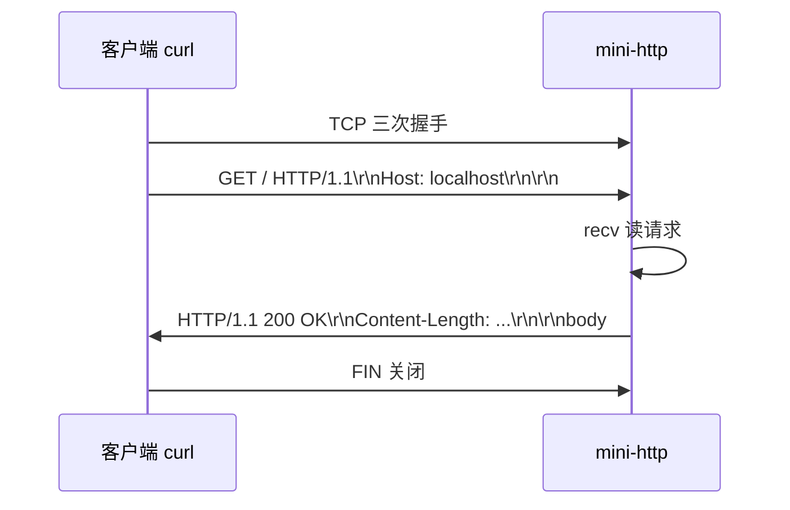
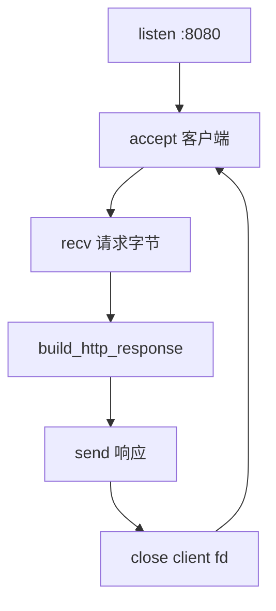
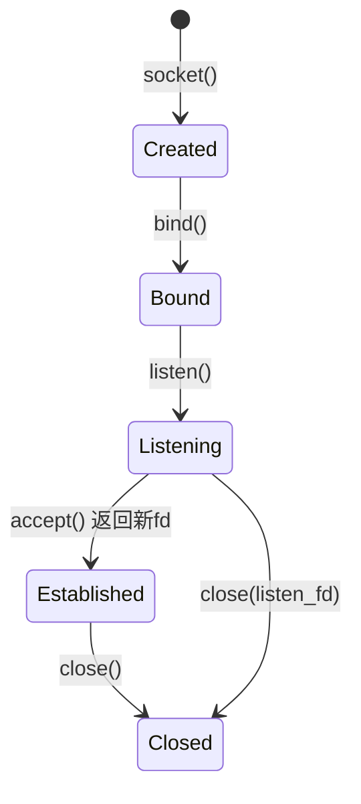
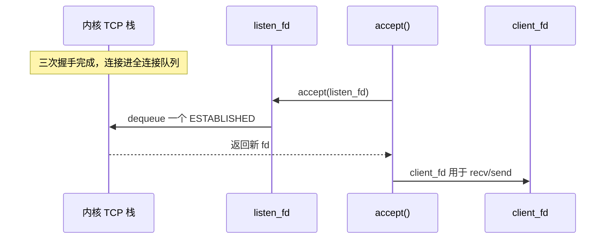
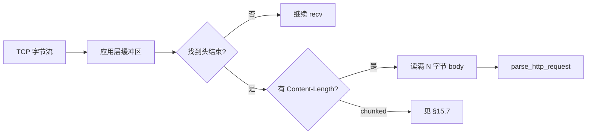
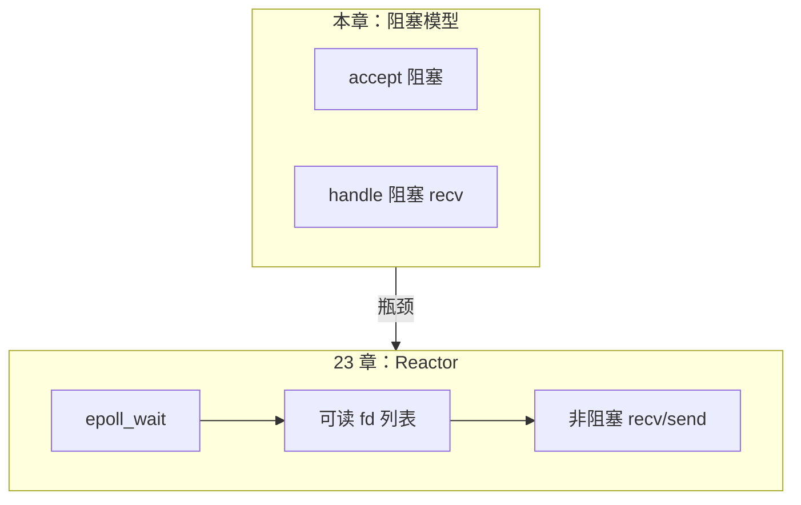

# 网络编程与简易 HTTP 服务

> **文件编码**：UTF-8。socket 示例默认 C++17；Windows 需链接 `ws2_32`。

---

## 本章与上一章的关系

[09 CMake](09-CMake与项目工程化.md) 已能构建多文件工程。业务后端本质是 **网络程序**：监听端口、读写字节流、按 HTTP 格式回响应。

本章在 TCP 之上实现 **简易 HTTP 服务端**（非完整 Web 服务器）：理解 socket 生命周期、HTTP 报文结构，并与 [计算机网络系列](../../前端学习/计算机网络/00-学习路线图与说明.md) 理论对照。

| 上一章（09） | 本章（10） | 下一章（11） |
|--------------|------------|--------------|
| hello-cmake 构建 | mini-http 监听 8080 | 日志写文件、读配置 |
| 链接 ws2_32 | GET 返回 200 + HTML | Linux 文件 IO |
| 本地 exe | curl / 浏览器访问 | 进程与信号 |

**计网对照**（建议先读或并行；完整索引见 [计算机网络 00 路线图](../../前端学习/计算机网络/00-学习路线图与说明.md)）：

| C++ 本章 | 计网文档 | 本章实践 |
|----------|----------|----------|
| TCP 连接 | [02 TCP 与 UDP](../../前端学习/计算机网络/02-TCP与UDP.md) | socket/bind/listen/accept |
| 端口、IP | [03 IP 与 DNS](../../前端学习/计算机网络/03-IP地址与DNS解析.md) | `INADDR_ANY`、`htons` |
| 分层模型 | [01 网络分层与通信基础](../../前端学习/计算机网络/01-网络分层与通信基础.md) | HTTP 在应用层 |
| HTTP 报文 | [04 HTTP 协议深入](../../前端学习/计算机网络/04-HTTP协议深入.md) | 请求行/头/体解析 |
| HTTPS | [05 HTTPS 与 TLS](../../前端学习/计算机网络/05-HTTPS与TLS加密.md) | 本章不做 TLS |
| 缓存 Cookie | [06 缓存 Cookie CORS](../../前端学习/计算机网络/06-缓存Cookie与会话机制.md) | 可加 Set-Cookie 练习 |
| 面试总表 | [07 面试专题与知识点总表](../../前端学习/计算机网络/07-面试专题与知识点总表.md) | 对照 14 章 C++ 面试 |

> **学习顺序建议**：先读计网 [02 TCP](../../前端学习/计算机网络/02-TCP与UDP.md) + [04 HTTP](../../前端学习/计算机网络/04-HTTP协议深入.md)，再写本章 mini-http，理论与实践互证。



---

## 0. 读前导读（零基础也能跟上）

### 0.1 用一句话弄懂本章

你在 TCP 连接上按 HTTP 格式**写字节**：客户端发 `GET / HTTP/1.1`，服务端回 `HTTP/1.1 200 OK` + 头 + 空行 + body——这就是 mini-http 的全部本质。

### 0.2 你需要提前知道什么

| 状态 | 动作 |
|------|------|
| 09 章 hello-cmake 未跑通 | 先完成 [09 章](09-CMake与项目工程化.md) §2.1 |
| 不懂 TCP 三次握手 | 并行读 [计网 02 TCP](../../前端学习/计算机网络/02-TCP与UDP.md) |
| 不懂 HTTP 报文结构 | 并行读 [计网 04 HTTP](../../前端学习/计算机网络/04-HTTP协议深入.md) |
| 只会浏览器访问网页 | 本章用 curl 看原始字节，与浏览器同一协议 |

### 0.3 本章知识地图（学完后应能勾选全部 ☐→☑）

- ☐ 口述 socket → bind → listen → accept → recv/send → close
- ☐ 区分 Windows Winsock 与 Linux POSIX 初始化差异
- ☐ 独立写出返回 HTTP/1.1 200 的最小响应字符串
- ☐ 理解 `Content-Length` 必须是 **UTF-8 字节数**
- ☐ 会用 `curl -v` 验证响应头与 body
- ☐ CMake 正确链接 `ws2_32`（Windows）
- ☐ 知道单线程 server 阻塞 accept 的局限
- ☐ 能解析 GET 第一行得到 path（进阶）

### 0.4 建议学习时长与节奏

| 阶段 | 时长 | 内容 |
|------|------|------|
| §2～§3 socket 流程 | 50 min | 对照计网 02 |
| §4 mini-http 三阶段 | 90 min | 必须 curl 成功 |
| §4.2 完整源码 | 60 min | 可选精读 |
| 报错表 + 闭卷自测 | 30 min | ≥7/10 进 11 章 |

### 0.5 学完本章你能做什么（可验证的具体动作）

1. 启动 mini-http，`curl http://127.0.0.1:8080/` 看到 HTML
2. `curl http://127.0.0.1:8080/api/ping` 得到 `{"ok":true}`
3. 用 `curl -v` 指出 `Content-Length` 与 body 是否一致
4. 向同学解释：为什么 HTTP 在 TCP 之上，而不是直接发 HTML 文件

**术语（Socket）**：操作系统提供的**网络通信端点**（文件描述符）；像电话机的「插口」，插上网线才能收发字节。
**生活类比**：TCP 像**打电话**（先接通再说话）；HTTP 像**通话里约定的句式**（先报「GET /」再等内容）。
**为什么重要**：后端、网关、游戏服务器底层都是 socket；不懂 socket 无法读 nginx/redis 源码。
**本章用到的地方**：§2 流程、§4 mini-http、§4.2 `platform_socket.h`。

---

## 1. 网络编程在 C++ 中的位置

- **系统 API**：Berkeley Socket（Windows Winsock2 / Linux POSIX socket）
- **标准库**：C++ 无内置 socket，需 `<sys/socket.h>`（Linux）或 `<winsock2.h>`（Windows）
- **第三方**：Boost.Asio、libevent（生产常用）；本章用原生 API 打基础

**深入解释**：HTTP 是 **应用层协议**，底下依赖 TCP 的可靠字节流。你写的不是「HTTP 库」，而是往 TCP 连接里写入符合 RFC 格式的文本。

---

## 2. TCP Socket 核心流程

```text
socket() → bind() → listen() → accept() → recv/send → close()
```

| 步骤 | 作用 |
|------|------|
| socket | 创建套接字 fd |
| bind | 绑定 IP:端口 |
| listen | 进入监听队列 |
| accept | 阻塞等待客户端，返回新 fd |
| recv/send | 读写数据 |
| close | 释放连接 |

客户端：`socket → connect → send/recv → close`。

### 2.1 与计网 02 三次握手对照（扩充）

| 计网概念 | socket API 阶段 | 你在 mini-http 看到的 |
|----------|-----------------|------------------------|
| SYN | 客户端 `connect` | curl 发起连接 |
| SYN+ACK / ACK | 内核完成握手 | `accept` 返回新 fd |
| ESTABLISHED | 连接就绪 | `recv` 读到 `GET ...` |
| FIN 四次挥手 | `close` / 客户端离开 | curl 结束 |

**深入解释**：应用层 `accept` 返回时，三次握手已在内核完成；你不需要手写 SYN 包。面试常问「握手在哪发生」——答：**内核 TCP 栈**，应用层只看到已建立连接。

### 2.2 术语三件套（网络基础）

**术语（端口 port）**：16 位整数，区分同一 IP 上不同服务；HTTP 默认 80，本章 demo 用 8080。
**生活类比**：IP 像**小区地址**，端口像**门牌号**——同一小区多户人家。
**为什么重要**：`bind` 必须指定端口；`EADDRINUSE` 是 10 章最高频报错之一。
**本章用到的地方**：§3 `htons(8080)`、§8 报错表。

**术语（字节序 htons）**：网络传输用**大端**；`htons` 把主机序转网络序。
**生活类比**：像国际邮件写地址要按**统一格式**（先国家后城市），不能各写各的。
**为什么重要**：port 不转序会导致 bind 到错误端口或失败。
**本章用到的地方**：`sockaddr_in.sin_port = htons(8080)`。

**术语（Content-Length）**：响应头字段，声明 body **字节数**（非字符数）。
**生活类比**：信封上写「内页 3 张」——收信人知道何时读完。
**为什么重要**：错则客户端截断或一直等；中文 UTF-8 一字 3 字节常见坑。
**本章用到的地方**：§4 `build_http_response`、§8 报错表。

### 2.3 手把手：curl 验证 HTTP（步骤表）

| 步骤 | 你的动作 | 预期看到什么 | 若不对 |
|------|----------|--------------|--------|
| 1 | 终端 A 启动 `./mini_http` | `HTTP http://127.0.0.1:8080` 或 listening | 见 §8 bind/WSA |
| 2 | 终端 B `curl -v http://127.0.0.1:8080/` | `< HTTP/1.1 200 OK` + HTML body | 连接拒绝→server 未起 |
| 3 | 检查 `Content-Length` | 与 body 字节一致 | 乱码→charset；截断→长度错 |
| 4 | `curl http://127.0.0.1:8080/api/ping` | `{"ok":true}` | 404→路由未实现 |
| 5 | `curl -X POST .../echo -d hi` | body 回显 `hi` | POST 未读 Content-Length |

### 2.4 逐行读：最小 HTTP 200 响应字符串

```cpp
const char resp[] =
    "HTTP/1.1 200 OK\r\n"
    "Content-Type: text/html; charset=utf-8\r\n"
    "Content-Length: 52\r\n"
    "Connection: close\r\n"
    "\r\n"
    "<html><body><h1>Hello</h1></body></html>";
```

| 行/段 | 含义 | 改错会怎样 |
|-------|------|------------|
| `HTTP/1.1 200 OK\r\n` | 状态行：协议版本+状态码+原因短语 | 缺 `\r\n` 解析器乱 |
| `Content-Type: ...\r\n` | 告诉客户端 body 类型 | 浏览器可能当纯文本 |
| `Content-Length: 52\r\n` | body **字节**数 | 与真实 body 不符则截断/阻塞 |
| `Connection: close\r\n` | 响应后关连接（教学简化） | Keep-Alive 需更多逻辑 |
| 空行 `\r\n` | 头结束标志 | 缺则 body 被当 header |
| HTML 片段 | 应用 body | 长度必须重算 |

### 2.5 命令预期输出（curl -v 片段）

```text
* Connected to 127.0.0.1 (127.0.0.1) port 8080
> GET / HTTP/1.1
> Host: 127.0.0.1:8080
>
< HTTP/1.1 200 OK
< Content-Type: text/html; charset=utf-8
< Content-Length: 52
< Connection: close
<
<html><body><h1>Hello mini-http</h1></body></html>
```

对照 [计网 04 HTTP](../../前端学习/计算机网络/04-HTTP协议深入.md) 报文结构，逐行标注请求行/头/体。

---

## 3. 跨平台头文件与初始化

### 3.1 Windows（Winsock2）

```cpp
#ifdef _WIN32
#define WIN32_LEAN_AND_MEAN
#include <winsock2.h>
#include <ws2tcpip.h>
#pragma comment(lib, "ws2_32.lib")
using socklen_t = int;
#define close closesocket
#else
#include <sys/socket.h>
#include <netinet/in.h>
#include <unistd.h>
#endif
```

Windows 程序入口前需：

```cpp
#ifdef _WIN32
    WSADATA wsa;
    if (WSAStartup(MAKEWORD(2, 2), &wsa) != 0) return 1;
#endif
// ... 结束时 WSACleanup();
```

### 3.2 CMakeLists.txt

```cmake
add_executable(mini_http src/main.cpp src/http_server.cpp)
if(WIN32)
    target_link_libraries(mini_http PRIVATE ws2_32)
endif()
```

---

## 3.1 手把手：mini-http 从 echo 到 HTTP 200

> 在 [09 hello-cmake](09-CMake与项目工程化.md) 同级新建 `mini-http` 目录。

### 阶段 A：TCP Echo（验证连通）

`src/echo_server.cpp` 核心逻辑：

```cpp
#include <iostream>
#include <cstring>
// ... 平台头文件见 §3.1

int main() {
#ifdef _WIN32
    WSADATA wsa;
    WSAStartup(MAKEWORD(2, 2), &wsa);
#endif
    int server_fd = socket(AF_INET, SOCK_STREAM, 0);
    sockaddr_in addr{};
    addr.sin_family = AF_INET;
    addr.sin_addr.s_addr = INADDR_ANY;
    addr.sin_port = htons(8080);

    bind(server_fd, reinterpret_cast<sockaddr*>(&addr), sizeof(addr));
    listen(server_fd, 8);
    std::cout << "echo listening :8080\n";

    sockaddr_in client{};
    socklen_t len = sizeof(client);
    int client_fd = accept(server_fd, reinterpret_cast<sockaddr*>(&client), &len);

    char buf[1024]{};
    int n = recv(client_fd, buf, sizeof(buf) - 1, 0);
    if (n > 0) send(client_fd, buf, n, 0);

    close(client_fd);
    close(server_fd);
#ifdef _WIN32
    WSACleanup();
#endif
    return 0;
}
```

**测试（PowerShell）**：

```powershell
cd f:\study\mini-http
cmake -S . -B build
cmake --build build --config Release
Start-Process .\build\Release\mini_http.exe
# 另开终端：
curl.exe http://127.0.0.1:8080 -d "hello"
# 预期：hello
```

**测试（WSL）**：

```bash
./build/mini_http &
curl http://127.0.0.1:8080 -d hello
# 预期：hello
```

### 阶段 B：构造 HTTP 响应

HTTP 响应 = **状态行 + 头 + 空行 + 体**：

```http
HTTP/1.1 200 OK\r\n
Content-Type: text/html; charset=utf-8\r\n
Content-Length: 39\r\n
Connection: close\r\n
\r\n
<html><body><h1>Hello mini-http</h1></body></html>
```

`include/http_response.h`：

```cpp
#pragma once
#include <string>

std::string build_http_response(int status_code,
                                const std::string& status_text,
                                const std::string& content_type,
                                const std::string& body);
```

`src/http_response.cpp`：

```cpp
#include "http_response.h"
#include <sstream>

std::string build_http_response(int status_code,
                                const std::string& status_text,
                                const std::string& content_type,
                                const std::string& body) {
    std::ostringstream oss;
    oss << "HTTP/1.1 " << status_code << " " << status_text << "\r\n";
    oss << "Content-Type: " << content_type << "\r\n";
    oss << "Content-Length: " << body.size() << "\r\n";
    oss << "Connection: close\r\n";
    oss << "\r\n";
    oss << body;
    return oss.str();
}
```

### 阶段 C：完整 mini-http main

```cpp
#include "http_response.h"
// socket 头文件 ...

int main() {
#ifdef _WIN32
    WSADATA wsa;
    WSAStartup(MAKEWORD(2, 2), &wsa);
#endif
    const int port = 8080;
    int server_fd = socket(AF_INET, SOCK_STREAM, 0);
    int opt = 1;
    setsockopt(server_fd, SOL_SOCKET, SO_REUSEADDR,
               reinterpret_cast<char*>(&opt), sizeof(opt));

    sockaddr_in addr{};
    addr.sin_family = AF_INET;
    addr.sin_addr.s_addr = INADDR_ANY;
    addr.sin_port = htons(port);
    bind(server_fd, reinterpret_cast<sockaddr*>(&addr), sizeof(addr));
    listen(server_fd, 8);
    std::cout << "HTTP server http://127.0.0.1:" << port << "\n";

    for (;;) {
        int client_fd = accept(server_fd, nullptr, nullptr);
        if (client_fd < 0) continue;

        char buf[4096]{};
        recv(client_fd, buf, sizeof(buf) - 1, 0);
        // 简易：不解析路径，一律 200

        std::string body = "<html><body><h1>Hello mini-http</h1></body></html>";
        std::string resp = build_http_response(200, "OK", "text/html; charset=utf-8", body);
        send(client_fd, resp.c_str(), static_cast<int>(resp.size()), 0);
        close(client_fd);
    }
    // 不可达
}
```

**验证**：

```powershell
curl.exe -v http://127.0.0.1:8080/
```

**预期片段**：

```text
< HTTP/1.1 200 OK
< Content-Type: text/html; charset=utf-8
< Content-Length: 39
...
<h1>Hello mini-http</h1>
```

浏览器打开 `http://127.0.0.1:8080/` 应看到标题。



---

## 4.1 HTTP 请求与响应解析基础（完整模块）

对照 [计网 04 HTTP 协议深入](../../前端学习/计算机网络/04-HTTP协议深入.md)：HTTP 报文是 **纯文本**，`\r\n` 分行，头与体之间有空行。

### 4.1.1 请求报文结构

```http
GET /api/ping HTTP/1.1\r\n
Host: 127.0.0.1:8080\r\n
User-Agent: curl/8.0\r\n
Accept: */*\r\n
\r\n
```

POST 带 body 时还有 `Content-Length` 头，body 紧跟空行后。

### 4.1.2 `include/http_request.h`

```cpp
#pragma once
#include <string>
#include <unordered_map>

struct HttpRequest {
    std::string method;
    std::string path;
    std::string version;
    std::unordered_map<std::string, std::string> headers;
    std::string body;
};

// 从 recv 缓冲区解析；若数据不完整返回 false
bool parse_http_request(const std::string& raw, HttpRequest& out);
std::string get_header(const HttpRequest& req, const std::string& key);
```

### 4.1.3 `src/http_request.cpp`

```cpp
#include "http_request.h"
#include <sstream>
#include <algorithm>

static std::string trim(std::string s) {
    auto not_space = [](unsigned char c) { return !std::isspace(c); };
    s.erase(s.begin(), std::find_if(s.begin(), s.end(), not_space));
    s.erase(std::find_if(s.rbegin(), s.rend(), not_space).base(), s.end());
    return s;
}

static std::string to_lower(std::string s) {
    for (char& c : s) c = static_cast<char>(std::tolower(static_cast<unsigned char>(c)));
    return s;
}

bool parse_http_request(const std::string& raw, HttpRequest& out) {
    auto header_end = raw.find("\r\n\r\n");
    if (header_end == std::string::npos) return false;

    std::string header_part = raw.substr(0, header_end);
    out.body = raw.substr(header_end + 4);

    std::istringstream iss(header_part);
    std::string line;
    if (!std::getline(iss, line)) return false;
    if (!line.empty() && line.back() == '\r') line.pop_back();

    std::istringstream first(line);
    if (!(first >> out.method >> out.path >> out.version)) return false;

    out.headers.clear();
    while (std::getline(iss, line)) {
        if (!line.empty() && line.back() == '\r') line.pop_back();
        if (line.empty()) break;
        auto colon = line.find(':');
        if (colon == std::string::npos) continue;
        std::string key = trim(line.substr(0, colon));
        std::string val = trim(line.substr(colon + 1));
        out.headers[to_lower(key)] = val;
    }

    // POST：若 Content-Length 有值，body 可能还需更多 recv（生产要循环读）
    auto it = out.headers.find("content-length");
    if (it != out.headers.end()) {
        std::size_t len = static_cast<std::size_t>(std::stoul(it->second));
        if (out.body.size() < len) return false;  // 不完整
        out.body = out.body.substr(0, len);
    }
    return true;
}

std::string get_header(const HttpRequest& req, const std::string& key) {
    auto it = req.headers.find(to_lower(key));
    return it == req.headers.end() ? "" : it->second;
}
```

### 4.1.4 响应解析（客户端 / 自测用）

用 curl 测自己的 server 时，也可用同样逻辑解析 **响应**：

```cpp
// include/http_response.h 追加
struct HttpResponse {
    int status_code = 0;
    std::string status_text;
    std::unordered_map<std::string, std::string> headers;
    std::string body;
};

bool parse_http_response(const std::string& raw, HttpResponse& out);
```

```cpp
// src/http_response.cpp 追加
bool parse_http_response(const std::string& raw, HttpResponse& out) {
    auto header_end = raw.find("\r\n\r\n");
    if (header_end == std::string::npos) return false;

    std::string header_part = raw.substr(0, header_end);
    out.body = raw.substr(header_end + 4);

    std::istringstream iss(header_part);
    std::string line;
    if (!std::getline(iss, line)) return false;
    if (!line.empty() && line.back() == '\r') line.pop_back();

    // HTTP/1.1 200 OK
    std::istringstream status_line(line);
    std::string http_version;
    status_line >> http_version >> out.status_code;
    std::getline(status_line, out.status_text);
    if (!out.status_text.empty() && out.status_text[0] == ' ')
        out.status_text.erase(0, 1);

    out.headers.clear();
    while (std::getline(iss, line)) {
        if (!line.empty() && line.back() == '\r') line.pop_back();
        if (line.empty()) break;
        auto colon = line.find(':');
        if (colon == std::string::npos) continue;
        std::string key = trim(line.substr(0, colon));
        std::string val = trim(line.substr(colon + 1));
        out.headers[to_lower(key)] = val;
    }

    auto it = out.headers.find("content-length");
    if (it != out.headers.end()) {
        std::size_t len = static_cast<std::size_t>(std::stoul(it->second));
        if (out.body.size() < len) return false;
        out.body = out.body.substr(0, len);
    }
    return true;
}
```

**自测**：写 `http_client.cpp` 连 8080，`recv` 全文后 `parse_http_response`，断言 `status_code == 200`。

---

## 4.2 完整 mini-http 源码（文档内可编译）

> CMake 见 [09 章 §5.7](09-CMake与项目工程化.md)。下列为 **单线程、带路由** 的完整实现。

### 4.2.1 目录

```text
mini-http/
├── CMakeLists.txt          # 见 09 章
├── include/
│   ├── http_request.h
│   ├── http_response.h
│   └── platform_socket.h
├── src/
│   ├── main.cpp
│   ├── http_request.cpp
│   ├── http_response.cpp
│   └── http_server.cpp
├── static/
│   └── index.html
└── config/
    └── server.conf
```

### 4.2.2 `include/platform_socket.h`

```cpp
#pragma once

#ifdef _WIN32
#define WIN32_LEAN_AND_MEAN
#include <winsock2.h>
#include <ws2tcpip.h>
#pragma comment(lib, "ws2_32.lib")
using socklen_t = int;
#define close_socket closesocket
#else
#include <sys/socket.h>
#include <netinet/in.h>
#include <arpa/inet.h>
#include <unistd.h>
#define close_socket close
#endif

inline bool socket_platform_init() {
#ifdef _WIN32
    WSADATA wsa{};
    return WSAStartup(MAKEWORD(2, 2), &wsa) == 0;
#else
    return true;
#endif
}

inline void socket_platform_cleanup() {
#ifdef _WIN32
    WSACleanup();
#endif
}
```

### 4.2.3 `include/http_response.h`（构建响应）

```cpp
#pragma once
#include <string>
#include <unordered_map>

struct HttpResponse {
    int status_code = 0;
    std::string status_text;
    std::unordered_map<std::string, std::string> headers;
    std::string body;
};

std::string build_http_response(int status_code,
                                const std::string& status_text,
                                const std::string& content_type,
                                const std::string& body);

std::string serialize_response(const HttpResponse& resp);
bool parse_http_response(const std::string& raw, HttpResponse& out);
```

### 4.2.4 `src/http_response.cpp`（build + serialize + parse）

```cpp
#include "http_response.h"
#include <sstream>
#include <algorithm>
#include <cctype>

static std::string trim(std::string s) {
    auto not_space = [](unsigned char c) { return !std::isspace(c); };
    s.erase(s.begin(), std::find_if(s.begin(), s.end(), not_space));
    s.erase(std::find_if(s.rbegin(), s.rend(), not_space).base(), s.end());
    return s;
}

static std::string to_lower(std::string s) {
    for (char& c : s) c = static_cast<char>(std::tolower(static_cast<unsigned char>(c)));
    return s;
}

std::string build_http_response(int status_code,
                                const std::string& status_text,
                                const std::string& content_type,
                                const std::string& body) {
    HttpResponse r;
    r.status_code = status_code;
    r.status_text = status_text;
    r.body = body;
    r.headers["content-type"] = content_type;
    r.headers["content-length"] = std::to_string(body.size());
    r.headers["connection"] = "close";
    return serialize_response(r);
}

std::string serialize_response(const HttpResponse& resp) {
    std::ostringstream oss;
    oss << "HTTP/1.1 " << resp.status_code << " " << resp.status_text << "\r\n";
    for (const auto& [k, v] : resp.headers) {
        oss << k << ": " << v << "\r\n";
    }
    oss << "\r\n" << resp.body;
    return oss.str();
}

bool parse_http_response(const std::string& raw, HttpResponse& out) {
    auto header_end = raw.find("\r\n\r\n");
    if (header_end == std::string::npos) return false;
    std::string header_part = raw.substr(0, header_end);
    out.body = raw.substr(header_end + 4);

    std::istringstream iss(header_part);
    std::string line;
    if (!std::getline(iss, line)) return false;
    if (!line.empty() && line.back() == '\r') line.pop_back();

    std::istringstream status_line(line);
    std::string http_version;
    status_line >> http_version >> out.status_code;
    std::getline(status_line, out.status_text);
    if (!out.status_text.empty() && out.status_text[0] == ' ')
        out.status_text.erase(0, 1);

    out.headers.clear();
    while (std::getline(iss, line)) {
        if (!line.empty() && line.back() == '\r') line.pop_back();
        if (line.empty()) break;
        auto colon = line.find(':');
        if (colon == std::string::npos) continue;
        out.headers[to_lower(trim(line.substr(0, colon)))] =
            trim(line.substr(colon + 1));
    }
    auto it = out.headers.find("content-length");
    if (it != out.headers.end()) {
        std::size_t len = static_cast<std::size_t>(std::stoul(it->second));
        if (out.body.size() < len) return false;
        out.body = out.body.substr(0, len);
    }
    return true;
}
```

### 4.2.5 `src/http_server.cpp`

```cpp
#include "platform_socket.h"
#include "http_request.h"
#include "http_response.h"
#include <cstring>
#include <iostream>
#include <fstream>
#include <sstream>

static std::string read_file_or_empty(const std::string& path) {
    std::ifstream ifs(path, std::ios::binary);
    if (!ifs) return {};
    std::ostringstream oss;
    oss << ifs.rdbuf();
    return oss.str();
}

static void handle_client(int client_fd) {
    char buf[8192]{};
    int n = recv(client_fd, buf, sizeof(buf) - 1, 0);
    if (n <= 0) return;
    std::string raw(buf, buf + n);

    HttpRequest req;
    if (!parse_http_request(raw, req)) {
        std::string resp = build_http_response(400, "Bad Request",
            "text/plain; charset=utf-8", "Bad Request");
        send(client_fd, resp.c_str(), static_cast<int>(resp.size()), 0);
        return;
    }

    std::string body;
    std::string ctype = "text/html; charset=utf-8";
    int code = 200;
    std::string text = "OK";

    if (req.path == "/api/ping") {
        body = R"({"ok":true})";
        ctype = "application/json; charset=utf-8";
    } else if (req.path == "/") {
        body = read_file_or_empty("static/index.html");
        if (body.empty())
            body = "<html><body><h1>Hello mini-http</h1></body></html>";
    } else if (req.method == "POST" && req.path == "/echo") {
        body = req.body;
        ctype = "text/plain; charset=utf-8";
    } else {
        code = 404;
        text = "Not Found";
        body = "Not Found";
        ctype = "text/plain; charset=utf-8";
    }

    std::string resp = build_http_response(code, text, ctype, body);
    send(client_fd, resp.c_str(), static_cast<int>(resp.size()), 0);
}

bool run_http_server(int port) {
    int server_fd = socket(AF_INET, SOCK_STREAM, 0);
    if (server_fd < 0) return false;

    int opt = 1;
    setsockopt(server_fd, SOL_SOCKET, SO_REUSEADDR,
               reinterpret_cast<char*>(&opt), sizeof(opt));

    sockaddr_in addr{};
    addr.sin_family = AF_INET;
    addr.sin_addr.s_addr = INADDR_ANY;
    addr.sin_port = htons(static_cast<uint16_t>(port));

    if (bind(server_fd, reinterpret_cast<sockaddr*>(&addr), sizeof(addr)) < 0) {
        close_socket(server_fd);
        return false;
    }
    if (listen(server_fd, 16) < 0) {
        close_socket(server_fd);
        return false;
    }

    std::cout << "HTTP http://127.0.0.1:" << port << "\n";

    for (;;) {
        int client_fd = accept(server_fd, nullptr, nullptr);
        if (client_fd < 0) continue;
        handle_client(client_fd);
        close_socket(client_fd);
    }
}
```

### 4.2.6 `src/main.cpp`

```cpp
#include "platform_socket.h"

bool run_http_server(int port);

int main() {
    if (!socket_platform_init()) return 1;
    const int port = 8080;
    run_http_server(port);  // 不返回
    socket_platform_cleanup();
    return 0;
}
```

### 4.2.7 验证命令

```powershell
curl.exe -v http://127.0.0.1:8080/
curl.exe http://127.0.0.1:8080/api/ping
curl.exe -X POST http://127.0.0.1:8080/echo -d "hello body"
```

---

## 5. 简易解析 GET 路径（进阶）

只取第一行 `GET /path HTTP/1.1`：

```cpp
#include <sstream>
#include <string>

std::string parse_path(const char* request) {
    std::istringstream iss(request);
    std::string method, path, version;
    iss >> method >> path >> version;
    return path;
}
```

根据 `path` 返回不同 body 或 404：

```cpp
std::string path = parse_path(buf);
if (path == "/api/ping") {
    body = R"({"ok":true})";
    content_type = "application/json; charset=utf-8";
} else if (path != "/") {
    body = "Not Found";
    resp = build_http_response(404, "Not Found", "text/plain", body);
}
```

---

## 6. 单线程 vs 多客户端

| 模型 | 优点 | 缺点 |
|------|------|------|
| 单线程循环 accept | 简单 | 一个慢客户端阻塞全体 |
| 每连接一线程 | 易写 | 线程多开销大 |
| select/poll/epoll | 高并发 | 代码复杂（见 08 章延伸） |

练习挑战：用 `select` 同时监听多个 fd（Windows 也支持 select）。

---

## 7. 与前端 / 计网联调

- Vue/React [Axios 联调](../../前端学习/Vue/08-Axios网络请求与前后端联调.md) 改 `baseURL` 为 `http://127.0.0.1:8080` 可测 CORS——本章未加 CORS 头，浏览器跨域会失败；**curl 或同域页面**可测。
- 加 CORS 头示例：`Access-Control-Allow-Origin: *`（仅学习用）。

---

## 8. 常见报错与排查

| 现象 | 原因 | 解决 |
|------|------|------|
| `bind: Address already in use` | 端口被占 | `SO_REUSEADDR`；换端口；杀旧进程 |
| Windows `WSAStartup failed` | 未初始化 Winsock | 入口调用 `WSAStartup` |
| `undefined reference to __imp_socket` | 未链 ws2_32 | CMake `target_link_libraries(... ws2_32)` |
| curl 一直等待 | 未 send 或未 close | 发完响应 close client fd |
| 浏览器乱码 | 未声明 charset | `Content-Type: ...; charset=utf-8` |
| 响应被截断 | Content-Length 错误 | 用 `body.size()` 字节数，非字符数 |
| accept 返回 -1 | signal 中断 / 资源耗尽 | 检查 fd 泄漏，循环里是否 close |
| WSL Windows 互访不通 | 防火墙 / 监听地址 | 监听 `0.0.0.0`，查 Windows 防火墙 |
| HTTPS 失败 | 本章仅 HTTP | 需 TLS 库（OpenSSL），见计网 05 |
| recv 返回 0 | 对端关闭 | 正常，结束读循环 |
| `parse_http_request` 一直 false | 请求未收全 | 循环 recv 直到 `\r\n\r\n` 或 Content-Length 满足 |
| 400 Bad Request | 首行 malformed | 检查 method/path/version 三字段 |
| header 大小写 | HTTP 头 case-insensitive | 统一 to_lower 存 map |
| POST body 截断 | 只 recv 一次 | 按 Content-Length 多读几轮 |
| `stoul` 异常 | Content-Length 非数字 | try/catch 返回 400 |
| Keep-Alive 卡住 | 未实现持久连接 | 响应加 `Connection: close` |
| 中文 body 乱码 | 字节≠字符 | Content-Length 用 UTF-8 **字节**长度 |
| 路径带 query | `/search?q=1` | 需再 split `?`（练习） |
| 超大 header | 慢loris | 生产限 header 大小 |

---

## 9. 练习建议

### 基础

1. 实现 `/api/ping` 返回 JSON `{"ok":true}`。
2. 未知路径返回 404 + 纯文本 body。

### 进阶

3. 解析 `Host` 头，日志打印客户端请求第一行。
4. 读本地 `static/index.html` 作为 `/` 的 body（为 11 章文件 IO 铺垫）。

### 挑战

5. 用 `select` 支持 3 个客户端同时连接。
6. 增加 `POST /echo`：body 原样返回（需读 Content-Length）。

### 计网联动

7. 对照 [计网 04](../../前端学习/计算机网络/04-HTTP协议深入.md) 画出请求/响应报文，与本章 `parse_http_request` 字段一一对应。
8. 读 [计网 02 三次握手](../../前端学习/计算机网络/02-TCP与UDP.md)，用 `ss -tan` 观察 `LISTEN` / `ESTAB` 状态。
9. 写单元测试：给定 raw 字符串，断言 `parse_http_response` 的 status 与 body。

### 08 章联动

10. 用 [08 章 ThreadPool](../C++/08-多线程与并发编程.md) 包装 `handle_client`，对比单线程 QPS（ab 压测）。

---

## 10. 参考答案

### 基础 1：/api/ping

```cpp
if (path == "/api/ping") {
    body = R"({"ok":true})";
    resp = build_http_response(200, "OK", "application/json; charset=utf-8", body);
}
```

### 基础 2：404

```cpp
else if (path != "/") {
    resp = build_http_response(404, "Not Found", "text/plain; charset=utf-8", "Not Found");
}
```

### 进阶 4：读 index.html

```cpp
#include <fstream>
#include <sstream>

std::string read_file(const std::string& path) {
    std::ifstream ifs(path);
    std::ostringstream oss;
    oss << ifs.rdbuf();
    return oss.str();
}
// body = read_file("static/index.html");
```

### 挑战 5：select 伪代码

```cpp
fd_set readfds;
FD_ZERO(&readfds);
FD_SET(server_fd, &readfds);
// 循环 FD_SET 各 client，select 后处理可读 fd
```

---

## 11. 学完标准

- [ ] 能口述 TCP 服务端 socket 流程（对照计网三次握手）
- [ ] 独立写出返回 HTTP/1.1 200 的最小 server
- [ ] 会用 curl -v 看响应头与 Content-Length
- [ ] CMake 在 Windows 正确链接 ws2_32
- [ ] 知道单线程 server 的局限与 select 方向

---

## 12. 常见问题 FAQ（扩充）

1. **HTTP 和 TCP 什么关系？** TCP 传字节流；HTTP 规定这些字节的文本格式（请求行/头/体）。
2. **为什么 accept 会阻塞？** 默认无客户端时线程睡眠等待；单线程下 accept 慢会拖住全体。
3. **`recv` 一次能读完整个 HTTP 请求吗？** 不一定；生产要循环读直到 `\r\n\r\n` 或 Content-Length 满足。
4. **Windows 为什么要 WSAStartup？** Winsock 需初始化；Linux 不需要，直接 `socket()`。
5. **Content-Length 写字符数行吗？** 不行，必须写 body 的**字节**长度（中文 UTF-8 更长）。
6. **浏览器能访问但跨域失败？** 本章未加 CORS 头；用 curl 或同域页面测试。
7. **8080 被占用怎么办？** `SO_REUSEADDR`、换端口、或 `netstat`/`ss` 查占用进程。
8. **HTTPS 怎么做？** 需 TLS（OpenSSL）；见 [计网 05 HTTPS](../../前端学习/计算机网络/05-HTTPS与TLS加密.md)。
9. **和 Java Servlet 比？** Servlet 容器帮你解析 HTTP；本章手写解析理解底层。
10. **select 和 epoll 何时学？** 本章挑战题用 select；高并发话术见 [14 章](14-高频面试专题与场景题.md) Q40。
11. **Keep-Alive 默认开吗？** HTTP/1.1 默认持久连接；教学版常 `Connection: close` 简化。
12. **POST body 怎么读？** 解析 `Content-Length` 头，再 recv 足够字节（§8 报错表）。

---

## 13. 闭卷自测

1. 写出 TCP 服务端 6 步 API 调用顺序（英文函数名）。
2. `bind` 和 `listen` 各解决什么问题？
3. HTTP 响应由哪三部分组成？中间用什么分隔头和 body？
4. 为什么 `\r\n\r\n` 在 HTTP 里很重要？
5. Windows 链接 socket 程序最少还要链哪个库？
6. `curl -v` 输出里如何确认 `Content-Length` 正确？
7. 单线程 mini-http 一个慢客户端会造成什么现象？
8. `INADDR_ANY` 表示什么监听策略？
9. 给定 `GET /api/ping HTTP/1.1`，path 是什么？
10. 综合：从 CMake 构建到 curl 成功，列 4 个命令（含运行 server）。

### 自测参考答案

1. `socket` → `bind` → `listen` → `accept` → `recv`/`send` → `close`。
2. `bind` 绑定 IP:端口；`listen` 把 socket 设为被动监听并设 backlog 队列。
3. 状态行 + 头字段 + body；头与 body 之间空一行（`\r\n\r\n`）。
4. 标志**头结束**；解析器靠它定位 body 起点。
5. `ws2_32`（Winsock2）。
6. 对比 `-v` 里的 `Content-Length:` 与 body 实际字节数（中文注意 UTF-8）。
7. 阻塞在 `recv`，后续客户端排队等待（单线程模型）。
8. 监听所有网卡地址（0.0.0.0），不仅 localhost。
9. `/api/ping`（第一行中间字段）。
10. `cmake -S . -B build` → `cmake --build build` → `./build/mini_http` → `curl http://127.0.0.1:8080/`。

---

## 14. 费曼检验

3 分钟解释：**为什么 mini-http 要在 TCP 连接里写 `HTTP/1.1 200 OK` 这种文本，而不是直接 send HTML？**

**提纲对照**：

1. TCP 只交付字节流，不解释含义；HTTP 是应用层协议，规定格式。
2. 客户端（curl/浏览器）靠状态行和头解析 body 长度、类型。
3. 缺头或 Content-Length 错会导致截断或一直等待。
4. 类比：TCP 是管道，HTTP 是管道里约定的「信封格式」。

---


---

## 15. Primer Plus 深度扩编：Socket API 与 HTTP 工程化

> 本节在 §1～§14 基础上**系统补全** TCP socket 细节、粘包、HTTP 高级特性与跨平台差异。高并发 I/O 多路复用见 [23 IO 多路复用与高性能 Server](23-IO多路复用与高性能Server.md)；TCP/HTTP 面试深挖见 [54 计算机网络 TCP 与 HTTP 面试深度专章](54-计算机网络TCP与HTTP面试深度专章.md)。

### 15.1 TCP Socket API 全景表

Berkeley Socket 是 POSIX 与 Winsock2 的共同抽象。下表列出 **服务端** 与 **客户端** 常用 API（Linux 为主，Windows 差异见 §15.10）。

| API | 头文件 | 作用 | 返回值约定 | 典型 errno |
|-----|--------|------|------------|------------|
| `socket()` | `<sys/socket.h>` | 创建通信端点 | 成功≥0 fd；失败 -1 | `EMFILE` fd 耗尽 |
| `bind()` | 同上 | 绑定本地 IP:端口 | 0 成功；-1 失败 | `EADDRINUSE` 端口占用 |
| `listen()` | 同上 | 设为被动监听 | 0 成功；-1 失败 | `EOPNOTSUPP` 非 stream |
| `accept()` | 同上 | 取已建立连接 | 新 fd≥0；-1 失败 | `EINTR` 信号打断 |
| `connect()` | 同上 | 客户端发起连接 | 0 成功；-1 失败 | `ECONNREFUSED` 无监听 |
| `recv()` / `read()` | `<unistd.h>` | 读字节流 | >0 字节数；0 对端关闭；-1 错误 | `EAGAIN` 非阻塞无数据 |
| `send()` / `write()` | 同上 | 写字节流 | ≥0 已发送；-1 错误 | `EPIPE` 对端已关 |
| `close()` | 同上 | 释放 fd | 0 成功；-1 失败 | `EBADF` 无效 fd |
| `setsockopt()` | `<sys/socket.h>` | 设置选项 | 0/-1 | `EINVAL` 非法选项 |
| `getsockopt()` | 同上 | 读取选项 | 0/-1 | 同上 |
| `shutdown()` | 同上 | 半关闭读写 | 0/-1 | 优雅挥手辅助 |
| `fcntl()` | `<fcntl.h>` | 非阻塞/O_CLOEXEC | 0/-1 | 见 23 章 epoll 前奏 |

**深入解释**：`socket()` 只创建「空壳」fd，尚未与任何地址关联；`bind()` 把 fd 与 **本地** 四元组中的 (IP, port) 绑定；`listen()` 告诉内核「我准备好接客」并维护 **半连接队列**（SYN_RCVD）与 **全连接队列**（ESTABLISHED 待 accept）；`accept()` 从全连接队列取出一个已完成三次握手的连接，返回 **新的** fd——监听 fd 继续 `accept`，通信 fd 用于 `recv/send`。



**术语（backlog）**：`listen(fd, backlog)` 的 backlog 表示内核为 **已完成握手、等待 accept** 的连接队列长度提示；Linux 上实际还受 `somaxconn`（/proc/sys/net/core/somaxconn）限制。过小会导致客户端 `connect` 超时；过大占内存——生产常设 128～512 并配合 epoll（23 章）。

---

### 15.2 bind / listen / accept 逐函数精讲

#### 15.2.1 bind：谁在用这个端口？

```cpp
sockaddr_in addr{};
addr.sin_family = AF_INET;
addr.sin_addr.s_addr = INADDR_ANY;   // 0.0.0.0，所有网卡
addr.sin_port = htons(8080);

if (bind(server_fd, reinterpret_cast<sockaddr*>(&addr), sizeof(addr)) < 0) {
    perror("bind");
    // 常见：EADDRINUSE — 见 §15.3
}
```

| 绑定地址 | 含义 | 谁能连 |
|----------|------|--------|
| `INADDR_ANY` (0.0.0.0) | 所有网卡 | 本机 + 局域网 + 公网（若防火墙放行） |
| `inet_addr("127.0.0.1")` | 仅回环 | 仅本机 |
| 具体网卡 IP | 单网卡 | 经该 IP 路由可达的客户端 |

**为什么必须 `htons`**：x86 是小端，网络字节序是大端；端口不转换会导致 bind 到「看起来随机」的端口。

#### 15.2.2 listen：从「主动」到「被动」

```cpp
if (listen(server_fd, 128) < 0) {
    perror("listen");
}
```

- 调用前 socket 默认可用于 `connect`（主动）；调用后仅适合 `accept`（被动）。
- **backlog 不是「最大并发连接数」**，而是「等待 accept 的队列长度」；已 accept 的连接不占 backlog。

#### 15.2.3 accept：阻塞、EINTR 与对端信息

```cpp
sockaddr_in client_addr{};
socklen_t client_len = sizeof(client_addr);
int client_fd = accept(server_fd,
                       reinterpret_cast<sockaddr*>(&client_addr),
                       &client_len);
if (client_fd < 0) {
    if (errno == EINTR) continue;  // 信号打断，重试 — 见 11 章 §5.2
    perror("accept");
}
// 可选：inet_ntop 打印 client_addr.sin_addr
```



**常见误区**：以为 `accept` 会再次握手——握手在内核完成；`accept` 只是「取货」。

---

### 15.3 SO_REUSEADDR 与 SO_REUSEPORT

#### 15.3.1 SO_REUSEADDR（本章已用，原理补全）

```cpp
int opt = 1;
setsockopt(server_fd, SOL_SOCKET, SO_REUSEADDR,
           &opt, sizeof(opt));
```

| 场景 | 无 REUSEADDR | 有 REUSEADDR |
|------|--------------|--------------|
| 进程崩溃后立即重启 | `bind` 失败 TIME_WAIT | 通常可立即 bind |
| 旧进程仍占端口 | 仍失败 | 仍失败（需杀进程） |
| 多个进程 bind 同端口 | 失败 | Linux 需 REUSEPORT |

**TIME_WAIT 复习**（对照 [计网 02](../../前端学习/计算机网络/02-TCP与UDP.md)）：主动关闭方进入 TIME_WAIT（约 2MSL），端口仍被占用；`SO_REUSEADDR` 允许 **新 bind** 在 TIME_WAIT 期间复用地址（行为因 OS 略有差异）。

#### 15.3.2 SO_REUSEPORT（23 章预热）

Linux 3.9+ 支持多进程 **负载均衡** 同端口：

```cpp
setsockopt(server_fd, SOL_SOCKET, SO_REUSEPORT, &opt, sizeof(opt));
```

多个 worker 各自 `bind` 同一端口，内核把新连接 **哈希分发** 到不同进程——nginx、Redis 多实例常用。详见 [23 章](23-IO多路复用与高性能Server.md) §worker 模型。

---

### 15.4 TCP_NODELAY 与 Nagle 算法

TCP 默认开启 **Nagle**：小数据包会合并发送，减少网络小包，但增加 **延迟**（交互式、游戏、RPC 敏感）。

```cpp
int flag = 1;
setsockopt(client_fd, IPPROTO_TCP, TCP_NODELAY, &flag, sizeof(flag));
```

| 选项 | 效果 | 适用 |
|------|------|------|
| 默认（Nagle 开） | 合并小包，吞吐友好 |  bulk 传输 |
| `TCP_NODELAY=1` | 有数据立刻发 | 低延迟 HTTP API、游戏 |

**与 HTTP mini-http**：教学版响应通常一次 `send` 整包，Nagle 影响小；若 **多次小 send**（先头发后 body）且未 `TCP_NODELAY`，可能出现 **200ms 级延迟**（经典 Nagle+延迟 ACK 交互）。生产建议：**合并响应再 send**，或设 `TCP_NODELAY`。

---

### 15.5 TCP 粘包与半包：字节流 vs 消息边界

**核心事实**：TCP **没有**「一条消息」边界；`recv` 返回的是「当前缓冲区里有多少字节」，可能与应用层「一条 HTTP 请求」不对齐。

| 现象 | 原因 | HTTP 层应对 |
|------|------|-------------|
| **半包** | 一次 recv 未读完整请求 | 循环读直到 `\r\n\r\n` + Content-Length |
| **粘包** | 一次 recv 含多个请求/响应 | Keep-Alive 下按 Content-Length 切分 |
| **对端关闭** | recv 返回 0 | 结束读循环，close fd |

#### 15.5.1 读满 HTTP 头的循环模板

```cpp
#include <string>

bool read_until_headers(int fd, std::string& buffer) {
    char tmp[4096];
    while (buffer.find("\r\n\r\n") == std::string::npos) {
        ssize_t n = recv(fd, tmp, sizeof(tmp), 0);
        if (n <= 0) return false;  // 0=关闭，-1=错误
        buffer.append(tmp, static_cast<size_t>(n));
        if (buffer.size() > 65536) return false;  // 防 Slowloris
    }
    return true;
}
```

#### 15.5.2 按 Content-Length 读 body

```cpp
bool read_body(int fd, std::string& buffer, size_t body_len) {
    size_t header_end = buffer.find("\r\n\r\n");
    size_t have = buffer.size() - header_end - 4;
    while (have < body_len) {
        char tmp[4096];
        ssize_t n = recv(fd, tmp, sizeof(tmp), 0);
        if (n <= 0) return false;
        buffer.append(tmp, static_cast<size_t>(n));
        have = buffer.size() - header_end - 4;
    }
    return true;
}
```

#### 15.5.3 自定义二进制协议（对比理解）

HTTP 用 `\r\n\r\n` + `Content-Length` 定界；游戏/RPC 常用 **长度前缀**：

```text
[4 字节大端 length][payload]
```

粘包处理：读 4 字节 → 解析 length → 再读 length 字节。理解此模式有助于读 Redis/Memcached 协议（54 章面试常问）。



---

### 15.6 HTTP 协议解析：状态机与头字段

对照 [计网 04 HTTP](../../前端学习/计算机网络/04-HTTP协议深入.md) 与 [54 章](54-计算机网络TCP与HTTP面试深度专章.md)。

#### 15.6.1 请求行解析规则

```http
METHOD SP Request-URI SP HTTP-Version CRLF
```

| 字段 | 示例 | 注意 |
|------|------|------|
| METHOD | GET, POST, HEAD | 大小写敏感（惯例大写） |
| Request-URI | `/api/ping?q=1` | path 与 query 需再 split |
| HTTP-Version | HTTP/1.1 | 1.0 默认短连接 |

#### 15.6.2 头字段：大小写不敏感

```cpp
// 已在 §4.1.3 使用 to_lower 存 map
std::string host = get_header(req, "host");  // 实际 key 已 lower
```

#### 15.6.3 完整读请求封装

```cpp
bool read_http_request(int fd, HttpRequest& out) {
    std::string raw;
    if (!read_until_headers(fd, raw)) return false;

    auto header_end = raw.find("\r\n\r\n");
    std::string header_part = raw.substr(0, header_end);

    if (!parse_http_request(raw, out)) return false;

    auto cl_it = out.headers.find("content-length");
    if (cl_it != out.headers.end()) {
        size_t body_len = std::stoul(cl_it->second);
        if (!read_body(fd, raw, body_len)) return false;
        out.body = raw.substr(header_end + 4, body_len);
    }
    return true;
}
```

#### 15.6.4 响应构建检查清单

| 检查项 | 错误后果 |
|--------|----------|
| 状态行 `\r\n` | 解析失败 |
| `Content-Length` = body **字节**数 | 截断/阻塞 |
| 头与 body 间空行 | body 被当 header |
| `Connection: close`（教学） | 避免 Keep-Alive 复杂度 |

---

### 15.7 Transfer-Encoding: chunked 分块传输

HTTP/1.1 可在 **无 Content-Length** 时用 chunked 传 body（nginx 动态页、流式 API 常见）。

**格式**：

```http
HTTP/1.1 200 OK\r\n
Transfer-Encoding: chunked\r\n
\r\n
5\r\n
hello\r\n
0\r\n
\r\n
```

| 块 | 含义 |
|----|------|
| `5\r\n` | 下一块 5 字节（十六进制） |
| `hello\r\n` | 5 字节数据 |
| `0\r\n\r\n` | 结束块 |

#### 15.7.1 简易 chunked 解码器

```cpp
#include <string>
#include <cstdlib>

bool decode_chunked_body(const std::string& chunked, std::string& body_out) {
    size_t pos = 0;
    body_out.clear();
    while (pos < chunked.size()) {
        auto line_end = chunked.find("\r\n", pos);
        if (line_end == std::string::npos) return false;
        std::string size_hex = chunked.substr(pos, line_end - pos);
        char* end = nullptr;
        unsigned long chunk_size = std::strtoul(size_hex.c_str(), &end, 16);
        if (end == size_hex.c_str()) return false;
        pos = line_end + 2;
        if (chunk_size == 0) return true;
        if (pos + chunk_size + 2 > chunked.size()) return false;
        body_out.append(chunked, pos, chunk_size);
        pos += chunk_size + 2;  // 跳过 data 与 trailing \r\n
    }
    return false;
}
```

#### 15.7.2 发送 chunked 响应（练习向）

```cpp
std::string build_chunked_response(const std::string& body) {
    std::ostringstream oss;
    oss << "HTTP/1.1 200 OK\r\n";
    oss << "Transfer-Encoding: chunked\r\n";
    oss << "Content-Type: text/plain\r\n";
    oss << "\r\n";
    oss << std::hex << body.size() << "\r\n";
    oss << body << "\r\n";
    oss << "0\r\n\r\n";
    return oss.str();
}
```

**mini-http 策略**：静态小页面用 `Content-Length` 更简单；大文件或流式日志可练 chunked（与 11 章 mmap 静态文件配合）。

---

### 15.8 HTTP Keep-Alive 持久连接

HTTP/1.1 **默认** `Connection: keep-alive`（除非显式 `close`）。同一 TCP 连接上可 **连续** 发多个请求/响应，减少握手开销。

#### 15.8.1 服务端循环处理（单连接多请求）

```cpp
void handle_connection(int client_fd) {
    while (true) {
        HttpRequest req;
        if (!read_http_request(client_fd, req)) break;

        std::string resp = build_http_response(200, "OK", "text/html; charset=utf-8",
            "<html><body>ok</body></html>");
        // 持久连接：加 Connection: keep-alive
        // 教学简化仍可用 Connection: close 一次一连接

        send(client_fd, resp.c_str(), static_cast<int>(resp.size()), 0);

        auto conn = req.headers.find("connection");
        if (conn != req.headers.end() &&
            conn->second.find("close") != std::string::npos)
            break;
        // HTTP/1.0 客户端可能无 keep-alive，需读完后 close
    }
}
```

| 模式 | 优点 | 缺点 |
|------|------|------|
| Connection: close | 实现简单 | 每请求一次握手 |
| Keep-Alive | QPS 更高 | 需正确处理粘包、超时、pipeline |

**与 23 章关系**：高并发下 **epoll + 非阻塞 + Keep-Alive** 是标准组合；本章单线程阻塞模型先理解语义，再升级架构。

---

### 15.9 epoll 集成预告（衔接第 23 章）

本章单线程 `accept → handle → close` 在 **数百并发** 下可用；**上万连接** 需 I/O 多路复用。



| 机制 | 复杂度 | 适用连接数 | 章节 |
|------|--------|------------|------|
| 单线程阻塞 | O(1) 代码 | 低 | 本章 |
| select/poll | O(n) 扫描 fd | 数百 | 本章练习 5 |
| epoll | O(活跃) | 万级+ | [23 章](23-IO多路复用与高性能Server.md) |
| io_uring | 更低 syscall | 新一代 | 23 章延伸 |

**预热代码片段**（仅示意，完整见 23 章）：

```cpp
// Linux only
#include <sys/epoll.h>
int epfd = epoll_create1(0);
epoll_event ev{};
ev.events = EPOLLIN;
ev.data.fd = server_fd;
epoll_ctl(epfd, EPOLL_CTL_ADD, server_fd, &ev);
// loop: epoll_wait → 可读则 accept/recv
```

---

### 15.10 Windows Winsock 与 POSIX 对照

| 主题 | Linux POSIX | Windows Winsock2 |
|------|-------------|------------------|
| 初始化 | 无 | `WSAStartup` / `WSACleanup` |
| 关闭 fd | `close(fd)` | `closesocket(s)` |
| 错误码 | `errno` | `WSAGetLastError()` |
| `socklen_t` | `socklen_t` | `int` |
| `MSG_NOSIGNAL` | send 可用 | 无；需 `SIGPIPE` 忽略或检查 send |
| epoll | 有 | 无；用 IOCP / select |
| 非阻塞 | `fcntl O_NONBLOCK` | `ioctlsocket FIONBIO` |
| 链接库 | 默认 | 显式 `ws2_32` |

#### 15.10.1 跨平台错误打印

```cpp
#ifdef _WIN32
#include <winsock2.h>
void log_socket_error(const char* where) {
    int err = WSAGetLastError();
    std::cerr << where << " WSA error=" << err << '\n';
}
#else
void log_socket_error(const char* where) {
    std::cerr << where << " errno=" << errno << " "
              << std::strerror(errno) << '\n';
}
#endif
```

#### 15.10.2 `platform_socket.h` 设计要点（回顾 §3）

- 统一 `close_socket`、`socket_platform_init/cleanup`
- CMake 条件链接 `ws2_32`
- **同一源码** WSL + Windows 编译 mini-http

---

### 15.11 压测对比：ab / wrk / curl 循环

| 工具 | 平台 | 典型命令 | 观察指标 |
|------|------|----------|----------|
| ab | Linux/WSL | `ab -n 1000 -c 10 http://127.0.0.1:8080/` | Requests/sec、失败数 |
| wrk | Linux | `wrk -t2 -c100 -d10s http://127.0.0.1:8080/` | Latency 分布 |
| PowerShell | Windows | 循环 `curl.exe` | 粗略 QPS |

```bash
# WSL 安装与运行
sudo apt install -y apache2-utils
ab -n 5000 -c 50 http://127.0.0.1:8080/

# 单线程 mini-http 预期：QPS 数百～数千（视机器）
# 加 ThreadPool（08 章）后 QPS 上升但受 GIL 无——纯 C++ 受 CPU/锁影响
```

#### 15.11.1 压测结果解读表

| 现象 | 可能原因 | 下一步 |
|------|----------|--------|
| QPS 低、CPU 单核满 | 单线程模型 | 08 章线程池 / 23 章 epoll |
| 大量 `Connection reset` | 未 Keep-Alive 处理 / 过早 close | §15.8 |
| 延迟尖刺 | Nagle / 磁盘日志 sync | TCP_NODELAY、异步日志 |
| `apr_socket_recv failed` | 并发超过 backlog | 增大 listen backlog |

**与 12 章联动**：压测后 Valgrind 查 fd 泄漏；perf 看 `recv`/`send` 热点——见 [12 性能分析与调试](12-性能分析与调试.md)。

---

### 15.12 与第 23 / 54 章互补索引

| 本章（10） | [23 IO 多路复用](23-IO多路复用与高性能Server.md) | [54 TCP/HTTP 面试](54-计算机网络TCP与HTTP面试深度专章.md) |
|------------|--------------------------------------------------|-----------------------------------------------------------|
| 阻塞 accept/recv | epoll Reactor/Proactor | TIME_WAIT、滑动窗口 |
| SO_REUSEADDR | SO_REUSEPORT、多 worker | 端口复用面试题 |
| 简易 HTTP 解析 | 非阻塞读缓冲、连接状态机 | HTTP/1.1 vs HTTP/2 |
| select 练习 | epoll ET/LT、边缘触发 | 粘包半包口述 |
| 单线程 QPS | C10K/C100K 架构 | 三次握手四次挥手 |
| chunked 入门 | 流式反向代理 | Transfer-Encoding 追问 |
| Keep-Alive 概念 | 连接池、超时踢 idle | Connection 头语义 |

**学习路径**：10 章跑通 mini-http → 54 章背面试八股 → 23 章改写为 epoll server → 12 章压测优化。

---

### 15.13 深度 FAQ（Primer Plus）

1. **listen backlog 与并发连接数关系？** backlog 只限制 **未 accept** 队列；已 accept 的连接由进程能持有的 fd 数与线程/事件模型决定。
2. **为什么 recv 可能只返回部分数据？** TCP 是字节流；内核按缓冲区与 MSS 交付，与应用消息边界无关。
3. **SO_REUSEADDR 能两个进程同时 bind 8080 吗？** 默认不能；Linux 需 **SO_REUSEPORT** 或多进程 fork 前共享 listen fd（23 章）。
4. **HTTP 解析为何用 `\r\n` 不用 `\n`？** RFC 规定 CRLF；宽松解析可兼容 `\n`，生产建议严格。
5. **chunked 与 Content-Length 能同时存在吗？** RFC 禁止；有 chunked 则不应再信 Content-Length。
6. **Keep-Alive 下如何知道下一个请求开始？** 上一个响应 body 读完后，缓冲区剩余字节即下一请求开头（粘包）。
7. **Windows 上 epoll 怎么办？** 用 select/WSAPoll/IOCP；跨平台库 Boost.Asio 抽象（26 章）。
8. **压测 QPS 很高但业务慢？** 可能只测了 `/` 小页面；加 POST、大 body、日志 IO 再测。
9. **mini-http 能直接上生产吗？** 不能；缺 TLS、限流、超时、安全头——仅教学。
10. **54 章 TIME_WAIT 谁产生？** 通常 **主动关闭** 方；服务端若 `Connection: close` 且服务端先 close，服务端也可能 TIME_WAIT。

---

### 15.14 练习题与参考答案

#### 练习 A（基础）

1. 写程序打印 `listen` 后 `getsockname` 得到的端口（验证 htons 正确）。
2. 故意不设 `SO_REUSEADDR`，kill -9 后立即重启，观察 `EADDRINUSE`。
3. 用 `curl -v` 对比 `Connection: close` 与 Keep-Alive 的 TCP 连接数（`ss -tan | grep 8080`）。

#### 练习 B（进阶）

4. 实现 `read_http_request` 完整版（含 POST body）。
5. 实现 chunked 响应 `/stream` 分 3 块发送 `"part1" "part2" "part3"`。
6. 同一连接连续发 3 个 GET（Keep-Alive），单线程处理。

#### 练习 C（挑战）

7. 用 `ab -k`（Keep-Alive）压测，对比 `-k` 前后 QPS。
8. 读 [23 章](23-IO多路复用与高性能Server.md) 目录，列出 mini-http 改 epoll 需改的 5 处。
9. 对照 [54 章](54-计算机网络TCP与HTTP面试深度专章.md) 自测 TCP 状态转换 11 态。

#### 参考答案摘要

**A1**：

```cpp
sockaddr_in bound{};
socklen_t len = sizeof(bound);
getsockname(server_fd, reinterpret_cast<sockaddr*>(&bound), &len);
std::cout << ntohs(bound.sin_port) << '\n';
```

**A2**：kill -9 后立刻 bind → `EADDRINUSE`；设 SO_REUSEADDR 或等 TIME_WAIT 过期（或改用 `SO_LINGER` 练习，慎用）。

**A3**：close 时每次请求新建 ESTAB；Keep-Alive 时 ESTAB 数量少、QPS 高。

**B4**：见 §15.6.3 `read_http_request`。

**B5**：三次 `build_chunked` 块或一块 body 分三次 chunk 字段（练习编码）。

**B6**：`while(read_http_request)` 内 build 响应，检查 `Connection` 头决定是否 break。

**C7**：`ab -n 10000 -c 50 -k http://127.0.0.1:8080/` vs 无 `-k`，记录 Requests/sec。

**C8**：非阻塞 listen/client、`epoll_create`、`epoll_ctl` 注册、循环 `epoll_wait`、读缓冲状态机、定时踢 idle（23 章详述）。

**C9**：CLOSED → LISTEN → SYN_RCVD → ESTABLISHED → FIN_WAIT_* / CLOSE_WAIT → TIME_WAIT → CLOSED（54 章标准图）。

---

### 15.15 费曼检验（扩编）

**问题**：向同事解释「TCP 粘包」——为什么两次 `send("Hi")` 对方可能一次 `recv` 得到 `"HiHi"`，也可能分两次才收齐？

**参考答案**：

1. TCP 只保证 **有序可靠字节流**，不保留 send 边界。
2. 内核缓冲、Nagle、MSS 分片会导致 **合并或拆分**。
3. HTTP 用 Content-Length / chunked 在应用层 **重新定义边界**。
4. 二进制协议常用长度前缀；不能假设「一次 send 对应一次 recv」。

---

### 15.16 本章 API 速查总表（扩编收尾）

| 类别 | 函数/选项 | 一句话 |
|------|-----------|--------|
| 创建 | `socket(AF_INET, SOCK_STREAM, 0)` | 拿一个 TCP fd |
| 地址 | `bind` + `INADDR_ANY` + `htons` | 占端口 |
| 监听 | `listen(fd, backlog)` | 被动等连接 |
| 接入 | `accept` | 取 ESTABLISHED 新 fd |
| 读写 | `recv`/`send` 循环 | 字节流无边界 |
| 选项 | `SO_REUSEADDR` | 重启 bind |
| 选项 | `TCP_NODELAY` | 低延迟 |
| HTTP | `\r\n\r\n` + Content-Length | 定界 body |
| HTTP | chunked `0\r\n\r\n` | 流式 body |
| HTTP | Keep-Alive | 同连接多请求 |
| 进阶 | epoll（23 章） | 万级并发 |
| 面试 | 54 章 | TCP/HTTP 八股 |

**闭卷 30 秒**：写出服务端 6 步 API 英文名 → 对照 §2 与 §15.1 表。

**与 23/54 章最后一句**：10 章能 **写通** blocking HTTP；54 章能 **讲清** TCP/HTTP；23 章能 **改** epoll 高并发——三阶递进，勿跳章。

**扩编统计**：§15 含 16 小节、3 组练习（A/B/C）、10 条深度 FAQ、2 次费曼检验；与 §1～§14 原内容并存，无删改。

> 至此本章 Primer Plus 扩编完结；下一节进入 11 章 Linux 系统编程。

---
## 下一章预告

mini-http 需要写日志、读配置——涉及 **文件 IO 与 Linux 系统调用**。[11 Linux 与系统编程入门](11-Linux与系统编程入门.md) 在 WSL 上继续演进项目；12 章对其做性能分析与内存排查。

---

*下一章：11 Linux 与系统编程入门*
