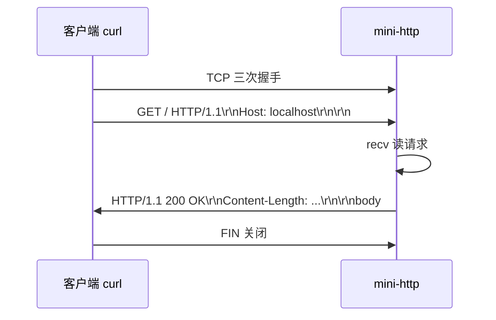
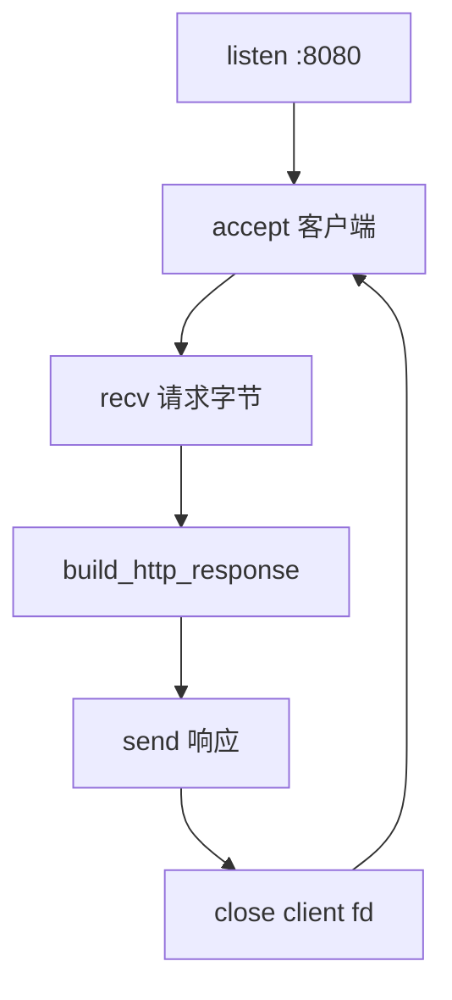

# 网络编程与简易 HTTP 服务

> **文件编码**：UTF-8。socket 示例默认 C++17；Windows 需链接 `ws2_32`。

---

## 本章与上一章的关系

[09 CMake](09-CMake与项目工程化.md) 已能构建多文件工程。业务后端本质是 **网络程序**：监听端口、读写字节流、按 HTTP 格式回响应。

本章在 TCP 之上实现 **简易 HTTP 服务端**（非完整 Web 服务器）：理解 socket 生命周期、HTTP 报文结构，并与 [计算机网络系列](../../前端学习/计算机网络/00-学习路线图与说明.md) 理论对照。

| 上一章（09） | 本章（10） | 下一章（11） |
|--------------|------------|--------------|
| hello-cmake 构建 | mini-http 监听 8080 | 日志写文件、读配置 |
| 链接 ws2_32 | GET 返回 200 + HTML | Linux 文件 IO |
| 本地 exe | curl / 浏览器访问 | 进程与信号 |

**计网对照**（建议先读或并行；完整索引见 [计算机网络 00 路线图](../../前端学习/计算机网络/00-学习路线图与说明.md)）：

| C++ 本章 | 计网文档 | 本章实践 |
|----------|----------|----------|
| TCP 连接 | [02 TCP 与 UDP](../../前端学习/计算机网络/02-TCP与UDP.md) | socket/bind/listen/accept |
| 端口、IP | [03 IP 与 DNS](../../前端学习/计算机网络/03-IP地址与DNS解析.md) | `INADDR_ANY`、`htons` |
| 分层模型 | [01 网络分层与通信基础](../../前端学习/计算机网络/01-网络分层与通信基础.md) | HTTP 在应用层 |
| HTTP 报文 | [04 HTTP 协议深入](../../前端学习/计算机网络/04-HTTP协议深入.md) | 请求行/头/体解析 |
| HTTPS | [05 HTTPS 与 TLS](../../前端学习/计算机网络/05-HTTPS与TLS加密.md) | 本章不做 TLS |
| 缓存 Cookie | [06 缓存 Cookie CORS](../../前端学习/计算机网络/06-缓存Cookie与会话机制.md) | 可加 Set-Cookie 练习 |
| 面试总表 | [07 面试专题与知识点总表](../../前端学习/计算机网络/07-面试专题与知识点总表.md) | 对照 14 章 C++ 面试 |

> **学习顺序建议**：先读计网 [02 TCP](../../前端学习/计算机网络/02-TCP与UDP.md) + [04 HTTP](../../前端学习/计算机网络/04-HTTP协议深入.md)，再写本章 mini-http，理论与实践互证。



---

## 1. 网络编程在 C++ 中的位置

- **系统 API**：Berkeley Socket（Windows Winsock2 / Linux POSIX socket）
- **标准库**：C++ 无内置 socket，需 `<sys/socket.h>`（Linux）或 `<winsock2.h>`（Windows）
- **第三方**：Boost.Asio、libevent（生产常用）；本章用原生 API 打基础

**深入解释**：HTTP 是 **应用层协议**，底下依赖 TCP 的可靠字节流。你写的不是「HTTP 库」，而是往 TCP 连接里写入符合 RFC 格式的文本。

---

## 2. TCP Socket 核心流程

```text
socket() → bind() → listen() → accept() → recv/send → close()
```

| 步骤 | 作用 |
|------|------|
| socket | 创建套接字 fd |
| bind | 绑定 IP:端口 |
| listen | 进入监听队列 |
| accept | 阻塞等待客户端，返回新 fd |
| recv/send | 读写数据 |
| close | 释放连接 |

客户端：`socket → connect → send/recv → close`。

---

## 3. 跨平台头文件与初始化

### 3.1 Windows（Winsock2）

```cpp
#ifdef _WIN32
#define WIN32_LEAN_AND_MEAN
#include <winsock2.h>
#include <ws2tcpip.h>
#pragma comment(lib, "ws2_32.lib")
using socklen_t = int;
#define close closesocket
#else
#include <sys/socket.h>
#include <netinet/in.h>
#include <unistd.h>
#endif
```

Windows 程序入口前需：

```cpp
#ifdef _WIN32
    WSADATA wsa;
    if (WSAStartup(MAKEWORD(2, 2), &wsa) != 0) return 1;
#endif
// ... 结束时 WSACleanup();
```

### 3.2 CMakeLists.txt

```cmake
add_executable(mini_http src/main.cpp src/http_server.cpp)
if(WIN32)
    target_link_libraries(mini_http PRIVATE ws2_32)
endif()
```

---

## 3.1 手把手：mini-http 从 echo 到 HTTP 200

> 在 [09 hello-cmake](09-CMake与项目工程化.md) 同级新建 `mini-http` 目录。

### 阶段 A：TCP Echo（验证连通）

`src/echo_server.cpp` 核心逻辑：

```cpp
#include <iostream>
#include <cstring>
// ... 平台头文件见 §3.1

int main() {
#ifdef _WIN32
    WSADATA wsa;
    WSAStartup(MAKEWORD(2, 2), &wsa);
#endif
    int server_fd = socket(AF_INET, SOCK_STREAM, 0);
    sockaddr_in addr{};
    addr.sin_family = AF_INET;
    addr.sin_addr.s_addr = INADDR_ANY;
    addr.sin_port = htons(8080);

    bind(server_fd, reinterpret_cast<sockaddr*>(&addr), sizeof(addr));
    listen(server_fd, 8);
    std::cout << "echo listening :8080\n";

    sockaddr_in client{};
    socklen_t len = sizeof(client);
    int client_fd = accept(server_fd, reinterpret_cast<sockaddr*>(&client), &len);

    char buf[1024]{};
    int n = recv(client_fd, buf, sizeof(buf) - 1, 0);
    if (n > 0) send(client_fd, buf, n, 0);

    close(client_fd);
    close(server_fd);
#ifdef _WIN32
    WSACleanup();
#endif
    return 0;
}
```

**测试（PowerShell）**：

```powershell
cd f:\study\mini-http
cmake -S . -B build
cmake --build build --config Release
Start-Process .\build\Release\mini_http.exe
# 另开终端：
curl.exe http://127.0.0.1:8080 -d "hello"
# 预期：hello
```

**测试（WSL）**：

```bash
./build/mini_http &
curl http://127.0.0.1:8080 -d hello
# 预期：hello
```

### 阶段 B：构造 HTTP 响应

HTTP 响应 = **状态行 + 头 + 空行 + 体**：

```http
HTTP/1.1 200 OK\r\n
Content-Type: text/html; charset=utf-8\r\n
Content-Length: 39\r\n
Connection: close\r\n
\r\n
<html><body><h1>Hello mini-http</h1></body></html>
```

`include/http_response.h`：

```cpp
#pragma once
#include <string>

std::string build_http_response(int status_code,
                                const std::string& status_text,
                                const std::string& content_type,
                                const std::string& body);
```

`src/http_response.cpp`：

```cpp
#include "http_response.h"
#include <sstream>

std::string build_http_response(int status_code,
                                const std::string& status_text,
                                const std::string& content_type,
                                const std::string& body) {
    std::ostringstream oss;
    oss << "HTTP/1.1 " << status_code << " " << status_text << "\r\n";
    oss << "Content-Type: " << content_type << "\r\n";
    oss << "Content-Length: " << body.size() << "\r\n";
    oss << "Connection: close\r\n";
    oss << "\r\n";
    oss << body;
    return oss.str();
}
```

### 阶段 C：完整 mini-http main

```cpp
#include "http_response.h"
// socket 头文件 ...

int main() {
#ifdef _WIN32
    WSADATA wsa;
    WSAStartup(MAKEWORD(2, 2), &wsa);
#endif
    const int port = 8080;
    int server_fd = socket(AF_INET, SOCK_STREAM, 0);
    int opt = 1;
    setsockopt(server_fd, SOL_SOCKET, SO_REUSEADDR,
               reinterpret_cast<char*>(&opt), sizeof(opt));

    sockaddr_in addr{};
    addr.sin_family = AF_INET;
    addr.sin_addr.s_addr = INADDR_ANY;
    addr.sin_port = htons(port);
    bind(server_fd, reinterpret_cast<sockaddr*>(&addr), sizeof(addr));
    listen(server_fd, 8);
    std::cout << "HTTP server http://127.0.0.1:" << port << "\n";

    for (;;) {
        int client_fd = accept(server_fd, nullptr, nullptr);
        if (client_fd < 0) continue;

        char buf[4096]{};
        recv(client_fd, buf, sizeof(buf) - 1, 0);
        // 简易：不解析路径，一律 200

        std::string body = "<html><body><h1>Hello mini-http</h1></body></html>";
        std::string resp = build_http_response(200, "OK", "text/html; charset=utf-8", body);
        send(client_fd, resp.c_str(), static_cast<int>(resp.size()), 0);
        close(client_fd);
    }
    // 不可达
}
```

**验证**：

```powershell
curl.exe -v http://127.0.0.1:8080/
```

**预期片段**：

```text
< HTTP/1.1 200 OK
< Content-Type: text/html; charset=utf-8
< Content-Length: 39
...
<h1>Hello mini-http</h1>
```

浏览器打开 `http://127.0.0.1:8080/` 应看到标题。



---

## 4.1 HTTP 请求与响应解析基础（完整模块）

对照 [计网 04 HTTP 协议深入](../../前端学习/计算机网络/04-HTTP协议深入.md)：HTTP 报文是 **纯文本**，`\r\n` 分行，头与体之间有空行。

### 4.1.1 请求报文结构

```http
GET /api/ping HTTP/1.1\r\n
Host: 127.0.0.1:8080\r\n
User-Agent: curl/8.0\r\n
Accept: */*\r\n
\r\n
```

POST 带 body 时还有 `Content-Length` 头，body 紧跟空行后。

### 4.1.2 `include/http_request.h`

```cpp
#pragma once
#include <string>
#include <unordered_map>

struct HttpRequest {
    std::string method;
    std::string path;
    std::string version;
    std::unordered_map<std::string, std::string> headers;
    std::string body;
};

// 从 recv 缓冲区解析；若数据不完整返回 false
bool parse_http_request(const std::string& raw, HttpRequest& out);
std::string get_header(const HttpRequest& req, const std::string& key);
```

### 4.1.3 `src/http_request.cpp`

```cpp
#include "http_request.h"
#include <sstream>
#include <algorithm>

static std::string trim(std::string s) {
    auto not_space = [](unsigned char c) { return !std::isspace(c); };
    s.erase(s.begin(), std::find_if(s.begin(), s.end(), not_space));
    s.erase(std::find_if(s.rbegin(), s.rend(), not_space).base(), s.end());
    return s;
}

static std::string to_lower(std::string s) {
    for (char& c : s) c = static_cast<char>(std::tolower(static_cast<unsigned char>(c)));
    return s;
}

bool parse_http_request(const std::string& raw, HttpRequest& out) {
    auto header_end = raw.find("\r\n\r\n");
    if (header_end == std::string::npos) return false;

    std::string header_part = raw.substr(0, header_end);
    out.body = raw.substr(header_end + 4);

    std::istringstream iss(header_part);
    std::string line;
    if (!std::getline(iss, line)) return false;
    if (!line.empty() && line.back() == '\r') line.pop_back();

    std::istringstream first(line);
    if (!(first >> out.method >> out.path >> out.version)) return false;

    out.headers.clear();
    while (std::getline(iss, line)) {
        if (!line.empty() && line.back() == '\r') line.pop_back();
        if (line.empty()) break;
        auto colon = line.find(':');
        if (colon == std::string::npos) continue;
        std::string key = trim(line.substr(0, colon));
        std::string val = trim(line.substr(colon + 1));
        out.headers[to_lower(key)] = val;
    }

    // POST：若 Content-Length 有值，body 可能还需更多 recv（生产要循环读）
    auto it = out.headers.find("content-length");
    if (it != out.headers.end()) {
        std::size_t len = static_cast<std::size_t>(std::stoul(it->second));
        if (out.body.size() < len) return false;  // 不完整
        out.body = out.body.substr(0, len);
    }
    return true;
}

std::string get_header(const HttpRequest& req, const std::string& key) {
    auto it = req.headers.find(to_lower(key));
    return it == req.headers.end() ? "" : it->second;
}
```

### 4.1.4 响应解析（客户端 / 自测用）

用 curl 测自己的 server 时，也可用同样逻辑解析 **响应**：

```cpp
// include/http_response.h 追加
struct HttpResponse {
    int status_code = 0;
    std::string status_text;
    std::unordered_map<std::string, std::string> headers;
    std::string body;
};

bool parse_http_response(const std::string& raw, HttpResponse& out);
```

```cpp
// src/http_response.cpp 追加
bool parse_http_response(const std::string& raw, HttpResponse& out) {
    auto header_end = raw.find("\r\n\r\n");
    if (header_end == std::string::npos) return false;

    std::string header_part = raw.substr(0, header_end);
    out.body = raw.substr(header_end + 4);

    std::istringstream iss(header_part);
    std::string line;
    if (!std::getline(iss, line)) return false;
    if (!line.empty() && line.back() == '\r') line.pop_back();

    // HTTP/1.1 200 OK
    std::istringstream status_line(line);
    std::string http_version;
    status_line >> http_version >> out.status_code;
    std::getline(status_line, out.status_text);
    if (!out.status_text.empty() && out.status_text[0] == ' ')
        out.status_text.erase(0, 1);

    out.headers.clear();
    while (std::getline(iss, line)) {
        if (!line.empty() && line.back() == '\r') line.pop_back();
        if (line.empty()) break;
        auto colon = line.find(':');
        if (colon == std::string::npos) continue;
        std::string key = trim(line.substr(0, colon));
        std::string val = trim(line.substr(colon + 1));
        out.headers[to_lower(key)] = val;
    }

    auto it = out.headers.find("content-length");
    if (it != out.headers.end()) {
        std::size_t len = static_cast<std::size_t>(std::stoul(it->second));
        if (out.body.size() < len) return false;
        out.body = out.body.substr(0, len);
    }
    return true;
}
```

**自测**：写 `http_client.cpp` 连 8080，`recv` 全文后 `parse_http_response`，断言 `status_code == 200`。

---

## 4.2 完整 mini-http 源码（文档内可编译）

> CMake 见 [09 章 §5.7](09-CMake与项目工程化.md)。下列为 **单线程、带路由** 的完整实现。

### 4.2.1 目录

```text
mini-http/
├── CMakeLists.txt          # 见 09 章
├── include/
│   ├── http_request.h
│   ├── http_response.h
│   └── platform_socket.h
├── src/
│   ├── main.cpp
│   ├── http_request.cpp
│   ├── http_response.cpp
│   └── http_server.cpp
├── static/
│   └── index.html
└── config/
    └── server.conf
```

### 4.2.2 `include/platform_socket.h`

```cpp
#pragma once

#ifdef _WIN32
#define WIN32_LEAN_AND_MEAN
#include <winsock2.h>
#include <ws2tcpip.h>
#pragma comment(lib, "ws2_32.lib")
using socklen_t = int;
#define close_socket closesocket
#else
#include <sys/socket.h>
#include <netinet/in.h>
#include <arpa/inet.h>
#include <unistd.h>
#define close_socket close
#endif

inline bool socket_platform_init() {
#ifdef _WIN32
    WSADATA wsa{};
    return WSAStartup(MAKEWORD(2, 2), &wsa) == 0;
#else
    return true;
#endif
}

inline void socket_platform_cleanup() {
#ifdef _WIN32
    WSACleanup();
#endif
}
```

### 4.2.3 `include/http_response.h`（构建响应）

```cpp
#pragma once
#include <string>
#include <unordered_map>

struct HttpResponse {
    int status_code = 0;
    std::string status_text;
    std::unordered_map<std::string, std::string> headers;
    std::string body;
};

std::string build_http_response(int status_code,
                                const std::string& status_text,
                                const std::string& content_type,
                                const std::string& body);

std::string serialize_response(const HttpResponse& resp);
bool parse_http_response(const std::string& raw, HttpResponse& out);
```

### 4.2.4 `src/http_response.cpp`（build + serialize + parse）

```cpp
#include "http_response.h"
#include <sstream>
#include <algorithm>
#include <cctype>

static std::string trim(std::string s) {
    auto not_space = [](unsigned char c) { return !std::isspace(c); };
    s.erase(s.begin(), std::find_if(s.begin(), s.end(), not_space));
    s.erase(std::find_if(s.rbegin(), s.rend(), not_space).base(), s.end());
    return s;
}

static std::string to_lower(std::string s) {
    for (char& c : s) c = static_cast<char>(std::tolower(static_cast<unsigned char>(c)));
    return s;
}

std::string build_http_response(int status_code,
                                const std::string& status_text,
                                const std::string& content_type,
                                const std::string& body) {
    HttpResponse r;
    r.status_code = status_code;
    r.status_text = status_text;
    r.body = body;
    r.headers["content-type"] = content_type;
    r.headers["content-length"] = std::to_string(body.size());
    r.headers["connection"] = "close";
    return serialize_response(r);
}

std::string serialize_response(const HttpResponse& resp) {
    std::ostringstream oss;
    oss << "HTTP/1.1 " << resp.status_code << " " << resp.status_text << "\r\n";
    for (const auto& [k, v] : resp.headers) {
        oss << k << ": " << v << "\r\n";
    }
    oss << "\r\n" << resp.body;
    return oss.str();
}

bool parse_http_response(const std::string& raw, HttpResponse& out) {
    auto header_end = raw.find("\r\n\r\n");
    if (header_end == std::string::npos) return false;
    std::string header_part = raw.substr(0, header_end);
    out.body = raw.substr(header_end + 4);

    std::istringstream iss(header_part);
    std::string line;
    if (!std::getline(iss, line)) return false;
    if (!line.empty() && line.back() == '\r') line.pop_back();

    std::istringstream status_line(line);
    std::string http_version;
    status_line >> http_version >> out.status_code;
    std::getline(status_line, out.status_text);
    if (!out.status_text.empty() && out.status_text[0] == ' ')
        out.status_text.erase(0, 1);

    out.headers.clear();
    while (std::getline(iss, line)) {
        if (!line.empty() && line.back() == '\r') line.pop_back();
        if (line.empty()) break;
        auto colon = line.find(':');
        if (colon == std::string::npos) continue;
        out.headers[to_lower(trim(line.substr(0, colon)))] =
            trim(line.substr(colon + 1));
    }
    auto it = out.headers.find("content-length");
    if (it != out.headers.end()) {
        std::size_t len = static_cast<std::size_t>(std::stoul(it->second));
        if (out.body.size() < len) return false;
        out.body = out.body.substr(0, len);
    }
    return true;
}
```

### 4.2.5 `src/http_server.cpp`

```cpp
#include "platform_socket.h"
#include "http_request.h"
#include "http_response.h"
#include <cstring>
#include <iostream>
#include <fstream>
#include <sstream>

static std::string read_file_or_empty(const std::string& path) {
    std::ifstream ifs(path, std::ios::binary);
    if (!ifs) return {};
    std::ostringstream oss;
    oss << ifs.rdbuf();
    return oss.str();
}

static void handle_client(int client_fd) {
    char buf[8192]{};
    int n = recv(client_fd, buf, sizeof(buf) - 1, 0);
    if (n <= 0) return;
    std::string raw(buf, buf + n);

    HttpRequest req;
    if (!parse_http_request(raw, req)) {
        std::string resp = build_http_response(400, "Bad Request",
            "text/plain; charset=utf-8", "Bad Request");
        send(client_fd, resp.c_str(), static_cast<int>(resp.size()), 0);
        return;
    }

    std::string body;
    std::string ctype = "text/html; charset=utf-8";
    int code = 200;
    std::string text = "OK";

    if (req.path == "/api/ping") {
        body = R"({"ok":true})";
        ctype = "application/json; charset=utf-8";
    } else if (req.path == "/") {
        body = read_file_or_empty("static/index.html");
        if (body.empty())
            body = "<html><body><h1>Hello mini-http</h1></body></html>";
    } else if (req.method == "POST" && req.path == "/echo") {
        body = req.body;
        ctype = "text/plain; charset=utf-8";
    } else {
        code = 404;
        text = "Not Found";
        body = "Not Found";
        ctype = "text/plain; charset=utf-8";
    }

    std::string resp = build_http_response(code, text, ctype, body);
    send(client_fd, resp.c_str(), static_cast<int>(resp.size()), 0);
}

bool run_http_server(int port) {
    int server_fd = socket(AF_INET, SOCK_STREAM, 0);
    if (server_fd < 0) return false;

    int opt = 1;
    setsockopt(server_fd, SOL_SOCKET, SO_REUSEADDR,
               reinterpret_cast<char*>(&opt), sizeof(opt));

    sockaddr_in addr{};
    addr.sin_family = AF_INET;
    addr.sin_addr.s_addr = INADDR_ANY;
    addr.sin_port = htons(static_cast<uint16_t>(port));

    if (bind(server_fd, reinterpret_cast<sockaddr*>(&addr), sizeof(addr)) < 0) {
        close_socket(server_fd);
        return false;
    }
    if (listen(server_fd, 16) < 0) {
        close_socket(server_fd);
        return false;
    }

    std::cout << "HTTP http://127.0.0.1:" << port << "\n";

    for (;;) {
        int client_fd = accept(server_fd, nullptr, nullptr);
        if (client_fd < 0) continue;
        handle_client(client_fd);
        close_socket(client_fd);
    }
}
```

### 4.2.6 `src/main.cpp`

```cpp
#include "platform_socket.h"

bool run_http_server(int port);

int main() {
    if (!socket_platform_init()) return 1;
    const int port = 8080;
    run_http_server(port);  // 不返回
    socket_platform_cleanup();
    return 0;
}
```

### 4.2.7 验证命令

```powershell
curl.exe -v http://127.0.0.1:8080/
curl.exe http://127.0.0.1:8080/api/ping
curl.exe -X POST http://127.0.0.1:8080/echo -d "hello body"
```

---

## 5. 简易解析 GET 路径（进阶）

只取第一行 `GET /path HTTP/1.1`：

```cpp
#include <sstream>
#include <string>

std::string parse_path(const char* request) {
    std::istringstream iss(request);
    std::string method, path, version;
    iss >> method >> path >> version;
    return path;
}
```

根据 `path` 返回不同 body 或 404：

```cpp
std::string path = parse_path(buf);
if (path == "/api/ping") {
    body = R"({"ok":true})";
    content_type = "application/json; charset=utf-8";
} else if (path != "/") {
    body = "Not Found";
    resp = build_http_response(404, "Not Found", "text/plain", body);
}
```

---

## 6. 单线程 vs 多客户端

| 模型 | 优点 | 缺点 |
|------|------|------|
| 单线程循环 accept | 简单 | 一个慢客户端阻塞全体 |
| 每连接一线程 | 易写 | 线程多开销大 |
| select/poll/epoll | 高并发 | 代码复杂（见 08 章延伸） |

练习挑战：用 `select` 同时监听多个 fd（Windows 也支持 select）。

---

## 7. 与前端 / 计网联调

- Vue/React [Axios 联调](../../前端学习/Vue/08-Axios网络请求与前后端联调.md) 改 `baseURL` 为 `http://127.0.0.1:8080` 可测 CORS——本章未加 CORS 头，浏览器跨域会失败；**curl 或同域页面**可测。
- 加 CORS 头示例：`Access-Control-Allow-Origin: *`（仅学习用）。

---

## 8. 常见报错与排查

| 现象 | 原因 | 解决 |
|------|------|------|
| `bind: Address already in use` | 端口被占 | `SO_REUSEADDR`；换端口；杀旧进程 |
| Windows `WSAStartup failed` | 未初始化 Winsock | 入口调用 `WSAStartup` |
| `undefined reference to __imp_socket` | 未链 ws2_32 | CMake `target_link_libraries(... ws2_32)` |
| curl 一直等待 | 未 send 或未 close | 发完响应 close client fd |
| 浏览器乱码 | 未声明 charset | `Content-Type: ...; charset=utf-8` |
| 响应被截断 | Content-Length 错误 | 用 `body.size()` 字节数，非字符数 |
| accept 返回 -1 | signal 中断 / 资源耗尽 | 检查 fd 泄漏，循环里是否 close |
| WSL Windows 互访不通 | 防火墙 / 监听地址 | 监听 `0.0.0.0`，查 Windows 防火墙 |
| HTTPS 失败 | 本章仅 HTTP | 需 TLS 库（OpenSSL），见计网 05 |
| recv 返回 0 | 对端关闭 | 正常，结束读循环 |
| `parse_http_request` 一直 false | 请求未收全 | 循环 recv 直到 `\r\n\r\n` 或 Content-Length 满足 |
| 400 Bad Request | 首行 malformed | 检查 method/path/version 三字段 |
| header 大小写 | HTTP 头 case-insensitive | 统一 to_lower 存 map |
| POST body 截断 | 只 recv 一次 | 按 Content-Length 多读几轮 |
| `stoul` 异常 | Content-Length 非数字 | try/catch 返回 400 |
| Keep-Alive 卡住 | 未实现持久连接 | 响应加 `Connection: close` |
| 中文 body 乱码 | 字节≠字符 | Content-Length 用 UTF-8 **字节**长度 |
| 路径带 query | `/search?q=1` | 需再 split `?`（练习） |
| 超大 header | 慢loris | 生产限 header 大小 |

---

## 9. 练习建议

### 基础

1. 实现 `/api/ping` 返回 JSON `{"ok":true}`。
2. 未知路径返回 404 + 纯文本 body。

### 进阶

3. 解析 `Host` 头，日志打印客户端请求第一行。
4. 读本地 `static/index.html` 作为 `/` 的 body（为 11 章文件 IO 铺垫）。

### 挑战

5. 用 `select` 支持 3 个客户端同时连接。
6. 增加 `POST /echo`：body 原样返回（需读 Content-Length）。

### 计网联动

7. 对照 [计网 04](../../前端学习/计算机网络/04-HTTP协议深入.md) 画出请求/响应报文，与本章 `parse_http_request` 字段一一对应。
8. 读 [计网 02 三次握手](../../前端学习/计算机网络/02-TCP与UDP.md)，用 `ss -tan` 观察 `LISTEN` / `ESTAB` 状态。
9. 写单元测试：给定 raw 字符串，断言 `parse_http_response` 的 status 与 body。

### 08 章联动

10. 用 [08 章 ThreadPool](../C++/08-多线程与并发编程.md) 包装 `handle_client`，对比单线程 QPS（ab 压测）。

---

## 10. 参考答案

### 基础 1：/api/ping

```cpp
if (path == "/api/ping") {
    body = R"({"ok":true})";
    resp = build_http_response(200, "OK", "application/json; charset=utf-8", body);
}
```

### 基础 2：404

```cpp
else if (path != "/") {
    resp = build_http_response(404, "Not Found", "text/plain; charset=utf-8", "Not Found");
}
```

### 进阶 4：读 index.html

```cpp
#include <fstream>
#include <sstream>

std::string read_file(const std::string& path) {
    std::ifstream ifs(path);
    std::ostringstream oss;
    oss << ifs.rdbuf();
    return oss.str();
}
// body = read_file("static/index.html");
```

### 挑战 5：select 伪代码

```cpp
fd_set readfds;
FD_ZERO(&readfds);
FD_SET(server_fd, &readfds);
// 循环 FD_SET 各 client，select 后处理可读 fd
```

---

## 11. 学完标准

- [ ] 能口述 TCP 服务端 socket 流程（对照计网三次握手）
- [ ] 独立写出返回 HTTP/1.1 200 的最小 server
- [ ] 会用 curl -v 看响应头与 Content-Length
- [ ] CMake 在 Windows 正确链接 ws2_32
- [ ] 知道单线程 server 的局限与 select 方向

---

## 下一章预告

mini-http 需要写日志、读配置——涉及 **文件 IO 与 Linux 系统调用**。[11 Linux 与系统编程入门](11-Linux与系统编程入门.md) 在 WSL 上继续演进项目；12 章对其做性能分析与内存排查。

---

*下一章：11 Linux 与系统编程入门*
