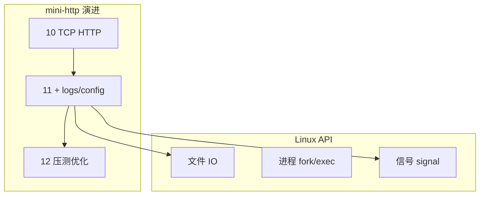
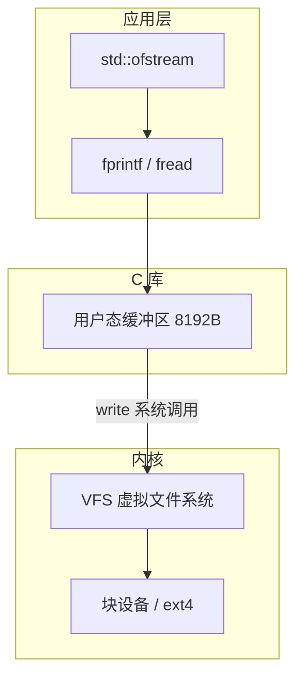
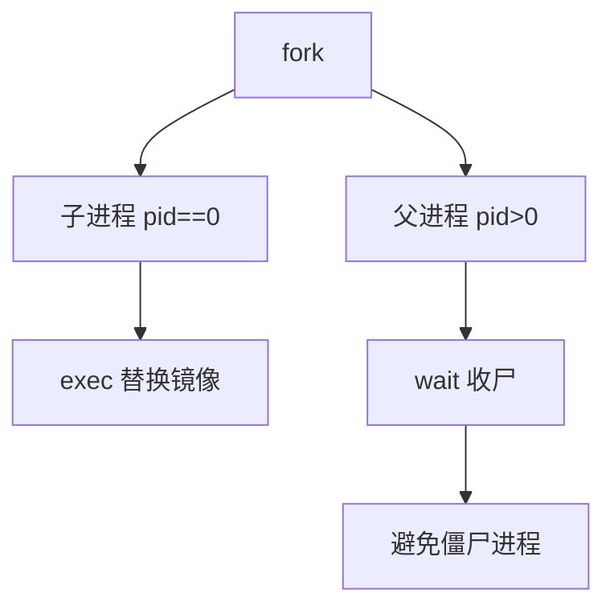
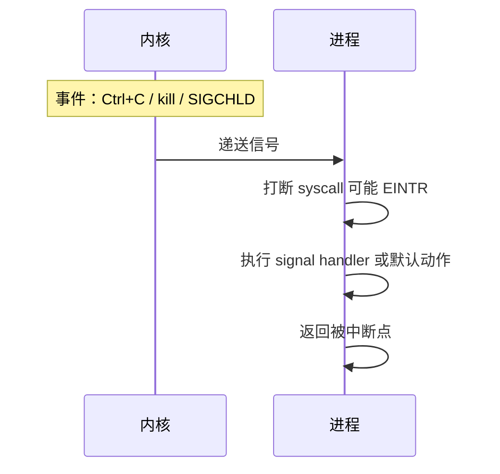
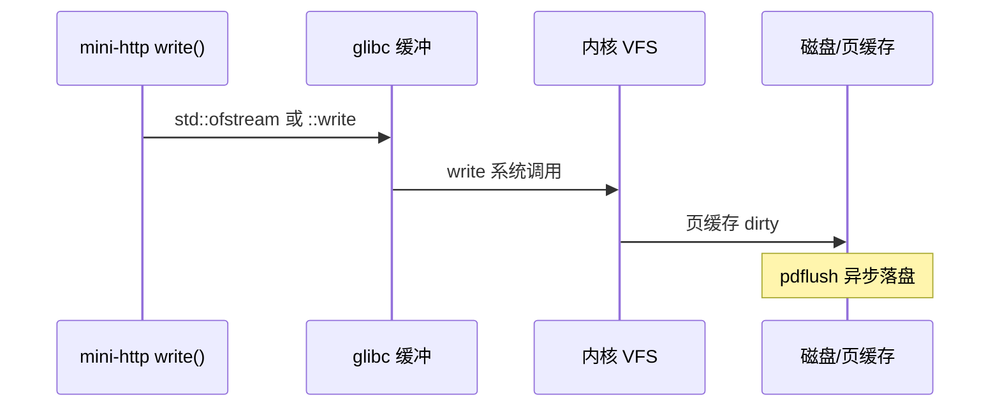

# Linux 与系统编程入门

> **文件编码**：UTF-8。本章示例以 **WSL2 / Linux** 为主；Windows 本地用 PowerShell 对照命令。

---

## 本章与上一章的关系

[10 章 mini-http](10-网络编程与简易HTTP服务.md) 在 Windows 上能 curl 通，但生产 C++ 服务多跑在 **Linux**：日志落盘、读配置、fork 子进程、信号优雅退出、文件权限——这些都属于 **系统编程**。

本章补 Linux 用户态 API 入门，并把 mini-http 加上 **日志文件** 与 **简单配置**；为 [12 性能分析](12-性能分析与调试.md) 提供可压测、可 strace 的目标程序。

| 上一章（10） | 本章（11） | 下一章（12） |
|--------------|------------|--------------|
| socket HTTP | open/read/write 日志 | Valgrind 查泄漏 |
| 单目录 exe | config.txt 读端口 | perf 看热点 |
| Winsock | POSIX API 对照 | 优化 mini-http |



**环境建议**：Windows 用户安装 WSL2（Ubuntu），与 [Python 09 Linux](../Python/09-LinuxDockerNginx部署基础.md) / [Java 09](../Java/09-LinuxDockerNginx部署基础.md) 共用同一套命令习惯。下文 **§1.1 WSL2 安装与 C++ 工具链** 给出从零到能编译 mini-http 的步骤。

---

## 0. 读前导读（零基础也能跟上）

### 0.1 用一句话弄懂本章

生产 C++ 服务跑在 **Linux** 上：你要会用文件写日志、读配置、处理 **SIGTERM 优雅退出**，并用 `tail`/`grep`/`ss` 排查问题——本章把这些接到 mini-http 上。

### 0.2 你需要提前知道什么

| 状态 | 动作 |
|------|------|
| 10 章 mini-http 能 curl | 直接跟 §5 日志与信号 |
| 没装 WSL | 先完成 §1.1 安装 Ubuntu |
| 只会 Windows PowerShell | 本章命令在 WSL bash 执行 |
| 想部署到云服务器 | 与 [Linux 系列](../Linux/00-学习路线图与说明.md) 并行 |

### 0.3 本章知识地图（学完后应能勾选全部 ☐→☑）

- ☐ 在 WSL 安装 g++/cmake 并成功编译 mini-http
- ☐ 用 `ofstream` 追加写 `logs/app.log`
- ☐ 从 `config/server.conf` 读取 port
- ☐ 理解 SIGTERM + `atomic<bool>` 优雅退出
- ☐ 知道 `errno`/`perror` 查系统调用失败原因
- ☐ 会用 `tail -f`、`grep`、`ss -tlnp` 排查
- ☐ 理解 fd 泄漏与 `ulimit -n`
- ☐ 知道 fork 在 Windows 不可用

### 0.4 建议学习时长与节奏

| 阶段 | 时长 | 内容 |
|------|------|------|
| §1.1 WSL 环境 | 45 min | 一次性投入 |
| §2～§4 文件 IO | 40 min | 日志 + 配置 |
| §5 信号优雅退出 | 50 min | §5.2 完整 demo |
| 报错表 + 闭卷自测 | 30 min | ≥7/10 进 12 章 |

### 0.5 学完本章你能做什么（可验证的具体动作）

1. WSL 内 `./build/mini_http` 后 `tail -f logs/app.log` 看到请求日志
2. `kill -15 <pid>` 后日志出现 shutdown 行
3. 改 `server.conf` 端口后服务监听新端口
4. 用 `ss -tlnp | grep 8080` 确认进程在监听

**术语（文件描述符 fd）**：内核给每个打开文件/socket 的**整数编号**；像酒店房间号，泄漏就是「占了房不退」。
**生活类比**：日志文件像**飞行黑匣子**；配置像**遥控器上的频道号**——改数字就换台。
**为什么重要**：线上排障 80% 靠日志 + 系统命令；不会 Linux 无法做 C++ 后端运维。
**本章用到的地方**：§5 日志、§5.2 信号、§6 fd、§8 errno 表。

---

## 1.1 WSL2 安装与 C++ 工具链（完整指南）

### 1.1.1 启用 WSL2（Windows 10/11）

**PowerShell（管理员）**：

```powershell
wsl --install -d Ubuntu
# 若已装过 WSL1，升级：
wsl --set-default-version 2
wsl --update
```

重启后打开 **Ubuntu**，创建 Linux 用户名与密码。

验证：

```powershell
wsl --list --verbose
# NAME      STATE   VERSION
# Ubuntu    Running 2
```

### 1.1.2 在 WSL 内安装构建工具

```bash
sudo apt update
sudo apt install -y build-essential cmake ninja-build gdb git curl
g++ --version    # 建议 GCC 11+
cmake --version  # 建议 3.16+
```

### 1.1.3 项目放哪：性能与路径

| 位置 | 路径示例 | 说明 |
|------|----------|------|
| **推荐** Linux 家目录 | `~/projects/mini-http` | ext4，编译与 IO 快 |
| 可访问 Windows 盘 | `/mnt/f/study/mini-http` | 跨系统方便，**大项目编译慢** |
| VS Code Remote | Remote-WSL 打开 `~/projects` | 编辑体验最佳 |

```bash
mkdir -p ~/projects
cp -r /mnt/f/study/mini-http ~/projects/ 2>/dev/null || true
cd ~/projects/mini-http
```

### 1.1.4 从 Windows 访问 WSL 服务

WSL2 与 Windows **网络互通**：WSL 里 `listen 0.0.0.0:8080`，Windows 浏览器访问 `http://127.0.0.1:8080/` 通常可达。若不通：

```powershell
# Windows 防火墙入站规则（管理员，按需）
New-NetFirewallRule -DisplayName "WSL mini-http" -Direction Inbound -LocalPort 8080 -Protocol TCP -Action Allow
```

### 1.1.5 VS Code / Cursor 联调

1. 安装扩展 **WSL**
2. 在 WSL 终端：`cd ~/projects/mini-http && code .`
3. `CMake: Configure` + `CMake: Build`，或终端 `cmake -S . -B build && cmake --build build`

### 1.1.6 常用 WSL 管理命令（Windows 侧）

```powershell
wsl -d Ubuntu                    # 进入默认发行版
wsl --shutdown                 # 关闭所有 WSL VM（释放内存）
wsl --export Ubuntu D:\backup\ubuntu.tar
wsl --import Ubuntu D:\WSL\Ubuntu D:\backup\ubuntu.tar
```

### 1.1.7 与计网 / 前端联调

WSL 内 `curl` 测 HTTP；浏览器在 Windows。理论复习走 [计算机网络目录](../../前端学习/计算机网络/00-学习路线图与说明.md)。

### 1.1.8 WSL 安装手把手步骤表（扩充）

| 步骤 | 你的动作 | 预期看到什么 | 若不对 |
|------|----------|--------------|--------|
| 1 | 管理员 `wsl --install -d Ubuntu` | 提示重启 | BIOS 开 VT-x；启用 Windows 功能 |
| 2 | 首次 Ubuntu 设用户名密码 | 进入 bash | Store 安装 Ubuntu |
| 3 | `wsl --list --verbose` | VERSION **2** | `wsl --set-version Ubuntu 2` |
| 4 | `sudo apt install -y build-essential cmake gdb` | 无 ERROR | 换 apt 镜像 |
| 5 | `~/projects` 编译 mini-http | exe 可运行 | [09 §8](09-CMake与项目工程化.md) |
| 6 | `curl localhost:8080` + `tail logs/app.log` | 有访问记录 | WorkingDirectory 错 |

### 1.1.9 逐行读：`write_log` 与配置读取

| 代码段 | 含义 | 改错会怎样 |
|--------|------|------------|
| `ofstream(..., ios::app)` | 日志**追加** | 覆盖旧日志 |
| `ofs.flush()` | 立刻刷盘 | 崩溃丢最后一行 |
| `localtime_r` | 线程安全时间 | MSVC 改 `localtime_s` |
| 读 `port=` 行 | 键值配置 | 路径相对 cwd |
| `stoi` 解析 port | 字符串→整数 | 非数字抛异常→应用崩溃 |

### 1.1.10 命令预期输出（排障剧本）

```bash
# 端口占用
ss -tlnp | grep 8080
# LISTEN ... mini_http

# fd 数量
ls /proc/$(pgrep mini_http)/fd | wc -l
# 应随连接关闭而回落，不应单调涨

# 优雅退出
kill -15 $(pgrep mini_http); tail -1 logs/app.log
# ... shutdown ...

# 权限
touch logs/test && rm logs/test || echo "logs not writable"
```

**术语（errno）**：系统调用失败时设置的全局错误码；用 `strerror(errno)` 人类可读。
**生活类比**：像 ATM 吐钞失败时的**错误码 E123**——柜员查手册知原因。
**为什么重要**：`bind`/`accept`/`open` 失败必查 errno；§8 表与 12 章 strace 互证。
**本章用到的地方**：§8.1 errno 表、§5.2 accept EINTR。

---

## 1.2 为什么 C++ 后端要懂 Linux

| 场景 | 需要的能力 |
|------|------------|
| 服务器部署 | ssh、systemd、看日志 |
| 高性能服务 | epoll、零拷贝（进阶） |
| 排查线上 | strace、lsof、core dump |
| 与 Java/Python 对照 | 它们 JVM/解释器底下仍是 Linux  syscall |

**深入解释**：C++ 标准库的文件流 `std::fstream` 底层在 Linux 上往往调用 `open/read/write`；理解 syscall 有助于解释「为什么 flush 慢」「为什么磁盘满会写失败」。

---

## 2. Linux 常用命令速查

与部署文档一致，系统编程日常必备：

```bash
# 文件
ls -la
cd /var/log
tail -f mini-http.log
grep "ERROR" mini-http.log | tail -20

# 进程
ps -ef | grep mini_http
ss -tlnp | grep 8080          # 或 netstat -tlnp
kill -15 <pid>                # SIGTERM 优雅退出
kill -9 <pid>                 # 强制（慎用）

# 资源
free -h
df -h
ulimit -a                     # 最大 open files 等

# 跟踪 syscall（12 章也会用）
strace -f ./build/mini_http 2>&1 | head -50
```

### Windows PowerShell 对照

```powershell
Get-Content f:\study\mini-http\logs\app.log -Wait -Tail 20
Get-Process | Where-Object {$_.ProcessName -like "*mini*"}
netstat -ano | findstr :8080
Stop-Process -Id <pid>
```

WSL 内用 bash 命令；Windows 宿主用 PowerShell 管理 WSL：

```powershell
wsl -d Ubuntu
wsl --list --verbose
```

---

## 3. 文件 IO：POSIX 与 C++ 流

### 3.1 POSIX 读写

```cpp
#include <fcntl.h>
#include <unistd.h>
#include <cstring>
#include <iostream>

void write_log_posix(const char* msg) {
    int fd = open("logs/app.log", O_WRONLY | O_CREAT | O_APPEND, 0644);
    if (fd < 0) return;
    write(fd, msg, std::strlen(msg));
    write(fd, "\n", 1);
    close(fd);
}
```

### 3.2 C++17 推荐写法

```cpp
#include <fstream>
#include <chrono>
#include <iomanip>
#include <sstream>

void write_log(const std::string& level, const std::string& msg) {
    auto now = std::chrono::system_clock::now();
    auto t = std::chrono::system_clock::to_time_t(now);
    std::tm tm{};
#ifdef _WIN32
    localtime_s(&tm, &t);
#else
    localtime_r(&t, &tm);
#endif
    std::ostringstream line;
    line << std::put_time(&tm, "%F %T") << " [" << level << "] " << msg;

    std::ofstream ofs("logs/app.log", std::ios::app);
    ofs << line.str() << "\n";
}
```

**为什么用 append 模式**：多线程/多次运行不覆盖旧日志；生产用 rotating file（spdlog）。

---

## 3.1 手把手：mini-http 加日志与配置

### 步骤 1：目录

```bash
cd ~/mini-http   # 或 f:\study\mini-http（WSL 路径 /mnt/f/study/mini-http）
mkdir -p logs config static
```

### 步骤 2：`config/server.conf`

```ini
port=8080
log_level=info
static_dir=static
```

### 步骤 3：简易配置读取 `src/config.cpp`

```cpp
#include "config.h"
#include <fstream>
#include <sstream>
#include <unordered_map>

ServerConfig load_config(const std::string& path) {
    ServerConfig cfg{8080, "info", "static"};
    std::ifstream ifs(path);
    std::string line;
    while (std::getline(ifs, line)) {
        auto pos = line.find('=');
        if (pos == std::string::npos) continue;
        std::string key = line.substr(0, pos);
        std::string val = line.substr(pos + 1);
        if (key == "port") cfg.port = std::stoi(val);
        else if (key == "log_level") cfg.log_level = val;
        else if (key == "static_dir") cfg.static_dir = val;
    }
    return cfg;
}
```

`include/config.h`：

```cpp
#pragma once
#include <string>

struct ServerConfig {
    int port;
    std::string log_level;
    std::string static_dir;
};

ServerConfig load_config(const std::string& path);
```

### 步骤 4：main 中使用

```cpp
#include "config.h"
// write_log 见 §3.2

int main() {
    ServerConfig cfg = load_config("config/server.conf");
    write_log("info", "starting on port " + std::to_string(cfg.port));
    // bind htons(cfg.port) ...
    write_log("info", "accepted connection");
}
```

### 步骤 5：编译运行（WSL）

```bash
cmake -S . -B build -DCMAKE_BUILD_TYPE=Release
cmake --build build
./build/mini_http &
curl http://127.0.0.1:8080/
tail -3 logs/app.log
```

**预期 logs/app.log**：

```text
2026-06-18 10:00:01 [info] starting on port 8080
2026-06-18 10:00:05 [info] accepted connection
```

---

## 4. 进程模型入门

### 4.1 fork / exec（Linux）

```cpp
#include <unistd.h>
#include <sys/wait.h>
#include <iostream>

int main() {
    pid_t pid = fork();
    if (pid == 0) {
        execlp("echo", "echo", "child process", nullptr);
        return 1;
    }
    wait(nullptr);
    std::cout << "parent done\n";
    return 0;
}
```

**注意**：Windows **无 fork**；跨平台服务器用线程（08 章）或独立进程 + IPC。

### 4.2 守护进程概念

生产服务常 `daemonize`：脱离终端、写 pid 文件、由 systemd 管理。学习阶段 `./mini_http &` + `nohup` 即可：

```bash
nohup ./build/mini_http > /dev/null 2>&1 &
echo $! > mini_http.pid
```

---

## 5. 信号与优雅退出

| 信号 | 含义 | 常见处理 |
|------|------|----------|
| SIGINT (2) | Ctrl+C | 停止循环，close socket |
| SIGTERM (15) | kill 默认 | 同上，刷日志 |
| SIGPIPE | 对端关闭仍 write | 忽略或捕获 |
| SIGHUP (1) | 终端断开 | 重载配置（进阶） |

**深入解释**：粗暴 `kill -9` 跳过析构与 flush，可能丢日志；先发 SIGTERM 等待退出。

### 5.1 错误示范：信号处理函数里做复杂逻辑

信号处理函数只能在 **async-signal-safe** 函数（如 `write`、设 flag），不能 `malloc`、`cout`、`mutex`。

### 5.2 完整示例：mini-http 集成信号优雅退出

下列代码将 [10 章 mini-http](10-网络编程与简易HTTP服务.md) 的主循环改为 **可中断 accept**（Linux 用 `accept` 被信号打断返回 -1 + `EINTR`；此处用 `atomic` flag + 非阻塞或短超时简化演示）。

`include/signal_handler.h`：

```cpp
#pragma once
#include <atomic>

extern std::atomic<bool> g_running;

void install_signal_handlers();
```

`src/signal_handler.cpp`：

```cpp
#include "signal_handler.h"
#include <csignal>

std::atomic<bool> g_running{true};

static void on_signal(int signo) {
    (void)signo;
    g_running.store(false, std::memory_order_release);
}

void install_signal_handlers() {
    struct sigaction sa{};
    sa.sa_handler = on_signal;
    sigemptyset(&sa.sa_mask);
    sa.sa_flags = 0;

    sigaction(SIGINT,  &sa, nullptr);
    sigaction(SIGTERM, &sa, nullptr);

    // 忽略 SIGPIPE，避免客户端 abrupt close 时进程被杀
    sa.sa_handler = SIG_IGN;
    sigaction(SIGPIPE, &sa, nullptr);
}
```

`src/main_with_signals.cpp`（Linux / WSL 完整可编译）：

```cpp
#include "platform_socket.h"
#include "signal_handler.h"
#include "http_request.h"
#include "http_response.h"

#include <cerrno>
#include <cstring>
#include <sys/stat.h>
#include <fstream>
#include <iostream>
#include <sstream>
#include <chrono>
#include <iomanip>

static void write_log(const std::string& msg) {
    auto now = std::chrono::system_clock::now();
    auto t = std::chrono::system_clock::to_time_t(now);
    std::tm tm{};
    localtime_r(&t, &tm);
    std::ostringstream line;
    line << std::put_time(&tm, "%F %T") << " " << msg << "\n";
    std::ofstream ofs("logs/app.log", std::ios::app);
    ofs << line.str();
    ofs.flush();
}

static void handle_client(int client_fd);

int main() {
    install_signal_handlers();
    if (!socket_platform_init()) return 1;

    mkdir("logs", 0755);  // 需 #include <sys/stat.h>

    const int port = 8080;
    int server_fd = socket(AF_INET, SOCK_STREAM, 0);
    if (server_fd < 0) { perror("socket"); return 1; }

    int opt = 1;
    setsockopt(server_fd, SOL_SOCKET, SO_REUSEADDR,
               reinterpret_cast<char*>(&opt), sizeof(opt));

    sockaddr_in addr{};
    addr.sin_family = AF_INET;
    addr.sin_addr.s_addr = INADDR_ANY;
    addr.sin_port = htons(static_cast<uint16_t>(port));

    if (bind(server_fd, reinterpret_cast<sockaddr*>(&addr), sizeof(addr)) < 0) {
        perror("bind"); close_socket(server_fd); return 1;
    }
    if (listen(server_fd, 16) < 0) {
        perror("listen"); close_socket(server_fd); return 1;
    }

    write_log("server started port=" + std::to_string(port));
    std::cout << "listening :8080 (Ctrl+C to stop)\n";

    while (g_running.load(std::memory_order_acquire)) {
        int client_fd = accept(server_fd, nullptr, nullptr);
        if (client_fd < 0) {
            if (errno == EINTR) continue;  // 信号打断
            if (!g_running.load()) break;
            perror("accept");
            continue;
        }
        handle_client(client_fd);
        close_socket(client_fd);
    }

    write_log("shutdown: closing listen fd");
    close_socket(server_fd);
    socket_platform_cleanup();
    std::cout << "bye\n";
    return 0;
}
```

**测试（WSL）**：

```bash
cmake --build build
./build/mini_http &
PID=$!
curl -s http://127.0.0.1:8080/ > /dev/null
kill -15 $PID
wait $PID
tail -2 logs/app.log
# 预期最后一行含 shutdown
```

**Windows 注意**：`sigaction` / `localtime_r` 为 POSIX；MSVC 可用 `signal()` + `localtime_s` 简化版，完整 demo 请在 WSL 编译。

### 5.3 对照：仅 atomic flag 的最小示例

```cpp
#include <csignal>
#include <atomic>
#include <iostream>
#include <thread>
#include <chrono>

std::atomic<bool> g_running{true};

void on_signal(int) { g_running = false; }

int main() {
    signal(SIGINT, on_signal);
    signal(SIGTERM, on_signal);
    while (g_running) {
        std::cout << "working...\n";
        std::this_thread::sleep_for(std::chrono::seconds(1));
    }
    std::cout << "shutdown gracefully\n";
    return 0;
}
```

---

## 6. 文件描述符与资源

- 每个 socket、文件 open 占一个 **fd**
- 默认 `ulimit -n` 1024，高并发需调大
- **泄漏 fd** → 无法接受新连接；12 章 Valgrind/ls -l /proc/PID/fd 排查

```bash
ls -l /proc/$(pgrep mini_http)/fd
```

---

## 7. 目录权限与部署清单

```bash
chmod +x build/mini_http
chmod 755 logs config static
# 日志目录服务用户可写
chown www-data:www-data logs   # 生产示例
```

与 [Git 系列](../../前端学习/Git/00-学习路线图与说明.md) 配合：`logs/`、`build/` 写入 `.gitignore`。

---

## 8. 常见报错与排查

| 现象 | 原因 | 解决 |
|------|------|------|
| `Permission denied` 写日志 | logs 目录无写权限 | `chmod 755 logs` 或 mkdir -p |
| `Too many open files` | fd 泄漏 | accept 后必 close；ulimit -n |
| 配置 port 未生效 | 路径错 / 未加载 | 确认 `config/server.conf` 相对工作目录 |
| WSL 访问 Windows 文件慢 | /mnt/f 跨文件系统 | 项目放 `~/` 原生 ext4 |
| fork 在 Windows 编译失败 | 无 POSIX fork | 仅 WSL/Linux 编译该 demo |
| signal 处理函数不安全 | 非 async-signal-safe | 只设 atomic flag，复杂逻辑放主循环 |
| tail -f 无输出 | 缓冲未 flush | endl 或 ofs.flush() |
| stoi 异常 | 配置非数字 | try/catch 或校验 |
| nohup 仍退出 | 前台崩溃 | 看 nohup.out / 日志 ERROR |
| systemd 启动失败 | 工作目录不对 | Unit 里设 WorkingDirectory |
| `wsl --install` 失败 | 未开虚拟化 / 功能未启用 | BIOS 开 VT-x；「适用于 Linux 的 Windows 子系统」 |
| Ubuntu 首次 apt 慢 | 默认源远 | 换国内 mirror（可选） |
| `/mnt/f` 编译 OOM | 跨文件系统+大项目 | 项目移到 `~/projects` |
| `sigaction` MSVC 报错 | 非 POSIX | WSL 编译或改用 `signal()` |
| `EINTR` accept 循环 | 信号打断 syscall | 检查 errno==EINTR 后 continue |
| `kill -9` 无 shutdown 日志 | 无法捕获 | 先用 SIGTERM |
| `logs/app.log` 不存在 | 未 mkdir | main 入口 `mkdir("logs", 0755)` |
| `localtime_r` 未声明 | 缺 `<ctime>` | 包含头文件 |
| WSL 与 Windows 端口不通 | 防火墙 / 未 listen 0.0.0.0 | §1.1.4 防火墙规则 |
| `strace` 权限 | 未安装 | `sudo apt install strace` |

### 8.1 errno 与 perror 速查（系统调用）

| errno | 宏名 | 常见触发 | 处理 |
|-------|------|----------|------|
| 2 | ENOENT | open 路径不存在 | 检查相对路径、工作目录 |
| 13 | EACCES | 权限不足 | chmod / chown |
| 22 | EINVAL | bind 非法地址 | 检查 port、sockaddr |
| 98 | EADDRINUSE | 端口占用 | SO_REUSEADDR、换端口 |
| 24 | EMFILE | fd 耗尽 | close 泄漏 fd；ulimit -n |
| 4 | EINTR | 信号打断阻塞调用 | 重试 accept/read |
| 32 | EPIPE | 对端关闭仍 write | 忽略 SIGPIPE 或检查 send 返回值 |

```cpp
if (some_syscall() < 0) {
    std::cerr << "fail: " << std::strerror(errno) << '\n';
}
```

---

## 9. 练习建议

### 基础

1. 每次请求把 method + path 追加到 `logs/access.log`（类似 Nginx access log）。
2. 配置增加 `bind_addr=0.0.0.0`，支持只监听 127.0.0.1。

### 进阶

3. 实现日志级别：error 才写文件，info 同时 cout。
4. 捕获 SIGTERM，退出前关闭 listen fd 并写 shutdown 日志。

### 挑战

5. 用 `fork` 做「主进程 accept + 子进程处理请求」（Linux only）。
6. 读 `static/` 下文件，按扩展名设 Content-Type。

### WSL 与环境

7. 按 §1.1 在 WSL 安装 g++/cmake，把 mini-http 放到 `~/projects` 并成功 curl。
8. Windows 浏览器访问 WSL 内 8080，记录不通时的排查步骤。

### 信号与 syscall

9. 实现 §5.2 完整信号退出，验证 `kill -15` 后 `logs/app.log` 有 shutdown 行。
10. 对运行中 mini_http 执行 `strace -e trace=network,file -p <pid>`，对照 [计网 02 TCP](../../前端学习/计算机网络/02-TCP与UDP.md) 观察 `accept`/`recv`。

### 综合

11. 写 systemd user unit（`~/.config/systemd/user/mini-http.service`）管理 mini-http（WorkingDirectory + ExecStart）。

---

## 10. 参考答案

### 基础 1：access.log

```cpp
void log_access(const std::string& method, const std::string& path) {
    std::ofstream ofs("logs/access.log", std::ios::app);
    ofs << method << " " << path << "\n";
}
// parse 后：log_access("GET", path);
```

### 进阶 4：SIGTERM

见 §5.2 完整 `main_with_signals.cpp` 与 `signal_handler.cpp`。

### 练习 11：systemd user unit 示例

`~/.config/systemd/user/mini-http.service`：

```ini
[Unit]
Description=Mini HTTP Server
After=network.target

[Service]
Type=simple
WorkingDirectory=/home/YOUR_USER/projects/mini-http
ExecStart=/home/YOUR_USER/projects/mini-http/build/mini_http
Restart=on-failure

[Install]
WantedBy=default.target
```

```bash
systemctl --user daemon-reload
systemctl --user start mini-http
systemctl --user status mini-http
curl http://127.0.0.1:8080/
systemctl --user stop mini-http
```

---

## 11. 学完标准

- [ ] 能在 WSL 用 tail/grep/ps/ss 排查 mini-http
- [ ] 会用 ofstream 追加写日志，理解路径与工作目录
- [ ] 能从配置文件读 port 并应用到 bind
- [ ] 理解 SIGTERM 优雅退出与 fd 泄漏后果
- [ ] 知道 fork 与 Windows 差异，不在 MSVC 强移植 fork demo
- [ ] 完成 §1.1 WSL 环境搭建与 §5.2 信号退出 demo
- [ ] 能查 errno 表定位 open/bind/accept 失败原因

### 挑战 6：Content-Type 映射

```cpp
std::string mime(const std::string& ext) {
    if (ext == ".html") return "text/html; charset=utf-8";
    if (ext == ".css") return "text/css";
    if (ext == ".js") return "application/javascript";
    return "application/octet-stream";
}
```

---

## 12. 常见问题 FAQ（扩充）

1. **为什么推荐项目放 `~/projects` 而不是 `/mnt/f`？** ext4 本地盘 IO 快，跨系统挂载编译慢。
2. **`ofstream` 追加模式怎么写？** `std::ofstream ofs("logs/app.log", std::ios::app)`。
3. **信号处理函数里能写复杂日志吗？** 不行，只设 `atomic` flag；复杂逻辑放主循环（async-signal-safe）。
4. **`EINTR` 是什么？** 系统调用被信号打断，应重试 accept/read。
5. **`kill -9` 和 `kill -15` 区别？** 15=SIGTERM 可捕获优雅退出；9=SIGKILL 强杀无法捕获。
6. **配置文件放哪读？** 相对**进程工作目录**；systemd 要设 `WorkingDirectory`。
7. **Windows 能跑本章全部 demo 吗？** `sigaction`/`fork` 等需 WSL；MSVC 有简化替代。
8. **access.log 和 app.log 怎么分？** access 记请求行；app 记服务启停与错误。
9. **`ulimit -n` 干什么？** 限制进程最大 fd 数；泄漏 socket 会触达上限。
10. **strace 会拖慢程序吗？** 会，仅排障短跑；12 章还会用。
11. **nohup 和 systemd 选哪个？** 学习用 nohup；生产用 systemd（§10 练习 11）。
12. **WSL 端口 Windows 浏览器访问不通？** 查防火墙、监听 `0.0.0.0`、WSL 网络模式。

---

## 13. 闭卷自测

1. WSL 内安装 C++ 工具链的两条 apt 命令是什么？
2. 追加写日志的 ofstream 构造方式？
3. SIGTERM 优雅退出的两步模式（信号里做什么、主循环做什么）？
4. `errno==EINTR` 时 accept 应如何处理？
5. 为什么 signal handler 里不宜调用 `malloc` 或 `iostream`？
6. `config/server.conf` 里 `port=8080` 应如何解析并用于 `bind`？
7. 列出排查「端口被占用」的两条命令（WSL）。
8. fd 泄漏在 mini-http 里典型原因是什么？
9. fork 模型与 Windows 的关系？
10. 综合：`kill -15` 后如何验证 graceful shutdown 成功？

### 自测参考答案

1. `sudo apt update`；`sudo apt install -y build-essential cmake`。
2. `std::ofstream ofs("logs/app.log", std::ios::app)`。
3. handler 只 `g_running=false`；主循环见 flag 后 close listen fd、写 shutdown 日志、退出。
4. `continue` 重试 accept，不要当致命错误。
5. 信号处理只能在 async-signal-safe 函数；iostream/malloc 不安全。
6. 读行 → split `=` → `std::stoi` → `htons(port)` 写入 `sockaddr_in`。
7. `ss -tlnp | grep 8080`；`lsof -i :8080`（或 `fuser 8080/tcp`）。
8. accept 后未 close client fd；异常路径漏 close。
9. Windows 无 POSIX fork；fork demo 仅 WSL/Linux 编译。
10. `tail logs/app.log` 最后一行含 shutdown；进程已退出；listen 端口不再 LISTEN。

---

## 14. 费曼检验

3 分钟解释：**为什么生产服务收到 SIGTERM 时要「优雅退出」，而不是立刻 kill -9？**

**提纲对照**：

1. SIGTERM 允许保存状态、刷日志、关闭 listen fd、拒绝新连接。
2. 正在处理的请求有机会 send 完响应（简单 server 可等当前连接结束）。
3. kill -9 直接杀进程，可能丢日志、半写文件、客户端看到 RST。
4. 类比：SIGTERM=「请下班收拾桌面」；SIGKILL=「拔电源」。

---


---

## 15. Primer Plus 深度扩编：系统调用与 Linux 内核接口

> 本节在 §1～§14 基础上**系统补全** 文件 IO 原理、mmap、进程、信号、管道、systemd、/proc 与资源限制。操作系统理论深化见 [71 操作系统原理深入学习](71-操作系统原理深入学习.md)。

### 15.1 文件 IO：系统调用 vs 标准 IO（stdio）

C++ 程序员日常用 `std::fstream` / `std::ifstream`；在 Linux 上它们最终多经 **glibc 缓冲** 调用 **系统调用** `open/read/write/close`。



| 层次 | API 示例 | 缓冲 | 适用 |
|------|----------|------|------|
| C++ 流 | `std::ofstream` | 库缓冲 + 可能全缓冲 | 日志、配置（本章默认） |
| C stdio | `fopen/fprintf` | 全缓冲/行缓冲 | C 遗留代码 |
| POSIX | `open/read/write` | 无（除非自缓冲） | 精确控制、低层 |
| 直接 IO | `O_DIRECT` | 绕过页缓存 | 数据库（71 章） |

**深入解释**：`ofs << "line\n"` 可能暂存于用户态 buffer，进程崩溃前未 `flush` 则 **丢最后一行**——生产日志用 `flush`、spdlog 异步刷盘或 `write` 直写（11 章 §5.2 已强调）。

#### 15.1.1 性能对比（定性）

| 场景 | stdio/fstream | 直接 write |
|------|---------------|------------|
| 大量小行日志 | 缓冲合并，syscall 少 | 每行一次 syscall 慢 |
| 崩溃可靠性 | 需 flush | `write` + `fsync` 更可控 |
| 大文件顺序读 | 类似 | `mmap` 可能更优（§15.3） |

---

### 15.2 open / read / write / close 详解

#### 15.2.1 open 标志位

```cpp
#include <fcntl.h>
#include <unistd.h>
#include <sys/stat.h>

int fd = open("logs/app.log",
              O_WRONLY | O_CREAT | O_APPEND,
              0644);
// fd >= 0 成功；< 0 失败，errno 见 §8.1
```

| 标志 | 含义 |
|------|------|
| `O_RDONLY` / `O_WRONLY` / `O_RDWR` | 读写模式 |
| `O_CREAT` | 不存在则创建 |
| `O_APPEND` | 写指针始终在文件尾 |
| `O_TRUNC` | 打开时截断为 0（日志慎用） |
| `O_NONBLOCK` | 非阻塞（管道、socket 常用） |
| `O_CLOEXEC` | exec 时自动 close（防 fd 泄漏） |

**权限 0644**：owner rw-，group r--，other r--；目录需 x 才能进入。

#### 15.2.2 read / write 语义

```cpp
const char msg[] = "hello\n";
ssize_t n = write(fd, msg, sizeof(msg) - 1);
if (n < 0) { /* EINTR 可重试 */ perror("write"); }
// n 可能 < 请求长度（信号、磁盘满等）— 生产应循环写满

char buf[4096];
ssize_t r = read(fd, buf, sizeof(buf));
// r==0 表示 EOF；r<0 错误
```

| 返回值 | 含义 |
|--------|------|
| `> 0` | 实际读写字节数 |
| `0` | read：EOF；write：少见 |
| `-1` | 失败，查 errno |

**EINTR 重试模板**：

```cpp
ssize_t write_all(int fd, const void* data, size_t len) {
    const char* p = static_cast<const char*>(data);
    size_t left = len;
    while (left > 0) {
        ssize_t n = write(fd, p, left);
        if (n < 0) {
            if (errno == EINTR) continue;
            return -1;
        }
        p += n;
        left -= static_cast<size_t>(n);
    }
    return static_cast<ssize_t>(len);
}
```

#### 15.2.3 close 与 fd 泄漏

每个 `open`、`socket`、`pipe` 占一个 fd；**泄漏** → `EMFILE` / `Too many open files`（§6、§8）。

```bash
ls -l /proc/$(pgrep mini_http)/fd
# 应随连接关闭而减少，不应单调递增
```

#### 15.2.4 与 C++ 流对照实现：POSIX 日志

```cpp
#include <fcntl.h>
#include <unistd.h>
#include <cstring>
#include <string>

void write_log_posix_full(const std::string& line) {
    int fd = open("logs/app.log", O_WRONLY | O_CREAT | O_APPEND, 0644);
    if (fd < 0) return;
    std::string msg = line + "\n";
    write_all(fd, msg.data(), msg.size());
    close(fd);
}
```

---

### 15.3 mmap 原理与静态文件服务

**mmap**（memory map）把文件 **映射** 到进程虚拟地址空间，读文件像访问内存数组。


#### 15.3.1 基本用法

```cpp
#include <sys/mman.h>
#include <sys/stat.h>
#include <fcntl.h>
#include <unistd.h>

std::string read_file_mmap(const char* path) {
    int fd = open(path, O_RDONLY);
    if (fd < 0) return {};
    struct stat st{};
    if (fstat(fd, &st) < 0) { close(fd); return {}; }
    size_t len = static_cast<size_t>(st.st_size);
    if (len == 0) { close(fd); return {}; }

    void* addr = mmap(nullptr, len, PROT_READ, MAP_PRIVATE, fd, 0);
    close(fd);  // mmap 后 fd 可关，映射仍有效
    if (addr == MAP_FAILED) return {};

    std::string content(static_cast<const char*>(addr), len);
    munmap(addr, len);
    return content;
}
```

| 参数 | 含义 |
|------|------|
| `PROT_READ` | 映射区可读 |
| `MAP_PRIVATE` | 写时复制，不改磁盘文件 |
| `MAP_SHARED` | 多进程共享写（共享内存） |

#### 15.3.2 何时用 mmap vs read

| 方式 | 优点 | 缺点 |
|------|------|------|
| 循环 read | 简单、可控缓冲 | 大文件多次拷贝 |
| mmap | 少拷贝、OS 按需分页 | 大文件占虚拟地址；SIGBUS 若文件被截断 |
| sendfile | 内核直传 socket | Linux 零拷贝静态文件（nginx） |

**mini-http 练习**：`GET /static/index.html` 用 mmap 读 body，设 `Content-Length = st.st_size`（与 10 章 HTTP 响应衔接）。

#### 15.3.3 与 71 章互补

[71 章](71-操作系统原理深入学习.md) 讲 **虚拟内存、页表、缺页中断**——mmap 是用户态触达这些概念的最佳入口。

---

### 15.4 fork / exec / wait 进程模型深入

#### 15.4.1 fork：一次调用，两次返回

```cpp
#include <unistd.h>
#include <sys/wait.h>
#include <iostream>

int main() {
    pid_t pid = fork();
    if (pid < 0) {
        perror("fork");
        return 1;
    }
    if (pid == 0) {
        // 子进程
        std::cout << "child pid=" << getpid() << '\n';
        _exit(0);  // 子进程不要用 return 走全局析构（若有多线程则危险）
    }
    // 父进程
    int status = 0;
    waitpid(pid, &status, 0);
    if (WIFEXITED(status))
        std::cout << "child exit code=" << WEXITSTATUS(status) << '\n';
    return 0;
}
```



| 概念 | 说明 |
|------|------|
| 写时复制 COW | fork 后父子共享物理页，写时才复制 |
| 僵尸进程 | 子 exit 父未 wait，占 pid 条目 |
| 孤儿进程 | 父先死，init/systemd 收养 |

#### 15.4.2 exec 系列：换程序不换 pid

```cpp
// 子进程中：
execl("/bin/echo", "echo", "hello", nullptr);
// 成功则不返回；失败继续执行下面
perror("execl");
```

| 函数 | 特点 |
|------|------|
| `execl` | 列表参数 |
| `execv` | argv 数组 |
| `execvp` | PATH 搜索 |
| `execve` | 可传 env（systemd 启动服务本质） |

#### 15.4.3 prefork 模型（衔接 10/23 章）

```cpp
// 伪代码：主进程 accept，fork 子进程处理
while (g_running) {
    int client = accept(listen_fd, ...);
    if (client < 0) continue;
    pid_t pid = fork();
    if (pid == 0) {
        close(listen_fd);  // 子进程不需要 listen
        handle_client(client);
        close(client);
        _exit(0);
    }
    close(client);  // 父进程不关则 fd 泄漏
    while (waitpid(-1, nullptr, WNOHANG) > 0) {}  // 收僵尸
}
```

**对比**：Apache prefork vs nginx epoll worker（[23 章](23-IO多路复用与高性能Server.md)）。fork 模型 **简单** 但 **进程开销大**；现代高并发多用 **线程池（08 章）或 epoll**。

---

### 15.5 信号机制：从内核到用户 handler

#### 15.5.1 信号生命周期



| 信号 | 编号 | 默认动作 | mini-http 处理 |
|------|------|----------|----------------|
| SIGINT | 2 | 终止 | 捕获→优雅退出 |
| SIGTERM | 15 | 终止 | 同上 |
| SIGKILL | 9 | 终止（不可捕获） | 无法优雅 |
| SIGPIPE | 13 | 终止 | 忽略（§5.2） |
| SIGCHLD | 17 | 忽略/终止 | prefork 时 wait |
| SIGHUP | 1 | 终止 | 重载配置（进阶） |

#### 15.5.2 sigaction vs signal

```cpp
struct sigaction sa{};
sa.sa_handler = on_signal;
sigemptyset(&sa.sa_mask);
sa.sa_flags = SA_RESTART;  // 部分 syscall 自动重启，慎用与 EINTR 混用
sigaction(SIGTERM, &sa, nullptr);
```

| 特性 | `signal()` | `sigaction()` |
|------|------------|---------------|
| 可移植性 | 行为历史不一致 | POSIX 标准 |
| 阻塞掩码 | 弱 | `sa_mask` 处理期间屏蔽其他信号 |
| 推荐 | 演示 | **生产** |

#### 15.5.3 async-signal-safe 清单（节选）

**可在 handler 内调用**：`write`、`_exit`、`sem_post`（部分）、设 `volatile sig_atomic_t` / `atomic` flag。

**不可调用**：`malloc`、`printf`/`iostream`、`mutex`、大部分 STL。

**正确模式**（§5.2 已用）：handler 只 `g_running=false`；主循环 `close(listen_fd)`、写日志。

#### 15.5.4 信号与 accept/read 的 EINTR

```cpp
int client = accept(listen_fd, nullptr, nullptr);
if (client < 0 && errno == EINTR) continue;
```

[71 章](71-操作系统原理深入学习.md) 从 **内核中断上下文** 解释为何 syscall 返回 `-1` + `EINTR`。

---

### 15.6 管道 pipe 与进程间通信

#### 15.6.1 匿名管道

```cpp
#include <unistd.h>
#include <cstring>
#include <iostream>

int main() {
    int pipefd[2];
    if (pipe(pipefd) < 0) return 1;
    pid_t pid = fork();
    if (pid == 0) {
        close(pipefd[0]);  // 子关读端
        const char msg[] = "hello pipe\n";
        write(pipefd[1], msg, sizeof(msg) - 1);
        close(pipefd[1]);
        _exit(0);
    }
    close(pipefd[1]);  // 父关写端
    char buf[128]{};
    read(pipefd[0], buf, sizeof(buf) - 1);
    std::cout << buf;
    close(pipefd[0]);
    wait(nullptr);
    return 0;
}
```

| 类型 | 创建 | 范围 | 典型用途 |
|------|------|------|----------|
| 匿名 pipe | `pipe()` | 父子进程 | shell 管道 `\|` |
| 命名管道 FIFO | `mkfifo` | 任意进程 | 简单 IPC |
| socket | `socketpair` | 本机/网络 | 通用 |

**与 shell 对照**：

```bash
echo hello | grep hello
# shell fork + pipe 连接 stdout 与 stdin
```

#### 15.6.2 popen 从 C++ 调外部命令

```cpp
#include <cstdio>
#include <string>

std::string run_cmd(const char* cmd) {
    std::string out;
    FILE* fp = popen(cmd, "r");
    if (!fp) return out;
    char buf[256];
    while (fgets(buf, sizeof(buf), fp)) out += buf;
    pclose(fp);
    return out;
}
// run_cmd("ss -tlnp | grep 8080");
```

**安全警告**：勿把用户输入拼进 `popen`——命令注入风险。

---

### 15.7 systemd 服务管理深入

§10 已有 user unit 示例；此处补 **系统级** 与 **常用操作**。

#### 15.7.1 系统 service 单元（/etc/systemd/system）

```ini
[Unit]
Description=Mini HTTP Server
After=network-online.target
Wants=network-online.target

[Service]
Type=simple
User=www-data
Group=www-data
WorkingDirectory=/opt/mini-http
ExecStart=/opt/mini-http/build/mini_http
Restart=on-failure
RestartSec=3
LimitNOFILE=65535
Environment=LOG_LEVEL=info

[Install]
WantedBy=multi-user.target
```

```bash
sudo systemctl daemon-reload
sudo systemctl enable mini-http
sudo systemctl start mini-http
sudo systemctl status mini-http
journalctl -u mini-http -f
```

| 指令 | 作用 |
|------|------|
| `start/stop/restart` | 启停 |
| `enable/disable` | 开机自启 |
| `status` | 状态 + 最近日志 |
| `journalctl -u` | 完整日志 |

#### 15.7.2 Type 与 ExecStart 关系

| Type | 行为 |
|------|------|
| simple | ExecStart 主进程即服务（mini-http 适用） |
| forking | 父进程 exit 0 后视为就绪（传统 daemon） |
| notify | 就绪时 sd_notify（高级） |

#### 15.7.3 LimitNOFILE 与 ulimit（§15.8 联动）

systemd 可 **覆盖** 默认 `ulimit -n`：

```ini
LimitNOFILE=65535
```

高并发 mini-http / epoll server 必配（23 章）。

---

### 15.8 /proc 文件系统：进程的窗口

Linux `/proc` 是 **虚拟文件系统**，暴露内核与进程状态。

| 路径 | 内容 | 排查用途 |
|------|------|----------|
| `/proc/PID/fd/` | 打开的文件链接 | fd 泄漏 |
| `/proc/PID/status` | 内存、线程数 | OOM 排查 |
| `/proc/PID/cmdline` | 启动命令 | 确认 argv |
| `/proc/net/tcp` | TCP 连接表 | 类似 ss |
| `/proc/sys/net/core/somaxconn` | listen 队列上限 | 调优 |
| `/proc/meminfo` | 系统内存 | free 数据源 |

#### 15.8.1 实用命令

```bash
# 当前进程 fd 数量
ls /proc/self/fd | wc -l

# mini-http 打开哪些文件
readlink /proc/$(pgrep mini_http)/fd/3

# 看进程内存映射（含 mmap）
cat /proc/$(pgrep mini_http)/maps | head
```

#### 15.8.2 与 71 章互补

[71 章](71-操作系统原理深入学习.md) 讲 **进程 PCB、内存布局**——`/proc/PID/maps` 是可视化工具。

---

### 15.9 ulimit 与资源限制

#### 15.9.1 常用 limit

```bash
ulimit -a
# open files                  (-n) 1024
# max user processes          (-u) ...
# core file size              (-c) 0
```

| limit | 选项 | 影响 mini-http |
|-------|------|----------------|
| max open files | `-n` | 并发连接上限 |
| core size | `-c` | core dump 大小（12 章调试） |
| stack size | `-s` | 深递归崩溃 |

#### 15.9.2 临时与永久调整

```bash
# 当前 shell
ulimit -n 65535

# 用户永久（/etc/security/limits.conf）
# youruser soft nofile 65535
# youruser hard nofile 65535
```

#### 15.9.3 C++ 中探测 soft limit

```cpp
#include <sys/resource.h>
void print_nofile_limit() {
    rlimit rl{};
    getrlimit(RLIMIT_NOFILE, &rl);
    std::cout << "soft=" << rl.rlim_cur << " hard=" << rl.rlim_max << '\n';
}
```

**压测前检查**：`ab -c 1000` 若 fd 不足会 accept 失败——先 `ulimit -n` 或 systemd `LimitNOFILE`。

---

### 15.10 与第 71 章互补索引

| 本章（11）实践 | [71 操作系统原理](71-操作系统原理深入学习.md) 理论 |
|----------------|---------------------------------------------------|
| open/read/write | VFS、inode、 dentry |
| mmap | 虚拟内存、页表、缺页 |
| fork/exec/wait | 进程调度、PCB、上下文切换 |
| 信号/EINTR | 中断、系统调用重入 |
| pipe | IPC 分类 |
| /proc/maps | 内存管理单元 |
| ulimit | 资源配额、 cgroup 前身 |
| systemd | 用户态 init、服务依赖图 |

**学习路径**：11 章 WSL 跑通 demo → 71 章建立理论 → 12 章 perf/strace 验证。

---

### 15.11 深度 FAQ（Primer Plus）

1. **fstream 和 write 混用同一文件行吗？** 不推荐；缓冲不一致可能乱序。
2. **O_APPEND 能保证多进程不交错吗？** 单次 write < PIPE_BUF 时 POSIX 保证原子；大行仍可能交错，生产用单写线程或日志库。
3. **mmap 后文件被删会怎样？** 映射仍有效直到 munmap；磁盘空间在最后一个 fd/munmap 后释放。
4. **fork 后只有子线程存活？** **危险**——仅调 async-signal-safe；多线程程序 fork 仅 exec 安全（71 章）。
5. **僵尸进程有害吗？** 占 pid；大量 prefork 不 wait 会耗尽 pid。
6. **SIGKILL 能捕获吗？** 不能；无优雅退出。
7. **pipe 缓冲区多大？** 通常 64KB；写满则阻塞。
8. **systemd 与 nohup 区别？** systemd 重启策略、日志 journal、依赖、资源 limit。
9. **`/proc` 在容器里一样吗？** 部分受限；Docker 仍可用 `/proc/1/fd` 等。
10. **ulimit 与 cgroup 关系？** systemd 用 cgroup v2 进一步限 CPU/内存（71 章延伸）。

---

### 15.12 练习题与参考答案

#### 练习 A（基础）

1. 用 `open/write/close` 实现与 §3.2 `write_log` 等价功能。
2. `cat /proc/self/maps` 找到堆与栈区域。
3. `ulimit -n` 改为 2048 后启动 mini-http，记录 accept 失败阈值实验（可选）。

#### 练习 B（进阶）

4. 用 mmap 实现 `GET /static/foo.html` 静态文件响应（10 章 HTTP）。
5. 写 prefork 版：父 accept，子 `handle_client` 后 exit，父 `waitpid WNOHANG`。
6. 匿名 pipe + fork：子 `exec` curl 请求父监听的 mini-http，父读 pipe 输出。

#### 练习 C（挑战）

7. 写 systemd unit 含 `LimitNOFILE=65535`，压测对比默认 1024。
8. 捕获 SIGHUP 重载 `server.conf` 端口（需重启 listen，设计状态机）。
9. 对照 [71 章](71-操作系统原理深入学习.md) 画出 fork 后 COW 示意图并讲解。

#### 参考答案摘要

**A1**：见 §15.2.4 `write_log_posix_full`。

**A2**：maps 中 `[heap]`、`[stack]`、`libc.so` 映射段。

**A3**：连接数超过 soft nofile 时 `accept` 失败 `EMFILE`。

**B4**：

```cpp
std::string body = read_file_mmap("static/index.html");
resp = build_http_response(200, "OK", "text/html; charset=utf-8", body);
```

**B5**：见 §15.4.3 prefork 伪代码；注意父子 `close` 正确 fd。

**B6**：父 `pipe`+fork，子 `dup2` 到 stdout 后 `execvp("curl", ...)`。

**C7**：`ab -c 500` 在 1024 limit 下可能失败；65535 后稳定。

**C8**：SIGHUP handler 设 `reload_flag`；主循环 close old listen、读配置、re-bind（注意 TIME_WAIT）。

**C9**：fork 后父子页表指向同一物理页；写时触发缺页复制（71 章标准图）。

---

### 15.13 费曼检验（扩编）

**问题**：解释「为什么 signal handler 里不能 `std::cout`，但可以用 `write` 写 stderr？」

**参考答案**：

1. `iostream` 内部有锁与分配，handler 可能与主线程 **重入死锁**。
2. `write` 是 POSIX 列出的 **async-signal-safe**。
3. 生产仍推荐 handler 只设 flag，日志在主线程写。
4. 与 [71 章](71-操作系统原理深入学习.md)「中断上下文 vs 进程上下文」一致。

---

### 15.14 dup / dup2 与 fd 重定向

`dup` 复制 fd 编号，指向 **同一** 内核文件表项：

```cpp
#include <unistd.h>

int fd = open("logs/app.log", O_WRONLY | O_CREAT | O_APPEND, 0644);
int fd2 = dup(fd);  // fd2 与 fd 共享文件偏移
write(fd, "a", 1);
write(fd2, "b", 1);  // 可能交错写入
close(fd);
close(fd2);
```

`dup2(oldfd, newfd)` 把 newfd **替换** 为 oldfd 的副本（shell 重定向本质）：

```cpp
// 子进程把 stdout 重定向到 log
int logfd = open("logs/child.log", O_WRONLY | O_CREAT | O_APPEND, 0644);
dup2(logfd, STDOUT_FILENO);
close(logfd);
execlp("curl", "curl", "-s", "http://127.0.0.1:8080/", nullptr);
```


| API | 作用 | 典型场景 |
|-----|------|----------|
| `dup` | 复制 fd | 临时备份 |
| `dup2` | 指定编号复制 | shell `>` 重定向 |
| `pipe` + `dup2` | 管道接 stdin/stdout | 进程间流水线 |

---

### 15.15 fcntl 与 O_NONBLOCK（23 章前奏）

```cpp
#include <fcntl.h>

void set_nonblocking(int fd) {
    int flags = fcntl(fd, F_GETFL, 0);
    fcntl(fd, F_SETFL, flags | O_NONBLOCK);
}

// 非阻塞 accept：无连接时 errno == EAGAIN
```

| 模式 | accept 行为 | 适用 |
|------|-------------|------|
| 阻塞（默认） | 无连接则睡眠 | 本章 mini-http |
| 非阻塞 | 立刻返回 EAGAIN | epoll 事件驱动（23 章） |

**与 10 章**：非阻塞 + 循环 `EAGAIN` 是升级高并发 server 的第一步；[23 章](23-IO多路复用与高性能Server.md) 用 epoll 批量等待可读 fd。

---

### 15.16 stat 与文件元数据

```cpp
#include <sys/stat.h>

bool is_regular_file(const char* path) {
    struct stat st{};
    if (stat(path, &st) != 0) return false;
    return S_ISREG(st.st_mode);
}

size_t file_size(const char* path) {
    struct stat st{};
    if (stat(path, &st) != 0) return 0;
    return static_cast<size_t>(st.st_size);
}
```

| 字段 | 含义 | mini-http 用途 |
|------|------|----------------|
| `st_size` | 字节大小 | Content-Length / mmap 长度 |
| `st_mode` | 类型与权限 | 静态文件是否可读 |
| `st_mtime` | 修改时间 | 缓存 Last-Modified（进阶） |

**静态文件路由**：先 `stat` 确认存在且为普通文件，再 mmap 或 sendfile——避免把目录当文件读。

---

### 15.17 环境变量与 exec

```cpp
#include <unistd.h>

// 子进程
char* const argv[] = {
    const_cast<char*>("/opt/mini-http/build/mini_http"),
    nullptr
};
char* const envp[] = {
    const_cast<char*>("LOG_LEVEL=debug"),
    const_cast<char*>("PORT=9090"),
    nullptr
};
execve(argv[0], argv, envp);
```

systemd `Environment=KEY=val` 即向服务进程注入 env；mini-http 可优先读 `getenv("PORT")` 再回退 `server.conf`。

---

### 15.18 strace 读 syscall 实战（衔接 12 章）

```bash
strace -f -e trace=open,openat,read,write,accept,close -o /tmp/trace.log ./build/mini_http
# 另开终端 curl 一次
grep mini_http /tmp/trace.log | head -30
```

| 你看到的 syscall | 对应本章 |
|------------------|----------|
| `open("logs/app.log", O_APPEND)` | §15.2 |
| `accept(3, ...)` | 10 章 |
| `read(4, ...)` | HTTP 请求 |
| `write(4, "HTTP/1.1 200...")` | 响应 |
| `mmap(...)` | §15.3 静态文件 |

[12 性能分析与调试](12-性能分析与调试.md) 用 strace 统计 syscall 次数，解释 QPS 瓶颈。

---

### 15.19 共享内存 mmap MAP_SHARED 预告

多进程日志聚合或配置热更新可用 **共享映射**（71 章 IPC 详述）：

```cpp
// 示意：创建共享文件并映射
int fd = open("/dev/shm/mini_http_cfg", O_RDWR | O_CREAT, 0666);
ftruncate(fd, 4096);
void* mem = mmap(nullptr, 4096, PROT_READ | PROT_WRITE, MAP_SHARED, fd, 0);
// 父写 port，子进程 MAP_SHARED 读 — 需同步（mutex 不行跨进程，用 semaphore）
```

本章仅预告；生产更常用 Redis/Unix domain socket 传配置。

---

### 15.20 与 71 章对照：用户态到内核态一次 write 的路径



[71 操作系统原理深入学习](71-操作系统原理深入学习.md) 展开：**系统调用开销、上下文切换、VFS inode、block I/O**——本章 strace 是实证入口。

---

### 15.21 扩编闭卷自测（10 题）

1. `O_APPEND` 与每次 `lseek(SEEK_END)` 再 write 有何异同？
2. mmap `MAP_PRIVATE` 写是否改磁盘？
3. fork 后父子谁先运行？
4. 僵尸进程如何产生与清理？
5. pipe 写满时 write 行为？
6. systemd 的 `WorkingDirectory` 影响什么路径？
7. `/proc/PID/fd` 里 `socket:[123]` 表示什么？
8. soft limit 与 hard limit 区别？
9. 为何 signal handler 不能 malloc？
10. dup2 后 oldfd 还要 close 吗？

#### 扩编自测参考答案

1. APPEND 由内核保证每次写前 seek 尾；手动 seek 多线程易竞态。
2. 不改；写时复制私有页。
3. 不确定，调度器决定；不要依赖顺序。
4. 子 exit 父未 wait；父 wait/waitpid。
5. 阻塞（默认管道）；非阻塞 pipe 返回 EAGAIN。
6. 相对路径 open/config/logs 的 cwd。
7. 内核 socket inode 引用。
8. soft 可调到 hard 以下；hard 仅 root 可提高。
9. handler 可能与 allocator 锁重入。
10. 若 newfd 已打开其他文件，dup2 先 close newfd 再复制；dup2 后通常 close 多余的 oldfd（若不再需要）。

---

### 15.22 扩编练习与答案（补充）

#### 练习 D

11. 用 `stat` + mmap 实现静态文件 404/200 分支。
12. strace 一次 curl，数 `write`  syscall 次数解释 Nagle/缓冲。
13. 写脚本：`systemctl --user` 启停 mini-http 并检查 journal。

#### 答案 D

**11**：

```cpp
struct stat st{};
if (stat(path.c_str(), &st) != 0 || !S_ISREG(st.st_mode))
    return build_http_response(404, "Not Found", "text/plain", "Not Found");
std::string body = read_file_mmap(path.c_str());
return build_http_response(200, "OK", mime(ext), body);
```

**12**：Keep-Alive 下一次连接可能 1 次大 write；分多次小 write 可能 2+ 次（对照 §15.4 TCP_NODELAY）。

**13**：

```bash
systemctl --user start mini-http && sleep 1 && curl -s -o /dev/null -w '%{http_code}\n' http://127.0.0.1:8080/
journalctl --user -u mini-http -n 5 --no-pager
```

---
## 下一章预告

[12 性能分析与调试](12-性能分析与调试.md) 对 mini-http 压测、用 Valgrind 查泄漏、用 perf/GDB 定位热点——把「能跑」变成「跑得稳、知道瓶颈在哪」。

---

*下一章：12 性能分析与调试*
