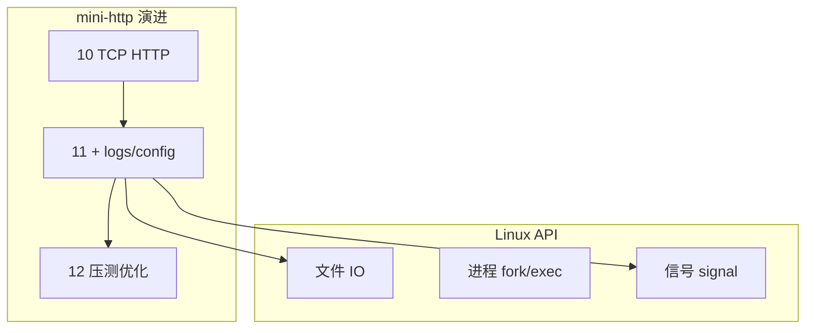

# Linux 与系统编程入门

> **文件编码**：UTF-8。本章示例以 **WSL2 / Linux** 为主；Windows 本地用 PowerShell 对照命令。

---

## 本章与上一章的关系

[10 章 mini-http](10-网络编程与简易HTTP服务.md) 在 Windows 上能 curl 通，但生产 C++ 服务多跑在 **Linux**：日志落盘、读配置、fork 子进程、信号优雅退出、文件权限——这些都属于 **系统编程**。

本章补 Linux 用户态 API 入门，并把 mini-http 加上 **日志文件** 与 **简单配置**；为 [12 性能分析](12-性能分析与调试.md) 提供可压测、可 strace 的目标程序。

| 上一章（10） | 本章（11） | 下一章（12） |
|--------------|------------|--------------|
| socket HTTP | open/read/write 日志 | Valgrind 查泄漏 |
| 单目录 exe | config.txt 读端口 | perf 看热点 |
| Winsock | POSIX API 对照 | 优化 mini-http |



**环境建议**：Windows 用户安装 WSL2（Ubuntu），与 [Python 09 Linux](../../Python/09-LinuxDockerNginx部署基础.md) / [Java 09](../../Java/09-LinuxDockerNginx部署基础.md) 共用同一套命令习惯。下文 **§1.1 WSL2 安装与 C++ 工具链** 给出从零到能编译 mini-http 的步骤。

---

## 1.1 WSL2 安装与 C++ 工具链（完整指南）

### 1.1.1 启用 WSL2（Windows 10/11）

**PowerShell（管理员）**：

```powershell
wsl --install -d Ubuntu
# 若已装过 WSL1，升级：
wsl --set-default-version 2
wsl --update
```

重启后打开 **Ubuntu**，创建 Linux 用户名与密码。

验证：

```powershell
wsl --list --verbose
# NAME      STATE   VERSION
# Ubuntu    Running 2
```

### 1.1.2 在 WSL 内安装构建工具

```bash
sudo apt update
sudo apt install -y build-essential cmake ninja-build gdb git curl
g++ --version    # 建议 GCC 11+
cmake --version  # 建议 3.16+
```

### 1.1.3 项目放哪：性能与路径

| 位置 | 路径示例 | 说明 |
|------|----------|------|
| **推荐** Linux 家目录 | `~/projects/mini-http` | ext4，编译与 IO 快 |
| 可访问 Windows 盘 | `/mnt/f/study/mini-http` | 跨系统方便，**大项目编译慢** |
| VS Code Remote | Remote-WSL 打开 `~/projects` | 编辑体验最佳 |

```bash
mkdir -p ~/projects
cp -r /mnt/f/study/mini-http ~/projects/ 2>/dev/null || true
cd ~/projects/mini-http
```

### 1.1.4 从 Windows 访问 WSL 服务

WSL2 与 Windows **网络互通**：WSL 里 `listen 0.0.0.0:8080`，Windows 浏览器访问 `http://127.0.0.1:8080/` 通常可达。若不通：

```powershell
# Windows 防火墙入站规则（管理员，按需）
New-NetFirewallRule -DisplayName "WSL mini-http" -Direction Inbound -LocalPort 8080 -Protocol TCP -Action Allow
```

### 1.1.5 VS Code / Cursor 联调

1. 安装扩展 **WSL**
2. 在 WSL 终端：`cd ~/projects/mini-http && code .`
3. `CMake: Configure` + `CMake: Build`，或终端 `cmake -S . -B build && cmake --build build`

### 1.1.6 常用 WSL 管理命令（Windows 侧）

```powershell
wsl -d Ubuntu                    # 进入默认发行版
wsl --shutdown                 # 关闭所有 WSL VM（释放内存）
wsl --export Ubuntu D:\backup\ubuntu.tar
wsl --import Ubuntu D:\WSL\Ubuntu D:\backup\ubuntu.tar
```

### 1.1.7 与计网 / 前端联调

WSL 内 `curl` 测 HTTP；浏览器在 Windows。理论复习走 [计算机网络目录](../../前端学习/计算机网络/00-学习路线图与说明.md)。

---

## 1.2 为什么 C++ 后端要懂 Linux

| 场景 | 需要的能力 |
|------|------------|
| 服务器部署 | ssh、systemd、看日志 |
| 高性能服务 | epoll、零拷贝（进阶） |
| 排查线上 | strace、lsof、core dump |
| 与 Java/Python 对照 | 它们 JVM/解释器底下仍是 Linux  syscall |

**深入解释**：C++ 标准库的文件流 `std::fstream` 底层在 Linux 上往往调用 `open/read/write`；理解 syscall 有助于解释「为什么 flush 慢」「为什么磁盘满会写失败」。

---

## 2. Linux 常用命令速查

与部署文档一致，系统编程日常必备：

```bash
# 文件
ls -la
cd /var/log
tail -f mini-http.log
grep "ERROR" mini-http.log | tail -20

# 进程
ps -ef | grep mini_http
ss -tlnp | grep 8080          # 或 netstat -tlnp
kill -15 <pid>                # SIGTERM 优雅退出
kill -9 <pid>                 # 强制（慎用）

# 资源
free -h
df -h
ulimit -a                     # 最大 open files 等

# 跟踪 syscall（12 章也会用）
strace -f ./build/mini_http 2>&1 | head -50
```

### Windows PowerShell 对照

```powershell
Get-Content f:\study\mini-http\logs\app.log -Wait -Tail 20
Get-Process | Where-Object {$_.ProcessName -like "*mini*"}
netstat -ano | findstr :8080
Stop-Process -Id <pid>
```

WSL 内用 bash 命令；Windows 宿主用 PowerShell 管理 WSL：

```powershell
wsl -d Ubuntu
wsl --list --verbose
```

---

## 3. 文件 IO：POSIX 与 C++ 流

### 3.1 POSIX 读写

```cpp
#include <fcntl.h>
#include <unistd.h>
#include <cstring>
#include <iostream>

void write_log_posix(const char* msg) {
    int fd = open("logs/app.log", O_WRONLY | O_CREAT | O_APPEND, 0644);
    if (fd < 0) return;
    write(fd, msg, std::strlen(msg));
    write(fd, "\n", 1);
    close(fd);
}
```

### 3.2 C++17 推荐写法

```cpp
#include <fstream>
#include <chrono>
#include <iomanip>
#include <sstream>

void write_log(const std::string& level, const std::string& msg) {
    auto now = std::chrono::system_clock::now();
    auto t = std::chrono::system_clock::to_time_t(now);
    std::tm tm{};
#ifdef _WIN32
    localtime_s(&tm, &t);
#else
    localtime_r(&t, &tm);
#endif
    std::ostringstream line;
    line << std::put_time(&tm, "%F %T") << " [" << level << "] " << msg;

    std::ofstream ofs("logs/app.log", std::ios::app);
    ofs << line.str() << "\n";
}
```

**为什么用 append 模式**：多线程/多次运行不覆盖旧日志；生产用 rotating file（spdlog）。

---

## 3.1 手把手：mini-http 加日志与配置

### 步骤 1：目录

```bash
cd ~/mini-http   # 或 f:\study\mini-http（WSL 路径 /mnt/f/study/mini-http）
mkdir -p logs config static
```

### 步骤 2：`config/server.conf`

```ini
port=8080
log_level=info
static_dir=static
```

### 步骤 3：简易配置读取 `src/config.cpp`

```cpp
#include "config.h"
#include <fstream>
#include <sstream>
#include <unordered_map>

ServerConfig load_config(const std::string& path) {
    ServerConfig cfg{8080, "info", "static"};
    std::ifstream ifs(path);
    std::string line;
    while (std::getline(ifs, line)) {
        auto pos = line.find('=');
        if (pos == std::string::npos) continue;
        std::string key = line.substr(0, pos);
        std::string val = line.substr(pos + 1);
        if (key == "port") cfg.port = std::stoi(val);
        else if (key == "log_level") cfg.log_level = val;
        else if (key == "static_dir") cfg.static_dir = val;
    }
    return cfg;
}
```

`include/config.h`：

```cpp
#pragma once
#include <string>

struct ServerConfig {
    int port;
    std::string log_level;
    std::string static_dir;
};

ServerConfig load_config(const std::string& path);
```

### 步骤 4：main 中使用

```cpp
#include "config.h"
// write_log 见 §3.2

int main() {
    ServerConfig cfg = load_config("config/server.conf");
    write_log("info", "starting on port " + std::to_string(cfg.port));
    // bind htons(cfg.port) ...
    write_log("info", "accepted connection");
}
```

### 步骤 5：编译运行（WSL）

```bash
cmake -S . -B build -DCMAKE_BUILD_TYPE=Release
cmake --build build
./build/mini_http &
curl http://127.0.0.1:8080/
tail -3 logs/app.log
```

**预期 logs/app.log**：

```text
2026-06-18 10:00:01 [info] starting on port 8080
2026-06-18 10:00:05 [info] accepted connection
```

---

## 4. 进程模型入门

### 4.1 fork / exec（Linux）

```cpp
#include <unistd.h>
#include <sys/wait.h>
#include <iostream>

int main() {
    pid_t pid = fork();
    if (pid == 0) {
        execlp("echo", "echo", "child process", nullptr);
        return 1;
    }
    wait(nullptr);
    std::cout << "parent done\n";
    return 0;
}
```

**注意**：Windows **无 fork**；跨平台服务器用线程（08 章）或独立进程 + IPC。

### 4.2 守护进程概念

生产服务常 `daemonize`：脱离终端、写 pid 文件、由 systemd 管理。学习阶段 `./mini_http &` + `nohup` 即可：

```bash
nohup ./build/mini_http > /dev/null 2>&1 &
echo $! > mini_http.pid
```

---

## 5. 信号与优雅退出

| 信号 | 含义 | 常见处理 |
|------|------|----------|
| SIGINT (2) | Ctrl+C | 停止循环，close socket |
| SIGTERM (15) | kill 默认 | 同上，刷日志 |
| SIGPIPE | 对端关闭仍 write | 忽略或捕获 |
| SIGHUP (1) | 终端断开 | 重载配置（进阶） |

**深入解释**：粗暴 `kill -9` 跳过析构与 flush，可能丢日志；先发 SIGTERM 等待退出。

### 5.1 错误示范：信号处理函数里做复杂逻辑

信号处理函数只能在 **async-signal-safe** 函数（如 `write`、设 flag），不能 `malloc`、`cout`、`mutex`。

### 5.2 完整示例：mini-http 集成信号优雅退出

下列代码将 [10 章 mini-http](10-网络编程与简易HTTP服务.md) 的主循环改为 **可中断 accept**（Linux 用 `accept` 被信号打断返回 -1 + `EINTR`；此处用 `atomic` flag + 非阻塞或短超时简化演示）。

`include/signal_handler.h`：

```cpp
#pragma once
#include <atomic>

extern std::atomic<bool> g_running;

void install_signal_handlers();
```

`src/signal_handler.cpp`：

```cpp
#include "signal_handler.h"
#include <csignal>

std::atomic<bool> g_running{true};

static void on_signal(int signo) {
    (void)signo;
    g_running.store(false, std::memory_order_release);
}

void install_signal_handlers() {
    struct sigaction sa{};
    sa.sa_handler = on_signal;
    sigemptyset(&sa.sa_mask);
    sa.sa_flags = 0;

    sigaction(SIGINT,  &sa, nullptr);
    sigaction(SIGTERM, &sa, nullptr);

    // 忽略 SIGPIPE，避免客户端 abrupt close 时进程被杀
    sa.sa_handler = SIG_IGN;
    sigaction(SIGPIPE, &sa, nullptr);
}
```

`src/main_with_signals.cpp`（Linux / WSL 完整可编译）：

```cpp
#include "platform_socket.h"
#include "signal_handler.h"
#include "http_request.h"
#include "http_response.h"

#include <cerrno>
#include <cstring>
#include <sys/stat.h>
#include <fstream>
#include <iostream>
#include <sstream>
#include <chrono>
#include <iomanip>

static void write_log(const std::string& msg) {
    auto now = std::chrono::system_clock::now();
    auto t = std::chrono::system_clock::to_time_t(now);
    std::tm tm{};
    localtime_r(&t, &tm);
    std::ostringstream line;
    line << std::put_time(&tm, "%F %T") << " " << msg << "\n";
    std::ofstream ofs("logs/app.log", std::ios::app);
    ofs << line.str();
    ofs.flush();
}

static void handle_client(int client_fd);

int main() {
    install_signal_handlers();
    if (!socket_platform_init()) return 1;

    mkdir("logs", 0755);  // 需 #include <sys/stat.h>

    const int port = 8080;
    int server_fd = socket(AF_INET, SOCK_STREAM, 0);
    if (server_fd < 0) { perror("socket"); return 1; }

    int opt = 1;
    setsockopt(server_fd, SOL_SOCKET, SO_REUSEADDR,
               reinterpret_cast<char*>(&opt), sizeof(opt));

    sockaddr_in addr{};
    addr.sin_family = AF_INET;
    addr.sin_addr.s_addr = INADDR_ANY;
    addr.sin_port = htons(static_cast<uint16_t>(port));

    if (bind(server_fd, reinterpret_cast<sockaddr*>(&addr), sizeof(addr)) < 0) {
        perror("bind"); close_socket(server_fd); return 1;
    }
    if (listen(server_fd, 16) < 0) {
        perror("listen"); close_socket(server_fd); return 1;
    }

    write_log("server started port=" + std::to_string(port));
    std::cout << "listening :8080 (Ctrl+C to stop)\n";

    while (g_running.load(std::memory_order_acquire)) {
        int client_fd = accept(server_fd, nullptr, nullptr);
        if (client_fd < 0) {
            if (errno == EINTR) continue;  // 信号打断
            if (!g_running.load()) break;
            perror("accept");
            continue;
        }
        handle_client(client_fd);
        close_socket(client_fd);
    }

    write_log("shutdown: closing listen fd");
    close_socket(server_fd);
    socket_platform_cleanup();
    std::cout << "bye\n";
    return 0;
}
```

**测试（WSL）**：

```bash
cmake --build build
./build/mini_http &
PID=$!
curl -s http://127.0.0.1:8080/ > /dev/null
kill -15 $PID
wait $PID
tail -2 logs/app.log
# 预期最后一行含 shutdown
```

**Windows 注意**：`sigaction` / `localtime_r` 为 POSIX；MSVC 可用 `signal()` + `localtime_s` 简化版，完整 demo 请在 WSL 编译。

### 5.3 对照：仅 atomic flag 的最小示例

```cpp
#include <csignal>
#include <atomic>
#include <iostream>
#include <thread>
#include <chrono>

std::atomic<bool> g_running{true};

void on_signal(int) { g_running = false; }

int main() {
    signal(SIGINT, on_signal);
    signal(SIGTERM, on_signal);
    while (g_running) {
        std::cout << "working...\n";
        std::this_thread::sleep_for(std::chrono::seconds(1));
    }
    std::cout << "shutdown gracefully\n";
    return 0;
}
```

---

## 6. 文件描述符与资源

- 每个 socket、文件 open 占一个 **fd**
- 默认 `ulimit -n` 1024，高并发需调大
- **泄漏 fd** → 无法接受新连接；12 章 Valgrind/ls -l /proc/PID/fd 排查

```bash
ls -l /proc/$(pgrep mini_http)/fd
```

---

## 7. 目录权限与部署清单

```bash
chmod +x build/mini_http
chmod 755 logs config static
# 日志目录服务用户可写
chown www-data:www-data logs   # 生产示例
```

与 [Git 系列](../../前端学习/Git/00-学习路线图与说明.md) 配合：`logs/`、`build/` 写入 `.gitignore`。

---

## 8. 常见报错与排查

| 现象 | 原因 | 解决 |
|------|------|------|
| `Permission denied` 写日志 | logs 目录无写权限 | `chmod 755 logs` 或 mkdir -p |
| `Too many open files` | fd 泄漏 | accept 后必 close；ulimit -n |
| 配置 port 未生效 | 路径错 / 未加载 | 确认 `config/server.conf` 相对工作目录 |
| WSL 访问 Windows 文件慢 | /mnt/f 跨文件系统 | 项目放 `~/` 原生 ext4 |
| fork 在 Windows 编译失败 | 无 POSIX fork | 仅 WSL/Linux 编译该 demo |
| signal 处理函数不安全 | 非 async-signal-safe | 只设 atomic flag，复杂逻辑放主循环 |
| tail -f 无输出 | 缓冲未 flush | endl 或 ofs.flush() |
| stoi 异常 | 配置非数字 | try/catch 或校验 |
| nohup 仍退出 | 前台崩溃 | 看 nohup.out / 日志 ERROR |
| systemd 启动失败 | 工作目录不对 | Unit 里设 WorkingDirectory |
| `wsl --install` 失败 | 未开虚拟化 / 功能未启用 | BIOS 开 VT-x；「适用于 Linux 的 Windows 子系统」 |
| Ubuntu 首次 apt 慢 | 默认源远 | 换国内 mirror（可选） |
| `/mnt/f` 编译 OOM | 跨文件系统+大项目 | 项目移到 `~/projects` |
| `sigaction` MSVC 报错 | 非 POSIX | WSL 编译或改用 `signal()` |
| `EINTR` accept 循环 | 信号打断 syscall | 检查 errno==EINTR 后 continue |
| `kill -9` 无 shutdown 日志 | 无法捕获 | 先用 SIGTERM |
| `logs/app.log` 不存在 | 未 mkdir | main 入口 `mkdir("logs", 0755)` |
| `localtime_r` 未声明 | 缺 `<ctime>` | 包含头文件 |
| WSL 与 Windows 端口不通 | 防火墙 / 未 listen 0.0.0.0 | §1.1.4 防火墙规则 |
| `strace` 权限 | 未安装 | `sudo apt install strace` |

### 8.1 errno 与 perror 速查（系统调用）

| errno | 宏名 | 常见触发 | 处理 |
|-------|------|----------|------|
| 2 | ENOENT | open 路径不存在 | 检查相对路径、工作目录 |
| 13 | EACCES | 权限不足 | chmod / chown |
| 22 | EINVAL | bind 非法地址 | 检查 port、sockaddr |
| 98 | EADDRINUSE | 端口占用 | SO_REUSEADDR、换端口 |
| 24 | EMFILE | fd 耗尽 | close 泄漏 fd；ulimit -n |
| 4 | EINTR | 信号打断阻塞调用 | 重试 accept/read |
| 32 | EPIPE | 对端关闭仍 write | 忽略 SIGPIPE 或检查 send 返回值 |

```cpp
if (some_syscall() < 0) {
    std::cerr << "fail: " << std::strerror(errno) << '\n';
}
```

---

## 9. 练习建议

### 基础

1. 每次请求把 method + path 追加到 `logs/access.log`（类似 Nginx access log）。
2. 配置增加 `bind_addr=0.0.0.0`，支持只监听 127.0.0.1。

### 进阶

3. 实现日志级别：error 才写文件，info 同时 cout。
4. 捕获 SIGTERM，退出前关闭 listen fd 并写 shutdown 日志。

### 挑战

5. 用 `fork` 做「主进程 accept + 子进程处理请求」（Linux only）。
6. 读 `static/` 下文件，按扩展名设 Content-Type。

### WSL 与环境

7. 按 §1.1 在 WSL 安装 g++/cmake，把 mini-http 放到 `~/projects` 并成功 curl。
8. Windows 浏览器访问 WSL 内 8080，记录不通时的排查步骤。

### 信号与 syscall

9. 实现 §5.2 完整信号退出，验证 `kill -15` 后 `logs/app.log` 有 shutdown 行。
10. 对运行中 mini_http 执行 `strace -e trace=network,file -p <pid>`，对照 [计网 02 TCP](../../前端学习/计算机网络/02-TCP与UDP.md) 观察 `accept`/`recv`。

### 综合

11. 写 systemd user unit（`~/.config/systemd/user/mini-http.service`）管理 mini-http（WorkingDirectory + ExecStart）。

---

## 10. 参考答案

### 基础 1：access.log

```cpp
void log_access(const std::string& method, const std::string& path) {
    std::ofstream ofs("logs/access.log", std::ios::app);
    ofs << method << " " << path << "\n";
}
// parse 后：log_access("GET", path);
```

### 进阶 4：SIGTERM

见 §5.2 完整 `main_with_signals.cpp` 与 `signal_handler.cpp`。

### 练习 11：systemd user unit 示例

`~/.config/systemd/user/mini-http.service`：

```ini
[Unit]
Description=Mini HTTP Server
After=network.target

[Service]
Type=simple
WorkingDirectory=/home/YOUR_USER/projects/mini-http
ExecStart=/home/YOUR_USER/projects/mini-http/build/mini_http
Restart=on-failure

[Install]
WantedBy=default.target
```

```bash
systemctl --user daemon-reload
systemctl --user start mini-http
systemctl --user status mini-http
curl http://127.0.0.1:8080/
systemctl --user stop mini-http
```

---

## 11. 学完标准

- [ ] 能在 WSL 用 tail/grep/ps/ss 排查 mini-http
- [ ] 会用 ofstream 追加写日志，理解路径与工作目录
- [ ] 能从配置文件读 port 并应用到 bind
- [ ] 理解 SIGTERM 优雅退出与 fd 泄漏后果
- [ ] 知道 fork 与 Windows 差异，不在 MSVC 强移植 fork demo
- [ ] 完成 §1.1 WSL 环境搭建与 §5.2 信号退出 demo
- [ ] 能查 errno 表定位 open/bind/accept 失败原因

### 挑战 6：Content-Type 映射

```cpp
std::string mime(const std::string& ext) {
    if (ext == ".html") return "text/html; charset=utf-8";
    if (ext == ".css") return "text/css";
    if (ext == ".js") return "application/javascript";
    return "application/octet-stream";
}
```

---

## 下一章预告

[12 性能分析与调试](12-性能分析与调试.md) 对 mini-http 压测、用 Valgrind 查泄漏、用 perf/GDB 定位热点——把「能跑」变成「跑得稳、知道瓶颈在哪」。

---

*下一章：12 性能分析与调试*
