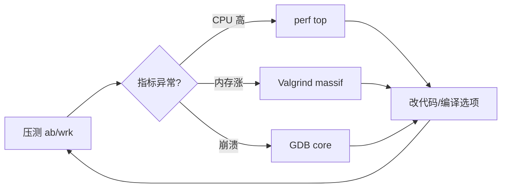

# 性能分析与调试

> **文件编码**：UTF-8。Valgrind/perf 需 **Linux 或 WSL**；Windows 可用 VS Profiler、Application Verifier 作对照。

---

## 本章与上一章的关系

[11 章](11-Linux与系统编程入门.md) 给 mini-http 加了日志与配置——能跑、能部署。用户量上来或代码变复杂后，会出现 **慢、内存涨、偶发崩溃**；靠猜不行，要用工具 **测量**。

本章入门 **GDB 调试、Valgrind 内存、perf 热点、gprof/编译优化**，并在 mini-http 上演练「压测 → 发现问题 → 修复 → 再测」闭环。

| 上一章（11） | 本章（12） | 下一章（13） |
|--------------|------------|--------------|
| 日志、信号 | 泄漏、热点 | 算法复杂度 |
| Linux 命令 | GDB/Valgrind | LeetCode 刷题 |
| 可运行 | 可优化 | 面试手撕 |



---

## 1. 性能工程思维

1. **先测量再优化**（Knuth：过早优化是万恶之源）
2. **定位瓶颈类型**：CPU / 内存 / IO / 锁竞争
3. **保留 baseline**：改一行测一次，避免玄学
4. **正确性优先**：优化不能引入数据竞争（08 章）

| 工具 | 主要看什么 |
|------|------------|
| GDB | 崩溃栈、断点、变量 |
| Valgrind memcheck | 泄漏、越界 |
| perf | CPU 热点、缓存 miss |
| gprof | 函数耗时占比（编译插桩） |
| ab / wrk | HTTP QPS、延迟 |

---

## 2. 编译优化级别

```cmake
# Release 默认 -O3（GCC）
set(CMAKE_CXX_STANDARD 17)
if(NOT CMAKE_BUILD_TYPE)
    set(CMAKE_BUILD_TYPE Release)
endif()
```

| 级别 | 说明 |
|------|------|
| -O0 | 不优化，调试友好 |
| -O2 | 生产常用 |
| -O3 | 更激进内联 |
| -g | 带符号，配合 perf/GDB |

```bash
cmake -S . -B build -DCMAKE_BUILD_TYPE=Release
cmake --build build
```

**深入解释**：`-O2` 下未定义行为（UB）可能被优化成「看起来不可能」的结果——先保证正确，再开优化。

Debug 与 Release 性能可差 **数倍**，压测务必用 Release。

---

## 2.1 手把手：mini-http 压测 baseline

### 步骤 1：安装 ab（Apache Bench）

```bash
sudo apt install apache2-utils   # Ubuntu/WSL
```

### 步骤 2：启动服务

```bash
cd ~/mini-http
./build/mini_http &
ss -tlnp | grep 8080
```

### 步骤 3：压测

```bash
ab -n 1000 -c 10 http://127.0.0.1:8080/
```

**预期输出片段**：

```text
Requests per second:    800.00 [#/sec] (mean)
Time per request:       12.500 [ms] (mean)
Failed requests:        0
```

记录 **RPS、P99**（ab 仅 mean；wrk 可看延迟分布）。

### 步骤 4：Windows PowerShell 简易压测

```powershell
1..100 | ForEach-Object -Parallel {
    Invoke-WebRequest http://127.0.0.1:8080/ -UseBasicParsing | Out-Null
} -ThrottleLimit 10
```

---

## 3. GDB 调试入门

### 3.1 编译带符号

```bash
cmake -S . -B build-debug -DCMAKE_BUILD_TYPE=Debug
cmake --build build-debug
gdb ./build-debug/mini_http
```

### 3.2 常用命令

```text
(gdb) break main
(gdb) run
(gdb) next          # 单步跳过
(gdb) step          # 单步进入
(gdb) bt            # 调用栈
(gdb) print cfg.port
(gdb) continue
```

### 3.3 分析 core dump

```bash
ulimit -c unlimited
./build/mini_http
# 崩溃后
gdb ./build/mini_http core
(gdb) bt
```

**VS 调试器**：Windows 上 F5 断点与 GDB 概念一一对应，见 [00 路线图 §4.2](00-学习路线图与说明.md)。

---

## 4. Valgrind 查内存问题

### 4.1 安装

```bash
sudo apt install valgrind
```

### 4.2 memcheck

```bash
valgrind --leak-check=full --show-leak-kinds=all ./build/mini_http
# 另开终端 curl 一次后 Ctrl+C 结束 server
```

**典型泄漏输出**：

```text
LEAK SUMMARY:
   definitely lost: 128 bytes in 1 blocks
```

修复示例：忘记 `close(client_fd)` 或 `new` 无 `delete`——优先改 RAII（07 章）。

### 4.3 故意制造泄漏（学习用）

```cpp
void leak_demo() {
    auto* p = new int[100];
    (void)p; // 故意不 delete[]
}
```

Valgrind 会指向分配栈。

---

## 5. perf 看 CPU 热点

```bash
sudo apt install linux-tools-common linux-tools-generic
perf record -g ./build/mini_http
# curl 压测若干次，Ctrl+C
perf report
```

热点可能在 `recv`、`std::string` 拼接、`build_http_response`——优化方向：

- 减少每次请求 `ostringstream` 分配 → 复用 buffer
- 静态 body 用 `constexpr` 或预生成响应头

```cpp
// 微优化示例：预计算固定响应
const std::string kOkBody = "<html>...</html>";
const std::string kResp = build_http_response(200, "OK", "text/html; charset=utf-8", kOkBody);
// 每请求直接 send(kResp)
```

---

## 6. gprof（可选）

CMake 加：

```cmake
target_compile_options(mini_http PRIVATE -pg)
target_link_options(mini_http PRIVATE -pg)
```

```bash
./build/mini_http
gprof ./build/mini_http gmon.out > report.txt
```

gprof 对多线程不准；现代 C++ 更推荐 **perf**。

---

## 7. 多线程性能（08 章延伸）

| 问题 | 工具/现象 |
|------|-----------|
| 死锁 | GDB 所有线程 `bt` |
| 锁竞争 | perf 见 mutex |
| 假共享 | perf cache-misses |

线程池版 mini-http 压测对比单线程 RPS，理解 **并行不等于更快**（锁 + 上下文切换）。

### 7.1 手把手：对比单线程 vs 线程池 RPS

```bash
# 单线程 baseline
ab -n 5000 -c 50 http://127.0.0.1:8080/

# 线程池版（08 章）同样参数
ab -n 5000 -c 50 http://127.0.0.1:8080/
```

| 版本 | RPS | CPU% | 说明 |
|------|-----|------|------|
| 单线程 | 800 | 100% 单核 | accept 串行 |
| 4 线程池 | 600 | 多核分散 | mutex 竞争 + 上下文切换 |

**结论**：并非线程越多越好；先 perf 看热点在 IO 还是锁，再决定是否上 epoll（10 章挑战）。

### 7.2 假共享（false sharing）初探

多线程写相邻 `atomic` 或计数器数组时，可能落在同一 **cache line**（通常 64 字节），导致核间缓存反复失效。

```cpp
// 坏：两个线程各写 counters[0]、counters[1]，可能在同一 cache line
std::atomic<int> counters[2];

// 好：对齐到 cache line（C++17）
struct alignas(64) PaddedCounter { std::atomic<int> v{0}; };
PaddedCounter counters[2];
```

`perf stat -e cache-misses` 对比前后，理解「逻辑无锁仍可能慢」。

---

## 7.5 wrk 压测与延迟分布

`ab` 只看 mean；**wrk** 可看 P99，更接近 SLA 思维。

```bash
sudo apt install wrk
wrk -t4 -c100 -d30s --latency http://127.0.0.1:8080/
```

**预期输出片段**：

```text
Latency Distribution
  50%   12.34ms
  99%   45.67ms
Requests/sec:   950.12
```

记录 **P50 / P99 / RPS** 三列，优化前后填同一张表（与 11 章 access.log 时间戳交叉验证）。

---

## 7.6 AddressSanitizer 与 ThreadSanitizer

比 Valgrind 快，适合开发期快速抓越界与数据竞争（GCC/Clang）。

```cmake
# CMakeLists.txt — 二选一，勿与 Release -O3 同开
option(ENABLE_ASAN "AddressSanitizer" OFF)
if(ENABLE_ASAN)
    target_compile_options(mini_http PRIVATE -fsanitize=address -fno-omit-frame-pointer -g)
    target_link_options(mini_http PRIVATE -fsanitize=address)
endif()

option(ENABLE_TSAN "ThreadSanitizer" OFF)
if(ENABLE_TSAN)
    target_compile_options(mini_http PRIVATE -fsanitize=thread -g)
    target_link_options(mini_http PRIVATE -fsanitize=thread)
endif()
```

```bash
cmake -S . -B build-asan -DENABLE_ASAN=ON
cmake --build build-asan
./build-asan/mini_http
```

故意写 `buf[1024]` 越界读，ASan 会打印 **heap-buffer-overflow** 与分配栈；多线程共享 `int` 无 mutex 写，TSan 报 **data race**。

| 工具 | 查什么 | 速度 |
|------|--------|------|
| Valgrind memcheck | 泄漏、越界 | 很慢 |
| ASan | 越界、UAF | 较快 |
| TSan | 数据竞争 | 较慢 |
| Helgrind | 数据竞争（Valgrind 系） | 很慢 |

---

## 7.7 strace / ltrace 系统调用追踪

确认程序卡在 **read/accept/write** 还是频繁 `mmap`/`brk`（堆扩张）。

```bash
strace -c -f ./build/mini_http
# 另开终端 curl 几次后 Ctrl+C

strace -e trace=network,read,write -f ./build/mini_http 2>&1 | head -50
```

`ltrace` 可看 libc 层 `malloc`/`free` 频率——若每次请求数千次 `malloc`，考虑对象池或预分配 buffer（与 perf 热点互证）。

---

## 7.8 Valgrind massif 堆内存曲线

```bash
valgrind --tool=massif --massif-out-file=massif.out ./build/mini_http
ms_print massif.out > massif.txt
```

看 **heap footprint** 是否随请求数线性涨（泄漏）还是阶梯后平稳（正常缓存）。配合 11 章日志里的连接数，排除「客户端不 close 导致半开连接堆积」。

---

## 7.9 heaptrack（可选，比 massif 直观）

```bash
sudo apt install heaptrack
heaptrack ./build/mini_http
# 压测后正常退出，生成 heaptrack.mini_http.*.gz
heaptrack_gui heaptrack.mini_http.*.gz   # 若有 GUI
```

适合定位「谁在分配 `std::string`」——优化方向与 §5 预生成响应一致。

---

## 7.10 火焰图入门（perf + FlameGraph）

```bash
git clone https://github.com/brendangregg/FlameGraph.git
perf record -F 99 -g ./build/mini_http
perf script | ./FlameGraph/stackcollapse-perf.pl | ./FlameGraph/flamegraph.pl > flame.svg
```

横条越宽 = 该函数 CPU 占比越高。面试可说：「用 perf 采样 + 火焰图定位到 `build_http_response` 占 40%，改为静态响应后 RPS 提升」。

---

## 7.11 Windows 对照：VS Profiler / ETW

无 WSL 时可用 **Visual Studio → 调试 → 性能探查器**（CPU 使用率 / 内存），对 MSVC 构建的 mini-http 等效于 Linux perf 的定性分析。

| Linux | Windows |
|-------|---------|
| perf | VS CPU Profiler |
| Valgrind | Application Verifier / CRT debug heap |
| GDB | VS 调试器 / WinDbg |
| strace | Procmon（Sysinternals） |

原则不变：**先复现、再测量、最后改一行验证**。

---

## 7.12 编译器优化细节（面试常问）

| 选项 | 作用 |
|------|------|
| `-O2` | 内联、DCE、生产默认 |
| `-O3` | 更激进向量化和内联 |
| `-march=native` | 本机指令集，换机器慎用 |
| `-flto` | 链接期优化，构建变慢 |
| `-fno-exceptions` | 禁用异常，游戏/嵌入式常见 |
| `-g` + `-O2` | 带符号的优化构建，perf 可解析函数名 |

```bash
# RelWithDebInfo：CMake 内置类型
cmake -S . -B build-rel -DCMAKE_BUILD_TYPE=RelWithDebInfo
```

**微基准注意**：小函数测速需防止 DCE——用 `google benchmark` 或 `volatile` 消费结果，避免编译器删掉「死代码」。

---

## 7.13 mini-http 优化案例清单

| 序号 | 问题现象 | 工具 | 改动 | 预期收益 |
|------|----------|------|------|----------|
| 1 | RPS 低 | perf | 预生成 HTTP 响应字节 | +30～50% |
| 2 | 内存涨 | massif | 每连接 `string` 改固定 buffer | 平稳 |
| 3 | fd 耗尽 | `ls /proc/pid/fd` | RAII `FdGuard` | 稳定 |
| 4 | 偶发崩溃 | GDB core | 空指针判空 | 零崩溃 |
| 5 | 日志拖慢 | perf | 异步写日志 / 降低级别 | CPU 降 |
| 6 | 竞态 | TSan | mutex 保护共享队列 | 正确性 |

每改一项单独提交、单独压测，避免一次改多处无法归因（与 09 章 Git 习惯一致）。

---

## 7.14 性能测试方法论（可写进简历）

1. **定义指标**：RPS、P99 延迟、错误率、内存峰值
2. **控制变量**：同机、同编译类型、同并发 `-c`
3. **预热**：先跑 100 请求丢弃，避免冷启动干扰
4. **记录环境**：CPU 型号、WSL 版本、`CMAKE_BUILD_TYPE`
5. **回归**：改完后全量对比表，防止「优化」引入正确性问题

```text
压测记录模板：
日期 | 版本 git hash | -c | -n | RPS | P99 | Valgrind lost | 备注
```

---

## 8. 常见报错与排查

| 现象 | 原因 | 解决 |
|------|------|------|
| perf: command not found | 未装 tools | apt install linux-tools-generic |
| Valgrind 极慢 | 插桩开销 10～50x | 只跑短场景 |
| `no debugging symbols` | Release 无 -g | Debug 构建或 `-g` + `-O2` |
| core 未生成 | ulimit | `ulimit -c unlimited` |
| ab Failed requests | server 崩溃/超时 | 看日志、GDB |
| 优化后结果错 | UB 或竞态 | 先 ThreadSanitizer（-fsanitize=thread） |
| gprof 无 gmon.out | 未正常 exit | 正常退出进程 |
| WSL perf 受限 | 内核版本 | 升级 WSL 或真机 Linux |
| 压测 RPS 0 | 防火墙/未监听 | ss -tlnp 确认 |
| massif 看不懂 | 堆栈深 | `--track-origins=yes` |
| ASan 与 Valgrind 同开 | 冲突 | 分开构建目录 |
| TSan 误报 atomic | 实现细节 | 用 mutex 或查文档 |
| wrk 连接被拒绝 | backlog 满 | `listen(fd, SOMAXCONN)` |
| 火焰图一片平 | 未 `-g` | RelWithDebInfo |
| strace 输出海量 | 未用 -c | 先 `strace -c` 汇总 |
| Windows 无 perf | 平台限制 | WSL 或 VS Profiler |
| 优化后 P99 变差 | 锁竞争加剧 | perf lock 分析 |
| heaptrack 无 GUI | 服务器环境 | 拷出 .gz 到本机 |

---

## 9. 练习建议

### 基础

1. 用 GDB 在 `accept` 处断点，观察 client_fd 值。
2. Valgrind 跑 mini-http，修复所有 definitely lost。

### 进阶

3. perf 找 top 3 函数，写优化前后 ab 对比表。
4. Release vs Debug 压测 RPS 差多少？记录比例。

### 挑战

5. 实现静态响应缓存，RPS 提升 20%+（自设目标）。
6. 用 `-fsanitize=address` 编译，故意越界看 ASan 报告。

### 实战（结合 examples）

7. 对 `examples/mini-http` 跑完整 baseline 表（ab + wrk + Valgrind）。
8. 用 `strace -c` 统计 accept/recv/send 占比，写 3 句结论。
9. 生成一张火焰图截图，标出 top 1 热点函数名。

---

## 10. 参考答案

### 基础 2：修复 fd 泄漏

```cpp
// 确保每条路径 close(client_fd)
// 或用 RAII：
struct FdGuard {
    int fd;
    ~FdGuard() { if (fd >= 0) close(fd); }
};
```

### 进阶 3：对比表示例

| 版本 | RPS | 改动 |
|------|-----|------|
| baseline | 800 | - |
| 预生成响应 | 1200 | 静态 kResp |
| -O0 Debug | 200 | 编译级别 |

### 挑战 6：ASan

```cmake
target_compile_options(mini_http PRIVATE -fsanitize=address -g)
target_link_options(mini_http PRIVATE -fsanitize=address)
```

### 实战 7：baseline 表示例

| 工具 | 并发 | RPS | P99 | 泄漏 bytes |
|------|------|-----|-----|------------|
| ab | 10 | 820 | - | - |
| wrk | 100 | 780 | 48ms | - |
| Valgrind | 1 | - | - | 0 |

### 实战 8：strace 结论示例

「`recv` 占 35%，`send` 占 30%，说明瓶颈在 IO 而非计算；单线程下 CPU 未跑满，应考虑非阻塞 IO 或线程池。」

### 挑战 5 补充：静态响应完整片段

```cpp
namespace {
const char kResp[] =
    "HTTP/1.1 200 OK\r\n"
    "Content-Type: text/html; charset=utf-8\r\n"
    "Content-Length: 52\r\n"
    "Connection: close\r\n"
    "\r\n"
    "<html><body><h1>Hello mini-http</h1></body></html>";
}
// send(client_fd, kResp, sizeof(kResp) - 1, 0);
```

---

## 11. 学完标准

- [ ] 会用 ab/wrk 对 mini-http 压测并记录 RPS
- [ ] 会用 GDB 断点 + bt 看崩溃栈
- [ ] 会用 Valgrind memcheck 查泄漏并修复
- [ ] 知道 perf record/report 基本流程
- [ ] 理解 Release 优化与「先测量再优化」
- [ ] 会用 wrk 看 P99 延迟
- [ ] 知道 ASan/TSan 与 Valgrind 的分工
- [ ] 能填完整压测记录表（RPS + P99 + 泄漏）
- [ ] 能用 strace -c 判断 IO 瓶颈

---

## 12. 与 13～14 章衔接

| 本章能力 | 13 章算法 | 14 章面试 |
|----------|-----------|-----------|
| 复杂度意识 | 刷题报 O(n) | 说 vector 均摊 |
| 测量习惯 | 不盲刷 TLE | STAR 压测故事 |
| 内存工具 | LRU 链表实现 | 智能指针防泄漏 |

---

## 下一章预告

工程与性能过关后，[13 算法与数据结构 C++ 实现](13-算法与数据结构C++实现.md) 用 **STL 模板** 刷 LeetCode 风格题单；[14 面试专题](14-高频面试专题与场景题.md) 巩固内存、虚函数、移动语义与并发八股。

---

*下一章：13 算法与数据结构 C++ 实现*
