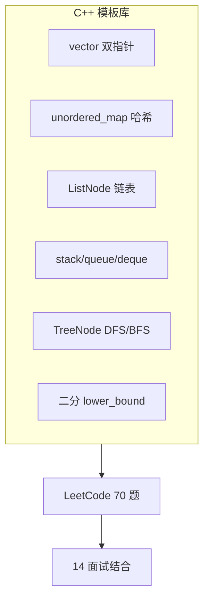
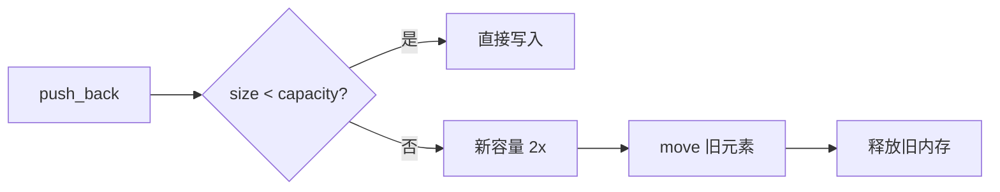

# 算法与数据结构（C++ 实现）

> **文件编码**：UTF-8。题解默认 **C++17 + STL**；配合 [14 面试专题](14-高频面试专题与场景题.md) 冲刺。

---

## 本章与上一章的关系

[01～12 章](00-学习路线图与说明.md) 偏语言、工程、系统——游戏/基建/算法岗面试仍要求 **LeetCode 中等手撕**。本章提供 **C++ STL 模板** 与 **70 题清单**，与 [Python 13](../Python/13-算法与数据结构基础.md) / [Java 13](../Java/13-算法与数据结构基础.md) 题单对齐，代码全部改为 C++。

> **原理与手写实现**请先学 [数据结构 01～10](../数据结构/00-学习路线图与说明.md)；本章侧重 **C++ STL 手撕**。

| 上一章（12） | 本章（13） | 下一章（14） |
|--------------|------------|--------------|
| 复杂度与性能 | O(n) 意识刷题 | 内存/虚函数八股 |
| mini-http 优化 | vector/map 模板 | 场景表达 |



---

## 0. 读前导读（零基础也能跟上）

### 0.1 用一句话弄懂本章

用 **C++ STL**（`vector`、`unordered_map`、`priority_queue` 等）按模板刷 **70 道题**，与 [数据结构系列](../数据结构/00-学习路线图与说明.md) 原理互补——这里侧重「能写进面试白板」的代码。

### 0.2 你需要提前知道什么

| 状态 | 动作 |
|------|------|
| 04 章 STL 不熟 | 回 [04 STL](04-STL标准库容器与算法.md) vector/map |
| 原理不懂 | 先 [数据结构 02～08](../数据结构/02-数组与字符串.md) |
| 只会 Python 刷题 | 题号与 [Python 13](../Python/13-算法与数据结构基础.md) 对齐 |
| 时间紧 | 先刷清单 **B** 标记 40 题 |

### 0.3 本章知识地图（学完后应能勾选全部 ☐→☑）

- ☐ 闭卷手写：两数之和、反转链表、有效括号、层序遍历
- ☐ 会用 `unordered_map` 做 O(1) 查找
- ☐ 会用 `priority_queue` 做 TopK / K 路归并
- ☐ 能手写 LRU（list + unordered_map）
- ☐ 能手写 UnionFind（路径压缩）
- ☐ 完成清单 ≥40 道 **B** 题
- ☐ 每题能口述时间/空间复杂度
- ☐ 25 分钟内完成一道 Easy/Medium

### 0.4 建议学习时长与节奏

| 阶段 | 时长 | 内容 |
|------|------|------|
| §4～§9 核心模板 | 2 周 | 每天 2～3 题 |
| §12～§15 LRU/堆/并查集 | 1 周 | 中等难度 |
| 错题二刷 | 1 周 | 对照 examples/ |
| 闭卷自测 | 30 min | ≥7/10 进 14 章 |

### 0.5 学完本章你能做什么（可验证的具体动作）

1. 15 分钟内白板写出反转链表 + 复杂度分析
2. 独立实现 LRU Cache（146）并通过样例
3. 用 `g++ -std=c++17 -O2 -Wall` 本地编译通过一道 Medium
4. 对照 [examples/algorithm-templates](examples/algorithm-templates/) 跑通 lru_cache.cpp

**术语（均摊复杂度）**：偶尔很贵、多数便宜的操作，**平均**下来仍低复杂度；像 `vector::push_back` 扩容。
**生活类比**：哈希表像**字典按拼音查字**——键直达，不用逐页翻。
**为什么重要**：笔试/机考 + 面试手撕；C++ 岗算法与语言题各占一半。
**本章用到的地方**：§4 双指针、§13 LRU、§14 并查集。

---

## 1. 为什么 C++ 选手要刷算法

- 笔试/机考常用 C++ 标准库
- 面试考察 **复杂度 + 代码质量**（边界、const 引用）
- 理解 `unordered_map` 均摊 O(1)、`priority_queue` 堆

**与后端关系**：索引 B+ 树、LRU、一致性 hash 都建立在数据结构之上。

### 1.1 70 题清单使用说明（扩充）

| 标记 | 含义 | 建议 |
|------|------|------|
| **B** | 必做 baseline | 至少完成 40 道 |
| **R** | 推荐 Medium | 有余力再做 |
| **O** | 可选 | 冲刺/专项 |

**周计划示例**：

| 周 | 主题 | 题量 | 模板章节 |
|----|------|------|----------|
| W1 | 数组/哈希/双指针 | 12 | §4～§6 |
| W2 | 链表/栈/队列 | 10 | §7～§9 |
| W3 | 树/BFS/DFS | 10 | §10 |
| W4 | 二分/滑动窗口/回溯 | 10 | §11 |
| W5 | 堆/并查集/LRU | 8 | §12～§14 |
| W6 | 错题 + 模拟面试 | 复习 | 14 章 |

### 1.2 逐行读：两数之和核心循环

```cpp
std::unordered_map<int, int> seen;
for (int i = 0; i < static_cast<int>(nums.size()); ++i) {
    int need = target - nums[i];
    if (seen.count(need)) return {seen[need], i};
    seen[nums[i]] = i;
}
```

| 行 | 含义 | 改错会怎样 |
|----|------|------------|
| `unordered_map` | 值→下标 O(1) | 用 map 仍对但 O(log n) |
| `need = target - nums[i]` | 补数 | 溢出→用 long long |
| `seen.count(need)` | 是否见过补数 | 用 `find!=end` 等价 |
| `seen[nums[i]] = i` | 记录当前值 | 同值后者覆盖前者（题意通常 OK） |

### 1.3 逐行读：LRU `get` 的 splice

```cpp
auto it = mp.find(key);
if (it == mp.end()) return -1;
lst.splice(lst.begin(), lst, it->second);
return it->second->second;
```

| 行 | 含义 | 改错会怎样 |
|----|------|------------|
| `mp.find` | O(1) 定位 list 迭代器 | 无 map 则 O(n) 找 key |
| `splice` 到 begin | 标记最近使用 | erase+insert 变 O(n) |
| 返回 `->second` | pair 的 value | 迭代器失效若误 erase |

### 1.4 本地编译自测命令

```bash
g++ -std=c++17 -O2 -Wall -Wextra solution.cpp -o sol
./sol
# 或 LeetCode 在线；本地可加 main 调试用例
```

### 1.5 与 [数据结构系列](../数据结构/00-学习路线图与说明.md) 分工表

| 主题 | 数据结构系列 | 本章 13 |
|------|--------------|---------|
| 原理 | 手写链表/树 | STL 实现 |
| 语言 | 默认 Python | C++17 |
| 题号 | 11 章 70 题 | 同题号 C++ 代码 |
| 面试 | 讲清楚结构 | 白板写 C++ |

---

## 2. 刷题优先级

| 阶段 | 时长 | 目标 |
|------|------|------|
| 第一遍 | 4～6 周 | Easy 60 题 + 模板 |
| 第二遍 | 2～3 周 | 错题 + Medium 20 题 |
| 冲刺 | 面试前 1 周 | 每日 3 题保持手感 |

**平台**：LeetCode 中文站、牛客。按标签刷，不随机。

---

## 3. 复杂度速查

| 符号 | 含义 | C++ 例子 |
|------|------|----------|
| O(1) | 常数 | `unordered_map::find` 均摊 |
| O(log n) | 对数 | `set` 查找、二分 |
| O(n) | 线性 | 单次遍历 vector |
| O(n log n) | 线性对数 | `sort` |
| O(n²) | 平方 | 双层 for |

---

## 4. 链表节点定义

```cpp
struct ListNode {
    int val;
    ListNode* next;
    ListNode(int x) : val(x), next(nullptr) {}
};
```

### 4.1 反转链表（206）

```cpp
ListNode* reverseList(ListNode* head) {
    ListNode* prev = nullptr;
    while (head) {
        ListNode* nxt = head->next;
        head->next = prev;
        prev = head;
        head = nxt;
    }
    return prev;
}
```

### 4.2 快慢指针找中点

```cpp
ListNode* middleNode(ListNode* head) {
    ListNode *slow = head, *fast = head;
    while (fast && fast->next) {
        slow = slow->next;
        fast = fast->next->next;
    }
    return slow;
}
```

---

## 5. 数组与双指针

### 5.1 两数之和（1）

```cpp
#include <unordered_map>
#include <vector>

std::vector<int> twoSum(const std::vector<int>& nums, int target) {
    std::unordered_map<int, int> idx;
    for (int i = 0; i < static_cast<int>(nums.size()); ++i) {
        int need = target - nums[i];
        auto it = idx.find(need);
        if (it != idx.end()) return {it->second, i};
        idx[nums[i]] = i;
    }
    return {};
}
```

### 5.2 有序数组双指针（167 变体）

```cpp
std::vector<int> twoSumSorted(std::vector<int>& nums, int target) {
    int lo = 0, hi = static_cast<int>(nums.size()) - 1;
    while (lo < hi) {
        int s = nums[lo] + nums[hi];
        if (s == target) return {lo, hi};
        if (s < target) ++lo;
        else --hi;
    }
    return {};
}
```

---

## 6. 滑动窗口

### 6.1 无重复最长子串（3）

```cpp
#include <string>
#include <unordered_map>

int lengthOfLongestSubstring(const std::string& s) {
    std::unordered_map<char, int> last;
    int left = 0, ans = 0;
    for (int right = 0; right < static_cast<int>(s.size()); ++right) {
        char c = s[right];
        if (last.count(c) && last[c] >= left)
            left = last[c] + 1;
        last[c] = right;
        ans = std::max(ans, right - left + 1);
    }
    return ans;
}
```

---

## 7. 栈与队列

### 7.1 有效括号（20）

```cpp
#include <stack>
#include <string>

bool isValid(const std::string& s) {
    std::stack<char> st;
    for (char c : s) {
        if (c == '(' || c == '[' || c == '{') st.push(c);
        else {
            if (st.empty()) return false;
            char top = st.top(); st.pop();
            if ((c == ')' && top != '(') ||
                (c == ']' && top != '[') ||
                (c == '}' && top != '{')) return false;
        }
    }
    return st.empty();
}
```

### 7.2 层序遍历（102）

```cpp
#include <queue>
#include <vector>

struct TreeNode {
    int val;
    TreeNode *left, *right;
    TreeNode(int x) : val(x), left(nullptr), right(nullptr) {}
};

std::vector<std::vector<int>> levelOrder(TreeNode* root) {
    if (!root) return {};
    std::queue<TreeNode*> q;
    q.push(root);
    std::vector<std::vector<int>> ans;
    while (!q.empty()) {
        int sz = static_cast<int>(q.size());
        std::vector<int> level;
        for (int i = 0; i < sz; ++i) {
            TreeNode* node = q.front(); q.pop();
            level.push_back(node->val);
            if (node->left) q.push(node->left);
            if (node->right) q.push(node->right);
        }
        ans.push_back(std::move(level));
    }
    return ans;
}
```

---

## 8. 二分查找

```cpp
#include <vector>

int binarySearch(const std::vector<int>& nums, int target) {
    int lo = 0, hi = static_cast<int>(nums.size()) - 1;
    while (lo <= hi) {
        int mid = lo + (hi - lo) / 2;
        if (nums[mid] == target) return mid;
        if (nums[mid] < target) lo = mid + 1;
        else hi = mid - 1;
    }
    return -1;
}
```

**STL 版**：`std::lower_bound(nums.begin(), nums.end(), target)`。

---

## 9. 回溯

### 9.1 全排列（46）

```cpp
#include <vector>

std::vector<std::vector<int>> permute(std::vector<int> nums) {
    std::vector<std::vector<int>> ans;
    std::vector<int> path;
    std::vector<bool> used(nums.size(), false);

    std::function<void()> dfs = [&]() {
        if (path.size() == nums.size()) {
            ans.push_back(path);
            return;
        }
        for (int i = 0; i < static_cast<int>(nums.size()); ++i) {
            if (used[i]) continue;
            used[i] = true;
            path.push_back(nums[i]);
            dfs();
            path.pop_back();
            used[i] = false;
        }
    };
    dfs();
    return ans;
}
```

---

## 10. C++ 刷题技巧

| 技巧 | 头文件 | 用途 |
|------|--------|------|
| `unordered_map` / `unordered_set` | `<unordered_map>` | O(1) 查找 |
| `priority_queue` | `<queue>` | TopK、合并 K 链表 |
| `deque` | `<deque>` | BFS、滑动窗口 |
| `sort` / `lower_bound` | `<algorithm>` | 排序、二分 |
| `numeric` | `<numeric>` | 前缀和 |
| `function` + lambda | `<functional>` | DFS 闭包 |

**注意**：递归深度大时改迭代或显式栈；LeetCode 数据规模要报 **INT 溢出**（用 `long long`）。

---

## 11. 刷题清单（70 题）

与 Python/Java 13 章一致。**B**=必做，**R**=推荐。

### 11.1 数组 / 双指针（12）

| # | 题号 | 题目 | 难度 | 标记 |
|---|------|------|------|------|
| 1 | 1 | 两数之和 | E | B |
| 2 | 26 | 删除有序数组重复项 | E | B |
| 3 | 27 | 移除元素 | E | B |
| 4 | 88 | 合并两个有序数组 | E | B |
| 5 | 283 | 移动零 | E | B |
| 6 | 15 | 三数之和 | M | R |
| 7 | 11 | 盛最多水的容器 | M | R |
| 8 | 42 | 接雨水 | H | R |
| 9 | 56 | 合并区间 | M | R |
| 10 | 189 | 轮转数组 | M | R |
| 11 | 238 | 除自身以外数组的乘积 | M | R |
| 12 | 41 | 缺失的第一个正数 | H | R |

### 11.2 字符串 / 滑动窗口（8）

| # | 题号 | 题目 | 难度 | 标记 |
|---|------|------|------|------|
| 13 | 125 | 验证回文串 | E | B |
| 14 | 344 | 反转字符串 | E | B |
| 15 | 3 | 无重复字符最长子串 | M | B |
| 16 | 424 | 替换后最长重复字符 | M | R |
| 17 | 76 | 最小覆盖子串 | H | R |
| 18 | 438 | 找到字符串中所有字母异位词 | M | R |
| 19 | 567 | 字符串的排列 | M | R |
| 20 | 5 | 最长回文子串 | M | R |

### 11.3 哈希（8）

| # | 题号 | 题目 | 难度 | 标记 |
|---|------|------|------|------|
| 21 | 217 | 存在重复元素 | E | B |
| 22 | 242 | 有效的字母异位词 | E | B |
| 23 | 349 | 两个数组的交集 | E | B |
| 24 | 128 | 最长连续序列 | M | B |
| 25 | 347 | 前 K 个高频元素 | M | B |
| 26 | 49 | 字母异位词分组 | M | R |
| 27 | 36 | 有效的数独 | M | R |
| 28 | 380 | O(1) 时间插入删除获取随机 | M | R |

### 11.4 链表（10）

| # | 题号 | 题目 | 难度 | 标记 |
|---|------|------|------|------|
| 29 | 206 | 反转链表 | E | B |
| 30 | 21 | 合并两个有序链表 | E | B |
| 31 | 141 | 环形链表 | E | B |
| 32 | 876 | 链表的中间结点 | E | B |
| 33 | 203 | 移除链表元素 | E | B |
| 34 | 160 | 相交链表 | E | B |
| 35 | 19 | 删除链表的倒数第 N 个结点 | M | B |
| 36 | 142 | 环形链表 II | M | R |
| 37 | 148 | 排序链表 | M | R |
| 38 | 23 | 合并 K 个升序链表 | H | R |

### 11.5 栈 / 队列（8）

| # | 题号 | 题目 | 难度 | 标记 |
|---|------|------|------|------|
| 39 | 20 | 有效的括号 | E | B |
| 40 | 155 | 最小栈 | M | B |
| 41 | 739 | 每日温度 | M | B |
| 42 | 225 | 用队列实现栈 | E | B |
| 43 | 232 | 用栈实现队列 | E | B |
| 44 | 84 | 柱状图中最大矩形 | H | R |
| 45 | 394 | 字符串解码 | M | R |
| 46 | 946 | 验证栈序列 | M | R |

### 11.6 二叉树（12）

| # | 题号 | 题目 | 难度 | 标记 |
|---|------|------|------|------|
| 47 | 104 | 二叉树最大深度 | E | B |
| 48 | 100 | 相同的树 | E | B |
| 49 | 101 | 对称二叉树 | E | B |
| 50 | 226 | 翻转二叉树 | E | B |
| 51 | 102 | 层序遍历 | M | B |
| 52 | 94 | 中序遍历 | E | B |
| 53 | 108 | 将有序数组转为 BST | E | B |
| 54 | 110 | 平衡二叉树 | E | B |
| 55 | 199 | 二叉树右视图 | M | R |
| 56 | 236 | 最近公共祖先 | M | R |
| 57 | 98 | 验证 BST | M | R |
| 58 | 124 | 二叉树最大路径和 | H | R |

### 11.7 二分 / 排序（6）

| # | 题号 | 题目 | 难度 | 标记 |
|---|------|------|------|------|
| 59 | 704 | 二分查找 | E | B |
| 60 | 35 | 搜索插入位置 | E | B |
| 61 | 34 | 查找元素第一个和最后一个位置 | M | B |
| 62 | 33 | 搜索旋转排序数组 | M | R |
| 63 | 153 | 寻找旋转最小值 | M | R |
| 64 | 215 | 数组第 K 个最大元素 | M | B |

### 11.8 回溯 / DFS（6）

| # | 题号 | 题目 | 难度 | 标记 |
|---|------|------|------|------|
| 65 | 78 | 子集 | M | B |
| 66 | 46 | 全排列 | M | B |
| 67 | 39 | 组合总和 | M | R |
| 68 | 79 | 单词搜索 | M | R |
| 69 | 131 | 分割回文串 | M | R |
| 70 | 22 | 括号生成 | M | R |

**计 70 题**；扩展：53 最大子数组和、200 岛屿数量、146 LRU、207 课程表。

---

## 12. TopK 与堆模板（347）

```cpp
#include <queue>
#include <unordered_map>
#include <vector>

std::vector<int> topKFrequent(std::vector<int>& nums, int k) {
    std::unordered_map<int, int> cnt;
    for (int x : nums) ++cnt[x];
    using P = std::pair<int, int>; // freq, num
    auto cmp = [](const P& a, const P& b) { return a.first > b.first; };
    std::priority_queue<P, std::vector<P>, decltype(cmp)> pq(cmp);
    for (auto& [num, freq] : cnt) {
        pq.push({freq, num});
        if (static_cast<int>(pq.size()) > k) pq.pop();
    }
    std::vector<int> ans;
    while (!pq.empty()) {
        ans.push_back(pq.top().second);
        pq.pop();
    }
    return ans;
}
```

**要点**：维护大小为 k 的 **小顶堆**（按频率），堆顶是 k 个里最小的，新来的更大就 pop 堆顶。复杂度 O(n log k)。

---

## 12.1 堆的 C++ 用法速查

| 需求 | 容器 | 默认 | 改法 |
|------|------|------|------|
| 大顶堆（最大优先） | `priority_queue<int>` | 大顶 | 默认即可 |
| 小顶堆 | `priority_queue<int, vector<int>, greater<int>>` | - | `greater` |
| 自定义键 | 存 `pair` + cmp lambda | - | 见 347 |

```cpp
#include <queue>
#include <vector>
#include <functional>

// 大顶堆
std::priority_queue<int> maxHeap;
maxHeap.push(3);
maxHeap.push(1);
int top = maxHeap.top(); // 3

// 小顶堆
std::priority_queue<int, std::vector<int>, std::greater<int>> minHeap;
```

---

## 12.2 数组第 K 个最大元素（215）

**思路**：维护大小为 k 的小顶堆，遍历 nums，大于堆顶则 pop 再 push；最终堆顶即第 k 大。

```cpp
#include <queue>
#include <vector>

int findKthLargest(std::vector<int>& nums, int k) {
    auto cmp = [](int a, int b) { return a > b; }; // 小顶堆
    std::priority_queue<int, std::vector<int>, decltype(cmp)> pq(cmp);
    for (int x : nums) {
        pq.push(x);
        if (static_cast<int>(pq.size()) > k) pq.pop();
    }
    return pq.top();
}
```

**变体**：n 很大 k 很小用堆 O(n log k)；k 接近 n 可用 `nth_element` O(n) 平均。

```cpp
#include <algorithm>
int findKthLargestNth(std::vector<int>& nums, int k) {
    int n = static_cast<int>(nums.size());
    std::nth_element(nums.begin(), nums.begin() + (n - k), nums.end());
    return nums[n - k];
}
```

---

## 12.3 合并 K 个升序链表（23）

**思路**：K 路归并，小顶堆存 `{节点值, 节点指针}`，每次 pop 最小接上新链，push 其 next。

```cpp
#include <queue>
#include <vector>

ListNode* mergeKLists(std::vector<ListNode*>& lists) {
    using Entry = std::pair<int, ListNode*>;
    auto cmp = [](const Entry& a, const Entry& b) { return a.first > b.first; };
    std::priority_queue<Entry, std::vector<Entry>, decltype(cmp)> pq(cmp);
    for (ListNode* head : lists)
        if (head) pq.push({head->val, head});
    ListNode dummy(0);
    ListNode* tail = &dummy;
    while (!pq.empty()) {
        ListNode* node = pq.top().second;
        pq.pop();
        tail->next = node;
        tail = node;
        if (node->next) pq.push({node->next->val, node->next});
    }
    return dummy.next;
}
```

复杂度 O(N log K)，N 为总节点数，K 为链表条数。

---

## 12.4 数据流中位数（295 模板）

双堆：大顶堆存较小一半，小顶堆存较大一半，保持平衡。

```cpp
#include <queue>
#include <vector>

class MedianFinder {
    std::priority_queue<int> lo_; // 大顶
    std::priority_queue<int, std::vector<int>, std::greater<int>> hi_; // 小顶
public:
    void addNum(int num) {
        lo_.push(num);
        hi_.push(lo_.top());
        lo_.pop();
        if (lo_.size() < hi_.size()) {
            lo_.push(hi_.top());
            hi_.pop();
        }
    }
    double findMedian() const {
        if (lo_.size() > hi_.size()) return lo_.top();
        return (lo_.top() + hi_.top()) / 2.0;
    }
};
```

---

## 13. LRU 缓存（146）完整模板

**结构**：`list` 维护访问顺序（头=最近），`unordered_map` 存 key → list 迭代器，get/put 均 O(1)。

```cpp
#include <list>
#include <unordered_map>

class LRUCache {
    int cap_;
    std::list<std::pair<int, int>> lst_; // front = MRU
    std::unordered_map<int, std::list<std::pair<int, int>>::iterator> mp_;

    void touch(std::list<std::pair<int, int>>::iterator it) {
        lst_.splice(lst_.begin(), lst_, it);
    }

public:
    explicit LRUCache(int capacity) : cap_(capacity) {}

    int get(int key) {
        auto it = mp_.find(key);
        if (it == mp_.end()) return -1;
        touch(it->second);
        return it->second->second;
    }

    void put(int key, int value) {
        if (auto it = mp_.find(key); it != mp_.end()) {
            it->second->second = value;
            touch(it->second);
            return;
        }
        if (static_cast<int>(lst_.size()) >= cap_) {
            int oldKey = lst_.back().first;
            lst_.pop_back();
            mp_.erase(oldKey);
        }
        lst_.emplace_front(key, value);
        mp_[key] = lst_.begin();
    }
};
```

**面试追问**：
- 为什么用 `list::splice`？—— 移动节点 O(1)，不分配新节点
- 线程安全？—— 加 `mutex` 或分片 LRU（Redis 风格）
- 与 Redis LRU 区别？—— 本实现精确 LRU；Redis 近似采样淘汰

**后端关联**：本地缓存、连接池、Page 置换都可类比 LRU。

---

## 14. 并查集 Union-Find 模板

**接口**：`find` 带路径压缩，`unite` 按秩合并，近乎 O(1) 均摊。

```cpp
#include <vector>

class UnionFind {
    std::vector<int> parent_, rank_;
public:
    explicit UnionFind(int n) : parent_(n), rank_(n, 0) {
        for (int i = 0; i < n; ++i) parent_[i] = i;
    }
    int find(int x) {
        if (parent_[x] != x) parent_[x] = find(parent_[x]);
        return parent_[x];
    }
    bool unite(int a, int b) {
        int ra = find(a), rb = find(b);
        if (ra == rb) return false;
        if (rank_[ra] < rank_[rb]) std::swap(ra, rb);
        parent_[rb] = ra;
        if (rank_[ra] == rank_[rb]) ++rank_[ra];
        return true;
    }
    bool connected(int a, int b) { return find(a) == find(b); }
};
```

### 14.1 岛屿数量（200）

```cpp
#include <vector>

int numIslands(std::vector<std::vector<char>>& grid) {
    if (grid.empty()) return 0;
    int m = static_cast<int>(grid.size());
    int n = static_cast<int>(grid[0].size());
    UnionFind uf(m * n);
    int water = 0;
    const int dx[4] = {1, -1, 0, 0}, dy[4] = {0, 0, 1, -1};
    for (int i = 0; i < m; ++i)
        for (int j = 0; j < n; ++j) {
            if (grid[i][j] == '0') { ++water; continue; }
            for (int d = 0; d < 4; ++d) {
                int ni = i + dx[d], nj = j + dy[d];
                if (ni >= 0 && ni < m && nj >= 0 && nj < n && grid[ni][nj] == '1')
                    uf.unite(i * n + j, ni * n + nj);
            }
        }
    int roots = 0;
    for (int i = 0; i < m * n; ++i)
        if (grid[i / n][i % n] == '1' && uf.find(i) == i) ++roots;
    return roots;
}
```

也可用 DFS/BFS；并查集适合 **动态连通性** 题。

### 14.2 课程表（207）

```cpp
#include <vector>

bool canFinish(int numCourses, std::vector<std::vector<int>>& prerequisites) {
    UnionFind uf(numCourses);
    std::vector<int> indeg(numCourses, 0);
    for (auto& e : prerequisites) {
        int a = e[1], b = e[0];
        if (uf.connected(a, b)) return false; // 成环（同集合内再加边）
        uf.unite(a, b);
        ++indeg[b];
    }
    // 标准写法用拓扑排序更直观；并查集需配合环检测
    std::vector<std::vector<int>> adj(numCourses);
    indeg.assign(numCourses, 0);
    for (auto& e : prerequisites) {
        adj[e[1]].push_back(e[0]);
        ++indeg[e[0]];
    }
    std::vector<int> q;
    for (int i = 0; i < numCourses; ++i)
        if (indeg[i] == 0) q.push_back(i);
    int seen = 0;
    for (size_t i = 0; i < q.size(); ++i) {
        int u = q[i];
        ++seen;
        for (int v : adj[u])
            if (--indeg[v] == 0) q.push_back(v);
    }
    return seen == numCourses;
}
```

**模板选择**：判环 + 拓扑 → **Kahn 入度队列**；仅连通分量 → **并查集**。

---

## 15. 最大子数组和（53）

```cpp
#include <algorithm>
#include <vector>
#include <limits>

int maxSubArray(const std::vector<int>& nums) {
    int cur = nums[0], best = nums[0];
    for (size_t i = 1; i < nums.size(); ++i) {
        cur = std::max(nums[static_cast<int>(i)], cur + nums[static_cast<int>(i)]);
        best = std::max(best, cur);
    }
    return best;
}
```

Kadane O(n) O(1)；面试常追问「若要不连续子序列」→ 全正取最大元素，含负用 DP。

---

## 16. 面试手撕技巧（C++）

1. **先问清**：数据范围、`n` 能否 0、能否改原数组
2. **说思路**：暴力 → 优化，报复杂度
3. **引用 const**：`const std::vector<int>& nums` 避免拷贝
4. **边界**：空 vector、单元素、全相同
5. **编译**：本地 `g++ -std=c++17 -O2 -Wall solution.cpp` 自测

---

## 14. 常见报错与排查

| 现象 | 原因 | 解决 |
|------|------|------|
| TLE | O(n²) | 换 hash / 双指针 / 二分 |
| MLE | 递归过深 | 改迭代 + 显式栈 |
| 段错误 | 空指针 / 越界 | 判 `if (!root)`、下标范围 |
| 链表死循环 | fast 未判 next | `while (fast && fast->next)` |
| WA 边界 | INT 溢出 | 用 `long long` |
| `redefinition of ListNode` | 重复 struct | LeetCode 已定义则勿再写 |
| `signed/unsigned compare` | size_t 与 int | 强转或 `static_cast` |
| 回溯超时 | 剪枝缺失 | 排序 + 提前 break |
| priority_queue 顺序错 | 默认大顶堆 | 自定义 cmp |
| 拷贝超时 | 传值大 vector | 用 const 引用 |
| LRU splice 后迭代器 | map 仍有效 | list 节点未销毁 |
| 并查集 TLE | 未路径压缩 | find 里压缩 |
| nth_element 下标错 | 第 k 大位置 | `n - k` 下标 |

---

## 17. 练习建议

### 基础（2 周）

1. 完成清单所有 **B** 标记 Easy（约 25 题）
2. 闭卷默写 §4～§9 模板

### 进阶（2 周）

3. 完成剩余 **B** + 10 道 **R** Medium
4. 每题写「思路 + 复杂度」笔记

### 挑战

5. 实现 LRU（146）用 `list` + `unordered_map`
6. 周赛 Easy+Medium 各 1 场
7. 闭卷手写 UnionFind + 200 岛屿 DFS 版
8. 215 分别用堆和 nth_element 实现并对比耗时

---

## 18. 参考答案（练习样例）

### 挑战 5：LRU 骨架

```cpp
#include <list>
#include <unordered_map>

class LRUCache {
    int cap;
    std::list<std::pair<int, int>> lst;
    std::unordered_map<int, std::list<std::pair<int, int>>::iterator> mp;
public:
    explicit LRUCache(int capacity) : cap(capacity) {}
    int get(int key) {
        auto it = mp.find(key);
        if (it == mp.end()) return -1;
        lst.splice(lst.begin(), lst, it->second);
        return it->second->second;
    }
    void put(int key, int value) {
        if (auto it = mp.find(key); it != mp.end()) {
            it->second->second = value;
            lst.splice(lst.begin(), lst, it->second);
            return;
        }
        if (static_cast<int>(lst.size()) >= cap) {
            mp.erase(lst.back().first);
            lst.pop_back();
        }
        lst.emplace_front(key, value);
        mp[key] = lst.begin();
    }
};
```

### 挑战 7：DFS 岛屿数量

```cpp
void dfs(std::vector<std::vector<char>>& g, int i, int j) {
    int m = static_cast<int>(g.size()), n = static_cast<int>(g[0].size());
    if (i < 0 || i >= m || j < 0 || j >= n || g[i][j] != '1') return;
    g[i][j] = '0';
    dfs(g, i + 1, j); dfs(g, i - 1, j); dfs(g, i, j + 1); dfs(g, i, j - 1);
}
int numIslandsDfs(std::vector<std::vector<char>>& grid) {
    int ans = 0;
    for (int i = 0; i < static_cast<int>(grid.size()); ++i)
        for (int j = 0; j < static_cast<int>(grid[0].size()); ++j)
            if (grid[i][j] == '1') { dfs(grid, i, j); ++ans; }
    return ans;
}
```

### 模板对照表

| 模板 | 章节 | LeetCode | 复杂度 |
|------|------|----------|--------|
| LRU list+map | §13 | 146 | get/put O(1) |
| 小顶堆 TopK | §12 | 347/215 | O(n log k) |
| K 路归并堆 | §12.3 | 23 | O(N log K) |
| 并查集 | §14 | 200/547 | 近乎 O(1) |
| Kadane | §15 | 53 | O(n) |

---

## 19. 学完标准

- [ ] 闭卷手写：反转链表、两数之和、有效括号、层序遍历、二分
- [ ] 完成清单至少 **40 道 B 题**
- [ ] 能分析时间/空间复杂度
- [ ] 熟练使用 `unordered_map`、`priority_queue`、`deque`
- [ ] 25 分钟内完成一道 Easy/Medium 手撕
- [ ] 能手写 LRU、UnionFind、K 路归并堆
- [ ] 能口述 LRU 与 Redis 淘汰策略差异

---

## 20. 与 examples 目录对照

| 模板 | 示例目录 | 说明 |
|------|----------|------|
| LRU / 堆 / 并查集 | `examples/algorithm-templates/` | 可单独 g++ 编译 |
| 综合刷题环境 | 本地 `solution.cpp` | 对照 §4～§15 |

详见 [examples/README.md](examples/README.md)。

---

## 21. 常见问题 FAQ（扩充）

1. **C++ 刷题和 Python 有何不同？** 注意 `const vector&`、手动管理链表节点、编译通过。
2. **LeetCode 里 ListNode 还要再定义吗？** 平台已给 struct，勿重复定义。
3. **`unordered_map` 和 `map` 怎么选？** 要有序用 map O(log n)；只要快查用 unordered_map 均摊 O(1)。
4. **priority_queue 默认大顶还是小顶？** 大顶；小顶用 `greater<>` 或自定义 cmp。
5. **LRU 为什么用 list 不用 vector？** list splice 移动节点 O(1)，不 invalidate 其他迭代器。
6. **并查集路径压缩是什么？** find 时把节点直接挂到根，降低树高。
7. **回溯为什么 TLE？** 剪枝不够；排序 + 提前 break。
8. **signed/unsigned 比较 WA？** `for (int i = 0; i < v.size())` 用 `size_t` 或 cast。
9. **70 题清单必须全刷吗？** 至少 40 道 B；面试前保持手感。
10. **和 12 章性能什么关系？** 算法降复杂度；12 章测常数因子与 IO。
11. **examples 目录怎么用？** `g++ lru_cache.cpp -std=c++17 -O2` 单独编译验证。
12. **面试说复杂度要说到均摊吗？** vector push_back、unordered_map 插入应提均摊 O(1)。

---

## 22. 闭卷自测

1. 两数之和用哈希表的时间/空间复杂度？
2. 反转链表迭代写法需要几个指针？
3. 有效括号用哪种 STL 容器？为什么？
4. 层序遍历 BFS 用 queue 还是 stack？
5. LRU 为什么 list + unordered_map 能 O(1)？
6. UnionFind 的 unite 为什么要按秩合并？
7. TopK 第 K 大用大小为 K 的哪种堆？
8. 二分查找 lower_bound 在哪个头文件？
9. 回溯全排列的时间复杂度（n 个元素）？
10. 综合：口述 LRU get/put 四步（含 splice）。

### 自测参考答案

1. O(n) 时间，O(n) 空间。
2. 三个：`prev`、`curr`、`next`（或 two-pointer 变体）。
3. `stack`；后进先出匹配最近左括号。
4. `queue`；BFS 先进先出。
5. map 存 key→list 迭代器；list 保顺序；splice 移动 O(1)。
6. 避免树退化成链，保证近乎 O(1)。
7. 小顶堆（维护 K 个最大里最小的）或 nth_element。
8. `<algorithm>` 的 `std::lower_bound`。
9. O(n!·n) 或 O(n!) 量级。
10. get：map 找 key → splice 到 front → 返回值；put：存在则更新+splice；满则删 tail；否则 emplace front 更新 map。

---

## 23. 费曼检验

3 分钟向朋友解释：**为什么 LRU 缓存要用 list 和 unordered_map 两个结构一起？**

**提纲对照**：

1. map 提供 key→节点 O(1) 定位。
2. list 提供 O(1) 插入删除与「最近使用」顺序。
3. splice 移动节点不重新分配，保持 map 迭代器有效。
4. 单用 map 无法 O(1) 维护顺序；单用 list 无法 O(1) 按 key 找。

---


---

## 24. Primer Plus 深度扩编：STL 手撕、模板大全与热题 50

> 本节在 §1～§23 基础上**系统补全** 容器原理手写、算法模板与 50 道热题 C++ 代码。原理与证明见 [数据结构 11 章](../数据结构/11-高级数据结构.md)、[34 章](../数据结构/34-字符串算法.md)、[76 高级数据结构 C++ 实现](76-高级数据结构C++实现.md)。

### 24.1 vector 扩容机制手撕

#### 24.1.1 原理

| 操作 | 均摊复杂度 | 机制 |
|------|------------|------|
| `push_back` | O(1) 均摊 | 容量不足时 **倍增**  realloc |
| 随机访问 | O(1) | 连续内存 |
| 中间插入 | O(n) | 移动元素 |



#### 24.1.2 简化版 MyVector

```cpp
#include <cstddef>
#include <stdexcept>
#include <utility>

template<typename T>
class MyVector {
    T* data_ = nullptr;
    size_t size_ = 0;
    size_t cap_ = 0;

    void reallocate(size_t new_cap) {
        T* new_data = static_cast<T*>(::operator new(new_cap * sizeof(T)));
        for (size_t i = 0; i < size_; ++i) {
            new (new_data + i) T(std::move(data_[i]));
            data_[i].~T();
        }
        ::operator delete(data_);
        data_ = new_data;
        cap_ = new_cap;
    }

public:
    ~MyVector() {
        clear();
        ::operator delete(data_);
    }

    void push_back(const T& value) {
        if (size_ == cap_) reallocate(cap_ == 0 ? 1 : cap_ * 2);
        new (data_ + size_) T(value);
        ++size_;
    }

    void clear() {
        for (size_t i = 0; i < size_; ++i) data_[i].~T();
        size_ = 0;
    }

    size_t size() const { return size_; }
    T& operator[](size_t i) { return data_[i]; }
};
```

**面试追问**：为何倍增而非 +1？—— 均摊 O(1)；+1 则每次 push O(n)。

**与 [76 章](76-高级数据结构C++实现.md)**：完整 allocator、异常安全、迭代器分类。

---

### 24.2 map / 红黑树要点（手撕思路）

`std::map` 底层 **红黑树**：自平衡 BST，保证 O(log n) 查找/插入/删除。

| 性质 | 说明 |
|------|------|
| 节点颜色 | 红/黑 |
| 黑高一致 | 任意路径黑节点数相同 |
| 红节点子必黑 | 无连续红 |
| 根为黑 | 插入后可能调整 |

**面试不要求写完整旋转**，需口述 **左旋/右旋 + 变色** _fixup 流程。

#### 24.2.1 简化 BST（面试降级版）

```cpp
#include <memory>

struct Node {
    int key, val;
    std::unique_ptr<Node> left, right;
};

class SimpleMap {
    std::unique_ptr<Node> root_;

    Node*& find_slot(Node*& cur, int key) {
        if (!cur) return cur;
        if (key == cur->key) return cur;
        if (key < cur->key) return find_slot(cur->left, key);
        return find_slot(cur->right, key);
    }

public:
    void put(int key, int val) {
        Node*& slot = find_slot(root_, key);
        if (!slot) slot = std::make_unique<Node>(Node{key, val, nullptr, nullptr});
        else slot->val = val;
    }

    int get(int key) const {
        Node* cur = root_.get();
        while (cur) {
            if (key == cur->key) return cur->val;
            cur = key < cur->key ? cur->left.get() : cur->right.get();
        }
        return -1;
    }
};
```

**选型表**：

| 容器 | 底层 | 有序 | 查找 |
|------|------|------|------|
| `map` | 红黑树 | 是 | O(log n) |
| `unordered_map` | 哈希表 | 否 | 均摊 O(1) |
| `set` | 红黑树 | 是 | O(log n) |

**与 [数据结构 11 章](../数据结构/11-高级数据结构.md)**：红黑树证明与删除 case 分析。

---

### 24.3 二叉堆手撕（priority_queue 底层）

#### 24.3.1 数组存完全二叉树

| 节点 i | 父 `(i-1)/2` | 左 `2i+1` | 右 `2i+2` |
|--------|--------------|-----------|-----------|

```cpp
#include <vector>
#include <functional>

template<typename T, typename Cmp = std::less<T>>
class MinHeap {
    std::vector<T> heap_;
    Cmp cmp_;

    void sift_up(size_t i) {
        while (i > 0) {
            size_t p = (i - 1) / 2;
            if (!cmp_(heap_[i], heap_[p])) break;
            std::swap(heap_[i], heap_[p]);
            i = p;
        }
    }

    void sift_down(size_t i) {
        size_t n = heap_.size();
        while (true) {
            size_t l = 2 * i + 1, r = l + 1, best = i;
            if (l < n && cmp_(heap_[l], heap_[best])) best = l;
            if (r < n && cmp_(heap_[r], heap_[best])) best = r;
            if (best == i) break;
            std::swap(heap_[i], heap_[best]);
            i = best;
        }
    }

public:
    void push(const T& v) {
        heap_.push_back(v);
        sift_up(heap_.size() - 1);
    }

    void pop() {
        if (heap_.empty()) return;
        heap_[0] = heap_.back();
        heap_.pop_back();
        if (!heap_.empty()) sift_down(0);
    }

    const T& top() const { return heap_.front(); }
    bool empty() const { return heap_.empty(); }
};
```

**与 §12**：`priority_queue` = 堆 + `vector`；347/215/23 题模板。

---

### 24.4 并查集完整实现（扩编）

§14 已有基础版；此处加 **按大小合并** 与 **连通分量计数**。

```cpp
class UnionFind {
    std::vector<int> parent_, size_;
    int components_;

public:
    explicit UnionFind(int n) : parent_(n), size_(n, 1), components_(n) {
        for (int i = 0; i < n; ++i) parent_[i] = i;
    }

    int find(int x) {
        if (parent_[x] != x)
            parent_[x] = find(parent_[x]);
        return parent_[x];
    }

    bool unite(int a, int b) {
        int ra = find(a), rb = find(b);
        if (ra == rb) return false;
        if (size_[ra] < size_[rb]) std::swap(ra, rb);
        parent_[rb] = ra;
        size_[ra] += size_[rb];
        --components_;
        return true;
    }

    int components() const { return components_; }
};
```

| 优化 | 作用 |
|------|------|
| 路径压缩 | find 时挂到根 |
| 按秩/大小合并 | 避免链 |

**题目**：200 岛屿、547 省份、684 冗余连接、990 等价关系。

---

### 24.5 Trie 字典树完整实现

```cpp
#include <string>
#include <array>
#include <memory>

struct TrieNode {
    std::array<std::unique_ptr<TrieNode>, 26> child{};
    bool end = false;
};

class Trie {
    std::unique_ptr<TrieNode> root_ = std::make_unique<TrieNode>();

    int idx(char c) { return c - 'a'; }

public:
    void insert(const std::string& word) {
        TrieNode* cur = root_.get();
        for (char c : word) {
            int i = idx(c);
            if (!cur->child[i]) cur->child[i] = std::make_unique<TrieNode>();
            cur = cur->child[i].get();
        }
        cur->end = true;
    }

    bool search(const std::string& word) const {
        const TrieNode* cur = root_.get();
        for (char c : word) {
            int i = idx(c);
            if (!cur->child[i]) return false;
            cur = cur->child[i].get();
        }
        return cur->end;
    }

    bool startsWith(const std::string& prefix) const {
        const TrieNode* cur = root_.get();
        for (char c : prefix) {
            int i = idx(c);
            if (!cur->child[i]) return false;
            cur = cur->child[i].get();
        }
        return true;
    }
};
```

**题目**：208 实现 Trie、211 添加与搜索单词、648 单词替换。

**与 [34 字符串算法](../数据结构/34-字符串算法.md)**：KMP、Trie、AC 自动机关系。

---

### 24.6 滑动窗口模板大全

#### 24.6.1 固定窗口

```cpp
// 643 子数组最大平均数 — 窗口大小 k
double findMaxAverage(std::vector<int>& nums, int k) {
    int sum = 0;
    for (int i = 0; i < k; ++i) sum += nums[i];
    int best = sum;
    for (int i = k; i < static_cast<int>(nums.size()); ++i) {
        sum += nums[i] - nums[i - k];
        best = std::max(best, sum);
    }
    return static_cast<double>(best) / k;
}
```

#### 24.6.2 可变窗口 — 最长（条件满足）

```cpp
// 模板：while (right) { 扩；while (不满足) 缩 left；更新 ans }
int lengthOfLongestSubstring(const std::string& s) {
    std::unordered_map<char, int> cnt;
    int left = 0, ans = 0;
    for (int right = 0; right < static_cast<int>(s.size()); ++right) {
        ++cnt[s[right]];
        while (cnt[s[right]] > 1) {
            --cnt[s[left]];
            ++left;
        }
        ans = std::max(ans, right - left + 1);
    }
    return ans;
}
```

#### 24.6.3 可变窗口 — 最短（条件满足）

```cpp
// 76 最小覆盖子串 — 需 match 计数
#include <string>
#include <unordered_map>

std::string minWindow(std::string s, std::string t) {
    std::unordered_map<char, int> need, window;
    for (char c : t) ++need[c];
    int left = 0, valid = 0, start = 0, len = INT_MAX;
    for (int right = 0; right < static_cast<int>(s.size()); ++right) {
        char c = s[right];
        if (need.count(c)) {
            ++window[c];
            if (window[c] == need[c]) ++valid;
        }
        while (valid == static_cast<int>(need.size())) {
            if (right - left + 1 < len) {
                start = left;
                len = right - left + 1;
            }
            char d = s[left++];
            if (need.count(d)) {
                if (window[d] == need[d]) --valid;
                --window[d];
            }
        }
    }
    return len == INT_MAX ? "" : s.substr(start, len);
}
```

| 类型 | 窗口 | 典型题 |
|------|------|--------|
| 固定 | 大小 k | 643, 239 |
| 最长 | 满足条件 shrink | 3, 424 |
| 最短 | 满足条件 shrink | 76, 904 |

---

### 24.7 双指针模板大全

#### 24.7.1 对撞指针（有序数组）

```cpp
// 167 两数之和 II
std::vector<int> twoSum(std::vector<int>& nums, int target) {
    int lo = 0, hi = static_cast<int>(nums.size()) - 1;
    while (lo < hi) {
        int s = nums[lo] + nums[hi];
        if (s == target) return {lo + 1, hi + 1};
        if (s < target) ++lo;
        else --hi;
    }
    return {};
}
```

#### 24.7.2 快慢指针（链表）

```cpp
// 141 环检测
bool hasCycle(ListNode* head) {
    ListNode *slow = head, *fast = head;
    while (fast && fast->next) {
        slow = slow->next;
        fast = fast->next->next;
        if (slow == fast) return true;
    }
    return false;
}
```

#### 24.7.3 同向双指针（数组去重/合并）

```cpp
// 26 删除有序数组重复项
int removeDuplicates(std::vector<int>& nums) {
    if (nums.empty()) return 0;
    int k = 1;
    for (int i = 1; i < static_cast<int>(nums.size()); ++i)
        if (nums[i] != nums[k - 1]) nums[k++] = nums[i];
    return k;
}
```

#### 24.7.4 双指针分类表

| 模式 | 条件 | 题目 |
|------|------|------|
| 对撞 | 排序/单调 | 15, 11, 167 |
| 快慢 | 链表/环 | 141, 142, 876 |
| 同向 | 原地修改 | 26, 27, 283 |
| 滑动 | 子串/子数组 | 见 §24.6 |

---

### 24.8 二分查找模板大全

#### 24.8.1 标准二分（找精确值）

```cpp
int binarySearch(const std::vector<int>& nums, int target) {
    int lo = 0, hi = static_cast<int>(nums.size()) - 1;
    while (lo <= hi) {
        int mid = lo + (hi - lo) / 2;
        if (nums[mid] == target) return mid;
        if (nums[mid] < target) lo = mid + 1;
        else hi = mid - 1;
    }
    return -1;
}
```

#### 24.8.2 lower_bound / 第一个 ≥ target

```cpp
int lowerBound(const std::vector<int>& nums, int target) {
    int lo = 0, hi = static_cast<int>(nums.size());
    while (lo < hi) {
        int mid = lo + (hi - lo) / 2;
        if (nums[mid] < target) lo = mid + 1;
        else hi = mid;
    }
    return lo;  // 插入位置
}
```

#### 24.8.3 旋转数组（33）

```cpp
int searchRotated(std::vector<int>& nums, int target) {
    int lo = 0, hi = static_cast<int>(nums.size()) - 1;
    while (lo <= hi) {
        int mid = lo + (hi - lo) / 2;
        if (nums[mid] == target) return mid;
        if (nums[lo] <= nums[mid]) {
            if (nums[lo] <= target && target < nums[mid]) hi = mid - 1;
            else lo = mid + 1;
        } else {
            if (nums[mid] < target && target <= nums[hi]) lo = mid + 1;
            else hi = mid - 1;
        }
    }
    return -1;
}
```

#### 24.8.4 二分答案（最大值最小化）

```cpp
// 875 吃香蕉 — 速度 k 的可行性
bool canFinish(const std::vector<int>& piles, int h, int speed) {
    long long hours = 0;
    for (int p : piles) hours += (p + speed - 1) / speed;
    return hours <= h;
}

int minEatingSpeed(std::vector<int>& piles, int h) {
    int lo = 1, hi = 1e9;
    while (lo < hi) {
        int mid = lo + (hi - lo) / 2;
        if (canFinish(piles, h, mid)) hi = mid;
        else lo = mid + 1;
    }
    return lo;
}
```

| 模板 | 循环条件 | 适用 |
|------|----------|------|
| 精确值 | `lo <= hi` | 704 |
| 边界 | `lo < hi` | 34, 35 |
| 旋转 | 分半有序 | 33, 153 |
| 二分答案 | 单调可行性 | 875, 1011 |

---

### 24.9 LeetCode 热题 50 — C++ 模板速查

下表与 §11 清单互补，侧重 **最高频手撕**；完整代码见各小节或 LeetCode。

| # | 题号 | 题目 | 模板 |
|---|------|------|------|
| 1 | 1 | 两数之和 | §5.1 hash |
| 2 | 206 | 反转链表 | §4.1 |
| 3 | 20 | 有效括号 | §7.1 stack |
| 4 | 21 | 合并有序链表 | 哑节点 |
| 5 | 102 | 层序遍历 | §7.2 BFS |
| 6 | 104 | 最大深度 | DFS |
| 7 | 226 | 翻转二叉树 | 递归 swap |
| 8 | 94 | 中序遍历 | 栈/递归 |
| 9 | 53 | 最大子数组和 | Kadane |
| 10 | 121 | 买卖股票 I | 一次 min |
| 11 | 70 | 爬楼梯 | DP |
| 12 | 198 | 打家劫舍 | DP |
| 13 | 139 | 单词拆分 | DP |
| 14 | 300 | LIS | DP/二分 |
| 15 | 322 | 零钱兑换 | DP |
| 16 | 200 | 岛屿数量 | DFS/UF |
| 17 | 547 | 省份 | UF |
| 18 | 146 | LRU | §13 |
| 19 | 347 | TopK | §12 |
| 20 | 215 | 第K大 | §12.2 |
| 21 | 3 | 最长无重复子串 | §6.1 |
| 22 | 15 | 三数之和 | 排序+双指针 |
| 23 | 11 | 盛水 | 对撞 |
| 24 | 42 | 接雨水 | 双指针/单调栈 |
| 25 | 56 | 合并区间 | 排序 |
| 26 | 739 | 每日温度 | 单调栈 |
| 27 | 84 | 最大矩形 | 单调栈 |
| 28 | 239 | 滑动窗口最大值 | 单调 deque |
| 29 | 76 | 最小覆盖子串 | §24.6.3 |
| 30 | 438 | 异位词 | 窗口 |
| 31 | 704 | 二分 | §8 |
| 32 | 34 | 首尾位置 | 两次 lower |
| 33 | 33 | 旋转数组 | §24.8.3 |
| 34 | 46 | 全排列 | §9.1 |
| 35 | 78 | 子集 | 回溯 |
| 36 | 39 | 组合总和 | 回溯 |
| 37 | 79 | 单词搜索 | DFS |
| 38 | 208 | Trie | §24.5 |
| 39 | 236 | LCA | 递归 |
| 40 | 98 | 验证 BST | 中序/范围 |
| 41 | 124 | 最大路径和 | DFS |
| 42 | 23 | 合并K链表 | §12.3 |
| 43 | 295 | 数据流中位数 | §12.4 |
| 44 | 380 | O(1) 随机 | hash+vector |
| 45 | 160 | 相交链表 | 双指针 |
| 46 | 141 | 环形链表 | §24.7.2 |
| 47 | 142 | 环入口 | Floyd |
| 48 | 148 | 排序链表 | merge sort |
| 49 | 207 | 课程表 | 拓扑/UF |
| 50 | 253 | 会议室 II | 堆/扫描线 |

#### 24.9.1 补充模板：Kadane（53）

```cpp
int maxSubArray(const std::vector<int>& nums) {
    int cur = nums[0], best = nums[0];
    for (size_t i = 1; i < nums.size(); ++i) {
        cur = std::max(nums[i], cur + nums[i]);
        best = std::max(best, cur);
    }
    return best;
}
```

#### 24.9.2 补充模板：单调栈（739）

```cpp
std::vector<int> dailyTemperatures(std::vector<int>& T) {
    int n = static_cast<int>(T.size());
    std::vector<int> ans(n, 0);
    std::stack<int> st;  // 下标
    for (int i = 0; i < n; ++i) {
        while (!st.empty() && T[i] > T[st.top()]) {
            ans[st.top()] = i - st.top();
            st.pop();
        }
        st.push(i);
    }
    return ans;
}
```

#### 24.9.3 补充模板：滑动窗口最大值（239）

```cpp
std::vector<int> maxSlidingWindow(std::vector<int>& nums, int k) {
    std::deque<int> dq;  // 存下标，值单调降
    std::vector<int> ans;
    for (int i = 0; i < static_cast<int>(nums.size()); ++i) {
        while (!dq.empty() && dq.front() <= i - k) dq.pop_front();
        while (!dq.empty() && nums[dq.back()] <= nums[i]) dq.pop_back();
        dq.push_back(i);
        if (i >= k - 1) ans.push_back(nums[dq.front()]);
    }
    return ans;
}
```

#### 24.9.4 补充模板：拓扑排序（207）

```cpp
bool canFinish(int n, std::vector<std::vector<int>>& edges) {
    std::vector<int> indeg(n, 0);
    std::vector<std::vector<int>> g(n);
    for (auto& e : edges) {
        g[e[1]].push_back(e[0]);
        ++indeg[e[0]];
    }
    std::queue<int> q;
    for (int i = 0; i < n; ++i) if (indeg[i] == 0) q.push(i);
    int seen = 0;
    while (!q.empty()) {
        int u = q.front(); q.pop();
        ++seen;
        for (int v : g[u])
            if (--indeg[v] == 0) q.push(v);
    }
    return seen == n;
}
```

#### 24.9.5 补充模板：LCA（236）

```cpp
TreeNode* lowestCommonAncestor(TreeNode* root, TreeNode* p, TreeNode* q) {
    if (!root || root == p || root == q) return root;
    TreeNode* left = lowestCommonAncestor(root->left, p, q);
    TreeNode* right = lowestCommonAncestor(root->right, p, q);
    if (left && right) return root;
    return left ? left : right;
}
```

---

### 24.10 与数据结构 11 / 34 / 76 章互补

| 主题 | [数据结构 11](../数据结构/11-高级数据结构.md) | [34 字符串](../数据结构/34-字符串算法.md) | [76 C++ 高级](76-高级数据结构C++实现.md) | 本章 13 |
|------|-----------------------------------------------|-------------------------------------------|------------------------------------------|---------|
| 红黑树 | 证明+旋转 | — | 完整 C++ | map 手撕 |
| 堆 | 数组存储 | — | 可合并堆 | §24.3 |
| Trie | — | AC 自动机 | 持久化 Trie | §24.5 |
| 并查集 | 反集 | — | 带权 UF | §24.4 |
| 线段树 | 区间查询 | — | 懒标记 | 76 章 |
| 刷题 | 原理 | KMP | 工程实现 | STL 模板 |

**学习路径**：数据结构系列懂 **为什么** → 13 章练 **怎么写 C++** → 76 章 **工业级实现** → 14 章 **面试表达**。

---

### 24.11 深度 FAQ（Primer Plus）

1. **vector 扩容因子为何是 2？** 均摊平衡；1.5（GCC）也可，略省内存。
2. **unordered_map 最坏 O(n)？** 哈希冲突攻击；面试提均摊 O(1)。
3. **map 和 set 区别？** set 只有 key；map 键值对。
4. **小顶堆 TopK 为何 pop？** 保持 K 个最大里最小的在堆顶，新来更大则替换。
5. **Trie 空间浪费？** 稀疏字母表可用 map 子节点；压缩 Trie（34 章）。
6. **滑动窗口 left 何时移动？** 窗口 **非法** 或 **求最短** 时收缩。
7. **二分 `lo < hi` 和 `lo <= hi` 别混？** 边界模板不同，混用易死循环。
8. **并查集能删边吗？** 标准不能；需可持久化或重建（76 章）。
9. **50 热题要全背吗？** 理解模板，换题能改；每模板 2～3 题练熟。
10. **C++ 笔试注意？** `#include`、边界、`long long`、编译通过第一。

---

### 24.12 练习题与参考答案

#### 练习 A

1. 手写 MyVector  push 10 个 int，验证 capacity 1,2,4,8...
2. 用 MinHeap 对数组排序（heapsort 思路）。
3. Trie insert/search/startsWith 通过 LeetCode 208 样例。

#### 练习 B

4. 用滑动窗口解 567（排列）。
5. 用二分答案解 1011 渡轮运输。
6. 并查集解 547 省份数量。

#### 练习 C

7. 对照 [76 章](76-高级数据结构C++实现.md) 列出 LRU 与 Redis 近似 LRU 差异。
8. 24 小时内用 §24.9 表刷 10 道未做过的 Medium。
9. 白板推导：并查集路径压缩+按秩合并均摊 O(α(n))。

#### 参考答案摘要

**A1**：循环打印 `size()` 与自定义 `capacity()`（需加接口）。

**A2**：建堆后反复 pop 得降序；或 push 全部再 pop。

**A3**：见 §24.5 三类方法。

**B4**：固定窗口 len(t)，比较窗口内字符频次与 t。

**B5**：二分船速，check 能否在 D 天内运完。

**B6**：n 人 UF，若 isConnected[i][j] 则 unite(i,j)，答案 components()。

**C7**：本章精确 LRU；Redis 采样+淘汰池近似。

**C8**：记录题号、模板类型、耗时。

**C9**：α 为反 Ackermann，实际近似常数（见 11 章高级数据结构）。

---

### 24.13 费曼检验（扩编）

**问题**：向非程序员解释「二分查找为什么比线性快？什么时候不能用二分？」

**参考答案**：

1. 每步排除一半，次数 ∝ log₂n。
2. 前提：**有序**或**答案单调可判定**（二分答案）。
3. 链表无随机访问，不能直接二分。
4. 与 [76 章](76-高级数据结构C++实现.md) 有序容器 `lower_bound` 同一思想。

---

### 24.14 热题 50 周计划与编译清单（扩编收尾）

| 周 | 题号范围（§24.9 表） | 目标 |
|----|----------------------|------|
| W1 | 1～12 | 数组/链表/DP 入门 |
| W2 | 13～25 | 窗口/双指针/UF |
| W3 | 26～38 | 栈/二分/Trie/回溯 |
| W4 | 39～50 | 树/堆/图 |

```bash
# 每题本地壳（LeetCode 外）
g++ -std=c++17 -O2 -Wall -Wextra solution.cpp -o sol && ./sol
```

**与 14 章衔接**：算法手撕 + C++ 八股 = 完整面试环；76 章补工业级数据结构实现。

---
## 下一章预告

[14 高频面试专题与场景题](14-高频面试专题与场景题.md) 聚焦 **内存模型、虚函数、移动语义、STL 选型、并发** 等 C++ 专属问答，与 13 章算法互补。

---

*下一章：14 高频面试专题与场景题*
