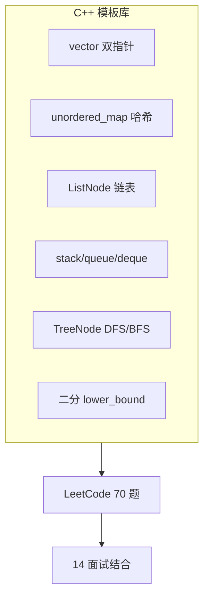

# 算法与数据结构（C++ 实现）

> **文件编码**：UTF-8。题解默认 **C++17 + STL**；配合 [14 面试专题](14-高频面试专题与场景题.md) 冲刺。

---

## 本章与上一章的关系

[01～12 章](00-学习路线图与说明.md) 偏语言、工程、系统——游戏/基建/算法岗面试仍要求 **LeetCode 中等手撕**。本章提供 **C++ STL 模板** 与 **70 题清单**，与 [Python 13](../Python/13-算法与数据结构基础.md) / [Java 13](../Java/13-算法与数据结构基础.md) 题单对齐，代码全部改为 C++。

> **原理与手写实现**请先学 [数据结构 01～10](../../数据结构/00-学习路线图与说明.md)；本章侧重 **C++ STL 手撕**。

| 上一章（12） | 本章（13） | 下一章（14） |
|--------------|------------|--------------|
| 复杂度与性能 | O(n) 意识刷题 | 内存/虚函数八股 |
| mini-http 优化 | vector/map 模板 | 场景表达 |



---

## 1. 为什么 C++ 选手要刷算法

- 笔试/机考常用 C++ 标准库
- 面试考察 **复杂度 + 代码质量**（边界、const 引用）
- 理解 `unordered_map` 均摊 O(1)、`priority_queue` 堆

**与后端关系**：索引 B+ 树、LRU、一致性 hash 都建立在数据结构之上。

---

## 2. 刷题优先级

| 阶段 | 时长 | 目标 |
|------|------|------|
| 第一遍 | 4～6 周 | Easy 60 题 + 模板 |
| 第二遍 | 2～3 周 | 错题 + Medium 20 题 |
| 冲刺 | 面试前 1 周 | 每日 3 题保持手感 |

**平台**：LeetCode 中文站、牛客。按标签刷，不随机。

---

## 3. 复杂度速查

| 符号 | 含义 | C++ 例子 |
|------|------|----------|
| O(1) | 常数 | `unordered_map::find` 均摊 |
| O(log n) | 对数 | `set` 查找、二分 |
| O(n) | 线性 | 单次遍历 vector |
| O(n log n) | 线性对数 | `sort` |
| O(n²) | 平方 | 双层 for |

---

## 4. 链表节点定义

```cpp
struct ListNode {
    int val;
    ListNode* next;
    ListNode(int x) : val(x), next(nullptr) {}
};
```

### 4.1 反转链表（206）

```cpp
ListNode* reverseList(ListNode* head) {
    ListNode* prev = nullptr;
    while (head) {
        ListNode* nxt = head->next;
        head->next = prev;
        prev = head;
        head = nxt;
    }
    return prev;
}
```

### 4.2 快慢指针找中点

```cpp
ListNode* middleNode(ListNode* head) {
    ListNode *slow = head, *fast = head;
    while (fast && fast->next) {
        slow = slow->next;
        fast = fast->next->next;
    }
    return slow;
}
```

---

## 5. 数组与双指针

### 5.1 两数之和（1）

```cpp
#include <unordered_map>
#include <vector>

std::vector<int> twoSum(const std::vector<int>& nums, int target) {
    std::unordered_map<int, int> idx;
    for (int i = 0; i < static_cast<int>(nums.size()); ++i) {
        int need = target - nums[i];
        auto it = idx.find(need);
        if (it != idx.end()) return {it->second, i};
        idx[nums[i]] = i;
    }
    return {};
}
```

### 5.2 有序数组双指针（167 变体）

```cpp
std::vector<int> twoSumSorted(std::vector<int>& nums, int target) {
    int lo = 0, hi = static_cast<int>(nums.size()) - 1;
    while (lo < hi) {
        int s = nums[lo] + nums[hi];
        if (s == target) return {lo, hi};
        if (s < target) ++lo;
        else --hi;
    }
    return {};
}
```

---

## 6. 滑动窗口

### 6.1 无重复最长子串（3）

```cpp
#include <string>
#include <unordered_map>

int lengthOfLongestSubstring(const std::string& s) {
    std::unordered_map<char, int> last;
    int left = 0, ans = 0;
    for (int right = 0; right < static_cast<int>(s.size()); ++right) {
        char c = s[right];
        if (last.count(c) && last[c] >= left)
            left = last[c] + 1;
        last[c] = right;
        ans = std::max(ans, right - left + 1);
    }
    return ans;
}
```

---

## 7. 栈与队列

### 7.1 有效括号（20）

```cpp
#include <stack>
#include <string>

bool isValid(const std::string& s) {
    std::stack<char> st;
    for (char c : s) {
        if (c == '(' || c == '[' || c == '{') st.push(c);
        else {
            if (st.empty()) return false;
            char top = st.top(); st.pop();
            if ((c == ')' && top != '(') ||
                (c == ']' && top != '[') ||
                (c == '}' && top != '{')) return false;
        }
    }
    return st.empty();
}
```

### 7.2 层序遍历（102）

```cpp
#include <queue>
#include <vector>

struct TreeNode {
    int val;
    TreeNode *left, *right;
    TreeNode(int x) : val(x), left(nullptr), right(nullptr) {}
};

std::vector<std::vector<int>> levelOrder(TreeNode* root) {
    if (!root) return {};
    std::queue<TreeNode*> q;
    q.push(root);
    std::vector<std::vector<int>> ans;
    while (!q.empty()) {
        int sz = static_cast<int>(q.size());
        std::vector<int> level;
        for (int i = 0; i < sz; ++i) {
            TreeNode* node = q.front(); q.pop();
            level.push_back(node->val);
            if (node->left) q.push(node->left);
            if (node->right) q.push(node->right);
        }
        ans.push_back(std::move(level));
    }
    return ans;
}
```

---

## 8. 二分查找

```cpp
#include <vector>

int binarySearch(const std::vector<int>& nums, int target) {
    int lo = 0, hi = static_cast<int>(nums.size()) - 1;
    while (lo <= hi) {
        int mid = lo + (hi - lo) / 2;
        if (nums[mid] == target) return mid;
        if (nums[mid] < target) lo = mid + 1;
        else hi = mid - 1;
    }
    return -1;
}
```

**STL 版**：`std::lower_bound(nums.begin(), nums.end(), target)`。

---

## 9. 回溯

### 9.1 全排列（46）

```cpp
#include <vector>

std::vector<std::vector<int>> permute(std::vector<int> nums) {
    std::vector<std::vector<int>> ans;
    std::vector<int> path;
    std::vector<bool> used(nums.size(), false);

    std::function<void()> dfs = [&]() {
        if (path.size() == nums.size()) {
            ans.push_back(path);
            return;
        }
        for (int i = 0; i < static_cast<int>(nums.size()); ++i) {
            if (used[i]) continue;
            used[i] = true;
            path.push_back(nums[i]);
            dfs();
            path.pop_back();
            used[i] = false;
        }
    };
    dfs();
    return ans;
}
```

---

## 10. C++ 刷题技巧

| 技巧 | 头文件 | 用途 |
|------|--------|------|
| `unordered_map` / `unordered_set` | `<unordered_map>` | O(1) 查找 |
| `priority_queue` | `<queue>` | TopK、合并 K 链表 |
| `deque` | `<deque>` | BFS、滑动窗口 |
| `sort` / `lower_bound` | `<algorithm>` | 排序、二分 |
| `numeric` | `<numeric>` | 前缀和 |
| `function` + lambda | `<functional>` | DFS 闭包 |

**注意**：递归深度大时改迭代或显式栈；LeetCode 数据规模要报 **INT 溢出**（用 `long long`）。

---

## 11. 刷题清单（70 题）

与 Python/Java 13 章一致。**B**=必做，**R**=推荐。

### 11.1 数组 / 双指针（12）

| # | 题号 | 题目 | 难度 | 标记 |
|---|------|------|------|------|
| 1 | 1 | 两数之和 | E | B |
| 2 | 26 | 删除有序数组重复项 | E | B |
| 3 | 27 | 移除元素 | E | B |
| 4 | 88 | 合并两个有序数组 | E | B |
| 5 | 283 | 移动零 | E | B |
| 6 | 15 | 三数之和 | M | R |
| 7 | 11 | 盛最多水的容器 | M | R |
| 8 | 42 | 接雨水 | H | R |
| 9 | 56 | 合并区间 | M | R |
| 10 | 189 | 轮转数组 | M | R |
| 11 | 238 | 除自身以外数组的乘积 | M | R |
| 12 | 41 | 缺失的第一个正数 | H | R |

### 11.2 字符串 / 滑动窗口（8）

| # | 题号 | 题目 | 难度 | 标记 |
|---|------|------|------|------|
| 13 | 125 | 验证回文串 | E | B |
| 14 | 344 | 反转字符串 | E | B |
| 15 | 3 | 无重复字符最长子串 | M | B |
| 16 | 424 | 替换后最长重复字符 | M | R |
| 17 | 76 | 最小覆盖子串 | H | R |
| 18 | 438 | 找到字符串中所有字母异位词 | M | R |
| 19 | 567 | 字符串的排列 | M | R |
| 20 | 5 | 最长回文子串 | M | R |

### 11.3 哈希（8）

| # | 题号 | 题目 | 难度 | 标记 |
|---|------|------|------|------|
| 21 | 217 | 存在重复元素 | E | B |
| 22 | 242 | 有效的字母异位词 | E | B |
| 23 | 349 | 两个数组的交集 | E | B |
| 24 | 128 | 最长连续序列 | M | B |
| 25 | 347 | 前 K 个高频元素 | M | B |
| 26 | 49 | 字母异位词分组 | M | R |
| 27 | 36 | 有效的数独 | M | R |
| 28 | 380 | O(1) 时间插入删除获取随机 | M | R |

### 11.4 链表（10）

| # | 题号 | 题目 | 难度 | 标记 |
|---|------|------|------|------|
| 29 | 206 | 反转链表 | E | B |
| 30 | 21 | 合并两个有序链表 | E | B |
| 31 | 141 | 环形链表 | E | B |
| 32 | 876 | 链表的中间结点 | E | B |
| 33 | 203 | 移除链表元素 | E | B |
| 34 | 160 | 相交链表 | E | B |
| 35 | 19 | 删除链表的倒数第 N 个结点 | M | B |
| 36 | 142 | 环形链表 II | M | R |
| 37 | 148 | 排序链表 | M | R |
| 38 | 23 | 合并 K 个升序链表 | H | R |

### 11.5 栈 / 队列（8）

| # | 题号 | 题目 | 难度 | 标记 |
|---|------|------|------|------|
| 39 | 20 | 有效的括号 | E | B |
| 40 | 155 | 最小栈 | M | B |
| 41 | 739 | 每日温度 | M | B |
| 42 | 225 | 用队列实现栈 | E | B |
| 43 | 232 | 用栈实现队列 | E | B |
| 44 | 84 | 柱状图中最大矩形 | H | R |
| 45 | 394 | 字符串解码 | M | R |
| 46 | 946 | 验证栈序列 | M | R |

### 11.6 二叉树（12）

| # | 题号 | 题目 | 难度 | 标记 |
|---|------|------|------|------|
| 47 | 104 | 二叉树最大深度 | E | B |
| 48 | 100 | 相同的树 | E | B |
| 49 | 101 | 对称二叉树 | E | B |
| 50 | 226 | 翻转二叉树 | E | B |
| 51 | 102 | 层序遍历 | M | B |
| 52 | 94 | 中序遍历 | E | B |
| 53 | 108 | 将有序数组转为 BST | E | B |
| 54 | 110 | 平衡二叉树 | E | B |
| 55 | 199 | 二叉树右视图 | M | R |
| 56 | 236 | 最近公共祖先 | M | R |
| 57 | 98 | 验证 BST | M | R |
| 58 | 124 | 二叉树最大路径和 | H | R |

### 11.7 二分 / 排序（6）

| # | 题号 | 题目 | 难度 | 标记 |
|---|------|------|------|------|
| 59 | 704 | 二分查找 | E | B |
| 60 | 35 | 搜索插入位置 | E | B |
| 61 | 34 | 查找元素第一个和最后一个位置 | M | B |
| 62 | 33 | 搜索旋转排序数组 | M | R |
| 63 | 153 | 寻找旋转最小值 | M | R |
| 64 | 215 | 数组第 K 个最大元素 | M | B |

### 11.8 回溯 / DFS（6）

| # | 题号 | 题目 | 难度 | 标记 |
|---|------|------|------|------|
| 65 | 78 | 子集 | M | B |
| 66 | 46 | 全排列 | M | B |
| 67 | 39 | 组合总和 | M | R |
| 68 | 79 | 单词搜索 | M | R |
| 69 | 131 | 分割回文串 | M | R |
| 70 | 22 | 括号生成 | M | R |

**计 70 题**；扩展：53 最大子数组和、200 岛屿数量、146 LRU、207 课程表。

---

## 12. TopK 与堆模板（347）

```cpp
#include <queue>
#include <unordered_map>
#include <vector>

std::vector<int> topKFrequent(std::vector<int>& nums, int k) {
    std::unordered_map<int, int> cnt;
    for (int x : nums) ++cnt[x];
    using P = std::pair<int, int>; // freq, num
    auto cmp = [](const P& a, const P& b) { return a.first > b.first; };
    std::priority_queue<P, std::vector<P>, decltype(cmp)> pq(cmp);
    for (auto& [num, freq] : cnt) {
        pq.push({freq, num});
        if (static_cast<int>(pq.size()) > k) pq.pop();
    }
    std::vector<int> ans;
    while (!pq.empty()) {
        ans.push_back(pq.top().second);
        pq.pop();
    }
    return ans;
}
```

**要点**：维护大小为 k 的 **小顶堆**（按频率），堆顶是 k 个里最小的，新来的更大就 pop 堆顶。复杂度 O(n log k)。

---

## 12.1 堆的 C++ 用法速查

| 需求 | 容器 | 默认 | 改法 |
|------|------|------|------|
| 大顶堆（最大优先） | `priority_queue<int>` | 大顶 | 默认即可 |
| 小顶堆 | `priority_queue<int, vector<int>, greater<int>>` | - | `greater` |
| 自定义键 | 存 `pair` + cmp lambda | - | 见 347 |

```cpp
#include <queue>
#include <vector>
#include <functional>

// 大顶堆
std::priority_queue<int> maxHeap;
maxHeap.push(3);
maxHeap.push(1);
int top = maxHeap.top(); // 3

// 小顶堆
std::priority_queue<int, std::vector<int>, std::greater<int>> minHeap;
```

---

## 12.2 数组第 K 个最大元素（215）

**思路**：维护大小为 k 的小顶堆，遍历 nums，大于堆顶则 pop 再 push；最终堆顶即第 k 大。

```cpp
#include <queue>
#include <vector>

int findKthLargest(std::vector<int>& nums, int k) {
    auto cmp = [](int a, int b) { return a > b; }; // 小顶堆
    std::priority_queue<int, std::vector<int>, decltype(cmp)> pq(cmp);
    for (int x : nums) {
        pq.push(x);
        if (static_cast<int>(pq.size()) > k) pq.pop();
    }
    return pq.top();
}
```

**变体**：n 很大 k 很小用堆 O(n log k)；k 接近 n 可用 `nth_element` O(n) 平均。

```cpp
#include <algorithm>
int findKthLargestNth(std::vector<int>& nums, int k) {
    int n = static_cast<int>(nums.size());
    std::nth_element(nums.begin(), nums.begin() + (n - k), nums.end());
    return nums[n - k];
}
```

---

## 12.3 合并 K 个升序链表（23）

**思路**：K 路归并，小顶堆存 `{节点值, 节点指针}`，每次 pop 最小接上新链，push 其 next。

```cpp
#include <queue>
#include <vector>

ListNode* mergeKLists(std::vector<ListNode*>& lists) {
    using Entry = std::pair<int, ListNode*>;
    auto cmp = [](const Entry& a, const Entry& b) { return a.first > b.first; };
    std::priority_queue<Entry, std::vector<Entry>, decltype(cmp)> pq(cmp);
    for (ListNode* head : lists)
        if (head) pq.push({head->val, head});
    ListNode dummy(0);
    ListNode* tail = &dummy;
    while (!pq.empty()) {
        ListNode* node = pq.top().second;
        pq.pop();
        tail->next = node;
        tail = node;
        if (node->next) pq.push({node->next->val, node->next});
    }
    return dummy.next;
}
```

复杂度 O(N log K)，N 为总节点数，K 为链表条数。

---

## 12.4 数据流中位数（295 模板）

双堆：大顶堆存较小一半，小顶堆存较大一半，保持平衡。

```cpp
#include <queue>
#include <vector>

class MedianFinder {
    std::priority_queue<int> lo_; // 大顶
    std::priority_queue<int, std::vector<int>, std::greater<int>> hi_; // 小顶
public:
    void addNum(int num) {
        lo_.push(num);
        hi_.push(lo_.top());
        lo_.pop();
        if (lo_.size() < hi_.size()) {
            lo_.push(hi_.top());
            hi_.pop();
        }
    }
    double findMedian() const {
        if (lo_.size() > hi_.size()) return lo_.top();
        return (lo_.top() + hi_.top()) / 2.0;
    }
};
```

---

## 13. LRU 缓存（146）完整模板

**结构**：`list` 维护访问顺序（头=最近），`unordered_map` 存 key → list 迭代器，get/put 均 O(1)。

```cpp
#include <list>
#include <unordered_map>

class LRUCache {
    int cap_;
    std::list<std::pair<int, int>> lst_; // front = MRU
    std::unordered_map<int, std::list<std::pair<int, int>>::iterator> mp_;

    void touch(std::list<std::pair<int, int>>::iterator it) {
        lst_.splice(lst_.begin(), lst_, it);
    }

public:
    explicit LRUCache(int capacity) : cap_(capacity) {}

    int get(int key) {
        auto it = mp_.find(key);
        if (it == mp_.end()) return -1;
        touch(it->second);
        return it->second->second;
    }

    void put(int key, int value) {
        if (auto it = mp_.find(key); it != mp_.end()) {
            it->second->second = value;
            touch(it->second);
            return;
        }
        if (static_cast<int>(lst_.size()) >= cap_) {
            int oldKey = lst_.back().first;
            lst_.pop_back();
            mp_.erase(oldKey);
        }
        lst_.emplace_front(key, value);
        mp_[key] = lst_.begin();
    }
};
```

**面试追问**：
- 为什么用 `list::splice`？—— 移动节点 O(1)，不分配新节点
- 线程安全？—— 加 `mutex` 或分片 LRU（Redis 风格）
- 与 Redis LRU 区别？—— 本实现精确 LRU；Redis 近似采样淘汰

**后端关联**：本地缓存、连接池、Page 置换都可类比 LRU。

---

## 14. 并查集 Union-Find 模板

**接口**：`find` 带路径压缩，`unite` 按秩合并，近乎 O(1) 均摊。

```cpp
#include <vector>

class UnionFind {
    std::vector<int> parent_, rank_;
public:
    explicit UnionFind(int n) : parent_(n), rank_(n, 0) {
        for (int i = 0; i < n; ++i) parent_[i] = i;
    }
    int find(int x) {
        if (parent_[x] != x) parent_[x] = find(parent_[x]);
        return parent_[x];
    }
    bool unite(int a, int b) {
        int ra = find(a), rb = find(b);
        if (ra == rb) return false;
        if (rank_[ra] < rank_[rb]) std::swap(ra, rb);
        parent_[rb] = ra;
        if (rank_[ra] == rank_[rb]) ++rank_[ra];
        return true;
    }
    bool connected(int a, int b) { return find(a) == find(b); }
};
```

### 14.1 岛屿数量（200）

```cpp
#include <vector>

int numIslands(std::vector<std::vector<char>>& grid) {
    if (grid.empty()) return 0;
    int m = static_cast<int>(grid.size());
    int n = static_cast<int>(grid[0].size());
    UnionFind uf(m * n);
    int water = 0;
    const int dx[4] = {1, -1, 0, 0}, dy[4] = {0, 0, 1, -1};
    for (int i = 0; i < m; ++i)
        for (int j = 0; j < n; ++j) {
            if (grid[i][j] == '0') { ++water; continue; }
            for (int d = 0; d < 4; ++d) {
                int ni = i + dx[d], nj = j + dy[d];
                if (ni >= 0 && ni < m && nj >= 0 && nj < n && grid[ni][nj] == '1')
                    uf.unite(i * n + j, ni * n + nj);
            }
        }
    int roots = 0;
    for (int i = 0; i < m * n; ++i)
        if (grid[i / n][i % n] == '1' && uf.find(i) == i) ++roots;
    return roots;
}
```

也可用 DFS/BFS；并查集适合 **动态连通性** 题。

### 14.2 课程表（207）

```cpp
#include <vector>

bool canFinish(int numCourses, std::vector<std::vector<int>>& prerequisites) {
    UnionFind uf(numCourses);
    std::vector<int> indeg(numCourses, 0);
    for (auto& e : prerequisites) {
        int a = e[1], b = e[0];
        if (uf.connected(a, b)) return false; // 成环（同集合内再加边）
        uf.unite(a, b);
        ++indeg[b];
    }
    // 标准写法用拓扑排序更直观；并查集需配合环检测
    std::vector<std::vector<int>> adj(numCourses);
    indeg.assign(numCourses, 0);
    for (auto& e : prerequisites) {
        adj[e[1]].push_back(e[0]);
        ++indeg[e[0]];
    }
    std::vector<int> q;
    for (int i = 0; i < numCourses; ++i)
        if (indeg[i] == 0) q.push_back(i);
    int seen = 0;
    for (size_t i = 0; i < q.size(); ++i) {
        int u = q[i];
        ++seen;
        for (int v : adj[u])
            if (--indeg[v] == 0) q.push_back(v);
    }
    return seen == numCourses;
}
```

**模板选择**：判环 + 拓扑 → **Kahn 入度队列**；仅连通分量 → **并查集**。

---

## 15. 最大子数组和（53）

```cpp
#include <algorithm>
#include <vector>
#include <limits>

int maxSubArray(const std::vector<int>& nums) {
    int cur = nums[0], best = nums[0];
    for (size_t i = 1; i < nums.size(); ++i) {
        cur = std::max(nums[static_cast<int>(i)], cur + nums[static_cast<int>(i)]);
        best = std::max(best, cur);
    }
    return best;
}
```

Kadane O(n) O(1)；面试常追问「若要不连续子序列」→ 全正取最大元素，含负用 DP。

---

## 16. 面试手撕技巧（C++）

1. **先问清**：数据范围、`n` 能否 0、能否改原数组
2. **说思路**：暴力 → 优化，报复杂度
3. **引用 const**：`const std::vector<int>& nums` 避免拷贝
4. **边界**：空 vector、单元素、全相同
5. **编译**：本地 `g++ -std=c++17 -O2 -Wall solution.cpp` 自测

---

## 14. 常见报错与排查

| 现象 | 原因 | 解决 |
|------|------|------|
| TLE | O(n²) | 换 hash / 双指针 / 二分 |
| MLE | 递归过深 | 改迭代 + 显式栈 |
| 段错误 | 空指针 / 越界 | 判 `if (!root)`、下标范围 |
| 链表死循环 | fast 未判 next | `while (fast && fast->next)` |
| WA 边界 | INT 溢出 | 用 `long long` |
| `redefinition of ListNode` | 重复 struct | LeetCode 已定义则勿再写 |
| `signed/unsigned compare` | size_t 与 int | 强转或 `static_cast` |
| 回溯超时 | 剪枝缺失 | 排序 + 提前 break |
| priority_queue 顺序错 | 默认大顶堆 | 自定义 cmp |
| 拷贝超时 | 传值大 vector | 用 const 引用 |
| LRU splice 后迭代器 | map 仍有效 | list 节点未销毁 |
| 并查集 TLE | 未路径压缩 | find 里压缩 |
| nth_element 下标错 | 第 k 大位置 | `n - k` 下标 |

---

## 17. 练习建议

### 基础（2 周）

1. 完成清单所有 **B** 标记 Easy（约 25 题）
2. 闭卷默写 §4～§9 模板

### 进阶（2 周）

3. 完成剩余 **B** + 10 道 **R** Medium
4. 每题写「思路 + 复杂度」笔记

### 挑战

5. 实现 LRU（146）用 `list` + `unordered_map`
6. 周赛 Easy+Medium 各 1 场
7. 闭卷手写 UnionFind + 200 岛屿 DFS 版
8. 215 分别用堆和 nth_element 实现并对比耗时

---

## 18. 参考答案（练习样例）

### 挑战 5：LRU 骨架

```cpp
#include <list>
#include <unordered_map>

class LRUCache {
    int cap;
    std::list<std::pair<int, int>> lst;
    std::unordered_map<int, std::list<std::pair<int, int>>::iterator> mp;
public:
    explicit LRUCache(int capacity) : cap(capacity) {}
    int get(int key) {
        auto it = mp.find(key);
        if (it == mp.end()) return -1;
        lst.splice(lst.begin(), lst, it->second);
        return it->second->second;
    }
    void put(int key, int value) {
        if (auto it = mp.find(key); it != mp.end()) {
            it->second->second = value;
            lst.splice(lst.begin(), lst, it->second);
            return;
        }
        if (static_cast<int>(lst.size()) >= cap) {
            mp.erase(lst.back().first);
            lst.pop_back();
        }
        lst.emplace_front(key, value);
        mp[key] = lst.begin();
    }
};
```

### 挑战 7：DFS 岛屿数量

```cpp
void dfs(std::vector<std::vector<char>>& g, int i, int j) {
    int m = static_cast<int>(g.size()), n = static_cast<int>(g[0].size());
    if (i < 0 || i >= m || j < 0 || j >= n || g[i][j] != '1') return;
    g[i][j] = '0';
    dfs(g, i + 1, j); dfs(g, i - 1, j); dfs(g, i, j + 1); dfs(g, i, j - 1);
}
int numIslandsDfs(std::vector<std::vector<char>>& grid) {
    int ans = 0;
    for (int i = 0; i < static_cast<int>(grid.size()); ++i)
        for (int j = 0; j < static_cast<int>(grid[0].size()); ++j)
            if (grid[i][j] == '1') { dfs(grid, i, j); ++ans; }
    return ans;
}
```

### 模板对照表

| 模板 | 章节 | LeetCode | 复杂度 |
|------|------|----------|--------|
| LRU list+map | §13 | 146 | get/put O(1) |
| 小顶堆 TopK | §12 | 347/215 | O(n log k) |
| K 路归并堆 | §12.3 | 23 | O(N log K) |
| 并查集 | §14 | 200/547 | 近乎 O(1) |
| Kadane | §15 | 53 | O(n) |

---

## 19. 学完标准

- [ ] 闭卷手写：反转链表、两数之和、有效括号、层序遍历、二分
- [ ] 完成清单至少 **40 道 B 题**
- [ ] 能分析时间/空间复杂度
- [ ] 熟练使用 `unordered_map`、`priority_queue`、`deque`
- [ ] 25 分钟内完成一道 Easy/Medium 手撕
- [ ] 能手写 LRU、UnionFind、K 路归并堆
- [ ] 能口述 LRU 与 Redis 淘汰策略差异

---

## 20. 与 examples 目录对照

| 模板 | 示例目录 | 说明 |
|------|----------|------|
| LRU / 堆 / 并查集 | `examples/algorithm-templates/` | 可单独 g++ 编译 |
| 综合刷题环境 | 本地 `solution.cpp` | 对照 §4～§15 |

详见 [examples/README.md](examples/README.md)。

---

## 下一章预告

[14 高频面试专题与场景题](14-高频面试专题与场景题.md) 聚焦 **内存模型、虚函数、移动语义、STL 选型、并发** 等 C++ 专属问答，与 13 章算法互补。

---

*下一章：14 高频面试专题与场景题*
