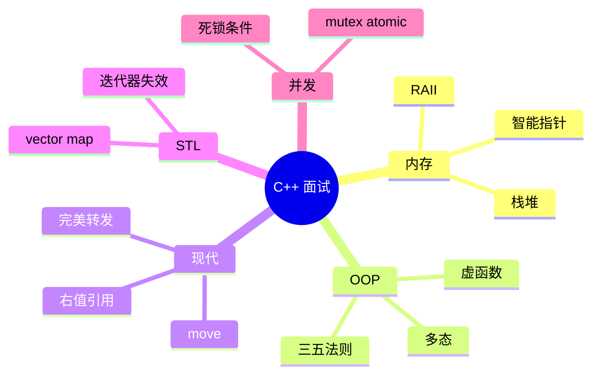
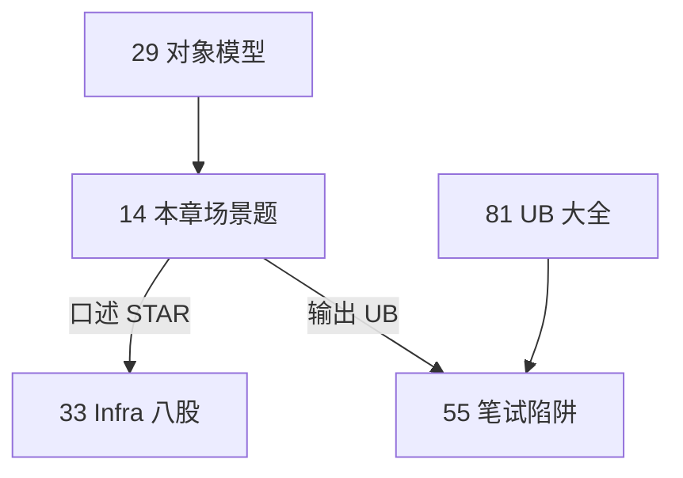

# 高频面试专题与场景题

> **文件编码**：UTF-8。C++ 内存/语言八股 + 场景表达；配合 [13 算法](13-算法与数据结构C++实现.md) 与 [00 路线图](00-学习路线图与说明.md)。

---

## 本章与上一章的关系

[13 章](13-算法与数据结构C++实现.md) 练手撕代码；C++ 岗（游戏、基建、嵌入式、量化）面试还有大量 **语言底层题**：堆栈、虚函数表、move、RAII、STL 复杂度、死锁——往往占 30～50 分钟。

本章按 **内存 → OOP/虚函数 → 移动语义 → STL → 并发** 组织 Q&A，并给 mini-http / 算法结合的 **场景话术**。

| 上一章（13） | 本章（14） | 下一章（15） |
|--------------|------------|--------------|
| LeetCode 模板 | 语言八股 | 知识总表索引 |
| 复杂度 | 内存/并发 | 自评勾选 |



---

## 0. 读前导读（零基础也能跟上）

### 0.1 用一句话弄懂本章

C++ 面试除算法外，还有 **内存、虚函数、move、STL、并发** 一大块八股——本章按 Q&A + 场景 STAR 组织，让你能 **2 分钟内讲清一个点并带项目例子**。

### 0.2 你需要提前知道什么

| 状态 | 动作 |
|------|------|
| 02/03/05 章薄弱 | 先回 [02 指针](02-指针引用与内存管理.md)、[03 OOP](03-面向对象与类设计.md) |
| 13 章题没刷 | 可并行；面试=算法+八股 |
| 没做过 mini-http | 09～12 章 STAR 故事会空；至少读 examples |
| 只准备 Java 面试 | 本章强调 C++ 无 GC、UB、值语义 |

### 0.3 本章知识地图（学完后应能勾选全部 ☐→☑）

- ☐ 3 分钟讲清栈/堆/RAII/三种智能指针
- ☐ 能画 vtable 并解释 virtual 析构
- ☐ 能解释 move 与 copy、三五法则
- ☐ 能对比 vector / map / unordered_map
- ☐ 能讲 mutex、死锁四条件、condition_variable
- ☐ 能答 Q28～Q45 中 ≥12 题
- ☐ 能手撕线程安全队列（Q41）
- ☐ 能讲 1 个 mini-http STAR 优化故事

### 0.4 建议学习时长与节奏

| 阶段 | 时长 | 内容 |
|------|------|------|
| §2～§5 内存/OOP/move | 90 min | 每题口述 2 min |
| §6～§9 STL/并发 | 60 min | 对照 04/08 章 |
| §10 场景 + Q28～Q47 | 90 min | 模拟面试 |
| 闭卷自测 | 30 min | ≥7/10 |

### 0.5 学完本章你能做什么（可验证的具体动作）

1. 白板画 Base/Derived 对象布局 + vptr
2. 10 分钟手写 Q41 线程安全队列骨架
3. 45 分钟模拟面试表（§13）自测一遍
4. 向面试官 STAR 讲 mini-http 压测优化（链 12 章）

**术语（虚函数表 vtable）**：含 **函数指针** 的表；多态运行时查表决定调哪个重写版本。
**生活类比**：vtable 像**电话总机**——同一个「拨号」（基类指针），接不同分机（派生类实现）。
**为什么重要**：C++ OOP 面试必问；不懂 vtable 说不清 `dynamic_cast` 与虚析构。
**本章用到的地方**：§2 Q1～Q5、§3 虚函数、§Q41 队列。

---

## 1. 面试答题结构

1. **一句话结论**
2. **原理**（2～3 点）
3. **代码或图示**（可选）
4. **项目/踩坑**（mini-http、08 线程池）
5. **对比**（与 Java/Python）

### 1.1 零基础解释列（Q1～Q10 扩充）

| 题 | 一句话结论 | 生活类比 |
|----|------------|----------|
| Q1 栈堆 | 栈自动、快、小；堆手动/智能指针、慢、大 | 栈=临时便签；堆=租仓库 |
| Q2 泄漏 | 分配后丢了指针没释放 | 水龙头开着忘了关 |
| Q3 new/malloc | new 调构造；malloc 只给字节 | 买精装房 vs 买毛坯 |
| Q4 智能指针 | unique 独占；shared 共享计数 | unique=单人房；shared=合租计数 |
| Q5 RAII | 构造拿资源析构放 | 自动门进出门关 |
| Q6 虚函数 | 运行时按对象类型调实现 | 总机转不同分机 |
| Q7 虚析构 | 基类指针 delete 派生要 virtual | 关公司要清算子公司 |
| Q8 move | 偷资源留空壳，少拷贝 | 搬家把家具搬走不复印 |
| Q9 三五法则 | 有自定义析构则考虑五函数 | 复杂合同要配终止条款 |
| Q10 vector/map | vector 连续 O(1)尾插；map 有序 O(log n) | vector=一排座位；map=字典 |

### 1.2 面试白板时间分配（45 分钟模拟）

| 分钟 | 内容 | 产出 |
|------|------|------|
| 0～5 | 自我介绍 + 项目 mini-http 一句 | 听清考察方向 |
| 5～20 | 内存 + 智能指针 + 虚函数 | 2～3 题带图 |
| 20～30 | STL + move | 1 题 + 复杂度 |
| 30～40 | 并发 mutex/cv 或手撕队列 | Q41 骨架 |
| 40～45 | 反问 + 总结 STAR | 留印象 |

### 1.3 mini-http STAR 完整话术（可背诵骨架）

**情境**：课程/自学项目，单线程 TCP 返回 HTML 与 JSON API。  
**任务**：压测 RPS 约 800，Valgrind 报 fd 与 string 相关泄漏。  
**行动**：09 CMake 多文件；12 perf 定位 `build_http_response` 与 `malloc`；RAII 封装 client fd；预生成 200 响应字节；11 加 access.log。  
**结果**：Release RPS 1200+，memcheck 0 lost；能 curl `/api/ping` 与优雅 SIGTERM。

### 1.4 与 Java/Python 对照速查（扩充）

| 主题 | C++ | Java | Python |
|------|-----|------|--------|
| 内存 | 手动+RAII | GC | GC |
| 并发 | thread+mutex | JUC | asyncio/GIL |
| 网络 | socket API | Socket/NIO | socket/httpx |
| 字符串 | `std::string` | String | str |
| 容器 | STL | Collections | list/dict |
| 未定义行为 | 数据竞争即 UB | 相对安全 | GIL 简化 |

---

## 2. 内存模型专题

### Q1：栈和堆的区别？

| 维度 | 栈 | 堆 |
|------|----|----|
| 分配 | 编译器/运行时自动 | `new` / `malloc` |
| 速度 | 快 | 较慢 |
| 生命周期 | 作用域结束释放 | 手动或智能指针 |
| 大小 | 较小（MB 级） | 较大 |
| 碎片 | 无 | 可能有 |

**追问**：局部变量、`std::vector` 对象本身在栈，其元素在堆。

### Q2：什么是内存泄漏？怎么防？

- 分配后未释放且失去指针 → 泄漏
- **防**：RAII（07 章）、`unique_ptr`/`shared_ptr`（05 章）、Valgrind（12 章）
- **场景**：mini-http 忘记 `close(client_fd)` 是 **fd 泄漏**，原理类似

### Q3：malloc/free 与 new/delete 区别？

- `new/delete` 调构造/析构；`malloc/free` 只分配字节
- C++ 对象必须用 `new` 或容器
- `new[]` 对应 `delete[]`

### Q4：智能指针怎么选？

| 类型 | 所有权 | 典型场景 |
|------|--------|----------|
| `unique_ptr` | 独占 | 工厂返回资源、PIMPL |
| `shared_ptr` | 共享计数 | 图结构、缓存（注意循环引用） |
| `weak_ptr` | 不增加计数 | 打破 shared 循环 |

```cpp
auto p = std::make_unique<int>(42);  // 推荐 make_* 
```

**深入解释**：`shared_ptr` 控制块与对象可能两次分配，`make_shared` 一次分配更高效。

### Q5：野指针、悬空引用？

- 野指针：未初始化或已释放仍使用
- 悬空：`string_view` 指向已销毁的 `string`
- **防**：释放后置 `nullptr`、缩小作用域、引用绑定生命周期更长对象

---

## 3. 虚函数与多态

### Q6：虚函数怎么实现？（概念级）

- 类含虚函数 → 有 **虚表 vtable** 指针
- 对象存 vptr，指向函数指针数组
- 动态绑定：运行时查 vtable 调用派生类重写

```cpp
class Base {
public:
    virtual void foo() { std::cout << "Base\n"; }
    virtual ~Base() = default;
};
class Derived : public Base {
public:
    void foo() override { std::cout << "Derived\n"; }
};

Base* p = new Derived();
p->foo();  // Derived
delete p;
```

### Q7：析构函数为什么常设 virtual？

- 通过基类指针 `delete` 派生对象时，非 virtual 只调基类析构 → 泄漏派生资源
- **规则**：多态基类 → 虚析构

### Q8：override 和 final？

- `override`：编译期检查是否真的重写
- `final`：禁止进一步重写 / 继承

### Q9：纯虚函数与抽象类？

```cpp
class Shape {
public:
    virtual double area() const = 0;
    virtual ~Shape() = default;
};
```

无法实例化 `Shape`，用于接口设计。

### Q10：多态 vs 模板静态多态？

| | 运行时多态 | 编译期（模板） |
|--|-----------|----------------|
| 机制 | virtual | 模板实例化 |
| 开销 | vtable 间接调用 | 可能内联 |
| 典型 | 游戏实体继承 | STL 算法 |

---

## 4. 移动语义与三五法则

### Q11：左值、右值、移动语义？

- **左值**：有名字、可取地址
- **右值**：临时量、`std::move(x)` 后的 x
- **移动构造**：「偷」资源指针，不 deep copy

```cpp
std::vector<int> a = {1, 2, 3};
std::vector<int> b = std::move(a);  // a 变空，b 接管
```

### Q12：三五法则？

若自定义以下任一，常需考虑全部五个：
- 析构函数
- 拷贝构造
- 拷贝赋值
- 移动构造
- 移动赋值

**Rule of zero**：成员皆 RAII 类型 → 不用手写五个。

### Q13：std::move 会移动吗？

- **不会**；仅 cast 为右值引用
- 真正移动发生在移动构造/赋值被调用处

### Q14：完美转发是什么？

```cpp
template<typename T>
void wrapper(T&& arg) {
    foo(std::forward<T>(arg));
}
```
保持值类别传给 `foo`，用于工厂 `make_unique` 实现。

---

## 5. STL 面试题

### Q15：vector 扩容机制？

- 容量不足 → 分配新堆数组（通常 2 倍）→ 移动/拷贝元素 → 释放旧数组
- `push_back` 均摊 O(1)；**迭代器可能失效**

### Q16：vector vs list vs deque？

| 容器 | 随机访问 | 头插 | 适用 |
|------|----------|------|------|
| vector | O(1) | O(n) | 默认首选 |
| list | 否 | O(1) | 中间频繁插删（少） |
| deque | O(1) | O(1) | 双端队列 |

### Q17：map vs unordered_map？

| | map | unordered_map |
|--|-----|---------------|
| 底层 | 红黑树 | 哈希表 |
| 有序 | 是 | 否 |
| 查找 | O(log n) | 均摊 O(1) |
| 键要求 | `<` | `hash` + `==` |

### Q18：迭代器失效举例？

- `vector::push_back` 可能使全部迭代器失效
- `map::erase(it)` 仅该 it 失效，返回 next

### Q19：emplace_back vs push_back？

- `emplace_back` 原地构造，少一次拷贝/移动
- 例：`vec.emplace_back(1, 2)` 直接构造 pair

---

## 6. 并发专题

### Q20：mutex 与 atomic 选型？

- **mutex**：保护临界区，多语句逻辑
- **atomic**：单个变量无锁（计数器、flag）
- 不要为整个 `vector` 用 atomic，应 mutex 或 concurrent 容器（进阶）

### Q21：死锁四个条件？怎么避免？

1. 互斥 2. 持有并等待 3. 不可剥夺 4. 循环等待

**避免**：
- 固定加锁顺序
- `std::lock(m1, m2)` 同时锁
- 超时 `try_lock`（谨慎）

### Q22：条件变量用法？

```cpp
std::mutex mtx;
std::condition_variable cv;
std::queue<int> q;
bool done = false;

// 消费者
std::unique_lock lock(mtx);
cv.wait(lock, [&]{ return !q.empty() || done; });
```

**注意**：`wait` 必须配合 `unique_lock`；防止虚假唤醒用谓词。

### Q23：线程池思路？（08 章延伸）

- 任务队列 + N  worker 线程
- `condition_variable` 等待任务
- 关闭：设 stop flag，唤醒所有线程 join

### Q24：async vs thread？

- `std::async` 返回 `future`，可能用线程池实现
- 明确长期线程用 `std::thread`

---

## 7. 场景题：结合 mini-http

### 场景 A：如何实现简易 HTTP 服务？

**框架**：
1. socket → bind → listen → accept
2. recv 读请求行
3. 拼 HTTP 响应 send
4. close；日志写文件（11 章）

**追问**：单线程瓶颈 → select/epoll / 线程池（08 章）。

### 场景 B：线上 CPU 100% 怎么查？

1. `top`/`htop` 找进程
2. `perf top` 看热点函数
3. GDB 采样或打日志
4. 查是否死循环、锁竞争、日志过多

**STAR 简例**：
- S：压测 RPS 低
- T：定位瓶颈
- A：perf 发现 string 拼接热点，改预生成响应
- R：RPS +50%

### 场景 C：内存一直涨？

1. Valgrind massif / memcheck
2. 查 fd 泄漏 `/proc/pid/fd`
3. 查 `shared_ptr` 循环引用

---

## 8. 与 Java / Python 对照速答

| 问题 | Java | Python | C++ |
|------|------|--------|-----|
| 内存 | GC | 引用计数+GC | RAII+智能指针 |
| 多态 | interface/abstract | 鸭子类型 | virtual/模板 |
| 并发 | synchronized/JUC | GIL+threading | mutex/atomic |
| 字符串 | String 不可变 | str 不可变 | string 可改但常当值 |

---

## 9. 常见「踩坑」口述题

### Q25：以下输出什么？

```cpp
std::string s = "hello";
std::string_view sv = s;
s = "world";
// sv 悬空 — 未定义行为
```

### Q26：sizeof 空类？

- 通常为 1（C++ 要求不同对象地址不同）
- 有 virtual 再加 vptr 指针大小

### Q27：const 成员函数？

- 承诺不修改成员（mutable 除外）
- 可被 const 对象调用

---

## 9. 扩展语言专题（Q28～Q45）

### Q28：`explicit` 有什么用？

防止 **单参数构造函数** 被隐式用于隐式转换，减少意外临时对象。

```cpp
class Port {
    int v_;
public:
    explicit Port(int v) : v_(v) {}
};

void listen(Port p);
// listen(8080);        // 错：不能从 int 隐式转
listen(Port(8080));     // 对
```

**场景**：mini-http 配置端口用强类型 `Port`，避免与 `int fd` 混传。

### Q29：静态成员变量与函数？

- **静态成员变量**：全类一份，需在 cpp 中 **类外定义**（除 inline static C++17）
- **静态成员函数**：无 `this`，只能访问静态成员

```cpp
class Logger {
    static int count_;
public:
    static void info(const std::string& msg) {
        ++count_;
        // 写日志...
    }
};
int Logger::count_ = 0;
```

### Q30：`sizeof` 与内存对齐？

```cpp
struct A { char c; int i; };  // 常见 8 字节（padding）
struct B { int i; char c; };  // 可能 8，成员顺序影响布局
```

`alignof` / `alignas`（C++11）控制对齐；网络协议组包要注意 **#pragma pack** 与跨平台 ABI。

### Q31：`dynamic_cast` 何时用？

- **下行转换**（基类指针 → 派生）且需要运行时检查
- 失败返回 `nullptr`（指针）或抛 `bad_cast`（引用）
- 需要 **多态**（基类有虚函数）

```cpp
Base* p = new Derived();
if (auto* d = dynamic_cast<Derived*>(p)) {
    d->foo();
}
```

### Q32：`static_cast` / `reinterpret_cast` 区别？

| cast | 用途 | 风险 |
|------|------|------|
| static_cast | 数值转换、已知继承关系 | 中 |
| reinterpret_cast | 比特重新解释 | 高，UB 常见 |
| const_cast | 去掉 const | 仅改 const 属性 |
| dynamic_cast | 多态下行 | 低（有检查） |

面试：**C 风格 `(int*)p` 一律说「用 C++ cast 替代」。

### Q33：虚继承解决什么问题？

菱形继承时，派生类含 **两份** 基类子对象；`virtual` 继承使公共基类只一份。

```cpp
class A { public: virtual ~A() = default; };
class B : virtual public A {};
class C : virtual public A {};
class D : public B, public C {}; // 仅一份 A
```

游戏引擎组件系统偶见；日常业务较少手写。

### Q34：`std::enable_shared_from_this`？

在对象内部安全获取 `shared_ptr`，避免 `shared_ptr(this)` 双控制块。

```cpp
class Session : public std::enable_shared_from_this<Session> {
public:
    void async_send() {
        auto self = shared_from_this(); // 延长生命周期
        std::thread([self]{ /* 用 self */ }).detach();
    }
};
```

**前提**：对象已被 `shared_ptr` 管理；`this` 裸指针调 `shared_from_this` 未定义。

### Q35：lambda 捕获 `[=]` vs `[&]`？

- `[=]`：值捕获，默认 const，修改需 `mutable`
- `[&]`：引用捕获，注意 **悬空引用**（返回 lambda 时危险）
- 刷题 DFS 常用 `[&]` 捕获 `ans, path`；跨线程用值捕获或 `shared_ptr`

```cpp
int base = 0;
auto f = [&]() { ++base; }; // OK 若 base 生命期覆盖 f 使用
```

### Q36：`std::optional` / `std::variant`（C++17）？

```cpp
std::optional<int> parse_port(const std::string& s) {
    try {
        return std::stoi(s);
    } catch (...) {
        return std::nullopt;
    }
}
```

比「魔法数 -1」或输出参数更清晰；`variant` 适合类型安全的联合体（协议消息多态）。

### Q37：右值引用与 `std::forward` 再举例？

```cpp
template<typename T>
void emplace_vec(std::vector<T>& v, T&& x) {
    v.emplace_back(std::forward<T>(x));
}
```

若传左值则拷贝，传右值则移动——**完美转发**保持调用方值类别。

### Q38：内存序 `memory_order` 要掌握吗？

面试 **概念级**：`relaxed` < `acquire/release` < `seq_cst`（默认）；无锁队列/计数器可能用 `fetch_add(relaxed)`，发布数据用 `release` 配 `acquire` 读。

```cpp
std::atomic<bool> ready{false};
std::atomic<int> data{0};
// 写线程
data.store(42, std::memory_order_relaxed);
ready.store(true, std::memory_order_release);
// 读线程
while (!ready.load(std::memory_order_acquire)) {}
int v = data.load(std::memory_order_relaxed);
```

日常业务优先 `mutex`；量化/游戏引擎才深挖。

### Q39：自旋锁 vs `mutex`？

| | 自旋锁 | mutex |
|--|--------|-------|
| 等待 | 忙等 CPU | 阻塞让出 |
| 适用 | 临界区极短 | 一般业务 |
| C++ | `std::atomic` + CAS 手写 | `std::mutex` |

**原则**：临界区超过几十纳秒就用 mutex；错误自旋浪费 CPU。

### Q40：`select` / `poll` / `epoll` 怎么选？（10 章延伸）

| API | 复杂度 | 特点 |
|-----|--------|------|
| select | O(n) | fd 上限 FD_SETSIZE，易用 |
| poll | O(n) | 无硬上限，仍线性扫描 |
| epoll | O(1) 就绪 | Linux 高并发首选 |

**话术**：「mini-http v1 单线程 `accept`；v2 用 `select` 处理多连接；生产 C++ 网关用 epoll ET + 非阻塞 fd。」

### Q41：如何实现线程安全队列？（08 章手撕）

```cpp
#include <condition_variable>
#include <mutex>
#include <optional>
#include <queue>

template<typename T>
class ThreadSafeQueue {
    std::mutex mtx_;
    std::condition_variable cv_;
    std::queue<T> q_;
    bool closed_ = false;
public:
    void push(T v) {
        {
            std::lock_guard lock(mtx_);
            q_.push(std::move(v));
        }
        cv_.notify_one();
    }
    std::optional<T> pop() {
        std::unique_lock lock(mtx_);
        cv_.wait(lock, [&]{ return !q_.empty() || closed_; });
        if (q_.empty()) return std::nullopt;
        T v = std::move(q_.front());
        q_.pop();
        return v;
    }
    void close() {
        {
            std::lock_guard lock(mtx_);
            closed_ = true;
        }
        cv_.notify_all();
    }
};
```

**追问**：为何 `notify` 在锁外？—— 减少唤醒线程立即阻塞在 mutex 上的概率。

### Q42：HTTP Keep-Alive 与 `Connection: close`？

- HTTP/1.1 默认 **持久连接**，同 TCP 可多发请求
- mini-http 教学版常 `Connection: close` 简化「一请求一连接」
- 高 QPS 需 Keep-Alive + 解析 `Content-Length` / chunked（10 章进阶）

### Q43：`weak_ptr` 打破循环引用？

```cpp
struct Node {
    std::shared_ptr<Node> next;
    std::weak_ptr<Node> prev; // 若双向 shared 会泄漏
};
```

`weak_ptr::lock()` 得 `shared_ptr`，对象已销毁则空。

### Q44：模板与 `vector<bool>` 陷阱？

- `vector<bool>` 是 **位压缩代理**，不是标准容器，`data()` 行为特殊
- 需要 `bool*` 时用 `vector<char>` 或 `deque<bool>`

### Q45：未定义行为 UB 常见例子？

1. 有符号整数溢出
2. 空指针解引用
3. 数据竞争
4. `std::move` 后读 moved-from 非空状态
5. `string_view` 悬空

**答法**：「用 Sanitizer、编译器警告、RAII、静态分析减少 UB；Release -O2 下 UB 可能被优化成诡异结果。」

---

## 10. 场景题进阶

### 场景 D：设计一个简单对象池

**答**：预分配 `vector<T>` 或 slab，空闲链表 `stack<size_t>` 借还；构造一次复用，减少 `malloc` 压力——游戏服务端、高频交易常见。注意 **reset 状态** 与线程安全。

### 场景 E：shared_ptr 线程安全吗？

- **控制块引用计数** 是原子的（同一 `shared_ptr` 多线程拷贝安全）
- **所指对象** 多线程读写仍需 mutex
- 勿把 `shared_ptr` 当读写锁用

### 场景 F：如何实现零拷贝发送文件？

Linux `sendfile`；概念：**内核态** 直接把页缓存送到 socket，不经用户缓冲区。mini-http 静态文件服务可提一句，体现与 [计网](../../前端学习/计算机网络/02-TCP与UDP.md) 的联系。

---

## 11. 常见「踩坑」口述题（续）

### Q46：下面 vector 扩容几次？

```cpp
std::vector<int> v;
for (int i = 0; i < 1000; ++i) v.push_back(i);
```

**答**：取决于实现（通常 2 倍增长），约 log₂(1000) 次；可 `reserve(1000)` 一次到位。

### Q47：`std::map` 的 `operator[]` 陷阱？

```cpp
std::map<std::string, int> m;
int x = m["missing"]; // 插入默认值 0，改变 map
```

查是否存在用 `find` 或 `contains`（C++20）。

---

## 12. 常见报错与排查（面试编码）

| 现象 | 原因 | 解决 |
|------|------|------|
| 纯虚函数未实现 | 抽象类实例化 | 实现全部 pure virtual |
| slicing | 值传递基类对象 | 用引用/指针 |
| double free | 手动 delete 两次 | 用智能指针 |
| 移动后继续使用 | moved-from 状态未定义 | 仅对空容器等安全操作 |
| 数据竞争 | 多线程写同一变量 | mutex / atomic |
| 死锁 | 加锁顺序不一致 | std::lock |
| vector 越界 | `[]` 不检查 | `.at()` 或判 size |
| 迭代器失效 | erase 后仍用旧 it | `it = v.erase(it)` |
| bind 传引用 | 值拷贝临时对象 | std::ref |
| future.get 两次 | 只能 get 一次 | 存结果或 share_state |
| explicit 忘记 | 隐式转换 bug | 单参构造加 explicit |
| shared_from_this 崩 | 无外部 shared_ptr | 先 make_shared |
| epoll ET 漏读 | 边缘触发 | 循环读到 EAGAIN |

---

## 13. 练习建议

### 基础

1. 口述 Q1～Q5，每题 2 分钟内说完。
2. 白板画 vtable 与 Base/Derived 对象内存布局。

### 进阶

3. 手写 Rule-of-five 的 `Buffer` 类（char* + size）。
4. 实现线程安全队列（08 章）并讲死锁如何避免。

### 挑战

5. 模拟面试：30 分钟「内存 + 虚函数 + 一道链表题」。
6. 用 STAR 讲 mini-http 从 09 到 12 的优化历程。
7. 口述 Q28～Q35，每题带 1 个代码点。
8. 白板实现 §Q41 线程安全队列（10 分钟）。

### 模拟面试题单（45 分钟）

| 时段 | 内容 |
|------|------|
| 0～10 min | Q1～Q5 内存 + 智能指针 |
| 10～20 min | Q6～Q14 虚函数 + move |
| 20～30 min | Q15～Q24 STL + 并发 |
| 30～45 min | 手撕反转链表 + Q40 epoll 话术 |

---

## 14. 参考答案（练习）

### 进阶 3：Buffer 三五法则骨架

```cpp
class Buffer {
    char* data_;
    size_t size_;
public:
    Buffer(size_t n) : data_(new char[n]), size_(n) {}
    ~Buffer() { delete[] data_; }
    Buffer(const Buffer& o) : data_(new char[o.size_]), size_(o.size_) {
        std::copy(o.data_, o.data_ + size_, data_);
    }
    Buffer& operator=(const Buffer& o) {
        if (this != &o) {
            Buffer tmp(o);
            std::swap(data_, tmp.data_);
            std::swap(size_, tmp.size_);
        }
        return *this;
    }
    Buffer(Buffer&& o) noexcept : data_(o.data_), size_(o.size_) {
        o.data_ = nullptr; o.size_ = 0;
    }
    Buffer& operator=(Buffer&& o) noexcept {
        if (this != &o) {
            delete[] data_;
            data_ = o.data_; size_ = o.size_;
            o.data_ = nullptr; o.size_ = 0;
        }
        return *this;
    }
};
```

### 挑战 6：STAR 模板

**S**：课程项目 mini-http，单线程 TCP 返回 HTML。  
**T**：压测 RPS 低且 Valgrind 报 fd 泄漏。  
**A**：12 章 perf 定位 string 拼接；RAII 封装 fd；预生成 200 响应。  
**R**：RPS 从 800→1200，memcheck 零泄漏。

### 挑战 8：Q41 队列使用示例

```cpp
ThreadSafeQueue<int> q;
std::thread producer([&]{ for (int i = 0; i < 10; ++i) q.push(i); q.close(); });
std::thread consumer([&]{
    while (auto v = q.pop()) { /* 处理 *v */ }
});
producer.join();
consumer.join();
```

---

## 15. 学完标准

- [ ] 3 分钟内讲清栈/堆/RAII/三种智能指针
- [ ] 能画 vtable 并解释 virtual 析构
- [ ] 能解释 move 与 copy 区别及三五法则
- [ ] 能对比 vector/map/unordered_map 复杂度与选型
- [ ] 能讲 mutex、死锁四条件、condition_variable
- [ ] 结合 mini-http 完成 1 个 STAR 场景故事
- [ ] 能答 Q28～Q45 中至少 12 题
- [ ] 能手写线程安全队列或说明 epoll 选型

---

## 16. Q&A 索引速查

| 编号 | 主题 | 编号 | 主题 |
|------|------|------|------|
| Q1～Q5 | 内存/智能指针 | Q28～Q34 | explicit/对齐/cast |
| Q6～Q10 | 虚函数/多态 | Q35～Q39 | lambda/内存序/自旋锁 |
| Q11～Q14 | move/三五法则 | Q40～Q45 | epoll/队列/UB |
| Q15～Q19 | STL | 场景 A～F | mini-http/池/零拷贝 |
| Q20～Q24 | 并发 | Q46～Q47 | vector/map 踩坑 |

---

## 17. 常见问题 FAQ（扩充）

1. **C++ 面试和 Java 最大区别？** 手动内存、无 GC、UB、值语义、模板。
2. **智能指针一定不泄漏吗？** 循环引用仍会泄漏，用 weak_ptr 破环。
3. **为什么多态基类析构要 virtual？** 通过基类指针 delete 派生类，非 virtual 只析构基类部分。
4. **move 后还能用对象吗？** moved-from 状态有效但未指定；通常当空容器/0。
5. **vector 迭代器何时失效？** reallocate 时全部失效；erase 使其后失效。
6. **mutex 和 atomic 怎么选？** 简单计数 atomic；复合不变式用 mutex。
7. **死锁四个条件？** 互斥、占有且等待、不可抢占、循环等待——破坏任一即可。
8. **epoll 为什么比 select 快？** O(1) 就绪通知，无 FD_SETSIZE 上限，少线性扫描。
9. **UB 为什么 Release 下更难查？** 编译器假设 UB 不发生，可能优化成「不可能」行为。
10. **面试要先结论还是先原理？** 先一句话结论，再 2～3 点原理，最后项目例子。
11. **Q1～Q47 要全背吗？** 理解 + 口述；索引见 §16。
12. **和 13 章算法怎么分配时间？** 笔试前算法多刷；面试前一天 14+15 速过。

---

## 18. 闭卷自测

1. 栈上分配和堆上分配各举一例 C++ 代码。
2. unique_ptr 和 shared_ptr 适用场景各一句。
3. 虚函数如何实现运行时多态？（vtable 一句话）
4. Rule of five 是哪五个函数？
5. vector 尾部插入均摊复杂度？map 查找呢？
6. 数据竞争和死锁区别？
7. condition_variable 为什么必须配 mutex？
8. mini-http 中 fd 泄漏算哪种资源问题？怎么防？
9. `std::forward` 解决什么问题？
10. 综合：用 STAR 30 秒讲「压测发现 RPS 低」的故事骨架。

### 自测参考答案

1. 栈：`int x=0;`；堆：`new int(0)` 或 `make_unique<int>(0)`。
2. unique：独占所有权（文件句柄）；shared：共享所有权（图节点共享）。
3. 对象含 vptr 指向 vtable；调用虚函数通过 vptr 查表派发到实际类型。
4. 析构、拷贝构造、拷贝赋值、移动构造、移动赋值。
5. vector push_back 均摊 O(1)；map find O(log n)。
6. 竞争：并发写同一内存无同步；死锁：线程互相等锁。
7. wait 原子释放锁并睡眠；唤醒后重新持锁，避免竞态。
8. fd 是 OS 资源；RAII FdGuard、每条路径 close（12 章）。
9. 完美转发：保持参数左值/右值类别到 `emplace`。
10. S mini-http；T RPS 低+Valgrind 泄漏；A perf+静态响应+RAII；R RPS 800→1200。

---

## 19. 费曼检验

3 分钟解释：**为什么 C++ 多态基类析构函数必须是 virtual？**

**提纲对照**：

1. 通过基类指针 delete 时，编译器静态类型是基类。
2. 非 virtual 析构只调基类析构，派生类资源泄漏。
3. virtual 走 vtable，先派生后基类，完整释放。
4. 类比：关公司要按子公司清单逐一清算，不能只关总部招牌。

---

## 20. Primer Plus 深化：场景题进阶

> 本节在 Q1～Q47 与场景 A～F 基础上，系统追加 **内存布局画图题、vtable 推导题、STL 迭代器失效、并发陷阱、move/copy 辨析、UB 输出题**，并与 [33 C++ Infra 八股总表](33-C++Infra面试八股总表.md)、[55 笔试选择题与输出陷阱](55-大厂C++笔试选择题与代码输出陷阱题集.md) 互补——33 章偏 Infra 口述模板，55 章偏笔试输出，本章偏 **白板推导 + 代码输出**。

### 20.1 与 33 / 55 章的知识分工

| 类型 | 33 章 | 55 章 | 14 章（本节） |
|------|-------|-------|---------------|
| 形式 | 八股 Q&A 索引 | 单选/多选/输出 | 画图 + 推导 + 口述 |
| 深度 | 工程话术 | 陷阱速判 | 步骤化白板 |
| 示例 | epoll/Reactor | `i++ + ++i` | vtable 三步推导 |



---

### 20.2 内存布局画图题

#### 20.2.1 栈帧与局部变量

```cpp
void foo() {
    int a = 1;
    int arr[3] = {10, 20, 30};
    int* p = new int(99);
    // 画图：栈上 a、arr；堆上 *p；指针 p 本身在栈
}
```

**白板标准答案**：

```text
高地址
┌─────────────────┐
│  arr[2]=30      │
│  arr[1]=20      │
│  arr[0]=10      │
│  a = 1          │  ← 栈（foo 栈帧）
│  p ────────────────→ 堆: [99]
低地址（栈向低地址增长，示意即可）
```

#### 20.2.2 含虚函数的对象布局

```cpp
struct Base {
    virtual void f() {}
    int bx = 1;
};
struct Derived : Base {
    void f() override {}
    int dy = 2;
};
Derived d;
```

| 字段（典型 Itanium ABI） | 偏移 | 说明 |
|--------------------------|------|------|
| vptr | 0 | 指向 Derived vtable |
| bx | 8 | 基类子对象 |
| dy | 12+padding | 派生类成员 |

```text
Derived 对象 d:
┌──────────┬────┬────┐
│ vptr ────┼ bx │ dy │
└──────────┴────┴────┘
     │
     ▼
vtable: [&Derived::f, &typeinfo...]
```

与 [29 对象模型](29-对象模型与虚函数表深入.md) 对照：单继承 vptr 在对象首地址。

#### 20.2.3 多继承布局（进阶）

```cpp
struct A { virtual void fa(); int a; };
struct B { virtual void fb(); int b; };
struct C : A, B { void fa() override; void fb() override; int c; };
```

**面试要点**：`C` 对象可能含 **两个 vptr**（A 子对象一个、B 子对象一个）；`B*` 指向 `C` 时指针可能 **调整**（thunk）。白板画两个子对象区 + 各自 vptr。

#### 20.2.4 练习

1. 画出 `std::string s = "hello";` 在 SSO（小字符串优化）下的栈布局示意。
2. `vector<int> v; v.push_back(1);` 画 push 前后 `begin/end/capacity` 三角关系。

---

### 20.3 vtable 推导题

#### 20.3.1 标准三步法

**题目**：

```cpp
Base* p = new Derived();
p->f();   // 输出？
delete p;
```

**推导步骤**：

1. **静态类型** `p` 是 `Base*`；**动态类型** 对象是 `Derived`。
2. `f` 是 **virtual** → 运行时查 **对象内 vptr** → Derived vtable → `Derived::f`。
3. `delete p`：若 `~Base()` **非 virtual** → UB/只析构 Base 部分；**virtual** → `~Derived()` 再 `~Base()`。

#### 20.3.2 非虚隐藏

```cpp
struct Base { void g(); };
struct Derived : Base { void g(); };
Base* p = new Derived();
p->g();  // Base::g，非多态
```

#### 20.3.3 纯虚与抽象类

```cpp
struct I { virtual void run() = 0; virtual ~I() = default; };
struct Impl : I { void run() override { std::cout << "Impl\n"; } };
std::unique_ptr<I> p = std::make_unique<Impl>();
p->run();  // Impl；unique_ptr 正确 delete
```

#### 20.3.4 面试真题变体

| 代码特征 | 考点 |
|----------|------|
| 析构非 virtual + delete 基类指针 | 泄漏/UB |
| 构造/析构中调 virtual | **静态绑定**，不看派生 |
| `final` 类 | 不可再继承 |
| `override` 拼错 | 编译错误或隐藏 |

#### 20.3.5 练习

推导输出并说明 vtable 路径：

```cpp
struct A { virtual void f() { std::cout << "A"; } };
struct B : A { void f() override { std::cout << "B"; } };
struct C : B { void f() override { std::cout << "C"; } };
A* p = new B();
p->f();
p = new C();
p->f();
```

<details>
<summary>答案</summary>

`B` 然后 `C`；每次 new 的对象动态类型决定 vtable 条目。

</details>

---

### 20.4 STL 迭代器失效场景大全

#### 20.4.1 总表

| 容器 | 操作 | 哪些迭代器失效 |
|------|------|----------------|
| `vector` | `push_back`/`emplace_back` 若 reallocate | **全部** |
| `vector` | `insert` 中间 | insert 点及之后 |
| `vector` | `erase` | erase 点及之后 |
| `deque` | 首尾 insert/erase | **中间** iter 可能仍有效（实现相关，标准不保证中间稳定） |
| `list/forward_list` | insert/erase | **仅被删元素** |
| `map/set` | insert/erase | **仅被删元素** |
| `unordered_*` | rehash | **全部** |
| `unordered_*` | erase | 仅被删 |

#### 20.4.2 经典 bug 代码

```cpp
std::vector<int> v = {1, 2, 3, 4, 5};
for (auto it = v.begin(); it != v.end(); ++it) {
    if (*it % 2 == 0)
        v.erase(it);  // BUG：erase 后 it 失效，++it UB
}
```

**正确写法**：

```cpp
for (auto it = v.begin(); it != v.end(); ) {
    if (*it % 2 == 0)
        it = v.erase(it);
    else
        ++it;
}
// 或 C++20: std::erase_if(v, [](int x){ return x % 2 == 0; });
```

#### 20.4.3 vector + sort + 指针

```cpp
std::vector<std::string> vs = {"a", "bb", "ccc"};
std::sort(vs.begin(), vs.end());
const char* p = vs[1].c_str();
vs.push_back("dddddddd");  // 可能 reallocate → p 悬空
```

#### 20.4.4 面试口述模板

> vector 迭代器在 **reallocate** 时全部失效；erase 使 **该位置及之后** 失效；list/map  erase 仅失效被删节点；unordered 在 **load factor 触发 rehash** 时全失效。

与 [46 迭代器分类](46-迭代器分类与算法库完全指南.md)、[44 vector 原理](44-vector-deque-string容器原理与实务.md) 衔接。

---

### 20.5 并发陷阱题

#### 20.5.1 双检锁（DCL）未完整

```cpp
Singleton* Singleton::instance() {
    if (!inst_) {
        std::lock_guard<std::mutex> lk(m_);
        if (!inst_)
            inst_ = new Singleton();  // 仍可能重排！C++11 前 UB
    }
    return inst_;
}
```

C++11 后应：`static Singleton& instance() { static Singleton s; return s; }`（Meyers Singleton）。

#### 20.5.2 死锁四条件 + 破坏示例

| 条件 | 破坏手段 |
|------|----------|
| 互斥 | 用无锁结构（谨慎） |
| 占有且等待 | `std::lock(l1,l2)` 一次持有多锁 |
| 不可抢占 | 标准 mutex 不可抢占 |
| 循环等待 | 全局锁顺序：先 A 后 B |

```cpp
std::mutex m1, m2;
// 线程1: lock(m1); lock(m2);
// 线程2: lock(m2); lock(m1);  // 死锁
std::lock(m1, m2);  // 或 scoped_lock(m1,m2)
```

#### 20.5.3 condition_variable 误用

```cpp
std::mutex m;
std::condition_variable cv;
bool ready = false;

// 错误：wait 未配 unique_lock
cv.wait(m);  // 编译错误

// 正确
std::unique_lock<std::mutex> lk(m);
cv.wait(lk, []{ return ready; });
```

#### 20.5.4 atomic 不能保证复合操作

```cpp
std::atomic<int> balance{100};
void withdraw(int amt) {
    if (balance >= amt)   // TOCTOU：检查和扣款非原子
        balance -= amt;
}
// 两线程各 withdraw(60) 可能都通过检查 → 负余额
```

#### 20.5.5 练习

手撕 [Q41 线程安全队列](14-高频面试专题与场景题.md) 骨架，说明 `close()` 如何唤醒所有阻塞 `pop()`。

---

### 20.6 move / copy 辨析专题

#### 20.6.1 对比表

| 维度 | copy | move |
|------|------|------|
| 源对象 | 不变 | moved-from，有效但未指定 |
| 典型成本 | O(n) 深拷贝 | O(1) 指针窃取 |
| 触发 | 左值 | 右值、`std::move` |
| 三五法则 | 拷贝构造/赋值 | 移动构造/赋值 |

#### 20.6.2 代码辨析

```cpp
std::vector<int> a = {1,2,3};
std::vector<int> b = a;           // copy
std::vector<int> c = std::move(a); // move；a 可能为空 size
```

```cpp
void sink(std::string s);          // 按值：调用处 move 进参
void ref(const std::string& s);    // 只读不拷
void tmpl(std::string&& s);        // 仅右值
```

#### 20.6.3 返回值优化 RVO/NRVO

```cpp
std::vector<int> make() {
    std::vector<int> v = {1,2,3};
    return v;  // C++17 保证 RVO，通常无拷贝无 move
}
```

**面试**：不要对 **即将销毁的局部返回** 画蛇添足 `std::move(return v)`，可能 **阻止 NRVO**。

#### 20.6.4 Rule of Five 实现骨架

```cpp
class Buffer {
    char* data_;
    size_t size_;
public:
    ~Buffer() { delete[] data_; }
    Buffer(const Buffer& o) : size_(o.size_), data_(new char[size_]) {
        std::copy(o.data_, o.data_ + size_, data_);
    }
    Buffer& operator=(const Buffer& o) {
        if (this != &o) {
            delete[] data_;
            size_ = o.size_;
            data_ = new char[size_];
            std::copy(o.data_, o.data_ + size_, data_);
        }
        return *this;
    }
    Buffer(Buffer&& o) noexcept : data_(o.data_), size_(o.size_) {
        o.data_ = nullptr; o.size_ = 0;
    }
    Buffer& operator=(Buffer&& o) noexcept {
        if (this != &o) {
            delete[] data_;
            data_ = o.data_; size_ = o.size_;
            o.data_ = nullptr; o.size_ = 0;
        }
        return *this;
    }
};
```

与 [05 现代 C++](05-现代C++新特性.md)、[41 三五法则](41-构造析构与三五法则大全.md) 衔接。

---

### 20.7 UB 输出题精选（链 55 / 81 章）

> 下列题目 **无保证输出**；面试应先说「UB」再讨论编译器可能行为。详见 [81 UB 大全](81-未定义行为UB与语言陷阱大全.md)、[55 笔试题集](55-大厂C++笔试选择题与代码输出陷阱题集.md)。

#### 20.7.1 序列点 / 求值顺序

```cpp
int i = 0;
std::cout << i << " " << ++i;  // UB：同一表达式修改与读 i
```

#### 20.7.2 有符号溢出

```cpp
int x = INT_MAX;
std::cout << x + 1;  // UB；Release 可能变负数或不变
```

#### 20.7.3 悬空引用

```cpp
const int& r = 42;           // OK：字面量生命扩展
const std::string& s = std::string("hi");  // 危险：临时销毁后悬空
```

#### 20.7.4 越界

```cpp
int a[3] = {1,2,3};
std::cout << a[3];  // UB，可能看似「随机值」
```

#### 20.7.5 数据竞争

```cpp
int counter = 0;
void t1() { for(int i=0;i<1e6;++i) ++counter; }
void t2() { for(int i=0;i<1e6;++i) ++counter; }
// 两 thread 无同步 → UB，输出次数不确定
```

#### 20.7.6 答题模板（笔试/面试）

1. **是否 UB？** 是/否 + 条款（修改与读别名、溢出、竞争…）。
2. **本编译器可能输出？** 仅作参考，强调标准无保证。
3. **正确写法？** 给出等价安全代码。

#### 20.7.7 练习（自测）

判断 UB 并改安全：

```cpp
// 1
std::vector<int> v; v.reserve(2); v.push_back(1); v.push_back(2); v.push_back(3);
int* p = &v[0]; v.push_back(4); *p = 0;

// 2
std::thread t1([]{ f(); }); std::thread t2([]{ f(); });
void f() { static int x; ++x; }
```

<details>
<summary>答案要点</summary>

1. UB：`push_back(4)` reallocate 后 `p` 悬空。
2. UB：`++x` 数据竞争；改 `std::atomic<int>` 或 mutex。

</details>

---

### 20.8 综合场景题（白板 15 分钟）

#### 场景 G：对象池 + 多线程

**题**：设计 `ConnectionPool`，固定 N 条连接，多线程 `acquire()`/`release()`，超时返回 `nullopt`。

**考察点**：mutex + condition_variable、RAII `Guard` 自动 release、Spurious wakeup、`shared_ptr` 自定义 deleter。

#### 场景 H：shared_ptr 循环引用

```cpp
struct Node {
    std::shared_ptr<Node> next;
    std::shared_ptr<Node> prev;  // 双向 → 环，泄漏
};
```

**答**：一方改 `weak_ptr` 破环。

#### 场景 I：模板与虚函数

**题**：为何 C++ 模板不能 virtual？

**答**：virtual 需 vtable 固定偏移；模板实例化在编译期生成多份代码，对象布局与「运行时选实例」模型冲突（对比 Java 泛型擦除不同）。

---

### 20.9 深化 FAQ

1. **画图题要写到字节对齐吗？** 说清 vptr、成员顺序即可；补一句「padding 实现定义」加分。
2. **iterator 失效会 crash 吗？** 可能 SEGV 或静默错数据，属 UB。
3. **move 后 a.size() 是多少？** 标准不保证；通常 0，勿依赖。
4. **33 章和 14 章怎么复习？** 14 练推导；33 背 Infra 话术；55 每天 10 道输出。
5. **UB 题要不要猜输出？** 先 UB，再「GCC 13 -O2 可能…」，展示严谨。

---

### 20.10 深化练习

#### 基础

1. 白板画 `Derived` 单继承对象 + vtable 箭头。
2. 改错 §20.4.2 的 erase 循环。

#### 进阶

1. 完整推导 §20.3.5 输出并录 2 分钟口述。
2. 从 [55 章](55-大厂C++笔试选择题与代码输出陷阱题集.md) 选 5 题，用 §20.7.6 模板作答。

#### 挑战

1. 设计 `ThreadPool` 接口（不需全实现），说明任务队列 + 迭代器失效无关的原因（用 `deque` 或链表）。
2. 对照 [33 章](33-C++Infra面试八股总表.md) 补 3 条 mini-http STAR 可引用数据点。

---

### 20.11 深化闭卷自测

1. vector erase 后哪些 iterator 失效？
2. 构造/Base 中调 virtual 绑哪个函数？
3. `std::move` 是否移动？实际做什么？
4. 数据竞争与 data race 在 C++ 内存模型中的关系？
5. 双检锁 DCL 在 C++11 前为何 UB？
6. `unordered_map` rehash 对 iterator 的影响？
7. 33/55/81 三章分别解决什么题型？
8. 为何多态基类析构必须 virtual？（再答一次，≤30 字）

<details>
<summary>参考答案</summary>

1. 被删位置及之后全部失效。
2. 当前正在构造的子对象类型（Base 构造期调 Base::f）。
3. 不移动；仅 cast 成右值引用，供移动构造/赋值匹配。
4. 数据竞争即 UB；TSan 检测无同步并发访问。
5. `new` 与指针发布可能被重排，他线程见半初始化对象。
6. 全部 iterator 失效。
7. 33 Infra 口述；55 笔试输出；81 UB 系统分类。
8. delete 基类指针需派生析构，否则泄漏/UB。

</details>

---

### 20.12 与 33 章 Infra 八股交叉索引

| 14 章本节 | 33 章对应主题 | 联合复习法 |
|-----------|---------------|------------|
| §20.2 内存布局 | 33 内存/对齐 | 先画 14 图，再背 33 话术 |
| §20.3 vtable | 33 OOP/多态 | 三步推导 + STAR 项目 |
| §20.4 迭代器失效 | 33 STL | 口述失效表 + 手撕 erase |
| §20.5 并发陷阱 | 33 线程/锁 | Q41 队列 + 死锁四条件 |
| §20.6 move/copy | 33 现代 C++ | Rule of Five 白板 |
| §20.7 UB | 33 + 55 + 81 | 每天 5 道输出题 |

---

### 20.13 与 55 章笔试输出题对照练

#### 20.13.1 题型 A：printf/cout 混合

```cpp
printf("%d %d", i++, i++);  // UB，C++ 同样 UB
```

#### 20.13.2 题型 B：位运算与符号

```cpp
char c = 0xFF;
std::cout << (int)c;  // 可能 -1（若 char signed）
```

#### 20.13.3 题型 C：虚函数 + 指针算术

```cpp
struct Base { virtual void f(); int x; };
struct Der : Base { void f() override; int y; };
Base* p = new Der[2];
p[1].f();  // 若数组：仅首元素有完整 vptr 布局，+1 可能 UB/错派
```

#### 20.13.4 题型 D：模板推导

```cpp
template<typename T> void foo(T&& x);
int a = 0;
foo(a);   // T=int&，转发为左值
foo(0);   // T=int，右值
```

#### 20.13.5 每日 10 题计划（链 55 章）

| 周 | 重点 | 题量 |
|----|------|------|
| 1 | UB/求值顺序 | 10/天 |
| 2 | 虚函数/vtable | 10/天 |
| 3 | STL/迭代器 | 10/天 |
| 4 | 并发/智能指针 | 10/天 |

---

### 20.14 白板手写题：内存池 allocator（进阶）

**题**：实现简化 `PoolAllocator`：`allocate(n)` 从固定块池取，`deallocate` 归还；说明与 `std::vector` 自定义 allocator 关系。

**要点**：

```cpp
template<typename T, size_t BlockSize = 4096>
class PoolAllocator {
public:
    using value_type = T;
    T* allocate(std::size_t n) {
        // 从 free list 取 n*sizeof(T) 连续块，不足则 new char[]
    }
    void deallocate(T* p, std::size_t n) noexcept {
        // 挂回 free list
    }
};
```

链 [24 内存分配器](24-内存分配器与对象池.md)、[28 手写 STL](28-手写STL容器面试专题.md)。

---

### 20.15 模拟面试完整脚本（30 分钟）

| 分钟 | 面试官 | 你（参考要点） |
|------|--------|----------------|
| 0～2 | 自我介绍 | 学校/项目 mini-http 一句 |
| 2～8 | 栈堆区别 | §20.2 图 + RAII |
| 8～14 | vector 迭代器失效 | §20.4 表 + erase 写法 |
| 14～20 | 虚析构 | §20.3 三步 + 泄漏例子 |
| 20～26 | 手撕：线程安全队列 | Q41 mutex+cv |
| 26～30 | 反问 | 团队技术栈、代码 review |

---

### 20.16 深化附录：高频坑速查卡

```text
delete 基类指针     → 虚析构
vector erase 循环   → it = erase(it)
move 后继续使用     → 勿假设内容
shared_ptr 环       → weak_ptr
DCL 单例            → Meyers static
跨线程 UI           → Qt QueuedConnection
rehash              → unordered 迭代器全失效
有符号溢出          → UB，用 int64 或 unsigned
```

---

## 下一章预告

[15 补充知识点总表](15-补充知识点总表.md) 汇总 01～14 全部知识点，支持面试前 30 分钟自评勾选。

---

*下一章：15 补充知识点总表*
