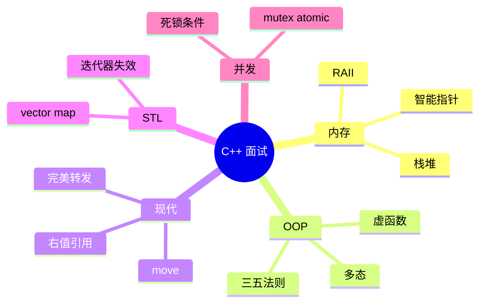

# 高频面试专题与场景题

> **文件编码**：UTF-8。C++ 内存/语言八股 + 场景表达；配合 [13 算法](13-算法与数据结构C++实现.md) 与 [00 路线图](00-学习路线图与说明.md)。

---

## 本章与上一章的关系

[13 章](13-算法与数据结构C++实现.md) 练手撕代码；C++ 岗（游戏、基建、嵌入式、量化）面试还有大量 **语言底层题**：堆栈、虚函数表、move、RAII、STL 复杂度、死锁——往往占 30～50 分钟。

本章按 **内存 → OOP/虚函数 → 移动语义 → STL → 并发** 组织 Q&A，并给 mini-http / 算法结合的 **场景话术**。

| 上一章（13） | 本章（14） | 下一章（15） |
|--------------|------------|--------------|
| LeetCode 模板 | 语言八股 | 知识总表索引 |
| 复杂度 | 内存/并发 | 自评勾选 |



---

## 1. 面试答题结构

1. **一句话结论**
2. **原理**（2～3 点）
3. **代码或图示**（可选）
4. **项目/踩坑**（mini-http、08 线程池）
5. **对比**（与 Java/Python）

---

## 2. 内存模型专题

### Q1：栈和堆的区别？

| 维度 | 栈 | 堆 |
|------|----|----|
| 分配 | 编译器/运行时自动 | `new` / `malloc` |
| 速度 | 快 | 较慢 |
| 生命周期 | 作用域结束释放 | 手动或智能指针 |
| 大小 | 较小（MB 级） | 较大 |
| 碎片 | 无 | 可能有 |

**追问**：局部变量、`std::vector` 对象本身在栈，其元素在堆。

### Q2：什么是内存泄漏？怎么防？

- 分配后未释放且失去指针 → 泄漏
- **防**：RAII（07 章）、`unique_ptr`/`shared_ptr`（05 章）、Valgrind（12 章）
- **场景**：mini-http 忘记 `close(client_fd)` 是 **fd 泄漏**，原理类似

### Q3：malloc/free 与 new/delete 区别？

- `new/delete` 调构造/析构；`malloc/free` 只分配字节
- C++ 对象必须用 `new` 或容器
- `new[]` 对应 `delete[]`

### Q4：智能指针怎么选？

| 类型 | 所有权 | 典型场景 |
|------|--------|----------|
| `unique_ptr` | 独占 | 工厂返回资源、PIMPL |
| `shared_ptr` | 共享计数 | 图结构、缓存（注意循环引用） |
| `weak_ptr` | 不增加计数 | 打破 shared 循环 |

```cpp
auto p = std::make_unique<int>(42);  // 推荐 make_* 
```

**深入解释**：`shared_ptr` 控制块与对象可能两次分配，`make_shared` 一次分配更高效。

### Q5：野指针、悬空引用？

- 野指针：未初始化或已释放仍使用
- 悬空：`string_view` 指向已销毁的 `string`
- **防**：释放后置 `nullptr`、缩小作用域、引用绑定生命周期更长对象

---

## 3. 虚函数与多态

### Q6：虚函数怎么实现？（概念级）

- 类含虚函数 → 有 **虚表 vtable** 指针
- 对象存 vptr，指向函数指针数组
- 动态绑定：运行时查 vtable 调用派生类重写

```cpp
class Base {
public:
    virtual void foo() { std::cout << "Base\n"; }
    virtual ~Base() = default;
};
class Derived : public Base {
public:
    void foo() override { std::cout << "Derived\n"; }
};

Base* p = new Derived();
p->foo();  // Derived
delete p;
```

### Q7：析构函数为什么常设 virtual？

- 通过基类指针 `delete` 派生对象时，非 virtual 只调基类析构 → 泄漏派生资源
- **规则**：多态基类 → 虚析构

### Q8：override 和 final？

- `override`：编译期检查是否真的重写
- `final`：禁止进一步重写 / 继承

### Q9：纯虚函数与抽象类？

```cpp
class Shape {
public:
    virtual double area() const = 0;
    virtual ~Shape() = default;
};
```

无法实例化 `Shape`，用于接口设计。

### Q10：多态 vs 模板静态多态？

| | 运行时多态 | 编译期（模板） |
|--|-----------|----------------|
| 机制 | virtual | 模板实例化 |
| 开销 | vtable 间接调用 | 可能内联 |
| 典型 | 游戏实体继承 | STL 算法 |

---

## 4. 移动语义与三五法则

### Q11：左值、右值、移动语义？

- **左值**：有名字、可取地址
- **右值**：临时量、`std::move(x)` 后的 x
- **移动构造**：「偷」资源指针，不 deep copy

```cpp
std::vector<int> a = {1, 2, 3};
std::vector<int> b = std::move(a);  // a 变空，b 接管
```

### Q12：三五法则？

若自定义以下任一，常需考虑全部五个：
- 析构函数
- 拷贝构造
- 拷贝赋值
- 移动构造
- 移动赋值

**Rule of zero**：成员皆 RAII 类型 → 不用手写五个。

### Q13：std::move 会移动吗？

- **不会**；仅 cast 为右值引用
- 真正移动发生在移动构造/赋值被调用处

### Q14：完美转发是什么？

```cpp
template<typename T>
void wrapper(T&& arg) {
    foo(std::forward<T>(arg));
}
```
保持值类别传给 `foo`，用于工厂 `make_unique` 实现。

---

## 5. STL 面试题

### Q15：vector 扩容机制？

- 容量不足 → 分配新堆数组（通常 2 倍）→ 移动/拷贝元素 → 释放旧数组
- `push_back` 均摊 O(1)；**迭代器可能失效**

### Q16：vector vs list vs deque？

| 容器 | 随机访问 | 头插 | 适用 |
|------|----------|------|------|
| vector | O(1) | O(n) | 默认首选 |
| list | 否 | O(1) | 中间频繁插删（少） |
| deque | O(1) | O(1) | 双端队列 |

### Q17：map vs unordered_map？

| | map | unordered_map |
|--|-----|---------------|
| 底层 | 红黑树 | 哈希表 |
| 有序 | 是 | 否 |
| 查找 | O(log n) | 均摊 O(1) |
| 键要求 | `<` | `hash` + `==` |

### Q18：迭代器失效举例？

- `vector::push_back` 可能使全部迭代器失效
- `map::erase(it)` 仅该 it 失效，返回 next

### Q19：emplace_back vs push_back？

- `emplace_back` 原地构造，少一次拷贝/移动
- 例：`vec.emplace_back(1, 2)` 直接构造 pair

---

## 6. 并发专题

### Q20：mutex 与 atomic 选型？

- **mutex**：保护临界区，多语句逻辑
- **atomic**：单个变量无锁（计数器、flag）
- 不要为整个 `vector` 用 atomic，应 mutex 或 concurrent 容器（进阶）

### Q21：死锁四个条件？怎么避免？

1. 互斥 2. 持有并等待 3. 不可剥夺 4. 循环等待

**避免**：
- 固定加锁顺序
- `std::lock(m1, m2)` 同时锁
- 超时 `try_lock`（谨慎）

### Q22：条件变量用法？

```cpp
std::mutex mtx;
std::condition_variable cv;
std::queue<int> q;
bool done = false;

// 消费者
std::unique_lock lock(mtx);
cv.wait(lock, [&]{ return !q.empty() || done; });
```

**注意**：`wait` 必须配合 `unique_lock`；防止虚假唤醒用谓词。

### Q23：线程池思路？（08 章延伸）

- 任务队列 + N  worker 线程
- `condition_variable` 等待任务
- 关闭：设 stop flag，唤醒所有线程 join

### Q24：async vs thread？

- `std::async` 返回 `future`，可能用线程池实现
- 明确长期线程用 `std::thread`

---

## 7. 场景题：结合 mini-http

### 场景 A：如何实现简易 HTTP 服务？

**框架**：
1. socket → bind → listen → accept
2. recv 读请求行
3. 拼 HTTP 响应 send
4. close；日志写文件（11 章）

**追问**：单线程瓶颈 → select/epoll / 线程池（08 章）。

### 场景 B：线上 CPU 100% 怎么查？

1. `top`/`htop` 找进程
2. `perf top` 看热点函数
3. GDB 采样或打日志
4. 查是否死循环、锁竞争、日志过多

**STAR 简例**：
- S：压测 RPS 低
- T：定位瓶颈
- A：perf 发现 string 拼接热点，改预生成响应
- R：RPS +50%

### 场景 C：内存一直涨？

1. Valgrind massif / memcheck
2. 查 fd 泄漏 `/proc/pid/fd`
3. 查 `shared_ptr` 循环引用

---

## 8. 与 Java / Python 对照速答

| 问题 | Java | Python | C++ |
|------|------|--------|-----|
| 内存 | GC | 引用计数+GC | RAII+智能指针 |
| 多态 | interface/abstract | 鸭子类型 | virtual/模板 |
| 并发 | synchronized/JUC | GIL+threading | mutex/atomic |
| 字符串 | String 不可变 | str 不可变 | string 可改但常当值 |

---

## 9. 常见「踩坑」口述题

### Q25：以下输出什么？

```cpp
std::string s = "hello";
std::string_view sv = s;
s = "world";
// sv 悬空 — 未定义行为
```

### Q26：sizeof 空类？

- 通常为 1（C++ 要求不同对象地址不同）
- 有 virtual 再加 vptr 指针大小

### Q27：const 成员函数？

- 承诺不修改成员（mutable 除外）
- 可被 const 对象调用

---

## 9. 扩展语言专题（Q28～Q45）

### Q28：`explicit` 有什么用？

防止 **单参数构造函数** 被隐式用于隐式转换，减少意外临时对象。

```cpp
class Port {
    int v_;
public:
    explicit Port(int v) : v_(v) {}
};

void listen(Port p);
// listen(8080);        // 错：不能从 int 隐式转
listen(Port(8080));     // 对
```

**场景**：mini-http 配置端口用强类型 `Port`，避免与 `int fd` 混传。

### Q29：静态成员变量与函数？

- **静态成员变量**：全类一份，需在 cpp 中 **类外定义**（除 inline static C++17）
- **静态成员函数**：无 `this`，只能访问静态成员

```cpp
class Logger {
    static int count_;
public:
    static void info(const std::string& msg) {
        ++count_;
        // 写日志...
    }
};
int Logger::count_ = 0;
```

### Q30：`sizeof` 与内存对齐？

```cpp
struct A { char c; int i; };  // 常见 8 字节（padding）
struct B { int i; char c; };  // 可能 8，成员顺序影响布局
```

`alignof` / `alignas`（C++11）控制对齐；网络协议组包要注意 **#pragma pack** 与跨平台 ABI。

### Q31：`dynamic_cast` 何时用？

- **下行转换**（基类指针 → 派生）且需要运行时检查
- 失败返回 `nullptr`（指针）或抛 `bad_cast`（引用）
- 需要 **多态**（基类有虚函数）

```cpp
Base* p = new Derived();
if (auto* d = dynamic_cast<Derived*>(p)) {
    d->foo();
}
```

### Q32：`static_cast` / `reinterpret_cast` 区别？

| cast | 用途 | 风险 |
|------|------|------|
| static_cast | 数值转换、已知继承关系 | 中 |
| reinterpret_cast | 比特重新解释 | 高，UB 常见 |
| const_cast | 去掉 const | 仅改 const 属性 |
| dynamic_cast | 多态下行 | 低（有检查） |

面试：**C 风格 `(int*)p` 一律说「用 C++ cast 替代」。

### Q33：虚继承解决什么问题？

菱形继承时，派生类含 **两份** 基类子对象；`virtual` 继承使公共基类只一份。

```cpp
class A { public: virtual ~A() = default; };
class B : virtual public A {};
class C : virtual public A {};
class D : public B, public C {}; // 仅一份 A
```

游戏引擎组件系统偶见；日常业务较少手写。

### Q34：`std::enable_shared_from_this`？

在对象内部安全获取 `shared_ptr`，避免 `shared_ptr(this)` 双控制块。

```cpp
class Session : public std::enable_shared_from_this<Session> {
public:
    void async_send() {
        auto self = shared_from_this(); // 延长生命周期
        std::thread([self]{ /* 用 self */ }).detach();
    }
};
```

**前提**：对象已被 `shared_ptr` 管理；`this` 裸指针调 `shared_from_this` 未定义。

### Q35：lambda 捕获 `[=]` vs `[&]`？

- `[=]`：值捕获，默认 const，修改需 `mutable`
- `[&]`：引用捕获，注意 **悬空引用**（返回 lambda 时危险）
- 刷题 DFS 常用 `[&]` 捕获 `ans, path`；跨线程用值捕获或 `shared_ptr`

```cpp
int base = 0;
auto f = [&]() { ++base; }; // OK 若 base 生命期覆盖 f 使用
```

### Q36：`std::optional` / `std::variant`（C++17）？

```cpp
std::optional<int> parse_port(const std::string& s) {
    try {
        return std::stoi(s);
    } catch (...) {
        return std::nullopt;
    }
}
```

比「魔法数 -1」或输出参数更清晰；`variant` 适合类型安全的联合体（协议消息多态）。

### Q37：右值引用与 `std::forward` 再举例？

```cpp
template<typename T>
void emplace_vec(std::vector<T>& v, T&& x) {
    v.emplace_back(std::forward<T>(x));
}
```

若传左值则拷贝，传右值则移动——**完美转发**保持调用方值类别。

### Q38：内存序 `memory_order` 要掌握吗？

面试 **概念级**：`relaxed` < `acquire/release` < `seq_cst`（默认）；无锁队列/计数器可能用 `fetch_add(relaxed)`，发布数据用 `release` 配 `acquire` 读。

```cpp
std::atomic<bool> ready{false};
std::atomic<int> data{0};
// 写线程
data.store(42, std::memory_order_relaxed);
ready.store(true, std::memory_order_release);
// 读线程
while (!ready.load(std::memory_order_acquire)) {}
int v = data.load(std::memory_order_relaxed);
```

日常业务优先 `mutex`；量化/游戏引擎才深挖。

### Q39：自旋锁 vs `mutex`？

| | 自旋锁 | mutex |
|--|--------|-------|
| 等待 | 忙等 CPU | 阻塞让出 |
| 适用 | 临界区极短 | 一般业务 |
| C++ | `std::atomic` + CAS 手写 | `std::mutex` |

**原则**：临界区超过几十纳秒就用 mutex；错误自旋浪费 CPU。

### Q40：`select` / `poll` / `epoll` 怎么选？（10 章延伸）

| API | 复杂度 | 特点 |
|-----|--------|------|
| select | O(n) | fd 上限 FD_SETSIZE，易用 |
| poll | O(n) | 无硬上限，仍线性扫描 |
| epoll | O(1) 就绪 | Linux 高并发首选 |

**话术**：「mini-http v1 单线程 `accept`；v2 用 `select` 处理多连接；生产 C++ 网关用 epoll ET + 非阻塞 fd。」

### Q41：如何实现线程安全队列？（08 章手撕）

```cpp
#include <condition_variable>
#include <mutex>
#include <optional>
#include <queue>

template<typename T>
class ThreadSafeQueue {
    std::mutex mtx_;
    std::condition_variable cv_;
    std::queue<T> q_;
    bool closed_ = false;
public:
    void push(T v) {
        {
            std::lock_guard lock(mtx_);
            q_.push(std::move(v));
        }
        cv_.notify_one();
    }
    std::optional<T> pop() {
        std::unique_lock lock(mtx_);
        cv_.wait(lock, [&]{ return !q_.empty() || closed_; });
        if (q_.empty()) return std::nullopt;
        T v = std::move(q_.front());
        q_.pop();
        return v;
    }
    void close() {
        {
            std::lock_guard lock(mtx_);
            closed_ = true;
        }
        cv_.notify_all();
    }
};
```

**追问**：为何 `notify` 在锁外？—— 减少唤醒线程立即阻塞在 mutex 上的概率。

### Q42：HTTP Keep-Alive 与 `Connection: close`？

- HTTP/1.1 默认 **持久连接**，同 TCP 可多发请求
- mini-http 教学版常 `Connection: close` 简化「一请求一连接」
- 高 QPS 需 Keep-Alive + 解析 `Content-Length` / chunked（10 章进阶）

### Q43：`weak_ptr` 打破循环引用？

```cpp
struct Node {
    std::shared_ptr<Node> next;
    std::weak_ptr<Node> prev; // 若双向 shared 会泄漏
};
```

`weak_ptr::lock()` 得 `shared_ptr`，对象已销毁则空。

### Q44：模板与 `vector<bool>` 陷阱？

- `vector<bool>` 是 **位压缩代理**，不是标准容器，`data()` 行为特殊
- 需要 `bool*` 时用 `vector<char>` 或 `deque<bool>`

### Q45：未定义行为 UB 常见例子？

1. 有符号整数溢出
2. 空指针解引用
3. 数据竞争
4. `std::move` 后读 moved-from 非空状态
5. `string_view` 悬空

**答法**：「用 Sanitizer、编译器警告、RAII、静态分析减少 UB；Release -O2 下 UB 可能被优化成诡异结果。」

---

## 10. 场景题进阶

### 场景 D：设计一个简单对象池

**答**：预分配 `vector<T>` 或 slab，空闲链表 `stack<size_t>` 借还；构造一次复用，减少 `malloc` 压力——游戏服务端、高频交易常见。注意 **reset 状态** 与线程安全。

### 场景 E：shared_ptr 线程安全吗？

- **控制块引用计数** 是原子的（同一 `shared_ptr` 多线程拷贝安全）
- **所指对象** 多线程读写仍需 mutex
- 勿把 `shared_ptr` 当读写锁用

### 场景 F：如何实现零拷贝发送文件？

Linux `sendfile`；概念：**内核态** 直接把页缓存送到 socket，不经用户缓冲区。mini-http 静态文件服务可提一句，体现与 [计网](../../前端学习/计算机网络/02-TCP与UDP.md) 的联系。

---

## 11. 常见「踩坑」口述题（续）

### Q46：下面 vector 扩容几次？

```cpp
std::vector<int> v;
for (int i = 0; i < 1000; ++i) v.push_back(i);
```

**答**：取决于实现（通常 2 倍增长），约 log₂(1000) 次；可 `reserve(1000)` 一次到位。

### Q47：`std::map` 的 `operator[]` 陷阱？

```cpp
std::map<std::string, int> m;
int x = m["missing"]; // 插入默认值 0，改变 map
```

查是否存在用 `find` 或 `contains`（C++20）。

---

## 12. 常见报错与排查（面试编码）

| 现象 | 原因 | 解决 |
|------|------|------|
| 纯虚函数未实现 | 抽象类实例化 | 实现全部 pure virtual |
| slicing | 值传递基类对象 | 用引用/指针 |
| double free | 手动 delete 两次 | 用智能指针 |
| 移动后继续使用 | moved-from 状态未定义 | 仅对空容器等安全操作 |
| 数据竞争 | 多线程写同一变量 | mutex / atomic |
| 死锁 | 加锁顺序不一致 | std::lock |
| vector 越界 | `[]` 不检查 | `.at()` 或判 size |
| 迭代器失效 | erase 后仍用旧 it | `it = v.erase(it)` |
| bind 传引用 | 值拷贝临时对象 | std::ref |
| future.get 两次 | 只能 get 一次 | 存结果或 share_state |
| explicit 忘记 | 隐式转换 bug | 单参构造加 explicit |
| shared_from_this 崩 | 无外部 shared_ptr | 先 make_shared |
| epoll ET 漏读 | 边缘触发 | 循环读到 EAGAIN |

---

## 13. 练习建议

### 基础

1. 口述 Q1～Q5，每题 2 分钟内说完。
2. 白板画 vtable 与 Base/Derived 对象内存布局。

### 进阶

3. 手写 Rule-of-five 的 `Buffer` 类（char* + size）。
4. 实现线程安全队列（08 章）并讲死锁如何避免。

### 挑战

5. 模拟面试：30 分钟「内存 + 虚函数 + 一道链表题」。
6. 用 STAR 讲 mini-http 从 09 到 12 的优化历程。
7. 口述 Q28～Q35，每题带 1 个代码点。
8. 白板实现 §Q41 线程安全队列（10 分钟）。

### 模拟面试题单（45 分钟）

| 时段 | 内容 |
|------|------|
| 0～10 min | Q1～Q5 内存 + 智能指针 |
| 10～20 min | Q6～Q14 虚函数 + move |
| 20～30 min | Q15～Q24 STL + 并发 |
| 30～45 min | 手撕反转链表 + Q40 epoll 话术 |

---

## 14. 参考答案（练习）

### 进阶 3：Buffer 三五法则骨架

```cpp
class Buffer {
    char* data_;
    size_t size_;
public:
    Buffer(size_t n) : data_(new char[n]), size_(n) {}
    ~Buffer() { delete[] data_; }
    Buffer(const Buffer& o) : data_(new char[o.size_]), size_(o.size_) {
        std::copy(o.data_, o.data_ + size_, data_);
    }
    Buffer& operator=(const Buffer& o) {
        if (this != &o) {
            Buffer tmp(o);
            std::swap(data_, tmp.data_);
            std::swap(size_, tmp.size_);
        }
        return *this;
    }
    Buffer(Buffer&& o) noexcept : data_(o.data_), size_(o.size_) {
        o.data_ = nullptr; o.size_ = 0;
    }
    Buffer& operator=(Buffer&& o) noexcept {
        if (this != &o) {
            delete[] data_;
            data_ = o.data_; size_ = o.size_;
            o.data_ = nullptr; o.size_ = 0;
        }
        return *this;
    }
};
```

### 挑战 6：STAR 模板

**S**：课程项目 mini-http，单线程 TCP 返回 HTML。  
**T**：压测 RPS 低且 Valgrind 报 fd 泄漏。  
**A**：12 章 perf 定位 string 拼接；RAII 封装 fd；预生成 200 响应。  
**R**：RPS 从 800→1200，memcheck 零泄漏。

### 挑战 8：Q41 队列使用示例

```cpp
ThreadSafeQueue<int> q;
std::thread producer([&]{ for (int i = 0; i < 10; ++i) q.push(i); q.close(); });
std::thread consumer([&]{
    while (auto v = q.pop()) { /* 处理 *v */ }
});
producer.join();
consumer.join();
```

---

## 15. 学完标准

- [ ] 3 分钟内讲清栈/堆/RAII/三种智能指针
- [ ] 能画 vtable 并解释 virtual 析构
- [ ] 能解释 move 与 copy 区别及三五法则
- [ ] 能对比 vector/map/unordered_map 复杂度与选型
- [ ] 能讲 mutex、死锁四条件、condition_variable
- [ ] 结合 mini-http 完成 1 个 STAR 场景故事
- [ ] 能答 Q28～Q45 中至少 12 题
- [ ] 能手写线程安全队列或说明 epoll 选型

---

## 16. Q&A 索引速查

| 编号 | 主题 | 编号 | 主题 |
|------|------|------|------|
| Q1～Q5 | 内存/智能指针 | Q28～Q34 | explicit/对齐/cast |
| Q6～Q10 | 虚函数/多态 | Q35～Q39 | lambda/内存序/自旋锁 |
| Q11～Q14 | move/三五法则 | Q40～Q45 | epoll/队列/UB |
| Q15～Q19 | STL | 场景 A～F | mini-http/池/零拷贝 |
| Q20～Q24 | 并发 | Q46～Q47 | vector/map 踩坑 |

---

## 下一章预告

[15 补充知识点总表](15-补充知识点总表.md) 汇总 01～14 全部知识点，支持面试前 30 分钟自评勾选。

---

*下一章：15 补充知识点总表*
