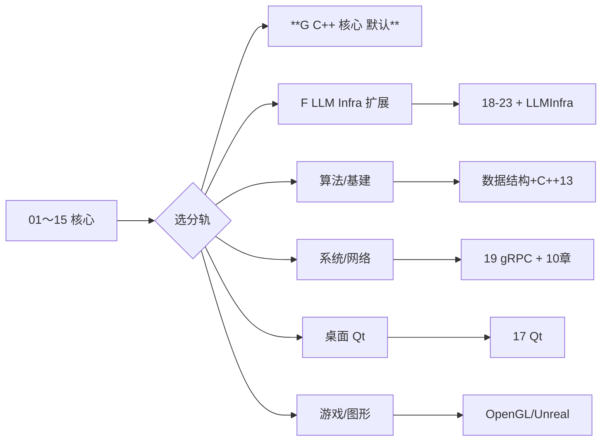
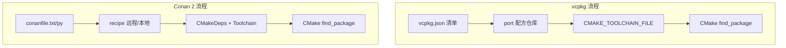
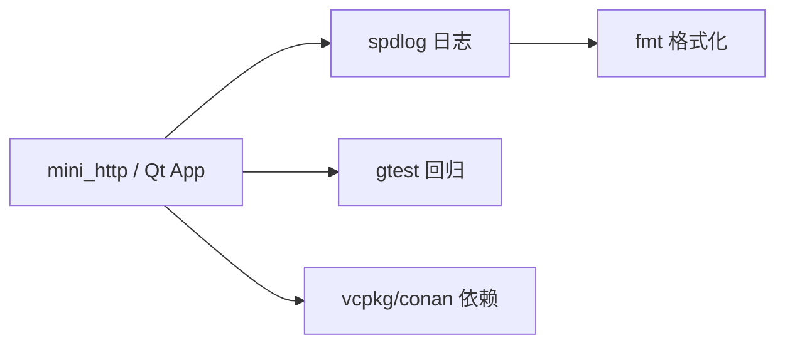
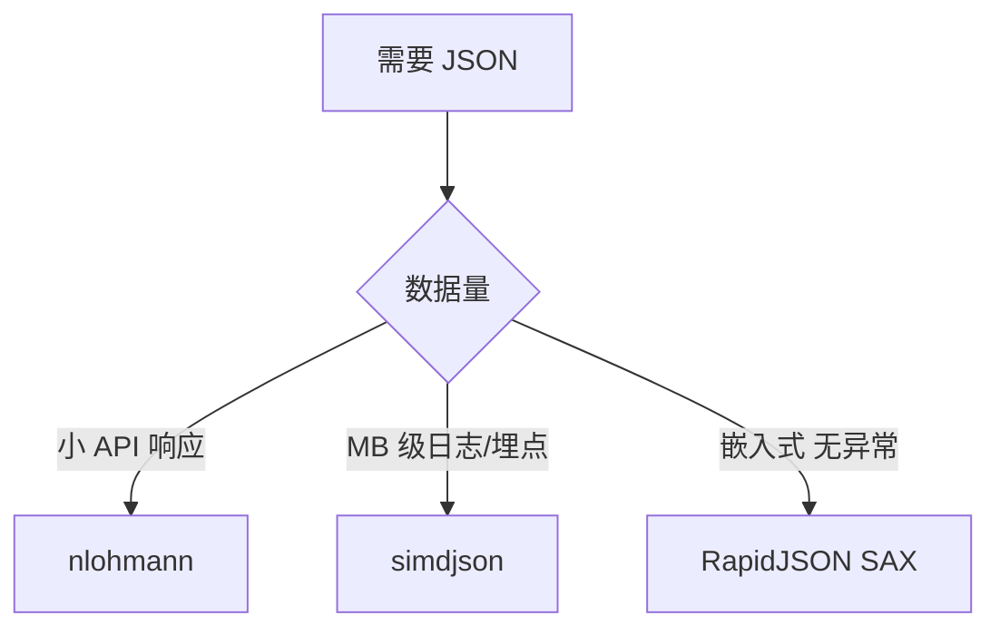
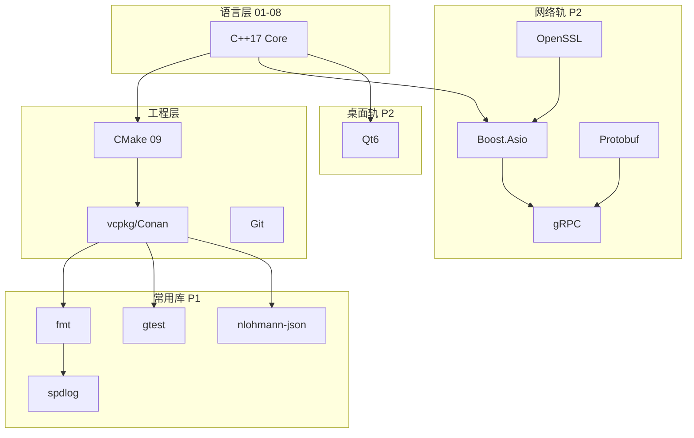

# 必学技术栈、分轨路线与扩展专题

> **文件编码**：UTF-8。本章是 [00 学习路线图](00-学习路线图与说明.md) 的 **扩展索引**：回答「除了 01～15 还要学什么」「Qt 是什么、要不要学」「不同目标岗怎么分叉」。  
> **2026 默认分轨 G**：**C++ 核心** → **01～36**（跳过 17 Qt）+ 数据结构 + Linux + **35 KV 项目**。  
> **扩展分轨 F**：G 轨完成后 → [LLMInfra 00](../LLMInfra/00-学习路线图与说明.md)。

---

## 本章与前后章的关系

| 上一章 | 本章 | 下一章 |
|--------|------|--------|
| [15 补充知识点总表](15-补充知识点总表.md) 复习完 01～14 | 按目标岗选 **必学扩展栈** | [17 Qt 入门](17-Qt入门与信号槽.md)（桌面分轨） |



---

## 0. 读前导读

### 0.1 用一句话弄懂本章

**01～15 是所有人共享的「C++ 内功」**；本章列出 **工程必装工具、常见框架（含 Qt）、按岗位的分轨表**——避免「听说要学 Qt 但不知道 Qt 是啥、何时学」。

### 0.2 三条总原则

1. **先 01～08 再框架**：没有指针、RAII、并发底子，直接 Qt/Unreal 会只会拖控件、不懂崩溃原因。
2. **分轨不是全学**：算法岗不必 Qt；桌面岗不必刷 500 题；**选一条主轨 + 一条副轨**。
3. **能编译、能调试、能讲**：每个「必学」项都要有 **Hello World + 一个项目用法**。

### 0.3 本章知识地图

- [ ] 说清 Qt / Boost / CMake / GDB 各是什么
- [ ] 在 §3 表里找到自己的目标分轨
- [ ] 列出个人「必学 P0」勾选清单
- [ ] 完成 §12 闭卷自测 ≥8/10

---

## 1. C++ 生态全景（先建立地图）

### 1.1 四层结构

```text
┌─────────────────────────────────────────┐
│  应用层：Qt / Unreal / 自研服务器 / 嵌入式 UI │
├─────────────────────────────────────────┤
│  库层：STL、Boost、fmt、spdlog、Protobuf、OpenGL │
├─────────────────────────────────────────┤
│  工程层：CMake、Git、GDB、Valgrind、vcpkg/Conan │
├─────────────────────────────────────────┤
│  语言层：C++17/20（01～07 本仓库主线）      │
└─────────────────────────────────────────┘
```

### 1.2 常见名词一句话

| 名词 | 是什么 | 生活类比 | 本仓库哪里学 |
|------|--------|----------|--------------|
| **STL** | C++ 标准库：vector、map、算法 | 官方工具箱 | [04 章](04-STL标准库容器与算法.md) |
| **CMake** | 跨平台构建系统，生成 Makefile/VS 工程 | 菜谱 + 自动化厨房 | [09 章](09-CMake与项目工程化.md) |
| **Qt** | 跨平台 **C++ GUI/桌面应用** 框架（也可写网络、工具） | 带装修模板的 Windows 窗体 + 信号线 | [17 章](17-Qt入门与信号槽.md) |
| **Boost** | 高质量 C++ 第三方库集合 | 工具箱里的专业配件 | 本章 §4.2 |
| **Boost.Asio** | 异步网络 IO 库（很多服务器用它） | 多线路电话总机 | 本章 §4.2 + [10 章](10-网络编程与简易HTTP服务.md) 对照 |
| **GDB** | 命令行调试器 | 程序运行的慢动作回放 | [02 章](02-指针引用与内存管理.md)、[12 章](12-性能分析与调试.md) |
| **RAII** | 构造获取资源、析构释放 | 自动关门 | [07 章](07-异常处理与RAII.md) |
| **Protobuf** | 二进制序列化协议（RPC、存储） | 压缩版 Excel 表 | 本章 §4.4 |
| **OpenGL/Vulkan** | 图形 API（游戏/三维） | 显卡画画指令 | 本章 §5.4（外部延伸） |
| **Unreal** | 游戏引擎（C++ + 蓝图） | 3A 游戏工厂 | 本章 §5.4（外部延伸） |
| **vcpkg / Conan** | C++ 包管理器 | npm 之于 Node | 本章 §4.1 |

---

## 2. 必学 / 强建议 / 分轨选学 三级表

> **必学 P0**：所有 C++ 方向都要会。  
> **强建议 P1**：工程岗、实习简历几乎都要出现。  
> **分轨 P2**：按 §5 目标岗再学。

### 2.1 语言与标准库（P0，仓库 01～07）

| 内容 | 掌握标准 | 章节 |
|------|----------|------|
| 类型、流程控制、函数 | 独立编译多文件 | 01 |
| 指针、引用、栈堆、new/delete | GDB 看地址；无泄漏 demo | 02 |
| 类、继承、多态、虚析构 | `vector<unique_ptr<Base>>` | 03 |
| vector/map/string/algorithm | 日常不写裸数组 | 04 |
| unique_ptr、move、lambda、auto | Rule of Zero | 05 |
| 模板基础 | 能写 `template<typename T>` | 06 |
| 异常与 RAII | FdGuard 类 | 07 |

### 2.2 并发与工程（P0～P1，仓库 08～09）

| 内容 | 级别 | 掌握标准 | 章节 |
|------|------|----------|------|
| thread、mutex、condition_variable | P0 | 生产者消费者 | 08 |
| atomic、内存序入门 | P1 | 能读 `atomic<int>` 计数 | 08 |
| CMake 多文件、静态库 | P0 | hello-cmake 跑通 | 09 |
| Git add/commit/branch/merge | P0 | [Git 01～03](../../前端学习/Git/01-Git入门与安装配置.md) | 外部 |
| .gitignore、README | P1 | 09 章起每个项目都有 | 09 |

### 2.3 系统与网络（P1，仓库 10～12 + 配套）

| 内容 | 级别 | 掌握标准 | 章节/资料 |
|------|------|----------|-----------|
| TCP socket、HTTP 报文 | P1 | mini-http curl 200 | 10 |
| 计网 TCP/HTTP 原理 | P1 | 能画三次握手 | [计网 02、04](../../前端学习/计算机网络/02-TCP与UDP.md) |
| Linux 文件/进程/信号 | P1 | WSL 跑 mini-http | 11 |
| GDB、ASan、perf 入门 | P1 | 修掉一处泄漏 | 12 |
| Linux 终端与 SSH | P1 | [Linux 00～01、06](../Linux/README.md) | 外部 |

### 2.4 算法与面试（P0～P1，仓库 13～15 + 数据结构）

| 内容 | 级别 | 掌握标准 | 章节 |
|------|------|----------|------|
| 复杂度、数组/链表/哈希/树 | P0 | 口述 + 手写核心 | [数据结构 01～06](../数据结构/README.md) |
| C++ STL 手撕模板 | P0 | LRU、堆、并查集 | 13 |
| 精刷 50～80 题 | P1 | C++ 提交 | 13 + [数据结构 11](../数据结构/09-综合复习/README.md) |
| 内存/虚函数/并发面试题 | P1 | 14 章 Q 过一遍 | 14 |

### 2.5 扩展库与工具（P1～P2，本章 + 17）

| 内容 | 级别 | 何时学 | 说明 |
|------|------|--------|------|
| **fmt** 或 **iostream 格式化** | P1 | 09 章起 | 日志与打印 |
| **spdlog** | P1 | 10 章 mini-http 加日志 | 生产级日志 |
| **Google Test (gtest)** | P1 | 09 章后 | 单元测试 |
| **nlohmann/json** | P1 | 10 章 REST 扩展 | JSON 解析 |
| **Qt 6 Core + Widgets** | P2 桌面轨 | **08～09 后** | [17 章](17-Qt入门与信号槽.md) |
| **Boost.Asio** | P2 网络轨 | 10 章后 | 替代/补充手写 socket |
| **Protobuf / gRPC** | P2 基建轨 | 11 章后 | 微服务 C++ 常见 |
| **OpenGL / Vulkan** | P2 游戏图形轨 | 03～05 后 | 外部教程 |
| **Redis/MySQL C++ 客户端** | P2 后端 C++ 轨 | 10 章后 | hiredis、mysql-connector |

---

## 3. Qt 专题：是什么、要不要学、何时学

### 3.1 Qt 是什么（零基础版）

**Qt** 是用 C++ 做 **图形界面程序** 的框架，跨 Windows / Linux / macOS。

| 能力 | 说明 |
|------|------|
| 窗口、按钮、输入框 | `QWidget`、`QMainWindow` |
| 布局 | 不用手算像素，用布局管理器 |
| **信号与槽** | 按钮点击 → 自动调你的函数（Qt 的事件机制） |
| 网络、文件、多线程 | `QNetworkAccessManager`、`QFile`、`QThread` |
| 跨平台 | 同一套代码多系统编译 |

**Qt 不是什么**：

- 不是编程语言（语言仍是 C++）
- 不是游戏引擎首选（大型 3D 用 Unreal/Unity；Qt 偏工具、工业、桌面软件）
- 不是 Web 前端（那是 Vue/React）

### 3.2 哪些方向 **必学 / 建议学** Qt

| 方向 | Qt 优先级 | 典型岗位 |
|------|-----------|----------|
| 桌面软件、工业控制、仪器 UI | **必学** | 上位机、SCADA、医疗影像客户端 |
| 跨平台工具（IDE、播放器、IM 客户端） | **强建议** | 网易云音乐 PC 类、Wireshark 类 |
| 嵌入式带屏 HMI | **建议** Qt for Embedded | 车载屏、工控屏 |
| 纯算法 / 纯后端 infra | **可不学** | leetcode、存储、网关 |
| 3A 游戏客户端 | **一般不主学 Qt** | 主学 Unreal |

### 3.3 学 Qt 的前置条件（不满足会痛苦）

```text
✅ C++ 01～05（尤其 03 OOP、05 智能指针）
✅ 08 线程基础（Qt 常用 QThread / 线程池）
✅ 09 CMake（Qt 用 CMake 或 qmake 构建）
✅ 能独立排查段错误（02 + GDB）
⬜ 不要求先学 Java/Web
```

### 3.4 Qt 学习路径（本仓库）

```text
17 章 Qt 入门（Widgets + 信号槽 + 第一个窗体）
  ↓
自练：计算器 / 记事本 / 串口助手（选 1）
  ↓
进阶（外部）：Model/View、QML、Qt Network、Qt Charts
  ↓
简历项目：「跨平台 XXX 管理客户端（Qt6 + CMake）」
```

### 3.5 Qt5 还是 Qt6

- 本资料默认 **Qt 6**（LTS 6.5+）
- 老项目可能 Qt5；语法 80% 相通，安装与 CMake 变量名不同
- 安装：Qt 在线安装器 + MSVC 或 MinGW 套件（见 [17 章](17-Qt入门与信号槽.md)）

---

## 4. 其他高频扩展栈说明

### 4.1 包管理与依赖

| 工具 | 用途 | 建议 |
|------|------|------|
| **vcpkg** | Windows/Linux 装 C++ 库 | 与 CMake 集成，10 章后可试 |
| **Conan** | 另一套 C++ 包管理 | 企业项目常见，二选一即可 |
| **FetchContent** | CMake 拉源码 | [09 章](09-CMake与项目工程化.md) 已含 |

### 4.2 Boost（不必全书，按轨选读）

| 子库 | 用途 | 分轨 |
|------|------|------|
| **Boost.Asio** | 异步 TCP/UDP | 网络/基建 |
| Boost.Smart_ptr（历史） | 智能指针 | 已被 C++11 标准取代，了解即可 |
| Boost.Test | 测试 | 可被 gtest 替代 |

### 4.3 日志与测试（工程 P1）

```text
spdlog：异步日志、滚动文件
gtest：TEST(Suite, Case) { EXPECT_EQ(1, 1); }
```

**验收**：给 mini-http 或 Qt 计算器加 **≥3 个单元测试** + **文件日志**。

### 4.4 序列化与 RPC

| 技术 | 场景 |
|------|------|
| **nlohmann/json** | REST API、配置文件 |
| **Protobuf** | 高性能 RPC、存储格式 |
| **gRPC** | 微服务 C++ 服务间调用 |

### 4.5 设计模式（C++ 面试常问）

| 模式 | C++ 场景 | 建议章节后 |
|------|----------|------------|
| 单例 | 配置、日志 | 07 RAII 后 |
| 工厂 | 多态创建 | 03 OOP 后 |
| 观察者 | **Qt 信号槽即观察者** | 17 Qt |
| 智能指针 + RAII | 资源管理 | 05、07 |

---

## 5. 六条职业分轨（优化后的完整路线）

### 5.0 分轨 F：LLM Infra / 大模型底层（**2026 默认**）

**目标岗**：推理引擎、CUDA 算子、训练系统、模型 Serving、KV Cache、量化、NCCL

```text
P0  C++ 01～12 + 18～23（跳过 Qt 17）
P0  LLMInfra 01～20 全系列
P0  数据结构 + C++13 + Git + 计网 02/04 + Linux 01～12
P1  读 vLLM / llama.cpp / FlashAttention 源码
P1  项目 MiniInfer（LLMInfra 19）
跳过 Java 全栈、AIAgent 01～16、Qt、Vue
选读 AIAgent 10/21
刷题：维持每周 3～5 题 C++（ACM 底子）
云 GPU：03～05、19 章必租
```

详见 [LLMInfra 00](../LLMInfra/00-学习路线图与说明.md)、[todo.md](../../todo.md)。

### 5.1 分轨 A：算法 / 基础架构（你的 ACM 背景最顺）

**目标岗**：大厂后端、存储、中间件、量化（策略 research 除外）

```text
P0  01～08 + 数据结构 01～10 + C++ 13 + Git + 计网 02/04
P1  09～12 mini-http + Linux 01～03/10 + 14/15
P2  Boost.Asio 或 10 章 socket 深入；Protobuf 了解
跳过 Qt、OpenGL
项目：mini-http v4 + 线程池 + LRU 模板库
刷题：C++ 精刷 80 题
```

### 5.2 分轨 B：系统 / 网络 / C++ 后端

**目标岗**：网关、RPC 框架、音视频 infra、高性能 Server

```text
在 A 基础上 +
P1  10～12 必扎实；spdlog、gtest、json
P2  Boost.Asio、Protobuf、gRPC、Redis 客户端
跳过 Qt（除非做带界面的运维工具）
项目：HTTP/RPC 小服务 + 压测报告 + ASan 零泄漏
```

### 5.3 分轨 C：桌面 / 工业软件（Qt 主线）

**目标岗**：上位机、CAD/EDA 周边、医疗、安防客户端

```text
P0  01～09 + 08 并发
P1  17 Qt 全文 + CMake 集成 Qt
P2  Qt Network、串口/QSerialPort、Charts、Multimedia
可选 11 章 Linux（现场部署）
跳过 海量 LeetCode（保持每周 3～5 题即可）
项目：「设备管理客户端」或「数据可视化工具（Qt6）」
```

### 5.4 分轨 D：游戏 / 图形

**目标岗**：游戏客户端、引擎工具、图形 programmer

```text
P0  01～08 + 线性代数（外部）
P1  04 STL + 12 性能；数据结构 06～08
P2  OpenGL 或 Vulkan 入门；Unreal C++ 官方文档
Qt 仅作 **工具链 UI**（关卡编辑器小工具）时学
项目：小型 2D 或 Unreal 第三人称模板改功能
```

### 5.5 分轨 E：嵌入式 / 裸机（简要）

**目标岗**：MCU、驱动、RTOS

```text
P0  01～03 + 有限 STL（看平台）
P1  C 接口、交叉编译、Makefile
P2  Qt for MCUs 或 LVGL（二选一，看硬件）
本仓库 10～12 部分适用；CMake 仍建议学
```

---

## 6. 优化后的时间线（16 周入门 + 分轨延伸）

### 6.1 阶段 0～4：所有人共享（16 周，每天 2～3h）

| 周 | C++ | 并行 | 里程碑 |
|----|-----|------|--------|
| 1 | 00 + 01 + Git 01 | 数据结构 01 | env_check 通过 |
| 2 | 02 指针（慢） | 数据结构 03 | GDB 看堆地址 |
| 3 | 03 OOP | — | 多态 demo |
| 4 | 04 STL | 数据结构 02/05 | 词频 map |
| 5 | 05 现代 C++ | — | unique_ptr 默认 |
| 6 | 06 模板 + 07 RAII | — | FdGuard |
| 7 | 08 并发 | Java 03 选读 | 安全队列 |
| 8 | 09 CMake | Linux 01 | hello-cmake |
| 9 | 10 网络 | 计网 02/04 | mini-http 200 |
| 10 | 11 Linux | Linux 02～03 | 日志配置 |
| 11 | 12 性能 | — | ASan 零泄漏 |
| 12 | 13 算法 | 数据结构 11 | 20 题 C++ |
| 13 | 14 面试 | — | 闭卷 20 题 |
| 14 | 15 总表复习 | — | 自评 🔶+ |
| 15 | **16 本章：定分轨** | — | 勾选 P0/P2 |
| 16 | **分轨首项目** | 见 §5 | 可演示 |

### 6.2 分轨延伸（17～26 周）

| 分轨 | 16～26 周重点 |
|------|----------------|
| A 算法 | 刷题至 80 + mini-http 线程池 |
| B 系统 | Asio + gtest + json + 压测 |
| C 桌面 | [17 Qt](17-Qt入门与信号槽.md) + 完整桌面项目 |
| D 游戏 | OpenGL/Unreal 外部路线 |
| E 嵌入式 | 交叉编译 + 外部 MCU 教程 |

---

## 7. 与仓库其他系列的新分工（2026 更新）

| 系列 | C++ 主线下的用法 |
|------|------------------|
| [数据结构](../数据结构/README.md) | **并行** 01～10；11 题单 + C++ 13 |
| [Linux](../Linux/README.md) | 00～01、04、06～07；部署按项目需要读 09 |
| [Git](../../前端学习/Git/00-学习路线图与说明.md) | 01～04 必学 |
| [计网](../../前端学习/计算机网络/00-学习路线图与说明.md) | 01～04 必学；07 面试前 |
| [Java](../Java/00-学习路线图与说明.md) | **仅** 03 并发对照；Web 主线可不学 |
| [Python](../Python/00-学习路线图与说明.md) | 可不学 |
| [Vue/React](../../前端学习/Vue/00-学习路线图与说明.md) | 可不学；Qt 替代「做界面」 |

---

## 8. 常见 FAQ

| 问题 | 答 |
|------|-----|
| Qt 和 Electron 一样吗？ | 不同。Electron 是 Web 技术做桌面；Qt 是 **原生 C++** 控件，性能更好、体积可控。 |
| 必须先学 Qt 才能找 C++ 工作吗？ | **否**。基建/算法岗不要 Qt；桌面岗才要。 |
| Boost 要全学吗？ | **否**。网络轨学 Asio 即可。 |
| vcpkg 和 apt 装库冲突？ | 开发机统一一种；教程跟 CMake 文档走。 |
| ACM 还要重学语法吗？ | 01 速过，**02/05/07/08 不能省**。 |
| mini-http 和 Qt 项目二选一？ | 暑假前 **先 mini-http**；定桌面轨再加 Qt。 |
| Unreal 和 Qt 先学哪个？ | 游戏 → Unreal；工具/工业 → Qt。 |
| 要不要学 Rust？ | 非本仓库范围；C++ 路线先学透再考虑。 |

---

## 9. 练习建议

### 基础

1. 在 §2.5 表中勾出你的 **P0 清单**，复制到笔记区。
2. 用 100 字向同学解释 **Qt 是什么**（不用 jargon）。

### 进阶

1. 根据 §5 选定 **一条主轨**，写 4 周计划。
2. 给 [examples/hello-cmake](examples/hello-cmake/) 加一条 **gtest** 测试（查 gtest FetchContent 示例）。

### 挑战

1. 同一功能各用 **手写 socket** 与 **Boost.Asio** 实现 echo（B 轨）。
2. 用 **Qt** 给 mini-http 做一个发 GET 请求的小窗口（C 轨）。

---

## 10. 学完标准

- [ ] 能说明 Qt、STL、CMake、Boost.Asio 的区别与适用场景
- [ ] 已选定分轨 A～E 之一，并列出 P2 扩展栈
- [ ] 完成分轨对应的 **一个** 可演示项目选题
- [ ] §12 闭卷自测 ≥8/10

---

## 11. 我的笔记区

```text
选定分轨（A/B/C/D/E）：
P0 已完成：
P2 计划学习（Qt/Asio/…）：
第一个分轨项目名：
```

---

## 12. 闭卷自测

1. 本仓库 C++ **01～15 与 16～17** 的分工是什么？
2. Qt 的 **信号与槽** 解决什么问题？
3. 算法岗为什么要 **跳过 Qt** 但仍要学 08 并发？
4. mini-http 在路线里对应哪几章？
5. Boost.Asio 和 10 章手写 socket 的关系？
6. vcpkg 是干什么的？
7. 五条分轨里，哪条 **必须学 17 章**？
8. 「必学 P0」里为什么包含 Git 和 GDB？
9. ACM 背景为什么 02 章仍不能跳？
10. 精刷 50～80 题对应哪些章节？

<details>
<summary>参考答案</summary>

1. 01～15 语言+系统+算法内功；16 分轨与扩展栈索引；17 Qt 桌面入门。
2. 对象间事件通知（如按钮 click → 槽函数），解耦 UI 与逻辑。
3. 岗位不要求 GUI；但 infra 仍要多线程与服务端。
4. 09 CMake、10 socket/HTTP、11 日志、12 压测优化。
5. 都用于网络 IO；Asio 提供异步模型，10 章先懂阻塞 socket 原理。
6. C++ 第三方库包管理，配合 CMake 使用。
7. 分轨 C（桌面/工业 Qt 主线）。
8. 工程协作与内存/并发 bug 定位是 C++ 日常。
9. 竞赛代码常忽略 RAII/泄漏/悬空指针，面试和工程必考。
10. C++ 13 + 数据结构 11 + 01～06 原理。

</details>

---

## 13. Primer Plus 深化：扩展栈选型百科

> 本节在 §4 基础上 **大幅展开** vcpkg/Conan、Boost 子库、fmt/spdlog/gtest、Abseil、OpenSSL、JSON/日志库选型，并给出 **各分轨详细技术栈清单**（可直接复制到简历/学习计划）。工程集成细节见 [09 CMake](09-CMake与项目工程化.md) §16、[32 fmt/spdlog](32-fmt-spdlog与可观测性工程.md)。

### 13.1 vcpkg 与 Conan 深度对比

#### 13.1.1 架构差异



#### 13.1.2 多维度对比表

| 维度 | vcpkg | Conan 2 |
|------|-------|---------|
| **配置入口** | `vcpkg.json` + manifest 模式 | `conanfile.txt` 或 Python 配方 |
| **CMake 注入** | `CMAKE_TOOLCHAIN_FILE=scripts/buildsystems/vcpkg.cmake` | `conan_toolchain.cmake` + `CMakeDeps` |
| **二进制缓存** | `VCPKG_BINARY_SOURCES`、NuGet 缓存 | 本地/Artifactory 远程缓存 |
| **版本锁定** | `baseline` + `overrides` | `conan lock` |
| **私有库** | 自定义 port + git registry | 私有 Conan remote |
| **跨平台 triplet** | `x64-windows`、`arm64-linux` | `settings: arch, os, compiler` |
| **学习成本** | 低，MS 文档多 | 中，企业灵活 |
| **与 FetchContent** | 可并存，勿重复引同一库 | 同左 |
| **典型企业** | 游戏工具、Windows 团队 | 多平台 C++ 微服务 |

#### 13.1.3 vcpkg 完整示例（mini-http 栈）

`vcpkg.json`：

```json
{
  "$schema": "https://raw.githubusercontent.com/microsoft/vcpkg/master/scripts/vcpkg.schema.json",
  "name": "mini-http-deps",
  "version": "1.0.0",
  "dependencies": [
    "fmt",
    "spdlog",
    "nlohmann-json",
    "openssl",
    "gtest"
  ],
  "overrides": [
    { "name": "fmt", "version": "10.2.1" }
  ]
}
```

`CMakeLists.txt` 片段：

```cmake
find_package(fmt CONFIG REQUIRED)
find_package(spdlog CONFIG REQUIRED)
find_package(nlohmann_json CONFIG REQUIRED)
find_package(OpenSSL REQUIRED)
find_package(GTest CONFIG REQUIRED)

target_link_libraries(mini_http PRIVATE
    fmt::fmt
    spdlog::spdlog
    nlohmann_json::nlohmann_json
    OpenSSL::SSL OpenSSL::Crypto
)
```

PowerShell 构建：

```powershell
cmake -S . -B build -DCMAKE_TOOLCHAIN_FILE=F:\vcpkg\scripts\buildsystems\vcpkg.cmake
cmake --build build --config Release
```

#### 13.1.4 Conan 2 完整示例

`conanfile.txt`：

```ini
[requires]
fmt/10.2.1
spdlog/1.13.0
nlohmann_json/3.11.3
openssl/3.2.0
gtest/1.14.0

[generators]
CMakeDeps
CMakeToolchain

[options]
spdlog/*:header_only=True
```

```bash
conan profile detect --force
conan install . --output-folder=build --build=missing -s build_type=Release
cmake -S . -B build -DCMAKE_TOOLCHAIN_FILE=build/conan_toolchain.cmake
cmake --build build
```

#### 13.1.5 选型决策（面试/团队可答）

| 场景 | 推荐 |
|------|------|
| 个人 demo、课程 hello-cmake | FetchContent |
| Windows + MSVC 实习项目 | vcpkg |
| 已有 Artifactory 私服 | Conan |
| 需精确复现 3 年前构建 | Conan lock / vcpkg baseline |
| 仅 header-only（json/fmt） | 三者均可；FetchContent 最轻 |

#### 13.1.6 FAQ

1. **同一项目混 vcpkg 与 apt OpenSSL？** 链接阶段可能混两套 ABI → 运行时崩溃；统一来源。
2. **vcpkg 安装慢？** 开二进制缓存或使用 `VCPKG_FORCE_SYSTEM_BINARIES`（视 port 支持）。
3. **Conan 配方谁维护？** ConanCenter 社区 + 公司私有 recipe。

---

### 13.2 Boost 子库精选（不必全书）

Boost 含 100+ 库；**按分轨选读**，避免「从 Boost 第一页读到最后一页」。

#### 13.2.1 推荐子库表

| 子库 | 用途 | 标准库替代？ | 分轨 | 优先级 |
|------|------|--------------|------|--------|
| **Asio** | 异步 TCP/UDP/定时器 | 无（C++23 `std::execution` 未普及） | B/F | P1 |
| **Beast** | HTTP/WebSocket（基于 Asio） | 无标准 | B | P2 |
| **Filesystem** | 路径遍历 | C++17 `std::filesystem` | 全轨 | 已标准 |
| **Program_options** | CLI 解析 | 手写/getopt | A/B | P2 |
| **UUID** | 唯一 ID | 无 | B | P2 |
| **Multi_index** | 多索引容器 | 无 | A | P2 |
| **Circular_buffer** | 定长环形缓冲 | 手写 | B/E | P2 |
| **Lockfree** | 无锁队列 | 自研/第三方 | A/B | P3 |
| **Test** | 单元测试 | **gtest** 更主流 | — | 用 gtest |
| **Smart_ptr** | 智能指针 | C++11 标准 | — | 跳过 |

#### 13.2.2 Boost.Asio 最小 echo（B 轨验收）

```cpp
#include <boost/asio.hpp>
#include <iostream>

int main() {
    boost::asio::io_context io;
    boost::asio::ip::tcp::acceptor acceptor(
        io, {boost::asio::ip::tcp::v4(), 9000});
    for (;;) {
        boost::asio::ip::tcp::socket socket(io);
        acceptor.accept(socket);
        char buf[1024];
        boost::system::error_code ec;
        size_t n = socket.read_some(boost::asio::buffer(buf), ec);
        boost::asio::write(socket, boost::asio::buffer(buf, n), ec);
    }
}
```

CMake（vcpkg）：`find_package(Boost REQUIRED COMPONENTS system)` + `Boost::system`。

#### 13.2.3 Boost 学习路径

```text
10 章手写 blocking socket 理解 fd
  → 26 章 Boost.Asio 异步模型
  → Beast HTTP（可选，或继续用 mini-http + 自解析）
```

---

### 13.3 fmt / spdlog / gtest 工程三件套

#### 13.3.1 fmt：类型安全格式化

```cpp
#include <fmt/core.h>
#include <fmt/chrono.h>

int main() {
    fmt::print("Hello {}\n", "fmt");
    fmt::print("pid={} elapsed={}\n", 1234, std::chrono::milliseconds{42});
}
```

| 对比 | `std::cout` | `printf` | **fmt** |
|------|-------------|----------|---------|
| 类型安全 | 是 | 否 | 是 |
| 性能 | 中 | 高 | **很高**（可媲美 printf） |
| C++20 | `std::format` 进标准 | — | fmt 是 std::format 前身 |

**CMake**：`find_package(fmt CONFIG)` 或 FetchContent；链 `fmt::fmt`。

与 [32 章](32-fmt-spdlog与可观测性工程.md) 衔接：生产日志底层常用 fmt 格式化。

#### 13.3.2 spdlog：异步滚动日志

```cpp
#include <spdlog/spdlog.h>
#include <spdlog/sinks/rotating_file_sink.h>

int main() {
    auto logger = spdlog::rotating_logger_mt(
        "mini", "logs/mini.log", 1024 * 1024 * 5, 3);
    spdlog::set_default_logger(logger);
    spdlog::set_level(spdlog::level::info);
    spdlog::info("listen port={}", 8080);
}
```

| 特性 | 说明 |
|------|------|
| 同步/异步 | `async_logger` + 线程池，写盘不阻塞业务 |
| sink | 控制台、文件、rotating、daily |
| 与 fmt | 默认用 fmt 后端 |
| 11 章 mini-http | 替换手写 `fprintf` 日志 |

#### 13.3.3 Google Test：单元测试

```cpp
#include <gtest/gtest.h>
#include "math_utils.h"

TEST(MathUtils, Add) {
    EXPECT_EQ(add(2, 3), 5);
}

TEST(MathUtils, Factorial) {
    EXPECT_EQ(factorial(5), 120);
    EXPECT_THROW(factorial(-1), std::invalid_argument);  // 若你实现了检查
}
```

CMake + Catch2/gtest（09 章 §16.5.3）：

```cmake
enable_testing()
add_executable(unit_tests test_math.cpp)
target_link_libraries(unit_tests PRIVATE math_utils GTest::gtest_main)
include(GoogleTest)
gtest_discover_tests(unit_tests)
```

**验收标准（P1）**：每个分轨主项目 ≥ **10 个 TEST**，CI `ctest` 绿。

#### 13.3.4 三件套组合 diagram



---

### 13.4 Abseil（Google C++ 基础库）

#### 13.4.1 是什么

**Abseil** 是 Google 开源的 C++ **基础组件**（字符串、时间、同步、容器扩展），gRPC、Protobuf 现代栈常依赖。

| 模块 | 代表 API | 何时用 |
|------|----------|--------|
| `absl::strings` | `StrSplit`, `StrJoin` | 替代手写 split |
| `absl::time` | `Time`, `Duration` | 跨平台时间 |
| `absl::synchronization` | `Mutex`, `Notification` | 与 std 类似，API 稳定 |
| `absl::container` | `flat_hash_map` | 比 `unordered_map` 常更快 |
| `absl::status` | `Status`, `StatusOr<T>` | 错误处理（无异常风格） |

#### 13.4.2 示例

```cpp
#include "absl/strings/str_split.h"
#include "absl/container/flat_hash_map.h"

std::vector<std::string> parts =
    absl::StrSplit("GET / HTTP/1.1", absl::ByChar(' '));

absl::flat_hash_map<std::string, int> routes;
routes["/api/ping"] = 1;
```

#### 13.4.3 分轨建议

| 分轨 | Abseil 优先级 | 说明 |
|------|---------------|------|
| A 算法 | P3 | 刷题不必 |
| B 系统/gRPC | **P1** | gRPC C++ 常自带 |
| F LLM Infra | P2 | 读 Google 系代码会遇到 |
| C 桌面 Qt | P3 | Qt 自有容器 |

安装：`vcpkg install abseil` 或 Conan `abseil/20240116.0`。

---

### 13.5 OpenSSL 入门（HTTPS/TLS）

#### 13.5.1 在 C++ 后端中的位置

| 层级 | 技术 |
|------|------|
| 应用 | mini-http → 加 TLS → HTTPS |
| 库 | **OpenSSL** / BoringSSL / mbedTLS |
| 协议 | TLS 1.2/1.3（计网 07/08） |

#### 13.5.2 最小 CMake 链接

```cmake
find_package(OpenSSL REQUIRED)
target_link_libraries(https_server PRIVATE OpenSSL::SSL OpenSSL::Crypto)
```

#### 13.5.3 概念清单（不必手写 SSL_CTX）

- `SSL_CTX`：全局配置（证书、协议版本）
- `SSL`：连接会话
- `BIO`：内存/ socket 抽象
- 证书：`fullchain.pem` + `privkey.pem`

**B 轨里程碑**：mini-http 前加 **stunnel** 或 Nginx 反代 TLS；进阶用 OpenSSL API 或 Boost.Beast SSL。

#### 13.5.4 与计网衔接

[计网 08 HTTPS/TLS](../../前端学习/计算机网络/08-HTTPS与TLS.md) 讲握手；OpenSSL 是 **实现库**，面试说清「应用层仍 HTTP，记录层 TLS 加密」。

---

### 13.6 JSON 库选型

#### 13.6.1 主流对比

| 库 | 风格 | 性能 | 头文件 | 推荐场景 |
|----|------|------|--------|----------|
| **nlohmann/json** | 直观、像 Python | 中 | 单头文件可选 | REST API、配置、**默认首选** |
| **simdjson** | DOM/OnDemand | **极快** | 需 C++17 | 大 JSON 解析、日志分析 |
| **RapidJSON** | SAX/DOM | 高 | 头文件 | 老项目、内存可控 |
| **jsoncpp** | DOM | 中 | 需编译 | 老代码维护 |
| **Boost.JSON** | C++17 | 高 | Boost | 已用 Boost 全家桶 |

#### 13.6.2 nlohmann 示例（10 章 REST 扩展）

```cpp
#include <nlohmann/json.hpp>
using json = nlohmann::json;

json resp = {{"ok", true}, {"msg", "pong"}, {"ts", 1710000000}};
std::string body = resp.dump();
// HTTP: Content-Type: application/json
```

#### 13.6.3 simdjson OnDemand 示例

```cpp
#include "simdjson.h"
simdjson::ondemand::parser parser;
auto doc = parser.iterate(R"({"users":[{"id":1}]})");
for (auto user : doc["users"]) {
    int64_t id = user["id"];
}
```

#### 13.6.4 选型决策



---

### 13.7 日志库对比

#### 13.7.1 总表

| 库 | 异步 | 性能 | 依赖 | 典型用户 |
|----|------|------|------|----------|
| **spdlog** | ✓ | 很高 | fmt（可选 bundled） | 开源服务端 **首选** |
| **glog** | 部分 | 高 | gflags | Google 系、legacy |
| **log4cpp/log4cplus** | ✓ | 中 | 多 | 老工业项目 |
| **Boost.Log** | ✓ | 中 | Boost | 已深度 Boost 时 |
| **Quill** | ✓ | 极高 | 头文件为主 | 低延迟交易 |
| 手写 `fprintf` | ✗ | 低 | 无 | 仅 10 章教学 |

#### 13.7.2 选型建议

| 分轨 | 推荐 | 原因 |
|------|------|------|
| A/B 系统 | **spdlog** | 社区大、与 fmt 统一、rotating file |
| F LLM Infra | spdlog 或 glog | 读 vLLM 源码对照 |
| C Qt 桌面 | spdlog + `QtMsgHandler` 重定向 | UI 仍用 qDebug 调试 |
| E 嵌入式 | 轻量 ring buffer 自研 | 可能无文件系统 |

#### 13.7.3 spdlog 与 11 章 mini-http 集成片段

```cpp
void init_logging() {
    auto console = std::make_shared<spdlog::sinks::stdout_color_sink_mt>();
    auto file = std::make_shared<spdlog::sinks::rotating_file_sink_mt>(
        "access.log", 1048576 * 10, 5);
    spdlog::sinks_init_list sinks = {console, file};
    auto logger = std::make_shared<spdlog::logger>("access", sinks);
    spdlog::set_default_logger(logger);
}
```

---

### 13.8 各分轨详细技术栈清单（可复制）

#### 13.8.1 分轨 A：算法 / 基础架构

```text
【语言内核 P0】
  C++17: 01～08, 13, 14, 15
  STL: vector/map/unordered_map/priority_queue
  智能指针 + move + RAII

【工程 P0】
  Git, CMake(09), GDB, ASan
  gtest (≥10 tests)

【系统 P1】
  Linux 01～03, 10～12
  mini-http + 线程池 + LRU

【扩展 P2】
  fmt, spdlog, nlohmann-json
  vcpkg 或 FetchContent
  Protobuf 概念（不必 gRPC 全通）

【刻意跳过】
  Qt, OpenGL, Unreal, Java Web

【刷题】
  数据结构 01～10, C++ 13, 精刷 80

【简历关键词】
  C++17, STL, 多线程, CMake, HTTP server, 压测优化
```

#### 13.8.2 分轨 B：系统 / 网络 / C++ 后端

```text
【继承 A 轨全部 P0】

【网络 P1】
  10 章 socket + 计网 02/04/54
  Boost.Asio (26 章) 或 libuv 了解
  epoll 原理 (23 章)

【依赖 P1】
  vcpkg/conan 统一: fmt, spdlog, gtest, json, openssl
  hiredis / redis-plus-plus (52 章对照)

【RPC P2】
  Protobuf, gRPC (19 章)
  abseil (随 gRPC)

【可观测 P2】
  32 章 fmt/spdlog
  perf, flame graph (12 章 §16)

【项目】
  mini-http v4: 线程池 + JSON API + HTTPS(stunnel) + 压测报告

【简历关键词】
  高并发, Asio, gRPC, Redis, 零泄漏 ASan
```

#### 13.8.3 分轨 C：桌面 / 工业（Qt 主线）

```text
【语言 P0】
  01～09, 08 并发

【Qt P1】
  17 章 + Qt6 Widgets/Core/Network
  信号槽, 对象树, Model/View 入门
  CMake AUTOMOC, Qt Creator

【工程 P1】
  Git, CMake, spdlog (日志文件)
  gtest (核心算法模块)

【系统 P2】
  11 Linux 部署, 串口 QSerialPort
  QSS 美化

【可选 P2】
  QML (移动端 UI), Qt Charts

【跳过】
  海量 LeetCode (每周 3～5 维持)

【项目】
  设备监控客户端 / 串口助手 / HTTP 测试工具(调 mini-http)

【简历关键词】
  Qt6, CMake, 跨平台, 工业协议, 多线程 UI
```

#### 13.8.4 分轨 D：游戏 / 图形

```text
【语言 P0】
  01～08, 04 STL, 12 perf

【数学 P1】
  线性代数, 向量/矩阵 (外部)

【图形 P2】
  OpenGL 4.x 或 Vulkan 入门
  Unreal C++ 官方模板

【工具 UI P2】
  Qt 仅用于关卡/资源编辑器小工具

【项目】
  2D SDL/OpenGL demo 或 Unreal 改第三人称

【简历关键词】
  C++, Unreal/OpenGL, 性能剖析, 内存池
```

#### 13.8.5 分轨 E：嵌入式

```text
【语言 P0】
  01～03, 受限 STL

【构建 P1】
  交叉编译 CMake toolchain (09 §16.10)
  Makefile 能读

【UI P2】
  LVGL 或 Qt for MCUs (二选一)

【系统 P2】
  FreeRTOS 概念, 裸机中断

【跳过】
  10 章 full mini-http (资源不足平台)

【简历关键词】
  C/C++, 交叉编译, RTOS, 驱动接口
```

#### 13.8.6 分轨 F：LLM Infra（2026 默认）

```text
【继承 A 轨 + 18～23 高性能章】

【LLMInfra P0】
  ../LLMInfra 01～20

【依赖 P1】
  CUDA, cuBLAS, NCCL 概念
  pybind11 (20 章)

【C++ 库 P2】
  fmt, spdlog, gtest, nlohmann-json
  abseil (读 Google 代码)

【跳过】
  Qt, Java 全栈, Vue

【项目】
  MiniInfer / 算子 bench / KV Cache 模拟

【简历关键词】
  C++17, CUDA, vLLM/llama.cpp 源码阅读, perf
```

---

### 13.9 扩展栈依赖关系图



---

### 13.10 深化 FAQ

1. **fmt 和 std::format 选谁？** C++20 全平台可开 `std::format`；否则 fmt，API 几乎相同。
2. **spdlog 线程安全吗？** logger 级 mutex；异步 sink 另说，见文档。
3. **gtest 和 Catch2？** 企业 gtest 多；课程 Catch2 轻；二选一即可。
4. **Abseil 会膨胀编译时间吗？** 是，只链需要的 target，如 `absl::strings`。
5. **OpenSSL 1.1 与 3.x？** 新项目 3.x；老代码注意 API 变更。
6. **simdjson 必须吗？** 除非 profiling 证明 JSON 是瓶颈。
7. **Boost 还要装吗？** B 轨 Asio 仍常用；其他大多已有标准替代。
8. **16 章与 32 章分工？** 16 选型地图；32 spdlog 工程化与可观测性深入。

---

### 13.11 深化练习

#### 基础

1. 用 vcpkg 装 fmt+spdlog，hello 程序打一条 rotating log。
2. 填 §13.8 中 **你的分轨** 清单到 §11 笔记区。

#### 进阶

1. mini-http 加 nlohmann `/api/ping` JSON 与 gtest 测 status code。
2. 写 200 字对比 glog vs spdlog（面试口述）。

#### 挑战

1. Conan 2 锁版本构建 mini-http 依赖栈，导出 `conan lock`。
2. B 轨：Boost.Asio echo 与 10 章 blocking echo **压测对比**（12 章方法）。

---

### 13.12 深化闭卷自测

1. vcpkg 注入 CMake 的关键变量名？
2. Boost 里最该学的一个子库（B 轨）？
3. spdlog 默认用什么做格式化？
4. nlohmann 与 simdjson 选型差异一句话？
5. Abseil `flat_hash_map` 相对 `unordered_map` 可能的优点？
6. OpenSSL 在 HTTPS 中处于哪一层？
7. 分轨 C 必学哪一章 Qt？
8. 为何算法轨仍推荐 gtest 而非只刷 LeetCode？

<details>
<summary>参考答案</summary>

1. `CMAKE_TOOLCHAIN_FILE=.../vcpkg.cmake`。
2. Boost.Asio。
3. fmt（可 bundled）。
4. nlohmann 易用 API；simdjson GB 级解析性能。
5. 更紧凑、常更快（实现依赖）。
6. 记录层 TLS，加密 HTTP 载荷。
7. 17 章 Qt 入门。
8. 工程岗要回归测试与 CI，非仅算法 AC。

</details>

---

### 13.13 Protobuf / gRPC / Redis 客户端速览

#### 13.13.1 Protobuf 最小 .proto

```protobuf
syntax = "proto3";
package demo;
message PingRequest { string msg = 1; }
message PingReply   { string msg = 1; int64 ts = 2; }
```

```bash
protoc --cpp_out=. ping.proto
# 生成 ping.pb.cc / ping.pb.h
```

| 对比 | JSON (nlohmann) | Protobuf |
|------|-----------------|----------|
| 可读 | 高 | 二进制 |
| 体积 | 大 | 小 |
|  schema | 无强制 | `.proto` 强制 |
| 场景 | REST、配置 | RPC、日志、存储 |

链 [19 gRPC 工程化](19-gRPC与Protobuf工程化.md)。

#### 13.13.2 gRPC C++ 依赖栈

```text
gRPC C++ → Protobuf + abseil + OpenSSL(可选 TLS) + c-ares
```

B 轨 **P2 里程碑**：能编译 [19 章](19-gRPC与Protobuf工程化.md) hello-grpc，理解 **stub / service** 分工。

#### 13.13.3 Redis C++ 客户端

| 库 | 风格 | 安装 |
|----|------|------|
| hiredis | C API | apt/vcpkg |
| redis-plus-plus | C++ 封装 | vcpkg |
| libuv + 自研 | 极简 | 不推荐初学 |

```cpp
#include <sw/redis++/redis++.h>
sw::redis::Redis r("tcp://127.0.0.1:6379");
r.set("key", "val");
auto val = r.get("key");
```

链 [52 Redis 面试](52-Redis数据结构与缓存面试专章.md) 八股 + B 轨缓存层。

---

### 13.14 数据库与中间件 C++ 客户端（B 轨 P2）

| 组件 | C++ 客户端 | 章节 |
|------|------------|------|
| MySQL | mysql-connector-cpp | [51 MySQL](51-MySQL原理与索引事务面试专章.md) |
| PostgreSQL | libpqxx | 外部 |
| Kafka | librdkafka | [57 消息队列](57-消息队列Kafka与中间件面试专题.md) |
| etcd | gRPC API | 分布式进阶 |

**原则**：先 **计网 + SQL 原理**，再客户端 API；面试常问原理而非 API 拼写。

---

### 13.15 测试与 CI 工具链扩展

| 工具 | 用途 | 分轨 |
|------|------|------|
| **gtest** | 单元测试 | 全轨 P1 |
| **Google Benchmark** | 微基准 | B/F + [74 章](74-性能工程方法论与基准测试.md) |
| **clang-tidy** | 静态分析 | P2 |
| **cppcheck** | 轻量静态分析 | P2 |
| **Coverage (gcov/lcov)** | 覆盖率 | 实习加分 |

```cmake
# gcov 示例
target_compile_options(tests PRIVATE --coverage)
target_link_options(tests PRIVATE --coverage)
```

---

### 13.16 16 周之后：分轨延伸周计划模板

#### 13.16.1 A 轨（17～22 周）

| 周 | 任务 | 产出 |
|----|------|------|
| 17 | 刷题 +20 | 累计 40 题 |
| 18 | mini-http 线程池 | 压测报告 |
| 19 | LRU 模板 + gtest | 10 tests |
| 20 | 14/33 八股过一遍 | 口述录音 |
| 21 | 模拟面试 | 45 min 视频 |
| 22 | 简历定稿 | PDF |

#### 13.16.2 B 轨（17～24 周）

| 周 | 任务 | 产出 |
|----|------|------|
| 17～18 | vcpkg 栈 + spdlog/json | mini-http v2 |
| 19～20 | Boost.Asio echo | 对比 10 章 |
| 21～22 | Protobuf 入门 | ping RPC |
| 23 | 12 章 perf 深入 | 火焰图 |
| 24 | 系统设计 [56 章](56-系统设计案例库RPC-KV与限流秒杀.md) 读 2 案例 | 笔记 |

#### 13.16.3 C 轨（17～22 周）

| 周 | 任务 | 产出 |
|----|------|------|
| 17 | [17 Qt](17-Qt入门与信号槽.md) 全文 | hello-qt |
| 18 | 计算器 | 可演示 |
| 19 | Qt Network + mini-http | GET 工具 |
| 20 | Model/View 表格 | 设备列表 demo |
| 21 | QSS + 串口（可选） | 美化 UI |
| 22 | 简历项目包装 | STAR |

---

### 13.17 技术栈「不要学」清单（防贪多）

|  tempted 学 | 为何先跳过 | 何时再学 |
|-------------|------------|----------|
| Rust | C++ 主线未稳 | 工作 1 年后 |
| 全栈 Java Spring | 非 C++ 岗 | 转岗时 |
| Unreal 全栈 | 非游戏轨 | D 轨 P2 |
| 全 Boost 书 | 性价比低 | 遇项目再查 |
| 多种 JSON 库 | 统一 nlohmann | profiling 瓶颈时 simdjson |
| Docker/K8s 深度 | [62 章](62-Docker与Kubernetes入门面试.md) 面试前突击 | 实习前 2 周 |

---

### 13.18 深化附录：一页纸技术栈（打印用）

```text
┌─────────────────────────────────────────────────────────────┐
│ P0 全员: C++17 01-08 | Git | CMake | GDB | 数据结构 | 13/14 │
├─────────────────────────────────────────────────────────────┤
│ P1 工程: 10-12 mini-http | Linux | fmt/spdlog/gtest/json   │
├─────────────────────────────────────────────────────────────┤
│ A轨+刷题80 | B轨+Asio/gRPC/Redis | C轨+Qt17 | D轨+GL/Unreal │
│ F轨+LLMInfra+CUDA | E轨+交叉编译+RTOS                        │
├─────────────────────────────────────────────────────────────┤
│ 包管理: vcpkg(Win/简) | Conan(企) | FetchContent(demo)      │
└─────────────────────────────────────────────────────────────┘
```

---

## 14. 下一章预告

定 **桌面分轨** 后进入 [17 Qt 入门与信号槽](17-Qt入门与信号槽.md)：安装 Qt6、第一个窗口、信号槽、CMake 集成。

定 **算法/系统分轨** 可跳过 17，回到 [13 章](13-算法与数据结构C++实现.md) 加刷题量，或深化 [10～12 章](10-网络编程与简易HTTP服务.md) mini-http。
