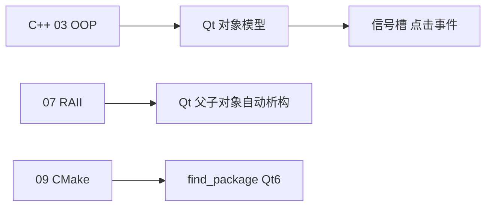
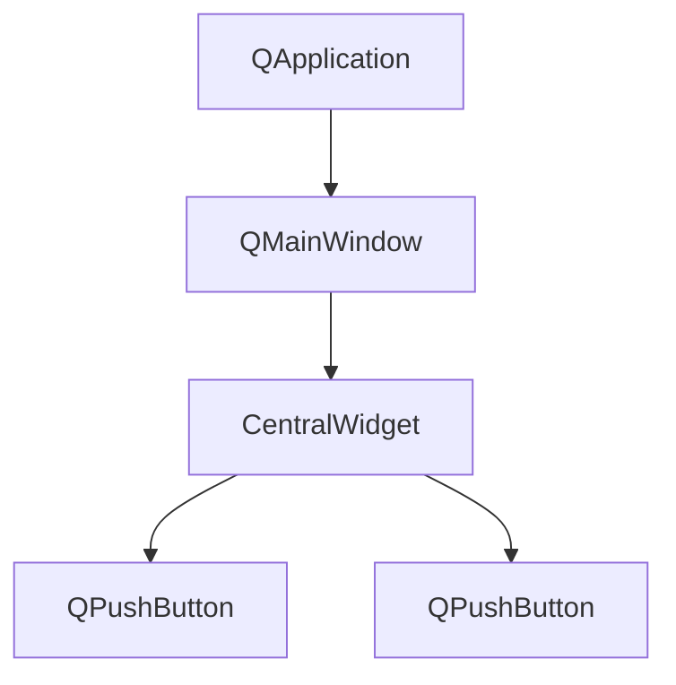
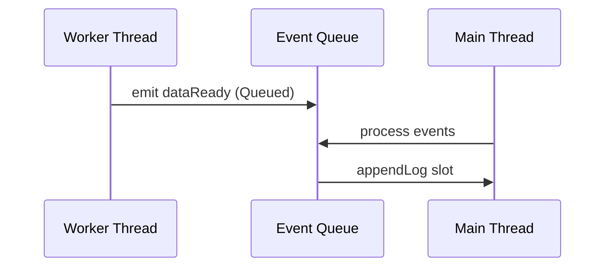
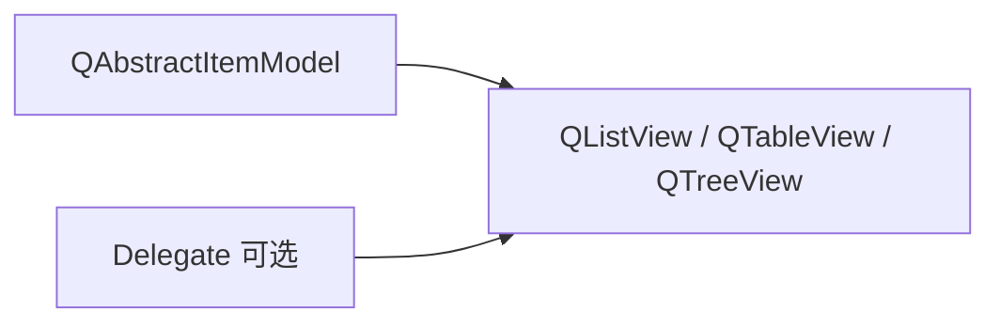
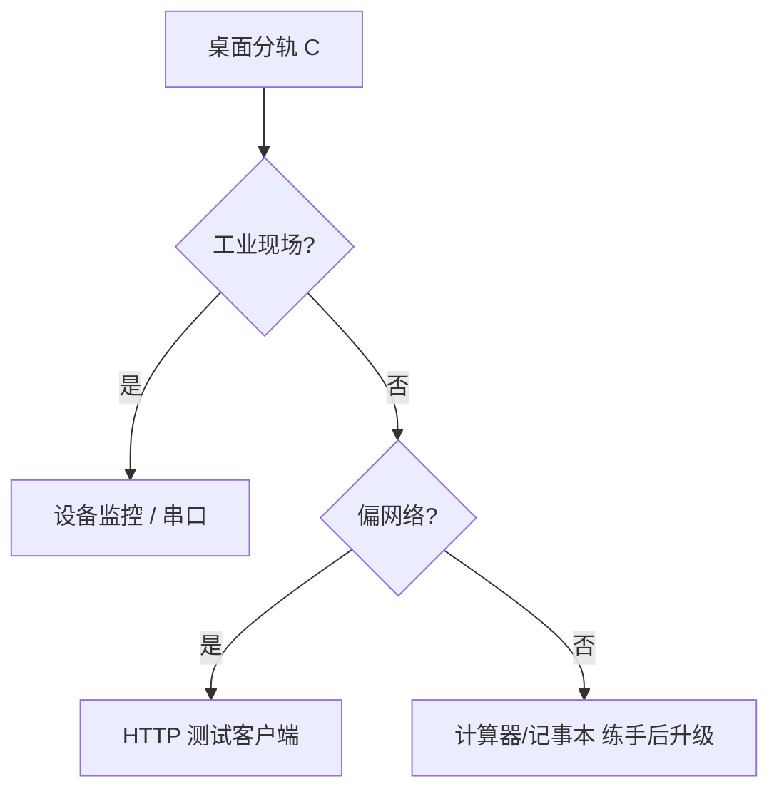
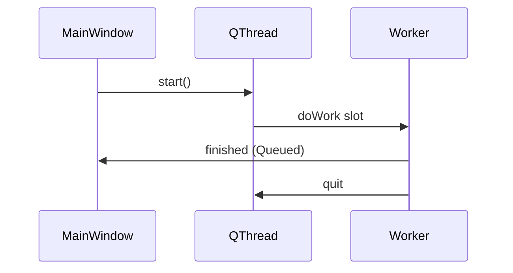

# Qt 入门与信号槽

> **文件编码**：UTF-8。默认 **Qt 6.5+ LTS** + **C++17** + **CMake**。  
> **前置**：[01～05](01-C++基础语法与数据类型.md)、[08 并发](08-多线程与并发编程.md)、[09 CMake](09-CMake与项目工程化.md)；分轨说明见 [16 章](16-必学技术栈分轨与扩展专题.md)。

---

## 本章与前后章的关系

| 上一章 | 本章 | 下一章 |
|--------|------|--------|
| [16 必学技术栈](16-必学技术栈分轨与扩展专题.md) 选定桌面分轨 C | 第一个 Qt 窗口 + 信号槽 + CMake | 自练项目：计算器 / 记事本 |



---

## 0. 读前导读

### 0.1 用一句话弄懂本章

**Qt = C++ 的跨平台桌面 UI 库**；你写 `QPushButton`，用 **信号槽** 把「点击」连到你的函数，CMake 链上 Qt6 就能在 Windows/Linux 出窗口。

### 0.2 你需要提前知道什么

| 状态 | 动作 |
|------|------|
| 没学过指针/OOP | 先完成 [03 章](03-面向对象与类设计.md) |
| 只会控制台 `cout` | 正常，本章第一次出窗口 |
| 听过 Qt 但不懂 | 读 [16 章 §3](16-必学技术栈分轨与扩展专题.md) |

### 0.3 本章知识地图

- [ ] 安装 Qt6 并跑通 `hello-qt`
- [ ] 解释信号与槽、QObject 父子关系
- [ ] 用 CMake `find_package(Qt6)` 构建
- [ ] 完成一个带按钮 + 标签的交互窗体
- [ ] 完成 §11 闭卷自测 ≥7/10

---

## 1. Qt 是什么（再讲一遍，结合代码）

| 对比 | Qt | Web 前端 Vue |
|------|-----|--------------|
| 语言 | C++ | JavaScript |
| 界面 | 原生控件 `QWidget` | DOM + 组件 |
| 事件 | **信号槽** | `@click` / 事件监听 |
| 构建 | CMake + Qt | Vite |
| 典型产品 | WPS 部分模块、VirtualBox、Autodesk 工具 | 浏览器里的网页 |

**Qt 模块（先学这些）**：

| 模块 | 用途 |
|------|------|
| **Qt6::Core** | 字符串 `QString`、容器、事件循环 |
| **Qt6::Widgets** | 按钮、输入框、窗口（传统桌面） |
| **Qt6::Gui** | 绘图、字体（Widgets 依赖） |
| **Qt6::Network** | HTTP/TCP（第二阶段） |

**第二阶段再学**：QML（声明式 UI）、Qt Quick、Charts、SerialPort。

---

## 2. 环境安装（Windows 为主）

### 2.1 推荐组合

| 组件 | 推荐 |
|------|------|
| 编译器 | **MSVC 2022**（随 VS 安装）或 MinGW 11+ |
| Qt 版本 | **Qt 6.5 LTS** 或 6.7+ |
| 构建 | **CMake 3.16+** |
| IDE | Qt Creator（随安装器）或 VS + Qt VS Tools |

### 2.2 安装步骤（Qt 在线安装器）

1. 下载 [Qt Online Installer](https://www.qt.io/download-qt-installer)（需 Qt 账号）。
2. 选择 **Custom Installation**。
3. 勾选：
   - **Qt 6.5.x** → `MSVC 2019 64-bit`（或 MinGW）
   - **Qt Creator**
   - **CMake**（若系统未装）
4. 安装路径示例：`C:\Qt\6.5.3\msvc2019_64`

### 2.3 环境验证

**PowerShell**（路径按本机修改）：

```powershell
# 预期：显示 qmake 版本 6.x
C:\Qt\6.5.3\msvc2019_64\bin\qmake.exe -v

cmake --version
# 预期：cmake version 3.16 或更高
```

### 2.4 常见安装报错

| 现象 | 原因 | 解决 |
|------|------|------|
| 找不到 `Qt6Config.cmake` | CMAKE_PREFIX_PATH 未设 | `-DCMAKE_PREFIX_PATH=C:/Qt/6.5.3/msvc2019_64` |
| 缺少 MSVC | 只装了 MinGW 却用 VS 编译 | 安装对应 kit 或换编译器 |
| 中文乱码 | 源文件非 UTF-8 | 源文件 UTF-8；MSVC 加 `/utf-8` |

---

## 3. 第一个 Qt 程序（hello-qt）

### 3.1 项目结构

```text
hello-qt/
├── CMakeLists.txt
└── main.cpp
```

### 3.2 main.cpp

```cpp
#include <QApplication>
#include <QLabel>

int main(int argc, char* argv[]) {
    QApplication app(argc, argv);

    QLabel label("Hello Qt6");
    label.resize(280, 60);
    label.show();

    return app.exec();  // 进入事件循环，窗口才响应
}
```

### 3.3 CMakeLists.txt

```cmake
cmake_minimum_required(VERSION 3.16)
project(hello_qt LANGUAGES CXX)

set(CMAKE_CXX_STANDARD 17)
set(CMAKE_CXX_STANDARD_REQUIRED ON)
set(CMAKE_AUTOMOC ON)  # Qt 元对象编译器

find_package(Qt6 REQUIRED COMPONENTS Widgets)

add_executable(hello_qt main.cpp)
target_link_libraries(hello_qt PRIVATE Qt6::Widgets)
```

### 3.4 构建与运行

```powershell
cd hello-qt
cmake -S . -B build -DCMAKE_PREFIX_PATH="C:/Qt/6.5.3/msvc2019_64"
cmake --build build --config Release
# 预期：build/Release/hello_qt.exe 弹出小窗显示 Hello Qt6
.\build\Release\hello_qt.exe
```

**深入解释**：`QApplication::exec()` 启动 **事件循环**——没有它，窗口一闪而过。这和 [10 章](10-网络编程与简易HTTP服务.md) 里 `while(true) accept()` 同样是「程序不退出地等服务」，只是 Qt 等服务的是 UI 事件。

---

## 4. 信号与槽（Qt 核心机制）

### 4.1 是什么

| 概念 | 说明 | 类比 |
|------|------|------|
| **信号 signal** | 对象发出的通知（如按钮被点击） | 门铃响了 |
| **槽 slot** | 接收通知并执行的函数 | 你去开门 |
| **connect** | 把信号连到槽 | 接门铃线 |

### 4.2 示例：按钮改文字

**main.cpp**（单文件版）：

```cpp
#include <QApplication>
#include <QWidget>
#include <QPushButton>
#include <QLabel>
#include <QVBoxLayout>

int main(int argc, char* argv[]) {
    QApplication app(argc, argv);

    QWidget window;
    window.setWindowTitle("Counter Demo");
    auto* layout = new QVBoxLayout(&window);
    auto* label = new QLabel("Count: 0", &window);
    auto* button = new QPushButton("Click me", &window);
    layout->addWidget(label);
    layout->addWidget(button);

    int count = 0;
    QObject::connect(button, &QPushButton::clicked, [&]() {
        ++count;
        label->setText(QString("Count: %1").arg(count));
    });

    window.show();
    return app.exec();
}
```

**预期**：每点一次按钮，数字 +1。

### 4.3 新式 connect 语法（C++11 起推荐）

```cpp
QObject::connect(sender, &Sender::signalName, receiver, &Receiver::slotName);
```

比旧式 `SIGNAL/SLOT` 宏 **类型安全**，编译期能报错。

### 4.4 QObject 父子关系与内存

```cpp
auto* button = new QPushButton("OK", &window);  // window 是 parent
```

**parent 销毁时自动 delete 子对象**——类似 [07 章 RAII](07-异常处理与RAII.md) 的「自动关门」。尽量给控件指定 parent，避免裸 `new` 泄漏。

---

## 5. 常用控件速查

| 控件 | 类名 | 典型用途 |
|------|------|----------|
| 窗口 | `QMainWindow` / `QWidget` | 容器 |
| 按钮 | `QPushButton` | 提交、切换 |
| 文本 | `QLabel` | 显示 |
| 单行输入 | `QLineEdit` | 用户名 |
| 多行 | `QTextEdit` | 记事本 |
| 列表 | `QListWidget` | 任务列表 |
| 表格 | `QTableWidget` | 数据网格 |
| 布局 | `QVBoxLayout` / `QHBoxLayout` | 自动排版 |

**不要**初学就用绝对坐标 `move(x,y)`——用布局管理器。

---

## 6. 拆分类写法（工程习惯）

```text
hello-qt/
├── CMakeLists.txt
├── main.cpp
├── mainwindow.h
└── mainwindow.cpp
```

**mainwindow.h**：

```cpp
#pragma once
#include <QMainWindow>

class QLabel;
class QPushButton;

class MainWindow : public QMainWindow {
    Q_OBJECT  // 必须：启用元对象与信号槽

public:
    explicit MainWindow(QWidget* parent = nullptr);

private slots:
    void onButtonClicked();

private:
    QLabel* label_;
    QPushButton* button_;
    int count_ = 0;
};
```

**mainwindow.cpp**：

```cpp
#include "mainwindow.h"
#include <QLabel>
#include <QPushButton>
#include <QVBoxLayout>
#include <QWidget>

MainWindow::MainWindow(QWidget* parent) : QMainWindow(parent) {
    setWindowTitle("Counter OOP");
    auto* central = new QWidget(this);
    setCentralWidget(central);
    auto* layout = new QVBoxLayout(central);
    label_ = new QLabel("Count: 0", central);
    button_ = new QPushButton("Click", central);
    layout->addWidget(label_);
    layout->addWidget(button_);
    connect(button_, &QPushButton::clicked, this, &MainWindow::onButtonClicked);
}

void MainWindow::onButtonClicked() {
    label_->setText(QString("Count: %1").arg(++count_));
}
```

**main.cpp**：

```cpp
#include <QApplication>
#include "mainwindow.h"

int main(int argc, char* argv[]) {
    QApplication app(argc, argv);
    MainWindow w;
    w.show();
    return app.exec();
}
```

**CMakeLists.txt** 增加：

```cmake
add_executable(hello_qt main.cpp mainwindow.cpp mainwindow.h)
```

---

## 7. QString 与 C++ string

| 场景 | 用法 |
|------|------|
| UI 显示 | `QString` |
| 和 STL 互转 | `std::string s = qstr.toStdString();` |
| 格式化 | `QString("Count: %1").arg(n)` |

Qt 网络/文件 API 多用 `QString`；算法逻辑内部可用 `std::string`。

---

## 8. 与 C++ 知识的对应

| C++ 章节 | Qt 中的体现 |
|----------|-------------|
| 03 多态 | `QObject` 子类、虚函数 `event()` |
| 05 智能指针 | 可用 `std::unique_ptr` 包非 Qt 对象；Qt 对象用 parent 机制 |
| 07 RAII | 父子对象树自动释放 |
| 08 线程 | `QThread`、`QtConcurrent`（进阶） |
| 09 CMake | `find_package(Qt6)`、`AUTOMOC` |

---

## 9. 练手项目建议（17 章后）

| 难度 | 项目 | 练到的点 |
|------|------|----------|
| 基础 | **计算器** | 按钮网格、信号槽 |
| 基础 | **记事本** | QTextEdit、菜单、文件对话框 |
| 进阶 | **HTTP 测试客户端** | Qt Network + [计网 04](../../前端学习/计算机网络/04-HTTP协议深入.md) |
| 进阶 | **串口助手** | QSerialPort（工业常见） |
| 简历 | **设备监控面板** | 表格 + 定时刷新 + 日志 |

---

## 10. 常见 FAQ

| 问题 | 答 |
|------|-----|
| Qt 和 MFC 哪个？ | 新项目选 **Qt6**；MFC 老 Windows 项目 |
| 要学 QML 吗？ | 桌面 Widgets 岗先 **Widgets**；移动端/动效多再 QML |
| Qt 收费吗？ | 开源协议（LGPL/商业双授权）；学习/小项目用开源即可 |
| 信号槽和回调函数？ | 本质都是回调；Qt 提供 **类型安全 + 跨线程队列** |
| 和 mini-http 关系？ | mini-http 是无 UI 服务端；Qt 可做 **同一后端的管理界面** |

---

## 11. 闭卷自测

1. `QApplication::exec()` 做什么？
2. 信号和槽分别是什么？
3. 为什么类里要有 `Q_OBJECT` 宏？
4. `CMAKE_AUTOMOC ON` 干什么？
5. Qt 对象为什么推荐指定 parent？
6. `QString` 和 `std::string` 何时用哪个？
7. Qt6 Widgets 和 QML 怎么选（初学）？
8. 桌面分轨简历项目可写什么？

<details>
<summary>参考答案</summary>

1. 启动事件循环，处理 UI 输入直到退出。
2. 信号是事件通知；槽是响应函数；connect 连接二者。
3. 启用 Qt 元对象系统（信号槽、反射）。
4. 自动运行 moc 处理含 Q_OBJECT 的头文件。
5. parent 销毁时自动 delete 子控件，防泄漏（RAII 风格）。
6. UI/ Qt API 用 QString；纯算法可用 std::string。
7. 初学传统桌面 → **Widgets**；QML 偏现代 UI/嵌入式屏。
8. 跨平台 XXX 客户端（Qt6 + CMake + 串口/网络/数据可视化）。

</details>

---

## 12. 练习建议

### 基础

- 完整跑通 §3 hello-qt 与 §6 类拆分版。

### 进阶

- 实现 **计算器**：数字按钮 + 运算符 + `QLabel` 显示结果。

### 挑战

- 用 **Qt Network** 向 [10 章 mini-http](10-网络编程与简易HTTP服务.md) 发 GET，把响应显示在 `QTextEdit`。

---

## 13. 学完标准

- [ ] 独立创建 Qt6 + CMake 项目并显示窗口
- [ ] 会用 connect 连接按钮与自定义 slot
- [ ] 理解 parent 内存管理
- [ ] 完成计算器或记事本 **之一**

---

## 14. Primer Plus 深化：Qt 桌面工程全栈

> 本节在 §1～§13 基础上系统展开 **对象树、五种连接、QML 速览、Qt 与现代 C++、Qt Network、Model/View、QSS、Qt Creator 工程、桌面岗项目案例**，与 [16 分轨](16-必学技术栈分轨与扩展专题.md) C 轨、[03 OOP](03-面向对象与类设计.md)、[05 现代 C++](05-现代C++新特性.md) 形成闭环。

### 14.1 Qt 对象树（Object Tree）深入

#### 14.1.1 为什么需要对象树

Qt 中 **`QObject` 父子关系** 构成一棵树：父对象销毁时 **自动 delete 所有子对象**。这是 Qt 版 RAII，与 [07 章](07-异常处理与RAII.md) 呼应——但 **只适用于 QObject 派生类**。

```cpp
int main(int argc, char* argv[]) {
    QApplication app(argc, argv);
    auto* window = new QMainWindow;           // 无 parent → 需在适当时机 delete 或设 parent
    auto* btn = new QPushButton("OK", window); // parent=window
    window->setCentralWidget(btn);            // 布局会再管理
    window->show();
    return app.exec();  // app 销毁时清理顶级 QObject（视实现；通常 window 应栈对象或 smart 管理）
}
```

**推荐写法（栈对象）**：

```cpp
QMainWindow window;
auto* btn = new QPushButton("OK", &window);
window.show();
return app.exec();
// window 析构 → 自动析构 btn
```

#### 14.1.2 对象树示意图



#### 14.1.3 内存规则表

| 情况 | 谁释放 | 注意 |
|------|--------|------|
| `new Child(parent)` | parent 析构时 | **最常见** |
| 栈上 `QWidget w;` | 离开作用域 | 勿再 delete |
| 无 parent 的 `new` | **你** 负责 | 易泄漏 |
| `QPointer` / `QWeakPointer` | 不拥有对象 | 对象删后自动置空 |
| 非 QObject（`std::vector`） | 标准 C++ 规则 | 不用对象树 |

#### 14.1.4 `QObject::findChild` / `findChildren`

```cpp
auto* edit = window->findChild<QLineEdit*>("urlEdit");
if (edit) edit->setText("http://127.0.0.1:8080/");
// 需在构造函数中 setObjectName("urlEdit")
```

#### 14.1.5 练习

1. 故意 `new QPushButton` 不设 parent，用 Valgrind/ASan 看泄漏。
2. 改为栈 + parent 后 memcheck 通过。

---

### 14.2 信号与槽：五种连接方式

Qt 5 起 `connect` 有 **五种连接类型**（`Qt::ConnectionType`），决定 **槽函数在哪个线程、何时执行**。

#### 14.2.1 语法形式（Qt6 函数指针，推荐）

```cpp
connect(button, &QPushButton::clicked, this, &MainWindow::onClicked);
// 带参数
connect(slider, &QSlider::valueChanged, label, &QLabel::setNum);
```

#### 14.2.2 五种 ConnectionType

| 类型 | 行为 | 典型场景 |
|------|------|----------|
| **AutoConnection**（默认） | 同线程 → Direct；跨线程 → Queued | 绝大多数 UI |
| **DirectConnection** | **立即**在发射线程调用槽 | 同线程、需同步；跨线程危险 |
| **QueuedConnection** | 事件入队，在 **接收者线程** 执行 | 工作线程 → UI 更新 |
| **BlockingQueuedConnection** | Queued + **阻塞**发射线程直到槽完成 | 子线程向主线程要结果（慎用死锁） |
| **UniqueConnection** | 与上述组合，**防重复 connect** | 初始化只连一次 |

#### 14.2.3 跨线程示例（08 章 + Qt）

```cpp
// Worker 在 QThread 中 emit dataReady(QByteArray)
connect(worker, &Worker::dataReady,
        this, &MainWindow::appendLog,
        Qt::QueuedConnection);  // appendLog 一定在 GUI 线程
```



#### 14.2.4 旧语法与 lambda

```cpp
// 旧 SIGNAL/SLOT 宏（不推荐：无编译期检查）
connect(btn, SIGNAL(clicked()), this, SLOT(onClick()));

// lambda
connect(btn, &QPushButton::clicked, this, [this]() {
    statusBar()->showMessage("clicked");
});
```

#### 14.2.5 _disconnect 与重复连接

```cpp
disconnect(button, nullptr, this, nullptr);
connect(..., Qt::UniqueConnection);
```

#### 14.2.6 FAQ

1. **跨线程 Direct 会怎样？** 槽在 **工作线程** 跑，直接操作 QWidget → **崩溃**。
2. **Queued 参数类型？** 需 `qRegisterMetaType` 或 Qt 已知类型。
3. **信号能返回值吗？** 不能；用槽写结果或 `QFuture`（进阶）。

---

### 14.3 QML 速览（Widgets 之后第二步）

#### 14.3.1 Widgets vs QML

| 维度 | Qt Widgets | Qt Quick (QML) |
|------|------------|----------------|
| UI 描述 | C++ 创建控件 | `.qml` 声明式 |
| 适用 | 传统桌面、工业 | 动效、嵌入式屏、移动端 |
| 学习曲线 | 低（本章主线） | 中（需 JS 属性绑定） |
| 性能 | 原生控件 | GPU 场景图 |
| 岗位 | 工业/医疗 PC | 车载 HMI、现代 UI |

#### 14.3.2 最小 QML 示例

`main.qml`：

```qml
import QtQuick
import QtQuick.Controls

ApplicationWindow {
    width: 320; height: 200; visible: true
    title: "Hello QML"
    Button {
        text: "Click"
        onClicked: label.text = "Clicked!"
    }
    Label {
        id: label
        anchors.centerIn: parent
        text: "Hello"
    }
}
```

C++ 启动：

```cpp
#include <QGuiApplication>
#include <QQmlApplicationEngine>

int main(int argc, char* argv[]) {
    QGuiApplication app(argc, argv);
    QQmlApplicationEngine engine;
    engine.loadFromModule("HelloApp", "Main");
    return app.exec();
}
```

#### 14.3.3 QML 与 C++ 交互

- **`Q_PROPERTY`**：QML 读写在 C++ 属性
- **`Q_INVOKABLE`**：QML 调 C++ 方法
- **`signals`**：C++ 发信号 QML 收

**分轨 C 建议**：Widgets 项目做完后再花 **1 周** 看 QML；简历可写「了解 QML」。

---

### 14.4 Qt 与 STL / 现代 C++ 协作

#### 14.4.1 原则

| 层次 | 推荐 |
|------|------|
| UI、事件、网络 API | Qt 类型（`QString`、`QByteArray`） |
| 纯算法、与 UI 无关 | **STL** + 标准库 |
| 所有权 | Qt 对象 → parent；非 Qt → `unique_ptr` |
| 字符串转换 | `QString::fromStdString(s)` / `toStdString()` |

#### 14.4.2 示例：STL 算法 + Qt 显示

```cpp
#include <algorithm>
#include <vector>
#include <QStringList>

QStringList toQStringList(const std::vector<std::string>& v) {
    QStringList out;
    out.reserve(static_cast<int>(v.size()));
    for (const auto& s : v)
        out << QString::fromStdString(s);
    return out;
}

void MainWindow::loadHosts() {
    std::vector<std::string> hosts = fetchFromConfig();  // 纯 C++17
    auto* model = new QStringListModel(toQStringList(hosts), this);
    ui->listView->setModel(model);
}
```

#### 14.4.3 现代 C++ 特性在 Qt 中的使用

```cpp
// C++17 structured binding + Qt
const auto [ok, val] = std::make_pair(true, 42);
if (ok) ui->label->setText(QString::number(val));

// 非 Qt 资源
auto config = std::make_unique<ConfigParser>();
parse(*config, "app.ini");
```

#### 14.4.4 勿混用的坑

| 坑 | 说明 |
|----|------|
| `std::thread` 直接改 UI | 必须 Queued 到 GUI 线程 |
| `QString` 多线程写 | 需同步；只读通常 OK |
| 在 QObject 用 `shared_ptr` 管理自身 | 易 double-delete；用 parent 或 `QSharedPointer` 规范 |

与 [05 章](05-现代C++新特性.md) 对照：语言特性通用；**线程边界** 遵守 Qt 规则。

---

### 14.5 Qt Network 实战

#### 14.5.1 QNetworkAccessManager（HTTP 客户端）

对接 [10 章 mini-http](10-网络编程与简易HTTP服务.md)：

```cpp
#include <QNetworkAccessManager>
#include <QNetworkRequest>
#include <QNetworkReply>

class HttpClient : public QObject {
    Q_OBJECT
    QNetworkAccessManager mgr_{this};
public:
    void get(const QUrl& url) {
        connect(&mgr_, &QNetworkAccessManager::finished,
                this, [this](QNetworkReply* reply) {
            if (reply->error() == QNetworkReply::NoError)
                emit bodyReady(reply->readAll());
            reply->deleteLater();
        });
        mgr_.get(QNetworkRequest(url));
    }
signals:
    void bodyReady(QByteArray data);
};
```

使用：

```cpp
HttpClient client;
connect(&client, &HttpClient::bodyReady, textEdit, &QTextEdit::setPlainText);
client.get(QUrl("http://127.0.0.1:8080/"));
```

#### 14.5.2 QTcpSocket（底层 TCP）

```cpp
QTcpSocket socket;
socket.connectToHost("127.0.0.1", 8080);
connect(&socket, &QTcpSocket::readyRead, [&]() {
    ui->log->append(QString::fromUtf8(socket.readAll()));
});
socket.write("GET / HTTP/1.1\r\nHost: localhost\r\n\r\n");
```

| API | 层级 | 何时用 |
|-----|------|--------|
| QNetworkAccessManager | HTTP 高级 | REST 客户端、下载 |
| QTcpSocket / QUdpSocket | 传输层 | 自定义协议、工业 |
| QSslSocket | TLS | HTTPS 客户端 |

#### 14.5.3 异步与 UI

所有 Network 回调在 **socket 所属线程**；GUI 默认主线程，**直接更新 UI 即可**。若在 `QThread` 里建 socket，需 `QueuedConnection` 传数据到界面。

---

### 14.6 Model / View 架构

#### 14.6.1 为何不用 QListWidget 塞百万行

**Model/View** 分离：**Model** 管数据，**View** 只管显示可见行 → 省内存、快滚动。



#### 14.6.2 QStringListModel 入门

```cpp
QStringList data = {"192.168.1.1", "10.0.0.1"};
auto* model = new QStringListModel(data, this);
ui->listView->setModel(model);
```

#### 14.6.3 自定义 Model 骨架

```cpp
class DeviceModel : public QAbstractTableModel {
    Q_OBJECT
    std::vector<Device> devices_;
public:
    int rowCount(const QModelIndex& = {}) const override {
        return static_cast<int>(devices_.size());
    }
    int columnCount(const QModelIndex& = {}) const override { return 3; }
    QVariant data(const QModelIndex& idx, int role) const override {
        if (role != Qt::DisplayRole) return {};
        const auto& d = devices_[idx.row()];
        switch (idx.column()) {
            case 0: return d.name;
            case 1: return d.ip;
            case 2: return d.status;
        }
        return {};
    }
    void append(Device d) {
        beginInsertRows({}, devices_.size(), devices_.size());
        devices_.push_back(std::move(d));
        endInsertRows();
    }
};
```

#### 14.6.4 工业场景

| 控件 | Model | 场景 |
|------|-------|------|
| QTableView | 自定义 TableModel | 设备列表、告警表 |
| QTreeView | QStandardItemModel | 目录树 |
| QListView | QStringListModel | 简单 IP 列表 |

**桌面岗面试**：能解释 **为何 Model 通知 `dataChanged` / `beginInsertRows`**  View 才刷新。

---

### 14.7 QSS（Qt Style Sheets）美化

#### 14.7.1 语法（类 CSS）

```cpp
qApp->setStyleSheet(R"(
    QMainWindow { background: #2b2b2b; }
    QPushButton {
        background: #0d7377;
        color: white;
        border-radius: 4px;
        padding: 6px 12px;
    }
    QPushButton:hover { background: #14a085; }
    QLineEdit { background: #3c3f41; color: #eee; border: 1px solid #555; }
)");
```

#### 14.7.2 文件级 QSS

```cpp
QFile f(":/styles/dark.qss");
f.open(QFile::ReadOnly);
qApp->setStyleSheet(QString::fromUtf8(f.readAll()));
```

`.qrc` 资源文件嵌入 QSS（Qt Creator 可图形化添加）。

#### 14.7.3 与 Widgets 布局配合

- **布局**：`QVBoxLayout` / `QGridLayout` 管几何
- **QSS**：管颜色、圆角、hover
- 复杂动效 → 考虑 QML

---

### 14.8 Qt Creator 工程结构

#### 14.8.1 新建项目 checklist

| 步骤 | 选项 |
|------|------|
| 模板 | Qt Widgets Application 或 CMake 空项目 |
| Kit | MSVC 2019 64bit 或 MinGW |
| 构建 | CMake（与 09 章一致） |
| 版本控制 | Git 初始化 |

#### 14.8.2 典型目录

```text
device-monitor/
├── CMakeLists.txt
├── main.cpp
├── src/
│   ├── MainWindow.cpp
│   └── MainWindow.h
├── ui/
│   └── MainWindow.ui          # Designer 生成
├── resources/
│   ├── app.qrc
│   └── styles/dark.qss
└── tests/
    └── test_parser.cpp        # gtest 测非 UI 逻辑
```

#### 14.8.3 CMakeLists（Widgets + AUTOUIC + AUTORCC）

```cmake
cmake_minimum_required(VERSION 3.16)
project(device_monitor LANGUAGES CXX)

set(CMAKE_CXX_STANDARD 17)
set(CMAKE_AUTOMOC ON)
set(CMAKE_AUTOUIC ON)
set(CMAKE_AUTORCC ON)

find_package(Qt6 REQUIRED COMPONENTS Core Widgets Network)

add_executable(device_monitor
    main.cpp
    src/MainWindow.cpp src/MainWindow.h
    ui/MainWindow.ui
    resources/app.qrc
)
target_link_libraries(device_monitor PRIVATE Qt6::Core Qt6::Widgets Qt6::Network)
```

#### 14.8.4 Qt Creator 常用面板

| 面板 | 用途 |
|------|------|
| Projects | Kit、构建目录、CMake 参数 |
| Design | 拖控件编辑 `.ui` |
| Application Output | `qDebug` 输出 |
| Debugger | 断点、查看 `QObject` 树 |

#### 14.8.5 与 09 章 CMake 统一

团队项目 **命令行 CI** 仍用：

```bash
cmake -S . -B build -DCMAKE_PREFIX_PATH=C:/Qt/6.5.3/msvc2019_64
cmake --build build --config Release
ctest --test-dir build
```

Creator 只是 GUI 包装同一套 CMake。

---

### 14.9 桌面岗项目案例库

#### 14.9.1 案例 A：设备监控面板（简历级）

| 项 | 内容 |
|----|------|
| **功能** | 表格显示设备 IP/状态；定时 ping；告警红色高亮 |
| **技术点** | QTableView + 自定义 Model、`QTimer`、Qt Network |
| **并发** | 工作线程 ping，`QueuedConnection` 更新 Model |
| **工程** | CMake、spdlog 写文件日志、gtest 测 IP 解析 |
| **STAR** | 工业现场 50+ 设备，Qt6 客户端替代 Excel 轮询 |

#### 14.9.2 案例 B：HTTP API 测试工具

| 项 | 内容 |
|----|------|
| **功能** | 输入 URL，GET/POST，显示响应头/体 |
| **技术点** | QNetworkAccessManager、对接 mini-http |
| **扩展** | JSON 格式化（nlohmann 在 C++ 层解析后给 Qt 显示） |

#### 14.9.3 案例 C：串口助手

| 项 | 内容 |
|----|------|
| **模块** | Qt SerialPort |
| **功能** | 波特率、hex 显示、发送队列 |
| **场景** | 嵌入式调试、Modbus 入门 |

#### 14.9.4 案例 D：日志查看器

| 项 | 内容 |
|----|------|
| **功能** | tail -f 风格，滚动、关键字过滤 |
| **技术点** | QFileSystemWatcher、`QPlainTextEdit`、Model/View 可选 |

#### 14.9.5 项目选型决策



---

### 14.10 深化 FAQ

1. **Qt6 还叫 signal/slot 吗？** 是；元对象系统仍在，需 `Q_OBJECT` + moc。
2. **能用 std::format 打日志吗？** 可以，但 UI 调试常用 `qDebug()` << ...。
3. **Model/View 必须吗？** 小数据 `QListWidget` 够用；表格 >1000 行建议 Model。
4. **QSS 影响性能吗？** 全局复杂 QSS 有开销；工业软件常用简单主题。
5. **Qt Creator 必须吗？** 否；VS Code + CMake 亦可，Designer 可单独开 `.ui`。
6. **与 Electron 面试对比？** Qt 原生、内存可控、适合工业；Electron Web 生态、迭代快。
7. **License？** LGPL 动态链接通常开源可接受；静态链接需商业授权（Consult 法务）。

---

### 14.11 深化练习

#### 基础

1. 画 §14.1.2 对象树，标出 parent 指针方向。
2. 用 **QueuedConnection** 从 `QThread` worker 更新 `QLabel`。

#### 进阶

1. 完成 §14.5.1，对 mini-http 发 GET 并显示 body。
2. 用 QSS 做 dark theme 计算器。

#### 挑战

1. 实现 §14.6.3 DeviceModel + QTableView，模拟 1000 行滚动。
2. 按 §14.9.1 写 **STAR 简历段落**（200 字）。

---

### 14.12 深化闭卷自测

1. Qt 对象树谁 delete 子对象？
2. 五种连接类型中，跨线程 UI 更新用哪种？
3. QML 与 Widgets 选型一句话？
4. `QString` 与 `std::string` 边界如何划分？
5. QNetworkAccessManager 与 QTcpSocket 层级差异？
6. Model/View 相比 QListWidget 的核心优势？
7. `CMAKE_AUTOUIC` 作用？
8. 桌面岗简历项目可写哪三个关键词？

<details>
<summary>参考答案</summary>

1. 父 QObject 析构时自动 delete 子对象。
2. Qt::QueuedConnection（默认 Auto 在同线程 Direct、跨线程 Queued）。
3. 传统桌面 Widgets；现代动效/嵌入式屏 QML。
4. Qt API/UI 用 QString；纯算法层 STL string。
5. QNAM 管 HTTP 会话；QTcpSocket  raw TCP。
6. 大数据只渲染可见行，Model 通知增量更新。
7. 自动 uic 处理 `.ui` 生成 ui_*.h。
8. Qt6, CMake, 跨平台, Model/View, 工业/网络 任选其三组合。

</details>

---

### 14.13 布局管理器详解

#### 14.13.1 三种常用布局

| 布局 | 行为 | 典型 |
|------|------|------|
| `QVBoxLayout` | 纵向堆叠 | 表单 |
| `QHBoxLayout` | 横向排列 | 工具栏 |
| `QGridLayout` | 网格 | 计算器按钮 |

```cpp
auto* layout = new QGridLayout;
layout->addWidget(new QPushButton("7"), 0, 0);
layout->addWidget(new QPushButton("8"), 0, 1);
layout->addWidget(new QPushButton("9"), 0, 2);
centralWidget()->setLayout(layout);
```

#### 14.13.2 尺寸策略 `QSizePolicy`

```cpp
btn->setSizePolicy(QSizePolicy::Expanding, QSizePolicy::Fixed);
```

控制窗口缩放时控件 **拉伸 vs 固定**；工业软件常固定输入框高度、表格 Expanding。

---

### 14.14 菜单、工具栏与对话框

```cpp
auto* fileMenu = menuBar()->addMenu(tr("&File"));
fileMenu->addAction(tr("&Open"), this, &MainWindow::openFile, QKeySequence::Open);
fileMenu->addAction(tr("E&xit"), qApp, &QApplication::quit, QKeySequence::Quit);

auto* openDlg = new QFileDialog(this, tr("Open File"), ".", tr("Text (*.txt)"));
connect(openDlg, &QFileDialog::fileSelected, this, &MainWindow::loadFile);
```

| 组件 | 类 | 用途 |
|------|-----|------|
| 文件对话框 | `QFileDialog` | 打开/保存 |
| 消息框 | `QMessageBox` | 确认/告警 |
| 输入框 | `QInputDialog` | 简单输入 |

---

### 14.15 事件系统与 `event()` 重写

Qt 除信号槽外，还有 **事件**（`QEvent`）：`QMouseEvent`、`QKeyEvent`、`QCloseEvent`。

```cpp
class MyWidget : public QWidget {
protected:
    void closeEvent(QCloseEvent* e) override {
        auto ret = QMessageBox::question(this, "Confirm", "Exit?");
        if (ret != QMessageBox::Yes)
            e->ignore();
        else
            e->accept();
    }
};
```

与 [03 多态](03-面向对象与类设计.md)：`event()` 是 virtual，可拦截再 `QWidget::event(e)`。

---

### 14.16 QThread 与 Worker 对象模式（08 章衔接）

```cpp
class Worker : public QObject {
    Q_OBJECT
public slots:
    void doWork() {
        // 耗时：网络/ping/解析
        emit finished(result);
    }
signals:
    void finished(QString result);
};

QThread thread;
Worker worker;
worker.moveToThread(&thread);
connect(&thread, &QThread::started, &worker, &Worker::doWork);
connect(&worker, &Worker::finished, this, &MainWindow::onResult);
connect(&worker, &Worker::finished, &thread, &QThread::quit);
thread.start();
```



**禁止**：在 `QThread` 子类 `run()` 里直接创建 QWidget。

---

### 14.17 资源系统 `.qrc` 与国际化

`resources/app.qrc`：

```xml
<RCC>
    <qresource prefix="/">
        <file>styles/dark.qss</file>
        <file>icons/app.png</file>
    </qresource>
</RCC>
```

```cpp
QIcon icon(":/icons/app.png");
```

国际化：

```cpp
QTranslator tr;
tr.load(":/i18n/app_zh_CN.qm");
app.installTranslator(&tr);
// 文本用 tr("Hello")
```

---

### 14.18 完整 MainWindow 拆分示例（类拆分版扩充）

`MainWindow.h`：

```cpp
#pragma once
#include <QMainWindow>

class QPushButton;
class QLabel;
class QTextEdit;

class MainWindow : public QMainWindow {
    Q_OBJECT
public:
    explicit MainWindow(QWidget* parent = nullptr);

private slots:
    void onFetchClicked();
    void onBodyReady(const QByteArray& body);

private:
    QPushButton* fetchBtn_{nullptr};
    QLabel* status_{nullptr};
    QTextEdit* body_{nullptr};
    class HttpClient* http_{nullptr};
};
```

**验收**：UI 与 `HttpClient` 分离 → 可对 `HttpClient` 写 gtest（mock 网络可选）。

---

### 14.19 桌面岗面试题精选

| 题 | 要点 |
|----|------|
| 信号槽 vs 回调 | 类型安全、moc、跨线程队列 |
| Qt 内存管理 | 对象树 parent；非 QObject 用智能指针 |
| 线程更新 UI | 必须 GUI 线程；QueuedConnection |
| Model/View 优势 | 大数据、分离、多 View 同 Model |
| Qt vs MFC/WPF | 跨平台、信号槽、CMake 现代栈 |
| LGPL 合规 | 动态链 Qt；提供 object 文件等（Consult 法务） |

---

### 14.20 深化附录：Qt 模块学习顺序

```text
1. Core (QString, 容器, 事件循环)
2. Widgets (窗口、布局、信号槽)
3. Gui (绘图基础)
4. Network (HTTP 客户端)
5. SerialPort / Charts (工业/可视化)
6. Quick/QML (声明式 UI)
7. Multimedia / Bluetooth (按需)
```

---

### 14.21 计算器完整思路（练手项目）

| 组件 | 实现 |
|------|------|
| 显示 | `QLabel` 或 `QLineEdit` read-only |
| 数字键 | `QGridLayout` 4×4 |
| 逻辑 | 槽函数解析 `display` 字符串，**非 eval** |
| 状态机 | `enum class Op { Add, Sub, Mul, Div, None }` |
| 错误 | 除零 → `QMessageBox` |

```cpp
void CalcWindow::onDigitClicked() {
    auto* btn = qobject_cast<QPushButton*>(sender());
    if (!btn) return;
    display_->setText(display_->text() + btn->text());
}
```

---

### 14.22 深化闭卷自测（追加）

9. `moveToThread` 后 Worker 在哪个线程执行 slot？
10. `.qrc` 中 `:/` 前缀表示什么？
11. `QCloseEvent::ignore()` 效果？
12. 为何不在 `QThread::run` 里操作 GUI？

<details>
<summary>参考答案</summary>

9. Worker 对象所在线程（即 QThread 线程）。
10. Qt 资源系统嵌入的二进制路径。
11. 窗口不关闭，事件被忽略。
12. QWidget 只能在 GUI 线程创建/操作，否则未定义行为/崩溃。

</details>

---

## 15. 下一章预告

本仓库 C++ **核心编号止于 17**。后续可：

- 深化 Qt：Model/View、QML、Qt Network（参考 Qt 官方文档）
- 或回 [13 章](13-算法与数据结构C++实现.md) / [10～12 章](10-网络编程与简易HTTP服务.md) 走算法/系统分轨

分轨对照始终见 [16 章](16-必学技术栈分轨与扩展专题.md)。
