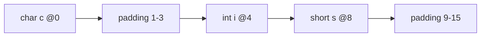
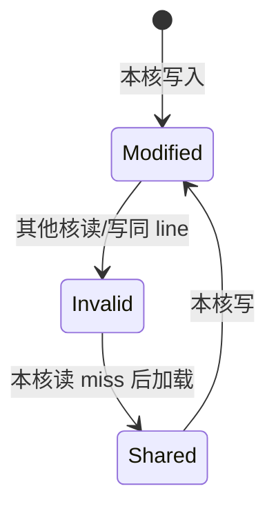

# 高性能 C++ 与内存对齐

> **文件编码**：UTF-8。  
> **定位**：LLM Infra 工程 C++ 的「性能地基」——对齐、缓存行、假共享、零拷贝、Buffer 移动语义。  
> **交叉阅读**：[LLMInfra 06 高性能 C++ 习惯](../LLMInfra/06-高性能C++对齐与零拷贝.md)、[C++ 05 现代特性](05-现代C++新特性.md)、[C++ 08 多线程](08-多线程与并发编程.md)。

---

## 0. 读前导读（零基础也能跟上）

### 0.1 用一句话弄懂本章

**高性能 C++** = 让 CPU 少等内存、少拷贝、少争用缓存行——在 LLM Serving 里，这直接决定 KV Cache 吞吐与 RPC 延迟。

### 0.2 你需要提前知道什么

- [05 章](05-现代C++新特性.md) 移动语义、`unique_ptr`
- [08 章](08-多线程与并发编程.md) `atomic`、mutex 基础
- [02 章](02-指针引用与内存管理.md) 堆/栈、指针算术
- 并行读 [LLMInfra 06](../LLMInfra/06-高性能C++对齐与零拷贝.md) 与 [08 KV Cache](../LLMInfra/08-KV-Cache与PagedAttention原理.md)

### 0.3 本章知识地图（☐→☑）

- [ ] 解释 `alignof` / `alignas` / `std::aligned_alloc`
- [ ] 画出 L1/L2/L3 与 cache line（通常 64B）
- [ ] 识别并修复 false sharing
- [ ] 区分零拷贝的三种含义（mmap、move、IOV）
- [ ] 为 Buffer 类实现移动构造/移动赋值
- [ ] §17 闭卷自测 ≥8/10

### 0.4 建议学习时长

**4～5 天**；false sharing 与 Buffer move 需动手 benchmark。

### 0.5 学完你能做什么

为推理引擎写对齐的权重 buffer；在多线程计数器旁加 padding；用 `mmap` 加载 GGUF；理解 vLLM block 为何按页对齐。

### 0.6 与 LLM Infra / CUDA 的衔接

| 本章概念 | Infra 场景 |
|----------|------------|
| 64B cache line | 多线程 scheduler 计数器 padding |
| 零拷贝 mmap | [LLMInfra 12](../LLMInfra/12-Checkpoint加载与mmap.md) 权重加载 |
| move Buffer | gRPC/protobuf 字节流、KV block 转移 |
| 对齐 | CUDA coalesced access 前置（[LLMInfra 04](../LLMInfra/04-CUDA核函数与内存模型.md)） |

---

## 本章与上一章的关系

[17 章 Qt](17-Qt入门与信号槽.md) 偏 GUI；进入 LLM Infra 扩展轨后，**性能习惯**成为主线。[12 章性能分析](12-性能分析与调试.md) 教你怎么量；本章教你怎么写「少踩坑」的代码。与 [05 章 move](05-现代C++新特性.md) 不同，本章聚焦 **Buffer 工程化** 与 **硬件缓存模型**。

---

## 1. 这份文档学什么

- 内存对齐规则与 `alignas`
- CPU cache line 与 false sharing
- 零拷贝：mmap、`sendfile`、移动语义
- 高性能 `Buffer` / `TensorStorage` 类设计
- LLM Infra 中的典型陷阱与修复

---

## 2. 内存对齐基础

### 2.1 为什么需要对齐

CPU 按 **字长**（4/8 字节）或 **SIMD 宽度**（16/32/64 字节）加载内存。未对齐访问可能导致：

- x86：拆成两次 load，性能下降
- ARM：直接 fault 或内核修复

```cpp
#include <cstddef>
#include <iostream>

struct Bad {
    char c;      // 1 byte
    double d;    // 8 byte，d 可能从 offset 8 开始（padding 7）
};

struct Good {
    double d;
    char c;
    // 仍可能有 tail padding 使 sizeof(Good)==16
};

int main() {
    std::cout << "Bad: " << sizeof(Bad) << " align=" << alignof(Bad) << '\n';
    std::cout << "Good: " << sizeof(Good) << " align=" << alignof(Good) << '\n';
    return 0;
}
```

### 2.2 alignas 与 aligned_alloc

```cpp
#include <cstdlib>
#include <cstring>

alignas(64) char cache_friendly[1024];  // 整段起始于 64B 边界

void* p = std::aligned_alloc(64, 4096);  // size 必须是 alignment 倍数
if (p) {
    std::memset(p, 0, 4096);
    std::free(p);
}
```

**LLM 场景**：GEMM tile、KV block 常要求 256B/512B 对齐以配合 AVX-512 或 CUDA 128B segment。

---

## 3. Cache Line 与 False Sharing

### 3.1 缓存层次（速览）

```text
寄存器 → L1d (32～64KB) → L2 → L3 (共享) → DRAM → (GPU HBM)
         ↑
    以 cache line 为单位（典型 64 字节）在核间迁移
```

详见 [22 章 体系结构导读](22-计算机体系结构导读.md)。

### 3.2 False Sharing 示例

两线程分别递增 `atomic a` 与 `atomic b`；若同处一 cache line 则极慢。修复：`alignas(64)` 分离或 per-core 计数。对照 [08 章](08-多线程与并发编程.md) 跑 benchmark。

---

## 4. 零拷贝的三种含义

| 层次 | 手段 | 典型用途 |
|------|------|----------|
| 进程内 | `std::move`、span 视图 | Buffer 转移所有权 |
| 内核 IO | `mmap`、`sendfile` | 权重文件、静态资源 |
| 网络/RPC | scatter-gather、共享内存 | gRPC 大 payload（见 19 章） |

### 4.1 mmap 加载权重（概念）

```cpp
#include <fcntl.h>
#include <sys/mman.h>
#include <sys/stat.h>
#include <unistd.h>

// 伪代码：只读映射 safetensors/gguf 片段
int fd = open("model.gguf", O_RDONLY);
struct stat st{};
fstat(fd, &st);
void* addr = mmap(nullptr, st.st_size, PROT_READ, MAP_PRIVATE, fd, 0);
// 直接 cast 为 float* 或按 offset 解析 header
// munmap(addr, st.st_size); close(fd);
```

对照 [LLMInfra 12 Checkpoint 与 mmap](../LLMInfra/12-Checkpoint加载与mmap.md)。**注意**：映射后仍需处理 endian、对齐与生命周期。

### 4.2 进程内零拷贝：移动 Buffer

```cpp
class Buffer {
    std::vector<uint8_t> data_;
public:
    Buffer() = default;
    explicit Buffer(size_t n) : data_(n) {}
    Buffer(const Buffer&) = delete;
    Buffer& operator=(const Buffer&) = delete;
    Buffer(Buffer&&) noexcept = default;
    Buffer& operator=(Buffer&&) noexcept = default;
    uint8_t* data() { return data_.data(); }
    size_t size() const { return data_.size(); }
};
```

**Rule**：Infra 热路径禁止 `Buffer` 拷贝；用 move 或 `std::span<const uint8_t>` 只读视图。

---

## 5. LLM Infra 案例串联

1. **权重**：mmap + 只读映射（[LLMInfra 12](../LLMInfra/12-Checkpoint加载与mmap.md)）。
2. **KV Cache**：block pool（[21 章](21-设计模式与Infra工程实践.md)）+ move 转移。
3. **调度器**：per-core 队列 + cache line padding。

---

## 6. 性能检查清单

- [ ] 热路径无隐式 `string`/`vector` 拷贝
- [ ] 多线程计数器是否 padding
- [ ] 大文件是否 mmap 而非 `read` 进 vector
- [ ] Buffer 是否 delete 拷贝、启用 move
- [ ] 用 `perf stat` / cache-miss 指标验证（[12 章](12-性能分析与调试.md)）

---

## 7. 常见错误

| 错误 | 后果 | 修复 |
|------|------|------|
| 结构体成员顺序随意 | 膨胀 sizeof | 大字段靠前、`*alignas(64)*` |
| `atomic` 数组密集排列 | false sharing | 每元素独占 cache line |
| `return std::move(local)` | 阻止 RVO | 直接 `return local` |
| mmap 可写共享 | 意外 COW 或一致性问题 | 明确 `MAP_PRIVATE` vs `MAP_SHARED` |

---

## 8. 练习

### 练习 1：Padding 实验

实现 §3.2 的 benchmark，记录 false sharing vs padded 耗时比（本机 4 核以上更明显）。

### 练习 2：移动 Buffer 队列

用 `std::deque<Buffer>` 或 lock-free 队列（[21 章](21-设计模式与Infra工程实践.md)）实现 block 借还：`acquire()` move 出，`release(Buffer&&)` move 回。

### 练习 3：对齐分配器

为 `std::vector` 写简单 `aligned_allocator<T, 64>`（或使用 C++17 `std::aligned_alloc` 包装），加载 64 个 float 并用 AVX 求和。

---

## 9. FAQ

**Q：false sharing 和 true sharing 区别？**  
True sharing 是线程正当争用同一数据；false sharing 是不同数据碰巧同 cache line，纯性能问题。

**Q：零拷贝是否完全不拷贝？**  
mmap 仍有一次页表映射；move 转移所有权但不复制字节；网络栈仍可能 DMA。

**Q：C++17 还需要手写三五法则吗？**  
Buffer 类建议 **Rule of Five 的 delete 拷贝 + default move**，或 Rule of Zero 全用 `vector`。

**Q：与 CUDA pinned memory 关系？**  
Host 侧对齐 + pinned（页锁定）加速 H2D；见 [LLMInfra 04](../LLMInfra/04-CUDA核函数与内存模型.md)。

---

## 10. 学完标准

- [ ] 能解释对齐、padding、cache line 三者关系
- [ ] 写出并运行 false sharing 对比实验
- [ ] 实现禁止拷贝、允许移动的 Buffer
- [ ] 说清 mmap 在权重加载中的角色
- [ ] 对照 LLMInfra 06、08、12 各举一例
- [ ] 完成至少 2 道练习题

---

## 11. 闭卷自测

1. 典型 x86 cache line 大小？
2. false sharing 成因与两种修复思路？
3. `alignas(64)` 解决什么问题？
4. 进程内「零拷贝」在 C++ 里主要指什么？
5. mmap `MAP_PRIVATE` 与 `MAP_SHARED` 区别？
6. 为什么 Buffer 热路径要 delete 拷贝构造？
7. `std::move` 是否移动内存字节？
8. KV block pool 为何 benefit from move？
9. LLMInfra 哪几章与本章直接相关？
10. padding 到 cache line 的代价是什么？

<details>
<summary>自测参考答案</summary>

1. **64 字节**（常见；以 `std::hardware_destructive_interference_size` 为准更佳）。
2. 不同核写同一 cache line 内不同变量 → 互 invalidate；**padding / 按 line 对齐分离** 或合并计数。
3. 让对象起始地址满足对齐，避免 split load、配合 SIMD。
4. **转移所有权**（move、`span` 视图），避免堆缓冲区二次拷贝。
5. **PRIVATE**：写时 COW 副本；**SHARED**：多进程可见同一物理页。
6. 防止意外深拷贝大 buffer；强制 API 层 move。
7. **否**；仅转为右值引用，启用移动构造/赋值。
8. block 在大缓冲区间转移，O(1) 指针交换，无 memcpy。
9. **06** 高性能习惯、**08** KV、**12** mmap、**04** CUDA 内存。
10. **内存浪费**（每计数器占满 64B）；换吞吐值得。

</details>

---

---

## Primer Plus 深度扩写：高性能内存与 CPU 微架构

> 本节在原有骨架基础上展开 Primer Plus 级教材内容，与 [22 章](22-计算机体系结构导读.md)、[70 章](70-计算机体系结构深入学习.md) 互补——本章偏 **C++ 代码层** 优化。

### 12.1 对齐原理：从地址到硬件 Load/Store

#### 12.1.1 为什么 CPU 要求对齐

现代 CPU 以 **总线宽度** 为单位访问内存。x86-64 上：

- 普通 `mov` 可按 1/2/4/8 字节访问
- **SSE/AVX** 要求 16/32/64 字节对齐以获得最佳吞吐
- 未对齐访问：x86 拆成两次访问；ARM 可能触发 **Alignment Fault**

**推导**：设 `double` 需 8 字节对齐，地址 `addr % 8 == 0` 时一次 load；否则硬件需读两个 cache line 片段并拼接。

```cpp
#include <cstdint>
#include <iostream>

struct UnalignedDemo {
    char  pad;
    double value;  // 可能从 offset 8 开始
};

int main() {
    UnalignedDemo u{};
    auto addr = reinterpret_cast<std::uintptr_t>(&u.value);
    std::cout << "value offset=" << offsetof(UnalignedDemo, value)
              << " addr%8=" << (addr % 8) << '\n';
}
```

#### 12.1.2 结构体布局推导规则（C++17 前通用）

| 规则 | 说明 |
|------|------|
| 起始对齐 | 结构体起始地址 ≡ 0 (mod alignof(结构体)) |
| 成员对齐 | 成员 offset ≡ 0 (mod alignof(成员)) |
| 结构体 alignof | max(各成员 alignof, 指定 alignas) |
| 结构体 sizeof | 向上取整到 alignof 的倍数（尾部 padding） |

**手算示例**：

```cpp
struct S {
    char   c;    // offset 0, size 1
    // padding 3 bytes (int 需 4 对齐)
    int    i;    // offset 4, size 4
    short  s;    // offset 8, size 2
    // padding 6 bytes → sizeof(S)==16, alignof(S)==4
};
```



#### 12.1.3 对齐与 cache line 的关系

- Cache line 典型 **64B**，是对 **一致性** 的最小单位
- 对齐到 64B 边界 ≠ 独占 cache line；相邻对象仍可能同 line
- **False sharing** 发生在 **不同逻辑变量共享同一 cache line** 且多核写

---

### 12.2 alignas / alignof 完全指南

#### 12.2.1 alignof 与 std::alignment_of（C++11）

```cpp
#include <iostream>
#include <type_traits>

struct Node {
    int x;
    double y;
};

alignas(64) struct CacheLinePadded {
    std::atomic<int64_t> counter{0};
    char padding[64 - sizeof(std::atomic<int64_t>)];
};

int main() {
    std::cout << "alignof(int)=" << alignof(int) << '\n';
    std::cout << "alignof(double)=" << alignof(double) << '\n';
    std::cout << "alignof(Node)=" << alignof(Node) << '\n';
    std::cout << "alignof(CacheLinePadded)=" << alignof(CacheLinePadded) << '\n';
    std::cout << "hardware_destructive_interference_size="
              << std::hardware_destructive_interference_size << '\n';
}
```

| API | 作用 |
|-----|------|
| `alignof(T)` | 类型 T 的对齐要求 |
| `alignas(N) T` | 强制 T 至少 N 字节对齐 |
| `std::aligned_storage` | 预留对齐存储（C++23 起 deprecated，用 `alignas` 替代） |
| `std::aligned_alloc(align, size)` | 堆上对齐分配；size 须为 align 倍数 |
| `std::hardware_destructive_interference_size` | 建议的 false sharing 隔离距离（C++17） |

#### 12.2.2 alignas 作用于变量、成员、类型

```cpp
alignas(32) float simd_buffer[1024];

struct AlignedHeader {
    alignas(64) uint64_t magic;
    uint32_t version;
    // 可能有 padding 到下一 64B 边界
};

// 过度对齐的类型
struct alignas(128) HugeAligned {
    char data[64];
};
static_assert(alignof(HugeAligned) >= 128);
```

#### 12.2.3 over-aligned 类型与 operator new (C++17)

```cpp
struct alignas(256) Tile {
    float data[64];
};

// 全局 operator new 需支持 256 对齐
void* p = ::operator new(sizeof(Tile), std::align_val_t{256});
auto* tile = new(p) Tile{};
tile->~Tile();
::operator delete(p, std::align_val_t{256});
```

**Infra 场景**：GEMM tile、KV block 与 CUDA 128B 访问模式对齐。

---

### 12.3 #pragma pack 与跨平台布局控制

#### 12.3.1 语法与语义

```cpp
#pragma pack(push, 1)
struct WireHeader {
    uint32_t magic;
    uint16_t version;
    uint8_t  flags;
    // 无 padding，sizeof==7? 实际可能仍对齐到 1 字节边界 → 7
};
#pragma pack(pop)
```

| pack 值 | 效果 |
|---------|------|
| 1 | 紧凑，无插入 padding |
| 2/4/8 | 成员 max(自身对齐, pack) |
| push/pop | 保存/恢复栈式设置 |

#### 12.3.2 与 alignas 冲突

- `#pragma pack(1)` 可 **打破** 自然对齐 → 可能产生未对齐访问
- 网络协议、磁盘索引常用 pack(1)；解析后 **拷贝** 到对齐结构再热路径计算

#### 12.3.3 GCC/MSVC 差异

| 编译器 | 指令 |
|--------|------|
| MSVC/GCC/Clang | `#pragma pack(n)` |
| GCC | `__attribute__((packed))` |
| C++20 | `[[gnu::packed]]` |

```cpp
struct __attribute__((packed)) PackedRecord {
    uint8_t  type;
    uint32_t id;  // 可能 unaligned load
};

uint32_t read_id(const PackedRecord& r) {
    uint32_t id;
    std::memcpy(&id, &r.id, sizeof(id));  // 安全：避免 unaligned UB
    return id;
}
```

**原则**：wire format 可 packed；compute path 用 aligned copy。

---

### 12.4 False Sharing：完整案例与 Benchmark

#### 12.4.1 问题复现

```cpp
// false_sharing_bench.cpp
#include <atomic>
#include <chrono>
#include <iostream>
#include <thread>
#include <vector>

struct BadCounters {
    std::atomic<int64_t> a{0};
    std::atomic<int64_t> b{0};  // 可能与 a 同 cache line
};

struct GoodCounters {
    alignas(64) std::atomic<int64_t> a{0};
    alignas(64) std::atomic<int64_t> b{0};
};

template<typename Counters>
int64_t bench(int threads, int64_t iters) {
    Counters c;
    auto start = std::chrono::steady_clock::now();
    std::vector<std::thread> pool;
    for (int t = 0; t < threads; ++t) {
        pool.emplace_back([&, t]() {
            for (int64_t i = 0; i < iters; ++i) {
                if (t % 2 == 0) c.a.fetch_add(1, std::memory_order_relaxed);
                else            c.b.fetch_add(1, std::memory_order_relaxed);
            }
        });
    }
    for (auto& th : pool) th.join();
    auto ms = std::chrono::duration_cast<std::chrono::milliseconds>(
        std::chrono::steady_clock::now() - start).count();
    return ms;
}

int main() {
    const int T = 8;
    const int64_t N = 50'000'000;
    auto bad_ms = bench<BadCounters>(T, N);
    auto good_ms = bench<GoodCounters>(T, N);
    std::cout << "Bad (false sharing): " << bad_ms << " ms\n";
    std::cout << "Good (padded):       " << good_ms << " ms\n";
    std::cout << "Ratio: " << (double)bad_ms / good_ms << "x\n";
}
```

编译运行：

```bash
g++ -O2 -pthread false_sharing_bench.cpp -o fs_bench && ./fs_bench
# 8 核机器上 Ratio 常见 5~20x
```

#### 12.4.2 MESI 直觉



两线程写同 line 不同字 → 反复 **Invalidate** → 性能崩塌。

#### 12.4.3 修复策略汇总

| 策略 | 适用 |
|------|------|
| `alignas(64)` 隔离 | 独立 hot counter |
| per-core / per-thread 计数 | 统计类，最后 reduce |
| 合并为单 counter + 分片 | 写少读多 |
| `std::hardware_destructive_interference_size` | 可移植 padding |

---

### 12.5 Cache Line 优化技术

#### 12.5.1 顺序访问 vs 随机访问

```cpp
// cache_friendly.cpp
#include <chrono>
#include <iostream>
#include <vector>

constexpr size_t N = 4096;
std::vector<int> mat(N * N, 1);

int64_t sum_row_major() {
    int64_t s = 0;
    for (size_t i = 0; i < N; ++i)
        for (size_t j = 0; j < N; ++j)
            s += mat[i * N + j];
    return s;
}

int64_t sum_col_major() {
    int64_t s = 0;
    for (size_t j = 0; j < N; ++j)
        for (size_t i = 0; i < N; ++i)
            s += mat[i * N + j];
    return s;
}
```

列优先遍历 cache miss 显著增多（空间局部性破坏）。

#### 12.5.2 预取与软件流水线

```cpp
#include <xmmintrin.h>  // _mm_prefetch

void process(const float* data, size_t n) {
    for (size_t i = 0; i < n; ++i) {
        if (i + 64 < n)
            _mm_prefetch(reinterpret_cast<const char*>(&data[i + 64]), _MM_HINT_T0);
        // ... 处理 data[i]
    }
}
```

#### 12.5.3 结构体成员重排

```cpp
// Bad: 热路径只读 id，却加载整个 64B line 含冷数据
struct BadOrder {
    char name[56];
    int  id;       // 热
    double score;  // 冷
};

struct GoodOrder {
    int  id;       // 热字段靠前
    double score;
    char name[56];
};
```

---

### 12.6 SOA vs AOS：数据布局与 SIMD

#### 12.6.1 定义

| 布局 | 含义 | 典型场景 |
|------|------|----------|
| **AOS** Array of Structures | `Particle{p.x,p.y,p.z}[]` | OOP、少量字段随机访问 |
| **SOA** Structure of Arrays | `xs[], ys[], zs[]` | 向量化、批量同字段运算 |

```cpp
struct ParticleAOS {
    float x, y, z, w;
};
std::vector<ParticleAOS> aos(N);

struct ParticlesSOA {
    std::vector<float> x, y, z, w;
    explicit ParticlesSOA(size_t n) : x(n), y(n), z(n), w(n) {}
};
```

#### 12.6.2 LLM Infra 中的 SOA

PagedAttention KV cache 常按 **head/block** 组织；同一 head 的 K/V 连续存储利于 GEMM/Attention kernel **coalesced** 访问。

#### 12.6.3 微基准思路

对 N=1'000'000 粒子做 `x += 1.0f`：

- SOA：连续内存，AVX 可一次 8 float
- AOS：stride=16B，gather 或标量，慢 3~8x

```cpp
void update_x_soa(std::vector<float>& xs) {
    size_t i = 0;
#if defined(__AVX__)
    const __m256 one = _mm256_set1_ps(1.0f);
    for (; i + 8 <= xs.size(); i += 8) {
        __m256 v = _mm256_load_ps(&xs[i]);
        _mm256_store_ps(&xs[i], _mm256_add_ps(v, one));
    }
#endif
    for (; i < xs.size(); ++i) xs[i] += 1.0f;
}
```

---

### 12.7 分支预测优化

#### 12.7.1 CPU 分支预测器

流水线遇到条件跳转：

1. **预测** taken/not-taken
2. 预测错 → **流水线 flush**，损失 10~20 cycle

#### 12.7.2 可预测 vs 不可预测分支

```cpp
// 可预测：几乎总是 true
if (ptr != nullptr) { ... }

// 不可预测：随机数据
if (data[i] > threshold) { ... }  // 50/50 则预测器失效
```

**优化**：排序使分支可预测；**分支less**（cmov、位运算）；**查表**替代 switch 稀疏分支。

#### 12.7.3 排序提升分支预测示例

```cpp
// 将 data 按 >threshold 分区后，内层分支高度可预测
std::partition(data.begin(), data.end(), [&](int v){ return v > threshold; });
for (int v : data) {
    if (v > threshold) hot_path(v);
    else               cold_path(v);
}
```

---

### 12.8 restrict 与 __builtin_expect

#### 12.8.1 restrict（C99/C++ 扩展）

告知编译器指针 **不别名**，利于向量化：

```cpp
void add_arrays(float* __restrict a,
                const float* __restrict b,
                size_t n) {
    for (size_t i = 0; i < n; ++i)
        a[i] += b[i];
}
```

C++ 标准用 `__restrict`（MSVC）或 `__restrict__`（GCC）；C++23 无标准 `restrict` 关键字。

#### 12.8.2 __builtin_expect / likely / unlikely

```cpp
#define likely(x)   __builtin_expect(!!(x), 1)
#define unlikely(x) __builtin_expect(!!(x), 0)

int parse(const char* p) {
    if (unlikely(p == nullptr)) return -1;
    if (likely(*p == '{')) return parse_json(p);
    return parse_plain(p);
}
```

C++20：`[[likely]]` / `[[unlikely]]` 标在 label 上。

| 机制 | 作用 |
|------|------|
| `__builtin_expect` | 提示分支概率，影响代码布局（hot path 靠前） |
| `[[likely]]` | 标准属性，语义类似 |
| 过度使用 | 错误提示反而降性能；仅用于 **实测 hot/error 路径** |

---

### 12.9 紧凑布局案例

#### 12.9.1 Bitfield 压缩 flags

```cpp
struct RequestFlags {
    unsigned priority : 3;   // 0-7
    unsigned is_stream : 1;
    unsigned model_id  : 12;
    unsigned reserved  : 16;
};
static_assert(sizeof(RequestFlags) <= 4);
```

#### 12.9.2 网络/索引 record

```cpp
#pragma pack(push, 1)
struct IndexEntry {
    uint64_t offset;
    uint32_t length;
    uint16_t checksum;
};
#pragma pack(pop)
```

#### 12.9.3 权衡表

| 手段 | 优点 | 缺点 |
|------|------|------|
| 成员重排 | 无 UB，降 padding | 需理解布局 |
| `#pragma pack(1)` | 最小 wire size | unaligned 访问 |
| bitfield | 省内存 | 不可移植布局、非原子 |
| SOA | SIMD/cache 友好 | API 复杂 |

---

### 12.10 深度 FAQ（扩写）

**Q1：`alignas(64)` 是否保证无 false sharing？**  
仅保证 **起始地址** 对齐；若对象小于 64B，仍可能与下一对象同 line——需 padding 或单独分配。

**Q2：`std::aligned_alloc` 与 `posix_memalign`？**  
C11/C++17 标准前者；POSIX 后者等价；Windows 用 `_aligned_malloc`。

**Q3：移动 Buffer 为何是零拷贝？**  
`vector` 内部指针转移，不 `memcpy` 元素；语义零拷贝，物理上 buffer 地址不变。

**Q4：SOA 一定比 AOS 快？**  
仅当 **批量同字段** 运算占主导；随机访问多字段时 AOS 可能更好。

**Q5：`__builtin_expect` 在 MSVC 上？**  
无直接等价；可用 `[[likely]]` 或忽略，依赖 PGO。

**Q6：KV block 对齐 256B 原因？**  
配合 GPU global memory coalescing 与 Tensor Core tile；见 LLMInfra CUDA 章。

**Q7：结构体 `sizeof` 能否小于成员之和？**  
bitfield/packed 可以；注意对齐与别名。

**Q8：perf 看 false sharing？**  
`perf c2c`（需 Intel uncore）或 `perf stat -e cache-misses,L1-dcache-load-misses`。

---

### 12.11 扩写练习题

**练习 A**：手算 `struct { char a; long b; int c; }` 在 x64 LP64 下 offset/sizeof。

**练习 B**：实现 per-thread counter 数组，8 线程各写各槽，最后 sum；对比 false sharing 版。

**练习 C**：同一算法 AOS/SOA 各一版，AVX2 加速 SOA，记录 GFLOPS。

**练习 D**：对错误率 1% 的 `if (error)` 加 `unlikely`，用 `perf stat` 对比 branch-misses。

**练习 E**：设计 16B wire header（pack 1），提供 `parse()` 用 `memcpy` 到对齐 struct。

<details>
<summary>练习 A 参考答案</summary>

a@0, padding 1-7, b@8 (align 8), c@16, padding 17-23 → sizeof=24, alignof=8。

</details>


---

## Primer Plus 进阶续篇

### 14.1 进阶专题：结构体 padding 手算

**概念**：char+int+double 布局。**实践**：offsetof 验证。

```cpp
// 结构体 padding 手算 — 示例 #1
namespace infra_18_1 {
struct Demo {
    int id = 1;
    void run() {
        // offsetof 验证
    }
};
} // namespace
```

| 要点 | 说明 |
|------|------|
| 原理 | char+int+double 布局 |
| 工程 | offsetof 验证 |
| 面试 | 能口述 结构体 padding 手算 在 LLM Infra 中的作用 |

**FAQ #1**：结构体 padding 手算 与相邻章节如何衔接？→ 见交叉阅读链接与 §0.3 知识地图。

**练习 #1**：实现 `结构体 padding 手算` 最小 demo 并写 3 行 benchmark 结论。


### 14.2 进阶专题：aligned_allocator 实现

**概念**：STL 自定义分配器。**实践**：vector<float, aligned_alloc>。

```cpp
// aligned_allocator 实现 — 示例 #2
namespace infra_18_2 {
struct Demo {
    int id = 2;
    void run() {
        // vector<float, aligned_alloc>
    }
};
} // namespace
```

| 要点 | 说明 |
|------|------|
| 原理 | STL 自定义分配器 |
| 工程 | vector<float, aligned_alloc> |
| 面试 | 能口述 aligned_allocator 实现 在 LLM Infra 中的作用 |

**FAQ #2**：aligned_allocator 实现 与相邻章节如何衔接？→ 见交叉阅读链接与 §0.3 知识地图。

**练习 #2**：实现 `aligned_allocator 实现` 最小 demo 并写 3 行 benchmark 结论。


### 14.3 进阶专题：False sharing 变体

**概念**：数组 atomic 元素。**实践**：每元素 alignas。

```cpp
// False sharing 变体 — 示例 #3
namespace infra_18_3 {
struct Demo {
    int id = 3;
    void run() {
        // 每元素 alignas
    }
};
} // namespace
```

| 要点 | 说明 |
|------|------|
| 原理 | 数组 atomic 元素 |
| 工程 | 每元素 alignas |
| 面试 | 能口述 False sharing 变体 在 LLM Infra 中的作用 |

**FAQ #3**：False sharing 变体 与相邻章节如何衔接？→ 见交叉阅读链接与 §0.3 知识地图。

**练习 #3**：实现 `False sharing 变体` 最小 demo 并写 3 行 benchmark 结论。


### 14.4 进阶专题：Cache 友好链表

**概念**：节点分离 vs 数组。**实践**：SoA 链表索引。

```cpp
// Cache 友好链表 — 示例 #4
namespace infra_18_4 {
struct Demo {
    int id = 4;
    void run() {
        // SoA 链表索引
    }
};
} // namespace
```

| 要点 | 说明 |
|------|------|
| 原理 | 节点分离 vs 数组 |
| 工程 | SoA 链表索引 |
| 面试 | 能口述 Cache 友好链表 在 LLM Infra 中的作用 |

**FAQ #4**：Cache 友好链表 与相邻章节如何衔接？→ 见交叉阅读链接与 §0.3 知识地图。

**练习 #4**：实现 `Cache 友好链表` 最小 demo 并写 3 行 benchmark 结论。


### 14.5 进阶专题：分支less 技巧

**概念**：cmov、位掩码。**实践**：sort 后分支。

```cpp
// 分支less 技巧 — 示例 #5
namespace infra_18_5 {
struct Demo {
    int id = 5;
    void run() {
        // sort 后分支
    }
};
} // namespace
```

| 要点 | 说明 |
|------|------|
| 原理 | cmov、位掩码 |
| 工程 | sort 后分支 |
| 面试 | 能口述 分支less 技巧 在 LLM Infra 中的作用 |

**FAQ #5**：分支less 技巧 与相邻章节如何衔接？→ 见交叉阅读链接与 §0.3 知识地图。

**练习 #5**：实现 `分支less 技巧` 最小 demo 并写 3 行 benchmark 结论。


### 14.6 进阶专题：PGO 与 LTO

**概念**：profile-guided。**实践**：热路径布局。

```cpp
// PGO 与 LTO — 示例 #6
namespace infra_18_6 {
struct Demo {
    int id = 6;
    void run() {
        // 热路径布局
    }
};
} // namespace
```

| 要点 | 说明 |
|------|------|
| 原理 | profile-guided |
| 工程 | 热路径布局 |
| 面试 | 能口述 PGO 与 LTO 在 LLM Infra 中的作用 |

**FAQ #6**：PGO 与 LTO 与相邻章节如何衔接？→ 见交叉阅读链接与 §0.3 知识地图。

**练习 #6**：实现 `PGO 与 LTO` 最小 demo 并写 3 行 benchmark 结论。


### 14.7 进阶专题：内存对齐与 SIMD

**概念**：loadu vs load。**实践**：未对齐 AVX。

```cpp
// 内存对齐与 SIMD — 示例 #7
namespace infra_18_7 {
struct Demo {
    int id = 7;
    void run() {
        // 未对齐 AVX
    }
};
} // namespace
```

| 要点 | 说明 |
|------|------|
| 原理 | loadu vs load |
| 工程 | 未对齐 AVX |
| 面试 | 能口述 内存对齐与 SIMD 在 LLM Infra 中的作用 |

**FAQ #7**：内存对齐与 SIMD 与相邻章节如何衔接？→ 见交叉阅读链接与 §0.3 知识地图。

**练习 #7**：实现 `内存对齐与 SIMD` 最小 demo 并写 3 行 benchmark 结论。


### 14.8 进阶专题：紧凑协议解析

**概念**：packed struct。**实践**：memcpy 到 aligned。

```cpp
// 紧凑协议解析 — 示例 #8
namespace infra_18_8 {
struct Demo {
    int id = 8;
    void run() {
        // memcpy 到 aligned
    }
};
} // namespace
```

| 要点 | 说明 |
|------|------|
| 原理 | packed struct |
| 工程 | memcpy 到 aligned |
| 面试 | 能口述 紧凑协议解析 在 LLM Infra 中的作用 |

**FAQ #8**：紧凑协议解析 与相邻章节如何衔接？→ 见交叉阅读链接与 §0.3 知识地图。

**练习 #8**：实现 `紧凑协议解析` 最小 demo 并写 3 行 benchmark 结论。


### 14.9 进阶专题：KV block 布局

**概念**：head/block/seq。**实践**：Infra 对齐 256。

```cpp
// KV block 布局 — 示例 #9
namespace infra_18_9 {
struct Demo {
    int id = 9;
    void run() {
        // Infra 对齐 256
    }
};
} // namespace
```

| 要点 | 说明 |
|------|------|
| 原理 | head/block/seq |
| 工程 | Infra 对齐 256 |
| 面试 | 能口述 KV block 布局 在 LLM Infra 中的作用 |

**FAQ #9**：KV block 布局 与相邻章节如何衔接？→ 见交叉阅读链接与 §0.3 知识地图。

**练习 #9**：实现 `KV block 布局` 最小 demo 并写 3 行 benchmark 结论。


### 14.10 进阶专题：Benchmark 方法论

**概念**：warmup、pin cpu。**实践**：perf stat。

```cpp
// Benchmark 方法论 — 示例 #10
namespace infra_18_10 {
struct Demo {
    int id = 10;
    void run() {
        // perf stat
    }
};
} // namespace
```

| 要点 | 说明 |
|------|------|
| 原理 | warmup、pin cpu |
| 工程 | perf stat |
| 面试 | 能口述 Benchmark 方法论 在 LLM Infra 中的作用 |

**FAQ #10**：Benchmark 方法论 与相邻章节如何衔接？→ 见交叉阅读链接与 §0.3 知识地图。

**练习 #10**：实现 `Benchmark 方法论` 最小 demo 并写 3 行 benchmark 结论。


### 14.11 进阶专题：结构体 padding 手算

**概念**：char+int+double 布局。**实践**：offsetof 验证。

```cpp
// 结构体 padding 手算 — 示例 #11
namespace infra_18_11 {
struct Demo {
    int id = 11;
    void run() {
        // offsetof 验证
    }
};
} // namespace
```

| 要点 | 说明 |
|------|------|
| 原理 | char+int+double 布局 |
| 工程 | offsetof 验证 |
| 面试 | 能口述 结构体 padding 手算 在 LLM Infra 中的作用 |

**FAQ #11**：结构体 padding 手算 与相邻章节如何衔接？→ 见交叉阅读链接与 §0.3 知识地图。

**练习 #11**：实现 `结构体 padding 手算` 最小 demo 并写 3 行 benchmark 结论。


### 14.12 进阶专题：aligned_allocator 实现

**概念**：STL 自定义分配器。**实践**：vector<float, aligned_alloc>。

```cpp
// aligned_allocator 实现 — 示例 #12
namespace infra_18_12 {
struct Demo {
    int id = 12;
    void run() {
        // vector<float, aligned_alloc>
    }
};
} // namespace
```

| 要点 | 说明 |
|------|------|
| 原理 | STL 自定义分配器 |
| 工程 | vector<float, aligned_alloc> |
| 面试 | 能口述 aligned_allocator 实现 在 LLM Infra 中的作用 |

**FAQ #12**：aligned_allocator 实现 与相邻章节如何衔接？→ 见交叉阅读链接与 §0.3 知识地图。

**练习 #12**：实现 `aligned_allocator 实现` 最小 demo 并写 3 行 benchmark 结论。


### 14.13 进阶专题：False sharing 变体

**概念**：数组 atomic 元素。**实践**：每元素 alignas。

```cpp
// False sharing 变体 — 示例 #13
namespace infra_18_13 {
struct Demo {
    int id = 13;
    void run() {
        // 每元素 alignas
    }
};
} // namespace
```

| 要点 | 说明 |
|------|------|
| 原理 | 数组 atomic 元素 |
| 工程 | 每元素 alignas |
| 面试 | 能口述 False sharing 变体 在 LLM Infra 中的作用 |

**FAQ #13**：False sharing 变体 与相邻章节如何衔接？→ 见交叉阅读链接与 §0.3 知识地图。

**练习 #13**：实现 `False sharing 变体` 最小 demo 并写 3 行 benchmark 结论。


### 14.14 进阶专题：Cache 友好链表

**概念**：节点分离 vs 数组。**实践**：SoA 链表索引。

```cpp
// Cache 友好链表 — 示例 #14
namespace infra_18_14 {
struct Demo {
    int id = 14;
    void run() {
        // SoA 链表索引
    }
};
} // namespace
```

| 要点 | 说明 |
|------|------|
| 原理 | 节点分离 vs 数组 |
| 工程 | SoA 链表索引 |
| 面试 | 能口述 Cache 友好链表 在 LLM Infra 中的作用 |

**FAQ #14**：Cache 友好链表 与相邻章节如何衔接？→ 见交叉阅读链接与 §0.3 知识地图。

**练习 #14**：实现 `Cache 友好链表` 最小 demo 并写 3 行 benchmark 结论。


### 14.15 进阶专题：分支less 技巧

**概念**：cmov、位掩码。**实践**：sort 后分支。

```cpp
// 分支less 技巧 — 示例 #15
namespace infra_18_15 {
struct Demo {
    int id = 15;
    void run() {
        // sort 后分支
    }
};
} // namespace
```

| 要点 | 说明 |
|------|------|
| 原理 | cmov、位掩码 |
| 工程 | sort 后分支 |
| 面试 | 能口述 分支less 技巧 在 LLM Infra 中的作用 |

**FAQ #15**：分支less 技巧 与相邻章节如何衔接？→ 见交叉阅读链接与 §0.3 知识地图。

**练习 #15**：实现 `分支less 技巧` 最小 demo 并写 3 行 benchmark 结论。


### 14.16 进阶专题：PGO 与 LTO

**概念**：profile-guided。**实践**：热路径布局。

```cpp
// PGO 与 LTO — 示例 #16
namespace infra_18_16 {
struct Demo {
    int id = 16;
    void run() {
        // 热路径布局
    }
};
} // namespace
```

| 要点 | 说明 |
|------|------|
| 原理 | profile-guided |
| 工程 | 热路径布局 |
| 面试 | 能口述 PGO 与 LTO 在 LLM Infra 中的作用 |

**FAQ #16**：PGO 与 LTO 与相邻章节如何衔接？→ 见交叉阅读链接与 §0.3 知识地图。

**练习 #16**：实现 `PGO 与 LTO` 最小 demo 并写 3 行 benchmark 结论。


### 14.17 进阶专题：内存对齐与 SIMD

**概念**：loadu vs load。**实践**：未对齐 AVX。

```cpp
// 内存对齐与 SIMD — 示例 #17
namespace infra_18_17 {
struct Demo {
    int id = 17;
    void run() {
        // 未对齐 AVX
    }
};
} // namespace
```

| 要点 | 说明 |
|------|------|
| 原理 | loadu vs load |
| 工程 | 未对齐 AVX |
| 面试 | 能口述 内存对齐与 SIMD 在 LLM Infra 中的作用 |

**FAQ #17**：内存对齐与 SIMD 与相邻章节如何衔接？→ 见交叉阅读链接与 §0.3 知识地图。

**练习 #17**：实现 `内存对齐与 SIMD` 最小 demo 并写 3 行 benchmark 结论。


## 下一章预告

对齐的 Buffer 常通过 **gRPC** 暴露给调度层。19 章 [gRPC 与 Protobuf 工程化](19-gRPC与Protobuf工程化.md) 与 [LLMInfra 11](../LLMInfra/11-gRPC与高性能RPC服务.md) 并行。

---

*下一章：19 gRPC 与 Protobuf 工程化*
