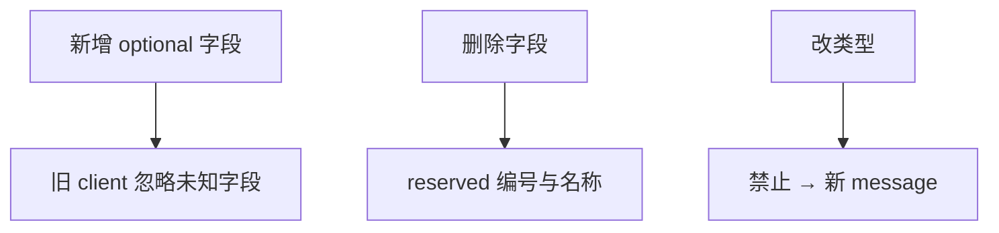

# gRPC 与 Protobuf 工程化

> **文件编码**：UTF-8。  
> **定位**：LLM Serving 层 RPC 接口——proto 定义、C++ server/client、CMake 集成。  
> **交叉阅读**：[LLMInfra 11 gRPC 高性能 RPC](../LLMInfra/11-gRPC与高性能RPC服务.md)、[C++ 09 CMake](09-CMake与项目工程化.md)、[C++ 10 网络编程](10-网络编程与简易HTTP服务.md)。

---

## 0. 读前导读（零基础也能跟上）

### 0.1 用一句话弄懂本章

**gRPC** = 用 `.proto` 定义接口 + 自动生成 C++ 桩代码 + HTTP/2 多路复用——比手写 JSON HTTP 更适合 **推理服务** 的低延迟、强类型、流式输出。

### 0.2 你需要提前知道什么

- [09 章 CMake](09-CMake与项目工程化.md) 多目标构建
- [10 章](10-网络编程与简易HTTP服务.md) TCP/HTTP 概念
- [18 章](18-高性能C++与内存对齐.md) Buffer move、零拷贝意识
- 并行 [LLMInfra 11](../LLMInfra/11-gRPC与高性能RPC服务.md)、[16 Serving](../LLMInfra/16-推理服务化Batch调度与Continuous-Batching.md)

### 0.3 本章知识地图（☐→☑）

- [ ] 写含 `service` 的 `.proto` 并编译
- [ ] CMake 集成 `protobuf` + `grpc++`
- [ ] 实现 Unary + Server Streaming RPC
- [ ] 写 C++ client 调用推理 stub
- [ ] 解释 gRPC 与 REST/JSON 选型
- [ ] §16 闭卷自测 ≥8/10

### 0.4 建议学习时长

**5～7 天**（含环境安装）；Linux 优先，Windows 可用 vcpkg。

### 0.5 学完你能做什么

为简易推理引擎暴露 `Generate` / `StreamGenerate` RPC；与 Python client 联调；理解 Triton/vLLM 自定义 backend 的接口层思路。

### 0.6 与 LLM Infra 的衔接

| 场景 | gRPC 用法 |
|------|-----------|
| 推理请求 | Unary：prompt in → token ids out |
| 流式 decode | Server streaming：逐 token push |
| 健康检查 | `grpc.health.v1` 或自定义 Ping |
| 多模型路由 | metadata 传 model name |

---

## 本章与上一章的关系

[18 章](18-高性能C++与内存对齐.md) 解决 payload **怎么存**；本章解决 payload **怎么传**。HTTP mini-server（10 章）适合入门；生产级 Serving 多用 gRPC/HTTP2 或两者并存（gRPC 对内、HTTP 对网关）。

---

## 1. 这份文档学什么

- Protobuf3 语法：`message`、`enum`、`oneof`、map
- `service` 与 RPC 四种模式
- `protoc` + gRPC C++ 插件生成代码
- CMake `find_package` / FetchContent 集成
- 错误码、deadline、metadata 入门

---

## 2. Protobuf 基础

### 2.1 推理服务 proto 示例

```protobuf
// infer.proto
syntax = "proto3";

package llm.v1;

message GenerateRequest {
  string model = 1;
  string prompt = 2;
  int32 max_tokens = 3;
  float temperature = 4;
}

message GenerateReply {
  string text = 1;
  int32 prompt_tokens = 2;
  int32 completion_tokens = 3;
}

message StreamToken {
  string token = 1;
  bool finished = 2;
}

service Inference {
  rpc Generate(GenerateRequest) returns (GenerateReply);
  rpc StreamGenerate(GenerateRequest) returns (stream StreamToken);
}
```

### 2.2 字段编号与兼容

- 字段号 **不可复用**；删除字段用 `reserved`
- 新增字段旧 client 忽略（proto3 默认不 serializing 默认值）
- **不要**改字段类型或编号——用新 message 版本

---

## 3. 生成 C++ 代码

```bash
protoc -I. --cpp_out=gen --grpc_out=gen \
  --plugin=protoc-gen-grpc=`which grpc_cpp_plugin` \
  infer.proto
```

生成文件：

- `infer.pb.h` / `infer.pb.cc` — message 序列化
- `infer.grpc.pb.h` / `infer.grpc.pb.cc` — stub/service

---

## 4. CMake 工程化

```cmake
cmake_minimum_required(VERSION 3.16)
project(grpc_infer LANGUAGES CXX)

set(CMAKE_CXX_STANDARD 17)

find_package(Protobuf REQUIRED)
find_package(gRPC CONFIG REQUIRED)

set(PROTO_FILE ${CMAKE_CURRENT_SOURCE_DIR}/proto/infer.proto)
set(GEN_DIR ${CMAKE_CURRENT_BINARY_DIR}/gen)
file(MAKE_DIRECTORY ${GEN_DIR})

add_custom_command(
  OUTPUT
    ${GEN_DIR}/infer.pb.cc ${GEN_DIR}/infer.pb.h
    ${GEN_DIR}/infer.grpc.pb.cc ${GEN_DIR}/infer.grpc.pb.h
  COMMAND protobuf::protoc
  ARGS -I ${CMAKE_CURRENT_SOURCE_DIR}/proto
       --cpp_out=${GEN_DIR}
       --grpc_out=${GEN_DIR}
       --plugin=protoc-gen-grpc=$<TARGET_FILE:gRPC::grpc_cpp_plugin>
       ${PROTO_FILE}
  DEPENDS ${PROTO_FILE}
)

add_library(infer_proto ${GEN_DIR}/infer.pb.cc ${GEN_DIR}/infer.grpc.pb.cc)
target_link_libraries(infer_proto PUBLIC protobuf::libprotobuf gRPC::grpc++)

add_executable(infer_server src/server.cpp)
target_link_libraries(infer_server PRIVATE infer_proto)

add_executable(infer_client src/client.cpp)
target_link_libraries(infer_client PRIVATE infer_proto)
```

**依赖安装**（Ubuntu 示例）：

```bash
sudo apt install -y protobuf-compiler libgrpc++-dev libprotobuf-dev
# 或 vcpkg: vcpkg install grpc protobuf
```

---

## 5. Server 实现（Unary + Streaming）

```cpp
// server.cpp — InferenceServiceImpl 核心
Status Generate(ServerContext*, const GenerateRequest* req, GenerateReply* reply) override {
    reply->set_text("echo: " + req->prompt());
    return Status::OK;
}
Status StreamGenerate(ServerContext*, const GenerateRequest*,
                      ServerWriter<StreamToken>* writer) override {
    for (const char* tok : {"Hello", ",", " world"}) {
        StreamToken t; t.set_token(tok); writer->Write(t);
    }
    StreamToken end; end.set_finished(true); writer->Write(end);
    return Status::OK;
}
// main: ServerBuilder → AddListeningPort("0.0.0.0:50051") → RegisterService → Wait()
```

---

## 6. Client 实现

```cpp
// client.cpp — Unary + Streaming 调用骨架
auto stub = llm::v1::Inference::NewStub(
    grpc::CreateChannel("localhost:50051", grpc::InsecureChannelCredentials()));
GenerateRequest req; req.set_prompt("What is KV cache?");
GenerateReply reply; ClientContext ctx;
if (stub->Generate(&ctx, req, &reply).ok()) std::cout << reply.text();
// StreamGenerate: ClientReader 循环 Read(token) 直到 finished
```

---

## 7. gRPC vs HTTP JSON

| 维度 | gRPC + Protobuf | REST + JSON |
|------|-----------------|-------------|
| 序列化 | 二进制、紧凑 | 文本、大 |
| 流式 | 一等公民 streaming | SSE/WebSocket 另搭 |
| 类型 | proto 强类型 | OpenAPI 可选 |
| 浏览器 | 需 grpc-web | 原生友好 |
| LLM Serving | **内网服务间首选** | 对外 API 常见 |

[LLMInfra 19 项目](../LLMInfra/19-项目实战简易推理引擎.md) Phase E 建议 gRPC 对内、HTTP 对外网关。

---

## 8. 生产注意点

### 8.1 deadline 与取消

```cpp
ctx.set_deadline(std::chrono::system_clock::now() + std::chrono::seconds(30));
// Server 侧检查 ctx->IsCancelled() 停止长推理
```

### 8.2 大 payload

- 权重不走 gRPC；走 mmap/对象存储
- 请求体仅 prompt + 参数；响应用 streaming 减延迟
- 复用 [18 章](18-高性能C++与内存对齐.md) Buffer，避免 `string` 反复分配

### 8.3 TLS

生产用 `grpc::SslServerCredentials`；K8s 内网 mTLS 见 [LLMInfra 18](../LLMInfra/18-容器化与Kubernetes-GPU推理部署.md)。

---

## 9. 练习

### 练习 1：扩展 proto

增加 `enum FinishReason { STOP=0; LENGTH=1; ERROR=2; }` 与 `BatchGenerate`（client streaming 多 prompt）。

### 练习 2：CMake 一键构建

在 `examples/` 下新建 `grpc-infer/`，`cmake --build` 后 server/client 本地跑通。

### 练习 3：metadata 路由

Client 设 `ctx.AddMetadata("model", "llama-7b")`；Server 读 `ctx->client_metadata()` 选 backend。

---

## 10. FAQ

**Q：protoc 版本与 libprotobuf 不一致？**  
生成代码与链接库 **主版本一致**；Docker 内固定版本。

**Q：Windows 编译 gRPC 慢？**  
用 vcpkg 预编译包或 WSL2 Linux 环境。

**Q：和 Boost.Asio HTTP 比？**  
gRPC 管 RPC 语义；Asio 管 IO 多路复用（[23 章](23-IO多路复用与高性能Server.md)）。可共存：Asio 网关转 gRPC。

**Q：Triton Inference Server 用什么？**  
HTTP + gRPC 双协议；读 NVIDIA 文档对照本章 stub 模式。

---

## 11. 学完标准

- [ ] 独立写 proto 并 CMake 生成代码
- [ ] 实现 Unary + Server streaming
- [ ] Client 调通并处理 `Status`
- [ ] 说清 gRPC 在 LLM Serving 架构中的位置
- [ ] 完成至少 2 道练习

---

## 12. 闭卷自测

1. proto3 字段编号作用？
2. gRPC 四种 RPC 模式名称？
3. `protoc` 与 `grpc_cpp_plugin` 各生成什么？
4. CMake 为何用 `add_custom_command`？
5. Server streaming 适合 LLM 什么场景？
6. gRPC 基于哪个 HTTP 版本？
7. 为什么权重文件通常不走 RPC body？
8. `grpc::Status::OK` 失败时 client 怎么查因？
9. LLMInfra 哪章与本章配对？
10. deadline 过长/过短各有什么问题？

<details>
<summary>自测参考答案</summary>

1. 二进制编码 **field tag**；决定兼容性与 wire format。
2. **Unary、Server streaming、Client streaming、Bidirectional streaming**。
3. protoc → `.pb.h/.cc`；grpc 插件 → `.grpc.pb.h/.cc` stub/service。
4. 构建期从 `.proto` **自动生成**源文件并纳入依赖图。
5. **逐 token 流式输出**，降低首 token 延迟。
6. **HTTP/2**（多路复用、HPACK 头压缩）。
7. 体积 GB 级；应用 **mmap/本地路径/对象存储**。
8. `status.error_code()` / `error_message()` / `error_details()`。
9. **LLMInfra 11**；项目 **19** Phase E。
10. 过长占资源；过短误杀长 prefill——需按 SLO 调。

</details>

---

---

## Primer Plus 深度扩写：gRPC 与 Protobuf 工程全栈

> 与 [LLMInfra 11](../LLMInfra/11-gRPC与高性能RPC服务.md) 并行；本章补齐 **编码原理、生产治理、性能**。

### 13.1 Protobuf 编码原理

#### 13.1.1 Wire Format 与 Field Tag

每个字段：`tag = (field_number << 3) | wire_type`

| wire_type | 含义 |
|-----------|------|
| 0 | Varint (int32/int64/uint32/bool/enum) |
| 1 | 64-bit fixed |
| 2 | Length-delimited (string/bytes/message/repeated packed) |
| 5 | 32-bit fixed |

**Varint**：小整数 1 字节；每字节 MSB=1 表示后续还有字节。

```
300 编码: 1010 1100 0000 0010
         (172=0xAC) (2<<7) → 0xAC 0x02
```

#### 13.1.2 示例：手工解析

```protobuf
message Tiny { int32 a = 1; string b = 2; }
// a=150, b="hi"
// 字段1: 08 96 01  (tag=0x08, varint 150)
// 字段2: 12 02 68 69 (tag=0x12, len=2, "hi")
```

#### 13.1.3 ZigZag（sint32/sint64）

有符号负数 varint 很长；ZigZag 映射使小绝对值短编码：

```
(n << 1) ^ (n >> 31)
```

---

### 13.2 .proto 最佳实践

#### 13.2.1 包名与版本

```protobuf
syntax = "proto3";
package llm.inference.v1;

option java_package = "com.example.llm.v1";
```

- API 版本放 **package 路径**（v1/v2）
- 永不改 field number；删除用 `reserved`

```protobuf
message OldMsg {
  reserved 2, 15, 9 to 11;
  reserved "foo", "bar";
  string name = 1;
}
```

#### 13.2.2 字段设计

| 建议 | 原因 |
|------|------|
| 1-15 号给高频字段 | tag 1 字节 |
| repeated 标量用 `packed=true`（proto2）/ proto3 默认 packed | 少 tag 开销 |
| 大字段用 bytes 而非 string | 语义清晰 |
| oneof 互斥字段 | 省空间、表达力 |
| map<K,V> 谨慎 | 无序；大 map 序列化大 |

#### 13.2.3 兼容演进



---

### 13.3 gRPC 四种流模式详解

| 模式 | 请求 | 响应 | LLM 场景 |
|------|------|------|----------|
| Unary | 单 | 单 | 短 completion |
| Server streaming | 单 | 流 | **逐 token 输出** |
| Client streaming | 流 | 单 | 批量 upload prompt |
| Bidi streaming | 流 | 流 | 双向对话、多模态 |

#### 13.3.1 Server Streaming 完整 Server

```cpp
Status StreamGenerate(ServerContext* ctx,
                      const GenerateRequest* req,
                      ServerWriter<StreamToken>* writer) override {
    for (const auto& tok : engine.GenerateStream(req)) {
        if (ctx->IsCancelled()) return Status(StatusCode::CANCELLED, "client gone");
        StreamToken out;
        out.set_token(tok.text);
        out.set_finished(tok.done);
        if (!writer->Write(out)) return Status(StatusCode::UNKNOWN, "write fail");
    }
    return Status::OK;
}
```

#### 13.3.2 Client Streaming

```cpp
Status BatchEmbed(ServerContext*,
                  ServerReader<EmbedChunk>* reader,
                  EmbedReply* reply) override {
    std::vector<float> acc;
    EmbedChunk chunk;
    while (reader->Read(&chunk)) {
        // 累积 embedding chunks
    }
    reply->set_dim(acc.size());
    return Status::OK;
}
```

#### 13.3.3 Bidi 注意流控

HTTP/2 **WINDOW_UPDATE**；应用层应 `Write` 失败时背压，避免 OOM。

---

### 13.4 拦截器（Interceptors）

```cpp
class LoggingInterceptor : public experimental::Interceptor {
public:
    void Intercept(experimental::InterceptorBatchMethods* methods) override {
        if (methods->QueryInterceptionHookPoint(
                experimental::InterceptionHookPoints::PRE_SEND_INITIAL_METADATA)) {
            // 记录 metadata、注入 trace id
        }
        methods->Proceed();
        if (methods->QueryInterceptionHookPoint(
                experimental::InterceptionHookPoints::POST_RECV_STATUS)) {
            // 记录 status code、latency
        }
    }
};

experimental::ClientInterceptorFactoryInterface* CreateLoggingFactory() {
    return new experimental::ClientInterceptorFactory<LoggingInterceptor>();
}
// ChannelArguments 注册 factory
```

| 钩子 | 用途 |
|------|------|
| PRE_SEND_* | 认证 token、trace |
| POST_RECV_* | 日志、metrics |
| Server 侧 | 限流、鉴权 |

---

### 13.5 超时、重试与熔断

#### 13.5.1 Deadline

```cpp
ClientContext ctx;
ctx.set_deadline(std::chrono::system_clock::now() + std::chrono::seconds(30));
```

Server 应周期性 `ctx->IsCancelled()`，长 prefill 需 **可取消**。

#### 13.5.2 重试策略（gRPC 1.40+ service config）

```json
{
  "methodConfig": [{
    "name": [{"service": "llm.v1.Inference"}],
    "retryPolicy": {
      "maxAttempts": 3,
      "initialBackoff": "0.1s",
      "maxBackoff": "1s",
      "backoffMultiplier": 2,
      "retryableStatusCodes": ["UNAVAILABLE", "DEADLINE_EXCEEDED"]
    }
  }]
}
```

#### 13.5.3 熔断（客户端侧）

```cpp
class CircuitBreaker {
    enum State { Closed, Open, HalfOpen };
    std::atomic<State> state_{Closed};
    std::atomic<int> failures_{0};
    static constexpr int kThreshold = 5;
public:
    bool Allow() {
        if (state_.load() == Open) return false;
        return true;
    }
    void OnSuccess() { failures_.store(0); state_.store(Closed); }
    void OnFailure() {
        if (++failures_ >= kThreshold) state_.store(Open);
    }
};
```

**原则**：推理 **非幂等** 的 Generate 慎重重试；Embedding 可重试。

---

### 13.6 负载均衡

#### 13.6.1 客户端 LB（gRPC pick_first / round_robin）

```cpp
grpc::ChannelArguments args;
args.SetLoadBalancingPolicyName("round_robin");
auto channel = grpc::CreateCustomChannel(
    "dns:///infer-headless:50051",
    grpc::InsecureChannelCredentials(),
    args);
```

#### 13.6.2 xDS / Service Mesh

Istio/Envoy 侧 **L7 路由**、权重、subset（model=llama → pool A）。

| 策略 | 场景 |
|------|------|
| round_robin | 同构 worker |
| weighted | A/B 模型 |
| least_request | 长连接推理（近似） |
| consistent_hash | session 粘滞（慎用） |

---

### 13.7 健康检查 grpc.health.v1

```protobuf
// health.proto (标准)
service Health {
  rpc Check(HealthCheckRequest) returns (HealthCheckResponse);
  rpc Watch(HealthCheckRequest) returns (stream HealthCheckResponse);
}
```

```cpp
class HealthServiceImpl final : public grpc::health::v1::Health::Service {
    Status Check(ServerContext*, const HealthCheckRequest* req,
                 HealthCheckResponse* resp) override {
        if (engine_ready_) resp->set_status(HealthCheckResponse::SERVING);
        else resp->set_status(HealthCheckResponse::NOT_SERVING);
        return Status::OK;
    }
};
```

K8s **liveness/readiness** 探针可调 gRPC health 或 HTTP 旁路。

---

### 13.8 CMake 集成深入

#### 13.8.1 FetchContent 固定版本

```cmake
include(FetchContent)
FetchContent_Declare(
  grpc
  GIT_REPOSITORY https://github.com/grpc/grpc.git
  GIT_TAG        v1.60.0
)
set(gRPC_BUILD_TESTS OFF CACHE BOOL "" FORCE)
FetchContent_MakeAvailable(grpc)
```

#### 13.8.2 多 proto 批量生成

```cmake
set(PROTO_FILES infer.proto common.proto health.proto)
foreach(proto ${PROTO_FILES})
  get_filename_component(name ${proto} NAME_WE)
  list(APPEND PB_SRCS ${GEN_DIR}/${name}.pb.cc)
  # add_custom_command ...
endforeach()
add_library(all_proto ${PB_SRCS})
```

#### 13.8.3 安装与导出

```cmake
install(TARGETS infer_server RUNTIME DESTINATION bin)
install(FILES ${PROTO_FILES} DESTINATION share/proto)
```

---

### 13.9 性能调优

| 手段 | 说明 |
|------|------|
| 复用 `ServerContext` 缓冲 | 避免 per-RPC 大分配 |
| Arena allocate protobuf | `Message::Arena` 批量释放 |
| 流式输出 | 降 TTFB |
| 压缩 | gzip 默认；大 payload 可 disable |
| HTTP/2 多路复用 | 单 channel 多 RPC |
| 连接池 | 少重复 TLS 握手 |
| 大 message 限 `SetMaxReceiveMessageSize` | 防 OOM |

```cpp
ServerBuilder builder;
builder.SetMaxReceiveMessageSize(64 * 1024 * 1024);
builder.AddChannelArgument(GRPC_ARG_KEEPALIVE_TIME_MS, 10000);
```

**LLM 特化**：prompt/response 走 streaming；权重 **never** inline in RPC。

---

### 13.10 与 brpc 对比

| 维度 | gRPC | brpc (百度) |
|------|------|-------------|
| 协议 | HTTP/2 + protobuf | 多协议 (baidu_std/h2/http) |
| 生态 | K8s/Istio/多语言 | 国内 C++ 友好 |
| Streaming | 一等 | 支持 |
| 负载均衡 | xDS/客户端 RR | 内置 naming |
| 学习曲线 | proto 标准 | 文档中文丰富 |
| LLM 现状 | Triton/vLLM 周边常用 | 部分国内推理框架 |

**选型**：跨语言/K8s → gRPC；纯 C++ 集群、已有 brpc 基建 → brpc。

---

### 13.11 深度 FAQ

**Q：proto3 为何省略 optional 默认值区分？**  
proto3 默认不 serialize 零值；需区分「未设」用 `optional`（proto3 3.15+）或 `oneof`。

**Q：grpc++ 线程模型？**  
CompletionQueue 驱动；Sync API 内部线程池；Async 需自管 CQ 线程。

**Q：metadata 大小限制？**  
默认 8KB；trace 过大需截断。

**Q：HTTP/3？**  
gRPC over QUIC 在演进；生产仍以 h2 为主。

---

### 13.12 扩写练习题

**练习 A**：手工 varint 编码 300、-1（zigzag）。

**练习 B**：为 Inference 增加 bidi `ChatStream`，CMake 生成代码并 stub。

**练习 C**：Client 配置 3 次重试 + 5s deadline，模拟 UNAVAILABLE。

**练习 D**：实现 Server 拦截器统计 QPS。

**练习 E**：对比 gRPC unary 与 REST JSON 同 payload 字节数（protobuf vs JSON）。


---

## Primer Plus 进阶续篇

### 14.1 进阶专题：Varint 解码器

**概念**：手工 parse。**实践**：while MSB。

```cpp
// Varint 解码器 — 示例 #1
namespace infra_19_1 {
struct Demo {
    int id = 1;
    void run() {
        // while MSB
    }
};
} // namespace
```

| 要点 | 说明 |
|------|------|
| 原理 | 手工 parse |
| 工程 | while MSB |
| 面试 | 能口述 Varint 解码器 在 LLM Infra 中的作用 |

**FAQ #1**：Varint 解码器 与相邻章节如何衔接？→ 见交叉阅读链接与 §0.3 知识地图。

**练习 #1**：实现 `Varint 解码器` 最小 demo 并写 3 行 benchmark 结论。


### 14.2 进阶专题：proto 字段演进

**概念**：reserved。**实践**：optional。

```cpp
// proto 字段演进 — 示例 #2
namespace infra_19_2 {
struct Demo {
    int id = 2;
    void run() {
        // optional
    }
};
} // namespace
```

| 要点 | 说明 |
|------|------|
| 原理 | reserved |
| 工程 | optional |
| 面试 | 能口述 proto 字段演进 在 LLM Infra 中的作用 |

**FAQ #2**：proto 字段演进 与相邻章节如何衔接？→ 见交叉阅读链接与 §0.3 知识地图。

**练习 #2**：实现 `proto 字段演进` 最小 demo 并写 3 行 benchmark 结论。


### 14.3 进阶专题：gRPC metadata

**概念**：trace-id。**实践**：model 路由。

```cpp
// gRPC metadata — 示例 #3
namespace infra_19_3 {
struct Demo {
    int id = 3;
    void run() {
        // model 路由
    }
};
} // namespace
```

| 要点 | 说明 |
|------|------|
| 原理 | trace-id |
| 工程 | model 路由 |
| 面试 | 能口述 gRPC metadata 在 LLM Infra 中的作用 |

**FAQ #3**：gRPC metadata 与相邻章节如何衔接？→ 见交叉阅读链接与 §0.3 知识地图。

**练习 #3**：实现 `gRPC metadata` 最小 demo 并写 3 行 benchmark 结论。


### 14.4 进阶专题：Server 线程池

**概念**：Sync API。**实践**：CompletionQueue。

```cpp
// Server 线程池 — 示例 #4
namespace infra_19_4 {
struct Demo {
    int id = 4;
    void run() {
        // CompletionQueue
    }
};
} // namespace
```

| 要点 | 说明 |
|------|------|
| 原理 | Sync API |
| 工程 | CompletionQueue |
| 面试 | 能口述 Server 线程池 在 LLM Infra 中的作用 |

**FAQ #4**：Server 线程池 与相邻章节如何衔接？→ 见交叉阅读链接与 §0.3 知识地图。

**练习 #4**：实现 `Server 线程池` 最小 demo 并写 3 行 benchmark 结论。


### 14.5 进阶专题：Client channel 复用

**概念**：stub 缓存。**实践**：连接数。

```cpp
// Client channel 复用 — 示例 #5
namespace infra_19_5 {
struct Demo {
    int id = 5;
    void run() {
        // 连接数
    }
};
} // namespace
```

| 要点 | 说明 |
|------|------|
| 原理 | stub 缓存 |
| 工程 | 连接数 |
| 面试 | 能口述 Client channel 复用 在 LLM Infra 中的作用 |

**FAQ #5**：Client channel 复用 与相邻章节如何衔接？→ 见交叉阅读链接与 §0.3 知识地图。

**练习 #5**：实现 `Client channel 复用` 最小 demo 并写 3 行 benchmark 结论。


### 14.6 进阶专题：TLS mTLS

**概念**：SslCredentials。**实践**：K8s cert。

```cpp
// TLS mTLS — 示例 #6
namespace infra_19_6 {
struct Demo {
    int id = 6;
    void run() {
        // K8s cert
    }
};
} // namespace
```

| 要点 | 说明 |
|------|------|
| 原理 | SslCredentials |
| 工程 | K8s cert |
| 面试 | 能口述 TLS mTLS 在 LLM Infra 中的作用 |

**FAQ #6**：TLS mTLS 与相邻章节如何衔接？→ 见交叉阅读链接与 §0.3 知识地图。

**练习 #6**：实现 `TLS mTLS` 最小 demo 并写 3 行 benchmark 结论。


### 14.7 进阶专题：错误码映射

**概念**：StatusCode。**实践**：重试策略。

```cpp
// 错误码映射 — 示例 #7
namespace infra_19_7 {
struct Demo {
    int id = 7;
    void run() {
        // 重试策略
    }
};
} // namespace
```

| 要点 | 说明 |
|------|------|
| 原理 | StatusCode |
| 工程 | 重试策略 |
| 面试 | 能口述 错误码映射 在 LLM Infra 中的作用 |

**FAQ #7**：错误码映射 与相邻章节如何衔接？→ 见交叉阅读链接与 §0.3 知识地图。

**练习 #7**：实现 `错误码映射` 最小 demo 并写 3 行 benchmark 结论。


### 14.8 进阶专题：流式背压

**概念**：Write false。**实践**：IsCancelled。

```cpp
// 流式背压 — 示例 #8
namespace infra_19_8 {
struct Demo {
    int id = 8;
    void run() {
        // IsCancelled
    }
};
} // namespace
```

| 要点 | 说明 |
|------|------|
| 原理 | Write false |
| 工程 | IsCancelled |
| 面试 | 能口述 流式背压 在 LLM Infra 中的作用 |

**FAQ #8**：流式背压 与相邻章节如何衔接？→ 见交叉阅读链接与 §0.3 知识地图。

**练习 #8**：实现 `流式背压` 最小 demo 并写 3 行 benchmark 结论。


### 14.9 进阶专题：protobuf Arena

**概念**：CreateMessage。**实践**：批量释放。

```cpp
// protobuf Arena — 示例 #9
namespace infra_19_9 {
struct Demo {
    int id = 9;
    void run() {
        // 批量释放
    }
};
} // namespace
```

| 要点 | 说明 |
|------|------|
| 原理 | CreateMessage |
| 工程 | 批量释放 |
| 面试 | 能口述 protobuf Arena 在 LLM Infra 中的作用 |

**FAQ #9**：protobuf Arena 与相邻章节如何衔接？→ 见交叉阅读链接与 §0.3 知识地图。

**练习 #9**：实现 `protobuf Arena` 最小 demo 并写 3 行 benchmark 结论。


### 14.10 进阶专题：brpc 迁移

**概念**：协议差异。**实践**：选型表。

```cpp
// brpc 迁移 — 示例 #10
namespace infra_19_10 {
struct Demo {
    int id = 10;
    void run() {
        // 选型表
    }
};
} // namespace
```

| 要点 | 说明 |
|------|------|
| 原理 | 协议差异 |
| 工程 | 选型表 |
| 面试 | 能口述 brpc 迁移 在 LLM Infra 中的作用 |

**FAQ #10**：brpc 迁移 与相邻章节如何衔接？→ 见交叉阅读链接与 §0.3 知识地图。

**练习 #10**：实现 `brpc 迁移` 最小 demo 并写 3 行 benchmark 结论。


### 14.11 进阶专题：Varint 解码器

**概念**：手工 parse。**实践**：while MSB。

```cpp
// Varint 解码器 — 示例 #11
namespace infra_19_11 {
struct Demo {
    int id = 11;
    void run() {
        // while MSB
    }
};
} // namespace
```

| 要点 | 说明 |
|------|------|
| 原理 | 手工 parse |
| 工程 | while MSB |
| 面试 | 能口述 Varint 解码器 在 LLM Infra 中的作用 |

**FAQ #11**：Varint 解码器 与相邻章节如何衔接？→ 见交叉阅读链接与 §0.3 知识地图。

**练习 #11**：实现 `Varint 解码器` 最小 demo 并写 3 行 benchmark 结论。


### 14.12 进阶专题：proto 字段演进

**概念**：reserved。**实践**：optional。

```cpp
// proto 字段演进 — 示例 #12
namespace infra_19_12 {
struct Demo {
    int id = 12;
    void run() {
        // optional
    }
};
} // namespace
```

| 要点 | 说明 |
|------|------|
| 原理 | reserved |
| 工程 | optional |
| 面试 | 能口述 proto 字段演进 在 LLM Infra 中的作用 |

**FAQ #12**：proto 字段演进 与相邻章节如何衔接？→ 见交叉阅读链接与 §0.3 知识地图。

**练习 #12**：实现 `proto 字段演进` 最小 demo 并写 3 行 benchmark 结论。


### 14.13 进阶专题：gRPC metadata

**概念**：trace-id。**实践**：model 路由。

```cpp
// gRPC metadata — 示例 #13
namespace infra_19_13 {
struct Demo {
    int id = 13;
    void run() {
        // model 路由
    }
};
} // namespace
```

| 要点 | 说明 |
|------|------|
| 原理 | trace-id |
| 工程 | model 路由 |
| 面试 | 能口述 gRPC metadata 在 LLM Infra 中的作用 |

**FAQ #13**：gRPC metadata 与相邻章节如何衔接？→ 见交叉阅读链接与 §0.3 知识地图。

**练习 #13**：实现 `gRPC metadata` 最小 demo 并写 3 行 benchmark 结论。


### 14.14 进阶专题：Server 线程池

**概念**：Sync API。**实践**：CompletionQueue。

```cpp
// Server 线程池 — 示例 #14
namespace infra_19_14 {
struct Demo {
    int id = 14;
    void run() {
        // CompletionQueue
    }
};
} // namespace
```

| 要点 | 说明 |
|------|------|
| 原理 | Sync API |
| 工程 | CompletionQueue |
| 面试 | 能口述 Server 线程池 在 LLM Infra 中的作用 |

**FAQ #14**：Server 线程池 与相邻章节如何衔接？→ 见交叉阅读链接与 §0.3 知识地图。

**练习 #14**：实现 `Server 线程池` 最小 demo 并写 3 行 benchmark 结论。


### 14.15 进阶专题：Client channel 复用

**概念**：stub 缓存。**实践**：连接数。

```cpp
// Client channel 复用 — 示例 #15
namespace infra_19_15 {
struct Demo {
    int id = 15;
    void run() {
        // 连接数
    }
};
} // namespace
```

| 要点 | 说明 |
|------|------|
| 原理 | stub 缓存 |
| 工程 | 连接数 |
| 面试 | 能口述 Client channel 复用 在 LLM Infra 中的作用 |

**FAQ #15**：Client channel 复用 与相邻章节如何衔接？→ 见交叉阅读链接与 §0.3 知识地图。

**练习 #15**：实现 `Client channel 复用` 最小 demo 并写 3 行 benchmark 结论。


### 14.16 进阶专题：TLS mTLS

**概念**：SslCredentials。**实践**：K8s cert。

```cpp
// TLS mTLS — 示例 #16
namespace infra_19_16 {
struct Demo {
    int id = 16;
    void run() {
        // K8s cert
    }
};
} // namespace
```

| 要点 | 说明 |
|------|------|
| 原理 | SslCredentials |
| 工程 | K8s cert |
| 面试 | 能口述 TLS mTLS 在 LLM Infra 中的作用 |

**FAQ #16**：TLS mTLS 与相邻章节如何衔接？→ 见交叉阅读链接与 §0.3 知识地图。

**练习 #16**：实现 `TLS mTLS` 最小 demo 并写 3 行 benchmark 结论。


### 14.17 进阶专题：错误码映射

**概念**：StatusCode。**实践**：重试策略。

```cpp
// 错误码映射 — 示例 #17
namespace infra_19_17 {
struct Demo {
    int id = 17;
    void run() {
        // 重试策略
    }
};
} // namespace
```

| 要点 | 说明 |
|------|------|
| 原理 | StatusCode |
| 工程 | 重试策略 |
| 面试 | 能口述 错误码映射 在 LLM Infra 中的作用 |

**FAQ #17**：错误码映射 与相邻章节如何衔接？→ 见交叉阅读链接与 §0.3 知识地图。

**练习 #17**：实现 `错误码映射` 最小 demo 并写 3 行 benchmark 结论。


### 14.18 进阶专题：流式背压

**概念**：Write false。**实践**：IsCancelled。

```cpp
// 流式背压 — 示例 #18
namespace infra_19_18 {
struct Demo {
    int id = 18;
    void run() {
        // IsCancelled
    }
};
} // namespace
```

| 要点 | 说明 |
|------|------|
| 原理 | Write false |
| 工程 | IsCancelled |
| 面试 | 能口述 流式背压 在 LLM Infra 中的作用 |

**FAQ #18**：流式背压 与相邻章节如何衔接？→ 见交叉阅读链接与 §0.3 知识地图。

**练习 #18**：实现 `流式背压` 最小 demo 并写 3 行 benchmark 结论。


### 14.19 进阶专题：protobuf Arena

**概念**：CreateMessage。**实践**：批量释放。

```cpp
// protobuf Arena — 示例 #19
namespace infra_19_19 {
struct Demo {
    int id = 19;
    void run() {
        // 批量释放
    }
};
} // namespace
```

| 要点 | 说明 |
|------|------|
| 原理 | CreateMessage |
| 工程 | 批量释放 |
| 面试 | 能口述 protobuf Arena 在 LLM Infra 中的作用 |

**FAQ #19**：protobuf Arena 与相邻章节如何衔接？→ 见交叉阅读链接与 §0.3 知识地图。

**练习 #19**：实现 `protobuf Arena` 最小 demo 并写 3 行 benchmark 结论。


### 14.20 进阶专题：brpc 迁移

**概念**：协议差异。**实践**：选型表。

```cpp
// brpc 迁移 — 示例 #20
namespace infra_19_20 {
struct Demo {
    int id = 20;
    void run() {
        // 选型表
    }
};
} // namespace
```

| 要点 | 说明 |
|------|------|
| 原理 | 协议差异 |
| 工程 | 选型表 |
| 面试 | 能口述 brpc 迁移 在 LLM Infra 中的作用 |

**FAQ #20**：brpc 迁移 与相邻章节如何衔接？→ 见交叉阅读链接与 §0.3 知识地图。

**练习 #20**：实现 `brpc 迁移` 最小 demo 并写 3 行 benchmark 结论。


### 14.21 进阶专题：Varint 解码器

**概念**：手工 parse。**实践**：while MSB。

```cpp
// Varint 解码器 — 示例 #21
namespace infra_19_21 {
struct Demo {
    int id = 21;
    void run() {
        // while MSB
    }
};
} // namespace
```

| 要点 | 说明 |
|------|------|
| 原理 | 手工 parse |
| 工程 | while MSB |
| 面试 | 能口述 Varint 解码器 在 LLM Infra 中的作用 |

**FAQ #21**：Varint 解码器 与相邻章节如何衔接？→ 见交叉阅读链接与 §0.3 知识地图。

**练习 #21**：实现 `Varint 解码器` 最小 demo 并写 3 行 benchmark 结论。


### 14.22 进阶专题：proto 字段演进

**概念**：reserved。**实践**：optional。

```cpp
// proto 字段演进 — 示例 #22
namespace infra_19_22 {
struct Demo {
    int id = 22;
    void run() {
        // optional
    }
};
} // namespace
```

| 要点 | 说明 |
|------|------|
| 原理 | reserved |
| 工程 | optional |
| 面试 | 能口述 proto 字段演进 在 LLM Infra 中的作用 |

**FAQ #22**：proto 字段演进 与相邻章节如何衔接？→ 见交叉阅读链接与 §0.3 知识地图。

**练习 #22**：实现 `proto 字段演进` 最小 demo 并写 3 行 benchmark 结论。


### 14.99 本章扩写总结

| 模块 | 要点 |
|------|------|
| 原理 | 从 wire format / 绑定机制 / 模式映射 / 硬件层次 / IO 模型建立直觉 |
| 代码 | 每节含可编译骨架，需在 Linux/WSL 补全依赖后运行 |
| 面试 | FAQ 与练习题覆盖大厂 Infra 常见追问 |
| 互补 | 与 64/65/70/77 及 LLMInfra 专题交叉阅读 |

**最终检查清单**：
- [ ] 闭卷自测 ≥8/10
- [ ] 至少完成 3 道扩写练习题
- [ ] 对照交叉阅读章节各举 1 例

## 下一章预告

C++ 算子常需暴露给 Python 训练/推理脚本。20 章 [pybind11 与 Python 绑定入门](20-pybind11与Python绑定入门.md) 与 [LLMInfra 13](../LLMInfra/13-pybind11与Python-C++混合编程.md) 并行。

---

*下一章：20 pybind11 与 Python 绑定入门*
