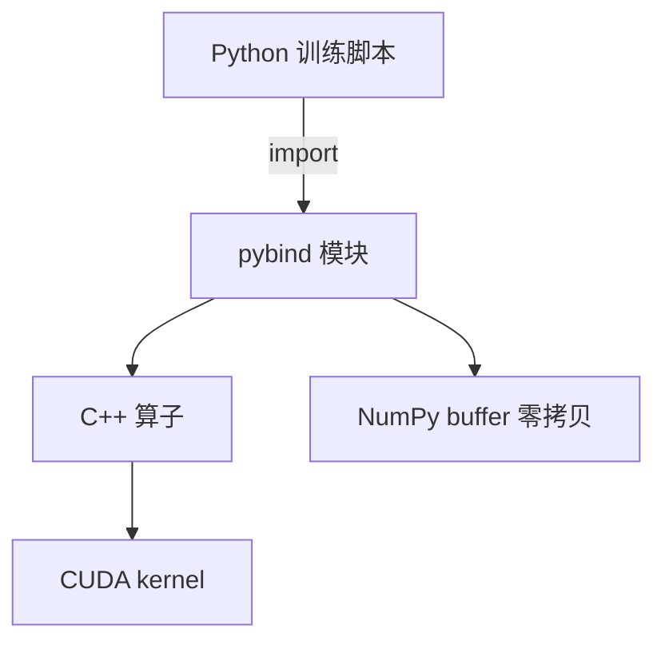
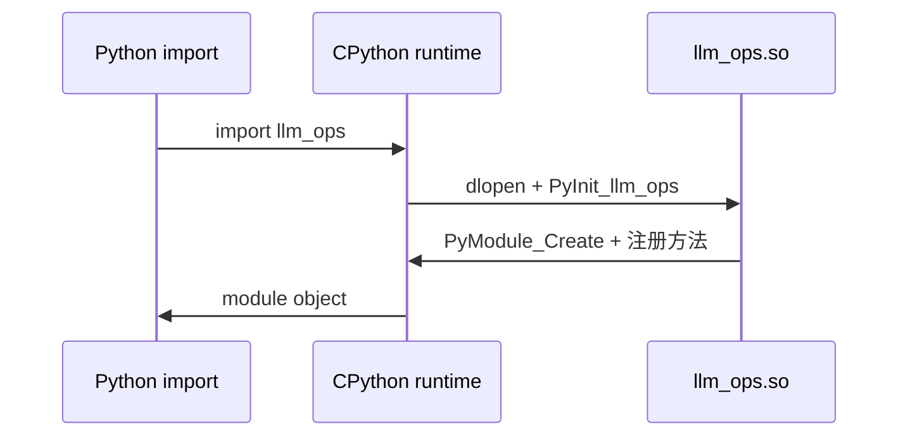

# pybind11 与 Python 绑定入门

> **文件编码**：UTF-8。  
> **定位**：把 C++ 算子、Buffer、调度 API 暴露给 Python/PyTorch——LLM Infra 混合编程入口。  
> **交叉阅读**：[LLMInfra 13 pybind11 混合编程](../LLMInfra/13-pybind11与Python-C++混合编程.md)、[C++ 09 CMake](09-CMake与项目工程化.md)、[18 章 零拷贝](18-高性能C++与内存对齐.md)。

---

## 0. 读前导读（零基础也能跟上）

### 0.1 用一句话弄懂本章

**pybind11** = 用少量 C++ 宏把函数/类 **绑定** 成 Python 模块——训练脚本仍用 Python，热点路径跑你的 C++/CUDA 扩展。

### 0.2 你需要提前知道什么

- [05 章](05-现代C++新特性.md) 移动语义、RAII
- [09 章 CMake](09-CMake与项目工程化.md) 构建共享库
- Python 基础：`import`、NumPy `ndarray`
- [LLMInfra 05 GEMM](../LLMInfra/05-矩阵运算与cuBLAS入门.md) 算子概念

### 0.3 本章知识地图（☐→☑）

- [ ] `PYBIND11_MODULE` 导出函数与类
- [ ] CMake `pybind11_add_module`
- [ ] 绑定 `std::vector` / `std::string` / 枚举
- [ ] NumPy buffer 零拷贝读写（`py::array_t`）
- [ ] GIL 与多线程注意点
- [ ] §14 闭卷自测 ≥8/10

### 0.4 建议学习时长

**4～6 天**；需本机 Python dev 头文件与 venv。

### 0.5 学完你能做什么

导出 `fused_softmax` 给 PyTorch 脚本测速；包装 C++ KV block manager；阅读 vLLM `csrc/` 绑定层。

### 0.6 与 LLM Infra 的衔接

| 场景 | pybind 角色 |
|------|-------------|
| 自定义 CUDA 算子 | Python 调 C++ launcher |
| 量化校准 | C++ 统计 + Python 可视化 |
| llama.cpp | 部分工具链 Python 绑 ggml |
| vLLM | `csrc/` + torch extension |

---

## 本章与上一章的关系

[19 章 gRPC](19-gRPC与Protobuf工程化.md) 解决 **进程间** RPC；pybind11 解决 **进程内** Python↔C++ 调用。二者常并存：gRPC Server 内嵌 pybind 调引擎，或纯 C++ 引擎 + Python 仅做 benchmark。

---

## 1. 这份文档学什么

- pybind11 模块结构与 CMake 集成
- 函数、类、属性、运算符绑定
- STL 容器自动转换
- NumPy buffer protocol 与 dtype
- 异常、GIL、`module_::def` 文档字符串

---

## 2. 最小可运行示例

### 2.1 C++ 源码

```cpp
// ops.cpp
#include <cmath>
#include <vector>
#include <pybind11/pybind11.h>
#include <pybind11/stl.h>
#include <pybind11/numpy.h>

namespace py = pybind11;

double dot_product(const std::vector<double>& a, const std::vector<double>& b) {
    if (a.size() != b.size()) throw std::invalid_argument("size mismatch");
    double s = 0;
    for (size_t i = 0; i < a.size(); ++i) s += a[i] * b[i];
    return s;
}

// NumPy 零拷贝视图（只读）
double sum_array(py::array_t<double, py::array::c_style | py::array::forcecast> arr) {
    py::buffer_info buf = arr.request();
    if (buf.ndim != 1) throw std::runtime_error("expect 1-D");
    auto* ptr = static_cast<double*>(buf.ptr);
    double s = 0;
    for (py::ssize_t i = 0; i < buf.shape[0]; ++i) s += ptr[i];
    return s;
}

PYBIND11_MODULE(llm_ops, m) {
    m.doc() = "LLM infra ops binding demo";
    m.def("dot_product", &dot_product, "Inner product of two vectors",
          py::arg("a"), py::arg("b"));
    m.def("sum_array", &sum_array, "Sum 1-D float64 array without copy");
}
```

### 2.2 CMakeLists.txt

```cmake
cmake_minimum_required(VERSION 3.16)
project(llm_ops LANGUAGES CXX)

set(CMAKE_CXX_STANDARD 17)
find_package(Python COMPONENTS Interpreter Development REQUIRED)
find_package(pybind11 CONFIG REQUIRED)

pybind11_add_module(llm_ops ops.cpp)
# 输出到当前目录便于 import
set_target_properties(llm_ops PROPERTIES LIBRARY_OUTPUT_DIRECTORY ${CMAKE_BINARY_DIR})
```

```bash
pip install pybind11
cmake -B build && cmake --build build
python -c "import sys; sys.path.insert(0,'build'); import llm_ops; print(llm_ops.dot_product([1,2],[3,4]))"
```

---

## 3. 绑定类与 RAII

```cpp
class KvBlock {
public:
    explicit KvBlock(py::ssize_t bytes) : data_(bytes) {}
    py::ssize_t size() const { return static_cast<py::ssize_t>(data_.size()); }
    py::array_t<float> view() {
        return py::array_t<float>(
            {static_cast<py::ssize_t>(data_.size() / sizeof(float))},
            {sizeof(float)},
            reinterpret_cast<float*>(data_.data()));
    }
private:
    std::vector<std::uint8_t> data_;
};

// 在 PYBIND11_MODULE 内：
py::class_<KvBlock>(m, "KvBlock")
    .def(py::init<py::ssize_t>())
    .def("size", &KvBlock::size)
    .def("view", &KvBlock::view);
```

**注意**：`view()` 返回的 NumPy 与 `data_` 共享内存；Python 持有 array 时 C++ 对象不可销毁——用 `shared_ptr` 或文档说明生命周期。

---

## 4. NumPy Buffer 深入

### 4.1 可写 buffer

```cpp
void scale_inplace(py::array_t<float> arr, float factor) {
    py::buffer_info buf = arr.request();
    if (buf.ndim != 1) throw std::runtime_error("1-D only");
    auto* ptr = static_cast<float*>(buf.ptr);
    for (py::ssize_t i = 0; i < buf.shape[0]; ++i) ptr[i] *= factor;
}
```

### 4.2 dtype 与 strides

- `buf.itemsize`、`buf.strides` 描述非连续数组
- C 连续：`py::array::c_style`；F 连续：`f_style`
- 与 [18 章](18-高性能C++与内存对齐.md) 对齐：可检查 `reinterpret_cast<uintptr_t>(ptr) % 64 == 0`

### 4.3 与 PyTorch Tensor

生产常用 **torch extension**（仍基于 pybind）或 DLPack 交换；原理与本章 buffer 相同。读 [LLMInfra 13](../LLMInfra/13-pybind11与Python-C++混合编程.md) § PyTorch 衔接。

---

## 5. 异常与 GIL

```cpp
m.def("safe_div", [](double a, double b) {
    if (b == 0) throw std::runtime_error("div by zero");
    return a / b;
});
```

C++ 异常自动转 Python `RuntimeError`。

**GIL**：纯 C++ 计算可在释放 GIL 后跑（长循环）：

```cpp
m.def("heavy_compute", []() {
    py::gil_scoped_release release;
    // ... 长时间 C++ 工作 ...
    return 42;
});
```

多线程 Python 调同一模块时，C++ 侧仍需 mutex（[08 章](08-多线程与并发编程.md)）。

---

## 6. 工程目录建议

```text
llm_ops/
  CMakeLists.txt
  src/
    ops.cpp
    binding.cpp      # 仅 PYBIND11_MODULE
  python/
    test_ops.py
  README.md
```

- 算法与绑定分离，便于单元测试 C++
- CI：`pytest` + `import llm_ops`

---

## 7. LLM Infra 典型模式



1. **校准脚本**：Python 读数据 → NumPy → C++ 统计 min/max → 写 scale。
2. **Benchmark**：Python loop 调 C++ GEMM vs cuBLAS。
3. **Serving 胶水**：部分团队 Python scheduler + C++ engine pybind 入口（也有全 C++ + gRPC）。

---

## 8. 常见错误

| 错误 | 后果 | 修复 |
|------|------|------|
| 返回 dangling `array` 视图 | 段错误 | 延长底层 storage 生命周期 |
| 未 `#include pybind11/stl.h>` | vector 无法自动转换 | 加头文件或手动转换 |
| ABI 不一致 | import 失败 | 用同一 Python 版本编译 |
| 在 bind 里长时间持 GIL | 多线程饿死 | `gil_scoped_release` |

---

## 9. 练习

### 练习 1：softmax 绑定

C++ 实现 1-D softmax（数值稳定：减 max），绑定为 `softmax(np.ndarray) -> np.ndarray`。

### 练习 2：计时对比

同一计算纯 Python vs pybind vs NumPy，用 `timeit` 写表格。

### 练习 3：读 vLLM 绑定

克隆 vLLM，打开 `csrc/` 任一 `pybind` 注册点，列出导出的 3 个符号。

### 练习 4：与 19 章联调

Python gRPC client 调 C++ server；server 内用 pybind 模块（若混合）或直接 C++。

---

## 10. FAQ

**Q：pybind11 vs SWIG vs ctypes？**  
pybind11 头文件库、现代 C++、NumPy 友好；LLM 生态首选 pybind/torch extension。

**Q：能否绑 CUDA 函数？**  
可以；`.cu` 与 `.cpp` 分编译，模块内调用 kernel launch。

**Q：和 [19 章 gRPC](19-gRPC与Protobuf工程化.md) 怎么选？**  
跨进程用 gRPC；同进程 Python 调 C++ 用 pybind。

**Q：FlashAttention 怎么给 Python 用？**  
预编译 `.so` + `import flash_attn`；内部 pybind/C extension。

---

## 11. 学完标准

- [ ] CMake 构建可 `import` 的模块
- [ ] 绑定函数、类、NumPy 1-D array
- [ ] 理解 buffer 生命周期与零拷贝
- [ ] 知道 GIL release 使用场景
- [ ] 对照 LLMInfra 13 完成一道练习

---

## 12. 闭卷自测

1. `PYBIND11_MODULE` 宏做什么？
2. `pybind11_add_module` 与普通 `add_library` 区别？
3. NumPy buffer `request()` 返回什么信息？
4. 为何 `sum_array` 可能比 Python list 求和快？
5. `py::gil_scoped_release` 何时需要？
6. C++ 异常如何表现到 Python？
7. 绑定 `vector` 需要哪个头文件？
8. 返回 NumPy 视图的核心风险？
9. vLLM 算子多在哪个目录？
10. LLMInfra 13 与 19 章 gRPC 分工？

<details>
<summary>自测参考答案</summary>

1. 定义 Python **扩展模块入口**，注册导出符号。
2. 自动处理 **Python 链接、后缀、include** 等扩展约定。
3. **指针、shape、strides、dtype、ndim** 等 buffer 元数据。
4. **无 Python 对象 per-element 开销**；连续内存 + C++ 循环。
5. **长时间纯 C++** 计算，避免阻塞其他 Python 线程。
6. 映射为对应 Python 异常（如 `RuntimeError`）。
7. **`pybind11/stl.h`**。
8. **悬空指针**——底层 storage 已释放。
9. **`csrc/`**（CUDA/C++ + torch binding）。
10. 13=**同进程** Python↔C++；19=**跨进程** RPC。

</details>

---

---

## Primer Plus 深度扩写：pybind11 混合编程全栈

> 与 [LLMInfra 13](../LLMInfra/13-pybind11与Python-C++混合编程.md) 互补；本章偏 **绑定机制与工程化**。

### 13.1 pybind11 原理

#### 13.1.1 模块加载流程



`PYBIND11_MODULE(name, m)` 展开为 `PyInit_name()` 入口，注册 `PyMethodDef` / `PyTypeObject`。

#### 13.1.2 type_caster 与转换

```cpp
// 简化概念：pybind11::detail::type_caster<T>
// load: Python object → C++ T
// cast: C++ T → Python object
```

自定义类型需 `PYBIND11_TYPE_CASTER(MyType, _("MyType"))` 或 `class_` 绑定。

#### 13.1.3 trampoline（虚函数回调 Python）

```cpp
class Base {
public:
    virtual ~Base() = default;
    virtual int compute(int x) = 0;
};

class PyBase : public Base {
public:
    using Base::Base;
    int compute(int x) override { PYBIND11_OVERRIDE_PURE(int, Base, compute, x); }
};

py::class_<Base, PyBase>(m, "Base")
    .def("compute", &Base::compute);
```

Python 子类可 override C++ 虚函数——Infra 插件式 backend 常用。

---

### 13.2 引用计数与 GIL

#### 13.2.1 PyObject  refcount

- `Py_INCREF` / `Py_DECREF`
- pybind `handle`/`object` RAII 管理 refcount
- **借引用** vs **新引用**：`py::object` 持有；`py::handle` 不 incref

#### 13.2.2 GIL 规则

| 操作 | 是否需要 GIL |
|------|--------------|
| 调用 Python API | 是 |
| 纯 C++ 计算 | 可 release |
| 从其他线程调 Python | `PyGILState_Ensure` |

```cpp
void long_job() {
    py::gil_scoped_release release;
    // 纯 C++：GEMM、tokenize C++ 版
}

void callback_to_python(const py::object& fn, int v) {
    py::gil_scoped_acquire acquire;
    fn(v);
}
```

#### 13.2.3 多线程陷阱

C++ 线程池 **回调 Python** 必须 acquire GIL；否则 crash。

---

### 13.3 NumPy 交互深入

```cpp
py::array_t<float> make_view(float* data, ssize_t n) {
    return py::array_t<float>({n}, {sizeof(float)}, data);
}

py::array_t<float, py::array::c_style | py::array::forcecast>
require_c_contiguous(py::array input) {
    return input.cast<py::array_t<float, py::array::c_style | py::array::forcecast>>();
}
```

| 标志 | 含义 |
|------|------|
| `c_style` | C 连续 |
| `f_style` | Fortran 连续 |
| `forcecast` | 允许 dtype 转换 |

**零拷贝条件**：内存连续、dtype 匹配、生命周期绑定 C++ owner。

---

### 13.4 STL 转换

```cpp
#include <pybind11/stl.h>
#include <pybind11/stl_bind.h>

PYBIND11_MAKE_OPAQUE(std::vector<int>);
py::bind_vector<std::vector<int>>(m, "IntVector");

m.def("sum_vec", [](const std::vector<double>& v) {
    return std::accumulate(v.begin(), v.end(), 0.0);
});
```

| 容器 | 头文件 | 注意 |
|------|--------|------|
| vector/list/map/set | stl.h | 拷贝转换 |
|  opaque + bind_vector | stl_bind.h | 可修改绑定类型 |

---

### 13.5 异常转换

```cpp
py::register_exception<CppError>(m, "CppError");

m.def("fail", []() {
    throw CppError("kernel launch failed");
});
// Python: except llm_ops.CppError
```

映射表：`std::invalid_argument` → `ValueError`；`std::runtime_error` → `RuntimeError`；`std::bad_alloc` → `MemoryError`。

---

### 13.6 回调

```cpp
m.def("for_each", [](const std::vector<int>& v, py::function cb) {
    for (int x : v) {
        py::gil_scoped_acquire acquire;
        cb(x);
    }
});
```

**性能**：Python 回调每元素 GIL → 慢；批量传 NumPy 或 C++ 侧循环。

---

### 13.7 overloaded 方法

```cpp
m.def("process", py::overload_cast<int>(&process));
m.def("process", py::overload_cast<double>(&process));
// 或
m.def("process", py::overload_cast<int, double>(&process));  // 多参数重载集
```

类成员：

```cpp
py::class_<Foo>(m, "Foo")
    .def("bar", py::overload_cast<int>(&Foo::bar))
    .def("bar", py::overload_cast<std::string>(&Foo::bar));
```

---

### 13.8 模块化 CMake

```cmake
find_package(Python COMPONENTS Interpreter Development REQUIRED)
find_package(pybind11 CONFIG REQUIRED)

pybind11_add_module(llm_ops
    src/binding.cpp
    src/kernels.cpp
)
target_include_directories(llm_ops PRIVATE include)
target_compile_definitions(llm_ops PRIVATE VERSION_INFO=${PROJECT_VERSION})

install(TARGETS llm_ops LIBRARY DESTINATION llm_ops)
```

多模块：

```cmake
pybind11_add_module(_core src/core_bind.cpp)
pybind11_add_module(_cuda src/cuda_bind.cpp)
# python/llm_ops/__init__.py: from ._core import *
```

---

### 13.9 性能优化

| 技巧 | 效果 |
|------|------|
| `gil_scoped_release` | 长 C++ 计算 |
| NumPy 零拷贝 | 避免 memcpy |
| `py::array_t` + 裸指针 | 热循环 |
| 少 cross-language 调用 | 批量化 |
| `PYBIND11_MODULE` 分离 binding/算法 | 算法可纯 C++ 测 |
| LTO `-flto` | 小函数 inline |

```cpp
// 反模式：每 token 调一次 Python
// 正模式：C++ decode 完整个序列，一次返回 py::bytes
```

---

### 13.10 Cython / nanobind 对比

| | pybind11 | Cython | nanobind |
|---|----------|--------|----------|
| 风格 | C++ 绑 Python | Python 写 cdef | 类似 pybind11 |
| 学习 | C++ 开发者友好 | 新语法 | 现代、轻量 |
| 性能 | 优秀 | 优秀 | 优秀，编译快 |
| NumPy | 原生 | 原生 | 原生 |
| LLM 生态 | torch/vLLM 常用 | 少 | 新兴 |

vLLM/FlashAttention 多用 **pybind + torch extension**；新项目可关注 **nanobind**（Dr.Jürgen）。

---

### 13.11 FAQ 与练习

**练习 A**：绑定 `std::map<string,int>` 并 Python 修改。

**练习 B**：`gil_scoped_release` 多线程 C++ 累加，主线程 join。

**练习 C**：实现 Python callback 进度条，每 1000 次 C++ 迭代回调一次。

**练习 D**：对比 list 传参 vs NumPy 传参 1e7 元素 sum 耗时。


---

## Primer Plus 进阶续篇

### 14.1 进阶专题：type_caster 自定义

**概念**：MyTensor。**实践**：load/cast。

```cpp
// type_caster 自定义 — 示例 #1
namespace infra_20_1 {
struct Demo {
    int id = 1;
    void run() {
        // load/cast
    }
};
} // namespace
```

| 要点 | 说明 |
|------|------|
| 原理 | MyTensor |
| 工程 | load/cast |
| 面试 | 能口述 type_caster 自定义 在 LLM Infra 中的作用 |

**FAQ #1**：type_caster 自定义 与相邻章节如何衔接？→ 见交叉阅读链接与 §0.3 知识地图。

**练习 #1**：实现 `type_caster 自定义` 最小 demo 并写 3 行 benchmark 结论。


### 14.2 进阶专题：keep_alive

**概念**：return view。**实践**：policy。

```cpp
// keep_alive — 示例 #2
namespace infra_20_2 {
struct Demo {
    int id = 2;
    void run() {
        // policy
    }
};
} // namespace
```

| 要点 | 说明 |
|------|------|
| 原理 | return view |
| 工程 | policy |
| 面试 | 能口述 keep_alive 在 LLM Infra 中的作用 |

**FAQ #2**：keep_alive 与相邻章节如何衔接？→ 见交叉阅读链接与 §0.3 知识地图。

**练习 #2**：实现 `keep_alive` 最小 demo 并写 3 行 benchmark 结论。


### 14.3 进阶专题：module 拆分

**概念**：PYBIND11_MODULE。**实践**：多 .so。

```cpp
// module 拆分 — 示例 #3
namespace infra_20_3 {
struct Demo {
    int id = 3;
    void run() {
        // 多 .so
    }
};
} // namespace
```

| 要点 | 说明 |
|------|------|
| 原理 | PYBIND11_MODULE |
| 工程 | 多 .so |
| 面试 | 能口述 module 拆分 在 LLM Infra 中的作用 |

**FAQ #3**：module 拆分 与相邻章节如何衔接？→ 见交叉阅读链接与 §0.3 知识地图。

**练习 #3**：实现 `module 拆分` 最小 demo 并写 3 行 benchmark 结论。


### 14.4 进阶专题：pickle 支持

**概念**：py::pickle。**实践**：序列化。

```cpp
// pickle 支持 — 示例 #4
namespace infra_20_4 {
struct Demo {
    int id = 4;
    void run() {
        // 序列化
    }
};
} // namespace
```

| 要点 | 说明 |
|------|------|
| 原理 | py::pickle |
| 工程 | 序列化 |
| 面试 | 能口述 pickle 支持 在 LLM Infra 中的作用 |

**FAQ #4**：pickle 支持 与相邻章节如何衔接？→ 见交叉阅读链接与 §0.3 知识地图。

**练习 #4**：实现 `pickle 支持` 最小 demo 并写 3 行 benchmark 结论。


### 14.5 进阶专题：enum 绑定

**概念**：enum_。**实践**：IntEnum。

```cpp
// enum 绑定 — 示例 #5
namespace infra_20_5 {
struct Demo {
    int id = 5;
    void run() {
        // IntEnum
    }
};
} // namespace
```

| 要点 | 说明 |
|------|------|
| 原理 | enum_ |
| 工程 | IntEnum |
| 面试 | 能口述 enum 绑定 在 LLM Infra 中的作用 |

**FAQ #5**：enum 绑定 与相邻章节如何衔接？→ 见交叉阅读链接与 §0.3 知识地图。

**练习 #5**：实现 `enum 绑定` 最小 demo 并写 3 行 benchmark 结论。


### 14.6 进阶专题：docstring

**概念**：arg。**实践**：google style。

```cpp
// docstring — 示例 #6
namespace infra_20_6 {
struct Demo {
    int id = 6;
    void run() {
        // google style
    }
};
} // namespace
```

| 要点 | 说明 |
|------|------|
| 原理 | arg |
| 工程 | google style |
| 面试 | 能口述 docstring 在 LLM Infra 中的作用 |

**FAQ #6**：docstring 与相邻章节如何衔接？→ 见交叉阅读链接与 §0.3 知识地图。

**练习 #6**：实现 `docstring` 最小 demo 并写 3 行 benchmark 结论。


### 14.7 进阶专题：const 正确性

**概念**：const ref。**实践**：防拷贝。

```cpp
// const 正确性 — 示例 #7
namespace infra_20_7 {
struct Demo {
    int id = 7;
    void run() {
        // 防拷贝
    }
};
} // namespace
```

| 要点 | 说明 |
|------|------|
| 原理 | const ref |
| 工程 | 防拷贝 |
| 面试 | 能口述 const 正确性 在 LLM Infra 中的作用 |

**FAQ #7**：const 正确性 与相邻章节如何衔接？→ 见交叉阅读链接与 §0.3 知识地图。

**练习 #7**：实现 `const 正确性` 最小 demo 并写 3 行 benchmark 结论。


### 14.8 进阶专题：shared_ptr 持有

**概念**：shared_from_this。**实践**：生命周期。

```cpp
// shared_ptr 持有 — 示例 #8
namespace infra_20_8 {
struct Demo {
    int id = 8;
    void run() {
        // 生命周期
    }
};
} // namespace
```

| 要点 | 说明 |
|------|------|
| 原理 | shared_from_this |
| 工程 | 生命周期 |
| 面试 | 能口述 shared_ptr 持有 在 LLM Infra 中的作用 |

**FAQ #8**：shared_ptr 持有 与相邻章节如何衔接？→ 见交叉阅读链接与 §0.3 知识地图。

**练习 #8**：实现 `shared_ptr 持有` 最小 demo 并写 3 行 benchmark 结论。


### 14.9 进阶专题：torch 扩展

**概念**：TORCH_EXTENSION。**实践**：DLPack。

```cpp
// torch 扩展 — 示例 #9
namespace infra_20_9 {
struct Demo {
    int id = 9;
    void run() {
        // DLPack
    }
};
} // namespace
```

| 要点 | 说明 |
|------|------|
| 原理 | TORCH_EXTENSION |
| 工程 | DLPack |
| 面试 | 能口述 torch 扩展 在 LLM Infra 中的作用 |

**FAQ #9**：torch 扩展 与相邻章节如何衔接？→ 见交叉阅读链接与 §0.3 知识地图。

**练习 #9**：实现 `torch 扩展` 最小 demo 并写 3 行 benchmark 结论。


### 14.10 进阶专题：nanobind 迁移

**概念**：API 对照。**实践**：编译时间。

```cpp
// nanobind 迁移 — 示例 #10
namespace infra_20_10 {
struct Demo {
    int id = 10;
    void run() {
        // 编译时间
    }
};
} // namespace
```

| 要点 | 说明 |
|------|------|
| 原理 | API 对照 |
| 工程 | 编译时间 |
| 面试 | 能口述 nanobind 迁移 在 LLM Infra 中的作用 |

**FAQ #10**：nanobind 迁移 与相邻章节如何衔接？→ 见交叉阅读链接与 §0.3 知识地图。

**练习 #10**：实现 `nanobind 迁移` 最小 demo 并写 3 行 benchmark 结论。


### 14.11 进阶专题：type_caster 自定义

**概念**：MyTensor。**实践**：load/cast。

```cpp
// type_caster 自定义 — 示例 #11
namespace infra_20_11 {
struct Demo {
    int id = 11;
    void run() {
        // load/cast
    }
};
} // namespace
```

| 要点 | 说明 |
|------|------|
| 原理 | MyTensor |
| 工程 | load/cast |
| 面试 | 能口述 type_caster 自定义 在 LLM Infra 中的作用 |

**FAQ #11**：type_caster 自定义 与相邻章节如何衔接？→ 见交叉阅读链接与 §0.3 知识地图。

**练习 #11**：实现 `type_caster 自定义` 最小 demo 并写 3 行 benchmark 结论。


### 14.12 进阶专题：keep_alive

**概念**：return view。**实践**：policy。

```cpp
// keep_alive — 示例 #12
namespace infra_20_12 {
struct Demo {
    int id = 12;
    void run() {
        // policy
    }
};
} // namespace
```

| 要点 | 说明 |
|------|------|
| 原理 | return view |
| 工程 | policy |
| 面试 | 能口述 keep_alive 在 LLM Infra 中的作用 |

**FAQ #12**：keep_alive 与相邻章节如何衔接？→ 见交叉阅读链接与 §0.3 知识地图。

**练习 #12**：实现 `keep_alive` 最小 demo 并写 3 行 benchmark 结论。


### 14.13 进阶专题：module 拆分

**概念**：PYBIND11_MODULE。**实践**：多 .so。

```cpp
// module 拆分 — 示例 #13
namespace infra_20_13 {
struct Demo {
    int id = 13;
    void run() {
        // 多 .so
    }
};
} // namespace
```

| 要点 | 说明 |
|------|------|
| 原理 | PYBIND11_MODULE |
| 工程 | 多 .so |
| 面试 | 能口述 module 拆分 在 LLM Infra 中的作用 |

**FAQ #13**：module 拆分 与相邻章节如何衔接？→ 见交叉阅读链接与 §0.3 知识地图。

**练习 #13**：实现 `module 拆分` 最小 demo 并写 3 行 benchmark 结论。


### 14.14 进阶专题：pickle 支持

**概念**：py::pickle。**实践**：序列化。

```cpp
// pickle 支持 — 示例 #14
namespace infra_20_14 {
struct Demo {
    int id = 14;
    void run() {
        // 序列化
    }
};
} // namespace
```

| 要点 | 说明 |
|------|------|
| 原理 | py::pickle |
| 工程 | 序列化 |
| 面试 | 能口述 pickle 支持 在 LLM Infra 中的作用 |

**FAQ #14**：pickle 支持 与相邻章节如何衔接？→ 见交叉阅读链接与 §0.3 知识地图。

**练习 #14**：实现 `pickle 支持` 最小 demo 并写 3 行 benchmark 结论。


### 14.15 进阶专题：enum 绑定

**概念**：enum_。**实践**：IntEnum。

```cpp
// enum 绑定 — 示例 #15
namespace infra_20_15 {
struct Demo {
    int id = 15;
    void run() {
        // IntEnum
    }
};
} // namespace
```

| 要点 | 说明 |
|------|------|
| 原理 | enum_ |
| 工程 | IntEnum |
| 面试 | 能口述 enum 绑定 在 LLM Infra 中的作用 |

**FAQ #15**：enum 绑定 与相邻章节如何衔接？→ 见交叉阅读链接与 §0.3 知识地图。

**练习 #15**：实现 `enum 绑定` 最小 demo 并写 3 行 benchmark 结论。


### 14.16 进阶专题：docstring

**概念**：arg。**实践**：google style。

```cpp
// docstring — 示例 #16
namespace infra_20_16 {
struct Demo {
    int id = 16;
    void run() {
        // google style
    }
};
} // namespace
```

| 要点 | 说明 |
|------|------|
| 原理 | arg |
| 工程 | google style |
| 面试 | 能口述 docstring 在 LLM Infra 中的作用 |

**FAQ #16**：docstring 与相邻章节如何衔接？→ 见交叉阅读链接与 §0.3 知识地图。

**练习 #16**：实现 `docstring` 最小 demo 并写 3 行 benchmark 结论。


### 14.17 进阶专题：const 正确性

**概念**：const ref。**实践**：防拷贝。

```cpp
// const 正确性 — 示例 #17
namespace infra_20_17 {
struct Demo {
    int id = 17;
    void run() {
        // 防拷贝
    }
};
} // namespace
```

| 要点 | 说明 |
|------|------|
| 原理 | const ref |
| 工程 | 防拷贝 |
| 面试 | 能口述 const 正确性 在 LLM Infra 中的作用 |

**FAQ #17**：const 正确性 与相邻章节如何衔接？→ 见交叉阅读链接与 §0.3 知识地图。

**练习 #17**：实现 `const 正确性` 最小 demo 并写 3 行 benchmark 结论。


### 14.18 进阶专题：shared_ptr 持有

**概念**：shared_from_this。**实践**：生命周期。

```cpp
// shared_ptr 持有 — 示例 #18
namespace infra_20_18 {
struct Demo {
    int id = 18;
    void run() {
        // 生命周期
    }
};
} // namespace
```

| 要点 | 说明 |
|------|------|
| 原理 | shared_from_this |
| 工程 | 生命周期 |
| 面试 | 能口述 shared_ptr 持有 在 LLM Infra 中的作用 |

**FAQ #18**：shared_ptr 持有 与相邻章节如何衔接？→ 见交叉阅读链接与 §0.3 知识地图。

**练习 #18**：实现 `shared_ptr 持有` 最小 demo 并写 3 行 benchmark 结论。


### 14.19 进阶专题：torch 扩展

**概念**：TORCH_EXTENSION。**实践**：DLPack。

```cpp
// torch 扩展 — 示例 #19
namespace infra_20_19 {
struct Demo {
    int id = 19;
    void run() {
        // DLPack
    }
};
} // namespace
```

| 要点 | 说明 |
|------|------|
| 原理 | TORCH_EXTENSION |
| 工程 | DLPack |
| 面试 | 能口述 torch 扩展 在 LLM Infra 中的作用 |

**FAQ #19**：torch 扩展 与相邻章节如何衔接？→ 见交叉阅读链接与 §0.3 知识地图。

**练习 #19**：实现 `torch 扩展` 最小 demo 并写 3 行 benchmark 结论。


### 14.20 进阶专题：nanobind 迁移

**概念**：API 对照。**实践**：编译时间。

```cpp
// nanobind 迁移 — 示例 #20
namespace infra_20_20 {
struct Demo {
    int id = 20;
    void run() {
        // 编译时间
    }
};
} // namespace
```

| 要点 | 说明 |
|------|------|
| 原理 | API 对照 |
| 工程 | 编译时间 |
| 面试 | 能口述 nanobind 迁移 在 LLM Infra 中的作用 |

**FAQ #20**：nanobind 迁移 与相邻章节如何衔接？→ 见交叉阅读链接与 §0.3 知识地图。

**练习 #20**：实现 `nanobind 迁移` 最小 demo 并写 3 行 benchmark 结论。


### 14.21 进阶专题：type_caster 自定义

**概念**：MyTensor。**实践**：load/cast。

```cpp
// type_caster 自定义 — 示例 #21
namespace infra_20_21 {
struct Demo {
    int id = 21;
    void run() {
        // load/cast
    }
};
} // namespace
```

| 要点 | 说明 |
|------|------|
| 原理 | MyTensor |
| 工程 | load/cast |
| 面试 | 能口述 type_caster 自定义 在 LLM Infra 中的作用 |

**FAQ #21**：type_caster 自定义 与相邻章节如何衔接？→ 见交叉阅读链接与 §0.3 知识地图。

**练习 #21**：实现 `type_caster 自定义` 最小 demo 并写 3 行 benchmark 结论。


### 14.22 进阶专题：keep_alive

**概念**：return view。**实践**：policy。

```cpp
// keep_alive — 示例 #22
namespace infra_20_22 {
struct Demo {
    int id = 22;
    void run() {
        // policy
    }
};
} // namespace
```

| 要点 | 说明 |
|------|------|
| 原理 | return view |
| 工程 | policy |
| 面试 | 能口述 keep_alive 在 LLM Infra 中的作用 |

**FAQ #22**：keep_alive 与相邻章节如何衔接？→ 见交叉阅读链接与 §0.3 知识地图。

**练习 #22**：实现 `keep_alive` 最小 demo 并写 3 行 benchmark 结论。


### 14.23 进阶专题：module 拆分

**概念**：PYBIND11_MODULE。**实践**：多 .so。

```cpp
// module 拆分 — 示例 #23
namespace infra_20_23 {
struct Demo {
    int id = 23;
    void run() {
        // 多 .so
    }
};
} // namespace
```

| 要点 | 说明 |
|------|------|
| 原理 | PYBIND11_MODULE |
| 工程 | 多 .so |
| 面试 | 能口述 module 拆分 在 LLM Infra 中的作用 |

**FAQ #23**：module 拆分 与相邻章节如何衔接？→ 见交叉阅读链接与 §0.3 知识地图。

**练习 #23**：实现 `module 拆分` 最小 demo 并写 3 行 benchmark 结论。


### 14.24 进阶专题：pickle 支持

**概念**：py::pickle。**实践**：序列化。

```cpp
// pickle 支持 — 示例 #24
namespace infra_20_24 {
struct Demo {
    int id = 24;
    void run() {
        // 序列化
    }
};
} // namespace
```

| 要点 | 说明 |
|------|------|
| 原理 | py::pickle |
| 工程 | 序列化 |
| 面试 | 能口述 pickle 支持 在 LLM Infra 中的作用 |

**FAQ #24**：pickle 支持 与相邻章节如何衔接？→ 见交叉阅读链接与 §0.3 知识地图。

**练习 #24**：实现 `pickle 支持` 最小 demo 并写 3 行 benchmark 结论。


### 14.25 进阶专题：enum 绑定

**概念**：enum_。**实践**：IntEnum。

```cpp
// enum 绑定 — 示例 #25
namespace infra_20_25 {
struct Demo {
    int id = 25;
    void run() {
        // IntEnum
    }
};
} // namespace
```

| 要点 | 说明 |
|------|------|
| 原理 | enum_ |
| 工程 | IntEnum |
| 面试 | 能口述 enum 绑定 在 LLM Infra 中的作用 |

**FAQ #25**：enum 绑定 与相邻章节如何衔接？→ 见交叉阅读链接与 §0.3 知识地图。

**练习 #25**：实现 `enum 绑定` 最小 demo 并写 3 行 benchmark 结论。


### 14.26 进阶专题：docstring

**概念**：arg。**实践**：google style。

```cpp
// docstring — 示例 #26
namespace infra_20_26 {
struct Demo {
    int id = 26;
    void run() {
        // google style
    }
};
} // namespace
```

| 要点 | 说明 |
|------|------|
| 原理 | arg |
| 工程 | google style |
| 面试 | 能口述 docstring 在 LLM Infra 中的作用 |

**FAQ #26**：docstring 与相邻章节如何衔接？→ 见交叉阅读链接与 §0.3 知识地图。

**练习 #26**：实现 `docstring` 最小 demo 并写 3 行 benchmark 结论。


### 14.99 本章扩写总结

| 模块 | 要点 |
|------|------|
| 原理 | 从 wire format / 绑定机制 / 模式映射 / 硬件层次 / IO 模型建立直觉 |
| 代码 | 每节含可编译骨架，需在 Linux/WSL 补全依赖后运行 |
| 面试 | FAQ 与练习题覆盖大厂 Infra 常见追问 |
| 互补 | 与 64/65/70/77 及 LLMInfra 专题交叉阅读 |

**最终检查清单**：
- [ ] 闭卷自测 ≥8/10
- [ ] 至少完成 3 道扩写练习题
- [ ] 对照交叉阅读章节各举 1 例

## 下一章预告

Infra 代码大量复用 **对象池、工厂、单例配置**。21 章 [设计模式与 Infra 工程实践](21-设计模式与Infra工程实践.md) 把这些模式落到 KV block 与无锁队列入门。

---

*下一章：21 设计模式与 Infra 工程实践*
