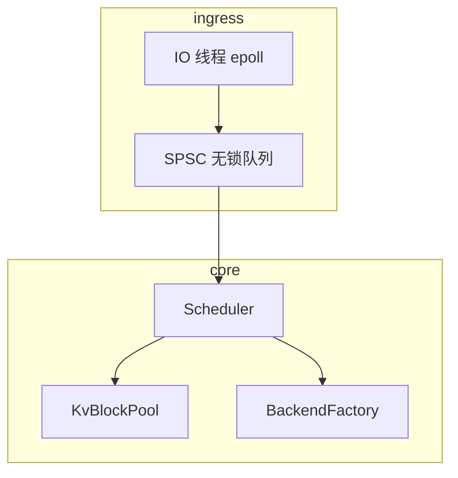
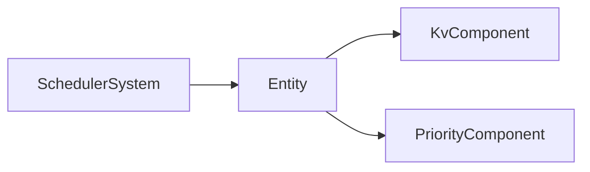

# 设计模式与 Infra 工程实践

> **文件编码**：UTF-8。  
> **定位**：Singleton、Factory、Object Pool、无锁队列入门——在 LLM Serving 中的 **克制使用**。  
> **交叉阅读**：[LLMInfra 08 KV Cache](../LLMInfra/08-KV-Cache与PagedAttention原理.md)、[LLMInfra 16 调度](../LLMInfra/16-推理服务化Batch调度与Continuous-Batching.md)、[C++ 08 多线程](08-多线程与并发编程.md)。

---

## 0. 读前导读（零基础也能跟上）

### 0.1 用一句话弄懂本章

**设计模式** 不是面试八股——在 Infra 里，**对象池** 管 KV block、**工厂** 建后端引擎、**单例** 持全局配置；无锁队列则是 scheduler 的进阶武器。

### 0.2 你需要提前知道什么

- [03 章 OOP](03-面向对象与类设计.md) 继承、多态
- [08 章](08-多线程与并发编程.md) mutex、atomic、条件变量
- [18 章](18-高性能C++与内存对齐.md) move、Buffer
- [LLMInfra 07 推理引擎架构](../LLMInfra/07-大模型推理引擎架构概览.md)

### 0.3 本章知识地图（☐→☑）

- [ ] 写出线程安全的 Meyers Singleton 配置
- [ ] 用 Factory 按 model name 创建 Backend
- [ ] 实现固定大小 Object Pool（acquire/release）
- [ ] 解释 SPSC 无锁队列适用边界
- [ ] 说清何时 **不要** 用单例
- [ ] §15 闭卷自测 ≥8/10

### 0.4 建议学习时长

**4～5 天**；对象池与无锁队列需对照 [08 章](08-多线程与并发编程.md) 写测试。

### 0.5 学完你能做什么

实现 mini KV block pool；读 vLLM scheduler 类层次；在代码 review 里识别 singleton 滥用。

### 0.6 与 LLM Infra 的衔接

| 模式 | Infra 实例 |
|------|------------|
| Object Pool | PagedAttention block 分配 |
| Factory | TensorRT / llama / mock backend |
| Singleton | 全局 metrics、配置（谨慎） |
| Lock-free queue | accept 线程 → worker 任务队列 |

---

## 本章与上一章的关系

[20 章 pybind11](20-pybind11与Python绑定入门.md) 暴露 API；本章组织 **C++ 内部结构**。好的 Infra 往往模式不多但每个都有性能理由——对照 [Java 设计模式](../Java/) 时强调 **内存与线程** 约束。

---

## 1. 这份文档学什么

- Singleton：Meyers、删除拷贝、测试困境
- Factory / Abstract Factory：引擎后端创建
- Object Pool：KV block、连接复用
- 无锁队列入门：SPSC、false sharing 注意
- Anti-patterns：God Singleton、过度抽象

---

## 2. Singleton（单例）

### 2.1 Meyers Singleton（C++11 线程安全）

```cpp
class Config {
public:
    static Config& instance() {
        static Config cfg;  // C++11 起线程安全初始化
        return cfg;
    }

    int max_batch_size() const { return max_batch_; }
    void set_max_batch(int n) { max_batch_ = n; }

    Config(const Config&) = delete;
    Config& operator=(const Config&) = delete;

private:
    Config() = default;
    int max_batch_{32};
};
```

### 2.2 Infra 用法与禁忌

**适合**：只读配置、日志 registry、metrics sink。  
**不适合**：可测试业务状态、多 tenant 隔离——改 **依赖注入** 或 context 对象。

---

## 3. Factory（工厂）

### 3.1 简单工厂

`BackendFactory` 维护 `unordered_map<string, FactoryFn>`，`create(name)` 返回 `unique_ptr<IBackend>`。启动时注册 `llama`、`mock`、`trt` 等实现——对照 [LLMInfra 14](../LLMInfra/14-vLLM与TensorRT-LLM架构导读.md) 多引擎共存。

---

## 4. Object Pool（对象池）

### 4.1 KV Block Pool 骨架

```cpp
#include <condition_variable>
#include <mutex>
#include <queue>
#include <vector>

class Buffer;  // 见 18 章

class KvBlockPool {
public:
    explicit KvBlockPool(size_t block_count, size_t block_bytes)
        : block_bytes_(block_bytes) {
        for (size_t i = 0; i < block_count; ++i) {
            free_.push(std::make_unique<Buffer>(block_bytes));
        }
    }

    std::unique_ptr<Buffer> acquire() {
        std::unique_lock lock(mtx_);
        cv_.wait(lock, [this] { return !free_.empty(); });
        auto b = std::move(free_.front());
        free_.pop();
        return b;
    }

    void release(std::unique_ptr<Buffer> b) {
        if (!b || b->size() != block_bytes_) return;
        std::lock_guard lock(mtx_);
        free_.push(std::move(b));
        cv_.notify_one();
    }

    size_t available() const {
        std::lock_guard lock(mtx_);
        return free_.size();
    }

private:
    size_t block_bytes_;
    mutable std::mutex mtx_;
    std::condition_variable cv_;
    std::queue<std::unique_ptr<Buffer>> free_;
};
```

**PagedAttention**：[LLMInfra 08](../LLMInfra/08-KV-Cache与PagedAttention原理.md) 按 block 分页；pool 避免 decode 时频繁 `malloc`。

### 4.2 与 move 语义

`acquire` / `release` 全程 `unique_ptr` + move，禁止拷贝 block（[18 章](18-高性能C++与内存对齐.md)）。

---

## 5. 无锁队列入门（SPSC）

**SPSC 要点**：环形缓冲 + 幂次容量；`head_`/`tail_` 各 `alignas(64)`；`push` 用 release、`pop` 用 acquire。完整实现见 [08 章](08-多线程与并发编程.md) 延伸阅读；MPMC 生产可用 moodycamel 或 mutex 队列。

---

## 6. 模式组合架构草图



---

## 7. Anti-patterns

|  smell | 问题 | 替代 |
|--------|------|------|
| 全局 Singleton 引擎 | 难测试、难多模型 | Factory + 实例 map |
| 无限 pool | 显存泄漏式占用 | 上限 + 等待/拒绝 |
| 过早无锁 | 难 debug | 先 mutex 正确再优化 |
| 抽象层过深 | 延迟与代码膨胀 | 只在扩展点用接口 |

---

## 8. 练习

### 练习 1：Block Pool 压测

N 线程 acquire/release，统计吞吐；对比无 pool 时 `new/delete Buffer`。

### 练习 2：Factory 扩展

注册 `TrtBackend` 桩类，单元测试 `create("trt")`。

### 练习 3：SPSC 边界

单线程 push 直到满，验证 `push` 返回 false；再 pop 直到空。

### 练习 4：读 vLLM

找 `BlockManager` 或 pool 类名，对照本章 pool API 写对比表。

---

## 9. FAQ

**Q：Singleton 线程安全吗？**  
Meyers static 局部变量 C++11 起安全；指针式双检锁已过时。

**Q：对象池 vs arena？**  
Pool 固定块大小复用；arena 批量 bump 分配、整批释放——权重加载常用 arena/mmap。

**Q：无锁一定更快吗？**  
不一定；临界区极短时 mutex 可能更简单；用 benchmark 说话（[12 章](12-性能分析与调试.md)）。

**Q：与 Go channel 对比？**  
Go channel 类似 SPSC 语义；C++ 需自管内存与 lifetime。

---

## 10. 学完标准

- [ ] 实现 KvBlockPool acquire/release
- [ ] 用 Factory 创建至少两种 Backend
- [ ] 实现 power-of-2 SPSC 队列
- [ ] 能指出 singleton 滥用一例
- [ ] 对照 LLMInfra 08、16 各写一段联系

---

## 11. 闭卷自测

1. Meyers Singleton 线程安全依赖什么标准？
2. Factory 解决 Infra 什么问题？
3. KV block pool 避免哪种开销？
4. SPSC 中 head/tail 为何要 padding？
5. 无锁队列 `memory_order_acquire/release` 作用？
6. 何时不用单例？
7. Object pool 满时策略有哪些？
8. MPMC 为何比 SPSC 难？
9. vLLM PagedAttention 与哪种模式最像？
10. 本章与 08、18 章如何配合？

<details>
<summary>自测参考答案</summary>

1. **C++11 静态局部变量初始化线程安全**。
2. **多后端/多模型** 创建与注册，解耦调用方与实现。
3. decode 热路径 **频繁堆分配/释放** block 内存。
4. 避免 **false sharing**（生产者/消费者各改相邻 atomic）。
5. 建立 **happens-before**，消费者看到完整写入元素。
6. 需 **测试替身、多实例、tenant 隔离** 的可变状态。
7. **阻塞等待、拒绝、扩容、淘汰**——按 SLO 选。
8. **多生产者/消费者 CAS 竞争** 与 ABA 等复杂度。
9. **Object Pool + 分页 block 管理**。
10. 08 提供 **mutex/atomic**；18 提供 **move Buffer**；本章组合成 pool/queue。

</details>

---

---

## Primer Plus 深度扩写：设计模式与 Infra 工程全栈

> 与 [77 章](77-设计模式C++完整23种实现.md) 互补：**本篇偏 Infra 场景映射**，77 章偏完整 C++ 实现。

### 13.1 GoF 23 种在 Infra 中的映射总表

| 类别 | 模式 | Infra 场景 | 要点 |
|------|------|------------|------|
| 创建型 | Singleton | 全局 Config/M metrics | Meyers + delete 拷贝 |
| 创建型 | Factory Method | 按 model 名创建 Backend | register + create |
| 创建型 | Abstract Factory | CUDA/CPU 算子族 | IKernelFactory |
| 创建型 | Builder | 复杂 GenerateRequest | 链式 set_* |
| 创建型 | Prototype | 克隆 KV block 模板 | clone() |
| 结构型 | Adapter | 旧 HTTP API → gRPC | HttpToGrpcAdapter |
| 结构型 | Bridge | 抽象 Engine 与 TensorRT 实现分离 | EngineImpl |
| 结构型 | Composite | 请求树 batch 节点 | BatchNode |
| 结构型 | Decorator | 限流/日志包装 Backend | LoggingBackend |
| 结构型 | Facade | InferServer 统一入口 | 隐藏 pool/scheduler |
| 结构型 | Flyweight | 共享 tokenizer 词表 | immutable dict |
| 结构型 | Proxy | 懒加载权重 | LazyWeightProxy |
| 行为型 | Chain of Responsibility | 中间件链 | Auth→RateLimit→Infer |
| 行为型 | Command | 调度命令队列 | EnqueueRequestCmd |
| 行为型 | Interpreter | 简单 DSL 批策略 | PolicyScript |
| 行为型 | Iterator | 遍历 block pool | BlockIterator |
| 行为型 | Mediator | Scheduler 协调 worker | SchedulerMediator |
| 行为型 | Memento | checkpoint 调度状态 | SchedulerSnapshot |
| 行为型 | Observer | metrics 事件订阅 | EventBus |
| 行为型 | State | 请求生命周期 | Waiting→Running→Done |
| 行为型 | Strategy | batching 策略 | ContinuousBatchStrategy |
| 行为型 | Template Method | 推理管线骨架 | prefill→decode hook |
| 行为型 | Visitor | 遍历计算图节点 | GraphVisitor |

### 13.2 Singleton（创建型）— Infra 应用

**场景**：全局 Config/M metrics。

**要点**：Meyers + delete 拷贝。

```cpp
// Singleton 在 Infra 中的简化示例 — 全局 Config/M metrics
class SingletonDemo {
public:
    void Apply() { /* Meyers + delete 拷贝 */ }
};
```

| 面试关键词 | 说明 |
|------------|------|
| 使用时机 | 全局 Config/M metrics |
| 权衡 | 勿过度设计；Meyers + delete 拷贝 |

### 13.3 Factory Method（创建型）— Infra 应用

**场景**：按 model 名创建 Backend。

**要点**：register + create。

```cpp
// Factory Method 在 Infra 中的简化示例 — 按 model 名创建 Backend
class FactoryMethodDemo {
public:
    void Apply() { /* register + create */ }
};
```

| 面试关键词 | 说明 |
|------------|------|
| 使用时机 | 按 model 名创建 Backend |
| 权衡 | 勿过度设计；register + create |

### 13.4 Abstract Factory（创建型）— Infra 应用

**场景**：CUDA/CPU 算子族。

**要点**：IKernelFactory。

```cpp
// Abstract Factory 在 Infra 中的简化示例 — CUDA/CPU 算子族
class AbstractFactoryDemo {
public:
    void Apply() { /* IKernelFactory */ }
};
```

| 面试关键词 | 说明 |
|------------|------|
| 使用时机 | CUDA/CPU 算子族 |
| 权衡 | 勿过度设计；IKernelFactory |

### 13.5 Builder（创建型）— Infra 应用

**场景**：复杂 GenerateRequest。

**要点**：链式 set_*。

```cpp
// Builder 在 Infra 中的简化示例 — 复杂 GenerateRequest
class BuilderDemo {
public:
    void Apply() { /* 链式 set_* */ }
};
```

| 面试关键词 | 说明 |
|------------|------|
| 使用时机 | 复杂 GenerateRequest |
| 权衡 | 勿过度设计；链式 set_* |

### 13.6 Prototype（创建型）— Infra 应用

**场景**：克隆 KV block 模板。

**要点**：clone()。

```cpp
// Prototype 在 Infra 中的简化示例 — 克隆 KV block 模板
class PrototypeDemo {
public:
    void Apply() { /* clone() */ }
};
```

| 面试关键词 | 说明 |
|------------|------|
| 使用时机 | 克隆 KV block 模板 |
| 权衡 | 勿过度设计；clone() |

### 13.7 Adapter（结构型）— Infra 应用

**场景**：旧 HTTP API → gRPC。

**要点**：HttpToGrpcAdapter。

```cpp
// Adapter 在 Infra 中的简化示例 — 旧 HTTP API → gRPC
class AdapterDemo {
public:
    void Apply() { /* HttpToGrpcAdapter */ }
};
```

| 面试关键词 | 说明 |
|------------|------|
| 使用时机 | 旧 HTTP API → gRPC |
| 权衡 | 勿过度设计；HttpToGrpcAdapter |

### 13.8 Bridge（结构型）— Infra 应用

**场景**：抽象 Engine 与 TensorRT 实现分离。

**要点**：EngineImpl。

```cpp
// Bridge 在 Infra 中的简化示例 — 抽象 Engine 与 TensorRT 实现分离
class BridgeDemo {
public:
    void Apply() { /* EngineImpl */ }
};
```

| 面试关键词 | 说明 |
|------------|------|
| 使用时机 | 抽象 Engine 与 TensorRT 实现分离 |
| 权衡 | 勿过度设计；EngineImpl |

### 13.9 Composite（结构型）— Infra 应用

**场景**：请求树 batch 节点。

**要点**：BatchNode。

```cpp
// Composite 在 Infra 中的简化示例 — 请求树 batch 节点
class CompositeDemo {
public:
    void Apply() { /* BatchNode */ }
};
```

| 面试关键词 | 说明 |
|------------|------|
| 使用时机 | 请求树 batch 节点 |
| 权衡 | 勿过度设计；BatchNode |

### 13.10 Decorator（结构型）— Infra 应用

**场景**：限流/日志包装 Backend。

**要点**：LoggingBackend。

```cpp
// Decorator 在 Infra 中的简化示例 — 限流/日志包装 Backend
class DecoratorDemo {
public:
    void Apply() { /* LoggingBackend */ }
};
```

| 面试关键词 | 说明 |
|------------|------|
| 使用时机 | 限流/日志包装 Backend |
| 权衡 | 勿过度设计；LoggingBackend |

### 13.11 Facade（结构型）— Infra 应用

**场景**：InferServer 统一入口。

**要点**：隐藏 pool/scheduler。

```cpp
// Facade 在 Infra 中的简化示例 — InferServer 统一入口
class FacadeDemo {
public:
    void Apply() { /* 隐藏 pool/scheduler */ }
};
```

| 面试关键词 | 说明 |
|------------|------|
| 使用时机 | InferServer 统一入口 |
| 权衡 | 勿过度设计；隐藏 pool/scheduler |

### 13.12 Flyweight（结构型）— Infra 应用

**场景**：共享 tokenizer 词表。

**要点**：immutable dict。

```cpp
// Flyweight 在 Infra 中的简化示例 — 共享 tokenizer 词表
class FlyweightDemo {
public:
    void Apply() { /* immutable dict */ }
};
```

| 面试关键词 | 说明 |
|------------|------|
| 使用时机 | 共享 tokenizer 词表 |
| 权衡 | 勿过度设计；immutable dict |

### 13.13 Proxy（结构型）— Infra 应用

**场景**：懒加载权重。

**要点**：LazyWeightProxy。

```cpp
// Proxy 在 Infra 中的简化示例 — 懒加载权重
class ProxyDemo {
public:
    void Apply() { /* LazyWeightProxy */ }
};
```

| 面试关键词 | 说明 |
|------------|------|
| 使用时机 | 懒加载权重 |
| 权衡 | 勿过度设计；LazyWeightProxy |

### 13.14 Chain of Responsibility（行为型）— Infra 应用

**场景**：中间件链。

**要点**：Auth→RateLimit→Infer。

```cpp
// Chain of Responsibility 在 Infra 中的简化示例 — 中间件链
class ChainofResponsibilityDemo {
public:
    void Apply() { /* Auth→RateLimit→Infer */ }
};
```

| 面试关键词 | 说明 |
|------------|------|
| 使用时机 | 中间件链 |
| 权衡 | 勿过度设计；Auth→RateLimit→Infer |

### 13.15 Command（行为型）— Infra 应用

**场景**：调度命令队列。

**要点**：EnqueueRequestCmd。

```cpp
// Command 在 Infra 中的简化示例 — 调度命令队列
class CommandDemo {
public:
    void Apply() { /* EnqueueRequestCmd */ }
};
```

| 面试关键词 | 说明 |
|------------|------|
| 使用时机 | 调度命令队列 |
| 权衡 | 勿过度设计；EnqueueRequestCmd |

### 13.16 Interpreter（行为型）— Infra 应用

**场景**：简单 DSL 批策略。

**要点**：PolicyScript。

```cpp
// Interpreter 在 Infra 中的简化示例 — 简单 DSL 批策略
class InterpreterDemo {
public:
    void Apply() { /* PolicyScript */ }
};
```

| 面试关键词 | 说明 |
|------------|------|
| 使用时机 | 简单 DSL 批策略 |
| 权衡 | 勿过度设计；PolicyScript |

### 13.17 Iterator（行为型）— Infra 应用

**场景**：遍历 block pool。

**要点**：BlockIterator。

```cpp
// Iterator 在 Infra 中的简化示例 — 遍历 block pool
class IteratorDemo {
public:
    void Apply() { /* BlockIterator */ }
};
```

| 面试关键词 | 说明 |
|------------|------|
| 使用时机 | 遍历 block pool |
| 权衡 | 勿过度设计；BlockIterator |

### 13.18 Mediator（行为型）— Infra 应用

**场景**：Scheduler 协调 worker。

**要点**：SchedulerMediator。

```cpp
// Mediator 在 Infra 中的简化示例 — Scheduler 协调 worker
class MediatorDemo {
public:
    void Apply() { /* SchedulerMediator */ }
};
```

| 面试关键词 | 说明 |
|------------|------|
| 使用时机 | Scheduler 协调 worker |
| 权衡 | 勿过度设计；SchedulerMediator |

### 13.19 Memento（行为型）— Infra 应用

**场景**：checkpoint 调度状态。

**要点**：SchedulerSnapshot。

```cpp
// Memento 在 Infra 中的简化示例 — checkpoint 调度状态
class MementoDemo {
public:
    void Apply() { /* SchedulerSnapshot */ }
};
```

| 面试关键词 | 说明 |
|------------|------|
| 使用时机 | checkpoint 调度状态 |
| 权衡 | 勿过度设计；SchedulerSnapshot |

### 13.20 Observer（行为型）— Infra 应用

**场景**：metrics 事件订阅。

**要点**：EventBus。

```cpp
// Observer 在 Infra 中的简化示例 — metrics 事件订阅
class ObserverDemo {
public:
    void Apply() { /* EventBus */ }
};
```

| 面试关键词 | 说明 |
|------------|------|
| 使用时机 | metrics 事件订阅 |
| 权衡 | 勿过度设计；EventBus |

### 13.21 State（行为型）— Infra 应用

**场景**：请求生命周期。

**要点**：Waiting→Running→Done。

```cpp
// State 在 Infra 中的简化示例 — 请求生命周期
class StateDemo {
public:
    void Apply() { /* Waiting→Running→Done */ }
};
```

| 面试关键词 | 说明 |
|------------|------|
| 使用时机 | 请求生命周期 |
| 权衡 | 勿过度设计；Waiting→Running→Done |

### 13.22 Strategy（行为型）— Infra 应用

**场景**：batching 策略。

**要点**：ContinuousBatchStrategy。

```cpp
// Strategy 在 Infra 中的简化示例 — batching 策略
class StrategyDemo {
public:
    void Apply() { /* ContinuousBatchStrategy */ }
};
```

| 面试关键词 | 说明 |
|------------|------|
| 使用时机 | batching 策略 |
| 权衡 | 勿过度设计；ContinuousBatchStrategy |

### 13.23 Template Method（行为型）— Infra 应用

**场景**：推理管线骨架。

**要点**：prefill→decode hook。

```cpp
// Template Method 在 Infra 中的简化示例 — 推理管线骨架
class TemplateMethodDemo {
public:
    void Apply() { /* prefill→decode hook */ }
};
```

| 面试关键词 | 说明 |
|------------|------|
| 使用时机 | 推理管线骨架 |
| 权衡 | 勿过度设计；prefill→decode hook |

### 13.24 Visitor（行为型）— Infra 应用

**场景**：遍历计算图节点。

**要点**：GraphVisitor。

```cpp
// Visitor 在 Infra 中的简化示例 — 遍历计算图节点
class VisitorDemo {
public:
    void Apply() { /* GraphVisitor */ }
};
```

| 面试关键词 | 说明 |
|------------|------|
| 使用时机 | 遍历计算图节点 |
| 权衡 | 勿过度设计；GraphVisitor |

### 13.25 单例线程安全深入

Meyers、call_once、atomic 指针对比；**依赖注入** 优于 God Singleton。

### 13.26 工厂注册表

```cpp
using FactoryFn = std::function<std::unique_ptr<IBackend>()>;
class BackendRegistry {
    std::unordered_map<std::string, FactoryFn> map_;
public:
    void Register(const std::string& name, FactoryFn fn) { map_[name] = std::move(fn); }
    std::unique_ptr<IBackend> Create(const std::string& name) const {
        return map_.at(name)();
    }
};
```

### 13.27 观察者事件总线

```cpp
class EventBus {
    std::unordered_map<std::string, std::vector<std::function<void(const Event&)>>> subs_;
public:
    void Subscribe(const std::string& topic, std::function<void(const Event&)> h);
    void Publish(const std::string& topic, const Event& e);
};
```

### 13.28 策略 + 模板方法

Template Method 定义 `RunPipeline()`；Strategy 注入 batch 策略。

### 13.29 RAII 模式

lock_guard、unique_ptr、KvBlockGuard（acquire 构造 release 析构）。

### 13.30 pimpl

隐藏 TensorRT/cuBLAS 头依赖，加速编译。

### 13.31 ECS 模式

Entity=RequestId；Component=KVHandle/Priority；System=Scheduler。适合 **万级请求** 数据导向。



### 13.32 与 77 章互补说明

| 本篇 21 章 | 77 章 |
|------------|-------|
| Infra 场景映射、克制使用 | 23 种完整 C++ 实现 |
| Pool/Factory/Singleton 实战 | 全模式代码+UML |
| 面试口述「何时用/不用」 | 手撕单例/观察者 |

### 13.33 FAQ 与练习

**练习 A**：为 Backend 写 Factory 注册 3 种实现。
**练习 B**：EventBus 实现 request_done 订阅打 metrics。
**练习 C**：用 pimpl 隐藏含 CUDA 头的 Engine 类。


---

## Primer Plus 进阶续篇

### 14.1 进阶专题：Singleton 测试

**概念**：依赖注入。**实践**：接口 mock。

```cpp
// Singleton 测试 — 示例 #1
namespace infra_21_1 {
struct Demo {
    int id = 1;
    void run() {
        // 接口 mock
    }
};
} // namespace
```

| 要点 | 说明 |
|------|------|
| 原理 | 依赖注入 |
| 工程 | 接口 mock |
| 面试 | 能口述 Singleton 测试 在 LLM Infra 中的作用 |

**FAQ #1**：Singleton 测试 与相邻章节如何衔接？→ 见交叉阅读链接与 §0.3 知识地图。

**练习 #1**：实现 `Singleton 测试` 最小 demo 并写 3 行 benchmark 结论。


### 14.2 进阶专题：Abstract Factory

**概念**：CPU/GPU 族。**实践**：KernelFactory。

```cpp
// Abstract Factory — 示例 #2
namespace infra_21_2 {
struct Demo {
    int id = 2;
    void run() {
        // KernelFactory
    }
};
} // namespace
```

| 要点 | 说明 |
|------|------|
| 原理 | CPU/GPU 族 |
| 工程 | KernelFactory |
| 面试 | 能口述 Abstract Factory 在 LLM Infra 中的作用 |

**FAQ #2**：Abstract Factory 与相邻章节如何衔接？→ 见交叉阅读链接与 §0.3 知识地图。

**练习 #2**：实现 `Abstract Factory` 最小 demo 并写 3 行 benchmark 结论。


### 14.3 进阶专题：Observer metrics

**概念**：Prometheus。**实践**：EventBus。

```cpp
// Observer metrics — 示例 #3
namespace infra_21_3 {
struct Demo {
    int id = 3;
    void run() {
        // EventBus
    }
};
} // namespace
```

| 要点 | 说明 |
|------|------|
| 原理 | Prometheus |
| 工程 | EventBus |
| 面试 | 能口述 Observer metrics 在 LLM Infra 中的作用 |

**FAQ #3**：Observer metrics 与相邻章节如何衔接？→ 见交叉阅读链接与 §0.3 知识地图。

**练习 #3**：实现 `Observer metrics` 最小 demo 并写 3 行 benchmark 结论。


### 14.4 进阶专题：Command 队列

**概念**：undo。**实践**：调度命令。

```cpp
// Command 队列 — 示例 #4
namespace infra_21_4 {
struct Demo {
    int id = 4;
    void run() {
        // 调度命令
    }
};
} // namespace
```

| 要点 | 说明 |
|------|------|
| 原理 | undo |
| 工程 | 调度命令 |
| 面试 | 能口述 Command 队列 在 LLM Infra 中的作用 |

**FAQ #4**：Command 队列 与相邻章节如何衔接？→ 见交叉阅读链接与 §0.3 知识地图。

**练习 #4**：实现 `Command 队列` 最小 demo 并写 3 行 benchmark 结论。


### 14.5 进阶专题：State 机

**概念**：RequestState。**实践**：转换表。

```cpp
// State 机 — 示例 #5
namespace infra_21_5 {
struct Demo {
    int id = 5;
    void run() {
        // 转换表
    }
};
} // namespace
```

| 要点 | 说明 |
|------|------|
| 原理 | RequestState |
| 工程 | 转换表 |
| 面试 | 能口述 State 机 在 LLM Infra 中的作用 |

**FAQ #5**：State 机 与相邻章节如何衔接？→ 见交叉阅读链接与 §0.3 知识地图。

**练习 #5**：实现 `State 机` 最小 demo 并写 3 行 benchmark 结论。


### 14.6 进阶专题：Flyweight 词表

**概念**：共享 immutable。**实践**：tokenizer。

```cpp
// Flyweight 词表 — 示例 #6
namespace infra_21_6 {
struct Demo {
    int id = 6;
    void run() {
        // tokenizer
    }
};
} // namespace
```

| 要点 | 说明 |
|------|------|
| 原理 | 共享 immutable |
| 工程 | tokenizer |
| 面试 | 能口述 Flyweight 词表 在 LLM Infra 中的作用 |

**FAQ #6**：Flyweight 词表 与相邻章节如何衔接？→ 见交叉阅读链接与 §0.3 知识地图。

**练习 #6**：实现 `Flyweight 词表` 最小 demo 并写 3 行 benchmark 结论。


### 14.7 进阶专题：Proxy 懒加载

**概念**：权重 mmap。**实践**：按需 load。

```cpp
// Proxy 懒加载 — 示例 #7
namespace infra_21_7 {
struct Demo {
    int id = 7;
    void run() {
        // 按需 load
    }
};
} // namespace
```

| 要点 | 说明 |
|------|------|
| 原理 | 权重 mmap |
| 工程 | 按需 load |
| 面试 | 能口述 Proxy 懒加载 在 LLM Infra 中的作用 |

**FAQ #7**：Proxy 懒加载 与相邻章节如何衔接？→ 见交叉阅读链接与 §0.3 知识地图。

**练习 #7**：实现 `Proxy 懒加载` 最小 demo 并写 3 行 benchmark 结论。


### 14.8 进阶专题：Mediator Scheduler

**概念**：解耦 worker。**实践**：消息。

```cpp
// Mediator Scheduler — 示例 #8
namespace infra_21_8 {
struct Demo {
    int id = 8;
    void run() {
        // 消息
    }
};
} // namespace
```

| 要点 | 说明 |
|------|------|
| 原理 | 解耦 worker |
| 工程 | 消息 |
| 面试 | 能口述 Mediator Scheduler 在 LLM Infra 中的作用 |

**FAQ #8**：Mediator Scheduler 与相邻章节如何衔接？→ 见交叉阅读链接与 §0.3 知识地图。

**练习 #8**：实现 `Mediator Scheduler` 最小 demo 并写 3 行 benchmark 结论。


### 14.9 进阶专题：ECS System

**概念**：batch update。**实践**：数据导向。

```cpp
// ECS System — 示例 #9
namespace infra_21_9 {
struct Demo {
    int id = 9;
    void run() {
        // 数据导向
    }
};
} // namespace
```

| 要点 | 说明 |
|------|------|
| 原理 | batch update |
| 工程 | 数据导向 |
| 面试 | 能口述 ECS System 在 LLM Infra 中的作用 |

**FAQ #9**：ECS System 与相邻章节如何衔接？→ 见交叉阅读链接与 §0.3 知识地图。

**练习 #9**：实现 `ECS System` 最小 demo 并写 3 行 benchmark 结论。


### 14.10 进阶专题：Anti-pattern

**概念**：God class。**实践**：过度抽象。

```cpp
// Anti-pattern — 示例 #10
namespace infra_21_10 {
struct Demo {
    int id = 10;
    void run() {
        // 过度抽象
    }
};
} // namespace
```

| 要点 | 说明 |
|------|------|
| 原理 | God class |
| 工程 | 过度抽象 |
| 面试 | 能口述 Anti-pattern 在 LLM Infra 中的作用 |

**FAQ #10**：Anti-pattern 与相邻章节如何衔接？→ 见交叉阅读链接与 §0.3 知识地图。

**练习 #10**：实现 `Anti-pattern` 最小 demo 并写 3 行 benchmark 结论。


### 14.11 进阶专题：Singleton 测试

**概念**：依赖注入。**实践**：接口 mock。

```cpp
// Singleton 测试 — 示例 #11
namespace infra_21_11 {
struct Demo {
    int id = 11;
    void run() {
        // 接口 mock
    }
};
} // namespace
```

| 要点 | 说明 |
|------|------|
| 原理 | 依赖注入 |
| 工程 | 接口 mock |
| 面试 | 能口述 Singleton 测试 在 LLM Infra 中的作用 |

**FAQ #11**：Singleton 测试 与相邻章节如何衔接？→ 见交叉阅读链接与 §0.3 知识地图。

**练习 #11**：实现 `Singleton 测试` 最小 demo 并写 3 行 benchmark 结论。


### 14.12 进阶专题：Abstract Factory

**概念**：CPU/GPU 族。**实践**：KernelFactory。

```cpp
// Abstract Factory — 示例 #12
namespace infra_21_12 {
struct Demo {
    int id = 12;
    void run() {
        // KernelFactory
    }
};
} // namespace
```

| 要点 | 说明 |
|------|------|
| 原理 | CPU/GPU 族 |
| 工程 | KernelFactory |
| 面试 | 能口述 Abstract Factory 在 LLM Infra 中的作用 |

**FAQ #12**：Abstract Factory 与相邻章节如何衔接？→ 见交叉阅读链接与 §0.3 知识地图。

**练习 #12**：实现 `Abstract Factory` 最小 demo 并写 3 行 benchmark 结论。


### 14.13 进阶专题：Observer metrics

**概念**：Prometheus。**实践**：EventBus。

```cpp
// Observer metrics — 示例 #13
namespace infra_21_13 {
struct Demo {
    int id = 13;
    void run() {
        // EventBus
    }
};
} // namespace
```

| 要点 | 说明 |
|------|------|
| 原理 | Prometheus |
| 工程 | EventBus |
| 面试 | 能口述 Observer metrics 在 LLM Infra 中的作用 |

**FAQ #13**：Observer metrics 与相邻章节如何衔接？→ 见交叉阅读链接与 §0.3 知识地图。

**练习 #13**：实现 `Observer metrics` 最小 demo 并写 3 行 benchmark 结论。


### 14.14 进阶专题：Command 队列

**概念**：undo。**实践**：调度命令。

```cpp
// Command 队列 — 示例 #14
namespace infra_21_14 {
struct Demo {
    int id = 14;
    void run() {
        // 调度命令
    }
};
} // namespace
```

| 要点 | 说明 |
|------|------|
| 原理 | undo |
| 工程 | 调度命令 |
| 面试 | 能口述 Command 队列 在 LLM Infra 中的作用 |

**FAQ #14**：Command 队列 与相邻章节如何衔接？→ 见交叉阅读链接与 §0.3 知识地图。

**练习 #14**：实现 `Command 队列` 最小 demo 并写 3 行 benchmark 结论。


### 14.15 进阶专题：State 机

**概念**：RequestState。**实践**：转换表。

```cpp
// State 机 — 示例 #15
namespace infra_21_15 {
struct Demo {
    int id = 15;
    void run() {
        // 转换表
    }
};
} // namespace
```

| 要点 | 说明 |
|------|------|
| 原理 | RequestState |
| 工程 | 转换表 |
| 面试 | 能口述 State 机 在 LLM Infra 中的作用 |

**FAQ #15**：State 机 与相邻章节如何衔接？→ 见交叉阅读链接与 §0.3 知识地图。

**练习 #15**：实现 `State 机` 最小 demo 并写 3 行 benchmark 结论。


### 14.16 进阶专题：Flyweight 词表

**概念**：共享 immutable。**实践**：tokenizer。

```cpp
// Flyweight 词表 — 示例 #16
namespace infra_21_16 {
struct Demo {
    int id = 16;
    void run() {
        // tokenizer
    }
};
} // namespace
```

| 要点 | 说明 |
|------|------|
| 原理 | 共享 immutable |
| 工程 | tokenizer |
| 面试 | 能口述 Flyweight 词表 在 LLM Infra 中的作用 |

**FAQ #16**：Flyweight 词表 与相邻章节如何衔接？→ 见交叉阅读链接与 §0.3 知识地图。

**练习 #16**：实现 `Flyweight 词表` 最小 demo 并写 3 行 benchmark 结论。


### 14.17 进阶专题：Proxy 懒加载

**概念**：权重 mmap。**实践**：按需 load。

```cpp
// Proxy 懒加载 — 示例 #17
namespace infra_21_17 {
struct Demo {
    int id = 17;
    void run() {
        // 按需 load
    }
};
} // namespace
```

| 要点 | 说明 |
|------|------|
| 原理 | 权重 mmap |
| 工程 | 按需 load |
| 面试 | 能口述 Proxy 懒加载 在 LLM Infra 中的作用 |

**FAQ #17**：Proxy 懒加载 与相邻章节如何衔接？→ 见交叉阅读链接与 §0.3 知识地图。

**练习 #17**：实现 `Proxy 懒加载` 最小 demo 并写 3 行 benchmark 结论。


### 14.99 本章扩写总结

| 模块 | 要点 |
|------|------|
| 原理 | 从 wire format / 绑定机制 / 模式映射 / 硬件层次 / IO 模型建立直觉 |
| 代码 | 每节含可编译骨架，需在 Linux/WSL 补全依赖后运行 |
| 面试 | FAQ 与练习题覆盖大厂 Infra 常见追问 |
| 互补 | 与 64/65/70/77 及 LLMInfra 专题交叉阅读 |

**最终检查清单**：
- [ ] 闭卷自测 ≥8/10
- [ ] 至少完成 3 道扩写练习题
- [ ] 对照交叉阅读章节各举 1 例


## 下一章预告

Pool 与 queue 的性能上限受 **CPU/GPU 内存层次** 约束。22 章 [计算机体系结构导读](22-计算机体系结构导读.md) 与 [LLMInfra 03～05](../LLMInfra/03-GPU架构与CUDA编程入门.md) 衔接。

---

*下一章：22 计算机体系结构导读*
