# 计算机体系结构导读

> **文件编码**：UTF-8。  
> **定位**：CPU 缓存层次、NUMA、GPU vs CPU 分工——理解 LLM 为何 **GPU 算、CPU 调度**。  
> **交叉阅读**：[LLMInfra 03 GPU 入门](../LLMInfra/03-GPU架构与CUDA编程入门.md)、[06 高性能 C++](../LLMInfra/06-高性能C++对齐与零拷贝.md)、[C++ 18 内存对齐](18-高性能C++与内存对齐.md)、[C++ 22 自指：本章]。

---

## 0. 读前导读（零基础也能跟上）

### 0.1 用一句话弄懂本章

**体系结构** = 数据在寄存器→缓存→内存→磁盘/GPU 之间怎么流动——LLM 推理的瓶颈常在 **HBM 带宽** 与 **KV Cache 容量**，不在 CPU 主频。

### 0.2 你需要提前知道什么

- [02 章](02-指针引用与内存管理.md) 栈/堆
- [18 章](18-高性能C++与内存对齐.md) cache line、false sharing
- [08 章](08-多线程与并发编程.md) 多核并行
- 并行 [LLMInfra 01 线性代数](../LLMInfra/01-线性代数与数值计算基础.md)（矩阵规模直觉）

### 0.3 本章知识地图（☐→☑）

- [ ] 画出寄存器/L1/L2/L3/DRAM 层次
- [ ] 解释 locality（时间/空间）
- [ ] 说清 NUMA 节点与绑核
- [ ] 对比 GPU SM/HBM 与 CPU core/DRAM
- [ ] 解释 LLM prefill vs decode 的不同瓶颈
- [ ] §16 闭卷自测 ≥8/10

### 0.4 建议学习时长

**3～5 天**（偏概念 + 少量 benchmark）；与 LLMInfra 03 并行最佳。

### 0.5 学完你能做什么

读 roofline 图；解释为何 Attention 要 FlashAttention；为多 socket 服务器配置 `numactl`；与面试官聊清「为什么不用 CPU 跑 70B」。

### 0.6 与 LLM Infra 的衔接

| 硬件概念 | LLM 对应 |
|----------|----------|
| HBM 带宽 | GEMM、Attention IO |
| L3/DRAM | CPU 调度、tokenization |
| NUMA | 多路 CPU + 多 GPU PCIe 拓扑 |
| Tensor Core | FP16/BF16/INT8 推理 |

---

## 本章与上一章的关系

[21 章 设计模式](21-设计模式与Infra工程实践.md) 讲代码结构；本章讲 **机器物理约束**。没有体系结构视角，pool/无锁队列的优化容易优化错层（CPU 微优化 while GPU 空转）。

---

## 1. 这份文档学什么

- 存储层次与 latency/带宽数量级
- Cache、line、替换策略（直觉）
- NUMA 与 CPU affinity
- GPU 架构入门：SM、Warp、HBM
- LLM  workload 在 CPU/GPU 上的分工

---

## 2. 存储层次（Memory Hierarchy）

```text
        更快 ↑  更小
    ┌─────────────┐
    │ 寄存器       │  ~1 cycle
    ├─────────────┤
    │ L1  cache   │  ~4 cycles, 32~64KB/核
    ├─────────────┤
    │ L2  cache   │  ~10 cycles, 256KB~1MB/核
    ├─────────────┤
    │ L3  cache   │  ~40 cycles, 共享 10~60MB
    ├─────────────┤
    │ DRAM        │  ~100ns, 数十 GB
    ├─────────────┤
    │ NVMe / 网络  │  μs~ms
    └─────────────┘
        更慢 ↓  更大
```

**数量级记忆**：L1 比 DRAM 快 **两个数量级**；一次 cache miss 可能浪费数百 cycle。

### 2.1 局部性

| 类型 | 含义 | LLM 例 |
|------|------|--------|
| 时间局部性 | 刚访问的数据很快再访问 | 同一层权重重复 GEMM |
| 空间局部性 | 相邻地址 soon 被访问 | 连续 token 的 KV 向量 |

[18 章](18-高性能C++与内存对齐.md) 对齐与顺序访问直接服务空间局部性。

---

## 3. CPU Cache 与多核

### 3.1 Cache Line

典型 **64B** 为最小一致性单位。多核 **MESI** 协议：一核写 line，其他核 invalidate——false sharing 根源（18 章）。

### 3.2 超线程与物理核

- **物理核**：独立执行单元
- **超线程（SMT）**：一核两套架构状态，共享执行资源
- Infra：**计算密集 worker** 常绑物理核；IO 线程可与计算共享需注意 cache 争用

### 3.3 简单 benchmark 直觉

```cpp
// 行优先 vs 列优先遍历二维数组——列优先 cache miss 多
for (int i = 0; i < N; ++i)
    for (int j = 0; j < N; ++j)
        sum += a[i][j];  // 友好
```

用 `perf stat -e cache-misses` 对比（[12 章](12-性能分析与调试.md)）。

---

## 4. NUMA（Non-Uniform Memory Access）

### 4.1 是什么

多 **CPU socket** 机器上，每 socket 有 **本地 DRAM**；访问远端 socket 内存更慢。

```text
  Socket 0 ── local DRAM 0
      │ PCIe
      GPU 0

  Socket 1 ── local DRAM 1
      │ PCIe
      GPU 1
```

### 4.2 Infra 实践

- `numactl --cpunodebind=0 --membind=0 ./infer_server`
- **Pin** 推理线程到 GPU 所在 socket 的 CPU
- 跨 NUMA 频繁分配 → latency 抖动

[LLMInfra 17 性能剖析](../LLMInfra/17-GPU-CPU性能剖析Nsight与perf.md) 可观测 NUMA 远程访问。

---

## 5. GPU 架构（LLM 视角）

### 5.1 与 CPU 对比

| | CPU | GPU |
|---|-----|-----|
| 核心目标 | 低延迟、复杂分支 | **高吞吐**、大规模并行 |
| 并行单位 | 线程（少而精） | **Warp（32 线程）** + 数千 SM 线程 |
| 内存 | DDR/LPDDR | **HBM**（高带宽） |
| 适合 | 调度、解析、小 batch 控制 | **大矩阵、Attention** |

详见 [LLMInfra 03](../LLMInfra/03-GPU架构与CUDA编程入门.md)、[04 CUDA 内存](../LLMInfra/04-CUDA核函数与内存模型.md)。

### 5.2 SM、Warp、Occupancy

- **SM**（Streaming Multiprocessor）：GPU 上的「多核」
- **Warp**：32 线程同步执行同一条指令（SIMT）
- **Occupancy**：活跃 warp 比例；受寄存器/shared mem 限制

LLM kernel 常调 tile size 平衡 occupancy 与寄存器压力（[LLMInfra 05 GEMM](../LLMInfra/05-矩阵运算与cuBLAS入门.md)）。

### 5.3 HBM 带宽 vs 算力

**Roofline 直觉**：

```text
性能上限 = min(峰值算力, 带宽 × 算术强度)
```

Attention 标准实现 **算术强度低** → 带宽 bound → [FlashAttention](../LLMInfra/15-FlashAttention与算子融合.md) 减少 HBM 读写。

---

## 6. LLM 工作负载映射

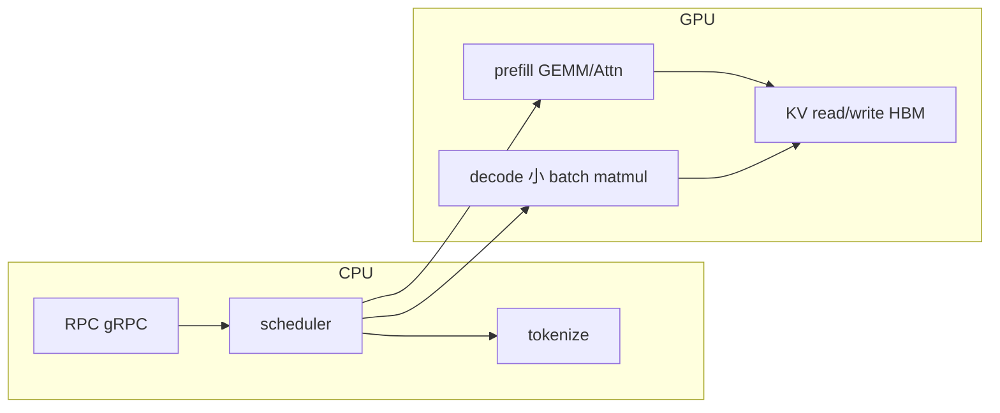

### 6.1 Prefill vs Decode

| 阶段 | 计算特征 | 常见瓶颈 |
|------|----------|----------|
| **Prefill** | 长序列并行高 | GPU 算力 / HBM |
| **Decode** | batch×小向量，内存 bound | **KV Cache 带宽**、batch 调度 |

[LLMInfra 16 Continuous Batching](../LLMInfra/16-推理服务化Batch调度与Continuous-Batching.md) 提高 GPU 利用率；[08 KV](../LLMInfra/08-KV-Cache与PagedAttention原理.md) 解决显存组织。

### 6.2 何时 CPU 仍重要

- Tokenization、regex、JSON/proto
- 调度、排队、限流（[21 章](21-设计模式与Infra工程实践.md)）
- 小模型或 embedding 查表（可 CPU AVX）
- **llama.cpp** 纯 CPU 量化路径（边缘部署）

---

## 7. PCIe 与数据传输

GPU 算力再强，**PCIe 拷贝** 也是墙：

- 权重常驻 GPU；推理时尽量少 H2D
- 权重 **mmap + 一次上传** 或 engine 内嵌
- Unified Memory 便利但性能需 profile

[LLMInfra 12 mmap](../LLMInfra/12-Checkpoint加载与mmap.md) + [18 章零拷贝](18-高性能C++与内存对齐.md)。

---

## 8. 量化与 Tensor Core

INT8/FP8 降低 **内存与算力需求**（[LLMInfra 09](../LLMInfra/09-模型量化INT8-INT4-FP8与校准.md)）：

- 权重更小 → 带宽压力降
- Tensor Core 专精低精度 GEMM
- 校准在 CPU/GPU 均可；Serving 热路径在 GPU

---

## 9. 练习

### 练习 1：cache 友好遍历

实现 N×N 矩阵行/列优先求和，用 `chrono` 或 `perf` 对比。

### 练习 2：numactl 实验

在双路机器（或文档模拟）查 `numactl -H`，写 GPU 与 NUMA 节点对应关系。

### 练习 3：roofline 口述

选 GEMM vs Attention（O(n²) memory），各说一个 bound 类型。

### 练习 4：读图

打开 [LLMInfra 17](../LLMInfra/17-GPU-CPU性能剖析Nsight与perf.md) 推荐的 Nsight Compute 截图样例，标出 memory throughput 指标。

---

## 10. FAQ

**Q：70B 模型为何 CPU 难扛？**  
参数规模 × 字节数 **远超** DRAM 带宽与延迟可接受的吞吐；GPU HBM + 并行 GEMM 专为此设计。

**Q：L3 够大能否放 KV？**  
服务器 L3 仅数十 MB；KV 常 **GB 级**，必须在 GPU HBM 或分页到 CPU/Disk（极端 offload）。

**Q：多 GPU 是 NUMA 吗？**  
概念类似 **非均匀访问**；NVLink 比 PCIe 快，[LLMInfra 10 NCCL](../LLMInfra/10-分布式训练与NCCL.md) 处理多卡通信。

**Q：本章与 18 章重复吗？**  
18 偏 **C++ 代码**；本章偏 **硬件全貌** 与 LLM 映射。

---

## 11. 学完标准

- [ ] 手绘存储层次与数量级
- [ ] 解释 prefill/decode 瓶颈差异
- [ ] 说清 GPU SM/Warp/HBM 各是什么
- [ ] 知道 NUMA 绑核的基本命令
- [ ] 将 FlashAttention 优化与带宽 bound 联系起来
- [ ] 完成至少 2 道练习

---

## 12. 闭卷自测

1. 典型 cache line 大小？
2. 时间局部性与空间局部性各举 LLM 一例？
3. false sharing 发生在哪一层一致性？
4. NUMA 下「远端内存」含义？
5. GPU Warp 宽度常见值？
6. Prefill 通常 compute-bound 还是 memory-bound？（简答「视 batch/seq 而定」并说明）
7. Decode 为何常 memory-bound？
8. Tensor Core 主要加速什么？
9. FlashAttention 优化的是哪级存储瓶颈？
10. CPU 在 LLM Serving 中至少承担哪三项任务？

<details>
<summary>自测参考答案</summary>

1. **64 字节**（常见）。
2. 时间：重复用同一权重；空间：连续 KV 头维度访问。
3. **Cache line 一致性（MESI）** 级别。
4. 线程在 socket A，内存在 socket B → **更高延迟**。
5. **32**（NVIDIA CUDA 惯例）。
6. 长 seq、大 batch 时算力与带宽均高；短 seq 可能更 **memory/launch** 敏感——需 profile。
7. **小 batch 小矩阵**，KV 读写占主导，算术强度低。
8. **低精度矩阵乘**（FP16/BF16/INT8 等）。
9. **GPU HBM 带宽**（少 materialize 大中间矩阵）。
10. **RPC/调度、tokenize、后处理与监控** 等。

</details>

---

---

## Primer Plus 深度扩写：计算机体系结构面试导读

> 与 [70 章](70-计算机体系结构深入学习.md) 互补：本篇 **面试口述 + 数量级**；70 章 **深度推导**。

### 13.1 CPU 架构

**核心概念**：冯·诺依曼、哈佛变种、多核 cache 共享。

**细节**：ALU、控制单元、L1i/L1d。

| 面试题 | 参考答案要点 |
|--------|--------------|
| 什么是CPU 架构？ | 冯·诺依曼、哈佛变种、多核 cache 共享 |
| LLM 相关？ | ALU、控制单元、L1i/L1d；GPU 侧见 LLMInfra 03 |

```cpp
// CPU 架构 微基准或测量思路
void bench_CPU_架构() {
    // 使用 chrono / perf 验证 ALU、控制单元、L1i/L1d
}
```

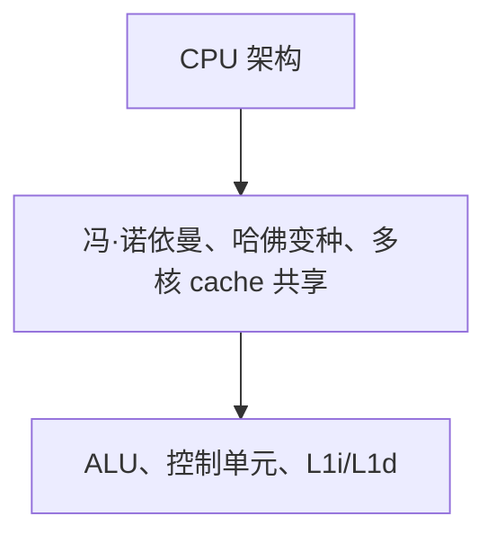

### 13.2 寄存器

**核心概念**：通用寄存器、PC、SP、FLAGS。

**细节**：x86-64 常用 16 个 R*。

| 面试题 | 参考答案要点 |
|--------|--------------|
| 什么是寄存器？ | 通用寄存器、PC、SP、FLAGS |
| LLM 相关？ | x86-64 常用 16 个 R*；GPU 侧见 LLMInfra 03 |

```cpp
// 寄存器 微基准或测量思路
void bench_寄存器() {
    // 使用 chrono / perf 验证 x86-64 常用 16 个 R*
}
```

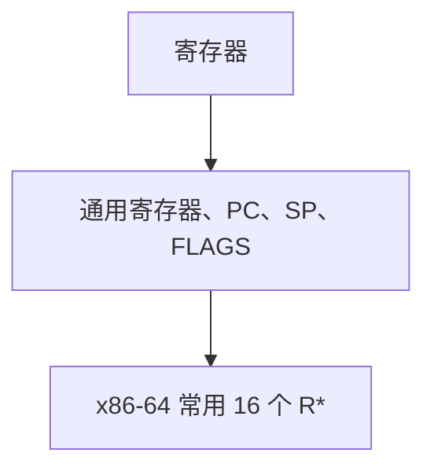

### 13.3 流水线

**核心概念**：取指译码执行写回、五级流水线。

**细节**：stall、 hazard。

| 面试题 | 参考答案要点 |
|--------|--------------|
| 什么是流水线？ | 取指译码执行写回、五级流水线 |
| LLM 相关？ | stall、 hazard；GPU 侧见 LLMInfra 03 |

```cpp
// 流水线 微基准或测量思路
void bench_流水线() {
    // 使用 chrono / perf 验证 stall、 hazard
}
```

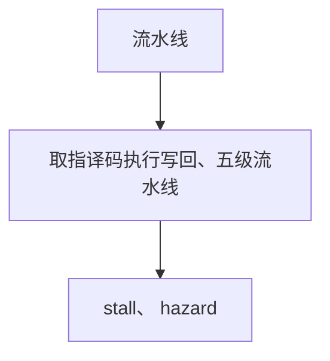

### 13.4 分支预测

**核心概念**：BTB、两级自适应。

**细节**：mispredict penalty。

| 面试题 | 参考答案要点 |
|--------|--------------|
| 什么是分支预测？ | BTB、两级自适应 |
| LLM 相关？ | mispredict penalty；GPU 侧见 LLMInfra 03 |

```cpp
// 分支预测 微基准或测量思路
void bench_分支预测() {
    // 使用 chrono / perf 验证 mispredict penalty
}
```

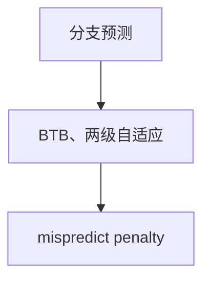

### 13.5 Cache 层级实测

**核心概念**：L1/L2/L3 latency。

**细节**：perf mem latency。

| 面试题 | 参考答案要点 |
|--------|--------------|
| 什么是Cache 层级实测？ | L1/L2/L3 latency |
| LLM 相关？ | perf mem latency；GPU 侧见 LLMInfra 03 |

```cpp
// Cache 层级实测 微基准或测量思路
void bench_Cache_层级实测() {
    // 使用 chrono / perf 验证 perf mem latency
}
```

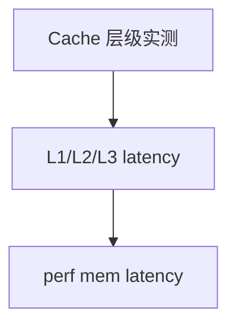

### 13.6 MESI

**核心概念**：Modified/Exclusive/Shared/Invalid。

**细节**：false sharing。

| 面试题 | 参考答案要点 |
|--------|--------------|
| 什么是MESI？ | Modified/Exclusive/Shared/Invalid |
| LLM 相关？ | false sharing；GPU 侧见 LLMInfra 03 |

```cpp
// MESI 微基准或测量思路
void bench_MESI() {
    // 使用 chrono / perf 验证 false sharing
}
```

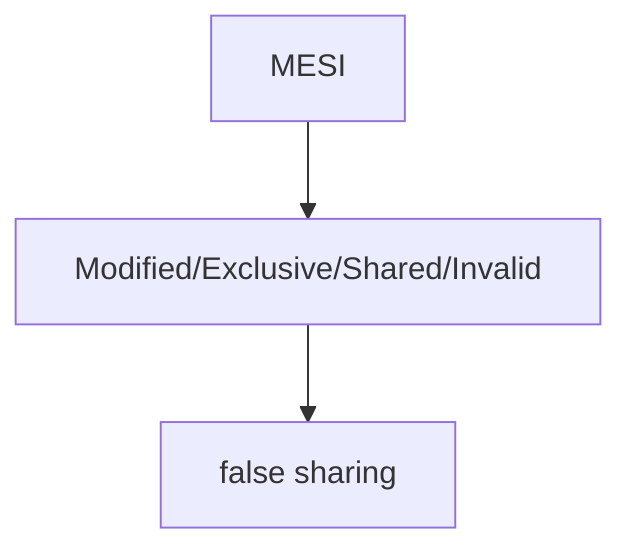

### 13.7 NUMA

**核心概念**：socket、本地/远端内存。

**细节**：numactl。

| 面试题 | 参考答案要点 |
|--------|--------------|
| 什么是NUMA？ | socket、本地/远端内存 |
| LLM 相关？ | numactl；GPU 侧见 LLMInfra 03 |

```cpp
// NUMA 微基准或测量思路
void bench_NUMA() {
    // 使用 chrono / perf 验证 numactl
}
```

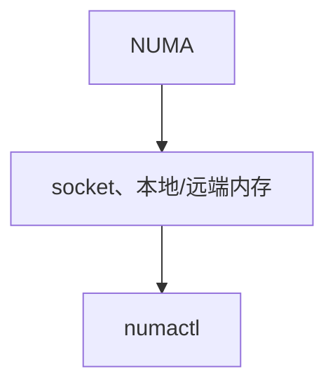

### 13.8 SIMD/AVX

**核心概念**：128/256/512 bit 向量。

**细节**：AVX2 FMA。

| 面试题 | 参考答案要点 |
|--------|--------------|
| 什么是SIMD/AVX？ | 128/256/512 bit 向量 |
| LLM 相关？ | AVX2 FMA；GPU 侧见 LLMInfra 03 |

```cpp
// SIMD/AVX 微基准或测量思路
void bench_SIMD_AVX() {
    // 使用 chrono / perf 验证 AVX2 FMA
}
```

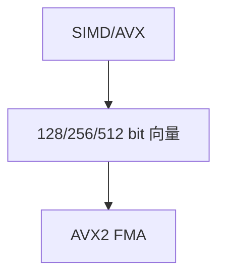

### 13.9 Prefetch

**核心概念**：硬件/软件预取。

**细节**：_mm_prefetch。

| 面试题 | 参考答案要点 |
|--------|--------------|
| 什么是Prefetch？ | 硬件/软件预取 |
| LLM 相关？ | _mm_prefetch；GPU 侧见 LLMInfra 03 |

```cpp
// Prefetch 微基准或测量思路
void bench_Prefetch() {
    // 使用 chrono / perf 验证 _mm_prefetch
}
```

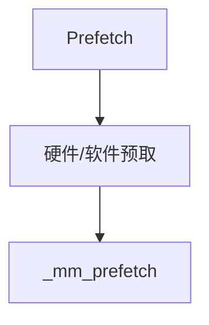

### 13.10 内存墙

**核心概念**：算力增速>带宽。

**细节**：Roofline。

| 面试题 | 参考答案要点 |
|--------|--------------|
| 什么是内存墙？ | 算力增速>带宽 |
| LLM 相关？ | Roofline；GPU 侧见 LLMInfra 03 |

```cpp
// 内存墙 微基准或测量思路
void bench_内存墙() {
    // 使用 chrono / perf 验证 Roofline
}
```

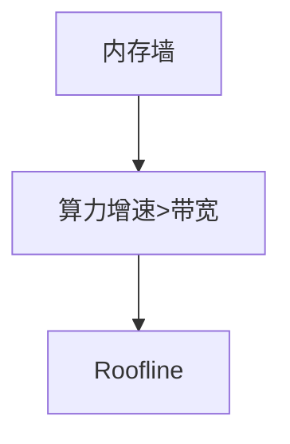

### 13.11 与 70 章互补

| 21 章导读 | 70 章深入 |
|-----------|-----------|
| 数量级、面试 30 秒答 | 公式、实验、论文级 |
| CPU/GPU 分工直觉 | Cache 模拟、Roofline 推导 |

### 13.12 深度 FAQ

**Q：为何 Attention 带宽 bound？** 算术强度低，HBM 成瓶颈。

**Q：SMT 对 LLM CPU 调度有用吗？** IO 线程可共享核；计算 worker 常绑物理核。

### 13.13 练习题

**练习 A**：口述存储层次 latency 数量级。
**练习 B**：画 MESI 状态转移。
**练习 C**：解释 FlashAttention 如何缓解内存墙。

#### 13.14.1 面试追问 #1

**追问**：若 L2 cache 失效，对 decode 延迟影响？

**答**：一次 miss 约数十~数百 cycle；decode 小 batch 时 KV 访问随机性高，miss 率上升；Continuous batching 提高顺序性。

| 指标 | 典型值 |
|------|--------|
| 问题 #1 关联 | cache/NUMA/SIMD 之一 |

#### 13.14.2 面试追问 #2

**追问**：若 L3 cache 失效，对 decode 延迟影响？

**答**：一次 miss 约数十~数百 cycle；decode 小 batch 时 KV 访问随机性高，miss 率上升；Continuous batching 提高顺序性。

| 指标 | 典型值 |
|------|--------|
| 问题 #2 关联 | cache/NUMA/SIMD 之一 |

#### 13.14.3 面试追问 #3

**追问**：若 L1 cache 失效，对 decode 延迟影响？

**答**：一次 miss 约数十~数百 cycle；decode 小 batch 时 KV 访问随机性高，miss 率上升；Continuous batching 提高顺序性。

| 指标 | 典型值 |
|------|--------|
| 问题 #3 关联 | cache/NUMA/SIMD 之一 |

#### 13.14.4 面试追问 #4

**追问**：若 L2 cache 失效，对 decode 延迟影响？

**答**：一次 miss 约数十~数百 cycle；decode 小 batch 时 KV 访问随机性高，miss 率上升；Continuous batching 提高顺序性。

| 指标 | 典型值 |
|------|--------|
| 问题 #4 关联 | cache/NUMA/SIMD 之一 |

#### 13.14.5 面试追问 #5

**追问**：若 L3 cache 失效，对 decode 延迟影响？

**答**：一次 miss 约数十~数百 cycle；decode 小 batch 时 KV 访问随机性高，miss 率上升；Continuous batching 提高顺序性。

| 指标 | 典型值 |
|------|--------|
| 问题 #5 关联 | cache/NUMA/SIMD 之一 |

#### 13.14.6 面试追问 #6

**追问**：若 L1 cache 失效，对 decode 延迟影响？

**答**：一次 miss 约数十~数百 cycle；decode 小 batch 时 KV 访问随机性高，miss 率上升；Continuous batching 提高顺序性。

| 指标 | 典型值 |
|------|--------|
| 问题 #6 关联 | cache/NUMA/SIMD 之一 |

#### 13.14.7 面试追问 #7

**追问**：若 L2 cache 失效，对 decode 延迟影响？

**答**：一次 miss 约数十~数百 cycle；decode 小 batch 时 KV 访问随机性高，miss 率上升；Continuous batching 提高顺序性。

| 指标 | 典型值 |
|------|--------|
| 问题 #7 关联 | cache/NUMA/SIMD 之一 |

#### 13.14.8 面试追问 #8

**追问**：若 L3 cache 失效，对 decode 延迟影响？

**答**：一次 miss 约数十~数百 cycle；decode 小 batch 时 KV 访问随机性高，miss 率上升；Continuous batching 提高顺序性。

| 指标 | 典型值 |
|------|--------|
| 问题 #8 关联 | cache/NUMA/SIMD 之一 |

#### 13.14.9 面试追问 #9

**追问**：若 L1 cache 失效，对 decode 延迟影响？

**答**：一次 miss 约数十~数百 cycle；decode 小 batch 时 KV 访问随机性高，miss 率上升；Continuous batching 提高顺序性。

| 指标 | 典型值 |
|------|--------|
| 问题 #9 关联 | cache/NUMA/SIMD 之一 |

#### 13.14.10 面试追问 #10

**追问**：若 L2 cache 失效，对 decode 延迟影响？

**答**：一次 miss 约数十~数百 cycle；decode 小 batch 时 KV 访问随机性高，miss 率上升；Continuous batching 提高顺序性。

| 指标 | 典型值 |
|------|--------|
| 问题 #10 关联 | cache/NUMA/SIMD 之一 |

#### 13.14.11 面试追问 #11

**追问**：若 L3 cache 失效，对 decode 延迟影响？

**答**：一次 miss 约数十~数百 cycle；decode 小 batch 时 KV 访问随机性高，miss 率上升；Continuous batching 提高顺序性。

| 指标 | 典型值 |
|------|--------|
| 问题 #11 关联 | cache/NUMA/SIMD 之一 |

#### 13.14.12 面试追问 #12

**追问**：若 L1 cache 失效，对 decode 延迟影响？

**答**：一次 miss 约数十~数百 cycle；decode 小 batch 时 KV 访问随机性高，miss 率上升；Continuous batching 提高顺序性。

| 指标 | 典型值 |
|------|--------|
| 问题 #12 关联 | cache/NUMA/SIMD 之一 |

#### 13.14.13 面试追问 #13

**追问**：若 L2 cache 失效，对 decode 延迟影响？

**答**：一次 miss 约数十~数百 cycle；decode 小 batch 时 KV 访问随机性高，miss 率上升；Continuous batching 提高顺序性。

| 指标 | 典型值 |
|------|--------|
| 问题 #13 关联 | cache/NUMA/SIMD 之一 |

#### 13.14.14 面试追问 #14

**追问**：若 L3 cache 失效，对 decode 延迟影响？

**答**：一次 miss 约数十~数百 cycle；decode 小 batch 时 KV 访问随机性高，miss 率上升；Continuous batching 提高顺序性。

| 指标 | 典型值 |
|------|--------|
| 问题 #14 关联 | cache/NUMA/SIMD 之一 |

#### 13.14.15 面试追问 #15

**追问**：若 L1 cache 失效，对 decode 延迟影响？

**答**：一次 miss 约数十~数百 cycle；decode 小 batch 时 KV 访问随机性高，miss 率上升；Continuous batching 提高顺序性。

| 指标 | 典型值 |
|------|--------|
| 问题 #15 关联 | cache/NUMA/SIMD 之一 |

#### 13.14.16 面试追问 #16

**追问**：若 L2 cache 失效，对 decode 延迟影响？

**答**：一次 miss 约数十~数百 cycle；decode 小 batch 时 KV 访问随机性高，miss 率上升；Continuous batching 提高顺序性。

| 指标 | 典型值 |
|------|--------|
| 问题 #16 关联 | cache/NUMA/SIMD 之一 |

#### 13.14.17 面试追问 #17

**追问**：若 L3 cache 失效，对 decode 延迟影响？

**答**：一次 miss 约数十~数百 cycle；decode 小 batch 时 KV 访问随机性高，miss 率上升；Continuous batching 提高顺序性。

| 指标 | 典型值 |
|------|--------|
| 问题 #17 关联 | cache/NUMA/SIMD 之一 |

#### 13.14.18 面试追问 #18

**追问**：若 L1 cache 失效，对 decode 延迟影响？

**答**：一次 miss 约数十~数百 cycle；decode 小 batch 时 KV 访问随机性高，miss 率上升；Continuous batching 提高顺序性。

| 指标 | 典型值 |
|------|--------|
| 问题 #18 关联 | cache/NUMA/SIMD 之一 |

#### 13.14.19 面试追问 #19

**追问**：若 L2 cache 失效，对 decode 延迟影响？

**答**：一次 miss 约数十~数百 cycle；decode 小 batch 时 KV 访问随机性高，miss 率上升；Continuous batching 提高顺序性。

| 指标 | 典型值 |
|------|--------|
| 问题 #19 关联 | cache/NUMA/SIMD 之一 |

#### 13.14.20 面试追问 #20

**追问**：若 L3 cache 失效，对 decode 延迟影响？

**答**：一次 miss 约数十~数百 cycle；decode 小 batch 时 KV 访问随机性高，miss 率上升；Continuous batching 提高顺序性。

| 指标 | 典型值 |
|------|--------|
| 问题 #20 关联 | cache/NUMA/SIMD 之一 |

#### 13.14.21 面试追问 #21

**追问**：若 L1 cache 失效，对 decode 延迟影响？

**答**：一次 miss 约数十~数百 cycle；decode 小 batch 时 KV 访问随机性高，miss 率上升；Continuous batching 提高顺序性。

| 指标 | 典型值 |
|------|--------|
| 问题 #21 关联 | cache/NUMA/SIMD 之一 |

#### 13.14.22 面试追问 #22

**追问**：若 L2 cache 失效，对 decode 延迟影响？

**答**：一次 miss 约数十~数百 cycle；decode 小 batch 时 KV 访问随机性高，miss 率上升；Continuous batching 提高顺序性。

| 指标 | 典型值 |
|------|--------|
| 问题 #22 关联 | cache/NUMA/SIMD 之一 |

#### 13.14.23 面试追问 #23

**追问**：若 L3 cache 失效，对 decode 延迟影响？

**答**：一次 miss 约数十~数百 cycle；decode 小 batch 时 KV 访问随机性高，miss 率上升；Continuous batching 提高顺序性。

| 指标 | 典型值 |
|------|--------|
| 问题 #23 关联 | cache/NUMA/SIMD 之一 |

#### 13.14.24 面试追问 #24

**追问**：若 L1 cache 失效，对 decode 延迟影响？

**答**：一次 miss 约数十~数百 cycle；decode 小 batch 时 KV 访问随机性高，miss 率上升；Continuous batching 提高顺序性。

| 指标 | 典型值 |
|------|--------|
| 问题 #24 关联 | cache/NUMA/SIMD 之一 |

#### 13.14.25 面试追问 #25

**追问**：若 L2 cache 失效，对 decode 延迟影响？

**答**：一次 miss 约数十~数百 cycle；decode 小 batch 时 KV 访问随机性高，miss 率上升；Continuous batching 提高顺序性。

| 指标 | 典型值 |
|------|--------|
| 问题 #25 关联 | cache/NUMA/SIMD 之一 |

#### 13.14.26 面试追问 #26

**追问**：若 L3 cache 失效，对 decode 延迟影响？

**答**：一次 miss 约数十~数百 cycle；decode 小 batch 时 KV 访问随机性高，miss 率上升；Continuous batching 提高顺序性。

| 指标 | 典型值 |
|------|--------|
| 问题 #26 关联 | cache/NUMA/SIMD 之一 |

#### 13.14.27 面试追问 #27

**追问**：若 L1 cache 失效，对 decode 延迟影响？

**答**：一次 miss 约数十~数百 cycle；decode 小 batch 时 KV 访问随机性高，miss 率上升；Continuous batching 提高顺序性。

| 指标 | 典型值 |
|------|--------|
| 问题 #27 关联 | cache/NUMA/SIMD 之一 |

#### 13.14.28 面试追问 #28

**追问**：若 L2 cache 失效，对 decode 延迟影响？

**答**：一次 miss 约数十~数百 cycle；decode 小 batch 时 KV 访问随机性高，miss 率上升；Continuous batching 提高顺序性。

| 指标 | 典型值 |
|------|--------|
| 问题 #28 关联 | cache/NUMA/SIMD 之一 |

#### 13.14.29 面试追问 #29

**追问**：若 L3 cache 失效，对 decode 延迟影响？

**答**：一次 miss 约数十~数百 cycle；decode 小 batch 时 KV 访问随机性高，miss 率上升；Continuous batching 提高顺序性。

| 指标 | 典型值 |
|------|--------|
| 问题 #29 关联 | cache/NUMA/SIMD 之一 |

#### 13.14.30 面试追问 #30

**追问**：若 L1 cache 失效，对 decode 延迟影响？

**答**：一次 miss 约数十~数百 cycle；decode 小 batch 时 KV 访问随机性高，miss 率上升；Continuous batching 提高顺序性。

| 指标 | 典型值 |
|------|--------|
| 问题 #30 关联 | cache/NUMA/SIMD 之一 |

#### 13.14.31 面试追问 #31

**追问**：若 L2 cache 失效，对 decode 延迟影响？

**答**：一次 miss 约数十~数百 cycle；decode 小 batch 时 KV 访问随机性高，miss 率上升；Continuous batching 提高顺序性。

| 指标 | 典型值 |
|------|--------|
| 问题 #31 关联 | cache/NUMA/SIMD 之一 |

#### 13.14.32 面试追问 #32

**追问**：若 L3 cache 失效，对 decode 延迟影响？

**答**：一次 miss 约数十~数百 cycle；decode 小 batch 时 KV 访问随机性高，miss 率上升；Continuous batching 提高顺序性。

| 指标 | 典型值 |
|------|--------|
| 问题 #32 关联 | cache/NUMA/SIMD 之一 |

#### 13.14.33 面试追问 #33

**追问**：若 L1 cache 失效，对 decode 延迟影响？

**答**：一次 miss 约数十~数百 cycle；decode 小 batch 时 KV 访问随机性高，miss 率上升；Continuous batching 提高顺序性。

| 指标 | 典型值 |
|------|--------|
| 问题 #33 关联 | cache/NUMA/SIMD 之一 |

#### 13.14.34 面试追问 #34

**追问**：若 L2 cache 失效，对 decode 延迟影响？

**答**：一次 miss 约数十~数百 cycle；decode 小 batch 时 KV 访问随机性高，miss 率上升；Continuous batching 提高顺序性。

| 指标 | 典型值 |
|------|--------|
| 问题 #34 关联 | cache/NUMA/SIMD 之一 |

#### 13.14.35 面试追问 #35

**追问**：若 L3 cache 失效，对 decode 延迟影响？

**答**：一次 miss 约数十~数百 cycle；decode 小 batch 时 KV 访问随机性高，miss 率上升；Continuous batching 提高顺序性。

| 指标 | 典型值 |
|------|--------|
| 问题 #35 关联 | cache/NUMA/SIMD 之一 |

#### 13.14.36 面试追问 #36

**追问**：若 L1 cache 失效，对 decode 延迟影响？

**答**：一次 miss 约数十~数百 cycle；decode 小 batch 时 KV 访问随机性高，miss 率上升；Continuous batching 提高顺序性。

| 指标 | 典型值 |
|------|--------|
| 问题 #36 关联 | cache/NUMA/SIMD 之一 |

#### 13.14.37 面试追问 #37

**追问**：若 L2 cache 失效，对 decode 延迟影响？

**答**：一次 miss 约数十~数百 cycle；decode 小 batch 时 KV 访问随机性高，miss 率上升；Continuous batching 提高顺序性。

| 指标 | 典型值 |
|------|--------|
| 问题 #37 关联 | cache/NUMA/SIMD 之一 |

#### 13.14.38 面试追问 #38

**追问**：若 L3 cache 失效，对 decode 延迟影响？

**答**：一次 miss 约数十~数百 cycle；decode 小 batch 时 KV 访问随机性高，miss 率上升；Continuous batching 提高顺序性。

| 指标 | 典型值 |
|------|--------|
| 问题 #38 关联 | cache/NUMA/SIMD 之一 |

#### 13.14.39 面试追问 #39

**追问**：若 L1 cache 失效，对 decode 延迟影响？

**答**：一次 miss 约数十~数百 cycle；decode 小 batch 时 KV 访问随机性高，miss 率上升；Continuous batching 提高顺序性。

| 指标 | 典型值 |
|------|--------|
| 问题 #39 关联 | cache/NUMA/SIMD 之一 |

#### 13.14.40 面试追问 #40

**追问**：若 L2 cache 失效，对 decode 延迟影响？

**答**：一次 miss 约数十~数百 cycle；decode 小 batch 时 KV 访问随机性高，miss 率上升；Continuous batching 提高顺序性。

| 指标 | 典型值 |
|------|--------|
| 问题 #40 关联 | cache/NUMA/SIMD 之一 |


---

## Primer Plus 进阶续篇

### 14.1 进阶专题：寄存器文件

**概念**：rename。**实践**：乱序执行。

```cpp
// 寄存器文件 — 示例 #1
namespace infra_22_1 {
struct Demo {
    int id = 1;
    void run() {
        // 乱序执行
    }
};
} // namespace
```

| 要点 | 说明 |
|------|------|
| 原理 | rename |
| 工程 | 乱序执行 |
| 面试 | 能口述 寄存器文件 在 LLM Infra 中的作用 |

**FAQ #1**：寄存器文件 与相邻章节如何衔接？→ 见交叉阅读链接与 §0.3 知识地图。

**练习 #1**：实现 `寄存器文件` 最小 demo 并写 3 行 benchmark 结论。


### 14.2 进阶专题：TLB miss

**概念**：页表。**实践**：大页 hugepage。

```cpp
// TLB miss — 示例 #2
namespace infra_22_2 {
struct Demo {
    int id = 2;
    void run() {
        // 大页 hugepage
    }
};
} // namespace
```

| 要点 | 说明 |
|------|------|
| 原理 | 页表 |
| 工程 | 大页 hugepage |
| 面试 | 能口述 TLB miss 在 LLM Infra 中的作用 |

**FAQ #2**：TLB miss 与相邻章节如何衔接？→ 见交叉阅读链接与 §0.3 知识地图。

**练习 #2**：实现 `TLB miss` 最小 demo 并写 3 行 benchmark 结论。


### 14.3 进阶专题：Write-back

**概念**：Write-through。**实践**：cache 策略。

```cpp
// Write-back — 示例 #3
namespace infra_22_3 {
struct Demo {
    int id = 3;
    void run() {
        // cache 策略
    }
};
} // namespace
```

| 要点 | 说明 |
|------|------|
| 原理 | Write-through |
| 工程 | cache 策略 |
| 面试 | 能口述 Write-back 在 LLM Infra 中的作用 |

**FAQ #3**：Write-back 与相邻章节如何衔接？→ 见交叉阅读链接与 §0.3 知识地图。

**练习 #3**：实现 `Write-back` 最小 demo 并写 3 行 benchmark 结论。


### 14.4 进阶专题：Store buffer

**概念**：memory order。**实践**：可见性。

```cpp
// Store buffer — 示例 #4
namespace infra_22_4 {
struct Demo {
    int id = 4;
    void run() {
        // 可见性
    }
};
} // namespace
```

| 要点 | 说明 |
|------|------|
| 原理 | memory order |
| 工程 | 可见性 |
| 面试 | 能口述 Store buffer 在 LLM Infra 中的作用 |

**FAQ #4**：Store buffer 与相邻章节如何衔接？→ 见交叉阅读链接与 §0.3 知识地图。

**练习 #4**：实现 `Store buffer` 最小 demo 并写 3 行 benchmark 结论。


### 14.5 进阶专题：Roofline 计算

**概念**：AI 公式。**实践**：GEMM bound。

```cpp
// Roofline 计算 — 示例 #5
namespace infra_22_5 {
struct Demo {
    int id = 5;
    void run() {
        // GEMM bound
    }
};
} // namespace
```

| 要点 | 说明 |
|------|------|
| 原理 | AI 公式 |
| 工程 | GEMM bound |
| 面试 | 能口述 Roofline 计算 在 LLM Infra 中的作用 |

**FAQ #5**：Roofline 计算 与相邻章节如何衔接？→ 见交叉阅读链接与 §0.3 知识地图。

**练习 #5**：实现 `Roofline 计算` 最小 demo 并写 3 行 benchmark 结论。


### 14.6 进阶专题：GPU warp divergence

**概念**：分支。**实践**：SIMT。

```cpp
// GPU warp divergence — 示例 #6
namespace infra_22_6 {
struct Demo {
    int id = 6;
    void run() {
        // SIMT
    }
};
} // namespace
```

| 要点 | 说明 |
|------|------|
| 原理 | 分支 |
| 工程 | SIMT |
| 面试 | 能口述 GPU warp divergence 在 LLM Infra 中的作用 |

**FAQ #6**：GPU warp divergence 与相邻章节如何衔接？→ 见交叉阅读链接与 §0.3 知识地图。

**练习 #6**：实现 `GPU warp divergence` 最小 demo 并写 3 行 benchmark 结论。


### 14.7 进阶专题：PCIe Gen

**概念**：带宽表。**实践**：H2D。

```cpp
// PCIe Gen — 示例 #7
namespace infra_22_7 {
struct Demo {
    int id = 7;
    void run() {
        // H2D
    }
};
} // namespace
```

| 要点 | 说明 |
|------|------|
| 原理 | 带宽表 |
| 工程 | H2D |
| 面试 | 能口述 PCIe Gen 在 LLM Infra 中的作用 |

**FAQ #7**：PCIe Gen 与相邻章节如何衔接？→ 见交叉阅读链接与 §0.3 知识地图。

**练习 #7**：实现 `PCIe Gen` 最小 demo 并写 3 行 benchmark 结论。


### 14.8 进阶专题：INT8 TensorCore

**概念**：算力倍率。**实践**：量化。

```cpp
// INT8 TensorCore — 示例 #8
namespace infra_22_8 {
struct Demo {
    int id = 8;
    void run() {
        // 量化
    }
};
} // namespace
```

| 要点 | 说明 |
|------|------|
| 原理 | 算力倍率 |
| 工程 | 量化 |
| 面试 | 能口述 INT8 TensorCore 在 LLM Infra 中的作用 |

**FAQ #8**：INT8 TensorCore 与相邻章节如何衔接？→ 见交叉阅读链接与 §0.3 知识地图。

**练习 #8**：实现 `INT8 TensorCore` 最小 demo 并写 3 行 benchmark 结论。


## 下一章预告

Serving 的 CPU 侧常卡在 **IO 多路复用**。23 章 [IO 多路复用与高性能 Server](23-IO多路复用与高性能Server.md) 讲 epoll、io_uring 与 Boost.Asio，对接 [LLMInfra 16](../LLMInfra/16-推理服务化Batch调度与Continuous-Batching.md)。

---

*下一章：23 IO 多路复用与高性能 Server*
