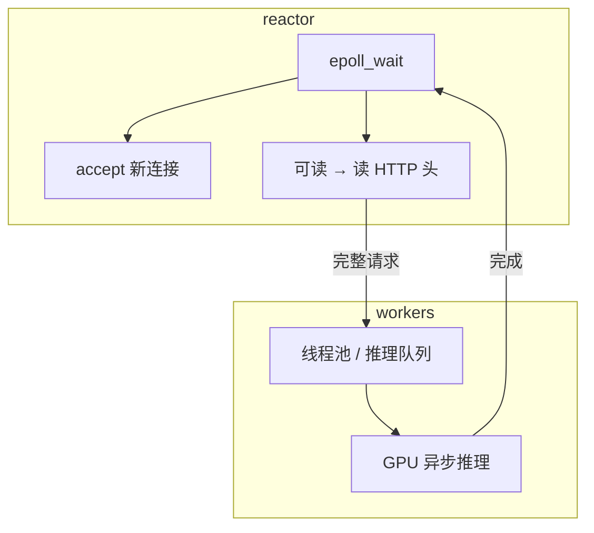
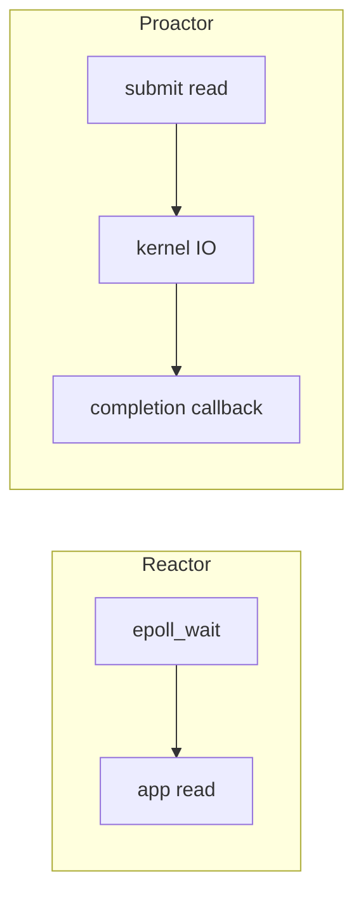

# IO 多路复用与高性能 Server

> **文件编码**：UTF-8。  
> **定位**：epoll、io_uring 入门、与 Boost.Asio 对比——LLM Serving **接入层** 的 C++ 高性能 IO。  
> **交叉阅读**：[LLMInfra 16 Batch 调度](../LLMInfra/16-推理服务化Batch调度与Continuous-Batching.md)、[LLMInfra 11 gRPC](../LLMInfra/11-gRPC与高性能RPC服务.md)、[C++ 10 网络编程](10-网络编程与简易HTTP服务.md)、[C++ 08 多线程](08-多线程与并发编程.md)。

---

## 0. 读前导读（零基础也能跟上）

### 0.1 用一句话弄懂本章

**IO 多路复用** = 一个线程监视 **成千上万个 socket** 谁可读/可写——避免「一连接一线程」把内存和调度撑爆；LLM 网关层常用 epoll/Asio，算力仍在 GPU。

### 0.2 你需要提前知道什么

- [10 章](10-网络编程与简易HTTP服务.md) socket、阻塞 accept
- [08 章](08-多线程与并发编程.md) 线程池、条件变量
- [21 章](21-设计模式与Infra工程实践.md) SPSC 队列
- [计网 02 TCP](../../前端学习/计算机网络/02-TCP与UDP.md)（可选）

### 0.3 本章知识地图（☐→☑）

- [ ] 对比 blocking / thread-per-connection / epoll
- [ ] 写 epoll LT 模式 echo server 骨架
- [ ] 解释 io_uring 与 epoll 差异（概念）
- [ ] 说清 Boost.Asio `io_context` 模型
- [ ] 设计 accept 线程 + worker 池架构
- [ ] §17 闭卷自测 ≥8/10

### 0.4 建议学习时长

**5～7 天**（Linux 为主）；Windows 用 IOCP/Asio 对照阅读。

### 0.5 学完你能做什么

改造 mini-http 为 epoll 驱动；理解 nginx/redis 事件模型；为 gRPC 外层搭 HTTP 网关（[19 章](19-gRPC与Protobuf工程化.md)）。

### 0.6 与 LLM Infra 的衔接

| 组件 | IO 模型 |
|------|---------|
| 推理网关 | epoll/Asio 接 HTTP，转发 gRPC |
| 长连接 SSE | 可读事件驱动写回 token |
| 健康探针 | 少量连接，仍宜复用 epoll |
| GPU 推理 | **非阻塞**提交 job，勿在 IO 线程算模型 |

---

## 本章与上一章的关系

[22 章](22-计算机体系结构导读.md) 指出 CPU 应做调度与 IO；本章给出 **具体 IO 机制**。[10 章](10-网络编程与简易HTTP服务.md) 单线程阻塞是起点；本章是 Serving **接入层** 的工业形态。

---

## 1. 这份文档学什么

- select/poll/epoll 演进
- epoll LT/ET、边缘触发注意点
- io_uring 异步 syscall 入门
- Boost.Asio  proactor 模型
- Reactor 线程模型与 LLM 网关架构

---

## 2. 为什么需要多路复用

| 模型 | 连接数 scale | 问题 |
|------|--------------|------|
| 阻塞 + 一线程一连接 | 低 | 线程栈 MB 级、上下文切换 |
| 阻塞 + 线程池 | 中 | accept 后仍占 worker 等 IO |
| **Reactor（epoll）** | 高 | 单/少线程等事件，worker 处理短逻辑 |
| **Proactor（io_uring/Asio）** | 高 | 内核/库完成 IO 再回调 |

LLM 场景：连接数可能上万（流式 chat），**单连接算力极重** 在 GPU——CPU 侧必须轻量接客。

---

## 3. select / poll / epoll

```text
select:  fd_set 位图，O(n) 扫描，有 fd 上限
poll:    pollfd 数组，仍 O(n)
epoll:   内核红黑树 + 就绪链表，O(1) 就绪通知
```

### 3.1 epoll 核心 API

```cpp
#include <sys/epoll.h>
#include <unistd.h>

int epfd = epoll_create1(0);
epoll_event ev{};
ev.events = EPOLLIN;  // 可读，默认 LT（水平触发）
ev.data.fd = listen_fd;
epoll_ctl(epfd, EPOLL_CTL_ADD, listen_fd, &ev);

std::vector<epoll_event> events(128);
while (running) {
    int n = epoll_wait(epfd, events.data(), events.size(), -1);
    for (int i = 0; i < n; ++i) {
        int fd = events[i].data.fd;
        if (fd == listen_fd) {
            // accept 循环直到 EAGAIN
        } else if (events[i].events & EPOLLIN) {
            // read；ET 模式需读到 EAGAIN
        }
    }
}
```

### 3.2 LT vs ET

| 模式 | 行为 | 注意 |
|------|------|------|
| **LT** 水平 | 只要缓冲区有数据就一直通知 | 简单，不易漏读 |
| **ET** 边缘 | 状态变化时通知一次 | 必须 **非阻塞** + 读尽 |

nginx 默认 ET + 非阻塞；初学建议 LT。

### 3.3 与 [10 章 mini-http](10-网络编程与简易HTTP服务.md) 对比

阻塞 `accept` + `recv` → 改非阻塞 fd + `epoll_ctl(ADD)` → 事件循环里 `recv` 直到 EAGAIN。

---

## 4. io_uring 入门（Linux 5.1+）

**思想**：提交 SQE（读/写/accept）到提交队列，内核异步完成，CQE 返回结果——减少 **syscall 次数**。

```cpp
// 概念伪代码（需 liburing）
#include <liburing.h>

io_uring ring;
io_uring_queue_init(256, &ring, 0);

// prep_read / prep_write / submit
// wait_cqe → 处理完成事件
```

| 对比 epoll | io_uring |
|------------|----------|
| 通知「可读」后仍要 `read` syscall | 可 **一次性提交 read**，完成时拿 buffer |
| 成熟、资料多 | 新、磁盘/网络均适用 |
| nginx 传统 | 部分新项目默认 |

LLM **网关**仍以 epoll/Asio 为主；io_uring 适合高 QPS 小 payload 或自定义存储（[LLMInfra 12](../LLMInfra/12-Checkpoint加载与mmap.md) 读盘可研究）。

---

## 5. Boost.Asio

### 5.1 核心对象

```cpp
#include <boost/asio.hpp>
namespace asio = boost::asio;

asio::io_context ioc{1};
asio::ip::tcp::acceptor acceptor{
    ioc, {asio::ip::tcp::v4(), 8080}};

// 异步 accept
void do_accept() {
    acceptor.async_accept(
        [](boost::system::error_code ec, asio::ip::tcp::socket socket) {
            if (!ec) {
                // async_read / 投递到线程池
            }
            do_accept();
        });
}

do_accept();
ioc.run();
```

- **`io_context::run`**：事件循环（可多线程 `run` + strand 保序）
- **异步模型**：回调 / C++20 协程（`co_await`）
- **跨平台**：Linux epoll、Windows IOCP、macOS kqueue

### 5.2 Asio vs 手写 epoll

| | 手写 epoll | Boost.Asio |
|---|------------|------------|
| 控制粒度 | 完全 | 抽象稍厚 |
| 可移植 | Linux 绑死 | 好 |
| 学习曲线 | 需处理全部边界 | 官方示例多 |
| LLM 项目 | 读 nginx/redis | **gRPC 依赖、快速网关** |

[19 章 gRPC](19-gRPC与Protobuf工程化.md) 底层 HTTP/2 自有 IO；**外层 HTTP 健康检查/ SSE** 常用 Asio。

---

## 6. 典型 Server 架构（Reactor + 线程池）



1. **Reactor 线程**：只做 accept、读请求、写回小响应头
2. **业务线程池**：解析 JSON、组 batch（[LLMInfra 16](../LLMInfra/16-推理服务化Batch调度与Continuous-Batching.md)）
3. **GPU 线程/流**：CUDA stream 异步；**禁止**在 epoll 线程里 `cudaDeviceSynchronize`

[21 章 SPSC](21-设计模式与Infra工程实践.md) 连接 IO 线程与 scheduler。

---

## 7. 流式 SSE / gRPC streaming

- **SSE**：长连接 `EPOLLOUT` 可写时 `write` token chunk
- **背压**：写缓冲区满 → 注册 EPOLLOUT；避免 busy loop
- **gRPC streaming**：库内处理 HTTP/2 flow control；应用层仍勿阻塞 IO 线程

---

## 8. 常见坑

| 坑 | 后果 | 修复 |
|----|------|------|
| 阻塞 IO 在 epoll 线程 | 全体卡顿 | `fcntl O_NONBLOCK` |
| ET 未读尽 | 饿死连接 | while read until EAGAIN |
| 在 IO 线程跑推理 | P99 爆炸 | 队列 + GPU worker |
| 忽略 `EINTR` | 偶发错误 | 重试 syscall |
| 无连接上限 | OOM | `max_connections` + 拒绝 |

---

## 9. 与 10 章 mini-http 升级路径

```text
Phase 1  单线程阻塞（10 章）
Phase 2  非阻塞 fd + epoll LT echo
Phase 3  线程池处理 HTTP 解析
Phase 4  连接对象池 + keep-alive
Phase 5  对接 scheduler 队列（LLMInfra 16）
```

代码可放在 `examples/mini-http/` 扩展（见 [examples/README](examples/README.md)）。

---

## 10. 练习

### 练习 1：epoll echo

Linux 下实现 port 9000 echo：非阻塞 listen + epoll LT，支持 ≥100 并发 `telnet`。

### 练习 2：压测对比

`wrk` 或 `ab` 对比阻塞单线程 vs epoll（固定 echo body）。

### 练习 3：Asio HTTP 最小

Boost.Beast（基于 Asio）返回 `200 OK` + plain text，对照 epoll 行数。

### 练习 4：架构图

.draw LLM 网关：Client → epoll HTTP → gRPC → Scheduler → GPU；标线程边界。

---

## 11. FAQ

**Q：LLM 推理还要学 epoll 吗？**  
做 **Serving/网关/自研 API** 要；纯 CUDA 算子岗可浅读，但面试常问。

**Q：io_uring 要替代 epoll 吗？**  
长期趋势之一；当前 **Asio/epoll 仍是主流**。

**Q：和 [19 章 gRPC](19-gRPC与Protobuf工程化.md) 关系？**  
gRPC 处理 RPC；epoll/Asio 处理 **原生 TCP HTTP/WebSocket** 或自研协议。

**Q：Windows 开发怎么办？**  
用 **Boost.Asio**（IOCP）；概念与 epoll 对齐即可。

---

## 12. 学完标准

- [ ] 说清 select/poll/epoll 复杂度差异
- [ ] 写出 epoll 三步：create/ctl/wait
- [ ] 解释 LT/ET 与非阻塞关系
- [ ] 描述 Reactor + 线程池 + GPU 分工
- [ ] 对比 Asio 与手写 epoll 选型
- [ ] 完成至少 1 个 epoll 或 Asio 练习

---

## 13. 闭卷自测

1. 一连接一线程的主要开销是什么？
2. epoll 相对 poll 的核心优势？
3. `epoll_wait` 返回什么？
4. ET 模式为何必须非阻塞读尽？
5. io_uring SQE/CQE 各表示什么？
6. `io_context::run` 做什么？
7. LLM 推理应放在 epoll 线程吗？为什么？
8. SSE 流式写为何关心 EPOLLOUT？
9. Boost.Asio 在 Linux 底层常用什么？
10. LLMInfra 哪章与本章 Serving 架构最相关？

<details>
<summary>自测参考答案</summary>

1. **线程栈内存 + 上下文切换 + 调度开销**。
2. **O(1) 就绪事件**，不需每次扫描全部 fd。
3. **就绪的 epoll_event 数组** 及数量 n。
4. ET 只通知一次；阻塞读 partial → **剩余数据可能永不通知**。
5. **提交队列项（请求）/ 完成队列项（结果）**。
6. 驱动 **异步 IO 事件循环**，调用 completion handler。
7. **不应**；推理耗时长会 **阻塞所有连接**。
8. 内核写缓冲满时需 **可写事件** 再写，避免阻塞。
9. **epoll**（Asio 抽象层选型）。
10. **LLMInfra 16**（Batch 调度与 continuous batching）；**11** gRPC 接口。

</details>

---

---

## Primer Plus 深度扩写：IO 多路复用与高性能 Server 全栈

> 与 [64 章](64-定时器与时间轮延时队列设计.md)、[65 章](65-io_uring与高性能IO选型面试.md) 互补。

### 13.1 select / poll / epoll 详细对比

| API | 数据结构 | 复杂度 | fd 上限 | 触发模式 |
|-----|----------|--------|---------|----------|
| select | fd_set 位图 | O(n) 扫描 | FD_SETSIZE 1024 | LT |
| poll | pollfd[] | O(n) | 无硬上限 | LT |
| epoll | 红黑树+就绪链表 | O(1) 就绪 | 大 | LT/ET |

### 13.2 ET vs LT 深入

**LT**：水平触发，缓冲区有数据则持续通知——编程简单。
**ET**：边缘触发，仅状态变化通知一次——必须非阻塞 + 读/写直到 EAGAIN。

```cpp
// ET read 循环
while (true) {
    ssize_t n = read(fd, buf, sizeof(buf));
    if (n > 0) { /* process */ continue; }
    if (n == 0) { close(fd); break; }
    if (errno == EAGAIN || errno == EWOULDBLOCK) break;
    /* error */ break;
}
```

### 13.3 Reactor / Proactor

| 模式 | 谁读数据 | 代表 |
|------|----------|------|
| Reactor | 应用 read/write | epoll、muduo |
| Proactor | 内核/库完成 IO 后回调 | io_uring、Asio async |



### 13.4 muduo 风格设计要点

- `EventLoop`  one loop per thread
- `Channel` 封装 fd 与回调
- `Poller` 抽象 epoll
- `TcpConnection` 生命周期管理

### 13.5 线程模型

| 模型 | 说明 | LLM 网关 |
|------|------|----------|
| one loop per thread | 每线程独立 EventLoop | accept 与 IO 分离 |
| 线程池 | 阻塞任务 offload | HTTP 解析、JSON |
| 主从 Reactor | 主 accept 分发给子 loop | 高并发 |

### 13.6 惊群（Thundering Herd）

多进程/线程 `accept` 同一 listen fd：内核唤醒全部，仅一个成功。
修复：`SO_REUSEPORT` 每进程独立 listen；或主 accept 分发。

### 13.7 C10K / C100K

- C10K：epoll + 非阻塞 + 状态机
- C100K：SO_REUSEPORT、连接池、内核调优 `somaxconn`/`tcp_tw_reuse`

### 13.8 与 64/65 章互补

| 本章 23 | 64 章 | 65 章 |
|---------|-------|-------|
| epoll/Reactor 接客 | 定时器/时间轮 | io_uring 深入 |

### 13.9 专题 #1：高性能 Server 实践

**主题**：连接管理、缓冲、协议解析片段 #1。

```cpp
// Connection #1: 读缓冲与 keep-alive
class Conn {
    std::vector<char> in_buf_;
    void onReadable() {
        char tmp[4096];
        ssize_t n = read(fd_, tmp, sizeof(tmp));
        if (n > 0) in_buf_.insert(in_buf_.end(), tmp, tmp + n);
    }
};
```

| 坑 | 修复 |
|----|------|
| 半包 #1 | 状态机攒够 Content-Length |

### 13.10 专题 #2：高性能 Server 实践

**主题**：连接管理、缓冲、协议解析片段 #2。

```cpp
// Connection #2: 读缓冲与 keep-alive
class Conn {
    std::vector<char> in_buf_;
    void onReadable() {
        char tmp[4096];
        ssize_t n = read(fd_, tmp, sizeof(tmp));
        if (n > 0) in_buf_.insert(in_buf_.end(), tmp, tmp + n);
    }
};
```

| 坑 | 修复 |
|----|------|
| 半包 #2 | 状态机攒够 Content-Length |

### 13.11 专题 #3：高性能 Server 实践

**主题**：连接管理、缓冲、协议解析片段 #3。

```cpp
// Connection #3: 读缓冲与 keep-alive
class Conn {
    std::vector<char> in_buf_;
    void onReadable() {
        char tmp[4096];
        ssize_t n = read(fd_, tmp, sizeof(tmp));
        if (n > 0) in_buf_.insert(in_buf_.end(), tmp, tmp + n);
    }
};
```

| 坑 | 修复 |
|----|------|
| 半包 #3 | 状态机攒够 Content-Length |

### 13.12 专题 #4：高性能 Server 实践

**主题**：连接管理、缓冲、协议解析片段 #4。

```cpp
// Connection #4: 读缓冲与 keep-alive
class Conn {
    std::vector<char> in_buf_;
    void onReadable() {
        char tmp[4096];
        ssize_t n = read(fd_, tmp, sizeof(tmp));
        if (n > 0) in_buf_.insert(in_buf_.end(), tmp, tmp + n);
    }
};
```

| 坑 | 修复 |
|----|------|
| 半包 #4 | 状态机攒够 Content-Length |

### 13.13 专题 #5：高性能 Server 实践

**主题**：连接管理、缓冲、协议解析片段 #5。

```cpp
// Connection #5: 读缓冲与 keep-alive
class Conn {
    std::vector<char> in_buf_;
    void onReadable() {
        char tmp[4096];
        ssize_t n = read(fd_, tmp, sizeof(tmp));
        if (n > 0) in_buf_.insert(in_buf_.end(), tmp, tmp + n);
    }
};
```

| 坑 | 修复 |
|----|------|
| 半包 #5 | 状态机攒够 Content-Length |

### 13.14 专题 #6：高性能 Server 实践

**主题**：连接管理、缓冲、协议解析片段 #6。

```cpp
// Connection #6: 读缓冲与 keep-alive
class Conn {
    std::vector<char> in_buf_;
    void onReadable() {
        char tmp[4096];
        ssize_t n = read(fd_, tmp, sizeof(tmp));
        if (n > 0) in_buf_.insert(in_buf_.end(), tmp, tmp + n);
    }
};
```

| 坑 | 修复 |
|----|------|
| 半包 #6 | 状态机攒够 Content-Length |

### 13.15 专题 #7：高性能 Server 实践

**主题**：连接管理、缓冲、协议解析片段 #7。

```cpp
// Connection #7: 读缓冲与 keep-alive
class Conn {
    std::vector<char> in_buf_;
    void onReadable() {
        char tmp[4096];
        ssize_t n = read(fd_, tmp, sizeof(tmp));
        if (n > 0) in_buf_.insert(in_buf_.end(), tmp, tmp + n);
    }
};
```

| 坑 | 修复 |
|----|------|
| 半包 #7 | 状态机攒够 Content-Length |

### 13.16 专题 #8：高性能 Server 实践

**主题**：连接管理、缓冲、协议解析片段 #8。

```cpp
// Connection #8: 读缓冲与 keep-alive
class Conn {
    std::vector<char> in_buf_;
    void onReadable() {
        char tmp[4096];
        ssize_t n = read(fd_, tmp, sizeof(tmp));
        if (n > 0) in_buf_.insert(in_buf_.end(), tmp, tmp + n);
    }
};
```

| 坑 | 修复 |
|----|------|
| 半包 #8 | 状态机攒够 Content-Length |

### 13.17 专题 #9：高性能 Server 实践

**主题**：连接管理、缓冲、协议解析片段 #9。

```cpp
// Connection #9: 读缓冲与 keep-alive
class Conn {
    std::vector<char> in_buf_;
    void onReadable() {
        char tmp[4096];
        ssize_t n = read(fd_, tmp, sizeof(tmp));
        if (n > 0) in_buf_.insert(in_buf_.end(), tmp, tmp + n);
    }
};
```

| 坑 | 修复 |
|----|------|
| 半包 #9 | 状态机攒够 Content-Length |

### 13.18 专题 #10：高性能 Server 实践

**主题**：连接管理、缓冲、协议解析片段 #10。

```cpp
// Connection #10: 读缓冲与 keep-alive
class Conn {
    std::vector<char> in_buf_;
    void onReadable() {
        char tmp[4096];
        ssize_t n = read(fd_, tmp, sizeof(tmp));
        if (n > 0) in_buf_.insert(in_buf_.end(), tmp, tmp + n);
    }
};
```

| 坑 | 修复 |
|----|------|
| 半包 #10 | 状态机攒够 Content-Length |

### 13.19 专题 #11：高性能 Server 实践

**主题**：连接管理、缓冲、协议解析片段 #11。

```cpp
// Connection #11: 读缓冲与 keep-alive
class Conn {
    std::vector<char> in_buf_;
    void onReadable() {
        char tmp[4096];
        ssize_t n = read(fd_, tmp, sizeof(tmp));
        if (n > 0) in_buf_.insert(in_buf_.end(), tmp, tmp + n);
    }
};
```

| 坑 | 修复 |
|----|------|
| 半包 #11 | 状态机攒够 Content-Length |

### 13.20 专题 #12：高性能 Server 实践

**主题**：连接管理、缓冲、协议解析片段 #12。

```cpp
// Connection #12: 读缓冲与 keep-alive
class Conn {
    std::vector<char> in_buf_;
    void onReadable() {
        char tmp[4096];
        ssize_t n = read(fd_, tmp, sizeof(tmp));
        if (n > 0) in_buf_.insert(in_buf_.end(), tmp, tmp + n);
    }
};
```

| 坑 | 修复 |
|----|------|
| 半包 #12 | 状态机攒够 Content-Length |

### 13.21 专题 #13：高性能 Server 实践

**主题**：连接管理、缓冲、协议解析片段 #13。

```cpp
// Connection #13: 读缓冲与 keep-alive
class Conn {
    std::vector<char> in_buf_;
    void onReadable() {
        char tmp[4096];
        ssize_t n = read(fd_, tmp, sizeof(tmp));
        if (n > 0) in_buf_.insert(in_buf_.end(), tmp, tmp + n);
    }
};
```

| 坑 | 修复 |
|----|------|
| 半包 #13 | 状态机攒够 Content-Length |

### 13.22 专题 #14：高性能 Server 实践

**主题**：连接管理、缓冲、协议解析片段 #14。

```cpp
// Connection #14: 读缓冲与 keep-alive
class Conn {
    std::vector<char> in_buf_;
    void onReadable() {
        char tmp[4096];
        ssize_t n = read(fd_, tmp, sizeof(tmp));
        if (n > 0) in_buf_.insert(in_buf_.end(), tmp, tmp + n);
    }
};
```

| 坑 | 修复 |
|----|------|
| 半包 #14 | 状态机攒够 Content-Length |

### 13.23 专题 #15：高性能 Server 实践

**主题**：连接管理、缓冲、协议解析片段 #15。

```cpp
// Connection #15: 读缓冲与 keep-alive
class Conn {
    std::vector<char> in_buf_;
    void onReadable() {
        char tmp[4096];
        ssize_t n = read(fd_, tmp, sizeof(tmp));
        if (n > 0) in_buf_.insert(in_buf_.end(), tmp, tmp + n);
    }
};
```

| 坑 | 修复 |
|----|------|
| 半包 #15 | 状态机攒够 Content-Length |

### 13.24 专题 #16：高性能 Server 实践

**主题**：连接管理、缓冲、协议解析片段 #16。

```cpp
// Connection #16: 读缓冲与 keep-alive
class Conn {
    std::vector<char> in_buf_;
    void onReadable() {
        char tmp[4096];
        ssize_t n = read(fd_, tmp, sizeof(tmp));
        if (n > 0) in_buf_.insert(in_buf_.end(), tmp, tmp + n);
    }
};
```

| 坑 | 修复 |
|----|------|
| 半包 #16 | 状态机攒够 Content-Length |

### 13.25 专题 #17：高性能 Server 实践

**主题**：连接管理、缓冲、协议解析片段 #17。

```cpp
// Connection #17: 读缓冲与 keep-alive
class Conn {
    std::vector<char> in_buf_;
    void onReadable() {
        char tmp[4096];
        ssize_t n = read(fd_, tmp, sizeof(tmp));
        if (n > 0) in_buf_.insert(in_buf_.end(), tmp, tmp + n);
    }
};
```

| 坑 | 修复 |
|----|------|
| 半包 #17 | 状态机攒够 Content-Length |

### 13.26 专题 #18：高性能 Server 实践

**主题**：连接管理、缓冲、协议解析片段 #18。

```cpp
// Connection #18: 读缓冲与 keep-alive
class Conn {
    std::vector<char> in_buf_;
    void onReadable() {
        char tmp[4096];
        ssize_t n = read(fd_, tmp, sizeof(tmp));
        if (n > 0) in_buf_.insert(in_buf_.end(), tmp, tmp + n);
    }
};
```

| 坑 | 修复 |
|----|------|
| 半包 #18 | 状态机攒够 Content-Length |

### 13.27 专题 #19：高性能 Server 实践

**主题**：连接管理、缓冲、协议解析片段 #19。

```cpp
// Connection #19: 读缓冲与 keep-alive
class Conn {
    std::vector<char> in_buf_;
    void onReadable() {
        char tmp[4096];
        ssize_t n = read(fd_, tmp, sizeof(tmp));
        if (n > 0) in_buf_.insert(in_buf_.end(), tmp, tmp + n);
    }
};
```

| 坑 | 修复 |
|----|------|
| 半包 #19 | 状态机攒够 Content-Length |

### 13.28 专题 #20：高性能 Server 实践

**主题**：连接管理、缓冲、协议解析片段 #20。

```cpp
// Connection #20: 读缓冲与 keep-alive
class Conn {
    std::vector<char> in_buf_;
    void onReadable() {
        char tmp[4096];
        ssize_t n = read(fd_, tmp, sizeof(tmp));
        if (n > 0) in_buf_.insert(in_buf_.end(), tmp, tmp + n);
    }
};
```

| 坑 | 修复 |
|----|------|
| 半包 #20 | 状态机攒够 Content-Length |

### 13.29 专题 #21：高性能 Server 实践

**主题**：连接管理、缓冲、协议解析片段 #21。

```cpp
// Connection #21: 读缓冲与 keep-alive
class Conn {
    std::vector<char> in_buf_;
    void onReadable() {
        char tmp[4096];
        ssize_t n = read(fd_, tmp, sizeof(tmp));
        if (n > 0) in_buf_.insert(in_buf_.end(), tmp, tmp + n);
    }
};
```

| 坑 | 修复 |
|----|------|
| 半包 #21 | 状态机攒够 Content-Length |

### 13.30 专题 #22：高性能 Server 实践

**主题**：连接管理、缓冲、协议解析片段 #22。

```cpp
// Connection #22: 读缓冲与 keep-alive
class Conn {
    std::vector<char> in_buf_;
    void onReadable() {
        char tmp[4096];
        ssize_t n = read(fd_, tmp, sizeof(tmp));
        if (n > 0) in_buf_.insert(in_buf_.end(), tmp, tmp + n);
    }
};
```

| 坑 | 修复 |
|----|------|
| 半包 #22 | 状态机攒够 Content-Length |

### 13.31 专题 #23：高性能 Server 实践

**主题**：连接管理、缓冲、协议解析片段 #23。

```cpp
// Connection #23: 读缓冲与 keep-alive
class Conn {
    std::vector<char> in_buf_;
    void onReadable() {
        char tmp[4096];
        ssize_t n = read(fd_, tmp, sizeof(tmp));
        if (n > 0) in_buf_.insert(in_buf_.end(), tmp, tmp + n);
    }
};
```

| 坑 | 修复 |
|----|------|
| 半包 #23 | 状态机攒够 Content-Length |

### 13.32 专题 #24：高性能 Server 实践

**主题**：连接管理、缓冲、协议解析片段 #24。

```cpp
// Connection #24: 读缓冲与 keep-alive
class Conn {
    std::vector<char> in_buf_;
    void onReadable() {
        char tmp[4096];
        ssize_t n = read(fd_, tmp, sizeof(tmp));
        if (n > 0) in_buf_.insert(in_buf_.end(), tmp, tmp + n);
    }
};
```

| 坑 | 修复 |
|----|------|
| 半包 #24 | 状态机攒够 Content-Length |

### 13.33 专题 #25：高性能 Server 实践

**主题**：连接管理、缓冲、协议解析片段 #25。

```cpp
// Connection #25: 读缓冲与 keep-alive
class Conn {
    std::vector<char> in_buf_;
    void onReadable() {
        char tmp[4096];
        ssize_t n = read(fd_, tmp, sizeof(tmp));
        if (n > 0) in_buf_.insert(in_buf_.end(), tmp, tmp + n);
    }
};
```

| 坑 | 修复 |
|----|------|
| 半包 #25 | 状态机攒够 Content-Length |

### 13.34 专题 #26：高性能 Server 实践

**主题**：连接管理、缓冲、协议解析片段 #26。

```cpp
// Connection #26: 读缓冲与 keep-alive
class Conn {
    std::vector<char> in_buf_;
    void onReadable() {
        char tmp[4096];
        ssize_t n = read(fd_, tmp, sizeof(tmp));
        if (n > 0) in_buf_.insert(in_buf_.end(), tmp, tmp + n);
    }
};
```

| 坑 | 修复 |
|----|------|
| 半包 #26 | 状态机攒够 Content-Length |

### 13.35 专题 #27：高性能 Server 实践

**主题**：连接管理、缓冲、协议解析片段 #27。

```cpp
// Connection #27: 读缓冲与 keep-alive
class Conn {
    std::vector<char> in_buf_;
    void onReadable() {
        char tmp[4096];
        ssize_t n = read(fd_, tmp, sizeof(tmp));
        if (n > 0) in_buf_.insert(in_buf_.end(), tmp, tmp + n);
    }
};
```

| 坑 | 修复 |
|----|------|
| 半包 #27 | 状态机攒够 Content-Length |

### 13.36 专题 #28：高性能 Server 实践

**主题**：连接管理、缓冲、协议解析片段 #28。

```cpp
// Connection #28: 读缓冲与 keep-alive
class Conn {
    std::vector<char> in_buf_;
    void onReadable() {
        char tmp[4096];
        ssize_t n = read(fd_, tmp, sizeof(tmp));
        if (n > 0) in_buf_.insert(in_buf_.end(), tmp, tmp + n);
    }
};
```

| 坑 | 修复 |
|----|------|
| 半包 #28 | 状态机攒够 Content-Length |

### 13.37 专题 #29：高性能 Server 实践

**主题**：连接管理、缓冲、协议解析片段 #29。

```cpp
// Connection #29: 读缓冲与 keep-alive
class Conn {
    std::vector<char> in_buf_;
    void onReadable() {
        char tmp[4096];
        ssize_t n = read(fd_, tmp, sizeof(tmp));
        if (n > 0) in_buf_.insert(in_buf_.end(), tmp, tmp + n);
    }
};
```

| 坑 | 修复 |
|----|------|
| 半包 #29 | 状态机攒够 Content-Length |

### 13.38 专题 #30：高性能 Server 实践

**主题**：连接管理、缓冲、协议解析片段 #30。

```cpp
// Connection #30: 读缓冲与 keep-alive
class Conn {
    std::vector<char> in_buf_;
    void onReadable() {
        char tmp[4096];
        ssize_t n = read(fd_, tmp, sizeof(tmp));
        if (n > 0) in_buf_.insert(in_buf_.end(), tmp, tmp + n);
    }
};
```

| 坑 | 修复 |
|----|------|
| 半包 #30 | 状态机攒够 Content-Length |

### 13.39 专题 #31：高性能 Server 实践

**主题**：连接管理、缓冲、协议解析片段 #31。

```cpp
// Connection #31: 读缓冲与 keep-alive
class Conn {
    std::vector<char> in_buf_;
    void onReadable() {
        char tmp[4096];
        ssize_t n = read(fd_, tmp, sizeof(tmp));
        if (n > 0) in_buf_.insert(in_buf_.end(), tmp, tmp + n);
    }
};
```

| 坑 | 修复 |
|----|------|
| 半包 #31 | 状态机攒够 Content-Length |

### 13.40 专题 #32：高性能 Server 实践

**主题**：连接管理、缓冲、协议解析片段 #32。

```cpp
// Connection #32: 读缓冲与 keep-alive
class Conn {
    std::vector<char> in_buf_;
    void onReadable() {
        char tmp[4096];
        ssize_t n = read(fd_, tmp, sizeof(tmp));
        if (n > 0) in_buf_.insert(in_buf_.end(), tmp, tmp + n);
    }
};
```

| 坑 | 修复 |
|----|------|
| 半包 #32 | 状态机攒够 Content-Length |

### 13.41 专题 #33：高性能 Server 实践

**主题**：连接管理、缓冲、协议解析片段 #33。

```cpp
// Connection #33: 读缓冲与 keep-alive
class Conn {
    std::vector<char> in_buf_;
    void onReadable() {
        char tmp[4096];
        ssize_t n = read(fd_, tmp, sizeof(tmp));
        if (n > 0) in_buf_.insert(in_buf_.end(), tmp, tmp + n);
    }
};
```

| 坑 | 修复 |
|----|------|
| 半包 #33 | 状态机攒够 Content-Length |

### 13.42 专题 #34：高性能 Server 实践

**主题**：连接管理、缓冲、协议解析片段 #34。

```cpp
// Connection #34: 读缓冲与 keep-alive
class Conn {
    std::vector<char> in_buf_;
    void onReadable() {
        char tmp[4096];
        ssize_t n = read(fd_, tmp, sizeof(tmp));
        if (n > 0) in_buf_.insert(in_buf_.end(), tmp, tmp + n);
    }
};
```

| 坑 | 修复 |
|----|------|
| 半包 #34 | 状态机攒够 Content-Length |

### 13.43 专题 #35：高性能 Server 实践

**主题**：连接管理、缓冲、协议解析片段 #35。

```cpp
// Connection #35: 读缓冲与 keep-alive
class Conn {
    std::vector<char> in_buf_;
    void onReadable() {
        char tmp[4096];
        ssize_t n = read(fd_, tmp, sizeof(tmp));
        if (n > 0) in_buf_.insert(in_buf_.end(), tmp, tmp + n);
    }
};
```

| 坑 | 修复 |
|----|------|
| 半包 #35 | 状态机攒够 Content-Length |

### 13.44 专题 #36：高性能 Server 实践

**主题**：连接管理、缓冲、协议解析片段 #36。

```cpp
// Connection #36: 读缓冲与 keep-alive
class Conn {
    std::vector<char> in_buf_;
    void onReadable() {
        char tmp[4096];
        ssize_t n = read(fd_, tmp, sizeof(tmp));
        if (n > 0) in_buf_.insert(in_buf_.end(), tmp, tmp + n);
    }
};
```

| 坑 | 修复 |
|----|------|
| 半包 #36 | 状态机攒够 Content-Length |

### 13.45 专题 #37：高性能 Server 实践

**主题**：连接管理、缓冲、协议解析片段 #37。

```cpp
// Connection #37: 读缓冲与 keep-alive
class Conn {
    std::vector<char> in_buf_;
    void onReadable() {
        char tmp[4096];
        ssize_t n = read(fd_, tmp, sizeof(tmp));
        if (n > 0) in_buf_.insert(in_buf_.end(), tmp, tmp + n);
    }
};
```

| 坑 | 修复 |
|----|------|
| 半包 #37 | 状态机攒够 Content-Length |

### 13.46 专题 #38：高性能 Server 实践

**主题**：连接管理、缓冲、协议解析片段 #38。

```cpp
// Connection #38: 读缓冲与 keep-alive
class Conn {
    std::vector<char> in_buf_;
    void onReadable() {
        char tmp[4096];
        ssize_t n = read(fd_, tmp, sizeof(tmp));
        if (n > 0) in_buf_.insert(in_buf_.end(), tmp, tmp + n);
    }
};
```

| 坑 | 修复 |
|----|------|
| 半包 #38 | 状态机攒够 Content-Length |

### 13.47 专题 #39：高性能 Server 实践

**主题**：连接管理、缓冲、协议解析片段 #39。

```cpp
// Connection #39: 读缓冲与 keep-alive
class Conn {
    std::vector<char> in_buf_;
    void onReadable() {
        char tmp[4096];
        ssize_t n = read(fd_, tmp, sizeof(tmp));
        if (n > 0) in_buf_.insert(in_buf_.end(), tmp, tmp + n);
    }
};
```

| 坑 | 修复 |
|----|------|
| 半包 #39 | 状态机攒够 Content-Length |

### 13.48 专题 #40：高性能 Server 实践

**主题**：连接管理、缓冲、协议解析片段 #40。

```cpp
// Connection #40: 读缓冲与 keep-alive
class Conn {
    std::vector<char> in_buf_;
    void onReadable() {
        char tmp[4096];
        ssize_t n = read(fd_, tmp, sizeof(tmp));
        if (n > 0) in_buf_.insert(in_buf_.end(), tmp, tmp + n);
    }
};
```

| 坑 | 修复 |
|----|------|
| 半包 #40 | 状态机攒够 Content-Length |

### 13.49 专题 #41：高性能 Server 实践

**主题**：连接管理、缓冲、协议解析片段 #41。

```cpp
// Connection #41: 读缓冲与 keep-alive
class Conn {
    std::vector<char> in_buf_;
    void onReadable() {
        char tmp[4096];
        ssize_t n = read(fd_, tmp, sizeof(tmp));
        if (n > 0) in_buf_.insert(in_buf_.end(), tmp, tmp + n);
    }
};
```

| 坑 | 修复 |
|----|------|
| 半包 #41 | 状态机攒够 Content-Length |

### 13.50 专题 #42：高性能 Server 实践

**主题**：连接管理、缓冲、协议解析片段 #42。

```cpp
// Connection #42: 读缓冲与 keep-alive
class Conn {
    std::vector<char> in_buf_;
    void onReadable() {
        char tmp[4096];
        ssize_t n = read(fd_, tmp, sizeof(tmp));
        if (n > 0) in_buf_.insert(in_buf_.end(), tmp, tmp + n);
    }
};
```

| 坑 | 修复 |
|----|------|
| 半包 #42 | 状态机攒够 Content-Length |

### 13.51 专题 #43：高性能 Server 实践

**主题**：连接管理、缓冲、协议解析片段 #43。

```cpp
// Connection #43: 读缓冲与 keep-alive
class Conn {
    std::vector<char> in_buf_;
    void onReadable() {
        char tmp[4096];
        ssize_t n = read(fd_, tmp, sizeof(tmp));
        if (n > 0) in_buf_.insert(in_buf_.end(), tmp, tmp + n);
    }
};
```

| 坑 | 修复 |
|----|------|
| 半包 #43 | 状态机攒够 Content-Length |

### 13.52 专题 #44：高性能 Server 实践

**主题**：连接管理、缓冲、协议解析片段 #44。

```cpp
// Connection #44: 读缓冲与 keep-alive
class Conn {
    std::vector<char> in_buf_;
    void onReadable() {
        char tmp[4096];
        ssize_t n = read(fd_, tmp, sizeof(tmp));
        if (n > 0) in_buf_.insert(in_buf_.end(), tmp, tmp + n);
    }
};
```

| 坑 | 修复 |
|----|------|
| 半包 #44 | 状态机攒够 Content-Length |

### 13.53 专题 #45：高性能 Server 实践

**主题**：连接管理、缓冲、协议解析片段 #45。

```cpp
// Connection #45: 读缓冲与 keep-alive
class Conn {
    std::vector<char> in_buf_;
    void onReadable() {
        char tmp[4096];
        ssize_t n = read(fd_, tmp, sizeof(tmp));
        if (n > 0) in_buf_.insert(in_buf_.end(), tmp, tmp + n);
    }
};
```

| 坑 | 修复 |
|----|------|
| 半包 #45 | 状态机攒够 Content-Length |

### 13.54 专题 #46：高性能 Server 实践

**主题**：连接管理、缓冲、协议解析片段 #46。

```cpp
// Connection #46: 读缓冲与 keep-alive
class Conn {
    std::vector<char> in_buf_;
    void onReadable() {
        char tmp[4096];
        ssize_t n = read(fd_, tmp, sizeof(tmp));
        if (n > 0) in_buf_.insert(in_buf_.end(), tmp, tmp + n);
    }
};
```

| 坑 | 修复 |
|----|------|
| 半包 #46 | 状态机攒够 Content-Length |

### 13.55 专题 #47：高性能 Server 实践

**主题**：连接管理、缓冲、协议解析片段 #47。

```cpp
// Connection #47: 读缓冲与 keep-alive
class Conn {
    std::vector<char> in_buf_;
    void onReadable() {
        char tmp[4096];
        ssize_t n = read(fd_, tmp, sizeof(tmp));
        if (n > 0) in_buf_.insert(in_buf_.end(), tmp, tmp + n);
    }
};
```

| 坑 | 修复 |
|----|------|
| 半包 #47 | 状态机攒够 Content-Length |

### 13.56 专题 #48：高性能 Server 实践

**主题**：连接管理、缓冲、协议解析片段 #48。

```cpp
// Connection #48: 读缓冲与 keep-alive
class Conn {
    std::vector<char> in_buf_;
    void onReadable() {
        char tmp[4096];
        ssize_t n = read(fd_, tmp, sizeof(tmp));
        if (n > 0) in_buf_.insert(in_buf_.end(), tmp, tmp + n);
    }
};
```

| 坑 | 修复 |
|----|------|
| 半包 #48 | 状态机攒够 Content-Length |

### 13.57 专题 #49：高性能 Server 实践

**主题**：连接管理、缓冲、协议解析片段 #49。

```cpp
// Connection #49: 读缓冲与 keep-alive
class Conn {
    std::vector<char> in_buf_;
    void onReadable() {
        char tmp[4096];
        ssize_t n = read(fd_, tmp, sizeof(tmp));
        if (n > 0) in_buf_.insert(in_buf_.end(), tmp, tmp + n);
    }
};
```

| 坑 | 修复 |
|----|------|
| 半包 #49 | 状态机攒够 Content-Length |

### 13.58 专题 #50：高性能 Server 实践

**主题**：连接管理、缓冲、协议解析片段 #50。

```cpp
// Connection #50: 读缓冲与 keep-alive
class Conn {
    std::vector<char> in_buf_;
    void onReadable() {
        char tmp[4096];
        ssize_t n = read(fd_, tmp, sizeof(tmp));
        if (n > 0) in_buf_.insert(in_buf_.end(), tmp, tmp + n);
    }
};
```

| 坑 | 修复 |
|----|------|
| 半包 #50 | 状态机攒够 Content-Length |

### 13.60 FAQ 与练习

**练习 A**：LT echo server 100 并发。
**练习 B**：ET 版对比 LT QPS。
**练习 C**：画 LLM 网关线程边界图。


## 15. C++ LLM Infra 扩展轨总结

```text
18 内存对齐 / 零拷贝
19 gRPC 进程间接口
20 pybind 进程内 Python
21 设计模式组织引擎
22 体系结构理解瓶颈
23 IO 多路复用接客  ← 你在这里
```

继续深入 [LLMInfra 14～19](../LLMInfra/00-学习路线图与说明.md) 项目实战与引擎源码。

---

*扩展轨完结 · 进入 LLMInfra 项目章*
