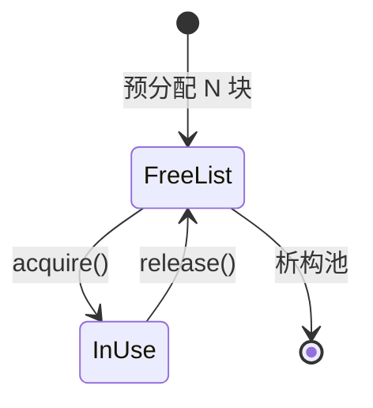

# 内存分配器与对象池

> **文件编码**：UTF-8。  
> **定位**：超越 `new/delete`——理解 tcmalloc/jemalloc、arena、对象池与 placement new，为 LLM Serving **KV block 池**、RPC buffer 复用打地基。  
> **交叉阅读**：[C++ 18 高性能与对齐](18-高性能C++与内存对齐.md)、[C++ 02 指针与内存](02-指针引用与内存管理.md)、[C++ 21 设计模式](21-设计模式与Infra工程实践.md)、[LLMInfra 08 KV Cache](../LLMInfra/08-KV-Cache与PagedAttention原理.md)。

---

## 0. 读前导读（零基础也能跟上）

### 0.1 用一句话弄懂本章

**内存分配器** = 谁负责从系统要内存、怎么切块、怎么回收；**对象池** = 预先备好一批对象，借还代替频繁 `new/delete`——Serving 热路径上 microseconds 级差异。

### 0.2 你需要提前知道什么

- [02 章](02-指针引用与内存管理.md) 堆/栈、`new`/`delete`、RAII
- [18 章](18-高性能C++与内存对齐.md) 对齐、`Buffer` move
- [07 章](07-异常处理与RAII.md) 构造/析构与异常安全
- [08 章](08-多线程与并发编程.md) mutex 基础（对象池线程安全）

### 0.3 本章知识地图（☐→☑）

- [ ] 解释 glibc malloc / tcmalloc / jemalloc 差异（概念）
- [ ] 写简单 arena/bump allocator
- [ ] 实现线程安全对象池 + placement new
- [ ] 说清对象池 vs `shared_ptr` 选型
- [ ] 对照 vLLM block pool 讲借还语义
- [ ] §10 闭卷自测 ≥8/10

### 0.4 建议学习时长

**4～5 天**；对象池需写 benchmark 对比 `new/delete`。

### 0.5 学完你能做什么

为 mini-http 写连接对象池；理解推理引擎 KV block 预分配；面试讲清 placement new 与自定义 allocator。

### 0.6 与 LLM Infra 的衔接

| 本章概念 | Infra 场景 |
|----------|------------|
| arena | 单次 forward 临时 tensor 批量释放 |
| 对象池 | KV block / attention slot 借还 |
| tcmalloc 线程缓存 | 多线程 scheduler 小对象分配 |
| placement new | 固定 buffer 上构造 `TensorView` |

---

## 本章与上一章的关系

[23 章](23-IO多路复用与高性能Server.md) 解决 **接客**（epoll/Asio）；接客后每个连接、每个请求 buffer 都要分配内存。[18 章](18-高性能C++与内存对齐.md) 教对齐与 move；本章教 **分配策略**——何时用系统 malloc、何时自建池。与 [21 章 Object Pool](21-设计模式与Infra工程实践.md) 设计模式呼应，本章偏 **实现与分配器原理**。

| 上一章（23） | 本章（24） | 下一章（25） |
|--------------|------------|--------------|
| 高并发 IO | 内存借还与池化 | 无锁与 memory_order |
| 连接对象短命 | 对象池复用 | atomic/CAS 进阶 |


---

## 1. 这份文档学什么

- 系统分配器与 tcmalloc/jemalloc 概念
- arena / bump pointer 分配器
- 固定大小对象池（free list）
- placement new 与显式析构
- 自定义 `Allocator` 与 STL 容器（C++17）
- 面试高频：池化、碎片、线程安全

---

## 2. 系统分配器速览

### 2.1 malloc 在做什么

```text
用户调用 malloc(n)
    → 分配器查 size class（8/16/32…）
    → 命中 thread cache / arena bin
    → 不足则 brk/mmap 向内核要页
free(ptr) → 回收到 bin，可能延迟 coalesce
```

| 分配器 | 特点 | 典型场景 |
|--------|------|----------|
| glibc ptmalloc | 通用、多 arena | 默认 Linux |
| **tcmalloc** |  per-thread cache，小对象快 | gRPC、TensorFlow 部分构建 |
| **jemalloc** | 碎片控制好、统计丰富 | Redis、Firefox |
| mimalloc | 微软开源，低延迟 | 新项目可选 |

**工程建议**：先 `perf`/`heaptrack` 证明瓶颈在分配（[12 章](12-性能分析与调试.md)），再换链接 `-ltcmalloc` 或 `LD_PRELOAD`，勿盲目替换。

### 2.2 碎片：内部 vs 外部

| 类型 | 含义 | 缓解 |
|------|------|------|
| 内部 | 分配单元 > 请求 size | size class、池化固定大小 |
| 外部 | 空闲块分散无法合并 | jemalloc、arena 一次释放 |

---

## 3. Arena / Bump Allocator

适合 **同生命周期** 大量小对象：解析一次请求、跑一次算子图，然后 **整 arena 销毁**。

```cpp
#include <cstddef>
#include <cstdlib>
#include <new>
#include <utility>
#include <vector>

class Arena {
    std::vector<std::byte> block_;
    std::size_t offset_{0};
    static constexpr std::size_t kAlign = alignof(std::max_align_t);

    static std::size_t align_up(std::size_t n, std::size_t a) {
        return (n + a - 1) & ~(a - 1);
    }

public:
    explicit Arena(std::size_t cap = 1 << 20) : block_(cap) {}

    void* allocate(std::size_t size, std::size_t align = kAlign) {
        std::size_t pos = align_up(offset_, align);
        if (pos + size > block_.size()) throw std::bad_alloc{};
        void* p = block_.data() + pos;
        offset_ = pos + size;
        return p;
    }

    template <class T, class... Args>
    T* create(Args&&... args) {
        void* p = allocate(sizeof(T), alignof(T));
        return new (p) T(std::forward<Args>(args)...);
    }

    void reset() { offset_ = 0; }  // 不调用析构：仅 POD 或手动管理时用
};

struct Node { int v; Node* next; };

// 用法：arena.create<Node>(...) 链式挂接；请求结束 arena.reset()
```

**注意**：`reset()` 不析构已构造对象——仅适用于 POD 或你在 reset 前手动 `p->~T()`。Infra 里常用于 **中间 IR 节点** 一次构建、一次丢弃。

---

## 4. 固定大小对象池

### 4.1 设计要点



- 所有块 **相同 sizeof(T)**，O(1) 借还
- free list 可用 **intrusive 链表**（空闲块头几个字节存 next 指针）
- 多线程：**mutex** 或 per-thread 池（[08 章](08-多线程与并发编程.md)）

### 4.2 线程安全对象池（C++17）

```cpp
#include <cstddef>
#include <memory>
#include <mutex>
#include <new>
#include <stack>
#include <utility>
#include <vector>

template <class T>
class ObjectPool {
    struct Block { alignas(T) std::byte storage[sizeof(T)]; };

    std::vector<std::unique_ptr<Block[]>> chunks_;
    std::stack<T*> free_;
    mutable std::mutex mu_;
    const std::size_t chunk_size_;

    void grow() {
        auto chunk = std::make_unique<Block[]>(chunk_size_);
        for (std::size_t i = 0; i < chunk_size_; ++i)
            free_.push(reinterpret_cast<T*>(chunk[i].storage));
        chunks_.push_back(std::move(chunk));
    }

public:
    explicit ObjectPool(std::size_t chunk_size = 64) : chunk_size_(chunk_size) {
        grow();
    }

    template <class... Args>
    T* acquire(Args&&... args) {
        std::lock_guard lock{mu_};
        if (free_.empty()) grow();
        T* p = free_.top();
        free_.pop();
        return new (p) T(std::forward<Args>(args)...);
    }

    void release(T* p) {
        if (!p) return;
        p->~T();
        std::lock_guard lock{mu_};
        free_.push(p);
    }

    ~ObjectPool() {
        // 池中 Block 随 chunks_ 释放；勿对 in-use 指针 double-free
    }
};
```

---

## 5. placement new 与显式析构

| 操作 | 语法 | 是否分配内存 |
|------|------|--------------|
| 普通 new | `new T()` | 是 |
| placement new | `new (buf) T()` | 否，仅在已有地址构造 |
| 销毁 | `p->~T()` | 否，不释放 buf |

```cpp
#include <cstddef>
#include <iostream>
#include <new>

alignas(64) std::byte buffer[256];

struct Payload {
    int id;
    explicit Payload(int i) : id(i) {
        std::cout << "ctor " << id << '\n';
    }
    ~Payload() { std::cout << "dtor " << id << '\n'; }
};

int main() {
    auto* p = new (buffer) Payload(42);
    p->~Payload();  // 必须显式析构；buffer 本身不 delete
    return 0;
}
```

**面试点**：vector reallocate 时对旧元素 **move + 析构旧位**；对象池 release 必须 `~T()` 再入 free list。

---

## 6. LLM Infra 案例：KV Block Pool

```text
Scheduler 预分配 M 个 block（每块固定 token 容量）
  acquire() → 返回 block_id / 指针，写入 KV
  sequence 结束 → release(block_id) 回池
PagedAttention：非连续 block 链表，池化避免 malloc 风暴
```

与 [21 章](21-设计模式与Infra工程实践.md) Flyweight / Pool 模式、[LLMInfra 08](../LLMInfra/08-KV-Cache与PagedAttention原理.md) 直接相关。热路径用 **move** 转移 block 元数据，而非拷贝 KV 张量。

---

## 7. 对象池 vs 其他手段

| 手段 | 优点 | 缺点 |
|------|------|------|
| 每次 new/delete | 简单 | 慢、碎片 |
| `shared_ptr` | 自动生命周期 | 原子计数、控制块额外分配 |
| **对象池** | 借还 O(1)、cache 友好 | 固定大小、需防泄漏/ double release |
| **arena** | 批量释放极快 | 难单独释放中间对象 |
| tcmalloc | 零改代码可能变快 | 仍不如语义池化 |

---

## 8. 常见错误

| 错误 | 后果 | 修复 |
|------|------|------|
| pool release 不调用析构 | 资源泄漏 | `p->~T()` 再入栈 |
| 对 pool 内存 `delete` | UB | 只用 release |
| arena reset 含非平凡析构对象 | 泄漏 | reset 前遍历析构 |
| 池块大小不一致 | 内存踩踏 | static_assert sizeof |
| 单 global 池高争用 | 锁瓶颈 | per-thread 池 + 批量归还 |

---

## 9. 练习与 FAQ

**练习**：benchmark `new/delete` vs 对象池；用 arena 解析 HTTP header（[10 章](10-网络编程与简易HTTP服务.md)）。

**FAQ**：生产先 profiling 再换 tcmalloc；对象池管固定类型，arena 管原始字节；`std::pmr` 可与自研池并存（C++17）。

---

## 10. 闭卷自测

1. tcmalloc 相对 glibc 的主要优化点是什么？
2. 内部碎片与外部碎片区别？
3. arena 的 `reset()` 适合什么生命周期语义？
4. 对象池 `release` 时为什么要先析构？
5. placement new 是否分配堆内存？
6. 线程安全对象池的两种降低锁竞争思路？
7. KV Cache 为何常用 block 池而非每次 malloc？
8. `shared_ptr` 与对象池如何选型？
9. C++20 对 aligned `operator new` 的改进是什么？
10. 本章与 18、21、08 章各一点衔接？

<details>
<summary>自测参考答案</summary>

1. **per-thread cache** 小对象分配/释放少走全局锁，降低多线程 contention。
2. **内部**：分配块大于请求；**外部**：空闲内存分散无法利用。
3. **同一阶段/请求**内大量临时对象，阶段结束 **整体丢弃**，不需逐个 free。
4. 运行 **非平凡析构**（关闭 fd、释放成员），否则资源泄漏；再复用内存。
5. **否**；只在调用者提供的存储上 **构造**。
6. **per-thread 本地池**；批量 acquire/release；或无锁栈（见 [25 章](25-无锁编程与内存序.md)）。
7. token 块 **大小固定、借还频繁**；池化 O(1) 且减少碎片与 syscall。
8. 需要 **共享所有权、生命周期不确定** 用 shared_ptr；**固定大小、热路径借还** 用池。
9. 支持 **`std::align_val_t`** 的 placement/全局 aligned new/delete。
10. **18** 对齐 allocator；**21** Pool 模式；**08** 池的 mutex/线程模型。

</details>
---


## 13. 深度附录：分配器架构全景

本章 §2 已介绍 glibc/tcmalloc/jemalloc 概念。本节从 **架构分层** 角度对比三者，为面试「为什么换分配器能提速 20%」提供可画图、可量化的答案。

| 维度 | ptmalloc (glibc) | tcmalloc | jemalloc |
|---|---|---|---|
| 设计年代 | 1990s，持续演进 | Google 2005+ | Facebook 2006+ |
| 线程模型 | arena + 主锁 | per-thread cache → central | arena + tcache |
| 小对象路径 | bin + fastbin | thread cache 命中 O(1) | tcache 优先 |
| 大对象 | mmap 阈值 | page heap / span | extent + arena |
| 碎片策略 | 合并相邻 chunk | span 分级 + 延迟归还 | extent 伙伴 + purge |
| 典型场景 | 通用默认 | 多线程 C++ 服务 | 长期运行、碎片敏感 |

> **交叉阅读**：[84 章 内存模型](84-C++内存模型与原子操作深入.md) 讲 atomic；本章讲 **堆分配** 与 **对象生命周期**——二者在 Serving 热路径上常同时出现。

---

## 13.1 ptmalloc：arena 与主锁

glibc malloc 将堆划分为多个 **arena**（默认约 `8 × CPU 核数`）。线程首次分配时绑定某个 arena；同一 arena 内用 **fastbin / smallbin / largebin** 管理不同尺寸 chunk。

**痛点**：高并发下多线程仍可能争用同一 arena 的 mutex；小对象频繁 `free` 后合并逻辑复杂，**外部碎片** 在长时间运行服务中可见。

```text
线程 T1 ──► arena 0 ──► bins / top chunk
线程 T2 ──► arena 1 ──► bins / top chunk
线程 T3 ──► arena 0   （可能回到已绑定 arena，再次争锁）
```

**面试话术**：「默认 malloc 不是慢，而是 **多线程 + 小对象 churn** 时锁与元数据开销被放大。」

---

## 13.2 tcmalloc：thread cache 与 central free list

TCMalloc 论文核心直觉：**把 malloc/free 从全局临界区里搬出去**。

**三层结构**：
1. **Thread Cache**：每线程私有，无锁（仅本线程访问）
2. **Central Cache**：按 size class 分桶，短临界区批量搬运
3. **Page Heap**：向 OS 要页，组织成 **span**

**Span** = 连续若干页（通常 8KB 粒度）的同 size class 对象容器。释放时对象回到 thread cache；cache 满则批量还给 central；central 再决定 span 是否归还 OS。

```cpp
// 概念伪代码：小对象分配路径
void* tcmalloc_small(size_t n) {
    size_t cls = SizeClass(n);           // 映射到固定 size class
    ThreadCache* tc = GetThreadCache();
    if (void* p = tc->freelist[cls]) {   // 热路径：无锁 pop
        tc->freelist[cls] = Next(p);
        return p;
    }
    return FetchFromCentral(cls);        // 慢路径：从 central 批量 refill
}
```

**TCMalloc 论文直觉（口述版）**：
- 小对象按 **size class** 对齐，避免每请求精确 size 元数据
- **批量转移** 摊薄 central 锁开销
- **span 作为页级单元**，大对象与小对象统一管理

**生产经验**：`LD_PRELOAD=libtcmalloc.so` 对 C++ 多线程 RPC/网关常立竿见影；须配合 **heap profiler** 验证是否真瓶颈在分配。

---

## 13.3 jemalloc：arena、extent 与碎片控制

jemalloc 强调 **arena 隔离 + extent 伙伴系统 + 主动 purge**。

**tcache**（thread cache）与 tcmalloc 类似，但 jemalloc 对 **碎片率** 与 **RSS 回落** 更激进：可通过 `mallctl` 触发 `arena.<i>.purge`。

| 术语 | 含义 |
|---|---|
| extent | 一段连续虚拟地址范围，带 size class / committed 状态 |
| arena | extent 集合 + 锁；线程 round-robin 绑定 |
| tcache | 线程本地 freelist，默认开启 |
| dirty page | 已 free 但未 munmap 的页，可复用或 purge |

**选型口诀**：tcmalloc 偏 **吞吐**；jemalloc 偏 **长期运行内存占用**；Redis、Firefox 等长期进程常见 jemalloc。

---

## 13.4 Span 与 size class 详解

无论 tcmalloc 还是 jemalloc，**小对象分配** 都依赖 **size class 表**。

典型 size class 序列（示意）：8, 16, 24, 32, 48, 64, 80, 96, 128, ...

请求 `new char[30]` 可能落到 32 字节 class → **内部碎片** 2 字节（可忽略），但 class 间距越大，平均内部碎片率越高。

```text
Span (4 pages = 16KB, class=32B)
┌──┬──┬──┬──┬──┬ ... ┬──┐
│obj│obj│obj│obj│obj│ ... │obj│  freelist 串起空闲 slot
└──┴──┴──┴──┴──┴ ... ┴──┘
```

**与对象池关系**：固定 `sizeof(T)` 的对象池等价于 **单一 size class 的 span + freelist**，只是生命周期由业务控制而非 malloc API。

---

## 13.5 SLAB 分配器：内核与用户的同构思想

Linux 内核 **SLAB/SLUB** 为内核对象（`task_struct`、`inode`）提供固定大小缓存——与 C++ **对象池** 同构。

| 层次 | SLAB | 用户态对象池 |
|------|------|-------------|
| 对象大小 | 编译期固定 | `sizeof(T)` 固定 |
| 借还 | `kmem_cache_alloc/free` | `acquire/release` |
| 着色 | 减少 cache aliasing | 可选 padding 防 false sharing |
| 批量创建 | cache 预热 | 启动时 preallocate N 个 |

**面试延伸**：「为何 KV block 像 SLAB？」—— 块大小固定、借还频繁、生命周期短于进程，池化避免 general malloc 的元数据与锁。

---

## 13.6 小对象池完整实现（面试手撕加强版）

在 §5 简单池基础上，补 **对齐、批量预热、统计、thread-local 快路径**。

```cpp
#include <cstddef>
#include <cstdint>
#include <memory>
#include <mutex>
#include <new>
#include <vector>

template <typename T, std::size_t Align = alignof(T)>
class SmallObjectPool {
public:
    explicit SmallObjectPool(std::size_t prealloc = 64) {
        blocks_.reserve(prealloc);
        for (std::size_t i = 0; i < prealloc; ++i)
            pushFree(newBlock());
        stats_.capacity = prealloc;
    }

    ~SmallObjectPool() {
        for (auto* raw : blocks_) {
            std::destroy_at(reinterpret_cast<T*>(raw));
            ::operator delete(raw, std::align_val_t{Align});
        }
    }

    template <typename... Args>
    T* acquire(Args&&... args) {
        void* slot = popFree();
        if (!slot) slot = newBlock();
        ++stats_.live;
        return new (slot) T(std::forward<Args>(args)...);
    }

    void release(T* p) {
        if (!p) return;
        p->~T();
        pushFree(p);
        --stats_.live;
    }

    struct Stats { std::size_t live{}; std::size_t capacity{}; };
    Stats stats() const { return stats_; }

private:
    void* newBlock() {
        void* mem = ::operator new(sizeof(T), std::align_val_t{Align});
        blocks_.push_back(mem);
        ++stats_.capacity;
        return mem;
    }

    void* popFree() {
        std::lock_guard lock(m_);
        if (free_.empty()) return nullptr;
        void* p = free_.back();
        free_.pop_back();
        return p;
    }

    void pushFree(void* p) {
        std::lock_guard lock(m_);
        free_.push_back(p);
    }

    mutable std::mutex m_;
    std::vector<void*> free_;
    std::vector<void*> blocks_;
    Stats stats_{};
};
```

**thread-local 快路径变体**：每线程维护 `vector<void*>` 本地 freelist，耗尽时从全局池 **批量 refill**（例如一次 32 个）——与 tcmalloc thread cache 同构。见 [25 章](25-无锁编程与内存序.md) 无锁栈可进一步去掉全局锁。

---

## 13.7 内存碎片：内部、外部与测量

**内部碎片**：分配器给出比请求更大的块（size class 对齐）。度量：`浪费 = class_size - requested`。

**外部碎片**：堆中空闲内存总和足够，但 **没有连续大块** 满足 `malloc(large)`。

**测量手段**：
1. `malloc_info` / jemalloc `mallctl` 统计
2. Valgrind massif / heap profiler
3. 自定义 arena：peak allocated vs RSS

```bash
# 对比 glibc vs tcmalloc 分配 1e6 次小对象
./bench_alloc --objects=1000000 --size=64 --threads=16
# 观察：耗时、peak RSS、fragmentation ratio
```

**缓解策略**：对象池（固定大小）、arena 批量释放、bump pointer（无单独 free）、jemalloc purge、避免频繁不同尺寸 malloc/free 交错。

---

## 13.8 Benchmark 对比实验设计

可复现实验模板（配合 [74 章](74-性能工程方法论与基准测试.md)）：

| 场景 | 指标 | 预期 |
|---|---|---|
| 单线程小对象 | ns/op | tcmalloc ≈ jemalloc < ptmalloc 差距不大 |
| 16 线程 churn | 吞吐 Mops/s | tcmalloc/jemalloc 显著优于默认 |
| 固定 size 池 | ns/op | 自研池最优，无 size class 浪费 |
| 混合尺寸 | RSS @ 10min | jemalloc purge 后 RSS 更低 |

```cpp
// Google Benchmark 骨架
static void BM_NewDelete(benchmark::State& st) {
    for (auto _ : st) {
        auto* p = new std::array<char, 64>();
        benchmark::DoNotOptimize(p);
        delete p;
    }
}
static void BM_Pool(benchmark::State& st) {
    SmallObjectPool<std::array<char, 64>> pool{1024};
    for (auto _ : st) {
        auto* p = pool.acquire();
        benchmark::DoNotOptimize(p);
        pool.release(p);
    }
}
BENCHMARK(BM_NewDelete)->Threads(1)->Threads(16);
BENCHMARK(BM_Pool)->Threads(1)->Threads(16);
```

**注意**：`-O2`、固定 CPU 频率、预热、报告 p50/p99；池化优势在 **高频率 + 固定尺寸 + 多线程** 最明显。

---

## 13.9 分配器替换与 LD_PRELOAD 实战

```bash
# Linux 临时启用 tcmalloc
LD_PRELOAD=/usr/lib/x86_64-linux-gnu/libtcmalloc.so.4 ./my_server

# jemalloc 统计
MALLOC_CONF=stats_print:true ./my_server
```

**CMake 链接方式**：
```cmake
find_package(gperftools)
target_link_libraries(app PRIVATE tcmalloc)
```

**风险**：与 jemalloc/tcmalloc 不兼容的 **自定义 hook**、**sanitizer** 运行时可能冲突；CI 与生产配置需分开。

---

## 13.10 placement new 与 allocator _traits 衔接

C++17 `std::pmr::monotonic_buffer_resource` 是标准库版 arena：

```cpp
#include <memory_resource>
#include <vector>

std::byte buffer[4096];
std::pmr::monotonic_buffer_resource pool{buffer, sizeof(buffer)};
std::pmr::vector<int> v{&pool};
for (int i = 0; i < 100; ++i) v.push_back(i);
// buffer 耗尽前无 heap 分配；析构 vector 后不回收单个 int（整体 reset pool）
```

与 §3 arena 对照：`monotonic_buffer_resource::release()` 等价 **reset 整块**。

---

## 13.11 与 LLM Serving 的 block pool 映射

| vLLM 概念 | 本章概念 |
|-----------|----------|
| PagedAttention block | 固定大小 span / 对象池 slot |
| block table | freelist + 已分配 bitmap |
| prefill 临时 tensor | arena / monotonic_buffer |
| 多 stream 并行 | per-thread cache / 分 arena |

读 [LLMInfra 08](../LLMInfra/08-KV-Cache与PagedAttention原理.md) 时带着 **「这就是 size-class 对象池」** 的眼光看源码。

---

## 13.12 深度 FAQ（15 问）

**Q：tcmalloc 的 central cache 锁竞争怎么办？**

thread cache 批量 refill/flush，摊薄锁持有时间；极端场景可调 cache 大小。

**Q：jemalloc 的 dirty page 是什么？**

已释放但未归还 OS 的页，可快速复用；purge 后 RSS 下降。

**Q：为何说对象池不能替代智能指针？**

池管理 **内存复用**；`shared_ptr` 管理 **所有权语义**，解决不同问题。

**Q：aligned_alloc 与 pool 对齐？**

C++17 `operator new(size, align_val_t)`；池按 `alignof(T)` 分配 slot。

**Q：内存池导致内存泄漏？**

忘记 `release` 或析构时未 drain pool；用 RAII guard 包装 acquire。

**Q：跨 so 边界 free？**

谁分配谁释放；跨 DLL 用同一运行时或导出分配接口。

**Q：NUMA  aware 分配？**

高级分配器可绑 NUMA node；大页 hugpage 减少 TLB miss。

**Q：Sanitizer 下能用 tcmalloc？**

通常关 preload，用 ASan 自带 malloc。

**Q：如何检测内存碎片？**

长时间压测看 RSS vs active bytes；massif snapshot。

**Q：bump allocator 能 free 单个对象吗？**

一般不能；适合请求级生命周期。

**Q：Pool 线程安全必须全局锁吗？**

可 thread-local pool + 全局补给；见 25 章无锁栈。

**Q：size class 浪费多少？**

平均约 class 间距的一半，通常 <12.5% 可接受。

**Q：mmap 阈值是多少？**

glibc 约 128KB+ 走 mmap，因平台而异。

**Q：自定义 STL allocator 何时值得？**

容器热路径、固定类型、需统计/池化时；见 18 章。

**Q：生产如何决策换分配器？**

先 profiling：CPU 在 malloc、RSS 线性涨、延迟 tail 放大再换。

---

## 13.13 面试白板：画 tcmalloc 三层图

**步骤（5 分钟）**：
1. 画 Thread → ThreadCache（无锁 freelist）
2. 箭头「cache 空/满」→ CentralCache（按 class 分桶 + 锁）
3. Central → PageHeap（span 链表）
4. PageHeap → OS（mmap/sbrk）
5. 口述热路径：**90%+ 分配在 thread cache 命中**

**追问**：span 是什么？—— 连续页组成的分配单元，承载同一 size class 的许多对象。

---

## 13.14 渐进式练习（7 题）

1. 实现 `ThreadLocalPool`：本地 freelist 空时从全局批量取 32 个。
2. 用 `std::pmr::monotonic_buffer_resource` 解析 HTTP header 键值对。
3. 写 benchmark 对比 `new/delete` vs pool vs tcmalloc（16 线程）。
4. 计算 size class 32 对请求 17 字节的内部碎片率。
5. 为 `Connection` 对象写 RAII `PoolGuard`。
6. 读 jemalloc `mallctl` 文档，打印 `stats.allocated`。
7. 画 ptmalloc arena 与 tcmalloc thread cache 对比图（纸笔）。

---

## 13.15 术语表

| 术语 | 定义 |
|---|---|
| size class | 固定大小桶，小对象分配对齐到最近 class |
| span | 连续物理页组成的分配区域 |
| thread cache | 线程私有 freelist，避免全局锁 |
| arena | 独立堆区域 + 锁，减少线程争用 |
| internal fragmentation | 已分配块内未使用字节 |
| external fragmentation | 空闲内存分散无法合并利用 |
| SLAB | 内核固定大小对象缓存机制 |
| bump pointer | 指针递增分配，仅支持批量 reset |
| purge | 将未使用 dirty page 归还 OS |
| placement new | 在已分配存储上构造对象 |

---
## 13.16 生产场景笔记库（55 条）

### 13.16.1 场景笔记 #1

RPC 请求 buffer 用 arena，请求结束 reset，避免 per-field free。

设计检查时问：**谁分配、谁释放、生命周期边界、线程归属、失败策略**。

### 13.16.2 场景笔记 #2

连接 accept 后从 pool acquire Session，close 后 release 而非 delete。

设计检查时问：**谁分配、谁释放、生命周期边界、线程归属、失败策略**。

### 13.16.3 场景笔记 #3

Tensor 临时 workspace 用 monotonic_buffer，forward 结束一次性释放。

设计检查时问：**谁分配、谁释放、生命周期边界、线程归属、失败策略**。

### 13.16.4 场景笔记 #4

多线程日志对象避免 per-line new string，用 thread-local buffer + fmt。

设计检查时问：**谁分配、谁释放、生命周期边界、线程归属、失败策略**。

### 13.16.5 场景笔记 #5

固定 4KB page 对齐 block 便于 DMA / RDMA（Infra 扩展）。

设计检查时问：**谁分配、谁释放、生命周期边界、线程归属、失败策略**。

### 13.16.6 场景笔记 #6

profiler 显示 malloc 占 30% CPU 时优先试 tcmalloc 而非盲目池化。

设计检查时问：**谁分配、谁释放、生命周期边界、线程归属、失败策略**。

### 13.16.7 场景笔记 #7

对象池 capacity 上限防止 OOM，满则 fallback malloc 或拒绝服务。

设计检查时问：**谁分配、谁释放、生命周期边界、线程归属、失败策略**。

### 13.16.8 场景笔记 #8

跨线程归还 pool 对象时用 queue 批量转移，减少锁次数。

设计检查时问：**谁分配、谁释放、生命周期边界、线程归属、失败策略**。

### 13.16.9 场景笔记 #9

C++20 `std::allocator` 改进与 pmr 容器可渐进迁移。

设计检查时问：**谁分配、谁释放、生命周期边界、线程归属、失败策略**。

### 13.16.10 场景笔记 #10

与 21 章 Object Pool 设计模式：接口 acquire/release 与 RAII guard。

设计检查时问：**谁分配、谁释放、生命周期边界、线程归属、失败策略**。

### 13.16.11 场景笔记 #11

ptmalloc fastbin 延迟合并导致 peak RSS 偏高——长时间服务需观察。

设计检查时问：**谁分配、谁释放、生命周期边界、线程归属、失败策略**。

### 13.16.12 场景笔记 #12

tcmalloc central cache 锁粒度按 size class 分离，减少假共享。

设计检查时问：**谁分配、谁释放、生命周期边界、线程归属、失败策略**。

### 13.16.13 场景笔记 #13

jemalloc `background_thread:true` 可在后台 purge dirty pages。

设计检查时问：**谁分配、谁释放、生命周期边界、线程归属、失败策略**。

### 13.16.14 场景笔记 #14

size class 8/16/24 递增策略影响内部碎片与 central 桶数量。

设计检查时问：**谁分配、谁释放、生命周期边界、线程归属、失败策略**。

### 13.16.15 场景笔记 #15

span 归还 OS 的条件：central 空闲 span 超过阈值且全局内存压力。

设计检查时问：**谁分配、谁释放、生命周期边界、线程归属、失败策略**。

### 13.16.16 场景笔记 #16

SLAB 着色（coloring）思想可用于用户态 pool 避免 cache line 冲突。

设计检查时问：**谁分配、谁释放、生命周期边界、线程归属、失败策略**。

### 13.16.17 场景笔记 #17

bump pointer 与 object pool 组合：bump 分配 frame，frame 内对象走 pool。

设计检查时问：**谁分配、谁释放、生命周期边界、线程归属、失败策略**。

### 13.16.18 场景笔记 #18

`std::vector` 配合 pmr::polymorphic_allocator 可局部使用 arena。

设计检查时问：**谁分配、谁释放、生命周期边界、线程归属、失败策略**。

### 13.16.19 场景笔记 #19

大块分配走 mmap，释放时直接 unmap，不进入 small bin。

设计检查时问：**谁分配、谁释放、生命周期边界、线程归属、失败策略**。

### 13.16.20 场景笔记 #20

内存对齐要求超过 __STDCPP_DEFAULT_NEW_ALIGNMENT__ 时用 aligned new。

设计检查时问：**谁分配、谁释放、生命周期边界、线程归属、失败策略**。

### 13.16.21 场景笔记 #21

对象池预热（prewarm）在启动阶段完成，避免冷启动 latency spike。

设计检查时问：**谁分配、谁释放、生命周期边界、线程归属、失败策略**。

### 13.16.22 场景笔记 #22

分配器替换后须回归测试 ASan/TSan 构建，避免 hook 冲突。

设计检查时问：**谁分配、谁释放、生命周期边界、线程归属、失败策略**。

### 13.16.23 场景笔记 #23

跨 DLL 边界：导出 `extern "C"` 分配/释放接口，禁止跨模块 delete。

设计检查时问：**谁分配、谁释放、生命周期边界、线程归属、失败策略**。

### 13.16.24 场景笔记 #24

NUMA：绑核 + 本地 arena 减少 remote memory access。

设计检查时问：**谁分配、谁释放、生命周期边界、线程归属、失败策略**。

### 13.16.25 场景笔记 #25

监控指标：alloc_rate、heap_size、fragmentation_pct、pool_hit_rate。

设计检查时问：**谁分配、谁释放、生命周期边界、线程归属、失败策略**。

### 13.16.26 场景笔记 #26

vLLM block pool 借还失败时排队或抢占——业务策略与 pool 分离。

设计检查时问：**谁分配、谁释放、生命周期边界、线程归属、失败策略**。

### 13.16.27 场景笔记 #27

placement new 数组需手动对每个元素 construct/destruct。

设计检查时问：**谁分配、谁释放、生命周期边界、线程归属、失败策略**。

### 13.16.28 场景笔记 #28

pool guard RAII：`auto g = pool.acquire_guard(args...);` 析构自动 release。

设计检查时问：**谁分配、谁释放、生命周期边界、线程归属、失败策略**。

### 13.16.29 场景笔记 #29

benchmark 必须报告 threads=1 与 threads=N，单线程结论不能外推。

设计检查时问：**谁分配、谁释放、生命周期边界、线程归属、失败策略**。

### 13.16.30 场景笔记 #30

内存泄漏 vs 内存膨胀：泄漏是 forgotten free；膨胀是 cache 未 purge。

设计检查时问：**谁分配、谁释放、生命周期边界、线程归属、失败策略**。

### 13.16.31 场景笔记 #31

tcmalloc `MallocExtension::GetStats` 可打印 thread cache 命中率。

设计检查时问：**谁分配、谁释放、生命周期边界、线程归属、失败策略**。

### 13.16.32 场景笔记 #32

jemalloc `prof.active` 开启 heap profiling 定位分配热点。

设计检查时问：**谁分配、谁释放、生命周期边界、线程归属、失败策略**。

### 13.16.33 场景笔记 #33

对象池不适合生命周期差异极大的对象——统一 size 是前提。

设计检查时问：**谁分配、谁释放、生命周期边界、线程归属、失败策略**。

### 13.16.34 场景笔记 #34

arena reset 后所有指针失效，类似 vector reallocate。

设计检查时问：**谁分配、谁释放、生命周期边界、线程归属、失败策略**。

### 13.16.35 场景笔记 #35

Infra 网关：Connection 池 + Request arena 双层策略最常见。

设计检查时问：**谁分配、谁释放、生命周期边界、线程归属、失败策略**。

### 13.16.36 场景笔记 #36

小对象池 free list 可用 intrusive linked list，节点即对象本身。

设计检查时问：**谁分配、谁释放、生命周期边界、线程归属、失败策略**。

### 13.16.37 场景笔记 #37

批量 allocate：一次向 OS 要 64 个 slot 填入 global free list。

设计检查时问：**谁分配、谁释放、生命周期边界、线程归属、失败策略**。

### 13.16.38 场景笔记 #38

内存碎片分析工具：Jeprof、google-pprof、heaptrack。

设计检查时问：**谁分配、谁释放、生命周期边界、线程归属、失败策略**。

### 13.16.39 场景笔记 #39

生产换 tcmalloc 步骤：staging 压测 → canary → 全量，观察 RSS 与延迟。

设计检查时问：**谁分配、谁释放、生命周期边界、线程归属、失败策略**。

### 13.16.40 场景笔记 #40

C++17 pmr::unsynchronized_pool_resource 单线程场景零锁。

设计检查时问：**谁分配、谁释放、生命周期边界、线程归属、失败策略**。

### 13.16.41 场景笔记 #41

固定大小 string buffer 替代 `std::string` 在热路径减少 malloc。

设计检查时问：**谁分配、谁释放、生命周期边界、线程归属、失败策略**。

### 13.16.42 场景笔记 #42

KV cache block 尺寸与 GPU page 对齐一致，减少 padding waste。

设计检查时问：**谁分配、谁释放、生命周期边界、线程归属、失败策略**。

### 13.16.43 场景笔记 #43

对象池统计 live/capacity 便于 Grafana 告警 pool exhaustion。

设计检查时问：**谁分配、谁释放、生命周期边界、线程归属、失败策略**。

### 13.16.44 场景笔记 #44

chapter 18 aligned_storage 与 pool slot 对齐检查。

设计检查时问：**谁分配、谁释放、生命周期边界、线程归属、失败策略**。

### 13.16.45 场景笔记 #45

chapter 74 基准测试：固定 seed、禁用 turbo、报告 p99 alloc latency。

设计检查时问：**谁分配、谁释放、生命周期边界、线程归属、失败策略**。

### 13.16.46 场景笔记 #46

chapter 84 atomic 与 pool free list 无锁化衔接。

设计检查时问：**谁分配、谁释放、生命周期边界、线程归属、失败策略**。

### 13.16.47 场景笔记 #47

面试：口述 malloc(64) 在 tcmalloc 中的完整路径。

设计检查时问：**谁分配、谁释放、生命周期边界、线程归属、失败策略**。

### 13.16.48 场景笔记 #48

面试：为何对象池不能解决内存泄漏——忘记 release 仍会涨 live 计数。

设计检查时问：**谁分配、谁释放、生命周期边界、线程归属、失败策略**。

### 13.16.49 场景笔记 #49

面试：内部碎片与外部碎片各举一例 C++ 场景。

设计检查时问：**谁分配、谁释放、生命周期边界、线程归属、失败策略**。

### 13.16.50 场景笔记 #50

面试：SLAB 与 object pool 的三点同构。

设计检查时问：**谁分配、谁释放、生命周期边界、线程归属、失败策略**。

### 13.16.51 场景笔记 #51

面试：placement new 与 operator new 的分工。

设计检查时问：**谁分配、谁释放、生命周期边界、线程归属、失败策略**。

### 13.16.52 场景笔记 #52

面试：bump allocator 适合编译器 frontend 还是 runtime serving？

设计检查时问：**谁分配、谁释放、生命周期边界、线程归属、失败策略**。

### 13.16.53 场景笔记 #53

面试：如何证明瓶颈在 malloc 而非锁或 IO？

设计检查时问：**谁分配、谁释放、生命周期边界、线程归属、失败策略**。

### 13.16.54 场景笔记 #54

面试：pmr::monotonic_buffer_resource 与自定义 arena 的差异。

设计检查时问：**谁分配、谁释放、生命周期边界、线程归属、失败策略**。

### 13.16.55 场景笔记 #55

面试：span 与 extent 术语在不同分配器中的对应关系。

设计检查时问：**谁分配、谁释放、生命周期边界、线程归属、失败策略**。

---

## 13.17 本章深度自测（追加 20 题）

11. （深度）画出 span 与 size class 的关系。
12. （深度）thread cache 为何不需要锁？
13. （深度）central cache 批量搬运的好处？
14. （深度）jemalloc purge 触发条件？
15. （深度）bump allocator 与 pool 选型？
16. （深度）内部碎片 10% 可否接受？
17. （深度）如何测分配器 tail latency？
18. （深度）LD_PRELOAD 失败怎么排查？
19. （深度）pmr::vector 与 vector 性能差异？
20. （深度）KV block 尺寸固定的好处？
21. （深度）对象池与 slab 的三点同构？
22. （深度）false sharing 在 pool 元数据上？
23. （深度）aligned new 失败抛什么？
24. （深度）跨线程 release 为何危险？
25. （深度）massif 看什么指标？
26. （深度）tcmalloc 页堆职责？
27. （深度）arena 数量如何配置？
28. （深度）长时间 RSS 涨如何分层查？
29. （深度）placement new 不调用 malloc？
30. （深度）本章与 84 章分工？

<details><summary>深度自测提示</summary>

11-20 参考答案见 §13.1～§13.8 正文；21-30 结合 LLMInfra 08 与 74 章 benchmark 方法论。
</details>


---

## 下一章预告

对象池的 **无锁 free list** 与跨线程借还要理解 **memory_order**。[25 章 无锁编程与内存序](25-无锁编程与内存序.md) 衔接 [08 章 atomic 入门](08-多线程与并发编程.md)，深入 CAS、ABA 与无锁队列。

---

*下一章：25 无锁编程与内存序*
