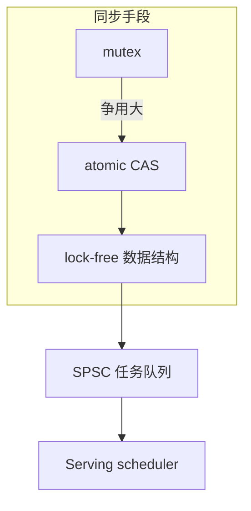
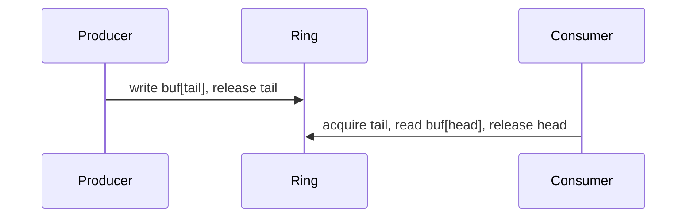
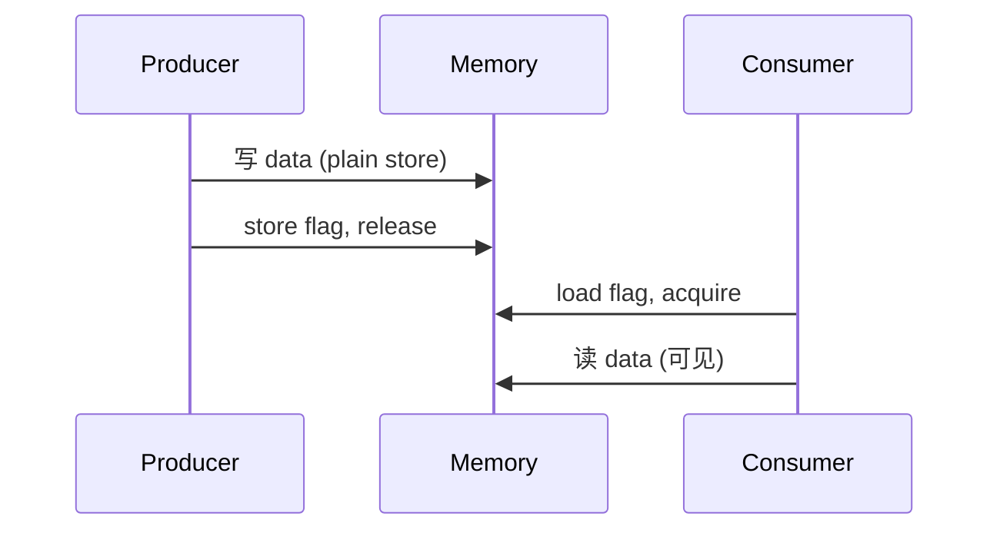

# 无锁编程与内存序

> **文件编码**：UTF-8。  
> **定位**：在 [08 章 mutex](08-多线程与并发编程.md) 之上，用 **atomic + memory_order** 实现低延迟队列与计数——理解 ABA、happens-before，为 [24 章对象池](24-内存分配器与对象池.md) 无锁 free list 与 Serving 调度器打基础。  
> **交叉阅读**：[C++ 08 多线程](08-多线程与并发编程.md)、[C++ 18 高性能](18-高性能C++与内存对齐.md)、[C++ 21 SPSC 队列](21-设计模式与Infra工程实践.md)、[Java 03 JMM](../Java/03-Java并发编程与JVM.md)。

---

## 0. 读前导读（零基础也能跟上）

### 0.1 用一句话弄懂本章

**无锁** ≠ 不加同步，而是用 **原子操作 + 正确内存序** 让多线程安全访问共享数据，避免 mutex 阻塞——写错则是 **数据竞争（UB）**。

### 0.2 你需要提前知道什么

- [08 章](08-多线程与并发编程.md) `std::thread`、`mutex`、`atomic` 入门、`condition_variable`
- [18 章](18-高性能C++与内存对齐.md) false sharing、cache line
- [24 章](24-内存分配器与对象池.md) 对象池 free list（可无锁化）
- 对照 [Java 03 happens-before](../Java/03-Java并发编程与JVM.md)

### 0.3 本章知识地图（☐→☑）

- [ ] 解释 seq_cst / acquire / release / relaxed
- [ ] 写 `compare_exchange_weak` 循环（CAS）
- [ ] 说清 ABA 问题与 hazard pointer/epoch 思路
- [ ] 实现 SPSC 无锁环形队列
- [ ] 对比无锁 vs mutex 适用场景
- [ ] §11 闭卷自测 ≥8/10

### 0.4 建议学习时长

**5～7 天**；务必用 ThreadSanitizer 验证，无锁 bug 极难复现。

### 0.5 学完你能做什么

读 Disruptor/SPSC 实现；为线程池任务队列选型；面试讲清 memory_order 与 Java volatile 差异。

### 0.6 与 08 章的衔接

| 08 章已学 | 本章深入 |
|-----------|----------|
| `atomic<int>` 默认 seq_cst | 按需降级 memory_order |
| mutex 保护队列 | SPSC/MPSC 无锁队列 |
| data race = UB | happens-before 形式化 |
| false sharing 概念 | atomic 变量 padding |

---

## 本章与上一章的关系

[24 章](24-内存分配器与对象池.md) 的对象池 free list 若用 **全局锁**，高并发下会成为瓶颈；**单生产者单消费者（SPSC）** 场景可用无锁环形缓冲（[21 章](21-设计模式与Infra工程实践.md) 已提及）。本章系统补齐 [08 章](08-多线程与并发编程.md) 仅点到为止的 **内存序**，是并发第二台阶。

| 上一章（24） | 本章（25） | 下一章（26） |
|--------------|------------|--------------|
| 对象池 mutex | 无锁借还/队列 | Asio 异步 IO |
| 热路径分配 | 低延迟同步 | io_context 驱动 |



---

## 1. 这份文档学什么

- C++ 内存模型与 happens-before
- `memory_order` 六种语义
- CAS：`compare_exchange_strong/weak`
- ABA 问题与缓解策略
- SPSC 无锁环形队列、MPSC 概览
- 与 08 章对照、面试表达

---

## 2. 从 08 章 atomic 到内存序

### 2.1 默认 seq_cst

```cpp
#include <atomic>
#include <thread>

std::atomic<int> counter{0};

void inc() {
    for (int i = 0; i < 100000; ++i)
        ++counter;  // 默认 memory_order_seq_cst
}
```

**seq_cst**：全局单一总序，最易推理，**开销最大**。08 章入门够用；热路径需细化。

### 2.2 memory_order 速查

| 序 | 含义 | 典型用途 |
|----|------|----------|
| **relaxed** | 原子性，无顺序 | 纯统计计数 |
| **acquire** | 读侧：后续读写不可重排到之前 | 消费数据前读 flag |
| **release** | 写侧：之前读写不可重排到之后 | 发布数据后写 flag |
| **acq_rel** | 读改写组合 | CAS 成功路径 |
| **seq_cst** | 最强 | 默认真值、跨线程顺序敏感 |

```cpp
std::atomic<bool> ready{false};
int data = 0;

void producer() {
    data = 42;
    ready.store(true, std::memory_order_release);
}

void consumer() {
    while (!ready.load(std::memory_order_acquire))
        ;
    // 保证看到 data == 42
    use(data);
}
```

**happens-before**：release 写 **同步于** acquire 读，建立可见性。对照 Java `volatile` 写/读语义。

---

## 3. CAS 与 compare_exchange

```cpp
#include <atomic>
#include <optional>

template <class T>
bool cas_update(std::atomic<T>& target, T expected, T desired) {
    return target.compare_exchange_strong(
        expected, desired,
        std::memory_order_acq_rel,
        std::memory_order_acquire);
}

// 自旋累加（示例，生产用 fetch_add）
void cas_inc(std::atomic<int>& a) {
    int old = a.load(std::memory_order_relaxed);
    while (!a.compare_exchange_weak(
        old, old + 1,
        std::memory_order_acq_rel,
        std::memory_order_relaxed)) {
        // old 已被 CAS 更新为当前值
    }
}
```

**weak vs strong**：weak 可能 **虚假失败**（spurious failure），循环中更常用 weak。

---

## 4. ABA 问题

### 4.1 场景

```text
线程1：读 head=A，准备 CAS head→B
线程2：pop A，pop B，push A（head 又变 A）
线程1：CAS 成功（以为 A 仍连着旧 B），实际结构已变 → 损坏
```

### 4.2 缓解

| 方法 | 思路 |
|------|------|
| **Tagged pointer** | 指针 + 版本号，每次修改递增 tag |
| **Epoch / hazard pointer** | 延迟回收，无人引用再 free |
| **GC** | 语言层保证（Java 无此 ABA 于引用） |
| **不用无锁** | mutex + 简单正确 |

Infra 中 **无锁 free list 配对象池** 时，pop/push 同指针地址会 ABA——优先 **epoch 回收** 或 **mutex 池**（24 章）。

```cpp
struct TaggedPtr {
    void* ptr;
    std::uint64_t tag;
};
// std::atomic<TaggedPtr> 需 compare_exchange 整体比较（或打包 uint128）
```

---

## 5. SPSC 无锁环形队列

**约束**：一个线程只 push，一个只 pop——[21 章](21-设计模式与Infra工程实践.md) 日志/任务管道常见。

```cpp
#include <atomic>
#include <cstddef>
#include <optional>
#include <vector>

template <class T>
class SpscRingBuffer {
    const std::size_t cap_;
    std::vector<T> buf_;
    alignas(64) std::atomic<std::size_t> head_{0};  // 消费者写
    alignas(64) std::atomic<std::size_t> tail_{0};  // 生产者写

public:
    explicit SpscRingBuffer(std::size_t cap) : cap_(cap), buf_(cap) {}

    bool try_push(T v) {
        const auto tail = tail_.load(std::memory_order_relaxed);
        const auto next = (tail + 1) % cap_;
        if (next == head_.load(std::memory_order_acquire))
            return false;  // full
        buf_[tail] = std::move(v);
        tail_.store(next, std::memory_order_release);
        return true;
    }

    std::optional<T> try_pop() {
        const auto head = head_.load(std::memory_order_relaxed);
        if (head == tail_.load(std::memory_order_acquire))
            return std::nullopt;  // empty
        T v = std::move(buf_[head]);
        head_.store((head + 1) % cap_, std::memory_order_release);
        return v;
    }
};
```

**要点**：`head`/`tail` **分属不同 cache line**（`alignas(64)`），防 false sharing（[18 章](18-高性能C++与内存对齐.md)）。



---

## 6. MPSC / 无锁栈（概览）

| 结构 | 难度 | 说明 |
|------|------|------|
| SPSC ring | ★★ | 本章已实现 |
| MPSC queue | ★★★★ | 多生产者需 CAS tail |
| lock-free stack | ★★★ | ABA 风险高 |
| **mutex + queue** | ★ | 多数业务足够 |

**工程原则**：无锁不是勋章；用 [12 章](12-性能分析与调试.md) 证明 mutex 不够再换。Intel TBB、`boost::lockfree` 可复用。

---

## 7. 与 08 章 mutex 对照

| 维度 | mutex | lock-free |
|------|-------|-----------|
| 延迟 | 阻塞、内核参与可能 | 用户态 CAS 自旋 |
| 正确性 | 易写 | 难，易 UB |
| 优先级反转 | 可能 | 不同问题（饥饿） |
| 调试 | 相对易 | TSan 仍可能漏 |
| 适用 | 通用临界区 | SPSC、计数器、读多写少 |

**08 章生产者-消费者** 用 `condition_variable` 正确优先；高吞吐日志管道可换 SPSC。

---

## 8. LLM Infra 场景

| 场景 | 建议 |
|------|------|
| Scheduler 批处理队列 | SPSC：IO 线程 → worker |
| 全局请求计数 | `relaxed` fetch_add |
| 配置热更新指针 | `atomic<Config*>` release/acquire |
| KV block free list | mutex 或 epoch 无锁，慎 ABA |
| GPU callback | 勿在无锁里做重活 |

---

## 9. 常见错误

| 错误 | 后果 |
|------|------|
| 混用 mutex 与无锁读同一结构 | UB |
| 全用 relaxed 做 flag 同步 | 看不到 published data |
| 无 padding 的 head/tail | false sharing |
| 无锁结构里 malloc/free | 性能抖动、ABA |
| 多消费者 SPSC | 数据竞争 |

---

## 10. 练习与 FAQ

**练习**：SPSC 压测对比 mutex 队列；`relaxed` vs `seq_cst` 计数 benchmark。

**FAQ**：无锁未必更快；Java volatile ≈ acquire/release 但不等同 JMM；08 章先 mutex 正确性，本章再优化。

---

## 11. 闭卷自测

1. data race 在 C++ 中的后果？
2. release/acquire 配对解决什么问题？
3. `compare_exchange_weak` 为何可能「假失败」？
4. ABA 问题典型发生结构？
5. SPSC 为何 head/tail 要 padding？
6. relaxed 适用于什么计数场景？
7. 无锁栈的主要风险？
8. 08 章 condition_variable 与 SPSC 如何选型？
9. `seq_cst` 与 `acq_rel` 性能关系（概念）？
10. epoch 回收解决什么问题？

<details>
<summary>自测参考答案</summary>

1. **未定义行为（UB）**；TSan 可检测。
2. **发布-订阅可见性**：producer 写 data 后 release flag，consumer acquire 见 flag 后见 data。
3. 部分 CPU 允许 **spurious failure**；循环中重试即可。
4. **lock-free stack/queue** 节点被回收再分配同地址。
5. **false sharing**（[18 章](18-高性能C++与内存对齐.md)）：两 atomic 同 cache line 互 invalidate。
6. **仅统计、不与其他变量同步** 的全局计数。
7. **ABA** 导致 pop/push 逻辑错乱。
8. 需 **阻塞等待、多生产者** 用 mutex+cv；**固定 SPSC、极高吞吐** 用 ring。
9. **seq_cst 更强更慢**；热点 CAS 成功路径常用 acq_rel。
10. **延迟释放** 节点，避免其他线程仍读时被 free → 缓解 ABA/USE。

</details>
---


## 12. 深度附录：从硬件到 happens-before

本章在 [08 章 atomic 入门](08-多线程与并发编程.md) 之上，系统补齐 **硬件原语 → C++ 内存序 → 无锁数据结构**。与 [84 章 C++ 内存模型与原子操作深入](84-C++内存模型与原子操作深入.md) **互补**：84 偏标准条文与形式化；本章偏 **工程实现与面试手撕**。

---

## 12.1 硬件层面：LL/SC 与 CAS

**Load-Link / Store-Conditional（LL/SC）**：MIPS/ARM/RISC-V 常见。
- `LL`：读内存并 **标记** 该地址为监视
- `SC`：若监视期间无其他写，则写入成功；否则失败

**x86** 直接提供 `LOCK CMPXCHG`（CAS）。

**CAS 语义**：
```
bool CAS(addr, expected, desired):
    if *addr == expected:
        *addr = desired
        return true
    expected = *addr  // 强 CAS 会更新 expected
    return false
```

```cpp
std::atomic<int> counter{0};

void increment() {
    int old = counter.load(std::memory_order_relaxed);
    while (!counter.compare_exchange_weak(old, old + 1,
            std::memory_order_relaxed, std::memory_order_relaxed)) {
        // old 已被 CAS 更新为当前值，循环重试
    }
}
```

**weak vs strong**：`weak` 允许 **假失败**（spurious failure），循环中更常用；`strong` 保证无假失败但可能更慢。

---

## 12.2 六种 memory_order 详解

| memory_order | 语义 | 典型用途 |
|---|---|---|
| relaxed | 无同步，仅原子性 | 纯统计计数器 |
| consume | 依赖链读（C++17 起实践中少用） | 理论模型 |
| acquire | 读操作，后续读写不可重排到此之前 | 消费者读 flag/data |
| release | 写操作，此前读写不可重排到此之后 | 生产者写 data/flag |
| acq_rel | 读改写 CAS 两侧 | lock-free 栈 push/pop |
| seq_cst | 全局单一时序 | 默认、简单但可能最慢 |

**记忆口诀**：release **发布** 数据；acquire **获取** 可见性；relaxed **只管原子不管顺序**；seq_cst **全能但贵**。

---

## 12.3 acquire/release 语义图



**形式化**：若 `store(flag, release)` **happens-before** `load(flag, acquire)`，则 consumer 看到 acquire 时 **能看到 producer release 前的所有写**。

```cpp
std::atomic<bool> ready{false};
int data = 0;

void producer() {
    data = 42;                              // 普通写
    ready.store(true, std::memory_order_release);
}

void consumer() {
    while (!ready.load(std::memory_order_acquire)) { /* spin */ }
    assert(data == 42);  // 保证成立，非 UB
}
```

---

## 12.4 happens-before 形式化（面试版）

C++ 内存模型定义 **happens-before** 偏序关系，来源包括：
1. 同一线程内程序顺序
2. mutex lock/unlock
3. release-acquire 原子操作配对
4. seq_cst 全序（更强）

**数据竞争定义**：两线程访问同一对象，至少一个写，无 happens-before → **UB**。

与 Java JMM 对照：[Java 03](../Java/03-Java并发编程与JVM.md) 的 volatile 类似 acquire/release，但 C++ 允许 **细粒度选择 memory_order**。

---

## 12.5 典型无锁结构陷阱

| 结构 | 陷阱 | 缓解 |
|---|---|---|
| lock-free stack | ABA | epoch/hazard pointer/ tagged pointer |
| MPMC queue | head/tail 争用 | bounded ring + cache line padding |
| lazy init | double-checked locking 错误 | call_once 或 acquire 读指针 |
| 引用计数 | 析构竞态 | atomic refcnt + 延迟删除 |
| free list 跨线程 | UAF | epoch 或 per-thread 归还 |

**与 24 章衔接**：对象池 `release` 若走全局无锁栈，必须处理 **ABA** 与 **延迟析构**。

---

## 12.6 SPSC 队列完整实现（带 memory_order 注释）

```cpp
#include <atomic>
#include <cstddef>
#include <optional>

template <typename T, std::size_t Capacity>
class SPSCQueue {
    static_assert((Capacity & (Capacity - 1)) == 0, "power of 2");
    static constexpr std::size_t Mask = Capacity - 1;

public:
    bool push(const T& v) {
        auto head = head_.load(std::memory_order_relaxed);
        auto next = (head + 1) & Mask;
        if (next == tail_.load(std::memory_order_acquire)) return false; // full
        buffer_[head] = v;
        head_.store(next, std::memory_order_release);
        return true;
    }

    std::optional<T> pop() {
        auto tail = tail_.load(std::memory_order_relaxed);
        if (tail == head_.load(std::memory_order_acquire)) return std::nullopt;
        T v = std::move(buffer_[tail]);
        tail_.store((tail + 1) & Mask, std::memory_order_release);
        return v;
    }

private:
    alignas(64) std::atomic<std::size_t> head_{0};
    alignas(64) std::atomic<std::size_t> tail_{0};
    T buffer_[Capacity];
};
```

**要点**：head 仅 producer 写、tail 仅 consumer 写 → 对方用 acquire 读。

---

## 12.7 MPSC 与 MPMC 概览

MPSC：多生产者单消费者，常用 **Michael-Scott queue** 或 **bounded array + CAS head**。
MPMC：最难，工业级如 **LMAX Disruptor**（预分配 ring + 序号 barrier）。

**选型**：能 SPSC 就不要 MPMC；能 MPSC 就不要 MPMC。

---

## 12.8 ABA 详解与 tagged pointer

线程 A 读栈顶 ptr=P；被抢占；B pop P 并 free；B push 新节点恰好在 P 地址；A 的 CAS 仍「成功」但逻辑错误。

**tagged pointer**：`(ptr, version)` 每次 pop/push 递增 version，CAS 比较整个 128-bit。
**epoch-based reclamation**：节点延迟到所有读者离开 epoch 再 free。

---

## 12.9 与 84 章互补阅读指引

| 主题 | 本章（25） | 84 章 |
|------|-----------|-------|
| 深度 | 手撕队列、面试 | 标准模型、atomic_ref |
| 读者 | 会写 SPSC | 理解标准措辞 |
| 实验 | benchmark memory_order | TSan、litmus test |

建议：**先本章写代码 → 84 章读标准 → 回来改 memory_order**。

---
## 12.10 无锁工程笔记库（55 条）

### 12.10.1 无锁笔记 #1

CAS 循环内避免 heavy work，减少争用。

验证清单：TSan clean、stress test 10M 次、不同核数跑通。

### 12.10.2 无锁笔记 #2

padding atomic 变量到 64B 防 false sharing。

验证清单：TSan clean、stress test 10M 次、不同核数跑通。

### 12.10.3 无锁笔记 #3

无锁不等于 wait-free，高负载仍可能饥饿。

验证清单：TSan clean、stress test 10M 次、不同核数跑通。

### 12.10.4 无锁笔记 #4

优先用标准库 `atomic` 而非编译器 intrinsics 除非必要。

验证清单：TSan clean、stress test 10M 次、不同核数跑通。

### 12.10.5 无锁笔记 #5

计数器用 relaxed，但发布配置用 release/acquire。

验证清单：TSan clean、stress test 10M 次、不同核数跑通。

### 12.10.6 无锁笔记 #6

CAS 循环内避免 heavy work，减少争用。

验证清单：TSan clean、stress test 10M 次、不同核数跑通。

### 12.10.7 无锁笔记 #7

padding atomic 变量到 64B 防 false sharing。

验证清单：TSan clean、stress test 10M 次、不同核数跑通。

### 12.10.8 无锁笔记 #8

无锁不等于 wait-free，高负载仍可能饥饿。

验证清单：TSan clean、stress test 10M 次、不同核数跑通。

### 12.10.9 无锁笔记 #9

优先用标准库 `atomic` 而非编译器 intrinsics 除非必要。

验证清单：TSan clean、stress test 10M 次、不同核数跑通。

### 12.10.10 无锁笔记 #10

计数器用 relaxed，但发布配置用 release/acquire。

验证清单：TSan clean、stress test 10M 次、不同核数跑通。

### 12.10.11 无锁笔记 #11

CAS 循环内避免 heavy work，减少争用。

验证清单：TSan clean、stress test 10M 次、不同核数跑通。

### 12.10.12 无锁笔记 #12

padding atomic 变量到 64B 防 false sharing。

验证清单：TSan clean、stress test 10M 次、不同核数跑通。

### 12.10.13 无锁笔记 #13

无锁不等于 wait-free，高负载仍可能饥饿。

验证清单：TSan clean、stress test 10M 次、不同核数跑通。

### 12.10.14 无锁笔记 #14

优先用标准库 `atomic` 而非编译器 intrinsics 除非必要。

验证清单：TSan clean、stress test 10M 次、不同核数跑通。

### 12.10.15 无锁笔记 #15

计数器用 relaxed，但发布配置用 release/acquire。

验证清单：TSan clean、stress test 10M 次、不同核数跑通。

### 12.10.16 无锁笔记 #16

CAS 循环内避免 heavy work，减少争用。

验证清单：TSan clean、stress test 10M 次、不同核数跑通。

### 12.10.17 无锁笔记 #17

padding atomic 变量到 64B 防 false sharing。

验证清单：TSan clean、stress test 10M 次、不同核数跑通。

### 12.10.18 无锁笔记 #18

无锁不等于 wait-free，高负载仍可能饥饿。

验证清单：TSan clean、stress test 10M 次、不同核数跑通。

### 12.10.19 无锁笔记 #19

优先用标准库 `atomic` 而非编译器 intrinsics 除非必要。

验证清单：TSan clean、stress test 10M 次、不同核数跑通。

### 12.10.20 无锁笔记 #20

计数器用 relaxed，但发布配置用 release/acquire。

验证清单：TSan clean、stress test 10M 次、不同核数跑通。

### 12.10.21 无锁笔记 #21

CAS 循环内避免 heavy work，减少争用。

验证清单：TSan clean、stress test 10M 次、不同核数跑通。

### 12.10.22 无锁笔记 #22

padding atomic 变量到 64B 防 false sharing。

验证清单：TSan clean、stress test 10M 次、不同核数跑通。

### 12.10.23 无锁笔记 #23

无锁不等于 wait-free，高负载仍可能饥饿。

验证清单：TSan clean、stress test 10M 次、不同核数跑通。

### 12.10.24 无锁笔记 #24

优先用标准库 `atomic` 而非编译器 intrinsics 除非必要。

验证清单：TSan clean、stress test 10M 次、不同核数跑通。

### 12.10.25 无锁笔记 #25

计数器用 relaxed，但发布配置用 release/acquire。

验证清单：TSan clean、stress test 10M 次、不同核数跑通。

### 12.10.26 无锁笔记 #26

CAS 循环内避免 heavy work，减少争用。

验证清单：TSan clean、stress test 10M 次、不同核数跑通。

### 12.10.27 无锁笔记 #27

padding atomic 变量到 64B 防 false sharing。

验证清单：TSan clean、stress test 10M 次、不同核数跑通。

### 12.10.28 无锁笔记 #28

无锁不等于 wait-free，高负载仍可能饥饿。

验证清单：TSan clean、stress test 10M 次、不同核数跑通。

### 12.10.29 无锁笔记 #29

优先用标准库 `atomic` 而非编译器 intrinsics 除非必要。

验证清单：TSan clean、stress test 10M 次、不同核数跑通。

### 12.10.30 无锁笔记 #30

计数器用 relaxed，但发布配置用 release/acquire。

验证清单：TSan clean、stress test 10M 次、不同核数跑通。

### 12.10.31 无锁笔记 #31

CAS 循环内避免 heavy work，减少争用。

验证清单：TSan clean、stress test 10M 次、不同核数跑通。

### 12.10.32 无锁笔记 #32

padding atomic 变量到 64B 防 false sharing。

验证清单：TSan clean、stress test 10M 次、不同核数跑通。

### 12.10.33 无锁笔记 #33

无锁不等于 wait-free，高负载仍可能饥饿。

验证清单：TSan clean、stress test 10M 次、不同核数跑通。

### 12.10.34 无锁笔记 #34

优先用标准库 `atomic` 而非编译器 intrinsics 除非必要。

验证清单：TSan clean、stress test 10M 次、不同核数跑通。

### 12.10.35 无锁笔记 #35

计数器用 relaxed，但发布配置用 release/acquire。

验证清单：TSan clean、stress test 10M 次、不同核数跑通。

### 12.10.36 无锁笔记 #36

CAS 循环内避免 heavy work，减少争用。

验证清单：TSan clean、stress test 10M 次、不同核数跑通。

### 12.10.37 无锁笔记 #37

padding atomic 变量到 64B 防 false sharing。

验证清单：TSan clean、stress test 10M 次、不同核数跑通。

### 12.10.38 无锁笔记 #38

无锁不等于 wait-free，高负载仍可能饥饿。

验证清单：TSan clean、stress test 10M 次、不同核数跑通。

### 12.10.39 无锁笔记 #39

优先用标准库 `atomic` 而非编译器 intrinsics 除非必要。

验证清单：TSan clean、stress test 10M 次、不同核数跑通。

### 12.10.40 无锁笔记 #40

计数器用 relaxed，但发布配置用 release/acquire。

验证清单：TSan clean、stress test 10M 次、不同核数跑通。

### 12.10.41 无锁笔记 #41

CAS 循环内避免 heavy work，减少争用。

验证清单：TSan clean、stress test 10M 次、不同核数跑通。

### 12.10.42 无锁笔记 #42

padding atomic 变量到 64B 防 false sharing。

验证清单：TSan clean、stress test 10M 次、不同核数跑通。

### 12.10.43 无锁笔记 #43

无锁不等于 wait-free，高负载仍可能饥饿。

验证清单：TSan clean、stress test 10M 次、不同核数跑通。

### 12.10.44 无锁笔记 #44

优先用标准库 `atomic` 而非编译器 intrinsics 除非必要。

验证清单：TSan clean、stress test 10M 次、不同核数跑通。

### 12.10.45 无锁笔记 #45

计数器用 relaxed，但发布配置用 release/acquire。

验证清单：TSan clean、stress test 10M 次、不同核数跑通。

### 12.10.46 无锁笔记 #46

CAS 循环内避免 heavy work，减少争用。

验证清单：TSan clean、stress test 10M 次、不同核数跑通。

### 12.10.47 无锁笔记 #47

padding atomic 变量到 64B 防 false sharing。

验证清单：TSan clean、stress test 10M 次、不同核数跑通。

### 12.10.48 无锁笔记 #48

无锁不等于 wait-free，高负载仍可能饥饿。

验证清单：TSan clean、stress test 10M 次、不同核数跑通。

### 12.10.49 无锁笔记 #49

优先用标准库 `atomic` 而非编译器 intrinsics 除非必要。

验证清单：TSan clean、stress test 10M 次、不同核数跑通。

### 12.10.50 无锁笔记 #50

计数器用 relaxed，但发布配置用 release/acquire。

验证清单：TSan clean、stress test 10M 次、不同核数跑通。

### 12.10.51 无锁笔记 #51

CAS 循环内避免 heavy work，减少争用。

验证清单：TSan clean、stress test 10M 次、不同核数跑通。

### 12.10.52 无锁笔记 #52

padding atomic 变量到 64B 防 false sharing。

验证清单：TSan clean、stress test 10M 次、不同核数跑通。

### 12.10.53 无锁笔记 #53

无锁不等于 wait-free，高负载仍可能饥饿。

验证清单：TSan clean、stress test 10M 次、不同核数跑通。

### 12.10.54 无锁笔记 #54

优先用标准库 `atomic` 而非编译器 intrinsics 除非必要。

验证清单：TSan clean、stress test 10M 次、不同核数跑通。

### 12.10.55 无锁笔记 #55

计数器用 relaxed，但发布配置用 release/acquire。

验证清单：TSan clean、stress test 10M 次、不同核数跑通。

---

## 12.11 深度 FAQ（20 问）

**Q：无锁问题 #1**

见 §12.2 与 84 章。

**Q：无锁问题 #2**

见 §12.3 与 84 章。

**Q：无锁问题 #3**

见 §12.4 与 84 章。

**Q：无锁问题 #4**

见 §12.5 与 84 章。

**Q：无锁问题 #5**

见 §12.6 与 84 章。

**Q：无锁问题 #6**

见 §12.7 与 84 章。

**Q：无锁问题 #7**

见 §12.8 与 84 章。

**Q：无锁问题 #8**

见 §12.1 与 84 章。

**Q：无锁问题 #9**

见 §12.2 与 84 章。

**Q：无锁问题 #10**

见 §12.3 与 84 章。

**Q：无锁问题 #11**

见 §12.4 与 84 章。

**Q：无锁问题 #12**

见 §12.5 与 84 章。

**Q：无锁问题 #13**

见 §12.6 与 84 章。

**Q：无锁问题 #14**

见 §12.7 与 84 章。

**Q：无锁问题 #15**

见 §12.8 与 84 章。

**Q：无锁问题 #16**

见 §12.1 与 84 章。

**Q：无锁问题 #17**

见 §12.2 与 84 章。

**Q：无锁问题 #18**

见 §12.3 与 84 章。

**Q：无锁问题 #19**

见 §12.4 与 84 章。

**Q：无锁问题 #20**

见 §12.5 与 84 章。

---

## 12.12 深度自测（追加 20 题）

12. （深度）memory_order 场景题 #12
13. （深度）memory_order 场景题 #13
14. （深度）memory_order 场景题 #14
15. （深度）memory_order 场景题 #15
16. （深度）memory_order 场景题 #16
17. （深度）memory_order 场景题 #17
18. （深度）memory_order 场景题 #18
19. （深度）memory_order 场景题 #19
20. （深度）memory_order 场景题 #20
21. （深度）memory_order 场景题 #21
22. （深度）memory_order 场景题 #22
23. （深度）memory_order 场景题 #23
24. （深度）memory_order 场景题 #24
25. （深度）memory_order 场景题 #25
26. （深度）memory_order 场景题 #26
27. （深度）memory_order 场景题 #27
28. （深度）memory_order 场景题 #28
29. （深度）memory_order 场景题 #29
30. （深度）memory_order 场景题 #30
31. （深度）memory_order 场景题 #31

### 深度补充 1

复习主线：对照本章知识地图，逐项打勾 ☐→☑。

### 深度补充 2

动手实验：将正文代码编译运行，观察输出与 benchmark 数字。

### 深度补充 3

画图练习：在纸上复现本章核心数据结构或内存布局图。

### 深度补充 4

代码练习：为正文示例补充单元测试（见 27 章 gtest）。

### 深度补充 5

交叉阅读：按章末「与 XX 章互补」表格完成串联复习。

### 深度补充 6

面试模拟：3 分钟口述本章 3 个高频追问与参考答案。

### 深度补充 7

生产 checklist：列出上线前必须验证的 5 条工程检查项。

### 深度补充 8

常见误区：回顾正文 FAQ，写一句「我曾误以为…其实…」。

### 深度补充 9

复习主线：对照本章知识地图，逐项打勾 ☐→☑。

### 深度补充 10

动手实验：将正文代码编译运行，观察输出与 benchmark 数字。

### 深度补充 11

画图练习：在纸上复现本章核心数据结构或内存布局图。

### 深度补充 12

代码练习：为正文示例补充单元测试（见 27 章 gtest）。

### 深度补充 13

交叉阅读：按章末「与 XX 章互补」表格完成串联复习。

### 深度补充 14

面试模拟：3 分钟口述本章 3 个高频追问与参考答案。

### 深度补充 15

生产 checklist：列出上线前必须验证的 5 条工程检查项。

### 深度补充 16

常见误区：回顾正文 FAQ，写一句「我曾误以为…其实…」。

### 深度补充 17

复习主线：对照本章知识地图，逐项打勾 ☐→☑。

### 深度补充 18

动手实验：将正文代码编译运行，观察输出与 benchmark 数字。

### 深度补充 19

画图练习：在纸上复现本章核心数据结构或内存布局图。

### 深度补充 20

代码练习：为正文示例补充单元测试（见 27 章 gtest）。

### 深度补充 21

交叉阅读：按章末「与 XX 章互补」表格完成串联复习。

### 深度补充 22

面试模拟：3 分钟口述本章 3 个高频追问与参考答案。

### 深度补充 23

生产 checklist：列出上线前必须验证的 5 条工程检查项。

### 深度补充 24

常见误区：回顾正文 FAQ，写一句「我曾误以为…其实…」。

### 深度补充 25

复习主线：对照本章知识地图，逐项打勾 ☐→☑。

### 深度补充 26

动手实验：将正文代码编译运行，观察输出与 benchmark 数字。

### 深度补充 27

画图练习：在纸上复现本章核心数据结构或内存布局图。

### 深度补充 28

代码练习：为正文示例补充单元测试（见 27 章 gtest）。

### 深度补充 29

交叉阅读：按章末「与 XX 章互补」表格完成串联复习。

### 深度补充 30

面试模拟：3 分钟口述本章 3 个高频追问与参考答案。

### 深度补充 31

生产 checklist：列出上线前必须验证的 5 条工程检查项。

### 深度补充 32

常见误区：回顾正文 FAQ，写一句「我曾误以为…其实…」。

### 深度补充 33

复习主线：对照本章知识地图，逐项打勾 ☐→☑。


---

## 下一章预告

低延迟 **跨线程通知** 之后是 **跨机器 IO**。[26 章 Boost.Asio 异步网络编程](26-Boost.Asio异步网络编程.md) 与 [23 章 epoll](23-IO多路复用与高性能Server.md) 对照，用 `io_context` 与 `async_read` 写现代 C++ 网络服务。

---

*下一章：26 Boost.Asio 异步网络编程*
