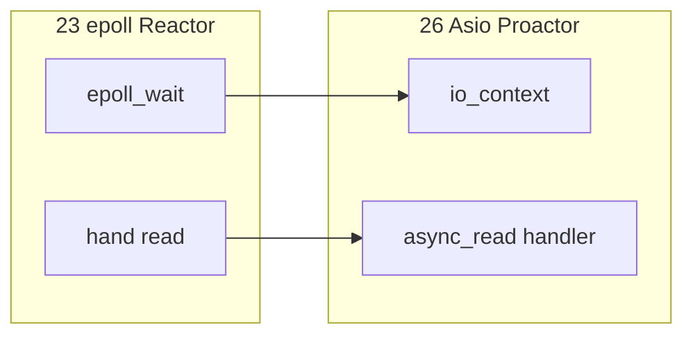
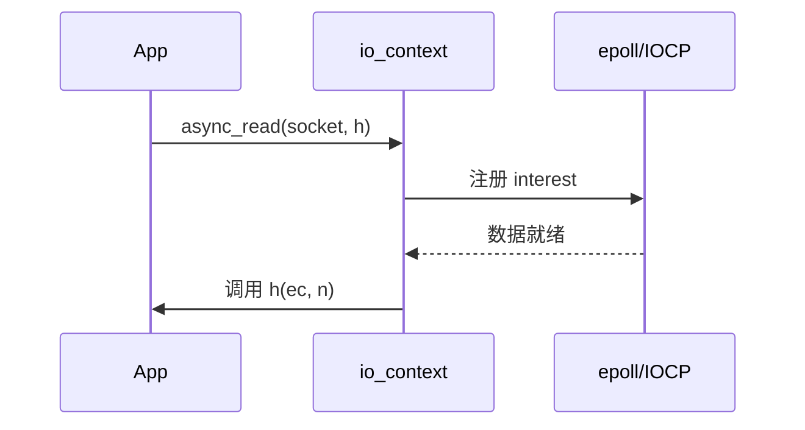

# Boost.Asio 异步网络编程

> **文件编码**：UTF-8。  
> **定位**：用 **Boost.Asio** 的 `io_context`、异步读写、strand 写跨平台高性能 Server——与 [23 章 epoll](23-IO多路复用与高性能Server.md) 对照，并为 C++20 协程网络库铺垫。  
> **交叉阅读**：[C++ 10 网络编程](10-网络编程与简易HTTP服务.md)、[C++ 23 IO 多路复用](23-IO多路复用与高性能Server.md)、[C++ 19 gRPC](19-gRPC与Protobuf工程化.md)、[C++ 08 多线程](08-多线程与并发编程.md)。

---

## 0. 读前导读（零基础也能跟上）

### 0.1 用一句话弄懂本章

**Boost.Asio** = C++ 里常用的 **异步 IO 框架**：你发起 `async_read`，线程不阻塞，完成后 **回调** 在 `io_context::run()` 里执行——Linux 底层仍是 epoll，Windows 是 IOCP。

### 0.2 你需要提前知道什么

- [10 章](10-网络编程与简易HTTP服务.md) socket、TCP 基础
- [23 章](23-IO多路复用与高性能Server.md) epoll/Reactor 概念
- [08 章](08-多线程与并发编程.md) 线程池
- [09 章](09-CMake与项目工程化.md) CMake 链 Boost

### 0.3 本章知识地图（☐→☑）

- [ ] 写最小 async echo server
- [ ] 解释 `io_context` / `run` / `post`
- [ ] 使用 `async_read_some` / `async_write`
- [ ] 对比 23 章手写 epoll 与 Asio
- [ ] 了解 `co_spawn` 协程前奏（C++20）
- [ ] §13 闭卷自测 ≥8/10

### 0.4 建议学习时长

**5～7 天**；需 Linux 或 Windows 上安装 Boost 1.70+。

### 0.5 学完你能做什么

用 Asio 改造 mini-http 为异步版；理解 gRPC 底层 completion queue 同类思想；选型 epoll 手写 vs Asio。

### 0.6 与 23 章 epoll 对比

| 维度 | 手写 epoll（23） | Boost.Asio |
|------|------------------|------------|
| 抽象 | 内核 API | Proactor 回调 |
| 跨平台 | Linux 为主 | IOCP/epoll/kqueue |
| 学习曲线 | 理解 OS | 理解异步模型 |
| 控制粒度 | 最高 | 稍封装 |
| LLM 网关 | 可以 | **推荐** 快速交付 |

---

## 本章与上一章的关系

[25 章](25-无锁编程与内存序.md) 解决 **线程间** 低延迟同步；网络服务还要 **单线程等多 socket**。[23 章](23-IO多路复用与高性能Server.md) 从 epoll 原理讲起；本章用 **Asio 工业 API** 实现同一目标，并衔接 [19 章 gRPC](19-gRPC与Protobuf工程化.md)（gRPC C++ 基于类似异步模型）。



---

## 1. 这份文档学什么

- `io_context` 事件循环
- `async_*` 与 completion handler
- `strand` 串行化 handler
- 多线程 `io_context::run`
- 与 epoll 的对应关系
- C++20 协程 `awaitable` 入门
- CMake 集成 Boost

---

## 2. 最小 async echo（C++17）

```cpp
#include <boost/asio.hpp>
#include <array>
#include <iostream>
#include <memory>

namespace asio = boost::asio;
using tcp = asio::ip::tcp;

class Session : public std::enable_shared_from_this<Session> {
    tcp::socket socket_;
    std::array<char, 1024> buf_{};

public:
    explicit Session(tcp::socket s) : socket_(std::move(s)) {}

    void start() { do_read(); }

private:
    void do_read() {
        auto self = shared_from_this();
        socket_.async_read_some(
            asio::buffer(buf_),
            [self](std::error_code ec, std::size_t n) {
                if (ec) return;
                asio::async_write(
                    self->socket_, asio::buffer(self->buf_.data(), n),
                    [self](std::error_code ec2, std::size_t) {
                        if (!ec2) self->do_read();
                    });
            });
    }
};

int main() {
    asio::io_context ioc;
    tcp::acceptor acceptor{ioc, {tcp::v4(), 8080}};

    std::function<void()> do_accept;
    do_accept = [&] {
        acceptor.async_accept(
            [&](std::error_code ec, tcp::socket socket) {
                if (!ec)
                    std::make_shared<Session>(std::move(socket))->start();
                do_accept();
            });
    };
    do_accept();
    ioc.run();
    return 0;
}
```

**要点**：`shared_from_this` 延长 Session 生命周期至异步操作完成；勿在栈对象上直接 async。

---

## 3. io_context 核心

```text
async_op(..., handler)
    → 注册到 io_context
io_context::run()
    → demux IO 就绪 / 完成
    → 调用 handler（可能在 run 的线程）
post(ioc, handler)  // 跨线程安全投递
```

| API | 作用 |
|-----|------|
| `run()` | 阻塞直到无工作 |
| `run_one()` | 处理一个事件 |
| `poll()` | 非阻塞处理已有 |
| `stop()` | 停止 run |
| `restart()` | stop 后再次 run |

---

## 4. async_read vs read_some

```cpp
// 读满 n 字节（可能多次底层 read）
asio::async_read(socket, asio::buffer(data, n), handler);

// 读「一些」——协议解析常用
socket.async_read_some(asio::buffer(buf), handler);
```

HTTP 需状态机：先读 header 到 `\r\n\r\n`，再按 Content-Length 读 body——可复用 [10 章](10-网络编程与简易HTTP服务.md) 逻辑，IO 改为 async。

---

## 5. 多线程与 strand

```cpp
asio::io_context ioc;
auto work = asio::make_work_guard(ioc);
asio::strand<asio::io_context::executor_type> strand{ioc.get_executor()};

for (int i = 0; i < 4; ++i)
    std::thread{[&] { ioc.run(); }}.detach();

// 同一 connection 的 handler 投递到 strand，避免并发写 socket
asio::post(strand, [&] { /* 线程安全的 per-connection 状态 */ });
```

**对比 23 章**：epoll + 线程池时，需保证 **同一 fd 不会在多线程同时写**；strand 等价于 **串行 executor**。

---

## 6. 与 23 章 epoll 架构对照

| 23 章手写 | Asio 等价 |
|-----------|-----------|
| `epoll_create` | `io_context` 构造 |
| `epoll_ctl ADD` | `async_accept` / `async_read` 内部注册 |
| `epoll_wait` | `run()` |
| 可读 → `read()` | completion handler |
| ET 读尽 | `async_read` 循环在 handler 内 |



**io_uring**（23 章）：Asio 新版本亦逐步支持；概念仍是 **提交异步 op → 完成回调**。

---

## 7. 定时器与 LLM 场景

```cpp
asio::steady_timer timer{ioc};
timer.expires_after(std::chrono::seconds(30));
timer.async_wait([](std::error_code ec) {
    if (!ec) /* 空闲连接超时，SSE 心跳 */;
});
```

| 场景 | Asio 组件 |
|------|-----------|
| HTTP 网关 | tcp acceptor + async read/write |
| SSE 流式 | 长连接 + 定时 flush |
| 健康检查 | 短连接 + deadline_timer |
| 调 gRPC | [19 章](19-gRPC与Protobuf工程化.md)；CPU 侧仍可能 Asio 接 HTTP |

**勿在 handler 里跑模型推理**——与 23 章相同，应投递到 worker/GPU 队列。

---

## 8. C++20 协程前奏

Boost.Asio 1.82+ 支持 `awaitable`（需 `-std=c++20`）：

```cpp
#include <boost/asio/awaitable.hpp>
#include <boost/asio/co_spawn.hpp>

namespace asio = boost::asio;
using tcp = asio::ip::tcp;

asio::awaitable<void> echo(tcp::socket socket) {
    std::array<char, 512> buf{};
    for (;;) {
        std::size_t n = co_await socket.async_read_some(
            asio::buffer(buf), asio::use_awaitable);
        co_await asio::async_write(
            socket, asio::buffer(buf.data(), n), asio::use_awaitable);
    }
}

// co_spawn(ioc, echo(std::move(sock)), detached);
```

**心智**：协程 **语法同步、执行异步**——比回调嵌套易读；底层仍是 completion token。

---

## 9. CMake 集成（衔接 09 章）

```cmake
cmake_minimum_required(VERSION 3.16)
project(asio_echo CXX)
set(CMAKE_CXX_STANDARD 17)

find_package(Boost 1.74 REQUIRED COMPONENTS system)

add_executable(echo_server src/main.cpp)
target_link_libraries(echo_server PRIVATE Boost::system)
# header-only asio 多数只需 Boost::system
```

Windows 额外定义 `WIN32_LEAN_AND_MEAN`；Linux 链 `pthread`。详见 [09 章 FetchContent / find_package](09-CMake与项目工程化.md)。

---

## 10. 错误处理与关闭

```cpp
void graceful_close(tcp::socket& s) {
    std::error_code ec;
    s.shutdown(tcp::socket::shutdown_send, ec);
    // 继续 async_read 直到对端关闭或 ec == eof
}
```

| ec | 含义 |
|----|------|
| `operation_aborted` | `ioc.stop()` 或 cancel |
| `eof` | 对端关闭 |
| `connection_reset` | RST |

对照 [10 章](10-网络编程与简易HTTP服务.md) SIGTERM 优雅退出：先 `acceptor.close()`，再 `ioc.stop()`。

---

## 11. 常见错误

| 错误 | 后果 |
|------|------|
| 栈对象 async 后销毁 | UB |
| 多线程写同一 socket 无 strand | 数据交错 |
| handler 内阻塞推理 | 全站卡顿 |
| 忽略 `error_code` | 死循环 async |
| 未 `shared_from_this` | use-after-free |

---

## 12. 练习与 FAQ

**练习**：mini-http 改 Asio async；4 线程 `run` ab 压测；画 23 章 epoll 与 Asio 时序对照。

**FAQ**：仍须学 23 章 epoll 原理；gRPC 自有 stack，HTTP 网关常用 Asio。

---

## 13. 闭卷自测

1. Asio 在 Linux 底层通常用什么？
2. `io_context::run` 做什么？
3. 为何 Session 需要 `shared_from_this`？
4. `async_read_some` 与 `async_read` 区别？
5. strand 解决什么问题？
6. Proactor 与 Reactor（23 章）一句话对比？
7. LLM 推理应放在哪个线程？
8. `post` 与 `dispatch` 区别（概念）？
9. C++20 协程对 Asio 的主要好处？
10. 本章与 10、19、23 章各如何衔接？

<details>
<summary>自测参考答案</summary>

1. **epoll**（Asio 的 io_uring 支持视版本而定）。
2. **驱动异步操作完成并调用 handler**，无工作时返回。
3. async 完成前 Session 不能析构；**shared_ptr 延长生命周期**。
4. **some** 读可用字节；**read** 读满指定长度。
5. **同一连接 handler 串行**，防多线程并发写 socket。
6. **Reactor**：就绪通知后 app 读；**Proactor**：完成时回调已读数据。
7. **独立 worker/GPU 线程**，不在 `run()` 线程。
8. **post** 一定稍后执行；**dispatch** 若已在 executor 可能立即执行。
9. **消除回调地狱**，代码像同步一样写异步逻辑。
10. **10** socket/HTTP；**19** RPC 与网关分工；**23** epoll 原理与架构对照。

</details>
---


## 14. 深度附录：io_context 与生产级 Asio

本章衔接 [23 章 epoll](23-IO多路复用与高性能Server.md) 与 [31 章协程](31-协程C++20-coroutine.md)。与 [65 章 io_uring](65-io_uring与高性能IO选型面试.md) **互补**：65 讲 Linux 新 IO 接口选型；本章讲 **可移植异步抽象层**。

---

## 14.1 io_context 线程模型

**单线程 `run()`**：无锁 handler，最简单；CPU 单核瓶颈。
**线程池 `run()`**：多线程并发 dispatch completion handler；同一 socket 上 handler 可能并发 → 需 **strand**。

```cpp
asio::io_context ioc;
asio::executor_work_guard guard(ioc.get_executor());
std::vector<std::thread> pool;
for (int i = 0; i < std::thread::hardware_concurrency(); ++i)
    pool.emplace_back([&]{ ioc.run(); });
// ... 启动 async 操作 ...
guard.reset();
for (auto& t : pool) t.join();
```

**LLM 网关**：`run()` 线程只做 IO 与调度；推理在 **worker 线程池 / GPU**，通过 `post` 回传结果。

---

## 14.2 strand 序列化

strand = **串行 executor**；绑定到 socket/session 保证 handler 顺序执行。

```cpp
auto strand = asio::make_strand(ioc);
asio::async_write(socket, buffer, asio::bind_executor(strand,
    [](std::error_code ec, std::size_t n) { /* 安全：无并发写 */ }));
```

**错误**：多线程 `ioc.run()` 但不 strand → 两个 `async_write` 交错 → 协议错乱。

---

## 14.3 协程 co_await 集成（C++20）

```cpp
#include <asio/co_spawn.hpp>
#include <asio/detached.hpp>
#include <asio/use_awaitable.hpp>

asio::awaitable<void> echo(tcp::socket socket) {
    char buf[1024];
    for (;;) {
        std::size_t n = co_await socket.async_read_some(
            asio::buffer(buf), asio::use_awaitable);
        co_await asio::async_write(socket, asio::buffer(buf, n),
            asio::use_awaitable);
    }
}

// main: co_spawn(ioc, echo(std::move(sock)), detached);
```

详见 [31 章](31-协程C++20-coroutine.md)；本章强调 **与回调版等价语义**。

---

## 14.4 buffer 所有权

`asio::buffer` 不拥有内存；async 期间 buffer 必须存活。

| 类型 | 所有权 |
|------|--------|
| `std::vector<char>` + buffer | 调用者保持 vector |
| `std::shared_ptr<vector>` | Session 成员 |
| `dynamic_buffer` | Asio 动态增长 |

**反模式**：栈上 `char buf[1024]` 在 async 返回前函数退出。

---

## 14.5 定时器 steady_timer

```cpp
asio::steady_timer timer(ioc, std::chrono::seconds(5));
timer.async_wait([](std::error_code ec) {
    if (!ec) { /* 超时 */ }
});
// 取消：timer.cancel(); → ec == operation_aborted
```

用于 **读超时、心跳、graceful shutdown 宽限期**。

---

## 14.6 SSL/TLS（asio::ssl）

```cpp
asio::ssl::context ctx(asio::ssl::context::tlsv12_server);
ctx.use_certificate_chain_file("server.pem");
ctx.use_private_key_file("server.key", asio::ssl::context::pem);
asio::ssl::stream<tcp::socket> ssl_stream(ioc, ctx);
co_await asio::async_handshake(ssl_stream, asio::ssl::stream_base::server, use_awaitable);
```

生产：证书轮换、SNI、ALPN（HTTP/2）；密钥勿提交 git。

---

## 14.7 与 31/65 章对照

| 章节 | 焦点 |
|---|---|
| 26 本章 | Asio 抽象、strand、协程入口 |
| 31 协程 | promise_type、co_await 机制 |
| 65 io_uring | Linux 原生 vs Asio 封装 |
| 23 epoll | Reactor 原理 |

---
## 14.8 Asio 工程笔记库（55 条）

### 14.8.1 Asio 笔记 #1

生产检查：strand、shared_from_this、error_code、超时、优雅关闭。

### 14.8.2 Asio 笔记 #2

生产检查：strand、shared_from_this、error_code、超时、优雅关闭。

### 14.8.3 Asio 笔记 #3

生产检查：strand、shared_from_this、error_code、超时、优雅关闭。

### 14.8.4 Asio 笔记 #4

生产检查：strand、shared_from_this、error_code、超时、优雅关闭。

### 14.8.5 Asio 笔记 #5

生产检查：strand、shared_from_this、error_code、超时、优雅关闭。

### 14.8.6 Asio 笔记 #6

生产检查：strand、shared_from_this、error_code、超时、优雅关闭。

### 14.8.7 Asio 笔记 #7

生产检查：strand、shared_from_this、error_code、超时、优雅关闭。

### 14.8.8 Asio 笔记 #8

生产检查：strand、shared_from_this、error_code、超时、优雅关闭。

### 14.8.9 Asio 笔记 #9

生产检查：strand、shared_from_this、error_code、超时、优雅关闭。

### 14.8.10 Asio 笔记 #10

生产检查：strand、shared_from_this、error_code、超时、优雅关闭。

### 14.8.11 Asio 笔记 #11

生产检查：strand、shared_from_this、error_code、超时、优雅关闭。

### 14.8.12 Asio 笔记 #12

生产检查：strand、shared_from_this、error_code、超时、优雅关闭。

### 14.8.13 Asio 笔记 #13

生产检查：strand、shared_from_this、error_code、超时、优雅关闭。

### 14.8.14 Asio 笔记 #14

生产检查：strand、shared_from_this、error_code、超时、优雅关闭。

### 14.8.15 Asio 笔记 #15

生产检查：strand、shared_from_this、error_code、超时、优雅关闭。

### 14.8.16 Asio 笔记 #16

生产检查：strand、shared_from_this、error_code、超时、优雅关闭。

### 14.8.17 Asio 笔记 #17

生产检查：strand、shared_from_this、error_code、超时、优雅关闭。

### 14.8.18 Asio 笔记 #18

生产检查：strand、shared_from_this、error_code、超时、优雅关闭。

### 14.8.19 Asio 笔记 #19

生产检查：strand、shared_from_this、error_code、超时、优雅关闭。

### 14.8.20 Asio 笔记 #20

生产检查：strand、shared_from_this、error_code、超时、优雅关闭。

### 14.8.21 Asio 笔记 #21

生产检查：strand、shared_from_this、error_code、超时、优雅关闭。

### 14.8.22 Asio 笔记 #22

生产检查：strand、shared_from_this、error_code、超时、优雅关闭。

### 14.8.23 Asio 笔记 #23

生产检查：strand、shared_from_this、error_code、超时、优雅关闭。

### 14.8.24 Asio 笔记 #24

生产检查：strand、shared_from_this、error_code、超时、优雅关闭。

### 14.8.25 Asio 笔记 #25

生产检查：strand、shared_from_this、error_code、超时、优雅关闭。

### 14.8.26 Asio 笔记 #26

生产检查：strand、shared_from_this、error_code、超时、优雅关闭。

### 14.8.27 Asio 笔记 #27

生产检查：strand、shared_from_this、error_code、超时、优雅关闭。

### 14.8.28 Asio 笔记 #28

生产检查：strand、shared_from_this、error_code、超时、优雅关闭。

### 14.8.29 Asio 笔记 #29

生产检查：strand、shared_from_this、error_code、超时、优雅关闭。

### 14.8.30 Asio 笔记 #30

生产检查：strand、shared_from_this、error_code、超时、优雅关闭。

### 14.8.31 Asio 笔记 #31

生产检查：strand、shared_from_this、error_code、超时、优雅关闭。

### 14.8.32 Asio 笔记 #32

生产检查：strand、shared_from_this、error_code、超时、优雅关闭。

### 14.8.33 Asio 笔记 #33

生产检查：strand、shared_from_this、error_code、超时、优雅关闭。

### 14.8.34 Asio 笔记 #34

生产检查：strand、shared_from_this、error_code、超时、优雅关闭。

### 14.8.35 Asio 笔记 #35

生产检查：strand、shared_from_this、error_code、超时、优雅关闭。

### 14.8.36 Asio 笔记 #36

生产检查：strand、shared_from_this、error_code、超时、优雅关闭。

### 14.8.37 Asio 笔记 #37

生产检查：strand、shared_from_this、error_code、超时、优雅关闭。

### 14.8.38 Asio 笔记 #38

生产检查：strand、shared_from_this、error_code、超时、优雅关闭。

### 14.8.39 Asio 笔记 #39

生产检查：strand、shared_from_this、error_code、超时、优雅关闭。

### 14.8.40 Asio 笔记 #40

生产检查：strand、shared_from_this、error_code、超时、优雅关闭。

### 14.8.41 Asio 笔记 #41

生产检查：strand、shared_from_this、error_code、超时、优雅关闭。

### 14.8.42 Asio 笔记 #42

生产检查：strand、shared_from_this、error_code、超时、优雅关闭。

### 14.8.43 Asio 笔记 #43

生产检查：strand、shared_from_this、error_code、超时、优雅关闭。

### 14.8.44 Asio 笔记 #44

生产检查：strand、shared_from_this、error_code、超时、优雅关闭。

### 14.8.45 Asio 笔记 #45

生产检查：strand、shared_from_this、error_code、超时、优雅关闭。

### 14.8.46 Asio 笔记 #46

生产检查：strand、shared_from_this、error_code、超时、优雅关闭。

### 14.8.47 Asio 笔记 #47

生产检查：strand、shared_from_this、error_code、超时、优雅关闭。

### 14.8.48 Asio 笔记 #48

生产检查：strand、shared_from_this、error_code、超时、优雅关闭。

### 14.8.49 Asio 笔记 #49

生产检查：strand、shared_from_this、error_code、超时、优雅关闭。

### 14.8.50 Asio 笔记 #50

生产检查：strand、shared_from_this、error_code、超时、优雅关闭。

### 14.8.51 Asio 笔记 #51

生产检查：strand、shared_from_this、error_code、超时、优雅关闭。

### 14.8.52 Asio 笔记 #52

生产检查：strand、shared_from_this、error_code、超时、优雅关闭。

### 14.8.53 Asio 笔记 #53

生产检查：strand、shared_from_this、error_code、超时、优雅关闭。

### 14.8.54 Asio 笔记 #54

生产检查：strand、shared_from_this、error_code、超时、优雅关闭。

### 14.8.55 Asio 笔记 #55

生产检查：strand、shared_from_this、error_code、超时、优雅关闭。

---

## 14.9 深度 FAQ 与自测

**Q：Asio 深度问 #1**

见 §14.1～14.6。

**Q：Asio 深度问 #2**

见 §14.1～14.6。

**Q：Asio 深度问 #3**

见 §14.1～14.6。

**Q：Asio 深度问 #4**

见 §14.1～14.6。

**Q：Asio 深度问 #5**

见 §14.1～14.6。

**Q：Asio 深度问 #6**

见 §14.1～14.6。

**Q：Asio 深度问 #7**

见 §14.1～14.6。

**Q：Asio 深度问 #8**

见 §14.1～14.6。

**Q：Asio 深度问 #9**

见 §14.1～14.6。

**Q：Asio 深度问 #10**

见 §14.1～14.6。

**Q：Asio 深度问 #11**

见 §14.1～14.6。

**Q：Asio 深度问 #12**

见 §14.1～14.6。

**Q：Asio 深度问 #13**

见 §14.1～14.6。

**Q：Asio 深度问 #14**

见 §14.1～14.6。

**Q：Asio 深度问 #15**

见 §14.1～14.6。

**Q：Asio 深度问 #16**

见 §14.1～14.6。

**Q：Asio 深度问 #17**

见 §14.1～14.6。

**Q：Asio 深度问 #18**

见 §14.1～14.6。

**Q：Asio 深度问 #19**

见 §14.1～14.6。

**Q：Asio 深度问 #20**

见 §14.1～14.6。

### 深度补充 1

复习主线：对照本章知识地图，逐项打勾 ☐→☑。

### 深度补充 2

动手实验：将正文代码编译运行，观察输出与 benchmark 数字。

### 深度补充 3

画图练习：在纸上复现本章核心数据结构或内存布局图。

### 深度补充 4

代码练习：为正文示例补充单元测试（见 27 章 gtest）。

### 深度补充 5

交叉阅读：按章末「与 XX 章互补」表格完成串联复习。

### 深度补充 6

面试模拟：3 分钟口述本章 3 个高频追问与参考答案。

### 深度补充 7

生产 checklist：列出上线前必须验证的 5 条工程检查项。

### 深度补充 8

常见误区：回顾正文 FAQ，写一句「我曾误以为…其实…」。

### 深度补充 9

复习主线：对照本章知识地图，逐项打勾 ☐→☑。

### 深度补充 10

动手实验：将正文代码编译运行，观察输出与 benchmark 数字。

### 深度补充 11

画图练习：在纸上复现本章核心数据结构或内存布局图。

### 深度补充 12

代码练习：为正文示例补充单元测试（见 27 章 gtest）。

### 深度补充 13

交叉阅读：按章末「与 XX 章互补」表格完成串联复习。

### 深度补充 14

面试模拟：3 分钟口述本章 3 个高频追问与参考答案。

### 深度补充 15

生产 checklist：列出上线前必须验证的 5 条工程检查项。

### 深度补充 16

常见误区：回顾正文 FAQ，写一句「我曾误以为…其实…」。

### 深度补充 17

复习主线：对照本章知识地图，逐项打勾 ☐→☑。

### 深度补充 18

动手实验：将正文代码编译运行，观察输出与 benchmark 数字。

### 深度补充 19

画图练习：在纸上复现本章核心数据结构或内存布局图。

### 深度补充 20

代码练习：为正文示例补充单元测试（见 27 章 gtest）。

### 深度补充 21

交叉阅读：按章末「与 XX 章互补」表格完成串联复习。

### 深度补充 22

面试模拟：3 分钟口述本章 3 个高频追问与参考答案。

### 深度补充 23

生产 checklist：列出上线前必须验证的 5 条工程检查项。

### 深度补充 24

常见误区：回顾正文 FAQ，写一句「我曾误以为…其实…」。

### 深度补充 25

复习主线：对照本章知识地图，逐项打勾 ☐→☑。

### 深度补充 26

动手实验：将正文代码编译运行，观察输出与 benchmark 数字。

### 深度补充 27

画图练习：在纸上复现本章核心数据结构或内存布局图。

### 深度补充 28

代码练习：为正文示例补充单元测试（见 27 章 gtest）。

### 深度补充 29

交叉阅读：按章末「与 XX 章互补」表格完成串联复习。

### 深度补充 30

面试模拟：3 分钟口述本章 3 个高频追问与参考答案。

### 深度补充 31

生产 checklist：列出上线前必须验证的 5 条工程检查项。

### 深度补充 32

常见误区：回顾正文 FAQ，写一句「我曾误以为…其实…」。

### 深度补充 33

复习主线：对照本章知识地图，逐项打勾 ☐→☑。

### 深度补充 34

动手实验：将正文代码编译运行，观察输出与 benchmark 数字。

### 深度补充 35

画图练习：在纸上复现本章核心数据结构或内存布局图。

### 深度补充 36

代码练习：为正文示例补充单元测试（见 27 章 gtest）。

### 深度补充 37

交叉阅读：按章末「与 XX 章互补」表格完成串联复习。

### 深度补充 38

面试模拟：3 分钟口述本章 3 个高频追问与参考答案。

### 深度补充 39

生产 checklist：列出上线前必须验证的 5 条工程检查项。

### 深度补充 40

常见误区：回顾正文 FAQ，写一句「我曾误以为…其实…」。

### 深度补充 41

复习主线：对照本章知识地图，逐项打勾 ☐→☑。

### 深度补充 42

动手实验：将正文代码编译运行，观察输出与 benchmark 数字。

### 深度补充 43

画图练习：在纸上复现本章核心数据结构或内存布局图。

### 深度补充 44

代码练习：为正文示例补充单元测试（见 27 章 gtest）。

### 深度补充 45

交叉阅读：按章末「与 XX 章互补」表格完成串联复习。

### 深度补充 46

面试模拟：3 分钟口述本章 3 个高频追问与参考答案。

### 深度补充 47

生产 checklist：列出上线前必须验证的 5 条工程检查项。

### 深度补充 48

常见误区：回顾正文 FAQ，写一句「我曾误以为…其实…」。

### 深度补充 49

复习主线：对照本章知识地图，逐项打勾 ☐→☑。

### 深度补充 50

动手实验：将正文代码编译运行，观察输出与 benchmark 数字。

### 深度补充 51

画图练习：在纸上复现本章核心数据结构或内存布局图。

### 深度补充 52

代码练习：为正文示例补充单元测试（见 27 章 gtest）。

### 深度补充 53

交叉阅读：按章末「与 XX 章互补」表格完成串联复习。

### 深度补充 54

面试模拟：3 分钟口述本章 3 个高频追问与参考答案。

### 深度补充 55

生产 checklist：列出上线前必须验证的 5 条工程检查项。

### 深度补充 56

常见误区：回顾正文 FAQ，写一句「我曾误以为…其实…」。

### 深度补充 57

复习主线：对照本章知识地图，逐项打勾 ☐→☑。

### 深度补充 58

动手实验：将正文代码编译运行，观察输出与 benchmark 数字。

### 深度补充 59

画图练习：在纸上复现本章核心数据结构或内存布局图。

### 深度补充 60

代码练习：为正文示例补充单元测试（见 27 章 gtest）。

### 深度补充 61

交叉阅读：按章末「与 XX 章互补」表格完成串联复习。

### 深度补充 62

面试模拟：3 分钟口述本章 3 个高频追问与参考答案。

### 深度补充 63

生产 checklist：列出上线前必须验证的 5 条工程检查项。

### 深度补充 64

常见误区：回顾正文 FAQ，写一句「我曾误以为…其实…」。

### 深度补充 65

复习主线：对照本章知识地图，逐项打勾 ☐→☑。

### 深度补充 66

动手实验：将正文代码编译运行，观察输出与 benchmark 数字。

### 深度补充 67

画图练习：在纸上复现本章核心数据结构或内存布局图。

### 深度补充 68

代码练习：为正文示例补充单元测试（见 27 章 gtest）。

### 深度补充 69

交叉阅读：按章末「与 XX 章互补」表格完成串联复习。

### 深度补充 70

面试模拟：3 分钟口述本章 3 个高频追问与参考答案。

### 深度补充 71

生产 checklist：列出上线前必须验证的 5 条工程检查项。

### 深度补充 72

常见误区：回顾正文 FAQ，写一句「我曾误以为…其实…」。

### 深度补充 73

复习主线：对照本章知识地图，逐项打勾 ☐→☑。

### 深度补充 74

动手实验：将正文代码编译运行，观察输出与 benchmark 数字。

### 深度补充 75

画图练习：在纸上复现本章核心数据结构或内存布局图。

### 深度补充 76

代码练习：为正文示例补充单元测试（见 27 章 gtest）。

### 深度补充 77

交叉阅读：按章末「与 XX 章互补」表格完成串联复习。

### 深度补充 78

面试模拟：3 分钟口述本章 3 个高频追问与参考答案。

### 深度补充 79

生产 checklist：列出上线前必须验证的 5 条工程检查项。


---

## 下一章预告

异步服务代码量上升，**回归测试** 不可少。[27 章 Google Test 与单元测试工程](27-Google-Test与单元测试工程.md) 讲 gtest/gmock、CMake 集成与 CI，为 Asio 服务写协议解析单测。

---

*下一章：27 Google Test 与单元测试工程*
