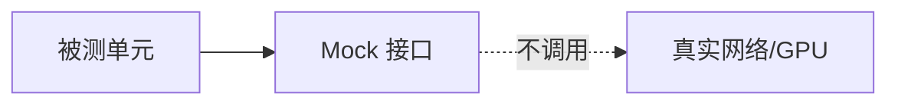

# Google Test 与单元测试工程

> **文件编码**：UTF-8。  
> **定位**：用 **Google Test / Google Mock** 为 C++ 模块建立 **可重复验证**——CMake 集成、TDD 节奏、CI 门禁，支撑 [26 章 Asio 服务](26-Boost.Asio异步网络编程.md) 与 [19 章 gRPC](19-gRPC与Protobuf工程化.md) 持续演进。  
> **交叉阅读**：[C++ 09 CMake](09-CMake与项目工程化.md)、[C++ 14 面试](14-高频面试专题与场景题.md)、[C++ 12 性能分析](12-性能分析与调试.md)、[Git 基础](../../Git/01-Git基础与常用命令.md)。

---

## 0. 读前导读（零基础也能跟上）

### 0.1 用一句话弄懂本章

**单元测试** = 自动检查「小函数/小类」在改代码后仍正确；**gtest** 提供断言与测试发现，**gmock** 伪造依赖——Infra 工程改 scheduler 不怕 silent break。

### 0.2 你需要提前知道什么

- [09 章](09-CMake与项目工程化.md) `add_executable`、`target_link_libraries`
- [07 章](07-异常处理与RAII.md) 异常与 RAII
- [03 章](03-面向对象与类设计.md) 接口与依赖注入
- 会用终端跑 `ctest`

### 0.3 本章知识地图（☐→☑）

- [ ] 写 `TEST` / `TEST_F` / `EXPECT_*` / `ASSERT_*`
- [ ] CMake `FetchContent` 或 `find_package` 拉 gtest
- [ ] 用 gmock `MOCK_METHOD` 隔离 IO
- [ ] 理解 TDD 红-绿-重构
- [ ] 配置 GitHub Actions / 本地 `ctest`
- [ ] §13 闭卷自测 ≥8/10

### 0.4 建议学习时长

**3～4 天**；给 [26 章](26-Boost.Asio异步网络编程.md) HTTP 解析或 [24 章](24-内存分配器与对象池.md) 对象池写测试。

### 0.5 学完你能做什么

为 mini-http 加 CI；mock 网络层测业务逻辑；面试讲清单元测试 vs 集成测试。

### 0.6 测试金字塔（Infra 向）

```text
        /\
       /E2E\        少量：整链推理 smoke
      /------\
     / 集成   \      gRPC 客户端 ↔ 假 server
    /----------\
   /  单元 gtest \   解析器、池、调度算法
  /--------------\
```

---

## 本章与上一章的关系

[26 章](26-Boost.Asio异步网络编程.md) 异步网络代码 **回调多、状态机复杂**——手工 curl 不够。[09 章](09-CMake与项目工程化.md) 已提 Catch2/FetchContent；本章 **系统化 gtest/gmock**，与工业 CI 默认栈对齐。

| 上一章（26） | 本章（27） | 下一章（28） |
|--------------|------------|--------------|
| Asio 服务 | 单测保障重构 | 手写 STL 面试 |
| 难手工回归 | gtest 自动化 | vector/string 手撕 |

---

## 1. 这份文档学什么

- Google Test 断言与 fixture
- Google Mock 期望与参数匹配
- CMake 集成与 `enable_testing`
- TDD 工作流
- CI：`ctest` + GitHub Actions
- 测试分层与 Infra 案例

---

## 2. 第一个 gtest（C++17）

```cpp
// src/calc.h
#pragma once
int add(int a, int b);

// src/calc.cpp
int add(int a, int b) { return a + b; }

// tests/test_calc.cpp
#include "calc.h"
#include <gtest/gtest.h>

TEST(CalcTest, AddPositive) {
    EXPECT_EQ(add(2, 3), 5);
}

TEST(CalcTest, AddNegative) {
    ASSERT_EQ(add(-1, -1), -2);
}
```

| 宏 | 行为 |
|----|------|
| `EXPECT_*` | 失败继续跑 |
| `ASSERT_*` | 失败当前测试停止 |
| `EXPECT_THROW` | 期望异常 |
| `EXPECT_NEAR` | 浮点近似 |

---

## 3. TEST_F 与 Fixture

```cpp
#include <gtest/gtest.h>
#include <vector>

class VectorTest : public ::testing::Test {
protected:
    void SetUp() override { v = {1, 2, 3}; }
    void TearDown() override {}
    std::vector<int> v;
};

TEST_F(VectorTest, Size) {
    EXPECT_EQ(v.size(), 3u);
}

TEST_F(VectorTest, PushBack) {
    v.push_back(4);
    EXPECT_EQ(v.back(), 4);
}
```

**用途**：对象池、arena 等 **每测独立初始化**（衔接 [24 章](24-内存分配器与对象池.md)）。

---

## 4. CMake 集成（FetchContent）

```cmake
cmake_minimum_required(VERSION 3.16)
project(demo_test CXX)
set(CMAKE_CXX_STANDARD 17)

include(FetchContent)
FetchContent_Declare(
  googletest
  URL https://github.com/google/googletest/archive/refs/tags/v1.14.0.zip
)
set(gtest_force_shared_crt ON CACHE BOOL "" FORCE)
FetchContent_MakeAvailable(googletest)

add_library(calc src/calc.cpp)
target_include_directories(calc PUBLIC ${CMAKE_CURRENT_SOURCE_DIR}/src)

enable_testing()

add_executable(calc_tests tests/test_calc.cpp)
target_link_libraries(calc_tests PRIVATE calc GTest::gtest_main)
include(GoogleTest)
gtest_discover_tests(calc_tests)
```

```bash
cmake -S . -B build
cmake --build build
ctest --test-dir build --output-on-failure
```

对照 [09 章](09-CMake与项目工程化.md) §5 FetchContent。

---

## 5. Google Mock 入门

```cpp
#include <gmock/gmock.h>
#include <gtest/gtest.h>

class Database {
public:
    virtual ~Database() = default;
    virtual int query(const std::string& sql) = 0;
};

class MockDb : public Database {
public:
    MOCK_METHOD(int, query, (const std::string& sql), (override));
};

int count_users(Database& db) {
    return db.query("SELECT COUNT(*) FROM users");
}

TEST(UserService, Count) {
    MockDb db;
    EXPECT_CALL(db, query(testing::_))
        .WillOnce(testing::Return(42));
    EXPECT_EQ(count_users(db), 42);
}
```

**场景**：测 scheduler 逻辑时 **mock GPU runtime**，不测真实 CUDA。



---

## 6. 测什么 / 不测什么

| 适合单元测 | 不适合（改集成/E2E） |
|------------|----------------------|
| HTTP header 解析 | 真实 epoll 压测 |
| Tokenizer 边界 | 整模型精度 |
| 对象池 acquire/release | 跨机 gRPC 延迟 |
| 调度 batch 合并逻辑 | 驱动/GPU 组合 |

[12 章](12-性能分析与调试.md) benchmark **不是** gtest 替代——可写 **阈值断言**（回归变慢则 fail）。

---

## 7. TDD 红-绿-重构

```text
1. 红：先写失败测试 describe 行为
2. 绿：最小实现让测试过
3. 重构：去重复，测试仍绿
```

**示例**：为 [26 章](26-Boost.Asio异步网络编程.md) 写 `parse_content_length(header)` 测试 → 再实现。

| 阶段 | 产出 |
|------|------|
| 红 | `EXPECT_EQ(parse_cl("Content-Length: 10"), 10)` 编译/失败 |
| 绿 | 实现 strstr/parse |
| 重构 | 无裸指针、加 RFC 边界测例 |

---

## 8. 参数化测试

```cpp
class ParseClTest : public ::testing::TestWithParam<std::pair<std::string, int>> {};

TEST_P(ParseClTest, Cases) {
    auto [hdr, want] = GetParam();
    EXPECT_EQ(parse_content_length(hdr), want);
}

INSTANTIATE_TEST_SUITE_P(
    Http, ParseClTest,
    ::testing::Values(
        std::make_pair("Content-Length: 0\r\n", 0),
        std::make_pair("Content-Length: 999\r\n", 999)));
```

---

## 9. CI 示例（GitHub Actions）

```yaml
name: ci
on: [push, pull_request]
jobs:
  test:
    runs-on: ubuntu-latest
    steps:
      - uses: actions/checkout@v4
      - name: configure
        run: cmake -S . -B build -DCMAKE_BUILD_TYPE=Release
      - name: build
        run: cmake --build build -j
      - name: test
        run: ctest --test-dir build --output-on-failure
```

Release 构建测 **优化下 UB**；Debug 测更易调试。可并行 [Git](../../Git/01-Git基础与常用命令.md) pre-push hook 跑 `ctest`。

---

## 10. Infra 工程案例

### 10.1 对象池测试（24 章）

```cpp
TEST(ObjectPoolTest, AcquireReleaseReuse) {
    ObjectPool<Payload> pool{4};
    auto* a = pool.acquire(1);
    pool.release(a);
    auto* b = pool.acquire(2);
    EXPECT_EQ(b->id, 2);
    pool.release(b);
}
```

### 10.2 SPSC 测试（25 章）

多线程 `TEST` 内 join producer/consumer，断言 push 数量 == pop 数量。

### 10.3 gRPC 客户端

集成测用 **假 server** 或 `InProcessChannel`（[19 章](19-gRPC与Protobuf工程化.md)），单元测只 mock stub。

---

## 11. 常见错误

| 错误 | 修复 |
|------|------|
| 测试依赖执行顺序 | 每 `TEST` 独立 |
| 全局 mutable 状态 | fixture SetUp/TearDown |
| 测 private 细节 | 测行为或 `friend` 测试（慎用） |
| flaky 多线程 | 固定 seed、循环断言 |
| CI 未跑 ctest | `enable_testing` + discover |

---

## 12. 与 Catch2 对比

| | gtest | Catch2 |
|---|-------|--------|
| 生态 | Google、Android | 头部 only、轻 |
| Mock | gmock 一体 | 第三方 |
| 09 章 | 均可用 FetchContent | 均可用 |

Infra/大厂 C++ **gtest 更常见**；个人小项目 Catch2 亦可。

---

## 13. 闭卷自测

1. `EXPECT_EQ` 与 `ASSERT_EQ` 区别？
2. `TEST_F` 中 `SetUp` 何时调用？
3. CMake 中 `gtest_discover_tests` 作用？
4. gmock `EXPECT_CALL` 顺序默认？
5. 单元测试与集成测试边界（举一例）？
6. TDD「红」阶段指什么？
7. 为何不测真实 GPU kernel 于 gtest？
8. `FetchContent` 与系统安装 gtest 优劣？
9. flaky test 常见原因？
10. 本章与 09、26、24 章如何配合？

<details>
<summary>自测参考答案</summary>

1. **EXPECT** 失败继续；**ASSERT** 失败终止当前测试函数。
2. **每个 TEST_F 运行前** 调用一次。
3. 注册CTest 用例，**`ctest` 自动发现** 各 `TEST`。
4. 默认 **顺序敏感**（untyped mock）；可 `InSequence`。
5. 单元：**parse header**；集成：**真实 TCP 连 localhost**。
6. **测试先写且当前实现失败**（或未实现）。
7. **慢、依赖硬件、难 CI**；应用 mock 或专用集成流水线。
8. **FetchContent** 版本锁定、免安装；系统包 **更快** 但版本不一。
9. **竞态、依赖时间、网络、全局状态**。
10. **09** 构建；**26** 测协议；**24** 测池逻辑。

</details>
---


## 14. 深度附录：测试工程化全景

与 [88 章 代码质量](88-代码质量重构与代码审查.md) **互补**：88 讲审查与重构；本章讲 **自动化验证**。

---

## 14.1 TDD：红-绿-重构

1. **红**：写失败测试（功能未实现）
2. **绿**：最小实现使测试通过
3. **重构**：改善结构，测试仍绿

```cpp
// 红：先写测试
TEST(ParseTest, EmptyLine) {
    EXPECT_EQ(parse_int(""), std::nullopt);
}
// 绿：实现 parse_int
// 重构：提取 trim、错误类型
```

---

## 14.2 测试金字塔

```
        /\  E2E（少量）
       /  \ 集成（适中）
      /____\ 单元（大量）
```
Infra：**单测** 覆盖 parse/池/队列；**集成** 测 TCP loopback；**E2E** 压测环境。

---

## 14.3 gmock matcher 进阶

```cpp
using ::testing::_;
using ::testing::Gt;
using ::testing::Return;
using ::testing::StrictMock;

TEST(MockTest, Matcher) {
    StrictMock<MockService> svc;
    EXPECT_CALL(svc, compute(Gt(0)))
        .Times(2)
        .WillRepeatedly(Return(42));
    EXPECT_EQ(svc.compute(1), 42);
}
```

---

## 14.4 参数化测试

```cpp
class ParseFixture : public ::testing::TestWithParam<std::tuple<std::string, int>> {};
TEST_P(ParseFixture, Values) {
    auto [input, expected] = GetParam();
    EXPECT_EQ(parse_int(input), expected);
}
INSTANTIATE_TEST_SUITE_P(Cases, ParseFixture,
    ::testing::Values(
        std::make_tuple("42", 42),
        std::make_tuple("-1", -1)));
```

---

## 14.5 死亡测试

```cpp
TEST(DeathTest, Assert) {
    EXPECT_DEATH({
        fatal_check(false);
    }, "fatal_check");
}
// Windows 需 _CRTDBG_MAP_ALLOC 等；CI 上谨慎使用
```

---

## 14.6 夹具 SetUp/TearDown

```cpp
class PoolFixture : public ::testing::Test {
protected:
    void SetUp() override { pool = std::make_unique<ObjectPool<Item>>(8); }
    void TearDown() override { pool.reset(); }
    std::unique_ptr<ObjectPool<Item>> pool;
};
TEST_F(PoolFixture, Acquire) { ASSERT_NE(pool->acquire(), nullptr); }
```

---

## 14.7 覆盖率与 CI

```yaml
# GitHub Actions 片段
- run: cmake -B build -DCMAKE_BUILD_TYPE=Debug
- run: cmake --build build
- run: cd build && ctest --output-on-failure
- run: gcov / lcov 生成报告
```

---

## 14.8 Google Benchmark

```cpp
#include <benchmark/benchmark.h>
static void BM_Parse(benchmark::State& st) {
    for (auto _ : st) benchmark::DoNotOptimize(parse_int("12345"));
}
BENCHMARK(BM_Parse);
BENCHMARK_MAIN();
```

与功能测试分离；benchmark 用 Release 构建。

---
## 14.9 测试工程笔记库（55 条）

### 14.9.1 测试笔记 #1

测试命名：Method_State_Expected；避免 sleep；隔离全局状态。

### 14.9.2 测试笔记 #2

测试命名：Method_State_Expected；避免 sleep；隔离全局状态。

### 14.9.3 测试笔记 #3

测试命名：Method_State_Expected；避免 sleep；隔离全局状态。

### 14.9.4 测试笔记 #4

测试命名：Method_State_Expected；避免 sleep；隔离全局状态。

### 14.9.5 测试笔记 #5

测试命名：Method_State_Expected；避免 sleep；隔离全局状态。

### 14.9.6 测试笔记 #6

测试命名：Method_State_Expected；避免 sleep；隔离全局状态。

### 14.9.7 测试笔记 #7

测试命名：Method_State_Expected；避免 sleep；隔离全局状态。

### 14.9.8 测试笔记 #8

测试命名：Method_State_Expected；避免 sleep；隔离全局状态。

### 14.9.9 测试笔记 #9

测试命名：Method_State_Expected；避免 sleep；隔离全局状态。

### 14.9.10 测试笔记 #10

测试命名：Method_State_Expected；避免 sleep；隔离全局状态。

### 14.9.11 测试笔记 #11

测试命名：Method_State_Expected；避免 sleep；隔离全局状态。

### 14.9.12 测试笔记 #12

测试命名：Method_State_Expected；避免 sleep；隔离全局状态。

### 14.9.13 测试笔记 #13

测试命名：Method_State_Expected；避免 sleep；隔离全局状态。

### 14.9.14 测试笔记 #14

测试命名：Method_State_Expected；避免 sleep；隔离全局状态。

### 14.9.15 测试笔记 #15

测试命名：Method_State_Expected；避免 sleep；隔离全局状态。

### 14.9.16 测试笔记 #16

测试命名：Method_State_Expected；避免 sleep；隔离全局状态。

### 14.9.17 测试笔记 #17

测试命名：Method_State_Expected；避免 sleep；隔离全局状态。

### 14.9.18 测试笔记 #18

测试命名：Method_State_Expected；避免 sleep；隔离全局状态。

### 14.9.19 测试笔记 #19

测试命名：Method_State_Expected；避免 sleep；隔离全局状态。

### 14.9.20 测试笔记 #20

测试命名：Method_State_Expected；避免 sleep；隔离全局状态。

### 14.9.21 测试笔记 #21

测试命名：Method_State_Expected；避免 sleep；隔离全局状态。

### 14.9.22 测试笔记 #22

测试命名：Method_State_Expected；避免 sleep；隔离全局状态。

### 14.9.23 测试笔记 #23

测试命名：Method_State_Expected；避免 sleep；隔离全局状态。

### 14.9.24 测试笔记 #24

测试命名：Method_State_Expected；避免 sleep；隔离全局状态。

### 14.9.25 测试笔记 #25

测试命名：Method_State_Expected；避免 sleep；隔离全局状态。

### 14.9.26 测试笔记 #26

测试命名：Method_State_Expected；避免 sleep；隔离全局状态。

### 14.9.27 测试笔记 #27

测试命名：Method_State_Expected；避免 sleep；隔离全局状态。

### 14.9.28 测试笔记 #28

测试命名：Method_State_Expected；避免 sleep；隔离全局状态。

### 14.9.29 测试笔记 #29

测试命名：Method_State_Expected；避免 sleep；隔离全局状态。

### 14.9.30 测试笔记 #30

测试命名：Method_State_Expected；避免 sleep；隔离全局状态。

### 14.9.31 测试笔记 #31

测试命名：Method_State_Expected；避免 sleep；隔离全局状态。

### 14.9.32 测试笔记 #32

测试命名：Method_State_Expected；避免 sleep；隔离全局状态。

### 14.9.33 测试笔记 #33

测试命名：Method_State_Expected；避免 sleep；隔离全局状态。

### 14.9.34 测试笔记 #34

测试命名：Method_State_Expected；避免 sleep；隔离全局状态。

### 14.9.35 测试笔记 #35

测试命名：Method_State_Expected；避免 sleep；隔离全局状态。

### 14.9.36 测试笔记 #36

测试命名：Method_State_Expected；避免 sleep；隔离全局状态。

### 14.9.37 测试笔记 #37

测试命名：Method_State_Expected；避免 sleep；隔离全局状态。

### 14.9.38 测试笔记 #38

测试命名：Method_State_Expected；避免 sleep；隔离全局状态。

### 14.9.39 测试笔记 #39

测试命名：Method_State_Expected；避免 sleep；隔离全局状态。

### 14.9.40 测试笔记 #40

测试命名：Method_State_Expected；避免 sleep；隔离全局状态。

### 14.9.41 测试笔记 #41

测试命名：Method_State_Expected；避免 sleep；隔离全局状态。

### 14.9.42 测试笔记 #42

测试命名：Method_State_Expected；避免 sleep；隔离全局状态。

### 14.9.43 测试笔记 #43

测试命名：Method_State_Expected；避免 sleep；隔离全局状态。

### 14.9.44 测试笔记 #44

测试命名：Method_State_Expected；避免 sleep；隔离全局状态。

### 14.9.45 测试笔记 #45

测试命名：Method_State_Expected；避免 sleep；隔离全局状态。

### 14.9.46 测试笔记 #46

测试命名：Method_State_Expected；避免 sleep；隔离全局状态。

### 14.9.47 测试笔记 #47

测试命名：Method_State_Expected；避免 sleep；隔离全局状态。

### 14.9.48 测试笔记 #48

测试命名：Method_State_Expected；避免 sleep；隔离全局状态。

### 14.9.49 测试笔记 #49

测试命名：Method_State_Expected；避免 sleep；隔离全局状态。

### 14.9.50 测试笔记 #50

测试命名：Method_State_Expected；避免 sleep；隔离全局状态。

### 14.9.51 测试笔记 #51

测试命名：Method_State_Expected；避免 sleep；隔离全局状态。

### 14.9.52 测试笔记 #52

测试命名：Method_State_Expected；避免 sleep；隔离全局状态。

### 14.9.53 测试笔记 #53

测试命名：Method_State_Expected；避免 sleep；隔离全局状态。

### 14.9.54 测试笔记 #54

测试命名：Method_State_Expected；避免 sleep；隔离全局状态。

### 14.9.55 测试笔记 #55

测试命名：Method_State_Expected；避免 sleep；隔离全局状态。

---

## 14.10 与 88 章互补

88：code review checklist、重构安全网；27：gtest 写安全网。合并流程：**PR → CI 跑 ctest → review → merge**。

---

## 14.11 Mock 进阶：Action、Sequence、NiceMock

```cpp
using ::testing::InSequence;
using ::testing::Invoke;
using ::testing::NiceMock;

TEST(MockAdvanced, Sequence) {
    MockDatabase db;
    InSequence seq;
    EXPECT_CALL(db, query("users")).WillOnce(Return(10));
    EXPECT_CALL(db, query("orders")).WillOnce(Return(5));
    EXPECT_EQ(db.query("users"), 10);
    EXPECT_EQ(db.query("orders"), 5);
}

TEST(MockAdvanced, Invoke) {
    MockParser p;
    EXPECT_CALL(p, parse).WillOnce(Invoke([](std::string_view s) {
        return s.size();
    }));
    EXPECT_EQ(p.parse("hello"), 5);
}
```

**NiceMock**：默认允许未预期调用；**StrictMock**：多一个未预期调用即失败。

---

## 14.12 测试隔离与 flaky 治理

| flaky 原因 | 治理 |
|---|---|
| 竞态 | ThreadSanitizer + 固定调度 |
| 依赖时间 | 注入 Clock 接口 mock |
| 网络 | loopback / mock server |
| 全局状态 | fixture TearDown 重置 |
| 顺序依赖 | 每 TEST 独立数据 |

**CI 策略**：flaky 测试 **quarantine** 标记，修复前不计入 gate。

---

## 14.13 lcov 覆盖率实战

```bash
# GCC
cmake -DCMAKE_CXX_FLAGS='--coverage' -B build
cmake --build build && ctest
lcov --capture --directory build --output-file coverage.info
genhtml coverage.info -o cov_html
```
**目标**：核心模块 line coverage >80%；**不追求** 100%——UI/glue 可排除。

---

## 14.14 Google Benchmark 与 gtest 分工

| 工具 | 回答 | 构建 |
|------|------|------|
| gtest | 对不对 | Debug/RelWithDebInfo |
| benchmark | 快不快 | Release -O2/-O3 |

同一函数：**先 gtest 保正确**，再 benchmark 做回归；CI 中 benchmark 可 nightly 跑。

---

## 14.15 Asio/Pool 测试模板（26/24 章）

```cpp
// 协议解析纯函数 → 单测
TEST(HttpParser, GetLine) {
    EXPECT_EQ(parse_request_line("GET / HTTP/1.1"), std::optional{...});
}

// 对象池 → fixture + 多线程 stress（25 章）
TEST_F(PoolFixture, ConcurrentAcquireRelease) {
    std::vector<std::thread> ts;
    for (int i = 0; i < 8; ++i)
        ts.emplace_back([&]{ /* acquire/release loop */ });
    for (auto& t : ts) t.join();
}
```

---

## 14.16 深度 FAQ（15 问）

**Q：TEST 与 TEST_F 区别？**

TEST_F 继承 fixture，有 SetUp/TearDown；TEST 无。

**Q：gmock ON_CALL vs EXPECT_CALL？**

ON_CALL 默认行为；EXPECT_CALL 断言被调用。

**Q：如何测 private 方法？**

优先测 public 行为；或 `#ifdef TESTING` friend。

**Q：参数化与 table-driven？**

C++ 用 TEST_P；Go 风格 table 也可用 vector+循环。

**Q：死亡测试为何 flaky？**

fork 子进程、正则匹配 stderr；环境敏感。

**Q：CI 缓存什么？**

ccache、FetchContent 下载、vcpkg binary cache。

**Q：gtest_filter 用法？**

`--gtest_filter=Pool*:-PoolStress` 筛选运行。

**Q：mock 太多说明什么？**

设计耦合高；考虑依赖注入与接口拆分。

**Q：集成测试放哪？**

tests/integration/，CI 单独 job 可并行。

**Q：benchmark 防止优化掉？**

benchmark::DoNotOptimize / ClobberMemory。

**Q：88 章 review 查什么？**

测试是否覆盖新分支、命名、边界。

**Q：TDD 何时不适合？**

探索性原型、UI 视觉；Infra 核心逻辑适合。

**Q：Catch2 迁移成本？**

宏不同，但 TEST 结构类似；mock 需换框架。

**Q：Sanitizer 与 gtest？**

ASan/TSan 构建跑 ctest，抓 UB 与竞态。

**Q：测试数据 fixtures？**

tests/data/ 小文件 git 跟踪；大文件 LFS。

### 深度补充 1

复习主线：对照本章知识地图，逐项打勾 ☐→☑。

### 深度补充 2

动手实验：将正文代码编译运行，观察输出与 benchmark 数字。

### 深度补充 3

画图练习：在纸上复现本章核心数据结构或内存布局图。

### 深度补充 4

代码练习：为正文示例补充单元测试（见 27 章 gtest）。

### 深度补充 5

交叉阅读：按章末「与 XX 章互补」表格完成串联复习。

### 深度补充 6

面试模拟：3 分钟口述本章 3 个高频追问与参考答案。

### 深度补充 7

生产 checklist：列出上线前必须验证的 5 条工程检查项。

### 深度补充 8

常见误区：回顾正文 FAQ，写一句「我曾误以为…其实…」。

### 深度补充 9

复习主线：对照本章知识地图，逐项打勾 ☐→☑。

### 深度补充 10

动手实验：将正文代码编译运行，观察输出与 benchmark 数字。

### 深度补充 11

画图练习：在纸上复现本章核心数据结构或内存布局图。

### 深度补充 12

代码练习：为正文示例补充单元测试（见 27 章 gtest）。

### 深度补充 13

交叉阅读：按章末「与 XX 章互补」表格完成串联复习。

### 深度补充 14

面试模拟：3 分钟口述本章 3 个高频追问与参考答案。

### 深度补充 15

生产 checklist：列出上线前必须验证的 5 条工程检查项。

### 深度补充 16

常见误区：回顾正文 FAQ，写一句「我曾误以为…其实…」。

### 深度补充 17

复习主线：对照本章知识地图，逐项打勾 ☐→☑。

### 深度补充 18

动手实验：将正文代码编译运行，观察输出与 benchmark 数字。

### 深度补充 19

画图练习：在纸上复现本章核心数据结构或内存布局图。

### 深度补充 20

代码练习：为正文示例补充单元测试（见 27 章 gtest）。

### 深度补充 21

交叉阅读：按章末「与 XX 章互补」表格完成串联复习。

### 深度补充 22

面试模拟：3 分钟口述本章 3 个高频追问与参考答案。

### 深度补充 23

生产 checklist：列出上线前必须验证的 5 条工程检查项。

### 深度补充 24

常见误区：回顾正文 FAQ，写一句「我曾误以为…其实…」。

### 深度补充 25

复习主线：对照本章知识地图，逐项打勾 ☐→☑。

### 深度补充 26

动手实验：将正文代码编译运行，观察输出与 benchmark 数字。

### 深度补充 27

画图练习：在纸上复现本章核心数据结构或内存布局图。

### 深度补充 28

代码练习：为正文示例补充单元测试（见 27 章 gtest）。

### 深度补充 29

交叉阅读：按章末「与 XX 章互补」表格完成串联复习。

### 深度补充 30

面试模拟：3 分钟口述本章 3 个高频追问与参考答案。

### 深度补充 31

生产 checklist：列出上线前必须验证的 5 条工程检查项。

### 深度补充 32

常见误区：回顾正文 FAQ，写一句「我曾误以为…其实…」。

### 深度补充 33

复习主线：对照本章知识地图，逐项打勾 ☐→☑。

### 深度补充 34

动手实验：将正文代码编译运行，观察输出与 benchmark 数字。

### 深度补充 35

画图练习：在纸上复现本章核心数据结构或内存布局图。

### 深度补充 36

代码练习：为正文示例补充单元测试（见 27 章 gtest）。

### 深度补充 37

交叉阅读：按章末「与 XX 章互补」表格完成串联复习。

### 深度补充 38

面试模拟：3 分钟口述本章 3 个高频追问与参考答案。

### 深度补充 39

生产 checklist：列出上线前必须验证的 5 条工程检查项。

### 深度补充 40

常见误区：回顾正文 FAQ，写一句「我曾误以为…其实…」。

### 深度补充 41

复习主线：对照本章知识地图，逐项打勾 ☐→☑。

### 深度补充 42

动手实验：将正文代码编译运行，观察输出与 benchmark 数字。

### 深度补充 43

画图练习：在纸上复现本章核心数据结构或内存布局图。

### 深度补充 44

代码练习：为正文示例补充单元测试（见 27 章 gtest）。

### 深度补充 45

交叉阅读：按章末「与 XX 章互补」表格完成串联复习。

### 深度补充 46

面试模拟：3 分钟口述本章 3 个高频追问与参考答案。

### 深度补充 47

生产 checklist：列出上线前必须验证的 5 条工程检查项。

### 深度补充 48

常见误区：回顾正文 FAQ，写一句「我曾误以为…其实…」。

### 深度补充 49

复习主线：对照本章知识地图，逐项打勾 ☐→☑。

### 深度补充 50

动手实验：将正文代码编译运行，观察输出与 benchmark 数字。

### 深度补充 51

画图练习：在纸上复现本章核心数据结构或内存布局图。

### 深度补充 52

代码练习：为正文示例补充单元测试（见 27 章 gtest）。

### 深度补充 53

交叉阅读：按章末「与 XX 章互补」表格完成串联复习。

### 深度补充 54

面试模拟：3 分钟口述本章 3 个高频追问与参考答案。

### 深度补充 55

生产 checklist：列出上线前必须验证的 5 条工程检查项。

### 深度补充 56

常见误区：回顾正文 FAQ，写一句「我曾误以为…其实…」。

### 深度补充 57

复习主线：对照本章知识地图，逐项打勾 ☐→☑。

### 深度补充 58

动手实验：将正文代码编译运行，观察输出与 benchmark 数字。

### 深度补充 59

画图练习：在纸上复现本章核心数据结构或内存布局图。


---

## 下一章预告

测试保障容器实现正确后，面试常要求 **手写 vector/string**。[28 章 手写 STL 容器面试专题](28-手写STL容器面试专题.md) 衔接 [04 章 STL](04-STL标准库容器与算法.md) 与 [14 章面试](14-高频面试专题与场景题.md)。

---

*下一章：28 手写 STL 容器面试专题*
