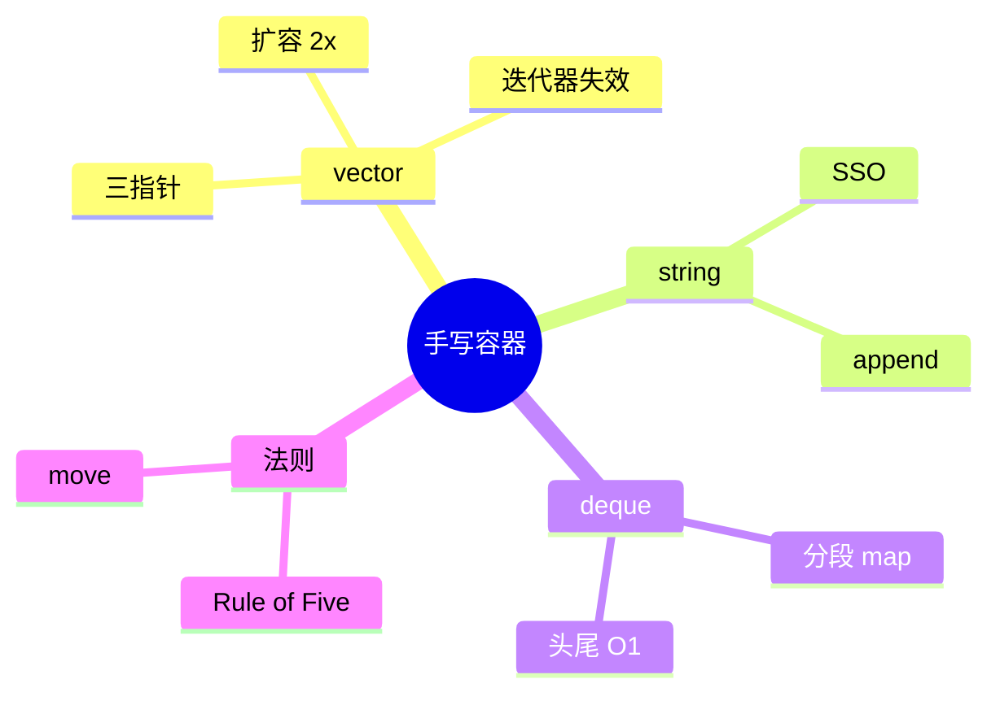
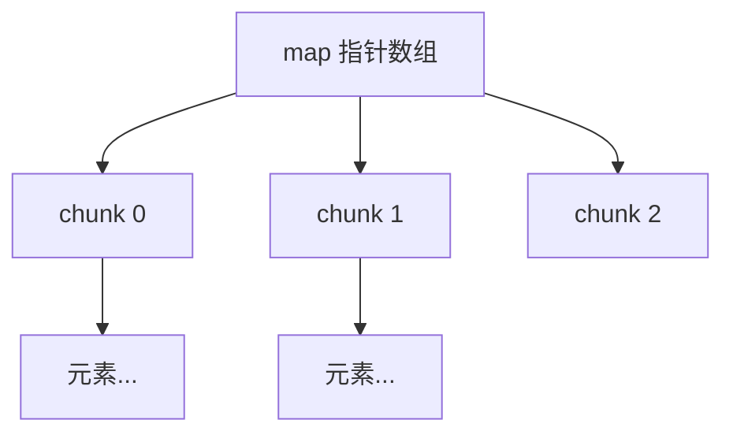

# 手写 STL 容器面试专题

> **文件编码**：UTF-8。  
> **定位**：面试 **手撕 vector / string / deque**、迭代器失效、三五法则——在 [04 章 STL](04-STL标准库容器与算法.md) 用法之上，理解底层实现与 [14 章八股](14-高频面试专题与场景题.md) 深度题。  
> **交叉阅读**：[C++ 04 STL](04-STL标准库容器与算法.md)、[C++ 05 现代特性](05-现代C++新特性.md)、[C++ 03 OOP](03-面向对象与类设计.md)、[C++ 14 面试](14-高频面试专题与场景题.md)、[C++ 24 分配器](24-内存分配器与对象池.md)。

---

## 0. 读前导读（零基础也能跟上）

### 0.1 用一句话弄懂本章

**手写容器** = 证明你懂 **指针三角、扩容、RAII、规则三五**——不是要你替换 std，而是面试与读引擎源码（vLLM、Folly）的通行证。

### 0.2 你需要提前知道什么

- [04 章](04-STL标准库容器与算法.md) `vector`/`string` API、迭代器失效
- [05 章](05-现代C++新特性.md) move、右值引用
- [03 章](03-面向对象与类设计.md) 析构、拷贝构造
- [02 章](02-指针引用与内存管理.md) 堆分配

### 0.3 本章知识地图（☐→☑）

- [ ] 手写 `MyVector`（push_back、reserve、迭代器）
- [ ] 手写 `MyString`（SSO 概念、append）
- [ ] 说清 deque 分段结构（不要求全撕）
- [ ] 列 vector 迭代器失效场景
- [ ] 解释 Rule of Zero/Five
- [ ] §10 闭卷自测 ≥8/10

### 0.4 建议学习时长

**5～7 天**；每容器至少白板写一遍 + 跑 [27 章](27-Google-Test与单元测试工程.md) 单测。

### 0.5 学完你能做什么

45 分钟面试手撕 vector；读 `std::vector` 源码；理解 [24 章](24-内存分配器与对象池.md) 自定义 allocator 接入。

---

## 本章与上一章的关系

[27 章](27-Google-Test与单元测试工程.md) 教你怎么 **验证** 容器；本章教你怎么 **实现**。与 [04 章](04-STL标准库容器与算法.md) 互补：04 会用，28 会造。与 [14 章 Q9/Q10](14-高频面试专题与场景题.md) 三五法则、迭代器失效直接对应。

| 上一章（27） | 本章（28） | 扩展 |
|--------------|------------|------|
| gtest 验证 | 手撕实现 | 04 标准库 |
| 行为测试 | 内存与复杂度 | 14 面试 |



---

## 1. 这份文档学什么

- `MyVector<T>` 核心实现
- `MyString` 与 SSO 概念
- `deque` 结构面试答法
- 迭代器失效表
- 三五法则与 Rule of Zero
- 面试白板技巧

---

## 2. MyVector 骨架（C++17）

```cpp
#include <algorithm>
#include <cstddef>
#include <initializer_list>
#include <iterator>
#include <memory>
#include <stdexcept>

template <class T>
class MyVector {
    T* data_{nullptr};
    std::size_t size_{0};
    std::size_t cap_{0};

    void reallocate(std::size_t new_cap) {
        T* new_data = static_cast<T*>(::operator new(new_cap * sizeof(T)));
        std::size_t i = 0;
        try {
            for (; i < size_; ++i)
                new (new_data + i) T(std::move_if_noexcept(data_[i]));
        } catch (...) {
            for (std::size_t j = 0; j < i; ++j)
                new_data[j].~T();
            ::operator delete(new_data);
            throw;
        }
        for (std::size_t k = 0; k < size_; ++k)
            data_[k].~T();
        ::operator delete(data_);
        data_ = new_data;
        cap_ = new_cap;
    }

public:
    MyVector() = default;

    explicit MyVector(std::size_t n) : cap_(n), size_(n) {
        data_ = static_cast<T*>(::operator new(n * sizeof(T)));
        for (std::size_t i = 0; i < n; ++i)
            new (data_ + i) T();
    }

    ~MyVector() {
        clear();
        ::operator delete(data_);
    }

    // 拷贝/移动/赋值：Rule of Five（面试口述 copy-and-swap）

    MyVector(MyVector&& o) noexcept
        : data_(o.data_), size_(o.size_), cap_(o.cap_) {
        o.data_ = nullptr;
        o.size_ = o.cap_ = 0;
    }

    MyVector& operator=(MyVector&& o) noexcept {
        if (this == &o) return *this;
        clear();
        ::operator delete(data_);
        data_ = o.data_;
        size_ = o.size_;
        cap_ = o.cap_;
        o.data_ = nullptr;
        o.size_ = o.cap_ = 0;
        return *this;
    }

    void reserve(std::size_t n) {
        if (n > cap_) reallocate(n);
    }

    void push_back(const T& v) {
        if (size_ == cap_)
            reallocate(cap_ == 0 ? 1 : cap_ * 2);
        new (data_ + size_) T(v);
        ++size_;
    }

    void push_back(T&& v) {
        if (size_ == cap_)
            reallocate(cap_ == 0 ? 1 : cap_ * 2);
        new (data_ + size_) T(std::move(v));
        ++size_;
    }

    void clear() {
        for (std::size_t i = 0; i < size_; ++i)
            data_[i].~T();
        size_ = 0;
    }

    void swap(MyVector& o) noexcept {
        std::swap(data_, o.data_);
        std::swap(size_, o.size_);
        std::swap(cap_, o.cap_);
    }

    T& operator[](std::size_t i) { return data_[i]; }
    const T& operator[](std::size_t i) const { return data_[i]; }
    std::size_t size() const { return size_; }
    T* begin() { return data_; }
    T* end() { return data_ + size_; }
};
```

**面试讲解顺序**：三指针 → `push_back` 均摊 O(1) → 扩容 **2 倍** → move 转移 → 异常安全 **强保证**（copy-and-swap 赋值）。

---

## 3. 迭代器失效（必背）

| 操作 | vector | string | deque |
|------|--------|--------|-------|
| `push_back` / 扩容 | **全部失效** | 可能失效 | 仅失效迭代器 |
| `insert` 中间 | 插入点及后失效 | 同左 | 迭代器失效 |
| `erase` | 删除点及后失效 | 同左 | 同左 |
| `reserve` 未扩容 | 不失效 | — | — |

**原因**：vector 连续内存 **reallocate 换地址**；deque **分段** 插入仅 invalidate 迭代器不 invalidate 引用（C++ 标准规定）。

---

## 4. MyString 与 SSO

```cpp
#include <cstring>
#include <utility>

class MyString {
    static constexpr std::size_t kSSO = 15;
    union {
        char small_[kSSO + 1];
        struct {
            char* ptr;
            std::size_t size;
            std::size_t cap;
        } heap_;
    };
    bool is_small_{true};

public:
    MyString() { small_[0] = '\0'; }

    MyString(const char* s) {
        std::size_t n = std::strlen(s);
        if (n <= kSSO) {
            is_small_ = true;
            std::memcpy(small_, s, n + 1);
        } else {
            is_small_ = false;
            heap_.cap = heap_.size = n;
            heap_.ptr = new char[n + 1];
            std::memcpy(heap_.ptr, s, n + 1);
        }
    }

    ~MyString() {
        if (!is_small_) delete[] heap_.ptr;
    }

    // 拷贝/移动/assign 略（面试口述 SSO 切换边界）
    const char* c_str() const {
        return is_small_ ? small_ : heap_.ptr;
    }
};
```

**SSO（Small String Optimization）**：短串放栈内 buffer，**无堆分配**——libstdc++/libc++ 均有，布局各异。

---

## 5. deque 面试答法（不需全撕）

```text
deque = 分段连续数组 + 中央 map（指针数组）
        map ─→ chunk0 (固定块，如 512B)
              ─→ chunk1
              ─→ chunk2
push_front / push_back：O(1) 均摊，可能新 chunk
[] 随机访问：O(1) 两次指针跳转
```



对比 vector：**中间 insert 无全体移动**，但 **缓存局部性** 差于 vector。

---

## 6. 三五法则与 Rule of Zero

| 法则 | 内容 |
|------|------|
| **三/五** | 自定义析构、拷贝构造、拷贝赋值 → 考虑移动、移动赋值 |
| **Rule of Zero** | 成员全用 RAII 类型（`vector`、`string`），不手写五函数 |

```cpp
// Rule of Zero 示例
class Session {
    std::string id_;
    std::vector<uint8_t> buf_;
    // 编译器生成五函数即可
};
```

[14 章 Q9](14-高频面试专题与场景题.md)：**为何需要虚析构？** 容器类通常 **非多态基类**，用 Rule of Zero 即可。

手写 `MyVector` 因 **裸指针** 必须 **Rule of Five** 或改用 `std::unique_ptr<T[]>` + placement（面试常让写裸指针版）。

---

## 7. 面试白板流程（45 min）

| 分钟 | 内容 |
|------|------|
| 0～5 | 澄清 API：需哪些接口 |
| 5～25 | 写 vector：字段、push_back、析构 |
| 25～35 | reserve、拷贝/移动、复杂度 |
| 35～40 | 迭代器失效、与 std 差异 |
| 40～45 | 反问 / 提 SSO 或 deque |

**话术**：「先实现 **正确性**，再 **reserve** 优化，最后 **move**；异常安全用 copy-and-swap。」

---

## 8. 追问与练习

| 追问 | 要点 |
|------|------|
| 扩容 1.5 vs 2 | 2 倍均摊 O(1) 易证 |
| vector<bool> | 位压缩，非真正容器 |
| deque vs 单数组 | 两端 O(1)，中间 insert 不重分配全体 |

**练习**：白板写 push_back+析构；[27 章 gtest](27-Google-Test与单元测试工程.md) 测迭代器失效。

---

## 9. 扩展轨总结

```text
24 分配器 / 对象池
25 无锁 / memory_order
26 Boost.Asio 异步 IO
27 gtest / CI
28 手写 STL 面试  ← 你在这里
```

回到 [14 章 模拟面试](14-高频面试专题与场景题.md) 做 **容器 + 并发** 综合模拟；继续 [LLMInfra 项目](../LLMInfra/00-学习路线图与说明.md) 读 vLLM block manager 源码。

---

## 10. 闭卷自测

1. vector 三个核心字段通常是什么？
2. `push_back` 均摊复杂度？为何？
3. 拷贝赋值为何常用 copy-and-swap？
4. SSO 解决什么问题？
5. deque 中央 map 作用？
6. vector 扩容后哪些指针失效？
7. Rule of Zero 适用条件？
8. `std::move` 后源对象处于什么状态？
9. 手写 vector 为何用 placement new？
10. 本章与 04、05、14、24 章各一点关联？

<details>
<summary>自测参考答案</summary>

1. **data 指针、size、capacity**（或 begin/end/cap 表述）。
2. **均摊 O(1)**；扩容倍乘使总拷贝 O(n)。
3. **强异常安全** + 复用析构/交换，代码简洁。
4. **短字符串避免堆分配**，提升 cache 与速度。
5. **索引各 chunk**，支持两端增长与 O(1) 随机访问。
6. **指向元素的指针、引用、迭代器** 全部失效。
7. 成员均为 **RAII 类型**，无裸资源管理。
8. **有效但未指定**；可安全析构/赋值，勿假设值。
9. **已分配未构造** 内存上构造 T；配合显式析构。
10. **04** API/失效；**05** move；**14** 三五法则/Q10；**24** 自定义 allocator。

</details>
---


## 11. 深度附录：容器手撕全集

与 [76 章 高级数据结构](76-高级数据结构C++实现.md) **互补**：76 讲跳表/Treap；本章讲 **STL 风格容器面试手撕**。

---

## 11.1 vector 扩容手撕（完整版）

```cpp
template<typename T>
class MyVector {
    T* data_ = nullptr;
    size_t size_ = 0, cap_ = 0;
    void grow() {
        size_t nc = cap_ ? cap_ * 2 : 1;
        T* nd = static_cast<T*>(::operator new(nc * sizeof(T)));
        for (size_t i = 0; i < size_; ++i) { new (nd + i) T(std::move(data_[i])); data_[i].~T(); }
        ::operator delete(data_);
        data_ = nd; cap_ = nc;
    }
public:
    ~MyVector() { clear(); ::operator delete(data_); }
    void push_back(const T& v) {
        if (size_ == cap_) grow();
        new (data_ + size_) T(v);
        ++size_;
    }
    // move ctor/assign, operator[], begin/end ...
};
```

---

## 11.2 string SSO（短字符串优化）

≤15 字节（平台相关）存 **对象内部 buffer**，无堆分配。
`libc++`/`libstdc++` 布局不同；面试讲 **概念**：小字符串快路径。

```cpp
// 简化 SSO 概念
struct ShortString {
    static constexpr size_t SSO = 15;
    union { char buf[SSO + 1]; char* ptr; };
    uint8_t meta; // 最高位：是否 heap
};
```

---

## 11.3 deque 中控 map

分段连续数组 + **central map** 索引 chunk；两端 O(1) push/pop，随机访问 O(1) 但常数较大。
```
map → [chunk0][chunk1][chunk2]...
每个 chunk 固定大小（如 512 元素）
```

---

## 11.4 map 红黑树节点

```cpp
enum Color { Red, Black };
struct Node {
    std::pair<const K, V> kv;
    Node *parent, *left, *right;
    Color color;
};
// insert: BST 插入 + 旋转/fixup 保持红黑性质
// 复杂度：O(log n)
```

---

## 11.5 unordered_map 桶与 rehash

桶数组 + 链表/开放寻址；`load_factor > max_load_factor` → **rehash** 扩容桶数。
hash(k) % bucket_count → 桶索引；冲突用 chaining。

---

## 11.6 迭代器实现

vector：`T*` 或 pointer wrapper；deque：分块 + 局部偏移；map：中序遍历 successor。

**失效规则**（面试必背）：vector insert/reallocate 全失效；list/map 仅 erased 元素失效。

---

## 11.6.1 vector 完整五函数与 copy-and-swap

```cpp
MyVector& operator=(MyVector other) noexcept { // copy-and-swap
    swap(other);
    return *this;
}
void swap(MyVector& o) noexcept {
    std::swap(data_, o.data_);
    std::swap(size_, o.size_);
    std::swap(cap_, o.cap_);
}
MyVector(MyVector&& o) noexcept : data_(o.data_), size_(o.size_), cap_(o.cap_) {
    o.data_ = nullptr; o.size_ = o.cap_ = 0;
}
```

---

## 11.6.2 list 与 map 迭代器（简述）

**list**：节点 `{T val; Node* next, prev;}`，迭代器即 Node*。
**map**：迭代器指向红黑树节点，++ 调用 `tree_increment`。
**unordered_map**：桶内链表节点；C++11 后 local_iterator。

---

## 11.8 面试追问速查（20 条）

**Q：vector 为何 capacity >= size？**

预留空间使 push_back 均摊 O(1)。

**Q：shrink_to_fit 保证释放？**

C++11 仅 **请求**，不保证。

**Q：deque 为何不用连续内存？**

两端 O(1) 增长无需全体搬迁。

**Q：map 为何用红黑树而非 AVL？**

STL 历史选择；均 O(log n)，红黑旋转更少。

**Q：unordered_map rehash 何时？**

load_factor > max_load_factor。

**Q：string SSO 临界长度？**

实现定义，通常 15~22 字节。

**Q：vector<bool> 是容器吗？**

特化模板，位压缩，非标准容器要求。

**Q：迭代器失效口诀？**

vector 慎存迭代器；list/map erase 仅失效被删。

**Q：allocator 传给 vector？**

C++11 起模板参数 `vector<T, Alloc>`。

**Q：与 76 章跳表 map 对比？**

跳表 O(log n) 期望；红黑树最坏 O(log n)。

**Q：容器追问 #11**

见 §11.1～11.6 与 04 章对照。

**Q：容器追问 #12**

见 §11.1～11.6 与 04 章对照。

**Q：容器追问 #13**

见 §11.1～11.6 与 04 章对照。

**Q：容器追问 #14**

见 §11.1～11.6 与 04 章对照。

**Q：容器追问 #15**

见 §11.1～11.6 与 04 章对照。

**Q：容器追问 #16**

见 §11.1～11.6 与 04 章对照。

**Q：容器追问 #17**

见 §11.1～11.6 与 04 章对照。

**Q：容器追问 #18**

见 §11.1～11.6 与 04 章对照。

**Q：容器追问 #19**

见 §11.1～11.6 与 04 章对照。

**Q：容器追问 #20**

见 §11.1～11.6 与 04 章对照。

---
## 11.7 容器面试笔记库（55 条）

### 11.7.1 容器笔记 #1

手撕顺序：默认构造→析构→push→扩容→拷贝/移动→iterator。

### 11.7.2 容器笔记 #2

手撕顺序：默认构造→析构→push→扩容→拷贝/移动→iterator。

### 11.7.3 容器笔记 #3

手撕顺序：默认构造→析构→push→扩容→拷贝/移动→iterator。

### 11.7.4 容器笔记 #4

手撕顺序：默认构造→析构→push→扩容→拷贝/移动→iterator。

### 11.7.5 容器笔记 #5

手撕顺序：默认构造→析构→push→扩容→拷贝/移动→iterator。

### 11.7.6 容器笔记 #6

手撕顺序：默认构造→析构→push→扩容→拷贝/移动→iterator。

### 11.7.7 容器笔记 #7

手撕顺序：默认构造→析构→push→扩容→拷贝/移动→iterator。

### 11.7.8 容器笔记 #8

手撕顺序：默认构造→析构→push→扩容→拷贝/移动→iterator。

### 11.7.9 容器笔记 #9

手撕顺序：默认构造→析构→push→扩容→拷贝/移动→iterator。

### 11.7.10 容器笔记 #10

手撕顺序：默认构造→析构→push→扩容→拷贝/移动→iterator。

### 11.7.11 容器笔记 #11

手撕顺序：默认构造→析构→push→扩容→拷贝/移动→iterator。

### 11.7.12 容器笔记 #12

手撕顺序：默认构造→析构→push→扩容→拷贝/移动→iterator。

### 11.7.13 容器笔记 #13

手撕顺序：默认构造→析构→push→扩容→拷贝/移动→iterator。

### 11.7.14 容器笔记 #14

手撕顺序：默认构造→析构→push→扩容→拷贝/移动→iterator。

### 11.7.15 容器笔记 #15

手撕顺序：默认构造→析构→push→扩容→拷贝/移动→iterator。

### 11.7.16 容器笔记 #16

手撕顺序：默认构造→析构→push→扩容→拷贝/移动→iterator。

### 11.7.17 容器笔记 #17

手撕顺序：默认构造→析构→push→扩容→拷贝/移动→iterator。

### 11.7.18 容器笔记 #18

手撕顺序：默认构造→析构→push→扩容→拷贝/移动→iterator。

### 11.7.19 容器笔记 #19

手撕顺序：默认构造→析构→push→扩容→拷贝/移动→iterator。

### 11.7.20 容器笔记 #20

手撕顺序：默认构造→析构→push→扩容→拷贝/移动→iterator。

### 11.7.21 容器笔记 #21

手撕顺序：默认构造→析构→push→扩容→拷贝/移动→iterator。

### 11.7.22 容器笔记 #22

手撕顺序：默认构造→析构→push→扩容→拷贝/移动→iterator。

### 11.7.23 容器笔记 #23

手撕顺序：默认构造→析构→push→扩容→拷贝/移动→iterator。

### 11.7.24 容器笔记 #24

手撕顺序：默认构造→析构→push→扩容→拷贝/移动→iterator。

### 11.7.25 容器笔记 #25

手撕顺序：默认构造→析构→push→扩容→拷贝/移动→iterator。

### 11.7.26 容器笔记 #26

手撕顺序：默认构造→析构→push→扩容→拷贝/移动→iterator。

### 11.7.27 容器笔记 #27

手撕顺序：默认构造→析构→push→扩容→拷贝/移动→iterator。

### 11.7.28 容器笔记 #28

手撕顺序：默认构造→析构→push→扩容→拷贝/移动→iterator。

### 11.7.29 容器笔记 #29

手撕顺序：默认构造→析构→push→扩容→拷贝/移动→iterator。

### 11.7.30 容器笔记 #30

手撕顺序：默认构造→析构→push→扩容→拷贝/移动→iterator。

### 11.7.31 容器笔记 #31

手撕顺序：默认构造→析构→push→扩容→拷贝/移动→iterator。

### 11.7.32 容器笔记 #32

手撕顺序：默认构造→析构→push→扩容→拷贝/移动→iterator。

### 11.7.33 容器笔记 #33

手撕顺序：默认构造→析构→push→扩容→拷贝/移动→iterator。

### 11.7.34 容器笔记 #34

手撕顺序：默认构造→析构→push→扩容→拷贝/移动→iterator。

### 11.7.35 容器笔记 #35

手撕顺序：默认构造→析构→push→扩容→拷贝/移动→iterator。

### 11.7.36 容器笔记 #36

手撕顺序：默认构造→析构→push→扩容→拷贝/移动→iterator。

### 11.7.37 容器笔记 #37

手撕顺序：默认构造→析构→push→扩容→拷贝/移动→iterator。

### 11.7.38 容器笔记 #38

手撕顺序：默认构造→析构→push→扩容→拷贝/移动→iterator。

### 11.7.39 容器笔记 #39

手撕顺序：默认构造→析构→push→扩容→拷贝/移动→iterator。

### 11.7.40 容器笔记 #40

手撕顺序：默认构造→析构→push→扩容→拷贝/移动→iterator。

### 11.7.41 容器笔记 #41

手撕顺序：默认构造→析构→push→扩容→拷贝/移动→iterator。

### 11.7.42 容器笔记 #42

手撕顺序：默认构造→析构→push→扩容→拷贝/移动→iterator。

### 11.7.43 容器笔记 #43

手撕顺序：默认构造→析构→push→扩容→拷贝/移动→iterator。

### 11.7.44 容器笔记 #44

手撕顺序：默认构造→析构→push→扩容→拷贝/移动→iterator。

### 11.7.45 容器笔记 #45

手撕顺序：默认构造→析构→push→扩容→拷贝/移动→iterator。

### 11.7.46 容器笔记 #46

手撕顺序：默认构造→析构→push→扩容→拷贝/移动→iterator。

### 11.7.47 容器笔记 #47

手撕顺序：默认构造→析构→push→扩容→拷贝/移动→iterator。

### 11.7.48 容器笔记 #48

手撕顺序：默认构造→析构→push→扩容→拷贝/移动→iterator。

### 11.7.49 容器笔记 #49

手撕顺序：默认构造→析构→push→扩容→拷贝/移动→iterator。

### 11.7.50 容器笔记 #50

手撕顺序：默认构造→析构→push→扩容→拷贝/移动→iterator。

### 11.7.51 容器笔记 #51

手撕顺序：默认构造→析构→push→扩容→拷贝/移动→iterator。

### 11.7.52 容器笔记 #52

手撕顺序：默认构造→析构→push→扩容→拷贝/移动→iterator。

### 11.7.53 容器笔记 #53

手撕顺序：默认构造→析构→push→扩容→拷贝/移动→iterator。

### 11.7.54 容器笔记 #54

手撕顺序：默认构造→析构→push→扩容→拷贝/移动→iterator。

### 11.7.55 容器笔记 #55

手撕顺序：默认构造→析构→push→扩容→拷贝/移动→iterator。

### 深度补充 1

复习主线：对照本章知识地图，逐项打勾 ☐→☑。

### 深度补充 2

动手实验：将正文代码编译运行，观察输出与 benchmark 数字。

### 深度补充 3

画图练习：在纸上复现本章核心数据结构或内存布局图。

### 深度补充 4

代码练习：为正文示例补充单元测试（见 27 章 gtest）。

### 深度补充 5

交叉阅读：按章末「与 XX 章互补」表格完成串联复习。

### 深度补充 6

面试模拟：3 分钟口述本章 3 个高频追问与参考答案。

### 深度补充 7

生产 checklist：列出上线前必须验证的 5 条工程检查项。

### 深度补充 8

常见误区：回顾正文 FAQ，写一句「我曾误以为…其实…」。

### 深度补充 9

复习主线：对照本章知识地图，逐项打勾 ☐→☑。

### 深度补充 10

动手实验：将正文代码编译运行，观察输出与 benchmark 数字。

### 深度补充 11

画图练习：在纸上复现本章核心数据结构或内存布局图。

### 深度补充 12

代码练习：为正文示例补充单元测试（见 27 章 gtest）。

### 深度补充 13

交叉阅读：按章末「与 XX 章互补」表格完成串联复习。

### 深度补充 14

面试模拟：3 分钟口述本章 3 个高频追问与参考答案。

### 深度补充 15

生产 checklist：列出上线前必须验证的 5 条工程检查项。

### 深度补充 16

常见误区：回顾正文 FAQ，写一句「我曾误以为…其实…」。

### 深度补充 17

复习主线：对照本章知识地图，逐项打勾 ☐→☑。

### 深度补充 18

动手实验：将正文代码编译运行，观察输出与 benchmark 数字。

### 深度补充 19

画图练习：在纸上复现本章核心数据结构或内存布局图。

### 深度补充 20

代码练习：为正文示例补充单元测试（见 27 章 gtest）。

### 深度补充 21

交叉阅读：按章末「与 XX 章互补」表格完成串联复习。

### 深度补充 22

面试模拟：3 分钟口述本章 3 个高频追问与参考答案。

### 深度补充 23

生产 checklist：列出上线前必须验证的 5 条工程检查项。

### 深度补充 24

常见误区：回顾正文 FAQ，写一句「我曾误以为…其实…」。

### 深度补充 25

复习主线：对照本章知识地图，逐项打勾 ☐→☑。

### 深度补充 26

动手实验：将正文代码编译运行，观察输出与 benchmark 数字。

### 深度补充 27

画图练习：在纸上复现本章核心数据结构或内存布局图。

### 深度补充 28

代码练习：为正文示例补充单元测试（见 27 章 gtest）。

### 深度补充 29

交叉阅读：按章末「与 XX 章互补」表格完成串联复习。

### 深度补充 30

面试模拟：3 分钟口述本章 3 个高频追问与参考答案。

### 深度补充 31

生产 checklist：列出上线前必须验证的 5 条工程检查项。

### 深度补充 32

常见误区：回顾正文 FAQ，写一句「我曾误以为…其实…」。

### 深度补充 33

复习主线：对照本章知识地图，逐项打勾 ☐→☑。

### 深度补充 34

动手实验：将正文代码编译运行，观察输出与 benchmark 数字。

### 深度补充 35

画图练习：在纸上复现本章核心数据结构或内存布局图。

### 深度补充 36

代码练习：为正文示例补充单元测试（见 27 章 gtest）。

### 深度补充 37

交叉阅读：按章末「与 XX 章互补」表格完成串联复习。

### 深度补充 38

面试模拟：3 分钟口述本章 3 个高频追问与参考答案。

### 深度补充 39

生产 checklist：列出上线前必须验证的 5 条工程检查项。

### 深度补充 40

常见误区：回顾正文 FAQ，写一句「我曾误以为…其实…」。

### 深度补充 41

复习主线：对照本章知识地图，逐项打勾 ☐→☑。

### 深度补充 42

动手实验：将正文代码编译运行，观察输出与 benchmark 数字。

### 深度补充 43

画图练习：在纸上复现本章核心数据结构或内存布局图。

### 深度补充 44

代码练习：为正文示例补充单元测试（见 27 章 gtest）。

### 深度补充 45

交叉阅读：按章末「与 XX 章互补」表格完成串联复习。

### 深度补充 46

面试模拟：3 分钟口述本章 3 个高频追问与参考答案。

### 深度补充 47

生产 checklist：列出上线前必须验证的 5 条工程检查项。

### 深度补充 48

常见误区：回顾正文 FAQ，写一句「我曾误以为…其实…」。

### 深度补充 49

复习主线：对照本章知识地图，逐项打勾 ☐→☑。

### 深度补充 50

动手实验：将正文代码编译运行，观察输出与 benchmark 数字。

### 深度补充 51

画图练习：在纸上复现本章核心数据结构或内存布局图。

### 深度补充 52

代码练习：为正文示例补充单元测试（见 27 章 gtest）。

### 深度补充 53

交叉阅读：按章末「与 XX 章互补」表格完成串联复习。

### 深度补充 54

面试模拟：3 分钟口述本章 3 个高频追问与参考答案。

### 深度补充 55

生产 checklist：列出上线前必须验证的 5 条工程检查项。

### 深度补充 56

常见误区：回顾正文 FAQ，写一句「我曾误以为…其实…」。

### 深度补充 57

复习主线：对照本章知识地图，逐项打勾 ☐→☑。

### 深度补充 58

动手实验：将正文代码编译运行，观察输出与 benchmark 数字。

### 深度补充 59

画图练习：在纸上复现本章核心数据结构或内存布局图。

### 深度补充 60

代码练习：为正文示例补充单元测试（见 27 章 gtest）。

### 深度补充 61

交叉阅读：按章末「与 XX 章互补」表格完成串联复习。

### 深度补充 62

面试模拟：3 分钟口述本章 3 个高频追问与参考答案。

### 深度补充 63

生产 checklist：列出上线前必须验证的 5 条工程检查项。

### 深度补充 64

常见误区：回顾正文 FAQ，写一句「我曾误以为…其实…」。

### 深度补充 65

复习主线：对照本章知识地图，逐项打勾 ☐→☑。

### 深度补充 66

动手实验：将正文代码编译运行，观察输出与 benchmark 数字。

### 深度补充 67

画图练习：在纸上复现本章核心数据结构或内存布局图。

### 深度补充 68

代码练习：为正文示例补充单元测试（见 27 章 gtest）。

### 深度补充 69

交叉阅读：按章末「与 XX 章互补」表格完成串联复习。

### 深度补充 70

面试模拟：3 分钟口述本章 3 个高频追问与参考答案。

### 深度补充 71

生产 checklist：列出上线前必须验证的 5 条工程检查项。

### 深度补充 72

常见误区：回顾正文 FAQ，写一句「我曾误以为…其实…」。

### 深度补充 73

复习主线：对照本章知识地图，逐项打勾 ☐→☑。

### 深度补充 74

动手实验：将正文代码编译运行，观察输出与 benchmark 数字。

### 深度补充 75

画图练习：在纸上复现本章核心数据结构或内存布局图。

### 深度补充 76

代码练习：为正文示例补充单元测试（见 27 章 gtest）。


---

## 下一章预告

扩展轨 **24～28** 完结。建议回到 [14 章 高频面试](14-高频面试专题与场景题.md) 做闭卷模拟，或进入 [LLMInfra 00 路线图](../LLMInfra/00-学习路线图与说明.md) 项目实战。

---

*扩展轨 24～28 完结 · 建议复习 14 章面试*
