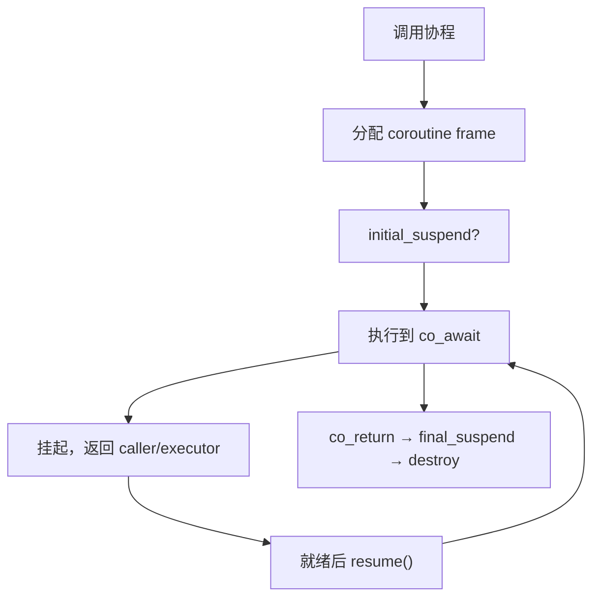

# 协程 C++20 coroutine

> **文件编码**：UTF-8。  
> **定位**：C++20 **无栈协程**——`co_await`、`promise_type`、与 Boost.Asio 协程衔接；对比线程模型。  
> **交叉阅读**：[08 多线程](08-多线程与并发编程.md)、[26 Boost.Asio](26-Boost.Asio异步网络编程.md)、[23 IO 多路复用](23-IO多路复用与高性能Server.md)、[30 C++20 新特性](30-C++20与23新特性深潜.md)。

---

## 0. 读前导读（零基础也能跟上）

### 0.1 用一句话弄懂本章

**协程** = 可 **暂停与恢复** 的函数——等 IO 时不占线程栈干等；`co_await` 把异步拆成 **像同步一样** 的顺序代码，底层仍由 **io_context / executor** 驱动。

### 0.2 你需要提前知道什么

- [08 章](08-多线程与并发编程.md) 线程、mutex、异步回调痛点
- [26 章](26-Boost.Asio异步网络编程.md) `io_context`、`async_read`
- [30 章](30-C++20与23新特性深潜.md) C++20 语言基础
- 编译：GCC 10+ / Clang 14+ 需 **-fcoroutines** 或 `-std=c++20`；MSVC 19.28+ 内置

### 0.3 本章知识地图（☐→☑）

- [ ] 解释 co_await / co_yield / co_return 分工
- [ ] 写出最小 `promise_type` 与 `awaiter`
- [ ] 画协程帧（coroutine frame）生命周期
- [ ] 用 Asio `co_spawn` + `awaitable` 读 socket
- [ ] 对比协程 vs 线程 vs 回调
- [ ] §10 闭卷自测 ≥8/10

### 0.4 建议学习时长

**5～7 天**；先跑通最小 generator，再接 Asio 示例。

### 0.5 学完你能做什么

读 Asio 1.24+ 协程示例；把 [26 章](26-Boost.Asio异步网络编程.md) 回调链改写成 `co_await`；面试说清 **无栈协程不抢占**。

### 0.6 与 Infra / Serving 的衔接

| 场景 | 协程价值 |
|------|----------|
| HTTP 网关 | 单线程处理大量连接，代码线性 |
| 流式 RPC | `co_await` 读写下一段 frame |
| GPU 推理 | **仍在 worker 线程**；协程适合 IO 等 batch，非 kernel |
| 与 [23 章 epoll](23-IO多路复用与高性能Server.md) | 同属事件驱动；协程是 **语法糖层** |

---

## 本章与上一章的关系

[30 章](30-C++20与23新特性深潜.md) 的 `std::generator` 与语言协程设施相关；本章深入 **协程机制** 与 **Asio 集成**。[08 章](08-多线程与并发编程.md) 线程阻塞等 IO 浪费 CPU；[26 章](26-Boost.Asio异步网络编程.md) 用回调解决；协程让 **异步逻辑可读**。

---

## 1. 这份文档学什么

- C++20 协程关键字与编译器变换
- `promise_type`、`awaitable`、`awaiter` 三角关系
- 协程帧分配与生命周期
- Boost.Asio `awaitable`、`co_spawn`、strand
- 协程 vs 线程：调度、栈、适用边界

---

## 2. 协程三关键字

| 关键字 | 作用 |
|--------|------|
| `co_return` | 结束协程，可选返回值 |
| `co_yield` | 产生值并暂停（生成器） |
| `co_await` | 等待 **awaitable**；可暂停 |

```cpp
#include <coroutine>
#include <iostream>

struct Generator {
    struct promise_type {
        int current;
        Generator get_return_object() {
            return Generator{std::coroutine_handle<promise_type>::from_promise(*this)};
        }
        std::suspend_always initial_suspend() { return {}; }
        std::suspend_always final_suspend() noexcept { return {}; }
        std::suspend_always yield_value(int v) {
            current = v;
            return {};
        }
        void return_void() {}
        void unhandled_exception() { std::terminate(); }
    };

    std::coroutine_handle<promise_type> h;
    explicit Generator(std::coroutine_handle<promise_type> hh) : h(hh) {}
    ~Generator() { if (h) h.destroy(); }

    bool next(int& out) {
        if (h.done()) return false;
        h.resume();
        if (h.done()) return false;
        out = h.promise().current;
        return true;
    }
};

Generator iota(int n) {
    for (int i = 0; i < n; ++i)
        co_yield i;
}

int main() {
    int x;
    auto g = iota(3);
    while (g.next(x)) std::cout << x << ' ';  // 0 1 2
}
```

---

## 3. promise_type 与协程帧

### 3.1 编译器做什么

```text
协程函数 f()
  → 编译器生成 协程帧（heap 或自定义 allocator）
     含：参数拷贝、局部变量、promise 对象、挂起点状态
  → 返回 coroutine_handle / 包装类型（如 Generator、awaitable）
```



### 3.2 initial_suspend / final_suspend

| 钩子 | 常见策略 |
|------|----------|
| `initial_suspend` | `suspend_always` 惰性启动；`suspend_never` 立即跑 |
| `final_suspend` | 通常 `suspend_always`，便于 continuation 链 |

### 3.3 unhandled_exception

未捕获异常进入 `promise.unhandled_exception()`；通常 `throw` 或存 `std::exception_ptr` 供上层 `rethrow`。

---

## 4. co_await 与 awaiter

### 4.1 协议

类型 `A` 可被 `co_await` 若：

```cpp
// 成员或自由函数 await_transform
auto operator co_await() const;

// awaiter 需（可省略某些）：
bool await_ready() noexcept;           // true → 不暂停
void await_suspend(coroutine_handle<> h); // 注册恢复
T await_resume();                      // 恢复后返回值
```

### 4.2 awaiter 三函数

| 函数 | 职责 |
|------|------|
| `await_ready()` | true 则不等，直接 `await_resume` |
| `await_suspend(h)` | 注册恢复：IO 完成时 `h.resume()` |
| `await_resume()` | 恢复后返回值给 `co_await` 表达式 |

生产环境用 **Asio timer** 在 `await_suspend` 里注册异步回调，勿阻塞线程。

---

## 5. Boost.Asio 协程

### 5.1 启用

```cpp
#include <boost/asio/co_spawn.hpp>
#include <boost/asio/detached.hpp>
#include <boost/asio/use_awaitable.hpp>

namespace asio = boost::asio;

asio::awaitable<void> echo_once(asio::ip::tcp::socket socket) {
    char buf[1024];
    std::size_t n = co_await socket.async_read_some(
        asio::buffer(buf), asio::use_awaitable);
    co_await asio::async_write(
        socket, asio::buffer(buf, n), asio::use_awaitable);
}

int main() {
    asio::io_context ctx;
    // accept 后 co_spawn(ctx, echo_once(std::move(sock)), detached);
    ctx.run();
}
```

### 5.2 co_spawn 与 executor

```cpp
asio::co_spawn(
    ctx,
    []() -> asio::awaitable<void> {
        co_await asio::this_coro::executor;
        // ...
        co_return;
    }(),
    asio::detached);
```

| 点 | 说明 |
|----|------|
| `use_awaitable` | 把 Asio 异步 op 变 awaitable |
| `co_spawn` | 在 executor 上启动协程 |
| `strand` | 串行化 handler，防竞态 |
| `detached` |  fire-and-forget（注意生命周期） |

### 5.3 与 [26 章](26-Boost.Asio异步网络编程.md) 回调对比

```cpp
// 回调风格
void async_read_cb(error_code ec, size_t n) { /* 嵌套 */ }

// 协程风格
asio::awaitable<void> read_line() {
    auto n = co_await asio::async_read(..., use_awaitable);
    // 顺序写逻辑
}
```

**可读性↑**；**调试**需熟悉协程栈；性能与回调 **同级**（同一 io_context）。

---

## 6. 协程 vs 线程

| 维度 | **线程** | **无栈协程** |
|------|----------|--------------|
| 调度 | OS 抢占 | 协作式，co_await 才让出 |
| 栈 | MB 级固定栈 | 小帧，大量协程轻量 |
| 并行 CPU | 真并行 | 单线程内并发；多核需多线程+多 io_context |
| 阻塞 syscall | 占线程 | **仍会阻塞** executor——须真异步 IO |
| 调试 | 成熟 | 较新，backtrace 需工具支持 |
| 适用 | CPU 计算、阻塞库 | **高并发 IO**、状态机 |

```text
LLM Serving 分工建议：
  协程/Asio 线程  → 接 HTTP/SSE、gRPC 字节流
  线程池 worker   → 预处理、调度
  GPU stream      → 模型推理（非协程）
```

### 6.1 与 [08 章](08-多线程与并发编程.md) 协作

- 协程 **不是** mutex 替代品；共享状态仍要锁或 strand。
- `co_await` 期间 **不持有 mutex** 若 resume 在同线程可能死锁——缩短临界区。

---

## 7. 生命周期与常见坑

| 坑 | 说明 |
|----|------|
| 悬垂引用 | 协程捕获局部变量引用，caller 已返回 |
| detached 协程 | 无人 join，异常被吞 |
| 在协程里阻塞 | `sleep`/同步 read 堵死 io_context |
| 跨线程 resume | 需 `post` 到正确 executor |
| 忘记 destroy handle | 泄漏 coroutine frame |

**RAII 包装**：Asio `awaitable` 已封装；手写 handle 须在析构 `destroy()`。

---

## 8. 练习题

1. 实现 `Generator` 产出斐波那契前 n 项。
2. 用 Asio 协程读一行 HTTP request 并回显（结合 [10 章](10-网络编程与简易HTTP服务.md)）。
3. 对比同一 echo 的 **回调版 vs 协程版** 行数与嵌套深度。
4. 说明为何在 16 核机器上 **单 io_context + 万协程** 仍可能 CPU 瓶颈。

---

## 9. 学完标准

- [ ] 解释 coroutine frame 含哪些部分
- [ ] 写出 awaiter 三函数职责
- [ ] 用 Asio `co_spawn` 启动一个 `awaitable`
- [ ] 说清协程不能替代 GPU 推理的原因
- [ ] 列举 2 个协程生命周期坑
- [ ] 完成 1 个 Generator 或 Asio demo

---

## 10. 闭卷自测

1. C++20 协程默认有栈还是无栈？
2. `co_await` 在 `await_ready()==true` 时是否暂停？
3. `promise_type::yield_value` 用于什么场景？
4. 协程帧通常分配在哪？
5. Asio 中 `use_awaitable` 作用？
6. 为何协程里不宜长时间持锁？
7. `co_spawn` + `detached` 的风险？
8. 线程栈与协程帧大小量级差异？
9. LLM 推理应放在 io_context 协程里吗？
10. 下一章讲什么工程组件？

<details>
<summary>自测参考答案</summary>

1. **无栈**（stackless）；状态在堆上 coroutine frame。
2. **不暂停**；直接 `await_resume()`。
3. **生成器** `co_yield` 向 caller 产出值。
4. **堆**（或 promise 自定义 allocator）；含局部与 promise。
5. 把 Asio 异步操作转为 **awaitable**，供 `co_await`。
6. `co_await` 挂起期间锁未释放可能 **阻塞同 executor 其他协程**；resume 顺序或致 **死锁**。
7. 异常/生命周期 **无人等待**；难观测。
8. 线程栈 **MB 级**；协程帧通常 **几百 B～几 KB**。
9. **不应**；GPU/长计算阻塞 event loop，应 offload 到 worker/GPU。
10. **[32 章 fmt/spdlog 与可观测性](32-fmt-spdlog与可观测性工程.md)**。

</details>
---


## 11. 深度附录：协程机制全解

与 [26 章 Asio](26-Boost.Asio异步网络编程.md) **互补**：26 讲 io_context；本章讲 **协程语义与 promise**。

---

## 11.1 无栈协程原理

状态保存在 **堆上 coroutine frame**；挂起时不占用线程栈。对比 **有栈协程**（ucontext/boost.context）：切换成本低但帧大。

---

## 11.2 promise_type 机制

```cpp
template<typename T>
struct Generator {
    struct promise_type {
        T current;
        std::suspend_always initial_suspend() { return {}; }
        std::suspend_always final_suspend() noexcept { return {}; }
        std::suspend_always yield_value(T v) { current = std::move(v); return {}; }
        Generator get_return_object() {
            return Generator{std::coroutine_handle<promise_type>::from_promise(*this)};
        }
        void return_void() {}
        void unhandled_exception() { throw; }
    };
    // begin/end iterator ...
};
```

---

## 11.3 对称与非对称转换

**非对称**：`co_await` 挂起当前协程，awaiter 决定何时 resume。**对称 transfer**：`coroutine_handle` 直接切换到另一协程（高级）。

---

## 11.4 Asio 协程

`use_awaitable_t` 作为 completion token；`async_read` 返回 awaitable。
结合 `co_spawn`、`redirect_error` 处理 error_code。

---

## 11.5 协程池

限制并发 coroutine 数量：semaphore + 队列；避免无限 `co_spawn` 耗尽内存（每帧堆分配）。
```cpp
// 概念：N 个 worker 协程从 channel 取任务
asio::awaitable<void> worker(task_channel& ch) {
    for (;;) {
        auto task = co_await ch.async_pop(use_awaitable);
        co_await task();
    }
}
```

---

## 11.5.1 awaiter 三件套详解

```cpp
struct MyAwaiter {
    bool await_ready() noexcept { return false; } // true 则不挂起
    void await_suspend(std::coroutine_handle<> h) {
        // 注册回调，完成时 h.resume()
    }
    int await_resume() { return 42; }
};
```

**await_transform**：promise 可拦截 `co_await` 表达式。

---

## 11.5.2 对称协程 transfer（概念）

`coroutine_handle::resume()` 切换到目标协程；对称调度器可在 N 个协程间 **直接切换** 而不返回 caller。
Asio 默认 **非对称**：完成 handler 回到 executor。

---

## 11.5.3 Asio co_spawn 与 redirect_error

```cpp
asio::awaitable<void> session(tcp::socket sock) {
    std::array<char, 1024> buf;
    std::error_code ec;
    co_await asio::async_read(sock, asio::buffer(buf),
        asio::redirect_error(asio::use_awaitable, ec));
    if (ec) co_return;
}
asio::co_spawn(ioc, session(std::move(sock)), asio::detached);
```

---

## 11.5.4 协程内存：自定义 allocator

promise_type 可提供 `operator new/delete` 从 **池** 分配 coroutine frame——高并发网关减少 malloc 压力（衔接 24 章）。

---

## 11.7 与 26 章对照

| 主题 | 26 章 | 31 章 |
|------|-------|-------|
| io_context | 线程/strand | co_await 语法 |
| buffer 生命周期 | 所有权规则 | 协程帧内局部变量 |
| 错误处理 | error_code 回调 | redirect_error |

---

## 11.8 深度 FAQ

**Q：co_return 与 return 区别？**

co_return 结束协程并调用 return_void/value。

**Q：initial_suspend 用途？**

延迟启动直到外部 resume。

**Q：协程异常如何传播？**

unhandled_exception → promise → 重新抛出到 awaiter。

**Q：Generator 与 Task 区别？**

Generator yield；Task 异步单次结果。

**Q：编译器支持？**

GCC 10+ / Clang 14+ / MSVC 19.28+ 基本可用。

**Q：协程追问 #6**

见 §11.1～11.5 与 26 章 Asio。

**Q：协程追问 #7**

见 §11.1～11.5 与 26 章 Asio。

**Q：协程追问 #8**

见 §11.1～11.5 与 26 章 Asio。

**Q：协程追问 #9**

见 §11.1～11.5 与 26 章 Asio。

**Q：协程追问 #10**

见 §11.1～11.5 与 26 章 Asio。

**Q：协程追问 #11**

见 §11.1～11.5 与 26 章 Asio。

**Q：协程追问 #12**

见 §11.1～11.5 与 26 章 Asio。

**Q：协程追问 #13**

见 §11.1～11.5 与 26 章 Asio。

**Q：协程追问 #14**

见 §11.1～11.5 与 26 章 Asio。

**Q：协程追问 #15**

见 §11.1～11.5 与 26 章 Asio。

---

## 11.9 完整 echo 协程示例（对照 26 章）

```cpp
asio::awaitable<void> echo_once(tcp::socket& socket) {
    std::vector<char> buf(4096);
    std::size_t n = co_await socket.async_read_some(
        asio::buffer(buf), asio::use_awaitable);
    co_await asio::async_write(socket, asio::buffer(buf, n),
        asio::use_awaitable);
}

asio::awaitable<void> echo_session(tcp::socket socket) {
    try {
        for (;;) co_await echo_once(socket);
    } catch (const std::exception& e) {
        spdlog::warn("session end: {}", e.what());
    }
}
```

对比回调版：3 层 lambda → 1 个 `for` + 2 个 `co_await`。

---
## 11.6 协程工程笔记库（55 条）

### 11.6.1 协程笔记 #1

生命周期：co_spawn 谁持有 handle；异常传播；executor 绑定。

### 11.6.2 协程笔记 #2

生命周期：co_spawn 谁持有 handle；异常传播；executor 绑定。

### 11.6.3 协程笔记 #3

生命周期：co_spawn 谁持有 handle；异常传播；executor 绑定。

### 11.6.4 协程笔记 #4

生命周期：co_spawn 谁持有 handle；异常传播；executor 绑定。

### 11.6.5 协程笔记 #5

生命周期：co_spawn 谁持有 handle；异常传播；executor 绑定。

### 11.6.6 协程笔记 #6

生命周期：co_spawn 谁持有 handle；异常传播；executor 绑定。

### 11.6.7 协程笔记 #7

生命周期：co_spawn 谁持有 handle；异常传播；executor 绑定。

### 11.6.8 协程笔记 #8

生命周期：co_spawn 谁持有 handle；异常传播；executor 绑定。

### 11.6.9 协程笔记 #9

生命周期：co_spawn 谁持有 handle；异常传播；executor 绑定。

### 11.6.10 协程笔记 #10

生命周期：co_spawn 谁持有 handle；异常传播；executor 绑定。

### 11.6.11 协程笔记 #11

生命周期：co_spawn 谁持有 handle；异常传播；executor 绑定。

### 11.6.12 协程笔记 #12

生命周期：co_spawn 谁持有 handle；异常传播；executor 绑定。

### 11.6.13 协程笔记 #13

生命周期：co_spawn 谁持有 handle；异常传播；executor 绑定。

### 11.6.14 协程笔记 #14

生命周期：co_spawn 谁持有 handle；异常传播；executor 绑定。

### 11.6.15 协程笔记 #15

生命周期：co_spawn 谁持有 handle；异常传播；executor 绑定。

### 11.6.16 协程笔记 #16

生命周期：co_spawn 谁持有 handle；异常传播；executor 绑定。

### 11.6.17 协程笔记 #17

生命周期：co_spawn 谁持有 handle；异常传播；executor 绑定。

### 11.6.18 协程笔记 #18

生命周期：co_spawn 谁持有 handle；异常传播；executor 绑定。

### 11.6.19 协程笔记 #19

生命周期：co_spawn 谁持有 handle；异常传播；executor 绑定。

### 11.6.20 协程笔记 #20

生命周期：co_spawn 谁持有 handle；异常传播；executor 绑定。

### 11.6.21 协程笔记 #21

生命周期：co_spawn 谁持有 handle；异常传播；executor 绑定。

### 11.6.22 协程笔记 #22

生命周期：co_spawn 谁持有 handle；异常传播；executor 绑定。

### 11.6.23 协程笔记 #23

生命周期：co_spawn 谁持有 handle；异常传播；executor 绑定。

### 11.6.24 协程笔记 #24

生命周期：co_spawn 谁持有 handle；异常传播；executor 绑定。

### 11.6.25 协程笔记 #25

生命周期：co_spawn 谁持有 handle；异常传播；executor 绑定。

### 11.6.26 协程笔记 #26

生命周期：co_spawn 谁持有 handle；异常传播；executor 绑定。

### 11.6.27 协程笔记 #27

生命周期：co_spawn 谁持有 handle；异常传播；executor 绑定。

### 11.6.28 协程笔记 #28

生命周期：co_spawn 谁持有 handle；异常传播；executor 绑定。

### 11.6.29 协程笔记 #29

生命周期：co_spawn 谁持有 handle；异常传播；executor 绑定。

### 11.6.30 协程笔记 #30

生命周期：co_spawn 谁持有 handle；异常传播；executor 绑定。

### 11.6.31 协程笔记 #31

生命周期：co_spawn 谁持有 handle；异常传播；executor 绑定。

### 11.6.32 协程笔记 #32

生命周期：co_spawn 谁持有 handle；异常传播；executor 绑定。

### 11.6.33 协程笔记 #33

生命周期：co_spawn 谁持有 handle；异常传播；executor 绑定。

### 11.6.34 协程笔记 #34

生命周期：co_spawn 谁持有 handle；异常传播；executor 绑定。

### 11.6.35 协程笔记 #35

生命周期：co_spawn 谁持有 handle；异常传播；executor 绑定。

### 11.6.36 协程笔记 #36

生命周期：co_spawn 谁持有 handle；异常传播；executor 绑定。

### 11.6.37 协程笔记 #37

生命周期：co_spawn 谁持有 handle；异常传播；executor 绑定。

### 11.6.38 协程笔记 #38

生命周期：co_spawn 谁持有 handle；异常传播；executor 绑定。

### 11.6.39 协程笔记 #39

生命周期：co_spawn 谁持有 handle；异常传播；executor 绑定。

### 11.6.40 协程笔记 #40

生命周期：co_spawn 谁持有 handle；异常传播；executor 绑定。

### 11.6.41 协程笔记 #41

生命周期：co_spawn 谁持有 handle；异常传播；executor 绑定。

### 11.6.42 协程笔记 #42

生命周期：co_spawn 谁持有 handle；异常传播；executor 绑定。

### 11.6.43 协程笔记 #43

生命周期：co_spawn 谁持有 handle；异常传播；executor 绑定。

### 11.6.44 协程笔记 #44

生命周期：co_spawn 谁持有 handle；异常传播；executor 绑定。

### 11.6.45 协程笔记 #45

生命周期：co_spawn 谁持有 handle；异常传播；executor 绑定。

### 11.6.46 协程笔记 #46

生命周期：co_spawn 谁持有 handle；异常传播；executor 绑定。

### 11.6.47 协程笔记 #47

生命周期：co_spawn 谁持有 handle；异常传播；executor 绑定。

### 11.6.48 协程笔记 #48

生命周期：co_spawn 谁持有 handle；异常传播；executor 绑定。

### 11.6.49 协程笔记 #49

生命周期：co_spawn 谁持有 handle；异常传播；executor 绑定。

### 11.6.50 协程笔记 #50

生命周期：co_spawn 谁持有 handle；异常传播；executor 绑定。

### 11.6.51 协程笔记 #51

生命周期：co_spawn 谁持有 handle；异常传播；executor 绑定。

### 11.6.52 协程笔记 #52

生命周期：co_spawn 谁持有 handle；异常传播；executor 绑定。

### 11.6.53 协程笔记 #53

生命周期：co_spawn 谁持有 handle；异常传播；executor 绑定。

### 11.6.54 协程笔记 #54

生命周期：co_spawn 谁持有 handle；异常传播；executor 绑定。

### 11.6.55 协程笔记 #55

生命周期：co_spawn 谁持有 handle；异常传播；executor 绑定。

### 深度补充 1

复习主线：对照本章知识地图，逐项打勾 ☐→☑。

### 深度补充 2

动手实验：将正文代码编译运行，观察输出与 benchmark 数字。

### 深度补充 3

画图练习：在纸上复现本章核心数据结构或内存布局图。

### 深度补充 4

代码练习：为正文示例补充单元测试（见 27 章 gtest）。

### 深度补充 5

交叉阅读：按章末「与 XX 章互补」表格完成串联复习。

### 深度补充 6

面试模拟：3 分钟口述本章 3 个高频追问与参考答案。

### 深度补充 7

生产 checklist：列出上线前必须验证的 5 条工程检查项。

### 深度补充 8

常见误区：回顾正文 FAQ，写一句「我曾误以为…其实…」。

### 深度补充 9

复习主线：对照本章知识地图，逐项打勾 ☐→☑。

### 深度补充 10

动手实验：将正文代码编译运行，观察输出与 benchmark 数字。

### 深度补充 11

画图练习：在纸上复现本章核心数据结构或内存布局图。

### 深度补充 12

代码练习：为正文示例补充单元测试（见 27 章 gtest）。

### 深度补充 13

交叉阅读：按章末「与 XX 章互补」表格完成串联复习。

### 深度补充 14

面试模拟：3 分钟口述本章 3 个高频追问与参考答案。

### 深度补充 15

生产 checklist：列出上线前必须验证的 5 条工程检查项。

### 深度补充 16

常见误区：回顾正文 FAQ，写一句「我曾误以为…其实…」。

### 深度补充 17

复习主线：对照本章知识地图，逐项打勾 ☐→☑。

### 深度补充 18

动手实验：将正文代码编译运行，观察输出与 benchmark 数字。

### 深度补充 19

画图练习：在纸上复现本章核心数据结构或内存布局图。

### 深度补充 20

代码练习：为正文示例补充单元测试（见 27 章 gtest）。

### 深度补充 21

交叉阅读：按章末「与 XX 章互补」表格完成串联复习。

### 深度补充 22

面试模拟：3 分钟口述本章 3 个高频追问与参考答案。

### 深度补充 23

生产 checklist：列出上线前必须验证的 5 条工程检查项。

### 深度补充 24

常见误区：回顾正文 FAQ，写一句「我曾误以为…其实…」。

### 深度补充 25

复习主线：对照本章知识地图，逐项打勾 ☐→☑。

### 深度补充 26

动手实验：将正文代码编译运行，观察输出与 benchmark 数字。

### 深度补充 27

画图练习：在纸上复现本章核心数据结构或内存布局图。

### 深度补充 28

代码练习：为正文示例补充单元测试（见 27 章 gtest）。

### 深度补充 29

交叉阅读：按章末「与 XX 章互补」表格完成串联复习。

### 深度补充 30

面试模拟：3 分钟口述本章 3 个高频追问与参考答案。

### 深度补充 31

生产 checklist：列出上线前必须验证的 5 条工程检查项。

### 深度补充 32

常见误区：回顾正文 FAQ，写一句「我曾误以为…其实…」。

### 深度补充 33

复习主线：对照本章知识地图，逐项打勾 ☐→☑。

### 深度补充 34

动手实验：将正文代码编译运行，观察输出与 benchmark 数字。

### 深度补充 35

画图练习：在纸上复现本章核心数据结构或内存布局图。

### 深度补充 36

代码练习：为正文示例补充单元测试（见 27 章 gtest）。

### 深度补充 37

交叉阅读：按章末「与 XX 章互补」表格完成串联复习。

### 深度补充 38

面试模拟：3 分钟口述本章 3 个高频追问与参考答案。

### 深度补充 39

生产 checklist：列出上线前必须验证的 5 条工程检查项。

### 深度补充 40

常见误区：回顾正文 FAQ，写一句「我曾误以为…其实…」。

### 深度补充 41

复习主线：对照本章知识地图，逐项打勾 ☐→☑。

### 深度补充 42

动手实验：将正文代码编译运行，观察输出与 benchmark 数字。

### 深度补充 43

画图练习：在纸上复现本章核心数据结构或内存布局图。

### 深度补充 44

代码练习：为正文示例补充单元测试（见 27 章 gtest）。

### 深度补充 45

交叉阅读：按章末「与 XX 章互补」表格完成串联复习。

### 深度补充 46

面试模拟：3 分钟口述本章 3 个高频追问与参考答案。

### 深度补充 47

生产 checklist：列出上线前必须验证的 5 条工程检查项。

### 深度补充 48

常见误区：回顾正文 FAQ，写一句「我曾误以为…其实…」。

### 深度补充 49

复习主线：对照本章知识地图，逐项打勾 ☐→☑。

### 深度补充 50

动手实验：将正文代码编译运行，观察输出与 benchmark 数字。

### 深度补充 51

画图练习：在纸上复现本章核心数据结构或内存布局图。

### 深度补充 52

代码练习：为正文示例补充单元测试（见 27 章 gtest）。

### 深度补充 53

交叉阅读：按章末「与 XX 章互补」表格完成串联复习。

### 深度补充 54

面试模拟：3 分钟口述本章 3 个高频追问与参考答案。

### 深度补充 55

生产 checklist：列出上线前必须验证的 5 条工程检查项。

### 深度补充 56

常见误区：回顾正文 FAQ，写一句「我曾误以为…其实…」。

### 深度补充 57

复习主线：对照本章知识地图，逐项打勾 ☐→☑。

### 深度补充 58

动手实验：将正文代码编译运行，观察输出与 benchmark 数字。

### 深度补充 59

画图练习：在纸上复现本章核心数据结构或内存布局图。

### 深度补充 60

代码练习：为正文示例补充单元测试（见 27 章 gtest）。

### 深度补充 61

交叉阅读：按章末「与 XX 章互补」表格完成串联复习。

### 深度补充 62

面试模拟：3 分钟口述本章 3 个高频追问与参考答案。

### 深度补充 63

生产 checklist：列出上线前必须验证的 5 条工程检查项。

### 深度补充 64

常见误区：回顾正文 FAQ，写一句「我曾误以为…其实…」。

### 深度补充 65

复习主线：对照本章知识地图，逐项打勾 ☐→☑。

### 深度补充 66

动手实验：将正文代码编译运行，观察输出与 benchmark 数字。

### 深度补充 67

画图练习：在纸上复现本章核心数据结构或内存布局图。

### 深度补充 68

代码练习：为正文示例补充单元测试（见 27 章 gtest）。

### 深度补充 69

交叉阅读：按章末「与 XX 章互补」表格完成串联复习。

### 深度补充 70

面试模拟：3 分钟口述本章 3 个高频追问与参考答案。

### 深度补充 71

生产 checklist：列出上线前必须验证的 5 条工程检查项。

### 深度补充 72

常见误区：回顾正文 FAQ，写一句「我曾误以为…其实…」。

### 深度补充 73

复习主线：对照本章知识地图，逐项打勾 ☐→☑。

### 深度补充 74

动手实验：将正文代码编译运行，观察输出与 benchmark 数字。

### 深度补充 75

画图练习：在纸上复现本章核心数据结构或内存布局图。

### 深度补充 76

代码练习：为正文示例补充单元测试（见 27 章 gtest）。

### 深度补充 77

交叉阅读：按章末「与 XX 章互补」表格完成串联复习。

### 深度补充 78

面试模拟：3 分钟口述本章 3 个高频追问与参考答案。

### 深度补充 79

生产 checklist：列出上线前必须验证的 5 条工程检查项。

### 深度补充 80

常见误区：回顾正文 FAQ，写一句「我曾误以为…其实…」。

### 深度补充 81

复习主线：对照本章知识地图，逐项打勾 ☐→☑。

### 深度补充 82

动手实验：将正文代码编译运行，观察输出与 benchmark 数字。

### 深度补充 83

画图练习：在纸上复现本章核心数据结构或内存布局图。

### 深度补充 84

代码练习：为正文示例补充单元测试（见 27 章 gtest）。


---

## 下一章预告

协程网关跑起来后需要 **可观测**：[32 章 fmt、spdlog、结构化日志与 metrics 概念](32-fmt-spdlog与可观测性工程.md)——把延迟、QPS、错误率打进生产排障闭环。

---

*下一章：32 fmt spdlog 与可观测性工程*
