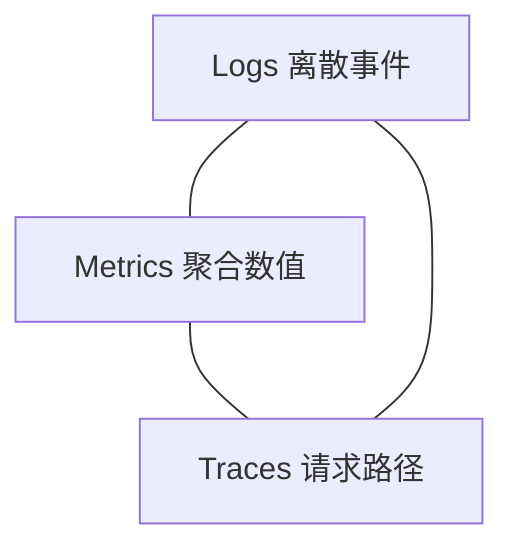

# fmt、spdlog 与可观测性工程

> **文件编码**：UTF-8。  
> **定位**：生产级 C++ 服务的 **日志与观测地基**——{fmt}/`std::format`、spdlog 异步日志、结构化字段、metrics 概念与 LLM Serving 排障。  
> **交叉阅读**：[09 CMake](09-CMake与项目工程化.md)、[10 网络编程](10-网络编程与简易HTTP服务.md)、[16 必学技术栈](16-必学技术栈分轨与扩展专题.md)、[30 format](30-C++20与23新特性深潜.md)、[12 性能分析](12-性能分析与调试.md)。

---

## 0. 读前导读（零基础也能跟上）

### 0.1 用一句话弄懂本章

**可观测性** = 日志（logs）+ 指标（metrics）+ 链路（traces）——让线上 **「慢在哪、错在哪、谁触发的」** 可查询；**fmt/spdlog** 是 C++ 侧最高效的日志格式化组合。

### 0.2 你需要提前知道什么

- [09 章](09-CMake与项目工程化.md) 链接第三方库、FetchContent
- [10 章](10-网络编程与简易HTTP服务.md) mini-http 可加日志
- [30 章](30-C++20与23新特性深潜.md) `std::format` 语法
- [12 章](12-性能分析与调试.md) profiling 与日志互补

### 0.3 本章知识地图（☐→☑）

- [ ] 用 fmt/spdlog 写分级日志与 pattern
- [ ] 配置异步 logger 与滚动文件
- [ ] 输出 JSON 行结构化日志
- [ ] 解释 metrics 中 counter/gauge/histogram
- [ ] 为 mini-http 加 request_id 与 latency 字段
- [ ] §12 闭卷自测 ≥8/10

### 0.4 建议学习时长

**3～5 天**；完成「mini-http + spdlog + 一条 metric 计数」小实验。

### 0.5 学完你能做什么

替换 `std::cout` 为分级滚动日志；对接 Prometheus `/metrics` 概念；在 LLM 网关记录 **token 吞吐、queue 深度、GPU 等待** 等字段。

### 0.6 与 Infra 的衔接

| 信号 | 示例 |
|------|------|
| 结构化 log | `req_id`, `model`, `prompt_tokens`, `latency_ms` |
| Counter | `http_requests_total{status="500"}` |
| Histogram | `inference_latency_seconds` 分桶 |
| Trace | OpenTelemetry span：`gateway → scheduler → gpu` |

---

## 本章与上一章的关系

[31 章](31-协程C++20-coroutine.md) 的异步网关需要 **非阻塞打日志**——同步写盘会拖慢 `io_context`；本章 **spdlog 异步 + fmt 格式化** 是标准答案。[16 章](16-必学技术栈分轨与扩展专题.md) 已将 fmt/spdlog 标为 **P1 工程栈**。

---

## 1. 这份文档学什么

- {fmt} / `std::format` 格式化与性能
- spdlog 同步/异步、sink、滚动文件
- 结构化日志（JSON lines）实践
- metrics 三大类型与 Prometheus 模型
- 日志、指标、追踪分工与采样
- LLM Serving 可观测字段建议

---

## 2. fmt 库基础

### 2.1 为什么不用 printf / iostream

```cpp
#include <fmt/core.h>
#include <string>

int main() {
    std::string s = fmt::format("user={} latency={:.2f}ms", "alice", 12.3456);
    fmt::print("[info] {}\n", s);
    fmt::print("hex={:#x}\n", 255);
}
```

| 特性 | fmt |
|------|-----|
| 类型安全 | 编译期检查占位符与参数 |
| 性能 | 通常优于 iostream，媲美 printf |
| 扩展 | `fmt::formatter<T>` 自定义类型 |
| 标准 | C++20 `std::format` API 同源 |

### 2.2 常用格式说明

```cpp
fmt::format("{:>8}", "ok");      // 右对齐宽度 8
fmt::format("{:.3e}", 1.2345);    // 科学计数
fmt::format("{:08d}", 42);        // 零填充
fmt::format("{}", std::chrono::system_clock::now());  // chrono 支持
```

### 2.3 与 [30 章 std::format](30-C++20与23新特性深潜.md)

新项目可 `#include <format>`；spdlog 内部仍常用 **bundled fmt**。语法 **几乎一致**：`{}`、`{:.2f}`。

---

## 3. spdlog 入门

### 3.1 基本用法

```cpp
#include <spdlog/spdlog.h>

int main() {
    spdlog::info("server listen on {}", 8080);
    spdlog::warn("deprecated API {}", "/v1/chat");
    spdlog::error("load model failed: {}", "ENOENT");
    spdlog::set_level(spdlog::level::debug);
    SPDLOG_DEBUG("batch_size={}", 32);
}
```

### 3.2 日志级别

```text
trace < debug < info < warn < err < critical < off
```

生产默认 **info**；排障临时 **debug**（注意 volume 与 PII）。

### 3.3 pattern 与 logger 名

**pattern 占位**：`%Y-%m-%d` 日期、`%e` 毫秒、`%l` 级别、`%n` logger 名、`%v` 消息体、`%t` 线程 id。

---

## 4. sink 与文件滚动

### 4.1 多 sink

```cpp
#include <spdlog/sinks/stdout_color_sinks.h>
#include <spdlog/sinks/rotating_file_sink.h>
#include <spdlog/spdlog.h>

void setup_logging() {
    auto console = std::make_shared<spdlog::sinks::stdout_color_sink_mt>();
    auto file = std::make_shared<spdlog::sinks::rotating_file_sink_mt>(
        "logs/app.log", 1024 * 1024 * 50, 5);  // 50MB × 5 文件

    std::vector<spdlog::sink_ptr> sinks{console, file};
    auto logger = std::make_shared<spdlog::logger>("srv", sinks.begin(), sinks.end());
    spdlog::register_logger(logger);
    spdlog::set_default_logger(logger);
}
```

### 4.2 异步 logger

```cpp
#include <spdlog/async.h>
#include <spdlog/sinks/basic_file_sink.h>

void setup_async() {
    spdlog::init_thread_pool(8192, 1);  // 队列长度, 后台线程数
    auto sink = std::make_shared<spdlog::sinks::basic_file_sink_mt>("logs/async.log");
    auto async_logger = std::make_shared<spdlog::async_logger>(
        "async", sink, spdlog::thread_pool(),
        spdlog::async_overflow_policy::block);  // 或 overrun_oldest
    spdlog::register_logger(async_logger);
}
```

| 模式 | 适用 |
|------|------|
| 同步 | 开发、低 QPS |
| **异步** | 高 QPS 网关、避免 IO 阻塞业务线程 |
| `block` vs `overrun_oldest` | 背压：阻塞 producer 或丢最旧 |

**与 [31 章协程](31-协程C++20-coroutine.md)**：异步 logger 减少在 `io_context` 线程上 sync write。

---

## 5. 结构化日志

### 5.1 为什么结构化

```text
纯文本：  [info] req done 42 ms user=alice
         → grep 困难，字段不稳定

JSON line：{"level":"info","req_id":"a1","latency_ms":42,"user":"alice"}
         → Loki/ELK/Parsing 稳定
```

### 5.2 手写 JSON 行（fmt）

```cpp
#include <fmt/core.h>
#include <string>

std::string log_request(std::string_view req_id, int status, double ms) {
    return fmt::format(
        R"({{"ts":"{}","event":"http_done","req_id":"{}","status":{},"latency_ms":{:.2f}}})",
        "2026-07-03T12:00:00Z", req_id, status, ms);
}
```

### 5.3 LLM Serving 推荐字段

| 字段 | 说明 |
|------|------|
| `req_id` / `trace_id` | 全链路关联 |
| `model` | 模型名/版本 |
| `prompt_tokens` / `completion_tokens` | 用量 |
| `queue_wait_ms` | 调度等待 |
| `gpu_ms` | 设备时间 |
| `batch_size` | continuous batching |
| `status` | ok / OOM / timeout |

---

## 6. Metrics 概念

### 6.1 可观测性三角



| 支柱 | 回答的问题 | 典型工具 |
|------|------------|----------|
| **Logs** | 这一单发生了什么 | spdlog → Loki/ELK |
| **Metrics** | QPS、延迟分布、错误率 | Prometheus + Grafana |
| **Traces** | 时间花在哪个 span | OpenTelemetry, Jaeger |

### 6.2 指标类型

| 类型 | 语义 | 例子 |
|------|------|------|
| **Counter** | 只增 | `requests_total` |
| **Gauge** | 可增可减 | `queue_depth`, `gpu_util` |
| **Histogram** | 分桶分布 | `latency_seconds_bucket` |
| **Summary** | 分位数（客户端算） | `latency{quantile="0.99"}` |

### 6.3 Prometheus 文本格式（概念）

```text
# HELP http_requests_total Total HTTP requests
# TYPE http_requests_total counter
http_requests_total{method="POST",status="200"} 1024
inference_latency_seconds_bucket{le="0.1"} 900
inference_latency_seconds_bucket{le="0.5"} 980
inference_latency_seconds_count 1000
inference_latency_seconds_sum 120.5
```

C++ 暴露方式：**prometheus-cpp**、独立 `/metrics` HTTP、或 sidecar 采集。

### 6.4 日志 vs 指标

| 维度 | Logs | Metrics |
|------|------|---------|
| Cardinality | 高（每 req_id） | 低（label 受控） |
| 成本 | 存储贵 | 聚合便宜 |
| 用途 | 根因、审计 | 告警、容量 |

**反模式**：把 `req_id` 做成 metric label → **基数爆炸**。

---

## 7. CMake 集成

```cmake
cmake_minimum_required(VERSION 3.20)
project(obs_demo CXX)

set(CMAKE_CXX_STANDARD 20)

include(FetchContent)
FetchContent_Declare(
  spdlog
  GIT_REPOSITORY https://github.com/gabime/spdlog.git
  GIT_TAG v1.14.1
)
FetchContent_MakeAvailable(spdlog)

add_executable(demo main.cpp)
target_link_libraries(demo PRIVATE spdlog::spdlog)
```

**vcpkg**：`vcpkg install spdlog fmt`（[16 章](16-必学技术栈分轨与扩展专题.md)）。

---

## 8. 工程实践清单

### 8.1 日志

统一 async logger；生产 info；滚动文件；敏感字段脱敏；每条请求带 `req_id`。

### 8.2 指标

RED（Rate/Errors/Duration）；LLM 关注 tokens/s、batch 利用率；告警基于 SLO；**勿**把高基数 label 当 metric。

---

## 9. mini-http 集成示例（片段）

```cpp
spdlog::info(R"({{"event":"http","req_id":"{}","status":{},"latency_ms":{:.2f}}})",
             ctx.req_id, status, ms);
// metrics: requests_total++, latency histogram observe(ms)
```

---

## 10. 练习题

1. 配置 spdlog **console + 10MB×3 滚动文件**。
2. 设计 5 个 LLM 网关 metric（counter/gauge/histogram）。
3. 说明为何 **prompt 全文** 不应默认写 info 日志。

---

## 11. 学完标准

- [ ] 独立集成 spdlog（FetchContent 或 vcpkg）
- [ ] 配置异步 logger 与 rolling file
- [ ] 写一条 JSON 结构化请求日志
- [ ] 解释 counter vs gauge vs histogram
- [ ] 列举 3 个 LLM Serving 关键 metric
- [ ] 说清高基数 label 的危害

---

## 12. 闭卷自测

1. fmt 相对 `printf` 的主要优势？
2. spdlog 异步 logger 如何减少业务线程阻塞？
3. `rotating_file_sink` 两个数字参数含义？
4. JSON 行日志相对纯文本的核心好处？
5. Counter 与 Gauge 语义区别？
6. Histogram 解决什么问题？
7. 为何不要把 `req_id` 作为 Prometheus label？
8. `%l` 在 pattern 中表示什么？
9. LLM 网关建议记录哪两类 token 数？
10. 可观测性三角指哪三者？

<details>
<summary>自测参考答案</summary>

1. **类型安全**、更快、扩展 formatter、与 `std::format` 同语法。
2. 日志 **入队** 由后台线程写盘；业务线程快速返回。
3. **单文件最大字节数** 与 **保留文件个数**（滚动）。
4. **机器可解析**、字段稳定、便于 ELK/Loki 检索与聚合。
5. Counter **只增**（请求累计）；Gauge **可上下**（队列深度）。
6. **延迟/大小分布**、分桶与 sum/count 算平均值/近似分位。
7. 高 **基数** 导致时序数据库爆炸、查询与存储不可用。
8. **日志级别**（info/warn/...）。
9. **prompt_tokens** 与 **completion_tokens**（或 total_tokens）。
10. **Logs、Metrics、Traces**。

</details>
---


## 13. 深度附录：可观测性工程

与 [67 章 日志系统](67-日志采集与高吞吐写入系统设计.md) **互补**：67 讲高吞吐写入；本章讲 **fmt/spdlog + OTel 三柱**。

---

## 13.1 fmt 编译期格式化

fmt 使用 **constexpr 解析格式串**，生成高效格式化代码；与 C++20 `std::format` API 对齐。

```cpp
#include <fmt/core.h>
#include <fmt/chrono.h>
auto s = fmt::format("elapsed={:%S}", std::chrono::seconds{42});
// FMT_COMPILE("value={}") 进一步编译期固定
```

---

## 13.2 spdlog 异步后端

```cpp
#include <spdlog/async.h>
#include <spdlog/sinks/stdout_color_sinks.h>
auto tp = spdlog::thread_pool(8192, 1);
auto logger = spdlog::stdout_color_mt<spdlog::async_factory>("async");
logger->info("non-blocking enqueue");
```

**队列满策略**：block / overrun_oldest / discard；生产需监控 drop。

---

## 13.3 sink 类型

| sink | 用途 |
|---|---|
| stdout_color_sink | 开发调试 |
| rotating_file_sink | 生产滚动 |
| daily_file_sink | 按日切分 |
| tcp_sink / syslog | 集中采集 |

---

## 13.4 结构化日志 JSON

```cpp
logger->info(R"({{"ts":"{}","level":"{}","req_id":"{}","msg":"{}"}})",
    fmt::format("{:%FT%T}", fmt::localtime(std::time(nullptr))),
    "info", req_id, "request done");
// 或用 spdlog JSON formatter / 自定义 formatter
```

---

## 13.5 OpenTelemetry 概念

**Tracing**：分布式 trace_id/span_id；**Metrics**：counter/gauge/histogram；**Logging**：本章节重点。
OTLP 导出到 Collector → Jaeger/Prometheus/Loki。

---

## 13.6 Metrics / Tracing / Logging 三柱

| 柱 | 回答 | LLM 示例 |
|----|------|----------|
| Logs | 发生了什么 | prompt hash、error stack |
| Metrics | 趋势与 SLO | tokens/s、queue depth |
| Traces | 慢在哪 | prefill vs decode span |

**关联**：log 里带 trace_id；metric 告警后查 trace 与 log。

---

## 13.6.1 fmt 编译期格式串 FMT_COMPILE

```cpp
#define FMT_COMPILE
#include <fmt/format.h>
constexpr auto compiled = fmt::format(FMT_COMPILE("{} + {} = {}"), 1, 2, 3);
// 热路径零运行时解析格式串
```

---

## 13.6.2 spdlog 多 sink 与 pattern

```cpp
auto console = std::make_shared<spdlog::sinks::stdout_color_sink_mt>();
auto file = std::make_shared<spdlog::sinks::rotating_file_sink_mt>("app.log", 10*1024*1024, 3);
spdlog::logger logger("multi", {console, file});
logger.set_pattern("[%Y-%m-%d %H:%M:%S.%e] [%^%l%$] [%t] %v");
logger.set_level(spdlog::level::info);
spdlog::set_default_logger(std::make_shared<spdlog::logger>(logger));
```

---

## 13.6.3 结构化 JSON 与 trace_id

```cpp
void log_request(std::string_view req_id, std::string_view trace_id,
                 int status, double ms) {
    spdlog::info(R"({{"req_id":"{}","trace_id":"{}","status":{},"latency_ms":{:.2f}}})",
                 req_id, trace_id, status, ms);
}
// Collector 解析 JSON 行 → Loki/ELK
```

---

## 13.6.4 OpenTelemetry C++ 概念

**Tracer** 创建 Span；**Meter** 创建 Counter/Histogram；**Logger** 可桥接 spdlog。
Exporter：OTLP gRPC → OpenTelemetry Collector → Jaeger/Prometheus。
与 67 章衔接：高吞吐日志 **异步 + 批量**；trace **采样** 降开销。

---

## 13.6.5 Prometheus 指标命名

| 类型 | 命名后缀 | 示例 |
|---|---|---|
| Counter | _total | http_requests_total |
| Gauge |  | queue_depth |
| Histogram | _bucket/_sum/_count | request_latency_seconds |

**LLM 网关**：`tokens_generated_total`、`batch_size`、`gpu_utilization`。

---

## 13.8 与 67 章互补

67 章：**Disruptor 式队列、批量 fsync、背压**；32 章：**开发者 API（fmt/spdlog）与三柱概念**。生产 = API 易用 + 底层高吞吐。

---

## 13.9 深度 FAQ

**Q：fmt 与 std::format 性能？**

fmt 通常更快；std::format 标准但实现差异大。

**Q：async logger 队列满？**

block / discard / overrun_oldest，须监控。

**Q：日志级别动态调整？**

spdlog::set_level 运行时；或 HTTP admin 接口。

**Q：敏感信息？**

token/password 脱敏；prompt 默认不 log 全文。

**Q：trace 采样率？**

生产 1%~10%；错误请求 100% 保留。

**Q：可观测性追问 #6**

见 §13.1～13.6 与 67 章。

**Q：可观测性追问 #7**

见 §13.1～13.6 与 67 章。

**Q：可观测性追问 #8**

见 §13.1～13.6 与 67 章。

**Q：可观测性追问 #9**

见 §13.1～13.6 与 67 章。

**Q：可观测性追问 #10**

见 §13.1～13.6 与 67 章。

**Q：可观测性追问 #11**

见 §13.1～13.6 与 67 章。

**Q：可观测性追问 #12**

见 §13.1～13.6 与 67 章。

**Q：可观测性追问 #13**

见 §13.1～13.6 与 67 章。

**Q：可观测性追问 #14**

见 §13.1～13.6 与 67 章。

**Q：可观测性追问 #15**

见 §13.1～13.6 与 67 章。

---
## 13.7 可观测性笔记库（55 条）

### 13.7.1 可观测性笔记 #1

RED 方法；高基数 label 禁止；采样 trace 降开销。

### 13.7.2 可观测性笔记 #2

RED 方法；高基数 label 禁止；采样 trace 降开销。

### 13.7.3 可观测性笔记 #3

RED 方法；高基数 label 禁止；采样 trace 降开销。

### 13.7.4 可观测性笔记 #4

RED 方法；高基数 label 禁止；采样 trace 降开销。

### 13.7.5 可观测性笔记 #5

RED 方法；高基数 label 禁止；采样 trace 降开销。

### 13.7.6 可观测性笔记 #6

RED 方法；高基数 label 禁止；采样 trace 降开销。

### 13.7.7 可观测性笔记 #7

RED 方法；高基数 label 禁止；采样 trace 降开销。

### 13.7.8 可观测性笔记 #8

RED 方法；高基数 label 禁止；采样 trace 降开销。

### 13.7.9 可观测性笔记 #9

RED 方法；高基数 label 禁止；采样 trace 降开销。

### 13.7.10 可观测性笔记 #10

RED 方法；高基数 label 禁止；采样 trace 降开销。

### 13.7.11 可观测性笔记 #11

RED 方法；高基数 label 禁止；采样 trace 降开销。

### 13.7.12 可观测性笔记 #12

RED 方法；高基数 label 禁止；采样 trace 降开销。

### 13.7.13 可观测性笔记 #13

RED 方法；高基数 label 禁止；采样 trace 降开销。

### 13.7.14 可观测性笔记 #14

RED 方法；高基数 label 禁止；采样 trace 降开销。

### 13.7.15 可观测性笔记 #15

RED 方法；高基数 label 禁止；采样 trace 降开销。

### 13.7.16 可观测性笔记 #16

RED 方法；高基数 label 禁止；采样 trace 降开销。

### 13.7.17 可观测性笔记 #17

RED 方法；高基数 label 禁止；采样 trace 降开销。

### 13.7.18 可观测性笔记 #18

RED 方法；高基数 label 禁止；采样 trace 降开销。

### 13.7.19 可观测性笔记 #19

RED 方法；高基数 label 禁止；采样 trace 降开销。

### 13.7.20 可观测性笔记 #20

RED 方法；高基数 label 禁止；采样 trace 降开销。

### 13.7.21 可观测性笔记 #21

RED 方法；高基数 label 禁止；采样 trace 降开销。

### 13.7.22 可观测性笔记 #22

RED 方法；高基数 label 禁止；采样 trace 降开销。

### 13.7.23 可观测性笔记 #23

RED 方法；高基数 label 禁止；采样 trace 降开销。

### 13.7.24 可观测性笔记 #24

RED 方法；高基数 label 禁止；采样 trace 降开销。

### 13.7.25 可观测性笔记 #25

RED 方法；高基数 label 禁止；采样 trace 降开销。

### 13.7.26 可观测性笔记 #26

RED 方法；高基数 label 禁止；采样 trace 降开销。

### 13.7.27 可观测性笔记 #27

RED 方法；高基数 label 禁止；采样 trace 降开销。

### 13.7.28 可观测性笔记 #28

RED 方法；高基数 label 禁止；采样 trace 降开销。

### 13.7.29 可观测性笔记 #29

RED 方法；高基数 label 禁止；采样 trace 降开销。

### 13.7.30 可观测性笔记 #30

RED 方法；高基数 label 禁止；采样 trace 降开销。

### 13.7.31 可观测性笔记 #31

RED 方法；高基数 label 禁止；采样 trace 降开销。

### 13.7.32 可观测性笔记 #32

RED 方法；高基数 label 禁止；采样 trace 降开销。

### 13.7.33 可观测性笔记 #33

RED 方法；高基数 label 禁止；采样 trace 降开销。

### 13.7.34 可观测性笔记 #34

RED 方法；高基数 label 禁止；采样 trace 降开销。

### 13.7.35 可观测性笔记 #35

RED 方法；高基数 label 禁止；采样 trace 降开销。

### 13.7.36 可观测性笔记 #36

RED 方法；高基数 label 禁止；采样 trace 降开销。

### 13.7.37 可观测性笔记 #37

RED 方法；高基数 label 禁止；采样 trace 降开销。

### 13.7.38 可观测性笔记 #38

RED 方法；高基数 label 禁止；采样 trace 降开销。

### 13.7.39 可观测性笔记 #39

RED 方法；高基数 label 禁止；采样 trace 降开销。

### 13.7.40 可观测性笔记 #40

RED 方法；高基数 label 禁止；采样 trace 降开销。

### 13.7.41 可观测性笔记 #41

RED 方法；高基数 label 禁止；采样 trace 降开销。

### 13.7.42 可观测性笔记 #42

RED 方法；高基数 label 禁止；采样 trace 降开销。

### 13.7.43 可观测性笔记 #43

RED 方法；高基数 label 禁止；采样 trace 降开销。

### 13.7.44 可观测性笔记 #44

RED 方法；高基数 label 禁止；采样 trace 降开销。

### 13.7.45 可观测性笔记 #45

RED 方法；高基数 label 禁止；采样 trace 降开销。

### 13.7.46 可观测性笔记 #46

RED 方法；高基数 label 禁止；采样 trace 降开销。

### 13.7.47 可观测性笔记 #47

RED 方法；高基数 label 禁止；采样 trace 降开销。

### 13.7.48 可观测性笔记 #48

RED 方法；高基数 label 禁止；采样 trace 降开销。

### 13.7.49 可观测性笔记 #49

RED 方法；高基数 label 禁止；采样 trace 降开销。

### 13.7.50 可观测性笔记 #50

RED 方法；高基数 label 禁止；采样 trace 降开销。

### 13.7.51 可观测性笔记 #51

RED 方法；高基数 label 禁止；采样 trace 降开销。

### 13.7.52 可观测性笔记 #52

RED 方法；高基数 label 禁止；采样 trace 降开销。

### 13.7.53 可观测性笔记 #53

RED 方法；高基数 label 禁止；采样 trace 降开销。

### 13.7.54 可观测性笔记 #54

RED 方法；高基数 label 禁止；采样 trace 降开销。

### 13.7.55 可观测性笔记 #55

RED 方法；高基数 label 禁止；采样 trace 降开销。

### 深度补充 1

复习主线：对照本章知识地图，逐项打勾 ☐→☑。

### 深度补充 2

动手实验：将正文代码编译运行，观察输出与 benchmark 数字。

### 深度补充 3

画图练习：在纸上复现本章核心数据结构或内存布局图。

### 深度补充 4

代码练习：为正文示例补充单元测试（见 27 章 gtest）。

### 深度补充 5

交叉阅读：按章末「与 XX 章互补」表格完成串联复习。

### 深度补充 6

面试模拟：3 分钟口述本章 3 个高频追问与参考答案。

### 深度补充 7

生产 checklist：列出上线前必须验证的 5 条工程检查项。

### 深度补充 8

常见误区：回顾正文 FAQ，写一句「我曾误以为…其实…」。

### 深度补充 9

复习主线：对照本章知识地图，逐项打勾 ☐→☑。

### 深度补充 10

动手实验：将正文代码编译运行，观察输出与 benchmark 数字。

### 深度补充 11

画图练习：在纸上复现本章核心数据结构或内存布局图。

### 深度补充 12

代码练习：为正文示例补充单元测试（见 27 章 gtest）。

### 深度补充 13

交叉阅读：按章末「与 XX 章互补」表格完成串联复习。

### 深度补充 14

面试模拟：3 分钟口述本章 3 个高频追问与参考答案。

### 深度补充 15

生产 checklist：列出上线前必须验证的 5 条工程检查项。

### 深度补充 16

常见误区：回顾正文 FAQ，写一句「我曾误以为…其实…」。

### 深度补充 17

复习主线：对照本章知识地图，逐项打勾 ☐→☑。

### 深度补充 18

动手实验：将正文代码编译运行，观察输出与 benchmark 数字。

### 深度补充 19

画图练习：在纸上复现本章核心数据结构或内存布局图。

### 深度补充 20

代码练习：为正文示例补充单元测试（见 27 章 gtest）。

### 深度补充 21

交叉阅读：按章末「与 XX 章互补」表格完成串联复习。

### 深度补充 22

面试模拟：3 分钟口述本章 3 个高频追问与参考答案。

### 深度补充 23

生产 checklist：列出上线前必须验证的 5 条工程检查项。

### 深度补充 24

常见误区：回顾正文 FAQ，写一句「我曾误以为…其实…」。

### 深度补充 25

复习主线：对照本章知识地图，逐项打勾 ☐→☑。

### 深度补充 26

动手实验：将正文代码编译运行，观察输出与 benchmark 数字。

### 深度补充 27

画图练习：在纸上复现本章核心数据结构或内存布局图。

### 深度补充 28

代码练习：为正文示例补充单元测试（见 27 章 gtest）。

### 深度补充 29

交叉阅读：按章末「与 XX 章互补」表格完成串联复习。

### 深度补充 30

面试模拟：3 分钟口述本章 3 个高频追问与参考答案。

### 深度补充 31

生产 checklist：列出上线前必须验证的 5 条工程检查项。

### 深度补充 32

常见误区：回顾正文 FAQ，写一句「我曾误以为…其实…」。

### 深度补充 33

复习主线：对照本章知识地图，逐项打勾 ☐→☑。

### 深度补充 34

动手实验：将正文代码编译运行，观察输出与 benchmark 数字。

### 深度补充 35

画图练习：在纸上复现本章核心数据结构或内存布局图。

### 深度补充 36

代码练习：为正文示例补充单元测试（见 27 章 gtest）。

### 深度补充 37

交叉阅读：按章末「与 XX 章互补」表格完成串联复习。

### 深度补充 38

面试模拟：3 分钟口述本章 3 个高频追问与参考答案。

### 深度补充 39

生产 checklist：列出上线前必须验证的 5 条工程检查项。

### 深度补充 40

常见误区：回顾正文 FAQ，写一句「我曾误以为…其实…」。

### 深度补充 41

复习主线：对照本章知识地图，逐项打勾 ☐→☑。

### 深度补充 42

动手实验：将正文代码编译运行，观察输出与 benchmark 数字。

### 深度补充 43

画图练习：在纸上复现本章核心数据结构或内存布局图。

### 深度补充 44

代码练习：为正文示例补充单元测试（见 27 章 gtest）。

### 深度补充 45

交叉阅读：按章末「与 XX 章互补」表格完成串联复习。

### 深度补充 46

面试模拟：3 分钟口述本章 3 个高频追问与参考答案。

### 深度补充 47

生产 checklist：列出上线前必须验证的 5 条工程检查项。

### 深度补充 48

常见误区：回顾正文 FAQ，写一句「我曾误以为…其实…」。

### 深度补充 49

复习主线：对照本章知识地图，逐项打勾 ☐→☑。

### 深度补充 50

动手实验：将正文代码编译运行，观察输出与 benchmark 数字。

### 深度补充 51

画图练习：在纸上复现本章核心数据结构或内存布局图。

### 深度补充 52

代码练习：为正文示例补充单元测试（见 27 章 gtest）。

### 深度补充 53

交叉阅读：按章末「与 XX 章互补」表格完成串联复习。

### 深度补充 54

面试模拟：3 分钟口述本章 3 个高频追问与参考答案。

### 深度补充 55

生产 checklist：列出上线前必须验证的 5 条工程检查项。

### 深度补充 56

常见误区：回顾正文 FAQ，写一句「我曾误以为…其实…」。

### 深度补充 57

复习主线：对照本章知识地图，逐项打勾 ☐→☑。

### 深度补充 58

动手实验：将正文代码编译运行，观察输出与 benchmark 数字。

### 深度补充 59

画图练习：在纸上复现本章核心数据结构或内存布局图。

### 深度补充 60

代码练习：为正文示例补充单元测试（见 27 章 gtest）。

### 深度补充 61

交叉阅读：按章末「与 XX 章互补」表格完成串联复习。

### 深度补充 62

面试模拟：3 分钟口述本章 3 个高频追问与参考答案。

### 深度补充 63

生产 checklist：列出上线前必须验证的 5 条工程检查项。

### 深度补充 64

常见误区：回顾正文 FAQ，写一句「我曾误以为…其实…」。

### 深度补充 65

复习主线：对照本章知识地图，逐项打勾 ☐→☑。

### 深度补充 66

动手实验：将正文代码编译运行，观察输出与 benchmark 数字。

### 深度补充 67

画图练习：在纸上复现本章核心数据结构或内存布局图。

### 深度补充 68

代码练习：为正文示例补充单元测试（见 27 章 gtest）。

### 深度补充 69

交叉阅读：按章末「与 XX 章互补」表格完成串联复习。

### 深度补充 70

面试模拟：3 分钟口述本章 3 个高频追问与参考答案。

### 深度补充 71

生产 checklist：列出上线前必须验证的 5 条工程检查项。

### 深度补充 72

常见误区：回顾正文 FAQ，写一句「我曾误以为…其实…」。

### 深度补充 73

复习主线：对照本章知识地图，逐项打勾 ☐→☑。

### 深度补充 74

动手实验：将正文代码编译运行，观察输出与 benchmark 数字。

### 深度补充 75

画图练习：在纸上复现本章核心数据结构或内存布局图。

### 深度补充 76

代码练习：为正文示例补充单元测试（见 27 章 gtest）。

### 深度补充 77

交叉阅读：按章末「与 XX 章互补」表格完成串联复习。


---

## 下一章预告

**C++ 24～32 进阶轨** 至此完结。建议进入 [LLMInfra 00 学习路线图](../LLMInfra/00-学习路线图与说明.md) 做推理引擎项目，并用本章 **结构化日志 + metrics** 包装你的 mini-serving。

---

*进阶轨完结 · 进入 LLMInfra 项目章*
