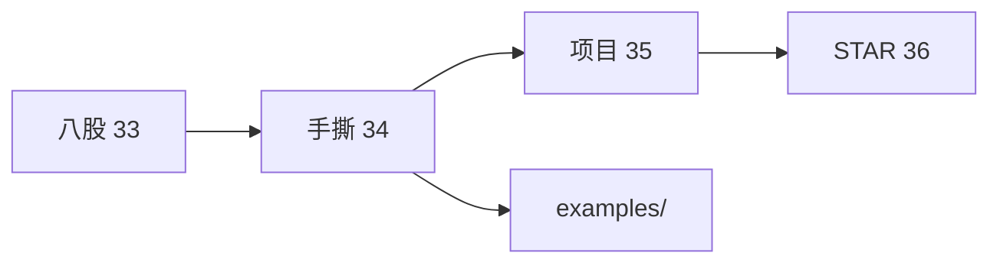

# 手撕代码 TOP50 与白板专题

> **文件编码**：UTF-8。C++ Infra/基建岗 **50 道白板题清单** + **参考骨架**；配合 [13 算法](13-算法与数据结构C++实现.md)、[14 面试](14-高频面试专题与场景题.md)、[examples/algorithm-templates](examples/algorithm-templates/)。

---

## 本章与前后章的关系

| 上一章（33） | 本章（34） | 下一章（35） |
|--------------|------------|--------------|
| 八股索引 | **手撕 TOP50** | KV-Store 项目 |
| 口述 2 min | 白板 10～20 min | 简历交付 |



---

## 0. 读前导读

### 0.1 用一句话弄懂本章

Infra 面试除 LeetCode 外，常手撕 **LRU、线程池、生产者消费者、智能指针、字符串、内存池**——本章给 **50 题清单 + 骨架**，目标 **15 分钟内写出可编译主逻辑**。

### 0.2 你需要提前知道什么

| 状态 | 动作 |
|------|------|
| 13 章模板未练 | 先刷 13 章 §11 题单 |
| 不会 CMake 单文件编译 | `g++ -std=c++17 -Wall -O2 file.cpp -o t && ./t` |
| 没写过线程 | 回 [08 章](08-多线程与并发编程.md) |
| 时间不够 | 先练 ★★★ 题（§2 标注） |

### 0.3 本章知识地图（☐→☑）

- ☐ TOP50 中 ★★★ 题 ≥20 道能 15 min 出骨架
- ☐ LRU / 线程池 / 生产者消费者能闭卷写
- ☐ 智能指针/make_unique 模板能解释
- ☐ 字符串类能讲 Rule of Five
- ☐ §9 模拟白板 45 min 完成 2 题
- ☐ §11 闭卷自测 ≥8/10

### 0.4 建议学习时长

| 周次 | 内容 | 题量 |
|------|------|------|
| W1 | §3 数据结构+LRU | 1～15 |
| W2 | §4 并发+池 | 16～30 |
| W3 | §5 字符串+内存+Ptr | 31～45 |
| W4 | §6 网络+综合 | 46～50 + 模拟 |

### 0.5 学完你能做什么

1. 白板写 LRU（list+unordered_map）并讲复杂度
2. 10 分钟写线程安全队列 + 生产者消费者 main
3. 向面试官解释 `shared_ptr` 控制块与 `make_shared`
4. 把 LRU/线程池写进 [35 KV-Store](35-项目实战高性能KV-Store.md)

**白板节奏**：2 min 澄清 → 5 min 讲思路+复杂度 → 10 min 写代码 → 3 min 测边界

---

## 1. TOP50 总览

| 类别 | 编号 | 题数 | 典型考点 |
|------|------|------|----------|
| A 数据结构 | 1～15 | 15 | LRU、LFU、堆、哈希 |
| B 并发 | 16～30 | 15 | 队列、池、锁、CV |
| C 字符串/内存 | 31～40 | 10 | Rule of Five、池 |
| D 智能指针/RAII | 41～45 | 5 | 自定义 deleter、控制块 |
| E 网络/IO | 46～50 | 5 | epoll 骨架、协议 |

**难度**：★ 热身 · ★★ 常考 · ★★★ 大厂/Infra 高频

---

## 2. A 类：数据结构（1～15）

| # | 题目 | 难度 | 时间 | 关键点 |
|---|------|------|------|--------|
| 1 | LRU Cache（146） | ★★★ | 15m | list+splice+unordered_map |
| 2 | LFU Cache（460） | ★★★ | 20m | freq 桶+min_freq |
| 3 | 设计 HashMap（706） | ★★ | 15m | 链地址/开放寻址 |
| 4 | 最小栈（155） | ★★ | 10m | 辅助栈 |
| 5 | 用栈实现队列（232） | ★★ | 10m | 双栈 |
| 6 | 用队列实现栈（225） | ★★ | 10m | 单队列旋转 |
| 7 | TopK 频率（347） | ★★★ | 15m | 小顶堆 |
| 8 | 合并 K 个链表（23） | ★★★ | 15m | 堆/分治 |
| 9 | 环形缓冲区 Ring Buffer | ★★★ | 15m | head/tail 模运算 |
| 10 | 设计跳表（概念） | ★★ | 15m | 多层索引 |
| 11 | 并查集 | ★★ | 10m | 路径压缩 |
| 12 | 前缀树 Trie | ★★ | 15m | 自动补全 |
| 13 | 一致性 Hash（概念） | ★★ | 15m | 虚拟节点 |
| 14 | 双端队列最大项（239） | ★★★ | 15m | 单调队列 |
| 15 | 设计 Twitter（355） | ★★★ | 20m | 哈希+堆 |

### A1 LRU Cache 参考骨架

```cpp
class LRUCache {
    int cap_;
    std::list<std::pair<int,int>> list_;
    std::unordered_map<int, std::list<std::pair<int,int>>::iterator> map_;
    void touch(decltype(map_)::iterator it) {
        list_.splice(list_.begin(), list_, it->second);
    }
public:
    explicit LRUCache(int c) : cap_(c) {}
    int get(int key) {
        auto it = map_.find(key);
        if (it == map_.end()) return -1;
        touch(it);
        return it->second->second;
    }
    void put(int key, int val) {
        auto it = map_.find(key);
        if (it != map_.end()) {
            it->second->second = val;
            touch(it);
            return;
        }
        if ((int)list_.size() >= cap_) {
            map_.erase(list_.back().first);
            list_.pop_back();
        }
        list_.emplace_front(key, val);
        map_[key] = list_.begin();
    }
};
```

**口述**：get/put 均摊 O(1)；list 管顺序，map 管定位；满则 evict 尾部。

---

## 3. B 类：并发与线程（16～30）

| # | 题目 | 难度 | 时间 | 关键点 |
|---|------|------|------|--------|
| 16 | 线程安全队列 | ★★★ | 15m | mutex+cv+optional |
| 17 | 生产者-消费者 | ★★★ | 15m | 2 线程+队列 |
| 18 | 读者写者锁 | ★★★ | 15m | shared_mutex |
| 19 | 打印奇偶顺序 | ★★ | 10m | 双 cv 或 sem |
| 20 | 按序打印 ABC | ★★ | 10m | 条件变量 |
| 21 | 线程池（固定 worker） | ★★★ | 20m | queue+stop flag |
| 22 | 任务 future 聚合 | ★★ | 15m | packaged_task |
| 23 | 自旋锁 | ★★ | 10m | atomic_flag |
| 24 | 一次性初始化 call_once | ★★ | 10m | once_flag |
| 25 | 哲学家进餐 | ★★★ | 15m | 破坏循环等待 |
| 26 | 信号量实现 PV | ★★ | 15m | mutex+cv+count |
| 27 | 屏障 barrier 模拟 | ★★ | 15m | C++20 或 cv |
| 28 | 无锁单生产者单消费者 | ★★★ | 20m | ring buffer+atomic |
| 29 | 定时线程池 | ★★★ | 20m | priority_queue+time |
| 30 | 并行 for 分块 | ★★ | 15m | 线程划分区间 |

### B16 线程安全队列骨架

```cpp
template<typename T>
class ThreadSafeQueue {
    mutable std::mutex mtx_;
    std::condition_variable cv_;
    std::queue<T> q_;
    bool closed_{false};
public:
    void push(T v) {
        {
            std::lock_guard lk(mtx_);
            if (closed_) return;
            q_.push(std::move(v));
        }
        cv_.notify_one();
    }
    std::optional<T> pop() {
        std::unique_lock lk(mtx_);
        cv_.wait(lk, [&]{ return closed_ || !q_.empty(); });
        if (q_.empty()) return std::nullopt;
        T v = std::move(q_.front());
        q_.pop();
        return v;
    }
    void close() {
        {
            std::lock_guard lk(mtx_);
            closed_ = true;
        }
        cv_.notify_all();
    }
};
```

### B21 线程池骨架（简化）

```cpp
class ThreadPool {
    std::vector<std::thread> workers_;
    ThreadSafeQueue<std::function<void()>> tasks_;
    std::atomic<bool> stop_{false};
public:
    explicit ThreadPool(size_t n) {
        for (size_t i = 0; i < n; ++i)
            workers_.emplace_back([this] {
                while (auto task = tasks_.pop()) {
                    if (stop_) break;
                    (*task)();
                }
            });
    }
    template<class F>
    void submit(F&& f) { tasks_.push(std::forward<F>(f)); }
    ~ThreadPool() {
        stop_ = true;
        tasks_.close();
        for (auto& w : workers_) w.join();
    }
};
```

**面试追问**：任务队列上限？拒绝策略？异常传播？

---

## 4. C 类：字符串与内存（31～40）

| # | 题目 | 难度 | 时间 | 关键点 |
|---|------|------|------|--------|
| 31 | 实现 MyString（Rule of Five） | ★★★ | 20m | char*+size+cap |
| 32 | 实现 append/resize | ★★ | 15m | 2 倍扩容 |
| 33 | 实现 string_view 包装 | ★★ | 10m | 非拥有指针+len |
| 34 | 内存池固定块 | ★★★ | 20m | free list |
| 35 | 内存池变长块 | ★★★ | 20m | 分级 size class |
| 36 | 对象池 GameObject | ★★ | 15m | placement+queue |
| 37 | 实现 memcpy/memset | ★★ | 10m | 字节循环 |
| 38 | 大端小端转换 | ★★ | 10m | union/移位 |
| 39 | 对齐分配 aligned_alloc 封装 | ★★ | 15m | alignas+posix |
| 40 | Buffer 三五法则 | ★★★ | 15m | 见 14 章 §14 |

### C31 MyString / C34 内存池

完整骨架见 [14 章 §14 Buffer](14-高频面试专题与场景题.md) 与 [34 章 §4](34-手撕代码TOP50与白板专题.md)；核心：**Rule of Five** + **free list O(1) allocate/deallocate**。

---

## 5. D 类：智能指针与 RAII（41～45）

| # | 题目 | 难度 | 时间 | 关键点 |
|---|------|------|------|--------|
| 41 | 实现 unique_ptr | ★★★ | 15m | 析构 delete、禁止拷贝 |
| 42 | 实现 shared_ptr（简化） | ★★★ | 20m | 控制块+引用计数 |
| 43 | 自定义 deleter FILE* | ★★ | 10m | 函数对象+fclose |
| 44 | FdGuard RAII | ★★ | 10m | close 析构 |
| 45 | scope_guard 退出执行 | ★★ | 10m | 析构调 lambda |

### D41 unique_ptr / D42 shared_ptr

```cpp
template<typename T> class UniquePtr {
    T* ptr_{nullptr};
public:
    explicit UniquePtr(T* p=nullptr): ptr_(p) {}
    ~UniquePtr() { delete ptr_; }
    UniquePtr(const UniquePtr&)=delete;
    UniquePtr(UniquePtr&& o) noexcept : ptr_(o.ptr_) { o.ptr_=nullptr; }
    T* get() const { return ptr_; }
};
// shared_ptr：ptr + atomic<size_t>* cnt；循环引用用 weak_ptr（见 14-Q4）
```

---

## 6. E 类：网络与综合（46～50）

| # | 题目 | 难度 | 时间 | 关键点 |
|---|------|------|------|--------|
| 46 | epoll echo server 骨架 | ★★★ | 20m | epoll_wait 循环 |
| 47 | 解析 HTTP 请求行 | ★★ | 15m | `\r\n` 定界 |
| 48 | length-prefix 协议编解码 | ★★ | 15m | 4 字节 len+body |
| 49 | 定时器 wheel/堆 | ★★★ | 20m | 超时 disconnect |
| 50 | KV-Store 接口设计 | ★★★ | 20m | Get/Put/Del+LRU |

### E46 epoll echo 骨架

```cpp
void run_echo_server(int port) {
    int lfd = socket(AF_INET, SOCK_STREAM, 0);
    // bind listen ... 省略
    int ep = epoll_create1(0);
    epoll_event ev{}; ev.events = EPOLLIN; ev.data.fd = lfd;
    epoll_ctl(ep, EPOLL_CTL_ADD, lfd, &ev);
    std::array<epoll_event, 64> events{};
    while (true) {
        int n = epoll_wait(ep, events.data(), events.size(), -1);
        for (int i = 0; i < n; ++i) {
            int fd = events[i].data.fd;
            if (fd == lfd) { /* accept 新 fd 加入 epoll */ }
            else { /* read echo write; EAGAIN/EPIPE 处理 */ }
        }
    }
}
```

### E50 KV 接口骨架

```cpp
class IKVStore {
public:
    virtual ~IKVStore() = default;
    virtual bool Get(const std::string& k, std::string& v) = 0;
    virtual bool Put(const std::string& k, const std::string& v) = 0;
    virtual bool Del(const std::string& k) = 0;
};
// 实现：unordered_map + LRU 淘汰 + WAL（见 35 章）
```

---

## 7. 白板专题速查

### 7.1 必背复杂度

| 结构/操作 | 复杂度 |
|-----------|--------|
| LRU get/put | O(1) |
| map find | O(log n) |
| unordered_map | 均摊 O(1) |
| 堆 push/pop | O(log n) |
| vector push_back | 均摊 O(1) |

### 7.2 边界清单（写完必测）

- 空输入 / 单元素
- 容量为 0（LRU）
- 满队列 push / 关闭后 pop
- 移动后对象仍 valid
- epoll ET 读到 EAGAIN

### 7.3 面试官常追问

| 题 | 追问 |
|----|------|
| LRU | 线程安全怎么加？分片锁？ |
| 线程池 | 任务抛异常？队列满？ |
| shared_ptr | 循环引用？make_shared 好处？ |
| 内存池 | 线程安全？与 tcmalloc 区别？ |
| epoll | LT/ET？惊群？ |

---

## 8. 与 examples 对照

| 题 | 仓库路径 |
|----|----------|
| LRU | [examples/algorithm-templates/lru_cache.cpp](examples/algorithm-templates/lru_cache.cpp) |
| 并查集 | [examples/algorithm-templates/union_find.cpp](examples/algorithm-templates/union_find.cpp) |
| mini-http | [examples/mini-http](examples/mini-http/) |
| CMake | [examples/hello-cmake](examples/hello-cmake/) |

编译 LRU 示例：

```bash
g++ -std=c++17 -Wall -O2 examples/algorithm-templates/lru_cache.cpp -o lru_test
./lru_test
```

---

## 9. 45 分钟模拟白板

| 分钟 | 内容 |
|------|------|
| 0～2 | 抽题：如 #1 LRU + #16 队列 |
| 2～7 | 讲思路、数据结构、复杂度 |
| 7～22 | 写 LRU 完整代码 |
| 22～37 | 写 ThreadSafeQueue |
| 37～42 | 边界+main 测试 |
| 42～45 | 口述如何接入 KV-Store（35 章） |

---

## 10. 刷题计划

W1 题 1～15；W2 题 16～30；W3 题 31～45；W4 题 46～50 + §9 模拟。每天 3～4 题，错题标注回本文骨架。

---

## 11. 闭卷自测

1. LRU 用哪两个 STL 容器？为什么？
2. 线程安全队列 `wait` 为什么要谓词？
3. unique_ptr 三条：拷贝？移动？析构？
4. 固定块内存池 free list 如何 O(1) 分配？
5. epoll ET 读 socket 为何要循环 read？
6. Rule of Five 五个函数名？
7. 生产者消费者需要几个同步原语？
8. shared_ptr 循环引用怎么破？
9. TopK 用小顶堆还是大顶堆？为什么？
10. 综合：15 min 白板写 LRU（纸笔计时）。

### 参考答案

1. `list`+`unordered_map`；list O(1) 移动顺序，map O(1) 定位迭代器。
2. 防虚假唤醒；条件不满足继续睡。
3. 禁拷贝；允许移动；析构 delete。
4. 空闲块串成链表；allocate 弹头，deallocate 插头。
5. ET 只通知一次；不读尽会丢事件。
6. 析构、拷贝构造、拷贝赋值、移动构造、移动赋值。
7. mutex + condition_variable（+ 可选 closed flag）。
8. weak_ptr 打破双向 shared。
9. 小顶堆维护 size k，堆顶为第 k 大。
10. 自测：对照 §2 A1 骨架。

---

## 12. 学完标准

- [ ] ★★★ 题（约 22 道）≥15 道 15 min 出骨架
- [ ] LRU、线程池、安全队列闭卷通过
- [ ] 能编译运行 examples/lru_cache.cpp
- [ ] 完成 §9 一次 45 min 模拟
- [ ] 能将 #50 接口与 35 章项目对应
- [ ] §11 闭卷 ≥8/10

---

## 13. 下一章

- 项目实战：[35-项目实战高性能KV-Store.md](35-项目实战高性能KV-Store.md)
- STAR 简历：[36-面试STAR表达与简历手册.md](36-面试STAR表达与简历手册.md)
- 八股索引：[33-C++Infra面试八股总表.md](33-C++Infra面试八股总表.md)
