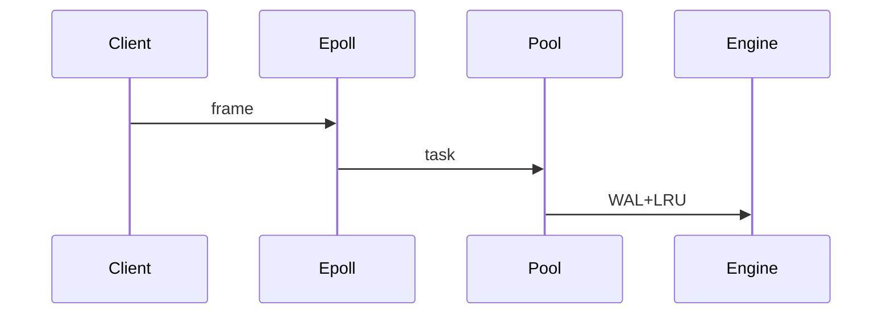

# 项目实战：高性能 KV-Store

> **文件编码**：UTF-8。  
> **定位**：Infra/后端 C++ **简历级交付物**——epoll + 线程池 + LRU + WAL 持久化 + CMake + gtest；面试 STAR 主项目。  
> **交叉阅读**：[23 epoll](23-IO多路复用与高性能Server.md)、[08 线程池](08-多线程与并发编程.md)、[13 LRU](13-算法与数据结构C++实现.md)、[09 CMake](09-CMake与项目工程化.md)、[34 手撕](34-手撕代码TOP50与白板专题.md)。

---

## 0. 读前导读

### 0.1 用一句话弄懂本章

用 **4～6 周** 做一个可压测、可演示、可写简历的 **内存 KV 存储服务**：TCP 自定义协议、LRU 淘汰、WAL 崩溃恢复、epoll 接客、线程池执行业务——覆盖 Infra 面试 **网络+并发+存储+工程化**。

### 0.2 你需要提前知道什么

| 状态 | 动作 |
|------|------|
| mini-http 未做 | 先 [10 章](10-网络编程与简易HTTP服务.md) + examples/mini-http |
| 不会 epoll | [23 章](23-IO多路复用与高性能Server.md) |
| 没写过 gtest | 本章 §8 最小示例 |
| WSL/Linux | 本项目 **依赖 epoll**，Windows 用 WSL2 |

### 0.3 知识地图（☐→☑）

- [ ] 能画架构：Client → epoll → 线程池 → Engine(LRU+WAL)
- [ ] 实现 length-prefix 协议 Get/Put/Del
- [ ] LRU O(1) 与 max_memory 淘汰
- [ ] WAL append + 启动 replay
- [ ] CMake 构建 + gtest 单测
- [ ] wrk/自写 client 压测并记录 QPS
- [ ] §15 闭卷自测 ≥8/10

### 0.4 周期与验证

W1 协议+TCP → W2 LRU → W3 WAL → W4 epoll+线程池 → W5 CMake+gtest → W6 压测+简历（36 章）。§15 闭卷 ≥8/10。

---

## 1. 项目目标与非目标

### 1.1 目标（Must Have）

- TCP 二进制协议：Get / Put / Del
- 内存哈希表 + **LRU** 容量淘汰
- **WAL** 持久化，崩溃重启 **replay**
- **epoll** 事件循环 + **线程池** 处理请求
- **CMake** 工程 + **gtest** 核心单测
- 压测数据：QPS、P99（可粗糙）

### 1.2 非目标（Nice to Have，二期）

- 多副本/Raft 分布式
- RDB 快照替代 WAL
- TLS/鉴权
- 完整 Redis 命令集

### 1.3 与 Redis/memcached 对比（面试话术）

| | 本项目 | Redis |
|--|--------|-------|
| 定位 | 学习+简历 | 生产级 |
| 协议 | 自定义二进制 | RESP |
| 持久化 | WAL | RDB+AOF |
| 并发 | epoll+线程池 | 单线程+IO 线程 |

---

## 2. 系统架构

```text
+----------+     TCP      +---------------------------+
|  Client  | ------------>|  Acceptor (epoll LT)      |
+----------+              |  - listen fd              |
                          |  - conn fd readable       |
                          +------------+--------------+
                                       |
                          parse length-prefix frame
                                       v
                          +------------+--------------+
                          |  ThreadPool (N workers)   |
                          +------------+--------------+
                                       |
                          +------------+--------------+
                          |  KVEngine                 |
                          |  - unordered_map + LRU    |
                          |  - WAL append             |
                          +------------+--------------+
                                       |
                          +------------+--------------+
                          |  wal.log (append-only)    |
                          +---------------------------+
```



---

## 3. 目录结构

`kv-store/`：`include/`（protocol, kv_engine, lru, wal, thread_pool, epoll_server）· `src/` · `tests/` · `tools/kv_client.cpp` · 根 `CMakeLists.txt` · `data/wal.log`（gitignore）。

---

## 4. 二进制协议（length-prefix）

### 4.1 帧格式

```text
| magic 2B | op 1B | key_len 4B | val_len 4B | key | val |
magic = 0xKV (0x4B 0x56)
op: 1=GET 2=PUT 3=DEL
```

### 4.2 响应

```text
| status 1B | val_len 4B | val |
status: 0=OK 1=NOT_FOUND 2=ERROR
GET 命中带 val；PUT/DEL OK 时 val_len=0
```

### 4.3 protocol.h 骨架

```cpp
#pragma once
#include <cstdint>
#include <string>
#include <vector>

enum class Op : uint8_t { Get = 1, Put = 2, Del = 3 };
enum class Status : uint8_t { Ok = 0, NotFound = 1, Error = 2 };

struct Request {
    Op op;
    std::string key;
    std::string value;  // Put 用
};

struct Response {
    Status status{Status::Ok};
    std::string value;
};

bool read_frame(int fd, Request& out);       // 阻塞读满一帧
std::vector<uint8_t> encode_response(const Response& r);
```

**面试点**：粘包用 length-prefix；ET 模式需循环 `read` 直到 EAGAIN 或满帧。

---

## 5. LRU 缓存层

### 5.1 职责

- `Get`：命中则 touch LRU；未命中返回 NOT_FOUND
- `Put`：更新/插入；超 **max_entries** 淘汰最久未用
- 可选：按 **value 字节总和** 限内存

### 5.2 接口

```cpp
class LRUCache {
public:
    explicit LRUCache(size_t max_entries);
    bool get(const std::string& k, std::string& v);
    void put(const std::string& k, const std::string& v);
    bool erase(const std::string& k);
    size_t size() const;
};
```

实现同 [34 章 §2 A1](34-手撕代码TOP50与白板专题.md) 与 [examples/lru_cache.cpp](examples/algorithm-templates/lru_cache.cpp)。

### 5.3 单元测试要点（gtest）

- 容量 2：put 1,2,3 → get 1 失败
- 更新已存在 key 不增加 size
- erase 后 get 失败

---

## 6. WAL 持久化

### 6.1 日志格式（文本或二进制）

**简易文本（便于调试）**：

```text
PUT key value
DEL key
```

**二进制（高效）**：`op|key_len|val_len|key|val`

### 6.2 写入策略

1. `Put/Del`：**先 append WAL**，`fsync` 策略可选（每写/fsync 或 batch）
2. 更新内存 LRU
3. 返回客户端

### 6.3 恢复

启动时 `replay_wal()`：顺序重放至内存；若 WAL 过大可二期做 snapshot。

### 6.4 wal.h 骨架

```cpp
#pragma once
#include <fstream>
#include <string>

class WAL {
    std::fstream fs_;
    std::string path_;
public:
    explicit WAL(std::string path);
    void append_put(const std::string& k, const std::string& v);
    void append_del(const std::string& k);
    void sync();  // fsync
    template<class Fn>
    void replay(Fn&& apply);  // apply(op,k,v)
};
```

### 6.5 面试话术

**S**：单机 KV 需崩溃不丢已提交写。  
**T**：仅内存会在 kill -9 后全丢。  
**A**：WAL 先日志后内存；启动 replay。  
**R**：kill 后重启数据恢复；代价是写放大，可二期 snapshot。

---

## 7. KVEngine 组合

```cpp
class KVEngine {
    LRUCache cache_;
    WAL wal_;
    std::mutex mtx_;  // 简化：单锁；进阶可分片
public:
    KVEngine(size_t max_entries, std::string wal_path);
    Response handle(const Request& req);
};
```

`handle` 逻辑：

- **Get**：只读 cache（可 shared_lock 优化）
- **Put**：`wal.append_put` → `cache.put`
- **Del**：`wal.append_del` → `cache.erase`

---

## 8. epoll 服务器

### 8.1 线程模型

| 模型 | 说明 |
|------|------|
| **推荐** | 主线程 epoll 读帧 → 线程池执行业务 → 主线程写回 |
| 进阶 | 每连接状态机；写事件 EPOLLOUT |

### 8.2 epoll_server 骨架

```cpp
class EpollServer {
    int listen_fd_{-1}, epfd_{-1};
    ThreadPool pool_;
    KVEngine& engine_;
    void on_readable(int fd);
public:
    EpollServer(int port, KVEngine& eng, size_t workers);
    void run();  // 事件循环
};
```

`on_readable`：

1. 非 listen：读满 Request（或缓冲半包）
2. `pool_.submit([=]{ auto resp = engine_.handle(req); enqueue_write(fd, resp); })`
3. listen：`accept` 新 fd 注册 EPOLLIN

参考 [23 章](23-IO多路复用与高性能Server.md) LT 模式。

### 8.3 连接管理

- `unordered_map<int, ConnState>` 存读缓冲
- 关闭：EPOLLRDHUP / read=0 / 错误 → epoll_ctl DEL + close

---

## 9. CMake 工程

### 9.1 CMake 要点

`add_library(kv_core …)` + `kv_server`/`kv_client` + `find_package(GTest)` + `gtest_discover_tests`。构建：`cmake -S . -B build && cmake --build build -j && ctest --test-dir build`。

---

## 10. gtest 与 main

```cpp
TEST(LRU, Evict) {
    LRUCache c(2); c.put("a","1"); c.put("b","2");
    std::string v; c.get("a", v); c.put("c","3");
    EXPECT_FALSE(c.get("b", v));
}
// main：KVEngine engine(10000, wal); EpollServer server(port, engine, hw_concurrency()); server.run();
```

CMake 见 §9；WAL 单测：`append_put` 后 `replay` 断言 map 含 key。

---

## 11. 压测与指标

### 12.1 简易 client 并发

多线程连接：`Put` N 次 / `Get` N 次，统计吞吐与延迟。

### 12.2 优化 checklist

减 fsync 频率（说明风险）· shared_mutex 读路径 · 缓冲复用 · Release -O2 · perf 查锁热点（[12 章](12-性能分析与调试.md)）。

---

## 12. 里程碑验收

| # | 验收 | 命令/现象 |
|---|------|-----------|
| M1 | 单线程 TCP Put/Get | client 返回 OK |
| M2 | LRU 淘汰 | 超 10 条 evict |
| M3 | WAL 恢复 | kill -9 重启 key 仍在 |
| M4 | epoll 并发 | 10 线程 client 无错 |
| M5 | gtest 绿 | ctest 全过 |
| M6 | 压测表 | README 填 QPS |

---

## 13. 简历 bullet 模板

- 设计并实现 C++17 **高性能 KV-Store**，epoll LT + 线程池，单机 QPS **xxxx**（Release）
- 内存层 **LRU** O(1) 淘汰；**WAL** 崩溃恢复，kill -9 后 replay 零丢失（sync 策略说明）
- CMake + gtest 单测覆盖 LRU/WAL/Engine；自定义 length-prefix 二进制协议

---

## 14. FAQ

1. **为何不用 HTTP？** 聚焦 TCP/存储；HTTP 可二期网关。  
2. **fsync 慢？** 参数 `--sync-every=N`，说明丢失窗口。  
3. **Windows？** epoll 仅 Linux；用 WSL2。  
4. **与 34 章？** 手撕 #50 即本章接口。  
5. **分布式？** 一期单机；面试讲 snapshot/分片设想。

---

## 15. 闭卷自测

1. 架构四层分别是什么？
2. length-prefix 如何解决粘包？
3. Put 先写 WAL 还是先改内存？为什么？
4. LRU 两个容器及复杂度？
5. epoll 主线程与线程池分工？
6. 启动时 WAL 做什么？
7. CMake 如何启用 gtest？
8. 简历上应写哪些量化指标？
9. LT 与 ET 读半包怎么处理？
10. STAR：WAL 设计 30 秒版。

### 参考答案

1. Client → epoll → ThreadPool → KVEngine+WAL。
2. 先读固定头得 key/val 长度，再读 body。
3. 先 WAL 再内存；崩溃时可 replay 未进内存的已提交写。
4. list+unordered_map；get/put O(1)。
5. epoll 读/accept；池内 handle 业务。
6. replay 重放到内存表。
7. `find_package(GTest)` + `gtest_discover_tests`。
8. QPS、P99、数据规模、恢复验证。
9. LT 下次还通知；ET 循环 read 至 EAGAIN。
10. S 单机需持久；T kill 丢数据；A WAL+replay；R 恢复成功。

---

## 16. 学完标准

- [ ] 本地跑通 kv_server + client
- [ ] kill -9 后数据可恢复（sync 开启时）
- [ ] ctest 全绿
- [ ] README 含架构图+压测表
- [ ] GitHub 可展示
- [ ] 36 章 STAR 能讲 3 分钟
- [ ] §15 闭卷 ≥8/10

---

## 17. 下一章

- [36-面试STAR表达与简历手册.md](36-面试STAR表达与简历手册.md)
- [33-C++Infra面试八股总表.md](33-C++Infra面试八股总表.md)
- [34-手撕代码TOP50与白板专题.md](34-手撕代码TOP50与白板专题.md)
