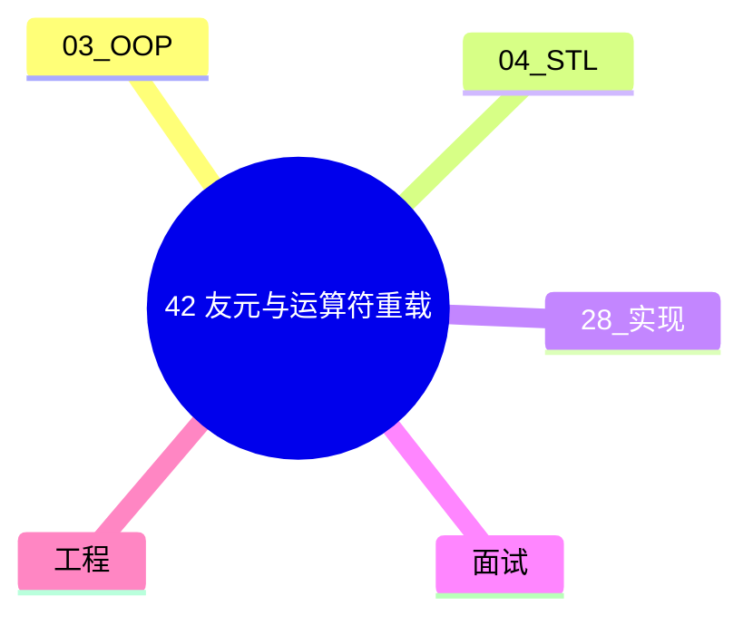

# 友元与运算符重载完全指南

> **文件编码**：UTF-8。
> **定位**：C++ Primer Plus 风格深潜——friend、成员/非成员重载、转换运算符、下标/括号/流。

> **交叉阅读**：[03 面向对象与类设计](03-面向对象与类设计.md)、[04 STL 标准库容器与算法](04-STL标准库容器与算法.md)、[28 手写 STL 容器面试专题](28-手写STL容器面试专题.md)。

> **章节链**：[06 模板与泛型编程](06-模板与泛型编程.md) → **本章（42）** → [43 继承与多态](43-继承与多态模型完全指南.md)

---

## 0. 读前导读（零基础也能跟上）

### 0.1 用一句话弄懂本章

**友元 = 在封装墙上开一扇受控的门；运算符重载 = 让自定义类型像内置类型一样自然运算。**

### 0.2 你需要提前知道什么

- [03 章](03-面向对象与类设计.md) 类、访问控制、继承与多态基础
- [04 章](04-STL标准库容器与算法.md) 容器 API、迭代器与算法入门
- [28 章](28-手写STL容器面试专题.md) 对象布局、Rule of Five、迭代器失效意识
- [02 章](02-指针引用与内存管理.md) 指针、引用、RAII（按需回顾）

### 0.3 本章知识地图（☐→☑）

- [ ] 解释 friend 的访问权限与使用场景
- [ ] 区分成员/非成员/友元运算符重载
- [ ] 实现 `operator[]`、`()`、流插入/提取
- [ ] 理解转换运算符与 explicit 转换
- [ ] 说清 `= delete/default` 与重载的关系
- [ ] 闭卷自测 ≥8/10

### 0.4 建议学习时长

**5～8 天**；每天 1～2 个小节 + 手写示例 + 对照 [04 章](04-STL标准库容器与算法.md) 跑通代码。

### 0.5 学完你能做什么

见 §1「这份文档学什么」末尾的能力清单；完成 § 闭卷自测 ≥8/10 再进入下一章。

---

## 本章与上一章的关系

本章承接 [06 模板与泛型编程](06-模板与泛型编程.md)，并在 [03 章 OOP](03-面向对象与类设计.md) 与 [04 章 STL](04-STL标准库容器与算法.md) 之间搭桥梁。[28 章](28-手写STL容器面试专题.md) 强调 **实现**；本章强调 **语言机制 + 标准库惯用法** 的完整模型。

| 对照章 | 本章侧重 |
|--------|----------|
| [03 OOP](03-面向对象与类设计.md) | 语法到工程：访问、虚函数、抽象类 |
| [04 STL](04-STL标准库容器与算法.md) | 从会用到懂原理：扩容、哈希、算法 |
| [28 手写 STL](28-手写STL容器面试专题.md) | 实现视角验证你对失效/SSO 的理解 |



---

## 1. 这份文档学什么


- `friend` 函数与 `friend` 类：何时打破封装
- 成员 vs 非成员 vs 友元运算符重载的选择
- 一元/二元、前置/后置 `++`、赋值、比较
- 下标 `[]`、函数调用 `()`、箭头 `->`、解引用 `*`
- 输入/输出流 `<<` / `>>` 的非成员惯用法
- 类型转换运算符与 `explicit`
- 重载与 [03 章](03-面向对象与类设计.md) 构造/拷贝的协同

**能力清单**：能为 `Matrix`、`Complex` 设计运算符；解释为何 `ostream` 重载必须是友元；避免转换运算符滥用导致隐式灾难。

---

## 2. friend 机制详解

### 2.1 为什么需要友元

[03 章](03-面向对象与类设计.md) 强调 **封装**：`private` 成员仅类内可访问。某些算法需要同时读写两个对象的私有数据——若仅靠 public 接口，要么暴露过多，要么效率低。**友元** 在编译期授予特定函数/类访问 `private`/`protected` 的权限，**不破坏对象对外接口**。

```cpp
class BankAccount {
    friend bool transfer(BankAccount& from, BankAccount& to, double amt);
    friend class Auditor;  // 整个类成为友元
public:
    explicit BankAccount(double b) : balance_(b) {}
    double balance() const { return balance_; }
private:
    double balance_;
};

bool transfer(BankAccount& from, BankAccount& to, double amt) {
    if (from.balance_ < amt) return false;
    from.balance_ -= amt;
    to.balance_ += amt;
    return true;
}

class Auditor {
public:
    static double peek(const BankAccount& a) { return a.balance_; }
};
```

### 2.2 friend 的特性（Primer Plus 小结）

| 特性 | 说明 |
|---|---|
| 非成员 | 友元函数不是成员，但可访问 private |
| 不可传递 | A 是 B 的友元 ≠ A 的友元可访问 B |
| 不可继承 | 派生类不自动继承基类友元 |
| 单向 | 声明 friend 的类授予权限 |
| 可重载 | 同一函数可成为多个类的友元 |

### 2.3 friend 与封装边界

工程原则：**友元应窄而明确**。优先 public 接口；其次 `friend` 同一翻译单元内的自由函数；最后才是 `friend class`。与 [28 章](28-手写STL容器面试专题.md) 中迭代器友元访问容器内部指针同理——标准库大量用 `friend` 让算法/迭代器高效访问。

---

## 3. 运算符重载基础

### 3.1 可重载与不可重载

| 可重载（部分） | 不可重载 |
|---|---|
| `+ - * / %` | `.` `.*` |
| `++ --` 一元/二元 | `::` `?:` `sizeof` |
| `= < > == !=` | 仅成员：`=` `()` `[]` `->` |
| `<< >>` | C++20 前 `&&` `||` 建议不重载 |
| `()` `[]` `->` `*` |  |

### 3.2 成员 vs 非成员：决策表

| 运算符 | 推荐形式 | 原因 |
|---|---|---|
| `=`, `[]`, `()`, `->` | 成员 | 语法要求或左操作数必须是对象 |
| `<<`, `>>` | 非成员友元 | 左操作数是 ostream/istream |
| `+`, `-`, `==` | 非成员 | 支持 `int + Complex` 对称性 |
| `++` 前置/后置 | 成员 | 区分 `operator++()` vs `operator++(int)` |

### 3.3 Complex 完整示例

```cpp
#include <iostream>

class Complex {
public:
    Complex(double r = 0, double i = 0) : re_(r), im_(i) {}

    Complex& operator+=(const Complex& rhs) {
        re_ += rhs.re_;
        im_ += rhs.im_;
        return *this;
    }

    // 前置 ++
    Complex& operator++() {
        ++re_;
        return *this;
    }
    // 后置 ++
    Complex operator++(int) {
        Complex tmp(*this);
        ++(*this);
        return tmp;
    }

    friend Complex operator+(Complex lhs, const Complex& rhs) {
        lhs += rhs;
        return lhs;
    }

    friend std::ostream& operator<<(std::ostream& os, const Complex& c) {
        return os << c.re_ << '+' << c.im_ << 'i';
    }

private:
    double re_, im_;
};
```

---

## 4. 赋值、比较与三路比较（C++20）

### 4.1 拷贝赋值与移动赋值

[03 章](03-面向对象与类设计.md) Rule of Five：[28 章](28-手写STL容器面试专题.md) 强调 copy-and-swap。重载 `operator=` 时：

1. 自赋值检查（或用 copy-and-swap 免显式检查）
2. 异常安全：先拷贝再释放，或 swap
3. 与 `= default` / `= delete` 协同

```cpp
class Buffer {
public:
    Buffer& operator=(Buffer other) noexcept {
        swap(other);
        return *this;
    }
    void swap(Buffer& o) noexcept {
        using std::swap;
        swap(data_, o.data_);
        swap(len_, o.len_);
    }
private:
    char* data_{nullptr};
    std::size_t len_{0};
};
```

### 4.2 `operator<=>` 与 `==`

C++20 **三路比较** 一次生成 `<`, `<=`, `>`, `>=`：

```cpp
#include <compare>

struct Version {
    int major, minor, patch;
    auto operator<=>(const Version&) const = default;
};
```

---

## 5. 下标与函数调用运算符

### 5.1 `operator[]`

- 必须成员
- 通常提供 const / non-const 两版本
- 不强制边界检查（与 `at()` 区分）

```cpp
template<typename T>
class ArrayView {
public:
    T& operator[](std::size_t i) { return data_[i]; }
    const T& operator[](std::size_t i) const { return data_[i]; }
private:
    T* data_;
    std::size_t n_;
};
```

### 5.2 `operator()` 与函数对象

**函数对象（Functor）** 是 STL 算法灵魂——[04 章](04-STL标准库容器与算法.md) `sort` 的比较器、[06 章](06-模板与泛型编程.md) 谓词。

```cpp
struct LessByLength {
    bool operator()(const std::string& a, const std::string& b) const {
        return a.size() < b.size();
    }
};

// 使用
// std::sort(v.begin(), v.end(), LessByLength{});
```

### 5.3 多维下标（C++23 `operator[]` 多参数）

C++23 起可重载 `operator[](int i, int j)` 用于矩阵——了解即可，工程可用 `()` 代替。

---

## 6. 输入输出流重载

### 6.1 友元 + 非成员

`std::cout << obj` 左操作数是 `ostream`，因此 **必须** 非成员（常为友元）：

```cpp
class Point {
    friend std::ostream& operator<<(std::ostream& os, const Point& p) {
        return os << '(' << p.x_ << ',' << p.y_ << ')';
    }
    friend std::istream& operator>>(std::istream& is, Point& p) {
        return is >> p.x_ >> p.y_;
    }
public:
    Point(int x = 0, int y = 0) : x_(x), y_(y) {}
private:
    int x_, y_;
};
```

### 6.2 格式化与 iomanip

与 [04 章](04-STL标准库容器与算法.md) `string` 流配合：`ostringstream` 实现 `to_string` 自定义版。

---

## 7. 类型转换运算符

### 7.1 隐式转换的风险

```cpp
class Meter {
    explicit Meter(double m) : val_(m) {}
public:
    explicit operator double() const { return val_; }  // C++11 explicit
private:
    double val_;
};
```

**Primer Plus 建议**：转换运算符尽量 `explicit`；能用命名函数 `to_int()` 时优先命名函数，避免 `if (obj)` 类意外。

### 7.2 与单参数构造函数的竞争

编译器 **只允许一条** 隐式转换路径——[05 章](05-现代C++新特性.md) `explicit` 构造函数同样重要。

---

## 8. 智能指针与 `operator->`

`operator->` 必须返回指针类型；`shared_ptr` 通过 **代理** 连续调用 `operator->` 直到得到原始指针——[02 章](02-指针引用与内存管理.md) 延伸。

```cpp
template<typename T>
class UniquePtr {
public:
    T* operator->() const { return ptr_; }
    T& operator*() const { return *ptr_; }
private:
    T* ptr_;
};
```

---

## 9. 重载与 STL 协同

| 场景 | 重载点 | 04 章关联 |
|------|--------|-----------|
| 自定义 key | `operator<` 或 `Compare` 仿函数 | `map` 排序 |
| 哈希 key | `std::hash` 特化 | `unordered_map` |
| 输出调试 | `operator<<` | 日志/测试 |

[28 章](28-手写STL容器面试专题.md) 手写 `MyVector` 可重载 `==` 用于单测断言。

---

## 10. 常见陷阱清单

1. **返回 dangling 引用**：`operator+` 返回 const 引用绑定临时量
2. **`operator=` 未处理自赋值**（copy-and-swap 可解）
3. **滥用 `operator bool`** 与算术混用
4. **`<<` 未恢复流状态** 导致后续 IO 失败
5. **成员 `operator+` 导致不对称**：`2 + c` 编译失败

---

## 11. 分步练习（Primer Plus 风格）

### 练习 1：二维向量 Vec2

实现 `+`, `-`, `*`, `<<`, `==`，并写单元测试。

### 练习 2：固定容量栈

重载 `push` 用 `operator+=` 语义；禁止拷贝用 `= delete`。

### 练习 3：日期类

重载 `++` 进位；`operator<=>` 排序。


## 12. Matrix 类运算符设计

实现 `Matrix`：`operator()(row,col)`、`operator+`、标量乘、`<<` 输出。

```cpp
// 12. Matrix 类运算符设计 示意 — 见 03/04/28 章对照练习
// 编译: g++ -std=c++20 -Wall -Wextra -O2 example.cpp
#include <iostream>
// ... 完整实现请跟随 §11 练习扩展 ...
int main() {
    std::cout << "12. Matrix 类运算符设计 demo\n";
    return 0;
}
```

**要点**：对照 [03 章](03-面向对象与类设计.md) 访问控制；[04 章](04-STL标准库容器与算法.md) 算法传参；[28 章](28-手写STL容器面试专题.md) 资源管理。

## 13. 枚举与 strongly typed enum

`enum class` 重载 `<<` 用于日志。

```cpp
// 13. 枚举与 strongly typed enum 示意 — 见 03/04/28 章对照练习
// 编译: g++ -std=c++20 -Wall -Wextra -O2 example.cpp
#include <iostream>
// ... 完整实现请跟随 §11 练习扩展 ...
int main() {
    std::cout << "13. 枚举与 strongly typed enum demo\n";
    return 0;
}
```

**要点**：对照 [03 章](03-面向对象与类设计.md) 访问控制；[04 章](04-STL标准库容器与算法.md) 算法传参；[28 章](28-手写STL容器面试专题.md) 资源管理。

## 14. CRTP 与运算符

Curiously Recurring Template Pattern 中运算符返回派生类型引用。

```cpp
// 14. CRTP 与运算符 示意 — 见 03/04/28 章对照练习
// 编译: g++ -std=c++20 -Wall -Wextra -O2 example.cpp
#include <iostream>
// ... 完整实现请跟随 §11 练习扩展 ...
int main() {
    std::cout << "14. CRTP 与运算符 demo\n";
    return 0;
}
```

**要点**：对照 [03 章](03-面向对象与类设计.md) 访问控制；[04 章](04-STL标准库容器与算法.md) 算法传参；[28 章](28-手写STL容器面试专题.md) 资源管理。

## 15. 空间运算符与性能

返回值优化（RVO）与 `operator+` 返回 prvalue。

```cpp
// 15. 空间运算符与性能 示意 — 见 03/04/28 章对照练习
// 编译: g++ -std=c++20 -Wall -Wextra -O2 example.cpp
#include <iostream>
// ... 完整实现请跟随 §11 练习扩展 ...
int main() {
    std::cout << "15. 空间运算符与性能 demo\n";
    return 0;
}
```

**要点**：对照 [03 章](03-面向对象与类设计.md) 访问控制；[04 章](04-STL标准库容器与算法.md) 算法传参；[28 章](28-手写STL容器面试专题.md) 资源管理。

## 16. 与移动语义结合

[05 章](05-现代C++新特性.md)：`operator+` 接受 `T&&` 重载。

```cpp
// 16. 与移动语义结合 示意 — 见 03/04/28 章对照练习
// 编译: g++ -std=c++20 -Wall -Wextra -O2 example.cpp
#include <iostream>
// ... 完整实现请跟随 §11 练习扩展 ...
int main() {
    std::cout << "16. 与移动语义结合 demo\n";
    return 0;
}
```

**要点**：对照 [03 章](03-面向对象与类设计.md) 访问控制；[04 章](04-STL标准库容器与算法.md) 算法传参；[28 章](28-手写STL容器面试专题.md) 资源管理。

## 17. 标准库中的运算符范例

`std::string`, `std::complex`, `std::chrono` 源码导读要点。

```cpp
// 17. 标准库中的运算符范例 示意 — 见 03/04/28 章对照练习
// 编译: g++ -std=c++20 -Wall -Wextra -O2 example.cpp
#include <iostream>
// ... 完整实现请跟随 §11 练习扩展 ...
int main() {
    std::cout << "17. 标准库中的运算符范例 demo\n";
    return 0;
}
```

**要点**：对照 [03 章](03-面向对象与类设计.md) 访问控制；[04 章](04-STL标准库容器与算法.md) 算法传参；[28 章](28-手写STL容器面试专题.md) 资源管理。

## 18. ADL 与运算符

Argument-Dependent Lookup：`using namespace std` 与 `std::swap` 惯用法。

```cpp
// 18. ADL 与运算符 示意 — 见 03/04/28 章对照练习
// 编译: g++ -std=c++20 -Wall -Wextra -O2 example.cpp
#include <iostream>
// ... 完整实现请跟随 §11 练习扩展 ...
int main() {
    std::cout << "18. ADL 与运算符 demo\n";
    return 0;
}
```

**要点**：对照 [03 章](03-面向对象与类设计.md) 访问控制；[04 章](04-STL标准库容器与算法.md) 算法传参；[28 章](28-手写STL容器面试专题.md) 资源管理。

## 19. 重载分辨率与候选集

成员、非成员、内置、转换的优先级。

```cpp
// 19. 重载分辨率与候选集 示意 — 见 03/04/28 章对照练习
// 编译: g++ -std=c++20 -Wall -Wextra -O2 example.cpp
#include <iostream>
// ... 完整实现请跟随 §11 练习扩展 ...
int main() {
    std::cout << "19. 重载分辨率与候选集 demo\n";
    return 0;
}
```

**要点**：对照 [03 章](03-面向对象与类设计.md) 访问控制；[04 章](04-STL标准库容器与算法.md) 算法传参；[28 章](28-手写STL容器面试专题.md) 资源管理。

## 20. 调试技巧

`-Wconversion`、编译器 explorer 查看重载选择。

```cpp
// 20. 调试技巧 示意 — 见 03/04/28 章对照练习
// 编译: g++ -std=c++20 -Wall -Wextra -O2 example.cpp
#include <iostream>
// ... 完整实现请跟随 §11 练习扩展 ...
int main() {
    std::cout << "20. 调试技巧 demo\n";
    return 0;
}
```

**要点**：对照 [03 章](03-面向对象与类设计.md) 访问控制；[04 章](04-STL标准库容器与算法.md) 算法传参；[28 章](28-手写STL容器面试专题.md) 资源管理。

## 附录 A：高频面试问答

### A.1 friend 破坏封装吗？

不必然。友元是 **显式授权** 的编译期机制，比 public 数据成员更安全。关键是范围最小化。

### A.2 为什么 `<<` 必须是友元？

左操作数是 `ostream`，不是类对象；成员形式会变成 `obj << cout` 语法错误。

### A.3 前置和后置 `++` 如何区分？

后置接受 dummy `int` 参数：`T operator++(int)`；返回旧值通常 by value。

### A.4 应重载 `&&` 和 `||` 吗？

C++17 前不推荐：会丢失短路求值语义；除非明确需要且文档化。

### A.5 转换运算符为何危险？

隐式转换可在 `func(int)` 与 `func(MyType)` 间制造歧义，且难以追踪。

### A.6 `operator[]` 与 `at()` 区别？

`[]` 不检查边界，行为未定义；`at()` 抛 `out_of_range`。

### A.7 copy-and-swap 是什么？

按值传参拷贝 rhs，swap 交换成员，析构旧资源——强异常安全。

### A.8 重载 `=` 必须返回引用吗？

惯例返回 `*this` 以支持链式赋值；标准库类型均如此。

### A.9 如何实现 `3 + c`？

用非成员 `operator+`，或 `friend` 自由函数，左参数 `Complex` 即可。

### A.10 友元能否是模板？

可以。`template<typename U> friend class Wrapper;` 或特定实例友元。

### A.11 `explicit operator bool` 用途？

安全上下文转换，如 `if (ptr)` 而不隐式转 int。

### A.12 与 03 章 virtual 的关系？

运算符通常非 virtual；虚函数用于行为多态，见 [43 章](43-继承与多态模型完全指南.md)。

### A.13 `operator->` 为何能链式调用？

编译器重复应用直到非指针；智能指针利用此特性。

### A.14 重载影响 ABI 吗？

成员函数签名影响；自由函数不影响类布局。

### A.15 STL 算法如何用到 `operator()`？

谓词 `sort(v.begin(), v.end(), cmp)` 见 [46 章](46-迭代器分类与算法库完全指南.md)。

### 12.1 扩展阅读笔记 1

**主题**：运算符重载场景 1——结合 [04 章](04-STL标准库容器与算法.md) 容器元素类型设计。

当自定义类型作为 `vector<T>` 元素时，移动构造/赋值与 `operator=` 必须一致；否则 [28 章](28-手写STL容器面试专题.md) 讨论的 vector 扩容会触发浅拷贝灾难。检查清单：

1. 深拷贝资源在拷贝构造/赋值中正确复制
2. 移动后源对象处于可析构状态
3. `noexcept` 移动使 `vector` 强异常保证
4. 比较运算符与 `std::sort` 严格弱序一致

**代码片段 1**：

```cpp
struct Item1 {
    int id{0};
    Item1& operator=(const Item1& o) = default;
    auto operator<=>(const Item1&) const = default;
    friend std::ostream& operator<<(std::ostream& os, const Item1& x) {
        return os << "Item1(" << x.id << ")";
    }
};
```

### 12.2 扩展阅读笔记 2

**主题**：运算符重载场景 2——结合 [04 章](04-STL标准库容器与算法.md) 容器元素类型设计。

当自定义类型作为 `vector<T>` 元素时，移动构造/赋值与 `operator=` 必须一致；否则 [28 章](28-手写STL容器面试专题.md) 讨论的 vector 扩容会触发浅拷贝灾难。检查清单：

1. 深拷贝资源在拷贝构造/赋值中正确复制
2. 移动后源对象处于可析构状态
3. `noexcept` 移动使 `vector` 强异常保证
4. 比较运算符与 `std::sort` 严格弱序一致

**代码片段 2**：

```cpp
struct Item2 {
    int id{0};
    Item2& operator=(const Item2& o) = default;
    auto operator<=>(const Item2&) const = default;
    friend std::ostream& operator<<(std::ostream& os, const Item2& x) {
        return os << "Item2(" << x.id << ")";
    }
};
```

### 12.3 扩展阅读笔记 3

**主题**：运算符重载场景 3——结合 [04 章](04-STL标准库容器与算法.md) 容器元素类型设计。

当自定义类型作为 `vector<T>` 元素时，移动构造/赋值与 `operator=` 必须一致；否则 [28 章](28-手写STL容器面试专题.md) 讨论的 vector 扩容会触发浅拷贝灾难。检查清单：

1. 深拷贝资源在拷贝构造/赋值中正确复制
2. 移动后源对象处于可析构状态
3. `noexcept` 移动使 `vector` 强异常保证
4. 比较运算符与 `std::sort` 严格弱序一致

**代码片段 3**：

```cpp
struct Item3 {
    int id{0};
    Item3& operator=(const Item3& o) = default;
    auto operator<=>(const Item3&) const = default;
    friend std::ostream& operator<<(std::ostream& os, const Item3& x) {
        return os << "Item3(" << x.id << ")";
    }
};
```

### 12.4 扩展阅读笔记 4

**主题**：运算符重载场景 4——结合 [04 章](04-STL标准库容器与算法.md) 容器元素类型设计。

当自定义类型作为 `vector<T>` 元素时，移动构造/赋值与 `operator=` 必须一致；否则 [28 章](28-手写STL容器面试专题.md) 讨论的 vector 扩容会触发浅拷贝灾难。检查清单：

1. 深拷贝资源在拷贝构造/赋值中正确复制
2. 移动后源对象处于可析构状态
3. `noexcept` 移动使 `vector` 强异常保证
4. 比较运算符与 `std::sort` 严格弱序一致

**代码片段 4**：

```cpp
struct Item4 {
    int id{0};
    Item4& operator=(const Item4& o) = default;
    auto operator<=>(const Item4&) const = default;
    friend std::ostream& operator<<(std::ostream& os, const Item4& x) {
        return os << "Item4(" << x.id << ")";
    }
};
```

### 12.5 扩展阅读笔记 5

**主题**：运算符重载场景 5——结合 [04 章](04-STL标准库容器与算法.md) 容器元素类型设计。

当自定义类型作为 `vector<T>` 元素时，移动构造/赋值与 `operator=` 必须一致；否则 [28 章](28-手写STL容器面试专题.md) 讨论的 vector 扩容会触发浅拷贝灾难。检查清单：

1. 深拷贝资源在拷贝构造/赋值中正确复制
2. 移动后源对象处于可析构状态
3. `noexcept` 移动使 `vector` 强异常保证
4. 比较运算符与 `std::sort` 严格弱序一致

**代码片段 5**：

```cpp
struct Item5 {
    int id{0};
    Item5& operator=(const Item5& o) = default;
    auto operator<=>(const Item5&) const = default;
    friend std::ostream& operator<<(std::ostream& os, const Item5& x) {
        return os << "Item5(" << x.id << ")";
    }
};
```

### 12.6 扩展阅读笔记 6

**主题**：运算符重载场景 6——结合 [04 章](04-STL标准库容器与算法.md) 容器元素类型设计。

当自定义类型作为 `vector<T>` 元素时，移动构造/赋值与 `operator=` 必须一致；否则 [28 章](28-手写STL容器面试专题.md) 讨论的 vector 扩容会触发浅拷贝灾难。检查清单：

1. 深拷贝资源在拷贝构造/赋值中正确复制
2. 移动后源对象处于可析构状态
3. `noexcept` 移动使 `vector` 强异常保证
4. 比较运算符与 `std::sort` 严格弱序一致

**代码片段 6**：

```cpp
struct Item6 {
    int id{0};
    Item6& operator=(const Item6& o) = default;
    auto operator<=>(const Item6&) const = default;
    friend std::ostream& operator<<(std::ostream& os, const Item6& x) {
        return os << "Item6(" << x.id << ")";
    }
};
```

### 12.7 扩展阅读笔记 7

**主题**：运算符重载场景 7——结合 [04 章](04-STL标准库容器与算法.md) 容器元素类型设计。

当自定义类型作为 `vector<T>` 元素时，移动构造/赋值与 `operator=` 必须一致；否则 [28 章](28-手写STL容器面试专题.md) 讨论的 vector 扩容会触发浅拷贝灾难。检查清单：

1. 深拷贝资源在拷贝构造/赋值中正确复制
2. 移动后源对象处于可析构状态
3. `noexcept` 移动使 `vector` 强异常保证
4. 比较运算符与 `std::sort` 严格弱序一致

**代码片段 7**：

```cpp
struct Item7 {
    int id{0};
    Item7& operator=(const Item7& o) = default;
    auto operator<=>(const Item7&) const = default;
    friend std::ostream& operator<<(std::ostream& os, const Item7& x) {
        return os << "Item7(" << x.id << ")";
    }
};
```

### 12.8 扩展阅读笔记 8

**主题**：运算符重载场景 8——结合 [04 章](04-STL标准库容器与算法.md) 容器元素类型设计。

当自定义类型作为 `vector<T>` 元素时，移动构造/赋值与 `operator=` 必须一致；否则 [28 章](28-手写STL容器面试专题.md) 讨论的 vector 扩容会触发浅拷贝灾难。检查清单：

1. 深拷贝资源在拷贝构造/赋值中正确复制
2. 移动后源对象处于可析构状态
3. `noexcept` 移动使 `vector` 强异常保证
4. 比较运算符与 `std::sort` 严格弱序一致

**代码片段 8**：

```cpp
struct Item8 {
    int id{0};
    Item8& operator=(const Item8& o) = default;
    auto operator<=>(const Item8&) const = default;
    friend std::ostream& operator<<(std::ostream& os, const Item8& x) {
        return os << "Item8(" << x.id << ")";
    }
};
```

### 12.9 扩展阅读笔记 9

**主题**：运算符重载场景 9——结合 [04 章](04-STL标准库容器与算法.md) 容器元素类型设计。

当自定义类型作为 `vector<T>` 元素时，移动构造/赋值与 `operator=` 必须一致；否则 [28 章](28-手写STL容器面试专题.md) 讨论的 vector 扩容会触发浅拷贝灾难。检查清单：

1. 深拷贝资源在拷贝构造/赋值中正确复制
2. 移动后源对象处于可析构状态
3. `noexcept` 移动使 `vector` 强异常保证
4. 比较运算符与 `std::sort` 严格弱序一致

**代码片段 9**：

```cpp
struct Item9 {
    int id{0};
    Item9& operator=(const Item9& o) = default;
    auto operator<=>(const Item9&) const = default;
    friend std::ostream& operator<<(std::ostream& os, const Item9& x) {
        return os << "Item9(" << x.id << ")";
    }
};
```

### 12.10 扩展阅读笔记 10

**主题**：运算符重载场景 10——结合 [04 章](04-STL标准库容器与算法.md) 容器元素类型设计。

当自定义类型作为 `vector<T>` 元素时，移动构造/赋值与 `operator=` 必须一致；否则 [28 章](28-手写STL容器面试专题.md) 讨论的 vector 扩容会触发浅拷贝灾难。检查清单：

1. 深拷贝资源在拷贝构造/赋值中正确复制
2. 移动后源对象处于可析构状态
3. `noexcept` 移动使 `vector` 强异常保证
4. 比较运算符与 `std::sort` 严格弱序一致

**代码片段 10**：

```cpp
struct Item10 {
    int id{0};
    Item10& operator=(const Item10& o) = default;
    auto operator<=>(const Item10&) const = default;
    friend std::ostream& operator<<(std::ostream& os, const Item10& x) {
        return os << "Item10(" << x.id << ")";
    }
};
```

### 12.11 扩展阅读笔记 11

**主题**：运算符重载场景 11——结合 [04 章](04-STL标准库容器与算法.md) 容器元素类型设计。

当自定义类型作为 `vector<T>` 元素时，移动构造/赋值与 `operator=` 必须一致；否则 [28 章](28-手写STL容器面试专题.md) 讨论的 vector 扩容会触发浅拷贝灾难。检查清单：

1. 深拷贝资源在拷贝构造/赋值中正确复制
2. 移动后源对象处于可析构状态
3. `noexcept` 移动使 `vector` 强异常保证
4. 比较运算符与 `std::sort` 严格弱序一致

**代码片段 11**：

```cpp
struct Item11 {
    int id{0};
    Item11& operator=(const Item11& o) = default;
    auto operator<=>(const Item11&) const = default;
    friend std::ostream& operator<<(std::ostream& os, const Item11& x) {
        return os << "Item11(" << x.id << ")";
    }
};
```

### 12.12 扩展阅读笔记 12

**主题**：运算符重载场景 12——结合 [04 章](04-STL标准库容器与算法.md) 容器元素类型设计。

当自定义类型作为 `vector<T>` 元素时，移动构造/赋值与 `operator=` 必须一致；否则 [28 章](28-手写STL容器面试专题.md) 讨论的 vector 扩容会触发浅拷贝灾难。检查清单：

1. 深拷贝资源在拷贝构造/赋值中正确复制
2. 移动后源对象处于可析构状态
3. `noexcept` 移动使 `vector` 强异常保证
4. 比较运算符与 `std::sort` 严格弱序一致

**代码片段 12**：

```cpp
struct Item12 {
    int id{0};
    Item12& operator=(const Item12& o) = default;
    auto operator<=>(const Item12&) const = default;
    friend std::ostream& operator<<(std::ostream& os, const Item12& x) {
        return os << "Item12(" << x.id << ")";
    }
};
```

### 12.13 扩展阅读笔记 13

**主题**：运算符重载场景 13——结合 [04 章](04-STL标准库容器与算法.md) 容器元素类型设计。

当自定义类型作为 `vector<T>` 元素时，移动构造/赋值与 `operator=` 必须一致；否则 [28 章](28-手写STL容器面试专题.md) 讨论的 vector 扩容会触发浅拷贝灾难。检查清单：

1. 深拷贝资源在拷贝构造/赋值中正确复制
2. 移动后源对象处于可析构状态
3. `noexcept` 移动使 `vector` 强异常保证
4. 比较运算符与 `std::sort` 严格弱序一致

**代码片段 13**：

```cpp
struct Item13 {
    int id{0};
    Item13& operator=(const Item13& o) = default;
    auto operator<=>(const Item13&) const = default;
    friend std::ostream& operator<<(std::ostream& os, const Item13& x) {
        return os << "Item13(" << x.id << ")";
    }
};
```

### 12.14 扩展阅读笔记 14

**主题**：运算符重载场景 14——结合 [04 章](04-STL标准库容器与算法.md) 容器元素类型设计。

当自定义类型作为 `vector<T>` 元素时，移动构造/赋值与 `operator=` 必须一致；否则 [28 章](28-手写STL容器面试专题.md) 讨论的 vector 扩容会触发浅拷贝灾难。检查清单：

1. 深拷贝资源在拷贝构造/赋值中正确复制
2. 移动后源对象处于可析构状态
3. `noexcept` 移动使 `vector` 强异常保证
4. 比较运算符与 `std::sort` 严格弱序一致

**代码片段 14**：

```cpp
struct Item14 {
    int id{0};
    Item14& operator=(const Item14& o) = default;
    auto operator<=>(const Item14&) const = default;
    friend std::ostream& operator<<(std::ostream& os, const Item14& x) {
        return os << "Item14(" << x.id << ")";
    }
};
```

### 12.15 扩展阅读笔记 15

**主题**：运算符重载场景 15——结合 [04 章](04-STL标准库容器与算法.md) 容器元素类型设计。

当自定义类型作为 `vector<T>` 元素时，移动构造/赋值与 `operator=` 必须一致；否则 [28 章](28-手写STL容器面试专题.md) 讨论的 vector 扩容会触发浅拷贝灾难。检查清单：

1. 深拷贝资源在拷贝构造/赋值中正确复制
2. 移动后源对象处于可析构状态
3. `noexcept` 移动使 `vector` 强异常保证
4. 比较运算符与 `std::sort` 严格弱序一致

**代码片段 15**：

```cpp
struct Item15 {
    int id{0};
    Item15& operator=(const Item15& o) = default;
    auto operator<=>(const Item15&) const = default;
    friend std::ostream& operator<<(std::ostream& os, const Item15& x) {
        return os << "Item15(" << x.id << ")";
    }
};
```

### 12.16 扩展阅读笔记 16

**主题**：运算符重载场景 16——结合 [04 章](04-STL标准库容器与算法.md) 容器元素类型设计。

当自定义类型作为 `vector<T>` 元素时，移动构造/赋值与 `operator=` 必须一致；否则 [28 章](28-手写STL容器面试专题.md) 讨论的 vector 扩容会触发浅拷贝灾难。检查清单：

1. 深拷贝资源在拷贝构造/赋值中正确复制
2. 移动后源对象处于可析构状态
3. `noexcept` 移动使 `vector` 强异常保证
4. 比较运算符与 `std::sort` 严格弱序一致

**代码片段 16**：

```cpp
struct Item16 {
    int id{0};
    Item16& operator=(const Item16& o) = default;
    auto operator<=>(const Item16&) const = default;
    friend std::ostream& operator<<(std::ostream& os, const Item16& x) {
        return os << "Item16(" << x.id << ")";
    }
};
```

### 12.17 扩展阅读笔记 17

**主题**：运算符重载场景 17——结合 [04 章](04-STL标准库容器与算法.md) 容器元素类型设计。

当自定义类型作为 `vector<T>` 元素时，移动构造/赋值与 `operator=` 必须一致；否则 [28 章](28-手写STL容器面试专题.md) 讨论的 vector 扩容会触发浅拷贝灾难。检查清单：

1. 深拷贝资源在拷贝构造/赋值中正确复制
2. 移动后源对象处于可析构状态
3. `noexcept` 移动使 `vector` 强异常保证
4. 比较运算符与 `std::sort` 严格弱序一致

**代码片段 17**：

```cpp
struct Item17 {
    int id{0};
    Item17& operator=(const Item17& o) = default;
    auto operator<=>(const Item17&) const = default;
    friend std::ostream& operator<<(std::ostream& os, const Item17& x) {
        return os << "Item17(" << x.id << ")";
    }
};
```

### 12.18 扩展阅读笔记 18

**主题**：运算符重载场景 18——结合 [04 章](04-STL标准库容器与算法.md) 容器元素类型设计。

当自定义类型作为 `vector<T>` 元素时，移动构造/赋值与 `operator=` 必须一致；否则 [28 章](28-手写STL容器面试专题.md) 讨论的 vector 扩容会触发浅拷贝灾难。检查清单：

1. 深拷贝资源在拷贝构造/赋值中正确复制
2. 移动后源对象处于可析构状态
3. `noexcept` 移动使 `vector` 强异常保证
4. 比较运算符与 `std::sort` 严格弱序一致

**代码片段 18**：

```cpp
struct Item18 {
    int id{0};
    Item18& operator=(const Item18& o) = default;
    auto operator<=>(const Item18&) const = default;
    friend std::ostream& operator<<(std::ostream& os, const Item18& x) {
        return os << "Item18(" << x.id << ")";
    }
};
```

### 12.19 扩展阅读笔记 19

**主题**：运算符重载场景 19——结合 [04 章](04-STL标准库容器与算法.md) 容器元素类型设计。

当自定义类型作为 `vector<T>` 元素时，移动构造/赋值与 `operator=` 必须一致；否则 [28 章](28-手写STL容器面试专题.md) 讨论的 vector 扩容会触发浅拷贝灾难。检查清单：

1. 深拷贝资源在拷贝构造/赋值中正确复制
2. 移动后源对象处于可析构状态
3. `noexcept` 移动使 `vector` 强异常保证
4. 比较运算符与 `std::sort` 严格弱序一致

**代码片段 19**：

```cpp
struct Item19 {
    int id{0};
    Item19& operator=(const Item19& o) = default;
    auto operator<=>(const Item19&) const = default;
    friend std::ostream& operator<<(std::ostream& os, const Item19& x) {
        return os << "Item19(" << x.id << ")";
    }
};
```

### 12.20 扩展阅读笔记 20

**主题**：运算符重载场景 20——结合 [04 章](04-STL标准库容器与算法.md) 容器元素类型设计。

当自定义类型作为 `vector<T>` 元素时，移动构造/赋值与 `operator=` 必须一致；否则 [28 章](28-手写STL容器面试专题.md) 讨论的 vector 扩容会触发浅拷贝灾难。检查清单：

1. 深拷贝资源在拷贝构造/赋值中正确复制
2. 移动后源对象处于可析构状态
3. `noexcept` 移动使 `vector` 强异常保证
4. 比较运算符与 `std::sort` 严格弱序一致

**代码片段 20**：

```cpp
struct Item20 {
    int id{0};
    Item20& operator=(const Item20& o) = default;
    auto operator<=>(const Item20&) const = default;
    friend std::ostream& operator<<(std::ostream& os, const Item20& x) {
        return os << "Item20(" << x.id << ")";
    }
};
```

### 12.21 扩展阅读笔记 21

**主题**：运算符重载场景 21——结合 [04 章](04-STL标准库容器与算法.md) 容器元素类型设计。

当自定义类型作为 `vector<T>` 元素时，移动构造/赋值与 `operator=` 必须一致；否则 [28 章](28-手写STL容器面试专题.md) 讨论的 vector 扩容会触发浅拷贝灾难。检查清单：

1. 深拷贝资源在拷贝构造/赋值中正确复制
2. 移动后源对象处于可析构状态
3. `noexcept` 移动使 `vector` 强异常保证
4. 比较运算符与 `std::sort` 严格弱序一致

**代码片段 21**：

```cpp
struct Item21 {
    int id{0};
    Item21& operator=(const Item21& o) = default;
    auto operator<=>(const Item21&) const = default;
    friend std::ostream& operator<<(std::ostream& os, const Item21& x) {
        return os << "Item21(" << x.id << ")";
    }
};
```

## 21. 闭卷自测

1. friend 函数能否访问 protected 成员？
2. 哪些运算符必须是成员？
3. 后置 `++` 的签名是什么？
4. 为何推荐 `operator+` 为非成员？
5. `explicit` 转换运算符解决什么问题？
6. copy-and-swap 的步骤？
7. `operator<<` 为何返回 ostream&？
8. 友元是否继承？
9. 重载 `=` 与编译器生成版本的关系？
10. 本章与 03/04/28 章各一点关联？

<details>
<summary>自测参考答案</summary>

1. **可以**，友元可访问 private 与 protected。
2. **`=`、`[]`、`()`、`->`、`.` 访问（部分）** 等；`=` 与 `[]` `()` `->` 必须成员。
3. `Type operator++(int);` dummy int 区分后置。
4. 支持 **对称性**（`a+b` 与 `b+a`）及左操作数非本类（`int+c`）。
5. 阻止 **不期望的隐式转换**，如 `void f(int); f(obj);`。
6. 按值接收 rhs → swap(*this, rhs) → rhs 析构旧资源。
7. 支持 **链式输出** `cout << a << b;`。
8. **不继承**；派生类需单独声明友元。
9. 用户定义会 **抑制** 隐式声明（除非 `= default`）；Rule of Five 需全套或 `= default`。
10. **03** 封装/构造；**04** 算法谓词与 IO；**28** 容器元素三五法则。

</details>

---

## 下一章预告

[43 继承与多态模型完全指南](43-继承与多态模型完全指南.md)：访问控制、虚函数、override/final、虚继承、纯虚与抽象类——衔接 [03 章 OOP](03-面向对象与类设计.md) 与 [29 章对象模型](29-对象模型与虚函数表深入.md)。

---

*第 43-继承与多态模型完全指南.md 章 · 建议对照 [04 STL](04-STL标准库容器与算法.md) 与 [28 手写 STL](28-手写STL容器面试专题.md) 复习*
