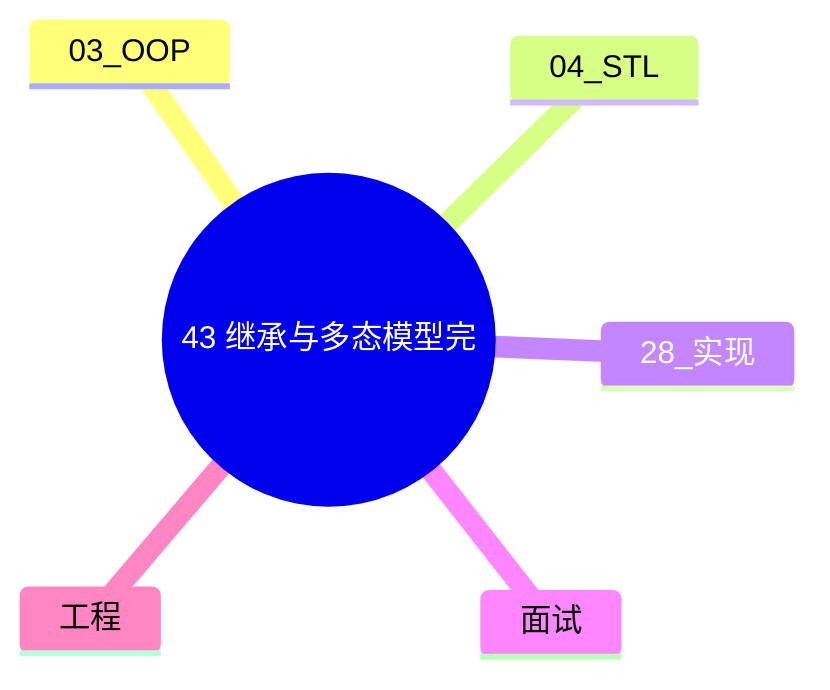

# 继承与多态模型完全指南

> **文件编码**：UTF-8。
> **定位**：C++ Primer Plus 风格深潜——访问控制、虚函数、override/final、虚继承、纯虚、抽象类。

> **交叉阅读**：[03 面向对象与类设计](03-面向对象与类设计.md)、[04 STL 标准库容器与算法](04-STL标准库容器与算法.md)、[28 手写 STL 容器面试专题](28-手写STL容器面试专题.md)。

> **章节链**：[42 友元与运算符重载](42-友元与运算符重载完全指南.md) → **本章（43）** → [44 vector/deque/string](44-vector-deque-string容器原理与实务.md)

---

## 0. 读前导读（零基础也能跟上）

### 0.1 用一句话弄懂本章

**继承 = 代码复用 + 接口扩展；多态 = 基类指针调用派生行为——OOP 核心。**

### 0.2 你需要提前知道什么

- [03 章](03-面向对象与类设计.md) 类、访问控制、继承与多态基础
- [04 章](04-STL标准库容器与算法.md) 容器 API、迭代器与算法入门
- [28 章](28-手写STL容器面试专题.md) 对象布局、Rule of Five、迭代器失效意识
- [02 章](02-指针引用与内存管理.md) 指针、引用、RAII（按需回顾）

### 0.3 本章知识地图（☐→☑）

- [ ] 区分 public/protected/private 继承语义
- [ ] 使用 `override`/`final` 正确声明虚函数
- [ ] 解释虚表、动态绑定与 object slicing
- [ ] 设计纯虚接口与抽象类
- [ ] 说明菱形继承与虚继承
- [ ] 闭卷自测 ≥8/10

### 0.4 建议学习时长

**5～8 天**；每天 1～2 个小节 + 手写示例 + 对照 [04 章](04-STL标准库容器与算法.md) 跑通代码。

### 0.5 学完你能做什么

见 §1「这份文档学什么」末尾的能力清单；完成 § 闭卷自测 ≥8/10 再进入下一章。

---

## 本章与上一章的关系

本章承接 [42 友元与运算符重载](42-友元与运算符重载完全指南.md)，并在 [03 章 OOP](03-面向对象与类设计.md) 与 [04 章 STL](04-STL标准库容器与算法.md) 之间搭桥梁。[28 章](28-手写STL容器面试专题.md) 强调 **实现**；本章强调 **语言机制 + 标准库惯用法** 的完整模型。

| 对照章 | 本章侧重 |
|--------|----------|
| [03 OOP](03-面向对象与类设计.md) | 语法到工程：访问、虚函数、抽象类 |
| [04 STL](04-STL标准库容器与算法.md) | 从会用到懂原理：扩容、哈希、算法 |
| [28 手写 STL](28-手写STL容器面试专题.md) | 实现视角验证你对失效/SSO 的理解 |



---

## 1. 这份文档学什么


## 2. 继承基础与访问控制

### 2.1 三种继承方式

| 继承方式 | public 基成员 | protected 基成员 | private 基成员 |
|---|---|---|---|
| `public` 继承 | public | protected | 不可访问 |
| `protected` 继承 | protected | protected | 不可访问 |
| `private` 继承 | private | private | 不可访问 |

**is-a 关系** 用 `public` 继承；[03 章](03-面向对象与类设计.md) 已介绍语法，本章强调 **设计语义**。

```cpp
class Device {
public:
    void power_on() {}
protected:
    int voltage_;
private:
    std::string serial_;
};

class Phone : public Device {  // Phone is-a Device
public:
    void call() { voltage_ = 5; }  // OK: protected
    // serial_ ;  // Error: private in base
};
```


---

## 3. 虚函数与动态绑定

### 3.1 virtual / override / final

```cpp
class Shape {
public:
    virtual ~Shape() = default;
    virtual double area() const = 0;
    virtual void draw() const { }
};

class Circle : public Shape {
public:
    double area() const override { return 3.14159 * r_ * r_; }
    void draw() const final { /* ... */ }
private:
    double r_;
};
```

[29 章](29-对象模型与虚函数表深入.md) 深入 vtable；[28 章](28-手写STL容器面试专题.md) 强调 **virtual 析构** 与多态容器。

### 3.2 虚析构与资源

```cpp
std::unique_ptr<Shape> p = std::make_unique<Circle>(1.0);
// ~Shape virtual → 正确调用 ~Circle
```

---

## 4. 纯虚函数与抽象类

纯虚 `= 0`；含纯虚的类 **不可实例化**。接口类模式：

```cpp
class ILogger {
public:
    virtual ~ILogger() = default;
    virtual void log(std::string_view msg) = 0;
};

class ConsoleLogger : public ILogger {
public:
    void log(std::string_view msg) override {
        std::cout << msg << '\n';
    }
};
```

与 [04 章](04-STL标准库容器与算法.md) `vector<std::unique_ptr<ILogger>>` 组合实现可插拔日志。

---

## 5. 对象切片（Object Slicing）

```cpp
void take_shape(Shape s) { }  // 按值 — 危险！
void take_ref(const Shape& s) { }  // 推荐
void take_ptr(std::unique_ptr<Shape> p) { }
```

派生部分被 **切掉**；多态失效。工程一律 **引用或智能指针**。

---

## 6. 多重继承与虚继承

### 6.1 菱形问题

```cpp
class A { public: int x; };
class B : public A {};
class C : public A {};
class D : public B, public C {};  // D 有两份 A::x

class B2 : virtual public A {};
class C2 : virtual public A {};
class D2 : public B2, public C2 {};  // 共享 A
```

**虚继承** 增加空间/时间开销；接口类 + 组合往往是更清晰的设计（[21 章](21-设计模式与Infra工程实践.md)）。

---

## 7. 协变返回类型

派生类虚函数可返回 **更派生** 的指针/引用类型。

---

## 8. 多态与 STL

| 模式 | 示例 | 04 章 |
|------|------|-------|
| 多态容器 | `vector<unique_ptr<Base>>` | 存储异构对象 |
| 类型擦除 | `std::function` | 可替代小层次多态 |
| 访问者 | 双重 dispatch | 编译期用 variant |

---

## 9. final 与 sealed 语义

`final class` 禁止继承；`final void f()` 禁止 override——API 稳定性。

---

## 10. 与 [42 章](42-友元与运算符重载完全指南.md) 的衔接

派生类 **不继承** 基类友元。运算符重载通常 **非 virtual**；行为多态用 virtual 成员函数。

---

## 11. 设计原则

- 优先 **组合优于继承**
- 接口类：**public 纯虚 + virtual 析构**
- 非必要不多重继承
- [03 章](03-面向对象与类设计.md) Rule of Five 在继承树中更复杂——禁拷贝或显式 `using Base::Base`


## 12.1 继承场景深潜 1

**场景 1**：在 [03 章](03-面向对象与类设计.md) 动物类层次上扩展。

```cpp
class AnimalBase1 {
public:
    virtual ~AnimalBase1() = default;
    virtual std::string speak() const = 0;
};

class Dog1 : public AnimalBase1 {
public:
    std::string speak() const override { return "woof"; }
};

void poly_demo1() {
    std::vector<std::unique_ptr<AnimalBase1>> zoo;
    zoo.push_back(std::make_unique<Dog1>());
    for (const auto& a : zoo)
        std::cout << a->speak() << '\n';
}
```

**面试点**：`unique_ptr<Base>` 需 **virtual 析构**；[28 章](28-手写STL容器面试专题.md) vector 扩容与多态指针无关（指针大小固定）。

**与 04 章**：`vector` 存 **对象** 会切片；存 **指针/智能指针** 保持多态。


## 12.2 继承场景深潜 2

**场景 2**：在 [03 章](03-面向对象与类设计.md) 动物类层次上扩展。

```cpp
class AnimalBase2 {
public:
    virtual ~AnimalBase2() = default;
    virtual std::string speak() const = 0;
};

class Dog2 : public AnimalBase2 {
public:
    std::string speak() const override { return "woof"; }
};

void poly_demo2() {
    std::vector<std::unique_ptr<AnimalBase2>> zoo;
    zoo.push_back(std::make_unique<Dog2>());
    for (const auto& a : zoo)
        std::cout << a->speak() << '\n';
}
```

**面试点**：`unique_ptr<Base>` 需 **virtual 析构**；[28 章](28-手写STL容器面试专题.md) vector 扩容与多态指针无关（指针大小固定）。

**与 04 章**：`vector` 存 **对象** 会切片；存 **指针/智能指针** 保持多态。


## 12.3 继承场景深潜 3

**场景 3**：在 [03 章](03-面向对象与类设计.md) 动物类层次上扩展。

```cpp
class AnimalBase3 {
public:
    virtual ~AnimalBase3() = default;
    virtual std::string speak() const = 0;
};

class Dog3 : public AnimalBase3 {
public:
    std::string speak() const override { return "woof"; }
};

void poly_demo3() {
    std::vector<std::unique_ptr<AnimalBase3>> zoo;
    zoo.push_back(std::make_unique<Dog3>());
    for (const auto& a : zoo)
        std::cout << a->speak() << '\n';
}
```

**面试点**：`unique_ptr<Base>` 需 **virtual 析构**；[28 章](28-手写STL容器面试专题.md) vector 扩容与多态指针无关（指针大小固定）。

**与 04 章**：`vector` 存 **对象** 会切片；存 **指针/智能指针** 保持多态。


## 12.4 继承场景深潜 4

**场景 4**：在 [03 章](03-面向对象与类设计.md) 动物类层次上扩展。

```cpp
class AnimalBase4 {
public:
    virtual ~AnimalBase4() = default;
    virtual std::string speak() const = 0;
};

class Dog4 : public AnimalBase4 {
public:
    std::string speak() const override { return "woof"; }
};

void poly_demo4() {
    std::vector<std::unique_ptr<AnimalBase4>> zoo;
    zoo.push_back(std::make_unique<Dog4>());
    for (const auto& a : zoo)
        std::cout << a->speak() << '\n';
}
```

**面试点**：`unique_ptr<Base>` 需 **virtual 析构**；[28 章](28-手写STL容器面试专题.md) vector 扩容与多态指针无关（指针大小固定）。

**与 04 章**：`vector` 存 **对象** 会切片；存 **指针/智能指针** 保持多态。


## 12.5 继承场景深潜 5

**场景 5**：在 [03 章](03-面向对象与类设计.md) 动物类层次上扩展。

```cpp
class AnimalBase5 {
public:
    virtual ~AnimalBase5() = default;
    virtual std::string speak() const = 0;
};

class Dog5 : public AnimalBase5 {
public:
    std::string speak() const override { return "woof"; }
};

void poly_demo5() {
    std::vector<std::unique_ptr<AnimalBase5>> zoo;
    zoo.push_back(std::make_unique<Dog5>());
    for (const auto& a : zoo)
        std::cout << a->speak() << '\n';
}
```

**面试点**：`unique_ptr<Base>` 需 **virtual 析构**；[28 章](28-手写STL容器面试专题.md) vector 扩容与多态指针无关（指针大小固定）。

**与 04 章**：`vector` 存 **对象** 会切片；存 **指针/智能指针** 保持多态。


## 12.6 继承场景深潜 6

**场景 6**：在 [03 章](03-面向对象与类设计.md) 动物类层次上扩展。

```cpp
class AnimalBase6 {
public:
    virtual ~AnimalBase6() = default;
    virtual std::string speak() const = 0;
};

class Dog6 : public AnimalBase6 {
public:
    std::string speak() const override { return "woof"; }
};

void poly_demo6() {
    std::vector<std::unique_ptr<AnimalBase6>> zoo;
    zoo.push_back(std::make_unique<Dog6>());
    for (const auto& a : zoo)
        std::cout << a->speak() << '\n';
}
```

**面试点**：`unique_ptr<Base>` 需 **virtual 析构**；[28 章](28-手写STL容器面试专题.md) vector 扩容与多态指针无关（指针大小固定）。

**与 04 章**：`vector` 存 **对象** 会切片；存 **指针/智能指针** 保持多态。


## 12.7 继承场景深潜 7

**场景 7**：在 [03 章](03-面向对象与类设计.md) 动物类层次上扩展。

```cpp
class AnimalBase7 {
public:
    virtual ~AnimalBase7() = default;
    virtual std::string speak() const = 0;
};

class Dog7 : public AnimalBase7 {
public:
    std::string speak() const override { return "woof"; }
};

void poly_demo7() {
    std::vector<std::unique_ptr<AnimalBase7>> zoo;
    zoo.push_back(std::make_unique<Dog7>());
    for (const auto& a : zoo)
        std::cout << a->speak() << '\n';
}
```

**面试点**：`unique_ptr<Base>` 需 **virtual 析构**；[28 章](28-手写STL容器面试专题.md) vector 扩容与多态指针无关（指针大小固定）。

**与 04 章**：`vector` 存 **对象** 会切片；存 **指针/智能指针** 保持多态。


## 12.8 继承场景深潜 8

**场景 8**：在 [03 章](03-面向对象与类设计.md) 动物类层次上扩展。

```cpp
class AnimalBase8 {
public:
    virtual ~AnimalBase8() = default;
    virtual std::string speak() const = 0;
};

class Dog8 : public AnimalBase8 {
public:
    std::string speak() const override { return "woof"; }
};

void poly_demo8() {
    std::vector<std::unique_ptr<AnimalBase8>> zoo;
    zoo.push_back(std::make_unique<Dog8>());
    for (const auto& a : zoo)
        std::cout << a->speak() << '\n';
}
```

**面试点**：`unique_ptr<Base>` 需 **virtual 析构**；[28 章](28-手写STL容器面试专题.md) vector 扩容与多态指针无关（指针大小固定）。

**与 04 章**：`vector` 存 **对象** 会切片；存 **指针/智能指针** 保持多态。


## 12.9 继承场景深潜 9

**场景 9**：在 [03 章](03-面向对象与类设计.md) 动物类层次上扩展。

```cpp
class AnimalBase9 {
public:
    virtual ~AnimalBase9() = default;
    virtual std::string speak() const = 0;
};

class Dog9 : public AnimalBase9 {
public:
    std::string speak() const override { return "woof"; }
};

void poly_demo9() {
    std::vector<std::unique_ptr<AnimalBase9>> zoo;
    zoo.push_back(std::make_unique<Dog9>());
    for (const auto& a : zoo)
        std::cout << a->speak() << '\n';
}
```

**面试点**：`unique_ptr<Base>` 需 **virtual 析构**；[28 章](28-手写STL容器面试专题.md) vector 扩容与多态指针无关（指针大小固定）。

**与 04 章**：`vector` 存 **对象** 会切片；存 **指针/智能指针** 保持多态。


## 12.10 继承场景深潜 10

**场景 10**：在 [03 章](03-面向对象与类设计.md) 动物类层次上扩展。

```cpp
class AnimalBase10 {
public:
    virtual ~AnimalBase10() = default;
    virtual std::string speak() const = 0;
};

class Dog10 : public AnimalBase10 {
public:
    std::string speak() const override { return "woof"; }
};

void poly_demo10() {
    std::vector<std::unique_ptr<AnimalBase10>> zoo;
    zoo.push_back(std::make_unique<Dog10>());
    for (const auto& a : zoo)
        std::cout << a->speak() << '\n';
}
```

**面试点**：`unique_ptr<Base>` 需 **virtual 析构**；[28 章](28-手写STL容器面试专题.md) vector 扩容与多态指针无关（指针大小固定）。

**与 04 章**：`vector` 存 **对象** 会切片；存 **指针/智能指针** 保持多态。


## 12.11 继承场景深潜 11

**场景 11**：在 [03 章](03-面向对象与类设计.md) 动物类层次上扩展。

```cpp
class AnimalBase11 {
public:
    virtual ~AnimalBase11() = default;
    virtual std::string speak() const = 0;
};

class Dog11 : public AnimalBase11 {
public:
    std::string speak() const override { return "woof"; }
};

void poly_demo11() {
    std::vector<std::unique_ptr<AnimalBase11>> zoo;
    zoo.push_back(std::make_unique<Dog11>());
    for (const auto& a : zoo)
        std::cout << a->speak() << '\n';
}
```

**面试点**：`unique_ptr<Base>` 需 **virtual 析构**；[28 章](28-手写STL容器面试专题.md) vector 扩容与多态指针无关（指针大小固定）。

**与 04 章**：`vector` 存 **对象** 会切片；存 **指针/智能指针** 保持多态。


## 12.12 继承场景深潜 12

**场景 12**：在 [03 章](03-面向对象与类设计.md) 动物类层次上扩展。

```cpp
class AnimalBase12 {
public:
    virtual ~AnimalBase12() = default;
    virtual std::string speak() const = 0;
};

class Dog12 : public AnimalBase12 {
public:
    std::string speak() const override { return "woof"; }
};

void poly_demo12() {
    std::vector<std::unique_ptr<AnimalBase12>> zoo;
    zoo.push_back(std::make_unique<Dog12>());
    for (const auto& a : zoo)
        std::cout << a->speak() << '\n';
}
```

**面试点**：`unique_ptr<Base>` 需 **virtual 析构**；[28 章](28-手写STL容器面试专题.md) vector 扩容与多态指针无关（指针大小固定）。

**与 04 章**：`vector` 存 **对象** 会切片；存 **指针/智能指针** 保持多态。


## 12.13 继承场景深潜 13

**场景 13**：在 [03 章](03-面向对象与类设计.md) 动物类层次上扩展。

```cpp
class AnimalBase13 {
public:
    virtual ~AnimalBase13() = default;
    virtual std::string speak() const = 0;
};

class Dog13 : public AnimalBase13 {
public:
    std::string speak() const override { return "woof"; }
};

void poly_demo13() {
    std::vector<std::unique_ptr<AnimalBase13>> zoo;
    zoo.push_back(std::make_unique<Dog13>());
    for (const auto& a : zoo)
        std::cout << a->speak() << '\n';
}
```

**面试点**：`unique_ptr<Base>` 需 **virtual 析构**；[28 章](28-手写STL容器面试专题.md) vector 扩容与多态指针无关（指针大小固定）。

**与 04 章**：`vector` 存 **对象** 会切片；存 **指针/智能指针** 保持多态。


## 12.14 继承场景深潜 14

**场景 14**：在 [03 章](03-面向对象与类设计.md) 动物类层次上扩展。

```cpp
class AnimalBase14 {
public:
    virtual ~AnimalBase14() = default;
    virtual std::string speak() const = 0;
};

class Dog14 : public AnimalBase14 {
public:
    std::string speak() const override { return "woof"; }
};

void poly_demo14() {
    std::vector<std::unique_ptr<AnimalBase14>> zoo;
    zoo.push_back(std::make_unique<Dog14>());
    for (const auto& a : zoo)
        std::cout << a->speak() << '\n';
}
```

**面试点**：`unique_ptr<Base>` 需 **virtual 析构**；[28 章](28-手写STL容器面试专题.md) vector 扩容与多态指针无关（指针大小固定）。

**与 04 章**：`vector` 存 **对象** 会切片；存 **指针/智能指针** 保持多态。


## 12.15 继承场景深潜 15

**场景 15**：在 [03 章](03-面向对象与类设计.md) 动物类层次上扩展。

```cpp
class AnimalBase15 {
public:
    virtual ~AnimalBase15() = default;
    virtual std::string speak() const = 0;
};

class Dog15 : public AnimalBase15 {
public:
    std::string speak() const override { return "woof"; }
};

void poly_demo15() {
    std::vector<std::unique_ptr<AnimalBase15>> zoo;
    zoo.push_back(std::make_unique<Dog15>());
    for (const auto& a : zoo)
        std::cout << a->speak() << '\n';
}
```

**面试点**：`unique_ptr<Base>` 需 **virtual 析构**；[28 章](28-手写STL容器面试专题.md) vector 扩容与多态指针无关（指针大小固定）。

**与 04 章**：`vector` 存 **对象** 会切片；存 **指针/智能指针** 保持多态。


## 12.16 继承场景深潜 16

**场景 16**：在 [03 章](03-面向对象与类设计.md) 动物类层次上扩展。

```cpp
class AnimalBase16 {
public:
    virtual ~AnimalBase16() = default;
    virtual std::string speak() const = 0;
};

class Dog16 : public AnimalBase16 {
public:
    std::string speak() const override { return "woof"; }
};

void poly_demo16() {
    std::vector<std::unique_ptr<AnimalBase16>> zoo;
    zoo.push_back(std::make_unique<Dog16>());
    for (const auto& a : zoo)
        std::cout << a->speak() << '\n';
}
```

**面试点**：`unique_ptr<Base>` 需 **virtual 析构**；[28 章](28-手写STL容器面试专题.md) vector 扩容与多态指针无关（指针大小固定）。

**与 04 章**：`vector` 存 **对象** 会切片；存 **指针/智能指针** 保持多态。


## 12.17 继承场景深潜 17

**场景 17**：在 [03 章](03-面向对象与类设计.md) 动物类层次上扩展。

```cpp
class AnimalBase17 {
public:
    virtual ~AnimalBase17() = default;
    virtual std::string speak() const = 0;
};

class Dog17 : public AnimalBase17 {
public:
    std::string speak() const override { return "woof"; }
};

void poly_demo17() {
    std::vector<std::unique_ptr<AnimalBase17>> zoo;
    zoo.push_back(std::make_unique<Dog17>());
    for (const auto& a : zoo)
        std::cout << a->speak() << '\n';
}
```

**面试点**：`unique_ptr<Base>` 需 **virtual 析构**；[28 章](28-手写STL容器面试专题.md) vector 扩容与多态指针无关（指针大小固定）。

**与 04 章**：`vector` 存 **对象** 会切片；存 **指针/智能指针** 保持多态。


## 附录 A：高频面试问答

### A.1 public 继承语义？

is-a；基类 public 接口在派生类仍 public。

### A.2 override 与 final？

override 检查签名匹配基类 virtual；final 禁止进一步 override。

### A.3 纯虚类能否有成员数据？

可以；抽象类可有实现与构造。

### A.4 虚函数表何时建立？

含 virtual 的类通常有 vptr；[29 章](29-对象模型与虚函数表深入.md) 详述。

### A.5 virtual 析构必须？

基类指针 delete 派生对象时 **必须**，否则 UB。

### A.6 私有继承用途？

implementation inheritance；is-implemented-in-terms-of。

### A.7 虚继承成本？

额外指针/偏移；查找基类子对象。

### A.8 多态的非 virtual 替代？

std::variant + visit；模板 CRTP。

### A.9 object slicing 例子？

Shape s = Circle(); 仅 Shape 部分保留。

### A.10 抽象接口 + 04 STL？

`vector<unique_ptr<I>>` 工厂注册。

### 附录 B.1 访问控制速查 1

| 调用方 | public | protected | private |
|--------|--------|-----------|---------|
| 类内 | ✓ | ✓ | ✓ |
| 派生类 | ✓ | ✓ | ✗ |
| 外部 | ✓ | ✗ | ✗ |
| 友元 | ✓ | ✓ | ✓ |

结合 [42 章](42-友元与运算符重载完全指南.md) friend 理解 **第四列** 例外。


### 附录 B.2 访问控制速查 2

| 调用方 | public | protected | private |
|--------|--------|-----------|---------|
| 类内 | ✓ | ✓ | ✓ |
| 派生类 | ✓ | ✓ | ✗ |
| 外部 | ✓ | ✗ | ✗ |
| 友元 | ✓ | ✓ | ✓ |

结合 [42 章](42-友元与运算符重载完全指南.md) friend 理解 **第四列** 例外。


### 附录 B.3 访问控制速查 3

| 调用方 | public | protected | private |
|--------|--------|-----------|---------|
| 类内 | ✓ | ✓ | ✓ |
| 派生类 | ✓ | ✓ | ✗ |
| 外部 | ✓ | ✗ | ✗ |
| 友元 | ✓ | ✓ | ✓ |

结合 [42 章](42-友元与运算符重载完全指南.md) friend 理解 **第四列** 例外。


### 附录 B.4 访问控制速查 4

| 调用方 | public | protected | private |
|--------|--------|-----------|---------|
| 类内 | ✓ | ✓ | ✓ |
| 派生类 | ✓ | ✓ | ✗ |
| 外部 | ✓ | ✗ | ✗ |
| 友元 | ✓ | ✓ | ✓ |

结合 [42 章](42-友元与运算符重载完全指南.md) friend 理解 **第四列** 例外。


### 附录 B.5 访问控制速查 5

| 调用方 | public | protected | private |
|--------|--------|-----------|---------|
| 类内 | ✓ | ✓ | ✓ |
| 派生类 | ✓ | ✓ | ✗ |
| 外部 | ✓ | ✗ | ✗ |
| 友元 | ✓ | ✓ | ✓ |

结合 [42 章](42-友元与运算符重载完全指南.md) friend 理解 **第四列** 例外。


### 附录 B.6 访问控制速查 6

| 调用方 | public | protected | private |
|--------|--------|-----------|---------|
| 类内 | ✓ | ✓ | ✓ |
| 派生类 | ✓ | ✓ | ✗ |
| 外部 | ✓ | ✗ | ✗ |
| 友元 | ✓ | ✓ | ✓ |

结合 [42 章](42-友元与运算符重载完全指南.md) friend 理解 **第四列** 例外。


### 附录 B.7 访问控制速查 7

| 调用方 | public | protected | private |
|--------|--------|-----------|---------|
| 类内 | ✓ | ✓ | ✓ |
| 派生类 | ✓ | ✓ | ✗ |
| 外部 | ✓ | ✗ | ✗ |
| 友元 | ✓ | ✓ | ✓ |

结合 [42 章](42-友元与运算符重载完全指南.md) friend 理解 **第四列** 例外。


## 20. 闭卷自测

1. 三种继承对 public 基成员的影响？
2. 纯虚函数作用？
3. 为何基类析构要 virtual？
4. object slicing 如何避免？
5. 虚继承解决什么问题？
6. override 编译期检查什么？
7. final 用于什么？
8. 多态容器推荐存储方式？
9. 派生类是否继承友元？
10. 与 03/04/28 章关联？

<details>
<summary>自测参考答案</summary>

1. public→public/protected/private；protected→protected；private→private。
2. 定义接口；类不可实例化；派生必须实现。
3. 通过基类指针 delete 时调用正确析构。
4. 按 **const 引用/指针/智能指针** 传递，避免按值。
5. **菱形继承** 下共享唯一基类子对象。
6. 签名与基类 virtual 函数匹配，否则编译错误。
7. 禁止继承或禁止进一步 override。
8. `vector<unique_ptr<Base>>` 或 `shared_ptr`。
9. **不继承**友元关系。
10. **03** OOP 基础；**04** 多态容器；**28** 对象布局与析构。

</details>

---

## 下一章预告

[44 vector/deque/string 容器原理与实务](44-vector-deque-string容器原理与实务.md)：扩容策略、迭代器、emplace、shrink_to_fit、SSO——在 [04 章](04-STL标准库容器与算法.md) 与 [28 章](28-手写STL容器面试专题.md) 之间贯通实现细节。

---

*第 44-vector-deque-string容器原理与实务.md 章 · 建议对照 [04 STL](04-STL标准库容器与算法.md) 与 [28 手写 STL](28-手写STL容器面试专题.md) 复习*
