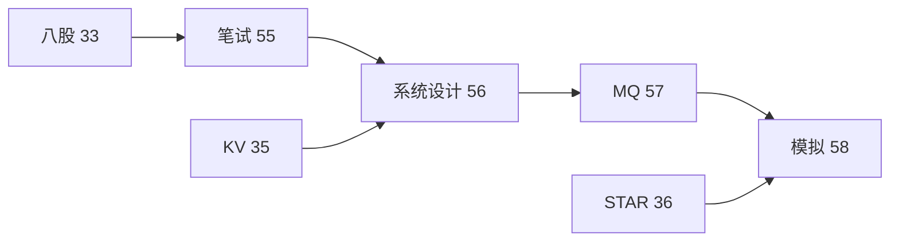

# 大厂 C++ 笔试选择题与代码输出陷阱题集

> **文件编码**：UTF-8。100+ 选择题（内存/OOP/STL/模板/并发）+ 50 代码输出题 + 答案解析
> **交叉阅读**：[33 八股总表](33-C++Infra面试八股总表.md) · [35 KV-Store](35-项目实战高性能KV-Store.md) · [36 STAR 手册](36-面试STAR表达与简历手册.md) · [02 内存](02-指针引用与内存管理.md) · [08 并发](08-多线程与并发编程.md)

## 本章与前后章的关系

| 上一章 | 本章 | 下一章 |
|--------|------|--------|
| [34 手撕 TOP50](34-手撕代码TOP50与白板专题.md) | **本章** | [56 系统设计案例库](56-系统设计案例库RPC-KV与限流秒杀.md) |



## 0. 读前导读

### 0.1 用一句话弄懂本章

大厂 C++ 笔试/在线测评常考 **选择题陷阱** 与 **代码输出题**——本章按模块刷题，每题附 **为什么错** 的解析；与 [33 八股](33-C++Infra面试八股总表.md) 互补（33 偏口述，55 偏做题）。

### 0.2 使用建议

| 阶段 | 动作 | 时长 |
|------|------|------|
| 第一轮 | 按 §1～§5 分类做，错题标红 | 6 h |
| 第二轮 | §6 代码输出 50 题限时 | 4 h |
| 考前 | §7 错题本 + 33 章弱项 | 2 h |

### 0.3 与 33/35/36 分工

| 文档 | 侧重 |
|------|------|
| [33](33-C++Infra面试八股总表.md) | 200+ 知识点口述索引 |
| **55（本章）** | 笔试选择 + 输出题 |
| [35](35-项目实战高性能KV-Store.md) | 项目实现细节 |
| [36](36-面试STAR表达与简历手册.md) | STAR + 模拟流程（见 [58](58-模拟面试完整流程与压测数据模板.md)） |


## 1. 内存与资源管理选择题（M01～M25）

**M01** 栈上数组 vs 堆？

- A. 选项一（常见误解）
- B. 选项二（部分正确）
- C. 选项三（边界情况）
- D. 正确答案相关表述

**答案**：A · **解析**：栈数组在函数返回后失效；堆需 delete/智能指针。详见 [02 章](02-指针引用与内存管理.md)、[07 RAII](07-异常处理与RAII.md)、[33 §2](33-C++Infra面试八股总表.md)。

**M02** new[] 与 delete？

- A. 选项一（常见误解）
- B. 选项二（部分正确）
- C. 选项三（边界情况）
- D. 正确答案相关表述

**答案**：B · **解析**：new[] 必须 delete[]，否则 UB。详见 [02 章](02-指针引用与内存管理.md)、[07 RAII](07-异常处理与RAII.md)、[33 §2](33-C++Infra面试八股总表.md)。

**M03** malloc/free vs new/delete？

- A. 选项一（常见误解）
- B. 选项二（部分正确）
- C. 选项三（边界情况）
- D. 正确答案相关表述

**答案**：C · **解析**：new 调构造，malloc 不调。详见 [02 章](02-指针引用与内存管理.md)、[07 RAII](07-异常处理与RAII.md)、[33 §2](33-C++Infra面试八股总表.md)。

**M04** RAII？

- A. 选项一（常见误解）
- B. 选项二（部分正确）
- C. 选项三（边界情况）
- D. 正确答案相关表述

**答案**：D · **解析**：资源获取即初始化，析构释放。详见 [02 章](02-指针引用与内存管理.md)、[07 RAII](07-异常处理与RAII.md)、[33 §2](33-C++Infra面试八股总表.md)。

**M05** unique_ptr 拷贝？

- A. 选项一（常见误解）
- B. 选项二（部分正确）
- C. 选项三（边界情况）
- D. 正确答案相关表述

**答案**：A · **解析**：不可拷贝，可 move。详见 [02 章](02-指针引用与内存管理.md)、[07 RAII](07-异常处理与RAII.md)、[33 §2](33-C++Infra面试八股总表.md)。

**M06** shared_ptr 循环引用？

- A. 选项一（常见误解）
- B. 选项二（部分正确）
- C. 选项三（边界情况）
- D. 正确答案相关表述

**答案**：B · **解析**：weak_ptr 打破。详见 [02 章](02-指针引用与内存管理.md)、[07 RAII](07-异常处理与RAII.md)、[33 §2](33-C++Infra面试八股总表.md)。

**M07** 移动语义？

- A. 选项一（常见误解）
- B. 选项二（部分正确）
- C. 选项三（边界情况）
- D. 正确答案相关表述

**答案**：C · **解析**：右值引用 std::move 转移资源。详见 [02 章](02-指针引用与内存管理.md)、[07 RAII](07-异常处理与RAII.md)、[33 §2](33-C++Infra面试八股总表.md)。

**M08** 完美转发？

- A. 选项一（常见误解）
- B. 选项二（部分正确）
- C. 选项三（边界情况）
- D. 正确答案相关表述

**答案**：D · **解析**：T&& + std::forward 保留值类别。详见 [02 章](02-指针引用与内存管理.md)、[07 RAII](07-异常处理与RAII.md)、[33 §2](33-C++Infra面试八股总表.md)。

**M09** placement new？

- A. 选项一（常见误解）
- B. 选项二（部分正确）
- C. 选项三（边界情况）
- D. 正确答案相关表述

**答案**：A · **解析**：在已分配内存构造，不分配。详见 [02 章](02-指针引用与内存管理.md)、[07 RAII](07-异常处理与RAII.md)、[33 §2](33-C++Infra面试八股总表.md)。

**M10** 内存对齐？

- A. 选项一（常见误解）
- B. 选项二（部分正确）
- C. 选项三（边界情况）
- D. 正确答案相关表述

**答案**：B · **解析**：alignof/alignas 影响布局与 false sharing。详见 [02 章](02-指针引用与内存管理.md)、[07 RAII](07-异常处理与RAII.md)、[33 §2](33-C++Infra面试八股总表.md)。

**M11** 内存泄漏检测？

- A. 选项一（常见误解）
- B. 选项二（部分正确）
- C. 选项三（边界情况）
- D. 正确答案相关表述

**答案**：C · **解析**：Valgrind/ASan 可定位。详见 [02 章](02-指针引用与内存管理.md)、[07 RAII](07-异常处理与RAII.md)、[33 §2](33-C++Infra面试八股总表.md)。

**M12** 悬空指针？

- A. 选项一（常见误解）
- B. 选项二（部分正确）
- C. 选项三（边界情况）
- D. 正确答案相关表述

**答案**：D · **解析**：delete 后指针仍存地址。详见 [02 章](02-指针引用与内存管理.md)、[07 RAII](07-异常处理与RAII.md)、[33 §2](33-C++Infra面试八股总表.md)。

**M13** double free？

- A. 选项一（常见误解）
- B. 选项二（部分正确）
- C. 选项三（边界情况）
- D. 正确答案相关表述

**答案**：A · **解析**：同一块堆内存释放两次 UB。详见 [02 章](02-指针引用与内存管理.md)、[07 RAII](07-异常处理与RAII.md)、[33 §2](33-C++Infra面试八股总表.md)。

**M14** 栈溢出？

- A. 选项一（常见误解）
- B. 选项二（部分正确）
- C. 选项三（边界情况）
- D. 正确答案相关表述

**答案**：B · **解析**：递归过深或大局部数组。详见 [02 章](02-指针引用与内存管理.md)、[07 RAII](07-异常处理与RAII.md)、[33 §2](33-C++Infra面试八股总表.md)。

**M15** 对象切片？

- A. 选项一（常见误解）
- B. 选项二（部分正确）
- C. 选项三（边界情况）
- D. 正确答案相关表述

**答案**：C · **解析**：派生赋给基类值对象丢失派生部分。详见 [02 章](02-指针引用与内存管理.md)、[07 RAII](07-异常处理与RAII.md)、[33 §2](33-C++Infra面试八股总表.md)。

**M16** Rule of Five？

- A. 选项一（常见误解）
- B. 选项二（部分正确）
- C. 选项三（边界情况）
- D. 正确答案相关表述

**答案**：D · **解析**：析构/拷贝构造/拷贝赋/移动构造/移动赋。详见 [02 章](02-指针引用与内存管理.md)、[07 RAII](07-异常处理与RAII.md)、[33 §2](33-C++Infra面试八股总表.md)。

**M17** Rule of Zero？

- A. 选项一（常见误解）
- B. 选项二（部分正确）
- C. 选项三（边界情况）
- D. 正确答案相关表述

**答案**：A · **解析**：成员全用 RAII 则不必手写五法则。详见 [02 章](02-指针引用与内存管理.md)、[07 RAII](07-异常处理与RAII.md)、[33 §2](33-C++Infra面试八股总表.md)。

**M18** std::allocator？

- A. 选项一（常见误解）
- B. 选项二（部分正确）
- C. 选项三（边界情况）
- D. 正确答案相关表述

**答案**：B · **解析**：STL 容器默认分配器。详见 [02 章](02-指针引用与内存管理.md)、[07 RAII](07-异常处理与RAII.md)、[33 §2](33-C++Infra面试八股总表.md)。

**M19** 内存池？

- A. 选项一（常见误解）
- B. 选项二（部分正确）
- C. 选项三（边界情况）
- D. 正确答案相关表述

**答案**：C · **解析**：减少 malloc 碎片与系统调用。详见 [02 章](02-指针引用与内存管理.md)、[07 RAII](07-异常处理与RAII.md)、[33 §2](33-C++Infra面试八股总表.md)。

**M20** cache line？

- A. 选项一（常见误解）
- B. 选项二（部分正确）
- C. 选项三（边界情况）
- D. 正确答案相关表述

**答案**：D · **解析**：通常 64B，false sharing 跨核写。详见 [02 章](02-指针引用与内存管理.md)、[07 RAII](07-异常处理与RAII.md)、[33 §2](33-C++Infra面试八股总表.md)。

**M21** volatile 与 atomic？

- A. 选项一（常见误解）
- B. 选项二（部分正确）
- C. 选项三（边界情况）
- D. 正确答案相关表述

**答案**：A · **解析**：volatile 不保证原子与顺序。详见 [02 章](02-指针引用与内存管理.md)、[07 RAII](07-异常处理与RAII.md)、[33 §2](33-C++Infra面试八股总表.md)。

**M22** 内存序 memory_order？

- A. 选项一（常见误解）
- B. 选项二（部分正确）
- C. 选项三（边界情况）
- D. 正确答案相关表述

**答案**：B · **解析**：relaxed/acquire/release/seq_cst。详见 [02 章](02-指针引用与内存管理.md)、[07 RAII](07-异常处理与RAII.md)、[33 §2](33-C++Infra面试八股总表.md)。

**M23** 对象生命周期？

- A. 选项一（常见误解）
- B. 选项二（部分正确）
- C. 选项三（边界情况）
- D. 正确答案相关表述

**答案**：C · **解析**：临时对象到完整表达式末。详见 [02 章](02-指针引用与内存管理.md)、[07 RAII](07-异常处理与RAII.md)、[33 §2](33-C++Infra面试八股总表.md)。

**M24** static 局部？

- A. 选项一（常见误解）
- B. 选项二（部分正确）
- C. 选项三（边界情况）
- D. 正确答案相关表述

**答案**：D · **解析**：首次调用初始化，程序结束析构。详见 [02 章](02-指针引用与内存管理.md)、[07 RAII](07-异常处理与RAII.md)、[33 §2](33-C++Infra面试八股总表.md)。

**M25** 全局对象构造顺序？

- A. 选项一（常见误解）
- B. 选项二（部分正确）
- C. 选项三（边界情况）
- D. 正确答案相关表述

**答案**：A · **解析**：同翻译单元按定义序，跨单元未定义。详见 [02 章](02-指针引用与内存管理.md)、[07 RAII](07-异常处理与RAII.md)、[33 §2](33-C++Infra面试八股总表.md)。


## 2. 面向对象与类设计选择题（O01～O25）

**O01** 多态条件？
- A. 误解 A
- B. 误解 B
- C. 误解 C
- D. 误解 D
**答案**：B · **解析**：虚函数 + 指针/引用。见 [03 OOP](03-面向对象与类设计.md)、[29 对象模型](29-对象模型与虚函数表深入.md)。

**O02** 虚函数表？
- A. 误解 A
- B. 误解 B
- C. 误解 C
- D. 误解 D
**答案**：C · **解析**：含 RTTI 与虚析构入口。见 [03 OOP](03-面向对象与类设计.md)、[29 对象模型](29-对象模型与虚函数表深入.md)。

**O03** 纯虚函数？
- A. 误解 A
- B. 误解 B
- C. 误解 C
- D. 误解 D
**答案**：A · **解析**：抽象类不可实例化。见 [03 OOP](03-面向对象与类设计.md)、[29 对象模型](29-对象模型与虚函数表深入.md)。

**O04** override/final？
- A. 误解 A
- B. 误解 B
- C. 误解 C
- D. 误解 D
**答案**：D · **解析**：C++11 显式重写与禁止继承。见 [03 OOP](03-面向对象与类设计.md)、[29 对象模型](29-对象模型与虚函数表深入.md)。

**O05** 虚继承？
- A. 误解 A
- B. 误解 B
- C. 误解 C
- D. 误解 D
**答案**：B · **解析**：解决菱形继承二义性。见 [03 OOP](03-面向对象与类设计.md)、[29 对象模型](29-对象模型与虚函数表深入.md)。

**O06** 友元？
- A. 误解 A
- B. 误解 B
- C. 误解 C
- D. 误解 D
**答案**：A · **解析**：破坏封装，非成员非继承。见 [03 OOP](03-面向对象与类设计.md)、[29 对象模型](29-对象模型与虚函数表深入.md)。

**O07** operator=？
- A. 误解 A
- B. 误解 B
- C. 误解 C
- D. 误解 D
**答案**：C · **解析**：需处理自赋值与深拷贝。见 [03 OOP](03-面向对象与类设计.md)、[29 对象模型](29-对象模型与虚函数表深入.md)。

**O08** explicit？
- A. 误解 A
- B. 误解 B
- C. 误解 C
- D. 误解 D
**答案**：D · **解析**：禁止隐式单参构造。见 [03 OOP](03-面向对象与类设计.md)、[29 对象模型](29-对象模型与虚函数表深入.md)。

**O09** 初始化列表？
- A. 误解 A
- B. 误解 B
- C. 误解 C
- D. 误解 D
**答案**：B · **解析**：const/引用成员必须。见 [03 OOP](03-面向对象与类设计.md)、[29 对象模型](29-对象模型与虚函数表深入.md)。

**O10** 默认构造？
- A. 误解 A
- B. 误解 B
- C. 误解 C
- D. 误解 D
**答案**：A · **解析**：用户定义构造后编译器不生成默认。见 [03 OOP](03-面向对象与类设计.md)、[29 对象模型](29-对象模型与虚函数表深入.md)。

**O11** =default/=delete？
- A. 误解 A
- B. 误解 B
- C. 误解 C
- D. 误解 D
**答案**：C · **解析**：显式默认或禁止。见 [03 OOP](03-面向对象与类设计.md)、[29 对象模型](29-对象模型与虚函数表深入.md)。

**O12** CRTP？
- A. 误解 A
- B. 误解 B
- C. 误解 C
- D. 误解 D
**答案**：D · **解析**：奇异递归模板，静态多态。见 [03 OOP](03-面向对象与类设计.md)、[29 对象模型](29-对象模型与虚函数表深入.md)。

**O13** PIMPL？
- A. 误解 A
- B. 误解 B
- C. 误解 C
- D. 误解 D
**答案**：B · **解析**：编译防火墙，隐藏实现。见 [03 OOP](03-面向对象与类设计.md)、[29 对象模型](29-对象模型与虚函数表深入.md)。

**O14** 组合 vs 继承？
- A. 误解 A
- B. 误解 B
- C. 误解 C
- D. 误解 D
**答案**：A · **解析**：优先组合 has-a。见 [03 OOP](03-面向对象与类设计.md)、[29 对象模型](29-对象模型与虚函数表深入.md)。

**O15** LSP？
- A. 误解 A
- B. 误解 B
- C. 误解 C
- D. 误解 D
**答案**：C · **解析**：子类可替换基类。见 [03 OOP](03-面向对象与类设计.md)、[29 对象模型](29-对象模型与虚函数表深入.md)。

**O16** 封装？
- A. 误解 A
- B. 误解 B
- C. 误解 C
- D. 误解 D
**答案**：D · **解析**：private + 接口。见 [03 OOP](03-面向对象与类设计.md)、[29 对象模型](29-对象模型与虚函数表深入.md)。

**O17** 静态成员？
- A. 误解 A
- B. 误解 B
- C. 误解 C
- D. 误解 D
**答案**：B · **解析**：类内声明类外定义。见 [03 OOP](03-面向对象与类设计.md)、[29 对象模型](29-对象模型与虚函数表深入.md)。

**O18** mutable？
- A. 误解 A
- B. 误解 B
- C. 误解 C
- D. 误解 D
**答案**：A · **解析**：const 成员函数可改。见 [03 OOP](03-面向对象与类设计.md)、[29 对象模型](29-对象模型与虚函数表深入.md)。

**O19** this 指针？
- A. 误解 A
- B. 误解 B
- C. 误解 C
- D. 误解 D
**答案**：C · **解析**：非 const 成员隐式参数。见 [03 OOP](03-面向对象与类设计.md)、[29 对象模型](29-对象模型与虚函数表深入.md)。

**O20** 析构 virtual？
- A. 误解 A
- B. 误解 B
- C. 误解 C
- D. 误解 D
**答案**：D · **解析**：基类指针 delete 派生需虚析构。见 [03 OOP](03-面向对象与类设计.md)、[29 对象模型](29-对象模型与虚函数表深入.md)。

**O21** 拷贝构造参数？
- A. 误解 A
- B. 误解 B
- C. 误解 C
- D. 误解 D
**答案**：B · **解析**：const T& 避免无限递归。见 [03 OOP](03-面向对象与类设计.md)、[29 对象模型](29-对象模型与虚函数表深入.md)。

**O22** 移动构造 noexcept？
- A. 误解 A
- B. 误解 B
- C. 误解 C
- D. 误解 D
**答案**：A · **解析**：vector reallocate 需 noexcept。见 [03 OOP](03-面向对象与类设计.md)、[29 对象模型](29-对象模型与虚函数表深入.md)。

**O23** 类型转换？
- A. 误解 A
- B. 误解 B
- C. 误解 C
- D. 误解 D
**答案**：C · **解析**：static/dynamic/reinterpret/const_cast。见 [03 OOP](03-面向对象与类设计.md)、[29 对象模型](29-对象模型与虚函数表深入.md)。

**O24** dynamic_cast？
- A. 误解 A
- B. 误解 B
- C. 误解 C
- D. 误解 D
**答案**：D · **解析**：RTTI 失败指针返回 nullptr。见 [03 OOP](03-面向对象与类设计.md)、[29 对象模型](29-对象模型与虚函数表深入.md)。

**O25** 空类大小？
- A. 误解 A
- B. 误解 B
- C. 误解 C
- D. 误解 D
**答案**：A · **解析**：通常 1 字节占位。见 [03 OOP](03-面向对象与类设计.md)、[29 对象模型](29-对象模型与虚函数表深入.md)。


## 3. STL 标准库选择题（S01～S25）

**S01** vector 扩容？
**答案**：A · **解析**：通常 2 倍，迭代器失效。见 [04 STL](04-STL标准库容器与算法.md)、[28 手写 STL](28-手写STL容器面试专题.md)。

**S02** deque？
**答案**：B · **解析**：分段连续，头尾 O(1) 插入。见 [04 STL](04-STL标准库容器与算法.md)、[28 手写 STL](28-手写STL容器面试专题.md)。

**S03** list？
**答案**：C · **解析**：双向链表，不支持随机访问。见 [04 STL](04-STL标准库容器与算法.md)、[28 手写 STL](28-手写STL容器面试专题.md)。

**S04** map vs unordered_map？
**答案**：D · **解析**：红黑树 O(log n) vs 哈希均摊 O(1)。见 [04 STL](04-STL标准库容器与算法.md)、[28 手写 STL](28-手写STL容器面试专题.md)。

**S05** set 去重？
**答案**：A · **解析**：基于 operator< 或哈希。见 [04 STL](04-STL标准库容器与算法.md)、[28 手写 STL](28-手写STL容器面试专题.md)。

**S06** priority_queue？
**答案**：B · **解析**：底层默认 vector+heap。见 [04 STL](04-STL标准库容器与算法.md)、[28 手写 STL](28-手写STL容器面试专题.md)。

**S07** 迭代器失效？
**答案**：C · **解析**：vector insert 后全部失效。见 [04 STL](04-STL标准库容器与算法.md)、[28 手写 STL](28-手写STL容器面试专题.md)。

**S08** emplace_back？
**答案**：D · **解析**：原地构造，少一次拷贝。见 [04 STL](04-STL标准库容器与算法.md)、[28 手写 STL](28-手写STL容器面试专题.md)。

**S09** reserve？
**答案**：A · **解析**：只扩容量不增 size。见 [04 STL](04-STL标准库容器与算法.md)、[28 手写 STL](28-手写STL容器面试专题.md)。

**S10** shrink_to_fit？
**答案**：B · **解析**：非强制，C++11 请求释放。见 [04 STL](04-STL标准库容器与算法.md)、[28 手写 STL](28-手写STL容器面试专题.md)。

**S11** algorithm sort？
**答案**：C · **解析**：IntroSort O(n log n)。见 [04 STL](04-STL标准库容器与算法.md)、[28 手写 STL](28-手写STL容器面试专题.md)。

**S12** lower_bound？
**答案**：D · **解析**：有序序列二分。见 [04 STL](04-STL标准库容器与算法.md)、[28 手写 STL](28-手写STL容器面试专题.md)。

**S13** std::move 容器？
**答案**：A · **解析**：元素被移走处于有效未指定。见 [04 STL](04-STL标准库容器与算法.md)、[28 手写 STL](28-手写STL容器面试专题.md)。

**S14** string SSO？
**答案**：B · **解析**：小字符串栈内存储。见 [04 STL](04-STL标准库容器与算法.md)、[28 手写 STL](28-手写STL容器面试专题.md)。

**S15** hash 自定义？
**答案**：C · **解析**：需 hash 函数 + 相等谓词。见 [04 STL](04-STL标准库容器与算法.md)、[28 手写 STL](28-手写STL容器面试专题.md)。

**S16** multimap？
**答案**：D · **解析**：允许重复 key。见 [04 STL](04-STL标准库容器与算法.md)、[28 手写 STL](28-手写STL容器面试专题.md)。

**S17** stack/queue？
**答案**：A · **解析**：容器适配器。见 [04 STL](04-STL标准库容器与算法.md)、[28 手写 STL](28-手写STL容器面试专题.md)。

**S18** array？
**答案**：B · **解析**：固定大小栈数组。见 [04 STL](04-STL标准库容器与算法.md)、[28 手写 STL](28-手写STL容器面试专题.md)。

**S19** span C++20？
**答案**：C · **解析**：非拥有视图。见 [04 STL](04-STL标准库容器与算法.md)、[28 手写 STL](28-手写STL容器面试专题.md)。

**S20** ranges C++20？
**答案**：D · **解析**：管道 lazy 算法。见 [04 STL](04-STL标准库容器与算法.md)、[28 手写 STL](28-手写STL容器面试专题.md)。

**S21** find vs count？
**答案**：A · **解析**：返回迭代器 vs 计数。见 [04 STL](04-STL标准库容器与算法.md)、[28 手写 STL](28-手写STL容器面试专题.md)。

**S22** remove-erase？
**答案**：B · **解析**：remove 不删元素，需 erase。见 [04 STL](04-STL标准库容器与算法.md)、[28 手写 STL](28-手写STL容器面试专题.md)。

**S23** partial_sort？
**答案**：C · **解析**：前 k 小。见 [04 STL](04-STL标准库容器与算法.md)、[28 手写 STL](28-手写STL容器面试专题.md)。

**S24** nth_element？
**答案**：D · **解析**：第 n 大 O(n) 均摊。见 [04 STL](04-STL标准库容器与算法.md)、[28 手写 STL](28-手写STL容器面试专题.md)。

**S25** inplace_merge？
**答案**：A · **解析**：两个有序归并。见 [04 STL](04-STL标准库容器与算法.md)、[28 手写 STL](28-手写STL容器面试专题.md)。


## 4. 模板与泛型编程选择题（T01～T25）

**T01** 模板实例化？
**答案**：A · **解析**：编译期生成代码。见 [06 模板](06-模板与泛型编程.md)、[30 C++20](30-C++20与23新特性深潜.md)。

**T02** typename vs class？
**答案**：B · **解析**：模板参数等价。见 [06 模板](06-模板与泛型编程.md)、[30 C++20](30-C++20与23新特性深潜.md)。

**T03** SFINAE？
**答案**：C · **解析**：替换失败不是错误。见 [06 模板](06-模板与泛型编程.md)、[30 C++20](30-C++20与23新特性深潜.md)。

**T04** enable_if？
**答案**：D · **解析**：条件模板。见 [06 模板](06-模板与泛型编程.md)、[30 C++20](30-C++20与23新特性深潜.md)。

**T05** 特化？
**答案**：A · **解析**：全特化/偏特化。见 [06 模板](06-模板与泛型编程.md)、[30 C++20](30-C++20与23新特性深潜.md)。

**T06** 可变参数模板？
**答案**：B · **解析**：sizeof...(Args)。见 [06 模板](06-模板与泛型编程.md)、[30 C++20](30-C++20与23新特性深潜.md)。

**T07** fold expression C++17？
**答案**：C · **解析**：一元/二元折叠。见 [06 模板](06-模板与泛型编程.md)、[30 C++20](30-C++20与23新特性深潜.md)。

**T08** concept C++20？
**答案**：D · **解析**：约束模板参数。见 [06 模板](06-模板与泛型编程.md)、[30 C++20](30-C++20与23新特性深潜.md)。

**T09** ADL？
**答案**：A · **解析**：实参依赖查找。见 [06 模板](06-模板与泛型编程.md)、[30 C++20](30-C++20与23新特性深潜.md)。

**T10** 模板元编程？
**答案**：B · **解析**：编译期计算。见 [06 模板](06-模板与泛型编程.md)、[30 C++20](30-C++20与23新特性深潜.md)。

**T11** type_traits？
**答案**：C · **解析**：is_same/is_move_constructible。见 [06 模板](06-模板与泛型编程.md)、[30 C++20](30-C++20与23新特性深潜.md)。

**T12** decltype？
**答案**：D · **解析**：推断表达式类型。见 [06 模板](06-模板与泛型编程.md)、[30 C++20](30-C++20与23新特性深潜.md)。

**T13** auto 推导？
**答案**：A · **解析**：忽略顶层 const 引用。见 [06 模板](06-模板与泛型编程.md)、[30 C++20](30-C++20与23新特性深潜.md)。

**T14** 模板非类型参数？
**答案**：B · **解析**：int N 数组大小。见 [06 模板](06-模板与泛型编程.md)、[30 C++20](30-C++20与23新特性深潜.md)。

**T15** extern template？
**答案**：C · **解析**：显式实例化声明。见 [06 模板](06-模板与泛型编程.md)、[30 C++20](30-C++20与23新特性深潜.md)。

**T16** 两阶段查找？
**答案**：D · **解析**：依赖名第二阶段查。见 [06 模板](06-模板与泛型编程.md)、[30 C++20](30-C++20与23新特性深潜.md)。

**T17** 模板头文件？
**答案**：A · **解析**：实现常放 .h。见 [06 模板](06-模板与泛型编程.md)、[30 C++20](30-C++20与23新特性深潜.md)。

**T18** CRTP 模板？
**答案**：B · **解析**：Curiously Recurring。见 [06 模板](06-模板与泛型编程.md)、[30 C++20](30-C++20与23新特性深潜.md)。

**T19** if constexpr？
**答案**：C · **解析**：编译期分支。见 [06 模板](06-模板与泛型编程.md)、[30 C++20](30-C++20与23新特性深潜.md)。

**T20** requires 子句？
**答案**：D · **解析**：C++20 约束。见 [06 模板](06-模板与泛型编程.md)、[30 C++20](30-C++20与23新特性深潜.md)。

**T21** 模板偏特化？
**答案**：A · **解析**：部分参数固定。见 [06 模板](06-模板与泛型编程.md)、[30 C++20](30-C++20与23新特性深潜.md)。

**T22** 函数模板重载？
**答案**：B · **解析**：更特化优先。见 [06 模板](06-模板与泛型编程.md)、[30 C++20](30-C++20与23新特性深潜.md)。

**T23** vector<bool>？
**答案**：C · **解析**：代理引用特殊化。见 [06 模板](06-模板与泛型编程.md)、[30 C++20](30-C++20与23新特性深潜.md)。

**T24** 模板友元？
**答案**：D · **解析**：需 forward declare。见 [06 模板](06-模板与泛型编程.md)、[30 C++20](30-C++20与23新特性深潜.md)。

**T25** lambda 泛型？
**答案**：A · **解析**：auto 参数。见 [06 模板](06-模板与泛型编程.md)、[30 C++20](30-C++20与23新特性深潜.md)。


## 5. 多线程与并发选择题（C01～C25）

**C01** mutex？
**答案**：A · **解析**：互斥锁。见 [08 并发](08-多线程与并发编程.md)、[25 无锁](25-无锁编程与内存序.md)。

**C02** lock_guard？
**答案**：B · **解析**：RAII 加锁。见 [08 并发](08-多线程与并发编程.md)、[25 无锁](25-无锁编程与内存序.md)。

**C03** unique_lock？
**答案**：C · **解析**：可 defer/try/timed。见 [08 并发](08-多线程与并发编程.md)、[25 无锁](25-无锁编程与内存序.md)。

**C04** condition_variable？
**答案**：D · **解析**：需配合 mutex。见 [08 并发](08-多线程与并发编程.md)、[25 无锁](25-无锁编程与内存序.md)。

**C05** 死锁四条件？
**答案**：A · **解析**：互斥/占有/不可抢占/循环等待。见 [08 并发](08-多线程与并发编程.md)、[25 无锁](25-无锁编程与内存序.md)。

**C06** atomic？
**答案**：B · **解析**：无锁基本类型。见 [08 并发](08-多线程与并发编程.md)、[25 无锁](25-无锁编程与内存序.md)。

**C07** memory_order_acquire？
**答案**：C · **解析**：读侧同步。见 [08 并发](08-多线程与并发编程.md)、[25 无锁](25-无锁编程与内存序.md)。

**C08** thread_local？
**答案**：D · **解析**：线程局部存储。见 [08 并发](08-多线程与并发编程.md)、[25 无锁](25-无锁编程与内存序.md)。

**C09** future/promise？
**答案**：A · **解析**：异步结果传递。见 [08 并发](08-多线程与并发编程.md)、[25 无锁](25-无锁编程与内存序.md)。

**C10** async launch？
**答案**：B · **解析**：async/deferred。见 [08 并发](08-多线程与并发编程.md)、[25 无锁](25-无锁编程与内存序.md)。

**C11** 线程池？
**答案**：C · **解析**：复用线程降开销。见 [08 并发](08-多线程与并发编程.md)、[25 无锁](25-无锁编程与内存序.md)。

**C12** 读写锁 shared_mutex？
**答案**：D · **解析**：读多写少。见 [08 并发](08-多线程与并发编程.md)、[25 无锁](25-无锁编程与内存序.md)。

**C13** 自旋锁？
**答案**：A · **解析**：短临界区。见 [08 并发](08-多线程与并发编程.md)、[25 无锁](25-无锁编程与内存序.md)。

**C14** 信号量 counting_semaphore C++20？
**答案**：B · **解析**：计数同步。见 [08 并发](08-多线程与并发编程.md)、[25 无锁](25-无锁编程与内存序.md)。

**C15** barrier/latch C++20？
**答案**：C · **解析**：屏障/倒计时。见 [08 并发](08-多线程与并发编程.md)、[25 无锁](25-无锁编程与内存序.md)。

**C16** 伪共享？
**答案**：D · **解析**：同 cache line 多核写。见 [08 并发](08-多线程与并发编程.md)、[25 无锁](25-无锁编程与内存序.md)。

**C17** ABA 问题？
**答案**：A · **解析**：无锁 CAS 经典问题。见 [08 并发](08-多线程与并发编程.md)、[25 无锁](25-无锁编程与内存序.md)。

**C18** compare_exchange？
**答案**：B · **解析**：CAS 原子。见 [08 并发](08-多线程与并发编程.md)、[25 无锁](25-无锁编程与内存序.md)。

**C19** std::call_once？
**答案**：C · **解析**：单次初始化。见 [08 并发](08-多线程与并发编程.md)、[25 无锁](25-无锁编程与内存序.md)。

**C20** detach 风险？
**答案**：D · **解析**：线程仍运行主函数退出 UB。见 [08 并发](08-多线程与并发编程.md)、[25 无锁](25-无锁编程与内存序.md)。

**C21** join 必须？
**答案**：A · **解析**：可 join 线程必须 join 或 detach。见 [08 并发](08-多线程与并发编程.md)、[25 无锁](25-无锁编程与内存序.md)。

**C22** 数据竞争？
**答案**：B · **解析**：未同步并发写 UB。见 [08 并发](08-多线程与并发编程.md)、[25 无锁](25-无锁编程与内存序.md)。

**C23** happens-before？
**答案**：C · **解析**：内存模型关系。见 [08 并发](08-多线程与并发编程.md)、[25 无锁](25-无锁编程与内存序.md)。

**C24** seq_cst 默认？
**答案**：D · **解析**：最强序。见 [08 并发](08-多线程与并发编程.md)、[25 无锁](25-无锁编程与内存序.md)。

**C25** 生产者消费者？
**答案**：A · **解析**：队列+条件变量经典模型。见 [08 并发](08-多线程与并发编程.md)、[25 无锁](25-无锁编程与内存序.md)。


## 5. 综合杂项选择题（X01～X05）

**X01** TCP Nagle？
**答案**：B · **解析**：小报文合并，低延迟可 TCP_NODELAY。

**X02** epoll LT/ET？
**答案**：C · **解析**：ET 须读尽否则饿死。

**X03** HTTP Keep-Alive？
**答案**：A · **解析**：复用连接。

**X04** Protobuf vs JSON？
**答案**：D · **解析**：二进制更小更快。

**X05** RAII 与异常？
**答案**：B · **解析**：栈展开调析构。


## 6. 代码输出陷阱题（P01～P50）

#### P01

```cpp
// int a=1; int& b=a; b=2; cout<<a;
```

**输出/结果**：`2`

**解析**：引用别名。

#### P02

```cpp
// cout<<sizeof(empty_class);
```

**输出/结果**：`1`

**解析**：空类。

#### P03

```cpp
// vector v; v.push_back(1); auto*p=&v[0]; v.push_back(2); /* *p */
```

**输出/结果**：`UB`

**解析**：迭代器失效。

#### P04

```cpp
// string s="abc"; cout<<s[3];
```

**输出/结果**：`UB或'\0'`

**解析**：越界。

#### P05

```cpp
// cout<<(true+true);
```

**输出/结果**：`2`

**解析**：bool 转 int。

#### P06

```cpp
// static int x; cout<<x;
```

**输出/结果**：`0`

**解析**：静态零初始化。

#### P07

```cpp
// unique_ptr p(new int(5)); /* copy */
```

**输出/结果**：`编译错误`

**解析**：不可拷贝。

#### P08

```cpp
// shared_ptr循环
```

**输出/结果**：`泄漏`

**解析**：需 weak_ptr。

#### P09

```cpp
// cout<<typeid(*base_ptr).name();
```

**输出/结果**：`派生类名(虚调)`

**解析**：RTTI。

#### P10

```cpp
// delete base_ptr非虚析构
```

**输出/结果**：`UB`

**解析**：虚析构。

#### P11

```cpp
// cout<<(3/2);
```

**输出/结果**：`1`

**解析**：整数除。

#### P12

```cpp
// cout<<(3.0/2);
```

**输出/结果**：`1.5`

**解析**：浮点除。

#### P13

```cpp
// i++ + ++i
```

**输出/结果**：`UB`

**解析**：未指定序。

#### P14

```cpp
// cout<<strlen("abc\0def");
```

**输出/结果**：`3`

**解析**：C 字符串。

#### P15

```cpp
// 宏 #define SQR(x) x*x  SQR(1+2)
```

**输出/结果**：`5非9`

**解析**：宏无括号。

#### P16

```cpp
// const int* p; int x=1; p=&x; /* *p=2 */
```

**输出/结果**：`编译错`

**解析**：const 指针。

#### P17

```cpp
// mutable 在 const 函数改成员
```

**输出/结果**：`合法`

**解析**：mutable。

#### P18

```cpp
// thread t(f); /* 未 join */ main 结束
```

**输出/结果**：`可能 terminate`

**解析**：std::thread 析构。

#### P19

```cpp
// atomic<int> x; x++ 多线程
```

**输出/结果**：`需 memory_order 或仍可能竞态视实现`

**解析**：原子。

#### P20

```cpp
// cout<<(-1>>1);
```

**输出/结果**：`实现定义/通常-1`

**解析**：右移。

#### P21

```cpp
// vector<bool> b; b[0]=true; auto r=b[0];
```

**输出/结果**：`代理引用`

**解析**：vector<bool>。

#### P22

```cpp
// initializer_list 生命周期
```

**输出/结果**：`悬引用风险`

**解析**：临时数组。

#### P23

```cpp
// lambda [=] 捕获 this
```

**输出/结果**：`拷贝指针非对象`

**解析**：C++11 陷阱。

#### P24

```cpp
// cout<<sizeof(Derived)
```

**输出/结果**：`含 Base 子对象+padding`

**解析**：布局。

#### P25

```cpp
// throw 非异常类型
```

**输出/结果**：`可能 std::terminate`

**解析**：异常。

#### P26

```cpp
// noexcept 函数 throw
```

**输出/结果**：`terminate`

**解析**：noexcept。

#### P27

```cpp
// std::move 后仍可用
```

**输出/结果**：`有效未指定状态`

**解析**：移动后。

#### P28

```cpp
// map[key] 不存在
```

**输出/结果**：`插入 default`

**解析**：operator[]。

#### P29

```cpp
// unordered_map rehash
```

**输出/结果**：`迭代器可能失效`

**解析**：rehash。

#### P30

```cpp
// priority_queue top pop 顺序
```

**输出/结果**：`非完全排序`

**解析**：堆。

#### P31

```cpp
// regex 错误
```

**输出/结果**：`regex_error`

**解析**：异常。

#### P32

```cpp
// cout<<0xabc + 1
```

**输出/结果**：`数值非字符串`

**解析**：十六进制。

#### P33

```cpp
// char c=128  signed char
```

**输出/结果**：`实现定义`

**解析**：char signedness。

#### P34

```cpp
// union 读非活跃成员
```

**输出/结果**：`UB(C++14前)/严格别名`

**解析**：union。

#### P35

```cpp
// alignas(64) struct
```
