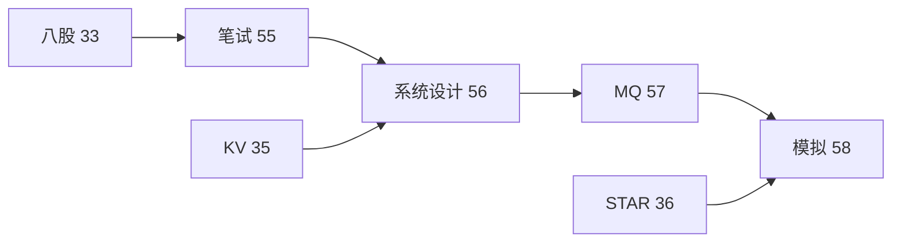

# 系统设计案例库：RPC、KV 与限流秒杀

> **文件编码**：UTF-8。Reactor 模型、RPC 设计、分布式 KV、令牌桶限流、秒杀、短链、估容量四步法
> **交叉阅读**：[23 IO 多路复用](23-IO多路复用与高性能Server.md) · [35 KV-Store 项目](35-项目实战高性能KV-Store.md) · [19 gRPC](19-gRPC与Protobuf工程化.md) · [33 八股总表](33-C++Infra面试八股总表.md) · [10 网络编程](10-网络编程与简易HTTP服务.md)

## 本章与前后章的关系

| 上一章 | 本章 | 下一章 |
|--------|------|--------|
| [55 笔试题集](55-大厂C++笔试选择题与代码输出陷阱题集.md) | **本章** | [57 Kafka 与中间件](57-消息队列Kafka与中间件面试专题.md) |

## 0. 读前导读

本章是 **C++ Infra 岗系统设计专题**：从 [35 单机 KV](35-项目实战高性能KV-Store.md) 延伸到 **分布式、RPC、限流、秒杀**；与 [36 STAR](36-面试STAR表达与简历手册.md) 项目深挖题衔接。

**学习路径**：55 笔试基础 → **56 系统设计（本章）** → 57 MQ → 58 模拟面试。

## 1. Reactor 与 Proactor 模型

### 1.1 定义

Reactor：同步非阻塞 IO + 多路复用，事件分发；Proactor：异步 IO 完成回调

**面试话术（STAR 钩子）**：
- S：在 [35 KV-Store](35-项目实战高性能KV-Store.md) 单机场景下…
- T：若扩展到 Reactor 与 Proactor 模型…
- A：分点讲架构组件与 trade-off
- R：QPS/一致性/成本数字（可估算）

**连环追问**（详见 [58 章](58-模拟面试完整流程与压测数据模板.md)）：
1. 定义 瓶颈在哪？
2. 如何降级？
3. 如何监控？

### 1.2 C++ 实践

epoll LT/ET + 非阻塞 fd；Boost.Asio 偏 Proactor 风格

**面试话术（STAR 钩子）**：
- S：在 [35 KV-Store](35-项目实战高性能KV-Store.md) 单机场景下…
- T：若扩展到 Reactor 与 Proactor 模型…
- A：分点讲架构组件与 trade-off
- R：QPS/一致性/成本数字（可估算）

**连环追问**（详见 [58 章](58-模拟面试完整流程与压测数据模板.md)）：
1. C++ 实践 瓶颈在哪？
2. 如何降级？
3. 如何监控？

### 1.3 与 23 章

[23 章](23-IO多路复用与高性能Server.md) 手写 epoll；本章讲 **面试系统设计话术**

**面试话术（STAR 钩子）**：
- S：在 [35 KV-Store](35-项目实战高性能KV-Store.md) 单机场景下…
- T：若扩展到 Reactor 与 Proactor 模型…
- A：分点讲架构组件与 trade-off
- R：QPS/一致性/成本数字（可估算）

**连环追问**（详见 [58 章](58-模拟面试完整流程与压测数据模板.md)）：
1. 与 23 章 瓶颈在哪？
2. 如何降级？
3. 如何监控？

### 1.4 组件

EventLoop、Channel、Poller、TimerQueue、ThreadPool

**面试话术（STAR 钩子）**：
- S：在 [35 KV-Store](35-项目实战高性能KV-Store.md) 单机场景下…
- T：若扩展到 Reactor 与 Proactor 模型…
- A：分点讲架构组件与 trade-off
- R：QPS/一致性/成本数字（可估算）

**连环追问**（详见 [58 章](58-模拟面试完整流程与压测数据模板.md)）：
1. 组件 瓶颈在哪？
2. 如何降级？
3. 如何监控？

### 1.5 One Loop Per Thread

muduo 模型：主 Reactor accept，子 Reactor 处理 IO

**面试话术（STAR 钩子）**：
- S：在 [35 KV-Store](35-项目实战高性能KV-Store.md) 单机场景下…
- T：若扩展到 Reactor 与 Proactor 模型…
- A：分点讲架构组件与 trade-off
- R：QPS/一致性/成本数字（可估算）

**连环追问**（详见 [58 章](58-模拟面试完整流程与压测数据模板.md)）：
1. One Loop Per Thread 瓶颈在哪？
2. 如何降级？
3. 如何监控？

### 1.6 对比 Nginx

多进程 + epoll；C++ 服务常用多线程 Reactor

**面试话术（STAR 钩子）**：
- S：在 [35 KV-Store](35-项目实战高性能KV-Store.md) 单机场景下…
- T：若扩展到 Reactor 与 Proactor 模型…
- A：分点讲架构组件与 trade-off
- R：QPS/一致性/成本数字（可估算）

**连环追问**（详见 [58 章](58-模拟面试完整流程与压测数据模板.md)）：
1. 对比 Nginx 瓶颈在哪？
2. 如何降级？
3. 如何监控？

### 1.7 ET 陷阱

必须读/写尽；否则饿死

**面试话术（STAR 钩子）**：
- S：在 [35 KV-Store](35-项目实战高性能KV-Store.md) 单机场景下…
- T：若扩展到 Reactor 与 Proactor 模型…
- A：分点讲架构组件与 trade-off
- R：QPS/一致性/成本数字（可估算）

**连环追问**（详见 [58 章](58-模拟面试完整流程与压测数据模板.md)）：
1. ET 陷阱 瓶颈在哪？
2. 如何降级？
3. 如何监控？

### 1.8 定时器

timerfd 或最小堆 + epoll_wait timeout

**面试话术（STAR 钩子）**：
- S：在 [35 KV-Store](35-项目实战高性能KV-Store.md) 单机场景下…
- T：若扩展到 Reactor 与 Proactor 模型…
- A：分点讲架构组件与 trade-off
- R：QPS/一致性/成本数字（可估算）

**连环追问**（详见 [58 章](58-模拟面试完整流程与压测数据模板.md)）：
1. 定时器 瓶颈在哪？
2. 如何降级？
3. 如何监控？

### 1.9 跨平台

Linux epoll / macOS kqueue / Windows IOCP(Proactor)

**面试话术（STAR 钩子）**：
- S：在 [35 KV-Store](35-项目实战高性能KV-Store.md) 单机场景下…
- T：若扩展到 Reactor 与 Proactor 模型…
- A：分点讲架构组件与 trade-off
- R：QPS/一致性/成本数字（可估算）

**连环追问**（详见 [58 章](58-模拟面试完整流程与压测数据模板.md)）：
1. 跨平台 瓶颈在哪？
2. 如何降级？
3. 如何监控？

### 1.10 面试题

为什么 Redis 单线程还能高 QPS？——纯内存+IO 多路复用+无锁

**面试话术（STAR 钩子）**：
- S：在 [35 KV-Store](35-项目实战高性能KV-Store.md) 单机场景下…
- T：若扩展到 Reactor 与 Proactor 模型…
- A：分点讲架构组件与 trade-off
- R：QPS/一致性/成本数字（可估算）

**连环追问**（详见 [58 章](58-模拟面试完整流程与压测数据模板.md)）：
1. 面试题 瓶颈在哪？
2. 如何降级？
3. 如何监控？

## 2. RPC 框架设计

### 2.1 为什么 RPC

微服务间强类型、高性能调用；REST 适合对外 API

**面试话术（STAR 钩子）**：
- S：在 [35 KV-Store](35-项目实战高性能KV-Store.md) 单机场景下…
- T：若扩展到 RPC 框架设计…
- A：分点讲架构组件与 trade-off
- R：QPS/一致性/成本数字（可估算）

**连环追问**（详见 [58 章](58-模拟面试完整流程与压测数据模板.md)）：
1. 为什么 RPC 瓶颈在哪？
2. 如何降级？
3. 如何监控？

### 2.2 分层

Stub / 序列化 / 网络 / 服务注册 / 负载均衡 / 熔断

**面试话术（STAR 钩子）**：
- S：在 [35 KV-Store](35-项目实战高性能KV-Store.md) 单机场景下…
- T：若扩展到 RPC 框架设计…
- A：分点讲架构组件与 trade-off
- R：QPS/一致性/成本数字（可估算）

**连环追问**（详见 [58 章](58-模拟面试完整流程与压测数据模板.md)）：
1. 分层 瓶颈在哪？
2. 如何降级？
3. 如何监控？

### 2.3 序列化

Protobuf、FlatBuffers、Cap'n Proto；[19 gRPC](19-gRPC与Protobuf工程化.md)

**面试话术（STAR 钩子）**：
- S：在 [35 KV-Store](35-项目实战高性能KV-Store.md) 单机场景下…
- T：若扩展到 RPC 框架设计…
- A：分点讲架构组件与 trade-off
- R：QPS/一致性/成本数字（可估算）

**连环追问**（详见 [58 章](58-模拟面试完整流程与压测数据模板.md)）：
1. 序列化 瓶颈在哪？
2. 如何降级？
3. 如何监控？

### 2.4 传输

TCP 长连接 + 多路复用（HTTP/2）；或自定义 framing

**面试话术（STAR 钩子）**：
- S：在 [35 KV-Store](35-项目实战高性能KV-Store.md) 单机场景下…
- T：若扩展到 RPC 框架设计…
- A：分点讲架构组件与 trade-off
- R：QPS/一致性/成本数字（可估算）

**连环追问**（详见 [58 章](58-模拟面试完整流程与压测数据模板.md)）：
1. 传输 瓶颈在哪？
2. 如何降级？
3. 如何监控？

### 2.5 服务发现

Consul/etcd/Zookeeper；客户端缓存 +  watch

**面试话术（STAR 钩子）**：
- S：在 [35 KV-Store](35-项目实战高性能KV-Store.md) 单机场景下…
- T：若扩展到 RPC 框架设计…
- A：分点讲架构组件与 trade-off
- R：QPS/一致性/成本数字（可估算）

**连环追问**（详见 [58 章](58-模拟面试完整流程与压测数据模板.md)）：
1. 服务发现 瓶颈在哪？
2. 如何降级？
3. 如何监控？

### 2.6 负载均衡

RR、随机、一致性哈希、加权

**面试话术（STAR 钩子）**：
- S：在 [35 KV-Store](35-项目实战高性能KV-Store.md) 单机场景下…
- T：若扩展到 RPC 框架设计…
- A：分点讲架构组件与 trade-off
- R：QPS/一致性/成本数字（可估算）

**连环追问**（详见 [58 章](58-模拟面试完整流程与压测数据模板.md)）：
1. 负载均衡 瓶颈在哪？
2. 如何降级？
3. 如何监控？

### 2.7 超时重试

幂等才可重试；指数退避；熔断防雪崩

**面试话术（STAR 钩子）**：
- S：在 [35 KV-Store](35-项目实战高性能KV-Store.md) 单机场景下…
- T：若扩展到 RPC 框架设计…
- A：分点讲架构组件与 trade-off
- R：QPS/一致性/成本数字（可估算）

**连环追问**（详见 [58 章](58-模拟面试完整流程与压测数据模板.md)）：
1. 超时重试 瓶颈在哪？
2. 如何降级？
3. 如何监控？

### 2.8 IDL

.proto 定义 service/rpc/message

**面试话术（STAR 钩子）**：
- S：在 [35 KV-Store](35-项目实战高性能KV-Store.md) 单机场景下…
- T：若扩展到 RPC 框架设计…
- A：分点讲架构组件与 trade-off
- R：QPS/一致性/成本数字（可估算）

**连环追问**（详见 [58 章](58-模拟面试完整流程与压测数据模板.md)）：
1. IDL 瓶颈在哪？
2. 如何降级？
3. 如何监控？

### 2.9 C++ 实现要点

连接池、零拷贝、线程模型与 [35](35-项目实战高性能KV-Store.md) 类似

**面试话术（STAR 钩子）**：
- S：在 [35 KV-Store](35-项目实战高性能KV-Store.md) 单机场景下…
- T：若扩展到 RPC 框架设计…
- A：分点讲架构组件与 trade-off
- R：QPS/一致性/成本数字（可估算）

**连环追问**（详见 [58 章](58-模拟面试完整流程与压测数据模板.md)）：
1. C++ 实现要点 瓶颈在哪？
2. 如何降级？
3. 如何监控？

### 2.10 对比 gRPC

生产直接用 gRPC；面试讲 **若从零设计**

**面试话术（STAR 钩子）**：
- S：在 [35 KV-Store](35-项目实战高性能KV-Store.md) 单机场景下…
- T：若扩展到 RPC 框架设计…
- A：分点讲架构组件与 trade-off
- R：QPS/一致性/成本数字（可估算）

**连环追问**（详见 [58 章](58-模拟面试完整流程与压测数据模板.md)）：
1. 对比 gRPC 瓶颈在哪？
2. 如何降级？
3. 如何监控？

## 3. 分布式 KV 存储

### 3.1 从 35 章扩展

单机 WAL+LRU → 分片+副本+一致性

**面试话术（STAR 钩子）**：
- S：在 [35 KV-Store](35-项目实战高性能KV-Store.md) 单机场景下…
- T：若扩展到 分布式 KV 存储…
- A：分点讲架构组件与 trade-off
- R：QPS/一致性/成本数字（可估算）

**连环追问**（详见 [58 章](58-模拟面试完整流程与压测数据模板.md)）：
1. 从 35 章扩展 瓶颈在哪？
2. 如何降级？
3. 如何监控？

### 3.2 分片

一致性哈希 / slot（Redis Cluster 16384 slot）

**面试话术（STAR 钩子）**：
- S：在 [35 KV-Store](35-项目实战高性能KV-Store.md) 单机场景下…
- T：若扩展到 分布式 KV 存储…
- A：分点讲架构组件与 trade-off
- R：QPS/一致性/成本数字（可估算）

**连环追问**（详见 [58 章](58-模拟面试完整流程与压测数据模板.md)）：
1. 分片 瓶颈在哪？
2. 如何降级？
3. 如何监控？

### 3.3 复制

主从异步复制；强一致需 Raft/Paxos

**面试话术（STAR 钩子）**：
- S：在 [35 KV-Store](35-项目实战高性能KV-Store.md) 单机场景下…
- T：若扩展到 分布式 KV 存储…
- A：分点讲架构组件与 trade-off
- R：QPS/一致性/成本数字（可估算）

**连环追问**（详见 [58 章](58-模拟面试完整流程与压测数据模板.md)）：
1. 复制 瓶颈在哪？
2. 如何降级？
3. 如何监控？

### 3.4 Raft 概要

Leader 选举、日志复制、安全性

**面试话术（STAR 钩子）**：
- S：在 [35 KV-Store](35-项目实战高性能KV-Store.md) 单机场景下…
- T：若扩展到 分布式 KV 存储…
- A：分点讲架构组件与 trade-off
- R：QPS/一致性/成本数字（可估算）

**连环追问**（详见 [58 章](58-模拟面试完整流程与压测数据模板.md)）：
1. Raft 概要 瓶颈在哪？
2. 如何降级？
3. 如何监控？

### 3.5 CAP

分区时 CP vs AP；KV 常可调

**面试话术（STAR 钩子）**：
- S：在 [35 KV-Store](35-项目实战高性能KV-Store.md) 单机场景下…
- T：若扩展到 分布式 KV 存储…
- A：分点讲架构组件与 trade-off
- R：QPS/一致性/成本数字（可估算）

**连环追问**（详见 [58 章](58-模拟面试完整流程与压测数据模板.md)）：
1. CAP 瓶颈在哪？
2. 如何降级？
3. 如何监控？

### 3.6 读写路径

Client → Proxy → Shard Leader → Follower

**面试话术（STAR 钩子）**：
- S：在 [35 KV-Store](35-项目实战高性能KV-Store.md) 单机场景下…
- T：若扩展到 分布式 KV 存储…
- A：分点讲架构组件与 trade-off
- R：QPS/一致性/成本数字（可估算）

**连环追问**（详见 [58 章](58-模拟面试完整流程与压测数据模板.md)）：
1. 读写路径 瓶颈在哪？
2. 如何降级？
3. 如何监控？

### 3.7 故障转移

心跳+选举；脑裂用 quorum/fencing

**面试话术（STAR 钩子）**：
- S：在 [35 KV-Store](35-项目实战高性能KV-Store.md) 单机场景下…
- T：若扩展到 分布式 KV 存储…
- A：分点讲架构组件与 trade-off
- R：QPS/一致性/成本数字（可估算）

**连环追问**（详见 [58 章](58-模拟面试完整流程与压测数据模板.md)）：
1. 故障转移 瓶颈在哪？
2. 如何降级？
3. 如何监控？

### 3.8 数据迁移

扩缩容 slot 迁移；双写或增量

**面试话术（STAR 钩子）**：
- S：在 [35 KV-Store](35-项目实战高性能KV-Store.md) 单机场景下…
- T：若扩展到 分布式 KV 存储…
- A：分点讲架构组件与 trade-off
- R：QPS/一致性/成本数字（可估算）

**连环追问**（详见 [58 章](58-模拟面试完整流程与压测数据模板.md)）：
1. 数据迁移 瓶颈在哪？
2. 如何降级？
3. 如何监控？

### 3.9 与 Redis

面试常问 **你的项目和 Redis 差在哪**

**面试话术（STAR 钩子）**：
- S：在 [35 KV-Store](35-项目实战高性能KV-Store.md) 单机场景下…
- T：若扩展到 分布式 KV 存储…
- A：分点讲架构组件与 trade-off
- R：QPS/一致性/成本数字（可估算）

**连环追问**（详见 [58 章](58-模拟面试完整流程与压测数据模板.md)）：
1. 与 Redis 瓶颈在哪？
2. 如何降级？
3. 如何监控？

### 3.10 WAL 在分布式

每节点本地 WAL；全局需复制日志

**面试话术（STAR 钩子）**：
- S：在 [35 KV-Store](35-项目实战高性能KV-Store.md) 单机场景下…
- T：若扩展到 分布式 KV 存储…
- A：分点讲架构组件与 trade-off
- R：QPS/一致性/成本数字（可估算）

**连环追问**（详见 [58 章](58-模拟面试完整流程与压测数据模板.md)）：
1. WAL 在分布式 瓶颈在哪？
2. 如何降级？
3. 如何监控？

## 4. 限流：令牌桶与漏桶

### 4.1 为什么限流

保护下游、公平、防刷；秒杀必讲

**面试话术（STAR 钩子）**：
- S：在 [35 KV-Store](35-项目实战高性能KV-Store.md) 单机场景下…
- T：若扩展到 限流：令牌桶与漏桶…
- A：分点讲架构组件与 trade-off
- R：QPS/一致性/成本数字（可估算）

**连环追问**（详见 [58 章](58-模拟面试完整流程与压测数据模板.md)）：
1. 为什么限流 瓶颈在哪？
2. 如何降级？
3. 如何监控？

### 4.2 固定窗口

简单但有边界突刺

**面试话术（STAR 钩子）**：
- S：在 [35 KV-Store](35-项目实战高性能KV-Store.md) 单机场景下…
- T：若扩展到 限流：令牌桶与漏桶…
- A：分点讲架构组件与 trade-off
- R：QPS/一致性/成本数字（可估算）

**连环追问**（详见 [58 章](58-模拟面试完整流程与压测数据模板.md)）：
1. 固定窗口 瓶颈在哪？
2. 如何降级？
3. 如何监控？

### 4.3 滑动窗口

平滑计数；Redis ZSET 或内存环形

**面试话术（STAR 钩子）**：
- S：在 [35 KV-Store](35-项目实战高性能KV-Store.md) 单机场景下…
- T：若扩展到 限流：令牌桶与漏桶…
- A：分点讲架构组件与 trade-off
- R：QPS/一致性/成本数字（可估算）

**连环追问**（详见 [58 章](58-模拟面试完整流程与压测数据模板.md)）：
1. 滑动窗口 瓶颈在哪？
2. 如何降级？
3. 如何监控？

### 4.4 漏桶

恒定出速率；平滑流量

**面试话术（STAR 钩子）**：
- S：在 [35 KV-Store](35-项目实战高性能KV-Store.md) 单机场景下…
- T：若扩展到 限流：令牌桶与漏桶…
- A：分点讲架构组件与 trade-off
- R：QPS/一致性/成本数字（可估算）

**连环追问**（详见 [58 章](58-模拟面试完整流程与压测数据模板.md)）：
1. 漏桶 瓶颈在哪？
2. 如何降级？
3. 如何监控？

### 4.5 令牌桶

恒定入令牌；允许一定 burst

**面试话术（STAR 钩子）**：
- S：在 [35 KV-Store](35-项目实战高性能KV-Store.md) 单机场景下…
- T：若扩展到 限流：令牌桶与漏桶…
- A：分点讲架构组件与 trade-off
- R：QPS/一致性/成本数字（可估算）

**连环追问**（详见 [58 章](58-模拟面试完整流程与压测数据模板.md)）：
1. 令牌桶 瓶颈在哪？
2. 如何降级？
3. 如何监控？

### 4.6 Guava/Sentinel

Java 生态；C++ 自实现 atomic+时间戳

**面试话术（STAR 钩子）**：
- S：在 [35 KV-Store](35-项目实战高性能KV-Store.md) 单机场景下…
- T：若扩展到 限流：令牌桶与漏桶…
- A：分点讲架构组件与 trade-off
- R：QPS/一致性/成本数字（可估算）

**连环追问**（详见 [58 章](58-模拟面试完整流程与压测数据模板.md)）：
1. Guava/Sentinel 瓶颈在哪？
2. 如何降级？
3. 如何监控？

### 4.7 分布式限流

Redis Lua 原子脚本 / 中心化服务

**面试话术（STAR 钩子）**：
- S：在 [35 KV-Store](35-项目实战高性能KV-Store.md) 单机场景下…
- T：若扩展到 限流：令牌桶与漏桶…
- A：分点讲架构组件与 trade-off
- R：QPS/一致性/成本数字（可估算）

**连环追问**（详见 [58 章](58-模拟面试完整流程与压测数据模板.md)）：
1. 分布式限流 瓶颈在哪？
2. 如何降级？
3. 如何监控？

### 4.8 面试手撕

单线程令牌桶 O(1) refill

**面试话术（STAR 钩子）**：
- S：在 [35 KV-Store](35-项目实战高性能KV-Store.md) 单机场景下…
- T：若扩展到 限流：令牌桶与漏桶…
- A：分点讲架构组件与 trade-off
- R：QPS/一致性/成本数字（可估算）

**连环追问**（详见 [58 章](58-模拟面试完整流程与压测数据模板.md)）：
1. 面试手撕 瓶颈在哪？
2. 如何降级？
3. 如何监控？

### 4.9 与熔断

限流是入口；熔断看错误率

**面试话术（STAR 钩子）**：
- S：在 [35 KV-Store](35-项目实战高性能KV-Store.md) 单机场景下…
- T：若扩展到 限流：令牌桶与漏桶…
- A：分点讲架构组件与 trade-off
- R：QPS/一致性/成本数字（可估算）

**连环追问**（详见 [58 章](58-模拟面试完整流程与压测数据模板.md)）：
1. 与熔断 瓶颈在哪？
2. 如何降级？
3. 如何监控？

### 4.10 KV 项目

[35](35-项目实战高性能KV-Store.md) 可加 QPS 限制作为二期

**面试话术（STAR 钩子）**：
- S：在 [35 KV-Store](35-项目实战高性能KV-Store.md) 单机场景下…
- T：若扩展到 限流：令牌桶与漏桶…
- A：分点讲架构组件与 trade-off
- R：QPS/一致性/成本数字（可估算）

**连环追问**（详见 [58 章](58-模拟面试完整流程与压测数据模板.md)）：
1. KV 项目 瓶颈在哪？
2. 如何降级？
3. 如何监控？

## 5. 秒杀系统设计

### 5.1 特点

读多写少、瞬时超高并发、库存有限

**面试话术（STAR 钩子）**：
- S：在 [35 KV-Store](35-项目实战高性能KV-Store.md) 单机场景下…
- T：若扩展到 秒杀系统设计…
- A：分点讲架构组件与 trade-off
- R：QPS/一致性/成本数字（可估算）

**连环追问**（详见 [58 章](58-模拟面试完整流程与压测数据模板.md)）：
1. 特点 瓶颈在哪？
2. 如何降级？
3. 如何监控？

### 5.2 前端

静态化、CDN、按钮防重、验证码

**面试话术（STAR 钩子）**：
- S：在 [35 KV-Store](35-项目实战高性能KV-Store.md) 单机场景下…
- T：若扩展到 秒杀系统设计…
- A：分点讲架构组件与 trade-off
- R：QPS/一致性/成本数字（可估算）

**连环追问**（详见 [58 章](58-模拟面试完整流程与压测数据模板.md)）：
1. 前端 瓶颈在哪？
2. 如何降级？
3. 如何监控？

### 5.3 接入

网关限流+登录态；排队页

**面试话术（STAR 钩子）**：
- S：在 [35 KV-Store](35-项目实战高性能KV-Store.md) 单机场景下…
- T：若扩展到 秒杀系统设计…
- A：分点讲架构组件与 trade-off
- R：QPS/一致性/成本数字（可估算）

**连环追问**（详见 [58 章](58-模拟面试完整流程与压测数据模板.md)）：
1. 接入 瓶颈在哪？
2. 如何降级？
3. 如何监控？

### 5.4 服务

Redis 预减库存；Lua 原子 DECR

**面试话术（STAR 钩子）**：
- S：在 [35 KV-Store](35-项目实战高性能KV-Store.md) 单机场景下…
- T：若扩展到 秒杀系统设计…
- A：分点讲架构组件与 trade-off
- R：QPS/一致性/成本数字（可估算）

**连环追问**（详见 [58 章](58-模拟面试完整流程与压测数据模板.md)）：
1. 服务 瓶颈在哪？
2. 如何降级？
3. 如何监控？

### 5.5 数据库

异步写订单；最终一致

**面试话术（STAR 钩子）**：
- S：在 [35 KV-Store](35-项目实战高性能KV-Store.md) 单机场景下…
- T：若扩展到 秒杀系统设计…
- A：分点讲架构组件与 trade-off
- R：QPS/一致性/成本数字（可估算）

**连环追问**（详见 [58 章](58-模拟面试完整流程与压测数据模板.md)）：
1. 数据库 瓶颈在哪？
2. 如何降级？
3. 如何监控？

### 5.6 超卖

乐观锁 version / 分布式锁 / 单线程写库存

**面试话术（STAR 钩子）**：
- S：在 [35 KV-Store](35-项目实战高性能KV-Store.md) 单机场景下…
- T：若扩展到 秒杀系统设计…
- A：分点讲架构组件与 trade-off
- R：QPS/一致性/成本数字（可估算）

**连环追问**（详见 [58 章](58-模拟面试完整流程与压测数据模板.md)）：
1. 超卖 瓶颈在哪？
2. 如何降级？
3. 如何监控？

### 5.7 热点

库存 key 分片；local cache 无效因要强一致

**面试话术（STAR 钩子）**：
- S：在 [35 KV-Store](35-项目实战高性能KV-Store.md) 单机场景下…
- T：若扩展到 秒杀系统设计…
- A：分点讲架构组件与 trade-off
- R：QPS/一致性/成本数字（可估算）

**连环追问**（详见 [58 章](58-模拟面试完整流程与压测数据模板.md)）：
1. 热点 瓶颈在哪？
2. 如何降级？
3. 如何监控？

### 5.8 MQ 削峰

下单消息入 Kafka，见 [57 章](57-消息队列Kafka与中间件面试专题.md)

**面试话术（STAR 钩子）**：
- S：在 [35 KV-Store](35-项目实战高性能KV-Store.md) 单机场景下…
- T：若扩展到 秒杀系统设计…
- A：分点讲架构组件与 trade-off
- R：QPS/一致性/成本数字（可估算）

**连环追问**（详见 [58 章](58-模拟面试完整流程与压测数据模板.md)）：
1. MQ 削峰 瓶颈在哪？
2. 如何降级？
3. 如何监控？

### 5.9 CAP 选择

AP 接受短暂不一致；对账补偿

**面试话术（STAR 钩子）**：
- S：在 [35 KV-Store](35-项目实战高性能KV-Store.md) 单机场景下…
- T：若扩展到 秒杀系统设计…
- A：分点讲架构组件与 trade-off
- R：QPS/一致性/成本数字（可估算）

**连环追问**（详见 [58 章](58-模拟面试完整流程与压测数据模板.md)）：
1. CAP 选择 瓶颈在哪？
2. 如何降级？
3. 如何监控？

### 5.10 压测

见 [58 章 wrk/ab 模板](58-模拟面试完整流程与压测数据模板.md)

**面试话术（STAR 钩子）**：
- S：在 [35 KV-Store](35-项目实战高性能KV-Store.md) 单机场景下…
- T：若扩展到 秒杀系统设计…
- A：分点讲架构组件与 trade-off
- R：QPS/一致性/成本数字（可估算）

**连环追问**（详见 [58 章](58-模拟面试完整流程与压测数据模板.md)）：
1. 压测 瓶颈在哪？
2. 如何降级？
3. 如何监控？

## 6. 短链服务设计

### 6.1 功能

长 URL → 短码；302 跳转；统计 PV/UV

**面试话术（STAR 钩子）**：
- S：在 [35 KV-Store](35-项目实战高性能KV-Store.md) 单机场景下…
- T：若扩展到 短链服务设计…
- A：分点讲架构组件与 trade-off
- R：QPS/一致性/成本数字（可估算）

**连环追问**（详见 [58 章](58-模拟面试完整流程与压测数据模板.md)）：
1. 功能 瓶颈在哪？
2. 如何降级？
3. 如何监控？

### 6.2 短码生成

Base62 自增 ID / MurmurHash+冲突检测 / 随机+去重

**面试话术（STAR 钩子）**：
- S：在 [35 KV-Store](35-项目实战高性能KV-Store.md) 单机场景下…
- T：若扩展到 短链服务设计…
- A：分点讲架构组件与 trade-off
- R：QPS/一致性/成本数字（可估算）

**连环追问**（详见 [58 章](58-模拟面试完整流程与压测数据模板.md)）：
1. 短码生成 瓶颈在哪？
2. 如何降级？
3. 如何监控？

### 6.3 存储

MySQL：id, long_url, short_code, expire；Redis 缓存热码

**面试话术（STAR 钩子）**：
- S：在 [35 KV-Store](35-项目实战高性能KV-Store.md) 单机场景下…
- T：若扩展到 短链服务设计…
- A：分点讲架构组件与 trade-off
- R：QPS/一致性/成本数字（可估算）

**连环追问**（详见 [58 章](58-模拟面试完整流程与压测数据模板.md)）：
1. 存储 瓶颈在哪？
2. 如何降级？
3. 如何监控？

### 6.4 读多写少

Cache-Aside：miss 回源 DB

**面试话术（STAR 钩子）**：
- S：在 [35 KV-Store](35-项目实战高性能KV-Store.md) 单机场景下…
- T：若扩展到 短链服务设计…
- A：分点讲架构组件与 trade-off
- R：QPS/一致性/成本数字（可估算）

**连环追问**（详见 [58 章](58-模拟面试完整流程与压测数据模板.md)）：
1. 读多写少 瓶颈在哪？
2. 如何降级？
3. 如何监控？

### 6.5 301 vs 302

302 可统计；301 浏览器缓存

**面试话术（STAR 钩子）**：
- S：在 [35 KV-Store](35-项目实战高性能KV-Store.md) 单机场景下…
- T：若扩展到 短链服务设计…
- A：分点讲架构组件与 trade-off
- R：QPS/一致性/成本数字（可估算）

**连环追问**（详见 [58 章](58-模拟面试完整流程与压测数据模板.md)）：
1. 301 vs 302 瓶颈在哪？
2. 如何降级？
3. 如何监控？

### 6.6 安全

防钓鱼审核；过期；访问频率限制

**面试话术（STAR 钩子）**：
- S：在 [35 KV-Store](35-项目实战高性能KV-Store.md) 单机场景下…
- T：若扩展到 短链服务设计…
- A：分点讲架构组件与 trade-off
- R：QPS/一致性/成本数字（可估算）

**连环追问**（详见 [58 章](58-模拟面试完整流程与压测数据模板.md)）：
1. 安全 瓶颈在哪？
2. 如何降级？
3. 如何监控？

### 6.7 QPS 估算

见 §7 四步法

**面试话术（STAR 钩子）**：
- S：在 [35 KV-Store](35-项目实战高性能KV-Store.md) 单机场景下…
- T：若扩展到 短链服务设计…
- A：分点讲架构组件与 trade-off
- R：QPS/一致性/成本数字（可估算）

**连环追问**（详见 [58 章](58-模拟面试完整流程与压测数据模板.md)）：
1. QPS 估算 瓶颈在哪？
2. 如何降级？
3. 如何监控？

### 6.8 分库分表

按 short_code 哈希

**面试话术（STAR 钩子）**：
- S：在 [35 KV-Store](35-项目实战高性能KV-Store.md) 单机场景下…
- T：若扩展到 短链服务设计…
- A：分点讲架构组件与 trade-off
- R：QPS/一致性/成本数字（可估算）

**连环追问**（详见 [58 章](58-模拟面试完整流程与压测数据模板.md)）：
1. 分库分表 瓶颈在哪？
2. 如何降级？
3. 如何监控？

### 6.9 与 KV

短码映射本质是 KV；可类比 [35](35-项目实战高性能KV-Store.md)

**面试话术（STAR 钩子）**：
- S：在 [35 KV-Store](35-项目实战高性能KV-Store.md) 单机场景下…
- T：若扩展到 短链服务设计…
- A：分点讲架构组件与 trade-off
- R：QPS/一致性/成本数字（可估算）

**连环追问**（详见 [58 章](58-模拟面试完整流程与压测数据模板.md)）：
1. 与 KV 瓶颈在哪？
2. 如何降级？
3. 如何监控？

### 6.10 C++ 网关

epoll HTTP 服务 + 后端 RPC

**面试话术（STAR 钩子）**：
- S：在 [35 KV-Store](35-项目实战高性能KV-Store.md) 单机场景下…
- T：若扩展到 短链服务设计…
- A：分点讲架构组件与 trade-off
- R：QPS/一致性/成本数字（可估算）

**连环追问**（详见 [58 章](58-模拟面试完整流程与压测数据模板.md)）：
1. C++ 网关 瓶颈在哪？
2. 如何降级？
3. 如何监控？

## 7. 估容量四步法

### 7.1 Step1 QPS

DAU × 人均请求 / 86400；峰值 ×3～10

**面试话术（STAR 钩子）**：
- S：在 [35 KV-Store](35-项目实战高性能KV-Store.md) 单机场景下…
- T：若扩展到 估容量四步法…
- A：分点讲架构组件与 trade-off
- R：QPS/一致性/成本数字（可估算）

**连环追问**（详见 [58 章](58-模拟面试完整流程与压测数据模板.md)）：
1. Step1 QPS 瓶颈在哪？
2. 如何降级？
3. 如何监控？

### 7.2 Step2 存储

单条大小 × 条数 × 副本 × 1.3 冗余

**面试话术（STAR 钩子）**：
- S：在 [35 KV-Store](35-项目实战高性能KV-Store.md) 单机场景下…
- T：若扩展到 估容量四步法…
- A：分点讲架构组件与 trade-off
- R：QPS/一致性/成本数字（可估算）

**连环追问**（详见 [58 章](58-模拟面试完整流程与压测数据模板.md)）：
1. Step2 存储 瓶颈在哪？
2. 如何降级？
3. 如何监控？

### 7.3 Step3 带宽

QPS × 平均响应字节

**面试话术（STAR 钩子）**：
- S：在 [35 KV-Store](35-项目实战高性能KV-Store.md) 单机场景下…
- T：若扩展到 估容量四步法…
- A：分点讲架构组件与 trade-off
- R：QPS/一致性/成本数字（可估算）

**连环追问**（详见 [58 章](58-模拟面试完整流程与压测数据模板.md)）：
1. Step3 带宽 瓶颈在哪？
2. 如何降级？
3. 如何监控？

### 7.4 Step4 机器

峰值 QPS / 单机 QPS（压测得）；加 30% 余量

**面试话术（STAR 钩子）**：
- S：在 [35 KV-Store](35-项目实战高性能KV-Store.md) 单机场景下…
- T：若扩展到 估容量四步法…
- A：分点讲架构组件与 trade-off
- R：QPS/一致性/成本数字（可估算）

**连环追问**（详见 [58 章](58-模拟面试完整流程与压测数据模板.md)）：
1. Step4 机器 瓶颈在哪？
2. 如何降级？
3. 如何监控？

### 7.5 示例秒杀

100w DAU，1% 参与，10s 峰值 → 1w QPS 写

**面试话术（STAR 钩子）**：
- S：在 [35 KV-Store](35-项目实战高性能KV-Store.md) 单机场景下…
- T：若扩展到 估容量四步法…
