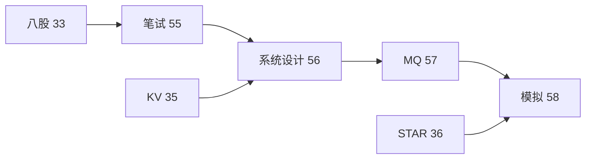

# 消息队列 Kafka 与中间件面试专题

> **文件编码**：UTF-8。MQ 场景、Kafka 架构、顺序/重复/积压、与 Redis/MySQL 配合、RocketMQ 概念
> **交叉阅读**：[33 八股总表](33-C++Infra面试八股总表.md) · [35 KV-Store](35-项目实战高性能KV-Store.md) · [56 秒杀削峰](56-系统设计案例库RPC-KV与限流秒杀.md) · [19 gRPC](19-gRPC与Protobuf工程化.md)

## 本章与前后章的关系

| 上一章 | 本章 | 下一章 |
|--------|------|--------|
| [56 系统设计案例库](56-系统设计案例库RPC-KV与限流秒杀.md) | **本章** | [58 模拟面试流程](58-模拟面试完整流程与压测数据模板.md) |



## 0. 读前导读

消息队列是 **56 章秒杀削峰、异步解耦** 的核心组件；C++ Infra 岗需懂 **Kafka 架构 + 与 Redis/MySQL 组合拳**，并能对比 RocketMQ。


## 1. MQ 典型场景（10 则）

### 1.1 异步解耦

**描述**：订单创建后发 MQ，库存/积分/通知各自消费
**关联**：56 秒杀下单 · [35 项目](35-项目实战高性能KV-Store.md) 可类比 WAL  append 异步刷盘

**面试答法**：场景 → 不用 MQ 的问题 → 引入 MQ → 新问题（顺序/重复/积压）→ 解法

### 1.2 流量削峰

**描述**：写入 Kafka 缓冲，Consumer 按能力拉
**关联**：56 §5 · [35 项目](35-项目实战高性能KV-Store.md) 可类比 WAL  append 异步刷盘

**面试答法**：场景 → 不用 MQ 的问题 → 引入 MQ → 新问题（顺序/重复/积压）→ 解法

### 1.3 最终一致

**描述**：本地事务+发消息；事务消息
**关联**：RocketMQ 特色 · [35 项目](35-项目实战高性能KV-Store.md) 可类比 WAL  append 异步刷盘

**面试答法**：场景 → 不用 MQ 的问题 → 引入 MQ → 新问题（顺序/重复/积压）→ 解法

### 1.4 广播

**描述**：配置下发；Kafka 多 Consumer Group 各读全量
**关联**：配置中心 · [35 项目](35-项目实战高性能KV-Store.md) 可类比 WAL  append 异步刷盘

**面试答法**：场景 → 不用 MQ 的问题 → 引入 MQ → 新问题（顺序/重复/积压）→ 解法

### 1.5 日志采集

**描述**：ELK/ClickHouse 管道
**关联**：大数据 · [35 项目](35-项目实战高性能KV-Store.md) 可类比 WAL  append 异步刷盘

**面试答法**：场景 → 不用 MQ 的问题 → 引入 MQ → 新问题（顺序/重复/积压）→ 解法

### 1.6 CDC

**描述**：Canal/Debezium 订阅 binlog → MQ → 搜索引擎
**关联**：数据同步 · [35 项目](35-项目实战高性能KV-Store.md) 可类比 WAL  append 异步刷盘

**面试答法**：场景 → 不用 MQ 的问题 → 引入 MQ → 新问题（顺序/重复/积压）→ 解法

### 1.7 延迟任务

**描述**：RocketMQ 延迟级别 / Redis ZSET / 时间轮
**关联**：定时 · [35 项目](35-项目实战高性能KV-Store.md) 可类比 WAL  append 异步刷盘

**面试答法**：场景 → 不用 MQ 的问题 → 引入 MQ → 新问题（顺序/重复/积压）→ 解法

### 1.8 死信队列

**描述**：多次失败进 DLQ 人工处理
**关联**：可靠性 · [35 项目](35-项目实战高性能KV-Store.md) 可类比 WAL  append 异步刷盘

**面试答法**：场景 → 不用 MQ 的问题 → 引入 MQ → 新问题（顺序/重复/积压）→ 解法

### 1.9 顺序消息

**描述**：同 key 同 partition
**关联**：订单状态机 · [35 项目](35-项目实战高性能KV-Store.md) 可类比 WAL  append 异步刷盘

**面试答法**：场景 → 不用 MQ 的问题 → 引入 MQ → 新问题（顺序/重复/积压）→ 解法

### 1.10 Exactly-once

**描述**：幂等+去重表；Kafka 事务
**关联**：57 §3 · [35 项目](35-项目实战高性能KV-Store.md) 可类比 WAL  append 异步刷盘

**面试答法**：场景 → 不用 MQ 的问题 → 引入 MQ → 新问题（顺序/重复/积压）→ 解法


## 2. Kafka 架构核心（10 组件）

### 2.1 Broker

集群存储消息；Topic 逻辑划分

**与 C++**：Consumer 常用 librdkafka；Producer  batch 与 [35 线程池](35-项目实战高性能KV-Store.md) 批处理类似思想

### 2.2 Partition

并行度单位；有序仅在 partition 内

**与 C++**：Consumer 常用 librdkafka；Producer  batch 与 [35 线程池](35-项目实战高性能KV-Store.md) 批处理类似思想

### 2.3 Replica

ISR 集合；Leader 写 Follower 同步

**与 C++**：Consumer 常用 librdkafka；Producer  batch 与 [35 线程池](35-项目实战高性能KV-Store.md) 批处理类似思想

### 2.4 Producer

指定 key → partition；batch 压缩

**与 C++**：Consumer 常用 librdkafka；Producer  batch 与 [35 线程池](35-项目实战高性能KV-Store.md) 批处理类似思想

### 2.5 Consumer Group

组内竞争消费；组间独立

**与 C++**：Consumer 常用 librdkafka；Producer  batch 与 [35 线程池](35-项目实战高性能KV-Store.md) 批处理类似思想

### 2.6 Offset

消费位点；__consumer_offsets 内部 topic

**与 C++**：Consumer 常用 librdkafka；Producer  batch 与 [35 线程池](35-项目实战高性能KV-Store.md) 批处理类似思想

### 2.7 Zookeeper/KRaft

元数据与 Controller 选举

**与 C++**：Consumer 常用 librdkafka；Producer  batch 与 [35 线程池](35-项目实战高性能KV-Store.md) 批处理类似思想

### 2.8 Log Segment

.log + .index 顺序文件

**与 C++**：Consumer 常用 librdkafka；Producer  batch 与 [35 线程池](35-项目实战高性能KV-Store.md) 批处理类似思想

### 2.9 零拷贝 sendfile

高性能读盘发网卡

**与 C++**：Consumer 常用 librdkafka；Producer  batch 与 [35 线程池](35-项目实战高性能KV-Store.md) 批处理类似思想

### 2.10 Page Cache

顺序写磁盘 ≈ 写内存

**与 C++**：Consumer 常用 librdkafka；Producer  batch 与 [35 线程池](35-项目实战高性能KV-Store.md) 批处理类似思想


## 3. 顺序、重复、丢失与积压（10 题）

**3.1 顺序**

**解法**：同 key 同 partition；单 partition 单 consumer 线程

**追问**：如何验证？如何压测？→ [58 章](58-模拟面试完整流程与压测数据模板.md)

**3.2 重复**

**解法**：At least once；Consumer 幂等+业务去重 ID

**追问**：如何验证？如何压测？→ [58 章](58-模拟面试完整流程与压测数据模板.md)

**3.3 丢失**

**解法**：Producer acks=all；min.insync.replicas；Consumer 先处理再 commit

**追问**：如何验证？如何压测？→ [58 章](58-模拟面试完整流程与压测数据模板.md)

**3.4 积压**

**解法**：扩 partition+consumer；优化消费逻辑；临时降级

**追问**：如何验证？如何压测？→ [58 章](58-模拟面试完整流程与压测数据模板.md)

**3.5 Rebalance**

**解法**：Cooperative sticky 减少停顿

**追问**：如何验证？如何压测？→ [58 章](58-模拟面试完整流程与压测数据模板.md)

**3.6 消息过大**

**解法**：压缩/外链 OSS；max.message.bytes

**追问**：如何验证？如何压测？→ [58 章](58-模拟面试完整流程与压测数据模板.md)

**3.7 延迟**

**解法**：批量过大 trade-off；linger.ms

**追问**：如何验证？如何压测？→ [58 章](58-模拟面试完整流程与压测数据模板.md)

**3.8 事务**

**解法**：read_committed 隔离

**追问**：如何验证？如何压测？→ [58 章](58-模拟面试完整流程与压测数据模板.md)

**3.9 跨机房**

**解法**：MirrorMaker 复制；延迟与顺序

**追问**：如何验证？如何压测？→ [58 章](58-模拟面试完整流程与压测数据模板.md)

**3.10 监控**

**解法**：Lag、吞吐、ISR 收缩

**追问**：如何验证？如何压测？→ [58 章](58-模拟面试完整流程与压测数据模板.md)


## 4. Kafka 与 Redis/MySQL 配合（10 模式）

### 4.1 Cache-Aside

读 Redis miss → MySQL → 回写；更新先 DB 再删缓存

### 4.2 秒杀库存

Redis 预减 + Kafka 订单 + MySQL 落库

### 4.3 Outbox

业务 DB 与消息表同事务；Relay 发 Kafka

### 4.4 CQRS

写 MySQL 读 ES；MQ 同步

### 4.5 分布式锁

Redis Redlock 争议；ZK/etcd；见 [33 并发](33-C++Infra面试八股总表.md)

### 4.6 延迟双删

删缓存→写 DB→ sleep → 再删

### 4.7 热点 Key

本地缓存+随机过期；Redis 分片

### 4.8 KV 项目

[35 WAL](35-项目实战高性能KV-Store.md) 类似 commit log；Kafka 是分布式 commit log

### 4.9 RPC+MQ

同步 RPC 查；异步 MQ 写；[19 gRPC](19-gRPC与Protobuf工程化.md)

### 4.10 限流+MQ

[56 令牌桶](56-系统设计案例库RPC-KV与限流秒杀.md) 入口；MQ 缓冲


## 5. RocketMQ 概念速览（10 条）

**R01 NameServer**：路由注册；无 ZK 轻量

**R02 Topic/Queue**：Queue 类似 partition

**R03 Tag 过滤**：Consumer 按 Tag 订阅子集

**R04 顺序消息**：Sharding Key 同 Queue

**R05 事务消息**：Half 消息+本地事务+Commit/Rollback

**R06 延迟消息**：18 个固定延迟级别

**R07 死信**：重试次数超限

**R08 刷盘**：同步/异步刷盘 trade-off

**R09 与 Kafka 对比**：Kafka 吞吐日志；RocketMQ 业务功能多

**R10 选型**：大数据管道 Kafka；电商订单 RocketMQ 常见


## 6. C++ 消费者伪代码与工程要点

```cpp
// librdkafka 消费骨架（面试口述即可）
while (running) {
  auto msg = consumer.poll(100ms);
  if (!msg) continue;
  if (process(msg) ok) consumer.commit(msg);  // 幂等后再 commit
  else send_to_dlq(msg);
}
```

**工程**：信号处理 graceful shutdown；多 partition 多线程消费；metrics 暴露 lag

### Kafka 面试题 K305

Q：若 Consumer lag 持续升高，排查步骤？
A：1) 看消费速率 vs 生产 2) 是否 rebalance 3) 慢 SQL/下游 4) 扩 partition/consumer 5) [56 限流](56-系统设计案例库RPC-KV与限流秒杀.md) 上游

关联 [33 §6 网络](33-C++Infra面试八股总表.md) · [58 连环追问](58-模拟面试完整流程与压测数据模板.md)

### Kafka 面试题 K312

Q：若 Consumer lag 持续升高，排查步骤？
A：1) 看消费速率 vs 生产 2) 是否 rebalance 3) 慢 SQL/下游 4) 扩 partition/consumer 5) [56 限流](56-系统设计案例库RPC-KV与限流秒杀.md) 上游

关联 [33 §6 网络](33-C++Infra面试八股总表.md) · [58 连环追问](58-模拟面试完整流程与压测数据模板.md)

### Kafka 面试题 K319

Q：若 Consumer lag 持续升高，排查步骤？
A：1) 看消费速率 vs 生产 2) 是否 rebalance 3) 慢 SQL/下游 4) 扩 partition/consumer 5) [56 限流](56-系统设计案例库RPC-KV与限流秒杀.md) 上游

关联 [33 §6 网络](33-C++Infra面试八股总表.md) · [58 连环追问](58-模拟面试完整流程与压测数据模板.md)

### Kafka 面试题 K326

Q：若 Consumer lag 持续升高，排查步骤？
A：1) 看消费速率 vs 生产 2) 是否 rebalance 3) 慢 SQL/下游 4) 扩 partition/consumer 5) [56 限流](56-系统设计案例库RPC-KV与限流秒杀.md) 上游

关联 [33 §6 网络](33-C++Infra面试八股总表.md) · [58 连环追问](58-模拟面试完整流程与压测数据模板.md)

### Kafka 面试题 K333

Q：若 Consumer lag 持续升高，排查步骤？
A：1) 看消费速率 vs 生产 2) 是否 rebalance 3) 慢 SQL/下游 4) 扩 partition/consumer 5) [56 限流](56-系统设计案例库RPC-KV与限流秒杀.md) 上游

关联 [33 §6 网络](33-C++Infra面试八股总表.md) · [58 连环追问](58-模拟面试完整流程与压测数据模板.md)

### Kafka 面试题 K340

Q：若 Consumer lag 持续升高，排查步骤？
A：1) 看消费速率 vs 生产 2) 是否 rebalance 3) 慢 SQL/下游 4) 扩 partition/consumer 5) [56 限流](56-系统设计案例库RPC-KV与限流秒杀.md) 上游

关联 [33 §6 网络](33-C++Infra面试八股总表.md) · [58 连环追问](58-模拟面试完整流程与压测数据模板.md)

### Kafka 面试题 K347

Q：若 Consumer lag 持续升高，排查步骤？
A：1) 看消费速率 vs 生产 2) 是否 rebalance 3) 慢 SQL/下游 4) 扩 partition/consumer 5) [56 限流](56-系统设计案例库RPC-KV与限流秒杀.md) 上游

关联 [33 §6 网络](33-C++Infra面试八股总表.md) · [58 连环追问](58-模拟面试完整流程与压测数据模板.md)

### Kafka 面试题 K354

Q：若 Consumer lag 持续升高，排查步骤？
A：1) 看消费速率 vs 生产 2) 是否 rebalance 3) 慢 SQL/下游 4) 扩 partition/consumer 5) [56 限流](56-系统设计案例库RPC-KV与限流秒杀.md) 上游

关联 [33 §6 网络](33-C++Infra面试八股总表.md) · [58 连环追问](58-模拟面试完整流程与压测数据模板.md)

### Kafka 面试题 K361

Q：若 Consumer lag 持续升高，排查步骤？
A：1) 看消费速率 vs 生产 2) 是否 rebalance 3) 慢 SQL/下游 4) 扩 partition/consumer 5) [56 限流](56-系统设计案例库RPC-KV与限流秒杀.md) 上游

关联 [33 §6 网络](33-C++Infra面试八股总表.md) · [58 连环追问](58-模拟面试完整流程与压测数据模板.md)

### Kafka 面试题 K368

Q：若 Consumer lag 持续升高，排查步骤？
A：1) 看消费速率 vs 生产 2) 是否 rebalance 3) 慢 SQL/下游 4) 扩 partition/consumer 5) [56 限流](56-系统设计案例库RPC-KV与限流秒杀.md) 上游

关联 [33 §6 网络](33-C++Infra面试八股总表.md) · [58 连环追问](58-模拟面试完整流程与压测数据模板.md)

### Kafka 面试题 K375

Q：若 Consumer lag 持续升高，排查步骤？
A：1) 看消费速率 vs 生产 2) 是否 rebalance 3) 慢 SQL/下游 4) 扩 partition/consumer 5) [56 限流](56-系统设计案例库RPC-KV与限流秒杀.md) 上游

关联 [33 §6 网络](33-C++Infra面试八股总表.md) · [58 连环追问](58-模拟面试完整流程与压测数据模板.md)

### Kafka 面试题 K382

Q：若 Consumer lag 持续升高，排查步骤？
A：1) 看消费速率 vs 生产 2) 是否 rebalance 3) 慢 SQL/下游 4) 扩 partition/consumer 5) [56 限流](56-系统设计案例库RPC-KV与限流秒杀.md) 上游

关联 [33 §6 网络](33-C++Infra面试八股总表.md) · [58 连环追问](58-模拟面试完整流程与压测数据模板.md)

### Kafka 面试题 K389

Q：若 Consumer lag 持续升高，排查步骤？
A：1) 看消费速率 vs 生产 2) 是否 rebalance 3) 慢 SQL/下游 4) 扩 partition/consumer 5) [56 限流](56-系统设计案例库RPC-KV与限流秒杀.md) 上游

关联 [33 §6 网络](33-C++Infra面试八股总表.md) · [58 连环追问](58-模拟面试完整流程与压测数据模板.md)

### Kafka 面试题 K396

Q：若 Consumer lag 持续升高，排查步骤？
A：1) 看消费速率 vs 生产 2) 是否 rebalance 3) 慢 SQL/下游 4) 扩 partition/consumer 5) [56 限流](56-系统设计案例库RPC-KV与限流秒杀.md) 上游

关联 [33 §6 网络](33-C++Infra面试八股总表.md) · [58 连环追问](58-模拟面试完整流程与压测数据模板.md)

### Kafka 面试题 K403

Q：若 Consumer lag 持续升高，排查步骤？
A：1) 看消费速率 vs 生产 2) 是否 rebalance 3) 慢 SQL/下游 4) 扩 partition/consumer 5) [56 限流](56-系统设计案例库RPC-KV与限流秒杀.md) 上游

关联 [33 §6 网络](33-C++Infra面试八股总表.md) · [58 连环追问](58-模拟面试完整流程与压测数据模板.md)

### Kafka 面试题 K410

Q：若 Consumer lag 持续升高，排查步骤？
A：1) 看消费速率 vs 生产 2) 是否 rebalance 3) 慢 SQL/下游 4) 扩 partition/consumer 5) [56 限流](56-系统设计案例库RPC-KV与限流秒杀.md) 上游

关联 [33 §6 网络](33-C++Infra面试八股总表.md) · [58 连环追问](58-模拟面试完整流程与压测数据模板.md)

### Kafka 面试题 K417

Q：若 Consumer lag 持续升高，排查步骤？
A：1) 看消费速率 vs 生产 2) 是否 rebalance 3) 慢 SQL/下游 4) 扩 partition/consumer 5) [56 限流](56-系统设计案例库RPC-KV与限流秒杀.md) 上游

关联 [33 §6 网络](33-C++Infra面试八股总表.md) · [58 连环追问](58-模拟面试完整流程与压测数据模板.md)

### Kafka 面试题 K424

Q：若 Consumer lag 持续升高，排查步骤？
A：1) 看消费速率 vs 生产 2) 是否 rebalance 3) 慢 SQL/下游 4) 扩 partition/consumer 5) [56 限流](56-系统设计案例库RPC-KV与限流秒杀.md) 上游

关联 [33 §6 网络](33-C++Infra面试八股总表.md) · [58 连环追问](58-模拟面试完整流程与压测数据模板.md)

### Kafka 面试题 K431

Q：若 Consumer lag 持续升高，排查步骤？
A：1) 看消费速率 vs 生产 2) 是否 rebalance 3) 慢 SQL/下游 4) 扩 partition/consumer 5) [56 限流](56-系统设计案例库RPC-KV与限流秒杀.md) 上游

关联 [33 §6 网络](33-C++Infra面试八股总表.md) · [58 连环追问](58-模拟面试完整流程与压测数据模板.md)

### Kafka 面试题 K438

Q：若 Consumer lag 持续升高，排查步骤？
A：1) 看消费速率 vs 生产 2) 是否 rebalance 3) 慢 SQL/下游 4) 扩 partition/consumer 5) [56 限流](56-系统设计案例库RPC-KV与限流秒杀.md) 上游

关联 [33 §6 网络](33-C++Infra面试八股总表.md) · [58 连环追问](58-模拟面试完整流程与压测数据模板.md)

### Kafka 面试题 K445

Q：若 Consumer lag 持续升高，排查步骤？
A：1) 看消费速率 vs 生产 2) 是否 rebalance 3) 慢 SQL/下游 4) 扩 partition/consumer 5) [56 限流](56-系统设计案例库RPC-KV与限流秒杀.md) 上游

关联 [33 §6 网络](33-C++Infra面试八股总表.md) · [58 连环追问](58-模拟面试完整流程与压测数据模板.md)

### Kafka 面试题 K452

Q：若 Consumer lag 持续升高，排查步骤？
A：1) 看消费速率 vs 生产 2) 是否 rebalance 3) 慢 SQL/下游 4) 扩 partition/consumer 5) [56 限流](56-系统设计案例库RPC-KV与限流秒杀.md) 上游

关联 [33 §6 网络](33-C++Infra面试八股总表.md) · [58 连环追问](58-模拟面试完整流程与压测数据模板.md)

### Kafka 面试题 K459

Q：若 Consumer lag 持续升高，排查步骤？
A：1) 看消费速率 vs 生产 2) 是否 rebalance 3) 慢 SQL/下游 4) 扩 partition/consumer 5) [56 限流](56-系统设计案例库RPC-KV与限流秒杀.md) 上游

关联 [33 §6 网络](33-C++Infra面试八股总表.md) · [58 连环追问](58-模拟面试完整流程与压测数据模板.md)

### Kafka 面试题 K466

Q：若 Consumer lag 持续升高，排查步骤？
A：1) 看消费速率 vs 生产 2) 是否 rebalance 3) 慢 SQL/下游 4) 扩 partition/consumer 5) [56 限流](56-系统设计案例库RPC-KV与限流秒杀.md) 上游

关联 [33 §6 网络](33-C++Infra面试八股总表.md) · [58 连环追问](58-模拟面试完整流程与压测数据模板.md)

### Kafka 面试题 K473

Q：若 Consumer lag 持续升高，排查步骤？
A：1) 看消费速率 vs 生产 2) 是否 rebalance 3) 慢 SQL/下游 4) 扩 partition/consumer 5) [56 限流](56-系统设计案例库RPC-KV与限流秒杀.md) 上游

关联 [33 §6 网络](33-C++Infra面试八股总表.md) · [58 连环追问](58-模拟面试完整流程与压测数据模板.md)

### Kafka 面试题 K480

Q：若 Consumer lag 持续升高，排查步骤？
A：1) 看消费速率 vs 生产 2) 是否 rebalance 3) 慢 SQL/下游 4) 扩 partition/consumer 5) [56 限流](56-系统设计案例库RPC-KV与限流秒杀.md) 上游

关联 [33 §6 网络](33-C++Infra面试八股总表.md) · [58 连环追问](58-模拟面试完整流程与压测数据模板.md)

### Kafka 面试题 K487

Q：若 Consumer lag 持续升高，排查步骤？
A：1) 看消费速率 vs 生产 2) 是否 rebalance 3) 慢 SQL/下游 4) 扩 partition/consumer 5) [56 限流](56-系统设计案例库RPC-KV与限流秒杀.md) 上游

关联 [33 §6 网络](33-C++Infra面试八股总表.md) · [58 连环追问](58-模拟面试完整流程与压测数据模板.md)

### Kafka 面试题 K494

Q：若 Consumer lag 持续升高，排查步骤？
A：1) 看消费速率 vs 生产 2) 是否 rebalance 3) 慢 SQL/下游 4) 扩 partition/consumer 5) [56 限流](56-系统设计案例库RPC-KV与限流秒杀.md) 上游

关联 [33 §6 网络](33-C++Infra面试八股总表.md) · [58 连环追问](58-模拟面试完整流程与压测数据模板.md)

### Kafka 面试题 K501

Q：若 Consumer lag 持续升高，排查步骤？
A：1) 看消费速率 vs 生产 2) 是否 rebalance 3) 慢 SQL/下游 4) 扩 partition/consumer 5) [56 限流](56-系统设计案例库RPC-KV与限流秒杀.md) 上游

关联 [33 §6 网络](33-C++Infra面试八股总表.md) · [58 连环追问](58-模拟面试完整流程与压测数据模板.md)

### Kafka 面试题 K508

Q：若 Consumer lag 持续升高，排查步骤？
A：1) 看消费速率 vs 生产 2) 是否 rebalance 3) 慢 SQL/下游 4) 扩 partition/consumer 5) [56 限流](56-系统设计案例库RPC-KV与限流秒杀.md) 上游

关联 [33 §6 网络](33-C++Infra面试八股总表.md) · [58 连环追问](58-模拟面试完整流程与压测数据模板.md)

### Kafka 面试题 K515

Q：若 Consumer lag 持续升高，排查步骤？
A：1) 看消费速率 vs 生产 2) 是否 rebalance 3) 慢 SQL/下游 4) 扩 partition/consumer 5) [56 限流](56-系统设计案例库RPC-KV与限流秒杀.md) 上游

关联 [33 §6 网络](33-C++Infra面试八股总表.md) · [58 连环追问](58-模拟面试完整流程与压测数据模板.md)

### Kafka 面试题 K522

Q：若 Consumer lag 持续升高，排查步骤？
A：1) 看消费速率 vs 生产 2) 是否 rebalance 3) 慢 SQL/下游 4) 扩 partition/consumer 5) [56 限流](56-系统设计案例库RPC-KV与限流秒杀.md) 上游

关联 [33 §6 网络](33-C++Infra面试八股总表.md) · [58 连环追问](58-模拟面试完整流程与压测数据模板.md)

### Kafka 面试题 K529

Q：若 Consumer lag 持续升高，排查步骤？
A：1) 看消费速率 vs 生产 2) 是否 rebalance 3) 慢 SQL/下游 4) 扩 partition/consumer 5) [56 限流](56-系统设计案例库RPC-KV与限流秒杀.md) 上游

关联 [33 §6 网络](33-C++Infra面试八股总表.md) · [58 连环追问](58-模拟面试完整流程与压测数据模板.md)

### Kafka 面试题 K536

Q：若 Consumer lag 持续升高，排查步骤？
A：1) 看消费速率 vs 生产 2) 是否 rebalance 3) 慢 SQL/下游 4) 扩 partition/consumer 5) [56 限流](56-系统设计案例库RPC-KV与限流秒杀.md) 上游

关联 [33 §6 网络](33-C++Infra面试八股总表.md) · [58 连环追问](58-模拟面试完整流程与压测数据模板.md)

### Kafka 面试题 K543

Q：若 Consumer lag 持续升高，排查步骤？
A：1) 看消费速率 vs 生产 2) 是否 rebalance 3) 慢 SQL/下游 4) 扩 partition/consumer 5) [56 限流](56-系统设计案例库RPC-KV与限流秒杀.md) 上游

关联 [33 §6 网络](33-C++Infra面试八股总表.md) · [58 连环追问](58-模拟面试完整流程与压测数据模板.md)

### Kafka 面试题 K550

Q：若 Consumer lag 持续升高，排查步骤？
A：1) 看消费速率 vs 生产 2) 是否 rebalance 3) 慢 SQL/下游 4) 扩 partition/consumer 5) [56 限流](56-系统设计案例库RPC-KV与限流秒杀.md) 上游

关联 [33 §6 网络](33-C++Infra面试八股总表.md) · [58 连环追问](58-模拟面试完整流程与压测数据模板.md)

### Kafka 面试题 K557

Q：若 Consumer lag 持续升高，排查步骤？
A：1) 看消费速率 vs 生产 2) 是否 rebalance 3) 慢 SQL/下游 4) 扩 partition/consumer 5) [56 限流](56-系统设计案例库RPC-KV与限流秒杀.md) 上游

关联 [33 §6 网络](33-C++Infra面试八股总表.md) · [58 连环追问](58-模拟面试完整流程与压测数据模板.md)

### Kafka 面试题 K564

Q：若 Consumer lag 持续升高，排查步骤？
A：1) 看消费速率 vs 生产 2) 是否 rebalance 3) 慢 SQL/下游 4) 扩 partition/consumer 5) [56 限流](56-系统设计案例库RPC-KV与限流秒杀.md) 上游

关联 [33 §6 网络](33-C++Infra面试八股总表.md) · [58 连环追问](58-模拟面试完整流程与压测数据模板.md)

### Kafka 面试题 K571

Q：若 Consumer lag 持续升高，排查步骤？
A：1) 看消费速率 vs 生产 2) 是否 rebalance 3) 慢 SQL/下游 4) 扩 partition/consumer 5) [56 限流](56-系统设计案例库RPC-KV与限流秒杀.md) 上游

关联 [33 §6 网络](33-C++Infra面试八股总表.md) · [58 连环追问](58-模拟面试完整流程与压测数据模板.md)

### Kafka 面试题 K578

Q：若 Consumer lag 持续升高，排查步骤？
A：1) 看消费速率 vs 生产 2) 是否 rebalance 3) 慢 SQL/下游 4) 扩 partition/consumer 5) [56 限流](56-系统设计案例库RPC-KV与限流秒杀.md) 上游

关联 [33 §6 网络](33-C++Infra面试八股总表.md) · [58 连环追问](58-模拟面试完整流程与压测数据模板.md)

### Kafka 面试题 K585

Q：若 Consumer lag 持续升高，排查步骤？
A：1) 看消费速率 vs 生产 2) 是否 rebalance 3) 慢 SQL/下游 4) 扩 partition/consumer 5) [56 限流](56-系统设计案例库RPC-KV与限流秒杀.md) 上游

关联 [33 §6 网络](33-C++Infra面试八股总表.md) · [58 连环追问](58-模拟面试完整流程与压测数据模板.md)

### Kafka 面试题 K592

Q：若 Consumer lag 持续升高，排查步骤？
A：1) 看消费速率 vs 生产 2) 是否 rebalance 3) 慢 SQL/下游 4) 扩 partition/consumer 5) [56 限流](56-系统设计案例库RPC-KV与限流秒杀.md) 上游

关联 [33 §6 网络](33-C++Infra面试八股总表.md) · [58 连环追问](58-模拟面试完整流程与压测数据模板.md)

### Kafka 面试题 K599

Q：若 Consumer lag 持续升高，排查步骤？
A：1) 看消费速率 vs 生产 2) 是否 rebalance 3) 慢 SQL/下游 4) 扩 partition/consumer 5) [56 限流](56-系统设计案例库RPC-KV与限流秒杀.md) 上游

关联 [33 §6 网络](33-C++Infra面试八股总表.md) · [58 连环追问](58-模拟面试完整流程与压测数据模板.md)

### Kafka 面试题 K606

Q：若 Consumer lag 持续升高，排查步骤？
A：1) 看消费速率 vs 生产 2) 是否 rebalance 3) 慢 SQL/下游 4) 扩 partition/consumer 5) [56 限流](56-系统设计案例库RPC-KV与限流秒杀.md) 上游

关联 [33 §6 网络](33-C++Infra面试八股总表.md) · [58 连环追问](58-模拟面试完整流程与压测数据模板.md)

### Kafka 面试题 K613

Q：若 Consumer lag 持续升高，排查步骤？
A：1) 看消费速率 vs 生产 2) 是否 rebalance 3) 慢 SQL/下游 4) 扩 partition/consumer 5) [56 限流](56-系统设计案例库RPC-KV与限流秒杀.md) 上游

关联 [33 §6 网络](33-C++Infra面试八股总表.md) · [58 连环追问](58-模拟面试完整流程与压测数据模板.md)

### Kafka 面试题 K620

Q：若 Consumer lag 持续升高，排查步骤？
A：1) 看消费速率 vs 生产 2) 是否 rebalance 3) 慢 SQL/下游 4) 扩 partition/consumer 5) [56 限流](56-系统设计案例库RPC-KV与限流秒杀.md) 上游

关联 [33 §6 网络](33-C++Infra面试八股总表.md) · [58 连环追问](58-模拟面试完整流程与压测数据模板.md)

### Kafka 面试题 K627

Q：若 Consumer lag 持续升高，排查步骤？
A：1) 看消费速率 vs 生产 2) 是否 rebalance 3) 慢 SQL/下游 4) 扩 partition/consumer 5) [56 限流](56-系统设计案例库RPC-KV与限流秒杀.md) 上游

关联 [33 §6 网络](33-C++Infra面试八股总表.md) · [58 连环追问](58-模拟面试完整流程与压测数据模板.md)

### Kafka 面试题 K634

Q：若 Consumer lag 持续升高，排查步骤？
A：1) 看消费速率 vs 生产 2) 是否 rebalance 3) 慢 SQL/下游 4) 扩 partition/consumer 5) [56 限流](56-系统设计案例库RPC-KV与限流秒杀.md) 上游

关联 [33 §6 网络](33-C++Infra面试八股总表.md) · [58 连环追问](58-模拟面试完整流程与压测数据模板.md)

### Kafka 面试题 K641

Q：若 Consumer lag 持续升高，排查步骤？
A：1) 看消费速率 vs 生产 2) 是否 rebalance 3) 慢 SQL/下游 4) 扩 partition/consumer 5) [56 限流](56-系统设计案例库RPC-KV与限流秒杀.md) 上游

关联 [33 §6 网络](33-C++Infra面试八股总表.md) · [58 连环追问](58-模拟面试完整流程与压测数据模板.md)

### Kafka 面试题 K648

Q：若 Consumer lag 持续升高，排查步骤？
A：1) 看消费速率 vs 生产 2) 是否 rebalance 3) 慢 SQL/下游 4) 扩 partition/consumer 5) [56 限流](56-系统设计案例库RPC-KV与限流秒杀.md) 上游

关联 [33 §6 网络](33-C++Infra面试八股总表.md) · [58 连环追问](58-模拟面试完整流程与压测数据模板.md)

### Kafka 面试题 K655

Q：若 Consumer lag 持续升高，排查步骤？
A：1) 看消费速率 vs 生产 2) 是否 rebalance 3) 慢 SQL/下游 4) 扩 partition/consumer 5) [56 限流](56-系统设计案例库RPC-KV与限流秒杀.md) 上游

关联 [33 §6 网络](33-C++Infra面试八股总表.md) · [58 连环追问](58-模拟面试完整流程与压测数据模板.md)

### Kafka 面试题 K662

Q：若 Consumer lag 持续升高，排查步骤？
A：1) 看消费速率 vs 生产 2) 是否 rebalance 3) 慢 SQL/下游 4) 扩 partition/consumer 5) [56 限流](56-系统设计案例库RPC-KV与限流秒杀.md) 上游

关联 [33 §6 网络](33-C++Infra面试八股总表.md) · [58 连环追问](58-模拟面试完整流程与压测数据模板.md)

### Kafka 面试题 K669

Q：若 Consumer lag 持续升高，排查步骤？
A：1) 看消费速率 vs 生产 2) 是否 rebalance 3) 慢 SQL/下游 4) 扩 partition/consumer 5) [56 限流](56-系统设计案例库RPC-KV与限流秒杀.md) 上游

关联 [33 §6 网络](33-C++Infra面试八股总表.md) · [58 连环追问](58-模拟面试完整流程与压测数据模板.md)

### Kafka 面试题 K676

Q：若 Consumer lag 持续升高，排查步骤？
A：1) 看消费速率 vs 生产 2) 是否 rebalance 3) 慢 SQL/下游 4) 扩 partition/consumer 5) [56 限流](56-系统设计案例库RPC-KV与限流秒杀.md) 上游

关联 [33 §6 网络](33-C++Infra面试八股总表.md) · [58 连环追问](58-模拟面试完整流程与压测数据模板.md)

### Kafka 面试题 K683

Q：若 Consumer lag 持续升高，排查步骤？
A：1) 看消费速率 vs 生产 2) 是否 rebalance 3) 慢 SQL/下游 4) 扩 partition/consumer 5) [56 限流](56-系统设计案例库RPC-KV与限流秒杀.md) 上游

关联 [33 §6 网络](33-C++Infra面试八股总表.md) · [58 连环追问](58-模拟面试完整流程与压测数据模板.md)

### Kafka 面试题 K690

Q：若 Consumer lag 持续升高，排查步骤？
A：1) 看消费速率 vs 生产 2) 是否 rebalance 3) 慢 SQL/下游 4) 扩 partition/consumer 5) [56 限流](56-系统设计案例库RPC-KV与限流秒杀.md) 上游

关联 [33 §6 网络](33-C++Infra面试八股总表.md) · [58 连环追问](58-模拟面试完整流程与压测数据模板.md)

### Kafka 面试题 K697

Q：若 Consumer lag 持续升高，排查步骤？
A：1) 看消费速率 vs 生产 2) 是否 rebalance 3) 慢 SQL/下游 4) 扩 partition/consumer 5) [56 限流](56-系统设计案例库RPC-KV与限流秒杀.md) 上游

关联 [33 §6 网络](33-C++Infra面试八股总表.md) · [58 连环追问](58-模拟面试完整流程与压测数据模板.md)

### Kafka 面试题 K704

Q：若 Consumer lag 持续升高，排查步骤？
A：1) 看消费速率 vs 生产 2) 是否 rebalance 3) 慢 SQL/下游 4) 扩 partition/consumer 5) [56 限流](56-系统设计案例库RPC-KV与限流秒杀.md) 上游

关联 [33 §6 网络](33-C++Infra面试八股总表.md) · [58 连环追问](58-模拟面试完整流程与压测数据模板.md)

### Kafka 面试题 K711

Q：若 Consumer lag 持续升高，排查步骤？
A：1) 看消费速率 vs 生产 2) 是否 rebalance 3) 慢 SQL/下游 4) 扩 partition/consumer 5) [56 限流](56-系统设计案例库RPC-KV与限流秒杀.md) 上游

关联 [33 §6 网络](33-C++Infra面试八股总表.md) · [58 连环追问](58-模拟面试完整流程与压测数据模板.md)

### Kafka 面试题 K718

Q：若 Consumer lag 持续升高，排查步骤？
A：1) 看消费速率 vs 生产 2) 是否 rebalance 3) 慢 SQL/下游 4) 扩 partition/consumer 5) [56 限流](56-系统设计案例库RPC-KV与限流秒杀.md) 上游

关联 [33 §6 网络](33-C++Infra面试八股总表.md) · [58 连环追问](58-模拟面试完整流程与压测数据模板.md)

### Kafka 面试题 K725

Q：若 Consumer lag 持续升高，排查步骤？
A：1) 看消费速率 vs 生产 2) 是否 rebalance 3) 慢 SQL/下游 4) 扩 partition/consumer 5) [56 限流](56-系统设计案例库RPC-KV与限流秒杀.md) 上游

关联 [33 §6 网络](33-C++Infra面试八股总表.md) · [58 连环追问](58-模拟面试完整流程与压测数据模板.md)

### Kafka 面试题 K732

Q：若 Consumer lag 持续升高，排查步骤？
A：1) 看消费速率 vs 生产 2) 是否 rebalance 3) 慢 SQL/下游 4) 扩 partition/consumer 5) [56 限流](56-系统设计案例库RPC-KV与限流秒杀.md) 上游

关联 [33 §6 网络](33-C++Infra面试八股总表.md) · [58 连环追问](58-模拟面试完整流程与压测数据模板.md)

### Kafka 面试题 K739

Q：若 Consumer lag 持续升高，排查步骤？
A：1) 看消费速率 vs 生产 2) 是否 rebalance 3) 慢 SQL/下游 4) 扩 partition/consumer 5) [56 限流](56-系统设计案例库RPC-KV与限流秒杀.md) 上游

关联 [33 §6 网络](33-C++Infra面试八股总表.md) · [58 连环追问](58-模拟面试完整流程与压测数据模板.md)

### Kafka 面试题 K746

Q：若 Consumer lag 持续升高，排查步骤？
A：1) 看消费速率 vs 生产 2) 是否 rebalance 3) 慢 SQL/下游 4) 扩 partition/consumer 5) [56 限流](56-系统设计案例库RPC-KV与限流秒杀.md) 上游

关联 [33 §6 网络](33-C++Infra面试八股总表.md) · [58 连环追问](58-模拟面试完整流程与压测数据模板.md)

### Kafka 面试题 K753

Q：若 Consumer lag 持续升高，排查步骤？
A：1) 看消费速率 vs 生产 2) 是否 rebalance 3) 慢 SQL/下游 4) 扩 partition/consumer 5) [56 限流](56-系统设计案例库RPC-KV与限流秒杀.md) 上游

关联 [33 §6 网络](33-C++Infra面试八股总表.md) · [58 连环追问](58-模拟面试完整流程与压测数据模板.md)

### Kafka 面试题 K760

Q：若 Consumer lag 持续升高，排查步骤？
A：1) 看消费速率 vs 生产 2) 是否 rebalance 3) 慢 SQL/下游 4) 扩 partition/consumer 5) [56 限流](56-系统设计案例库RPC-KV与限流秒杀.md) 上游

关联 [33 §6 网络](33-C++Infra面试八股总表.md) · [58 连环追问](58-模拟面试完整流程与压测数据模板.md)

### Kafka 面试题 K767

Q：若 Consumer lag 持续升高，排查步骤？
A：1) 看消费速率 vs 生产 2) 是否 rebalance 3) 慢 SQL/下游 4) 扩 partition/consumer 5) [56 限流](56-系统设计案例库RPC-KV与限流秒杀.md) 上游

关联 [33 §6 网络](33-C++Infra面试八股总表.md) · [58 连环追问](58-模拟面试完整流程与压测数据模板.md)

### Kafka 面试题 K774

Q：若 Consumer lag 持续升高，排查步骤？
A：1) 看消费速率 vs 生产 2) 是否 rebalance 3) 慢 SQL/下游 4) 扩 partition/consumer 5) [56 限流](56-系统设计案例库RPC-KV与限流秒杀.md) 上游

关联 [33 §6 网络](33-C++Infra面试八股总表.md) · [58 连环追问](58-模拟面试完整流程与压测数据模板.md)

### Kafka 面试题 K781

Q：若 Consumer lag 持续升高，排查步骤？
A：1) 看消费速率 vs 生产 2) 是否 rebalance 3) 慢 SQL/下游 4) 扩 partition/consumer 5) [56 限流](56-系统设计案例库RPC-KV与限流秒杀.md) 上游

关联 [33 §6 网络](33-C++Infra面试八股总表.md) · [58 连环追问](58-模拟面试完整流程与压测数据模板.md)

### Kafka 面试题 K788

Q：若 Consumer lag 持续升高，排查步骤？
A：1) 看消费速率 vs 生产 2) 是否 rebalance 3) 慢 SQL/下游 4) 扩 partition/consumer 5) [56 限流](56-系统设计案例库RPC-KV与限流秒杀.md) 上游

关联 [33 §6 网络](33-C++Infra面试八股总表.md) · [58 连环追问](58-模拟面试完整流程与压测数据模板.md)

### Kafka 面试题 K795

Q：若 Consumer lag 持续升高，排查步骤？
A：1) 看消费速率 vs 生产 2) 是否 rebalance 3) 慢 SQL/下游 4) 扩 partition/consumer 5) [56 限流](56-系统设计案例库RPC-KV与限流秒杀.md) 上游

关联 [33 §6 网络](33-C++Infra面试八股总表.md) · [58 连环追问](58-模拟面试完整流程与压测数据模板.md)

### Kafka 面试题 K802

Q：若 Consumer lag 持续升高，排查步骤？
A：1) 看消费速率 vs 生产 2) 是否 rebalance 3) 慢 SQL/下游 4) 扩 partition/consumer 5) [56 限流](56-系统设计案例库RPC-KV与限流秒杀.md) 上游

关联 [33 §6 网络](33-C++Infra面试八股总表.md) · [58 连环追问](58-模拟面试完整流程与压测数据模板.md)

### Kafka 面试题 K809

Q：若 Consumer lag 持续升高，排查步骤？
A：1) 看消费速率 vs 生产 2) 是否 rebalance 3) 慢 SQL/下游 4) 扩 partition/consumer 5) [56 限流](56-系统设计案例库RPC-KV与限流秒杀.md) 上游

关联 [33 §6 网络](33-C++Infra面试八股总表.md) · [58 连环追问](58-模拟面试完整流程与压测数据模板.md)

### Kafka 面试题 K816

Q：若 Consumer lag 持续升高，排查步骤？
A：1) 看消费速率 vs 生产 2) 是否 rebalance 3) 慢 SQL/下游 4) 扩 partition/consumer 5) [56 限流](56-系统设计案例库RPC-KV与限流秒杀.md) 上游

关联 [33 §6 网络](33-C++Infra面试八股总表.md) · [58 连环追问](58-模拟面试完整流程与压测数据模板.md)

### Kafka 面试题 K823

Q：若 Consumer lag 持续升高，排查步骤？
A：1) 看消费速率 vs 生产 2) 是否 rebalance 3) 慢 SQL/下游 4) 扩 partition/consumer 5) [56 限流](56-系统设计案例库RPC-KV与限流秒杀.md) 上游

关联 [33 §6 网络](33-C++Infra面试八股总表.md) · [58 连环追问](58-模拟面试完整流程与压测数据模板.md)

### Kafka 面试题 K830

Q：若 Consumer lag 持续升高，排查步骤？
A：1) 看消费速率 vs 生产 2) 是否 rebalance 3) 慢 SQL/下游 4) 扩 partition/consumer 5) [56 限流](56-系统设计案例库RPC-KV与限流秒杀.md) 上游

关联 [33 §6 网络](33-C++Infra面试八股总表.md) · [58 连环追问](58-模拟面试完整流程与压测数据模板.md)

### Kafka 面试题 K837

Q：若 Consumer lag 持续升高，排查步骤？
A：1) 看消费速率 vs 生产 2) 是否 rebalance 3) 慢 SQL/下游 4) 扩 partition/consumer 5) [56 限流](56-系统设计案例库RPC-KV与限流秒杀.md) 上游

关联 [33 §6 网络](33-C++Infra面试八股总表.md) · [58 连环追问](58-模拟面试完整流程与压测数据模板.md)

