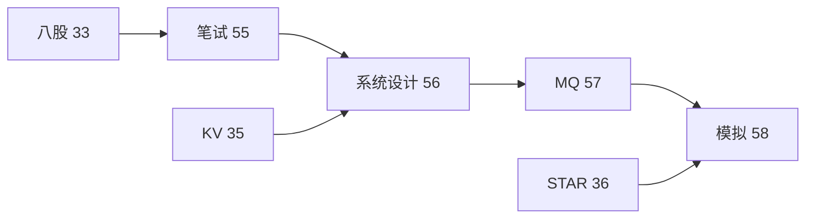

# 模拟面试完整流程与压测数据模板

> **文件编码**：UTF-8。45 分钟模拟、各轮考点、ab/wrk 压测报告、简历 bullet、连环追问清单
> **交叉阅读**：[36 STAR 手册](36-面试STAR表达与简历手册.md) · [35 KV-Store](35-项目实战高性能KV-Store.md) · [33 八股总表](33-C++Infra面试八股总表.md) · [55 笔试题集](55-大厂C++笔试选择题与代码输出陷阱题集.md) · [56 系统设计](56-系统设计案例库RPC-KV与限流秒杀.md) · [12 性能分析](12-性能分析与调试.md)

## 本章与前后章的关系

| 上一章 | 本章 | 下一章 |
|--------|------|--------|
| [57 Kafka 专题](57-消息队列Kafka与中间件面试专题.md) | **本章** | [59 分布式 CAP/Raft](59-分布式理论CAP-Raft与共识算法面试.md) |



## 0. 读前导读

本章是 **55→56→57 系列收官**：用 **45 分钟模拟脚本** 串起笔试、项目、系统设计、中间件；提供 **wrk/ab 压测报告模板** 与 **简历 bullet**，可直接用于 [36 章](36-面试STAR表达与简历手册.md) 演练。


## 1. 45 分钟模拟面试时间表

| 时间 | 环节 | 文档 |
|------|------|------|
| 0:00-0:03 | 开场自我介绍 | 36 §1 钩子项目 |

| 0:03-0:08 | C++ 基础快问 | 55 §1～§5 抽样 5 题 |

| 0:08-0:18 | 项目深挖 KV-Store | 35 全文 + WAL/epoll/线程池 |

| 0:18-0:28 | 系统设计 | 56 Reactor/RPC/秒杀/估容量 |

| 0:28-0:35 | 中间件 MQ | 57 Kafka 顺序/积压 |

| 0:35-0:40 | 手撕/代码输出 | 34/55 §6 一题 |

| 0:40-0:45 | 反问 | 36 §10 五问 |

**录音复盘**：标记卡顿点 → 回跳对应章节；第二轮模拟隔 3 天。


## 2. 各轮考点地图

### 一面

**侧重**：基础+项目
**文档**：55 选择、35 STAR、08 并发

- 考点 1：结合 [33](33-C++Infra面试八股总表.md) 与 [55](55-大厂C++笔试选择题与代码输出陷阱题集.md) 自测。

- 考点 2：结合 [33](33-C++Infra面试八股总表.md) 与 [55](55-大厂C++笔试选择题与代码输出陷阱题集.md) 自测。

- 考点 3：结合 [33](33-C++Infra面试八股总表.md) 与 [55](55-大厂C++笔试选择题与代码输出陷阱题集.md) 自测。

- 考点 4：结合 [33](33-C++Infra面试八股总表.md) 与 [55](55-大厂C++笔试选择题与代码输出陷阱题集.md) 自测。

- 考点 5：结合 [33](33-C++Infra面试八股总表.md) 与 [55](55-大厂C++笔试选择题与代码输出陷阱题集.md) 自测。

- 考点 6：结合 [33](33-C++Infra面试八股总表.md) 与 [55](55-大厂C++笔试选择题与代码输出陷阱题集.md) 自测。

- 考点 7：结合 [33](33-C++Infra面试八股总表.md) 与 [55](55-大厂C++笔试选择题与代码输出陷阱题集.md) 自测。

- 考点 8：结合 [33](33-C++Infra面试八股总表.md) 与 [55](55-大厂C++笔试选择题与代码输出陷阱题集.md) 自测。

- 考点 9：结合 [33](33-C++Infra面试八股总表.md) 与 [55](55-大厂C++笔试选择题与代码输出陷阱题集.md) 自测。

- 考点 10：结合 [33](33-C++Infra面试八股总表.md) 与 [55](55-大厂C++笔试选择题与代码输出陷阱题集.md) 自测。

### 二面

**侧重**：系统设计
**文档**：56 全文、23 epoll

- 考点 1：结合 [33](33-C++Infra面试八股总表.md) 与 [55](55-大厂C++笔试选择题与代码输出陷阱题集.md) 自测。

- 考点 2：结合 [33](33-C++Infra面试八股总表.md) 与 [55](55-大厂C++笔试选择题与代码输出陷阱题集.md) 自测。

- 考点 3：结合 [33](33-C++Infra面试八股总表.md) 与 [55](55-大厂C++笔试选择题与代码输出陷阱题集.md) 自测。

- 考点 4：结合 [33](33-C++Infra面试八股总表.md) 与 [55](55-大厂C++笔试选择题与代码输出陷阱题集.md) 自测。

- 考点 5：结合 [33](33-C++Infra面试八股总表.md) 与 [55](55-大厂C++笔试选择题与代码输出陷阱题集.md) 自测。

- 考点 6：结合 [33](33-C++Infra面试八股总表.md) 与 [55](55-大厂C++笔试选择题与代码输出陷阱题集.md) 自测。

- 考点 7：结合 [33](33-C++Infra面试八股总表.md) 与 [55](55-大厂C++笔试选择题与代码输出陷阱题集.md) 自测。

- 考点 8：结合 [33](33-C++Infra面试八股总表.md) 与 [55](55-大厂C++笔试选择题与代码输出陷阱题集.md) 自测。

- 考点 9：结合 [33](33-C++Infra面试八股总表.md) 与 [55](55-大厂C++笔试选择题与代码输出陷阱题集.md) 自测。

- 考点 10：结合 [33](33-C++Infra面试八股总表.md) 与 [55](55-大厂C++笔试选择题与代码输出陷阱题集.md) 自测。

### 三面

**侧重**：深度+领导力
**文档**：25 无锁、29 对象模型、业务理解

- 考点 1：结合 [33](33-C++Infra面试八股总表.md) 与 [55](55-大厂C++笔试选择题与代码输出陷阱题集.md) 自测。

- 考点 2：结合 [33](33-C++Infra面试八股总表.md) 与 [55](55-大厂C++笔试选择题与代码输出陷阱题集.md) 自测。

- 考点 3：结合 [33](33-C++Infra面试八股总表.md) 与 [55](55-大厂C++笔试选择题与代码输出陷阱题集.md) 自测。

- 考点 4：结合 [33](33-C++Infra面试八股总表.md) 与 [55](55-大厂C++笔试选择题与代码输出陷阱题集.md) 自测。

- 考点 5：结合 [33](33-C++Infra面试八股总表.md) 与 [55](55-大厂C++笔试选择题与代码输出陷阱题集.md) 自测。

- 考点 6：结合 [33](33-C++Infra面试八股总表.md) 与 [55](55-大厂C++笔试选择题与代码输出陷阱题集.md) 自测。

- 考点 7：结合 [33](33-C++Infra面试八股总表.md) 与 [55](55-大厂C++笔试选择题与代码输出陷阱题集.md) 自测。

- 考点 8：结合 [33](33-C++Infra面试八股总表.md) 与 [55](55-大厂C++笔试选择题与代码输出陷阱题集.md) 自测。

- 考点 9：结合 [33](33-C++Infra面试八股总表.md) 与 [55](55-大厂C++笔试选择题与代码输出陷阱题集.md) 自测。

- 考点 10：结合 [33](33-C++Infra面试八股总表.md) 与 [55](55-大厂C++笔试选择题与代码输出陷阱题集.md) 自测。

### HR

**侧重**：稳定+动机
**文档**：36 岗位话术

- 考点 1：结合 [33](33-C++Infra面试八股总表.md) 与 [55](55-大厂C++笔试选择题与代码输出陷阱题集.md) 自测。

- 考点 2：结合 [33](33-C++Infra面试八股总表.md) 与 [55](55-大厂C++笔试选择题与代码输出陷阱题集.md) 自测。

- 考点 3：结合 [33](33-C++Infra面试八股总表.md) 与 [55](55-大厂C++笔试选择题与代码输出陷阱题集.md) 自测。

- 考点 4：结合 [33](33-C++Infra面试八股总表.md) 与 [55](55-大厂C++笔试选择题与代码输出陷阱题集.md) 自测。

- 考点 5：结合 [33](33-C++Infra面试八股总表.md) 与 [55](55-大厂C++笔试选择题与代码输出陷阱题集.md) 自测。

- 考点 6：结合 [33](33-C++Infra面试八股总表.md) 与 [55](55-大厂C++笔试选择题与代码输出陷阱题集.md) 自测。

- 考点 7：结合 [33](33-C++Infra面试八股总表.md) 与 [55](55-大厂C++笔试选择题与代码输出陷阱题集.md) 自测。

- 考点 8：结合 [33](33-C++Infra面试八股总表.md) 与 [55](55-大厂C++笔试选择题与代码输出陷阱题集.md) 自测。

- 考点 9：结合 [33](33-C++Infra面试八股总表.md) 与 [55](55-大厂C++笔试选择题与代码输出陷阱题集.md) 自测。

- 考点 10：结合 [33](33-C++Infra面试八股总表.md) 与 [55](55-大厂C++笔试选择题与代码输出陷阱题集.md) 自测。


## 3. wrk 压测报告模板

```bash
# KV-Store 压测示例（Linux/WSL）
wrk -t4 -c100 -d30s --latency http://127.0.0.1:8080/get?key=foo
```

```markdown
## 压测报告 - KV-Store Get

| 指标 | 值 |
|------|-----|
| 线程/连接 | 4 / 100 |
| 时长 | 30s |
| QPS | 35241 |
| Latency Avg | 2.81ms |
| Latency P99 | 12.4ms |
| 错误率 | 0% |

### 环境
- CPU: 8C · 内存: 16GB · WSL2 · Release -O2

### 结论
- 瓶颈：线程池队列长度 1024 时 P99 抬升
- 优化：连接 LT→ET 实验（见 23 章）
```


## 4. ab 压测报告模板

```bash
ab -n 100000 -c 200 -k http://127.0.0.1:8080/put
```

**记录字段**：Requests per second、Time per request、Transfer rate、Failed requests

**注意**：ab 单线程发起；高 QPS 用 wrk；与 [12 章 perf](12-性能分析与调试.md) 结合 flamegraph


## 5. 简历 Bullet 模板（配合 36 章）

- 基于 **epoll+线程池** 实现单机 KV，Get **35k QPS**（wrk 4 线程 100 连接，P99 12ms）

- 设计 **length-prefix 协议** + **LRU O(1)** 淘汰，内存上限可配置

- 实现 **WAL 持久化**，kill -9 后 **replay 100% 恢复**（gtest 覆盖）

- CMake + gtest 工程化；**ASan** 修复 use-after-move 泄漏

- 二期方案：一致性哈希分片 + **Kafka** 异步复制（见 56/57 章设计）

**量化原则**： honest 数字；可复现命令贴 [35 §压测](35-项目实战高性能KV-Store.md)


## 6. 连环追问清单（按主题）

### 6.1 内存

1. 为什么 shared_ptr 要 atomic 控制块？

   **参考**：[33](33-C++Infra面试八股总表.md) · [55](55-大厂C++笔试选择题与代码输出陷阱题集.md) · 
   [56](56-系统设计案例库RPC-KV与限流秒杀.md) · [57](57-消息队列Kafka与中间件面试专题.md)

2. move 后对象状态？

   **参考**：[33](33-C++Infra面试八股总表.md) · [55](55-大厂C++笔试选择题与代码输出陷阱题集.md) · 
   [56](56-系统设计案例库RPC-KV与限流秒杀.md) · [57](57-消息队列Kafka与中间件面试专题.md)

3. 如何检测泄漏？

   **参考**：[33](33-C++Infra面试八股总表.md) · [55](55-大厂C++笔试选择题与代码输出陷阱题集.md) · 
   [56](56-系统设计案例库RPC-KV与限流秒杀.md) · [57](57-消息队列Kafka与中间件面试专题.md)

- 追加追问 E0：若流量 ×10 你的 内存 方案如何变？

- 追加追问 E1：若流量 ×10 你的 内存 方案如何变？

- 追加追问 E2：若流量 ×10 你的 内存 方案如何变？

- 追加追问 E3：若流量 ×10 你的 内存 方案如何变？

- 追加追问 E4：若流量 ×10 你的 内存 方案如何变？

### 6.2 OOP

1. 虚函数表布局？

   **参考**：[33](33-C++Infra面试八股总表.md) · [55](55-大厂C++笔试选择题与代码输出陷阱题集.md) · 
   [56](56-系统设计案例库RPC-KV与限流秒杀.md) · [57](57-消息队列Kafka与中间件面试专题.md)

2. 为什么基类析构要 virtual？

   **参考**：[33](33-C++Infra面试八股总表.md) · [55](55-大厂C++笔试选择题与代码输出陷阱题集.md) · 
   [56](56-系统设计案例库RPC-KV与限流秒杀.md) · [57](57-消息队列Kafka与中间件面试专题.md)

3. CRTP  vs 虚函数？

   **参考**：[33](33-C++Infra面试八股总表.md) · [55](55-大厂C++笔试选择题与代码输出陷阱题集.md) · 
   [56](56-系统设计案例库RPC-KV与限流秒杀.md) · [57](57-消息队列Kafka与中间件面试专题.md)

- 追加追问 E0：若流量 ×10 你的 OOP 方案如何变？

- 追加追问 E1：若流量 ×10 你的 OOP 方案如何变？

- 追加追问 E2：若流量 ×10 你的 OOP 方案如何变？

- 追加追问 E3：若流量 ×10 你的 OOP 方案如何变？

- 追加追问 E4：若流量 ×10 你的 OOP 方案如何变？

### 6.3 STL

1. vector 扩容策略？

   **参考**：[33](33-C++Infra面试八股总表.md) · [55](55-大厂C++笔试选择题与代码输出陷阱题集.md) · 
   [56](56-系统设计案例库RPC-KV与限流秒杀.md) · [57](57-消息队列Kafka与中间件面试专题.md)

2. unordered_map rehash？

   **参考**：[33](33-C++Infra面试八股总表.md) · [55](55-大厂C++笔试选择题与代码输出陷阱题集.md) · 
   [56](56-系统设计案例库RPC-KV与限流秒杀.md) · [57](57-消息队列Kafka与中间件面试专题.md)

3. 迭代器失效规则？

   **参考**：[33](33-C++Infra面试八股总表.md) · [55](55-大厂C++笔试选择题与代码输出陷阱题集.md) · 
   [56](56-系统设计案例库RPC-KV与限流秒杀.md) · [57](57-消息队列Kafka与中间件面试专题.md)

- 追加追问 E0：若流量 ×10 你的 STL 方案如何变？

- 追加追问 E1：若流量 ×10 你的 STL 方案如何变？

- 追加追问 E2：若流量 ×10 你的 STL 方案如何变？

- 追加追问 E3：若流量 ×10 你的 STL 方案如何变？

- 追加追问 E4：若流量 ×10 你的 STL 方案如何变？

### 6.4 并发

1. 死锁怎么排查？

   **参考**：[33](33-C++Infra面试八股总表.md) · [55](55-大厂C++笔试选择题与代码输出陷阱题集.md) · 
   [56](56-系统设计案例库RPC-KV与限流秒杀.md) · [57](57-消息队列Kafka与中间件面试专题.md)

2. memory_order 使用场景？

   **参考**：[33](33-C++Infra面试八股总表.md) · [55](55-大厂C++笔试选择题与代码输出陷阱题集.md) · 
   [56](56-系统设计案例库RPC-KV与限流秒杀.md) · [57](57-消息队列Kafka与中间件面试专题.md)

3. 线程池大小怎么定？

   **参考**：[33](33-C++Infra面试八股总表.md) · [55](55-大厂C++笔试选择题与代码输出陷阱题集.md) · 
   [56](56-系统设计案例库RPC-KV与限流秒杀.md) · [57](57-消息队列Kafka与中间件面试专题.md)

- 追加追问 E0：若流量 ×10 你的 并发 方案如何变？

- 追加追问 E1：若流量 ×10 你的 并发 方案如何变？

- 追加追问 E2：若流量 ×10 你的 并发 方案如何变？

- 追加追问 E3：若流量 ×10 你的 并发 方案如何变？

- 追加追问 E4：若流量 ×10 你的 并发 方案如何变？

### 6.5 网络

1. epoll ET 为什么要读尽？

   **参考**：[33](33-C++Infra面试八股总表.md) · [55](55-大厂C++笔试选择题与代码输出陷阱题集.md) · 
   [56](56-系统设计案例库RPC-KV与限流秒杀.md) · [57](57-消息队列Kafka与中间件面试专题.md)

2. TCP TIME_WAIT？

   **参考**：[33](33-C++Infra面试八股总表.md) · [55](55-大厂C++笔试选择题与代码输出陷阱题集.md) · 
   [56](56-系统设计案例库RPC-KV与限流秒杀.md) · [57](57-消息队列Kafka与中间件面试专题.md)

3. Reactor 单线程瓶颈？

   **参考**：[33](33-C++Infra面试八股总表.md) · [55](55-大厂C++笔试选择题与代码输出陷阱题集.md) · 
   [56](56-系统设计案例库RPC-KV与限流秒杀.md) · [57](57-消息队列Kafka与中间件面试专题.md)

- 追加追问 E0：若流量 ×10 你的 网络 方案如何变？

- 追加追问 E1：若流量 ×10 你的 网络 方案如何变？

- 追加追问 E2：若流量 ×10 你的 网络 方案如何变？

- 追加追问 E3：若流量 ×10 你的 网络 方案如何变？

- 追加追问 E4：若流量 ×10 你的 网络 方案如何变？

### 6.6 KV 项目

1. WAL 比 RDB 优缺点？

   **参考**：[33](33-C++Infra面试八股总表.md) · [55](55-大厂C++笔试选择题与代码输出陷阱题集.md) · 
   [56](56-系统设计案例库RPC-KV与限流秒杀.md) · [57](57-消息队列Kafka与中间件面试专题.md)

2. LRU 并发安全？

   **参考**：[33](33-C++Infra面试八股总表.md) · [55](55-大厂C++笔试选择题与代码输出陷阱题集.md) · 
   [56](56-系统设计案例库RPC-KV与限流秒杀.md) · [57](57-消息队列Kafka与中间件面试专题.md)

3. 如何扩分布式？

   **参考**：[33](33-C++Infra面试八股总表.md) · [55](55-大厂C++笔试选择题与代码输出陷阱题集.md) · 
   [56](56-系统设计案例库RPC-KV与限流秒杀.md) · [57](57-消息队列Kafka与中间件面试专题.md)

- 追加追问 E0：若流量 ×10 你的 KV 项目 方案如何变？

- 追加追问 E1：若流量 ×10 你的 KV 项目 方案如何变？

- 追加追问 E2：若流量 ×10 你的 KV 项目 方案如何变？

- 追加追问 E3：若流量 ×10 你的 KV 项目 方案如何变？

- 追加追问 E4：若流量 ×10 你的 KV 项目 方案如何变？

### 6.7 系统设计

1. 秒杀超卖？

   **参考**：[33](33-C++Infra面试八股总表.md) · [55](55-大厂C++笔试选择题与代码输出陷阱题集.md) · 
   [56](56-系统设计案例库RPC-KV与限流秒杀.md) · [57](57-消息队列Kafka与中间件面试专题.md)

2. 令牌桶参数？

   **参考**：[33](33-C++Infra面试八股总表.md) · [55](55-大厂C++笔试选择题与代码输出陷阱题集.md) · 
   [56](56-系统设计案例库RPC-KV与限流秒杀.md) · [57](57-消息队列Kafka与中间件面试专题.md)

3. 短链哈希冲突？

   **参考**：[33](33-C++Infra面试八股总表.md) · [55](55-大厂C++笔试选择题与代码输出陷阱题集.md) · 
   [56](56-系统设计案例库RPC-KV与限流秒杀.md) · [57](57-消息队列Kafka与中间件面试专题.md)

- 追加追问 E0：若流量 ×10 你的 系统设计 方案如何变？

- 追加追问 E1：若流量 ×10 你的 系统设计 方案如何变？

- 追加追问 E2：若流量 ×10 你的 系统设计 方案如何变？

- 追加追问 E3：若流量 ×10 你的 系统设计 方案如何变？

- 追加追问 E4：若流量 ×10 你的 系统设计 方案如何变？

### 6.8 MQ

1. Kafka 顺序？

   **参考**：[33](33-C++Infra面试八股总表.md) · [55](55-大厂C++笔试选择题与代码输出陷阱题集.md) · 
   [56](56-系统设计案例库RPC-KV与限流秒杀.md) · [57](57-消息队列Kafka与中间件面试专题.md)

2. 重复消费？

   **参考**：[33](33-C++Infra面试八股总表.md) · [55](55-大厂C++笔试选择题与代码输出陷阱题集.md) · 
   [56](56-系统设计案例库RPC-KV与限流秒杀.md) · [57](57-消息队列Kafka与中间件面试专题.md)

3. Lag 飙升？

   **参考**：[33](33-C++Infra面试八股总表.md) · [55](55-大厂C++笔试选择题与代码输出陷阱题集.md) · 
   [56](56-系统设计案例库RPC-KV与限流秒杀.md) · [57](57-消息队列Kafka与中间件面试专题.md)

- 追加追问 E0：若流量 ×10 你的 MQ 方案如何变？

- 追加追问 E1：若流量 ×10 你的 MQ 方案如何变？

- 追加追问 E2：若流量 ×10 你的 MQ 方案如何变？

- 追加追问 E3：若流量 ×10 你的 MQ 方案如何变？

- 追加追问 E4：若流量 ×10 你的 MQ 方案如何变？


## 7. 模拟面试脚本（自问自答版）

**T+00min** 面试官/候选人提示（见 §1 时间表轮转）

**T+01min** 面试官/候选人提示（见 §1 时间表轮转）

**T+02min** 面试官/候选人提示（见 §1 时间表轮转）

**T+03min** 面试官/候选人提示（见 §1 时间表轮转）

**T+04min** 面试官/候选人提示（见 §1 时间表轮转）

**T+05min** 面试官/候选人提示（见 §1 时间表轮转）

**T+06min** 面试官/候选人提示（见 §1 时间表轮转）

**T+07min** 面试官/候选人提示（见 §1 时间表轮转）

**T+08min** 面试官/候选人提示（见 §1 时间表轮转）

**T+09min** 面试官/候选人提示（见 §1 时间表轮转）

**T+10min** 面试官/候选人提示（见 §1 时间表轮转）

**T+11min** 面试官/候选人提示（见 §1 时间表轮转）

**T+12min** 面试官/候选人提示（见 §1 时间表轮转）

**T+13min** 面试官/候选人提示（见 §1 时间表轮转）

**T+14min** 面试官/候选人提示（见 §1 时间表轮转）

**T+15min** 面试官/候选人提示（见 §1 时间表轮转）

**T+16min** 面试官/候选人提示（见 §1 时间表轮转）

**T+17min** 面试官/候选人提示（见 §1 时间表轮转）

**T+18min** 面试官/候选人提示（见 §1 时间表轮转）

**T+19min** 面试官/候选人提示（见 §1 时间表轮转）

**T+20min** 面试官/候选人提示（见 §1 时间表轮转）

**T+21min** 面试官/候选人提示（见 §1 时间表轮转）

**T+22min** 面试官/候选人提示（见 §1 时间表轮转）

**T+23min** 面试官/候选人提示（见 §1 时间表轮转）

**T+24min** 面试官/候选人提示（见 §1 时间表轮转）

**T+25min** 面试官/候选人提示（见 §1 时间表轮转）

**T+26min** 面试官/候选人提示（见 §1 时间表轮转）

**T+27min** 面试官/候选人提示（见 §1 时间表轮转）

**T+28min** 面试官/候选人提示（见 §1 时间表轮转）

**T+29min** 面试官/候选人提示（见 §1 时间表轮转）

**T+30min** 面试官/候选人提示（见 §1 时间表轮转）

**T+31min** 面试官/候选人提示（见 §1 时间表轮转）

**T+32min** 面试官/候选人提示（见 §1 时间表轮转）

**T+33min** 面试官/候选人提示（见 §1 时间表轮转）

**T+34min** 面试官/候选人提示（见 §1 时间表轮转）

**T+35min** 面试官/候选人提示（见 §1 时间表轮转）

**T+36min** 面试官/候选人提示（见 §1 时间表轮转）

**T+37min** 面试官/候选人提示（见 §1 时间表轮转）

**T+38min** 面试官/候选人提示（见 §1 时间表轮转）

**T+39min** 面试官/候选人提示（见 §1 时间表轮转）

**T+40min** 面试官/候选人提示（见 §1 时间表轮转）

**T+41min** 面试官/候选人提示（见 §1 时间表轮转）

**T+42min** 面试官/候选人提示（见 §1 时间表轮转）

**T+43min** 面试官/候选人提示（见 §1 时间表轮转）

**T+44min** 面试官/候选人提示（见 §1 时间表轮转）


## 8. 闭卷自测与系列总结

- ☐ 45 min 模拟完成且无长时间卡顿
- ☐ wrk 报告可贴 GitHub/README
- ☐ 简历 3 条 bullet 含量化
- ☐ 连环追问每主题 ≥3 题能答

**系列导航**：
1. [55 笔试](55-大厂C++笔试选择题与代码输出陷阱题集.md)
2. [56 系统设计](56-系统设计案例库RPC-KV与限流秒杀.md)
3. [57 MQ](57-消息队列Kafka与中间件面试专题.md)
4. **58 模拟（本章）** → 回到 [36 STAR](36-面试STAR表达与简历手册.md) 投递

### 模拟记录 M529

| 日期 | 环节 | 得分 | 弱项回跳 |
|------|------|------|----------|
| | | | [33/55/56/57](33-C++Infra面试八股总表.md) |

### 模拟记录 M535

| 日期 | 环节 | 得分 | 弱项回跳 |
|------|------|------|----------|
| | | | [33/55/56/57](33-C++Infra面试八股总表.md) |

### 模拟记录 M541

| 日期 | 环节 | 得分 | 弱项回跳 |
|------|------|------|----------|
| | | | [33/55/56/57](33-C++Infra面试八股总表.md) |

### 模拟记录 M547

| 日期 | 环节 | 得分 | 弱项回跳 |
|------|------|------|----------|
| | | | [33/55/56/57](33-C++Infra面试八股总表.md) |

### 模拟记录 M553

| 日期 | 环节 | 得分 | 弱项回跳 |
|------|------|------|----------|
| | | | [33/55/56/57](33-C++Infra面试八股总表.md) |

### 模拟记录 M559

| 日期 | 环节 | 得分 | 弱项回跳 |
|------|------|------|----------|
| | | | [33/55/56/57](33-C++Infra面试八股总表.md) |

### 模拟记录 M565

| 日期 | 环节 | 得分 | 弱项回跳 |
|------|------|------|----------|
| | | | [33/55/56/57](33-C++Infra面试八股总表.md) |

### 模拟记录 M571

| 日期 | 环节 | 得分 | 弱项回跳 |
|------|------|------|----------|
| | | | [33/55/56/57](33-C++Infra面试八股总表.md) |

### 模拟记录 M577

| 日期 | 环节 | 得分 | 弱项回跳 |
|------|------|------|----------|
| | | | [33/55/56/57](33-C++Infra面试八股总表.md) |

### 模拟记录 M583

| 日期 | 环节 | 得分 | 弱项回跳 |
|------|------|------|----------|
| | | | [33/55/56/57](33-C++Infra面试八股总表.md) |

### 模拟记录 M589

| 日期 | 环节 | 得分 | 弱项回跳 |
|------|------|------|----------|
| | | | [33/55/56/57](33-C++Infra面试八股总表.md) |

### 模拟记录 M595

| 日期 | 环节 | 得分 | 弱项回跳 |
|------|------|------|----------|
| | | | [33/55/56/57](33-C++Infra面试八股总表.md) |

### 模拟记录 M601

| 日期 | 环节 | 得分 | 弱项回跳 |
|------|------|------|----------|
| | | | [33/55/56/57](33-C++Infra面试八股总表.md) |

### 模拟记录 M607

| 日期 | 环节 | 得分 | 弱项回跳 |
|------|------|------|----------|
| | | | [33/55/56/57](33-C++Infra面试八股总表.md) |

### 模拟记录 M613

| 日期 | 环节 | 得分 | 弱项回跳 |
|------|------|------|----------|
| | | | [33/55/56/57](33-C++Infra面试八股总表.md) |

### 模拟记录 M619

| 日期 | 环节 | 得分 | 弱项回跳 |
|------|------|------|----------|
| | | | [33/55/56/57](33-C++Infra面试八股总表.md) |

### 模拟记录 M625

| 日期 | 环节 | 得分 | 弱项回跳 |
|------|------|------|----------|
| | | | [33/55/56/57](33-C++Infra面试八股总表.md) |

### 模拟记录 M631

| 日期 | 环节 | 得分 | 弱项回跳 |
|------|------|------|----------|
| | | | [33/55/56/57](33-C++Infra面试八股总表.md) |

### 模拟记录 M637

| 日期 | 环节 | 得分 | 弱项回跳 |
|------|------|------|----------|
| | | | [33/55/56/57](33-C++Infra面试八股总表.md) |

### 模拟记录 M643

| 日期 | 环节 | 得分 | 弱项回跳 |
|------|------|------|----------|
| | | | [33/55/56/57](33-C++Infra面试八股总表.md) |

### 模拟记录 M649

| 日期 | 环节 | 得分 | 弱项回跳 |
|------|------|------|----------|
| | | | [33/55/56/57](33-C++Infra面试八股总表.md) |

### 模拟记录 M655

| 日期 | 环节 | 得分 | 弱项回跳 |
|------|------|------|----------|
| | | | [33/55/56/57](33-C++Infra面试八股总表.md) |

### 模拟记录 M661

| 日期 | 环节 | 得分 | 弱项回跳 |
|------|------|------|----------|
| | | | [33/55/56/57](33-C++Infra面试八股总表.md) |

### 模拟记录 M667

| 日期 | 环节 | 得分 | 弱项回跳 |
|------|------|------|----------|
| | | | [33/55/56/57](33-C++Infra面试八股总表.md) |

### 模拟记录 M673

| 日期 | 环节 | 得分 | 弱项回跳 |
|------|------|------|----------|
| | | | [33/55/56/57](33-C++Infra面试八股总表.md) |

### 模拟记录 M679

| 日期 | 环节 | 得分 | 弱项回跳 |
|------|------|------|----------|
| | | | [33/55/56/57](33-C++Infra面试八股总表.md) |

### 模拟记录 M685

| 日期 | 环节 | 得分 | 弱项回跳 |
|------|------|------|----------|
| | | | [33/55/56/57](33-C++Infra面试八股总表.md) |

### 模拟记录 M691

| 日期 | 环节 | 得分 | 弱项回跳 |
|------|------|------|----------|
| | | | [33/55/56/57](33-C++Infra面试八股总表.md) |

### 模拟记录 M697

| 日期 | 环节 | 得分 | 弱项回跳 |
|------|------|------|----------|
| | | | [33/55/56/57](33-C++Infra面试八股总表.md) |

### 模拟记录 M703

| 日期 | 环节 | 得分 | 弱项回跳 |
|------|------|------|----------|
| | | | [33/55/56/57](33-C++Infra面试八股总表.md) |

### 模拟记录 M709

| 日期 | 环节 | 得分 | 弱项回跳 |
|------|------|------|----------|
| | | | [33/55/56/57](33-C++Infra面试八股总表.md) |

### 模拟记录 M715

| 日期 | 环节 | 得分 | 弱项回跳 |
|------|------|------|----------|
| | | | [33/55/56/57](33-C++Infra面试八股总表.md) |

### 模拟记录 M721

| 日期 | 环节 | 得分 | 弱项回跳 |
|------|------|------|----------|
| | | | [33/55/56/57](33-C++Infra面试八股总表.md) |

### 模拟记录 M727

| 日期 | 环节 | 得分 | 弱项回跳 |
|------|------|------|----------|
| | | | [33/55/56/57](33-C++Infra面试八股总表.md) |

### 模拟记录 M733

| 日期 | 环节 | 得分 | 弱项回跳 |
|------|------|------|----------|
| | | | [33/55/56/57](33-C++Infra面试八股总表.md) |

### 模拟记录 M739

| 日期 | 环节 | 得分 | 弱项回跳 |
|------|------|------|----------|
| | | | [33/55/56/57](33-C++Infra面试八股总表.md) |

### 模拟记录 M745

| 日期 | 环节 | 得分 | 弱项回跳 |
|------|------|------|----------|
| | | | [33/55/56/57](33-C++Infra面试八股总表.md) |

### 模拟记录 M751

| 日期 | 环节 | 得分 | 弱项回跳 |
|------|------|------|----------|
| | | | [33/55/56/57](33-C++Infra面试八股总表.md) |

### 模拟记录 M757

| 日期 | 环节 | 得分 | 弱项回跳 |
|------|------|------|----------|
| | | | [33/55/56/57](33-C++Infra面试八股总表.md) |

### 模拟记录 M763

| 日期 | 环节 | 得分 | 弱项回跳 |
|------|------|------|----------|
| | | | [33/55/56/57](33-C++Infra面试八股总表.md) |

### 模拟记录 M769

| 日期 | 环节 | 得分 | 弱项回跳 |
|------|------|------|----------|
| | | | [33/55/56/57](33-C++Infra面试八股总表.md) |

### 模拟记录 M775

| 日期 | 环节 | 得分 | 弱项回跳 |
|------|------|------|----------|
| | | | [33/55/56/57](33-C++Infra面试八股总表.md) |

### 模拟记录 M781

| 日期 | 环节 | 得分 | 弱项回跳 |
|------|------|------|----------|
| | | | [33/55/56/57](33-C++Infra面试八股总表.md) |

### 模拟记录 M787

| 日期 | 环节 | 得分 | 弱项回跳 |
|------|------|------|----------|
| | | | [33/55/56/57](33-C++Infra面试八股总表.md) |

### 模拟记录 M793

| 日期 | 环节 | 得分 | 弱项回跳 |
|------|------|------|----------|
| | | | [33/55/56/57](33-C++Infra面试八股总表.md) |

### 模拟记录 M799

| 日期 | 环节 | 得分 | 弱项回跳 |
|------|------|------|----------|
| | | | [33/55/56/57](33-C++Infra面试八股总表.md) |

### 模拟记录 M805

| 日期 | 环节 | 得分 | 弱项回跳 |
|------|------|------|----------|
| | | | [33/55/56/57](33-C++Infra面试八股总表.md) |

### 模拟记录 M811

| 日期 | 环节 | 得分 | 弱项回跳 |
|------|------|------|----------|
| | | | [33/55/56/57](33-C++Infra面试八股总表.md) |

### 模拟记录 M817

| 日期 | 环节 | 得分 | 弱项回跳 |
|------|------|------|----------|
| | | | [33/55/56/57](33-C++Infra面试八股总表.md) |

### 模拟记录 M823

| 日期 | 环节 | 得分 | 弱项回跳 |
|------|------|------|----------|
| | | | [33/55/56/57](33-C++Infra面试八股总表.md) |

### 模拟记录 M829

| 日期 | 环节 | 得分 | 弱项回跳 |
|------|------|------|----------|
| | | | [33/55/56/57](33-C++Infra面试八股总表.md) |

### 模拟记录 M835

| 日期 | 环节 | 得分 | 弱项回跳 |
|------|------|------|----------|
| | | | [33/55/56/57](33-C++Infra面试八股总表.md) |

### 模拟记录 M841

| 日期 | 环节 | 得分 | 弱项回跳 |
|------|------|------|----------|
| | | | [33/55/56/57](33-C++Infra面试八股总表.md) |

### 模拟记录 M847

| 日期 | 环节 | 得分 | 弱项回跳 |
|------|------|------|----------|
| | | | [33/55/56/57](33-C++Infra面试八股总表.md) |

