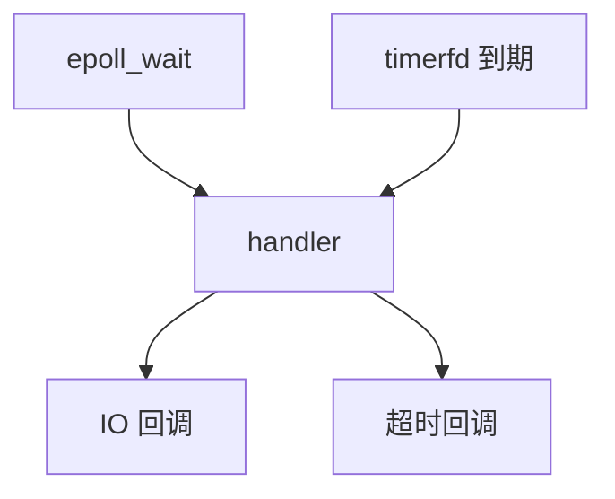

# 定时器与时间轮延时队列设计

> **文件编码**：UTF-8。  
> **定位**：时间轮、timerfd、epoll 集成、延时任务、连接超时、C++ 实现骨架——与 [23 章 epoll Server](23-IO多路复用与高性能Server.md) 衔接的 **Reactor 定时子系统**  
> **交叉阅读**：[23 IO](23-IO多路复用与高性能Server.md) · [08 多线程](08-多线程与并发编程.md) · [11 Linux](11-Linux与系统编程入门.md) · [65 io_uring](65-io_uring与高性能IO选型面试.md)

---

## 本章与前后章的关系

| 上一章 | 本章 | 下一章 |
|--------|------|--------|
| [63 Raft](63-分布式一致性协议Raft与ZAB面试.md) | **本章** | [65 io_uring](65-io_uring与高性能IO选型面试.md) |


---

## §0 读前导读

### §0.1 用一句话弄懂本章

时间轮、timerfd、epoll 集成、延时任务、连接超时、C++ 实现骨架

### §0.2 你需要提前知道什么

| 前置 | 说明 |
|------|------|
| 基础 C++ | [01～09 语言基础](01-C++基础语法与数据类型.md) |
| Linux 系统编程 | [11 章](11-Linux与系统编程入门.md) |
| 多线程 | [08 章](08-多线程与并发编程.md) |

### §0.3 本章知识地图（☐→☑）

- ☐ 核心概念能 2 分钟口述
- ☐ 能画架构/时序图
- ☐ 能写 C++ 骨架代码
- ☐ 连环追问 ≥5 题不卡壳
- ☐ 闭卷自测 ≥8/10

### §0.4 建议节奏

| 阶段 | 时长 | 内容 |
|------|------|------|
| 首轮通读 | 4h | 全文 + 代码 |
| 二轮口述 | 2h | Q&A 录音 |
| 工程实验 | 3h | 本地 demo |
| 闭卷自测 | 1h | 文末清单 |

---


## §1 为什么需要定时器子系统

| 场景 | 超时/延时 | 不处理后果 |
|------|-----------|------------|
| TCP idle | 60s 无读写 | fd 泄漏 |
| HTTP 请求 | 30s | 占满 worker |
| 心跳 | 3s 无 pong | 僵尸连接 |
| 重试退避 | 1/2/4s | 打爆下游 |
| 限流窗口 | 1s 滑动 | 误杀/漏限 |

[23 章](23-IO多路复用与高性能Server.md) epoll 只处理 fd 事件；定时必须 **并入 Reactor** 或独立精度线程。




## §2 时间轮原理

> 关联：[13 算法](13-算法与数据结构C++实现.md)

| 编号 | 面试问题 | 标准答法（口述版） | 追问/坑点 |
|------|----------|-------------------|-----------|
| Q1 | 时间轮是什么？ | 槽数组+链表，tick 推进，O(1) 插入 | 精度=tick |
| Q2 | 单层 vs 多层？ | 单层短延时；多层日/时/分/秒 | Kafka/Netty |
| Q3 | vs 最小堆？ | 堆 O(logN) 取 min；轮 O(1) 精度受限 | libevent heap |
| Q4 | tick 驱动方式？ | timerfd+epoll 或 epoll_wait 前算 next | busy 浪费 CPU |
| Q5 | 取消任务？ | 标记删除或摘链；惰性清理 | id 复用 |
| Q6 | 连接超时绑定？ | Conn 持 TimerId；close cancel | fd 复用误触发 |
| Q7 | 延时队列？ | 线程安全队列+最近 deadline | 与线程池区分 |
| Q8 | 1ms 精度？ | 1ms tick 或 hierarchical | CPU trade-off |
| Q9 | 海量定时器内存？ | 节点池化+对象池 | [24 分配器](24-内存分配器与对象池.md) |
| Q10 | Redis 过期类比？ | 渐进 rehash+时间结构 | 面试加分 |

### §2.1 单层时间轮

```
tick → [0][1]...[N-1]  每槽链表 TimerNode{expire, cb, id}
```

### §2.2 多层降级

L2(65s) → L1(256ms) → L0(1ms) 到期才真正 fire。


## §3 timerfd 与 epoll

> 关联：[23 epoll](23-IO多路复用与高性能Server.md)

| 编号 | 面试问题 | 标准答法（口述版） | 追问/坑点 |
|------|----------|-------------------|-----------|
| Q1 | timerfd 是什么？ | 可读 fd，到期 read 返回次数 | TFD_NONBLOCK |
| Q2 | create 参数？ | CLOCK_MONOTONIC；CLOEXEC | REALTIME 跳变 |
| Q3 | settime？ | itimerspec 一次/周期 | 首次与间隔 |
| Q4 | epoll 集成？ | create→settime→epoll_ctl→可读 dispatch | LT 读空 |
| Q5 | 为何读循环？ | 积压多次 tick；读到 EAGAIN | ET 漏读 |
| Q6 | 多粒度？ | min(deadline) 单 fd 或多 fd | fd 数 |
| Q7 | vs signalfd？ | 纯定时 vs 信号 | SIGALRM 不推荐 |
| Q8 | 精度极限？ | HZ+调度+epoll timeout | CFS |
| Q9 | C++ 封装？ | RAII；weak_ptr 防悬空 | 析构 cancel |
| Q10 | Windows？ | WaitableTimer/Asio deadline | [26 Asio](26-Boost.Asio异步网络编程.md) |

### TimerManager 骨架

```cpp
#include <sys/timerfd.h>
#include <sys/epoll.h>
#include <functional>
#include <unordered_map>

class TimerManager {
public:
    using Callback = std::function<void()>;
    using TimerId = uint64_t;
    explicit TimerManager(int epfd);
    TimerId add(uint64_t ms, Callback cb, bool repeat=false);
    void cancel(TimerId id);
    void onReadable();  // epoll 回调
private:
    int epfd_, tfd_;
    TimerId next_{0};
    struct Entry { uint64_t ms; bool repeat; Callback cb; };
    std::unordered_map<TimerId, Entry> timers_;
    void reschedule();   // min deadline → timerfd_settime
    void dispatchExpired();
};
```


## §4 连接超时

| 编号 | 面试问题 | 标准答法（口述版） | 追问/坑点 |
|------|----------|-------------------|-----------|
| Q1 | 超时放哪层？ | accept 后 idle；读写 reset | 只读不写续期？ |
| Q2 | 半开检测？ | TCP keepalive 或应用 ping | 默认 2h |
| Q3 | close 顺序？ | epoll DEL→shutdown→close→cancel | ET 重复 |
| Q4 | TIME_WAIT？ | 主动 close 方 | reuseaddr |
| Q5 | 超时风暴？ | deferred close 限流 | 惊群 |
| Q6 | keep-alive？ | 解析 Connection | pipeline |
| Q7 | WebSocket？ | ping/pong+定时器 | 丢 pong |
| Q8 | 与限流？ | 超时优先释放坑位 | 408 vs 503 |
| Q9 | 监控？ | timeout_close_total | [32 日志](32-fmt-spdlog与可观测性工程.md) |
| Q10 | 压测？ | wrk hold idle | [58 模拟](58-模拟面试完整流程与压测数据模板.md) |

### 面试话术：idle 超时

**STAR**：
- **S**：23 章 epoll echo
- **T**：60s idle 断开
- **A**：Conn+TimerId+timerfd
- **R**：10k 连接无泄漏

**连环追问**：瓶颈在哪？如何降级？如何监控？与 epoll 如何配合？线上如何验证？


## §5 延时任务队列

| 结构 | 插入 | 取 min | 场景 |
|------|------|--------|------|
| priority_queue | O(logN) | O(logN) | 中等量 |
| 时间轮 | O(1) | O(1) tick | 大量短延时 |
| 跳表 | O(logN) | O(logN) | ZSET 风格 |

**线程模型**：①单 Reactor ②定时线程 push IO ③定时线程 submit 池（注意亲和）。


## §5 延时队列 Q&A

| 编号 | 面试问题 | 标准答法（口述版） | 追问/坑点 |
|------|----------|-------------------|-----------|
| Q1 | 队列 vs 定时器？ | 业务任务 vs 连接生命周期 | 可统一底层 |
| Q2 | 取消语义？ | at-most-once | 已入队 |
| Q3 | 持久化？ | DB 扫描+本地 wheel | 时钟回拨 |
| Q4 | 分布式？ | MQ 延迟/Redis ZSET | [57 Kafka](57-消息队列Kafka与中间件面试专题.md) |
| Q5 | 背压？ | 满则拒/降级 | [67 日志](67-日志采集与高吞吐写入系统设计.md) |
| Q6 | 协程？ | co_await sleep 需 executor | [31 协程](31-协程C++20-coroutine.md) |
| Q7 | 单测？ | mock clock | flaky |
| Q8 | 基准？ | 100w insert/cancel | cache miss |
| Q9 | 常见 bug？ | 回调里再 add 同 id | 重入 |
| Q10 | nginx？ | rbtree timeout 驱动 wait | 业界 |

## §6 与 23 章 epoll Server 集成

1. `Connection` 增 `TimerId idle_timer_`
2. IO 事件 `reset(idle_timer_)`
3. `epoll_wait` 识别 timerfd magic
4. `handleClose` 必须 `cancel`
5. 压测验证 fd 回落


### Connection 片段

```cpp
struct Connection {
    int fd;
    TimerManager::TimerId idle_timer{0};
};
void EpollServer::onNewConn(int fd) {
    c.idle_timer = timers_.add(idle_ms_, [this,fd](){ closeConn(fd,"idle"); });
}
void EpollServer::onIo(int fd) {
    timers_.reset(c.idle_timer, idle_ms_);
}
```


## §7 生产踩坑与面试变体（组 1）

| 编号 | 面试问题 | 标准答法（口述版） | 追问/坑点 |
|------|----------|-------------------|-----------|
| Q1 | 定时器变体0：精度不足？ | 减小 tick / 多层 wheel | coalesce |
| Q2 | 变体1：close 后触发？ | generation / weak_ptr | ABA |
| Q3 | 变体2：epoll_wait 阻塞？ | min(io,timer) | timeout 0 |
| Q4 | 变体3：多 Reactor？ | 每线程 wheel | 跨线程 cancel |
| Q5 | 变体4：回调阻塞？ | 丢线程池 | IO 线程 |
| Q6 | 变体5：内存估？ | N*(node+cb) | 池化 |
| Q7 | 变体6：与 Asio？ | deadline_timer | [26章](26-Boost.Asio异步网络编程.md) |
| Q8 | 变体7：libevent？ | min-heap | 对比 |
| Q9 | 变体8：Go runtime？ | 四层堆 | 跨语言 |
| Q10 | 变体9：LLM SSE？ | 首 token 超时 | GPU 排队 |

## §8 生产踩坑与面试变体（组 2）

| 编号 | 面试问题 | 标准答法（口述版） | 追问/坑点 |
|------|----------|-------------------|-----------|
| Q1 | 定时器变体10：精度不足？ | 减小 tick / 多层 wheel | coalesce |
| Q2 | 变体11：close 后触发？ | generation / weak_ptr | ABA |
| Q3 | 变体12：epoll_wait 阻塞？ | min(io,timer) | timeout 0 |
| Q4 | 变体13：多 Reactor？ | 每线程 wheel | 跨线程 cancel |
| Q5 | 变体14：回调阻塞？ | 丢线程池 | IO 线程 |
| Q6 | 变体15：内存估？ | N*(node+cb) | 池化 |
| Q7 | 变体16：与 Asio？ | deadline_timer | [26章](26-Boost.Asio异步网络编程.md) |
| Q8 | 变体17：libevent？ | min-heap | 对比 |
| Q9 | 变体18：Go runtime？ | 四层堆 | 跨语言 |
| Q10 | 变体19：LLM SSE？ | 首 token 超时 | GPU 排队 |

## §9 生产踩坑与面试变体（组 3）

| 编号 | 面试问题 | 标准答法（口述版） | 追问/坑点 |
|------|----------|-------------------|-----------|
| Q1 | 定时器变体20：精度不足？ | 减小 tick / 多层 wheel | coalesce |
| Q2 | 变体21：close 后触发？ | generation / weak_ptr | ABA |
| Q3 | 变体22：epoll_wait 阻塞？ | min(io,timer) | timeout 0 |
| Q4 | 变体23：多 Reactor？ | 每线程 wheel | 跨线程 cancel |
| Q5 | 变体24：回调阻塞？ | 丢线程池 | IO 线程 |
| Q6 | 变体25：内存估？ | N*(node+cb) | 池化 |
| Q7 | 变体26：与 Asio？ | deadline_timer | [26章](26-Boost.Asio异步网络编程.md) |
| Q8 | 变体27：libevent？ | min-heap | 对比 |
| Q9 | 变体28：Go runtime？ | 四层堆 | 跨语言 |
| Q10 | 变体29：LLM SSE？ | 首 token 超时 | GPU 排队 |

## §10 生产踩坑与面试变体（组 4）

| 编号 | 面试问题 | 标准答法（口述版） | 追问/坑点 |
|------|----------|-------------------|-----------|
| Q1 | 定时器变体30：精度不足？ | 减小 tick / 多层 wheel | coalesce |
| Q2 | 变体31：close 后触发？ | generation / weak_ptr | ABA |
| Q3 | 变体32：epoll_wait 阻塞？ | min(io,timer) | timeout 0 |
| Q4 | 变体33：多 Reactor？ | 每线程 wheel | 跨线程 cancel |
| Q5 | 变体34：回调阻塞？ | 丢线程池 | IO 线程 |
| Q6 | 变体35：内存估？ | N*(node+cb) | 池化 |
| Q7 | 变体36：与 Asio？ | deadline_timer | [26章](26-Boost.Asio异步网络编程.md) |
| Q8 | 变体37：libevent？ | min-heap | 对比 |
| Q9 | 变体38：Go runtime？ | 四层堆 | 跨语言 |
| Q10 | 变体39：LLM SSE？ | 首 token 超时 | GPU 排队 |

## §11 生产踩坑与面试变体（组 5）

| 编号 | 面试问题 | 标准答法（口述版） | 追问/坑点 |
|------|----------|-------------------|-----------|
| Q1 | 定时器变体40：精度不足？ | 减小 tick / 多层 wheel | coalesce |
| Q2 | 变体41：close 后触发？ | generation / weak_ptr | ABA |
| Q3 | 变体42：epoll_wait 阻塞？ | min(io,timer) | timeout 0 |
| Q4 | 变体43：多 Reactor？ | 每线程 wheel | 跨线程 cancel |
| Q5 | 变体44：回调阻塞？ | 丢线程池 | IO 线程 |
| Q6 | 变体45：内存估？ | N*(node+cb) | 池化 |
| Q7 | 变体46：与 Asio？ | deadline_timer | [26章](26-Boost.Asio异步网络编程.md) |
| Q8 | 变体47：libevent？ | min-heap | 对比 |
| Q9 | 变体48：Go runtime？ | 四层堆 | 跨语言 |
| Q10 | 变体49：LLM SSE？ | 首 token 超时 | GPU 排队 |

## §12 生产踩坑与面试变体（组 6）

| 编号 | 面试问题 | 标准答法（口述版） | 追问/坑点 |
|------|----------|-------------------|-----------|
| Q1 | 定时器变体50：精度不足？ | 减小 tick / 多层 wheel | coalesce |
| Q2 | 变体51：close 后触发？ | generation / weak_ptr | ABA |
| Q3 | 变体52：epoll_wait 阻塞？ | min(io,timer) | timeout 0 |
| Q4 | 变体53：多 Reactor？ | 每线程 wheel | 跨线程 cancel |
| Q5 | 变体54：回调阻塞？ | 丢线程池 | IO 线程 |
| Q6 | 变体55：内存估？ | N*(node+cb) | 池化 |
| Q7 | 变体56：与 Asio？ | deadline_timer | [26章](26-Boost.Asio异步网络编程.md) |
| Q8 | 变体57：libevent？ | min-heap | 对比 |
| Q9 | 变体58：Go runtime？ | 四层堆 | 跨语言 |
| Q10 | 变体59：LLM SSE？ | 首 token 超时 | GPU 排队 |

## §13 闭卷自测

1. 时间轮插入复杂度？ 2. timerfd 为何 nonblock+读空？ 3. idle vs keepalive？
4. ET 下 timer 漏处理？ 5. 多层降级？ 6. 取消时已在线程池？
7. 100w 连接内存？ 8. epoll_wait timeout 与 timerfd？ 9. MONOTONIC？
10. 画 23+Timer 时序图。

---

## §14 下一章

[65 io_uring 与高性能 IO 选型](65-io_uring与高性能IO选型面试.md)

---

## §A1 附录专题 1

| 类别 | 要点 |
|------|------|
| 代码审查 | timerfd 必须 nonblocking 且 read 至 EAGAIN |
| 代码审查 | Connection 关闭前 epoll_ctl DEL + cancel timer |
| 代码审查 | 回调内禁止阻塞 IO 线程 |
| 压测 | wrk -t4 -c10000 -d30s 测 idle 回收 |
| 监控 | metrics: active_conn, timeout_close_total |

### 口述 30 秒

「timerfd 并入 epoll，Conn 绑 TimerId，读写续期，到期 close；短任务用时间轮 O(1)。」

### 连环追问

1. epoll_wait 阻塞 30s 时定时精度？——min(timeout, next_timer)
2. epoll_wait 阻塞 30s 时定时精度？——min(timeout, next_timer)
3. epoll_wait 阻塞 30s 时定时精度？——min(timeout, next_timer)
4. epoll_wait 阻塞 30s 时定时精度？——min(timeout, next_timer)
5. epoll_wait 阻塞 30s 时定时精度？——min(timeout, next_timer)

## §A2 附录专题 2

| 类别 | 要点 |
|------|------|
| 调试 | strace -e epoll_wait,timerfd_settime |
| 对比 | nginx rbtree 最近 timeout |
| 对比 | Netty HashedWheelTimer |
| 对比 | libevent evtimer min-heap |
| 面试 | 为何不用 sleep？阻塞 IO 线程 |

### 口述 30 秒

「timerfd 并入 epoll，Conn 绑 TimerId，读写续期，到期 close；短任务用时间轮 O(1)。」

### 连环追问

1. epoll_wait 阻塞 30s 时定时精度？——min(timeout, next_timer)
2. epoll_wait 阻塞 30s 时定时精度？——min(timeout, next_timer)
3. epoll_wait 阻塞 30s 时定时精度？——min(timeout, next_timer)
4. epoll_wait 阻塞 30s 时定时精度？——min(timeout, next_timer)
5. epoll_wait 阻塞 30s 时定时精度？——min(timeout, next_timer)

## §A3 附录专题 3

| 类别 | 要点 |
|------|------|
| 面试 | 100w 定时器内存估算法 |
| 面试 | 分布式延时 MQ/Redis ZSET |
| 与23章 | accept 后立即 add idle timer |
| 与23章 | ET 模式 read 读空再 reset |
| 与65章 | uring OP_POLL_ADD timerfd |

### 口述 30 秒

「timerfd 并入 epoll，Conn 绑 TimerId，读写续期，到期 close；短任务用时间轮 O(1)。」

### 连环追问

1. epoll_wait 阻塞 30s 时定时精度？——min(timeout, next_timer)
2. epoll_wait 阻塞 30s 时定时精度？——min(timeout, next_timer)
3. epoll_wait 阻塞 30s 时定时精度？——min(timeout, next_timer)
4. epoll_wait 阻塞 30s 时定时精度？——min(timeout, next_timer)
5. epoll_wait 阻塞 30s 时定时精度？——min(timeout, next_timer)

## §A4 附录专题 4

| 类别 | 要点 |
|------|------|
| 与67章 | 超时 close 结构化日志 |
| 实现 | TimerId generation 防 ABA |
| 实现 | reschedule min(deadline) |
| 实现 | repeat 定时器重新入队 |
| 实现 | 优雅退出 cancel all |

### 口述 30 秒

「timerfd 并入 epoll，Conn 绑 TimerId，读写续期，到期 close；短任务用时间轮 O(1)。」

### 连环追问

1. epoll_wait 阻塞 30s 时定时精度？——min(timeout, next_timer)
2. epoll_wait 阻塞 30s 时定时精度？——min(timeout, next_timer)
3. epoll_wait 阻塞 30s 时定时精度？——min(timeout, next_timer)
4. epoll_wait 阻塞 30s 时定时精度？——min(timeout, next_timer)
5. epoll_wait 阻塞 30s 时定时精度？——min(timeout, next_timer)

## §A5 附录专题 5

| 类别 | 要点 |
|------|------|
| 代码审查 | timerfd 必须 nonblocking 且 read 至 EAGAIN |
| 代码审查 | Connection 关闭前 epoll_ctl DEL + cancel timer |
| 代码审查 | 回调内禁止阻塞 IO 线程 |
| 压测 | wrk -t4 -c10000 -d30s 测 idle 回收 |
| 监控 | metrics: active_conn, timeout_close_total |

### 口述 30 秒

「timerfd 并入 epoll，Conn 绑 TimerId，读写续期，到期 close；短任务用时间轮 O(1)。」

### 连环追问

1. epoll_wait 阻塞 30s 时定时精度？——min(timeout, next_timer)
2. epoll_wait 阻塞 30s 时定时精度？——min(timeout, next_timer)
3. epoll_wait 阻塞 30s 时定时精度？——min(timeout, next_timer)
4. epoll_wait 阻塞 30s 时定时精度？——min(timeout, next_timer)
5. epoll_wait 阻塞 30s 时定时精度？——min(timeout, next_timer)

## §A6 附录专题 6

| 类别 | 要点 |
|------|------|
| 调试 | strace -e epoll_wait,timerfd_settime |
| 对比 | nginx rbtree 最近 timeout |
| 对比 | Netty HashedWheelTimer |
| 对比 | libevent evtimer min-heap |
| 面试 | 为何不用 sleep？阻塞 IO 线程 |

### 口述 30 秒

「timerfd 并入 epoll，Conn 绑 TimerId，读写续期，到期 close；短任务用时间轮 O(1)。」

### 连环追问

1. epoll_wait 阻塞 30s 时定时精度？——min(timeout, next_timer)
2. epoll_wait 阻塞 30s 时定时精度？——min(timeout, next_timer)
3. epoll_wait 阻塞 30s 时定时精度？——min(timeout, next_timer)
4. epoll_wait 阻塞 30s 时定时精度？——min(timeout, next_timer)
5. epoll_wait 阻塞 30s 时定时精度？——min(timeout, next_timer)

## §A7 附录专题 7

| 类别 | 要点 |
|------|------|
| 面试 | 100w 定时器内存估算法 |
| 面试 | 分布式延时 MQ/Redis ZSET |
| 与23章 | accept 后立即 add idle timer |
| 与23章 | ET 模式 read 读空再 reset |
| 与65章 | uring OP_POLL_ADD timerfd |

### 口述 30 秒

「timerfd 并入 epoll，Conn 绑 TimerId，读写续期，到期 close；短任务用时间轮 O(1)。」

### 连环追问

1. epoll_wait 阻塞 30s 时定时精度？——min(timeout, next_timer)
2. epoll_wait 阻塞 30s 时定时精度？——min(timeout, next_timer)
3. epoll_wait 阻塞 30s 时定时精度？——min(timeout, next_timer)
4. epoll_wait 阻塞 30s 时定时精度？——min(timeout, next_timer)
5. epoll_wait 阻塞 30s 时定时精度？——min(timeout, next_timer)

## §A8 附录专题 8

| 类别 | 要点 |
|------|------|
| 与67章 | 超时 close 结构化日志 |
| 实现 | TimerId generation 防 ABA |
| 实现 | reschedule min(deadline) |
| 实现 | repeat 定时器重新入队 |
| 实现 | 优雅退出 cancel all |

### 口述 30 秒

「timerfd 并入 epoll，Conn 绑 TimerId，读写续期，到期 close；短任务用时间轮 O(1)。」

### 连环追问

1. epoll_wait 阻塞 30s 时定时精度？——min(timeout, next_timer)
2. epoll_wait 阻塞 30s 时定时精度？——min(timeout, next_timer)
3. epoll_wait 阻塞 30s 时定时精度？——min(timeout, next_timer)
4. epoll_wait 阻塞 30s 时定时精度？——min(timeout, next_timer)
5. epoll_wait 阻塞 30s 时定时精度？——min(timeout, next_timer)

## §A9 附录专题 9

| 类别 | 要点 |
|------|------|
| 代码审查 | timerfd 必须 nonblocking 且 read 至 EAGAIN |
| 代码审查 | Connection 关闭前 epoll_ctl DEL + cancel timer |
| 代码审查 | 回调内禁止阻塞 IO 线程 |
| 压测 | wrk -t4 -c10000 -d30s 测 idle 回收 |
| 监控 | metrics: active_conn, timeout_close_total |

### 口述 30 秒

「timerfd 并入 epoll，Conn 绑 TimerId，读写续期，到期 close；短任务用时间轮 O(1)。」

### 连环追问

1. epoll_wait 阻塞 30s 时定时精度？——min(timeout, next_timer)
2. epoll_wait 阻塞 30s 时定时精度？——min(timeout, next_timer)
3. epoll_wait 阻塞 30s 时定时精度？——min(timeout, next_timer)
4. epoll_wait 阻塞 30s 时定时精度？——min(timeout, next_timer)
5. epoll_wait 阻塞 30s 时定时精度？——min(timeout, next_timer)

## §A10 附录专题 10

| 类别 | 要点 |
|------|------|
| 调试 | strace -e epoll_wait,timerfd_settime |
| 对比 | nginx rbtree 最近 timeout |
| 对比 | Netty HashedWheelTimer |
| 对比 | libevent evtimer min-heap |
| 面试 | 为何不用 sleep？阻塞 IO 线程 |

### 口述 30 秒

「timerfd 并入 epoll，Conn 绑 TimerId，读写续期，到期 close；短任务用时间轮 O(1)。」

### 连环追问

1. epoll_wait 阻塞 30s 时定时精度？——min(timeout, next_timer)
2. epoll_wait 阻塞 30s 时定时精度？——min(timeout, next_timer)
3. epoll_wait 阻塞 30s 时定时精度？——min(timeout, next_timer)
4. epoll_wait 阻塞 30s 时定时精度？——min(timeout, next_timer)
5. epoll_wait 阻塞 30s 时定时精度？——min(timeout, next_timer)

## §A11 附录专题 11

| 类别 | 要点 |
|------|------|
| 面试 | 100w 定时器内存估算法 |
| 面试 | 分布式延时 MQ/Redis ZSET |
| 与23章 | accept 后立即 add idle timer |
| 与23章 | ET 模式 read 读空再 reset |
| 与65章 | uring OP_POLL_ADD timerfd |

### 口述 30 秒

「timerfd 并入 epoll，Conn 绑 TimerId，读写续期，到期 close；短任务用时间轮 O(1)。」

### 连环追问

1. epoll_wait 阻塞 30s 时定时精度？——min(timeout, next_timer)
2. epoll_wait 阻塞 30s 时定时精度？——min(timeout, next_timer)
3. epoll_wait 阻塞 30s 时定时精度？——min(timeout, next_timer)
4. epoll_wait 阻塞 30s 时定时精度？——min(timeout, next_timer)
5. epoll_wait 阻塞 30s 时定时精度？——min(timeout, next_timer)

## §A12 附录专题 12

| 类别 | 要点 |
|------|------|
| 与67章 | 超时 close 结构化日志 |
| 实现 | TimerId generation 防 ABA |
| 实现 | reschedule min(deadline) |
| 实现 | repeat 定时器重新入队 |
| 实现 | 优雅退出 cancel all |

### 口述 30 秒

「timerfd 并入 epoll，Conn 绑 TimerId，读写续期，到期 close；短任务用时间轮 O(1)。」

### 连环追问

1. epoll_wait 阻塞 30s 时定时精度？——min(timeout, next_timer)
2. epoll_wait 阻塞 30s 时定时精度？——min(timeout, next_timer)
3. epoll_wait 阻塞 30s 时定时精度？——min(timeout, next_timer)
4. epoll_wait 阻塞 30s 时定时精度？——min(timeout, next_timer)
5. epoll_wait 阻塞 30s 时定时精度？——min(timeout, next_timer)

## §A13 附录专题 13

| 类别 | 要点 |
|------|------|
| 代码审查 | timerfd 必须 nonblocking 且 read 至 EAGAIN |
| 代码审查 | Connection 关闭前 epoll_ctl DEL + cancel timer |
| 代码审查 | 回调内禁止阻塞 IO 线程 |
| 压测 | wrk -t4 -c10000 -d30s 测 idle 回收 |
| 监控 | metrics: active_conn, timeout_close_total |

### 口述 30 秒

「timerfd 并入 epoll，Conn 绑 TimerId，读写续期，到期 close；短任务用时间轮 O(1)。」

### 连环追问

1. epoll_wait 阻塞 30s 时定时精度？——min(timeout, next_timer)
2. epoll_wait 阻塞 30s 时定时精度？——min(timeout, next_timer)
3. epoll_wait 阻塞 30s 时定时精度？——min(timeout, next_timer)
4. epoll_wait 阻塞 30s 时定时精度？——min(timeout, next_timer)
5. epoll_wait 阻塞 30s 时定时精度？——min(timeout, next_timer)

## §A14 附录专题 14

| 类别 | 要点 |
|------|------|
| 调试 | strace -e epoll_wait,timerfd_settime |
| 对比 | nginx rbtree 最近 timeout |
| 对比 | Netty HashedWheelTimer |
| 对比 | libevent evtimer min-heap |
| 面试 | 为何不用 sleep？阻塞 IO 线程 |

### 口述 30 秒

「timerfd 并入 epoll，Conn 绑 TimerId，读写续期，到期 close；短任务用时间轮 O(1)。」

### 连环追问

1. epoll_wait 阻塞 30s 时定时精度？——min(timeout, next_timer)
2. epoll_wait 阻塞 30s 时定时精度？——min(timeout, next_timer)
3. epoll_wait 阻塞 30s 时定时精度？——min(timeout, next_timer)
4. epoll_wait 阻塞 30s 时定时精度？——min(timeout, next_timer)
5. epoll_wait 阻塞 30s 时定时精度？——min(timeout, next_timer)

## §A15 附录专题 15

| 类别 | 要点 |
|------|------|
| 面试 | 100w 定时器内存估算法 |
| 面试 | 分布式延时 MQ/Redis ZSET |
| 与23章 | accept 后立即 add idle timer |
| 与23章 | ET 模式 read 读空再 reset |
| 与65章 | uring OP_POLL_ADD timerfd |

### 口述 30 秒

「timerfd 并入 epoll，Conn 绑 TimerId，读写续期，到期 close；短任务用时间轮 O(1)。」

### 连环追问

1. epoll_wait 阻塞 30s 时定时精度？——min(timeout, next_timer)
2. epoll_wait 阻塞 30s 时定时精度？——min(timeout, next_timer)
3. epoll_wait 阻塞 30s 时定时精度？——min(timeout, next_timer)
4. epoll_wait 阻塞 30s 时定时精度？——min(timeout, next_timer)
5. epoll_wait 阻塞 30s 时定时精度？——min(timeout, next_timer)

## §A16 附录专题 16

| 类别 | 要点 |
|------|------|
| 与67章 | 超时 close 结构化日志 |
| 实现 | TimerId generation 防 ABA |
| 实现 | reschedule min(deadline) |
| 实现 | repeat 定时器重新入队 |
| 实现 | 优雅退出 cancel all |

### 口述 30 秒

「timerfd 并入 epoll，Conn 绑 TimerId，读写续期，到期 close；短任务用时间轮 O(1)。」

### 连环追问

1. epoll_wait 阻塞 30s 时定时精度？——min(timeout, next_timer)
2. epoll_wait 阻塞 30s 时定时精度？——min(timeout, next_timer)
3. epoll_wait 阻塞 30s 时定时精度？——min(timeout, next_timer)
4. epoll_wait 阻塞 30s 时定时精度？——min(timeout, next_timer)
5. epoll_wait 阻塞 30s 时定时精度？——min(timeout, next_timer)

## §A17 附录专题 17

| 类别 | 要点 |
|------|------|
| 代码审查 | timerfd 必须 nonblocking 且 read 至 EAGAIN |
| 代码审查 | Connection 关闭前 epoll_ctl DEL + cancel timer |
| 代码审查 | 回调内禁止阻塞 IO 线程 |
| 压测 | wrk -t4 -c10000 -d30s 测 idle 回收 |
| 监控 | metrics: active_conn, timeout_close_total |

### 口述 30 秒

「timerfd 并入 epoll，Conn 绑 TimerId，读写续期，到期 close；短任务用时间轮 O(1)。」

### 连环追问

1. epoll_wait 阻塞 30s 时定时精度？——min(timeout, next_timer)
2. epoll_wait 阻塞 30s 时定时精度？——min(timeout, next_timer)
3. epoll_wait 阻塞 30s 时定时精度？——min(timeout, next_timer)
4. epoll_wait 阻塞 30s 时定时精度？——min(timeout, next_timer)
5. epoll_wait 阻塞 30s 时定时精度？——min(timeout, next_timer)

## §A18 附录专题 18

| 类别 | 要点 |
|------|------|
| 调试 | strace -e epoll_wait,timerfd_settime |
| 对比 | nginx rbtree 最近 timeout |
| 对比 | Netty HashedWheelTimer |
| 对比 | libevent evtimer min-heap |
| 面试 | 为何不用 sleep？阻塞 IO 线程 |

### 口述 30 秒

「timerfd 并入 epoll，Conn 绑 TimerId，读写续期，到期 close；短任务用时间轮 O(1)。」

### 连环追问

1. epoll_wait 阻塞 30s 时定时精度？——min(timeout, next_timer)
2. epoll_wait 阻塞 30s 时定时精度？——min(timeout, next_timer)
3. epoll_wait 阻塞 30s 时定时精度？——min(timeout, next_timer)
4. epoll_wait 阻塞 30s 时定时精度？——min(timeout, next_timer)
5. epoll_wait 阻塞 30s 时定时精度？——min(timeout, next_timer)

## §A19 附录专题 19

| 类别 | 要点 |
|------|------|
| 面试 | 100w 定时器内存估算法 |
| 面试 | 分布式延时 MQ/Redis ZSET |
| 与23章 | accept 后立即 add idle timer |
| 与23章 | ET 模式 read 读空再 reset |
| 与65章 | uring OP_POLL_ADD timerfd |

### 口述 30 秒

「timerfd 并入 epoll，Conn 绑 TimerId，读写续期，到期 close；短任务用时间轮 O(1)。」

### 连环追问

1. epoll_wait 阻塞 30s 时定时精度？——min(timeout, next_timer)
2. epoll_wait 阻塞 30s 时定时精度？——min(timeout, next_timer)
3. epoll_wait 阻塞 30s 时定时精度？——min(timeout, next_timer)
4. epoll_wait 阻塞 30s 时定时精度？——min(timeout, next_timer)
5. epoll_wait 阻塞 30s 时定时精度？——min(timeout, next_timer)

## §A20 附录专题 20

| 类别 | 要点 |
|------|------|
| 与67章 | 超时 close 结构化日志 |
| 实现 | TimerId generation 防 ABA |
| 实现 | reschedule min(deadline) |
| 实现 | repeat 定时器重新入队 |
| 实现 | 优雅退出 cancel all |

### 口述 30 秒

「timerfd 并入 epoll，Conn 绑 TimerId，读写续期，到期 close；短任务用时间轮 O(1)。」

### 连环追问

1. epoll_wait 阻塞 30s 时定时精度？——min(timeout, next_timer)
2. epoll_wait 阻塞 30s 时定时精度？——min(timeout, next_timer)
3. epoll_wait 阻塞 30s 时定时精度？——min(timeout, next_timer)
4. epoll_wait 阻塞 30s 时定时精度？——min(timeout, next_timer)
5. epoll_wait 阻塞 30s 时定时精度？——min(timeout, next_timer)

## §A21 附录专题 21

| 类别 | 要点 |
|------|------|
| 代码审查 | timerfd 必须 nonblocking 且 read 至 EAGAIN |
| 代码审查 | Connection 关闭前 epoll_ctl DEL + cancel timer |
| 代码审查 | 回调内禁止阻塞 IO 线程 |
| 压测 | wrk -t4 -c10000 -d30s 测 idle 回收 |
| 监控 | metrics: active_conn, timeout_close_total |

### 口述 30 秒

「timerfd 并入 epoll，Conn 绑 TimerId，读写续期，到期 close；短任务用时间轮 O(1)。」

### 连环追问

1. epoll_wait 阻塞 30s 时定时精度？——min(timeout, next_timer)
2. epoll_wait 阻塞 30s 时定时精度？——min(timeout, next_timer)
3. epoll_wait 阻塞 30s 时定时精度？——min(timeout, next_timer)
4. epoll_wait 阻塞 30s 时定时精度？——min(timeout, next_timer)
5. epoll_wait 阻塞 30s 时定时精度？——min(timeout, next_timer)

## §A22 附录专题 22

| 类别 | 要点 |
|------|------|
| 调试 | strace -e epoll_wait,timerfd_settime |
| 对比 | nginx rbtree 最近 timeout |
| 对比 | Netty HashedWheelTimer |
| 对比 | libevent evtimer min-heap |
| 面试 | 为何不用 sleep？阻塞 IO 线程 |

### 口述 30 秒

「timerfd 并入 epoll，Conn 绑 TimerId，读写续期，到期 close；短任务用时间轮 O(1)。」

### 连环追问

1. epoll_wait 阻塞 30s 时定时精度？——min(timeout, next_timer)
2. epoll_wait 阻塞 30s 时定时精度？——min(timeout, next_timer)
3. epoll_wait 阻塞 30s 时定时精度？——min(timeout, next_timer)
4. epoll_wait 阻塞 30s 时定时精度？——min(timeout, next_timer)
5. epoll_wait 阻塞 30s 时定时精度？——min(timeout, next_timer)

## §A23 附录专题 23

| 类别 | 要点 |
|------|------|
| 面试 | 100w 定时器内存估算法 |
| 面试 | 分布式延时 MQ/Redis ZSET |
| 与23章 | accept 后立即 add idle timer |
| 与23章 | ET 模式 read 读空再 reset |
| 与65章 | uring OP_POLL_ADD timerfd |

### 口述 30 秒

「timerfd 并入 epoll，Conn 绑 TimerId，读写续期，到期 close；短任务用时间轮 O(1)。」

### 连环追问

1. epoll_wait 阻塞 30s 时定时精度？——min(timeout, next_timer)
2. epoll_wait 阻塞 30s 时定时精度？——min(timeout, next_timer)
3. epoll_wait 阻塞 30s 时定时精度？——min(timeout, next_timer)
4. epoll_wait 阻塞 30s 时定时精度？——min(timeout, next_timer)
5. epoll_wait 阻塞 30s 时定时精度？——min(timeout, next_timer)

## §A24 附录专题 24

| 类别 | 要点 |
|------|------|
| 与67章 | 超时 close 结构化日志 |
| 实现 | TimerId generation 防 ABA |
| 实现 | reschedule min(deadline) |
| 实现 | repeat 定时器重新入队 |
| 实现 | 优雅退出 cancel all |

### 口述 30 秒

「timerfd 并入 epoll，Conn 绑 TimerId，读写续期，到期 close；短任务用时间轮 O(1)。」

### 连环追问

1. epoll_wait 阻塞 30s 时定时精度？——min(timeout, next_timer)
2. epoll_wait 阻塞 30s 时定时精度？——min(timeout, next_timer)
3. epoll_wait 阻塞 30s 时定时精度？——min(timeout, next_timer)
4. epoll_wait 阻塞 30s 时定时精度？——min(timeout, next_timer)
5. epoll_wait 阻塞 30s 时定时精度？——min(timeout, next_timer)

## §A25 附录专题 25

| 类别 | 要点 |
|------|------|
| 代码审查 | timerfd 必须 nonblocking 且 read 至 EAGAIN |
| 代码审查 | Connection 关闭前 epoll_ctl DEL + cancel timer |
| 代码审查 | 回调内禁止阻塞 IO 线程 |
| 压测 | wrk -t4 -c10000 -d30s 测 idle 回收 |
| 监控 | metrics: active_conn, timeout_close_total |

### 口述 30 秒

「timerfd 并入 epoll，Conn 绑 TimerId，读写续期，到期 close；短任务用时间轮 O(1)。」

### 连环追问

1. epoll_wait 阻塞 30s 时定时精度？——min(timeout, next_timer)
2. epoll_wait 阻塞 30s 时定时精度？——min(timeout, next_timer)
3. epoll_wait 阻塞 30s 时定时精度？——min(timeout, next_timer)
4. epoll_wait 阻塞 30s 时定时精度？——min(timeout, next_timer)
5. epoll_wait 阻塞 30s 时定时精度？——min(timeout, next_timer)

## §A26 附录专题 26

| 类别 | 要点 |
|------|------|
| 调试 | strace -e epoll_wait,timerfd_settime |
| 对比 | nginx rbtree 最近 timeout |
| 对比 | Netty HashedWheelTimer |
| 对比 | libevent evtimer min-heap |
| 面试 | 为何不用 sleep？阻塞 IO 线程 |

### 口述 30 秒

「timerfd 并入 epoll，Conn 绑 TimerId，读写续期，到期 close；短任务用时间轮 O(1)。」

### 连环追问

1. epoll_wait 阻塞 30s 时定时精度？——min(timeout, next_timer)
2. epoll_wait 阻塞 30s 时定时精度？——min(timeout, next_timer)
3. epoll_wait 阻塞 30s 时定时精度？——min(timeout, next_timer)
4. epoll_wait 阻塞 30s 时定时精度？——min(timeout, next_timer)
5. epoll_wait 阻塞 30s 时定时精度？——min(timeout, next_timer)

## §A27 附录专题 27

| 类别 | 要点 |
|------|------|
| 面试 | 100w 定时器内存估算法 |
| 面试 | 分布式延时 MQ/Redis ZSET |
| 与23章 | accept 后立即 add idle timer |
| 与23章 | ET 模式 read 读空再 reset |
| 与65章 | uring OP_POLL_ADD timerfd |

### 口述 30 秒

「timerfd 并入 epoll，Conn 绑 TimerId，读写续期，到期 close；短任务用时间轮 O(1)。」

### 连环追问

1. epoll_wait 阻塞 30s 时定时精度？——min(timeout, next_timer)
2. epoll_wait 阻塞 30s 时定时精度？——min(timeout, next_timer)
3. epoll_wait 阻塞 30s 时定时精度？——min(timeout, next_timer)
4. epoll_wait 阻塞 30s 时定时精度？——min(timeout, next_timer)
5. epoll_wait 阻塞 30s 时定时精度？——min(timeout, next_timer)

## §A28 附录专题 28

| 类别 | 要点 |
|------|------|
| 与67章 | 超时 close 结构化日志 |
| 实现 | TimerId generation 防 ABA |
| 实现 | reschedule min(deadline) |
| 实现 | repeat 定时器重新入队 |
| 实现 | 优雅退出 cancel all |

### 口述 30 秒

「timerfd 并入 epoll，Conn 绑 TimerId，读写续期，到期 close；短任务用时间轮 O(1)。」

### 连环追问

1. epoll_wait 阻塞 30s 时定时精度？——min(timeout, next_timer)
2. epoll_wait 阻塞 30s 时定时精度？——min(timeout, next_timer)
3. epoll_wait 阻塞 30s 时定时精度？——min(timeout, next_timer)
4. epoll_wait 阻塞 30s 时定时精度？——min(timeout, next_timer)
5. epoll_wait 阻塞 30s 时定时精度？——min(timeout, next_timer)

## §A29 附录专题 29

| 类别 | 要点 |
|------|------|
| 代码审查 | timerfd 必须 nonblocking 且 read 至 EAGAIN |
| 代码审查 | Connection 关闭前 epoll_ctl DEL + cancel timer |
| 代码审查 | 回调内禁止阻塞 IO 线程 |
| 压测 | wrk -t4 -c10000 -d30s 测 idle 回收 |
| 监控 | metrics: active_conn, timeout_close_total |

### 口述 30 秒

「timerfd 并入 epoll，Conn 绑 TimerId，读写续期，到期 close；短任务用时间轮 O(1)。」

### 连环追问

1. epoll_wait 阻塞 30s 时定时精度？——min(timeout, next_timer)
2. epoll_wait 阻塞 30s 时定时精度？——min(timeout, next_timer)
3. epoll_wait 阻塞 30s 时定时精度？——min(timeout, next_timer)
4. epoll_wait 阻塞 30s 时定时精度？——min(timeout, next_timer)
5. epoll_wait 阻塞 30s 时定时精度？——min(timeout, next_timer)

## §A30 附录专题 30

| 类别 | 要点 |
|------|------|
| 调试 | strace -e epoll_wait,timerfd_settime |
| 对比 | nginx rbtree 最近 timeout |
| 对比 | Netty HashedWheelTimer |
| 对比 | libevent evtimer min-heap |
| 面试 | 为何不用 sleep？阻塞 IO 线程 |

### 口述 30 秒

「timerfd 并入 epoll，Conn 绑 TimerId，读写续期，到期 close；短任务用时间轮 O(1)。」

### 连环追问

1. epoll_wait 阻塞 30s 时定时精度？——min(timeout, next_timer)
2. epoll_wait 阻塞 30s 时定时精度？——min(timeout, next_timer)
3. epoll_wait 阻塞 30s 时定时精度？——min(timeout, next_timer)
4. epoll_wait 阻塞 30s 时定时精度？——min(timeout, next_timer)
5. epoll_wait 阻塞 30s 时定时精度？——min(timeout, next_timer)

## §A31 附录专题 31

| 类别 | 要点 |
|------|------|
| 面试 | 100w 定时器内存估算法 |
| 面试 | 分布式延时 MQ/Redis ZSET |
| 与23章 | accept 后立即 add idle timer |
| 与23章 | ET 模式 read 读空再 reset |
| 与65章 | uring OP_POLL_ADD timerfd |

### 口述 30 秒

「timerfd 并入 epoll，Conn 绑 TimerId，读写续期，到期 close；短任务用时间轮 O(1)。」

### 连环追问

1. epoll_wait 阻塞 30s 时定时精度？——min(timeout, next_timer)
2. epoll_wait 阻塞 30s 时定时精度？——min(timeout, next_timer)
3. epoll_wait 阻塞 30s 时定时精度？——min(timeout, next_timer)
4. epoll_wait 阻塞 30s 时定时精度？——min(timeout, next_timer)
5. epoll_wait 阻塞 30s 时定时精度？——min(timeout, next_timer)

## §A32 附录专题 32

| 类别 | 要点 |
|------|------|
| 与67章 | 超时 close 结构化日志 |
| 实现 | TimerId generation 防 ABA |
| 实现 | reschedule min(deadline) |
| 实现 | repeat 定时器重新入队 |
| 实现 | 优雅退出 cancel all |

### 口述 30 秒

「timerfd 并入 epoll，Conn 绑 TimerId，读写续期，到期 close；短任务用时间轮 O(1)。」

### 连环追问

1. epoll_wait 阻塞 30s 时定时精度？——min(timeout, next_timer)
2. epoll_wait 阻塞 30s 时定时精度？——min(timeout, next_timer)
3. epoll_wait 阻塞 30s 时定时精度？——min(timeout, next_timer)
4. epoll_wait 阻塞 30s 时定时精度？——min(timeout, next_timer)
5. epoll_wait 阻塞 30s 时定时精度？——min(timeout, next_timer)

## §A33 附录专题 33

| 类别 | 要点 |
|------|------|
| 代码审查 | timerfd 必须 nonblocking 且 read 至 EAGAIN |
| 代码审查 | Connection 关闭前 epoll_ctl DEL + cancel timer |
| 代码审查 | 回调内禁止阻塞 IO 线程 |
| 压测 | wrk -t4 -c10000 -d30s 测 idle 回收 |
| 监控 | metrics: active_conn, timeout_close_total |

### 口述 30 秒

「timerfd 并入 epoll，Conn 绑 TimerId，读写续期，到期 close；短任务用时间轮 O(1)。」

### 连环追问

1. epoll_wait 阻塞 30s 时定时精度？——min(timeout, next_timer)
2. epoll_wait 阻塞 30s 时定时精度？——min(timeout, next_timer)
3. epoll_wait 阻塞 30s 时定时精度？——min(timeout, next_timer)
4. epoll_wait 阻塞 30s 时定时精度？——min(timeout, next_timer)
5. epoll_wait 阻塞 30s 时定时精度？——min(timeout, next_timer)

## §A34 附录专题 34

| 类别 | 要点 |
|------|------|
| 调试 | strace -e epoll_wait,timerfd_settime |
| 对比 | nginx rbtree 最近 timeout |
| 对比 | Netty HashedWheelTimer |
| 对比 | libevent evtimer min-heap |
| 面试 | 为何不用 sleep？阻塞 IO 线程 |

### 口述 30 秒

「timerfd 并入 epoll，Conn 绑 TimerId，读写续期，到期 close；短任务用时间轮 O(1)。」

### 连环追问

1. epoll_wait 阻塞 30s 时定时精度？——min(timeout, next_timer)
2. epoll_wait 阻塞 30s 时定时精度？——min(timeout, next_timer)
3. epoll_wait 阻塞 30s 时定时精度？——min(timeout, next_timer)
4. epoll_wait 阻塞 30s 时定时精度？——min(timeout, next_timer)
5. epoll_wait 阻塞 30s 时定时精度？——min(timeout, next_timer)

## §A35 附录专题 35

| 类别 | 要点 |
|------|------|
| 面试 | 100w 定时器内存估算法 |
| 面试 | 分布式延时 MQ/Redis ZSET |
| 与23章 | accept 后立即 add idle timer |
| 与23章 | ET 模式 read 读空再 reset |
| 与65章 | uring OP_POLL_ADD timerfd |

### 口述 30 秒

「timerfd 并入 epoll，Conn 绑 TimerId，读写续期，到期 close；短任务用时间轮 O(1)。」

### 连环追问

1. epoll_wait 阻塞 30s 时定时精度？——min(timeout, next_timer)
2. epoll_wait 阻塞 30s 时定时精度？——min(timeout, next_timer)
3. epoll_wait 阻塞 30s 时定时精度？——min(timeout, next_timer)
4. epoll_wait 阻塞 30s 时定时精度？——min(timeout, next_timer)
5. epoll_wait 阻塞 30s 时定时精度？——min(timeout, next_timer)
