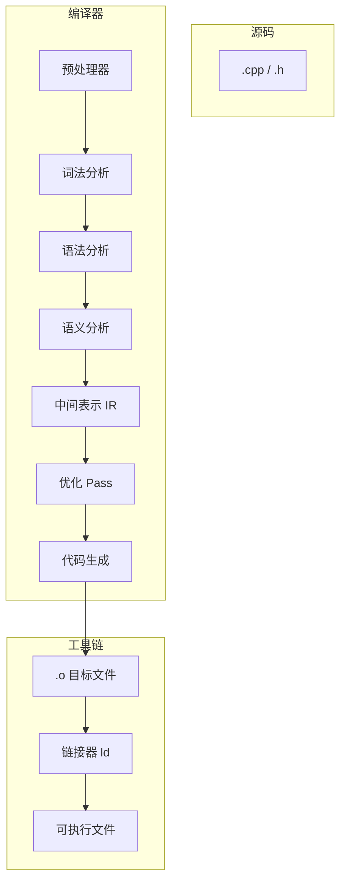
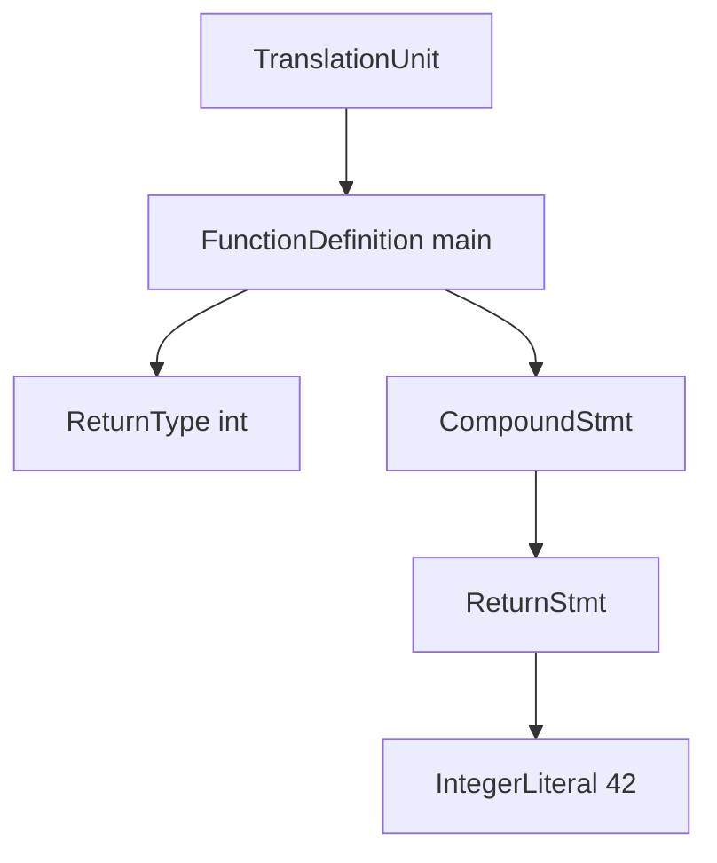
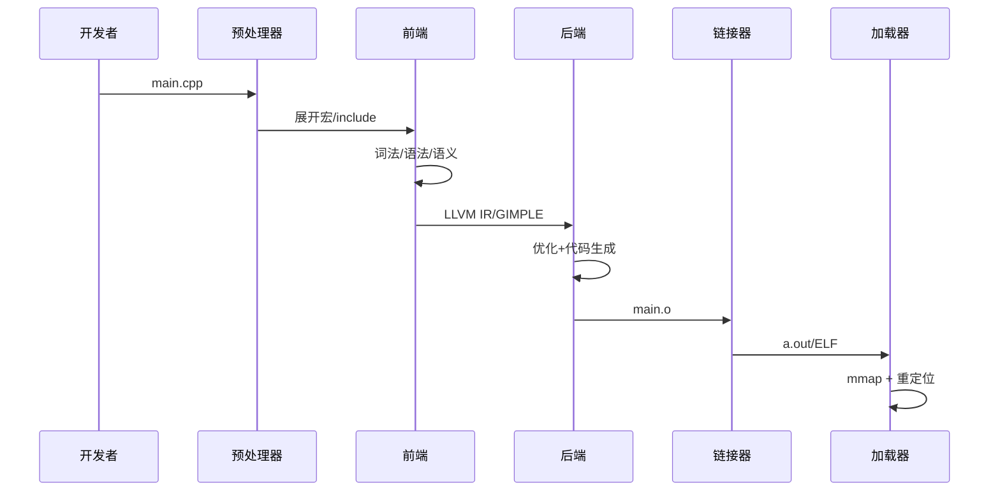

# 编译原理入门与 C++ 编译流程

> **文件编码**：UTF-8。  
> **定位**：从 **词法→语法→语义→优化→代码生成** 理解 `g++/clang++` 如何把 `.cpp` 变成机器码；与 [48 章](48-编译预处理与链接原理.md)（预处理/链接/ODR）**互补**——48 讲「工程链路」，本章讲「编译器内部原理」。  
> **标准**：示例默认 **C++17/20**；命令以 GCC/Clang 为主。

## §0 读前导读

### §0.1 用一句话弄懂本章

**编译器前端** 把源码变成带类型的 AST 并做语义检查，**中端优化 Pass** 在 IR 上变换，**后端** 生成目标汇编；懂这条链才能理解 `-O2`、模板错误为何冗长、LTO 做了什么。

### §0.2 你需要提前知道什么

- [48 章](48-编译预处理与链接原理.md) 预处理、翻译单元、链接
- [09 章](09-CMake与项目工程化.md) 构建命令
- [01 章](01-C++基础语法与数据类型.md) 基本语法
- 终端会使用 `g++`、`clang++`

### §0.3 本章知识地图（☐→☑）

- [ ] 理解编译四阶段与编译器内部分工
- [ ] 能读 token 流与简单 AST 结构
- [ ] 解释语义分析：类型检查、重载决议、模板实例化
- [ ] 说出常见优化 Pass 的名称与直觉
- [ ] 会用 `-E/-S/-emit-llvm` 观察中间产物
- [ ] 将本章与 48 章链接阶段衔接
- [ ] § 闭卷自测 ≥8/10

### §0.4 建议学习时长

**5～7 天**（含动手观察 LLVM IR/汇编）

### §0.5 学完你能做什么

读编译报错不再盲猜；解释 `-O0` vs `-O2` 差异；与面试官聊清 LTO/PGO；为 72 章 ELF/符号打基础。

### §0.6 交叉阅读

- [48 章 编译预处理与链接](48-编译预处理与链接原理.md) — 链接、ODR、符号
- [72 章 链接器与可执行文件](72-链接器加载器与可执行文件格式.md) — ELF、PLT/GOT
- [09 章 CMake](09-CMake与项目工程化.md) — 驱动编译
- [29 章 对象模型](29-对象模型与虚函数表深入.md) — 后端如何布局 vtable

---

## 本章与上一章的关系

[68 章](68-大厂面试总索引与冲刺复习计划.md) 为本章铺垫；本章在其基础上 **原理化、教材化** 展开，与面试速记章互补而非重复。

---

## 1. 编译器在软件栈中的位置




| 阶段 | 输入 | 输出 | 典型工具选项 |
|------|------|------|--------------|
| 预处理 | `.cpp` | `.i` | `g++ -E` |
| 编译 | `.i` | `.s` / `.o` | `g++ -S` / `-c` |
| 汇编 | `.s` | `.o` | `as` |
| 链接 | `.o` + 库 | `a.out` | `g++` / `ld` |

**关键洞见**：编译器前端关心 **语言规则**；链接器关心 **符号与地址**（48/72 章）。C++ 之所以复杂，因为前端要处理模板、重载、ODR，后端要处理 Itanium ABI 与 vtable。


## 2. 词法分析（Lexical Analysis）


词法分析器（Scanner/Lexer）把字符流切成 **token** 序列，丢弃空白与注释（注释在更早阶段已被预处理移除或在此跳过）。

```cpp
int main() { return 42; }
```

| Token 类型 | 示例 | 说明 |
|------------|------|------|
| KEYWORD | `int`, `return` | 保留字 |
| IDENTIFIER | `main` | 标识符 |
| LITERAL | `42` | 整型常量 |
| PUNCTUATOR | `(`, `)`, `{`, `}`, `;` | 标点 |

**最长匹配原则**：`>>` 在 C++11 前可能被解析为两个 `>`；C++11 起 `template<typename T>>` 合法化。

**动手**：`clang++ -Xclang -dump-tokens -c main.cpp` 可 dump token（GCC 无直接等价，可用 `-E` 看预处理后文本）。

```cpp
// 词法陷阱：三字符组（已废弃）与 digraph
// <% 等价于 { 在极老代码中可能出现
```


## 3. 语法分析（Syntax Analysis / Parsing）


语法分析根据 **上下文无关文法** 构建 **抽象语法树 AST**。AST 省略了括号、分号等表面细节，保留结构。



**递归下降** 与 **LR/LALR**：手写编译器常用递归下降；Yacc/Bison 生成 LR 解析器。Clang 使用递归下降（更易给出友好错误）。

**语法错误 vs 语义错误**：

| 类型 | 例子 |
|------|------|
| 语法 | `int x = ;` |
| 语义 | `int x = "hello";` |

C++ 语法极复杂（Most Vexing Parse、模板 `<` 歧义），故工业编译器前端工程量大。


## 4. AST 与 Clang 工具链


Clang 提供 `-ast-dump` 观察 AST：

```bash
clang++ -Xclang -ast-dump -fsyntax-only main.cpp
```

**AST 节点示例**（概念）：

```text
FunctionDecl main
  ParmVarDecl (无参数)
  CompoundStmt
    ReturnStmt
      IntegerLiteral 42
```

**Constexpr if (C++17)** 在 AST 层即产生不同分支；**Concepts (C++20)** 约束失败在语义阶段诊断。

与 [47 章 lambda](47-可调用对象lambda与std-function.md)：每个 lambda 生成唯一 closure 类型节点，影响 mangling 与 RTTI。


## 5. 语义分析（Semantic Analysis）


语义分析遍历 AST，建立 **符号表**，完成：

1. **类型检查**：表达式类型是否匹配
2. **名称查找**：ADL、作用域规则
3. **重载决议**：候选集、最佳可行函数
4. **模板实例化**：两阶段 lookup、SFINAE、Concepts
5. **特殊成员生成**：Rule of Zero/Five 与编译器合成函数

```cpp
void f(int);
void f(double);
f('a');  // char → int 优于 char → double
```

**ODR 检查**（链接期也有）：inline 函数、模板实体允许多 TU 相同定义（48 章）。

```cpp
template<typename T>
T add(T a, T b) { return a + b; }
// 实例化点：调用处生成 add<int> 定义
```


## 6. 中间表示 IR 与 SSA


现代编译器将 AST **降级** 为 **IR**（LLVM IR、GCC GIMPLE/RTL）。LLVM IR 特点：

- 类似三地址码：`%1 = add i32 %a, %b`
- **SSA**（静态单赋值）：每个虚拟寄存器只赋值一次，便于优化

```llvm
; 示意 IR
define i32 @add(i32 %a, i32 %b) {
entry:
  %sum = add i32 %a, %b
  ret i32 %sum
}
```

```bash
clang++ -S -emit-llvm -O0 add.cpp -o add.ll
opt -passes=mem2reg add.ll  # LLVM 优化工具
```

**为何 IR 重要**：同一 LLVM IR 可后端到 x86/ARM/RISC-V；Android NDK、Swift 均受益于 LLVM 生态。


## 7. 优化 Pass 概览


优化在 IR 或更低层进行，**Pass Manager** 调度多个 Pass：

| Pass 类别 | 代表 | 直觉 |
|-----------|------|------|
| 过程内 | 常量折叠、DCE、内联 | 删掉死代码、算编译期常量 |
| 循环 | LICM、循环展开 | 把不变量提出循环 |
| 过程间 | IPO、LTO | 跨 .o 内联、去虚调用 |
| 向量化 | SLP、loop vectorize | 用 SIMD |
| 别名分析 | AA | 判断两指针是否可能重叠 |

```cpp
// 常量折叠
const int x = 3 * 4;  // 编译期变为 12

// 内联
inline int sq(int n) { return n * n; }
int y = sq(5);        // -O2 可能直接 y = 25
```

**`-O0`**：便于调试，变量 live 于内存。  
**`-O2/-O3`**：激进优化；配合 `-g` 仍可用 GDB（部分变量被优化掉需 `-Og`）。

[12 章](12-性能分析与调试.md) 强调：**先测量**；优化 Pass 不是免费午餐（编译慢、代码体积大）。


## 8. 代码生成与寄存器分配


后端将 IR **指令选择** 为机器码，**寄存器分配**（图着色/线性扫描），**指令调度** 填流水线气泡。

```bash
g++ -S -O2 -masm=intel func.cpp -o func.s
```

x86-64 函数序言（与 73 章衔接）：

```asm
; 示意
push    rbp
mov     rbp, rsp
sub     rsp, 16      ; 局部变量栈空间
```

**ABI**：System V AMD64 ABI 规定参数寄存器 `rdi, rsi, rdx, rcx, r8, r9`；Windows x64 不同（[72/73 章](73-汇编语言入门与C++对应.md)）。

**位置无关代码 PIC**：共享库需 PIC；影响 GOT/PLT（72 章）。


## 9. g++ 背后：cc1 / as / collect2


`g++ main.cpp` 实际调用链（简化）：

```text
g++ driver
  ├─ cc1plus   编译 C++ → 汇编
  ├─ as        汇编 → .o
  └─ collect2  调用 ld 链接
```

```bash
g++ -v main.cpp 2>&1 | tail -20   # 看详细调用
g++ -### main.cpp                 # 只打印命令不执行
```

| 组件 | 角色 |
|------|------|
| cc1plus | GCC C++ 前端+优化+代码生成 |
| ld | GNU 链接器（bfd/lld 可选） |
| collect2 | 插入构造函数段、链接 crt 启动文件 |

**Clang**：`clang++` 默认调用 `ld.lld` 或系统 `ld`；前端 LLVM，与 GCC **不** 100% 兼容（尤其 `_GLIBCXX` 与模板 corner case）。


## 10. 模板与编译期计算


C++ 模板是 **图灵完备** 的编译期语言：

```cpp
template<int N>
struct Fact {
    static constexpr int value = N * Fact<N-1>::value;
};
template<> struct Fact<0> { static constexpr int value = 1; };
static_assert(Fact<5>::value == 120);
```

**编译器负担**：深度实例化导致 **编译慢、内存大**；`constexpr` 与 `if constexpr`(C++17) 简化部分场景。

**Modules (C++20)**：减少头文件重复解析，改变编译模型（增量编译、BMIs）。

与 [06 章模板](06-模板与泛型编程.md) 对照：那里学写法，本章学 **编译器如何处理**。


## 11. 诊断信息与错误恢复


友好错误：Clang 常带 **fix-it hints**；Concepts 失败可指出不满足约束。

```cpp
// 典型模板错误：实例化栈很深
std::vector<std::map<int, WrongType>> v;
```

**编译器探索**：

```bash
export CXX=g++
time g++ -c huge_template.cpp    # 感受编译时间
clang++ -ferror-limit=5 ...      # 限制错误条数
```

**静态分析**：clang-tidy 在 AST 上跑 checker，非完整编译（但需编译数据库 `compile_commands.json`，09 章 CMake 可导出）。


## 12. LTO 与 PGO


**LTO（Link Time Optimization）**：全程序 IR 在链接时再优化。

```bash
g++ -flto -O2 -c a.cpp
g++ -flto -O2 -c b.cpp
g++ -flto -O2 a.o b.o -o app
```

收益：跨 TU 内联、去虚函数、删未用函数。代价：链接慢、需 LTO 兼容的 `.o` 格式。

**PGO（Profile Guided Optimization）**：

1. `-fprofile-generate` 构建并跑典型负载  
2. `-fprofile-use` 再编译，分支/layout 优化

与 [74 章](74-性能工程方法论与基准测试.md) 基准设计直接相关——PGO 需要 **代表性 workload**。


## 13. 从源码到执行的完整时间线




[48 章](48-编译预处理与链接原理.md) 详述 PP 与 LD；[71 章](71-操作系统原理深入学习.md) 加载由 OS 完成；[70 章](70-计算机体系结构深入学习.md) CPU 执行机器码。


## 14. 与 Java/Python 编译模型对照


| 维度 | C++ | Java | Python |
|------|-----|------|--------|
| 编译期 | 本地码/AOT | 字节码→JIT | 解释/字节码 |
| 类型检查 | 静态、强 | 静态、强 | 动态 |
| 链接 | 显式 ld | 类加载器 | import 时 |
| 优化时机 | 编译+LTO+JIT 无 | JIT 运行时 | 有限 |

C++ **零开销抽象** 依赖编译期优化；Python 性能靠 C 扩展或 PyPy。


## 15. 实战：观察一函数的多阶段产物


```cpp
// demo.cpp
inline int sum(int a, int b) { return a + b; }
int main() { return sum(3, 4); }
```

```bash
# 1. 预处理
g++ -E demo.cpp | tail -5
# 2. 汇编
g++ -S -O2 demo.cpp && cat demo.s
# 3. IR（Clang）
clang++ -S -emit-llvm -O2 demo.cpp -o demo.ll
# 4. 符号
g++ -c demo.cpp && nm demo.o
```

**预测练习**：`-O2` 下 `main` 是否仍 `call sum`？若 `sum` 在同一 TU 且 inline，可能直接 `mov eax, 7`。


## 16.1 深入专题：编译器实现细节 #1


#### 16.1.1 问题背景

工业 C++ 编译器需处理 **数百万行** 标准库头文件（`#include <vector>` 展开极长）。编译速度成为大型项目瓶颈；**预编译头 PCH**、**Modules**、**分布式编译 distcc/incredibuild** 是工程应对。

#### 16.1.2 原理推导

设单 TU 编译时间为 $T = T_{lex} + T_{parse} + T_{sem} + T_{opt} + T_{codegen}$。模板与头文件膨胀主要增大 $T_{parse}$ 与 $T_{sem}$。Modules 将接口语义摘要为 BMI，重复编译时跳过全文 parse。

#### 16.1.3 最小示例

```cpp
// pch.hpp — 稳定且重的头
#include <vector>
#include <string>
#include <map>
// g++ -x c++-header pch.hpp -o pch.hpp.gch
#include "pch.hpp.gch"  // 旧式 PCH 用法（示意）
```

#### 16.1.4 与 48/09 章衔接

CMake `target_precompile_headers`（09 章）封装 PCH；48 章 `#include` 机制决定哪些文本进入词法分析输入。

#### 16.1.5 自检清单

- [ ] 能说出 PCH 收益与局限（宏污染、跨 TU 不一致）
- [ ] 知道 C++20 Modules 与 `#include` 的目标差异
- [ ] 能在项目中识别「编译慢」是否来自模板/头文件


## 16.2 深入专题：编译器实现细节 #2


#### 16.2.1 问题背景

工业 C++ 编译器需处理 **数百万行** 标准库头文件（`#include <vector>` 展开极长）。编译速度成为大型项目瓶颈；**预编译头 PCH**、**Modules**、**分布式编译 distcc/incredibuild** 是工程应对。

#### 16.2.2 原理推导

设单 TU 编译时间为 $T = T_{lex} + T_{parse} + T_{sem} + T_{opt} + T_{codegen}$。模板与头文件膨胀主要增大 $T_{parse}$ 与 $T_{sem}$。Modules 将接口语义摘要为 BMI，重复编译时跳过全文 parse。

#### 16.2.3 最小示例

```cpp
// pch.hpp — 稳定且重的头
#include <vector>
#include <string>
#include <map>
// g++ -x c++-header pch.hpp -o pch.hpp.gch
#include "pch.hpp.gch"  // 旧式 PCH 用法（示意）
```

#### 16.2.4 与 48/09 章衔接

CMake `target_precompile_headers`（09 章）封装 PCH；48 章 `#include` 机制决定哪些文本进入词法分析输入。

#### 16.2.5 自检清单

- [ ] 能说出 PCH 收益与局限（宏污染、跨 TU 不一致）
- [ ] 知道 C++20 Modules 与 `#include` 的目标差异
- [ ] 能在项目中识别「编译慢」是否来自模板/头文件


## 16.3 深入专题：编译器实现细节 #3


#### 16.3.1 问题背景

工业 C++ 编译器需处理 **数百万行** 标准库头文件（`#include <vector>` 展开极长）。编译速度成为大型项目瓶颈；**预编译头 PCH**、**Modules**、**分布式编译 distcc/incredibuild** 是工程应对。

#### 16.3.2 原理推导

设单 TU 编译时间为 $T = T_{lex} + T_{parse} + T_{sem} + T_{opt} + T_{codegen}$。模板与头文件膨胀主要增大 $T_{parse}$ 与 $T_{sem}$。Modules 将接口语义摘要为 BMI，重复编译时跳过全文 parse。

#### 16.3.3 最小示例

```cpp
// pch.hpp — 稳定且重的头
#include <vector>
#include <string>
#include <map>
// g++ -x c++-header pch.hpp -o pch.hpp.gch
#include "pch.hpp.gch"  // 旧式 PCH 用法（示意）
```

#### 16.3.4 与 48/09 章衔接

CMake `target_precompile_headers`（09 章）封装 PCH；48 章 `#include` 机制决定哪些文本进入词法分析输入。

#### 16.3.5 自检清单

- [ ] 能说出 PCH 收益与局限（宏污染、跨 TU 不一致）
- [ ] 知道 C++20 Modules 与 `#include` 的目标差异
- [ ] 能在项目中识别「编译慢」是否来自模板/头文件


## 16.4 深入专题：编译器实现细节 #4


#### 16.4.1 问题背景

工业 C++ 编译器需处理 **数百万行** 标准库头文件（`#include <vector>` 展开极长）。编译速度成为大型项目瓶颈；**预编译头 PCH**、**Modules**、**分布式编译 distcc/incredibuild** 是工程应对。

#### 16.4.2 原理推导

设单 TU 编译时间为 $T = T_{lex} + T_{parse} + T_{sem} + T_{opt} + T_{codegen}$。模板与头文件膨胀主要增大 $T_{parse}$ 与 $T_{sem}$。Modules 将接口语义摘要为 BMI，重复编译时跳过全文 parse。

#### 16.4.3 最小示例

```cpp
// pch.hpp — 稳定且重的头
#include <vector>
#include <string>
#include <map>
// g++ -x c++-header pch.hpp -o pch.hpp.gch
#include "pch.hpp.gch"  // 旧式 PCH 用法（示意）
```

#### 16.4.4 与 48/09 章衔接

CMake `target_precompile_headers`（09 章）封装 PCH；48 章 `#include` 机制决定哪些文本进入词法分析输入。

#### 16.4.5 自检清单

- [ ] 能说出 PCH 收益与局限（宏污染、跨 TU 不一致）
- [ ] 知道 C++20 Modules 与 `#include` 的目标差异
- [ ] 能在项目中识别「编译慢」是否来自模板/头文件


## 16.5 深入专题：编译器实现细节 #5


#### 16.5.1 问题背景

工业 C++ 编译器需处理 **数百万行** 标准库头文件（`#include <vector>` 展开极长）。编译速度成为大型项目瓶颈；**预编译头 PCH**、**Modules**、**分布式编译 distcc/incredibuild** 是工程应对。

#### 16.5.2 原理推导

设单 TU 编译时间为 $T = T_{lex} + T_{parse} + T_{sem} + T_{opt} + T_{codegen}$。模板与头文件膨胀主要增大 $T_{parse}$ 与 $T_{sem}$。Modules 将接口语义摘要为 BMI，重复编译时跳过全文 parse。

#### 16.5.3 最小示例

```cpp
// pch.hpp — 稳定且重的头
#include <vector>
#include <string>
#include <map>
// g++ -x c++-header pch.hpp -o pch.hpp.gch
#include "pch.hpp.gch"  // 旧式 PCH 用法（示意）
```

#### 16.5.4 与 48/09 章衔接

CMake `target_precompile_headers`（09 章）封装 PCH；48 章 `#include` 机制决定哪些文本进入词法分析输入。

#### 16.5.5 自检清单

- [ ] 能说出 PCH 收益与局限（宏污染、跨 TU 不一致）
- [ ] 知道 C++20 Modules 与 `#include` 的目标差异
- [ ] 能在项目中识别「编译慢」是否来自模板/头文件


## 16.6 深入专题：编译器实现细节 #6


#### 16.6.1 问题背景

工业 C++ 编译器需处理 **数百万行** 标准库头文件（`#include <vector>` 展开极长）。编译速度成为大型项目瓶颈；**预编译头 PCH**、**Modules**、**分布式编译 distcc/incredibuild** 是工程应对。

#### 16.6.2 原理推导

设单 TU 编译时间为 $T = T_{lex} + T_{parse} + T_{sem} + T_{opt} + T_{codegen}$。模板与头文件膨胀主要增大 $T_{parse}$ 与 $T_{sem}$。Modules 将接口语义摘要为 BMI，重复编译时跳过全文 parse。

#### 16.6.3 最小示例

```cpp
// pch.hpp — 稳定且重的头
#include <vector>
#include <string>
#include <map>
// g++ -x c++-header pch.hpp -o pch.hpp.gch
#include "pch.hpp.gch"  // 旧式 PCH 用法（示意）
```

#### 16.6.4 与 48/09 章衔接

CMake `target_precompile_headers`（09 章）封装 PCH；48 章 `#include` 机制决定哪些文本进入词法分析输入。

#### 16.6.5 自检清单

- [ ] 能说出 PCH 收益与局限（宏污染、跨 TU 不一致）
- [ ] 知道 C++20 Modules 与 `#include` 的目标差异
- [ ] 能在项目中识别「编译慢」是否来自模板/头文件


## 16.7 深入专题：编译器实现细节 #7


#### 16.7.1 问题背景

工业 C++ 编译器需处理 **数百万行** 标准库头文件（`#include <vector>` 展开极长）。编译速度成为大型项目瓶颈；**预编译头 PCH**、**Modules**、**分布式编译 distcc/incredibuild** 是工程应对。

#### 16.7.2 原理推导

设单 TU 编译时间为 $T = T_{lex} + T_{parse} + T_{sem} + T_{opt} + T_{codegen}$。模板与头文件膨胀主要增大 $T_{parse}$ 与 $T_{sem}$。Modules 将接口语义摘要为 BMI，重复编译时跳过全文 parse。

#### 16.7.3 最小示例

```cpp
// pch.hpp — 稳定且重的头
#include <vector>
#include <string>
#include <map>
// g++ -x c++-header pch.hpp -o pch.hpp.gch
#include "pch.hpp.gch"  // 旧式 PCH 用法（示意）
```

#### 16.7.4 与 48/09 章衔接

CMake `target_precompile_headers`（09 章）封装 PCH；48 章 `#include` 机制决定哪些文本进入词法分析输入。

#### 16.7.5 自检清单

- [ ] 能说出 PCH 收益与局限（宏污染、跨 TU 不一致）
- [ ] 知道 C++20 Modules 与 `#include` 的目标差异
- [ ] 能在项目中识别「编译慢」是否来自模板/头文件


## 16.8 深入专题：编译器实现细节 #8


#### 16.8.1 问题背景

工业 C++ 编译器需处理 **数百万行** 标准库头文件（`#include <vector>` 展开极长）。编译速度成为大型项目瓶颈；**预编译头 PCH**、**Modules**、**分布式编译 distcc/incredibuild** 是工程应对。

#### 16.8.2 原理推导

设单 TU 编译时间为 $T = T_{lex} + T_{parse} + T_{sem} + T_{opt} + T_{codegen}$。模板与头文件膨胀主要增大 $T_{parse}$ 与 $T_{sem}$。Modules 将接口语义摘要为 BMI，重复编译时跳过全文 parse。

#### 16.8.3 最小示例

```cpp
// pch.hpp — 稳定且重的头
#include <vector>
#include <string>
#include <map>
// g++ -x c++-header pch.hpp -o pch.hpp.gch
#include "pch.hpp.gch"  // 旧式 PCH 用法（示意）
```

#### 16.8.4 与 48/09 章衔接

CMake `target_precompile_headers`（09 章）封装 PCH；48 章 `#include` 机制决定哪些文本进入词法分析输入。

#### 16.8.5 自检清单

- [ ] 能说出 PCH 收益与局限（宏污染、跨 TU 不一致）
- [ ] 知道 C++20 Modules 与 `#include` 的目标差异
- [ ] 能在项目中识别「编译慢」是否来自模板/头文件


## 16.9 深入专题：编译器实现细节 #9


#### 16.9.1 问题背景

工业 C++ 编译器需处理 **数百万行** 标准库头文件（`#include <vector>` 展开极长）。编译速度成为大型项目瓶颈；**预编译头 PCH**、**Modules**、**分布式编译 distcc/incredibuild** 是工程应对。

#### 16.9.2 原理推导

设单 TU 编译时间为 $T = T_{lex} + T_{parse} + T_{sem} + T_{opt} + T_{codegen}$。模板与头文件膨胀主要增大 $T_{parse}$ 与 $T_{sem}$。Modules 将接口语义摘要为 BMI，重复编译时跳过全文 parse。

#### 16.9.3 最小示例

```cpp
// pch.hpp — 稳定且重的头
#include <vector>
#include <string>
#include <map>
// g++ -x c++-header pch.hpp -o pch.hpp.gch
#include "pch.hpp.gch"  // 旧式 PCH 用法（示意）
```

#### 16.9.4 与 48/09 章衔接

CMake `target_precompile_headers`（09 章）封装 PCH；48 章 `#include` 机制决定哪些文本进入词法分析输入。

#### 16.9.5 自检清单

- [ ] 能说出 PCH 收益与局限（宏污染、跨 TU 不一致）
- [ ] 知道 C++20 Modules 与 `#include` 的目标差异
- [ ] 能在项目中识别「编译慢」是否来自模板/头文件


## 16.10 深入专题：编译器实现细节 #10


#### 16.10.1 问题背景

工业 C++ 编译器需处理 **数百万行** 标准库头文件（`#include <vector>` 展开极长）。编译速度成为大型项目瓶颈；**预编译头 PCH**、**Modules**、**分布式编译 distcc/incredibuild** 是工程应对。

#### 16.10.2 原理推导

设单 TU 编译时间为 $T = T_{lex} + T_{parse} + T_{sem} + T_{opt} + T_{codegen}$。模板与头文件膨胀主要增大 $T_{parse}$ 与 $T_{sem}$。Modules 将接口语义摘要为 BMI，重复编译时跳过全文 parse。

#### 16.10.3 最小示例

```cpp
// pch.hpp — 稳定且重的头
#include <vector>
#include <string>
#include <map>
// g++ -x c++-header pch.hpp -o pch.hpp.gch
#include "pch.hpp.gch"  // 旧式 PCH 用法（示意）
```

#### 16.10.4 与 48/09 章衔接

CMake `target_precompile_headers`（09 章）封装 PCH；48 章 `#include` 机制决定哪些文本进入词法分析输入。

#### 16.10.5 自检清单

- [ ] 能说出 PCH 收益与局限（宏污染、跨 TU 不一致）
- [ ] 知道 C++20 Modules 与 `#include` 的目标差异
- [ ] 能在项目中识别「编译慢」是否来自模板/头文件


## 16.11 深入专题：编译器实现细节 #11


#### 16.11.1 问题背景

工业 C++ 编译器需处理 **数百万行** 标准库头文件（`#include <vector>` 展开极长）。编译速度成为大型项目瓶颈；**预编译头 PCH**、**Modules**、**分布式编译 distcc/incredibuild** 是工程应对。

#### 16.11.2 原理推导

设单 TU 编译时间为 $T = T_{lex} + T_{parse} + T_{sem} + T_{opt} + T_{codegen}$。模板与头文件膨胀主要增大 $T_{parse}$ 与 $T_{sem}$。Modules 将接口语义摘要为 BMI，重复编译时跳过全文 parse。

#### 16.11.3 最小示例

```cpp
// pch.hpp — 稳定且重的头
#include <vector>
#include <string>
#include <map>
// g++ -x c++-header pch.hpp -o pch.hpp.gch
#include "pch.hpp.gch"  // 旧式 PCH 用法（示意）
```

#### 16.11.4 与 48/09 章衔接

CMake `target_precompile_headers`（09 章）封装 PCH；48 章 `#include` 机制决定哪些文本进入词法分析输入。

#### 16.11.5 自检清单

- [ ] 能说出 PCH 收益与局限（宏污染、跨 TU 不一致）
- [ ] 知道 C++20 Modules 与 `#include` 的目标差异
- [ ] 能在项目中识别「编译慢」是否来自模板/头文件


## 16.12 深入专题：编译器实现细节 #12


#### 16.12.1 问题背景

工业 C++ 编译器需处理 **数百万行** 标准库头文件（`#include <vector>` 展开极长）。编译速度成为大型项目瓶颈；**预编译头 PCH**、**Modules**、**分布式编译 distcc/incredibuild** 是工程应对。

#### 16.12.2 原理推导

设单 TU 编译时间为 $T = T_{lex} + T_{parse} + T_{sem} + T_{opt} + T_{codegen}$。模板与头文件膨胀主要增大 $T_{parse}$ 与 $T_{sem}$。Modules 将接口语义摘要为 BMI，重复编译时跳过全文 parse。

#### 16.12.3 最小示例

```cpp
// pch.hpp — 稳定且重的头
#include <vector>
#include <string>
#include <map>
// g++ -x c++-header pch.hpp -o pch.hpp.gch
#include "pch.hpp.gch"  // 旧式 PCH 用法（示意）
```

#### 16.12.4 与 48/09 章衔接

CMake `target_precompile_headers`（09 章）封装 PCH；48 章 `#include` 机制决定哪些文本进入词法分析输入。

#### 16.12.5 自检清单

- [ ] 能说出 PCH 收益与局限（宏污染、跨 TU 不一致）
- [ ] 知道 C++20 Modules 与 `#include` 的目标差异
- [ ] 能在项目中识别「编译慢」是否来自模板/头文件


## 16.13 深入专题：编译器实现细节 #13


#### 16.13.1 问题背景

工业 C++ 编译器需处理 **数百万行** 标准库头文件（`#include <vector>` 展开极长）。编译速度成为大型项目瓶颈；**预编译头 PCH**、**Modules**、**分布式编译 distcc/incredibuild** 是工程应对。

#### 16.13.2 原理推导

设单 TU 编译时间为 $T = T_{lex} + T_{parse} + T_{sem} + T_{opt} + T_{codegen}$。模板与头文件膨胀主要增大 $T_{parse}$ 与 $T_{sem}$。Modules 将接口语义摘要为 BMI，重复编译时跳过全文 parse。

#### 16.13.3 最小示例

```cpp
// pch.hpp — 稳定且重的头
#include <vector>
#include <string>
#include <map>
// g++ -x c++-header pch.hpp -o pch.hpp.gch
#include "pch.hpp.gch"  // 旧式 PCH 用法（示意）
```

#### 16.13.4 与 48/09 章衔接

CMake `target_precompile_headers`（09 章）封装 PCH；48 章 `#include` 机制决定哪些文本进入词法分析输入。

#### 16.13.5 自检清单

- [ ] 能说出 PCH 收益与局限（宏污染、跨 TU 不一致）
- [ ] 知道 C++20 Modules 与 `#include` 的目标差异
- [ ] 能在项目中识别「编译慢」是否来自模板/头文件


## 16.14 深入专题：编译器实现细节 #14


#### 16.14.1 问题背景

工业 C++ 编译器需处理 **数百万行** 标准库头文件（`#include <vector>` 展开极长）。编译速度成为大型项目瓶颈；**预编译头 PCH**、**Modules**、**分布式编译 distcc/incredibuild** 是工程应对。

#### 16.14.2 原理推导

设单 TU 编译时间为 $T = T_{lex} + T_{parse} + T_{sem} + T_{opt} + T_{codegen}$。模板与头文件膨胀主要增大 $T_{parse}$ 与 $T_{sem}$。Modules 将接口语义摘要为 BMI，重复编译时跳过全文 parse。

#### 16.14.3 最小示例

```cpp
// pch.hpp — 稳定且重的头
#include <vector>
#include <string>
#include <map>
// g++ -x c++-header pch.hpp -o pch.hpp.gch
#include "pch.hpp.gch"  // 旧式 PCH 用法（示意）
```

#### 16.14.4 与 48/09 章衔接

CMake `target_precompile_headers`（09 章）封装 PCH；48 章 `#include` 机制决定哪些文本进入词法分析输入。

#### 16.14.5 自检清单

- [ ] 能说出 PCH 收益与局限（宏污染、跨 TU 不一致）
- [ ] 知道 C++20 Modules 与 `#include` 的目标差异
- [ ] 能在项目中识别「编译慢」是否来自模板/头文件


## 16.15 深入专题：编译器实现细节 #15


#### 16.15.1 问题背景

工业 C++ 编译器需处理 **数百万行** 标准库头文件（`#include <vector>` 展开极长）。编译速度成为大型项目瓶颈；**预编译头 PCH**、**Modules**、**分布式编译 distcc/incredibuild** 是工程应对。

#### 16.15.2 原理推导

设单 TU 编译时间为 $T = T_{lex} + T_{parse} + T_{sem} + T_{opt} + T_{codegen}$。模板与头文件膨胀主要增大 $T_{parse}$ 与 $T_{sem}$。Modules 将接口语义摘要为 BMI，重复编译时跳过全文 parse。

#### 16.15.3 最小示例

```cpp
// pch.hpp — 稳定且重的头
#include <vector>
#include <string>
#include <map>
// g++ -x c++-header pch.hpp -o pch.hpp.gch
#include "pch.hpp.gch"  // 旧式 PCH 用法（示意）
```

#### 16.15.4 与 48/09 章衔接

CMake `target_precompile_headers`（09 章）封装 PCH；48 章 `#include` 机制决定哪些文本进入词法分析输入。

#### 16.15.5 自检清单

- [ ] 能说出 PCH 收益与局限（宏污染、跨 TU 不一致）
- [ ] 知道 C++20 Modules 与 `#include` 的目标差异
- [ ] 能在项目中识别「编译慢」是否来自模板/头文件


## 16.16 深入专题：编译器实现细节 #16


#### 16.16.1 问题背景

工业 C++ 编译器需处理 **数百万行** 标准库头文件（`#include <vector>` 展开极长）。编译速度成为大型项目瓶颈；**预编译头 PCH**、**Modules**、**分布式编译 distcc/incredibuild** 是工程应对。

#### 16.16.2 原理推导

设单 TU 编译时间为 $T = T_{lex} + T_{parse} + T_{sem} + T_{opt} + T_{codegen}$。模板与头文件膨胀主要增大 $T_{parse}$ 与 $T_{sem}$。Modules 将接口语义摘要为 BMI，重复编译时跳过全文 parse。

#### 16.16.3 最小示例

```cpp
// pch.hpp — 稳定且重的头
#include <vector>
#include <string>
#include <map>
// g++ -x c++-header pch.hpp -o pch.hpp.gch
#include "pch.hpp.gch"  // 旧式 PCH 用法（示意）
```

#### 16.16.4 与 48/09 章衔接

CMake `target_precompile_headers`（09 章）封装 PCH；48 章 `#include` 机制决定哪些文本进入词法分析输入。

#### 16.16.5 自检清单

- [ ] 能说出 PCH 收益与局限（宏污染、跨 TU 不一致）
- [ ] 知道 C++20 Modules 与 `#include` 的目标差异
- [ ] 能在项目中识别「编译慢」是否来自模板/头文件


## 16.17 深入专题：编译器实现细节 #17


#### 16.17.1 问题背景

工业 C++ 编译器需处理 **数百万行** 标准库头文件（`#include <vector>` 展开极长）。编译速度成为大型项目瓶颈；**预编译头 PCH**、**Modules**、**分布式编译 distcc/incredibuild** 是工程应对。

#### 16.17.2 原理推导

设单 TU 编译时间为 $T = T_{lex} + T_{parse} + T_{sem} + T_{opt} + T_{codegen}$。模板与头文件膨胀主要增大 $T_{parse}$ 与 $T_{sem}$。Modules 将接口语义摘要为 BMI，重复编译时跳过全文 parse。

#### 16.17.3 最小示例

```cpp
// pch.hpp — 稳定且重的头
#include <vector>
#include <string>
#include <map>
// g++ -x c++-header pch.hpp -o pch.hpp.gch
#include "pch.hpp.gch"  // 旧式 PCH 用法（示意）
```

#### 16.17.4 与 48/09 章衔接

CMake `target_precompile_headers`（09 章）封装 PCH；48 章 `#include` 机制决定哪些文本进入词法分析输入。

#### 16.17.5 自检清单

- [ ] 能说出 PCH 收益与局限（宏污染、跨 TU 不一致）
- [ ] 知道 C++20 Modules 与 `#include` 的目标差异
- [ ] 能在项目中识别「编译慢」是否来自模板/头文件


## 16.18 深入专题：编译器实现细节 #18


#### 16.18.1 问题背景

工业 C++ 编译器需处理 **数百万行** 标准库头文件（`#include <vector>` 展开极长）。编译速度成为大型项目瓶颈；**预编译头 PCH**、**Modules**、**分布式编译 distcc/incredibuild** 是工程应对。

#### 16.18.2 原理推导

设单 TU 编译时间为 $T = T_{lex} + T_{parse} + T_{sem} + T_{opt} + T_{codegen}$。模板与头文件膨胀主要增大 $T_{parse}$ 与 $T_{sem}$。Modules 将接口语义摘要为 BMI，重复编译时跳过全文 parse。

#### 16.18.3 最小示例

```cpp
// pch.hpp — 稳定且重的头
#include <vector>
#include <string>
#include <map>
// g++ -x c++-header pch.hpp -o pch.hpp.gch
#include "pch.hpp.gch"  // 旧式 PCH 用法（示意）
```

#### 16.18.4 与 48/09 章衔接

CMake `target_precompile_headers`（09 章）封装 PCH；48 章 `#include` 机制决定哪些文本进入词法分析输入。

#### 16.18.5 自检清单

- [ ] 能说出 PCH 收益与局限（宏污染、跨 TU 不一致）
- [ ] 知道 C++20 Modules 与 `#include` 的目标差异
- [ ] 能在项目中识别「编译慢」是否来自模板/头文件


## 16.19 深入专题：编译器实现细节 #19


#### 16.19.1 问题背景

工业 C++ 编译器需处理 **数百万行** 标准库头文件（`#include <vector>` 展开极长）。编译速度成为大型项目瓶颈；**预编译头 PCH**、**Modules**、**分布式编译 distcc/incredibuild** 是工程应对。

#### 16.19.2 原理推导

设单 TU 编译时间为 $T = T_{lex} + T_{parse} + T_{sem} + T_{opt} + T_{codegen}$。模板与头文件膨胀主要增大 $T_{parse}$ 与 $T_{sem}$。Modules 将接口语义摘要为 BMI，重复编译时跳过全文 parse。

#### 16.19.3 最小示例

```cpp
// pch.hpp — 稳定且重的头
#include <vector>
#include <string>
#include <map>
// g++ -x c++-header pch.hpp -o pch.hpp.gch
#include "pch.hpp.gch"  // 旧式 PCH 用法（示意）
```

#### 16.19.4 与 48/09 章衔接

CMake `target_precompile_headers`（09 章）封装 PCH；48 章 `#include` 机制决定哪些文本进入词法分析输入。

#### 16.19.5 自检清单

- [ ] 能说出 PCH 收益与局限（宏污染、跨 TU 不一致）
- [ ] 知道 C++20 Modules 与 `#include` 的目标差异
- [ ] 能在项目中识别「编译慢」是否来自模板/头文件


## 16.20 深入专题：编译器实现细节 #20


#### 16.20.1 问题背景

工业 C++ 编译器需处理 **数百万行** 标准库头文件（`#include <vector>` 展开极长）。编译速度成为大型项目瓶颈；**预编译头 PCH**、**Modules**、**分布式编译 distcc/incredibuild** 是工程应对。

#### 16.20.2 原理推导

设单 TU 编译时间为 $T = T_{lex} + T_{parse} + T_{sem} + T_{opt} + T_{codegen}$。模板与头文件膨胀主要增大 $T_{parse}$ 与 $T_{sem}$。Modules 将接口语义摘要为 BMI，重复编译时跳过全文 parse。

#### 16.20.3 最小示例

```cpp
// pch.hpp — 稳定且重的头
#include <vector>
#include <string>
#include <map>
// g++ -x c++-header pch.hpp -o pch.hpp.gch
#include "pch.hpp.gch"  // 旧式 PCH 用法（示意）
```

#### 16.20.4 与 48/09 章衔接

CMake `target_precompile_headers`（09 章）封装 PCH；48 章 `#include` 机制决定哪些文本进入词法分析输入。

#### 16.20.5 自检清单

- [ ] 能说出 PCH 收益与局限（宏污染、跨 TU 不一致）
- [ ] 知道 C++20 Modules 与 `#include` 的目标差异
- [ ] 能在项目中识别「编译慢」是否来自模板/头文件


## 练习题

### 练习 A（概念推导）

1. 用费曼技巧向同学解释本章核心概念之一（≤3 分钟口述）。
2. 画出本章主流程图（纸笔或 mermaid），标注至少 5 个关键术语。
3. 对照正文，找出一个「容易误解」的点并写 100 字澄清。

### 练习 B（动手验证）

4. 按正文示例在 Linux/WSL 或 MSYS2 复现一次实验/命令，记录输出。
5. 修改示例代码中的一个参数，预测结果后再编译/运行验证。
6. 用 `man`/官方文档核对正文中的一个数量级或术语定义。

### 练习 C（与 C++ 结合）

7. 写一段 ≤30 行的 C++17 小程序，体现本章至少 2 个概念。
8. 用 GDB/perf/readelf/objdump 之一观察该程序的相关现象。
9. 将观察结果与 [48 章](48-编译预处理与链接原理.md) 或 [12 章](12-性能分析与调试.md) 的工具链对照。

<details>
<summary>练习提示（非唯一解）</summary>

- 原理章重在「预测—验证—修正」闭环；答案不唯一，关键是能自圆其说。
- 若环境缺失（如 Linux 专属工具），可用 WSL 或正文给出的替代方案。

</details>

---

## FAQ

**Q：词法和预处理谁先？**

严格顺序：预处理器先处理 `#` 指令，输出再送词法分析。注释在词法阶段跳过。

**Q：AST 和语法树一样吗？**

口语常混用；本书 AST 指抽象语法树，省略标点，带语义引用。

**Q：`-O2` 会改变程序语义吗？**

合法程序不应改变 **可观察行为**（除浮点 reassociate 等 documented 差异）；未定义行为下优化可能「变本加厉」。

**Q：Clang 和 GCC 生成的代码哪个快？**

取决于版本、目标 CPU、benchmark；应实测，不可一概而论。

**Q：LTO 和 72 章动态链接冲突吗？**

不冲突；LTO 优化仍产出 ELF/PE，动态库需 `-fPIC`。

---

## 闭卷自测

1. 编译四阶段名称与产物？
2. token 是什么？
3. AST 由哪一阶段产生？
4. SSA 的好处？
5. 举两个优化 Pass
6. cc1plus 做什么？
7. `-emit-llvm` 输出什么？
8. LTO 在哪一阶段生效？
9. 语义分析三项任务？
10. 69 与 48 章分工？

<details>
<summary>参考答案</summary>

1. 预处理→编译→汇编→链接；.i/.s/.o/可执行
2. 词法单元，如关键字、标识符、字面量
3. 语法分析（Parser）
4. 便于 DCE、常量传播等数据流分析
5. 内联、DCE、LICM、向量化等任二
6. GCC 的 C++ 编译器主体，产出汇编或 .o
7. LLVM 中间表示文本 .ll
8. 链接阶段合并 IR 后再优化
9. 类型检查、名称查找、模板实例化等
10. 69 讲编译器内部；48 讲预处理与链接工程

</details>

---

## 下一章预告

[70 章](70-计算机体系结构深入学习.md) 将继续本系列 **原理链** 的下一环。

---

*下一章：70 计算机体系结构深入学习*
