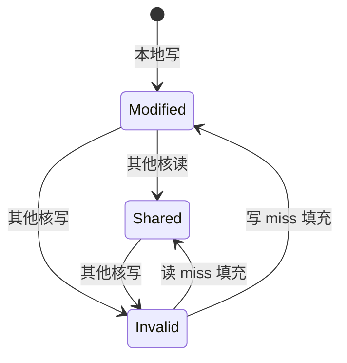
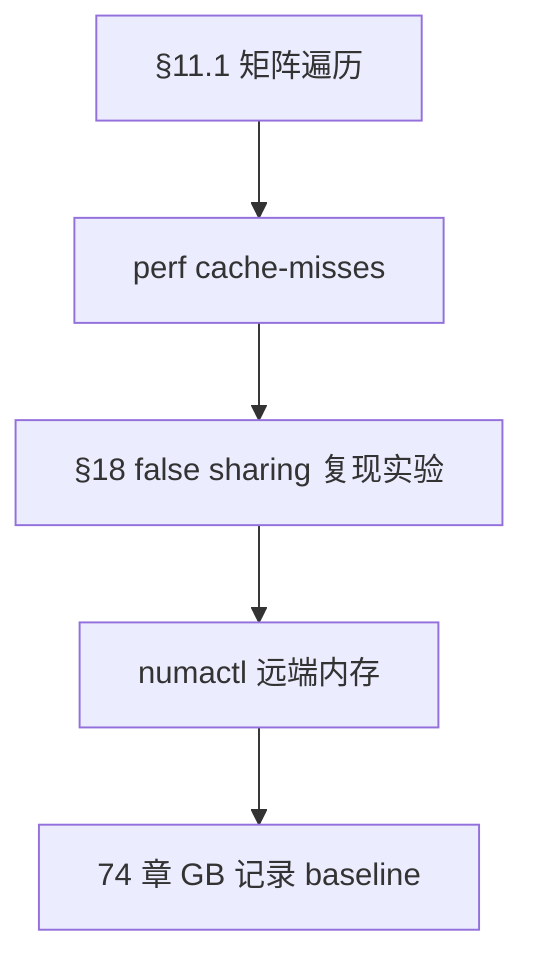

# 计算机体系结构深入学习

> **文件编码**：UTF-8。  
> **定位**：比 [22 章导读](22-计算机体系结构导读.md) 更 **教材化**——从 CPU 微架构、缓存一致性到 NUMA，建立定量直觉。  
> **交叉**：[18 章 内存对齐](18-高性能C++与内存对齐.md)、[25 章 无锁](25-无锁编程与内存序.md)、[74 章 性能工程](74-性能工程方法论与基准测试.md)。

## §0 读前导读

### §0.1 用一句话弄懂本章

**CPU 在时钟驱动下流水线取指/译码/执行**；cache 用 locality 换 latency；多核用 MESI 维护一致性；NUMA 让「本地内存」比远端快——写高性能 C++ 必须把这些算进模型。

### §0.2 你需要提前知道什么

- [22 章](22-计算机体系结构导读.md) 存储层次速览
- [18 章](18-高性能C++与内存对齐.md) cache line、false sharing
- [08 章](08-多线程与并发编程.md) 线程与绑核
- 基础代数与位运算

### §0.3 本章知识地图（☐→☑）

- [ ] 画出五级存储层次与数量级
- [ ] 解释流水线五阶段与 hazard
- [ ] 分支预测失败代价
- [ ] 乱序执行与内存序关系
- [ ] L1/L2/L3 容量与 latency 量级
- [ ] MESI 四状态转换
- [ ] NUMA 与 first-touch
- [ ] TLB 与 huge page
- [ ] 软件 prefetch 使用场景
- [ ] 闭卷自测 ≥8/10

### §0.4 建议学习时长

**6～8 天**（含 `perf stat` 实验）

### §0.5 学完你能做什么

解释 cache miss 对 QPS 影响；用 `numactl` 绑核绑内存；读 roofline（74 章）；避免 false sharing（18 章）。

### §0.6 交叉阅读

- [22 章 体系结构导读](22-计算机体系结构导读.md)
- [18 章 内存对齐](18-高性能C++与内存对齐.md)
- [25 章 内存序](25-无锁编程与内存序.md)
- [12 章 性能分析](12-性能分析与调试.md)

---

## 本章与上一章的关系

[69 章](69-编译原理入门与C++编译流程.md) 为本章铺垫；本章在其基础上 **原理化、教材化** 展开，与面试速记章互补而非重复。

---

## 1. 计算机抽象层与性能定义


```text
        应用 (C++/你的服务)
              ↓
        ISA  (x86-64 指令集)
              ↓
        微架构 (Zen4 / Raptor Cove)
              ↓
        电路 / 工艺 (nm, 频率)
```

**性能** = 延迟 × 吞吐量 × 功耗 × 成本 的多目标权衡。C++ 后端常关注 **P99 延迟** 与 **每核 QPS**。


## 2. CPU 流水线


经典五级流水线：


**结构冒险**：同一硬件资源冲突。**数据冒险**：RAW/WAR/WAW。**控制冒险**：分支未确定下一条 PC。

现代 CPU **深度流水线**（10+ 级）+ **超标量**（每 cycle 多条指令）→ 单核 IPC 可 >1，但 branch miss 可浪费 **10～20 cycle** 起。


## 3. 分支预测


```cpp
for (int i = 0; i < n; ++i) {
    if (data[i] > threshold)  // 模式可预测则 BP 命中高
        sum += data[i];
}
```

| 分支类型 | 预测难度 |
|----------|----------|
| 循环计数 | 易（taken） |
| 随机数据 | 难 |
| 函数指针/indirect | 更难 |

**优化启示**：排序后处理、branchless（`cmov`）、将冷路径拆函数（`-O2` 自动 cold splitting）。  
**与 74 章**：benchmark 需报告分支 miss（`perf stat -e branch-misses`）。


## 4. 乱序执行（OoO）


** Tomasulo / 保留站 **：在寄存器重命名后，无依赖指令可并行执行；**Store Buffer** 与 **Load Buffer** 维护内存操作顺序假象。

程序员仍见 **sequentially consistent 假象**（单线程）；多线程需 **内存模型**（[25 章](25-无锁编程与内存序.md)）。

```cpp
// 编译器+CPU 可能重排无关 store/load，除非 atomic/memory_order
std::atomic<int> flag{0};
int data = 0;
// thread1: data=42; flag=1;
// thread2: while(!flag); use(data);
```


## 5. Cache 层次 L1/L2/L3


| 层级 | 典型大小 | 延迟（cycle 量级） | 归属 |
|------|----------|-------------------|------|
| L1d | 32KB | ~4 | 每核 |
| L2 | 256KB～1MB | ~12 | 每核 |
| L3 | 8～64MB | ~40 | 共享 |
| DRAM | GB 级 | ~200+ | 全局 |

**Cache line** 通常 **64B**（[18 章](18-高性能C++与内存对齐.md)）。地址映射：**组相连**；替换：**LRU 近似**。

```cpp
//  stride 访问 vs 顺序访问
constexpr size_t STRIDE = 64; // 以 cache line 为步长 → miss 多
for (size_t i = 0; i < N; i += STRIDE)
    sum += arr[i];
```


## 6. MESI 缓存一致性


多核每核有 cache copy，**MESI** 协议维护一致性：



**False sharing**：两核写同一 line 不同字 → line 乒乓。修复：`alignas(64)` 分离热变量（18 章）。

**Lock 实现**：原子操作触发 bus lock 或 cache lock；高争用锁代价大（[08 章](08-多线程与并发编程.md)）。


## 7. NUMA 架构


多 socket 服务器：每 CPU 连接 **本地 DRAM**，访问远端 socket 内存 latency 更高。

```bash
numactl --hardware
numactl --cpunodebind=0 --membind=0 ./server
```

**First-touch 策略**：页框分配在 **首次写入** 的 NUMA 节点。线程迁移后可能远端访问——用 `mbind` 或 allocator（如 libnuma）。

与 [23 章 IO 多路复用](23-IO多路复用与高性能Server.md)：accept 线程与 worker 池分属不同 NUMA 时需规划。


## 8. TLB 与页表


虚拟地址 → **页表** → 物理地址；**TLB** 缓存页表项。

| 页大小 | TLB 覆盖范围 | 场景 |
|--------|--------------|------|
| 4KB | 小 | 通用 |
| 2MB huge page | 大 | 大堆、DPDK、数据库 buffer pool |

```bash
# Linux 透明大页
cat /sys/kernel/mm/transparent_hugepage/enabled
```

**缺页** 与 TLB miss 不同：缺页走 OS（71 章）；TLB miss 仍可能 hit 页表于 cache/内存。


## 9. 硬件 Prefetch


CPU **硬件预取器** 识别 stride/stream；**软件 prefetch**：

```cpp
#include <xmmintrin.h>  // SSE
for (int i = 0; i < n; ++i) {
    _mm_prefetch((const char*)&data[i + 8], _MM_HINT_T0);
    process(data[i]);
}
```

过早/错误 prefetch 污染 cache。**`_mm_clflush`** 一般仅 debug，生产慎用。


## 10. 与 C++ 内存模型的衔接


C++11 起 **memory_order** 映射到 CPU barrier 指令：

| order | x86 典型指令 |
|-------|--------------|
| relaxed | 普通 load/store |
| acquire/release | 无单独指令（TSO 较强） |
| seq_cst | `mfence` 等 |

ARM/RISC-V 更弱，移植无锁代码需格外小心（25 章）。


## 11. 延迟数量级与「算帐」方法

### 11.0.1 为何需要数量级直觉

性能优化不是玄学：把操作换算成 **cycle 或纳秒**，才能判断优化是否值得。下表为 **2020 年代桌面/服务器 x86** 的典型量级（具体随 CPU/频率变化，请用 `lscpu`、`/proc/cpuinfo` 与 microbenchmark 校准）。

| 操作 | 延迟（量级） | 备注 |
|------|--------------|------|
| L1 hit | ~4 cycle | 约 1～2 ns @ 3GHz |
| L2 hit | ~12 cycle | |
| L3 hit | ~40 cycle | 共享 L3 有争用 |
| DRAM | ~200 cycle | ~60～100 ns |
| NUMA 远端 DRAM | +50～100 ns | 相对本地 |
| 分支 mispredict | ~15～20 cycle | 与流水线深度相关 |
| `mutex` 无争用 | ~20～50 ns | futex 快路径 |
| `mutex` 高争用 | μs 级 | 陷入内核调度 |
| 系统调用 | ~100 ns～μs | 视 syscall 而定 |
| NVMe 随机读 | ~10～100 μs | |
| 千兆网 RTT | ~0.1 ms 起 | 与距离/负载相关 |

**算帐示例**：若热循环每迭代多 1 次 L3 miss（~40 cycle），迭代 1e8 次 → 多 4e9 cycle；@ 3GHz 约 **1.3 秒**。这解释了 [18 章](18-高性能C++与内存对齐.md) 数据结构布局为何常比微优化指令更重要。

### 11.0.2 CPU 拓扑与 `lscpu`

```bash
lscpu
# CPU(s), Thread(s) per core, Core(s) per socket, Socket(s)
# NUMA node(s), L1d/L2/L3 cache
```

```text
Socket 0 ── NUMA node 0 ── Core 0..N ── (可选 SMT 线程)
Socket 1 ── NUMA node 1 ── ...
```

绑核示例（与 [08 章](08-多线程与并发编程.md) 线程池配合）：

```bash
taskset -c 0-7 ./compute_worker    # 物理核 0～7
numactl --cpunodebind=0 --membind=0 ./server
```

### 11.0.3 Roofline 预告（详见 74 章）

**算术强度** AI = FLOP / Byte moved。点乘 $c += a[i]*b[i]$：2 FLOP（乘+加）/ 读 16B（两个 double）→ AI ≈ 0.125 FLOP/B，往往 **内存 bound**。


[74 章 Roofline](74-性能工程方法论与基准测试.md) 把本章硬件约束与 benchmark 连接；[22 章](22-计算机体系结构导读.md) 提供 LLM/GPU 视角对照。

### 11.0.4 与 C++ 容器访问模式

| 容器操作 | 局部性 | 注意 |
|----------|--------|------|
| `vector` 顺序遍历 | 优 | 首选热路径 |
| `unordered_map` 查找 | 随机 | pointer chasing，AI 低 |
| `list` 遍历 | 差 | 节点分散堆上 |
| `deque` 分段 | 中等 | 比 list 好 |

[44 章 vector 原理](44-vector-deque-string容器原理与实务.md) 的连续存储直接服务 cache；选型错误时，CPU 微优化收益有限。

### 11.0.5 本章实验路线建议



建议实验笔记包含：**硬件型号、编译 flags、N 值、median 三次运行**。避免只报一次结果（74 章统计原则）。


## 12. 定量练习：局部性与带宽


#### 11.1.1 实验设定

设矩阵 $N \times N$，`double` 元素，行优先存储。测 **行优先** vs **列优先** 遍历时间（[22 章](22-计算机体系结构导读.md) 已有直觉，此处补推导）。

#### 11.1.2 推导

行优先访问步长 1 个 `double`（8B），连续填满 cache line（64B → 8 元素/line），**空间局部性** 优。列优先步长 $N \times 8$ 字节，每元素新 line → working set 爆炸。

#### 11.1.3 代码骨架

```cpp
#include <vector>
#include <chrono>
#include <iostream>
void bench(bool row_major_inner) {
    const int N = 1024;
    std::vector<double> a(N*N, 1.0);
    auto t0 = std::chrono::steady_clock::now();
    double s = 0;
    if (row_major_inner)
        for (int i = 0; i < N; ++i)
            for (int j = 0; j < N; ++j) s += a[i*N+j];
    else
        for (int j = 0; j < N; ++j)
            for (int i = 0; i < N; ++i) s += a[i*N+j];
    auto ms = std::chrono::duration<double, std::milli>(
        std::chrono::steady_clock::now()-t0).count();
    std::cout << (row_major_inner?"row":"col") << " " << ms << " ms\n";
}
```

#### 11.1.4 perf 观测

```bash
perf stat -e cycles,cache-misses,L1-dcache-load-misses ./bench
```

#### 11.1.5 结论模板

记录 speedup 比值 $\approx$ **5～20×**（随 N 与 CPU 变）。写入 [74 章](74-性能工程方法论与基准测试.md) 实验笔记。


## 11.2 定量练习：局部性与带宽 #2


#### 11.2.1 实验设定

设矩阵 $N \times N$，`double` 元素，行优先存储。测 **行优先** vs **列优先** 遍历时间（[22 章](22-计算机体系结构导读.md) 已有直觉，此处补推导）。

#### 11.2.2 推导

行优先访问步长 1 个 `double`（8B），连续填满 cache line（64B → 8 元素/line），**空间局部性** 优。列优先步长 $N \times 8$ 字节，每元素新 line → working set 爆炸。

#### 11.2.3 代码骨架

```cpp
#include <vector>
#include <chrono>
#include <iostream>
void bench(bool row_major_inner) {
    const int N = 1024;
    std::vector<double> a(N*N, 1.0);
    auto t0 = std::chrono::steady_clock::now();
    double s = 0;
    if (row_major_inner)
        for (int i = 0; i < N; ++i)
            for (int j = 0; j < N; ++j) s += a[i*N+j];
    else
        for (int j = 0; j < N; ++j)
            for (int i = 0; i < N; ++i) s += a[i*N+j];
    auto ms = std::chrono::duration<double, std::milli>(
        std::chrono::steady_clock::now()-t0).count();
    std::cout << (row_major_inner?"row":"col") << " " << ms << " ms\n";
}
```

#### 11.2.4 perf 观测

```bash
perf stat -e cycles,cache-misses,L1-dcache-load-misses ./bench
```

#### 11.2.5 结论模板

记录 speedup 比值 $\approx$ **5～20×**（随 N 与 CPU 变）。写入 [74 章](74-性能工程方法论与基准测试.md) 实验笔记。


## 11.3 定量练习：局部性与带宽 #3


#### 11.3.1 实验设定

设矩阵 $N \times N$，`double` 元素，行优先存储。测 **行优先** vs **列优先** 遍历时间（[22 章](22-计算机体系结构导读.md) 已有直觉，此处补推导）。

#### 11.3.2 推导

行优先访问步长 1 个 `double`（8B），连续填满 cache line（64B → 8 元素/line），**空间局部性** 优。列优先步长 $N \times 8$ 字节，每元素新 line → working set 爆炸。

#### 11.3.3 代码骨架

```cpp
#include <vector>
#include <chrono>
#include <iostream>
void bench(bool row_major_inner) {
    const int N = 1024;
    std::vector<double> a(N*N, 1.0);
    auto t0 = std::chrono::steady_clock::now();
    double s = 0;
    if (row_major_inner)
        for (int i = 0; i < N; ++i)
            for (int j = 0; j < N; ++j) s += a[i*N+j];
    else
        for (int j = 0; j < N; ++j)
            for (int i = 0; i < N; ++i) s += a[i*N+j];
    auto ms = std::chrono::duration<double, std::milli>(
        std::chrono::steady_clock::now()-t0).count();
    std::cout << (row_major_inner?"row":"col") << " " << ms << " ms\n";
}
```

#### 11.3.4 perf 观测

```bash
perf stat -e cycles,cache-misses,L1-dcache-load-misses ./bench
```

#### 11.3.5 结论模板

记录 speedup 比值 $\approx$ **5～20×**（随 N 与 CPU 变）。写入 [74 章](74-性能工程方法论与基准测试.md) 实验笔记。


## 11.4 定量练习：局部性与带宽 #4


#### 11.4.1 实验设定

设矩阵 $N \times N$，`double` 元素，行优先存储。测 **行优先** vs **列优先** 遍历时间（[22 章](22-计算机体系结构导读.md) 已有直觉，此处补推导）。

#### 11.4.2 推导

行优先访问步长 1 个 `double`（8B），连续填满 cache line（64B → 8 元素/line），**空间局部性** 优。列优先步长 $N \times 8$ 字节，每元素新 line → working set 爆炸。

#### 11.4.3 代码骨架

```cpp
#include <vector>
#include <chrono>
#include <iostream>
void bench(bool row_major_inner) {
    const int N = 1024;
    std::vector<double> a(N*N, 1.0);
    auto t0 = std::chrono::steady_clock::now();
    double s = 0;
    if (row_major_inner)
        for (int i = 0; i < N; ++i)
            for (int j = 0; j < N; ++j) s += a[i*N+j];
    else
        for (int j = 0; j < N; ++j)
            for (int i = 0; i < N; ++i) s += a[i*N+j];
    auto ms = std::chrono::duration<double, std::milli>(
        std::chrono::steady_clock::now()-t0).count();
    std::cout << (row_major_inner?"row":"col") << " " << ms << " ms\n";
}
```

#### 11.4.4 perf 观测

```bash
perf stat -e cycles,cache-misses,L1-dcache-load-misses ./bench
```

#### 11.4.5 结论模板

记录 speedup 比值 $\approx$ **5～20×**（随 N 与 CPU 变）。写入 [74 章](74-性能工程方法论与基准测试.md) 实验笔记。


## 11.5 定量练习：局部性与带宽 #5


#### 11.5.1 实验设定

设矩阵 $N \times N$，`double` 元素，行优先存储。测 **行优先** vs **列优先** 遍历时间（[22 章](22-计算机体系结构导读.md) 已有直觉，此处补推导）。

#### 11.5.2 推导

行优先访问步长 1 个 `double`（8B），连续填满 cache line（64B → 8 元素/line），**空间局部性** 优。列优先步长 $N \times 8$ 字节，每元素新 line → working set 爆炸。

#### 11.5.3 代码骨架

```cpp
#include <vector>
#include <chrono>
#include <iostream>
void bench(bool row_major_inner) {
    const int N = 1024;
    std::vector<double> a(N*N, 1.0);
    auto t0 = std::chrono::steady_clock::now();
    double s = 0;
    if (row_major_inner)
        for (int i = 0; i < N; ++i)
            for (int j = 0; j < N; ++j) s += a[i*N+j];
    else
        for (int j = 0; j < N; ++j)
            for (int i = 0; i < N; ++i) s += a[i*N+j];
    auto ms = std::chrono::duration<double, std::milli>(
        std::chrono::steady_clock::now()-t0).count();
    std::cout << (row_major_inner?"row":"col") << " " << ms << " ms\n";
}
```

#### 11.5.4 perf 观测

```bash
perf stat -e cycles,cache-misses,L1-dcache-load-misses ./bench
```

#### 11.5.5 结论模板

记录 speedup 比值 $\approx$ **5～20×**（随 N 与 CPU 变）。写入 [74 章](74-性能工程方法论与基准测试.md) 实验笔记。


## 11.6 定量练习：局部性与带宽 #6


#### 11.6.1 实验设定

设矩阵 $N \times N$，`double` 元素，行优先存储。测 **行优先** vs **列优先** 遍历时间（[22 章](22-计算机体系结构导读.md) 已有直觉，此处补推导）。

#### 11.6.2 推导

行优先访问步长 1 个 `double`（8B），连续填满 cache line（64B → 8 元素/line），**空间局部性** 优。列优先步长 $N \times 8$ 字节，每元素新 line → working set 爆炸。

#### 11.6.3 代码骨架

```cpp
#include <vector>
#include <chrono>
#include <iostream>
void bench(bool row_major_inner) {
    const int N = 1024;
    std::vector<double> a(N*N, 1.0);
    auto t0 = std::chrono::steady_clock::now();
    double s = 0;
    if (row_major_inner)
        for (int i = 0; i < N; ++i)
            for (int j = 0; j < N; ++j) s += a[i*N+j];
    else
        for (int j = 0; j < N; ++j)
            for (int i = 0; i < N; ++i) s += a[i*N+j];
    auto ms = std::chrono::duration<double, std::milli>(
        std::chrono::steady_clock::now()-t0).count();
    std::cout << (row_major_inner?"row":"col") << " " << ms << " ms\n";
}
```

#### 11.6.4 perf 观测

```bash
perf stat -e cycles,cache-misses,L1-dcache-load-misses ./bench
```

#### 11.6.5 结论模板

记录 speedup 比值 $\approx$ **5～20×**（随 N 与 CPU 变）。写入 [74 章](74-性能工程方法论与基准测试.md) 实验笔记。


## 11.7 定量练习：局部性与带宽 #7


#### 11.7.1 实验设定

设矩阵 $N \times N$，`double` 元素，行优先存储。测 **行优先** vs **列优先** 遍历时间（[22 章](22-计算机体系结构导读.md) 已有直觉，此处补推导）。

#### 11.7.2 推导

行优先访问步长 1 个 `double`（8B），连续填满 cache line（64B → 8 元素/line），**空间局部性** 优。列优先步长 $N \times 8$ 字节，每元素新 line → working set 爆炸。

#### 11.7.3 代码骨架

```cpp
#include <vector>
#include <chrono>
#include <iostream>
void bench(bool row_major_inner) {
    const int N = 1024;
    std::vector<double> a(N*N, 1.0);
    auto t0 = std::chrono::steady_clock::now();
    double s = 0;
    if (row_major_inner)
        for (int i = 0; i < N; ++i)
            for (int j = 0; j < N; ++j) s += a[i*N+j];
    else
        for (int j = 0; j < N; ++j)
            for (int i = 0; i < N; ++i) s += a[i*N+j];
    auto ms = std::chrono::duration<double, std::milli>(
        std::chrono::steady_clock::now()-t0).count();
    std::cout << (row_major_inner?"row":"col") << " " << ms << " ms\n";
}
```

#### 11.7.4 perf 观测

```bash
perf stat -e cycles,cache-misses,L1-dcache-load-misses ./bench
```

#### 11.7.5 结论模板

记录 speedup 比值 $\approx$ **5～20×**（随 N 与 CPU 变）。写入 [74 章](74-性能工程方法论与基准测试.md) 实验笔记。


## 11.8 定量练习：局部性与带宽 #8


#### 11.8.1 实验设定

设矩阵 $N \times N$，`double` 元素，行优先存储。测 **行优先** vs **列优先** 遍历时间（[22 章](22-计算机体系结构导读.md) 已有直觉，此处补推导）。

#### 11.8.2 推导

行优先访问步长 1 个 `double`（8B），连续填满 cache line（64B → 8 元素/line），**空间局部性** 优。列优先步长 $N \times 8$ 字节，每元素新 line → working set 爆炸。

#### 11.8.3 代码骨架

```cpp
#include <vector>
#include <chrono>
#include <iostream>
void bench(bool row_major_inner) {
    const int N = 1024;
    std::vector<double> a(N*N, 1.0);
    auto t0 = std::chrono::steady_clock::now();
    double s = 0;
    if (row_major_inner)
        for (int i = 0; i < N; ++i)
            for (int j = 0; j < N; ++j) s += a[i*N+j];
    else
        for (int j = 0; j < N; ++j)
            for (int i = 0; i < N; ++i) s += a[i*N+j];
    auto ms = std::chrono::duration<double, std::milli>(
        std::chrono::steady_clock::now()-t0).count();
    std::cout << (row_major_inner?"row":"col") << " " << ms << " ms\n";
}
```

#### 11.8.4 perf 观测

```bash
perf stat -e cycles,cache-misses,L1-dcache-load-misses ./bench
```

#### 11.8.5 结论模板

记录 speedup 比值 $\approx$ **5～20×**（随 N 与 CPU 变）。写入 [74 章](74-性能工程方法论与基准测试.md) 实验笔记。


## 11.9 定量练习：局部性与带宽 #9


#### 11.9.1 实验设定

设矩阵 $N \times N$，`double` 元素，行优先存储。测 **行优先** vs **列优先** 遍历时间（[22 章](22-计算机体系结构导读.md) 已有直觉，此处补推导）。

#### 11.9.2 推导

行优先访问步长 1 个 `double`（8B），连续填满 cache line（64B → 8 元素/line），**空间局部性** 优。列优先步长 $N \times 8$ 字节，每元素新 line → working set 爆炸。

#### 11.9.3 代码骨架

```cpp
#include <vector>
#include <chrono>
#include <iostream>
void bench(bool row_major_inner) {
    const int N = 1024;
    std::vector<double> a(N*N, 1.0);
    auto t0 = std::chrono::steady_clock::now();
    double s = 0;
    if (row_major_inner)
        for (int i = 0; i < N; ++i)
            for (int j = 0; j < N; ++j) s += a[i*N+j];
    else
        for (int j = 0; j < N; ++j)
            for (int i = 0; i < N; ++i) s += a[i*N+j];
    auto ms = std::chrono::duration<double, std::milli>(
        std::chrono::steady_clock::now()-t0).count();
    std::cout << (row_major_inner?"row":"col") << " " << ms << " ms\n";
}
```

#### 11.9.4 perf 观测

```bash
perf stat -e cycles,cache-misses,L1-dcache-load-misses ./bench
```

#### 11.9.5 结论模板

记录 speedup 比值 $\approx$ **5～20×**（随 N 与 CPU 变）。写入 [74 章](74-性能工程方法论与基准测试.md) 实验笔记。


## 11.10 定量练习：局部性与带宽 #10


#### 11.10.1 实验设定

设矩阵 $N \times N$，`double` 元素，行优先存储。测 **行优先** vs **列优先** 遍历时间（[22 章](22-计算机体系结构导读.md) 已有直觉，此处补推导）。

#### 11.10.2 推导

行优先访问步长 1 个 `double`（8B），连续填满 cache line（64B → 8 元素/line），**空间局部性** 优。列优先步长 $N \times 8$ 字节，每元素新 line → working set 爆炸。

#### 11.10.3 代码骨架

```cpp
#include <vector>
#include <chrono>
#include <iostream>
void bench(bool row_major_inner) {
    const int N = 1024;
    std::vector<double> a(N*N, 1.0);
    auto t0 = std::chrono::steady_clock::now();
    double s = 0;
    if (row_major_inner)
        for (int i = 0; i < N; ++i)
            for (int j = 0; j < N; ++j) s += a[i*N+j];
    else
        for (int j = 0; j < N; ++j)
            for (int i = 0; i < N; ++i) s += a[i*N+j];
    auto ms = std::chrono::duration<double, std::milli>(
        std::chrono::steady_clock::now()-t0).count();
    std::cout << (row_major_inner?"row":"col") << " " << ms << " ms\n";
}
```

#### 11.10.4 perf 观测

```bash
perf stat -e cycles,cache-misses,L1-dcache-load-misses ./bench
```

#### 11.10.5 结论模板

记录 speedup 比值 $\approx$ **5～20×**（随 N 与 CPU 变）。写入 [74 章](74-性能工程方法论与基准测试.md) 实验笔记。


## 11.11 定量练习：局部性与带宽 #11


#### 11.11.1 实验设定

设矩阵 $N \times N$，`double` 元素，行优先存储。测 **行优先** vs **列优先** 遍历时间（[22 章](22-计算机体系结构导读.md) 已有直觉，此处补推导）。

#### 11.11.2 推导

行优先访问步长 1 个 `double`（8B），连续填满 cache line（64B → 8 元素/line），**空间局部性** 优。列优先步长 $N \times 8$ 字节，每元素新 line → working set 爆炸。

#### 11.11.3 代码骨架

```cpp
#include <vector>
#include <chrono>
#include <iostream>
void bench(bool row_major_inner) {
    const int N = 1024;
    std::vector<double> a(N*N, 1.0);
    auto t0 = std::chrono::steady_clock::now();
    double s = 0;
    if (row_major_inner)
        for (int i = 0; i < N; ++i)
            for (int j = 0; j < N; ++j) s += a[i*N+j];
    else
        for (int j = 0; j < N; ++j)
            for (int i = 0; i < N; ++i) s += a[i*N+j];
    auto ms = std::chrono::duration<double, std::milli>(
        std::chrono::steady_clock::now()-t0).count();
    std::cout << (row_major_inner?"row":"col") << " " << ms << " ms\n";
}
```

#### 11.11.4 perf 观测

```bash
perf stat -e cycles,cache-misses,L1-dcache-load-misses ./bench
```

#### 11.11.5 结论模板

记录 speedup 比值 $\approx$ **5～20×**（随 N 与 CPU 变）。写入 [74 章](74-性能工程方法论与基准测试.md) 实验笔记。


## 练习题

### 练习 A（概念推导）

1. 画出五级存储层次，标注 latency 数量级。
2. 解释一次 branch mispredict 为何浪费十余 cycle。
3. 用 MESI 说明 false sharing 如何发生。

### 练习 B（动手验证）

4. 运行 §11.1 矩阵遍历 benchmark，记录 row vs col 耗时比。
5. `perf stat -e cache-misses,cycles` 对比两种遍历。
6. `numactl --hardware` 查看本机 NUMA 拓扑。

### 练习 C（与 C++ 结合）

7. 对 [18 章](18-高性能C++与内存对齐.md) 的 `alignas(64)` 结构做多线程写实验。
8. 用 `std::atomic` 与 plain int 对比争用（[25 章](25-无锁编程与内存序.md)）。
9. 将结果写入 [74 章](74-性能工程方法论与基准测试.md) 实验笔记。

<details>
<summary>练习提示</summary>

原理章重在预测—验证；NUMA 实验在单 socket 机器上可能看不出差异，属正常。

</details>

---

## FAQ

**Q：L1 指令 cache 和数据 cache 分开吗？**

现代 x86 多为 **Harvard 式 L1I/L1D 分离**；L2/L3 通常统一。

**Q：超线程 worth it？**

计算 bound 任务常关闭或绑物理核；IO bound 混合负载可能受益。

**Q：MESI 和 MESIF/MOESI？**

Intel 等扩展 F/O 状态优化转发；原理仍基于共享无效化。

**Q：用户态能控制 cache 吗？**

x86 `clflushopt/clwb` 有限；多数靠数据布局与 affinity。

**Q：70 与 22 章如何选读？**

22 快速建立地图；70 系统推导与实验，二者配合。

---

## 闭卷自测

1. 五级流水线阶段？
2. 控制 hazard 来源？
3. L3 通常共享还是每核？
4. MESI 中 E 状态含义？
5. false sharing 根因？
6. NUMA first-touch？
7. TLB 作用？
8. 硬件 prefetch 识别什么模式？
9. OoO 对单线程语义？
10. 70 与 18 章关系？

<details>
<summary>参考答案</summary>

1. IF/ID/EX/MEM/WB
2. 分支/跳转改变 PC
3. 多核共享 L3
4. Exclusive 干净且仅本 cache 有副本
5. 不同变量同 cache line 写导致 line 乒乓
6. 页首次被写时分配在 local 节点
7. 缓存虚拟→物理页映射
8. stride/stream 等
9. 仍表现为程序顺序结果（单线程）
10. 18 讲对齐避免 false sharing；70 讲 MESI 协议根因

</details>

---

## 下一章预告

[71 章](71-操作系统原理深入学习.md) 将继续本系列 **原理链** 的下一环。

---

*下一章：71 操作系统原理深入学习*
